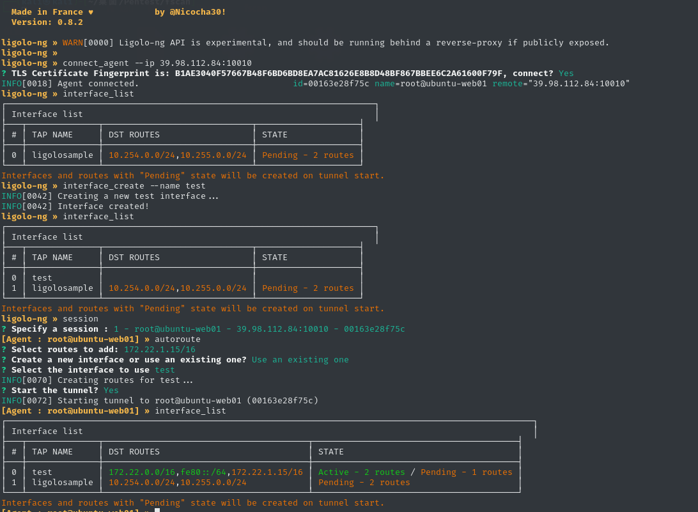
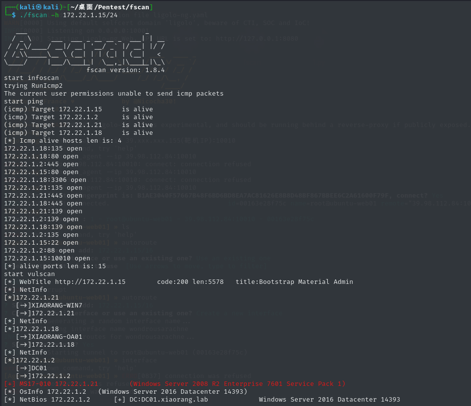
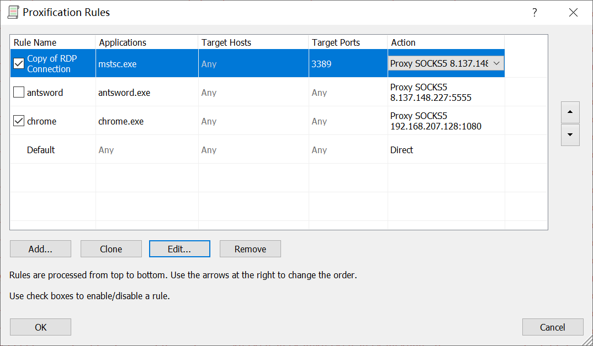
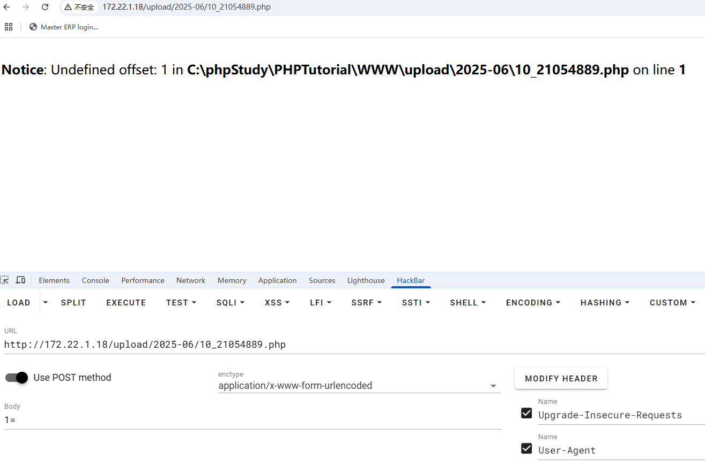
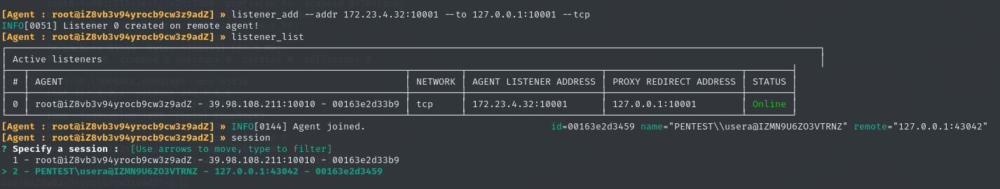
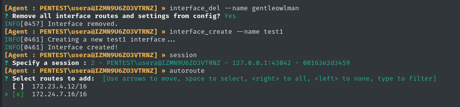
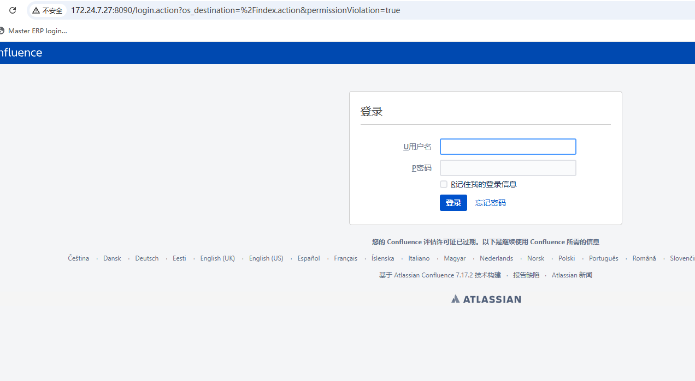

+++
title = "Ligolo-ng搭建内网TUN模式代理"
slug = "ligolo-ng-intranet-tun-proxy-setup"
description = "非常好用的代理工具"
date = "2025-06-09T20:52:43"
lastmod = "2025-06-09T20:52:43"
image = ""
license = ""
categories = ["talk"]
tags = ["工具"]
+++

https://github.com/nicocha30/ligolo-ng/

## 说在前面

今天玩云镜的时候，和Byxs20师傅一起打了一个靶场，聊了聊一些工具，他给我推荐了这个来搭建代理，其实本来不是很情愿使用这个东西的，但是他toDesk给我硬塞了，分享到SU群里面，原来eson哥早就告诉我了这个东西，那现在来写写命令(方便以后渗透的时候CP)吧~

## 正向代理

首先在靶机开启监听等待连接

```bash
nohup ./agent -bind 0.0.0.0:10010 > agent.log 2>&1 &
```

本地kali运行

```bash
sudo ./proxy -selfcert -laddr "0.0.0.0:10001"


# IP为靶机IP
connect_agent --ip 39.98.112.84:10010
```

然后我们创建一个网卡即可

```bash
## 得知命令使用
help

# 列出网卡
interface_list

interface_create --name test
session
autoroute
```



随便测试一下试试

```
./fscan -h 172.22.1.15/24
```



确实成功了

## 开启socks

https://github.com/ginuerzh/gost 利用gost开启

```bash
nohup ./gost -L=socks://:1080 > gost.log 2>&1 &

# 查看是否开启
ss -luntp
```

接下来拿到本地IP即可，需要是宿主机和虚拟机能够互通的，NAT的虚拟机和宿主机不是一个网段的，这里直接给虚拟机添加一个网卡即可，然后正常代理





## 多层代理

其实细心的同学已经发现了，这玩意就和stowaway差不多，所以依旧是正向+多层反向即可，在我们已经得到第一个网段的控制权，想要继续深入时，那么先添加一个监听

```bash
# 172.23.4.32为第一个网段控制机内网IP
listener_add --addr 172.23.4.32:10001 --to 127.0.0.1:10001 --tcp
```

在第二个网段的入口机进行反向链接即可

```bash
.\agent.exe -connect 172.23.4.32:10001 -ignore-cert
session
```



回到控制端添加新网卡

```bash
interface_create --name test1

autoroute
```



这里就体现一个比较强大的功能了，虽然我们使用的是不同的网卡，但是一个socks5就可以通往所有网段，



## 收尾工作(删除网卡)

```bash
interface_del --name test 
interface_del --name test1
```

## 小结

解决了一些go语言编写的工具由于底层代码原因无法使用socks代理的问题，速度也是真的快，只不过这个工具其实还有缺点就是无法成功去一直搭建正向代理，和stowaway一样，不过我知道一个工具可以，Vshell，那玩意操作异常简单，所以大家自己随便玩玩就会了，中途‎Byxs20师傅帮我远程了两次，因为这东西网上资料太少了

爱你B神
