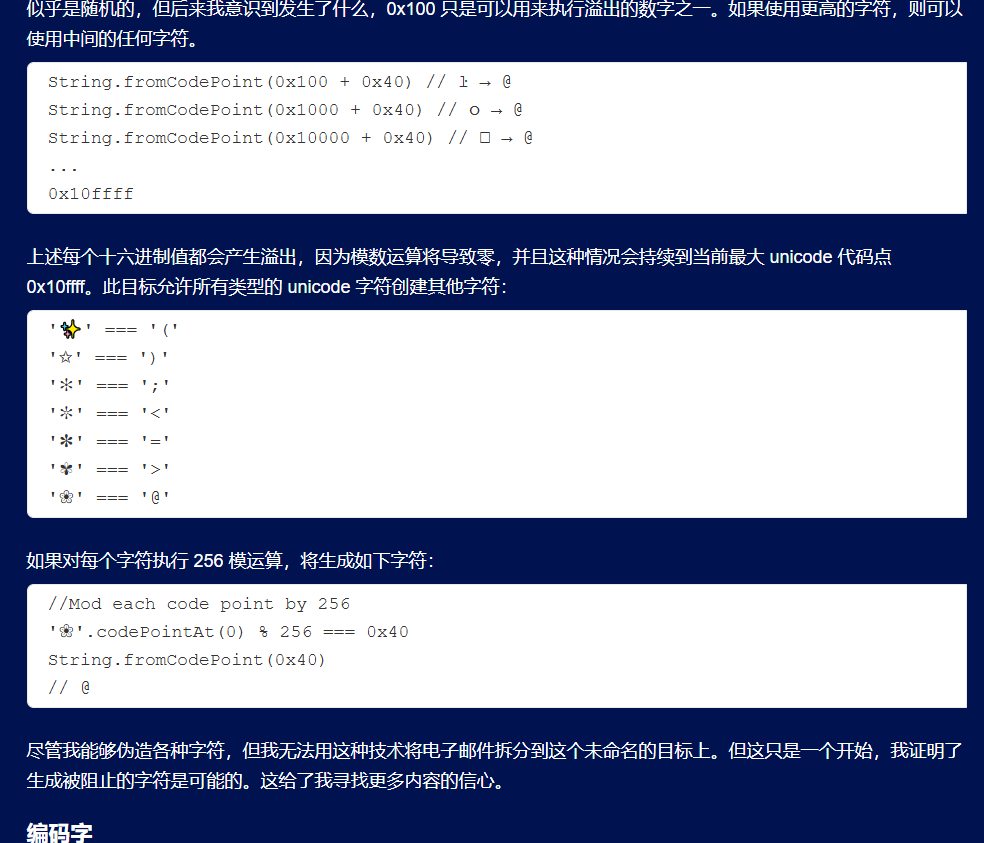
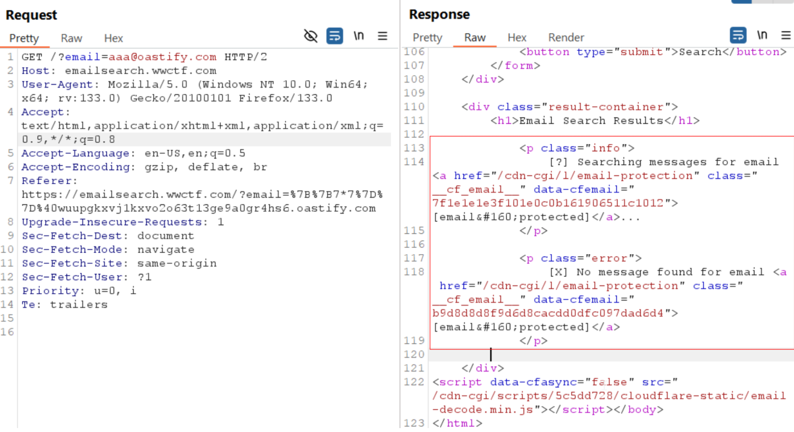
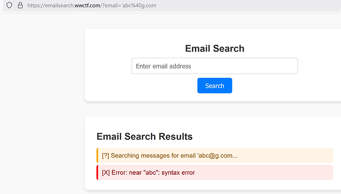
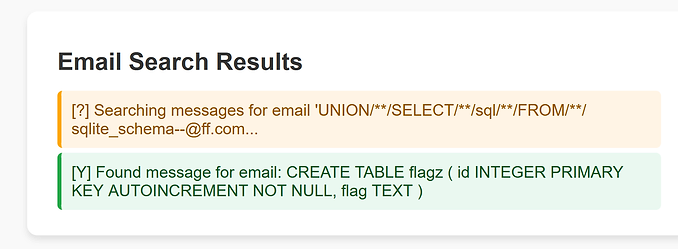
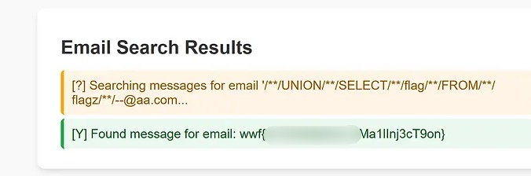

+++
title = "WorldWideCTF2024"
slug = "worldwidectf2024"
description = ""
date = "2024-12-04T10:34:28"
lastmod = "2024-12-04T10:34:28"
image = ""
license = ""
categories = ["赛题"]
tags = ["sqlite"]
+++

# 0x01 前言

注册saarCTF的同时我也注册了这个但是最后没打，不过赛后看到wp的时候我觉得还是相当的有意思的一些题目

# 0x02 question

## World Wide Email Search 

这道题的图片均来自这里[一位师傅](https://www.thesecuritywind.com/post/world-wide-ctf-2024-world-wide-email-search-web)

首先进入页面是进行邮件的检索，这里我们可以在网上查到一篇文章

[邮件安全问题](https://portswigger.net/research/splitting-the-email-atom)

其中有一篇重要的地方为由于解析器差异，导致了Unicode溢出，部分字符的自动转换绕过了黑名单



那么这里我们锁定后端服务是什么即可，一个框子，一般就是sql注入又或者是SSTI模版注入，还有可能是RCE，其他的我就不知道了，不过如何锁定呢，还是老本子了FUZZ，慢慢测，这里我们如果要进行SSTI，其中还需要满足的条件就是如何进行邮箱的有效性绕过，此处我们随意发包可以看到



这个服务进行编码避免被机器人抓取，测试时发现刚好就是上面那一篇文章中的`ŀ`会被转化会`l`，那么我们寻找特殊字符`'`会怎么被找出，其实很简单，在强网杯的拿到python注入的题目中我们也是这么绕过的，使用汉字的单引号即可



搜索这个报错发现是**SQLite**





```sqlite
‘or‘1‘=‘1‘--@bb.com

‘union/**/select/**/sql/**/from/**/sqlite_schema--@ff.com

‘union/**/select/**/flag/**/from/**/flagz--@aa.com
```

## 

