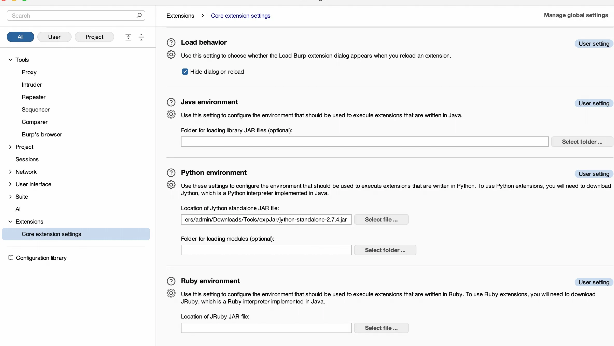
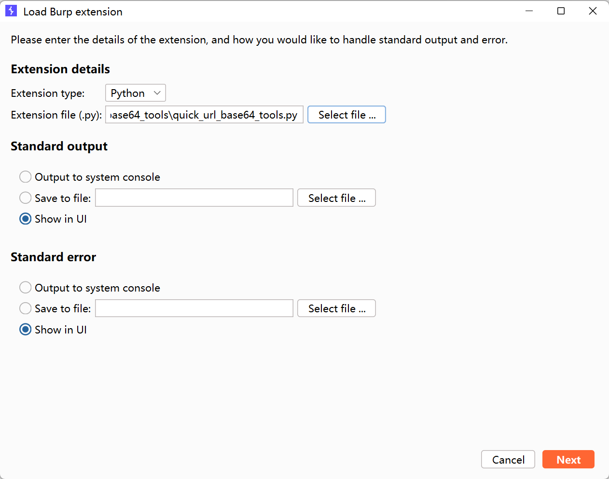

+++
title= "Burpsuite插件"
slug= "burpsuite-extensions"
description= ""
date= "2026-01-01T15:36:45+08:00"
lastmod= "2026-01-01T15:36:45+08:00"
image= ""
license= ""
categories= ["talk"]
tags= [""]

+++

戒了 yakit 之后发现burp有些方面确实没那么顺手，于是自己写了两个插件，个人觉得挺好用的，欢迎大家star，JPython 这个jar包也是官网的，可以直接使用，后续应该有需求还会继续写。

https://github.com/baozongwi/BurpExtensions

加载 JPython

add 插件

