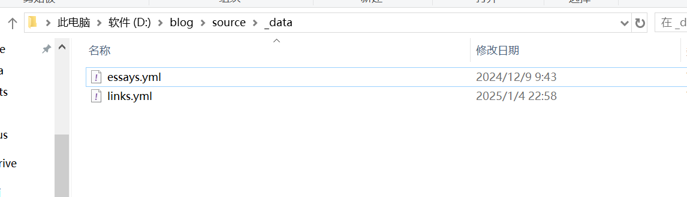
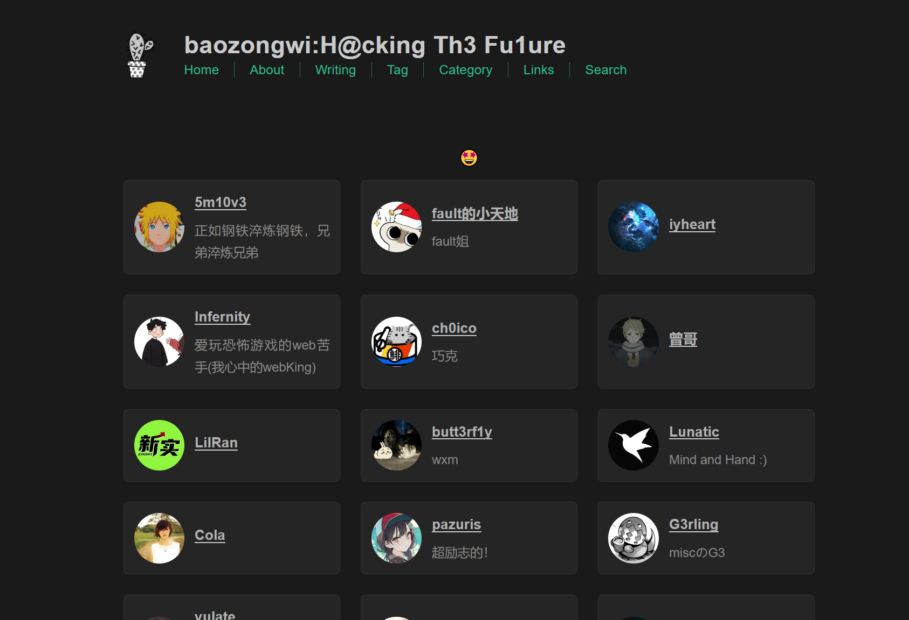
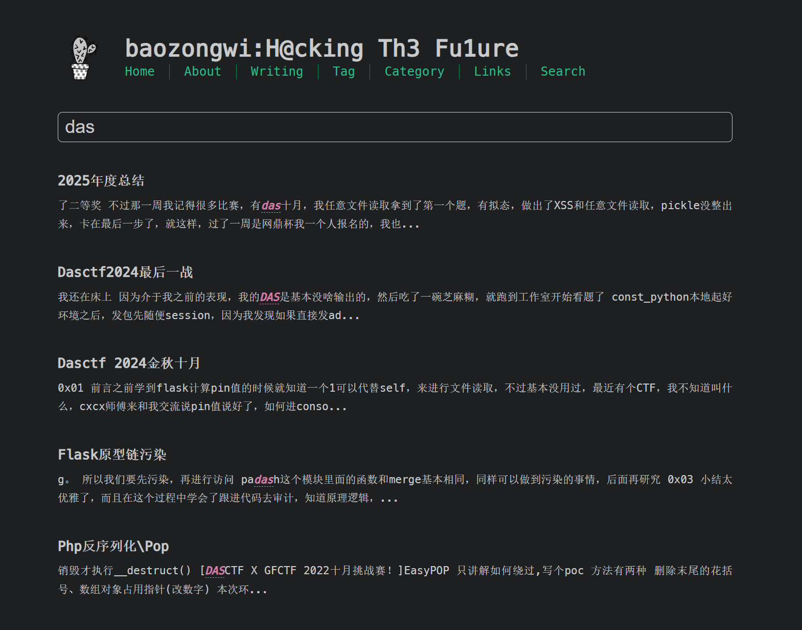
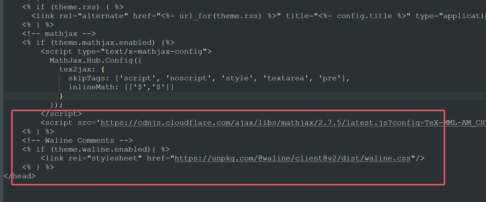
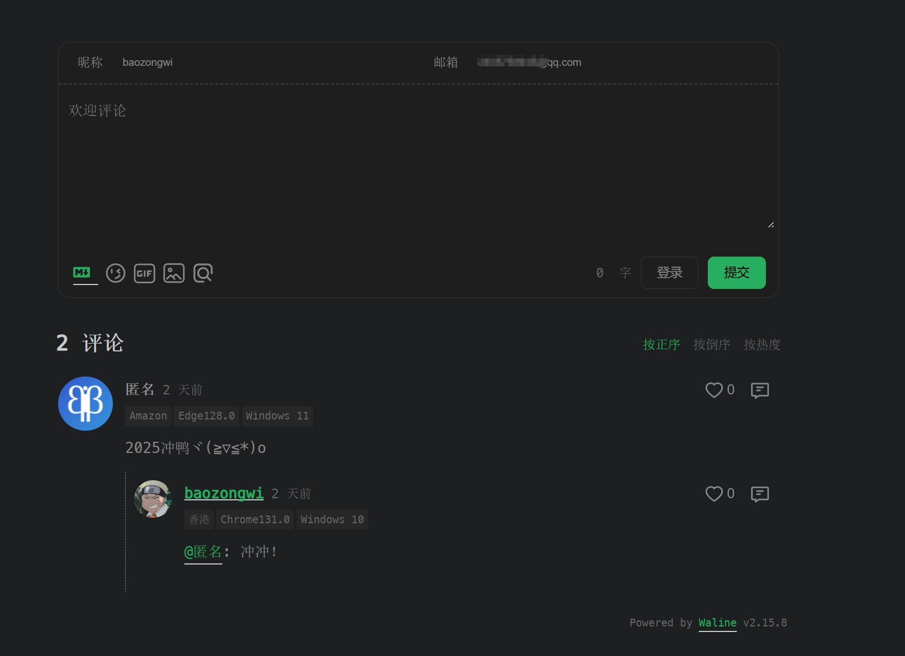

+++
title = "cactus主题优化使用"
slug = "cactus-theme-optimization"
description = "自定义了一些cactus的功能"
date = "2025-01-06T20:32:28"
lastmod = "2025-01-06T20:32:28"
image = ""
license = ""
categories = []
tags = ["小站"]
+++

# 0x01 前言

师傅们可以看到我的博客主题是已经换成了cactus，这个主题非常简洁但是基本的东西还是有的，就是有部分功能需要优化，譬如友链，评论等等，我在篇文章分享一下我是怎么做的，也算为大家省时间了

# 0x02 action

## 友链

首先在`blog/source/_data`里面新建一个`links.yml`，如果没有这个文件夹的话也要新建，



其中的格式是这样的

```yml
- links_category: 🤩
  has_thumbnail: false
  list: 
    - name: 狗and猫
      link: https://fushuling.com/
      description: 狗神嘞！
      avatar: https://fushuling-1309926051.cos.ap-shanghai.myqcloud.com/2022/08/QQ%E5%9B%BE%E7%89%8720220812001845.jpg
```

然后我们一样的新建页面

```
hexo new page links
```

其中把标明改成

```
title: links
layout: links
```

因为我们是使用的自己写的前端代码所以要使用layout，如果写type的话就不能那么好看了，代码如下

`blog/themes/cactus/layout/links.ejs`

```ejs
<!DOCTYPE html>
<html lang="en">
<head>
  <meta charset="UTF-8">
  <meta name="viewport" content="width=device-width, initial-scale=1.0">
  <title>友情链接</title>
  <style>
    body {
      background-color: #1a1a1a;
      color: #e0e0e0;
      font-family: Arial, sans-serif;
    }
    .links-container {
      display: flex;
      flex-wrap: wrap;
      gap: 20px;
      justify-content: center;
    }
    .friend-link {
      display: flex;
      align-items: center;
      width: calc(50% - 20px);
      height: auto;
      padding: 15px;
      border: 1px solid #333;
      border-radius: 8px;
      background-color: #252525;
      transition: all 0.2s ease;
      cursor: pointer;
      box-sizing: border-box;
    }

    .friend-link:hover {
      background-color: #333;
      z-index: 1;
    }

    .friend-link .avatar {
      width: 50px;
      height: 50px;
      border-radius: 50%;
      margin-right: 15px;
      border: 2px solid transparent;
    }
    .friend-link:hover .avatar {
      animation: rotateOnce 0.8s ease-out forwards;
      border-color: #555;
    }
    @keyframes rotateOnce {
      0% {
        transform: rotate(0deg);
      }
      100% {
        transform: rotate(360deg);
      }
    }
    .friend-link .info {
      flex-grow: 1;
    }
    .friend-link a {
      font-weight: bold;
      color: #b0b0b0;
      text-decoration: none;
      transition: all 0.2s ease;
      font-size: 1.1em;
    }
    .friend-link:hover a {
      color: #ffffff;
      text-shadow: 0 0 5px rgba(255, 255, 255, 0.3);
    }
    .friend-link p {
      margin: 8px 0 0;
      font-size: 0.9em;
      color: #888888;
      transition: all 0.2s ease;
    }
    .friend-link:hover p {
      color: #aaaaaa;
    }
    h2 {
      text-align: center;
      color: #c0c0c0;
      margin: 30px 0 20px;
    }
	@media (max-width: 768px) {
      .friend-link {
        width: 100%;
      }
    }

    @media (min-width: 769px) and (max-width: 1199px) {
      .friend-link {
        width: calc(50% - 20px);
      }
    }

    @media (min-width: 1200px) {
      .friend-link {
        width: calc(33.333% - 20px);
      }
    }

  </style>
</head>
<body>
  <% if (site.data && site.data.links) { %>
    <% 
      function shuffleArray(array) {
        for (let i = array.length - 1; i > 0; i--) {
          const j = Math.floor(Math.random() * (i + 1));
          [array[i], array[j]] = [array[j], array[i]];
        }
        return array;
      }
    %>
    <% site.data.links.forEach(function(category) { %>
      <h2><%= category.links_category %></h2>
      <% if (category.list && Array.isArray(category.list)) { %>
        <div class="links-container">
          <% shuffleArray(category.list).forEach(function(friend) { %>
            <div class="friend-link">
              " alt="<%= friend.name %>" class="avatar">
              <div class="info">
                <a href="<%= friend.link %>" target="_blank"><%= friend.name %></a>
                <p><%= friend.description %></p>
              </div>
            </div>
          <% }); %>
        </div>
      <% } else { %>
        <p>该分类下暂无友链。</p>
      <% } %>
    <% }); %>
  <% } else { %>
    <p>友链数据不可用。</p>
  <% } %>
</body>
</html>
```

我这里是使用了一个循环来进行随机友链如果不需要的话删除就可以了，最后的结果图应该是这样



## 阅读博客人数&&页尾

阅读博客人数这里就使用`busuanzi`，随便几行代码加进入即可，但是由于cactus原生的页尾是放不下那么多的，所以我们要改一下css，下面上代码

`D:\blog\themes\cactus\layout\_partial\footer.ejs`

```ejs

<footer id="footer">
    <div class="footer-left">
        <%= __('footer.copyright') %> ©
        <% var endYear = (theme.copyright && theme.copyright.end_year) ? theme.copyright.end_year : new Date().getFullYear() %>
        <% var startYear = (theme.copyright && theme.copyright.start_year) ? theme.copyright.start_year : new Date().getFullYear() %>
        <%= startYear >= endYear ? endYear : startYear + "-" + endYear %>
        <%= config.author || config.title %>
        <br>
        <a href="https://beian.miit.gov.cn/" target="_blank">蜀ICP备2024xxxxxx号</a>
    </div>
    
    <div class="footer-right">
        <nav>
            <ul>
                <% for (var i in theme.nav) { %><!--
                --><li><a href="<%- url_for(theme.nav[i]) %>"><%= __('nav.'+i).replace("nav.", "") %></a></li><!--
                --><% } %>
            </ul>
            <ul>
                <% if (theme.busuanzi && theme.busuanzi.enable){ %>
                <!-- 不蒜子统计 -->
                <span id="busuanzi_container_site_pv">本站总访问量<span id="busuanzi_value_site_pv"></span>次</span>
                <span class="post-meta-divider">|</span>
                <span id="busuanzi_container_site_uv" style='display:none'>本站访客数<span id="busuanzi_value_site_uv"></span>人</span>
                <script async src="//busuanzi.ibruce.info/busuanzi/2.3/busuanzi.pure.mini.js"></script>
                <% } %>
            </ul>
        </nav>
    </div>
</footer>
```

备案不需要的删除即可

`D:\blog\themes\cactus\source\css\_partial\footer.styl`

```css
#footer {
    padding: 20px 0; /* 调整上下内边距 */
    text-align: center; /* 水平居中 */
}

.footer-left, .footer-right {
    display: block; /* 设为块级元素，确保每个部分单独占一行 */
    margin: 10px 0; /* 设置上下外边距，分隔行 */
}

.footer-right nav ul {
    list-style: none; /* 去除列表样式 */
    padding: 0; /* 去除内边距 */
    margin: 0; /* 去除外边距 */
}

.footer-right nav ul li {
    display: inline; /* 水平排列导航项 */
    margin-right: 15px; /* 每个导航项之间的间隔 */
}

.footer-right nav ul li:last-child {
    margin-right: 0; /* 最后一个导航项不加右间距 */
}

@media (max-width: 600px) {
    #footer {
        text-align: center; /* 小屏幕上居中显示 */
    }
}
```

虽然不是在页尾，但是我觉得挺好的，自适应了，避免了覆盖文章内容或者页面内容的问题

## 搜索功能

搜索功能这里可以直接按照官方文档安装即可，但是由于我之前使用的redefine主题，他使用的搜索插件是`hexo-generator-searchdb`，而cactus是另一个插件，这两个还冲突了，所以随便删除一个就可以了，

```
npm install hexo-generator-search --save
```

然后在`blog\_config.yml`

```
search:  
  path: search.xml  
  field: post  
  content: true
  limit: 10000
```

这样子就可以启用了



## waline评论

首先进行配置可以看这篇文章[waline评论配置](https://baozongwi.xyz/2024/11/09/waline%E8%AF%84%E8%AE%BA%E8%AE%BE%E7%BD%AE%E4%B8%80%E6%9D%A1%E9%BE%99/)

然后修改代码，首先我们先设置支持waline

`D:\blog\themes\cactus\layout\_partial\comment.ejs`

```ejs
<% if(page.comments && theme.disqus.enabled){ %>
    <div class="blog-post-comments">
        <div id="disqus_thread">
            <noscript><%= __('comments.no_js') %></noscript>
        </div>
    </div>
<% } %>
<% if(page.comments && theme.utterances.enabled){ %>
    <div class="blog-post-comments">
        <div id="utterances_thread">
            <noscript><%= __('comments.no_js') %></noscript>
        </div>
    </div>
<% } %>
<% if(page.comments && theme.waline && theme.waline.enabled){ %>
    <div class="blog-post-comments">
        <div id="waline_thread"></div>
    </div>
<% } %>
```

然后引入waline，`themes\cactus\layout\_partial\head.ejs`

```ejs
<!-- Waline Comments -->
	<% if (theme.waline.enabled){ %>
		<link rel="stylesheet" href="https://unpkg.com/@waline/client@v2/dist/waline.css"/>
	<% } %>
```



然后在`D:\blog\themes\cactus\layout\_partial\script.ejs`，把这段代码补在最后面

```ejs
<!-- Waline Comments -->
<% if (theme.waline.enabled){ %>
  <script type="module">
    import { init } from 'https://unpkg.com/@waline/client@v2/dist/waline.mjs';

    var EMOJI = ['//unpkg.com/@waline/emojis@1.2.0/weibo']
    var META = ['nick', 'mail', 'link'];
    var REQUIREDFIELDS = ['nick', 'mail', 'link'];

    var emoji = '<%= theme.waline.emoji %>'.split(',').filter(function(item){
      return item !== ''; // filter()返回满足不为空item
    });
    emoji = emoji.length == 0 ? EMOJI : emoji;

    var meta = '<%= theme.waline.meta %>'.split(',').filter(function(item){
      return META.indexOf(item) > -1; // filter()返回满足META.indexOf(item) > -1为true的item
    });
    meta = meta.length == 0 ? META : meta;

    var requiredFields = '<%= theme.waline.requiredFields %>'.split(',').filter(function(item){
      return REQUIREDFIELDS.indexOf(item) > -1; // filter()返回满足META.indexOf(item) > -1为true的item
    });
    requiredFields = requiredFields.length == 0 ? REQUIREDFIELDS : requiredFields;

    init({
      el: '#waline_thread',
      serverURL: '<%= theme.waline.serverURL %>', // Waline 的服务端地址
      path: '<%= theme.waline.path %>' == '' ? window.location.pathname : '<%= theme.waline.path %>', // 当前文章页路径，用于区分不同的文章页，以保证正确读取该文章页下的评论列表
      lang: '<%= theme.waline.lang %>' == '' ? 'zh-CN' : '<%= theme.waline.lang %>', // 多语言支持，未设置默认英文
      emoji: emoji,
      dark: '<%= theme.waline.dark %>', // 暗黑模式适配
      commentSorting: '<%= theme.waline.commentSorting %>' == '' ? 'latest' : '<%= theme.waline.commentSorting %>', // 评论列表排序方式
      meta: meta, // 评论者相关属性
      requiredFields: requiredFields, // 设置必填项，默认匿名
      login: '<%= theme.waline.login %>', // 登录模式状态
      wordLimit: '<%= theme.waline.wordLimit %>', // 评论字数限制
      pageSize: '<%= theme.waline.pageSize %>' == '' ? 10 : '<%= theme.waline.pageSize %>', // 评论列表分页，每页条数
      imageUploader: '<%= theme.waline.imageUploader %>', // 自定义图片上传方法
      highlighter: '<%= theme.waline.highlighter %>', // 代码高亮
      locale: {
          placeholder: '<%= theme.waline.placeholder %>', 
          sofa: '<%= theme.waline.sofa %>', 
        },
      avatar: '<%= theme.waline.avatar %>',
      visitor: '<%= theme.waline.visitor %>',
      comment_count: '<%= theme.waline.comment_count %>',
    });
  </script>
<% } %>
```

最后在`D:\blog\themes\cactus\_config.yml`里面放上配置

```yaml
waline:
  enabled: true # 是否开启
  serverURL: 'https://waline.baozongwi.xyz/' # Waline Vercel服务端地址，替换为自己的服务端地址
  avatar: mp # 头像风格
  meta: [nick, mail] # 自定义评论框上面的三个输入框的内容
  pageSize: 10 # 评论数量多少时显示分页
  lang: zh-CN # 语言, 可选值: en, zh-CN
  # Warning: 不要同时启用 `waline.visitor` 以及 `leancloud_visitors`.
  visitor: false # 文章阅读统计
  comment_count: false # 如果为 false , 评论数量只会在当前评论页面显示, 主页则不显示
  requiredFields: [nick, mail] # 设置用户评论时必填的信息，[nick,mail]: [nick] | [nick, mail]
  emoji: //unpkg.com/@waline/emojis@1.2.0/qq
  placeholder: '你都看到这里了，不说两句就走？这不太好吧'
  sofa: '這個評論區有點冷₍˄·͈༝·͈˄*₎◞ ̑̑'
  dark: auto
```

这里要设置成二级域名，而且我自己尝试的时候是发现开启了dark仍然是白色的，所以只能修改css了

`D:\blog\themes\cactus\source\css\_partial\comments.styl`

```css
.blog-post-comments
  margin-top: 4rem
:root {
  /* 常规颜色 */
  --waline-white: #000 !important;
  --waline-light-grey: #666 !important;
  --waline-dark-grey: #999 !important;

  /* 布局颜色 */
  --waline-color: #888 !important;
  --waline-bgcolor: #1e1e1e !important;
  --waline-bgcolor-light: #272727 !important;
  --waline-border-color: #333 !important;
  --waline-disable-bgcolor: #444 !important;
  --waline-disable-color: #272727 !important;

  /* 特殊颜色 */
  --waline-bq-color: #272727 !important;

  /* 其他颜色 */
  --waline-info-bgcolor: #272727 !important;
  --waline-info-color: #666 !important;
}
```

最后的效果



## 加密单篇文章

```js
npm install hexo-blog-encrypt@3.1.7 --save
```

这个版本的比较稳定，然后在根目录的`_config.yml`进行配置

```
encrypt:
  theme: default
  abstract: "🔒 这篇文章需要密码才能阅读" 
  message: "没有密码怎么能看呢"

```

## 首页动态打字

前几天有师傅来问我了，所以这里写一下，不过不是很建议开启，我明显感觉我的博客刚加载的时候有点卡顿，所以我也打算把这功能给关掉了，首先在`blog\themes\cactus\layout\index.ejs`的地方把载入`description`的地方给改了

```ejs
  <% if (config.description) { %>
  <span id="typed-description"></span>
  <% } %>
```

再在最后面加入打字特效

```ejs
<script>
  document.addEventListener('DOMContentLoaded', function () {
    new Typed('#typed-description', {
      strings: ["<%= config.description %>"],
      typeSpeed: 100,    // 打字速度 (毫秒)
      backSpeed: 50,     // 删除速度 (毫秒)
      startDelay: 300,   // 开始打字的延迟
      loop: false,        // 是否循环播放
      showCursor: true,  // 是否显示光标
      cursorChar: '_',   // 自定义光标样式
    });
  });
</script>
```

就这样就好了，完整代码如下

```ejs
<section id="about" class="p-note">
  <% if (config.description) { %>
  <span id="typed-description"></span>
  <% } %>
  <% if (theme.social_links) { %>
  <p>
    <%= __('index.find_me_on') %>
    <% var nb_links = theme.social_links.length %>
    <% var i = 0 %>
    <% for(var {label, icon, link} of theme.social_links) { %>
    <% var title = label || icon %>
    <% if (icon == 'mail') { %>
    <a class="icon u-email" target="_blank" rel="noopener" href="<%- link %>" aria-label="<%- title %>" title="<%- title %>">
      <i class="fa-solid fa-envelope"></i><!--
      ---></a>
    <% } else if (icon == 'rss') { %>
    <a class="icon" target="_blank" rel="noopener" href="<%- link %>" aria-label="<%- title %>" title="<%- title %>">
      <i class="fa-solid fa-rss"></i>
    </a>
    <% } else { %>
    <a class="icon u-url" target="_blank" rel="noopener me" href="<%- url_for(link) %>" aria-label="<%- title %>" title="<%- title %>">
      <i class="fa-brands fa-<%= icon %>"></i><!--
      ---></a><!--
    ---><% } %><!--
    ---><%= ( nb_links > 0 && i < nb_links-1 ?
    ( i == nb_links-2 ? ' '+__('index.enum_and')+' '
    : __('index.enum_comma')+' ' )
    : '.' ) %>
    <% i+=1 %>
    <% } %>
  </p>
  <% } %>
</section>

<section id="writing">
  <span class="h1"><a href="<%- url_for(theme.nav.articles) %>"><%= __('index.articles') %></a></span>
  <% if (theme.tags_overview && site.tags.length) { %>
  <span class="h2"><%= __('index.topics') %></span>
  <span class="widget tagcloud">
    <%- tagcloud(theme.tags_overview) %>
  </span>
  <span class="h2"><%= __('index.most_recent') %></span>
  <% } %>
  <ul class="post-list">
    <% var field_sort = theme.posts_overview.sort_updated ? 'updated' : 'date' %>
    <% if (theme.posts_overview.show_all_posts) { %>
    <% var show_posts = page.posts.sort(field_sort, 'desc') %>
    <% } else { %>
    <% var show_posts = site.posts.sort(field_sort, 'desc').limit(theme.posts_overview.post_count || 5) %>
    <% } %>
    <% show_posts.each(function(post, i){ %>
    <li class="post-item">
      <%- partial('_partial/post/date', { post: post, class_name: 'meta' }) %>
      <span><%- partial('_partial/post/title', { post: post, index: true, class_name: '' }) %></span>
    </li>
    <% }); %>
  </ul>
  <% if (theme.posts_overview.show_all_posts) { %>
  <%- partial('_partial/pagination') %>
  <% } %>
</section>

<% if (site.data.projects) { %>
<section id="projects">
  <span class="h1"><a href="<%- url_for(theme.projects_url) %>"><%= __('index.projects') %></a></span>
  <ul class="project-list">
    <% for(var obj in site.data.projects){ %>
    <li class="project-item">
      <a href="<%= site.data.projects[obj].url %>"><%= site.data.projects[obj].name %></a>: <%- markdown(site.data.projects[obj].desc) %>
    </li>
    <% } %>
  </ul>
</section>
<% } %>
<script>
  document.addEventListener('DOMContentLoaded', function () {
    new Typed('#typed-description', {
      strings: ["<%= config.description %>"],
      typeSpeed: 100,    // 打字速度 (毫秒)
      backSpeed: 50,     // 删除速度 (毫秒)
      startDelay: 300,   // 开始打字的延迟
      loop: false,        // 是否循环播放
      showCursor: true,  // 是否显示光标
      cursorChar: '_',   // 自定义光标样式
    });
  });
</script>
```

当然你也可以改成其他的变量名

# 0x03

基本上这样博客就已经完善了，并且移动端也是适配的，下班
