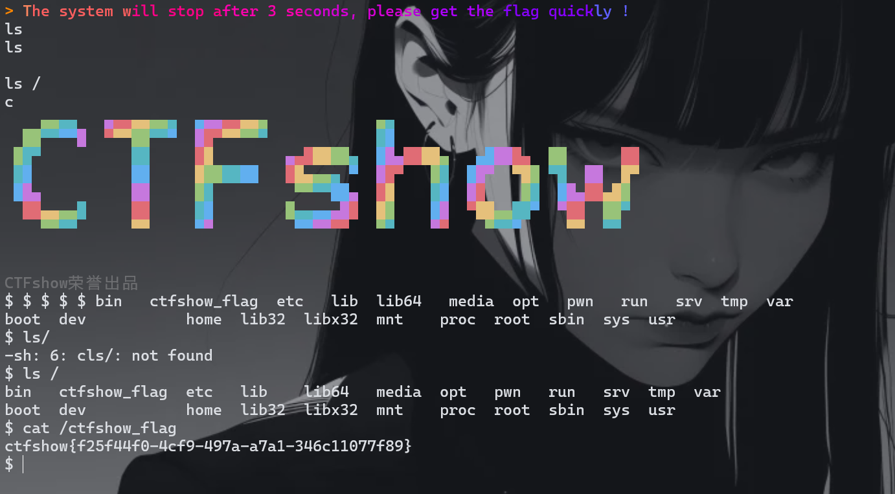
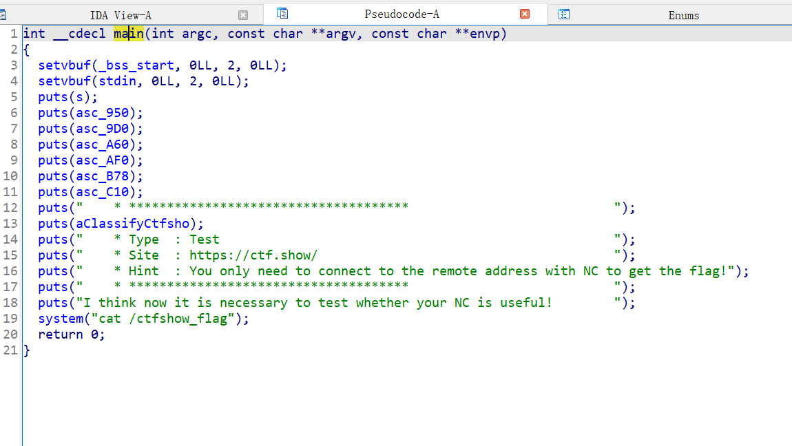
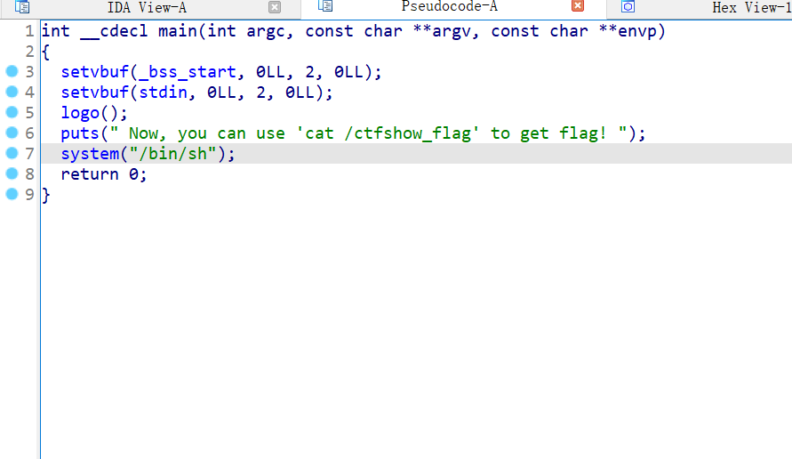
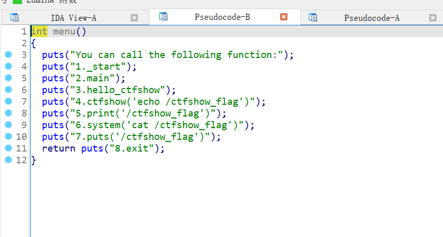
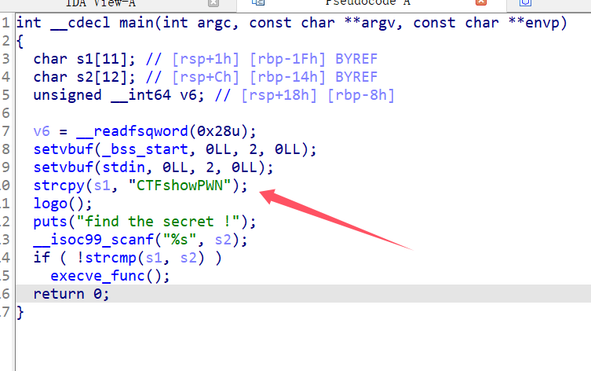

+++
title = "ctfshow_pwn"
slug = "ctfshow-pwn"
description = "买了个会员"
date = "2024-11-15T19:46:55"
lastmod = "2024-11-15T19:46:55"
image = ""
license = ""
categories = ["ctfshow"]
tags = ["pwn"]
+++

# 0x01 前言

听大菜鸡师傅说要涨价了，赶紧入手了一个会员，慢慢打吧，不想学web的时候就看一下

# 0x02 question

## Test_your_nc

### pwn0

盯着然后拿flag

### pwn1

这里就要用IDA了，找找教程，OK看不懂找不到。找的师傅们要的

F5跟进

不知道怎么搞的，乱按看到直接给flag，链接就好了

### pwn2

这是什么好像是直接给shell?，链接就有shell，RCE就可以了

### pwn3

这不就搞到了

### pwn4

输入就给shell

